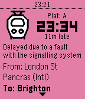
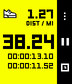
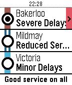

### All Things Pebble

⬅️ [Back to main](./README.md)

🕰️ [View Pebble Watchfaces](./Pebble-Watchfaces.md)

---

# Apps for Pebble

A community-curated directory of **open source watchapps** created for Pebble smartwatches.

### Please add your Pebble Apps to the directory!

This page aims to be a comprehensive directory of open source watchfaces created by the Pebble community, providing a helpful resource for developers to learn from and contribute to each other's work.

### Contribution Rules

Pebble Watchapps listed here must be:

- open source and listed on the Pebble or Rebble appstores.
- sorted alphabetically by Name (add your watchapp in the correct order)
- 'Name' should link to the app store listing
- 'Developer' should link to the Github repo (or other) containing the watchapp source code.
- A screenshot should be added to the `/images/watchfaces` folder. You can copy one from the app store listing. Use a Time 2 screenshot when possible.

# A

# P

| Screenshot | Name | Developer | Description
|------------|------|-----------|-----------|
|  | [PebbleRail](https://apps.rebble.io/en_US/application/67a8c311b5e348000915b07b) | [jcit](https://github.com/jccit/pebblerail) | View live UK train times from your Pebble! Powered by National Rail Enquiries. Built using PebbleKit.ts |

# S

| Screenshot | Name | Developer | Description
|------------|------|-----------|-----------|
|  | [Stopwatch+](https://apps.rebble.io/en_US/application/5822f80d34da21ff12000122) | [sunpazed](https://github.com/sunpazed/Pebble-Stopwatch-Plus) | An updated Stopwatch that tracks your running stats. Measure and track Distance and Pace - all without a companion app on your phone. |

# T

| Screenshot | Name | Developer | Description
|------------|------|-----------|-----------|
|  | [Tube Status](https://apps.rebble.io/en_US/application/529e8742d7894b189c000012) | [Chris Lewis](https://github.com/sunpazed/Pebble-Stopwatch-Plus) | An updated Stopwatch that tracks your running stats. Measure and track Distance and Pace - all without a companion app on your phone. |