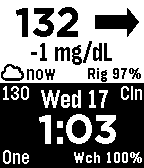
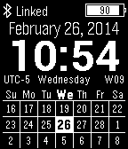

### All Things Pebble

⬅️ [Back to main](./README.md)

🧰 [View Pebble Apps](./Pebble-Watchapps.md)

---

# Watchfaces for Pebble

A community-curated directory of **open source watchfaces** created for Pebble smartwatches.

### Please add your Pebble Watchfaces to the directory!

This page aims to be a comprehensive directory of open source watchfaces created by the Pebble community, providing a helpful resource for developers to learn from and contribute to each other's work.

### Contribution Rules

Pebble Watchfaces listed here must be:

- open source and listed on the Pebble or Rebble appstores.
- sorted alphabetically by 'Name' (add your watchface in the correct order)
- 'Name' should link to the app store listing
- 'Developer' should link to the Github repo (or other) containing the watchapp source code.
- A screenshot should be added to the `/images/watchfaces` folder. You can copy one from the app store listing. Use a Time 2 screenshot when possible.

# A

# N

| Screenshot | Name | Developer | Description
|------------|------|-----------|-----------|
|  | [Nightscout](https://apps.rebble.io/en_US/application/543bfbbcecc29baad0000007) | [Nightscout Contributors](https://github.com/nightscout/cgm-pebble) | Display Nightscout data on your pebble watch. Support for mg/dL and mmol units. |

# T

| Screenshot | Name | Developer | Description
|------------|------|-----------|-----------|
|  | [Timely](https://apps.rebble.io/en_US/application/52978a53bbd0862701000002) | [Martin Norland @cynorg](https://github.com/cynorg/PebbleTimely) | Watch shows date and the time on the top, and a calendar with 3 (configurable) weeks days on the bottom, and weather next time. |