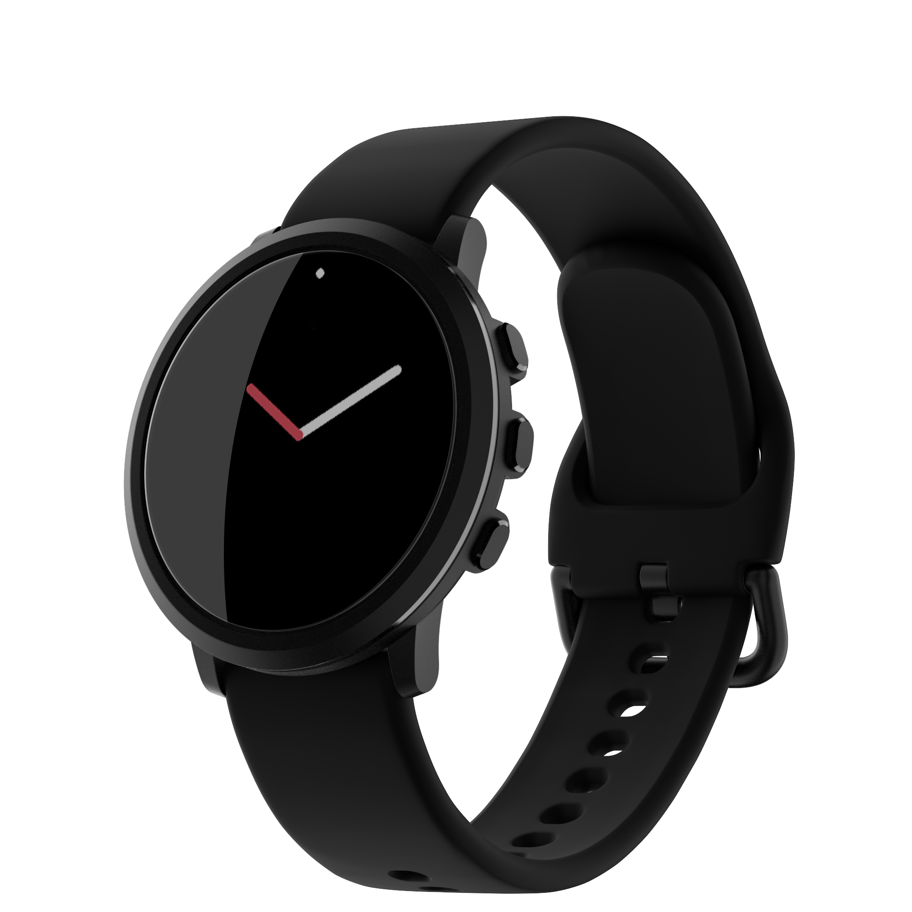
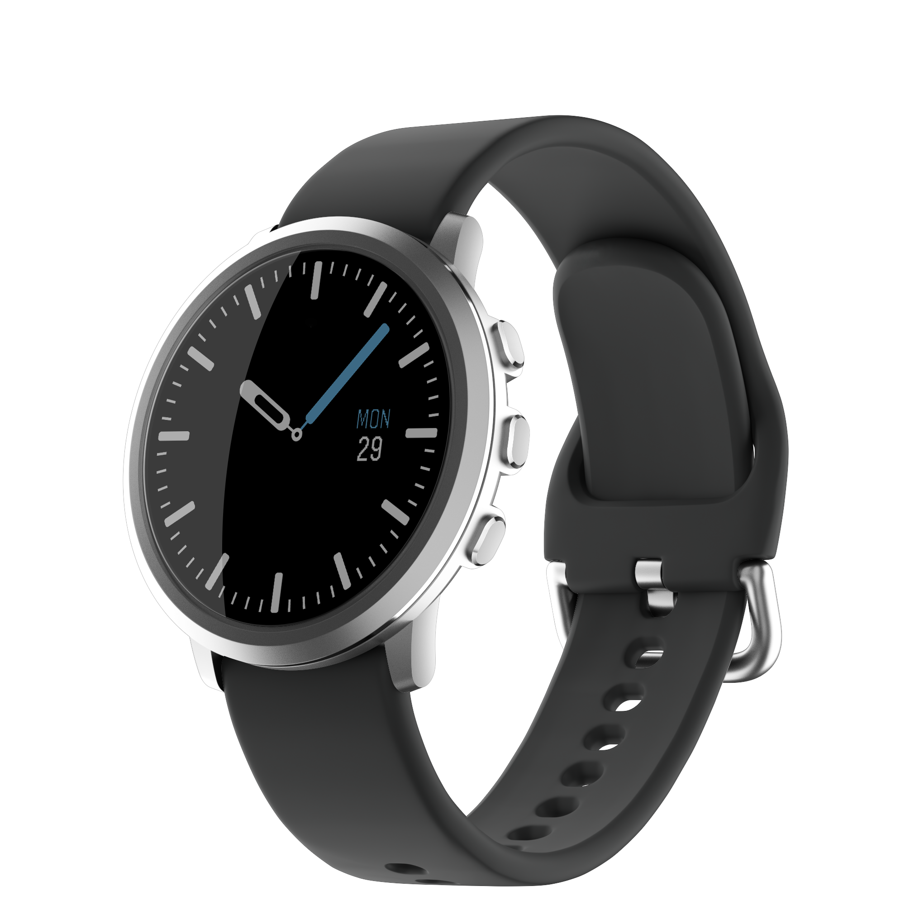
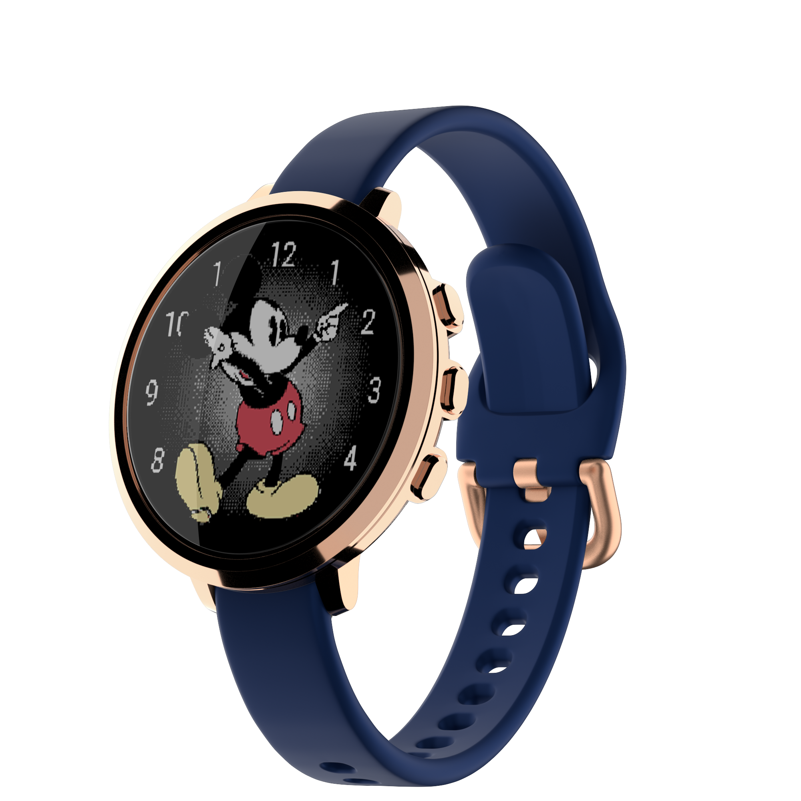
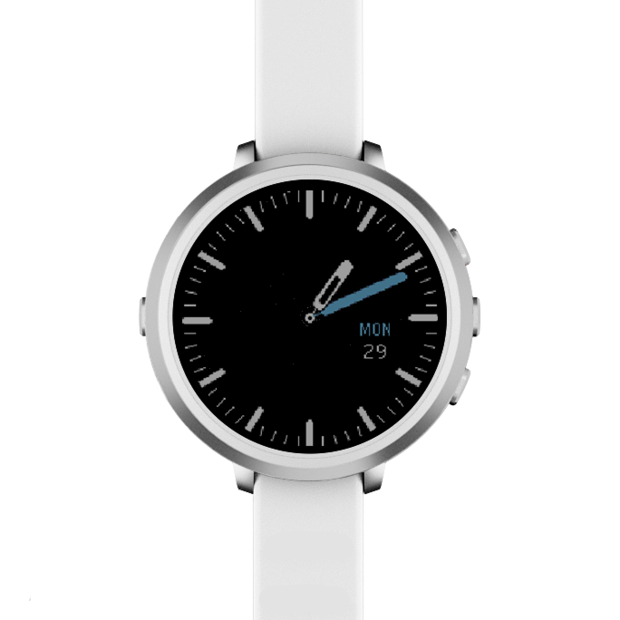
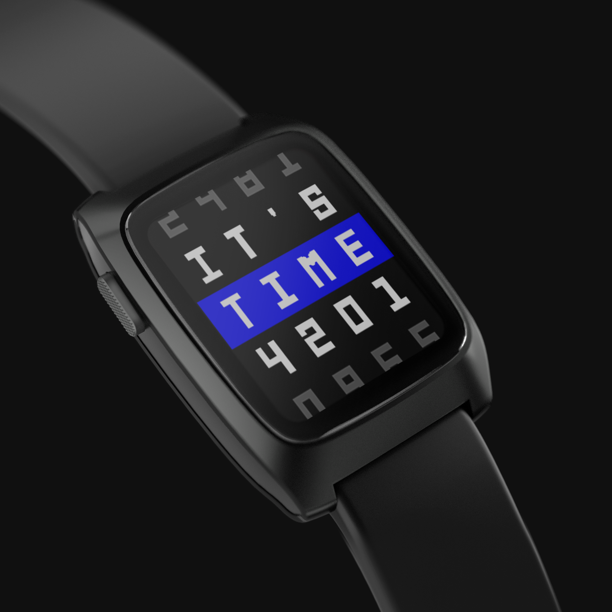
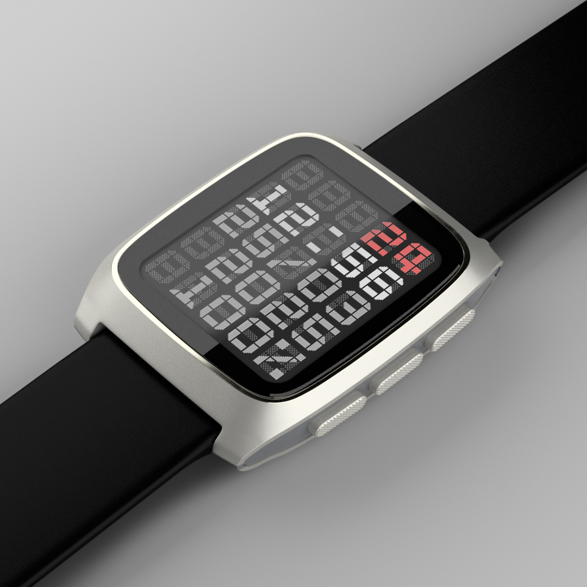
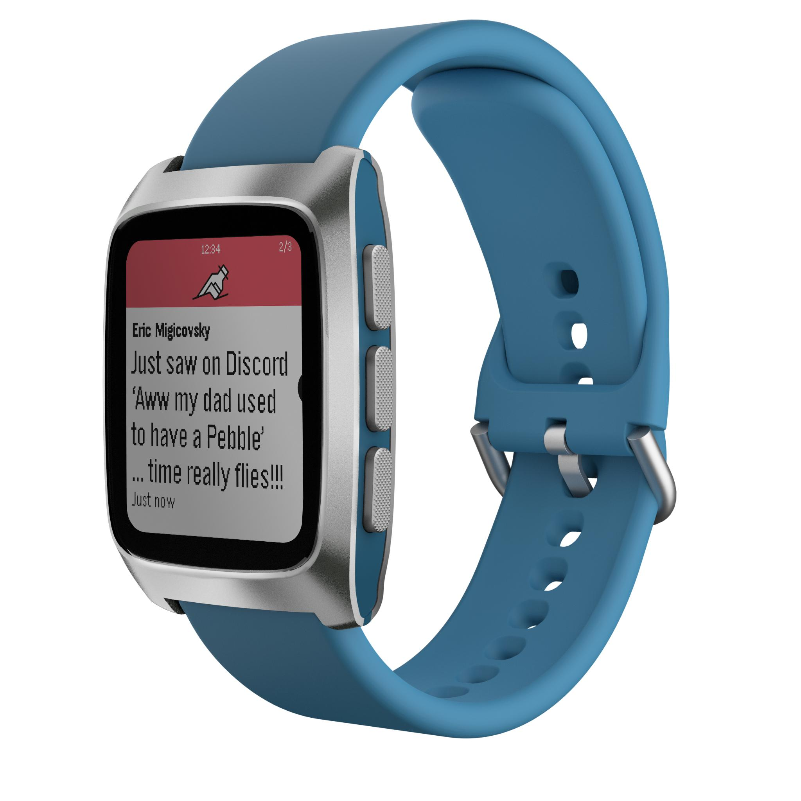
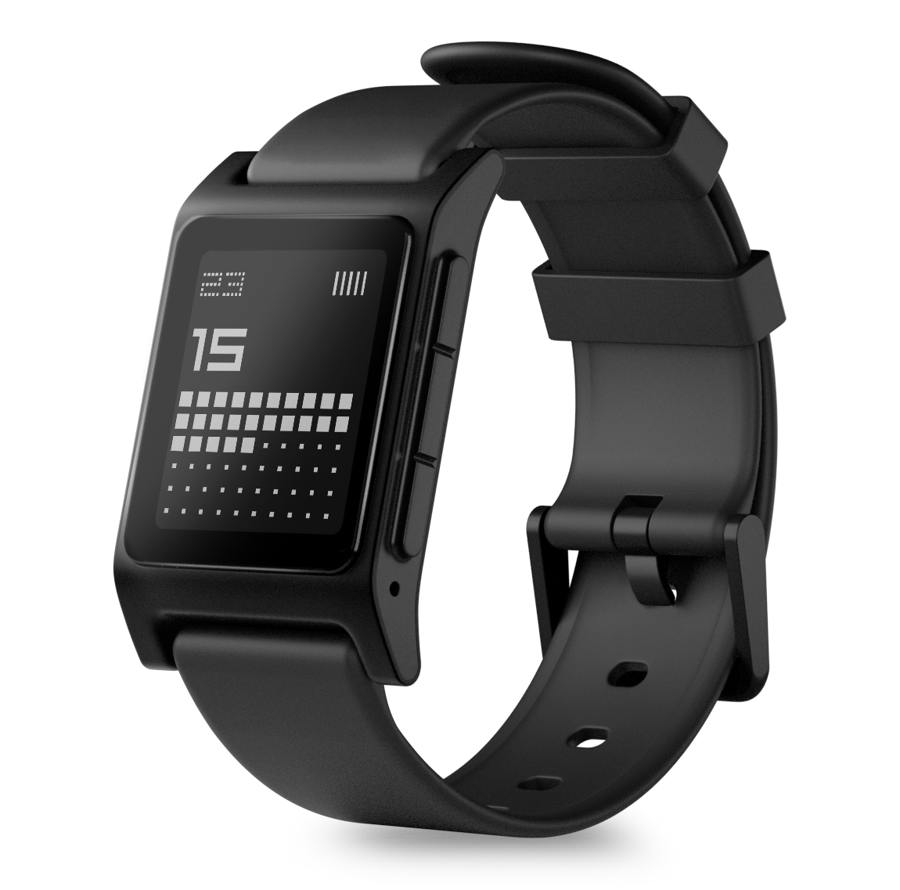
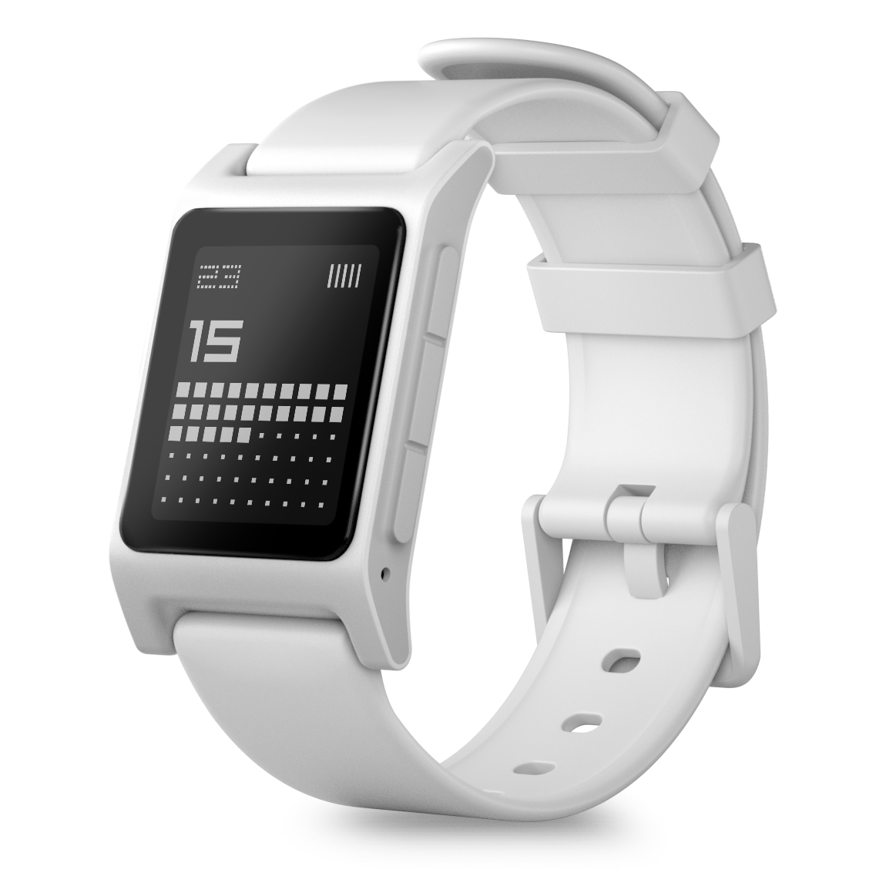

# All Things Pebble
A community-curated directory of all things related to Pebble smartwatches and and other devices based on PebbleOS.

Something missing? Please add it by making a PR!

# Core Devices LLC

Company founded in 2025 by Pebble founder Eric Migicovsky, with the purpose of building gadgets based on the open source PebbleOS. Owner of the "Pebble" trademark.

- [repebble.com](https://repebble.com/) - Core Devices official website selling new PebbleOS watches and other gadgets
- [Pebble Discussion Forum](https://forum.repebble.com/) - Core Devices Forum for Pebble discussion.
- [Service Status](https://status.repebble.com/) - Service status of the repebble.com website, Pebble app store and weather API.
- [Pebble appstore](https://apps.repebble.com/) - Web-based version of the Pebble appstore.

### Core Devices Products

- [Hardware Specs](https://developer.repebble.com/guides/tools-and-resources/hardware-information/) - Detailed hardware specs for all Pebble watches old and new.
- [Order Management](https://orders.repebble.com/) - Manage your Core Devices order.

### Pebble Round 2

Similar to the original Pebble Time Round, but with a larger display, touchscreen and longer battery.

| Model          | Colours         | Case          | Display |  Sensors       | Date | Price                                              |
|:--------------:|:----------------:|:---------------:|:---------:|:----------------:|:-----------:|:----------------------------------------------------:|
| Pebble Round 2  | `Matte Black 20mm` `Brushed Silver 14mm` `Brushed Silver 20mm` `Polished Rose Gold 14mm` | Stainless Steel | ePaper 1.3" 64-colour 260x260 pixels 202 DPI   | Touchscreen Mic (x2) HRM 6-axis IMU | Announced: 2025-12  Released: 2026-05 | \$225 [Buy](https://repebble.com/watch#p2d)  |

| Pebble Round 2 - Matte Black 20mm                              | Pebble Round 2 - Brushed Silver 20mm |
|----------------------------------------------------------------|-------------------------|
|  |   | 

| Pebble Round 2 - Polished Rose Gold 14mm                  | Pebble Round 2 - Brushed Silver 14mm |
|-----------------------------------------------------------|----------------------|
|  | 

### Pebble Time 2

Inspired by the unreleased Pebble Time 2 from 2016. Previously called the Core Time 2.

| Model          | Colours         | Case          | Display |  Sensors       | Date | Price                                              |
|----------------|:----------------:|:---------------:|:---------:|:----------------:|:-----------:|:----------------------------------------------------:|
| Pebble Time 2  | `Black/Grey` `Silver/Grey` `Black/Red` `Silver/Blue` | Stainless Steel | ePaper 1.3" 64-colour 200x228 pixels 200 DPI  | Touchscreen Microphone (x2) Speaker HRM 6-axis IMU Compass | Announced: 2025-01  Released: 2026-04 | \$225 [Buy](https://repebble.com/watch#p2d)  |

| Pebble Time 2 - Black/Grey                                  | Pebble Time 2 - Silver/Black |
|----------------------------------------------------------------|-------------------------|
|  |   | 

| Pebble Time 2 - Black/Red                            | Pebble Time 2 - Silver/Blue |
|-----------------------------------------------------------|----------------------|
|  | 

### Pebble 2 Duo

A do-over of the original Pebble 2 released in 2016. Previously called the Core 2 Duo.

| Model          | Colours         | Case          | Display |  Sensors       | Date | Price                                              |
|----------------|:----------------:|:---------------:|:---------:|:----------------:|:-----------:|:----------------------------------------------------:|
| Pebble 2 Duo   | `Black` `White` | Polycarbonate | ePaper 1.26" B/W 144x168 pixels 176 DPI     | Mic Speaker 6-axis IMU Compass Barometer | Announced: 2025-01  Released: 2025-09 | \$149 [Sold Out](https://repebble.com/watch#p2d) |

| Pebble 2 Duo Black                                       | Pebble 2 Duo White |
|------------------------------------------------------------|----------------------|
|   |  |

### Core Devices Developer Resources

- [Pebble Developer Website](https://developer.repebble.com/) - Pebble Developer website.
- [PebbleOS Emulator](https://ericmigi.github.io/pebble-qemu-wasm/) - Web-based PebbleOS emulator built by Eric Migicovsky with help from Claude Code. Source [here](https://github.com/ericmigi/pebble-qemu-wasm).
- [Pebble Appstore API](https://appstore-api.repebble.com/) - RESTful API for accessing Pebble watchfaces and apps.
- [Pebble Developer Dashboard](https://appstore-api.repebble.com/dashboard) - Upload your Pebble app or watchface.

### Core Devices Mobile App

- [Pebble Mobile App](https://repebble.com/app) - The official open-source mobile app for Pebble watches built by Core Devices available for Android & iOS.
- [Mobile App Change Log](https://ndocs.repebble.com/changelog)
- [Pebble 2 Duo Getting Started Guide](https://ndocs.repebble.com/getting-started)

### Core Devices News & Updates

- [Core Devices blog](https://repebble.com/blog) - Product news from Core Devices
- [Tick Talk w/ Eric Migicovsky](https://www.youtube.com/@TickTalk-with-Eric) - Podcast about Pebble, smartwatches, gadgets, startups and more with Eric Migicovsky, founder of Pebble.
- [ericmigi.com](https://ericmigi.com/) - Eric's personal blog.
- [@ericmigi.com Bluesky Account](https://bsky.app/profile/ericmigi.com) - Eric's personal Bluesky account.
- [@repebble.com Bluesky Account](https://bsky.app/profile/repebble.com) - Core Devices Bluesky account.
- [@pebble Twitter Account](https://twitter.com/pebble) - Official account on the website formerly known as Twitter.
- [@ericmigi Twitter Account](https://twitter.com/ericmigi) - Eric's personal account on the website formerly known as Twitter.

### Core Devices Github Repos

- [github.com/coredevices](https://github.com/coredevices) - Core Devices Github organization

| Repo |  &nbsp;&nbsp;Release&nbsp;&nbsp; | Issues | PRs | Desciption |
|------|:--------:|:------:|:---:|------------|
|[coredevices/ PebbleOS](https://github.com/coredevices/PebbleOS) |  |  |  | PebbleOS firmware used by Core Devices Pebble watches. Documentation site is [here](https://pebbleos-core.readthedocs.io/en/latest/). Changelog is [here](https://ndocs.repebble.com/pebbleos-changelog). |
|[coredevices/ mobileapp](https://github.com/coredevices/mobileapp) |  |  |  | Core Devices official mobile app based on libpebble3. |
|[coredevices/ sdk-docs](https://github.com/coredevices/sdk-docs) |  |  |  | Source for developer.repebble.com website. |
|[coredevices/ cloudpebble](https://github.com/coredevices/cloudpebble) |  |  |  | A web-based IDE for developing Pebble smartwatch applications. Write C or JavaScript, compile, and test on an in-browser emulator — all from the browser. |
|[coredevices/ pebble-tool](https://github.com/coredevices/pebble-tool) |  |  |  | The command-line tool for the Pebble SDK. |
|[coredevices/ qemu](https://github.com/coredevices/qemu) |  |  |  | Pebble Smartwatch QEMU Implementation. |
|[coredevices/ pebble-vscode](https://github.com/coredevices/pebble-vscode) |  |  |  | This extension provides a development environment for Pebble apps and watchfaces. Rather than running commands using the pebble CLI, you can access those via buttons in the VSCode interface. |
|[coredevices/ pblboot](https://github.com/coredevices/pblboot) |  |  |  | This repository contains the PebbleOS bootloader. |

# Rebble Alliance

A community organisation that formed after the demise of Pebble in 2016 helping to keep Pebble watches operational. Runs the [Rebble app store for Pebble](https://apps.rebble.io/) and [Rebble Web Services](https://auth.rebble.io/account/).

- [rebble.io](https://rebble.io/) - Rebble Alliance official website.
- [Rebble Discord Server](https://discordapp.com/invite/aRUAYFN) - The community Discord server for all things Pebble.
- [Rebble appstore](https://apps.rebble.io/) - Web-based version of the Rebble appstore. 
- [Rebble appstore (beta version)](https://store-beta.rebble.io) - Beta version of the new Rebble appstore.
- [Bobby](https://bobby.rebble.io/) - Rebble AI Assistant watchapp for Pebble watches.

### 👉 [Rebble Web Services](https://auth.rebble.io/account/)    👈

Subscribing to Rebble for just $3/month enables dictation, and weather support (and faster timeline sync) on your account, and helps keep the service running for everyone.

### Rebble News & Updates

- [rebble.io blog](https://rebble.io/) - News and announcements from the Rebble Alliance.
- [@rebble.io Bluesky Account](https://bsky.app/profile/rebble.io) - Official Rebble account on Bluesky.
- [@rebble Mastodon Account](https://mastodon.social/@rebble) - Official Rebble account on Mastodon.
- [@pebble-dev Twitter Account](https://twitter.com/pebble_dev/) - Official Rebble account on the website formerly known as Twitter.
- [Pebble Community Events](https://github.com/pebble-dev/rebble-events) - Stay informed of upcoming Pebble Community events. Submit new events [here](https://github.com/pebble-dev/rebble-events).

### Rebble Developer Resources

- [Rebble Developer Website](https://developer.rebble.io/) - Developer website hosted by Rebble. 
- [Rebble Dev Forum](https://forum.rebble.io/) - Rebble Developer Forum
- [Rebble Developer Portal](https://dev-portal.rebble.io/) - Publish watchapps and watchfaces to the Rebble app store.
- [Rebble Clay (npm)](https://www.npmjs.com/package/@rebble/clay) - Clay is a JavaScript library that makes it easy to add offline configuration pages to your Pebble apps. All you need to get started is a couple lines of JavaScript and a JSON file; no servers or HTML required.
- [Linked List (npm)](https://www.npmjs.com/package/@rebble/linked-list) - A simple linked list implementation for Pebble apps and watchfaces.

### Rebble Github Repos

- [github.com/pebble-dev](https://github.com/pebble-dev) - Rebble Alliance Github organization

#### Development

| Repo |  &nbsp;&nbsp;Release&nbsp;&nbsp; | Issues | PRs | Desciption |
|------|:--------:|:------:|:---:|------------|
|[pebble-dev/ pebble-firmware](https://github.com/pebble-dev/pebble-firmware) |  |  |  | Codebase for firmware that runs on Pebble smartwatches. Documentation site is [here](https://pebbleos.readthedocs.io/en/latest/index.html). |
|[pebble-dev/ clay](https://github.com/pebble-dev/clay) |  |  |  | Clay is a JavaScript library that makes it easy to add offline configuration pages to your Pebble apps. All you need to get started is a couple lines of JavaScript and a JSON file; no servers or HTML required. |
|[pebble-dev/ pebble-sdk-rfc](https://github.com/pebble-dev/pebble-sdk-rfc) |  |  |  | As PebbleOS grows, we'll need all kinds of new APIs to support new hardware -- and it'll be important to make sure that the syscall numbers line up between different branches of PebbleOS. This repository is an issue repository for both API requests (more general, "would be nice") and specific proposals for syscall API surface to add to PebbleOS for community input before they are permanently committed to the PebbleOS API surface. |
|[pebble-dev/ PebbleKitAndroid2](https://github.com/pebble-dev/PebbleKitAndroid2) |  |  |  | A work-in-progress implementation of the new modern PebbleKit API for communication between phone companion apps and the watchapps on the Pebble-OS running watches Based on [this design document](https://docs.google.com/document/d/1BcX7W9HEBays5puwcRQh1GzClyHc014IRzEIuk7lLuk). |
|[pebble-dev/ libpebble2](https://github.com/pebble-dev/libpebble2) |  |  |  | libpebble2 is a python library for interacting with Pebble devices. |
|[pebble-dev/ pebble.nix](https://github.com/pebble-dev/pebble.nix) |  |  |  | A collection of tools for setting up Pebble app development environments, and building Pebble apps/watchfaces, using [Nix](https://nixos.org/). |
|[pebble-dev/ linked-list](https://github.com/pebble-dev/linked-list) |  |  |  | A simple linked list implementation for Pebble apps and watchfaces. |
|[pebble-dev/ sdk-c-utils](https://github.com/pebble-dev/sdk-c-utils) |  |  |  | A small collection of C macros that make developing Pebble apps a little simpler. |
|[pebble-dev/ legacy-firmware-patcher](https://github.com/pebble-dev/legacy-firmware-patcher) |  |  |  | Tool to patch firmwares from original Pebble Technology Corp watches into the future. |

#### Artwork
| &nbsp;&nbsp;&nbsp;&nbsp;&nbsp;&nbsp;&nbsp;&nbsp;&nbsp;Repo&nbsp;&nbsp;&nbsp;&nbsp;&nbsp;&nbsp;&nbsp; |  &nbsp;&nbsp;Release&nbsp;&nbsp; | Issues | PRs | Desciption |
|------|:--------:|:------:|:---:|------------|
|[pebble-dev/ iconography](https://github.com/pebble-dev/iconography) |  |  |  | Pebble-style icons from the original Pebble Firmware and the Rebble community. Contains icons used by the Core Devices Pebble firmware for notifications etc. |
|[pebble-dev/ rebble-emojis](https://github.com/pebble-dev/rebble-emojis) |  |  |  | Community made emojis |

#### Websites

| &nbsp;&nbsp;&nbsp;&nbsp;&nbsp;&nbsp;&nbsp;&nbsp;&nbsp;Repo&nbsp;&nbsp;&nbsp;&nbsp;&nbsp;&nbsp;&nbsp; |  &nbsp;&nbsp;Release&nbsp;&nbsp; | Issues | PRs | Desciption |
|------|:--------:|:------:|:---:|------------|
|[pebble-dev/ developer.rebble.io](https://github.com/pebble-dev/developer.rebble.io) |  |  |  | Repo for the [Rebble Developer Website](https://developer.rebble.io/)  |
|[pebble-dev/ rebble-events](https://github.com/pebble-dev/rebble-events]) |  |  |  | Submit new [Pebble Community Events](https://developer.rebble.io/community/events/).  |
|[pebble-dev/ pebble-dev.github.io](https://github.com/pebble-dev/pebble-dev.github.io) |  |  |  | Repo for the [rebble.io](https://rebble.io) website.  |

#### microPebble

| &nbsp;&nbsp;&nbsp;&nbsp;&nbsp;&nbsp;&nbsp;&nbsp;&nbsp;&nbsp;&nbsp;Repo&nbsp;&nbsp;&nbsp;&nbsp;&nbsp;&nbsp;&nbsp;&nbsp;&nbsp;&nbsp;&nbsp;&nbsp;&nbsp; |  &nbsp;&nbsp;Release&nbsp;&nbsp; | Issues | PRs | Desciption |
|------|:--------:|:------:|:---:|------------|
|[pebble-dev/ micropebble-ios-poc](https://github.com/pebble-dev/micropebble-ios-poc) |  |  |  | A small scrappy open source Pebble companion app, based on the libpebble3. This is a Kotlin Multiplatform (KMP) project supporting both Android and iOS.  |
|[pebble-dev/ micropebble-ios-poc-kotlin-speex](https://github.com/pebble-dev/micropebble-ios-poc-kotlin-speex) |  |  |  | Kotlin multiplatform library for speex decoding.  |
|[pebble-dev/ micropebble-ios-poc-libpebble3](https://github.com/pebble-dev/micropebble-ios-poc-libpebble3) |  |  |  | libpebble3 is a kotlin multiplatform library for interacting with Pebble devices. It is designed to do everything that a Pebble/Core watch companion app needs to do, except for the UI and specific web services.  |

#### Rebble Web Services

| &nbsp;&nbsp;&nbsp;&nbsp;&nbsp;&nbsp;&nbsp;&nbsp;Repo&nbsp;&nbsp;&nbsp;&nbsp;&nbsp;&nbsp;&nbsp;&nbsp; |  &nbsp;&nbsp;Release&nbsp;&nbsp; | Issues | PRs | Desciption |
|------|:--------:|:------:|:---:|------------|
|[pebble-dev/ rebble-prod-infra-gke](https://github.com/pebble-dev/rebble-prod-infra-gke) |  |  |  | GKE infrastructure, as used in production.  |
|[pebble-dev/ rebble-appstore-api](https://github.com/pebble-dev/rebble-appstore-api) |  |  |  | A reimplementation of Pebble's original api2/appstore-api. Used by the Rebble appstore. |
|[pebble-dev/ rebble-dev-portal](https://github.com/pebble-dev/rebble-dev-portal) |  |  |  | The developer portal for submitting apps to the Rebble appstore. |
|[pebble-dev/ rebble-timeline-sync](https://github.com/pebble-dev/rebble-timeline-sync) |  |  |  | timeline-sync.rebble.io |
|[pebble-dev/ pebble-appstore-legacy](https://github.com/pebble-dev/pebble-appstore-legacy) |  |  |  | This repo contains the old apps.getpebble.com SPA, modified for Rebble. |
|[pebble-dev/ rebble-auth-py](https://github.com/pebble-dev/rebble-auth-py) |  |  |  | auth.rebble.io |

#### Bobby

| &nbsp;&nbsp;&nbsp;&nbsp;&nbsp;&nbsp;&nbsp;&nbsp;&nbsp;Repo&nbsp;&nbsp;&nbsp;&nbsp;&nbsp;&nbsp;&nbsp; |  &nbsp;&nbsp;Release&nbsp;&nbsp; | Issues | PRs | Desciption |
|------|:--------:|:------:|:---:|------------|
|[pebble-dev/ bobby-assistant](https://github.com/pebble-dev/bobby-assistant) |  |  |  | Bobby is an AI voice assistant for Pebble, powered by Large Language Models. |
|[pebble-dev/ bobby-website](https://github.com/pebble-dev/bobby-website) |  |  |  | [Website](https://bobby.rebble.io/) for Bobby. |

# Pebble Technology Corporation

The original company founded by Eric Migicovsky that existed from 2012-2016 when it went out of business and its assets were sold to Fitbit (later Google).

- [github.com/pebble](https://github.com/pebble) - Pebble Technology Corporation Github organization
- [aveao/PebbleArchive](https://github.com/aveao/PebbleArchive) - Archives of various Pebble related files (as Pebble Technology Corp went bankrupt)
- [Original Pebble - Kickstarter Campaign (2012)](https://www.kickstarter.com/projects/getpebble/pebble-e-paper-watch-for-iphone-and-android) - Kickstarter page for the first Pebble watch.
- [Pebble 2, Time 2 & Pebble Core - Kickstarter Campaign (2016)](https://www.kickstarter.com/projects/getpebble/pebble-2-time-2-and-core-an-entirely-new-3g-ultra) - Kickstarter page for the Pebble 2/2HR, the original Pebble Time 2, and Pebble Core. Only the Pebble 2/2HR was released, before the company went out of business. 
- [google/pebble](https://github.com/google/pebble) - Repo containing the original open source release of PebbleOS by Google in January 2025.
- [Success and Failure at Pebble](https://ericmigi.com/blog/success-and-failure-at-pebble/) - Eric Migicovsky's blog post on why Pebble failed.

# Watchfaces & Watchapps

- A directory of **open source watchfaces** created for Pebble is [here](./Pebble-Watchfaces.md).

- A directory of **open source watchapps** created for Pebble is is [here](./Pebble-Watchapps.md).

# Other Pebble Resources

## Community

- [r/Pebble](https://www.reddit.com/r/pebble/) - Pebble community sub-reddit.
- [r/PebbleDevelopers](https://www.reddit.com/r/pebbledevelopers/) - Pebble community sub-reddit for developers.

## Art & Design

- [pdc_tool CLI](https://github.com/HBehrens/pdc_tool) - A command-line interface for working with Pebble Draw Command (PDC) files by [@HBehrens](https://github.com/HBehrens)
- [pdc_tool web viewer](https://pdc-tool.heikobehrens.com) - Web-based tool for previewing SVG/PDC files by [@HBehrens](https://github.com/HBehrens)
- [Inkscape PDC Preview Plugins](https://github.com/hellcp/inkscape-pdc-exporter) - Inkscape plugins to preview an SVG as it will look on a Pebble watch, as well as exporting as pdc. Created by [@hellcp](https://github.com/hellcp/). Requires pdc_tool.

## Development

- [PebbleKit.ts](https://github.com/jccit/PebbleKit.ts) - A modern Pebble app boilerplate using TypeScript by [@jccit](https://github.com/jccit)
- [microPebble](https://github.com/matejdro/microPebble) - An open source Pebble companion app based on the libpebble3 by [@matejdro](https://github.com/matejdro).
- [Better Pebble Emulator](https://github.com/only-meeps/Better-Pebble-Emulator) - A Pebble emulator for Ubuntu and Debian.
- [PebbleGL](https://github.com/mhungerford/PebbleGL) - OpenGL for Pebble. Uses minimal OpenGL engine (miniGL) for rendering a 3D world on the Pebble Smartwatch.

## Localization

- [Crowdin PebbleOS Translation](https://crowdin.com/project/pebbleos) - Help translate PebbleOS into different languages.

## Education

- [Learning C with Pebble (2016 Edition)](https://pebble.gitbooks.io/learning-c-with-pebble/content/) - Original eBook created by Mike Jipping and others.
- [Nivx78 Pebble Tutorials](https://nivz78.wordpress.com/2016/10/24/introduction/) - Pebble tutorials created in 2016 (Incomplete)
