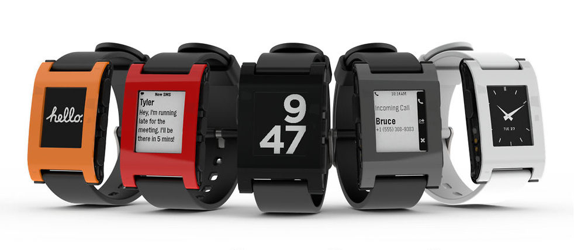
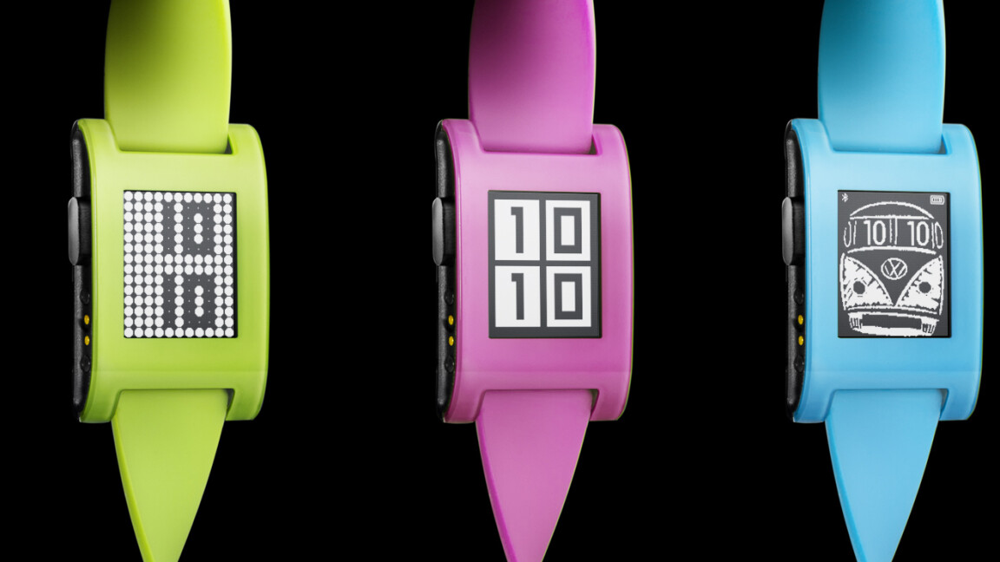

# Pebble Technology Corporation

The original company founded by Eric Migicovsky that existed from 2012-2016 when it went out of business and its assets were sold to Fitbit (later Google).

## Kickstarter Campaigns

- [Original Pebble - Kickstarter Campaign (2012)](https://www.kickstarter.com/projects/getpebble/pebble-e-paper-watch-for-iphone-and-android) - Kickstarter page for the original Pebble smartwatch.
- [Pebble Time - Kickstarter Campaign (2015)](https://www.kickstarter.com/projects/getpebble/pebble-time-awesome-smartwatch-no-compromises) - Kickstarter campaign for the Pebble Time and Pebble Time Steel.
- [Pebble 2, Time 2 & Pebble Core - Kickstarter Campaign (2016)](https://www.kickstarter.com/projects/getpebble/pebble-2-time-2-and-core-an-entirely-new-3g-ultra) - Kickstarter campaign for the Pebble 2/2HR, the original Pebble Time 2, and Pebble Core. Only the Pebble 2/2HR was released, before the company went out of business. 

## News & Articles

- 2022-04: [Success and Failure at Pebble (ericmigi.com)](https://ericmigi.com/blog/success-and-failure-at-pebble/) - A deep, candid post by Pebble’s founder looking back at the company’s journey, strategic missteps, and how they ran out of money despite early success.
- 2020-08: [What happened to Pebble? (Slidebean)](https://slidebean.com/story/what-happened-to-pebble-smartwatch) — A narrative overview of the company’s lifecycle with commentary on pivotal decisions and external challenges.
- 2016-12: [How the hot startup that stole Apple's thunder wound up in Silicon Valley's graveyard (Business Insider)](https://www.businessinsider.com/how-smartwatch-pioneer-pebble-lost-everything-2016-12) — Focuses on the tumultuous final year at Pebble: declining sales, supplier issues, failed acquisition talks, and the market realities that hurt the business.
- 2016-12: [The Inside Story Behind Pebble’s Demise (Wired)](https://www.wired.com/2016/12/the-inside-story-behind-pebbles-demise/) — A narrative account from Wired about Pebble’s rise and fall, the competitive pressures it faced, and its eventual sale to Fitbit.
- 2014-08: [Pebble Fresh, Hot and Fly Limited Edition Smartwatches Land (Slashgear)](https://www.slashgear.com/pebble-fresh-hot-and-fly-limited-edition-smartwatches-land-05339869/) - Post on the release of the limited edition Pebble originals.

## Resources

- [github.com/pebble](https://github.com/pebble) - Pebble Technology Corporation Github organization
- [aveao/PebbleArchive](https://github.com/aveao/PebbleArchive) - Archives of various Pebble related files (as Pebble Technology Corp went bankrupt)
- [google/pebble](https://github.com/google/pebble) - Repo containing the original open source release of PebbleOS by Google in January 2025.
- [bmacphail/pebblefw](https://github.com/bmacphail/pebblefw) - The ultimate Pebble smartwatch firmware archive.
- [astosia/CAD](https://github.com/astosia/CAD) - CAD files for various pebble-related models, including Pebble 2 replacement buttons, Pebble charging docks, and Pebble 2 case bumpers.
- [Pebble Teadown (iFixit)](https://www.ifixit.com/Teardown/Pebble+Teardown/13319) - Teardown of the original Pebble. Summary [here](https://www.ifixit.com/News/4360/pebble-teardown).
- [Cracking Open the Pebble Steel](https://www.techrepublic.com/pictures/cracking-open-the-pebble-steel/)

## Replacement Parts

- [Pebble 2 Replacement Buttons](https://www.printables.com/model/653701-pebble-2-smartwatch-flexible-replacement-buttons/)
- [Favorite Human Design](https://favouritehumandesign.com/product-category/pebble/) - Replacement buttons and cases for the Pebble 2 and Pebble 2 Duo, and other Pebble spare parts from @astosia

## Repair Guides

- [Pebble Smartwatch Repair (iFixit)](https://www.ifixit.com/Device/Pebble_Smartwatch)
- [Replace a Battery in a Pebble Watch: Step-by-Step Guide for Pebble Time and Steel](https://thebatterytips.com/battery-specifications/can-you-replace-a-battery-in-a-pebble-watch/)
- [Sharp Memory LCD Leak Recovery](https://www.instructables.com/SHARP-Memory-LCD-Leak-Recovery/) - Repair a leaking memory LCD display.

## Products

- [Hardware Specs](https://developer.repebble.com/guides/tools-and-resources/hardware-information/) - Detailed hardware specs for all Pebble watches old and new.

### Pebble Time Round (2015)

The thinnest and lightest Pebble, with a round colour e-paper display. Available in two sizes (14mm and 20mm bands). Splash resistant only (not for swimming).

| Model          | Colours         | Materials          | Display |  Sensors       | Date | Price                                              |
|:--------------:|:----------------:|:---------------:|:---------:|:----------------:|:-----------:|:----------------------------------------------------:|
| Pebble Time Round | 1.&nbsp;`Black 20mm` 2.&nbsp;`Silver 20mm` 3.&nbsp;`Silver 14mm` 4.&nbsp;`Rose Gold 14mm` | Case: Stainless Steel  Thickness: 7.5mm | ePaper 1.0" round 64-colour 180x180 px 182 DPI | Microphone Accelerometer Compass Ambient light | Announced: 2015-09  Released: 2015-11 | $249 (+$50 for metal band) |

### Pebble Time Steel (2015)

Premium stainless steel version of the Pebble Time, with up to 10 days battery life. Launched as a stretch option of the Pebble Time Kickstarter campaign.

| Model          | Colours         | Materials          | Display |  Sensors       | Date | Price                                              |
|:--------------:|:----------------:|:---------------:|:---------:|:----------------:|:-----------:|:----------------------------------------------------:|
| Pebble Time Steel | 1.&nbsp;`Silver` 2.&nbsp;`Black` 3.&nbsp;`Gold`  (Includes 2 straps -  leather and matching metal.) | Case: Stainless Steel  Lens: Corning Gorilla Glass | ePaper 1.25" 64-colour 144x168 px 182 DPI | Microphone Accelerometer Compass Ambient light | Announced: 2015-03  Released: 2015-07 | $299 (Kickstarter: $250) [Kickstarter](https://www.kickstarter.com/projects/getpebble/pebble-time-awesome-smartwatch-no-compromises) |

### Pebble Time (2015)

The first Pebble with a colour e-paper display and a microphone, and the debut of the Timeline interface. Up to 7 days battery life.

| Model          | Colours         | Materials          | Display |  Sensors       | Date | Price                                              |
|:--------------:|:----------------:|:---------------:|:---------:|:----------------:|:-----------:|:----------------------------------------------------:|
| Pebble Time | 1.&nbsp;`Black` 2.&nbsp;`White` 3.&nbsp;`Red` | Case: Polycarbonate with stainless steel bezel  Lens: Corning Gorilla Glass | ePaper 1.25" 64-colour 144x168 px 182 DPI | Microphone Accelerometer Compass Ambient light | Announced: 2015-02  Released: 2015-05 | $199 (Kickstarter: $159/$179) [Kickstarter](https://www.kickstarter.com/projects/getpebble/pebble-time-awesome-smartwatch-no-compromises) |

### Pebble Steel (2014)

The same specs as the original Pebble watch, but in a premium steel case.

| Model          | Colours         | Materials          | Display |  Sensors       | Date | Price                                              |
|:--------------:|:----------------:|:---------------:|:---------:|:----------------:|:-----------:|:----------------------------------------------------:|
| Pebble Steel  | 1.&nbsp;`Black Matte` 2.&nbsp;`Brushed Stainless`  (Includes 2 straps -  matching metal and black leather.) | Case: Stainless Steel  Lens: Corning Gorilla Glass | ePaper 1.26" B/W 144x168 px 175 DPI   | Accelerometer Compass | Announced: 2014-01  Released: 2014-01 | $249 [Announcement](https://www.kickstarter.com/projects/getpebble/pebble-e-paper-watch-for-iphone-and-android/posts/712443)  |

| Pebble Steel Matte Black, Brushed Steel                              |
|:----------------------------------------------------------------:|
|   | 

### Pebble (2012)

The original Pebble watch. Released via a very successful [Kickstarter Campaign](https://www.kickstarter.com/projects/getpebble/pebble-e-paper-watch-for-iphone-and-android).

| Model          | Colours         | Materials          | Display |  Sensors       | Date | Price                                              |
|:--------------:|:----------------:|:---------------:|:---------:|:----------------:|:-----------:|:----------------------------------------------------:|
| Pebble (Classic)  | 1.&nbsp;`Jet Black` 2.&nbsp;`Arctic White` 3.&nbsp;`Cherry Red` 4.&nbsp;`Orange` 5. `Grey`  Limited Editions: 6.&nbsp;`Fresh Green` 7.&nbsp;`Neon Pink` 8.&nbsp;`Fly Blue` | Case: Polycarbonate  Lens: Polycarbonate  | ePaper 1.26" B/W 144x168 px 175 DPI   | Accelerometer Compass | Announced: 2012-04  Released: 2013-01 | $125 (Early Bird: $99/$115) [Kickstarter](https://www.kickstarter.com/projects/getpebble/pebble-e-paper-watch-for-iphone-and-android/description)  |

| Pebble (Classic) Orange, Cherry Red, Jet Black, Grey, Arctic White                              |
|:----------------------------------------------------------------:|
|   | 

| Pebble (Classic) - Limited Editions Fresh Green, Neon Pink, Fly Blue                              |
|:----------------------------------------------------------------:|
|   | 
