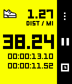

# Apps for Pebble

A directory of **open source watchapps** for Pebble smartwatches, to help developers learn from and build on each other's work.

Each entry links to the app on the [Pebble App Store](https://apps.repebble.com/) and to its source code.

## How this list is made

The list below is generated automatically from the Pebble App Store. It includes every watchapp whose developer has published a link to its source code, and is refreshed every week.

- **Is your open source app missing?** Add a link to your source code in the [Pebble Developer Dashboard](https://appstore-api.repebble.com/dashboard) and it will appear here at the next update.
- **Not in the app store?** Add it by hand to the section below with a pull request.

## Not in the App Store

Open source watchapps that aren't in the app store, or that don't list their source code there. Add new entries in alphabetical order.

| Screenshot | Name | Developer | Description |
|------------|------|-----------|-------------|
| { width="72" } | [Stopwatch+](https://apps.repebble.com/5822f80d34da21ff12000122) | [sunpazed](https://github.com/sunpazed/Pebble-Stopwatch-Plus) | An updated Stopwatch that tracks your running stats. Measure and track Distance and Pace - all without a companion app on your phone. |

<!-- BEGIN GENERATED: do not edit by hand, run scripts/update_app_directory.py -->

*The list is being generated. Check back shortly.*

<!-- END GENERATED -->
