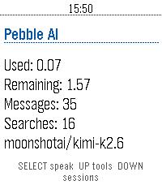

<!-- Generated by scripts/update_app_directory.py: do not edit by hand -->
# Watchapps: A

[← About this list](../watchapps.md) · **A** · [B](b.md) · [C](c.md) · [D](d.md) · [E](e.md) · [F](f.md) · [G](g.md) · [H](h.md) · [I](i.md) · [J](j.md) · [K](k.md) · [L](l.md) · [M](m.md) · [N](n.md) · [O](o.md) · [P](p.md) · [Q](q.md) · [R](r.md) · [S](s.md) · [T](t.md) · [U](u.md) · [V](v.md) · [W](w.md) · [X](x.md) · [Y](y.md) · [Z](z.md) · [0–9 & other](other.md)

*54 watchapps · Last updated 2026-10-06*

| Screenshot | Name | Developer | Licence | Updated | Description |
|------------|------|-----------|---------|---------|-------------|
| { loading=lazy width="72" } | [A Micro Western](https://apps.repebble.com/53f10a4f7f7f1f7b6d000009) | [S.Donal Creative](https://github.com/Ruirize/pebble-a-micro-western/) | <small>Not checked yet</small> | 2015-06-09 | Enter "A Micro Western"! A fun, simple reaction game. Press SELECT to draw and shoot! Features 20 levels of difficulty, from slow loras to cheetah. Your… |
| { loading=lazy width="72" } | [A Note](https://apps.repebble.com/57542c56d694500794000006) | [Fahrstuhl](https://github.com/fahrstuhl/ANote) | <small>Not checked yet</small> | 2026-08-01 | It's just A Note on your wrist: The simplest note app I could come up with. Write or paste a note in the settings page, maybe choose a font size and read it… |
| { loading=lazy width="72" } | [A Smarter Watch](https://apps.repebble.com/534c7a4b5193a46a70000015) | [A Smarter Pebble](https://github.com/l2blackbelt/smarterPebble/tree/master) | <small>Not checked yet</small> | 2014-04-22 | HackIllinois 2014! Combines the weather and real-time CUMTD tracking into a super-powered watch face. Fast, efficient, intuitive; A Smarter Pebble. This… |
| { loading=lazy width="72" } | [aare](https://apps.repebble.com/576ff6e8ba2fe50eb000018a) | [Cheese](https://github.com/cheesenoc/aare) | <small>Not checked yet</small> | 2016-06-26 | Simply displays the current water temperature of Switzerland’s most beautiful river. Uses data from BAFU via aare.schwumm.ch. |
| { loading=lazy width="72" } | [AarePebble](https://apps.repebble.com/e00d8d855af1485ea97922f5) | [Marcel Kessler](https://github.com/cheesenoc/aarepebble) | <small>Not checked yet</small> | 2026-04-13 | Displays the temperature of the Aare River in Bern, Switzerland |
| { loading=lazy width="72" } | [Abfahrt! - Departure Times](https://apps.repebble.com/6976767bae32660009f7c272) | [Riles](https://api.abfahrt.now) | <small>See source</small> | 2026-04-03 | Real-time departures across Europe. Supported by Pebble! Supports 25 countries with 101+ cities - check full coverage at: https://riles.tech/coverage/… |
| { loading=lazy width="72" } | [Abs Plank](https://apps.repebble.com/532cf96daadf559ae3000085) | [zeerd](https://github.com/zeerd/pebble_abs_plank) | <small>Not checked yet</small> | 2014-04-06 | This app guides you through a plank exercise workout to build your abs. The plank is one of the best exercises to strengthen your core, which is more than… |
| { loading=lazy width="72" } | [ACbus](https://apps.repebble.com/5612584fce7b4cec6b000073) | [Cavemen](https://github.com/asplendidday/ACbus) | <small>Not checked yet</small> | 2015-12-27 | Gives bus schedule info for the ASEAG bus network (Aachen, Germany region). Functionality: - Shows up to 21 next buses (7 per page) - Use up/down buttons to… |
| { loading=lazy width="72" } | [Accelerometer](https://apps.repebble.com/54579b9c34f53e93c6000067) | [Afonso Santos](https://github.com/reciprocum/Pebble-SDK4-WatchApp-Accelerometer) | <small>Not checked yet</small> | 2017-01-25 | A real-time, auto-scrolling auto-scalling accelerometer readings plotter Buttons: - SELECT: toggle the axis (X/Y/Z) being plotted. - (2x) UP/DOWN: (jump)… |
| { loading=lazy width="72" } | [Aces Up](https://apps.repebble.com/5595ea6b8564621791000090) | [Simon Hadenius](https://github.com/skimm3/Pebble-AcesUp) | <small>Not checked yet</small> | 2015-09-19 | Aces Up is a solitaire card game for Pebble. The simple gameplay makes the game perfect on the Pebble. How to play: Aces are high. Press the deck to deal 4… |
| { loading=lazy width="72" } | [ACKspace](https://apps.repebble.com/57ca1e94f69d1da5f5000370) | [stuiterveer](https://github.com/ACKspace/Pebble-ACKspace-app) | <small>No licence</small> | 2016-09-03 | This app shows if ACKspace is open or closed. ACKspace is a hackerspace located in Heerlen, The Netherlands. A hackerspace is a place where people get… |
| { loading=lazy width="72" } | [Activities](https://apps.rebble.io/en_US/application/637920b8c6c24a000a815e61) <small>Rebble App Store</small> | [John Spahr](https://github.com/johnspahr/pebbleactivities) | <small>Not checked yet</small> | 2022-11-19 | Feeling bored? This little PebbleJS app uses the Bored API to suggest activities for you to do! Activities are selected based on the number of participants… |
| { loading=lazy width="72" } | [ADS-B Radar](https://apps.repebble.com/13851ccc1efa4d458b07c060) | [Jason Marquette](https://github.com/jasonmarquette/pebble-adsb-radar) | <small>Not checked yet</small> | 2026-07-19 | Live nearby aircraft from ADS-B.fi Phone-based GPS location Adjustable 5, 10, 20, or 40 nautical mile radar range 10 NM default range Watch-button range… |
| { loading=lazy width="72" } | [Adventure is Out There!](https://apps.repebble.com/53d728183ca9f796db00002b) | [Graham Leslie](https://bitbucket.org/gleslie2008/adventure-is-out-there) | <small>See source</small> | 2014-07-29 | Find somewhere nearby to go, whether it's a new coffee shop, bar, bowling alley, or aquarium. |
| { loading=lazy width="72" } | [Aeropress 442](https://apps.repebble.com/4e2096c555b940458a7f2fea) | [Unknown](https://github.com/somlaigabor/pebble_aeropress) | <small>Not checked yet</small> | 2026-08-16 | A timer set to 4-4-2 minutes for making coffee with an AeroPress |
| { loading=lazy width="72" } | [AFL Live Scores](https://apps.repebble.com/dfa523b956e14f09a8f2d2fb) | [Chris Hardwick](https://github.com/widemouth31/PebbleAFLLive) | <small>Not checked yet</small> | 2026-06-23 | Simple Pebble App to display current Australian Football League scores on your Pebble Watch. Games in Progress or all Current Round Games can be selected… |
| { loading=lazy width="72" } | [AFTimer](https://apps.repebble.com/541bc018d81356ecb5000278) | [Andrew Apperley](https://github.com/andrewapperley/AFTimer) | <small>Not checked yet</small> | 2014-09-19 | A simple app for a simple missing feature. This allows you to set a timer for up to an hour and have it vibrate the watch when it is done. I personally use… |
| { loading=lazy width="72" } | [AGDQ Schedule](https://apps.repebble.com/568600106b84271ec8000061) | [Pascal Boutin](https://github.com/pboutin/pebble-agdq) | <small>Not checked yet</small> | 2016-05-03 | See the current and upcoming runs for GamesDoneQuick event. |
| { loading=lazy width="72" } | [AGR DEPLOYMENT V2](https://apps.repebble.com/55fa03db37ac97db7a000019) | [Russian Otter](https://instagram.com/russian_otter/) | <small>Not checked yet</small> | 2015-09-17 | AGR summon from call of duty black ops! select from 3 deployments: Press "up" to call in Black Bird Press "down" to call in RC XD Press "Middle" to summon… |
| { loading=lazy width="72" } | [AI Assistant](https://apps.repebble.com/cf78a459465f436ab859ad27) | [kjullu](https://github.com/kjullu/AI-Assistant) | <small>Not checked yet</small> | 2026-09-04 | **THIS IS A VIBE CODED PROJECT, THERE IS BUGS AND ROUGH EDGES.** **THIS HAS ONLY BEEN TESTED ON THE Pebble Time 2, AND HAS BEEN OPENED ON THE Pebble Time.**… |
| { loading=lazy width="72" } | [AI Assistant](https://apps.rebble.io/en_US/application/6a9aa1dc7739b60009445123) <small>Rebble App Store</small> | [kjullu](https://github.com/kjullu/AI-Assistant) | <small>Not checked yet</small> | 2026-09-04 | **THIS IS A VIBE CODED PROJECT, THERE IS BUGS AND ROUGH EDGES.** **THIS HAS ONLY BEEN TESTED ON THE Pebble Time 2, AND HAS BEEN OPENED ON THE Pebble Time.**… |
| { loading=lazy width="72" } | [AI Girlfriend](https://apps.repebble.com/e4f125087c884a95abc3dcd7) | [Keatr0n](https://github.com/Keatr0n/ai_girlfriend_pebble) | <small>No licence</small> | 2026-08-07 | You need a fast and easy way to talk to your favourite ai assistant? Look no further than AI Girlfriend. As soon as the app is launched it starts dictation… |
| { loading=lazy width="72" } | [AI Usage](https://apps.repebble.com/4b4d43bf086642d883b38d89) | [Julien1138](https://github.com/Julien1138/ai-usage) | MIT | 2026-08-15 | Diplays Claude IA usage gauges |
| { loading=lazy width="72" } | [AirCheck](https://apps.repebble.com/69cbba0e4fec4ab29374da39) | [BD Crowell](https://github.com/bcrowell770/AirCheck) | <small>Not checked yet</small> | 2026-07-24 | AirCheck gives you a fast, simple answer to one question: should you go outside right now? Using real-time air quality (AQI) and weather data, AirCheck… |
| { loading=lazy width="72" } | [Aircraft](https://apps.repebble.com/533b4a60b7ac3aed240001b8) | [Wojciech Lukaszuk](https://github.com/lukaszuk/aircraft-pebble) | <small>Not checked yet</small> | 2014-04-01 | Check how long you can navigate the airplane without collision with enemies. |
| { loading=lazy width="72" } | [Airplane Fuel Timer](https://apps.repebble.com/54d9be79f296d1e75a000043) | [Ilya Haykinson](https://github.com/haykinson/PebbleFuel) | <small>Not checked yet</small> | 2016-07-23 | Are you a pilot with a Pebble? Use this app to keep track of switching between left and right tanks of your airplane. Instructions: use up/down keys to… |
| { loading=lazy width="72" } | [Alarm Rock](https://apps.repebble.com/07574105fbd2472e9055b82d) | [snrkl labs](https://github.com/snrkl-labs/AlarmRock) | <small>Not checked yet</small> | 2026-08-18 | I was tired of not having a seamless integration between alarms and smart watches on Android. I discovered that unless you had a phone and watch of a… |
| { loading=lazy width="72" } | [AlarmNote](https://apps.repebble.com/562c0dbdb5a93208f1000014) | [Richard Johnson](https://github.com/rajid/pebble_alarmnote) | <small>Not checked yet</small> | 2026-10-03 | Daily alarms with custom notes, automatically rescheduled to the next day. Great for taking various different pills on a daily basis. (Do not rely totally… |
| { loading=lazy width="72" } | [Alarms++](https://apps.repebble.com/54551598997cdfddaa000043) | [Christian Reinbacher](https://github.com/reini1305/alarmsplusplus) | <small>Not checked yet</small> | 2019-07-24 | This app is open source! If you like my apps heart them in the appstore and consider a donation (link is at the source link of this app). With Alarms++ you… |
| { loading=lazy width="72" } | [Allure](https://apps.repebble.com/f0d71e5923bd45c0b05a75b0) | [WayeM](https://github.com/WayeMelse/allure) | <small>Not checked yet</small> | 2026-10-06 | BETA - Allure is an activity tracker for the Pebble Time 2 that turns your heart rate into color. Pick an activity, start, and glance at your wrist: the… |
| { loading=lazy width="72" } | [Alvin](https://apps.repebble.com/561c1c264af08f0e19000005) | [James Fowler](https://github.com/JamesFowler42/alvin) | <small>Other</small> | 2015-12-21 | 1.3: Fixed issue with key being lost on Android Alvin is intended to be the easist and quickest to use way to control IFTTT recipies using the Maker… |
| { loading=lazy width="72" } | [Anki-pebble](https://apps.repebble.com/b0593b021ec14a9fb33207e5) | [Wyoc](https://github.com/Wyoc/anki-pebble-watch) | <small>Not checked yet</small> | 2026-06-17 | Review your AnkiDroid flashcards from your wrist. Requires the free Anki-Pebble companion app. |
| { loading=lazy width="72" } | [Another Alarm](https://apps.repebble.com/07c6afdd062141c19bf72312) | [Tuukka Ruhanen](https://github.com/truhanen/pebble-another-alarm) | <small>Not checked yet</small> | 2026-08-09 | Yet another alarm app, with cron mode for maximum flexibility, and many other useful features. Features - Alarm sound & vibration - Increasing alarm volume… |
| { loading=lazy width="72" } | [Another Timer](https://apps.repebble.com/e4942ade58a44968bae74b35) | [Tuukka Ruhanen](https://github.com/truhanen/pebble-another-timer) | <small>Not checked yet</small> | 2026-08-21 | Yet another timer app, built for fast, versatile, & straightforward usage. Features: - Instantly start timers by one touch - Multiple timers - Reusable… |
| { loading=lazy width="72" } | [API Trigger](https://apps.rebble.io/en_US/application/6aa60fa0226a3d00096623ec) <small>Rebble App Store</small> | [ElhiK](https://github.com/hgarbouj/pebble-api-trigger/tree/main) | <small>Not checked yet</small> | 2026-09-13 | API Trigger lets you control APIs and webhooks directly from your Pebble. - Trigger custom webhooks for n8n and Home Assistant. - Control Philips Hue lights… |
| { loading=lazy width="72" } | [Apollo](https://apps.repebble.com/a32e0cb46c41426b8cd06df7) | [Yorks0n](https://github.com/Yorks0n/Apollo) | <small>Not checked yet</small> | 2026-04-24 | Apollo — Sun Tracking on Your Wrist Apollo lets you save multiple locations from the phone settings page and sync them to your Pebble, so you can check… |
| { loading=lazy width="72" } | [AppHookup](https://apps.repebble.com/54615fc3233941fc44000008) | [Antriksh Yadav](https://github.com/Antrikshy/AppHookup-for-Pebble) | MIT | 2014-11-12 | This is the official Pebble app for /r/AppHookup. AppHookup is a reddit.com subreddit for crowdsourced app deals on all platforms, from iOS and Android to… |
| { loading=lazy width="72" } | [Appleton Recycling Date Checker](https://apps.repebble.com/55b5a5e22448b37a56000018) | [Ross Larson](https://github.com/dhmncivichacks/AppletonPebble) | <small>Not checked yet</small> | 2016-10-08 | Northeast Wisconsin Recycling Date Checker. Checks the next time to take out the recycling. |
| { loading=lazy width="72" } | [Appy Bird](https://apps.repebble.com/52fd83a762f8c411ac00006b) | [Daniel Heath](https://github.com/danielheath/appy_bird) | <small>Not checked yet</small> | 2014-05-17 | Steer your spaceship deftly to avoid waves of Flappy Birds and Duck Hunt escapees. |
| { loading=lazy width="72" } | [APRS Beacon](https://apps.repebble.com/116469e91f1b4caa898c1efd) | [Alfredo Chamberlain](https://gitlab.com/geckopebble/aprs-site) | <small>Not checked yet</small> | 2026-08-31 | One-press APRS position beacon for licensed amateur radio operators. Pick a map symbol and a privacy radius on the watch, press UP (or quick-launch) and… |
| { loading=lazy width="72" } | [AQI Monitor](https://apps.repebble.com/363491e5fad345dcbc8eb552) | [Moaske](https://github.com/Moaske/PebbleAIQmonitor) | <small>Not checked yet</small> | 2026-08-13 | Air Quality and Pollen monitor for Pebble Time 2 (Emery) Features: 🔶 Main screen shows current PM2.5, PM10, NO2, Ozone (O3) polutant values as wel as… |
| { loading=lazy width="72" } | [AQI via aqicn.org (unofficial)](https://apps.repebble.com/569b8aa5258004de1900003b) | [Devin Howard](https://github.com/devvmh/pebblejs-aqi-watchapp) | <small>Not checked yet</small> | 2016-06-07 | aqicn.org is an excellent website for getting smog (air quality) data for cities around the world. I highly recommend using their existing websites and… |
| { loading=lazy width="72" } | [Arena3D](https://apps.repebble.com/557ed8733c562e76c5000021) | [robisodd](https://github.com/robisodd/Arena3D-v0.10) | <small>Not checked yet</small> | 2015-07-02 | A simple Doom or Wolfenstein like 3D raycaster. There is no goal or objective, just walking around and seeing the Pebble's ability to render a 3D game. Use… |
| { loading=lazy width="72" } | [Arithmetics](https://apps.repebble.com/563942a577b75e4c47000003) | [Artem](https://github.com/ladrower/pebble-hello) | <small>Not checked yet</small> | 2015-11-16 | Provides simple arithmetic problems to be solved. The problem updates automatically every 5 minutes. Press select button to view the answer and proceed. |
| { loading=lazy width="72" } | [Arrow Mate Indoor](https://apps.repebble.com/53adb31a22eac4b8080000af) | [darren](https://github.com/archerydwd/ArrowMateIndoor) | <small>Not checked yet</small> | 2015-07-13 | Indoor archery target scoring app. View old scores by holding the up button. Select score with the up and down buttons. Enter score with the select button… |
| { loading=lazy width="72" } | [Ask Pebble](https://apps.rebble.io/en_US/application/6a2764f6d2556100093bfbf5) <small>Rebble App Store</small> | [Namka](https://github.com/s-titanium-74/ask-pebble) | <small>Not checked yet</small> | 2026-07-20 | Ask Pebble turns Pebble Dictation into a compact AI Q&A flow. Press Select, speak a question, and the app sends the recognized text from PebbleKit JS on… |
| { loading=lazy width="72" } | [Astronomy App](https://apps.repebble.com/55e6e8b7049482285e00000d) | [Kurt Lawrence](https://github.com/kurtlawrence/PebbleWatch_Astronomy_App) | <small>Not checked yet</small> | 2015-09-22 | Track the solar system bodies without any internet connection! Can be used to find compass heading and inclinometer, whilst display current azimuth and… |
| { loading=lazy width="72" } | [Attitude Indicator](https://apps.repebble.com/55a45e4ce6f9096732000077) | [Ren Gianforte](https://github.com/rengianforte/pebble-attitude-indicator) | <small>Not checked yet</small> | 2015-07-14 | This app uses the Pebble's accelerometer to simulate an attitude indicator. The main indicator shows an artificial horizon and degrees of pitch up or down… |
| { loading=lazy width="72" } | [Aura Weather](https://apps.repebble.com/1d7ab48a02de4a58a95732d7) | [Miguel Angel Baeyens](https://github.com/mabaeyens/aura-pebble/aura-weather) | <small>Not checked yet</small> | 2026-09-05 | Aura Weather carries my Spain weather app's design language onto the Pebble Time 2: a living sky you read at a glance. The hero screen draws the sun (a moon… |
| { loading=lazy width="72" } | [Austin Metro](https://apps.repebble.com/5824f1b634da21b06a000230) | [Oliver](https://github.com/ojensen5115/pebble-austin-metro-pebblejs) | <small>Not checked yet</small> | 2016-11-17 | This application will display the estimated arrival times of the next three buses at bus stops in Austin, Texas. Add any number of StopIDs in order to be… |
| { loading=lazy width="72" } | [Australian Radar](https://apps.repebble.com/54db33c6097dff17a4000072) | [Futzle Industries](https://github.com/futzle/Pebble-Radar) | <small>Not checked yet</small> | 2015-06-02 | Check for rain from your wrist! This Watchapp displays the latest radar image from one of the more than fifty sites operated by the Australian Bureau of… |
| { loading=lazy width="72" } | [Authenticator](https://apps.repebble.com/864fb2cb5c0444b088dbbaa0) | [Achi](https://github.com/michi1996/pebble-authenticator) | <small>Not checked yet</small> | 2026-10-04 | Pebble Authenticator brings your two-factor authentication (2FA/TOTP) codes directly to your Pebble smartwatch. No need to reach for your phone to unlock… |
| { loading=lazy width="72" } | [Authenticator](https://apps.repebble.com/52f1a4c3c4117252f9000bb8) | [Collin Fair](https://github.com/cpfair/pTOTP) | <small>Not checked yet</small> | 2016-06-24 | Generate Google Authenticator two-factor authentication codes right from your Pebble! Perfect for use with the most popular two-factor authentication… |
| { loading=lazy width="72" } | [Autoinsult for Pebble](https://apps.repebble.com/544965ef95176241c9000115) | [Comfortably Numb](https://github.com/ygalanter/Autoinsult-For-Pebble) | <small>Not checked yet</small> | 2026-05-02 | Whenever you need an unorthodox insult line - this app will be there for you. Select insult style from - Arabian - Shakespearean - Modern - Mediterranean… |
