---
hide:
  - toc
---

<!-- Generated by scripts/update_app_directory.py: do not edit by hand -->
# Pebble Apps: A

[← All Pebble Apps](../watchapps.md) · **A** · [B](b.md) · [C](c.md) · [D](d.md) · [E](e.md) · [F](f.md) · [G](g.md) · [H](h.md) · [I](i.md) · [J](j.md) · [K](k.md) · [L](l.md) · [M](m.md) · [N](n.md) · [O](o.md) · [P](p.md) · [Q](q.md) · [R](r.md) · [S](s.md) · [T](t.md) · [U](u.md) · [V](v.md) · [W](w.md) · [X](x.md) · [Y](y.md) · [Z](z.md) · [0–9 & other](other.md)

*53 apps · Last updated 2026-10-06 · [About these lists](../about-app-lists.md)*

<h2 class="app-name" id="app-53f10a4f7f7f1f7b6d000009"><a href="https://apps.repebble.com/53f10a4f7f7f1f7b6d000009">A Micro Western</a></h2>
<a class="app-source" href="https://github.com/Ruirize/pebble-a-micro-western/" title="Source code" data-search-exclude>View source</a>

by <a href="https://apps.repebble.com/apps/dev/s-donal-creative_5346dc94107553195f0003b9" title="More from this developer">S.Donal Creative</a>

No licence v1.51 Updated 2015-06-09

Runs on: Time 2, Pebble 2 Duo, Pebble 2, Time, Classic

Enter &quot;A Micro Western&quot;! A fun, simple reaction game. Press SELECT to draw and shoot! Features 20 levels of difficulty, from slow loras to cheetah. Your current level is saved when you quit!…

<a class="app-shot" href="https://apps.repebble.com/57542c56d694500794000006" data-search-exclude>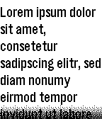</a>

<h2 class="app-name" id="app-57542c56d694500794000006"><a href="https://apps.repebble.com/57542c56d694500794000006">A Note</a></h2>
<a class="app-source" href="https://github.com/fahrstuhl/ANote" title="Source code" data-search-exclude>View source</a>

by <a href="https://apps.repebble.com/apps/dev/fahrstuhl_531aa6155af6609f1a000493" title="More from this developer">Fahrstuhl</a>

Not checked yet v1.7 Updated 2026-08-01

Runs on: Time 2, Pebble 2 Duo, Pebble 2, Time, Classic

It&#x27;s just A Note on your wrist: The simplest note app I could come up with. Write or paste a note in the settings page, maybe choose a font size and read it on your Pebble. Perfect for shopping…

<a class="app-shot" href="https://apps.repebble.com/534c7a4b5193a46a70000015" data-search-exclude>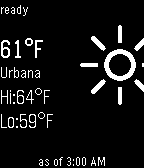</a>

<h2 class="app-name" id="app-534c7a4b5193a46a70000015"><a href="https://apps.repebble.com/534c7a4b5193a46a70000015">A Smarter Watch</a></h2>
<a class="app-source" href="https://github.com/l2blackbelt/smarterPebble/tree/master" title="Source code" data-search-exclude>View source</a>

by <a href="https://apps.repebble.com/apps/dev/a-smarter-pebble_533b5fbcf9fe9287230000da" title="More from this developer">A Smarter Pebble</a>

Not checked yet v1.0.2 Updated 2014-04-22

Runs on: Time 2, Pebble 2 Duo, Pebble 2, Time, Classic

HackIllinois 2014! Combines the weather and real-time CUMTD tracking into a super-powered watch face. Fast, efficient, intuitive; A Smarter Pebble. This version will only provide bus information…

<h2 class="app-name" id="app-576ff6e8ba2fe50eb000018a"><a href="https://apps.repebble.com/576ff6e8ba2fe50eb000018a">aare</a></h2>
<a class="app-source" href="https://github.com/cheesenoc/aare" title="Source code" data-search-exclude>View source</a>

by <a href="https://apps.repebble.com/apps/dev/cheese_567c7a046646d2de810000d6" title="More from this developer">Cheese</a>

Not checked yet v1.0 Updated 2016-06-26

Runs on: Round 2, Time 2, Pebble 2 Duo, Pebble 2, Time Round, Time, Classic

Simply displays the current water temperature of Switzerland’s most beautiful river. Uses data from BAFU via aare.schwumm.ch.

<a class="app-shot" href="https://apps.repebble.com/e00d8d855af1485ea97922f5" data-search-exclude>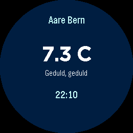</a>

<h2 class="app-name" id="app-e00d8d855af1485ea97922f5"><a href="https://apps.repebble.com/e00d8d855af1485ea97922f5">AarePebble</a></h2>
<a class="app-source" href="https://github.com/cheesenoc/aarepebble" title="Source code" data-search-exclude>View source</a>

by <a href="https://apps.repebble.com/apps/dev/marcel-kessler_26a4932578b7487bc4654aea" title="More from this developer">Marcel Kessler</a>

Not checked yet v1.1 Updated 2026-04-13

Runs on: Round 2

Displays the temperature of the Aare River in Bern, Switzerland

<a class="app-shot" href="https://apps.repebble.com/6976767bae32660009f7c272" data-search-exclude>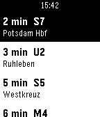</a>

<h2 class="app-name" id="app-6976767bae32660009f7c272"><a href="https://apps.repebble.com/6976767bae32660009f7c272">Abfahrt! - Departure Times</a></h2>
<a class="app-source" href="https://api.abfahrt.now" title="Source code" data-search-exclude>View source</a>

by <a href="https://apps.repebble.com/apps/dev/riles_696b7db386b6e20008d8320c" title="More from this developer">Riles</a>

See source v3.4 Updated 2026-04-03

Runs on: Round 2, Time 2, Pebble 2 Duo, Pebble 2, Time Round, Time, Classic

Real-time departures across Europe. Supported by Pebble! Supports 25 countries with 101+ cities - check full coverage at: https://riles.tech/coverage/ Features: - Automatic location detection …

<a class="app-shot" href="https://apps.repebble.com/532cf96daadf559ae3000085" data-search-exclude>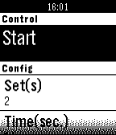</a>

<h2 class="app-name" id="app-532cf96daadf559ae3000085"><a href="https://apps.repebble.com/532cf96daadf559ae3000085">Abs Plank</a></h2>
<a class="app-source" href="https://github.com/zeerd/pebble_abs_plank" title="Source code" data-search-exclude>View source</a>

by <a href="https://apps.repebble.com/apps/dev/zeerd_530b33713add7bbcce0002e0" title="More from this developer">zeerd</a>

Not checked yet v0.2.3 Updated 2014-04-06

Runs on: Time 2, Pebble 2 Duo, Pebble 2, Time, Classic

This app guides you through a plank exercise workout to build your abs. The plank is one of the best exercises to strengthen your core, which is more than just your abdominal. The core is a…

<a class="app-shot" href="https://apps.repebble.com/5612584fce7b4cec6b000073" data-search-exclude>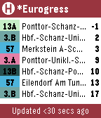</a>

<h2 class="app-name" id="app-5612584fce7b4cec6b000073"><a href="https://apps.repebble.com/5612584fce7b4cec6b000073">ACbus</a></h2>
<a class="app-source" href="https://github.com/asplendidday/ACbus" title="Source code" data-search-exclude>View source</a>

by <a href="https://apps.repebble.com/apps/dev/cavemen_558cfab8ead989ce4900005a" title="More from this developer">Cavemen</a>

MIT v0.10 Updated 2015-12-27

Runs on: Time 2, Time

Gives bus schedule info for the ASEAG bus network (Aachen, Germany region). Functionality: - Shows up to 21 next buses (7 per page) - Use up/down buttons to flip pages - Select between automatic…

<a class="app-shot" href="https://apps.repebble.com/54579b9c34f53e93c6000067" data-search-exclude>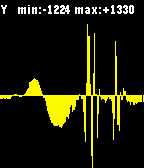</a>

<h2 class="app-name" id="app-54579b9c34f53e93c6000067"><a href="https://apps.repebble.com/54579b9c34f53e93c6000067">Accelerometer</a></h2>
<a class="app-source" href="https://github.com/reciprocum/Pebble-SDK4-WatchApp-Accelerometer" title="Source code" data-search-exclude>View source</a>

by <a href="https://apps.repebble.com/apps/dev/afonso-santos_53c7f761e5c0719320000162" title="More from this developer">Afonso Santos</a>

Not checked yet v4.3 Updated 2017-01-25

Runs on: Time 2, Pebble 2 Duo, Pebble 2, Time, Classic

A real-time, auto-scrolling auto-scalling accelerometer readings plotter Buttons: - SELECT: toggle the axis (X/Y/Z) being plotted. - (2x) UP/DOWN: (jump) scroll left/right - 2x SELECT: vibrate …

<a class="app-shot" href="https://apps.repebble.com/5595ea6b8564621791000090" data-search-exclude>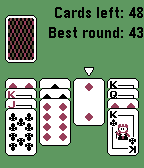</a>

<h2 class="app-name" id="app-5595ea6b8564621791000090"><a href="https://apps.repebble.com/5595ea6b8564621791000090">Aces Up</a></h2>
<a class="app-source" href="https://github.com/skimm3/Pebble-AcesUp" title="Source code" data-search-exclude>View source</a>

by <a href="https://apps.repebble.com/apps/dev/simon-hadenius_5582dca4389bcc11db0000cb" title="More from this developer">Simon Hadenius</a>

Not checked yet v1.1 Updated 2015-09-19

Runs on: Time 2, Pebble 2 Duo, Pebble 2, Time, Classic

Aces Up is a solitaire card game for Pebble. The simple gameplay makes the game perfect on the Pebble. How to play: Aces are high. Press the deck to deal 4 new cards. If there are two cards of the…

<a class="app-shot" href="https://apps.repebble.com/57ca1e94f69d1da5f5000370" data-search-exclude>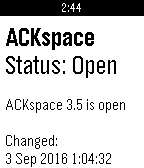</a>

<h2 class="app-name" id="app-57ca1e94f69d1da5f5000370"><a href="https://apps.repebble.com/57ca1e94f69d1da5f5000370">ACKspace</a></h2>
<a class="app-source" href="https://github.com/ACKspace/Pebble-ACKspace-app" title="Source code" data-search-exclude>View source</a>

by <a href="https://apps.repebble.com/apps/dev/stuiterveer_578ff03e842428d9660001ce" title="More from this developer">stuiterveer</a>

No licence v1.0 Updated 2016-09-03

Runs on: Time 2, Pebble 2 Duo, Pebble 2, Time, Classic

This app shows if ACKspace is open or closed. ACKspace is a hackerspace located in Heerlen, The Netherlands. A hackerspace is a place where people get together, socialize, share knowledge, tinker…

<h2 class="app-name" id="app-637920b8c6c24a000a815e61"><a href="https://apps.rebble.io/en_US/application/637920b8c6c24a000a815e61">Activities</a></h2>
<a class="app-source" href="https://github.com/johnspahr/pebbleactivities" title="Source code" data-search-exclude>View source</a>

by <a href="https://apps.rebble.io/en_US/developer/609801a58324660009e8a4db/1" title="More from this developer">John Spahr</a>

Not checked yet v1.0 Updated 2022-11-19 Rebble App Store

Runs on: Round 2, Time 2, Pebble 2 Duo, Pebble 2, Time Round, Time, Classic

Feeling bored? This little PebbleJS app uses the Bored API to suggest activities for you to do! Activities are selected based on the number of participants you choose. Created for Rebble Hackathon…

<a class="app-shot" href="https://apps.repebble.com/13851ccc1efa4d458b07c060" data-search-exclude>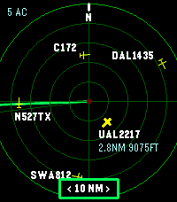</a>

<h2 class="app-name" id="app-13851ccc1efa4d458b07c060"><a href="https://apps.repebble.com/13851ccc1efa4d458b07c060">ADS-B Radar</a></h2>
<a class="app-source" href="https://github.com/jasonmarquette/pebble-adsb-radar" title="Source code" data-search-exclude>View source</a>

by <a href="https://apps.repebble.com/apps/dev/jason-marquette_5bee80559abfa407b64d6d00" title="More from this developer">Jason Marquette</a>

Not checked yet v1.1.1 Updated 2026-07-19

Runs on: Round 2, Time 2

Live nearby aircraft from ADS-B.fi Phone-based GPS location Adjustable 5, 10, 20, or 40 nautical mile radar range 10 NM default range Watch-button range controls

<a class="app-shot" href="https://apps.repebble.com/53d728183ca9f796db00002b" data-search-exclude>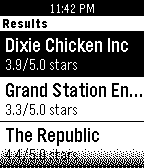</a>

<h2 class="app-name" id="app-53d728183ca9f796db00002b"><a href="https://apps.repebble.com/53d728183ca9f796db00002b">Adventure is Out There!</a></h2>
<a class="app-source" href="https://bitbucket.org/gleslie2008/adventure-is-out-there" title="Source code" data-search-exclude>View source</a>

by <a href="https://apps.repebble.com/apps/dev/graham-leslie_53937b3f6f52dd6139000148" title="More from this developer">Graham Leslie</a>

See source v1.0 Updated 2014-07-29

Runs on: Time 2, Pebble 2 Duo, Pebble 2, Time, Classic

Find somewhere nearby to go, whether it&#x27;s a new coffee shop, bar, bowling alley, or aquarium.

<a class="app-shot" href="https://apps.repebble.com/4e2096c555b940458a7f2fea" data-search-exclude>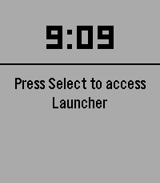</a>

<h2 class="app-name" id="app-4e2096c555b940458a7f2fea"><a href="https://apps.repebble.com/4e2096c555b940458a7f2fea">Aeropress 442</a></h2>
<a class="app-source" href="https://github.com/somlaigabor/pebble_aeropress" title="Source code" data-search-exclude>View source</a>

by <a href="https://apps.repebble.com/apps/dev/unknown_ea5ecce7c082e34723a09652" title="More from this developer">Unknown</a>

Not checked yet v1.0 Updated 2026-08-16

Runs on: Round 2, Time 2, Pebble 2 Duo, Pebble 2, Time Round, Time, Classic

A timer set to 4-4-2 minutes for making coffee with an AeroPress

<a class="app-shot" href="https://apps.repebble.com/dfa523b956e14f09a8f2d2fb" data-search-exclude>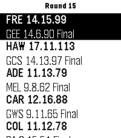</a>

<h2 class="app-name" id="app-dfa523b956e14f09a8f2d2fb"><a href="https://apps.repebble.com/dfa523b956e14f09a8f2d2fb">AFL Live Scores</a></h2>
<a class="app-source" href="https://github.com/widemouth31/PebbleAFLLive" title="Source code" data-search-exclude>View source</a>

by <a href="https://apps.repebble.com/apps/dev/chris-hardwick_1cae56f6fe053d3fd4e9d111" title="More from this developer">Chris Hardwick</a>

Not checked yet v1.3.0 Updated 2026-06-23

Runs on: Round 2, Time 2, Pebble 2 Duo, Pebble 2, Time Round, Time, Classic

Simple Pebble App to display current Australian Football League scores on your Pebble Watch. Games in Progress or all Current Round Games can be selected via Settings. Configurable Refresh time…

<h2 class="app-name" id="app-541bc018d81356ecb5000278"><a href="https://apps.repebble.com/541bc018d81356ecb5000278">AFTimer</a></h2>
<a class="app-source" href="https://github.com/andrewapperley/AFTimer" title="Source code" data-search-exclude>View source</a>

by <a href="https://apps.repebble.com/apps/dev/andrew-apperley_52bd0cddb1ce8ec07f00004e" title="More from this developer">Andrew Apperley</a>

MIT v1.0 Updated 2014-09-19

Runs on: Time 2, Pebble 2 Duo, Pebble 2, Time, Classic

A simple app for a simple missing feature. This allows you to set a timer for up to an hour and have it vibrate the watch when it is done. I personally use it for when I&#x27;m brewing coffee. Controls…

<a class="app-shot" href="https://apps.repebble.com/568600106b84271ec8000061" data-search-exclude>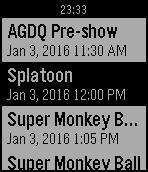</a>

<h2 class="app-name" id="app-568600106b84271ec8000061"><a href="https://apps.repebble.com/568600106b84271ec8000061">AGDQ Schedule</a></h2>
<a class="app-source" href="https://github.com/pboutin/pebble-agdq" title="Source code" data-search-exclude>View source</a>

by <a href="https://apps.repebble.com/apps/dev/pascal-boutin_535d35092b05cb4f3f0001ba" title="More from this developer">Pascal Boutin</a>

Not checked yet v1.2 Updated 2016-05-03

Runs on: Time 2, Pebble 2 Duo, Pebble 2, Time, Classic

See the current and upcoming runs for GamesDoneQuick event.

<a class="app-shot" href="https://apps.repebble.com/55fa03db37ac97db7a000019" data-search-exclude>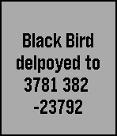</a>

<h2 class="app-name" id="app-55fa03db37ac97db7a000019"><a href="https://apps.repebble.com/55fa03db37ac97db7a000019">AGR DEPLOYMENT V2</a></h2>
<a class="app-source" href="https://instagram.com/russian_otter/" title="Source code" data-search-exclude>View source</a>

by <a href="https://apps.repebble.com/apps/dev/russian-otter_549c0abd0544722d37000293" title="More from this developer">Russian Otter</a>

Not checked yet v2.0 Updated 2015-09-17

Runs on: Time 2, Pebble 2 Duo, Pebble 2, Time, Classic

AGR summon from call of duty black ops! select from 3 deployments: Press &quot;up&quot; to call in Black Bird Press &quot;down&quot; to call in RC XD Press &quot;Middle&quot; to summon AGR Works for all versions of pebble…

<a class="app-shot" href="https://apps.repebble.com/cf78a459465f436ab859ad27" data-search-exclude>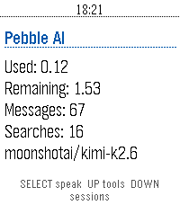</a>

<h2 class="app-name" id="app-cf78a459465f436ab859ad27"><a href="https://apps.repebble.com/cf78a459465f436ab859ad27">AI Assistant</a></h2>
<a class="app-source" href="https://github.com/kjullu/AI-Assistant" title="Source code" data-search-exclude>View source</a>

by <a href="https://apps.repebble.com/apps/dev/kjullu_56863bc31dd8be82f71404a4" title="More from this developer">kjullu</a>

Not checked yet v0.4.1 Updated 2026-09-04

Runs on: Time 2, Pebble 2 Duo, Pebble 2, Time

**THIS IS A VIBE CODED PROJECT, THERE IS BUGS AND ROUGH EDGES.** **THIS HAS ONLY BEEN TESTED ON THE Pebble Time 2, AND HAS BEEN OPENED ON THE Pebble Time.** # Info I would probably recommend you…

<a class="app-shot" href="https://apps.repebble.com/e4f125087c884a95abc3dcd7" data-search-exclude>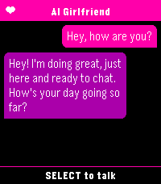</a>

<h2 class="app-name" id="app-e4f125087c884a95abc3dcd7"><a href="https://apps.repebble.com/e4f125087c884a95abc3dcd7">AI Girlfriend</a></h2>
<a class="app-source" href="https://github.com/Keatr0n/ai_girlfriend_pebble" title="Source code" data-search-exclude>View source</a>

by <a href="https://apps.repebble.com/apps/dev/keatr0n_2a36dcefb2ef947e811561d5" title="More from this developer">Keatr0n</a>

No licence v1.1.0 Updated 2026-08-07

Runs on: Round 2, Time 2, Pebble 2 Duo

You need a fast and easy way to talk to your favourite ai assistant? Look no further than AI Girlfriend. As soon as the app is launched it starts dictation so you can immediately start chatting…

<a class="app-shot" href="https://apps.repebble.com/4b4d43bf086642d883b38d89" data-search-exclude>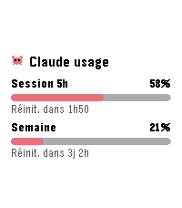</a>

<h2 class="app-name" id="app-4b4d43bf086642d883b38d89"><a href="https://apps.repebble.com/4b4d43bf086642d883b38d89">AI Usage</a></h2>
<a class="app-source" href="https://github.com/Julien1138/ai-usage" title="Source code" data-search-exclude>View source</a>

by <a href="https://apps.repebble.com/apps/dev/julien1138_9f1fd54dc8c8710b3d1187d7" title="More from this developer">Julien1138</a>

MIT v1.3.0 Updated 2026-08-15

Runs on: Round 2, Time 2, Pebble 2 Duo, Pebble 2, Time Round, Time, Classic

Diplays Claude IA usage gauges

<a class="app-shot" href="https://apps.repebble.com/69cbba0e4fec4ab29374da39" data-search-exclude>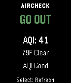</a>

<h2 class="app-name" id="app-69cbba0e4fec4ab29374da39"><a href="https://apps.repebble.com/69cbba0e4fec4ab29374da39">AirCheck</a></h2>
<a class="app-source" href="https://github.com/bcrowell770/AirCheck" title="Source code" data-search-exclude>View source</a>

by <a href="https://apps.repebble.com/apps/dev/bd-crowell_bc77df078bf00f8502c00039" title="More from this developer">BD Crowell</a>

MIT v1.3.2 Updated 2026-07-24

Runs on: Round 2, Time 2, Pebble 2 Duo, Pebble 2, Time Round, Time, Classic

AirCheck gives you a fast, simple answer to one question: should you go outside right now? Using real-time air quality (AQI) and weather data, AirCheck gives you a simple, instant recommendation…

<a class="app-shot" href="https://apps.repebble.com/533b4a60b7ac3aed240001b8" data-search-exclude>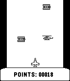</a>

<h2 class="app-name" id="app-533b4a60b7ac3aed240001b8"><a href="https://apps.repebble.com/533b4a60b7ac3aed240001b8">Aircraft</a></h2>
<a class="app-source" href="https://github.com/lukaszuk/aircraft-pebble" title="Source code" data-search-exclude>View source</a>

by <a href="https://apps.repebble.com/apps/dev/wojciech-lukaszuk_53137e1743d9606ece000393" title="More from this developer">Wojciech Lukaszuk</a>

Not checked yet v1.0.0 Updated 2014-04-01

Runs on: Time 2, Pebble 2 Duo, Pebble 2, Time, Classic

Check how long you can navigate the airplane without collision with enemies.

<a class="app-shot" href="https://apps.repebble.com/54d9be79f296d1e75a000043" data-search-exclude>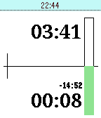</a>

<h2 class="app-name" id="app-54d9be79f296d1e75a000043"><a href="https://apps.repebble.com/54d9be79f296d1e75a000043">Airplane Fuel Timer</a></h2>
<a class="app-source" href="https://github.com/haykinson/PebbleFuel" title="Source code" data-search-exclude>View source</a>

by <a href="https://apps.repebble.com/apps/dev/ilya-haykinson_531a0b582e2e011d5f0001ae" title="More from this developer">Ilya Haykinson</a>

Not checked yet v2.0 Updated 2016-07-23

Runs on: Time 2, Pebble 2 Duo, Pebble 2, Time, Classic

Are you a pilot with a Pebble? Use this app to keep track of switching between left and right tanks of your airplane. Instructions: use up/down keys to select tank timer interval, then click…

<a class="app-shot" href="https://apps.repebble.com/07574105fbd2472e9055b82d" data-search-exclude>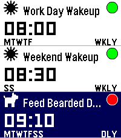</a>

<h2 class="app-name" id="app-07574105fbd2472e9055b82d"><a href="https://apps.repebble.com/07574105fbd2472e9055b82d">Alarm Rock</a></h2>
<a class="app-source" href="https://github.com/snrkl-labs/AlarmRock" title="Source code" data-search-exclude>View source</a>

by <a href="https://apps.repebble.com/apps/dev/snrkl-labs_4aece47c3cbfb14d594e6f1b" title="More from this developer">snrkl labs</a>

Not checked yet v0.6.4 Updated 2026-08-18

Runs on: Round 2, Time 2, Pebble 2 Duo, Pebble 2, Time Round, Time, Classic

I was tired of not having a seamless integration between alarms and smart watches on Android. I discovered that unless you had a phone and watch of a matching brand, it seems alarms were either…

<h2 class="app-name" id="app-562c0dbdb5a93208f1000014"><a href="https://apps.repebble.com/562c0dbdb5a93208f1000014">AlarmNote</a></h2>
<a class="app-source" href="https://github.com/rajid/pebble_alarmnote" title="Source code" data-search-exclude>View source</a>

by <a href="https://apps.repebble.com/apps/dev/richard-johnson_52f0112a949454fbcc00012f" title="More from this developer">Richard Johnson</a>

Not checked yet v1.20 Updated 2026-10-03

Runs on: Round 2, Time 2, Pebble 2 Duo, Pebble 2, Time Round, Time, Classic

Daily alarms with custom notes, automatically rescheduled to the next day. Great for taking various different pills on a daily basis. (Do not rely totally on these reminders. Bugs may be present…

<a class="app-shot" href="https://apps.repebble.com/54551598997cdfddaa000043" data-search-exclude>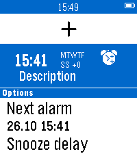</a>

<h2 class="app-name" id="app-54551598997cdfddaa000043"><a href="https://apps.repebble.com/54551598997cdfddaa000043">Alarms++</a></h2>
<a class="app-source" href="https://github.com/reini1305/alarmsplusplus" title="Source code" data-search-exclude>View source</a>

by <a href="https://apps.repebble.com/apps/dev/christian-reinbacher_52d29655c44c044e9f00004f" title="More from this developer">Christian Reinbacher</a>

Not checked yet v7.7-rbl1 Updated 2019-07-24

Runs on: Round 2, Time 2, Pebble 2 Duo, Pebble 2, Time Round, Time, Classic

This app is open source! If you like my apps heart them in the appstore and consider a donation (link is at the source link of this app). With Alarms++ you can flexibly schedule up to 24 alarms on…

<a class="app-shot" href="https://apps.repebble.com/f0d71e5923bd45c0b05a75b0" data-search-exclude>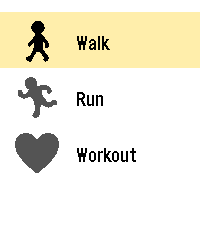</a>

<h2 class="app-name" id="app-f0d71e5923bd45c0b05a75b0"><a href="https://apps.repebble.com/f0d71e5923bd45c0b05a75b0">Allure</a></h2>
<a class="app-source" href="https://github.com/WayeMelse/allure" title="Source code" data-search-exclude>View source</a>

by <a href="https://apps.repebble.com/apps/dev/wayem_e1e668e8c92b6187eb55847d" title="More from this developer">WayeM</a>

MIT v1.0.1 Updated 2026-10-06

Runs on: Time 2

BETA - Allure is an activity tracker for the Pebble Time 2 that turns your heart rate into color. Pick an activity, start, and glance at your wrist: the screen color shows your effort zone, and…

<a class="app-shot" href="https://apps.repebble.com/561c1c264af08f0e19000005" data-search-exclude>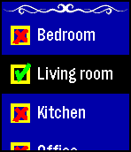</a>

<h2 class="app-name" id="app-561c1c264af08f0e19000005"><a href="https://apps.repebble.com/561c1c264af08f0e19000005">Alvin</a></h2>
<a class="app-source" href="https://github.com/JamesFowler42/alvin" title="Source code" data-search-exclude>View source</a>

by <a href="https://apps.repebble.com/apps/dev/james-fowler_52b208abb70e1ced1f00004c" title="More from this developer">James Fowler</a>

Other v1.3 Updated 2015-12-21

Runs on: Round 2, Time 2, Pebble 2 Duo, Pebble 2, Time Round, Time, Classic

1.3: Fixed issue with key being lost on Android Alvin is intended to be the easist and quickest to use way to control IFTTT recipies using the Maker channel. * Voice recognition * Reorderable menu…

<a class="app-shot" href="https://apps.repebble.com/b0593b021ec14a9fb33207e5" data-search-exclude>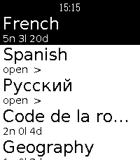</a>

<h2 class="app-name" id="app-b0593b021ec14a9fb33207e5"><a href="https://apps.repebble.com/b0593b021ec14a9fb33207e5">Anki-pebble</a></h2>
<a class="app-source" href="https://github.com/Wyoc/anki-pebble-watch" title="Source code" data-search-exclude>View source</a>

by <a href="https://apps.repebble.com/apps/dev/wyoc_6bce85d8ae51db9b0f0f1959" title="More from this developer">Wyoc</a>

GPL-3.0 v1.0.1 Updated 2026-06-17

Runs on: Time 2, Pebble 2 Duo, Pebble 2

Review your AnkiDroid flashcards from your wrist. Requires the free Anki-Pebble companion app.

<a class="app-shot" href="https://apps.repebble.com/07c6afdd062141c19bf72312" data-search-exclude>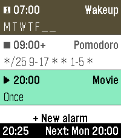</a>

<h2 class="app-name" id="app-07c6afdd062141c19bf72312"><a href="https://apps.repebble.com/07c6afdd062141c19bf72312">Another Alarm</a></h2>
<a class="app-source" href="https://github.com/truhanen/pebble-another-alarm" title="Source code" data-search-exclude>View source</a>

by <a href="https://apps.repebble.com/apps/dev/tuukka-ruhanen_2a1ec999749817a461025038" title="More from this developer">Tuukka Ruhanen</a>

Not checked yet v2.3.1 Updated 2026-08-09

Runs on: Time 2

Yet another alarm app, with cron mode for maximum flexibility, and many other useful features. Features - Alarm sound &amp; vibration - Increasing alarm volume - Snooze - Multiple alarms - Labeled…

<a class="app-shot" href="https://apps.repebble.com/e4942ade58a44968bae74b35" data-search-exclude>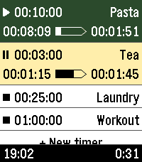</a>

<h2 class="app-name" id="app-e4942ade58a44968bae74b35"><a href="https://apps.repebble.com/e4942ade58a44968bae74b35">Another Timer</a></h2>
<a class="app-source" href="https://github.com/truhanen/pebble-another-timer" title="Source code" data-search-exclude>View source</a>

by <a href="https://apps.repebble.com/apps/dev/tuukka-ruhanen_2a1ec999749817a461025038" title="More from this developer">Tuukka Ruhanen</a>

Not checked yet v2.2.1 Updated 2026-08-21

Runs on: Time 2

Yet another timer app, built for fast, versatile, &amp; straightforward usage. Features: - Instantly start timers by one touch - Multiple timers - Reusable saved timers - Timer labels - Track…

<a class="app-shot" href="https://apps.rebble.io/en_US/application/6aa60fa0226a3d00096623ec" data-search-exclude>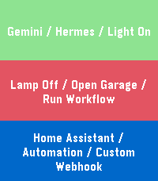</a>

<h2 class="app-name" id="app-6aa60fa0226a3d00096623ec"><a href="https://apps.rebble.io/en_US/application/6aa60fa0226a3d00096623ec">API Trigger</a></h2>
<a class="app-source" href="https://github.com/hgarbouj/pebble-api-trigger/tree/main" title="Source code" data-search-exclude>View source</a>

by <a href="https://apps.rebble.io/en_US/developer/6a9cb6f14c34b600096e2aba/1" title="More from this developer">ElhiK</a>

Not checked yet v1.0.0 Updated 2026-09-13 Rebble App Store

Runs on: Round 2, Time 2, Pebble 2 Duo, Pebble 2, Time Round, Time, Classic

API Trigger lets you control APIs and webhooks directly from your Pebble. - Trigger custom webhooks for n8n and Home Assistant. - Control Philips Hue lights through the Hue API. - Send requests to…

<a class="app-shot" href="https://apps.repebble.com/a32e0cb46c41426b8cd06df7" data-search-exclude>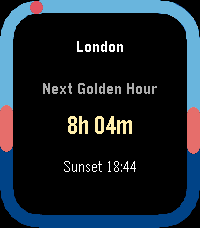</a>

<h2 class="app-name" id="app-a32e0cb46c41426b8cd06df7"><a href="https://apps.repebble.com/a32e0cb46c41426b8cd06df7">Apollo</a></h2>
<a class="app-source" href="https://github.com/Yorks0n/Apollo" title="Source code" data-search-exclude>View source</a>

by <a href="https://apps.repebble.com/apps/dev/yorks0n_692a907686176a0009926c79" title="More from this developer">Yorks0n</a>

No licence v1.1 Updated 2026-04-24

Runs on: Round 2, Time 2, Pebble 2 Duo, Pebble 2, Time Round, Time, Classic

Apollo — Sun Tracking on Your Wrist Apollo lets you save multiple locations from the phone settings page and sync them to your Pebble, so you can check sunrise and sunset times for each place…

<h2 class="app-name" id="app-54615fc3233941fc44000008"><a href="https://apps.repebble.com/54615fc3233941fc44000008">AppHookup</a></h2>
<a class="app-source" href="https://github.com/Antrikshy/AppHookup-for-Pebble" title="Source code" data-search-exclude>View source</a>

by <a href="https://apps.repebble.com/apps/dev/antriksh-yadav_543d5da8a44ae19e94000015" title="More from this developer">Antriksh Yadav</a>

MIT v1.0 Updated 2014-11-12

Runs on: Time 2, Pebble 2 Duo, Pebble 2, Time, Classic

This is the official Pebble app for /r/AppHookup. AppHookup is a reddit.com subreddit for crowdsourced app deals on all platforms, from iOS and Android to Windows and beyond. With this app, you…

<a class="app-shot" href="https://apps.repebble.com/55b5a5e22448b37a56000018" data-search-exclude>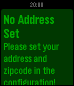</a>

<h2 class="app-name" id="app-55b5a5e22448b37a56000018"><a href="https://apps.repebble.com/55b5a5e22448b37a56000018">Appleton Recycling Date Checker</a></h2>
<a class="app-source" href="https://github.com/dhmncivichacks/AppletonPebble" title="Source code" data-search-exclude>View source</a>

by <a href="https://apps.repebble.com/apps/dev/ross-larson_541e2be1a6c7c78bae00003c" title="More from this developer">Ross Larson</a>

Not checked yet v2.2 Updated 2016-10-08

Runs on: Round 2, Time 2, Pebble 2 Duo, Pebble 2, Time Round, Time, Classic

Northeast Wisconsin Recycling Date Checker. Checks the next time to take out the recycling.

<h2 class="app-name" id="app-52fd83a762f8c411ac00006b"><a href="https://apps.repebble.com/52fd83a762f8c411ac00006b">Appy Bird</a></h2>
<a class="app-source" href="https://github.com/danielheath/appy_bird" title="Source code" data-search-exclude>View source</a>

by <a href="https://apps.repebble.com/apps/dev/daniel-heath_52fc0337eac58da706000082" title="More from this developer">Daniel Heath</a>

Not checked yet v2.0.0 Updated 2014-05-17

Runs on: Time 2, Pebble 2 Duo, Pebble 2, Time, Classic

Steer your spaceship deftly to avoid waves of Flappy Birds and Duck Hunt escapees.

<a class="app-shot" href="https://apps.repebble.com/116469e91f1b4caa898c1efd" data-search-exclude>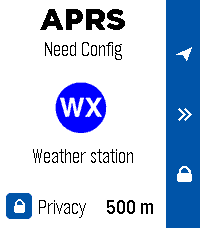</a>

<h2 class="app-name" id="app-116469e91f1b4caa898c1efd"><a href="https://apps.repebble.com/116469e91f1b4caa898c1efd">APRS Beacon</a></h2>
<a class="app-source" href="https://gitlab.com/geckopebble/aprs-site" title="Source code" data-search-exclude>View source</a>

by <a href="https://apps.repebble.com/apps/dev/alfredo-chamberlain_bd9db32145c0ee90a26a69a0" title="More from this developer">Alfredo Chamberlain</a>

Not checked yet v1.0.0 Updated 2026-08-31

Runs on: Time 2

One-press APRS position beacon for licensed amateur radio operators. Pick a map symbol and a privacy radius on the watch, press UP (or quick-launch) and your phone&#x27;s GPS position is reported to…

<a class="app-shot" href="https://apps.repebble.com/363491e5fad345dcbc8eb552" data-search-exclude>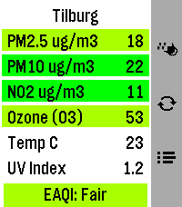</a>

<h2 class="app-name" id="app-363491e5fad345dcbc8eb552"><a href="https://apps.repebble.com/363491e5fad345dcbc8eb552">AQI Monitor</a></h2>
<a class="app-source" href="https://github.com/Moaske/PebbleAIQmonitor" title="Source code" data-search-exclude>View source</a>

by <a href="https://apps.repebble.com/apps/dev/moaske_3f1bf0845ffec82a2a96f91c" title="More from this developer">Moaske</a>

No licence v1.5.4 Updated 2026-08-13

Runs on: Time 2

Air Quality and Pollen monitor for Pebble Time 2 (Emery) Features: 🔶 Main screen shows current PM2.5, PM10, NO2, Ozone (O3) polutant values as wel as Temperature in Celsius and UV Index for your…

<a class="app-shot" href="https://apps.repebble.com/569b8aa5258004de1900003b" data-search-exclude>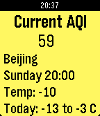</a>

<h2 class="app-name" id="app-569b8aa5258004de1900003b"><a href="https://apps.repebble.com/569b8aa5258004de1900003b">AQI via aqicn.org (unofficial)</a></h2>
<a class="app-source" href="https://github.com/devvmh/pebblejs-aqi-watchapp" title="Source code" data-search-exclude>View source</a>

by <a href="https://apps.repebble.com/apps/dev/devin-howard_565e5e0fdf5955b59400008d" title="More from this developer">Devin Howard</a>

Not checked yet v1.5 Updated 2016-06-07

Runs on: Time 2, Pebble 2 Duo, Pebble 2, Time, Classic

aqicn.org is an excellent website for getting smog (air quality) data for cities around the world. I highly recommend using their existing websites and apps! This app is an unofficial wrapper…

<a class="app-shot" href="https://apps.repebble.com/557ed8733c562e76c5000021" data-search-exclude>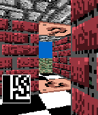</a>

<h2 class="app-name" id="app-557ed8733c562e76c5000021"><a href="https://apps.repebble.com/557ed8733c562e76c5000021">Arena3D</a></h2>
<a class="app-source" href="https://github.com/robisodd/Arena3D-v0.10" title="Source code" data-search-exclude>View source</a>

by <a href="https://apps.repebble.com/apps/dev/robisodd_530273b74b130b71ef000192" title="More from this developer">robisodd</a>

Not checked yet v0.12 Updated 2015-07-02

Runs on: Time 2, Pebble 2 Duo, Pebble 2, Time, Classic

A simple Doom or Wolfenstein like 3D raycaster. There is no goal or objective, just walking around and seeing the Pebble&#x27;s ability to render a 3D game. Use the accelerometer to move. To remain…

<h2 class="app-name" id="app-563942a577b75e4c47000003"><a href="https://apps.repebble.com/563942a577b75e4c47000003">Arithmetics</a></h2>
<a class="app-source" href="https://github.com/ladrower/pebble-hello" title="Source code" data-search-exclude>View source</a>

by <a href="https://apps.repebble.com/apps/dev/artem_550ad07084ad0239d700012d" title="More from this developer">Artem</a>

Not checked yet v1.4 Updated 2015-11-16

Runs on: Round 2, Time 2, Pebble 2 Duo, Pebble 2, Time Round, Time, Classic

Provides simple arithmetic problems to be solved. The problem updates automatically every 5 minutes. Press select button to view the answer and proceed.

<a class="app-shot" href="https://apps.repebble.com/53adb31a22eac4b8080000af" data-search-exclude>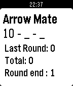</a>

<h2 class="app-name" id="app-53adb31a22eac4b8080000af"><a href="https://apps.repebble.com/53adb31a22eac4b8080000af">Arrow Mate Indoor</a></h2>
<a class="app-source" href="https://github.com/archerydwd/ArrowMateIndoor" title="Source code" data-search-exclude>View source</a>

by <a href="https://apps.repebble.com/apps/dev/darren_52c0a289101f1a8dfa000087" title="More from this developer">darren</a>

No licence v3.1 Updated 2015-07-13

Runs on: Time 2, Pebble 2 Duo, Pebble 2, Time, Classic

Indoor archery target scoring app. View old scores by holding the up button. Select score with the up and down buttons. Enter score with the select button. Delete last score by holding down the…

<a class="app-shot" href="https://apps.rebble.io/en_US/application/6a2764f6d2556100093bfbf5" data-search-exclude>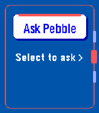</a>

<h2 class="app-name" id="app-6a2764f6d2556100093bfbf5"><a href="https://apps.rebble.io/en_US/application/6a2764f6d2556100093bfbf5">Ask Pebble</a></h2>
<a class="app-source" href="https://github.com/s-titanium-74/ask-pebble" title="Source code" data-search-exclude>View source</a>

by <a href="https://apps.rebble.io/en_US/developer/6a061bb94787e50008f7f373/1" title="More from this developer">Namka</a>

Not checked yet v1.0.2 Updated 2026-07-20 Rebble App Store

Runs on: Time 2, Pebble 2 Duo

Ask Pebble turns Pebble Dictation into a compact AI Q&amp;A flow. Press Select, speak a question, and the app sends the recognized text from PebbleKit JS on your paired Android phone to the API…

<a class="app-shot" href="https://apps.repebble.com/55e6e8b7049482285e00000d" data-search-exclude>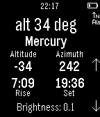</a>

<h2 class="app-name" id="app-55e6e8b7049482285e00000d"><a href="https://apps.repebble.com/55e6e8b7049482285e00000d">Astronomy App</a></h2>
<a class="app-source" href="https://github.com/kurtlawrence/PebbleWatch_Astronomy_App" title="Source code" data-search-exclude>View source</a>

by <a href="https://apps.repebble.com/apps/dev/kurt-lawrence_55c95471a29d99642d00002d" title="More from this developer">Kurt Lawrence</a>

Not checked yet v1.1 Updated 2015-09-22

Runs on: Time 2, Pebble 2 Duo, Pebble 2, Time, Classic

Track the solar system bodies without any internet connection! Can be used to find compass heading and inclinometer, whilst display current azimuth and altitude of a heavenly body. For moon rise…

<a class="app-shot" href="https://apps.repebble.com/55a45e4ce6f9096732000077" data-search-exclude>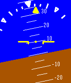</a>

<h2 class="app-name" id="app-55a45e4ce6f9096732000077"><a href="https://apps.repebble.com/55a45e4ce6f9096732000077">Attitude Indicator</a></h2>
<a class="app-source" href="https://github.com/rengianforte/pebble-attitude-indicator" title="Source code" data-search-exclude>View source</a>

by <a href="https://apps.repebble.com/apps/dev/ren-gianforte_53066f557f35761076000456" title="More from this developer">Ren Gianforte</a>

Not checked yet v1.0 Updated 2015-07-14

Runs on: Time 2, Time

This app uses the Pebble&#x27;s accelerometer to simulate an attitude indicator. The main indicator shows an artificial horizon and degrees of pitch up or down. The bank indicator at the top displays…

<a class="app-shot" href="https://apps.repebble.com/1d7ab48a02de4a58a95732d7" data-search-exclude>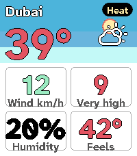</a>

<h2 class="app-name" id="app-1d7ab48a02de4a58a95732d7"><a href="https://apps.repebble.com/1d7ab48a02de4a58a95732d7">Aura Weather</a></h2>
<a class="app-source" href="https://github.com/mabaeyens/aura-pebble/aura-weather" title="Source code" data-search-exclude>View source</a>

by <a href="https://apps.repebble.com/apps/dev/miguel-angel-baeyens_1147b782781f1f1115f63f5b" title="More from this developer">Miguel Angel Baeyens</a>

Not checked yet v1.1.0 Updated 2026-09-05

Runs on: Time 2

Aura Weather carries my Spain weather app&#x27;s design language onto the Pebble Time 2: a living sky you read at a glance. The hero screen draws the sun (a moon at night) arcing over a day-to-night…

<a class="app-shot" href="https://apps.repebble.com/5824f1b634da21b06a000230" data-search-exclude>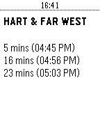</a>

<h2 class="app-name" id="app-5824f1b634da21b06a000230"><a href="https://apps.repebble.com/5824f1b634da21b06a000230">Austin Metro</a></h2>
<a class="app-source" href="https://github.com/ojensen5115/pebble-austin-metro-pebblejs" title="Source code" data-search-exclude>View source</a>

by <a href="https://apps.repebble.com/apps/dev/oliver_55710293c442e36c9700005f" title="More from this developer">Oliver</a>

Not checked yet v1.2 Updated 2016-11-17

Runs on: Round 2, Time 2, Pebble 2 Duo, Pebble 2, Time Round, Time, Classic

This application will display the estimated arrival times of the next three buses at bus stops in Austin, Texas. Add any number of StopIDs in order to be able to view upcoming bus arrivals. While…

<a class="app-shot" href="https://apps.repebble.com/54db33c6097dff17a4000072" data-search-exclude>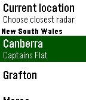</a>

<h2 class="app-name" id="app-54db33c6097dff17a4000072"><a href="https://apps.repebble.com/54db33c6097dff17a4000072">Australian Radar</a></h2>
<a class="app-source" href="https://github.com/futzle/Pebble-Radar" title="Source code" data-search-exclude>View source</a>

by <a href="https://apps.repebble.com/apps/dev/futzle-industries_52f0abfe3be6208ab00022aa" title="More from this developer">Futzle Industries</a>

Not checked yet v5 Updated 2015-06-02

Runs on: Time 2, Pebble 2 Duo, Pebble 2, Time, Classic

Check for rain from your wrist! This Watchapp displays the latest radar image from one of the more than fifty sites operated by the Australian Bureau of Meteorology. Only useful in Australia…

<a class="app-shot" href="https://apps.repebble.com/864fb2cb5c0444b088dbbaa0" data-search-exclude>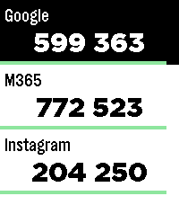</a>

<h2 class="app-name" id="app-864fb2cb5c0444b088dbbaa0"><a href="https://apps.repebble.com/864fb2cb5c0444b088dbbaa0">Authenticator</a></h2>
<a class="app-source" href="https://github.com/michi1996/pebble-authenticator" title="Source code" data-search-exclude>View source</a>

by <a href="https://apps.repebble.com/apps/dev/achi_5b39d75c38e0aa0001e8c763" title="More from this developer">Achi</a>

Not checked yet v2.0.1 Updated 2026-10-04

Runs on: Round 2, Time 2, Pebble 2 Duo, Pebble 2, Time Round, Time, Classic

Pebble Authenticator brings your two-factor authentication (2FA/TOTP) codes directly to your Pebble smartwatch. No need to reach for your phone to unlock your accounts, just glance at your wrist…

<a class="app-shot" href="https://apps.repebble.com/52f1a4c3c4117252f9000bb8" data-search-exclude>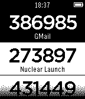</a>

<h2 class="app-name" id="app-52f1a4c3c4117252f9000bb8"><a href="https://apps.repebble.com/52f1a4c3c4117252f9000bb8">Authenticator</a></h2>
<a class="app-source" href="https://github.com/cpfair/pTOTP" title="Source code" data-search-exclude>View source</a>

by <a href="https://apps.repebble.com/apps/dev/collin-fair_52cb0b00b138287b32000018" title="More from this developer">Collin Fair</a>

Not checked yet v1.11 Updated 2016-06-24

Runs on: Round 2, Time 2, Pebble 2 Duo, Pebble 2, Time Round, Time, Classic

Generate Google Authenticator two-factor authentication codes right from your Pebble! Perfect for use with the most popular two-factor authentication systems, including GMail, Dropbox, LastPass…

<a class="app-shot" href="https://apps.repebble.com/544965ef95176241c9000115" data-search-exclude>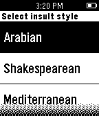</a>

<h2 class="app-name" id="app-544965ef95176241c9000115"><a href="https://apps.repebble.com/544965ef95176241c9000115">Autoinsult for Pebble</a></h2>
<a class="app-source" href="https://github.com/ygalanter/Autoinsult-For-Pebble" title="Source code" data-search-exclude>View source</a>

by <a href="https://apps.repebble.com/apps/dev/comfortably-numb_52f547605101128b2200005a" title="More from this developer">Comfortably Numb</a>

Not checked yet v2.0.0 Updated 2026-05-02

Runs on: Round 2, Time 2, Pebble 2 Duo, Pebble 2, Time Round, Time, Classic

Whenever you need an unorthodox insult line - this app will be there for you. Select insult style from - Arabian - Shakespearean - Modern - Mediterranean. Based on autoinsult.com

