---
hide:
  - toc
---

<!-- Generated by scripts/update_app_directory.py: do not edit by hand -->
# Pebble Apps: B

[← All Pebble Apps](../watchapps.md) · [A](a.md) · **B** · [C](c.md) · [D](d.md) · [E](e.md) · [F](f.md) · [G](g.md) · [H](h.md) · [I](i.md) · [J](j.md) · [K](k.md) · [L](l.md) · [M](m.md) · [N](n.md) · [O](o.md) · [P](p.md) · [Q](q.md) · [R](r.md) · [S](s.md) · [T](t.md) · [U](u.md) · [V](v.md) · [W](w.md) · [X](x.md) · [Y](y.md) · [Z](z.md) · [0–9 & other](other.md)

*101 apps · Last updated 2026-10-06 · [About these lists](../about-app-lists.md)*

<a class="app-shot" href="https://apps.repebble.com/db88f247deb24c56bf7794f2" data-search-exclude>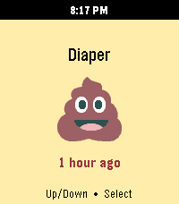</a>

<h2 class="app-name" id="app-db88f247deb24c56bf7794f2"><a href="https://apps.repebble.com/db88f247deb24c56bf7794f2">Baby StoneFruit</a></h2>
<a class="app-source" href="https://github.com/michaellunzer/babystonefruit" title="Source code" data-search-exclude>View source</a>

by <a href="https://apps.repebble.com/apps/dev/hoyt-labs_2c7cc63cb80aec6744597cfb" title="More from this developer">Hoyt Labs</a>

Not checked yet v1.0.4 Updated 2026-05-22

Runs on: Round 2, Time 2

This is the Huckleberry baby tracking app on you Pebble! It uses the Home Assistant Huckleberry Integration as a proxy since a pebble watch can&#x27;t communicate with Huckleberry directly. It&#x27;s a…

<a class="app-shot" href="https://apps.repebble.com/53fbc513994475c7ee0001ed" data-search-exclude>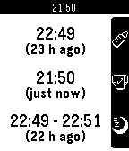</a>

<h2 class="app-name" id="app-53fbc513994475c7ee0001ed"><a href="https://apps.repebble.com/53fbc513994475c7ee0001ed">Baby Watch</a></h2>
<a class="app-source" href="https://github.com/Arlanthir/pebby" title="Source code" data-search-exclude>View source</a>

by <a href="https://apps.repebble.com/apps/dev/miguel-branco_531a5e8d5ef1cb5a08000307" title="More from this developer">Miguel Branco</a>

No licence v1.4 Updated 2015-09-10

Runs on: Time 2, Pebble 2 Duo, Pebble 2, Time, Classic

Baby Watch helps you take care of your baby. It allows you to easily set the last time the baby slept, ate or had its diaper changed. Glance down and check how long it has been since any of those…

<a class="app-shot" href="https://apps.repebble.com/695ca015c78a580009d9be0f" data-search-exclude>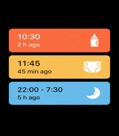</a>

<h2 class="app-name" id="app-695ca015c78a580009d9be0f"><a href="https://apps.repebble.com/695ca015c78a580009d9be0f">Baby Watch app reborn</a></h2>
<a class="app-source" href="https://github.com/saintyoga-Cyber/Baby-Watch-Reborn" title="Source code" data-search-exclude>View source</a>

by <a href="https://apps.repebble.com/apps/dev/kamishinn_5630f6bc025b51246b000062" title="More from this developer">KamiShinn</a>

Not checked yet v2.0.0 Updated 2026-06-26

Runs on: Round 2, Time 2, Pebble 2 Duo, Pebble 2, Time Round, Time, Classic

A revival of the Pebby (Baby watch) app - Baby tracking for Pebble smartwatches. Track bottle feedings, diaper changes, and sleep sessions right from your wrist! Each event will also be logged on…

<a class="app-shot" href="https://apps.repebble.com/3bc29e330de34d74b6f52c2a" data-search-exclude>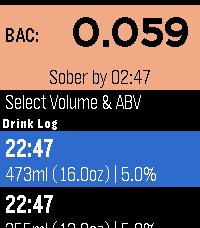</a>

<h2 class="app-name" id="app-3bc29e330de34d74b6f52c2a"><a href="https://apps.repebble.com/3bc29e330de34d74b6f52c2a">BAC2Sober</a></h2>
<a class="app-source" href="https://github.com/JunderscoreB/BAC2Sober" title="Source code" data-search-exclude>View source</a>

by <a href="https://apps.repebble.com/apps/dev/j-b_68ecfdbe1c671100088152be" title="More from this developer">J_B</a>

MIT v1.2.2 Updated 2026-10-04

Runs on: Round 2, Time 2, Pebble 2 Duo, Pebble 2, Time Round, Time, Classic

BAC2Sober is a premium, real-time blood alcohol tracking companion for your Pebble smartwatch. Built with a focus on speed, privacy, and native Pebble aesthetics, it utilizes the trusted Widmark…

<a class="app-shot" href="https://apps.repebble.com/558dbbc4a6c6cced76000004" data-search-exclude>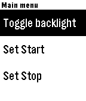</a>

<h2 class="app-name" id="app-558dbbc4a6c6cced76000004"><a href="https://apps.repebble.com/558dbbc4a6c6cced76000004">Backlight</a></h2>
<a class="app-source" href="https://github.com/rajid/pebble_backlight" title="Source code" data-search-exclude>View source</a>

by <a href="https://apps.repebble.com/apps/dev/richard-johnson_52f0112a949454fbcc00012f" title="More from this developer">Richard Johnson</a>

Not checked yet v2.3 Updated 2018-02-07

Runs on: Round 2, Time 2, Pebble 2 Duo, Pebble 2, Time Round, Time, Classic

Simple program to automatically control your backlight. It sits in the background, allowing you to use whatever watch face you like. When you raise your arm to look at your watch, it will…

<a class="app-shot" href="https://apps.repebble.com/a86a293b637a4a13923d4cc0" data-search-exclude>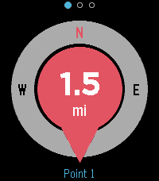</a>

<h2 class="app-name" id="app-a86a293b637a4a13923d4cc0"><a href="https://apps.repebble.com/a86a293b637a4a13923d4cc0">Backtrack</a></h2>
<a class="app-source" href="https://github.com/yoann54/Backtrack" title="Source code" data-search-exclude>View source</a>

by <a href="https://apps.repebble.com/apps/dev/yoada_40295452a8505728bae5a632" title="More from this developer">yoada</a>

Not checked yet v1.1.1 Updated 2026-09-30

Runs on: Round 2, Time 2, Pebble 2 Duo, Pebble 2, Time Round, Time

Find your way back to a saved point. Drop a pin at your location and Backtrack shows a compass-oriented arrow and the distance back to it, and buzzes when you arrive. Great for finding your car…

<h2 class="app-name" id="app-682ecefc435cc40009e73634"><a href="https://apps.rebble.io/en_US/application/682ecefc435cc40009e73634">Bad Apple!!</a></h2>
<a class="app-source" href="https://github.com/FlynnD273/pebble-bad-apple" title="Source code" data-search-exclude>View source</a>

by <a href="https://apps.rebble.io/en_US/developer/67bd48a737d408000a74f7d7/1" title="More from this developer">Flynn Duniho</a>

No licence v2.1.0 Updated 2026-05-11 Rebble App Store

Runs on: Round 2, Time 2, Pebble 2 Duo, Pebble 2, Time Round, Time, Classic

Displays the full Bad Apple!! animation on the watch, completely locally. No streaming files from the phone or the internet.

<a class="app-shot" href="https://apps.repebble.com/574356ddb4818474a6000013" data-search-exclude>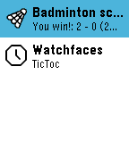</a>

<h2 class="app-name" id="app-574356ddb4818474a6000013"><a href="https://apps.repebble.com/574356ddb4818474a6000013">Badminton score</a></h2>
<a class="app-source" href="https://github.com/FraBoCH/pebble-badminton/" title="Source code" data-search-exclude>View source</a>

by <a href="https://apps.repebble.com/apps/dev/frabo_56d8b0e51d085fb31d00002a" title="More from this developer">FraBo</a>

BSD-3-Clause v1.2 Updated 2016-09-14

Runs on: Time 2, Pebble 2 Duo, Pebble 2, Time, Classic

An easy to use pebble app to count the points during your badminton game. Hit the bottom button when you score, the top button when your opponent scores. The final score will be displayed at the…

<a class="app-shot" href="https://apps.repebble.com/87069cdc983047dca17368d6" data-search-exclude>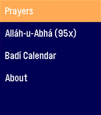</a>

<h2 class="app-name" id="app-87069cdc983047dca17368d6"><a href="https://apps.repebble.com/87069cdc983047dca17368d6">Bahá&#x27;í Prayers</a></h2>
<a class="app-source" href="https://forge.mitch.science/mitcheffendi/pebble-bahai-prayer-app" title="Source code" data-search-exclude>View source</a>

by <a href="https://apps.repebble.com/apps/dev/mitch-donaberger_f933fc3a5857dd1d37c0dd28" title="More from this developer">Mitch Donaberger</a>

See source v0.6 Updated 2026-06-23

Runs on: Round 2, Time 2

An application for Bahá&#x27;ís to access a quick prayer book, act as a digital replacement for prayer beads in a pinch, and show you the current date on the Badí / Bahá&#x27;í calendar! COMING SOON: *…

<h2 class="app-name" id="app-578eb23202f6d8dd8f0000ff"><a href="https://apps.repebble.com/578eb23202f6d8dd8f0000ff">Banner</a></h2>
<a class="app-source" href="https://github.com/Ruud48/Pebble-Banner" title="Source code" data-search-exclude>View source</a>

by <a href="https://apps.repebble.com/apps/dev/ruud_52b9bb7ea1d2df2a9f00009a" title="More from this developer">Ruud</a>

No licence v1.0 Updated 2016-07-21

Runs on: Round 2, Time 2, Pebble 2 Duo, Pebble 2, Time Round, Time, Classic

BANNER will show very large scrolling characters/texts on your watch. This allows for showing texts to others up to 15 feet away. Texts are stored in the watch and may be entered on the phone or…

<a class="app-shot" href="https://apps.rebble.io/en_US/application/6a2224e4b9f0710009879387" data-search-exclude>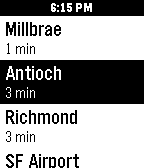</a>

<h2 class="app-name" id="app-6a2224e4b9f0710009879387"><a href="https://apps.rebble.io/en_US/application/6a2224e4b9f0710009879387">Bart Stop</a></h2>
<a class="app-source" href="https://github.com/chughes87/pebble_parkway/tree/master/bart-app" title="Source code" data-search-exclude>View source</a>

by <a href="https://apps.rebble.io/en_US/developer/6902c47d856ddb00087e4b8d/1" title="More from this developer">LavenderCorp</a>

Not checked yet v1.1.0 Updated 2026-06-05 Rebble App Store

Runs on: Time 2, Pebble 2 Duo, Pebble 2, Time, Classic

Configure what bart stop you want to track on your phone and this app will show the latest departure times for all destinations

<a class="app-shot" href="https://apps.repebble.com/56ce4a6c86ce3b1bb3000058" data-search-exclude>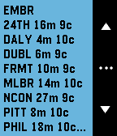</a>

<h2 class="app-name" id="app-56ce4a6c86ce3b1bb3000058"><a href="https://apps.repebble.com/56ce4a6c86ce3b1bb3000058">Barty</a></h2>
<a class="app-source" href="https://github.com/kashodiya/barty" title="Source code" data-search-exclude>View source</a>

by <a href="https://apps.repebble.com/apps/dev/kaushik-ashodiya_56c1ef15919c5a4dc800000b" title="More from this developer">Kaushik Ashodiya</a>

Not checked yet v1.1 Updated 2016-02-25

Runs on: Round 2, Time 2, Pebble 2 Duo, Pebble 2, Time Round, Time, Classic

Get realtime BART arrivals.

<a class="app-shot" href="https://apps.repebble.com/d1138c758eec41a8b0a7e42b" data-search-exclude>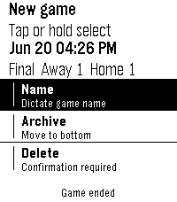</a>

<h2 class="app-name" id="app-d1138c758eec41a8b0a7e42b"><a href="https://apps.repebble.com/d1138c758eec41a8b0a7e42b">Basebble</a></h2>
<a class="app-source" href="https://github.com/nick1udwig/basebble" title="Source code" data-search-exclude>View source</a>

by <a href="https://apps.repebble.com/apps/dev/nick1udwig_d30aec49b29caa20180a2880" title="More from this developer">nick1udwig</a>

Not checked yet v0.1.0 Updated 2026-06-21

Runs on: Round 2, Time 2

A simple baseball game score tracker for Pebble

<h2 class="app-name" id="app-540a4c7a76ce62ae50000029"><a href="https://apps.repebble.com/540a4c7a76ce62ae50000029">bash</a></h2>
<a class="app-source" href="https://github.com/joe-choi" title="Source code" data-search-exclude>View source</a>

by <a href="https://apps.repebble.com/apps/dev/joseph-choi_531e5c533b23771b89000370" title="More from this developer">Joseph Choi</a>

Not checked yet v0.8 Updated 2014-09-05

Runs on: Time 2, Pebble 2 Duo, Pebble 2, Time, Classic

Born Again Simon with Hands or &#x27;bash&#x27; for short is a watchapp game for the Pebble inspired by Simon the game. By utilizing the 3 available buttons along with the accelerometer on the Pebble, the…

<a class="app-shot" href="https://apps.repebble.com/f790b98190a34e8aac58633c" data-search-exclude>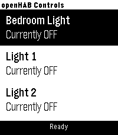</a>

<h2 class="app-name" id="app-f790b98190a34e8aac58633c"><a href="https://apps.repebble.com/f790b98190a34e8aac58633c">BasicOpenHab</a></h2>
<a class="app-source" href="https://github.com/widemouth31/BasicOpenHab2" title="Source code" data-search-exclude>View source</a>

by <a href="https://apps.repebble.com/apps/dev/chris-hardwick_1cae56f6fe053d3fd4e9d111" title="More from this developer">Chris Hardwick</a>

Not checked yet v1.1 Updated 2026-06-24

Runs on: Round 2, Time 2, Pebble 2 Duo, Pebble 2, Time Round, Time, Classic

A simple app for toggling OpenHAB items. You can configure your OpenHAB server address and port, along with item display titles and exact item names. Item names must match those defined in your…

<a class="app-shot" href="https://apps.repebble.com/67cdf529b7a023034a3395c3" data-search-exclude>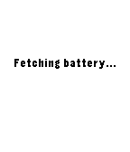</a>

<h2 class="app-name" id="app-67cdf529b7a023034a3395c3"><a href="https://apps.repebble.com/67cdf529b7a023034a3395c3">Battery Callback</a></h2>
<a class="app-source" href="https://github.com/StefanBauwens/BatteryCallback" title="Source code" data-search-exclude>View source</a>

by <a href="https://apps.repebble.com/apps/dev/stefan-bauwens_599dee8a461a8d18890012bc" title="More from this developer">Stefan Bauwens</a>

No licence v1.1 Updated 2025-03-10

Runs on: Round 2, Time 2, Pebble 2 Duo, Pebble 2, Time Round, Time, Classic

This is a battery tool I created for the Rebble Hackathon #002. It gives you the possibility to (automatically) post your Pebble&#x27;s battery status to your REST server. The payload is a…

<a class="app-shot" href="https://apps.repebble.com/576e48e2ba2fe55fb2000029" data-search-exclude>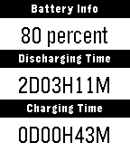</a>

<h2 class="app-name" id="app-576e48e2ba2fe55fb2000029"><a href="https://apps.repebble.com/576e48e2ba2fe55fb2000029">Battery life</a></h2>
<a class="app-source" href="https://github.com/qwqert/Pebble_apps" title="Source code" data-search-exclude>View source</a>

by <a href="https://apps.repebble.com/apps/dev/qwqert_563040ae4cb14285e0000029" title="More from this developer">qwqert</a>

Not checked yet v1.0 Updated 2016-06-25

Runs on: Time 2, Pebble 2 Duo, Pebble 2, Time, Classic

Trace how many days your battery has lasted.

<a class="app-shot" href="https://apps.repebble.com/55cb4982ce49c23880000064" data-search-exclude>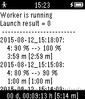</a>

<h2 class="app-name" id="app-55cb4982ce49c23880000064"><a href="https://apps.repebble.com/55cb4982ce49c23880000064">Battery Logger</a></h2>
<a class="app-source" href="https://github.com/cfg1/pebble-battery_logger" title="Source code" data-search-exclude>View source</a>

by <a href="https://apps.repebble.com/apps/dev/fg_53e39e90115605c0220000be" title="More from this developer">FG</a>

Not checked yet v1.1 Updated 2015-09-08

Runs on: Time 2, Pebble 2 Duo, Pebble 2, Time, Classic

App to measure and log battery runtime on the pebble without the phone.

<a class="app-shot" href="https://apps.repebble.com/52e1a139e819d83fcf000012" data-search-exclude>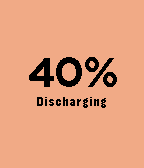</a>

<h2 class="app-name" id="app-52e1a139e819d83fcf000012"><a href="https://apps.repebble.com/52e1a139e819d83fcf000012">Battery Monitor</a></h2>
<a class="app-source" href="https://github.com/victorhaggqvist/pebble-battery-monitor" title="Source code" data-search-exclude>View source</a>

by <a href="https://apps.repebble.com/apps/dev/snilius_52b1eda4c7543f79c300002a" title="More from this developer">Snilius</a>

Not checked yet v1.5 Updated 2015-11-21

Runs on: Round 2, Time 2, Pebble 2 Duo, Pebble 2, Time Round, Time, Classic

A simple battery monitor Hint: You can toggle the text with the middle button

<a class="app-shot" href="https://apps.repebble.com/5682947f94ffb2cd410000a9" data-search-exclude>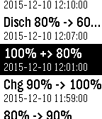</a>

<h2 class="app-name" id="app-5682947f94ffb2cd410000a9"><a href="https://apps.repebble.com/5682947f94ffb2cd410000a9">Battery-</a></h2>
<a class="app-source" href="https://github.com/faelys/battery-minus" title="Source code" data-search-exclude>View source</a>

by <a href="https://apps.repebble.com/apps/dev/natasha-kerensikova_55f99a40708b83306b00007f" title="More from this developer">Natasha Kerensikova</a>

Not checked yet v1.1 Updated 2016-02-03

Runs on: Round 2, Time 2, Pebble 2 Duo, Pebble 2, Time Round, Time, Classic

Battery- uses the activity tracker slot to gather all battery-related events and store them for further display. This is very similar to Battery+ from Ycleptic Studios, except that data is not…

<a class="app-shot" href="https://apps.repebble.com/52ef9118c503c88ecb00003f" data-search-exclude>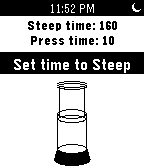</a>

<h2 class="app-name" id="app-52ef9118c503c88ecb00003f"><a href="https://apps.repebble.com/52ef9118c503c88ecb00003f">baWrista</a></h2>
<a class="app-source" href="http://github.com/jogloran/bawrista2" title="Source code" data-search-exclude>View source</a>

by <a href="https://apps.repebble.com/apps/dev/daniel-tse_52d0bf4d336477716e0000a9" title="More from this developer">Daniel Tse</a>

No licence v1.0.0 Updated 2014-02-03

Runs on: Time 2, Pebble 2 Duo, Pebble 2, Time, Classic

A timer for French press, Aeropress and plunger coffee, with animated Aeropress! Set steep time and press time with the up and down buttons, then confirm each with the select button. The Pebble&#x27;s…

<a class="app-shot" href="https://apps.repebble.com/879a5ce7d61b4cf49bf775e5" data-search-exclude>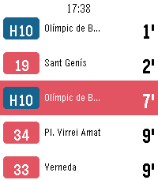</a>

<h2 class="app-name" id="app-879a5ce7d61b4cf49bf775e5"><a href="https://apps.repebble.com/879a5ce7d61b4cf49bf775e5">BCN Bus - live Barcelona bus times</a></h2>
<a class="app-source" href="https://github.com/danigili/pebble-bcn-bus" title="Source code" data-search-exclude>View source</a>

by <a href="https://apps.repebble.com/apps/dev/unknown_1d0816face36d1d60e4c110d" title="More from this developer">Unknown</a>

Not checked yet v1.0.0 Updated 2026-09-16

Runs on: Round 2, Time 2, Pebble 2 Duo, Pebble 2, Time Round, Time

Real-time bus arrivals for Barcelona on your Pebble. See how long until the next bus at any TMB stop without taking your phone out. Favourites— keep the stops you use every day and open them in…

<h2 class="app-name" id="app-54d5014d4ba7647bbe0000ba"><a href="https://apps.repebble.com/54d5014d4ba7647bbe0000ba">BCN Urban Mobility (for Pebble)</a></h2>
<a class="app-source" href="https://github.com/oscarrc/BUMP4Pebble" title="Source code" data-search-exclude>View source</a>

by <a href="https://apps.repebble.com/apps/dev/oscar-r-c_54885460602bcd8c2a000033" title="More from this developer">Oscar R.C.</a>

Not checked yet v1.0 Updated 2015-02-24

Runs on: Time 2, Pebble 2 Duo, Pebble 2, Time, Classic

With Barcelona Urban Mobility (for Pebble) you will always know where the nearest station is. This is a simple Pebble.js app that let you find bicing, bus, subway, train and tramway stations. It…

<a class="app-shot" href="https://apps.repebble.com/53d873a30a91e8ee99000100" data-search-exclude>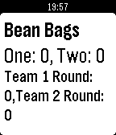</a>

<h2 class="app-name" id="app-53d873a30a91e8ee99000100"><a href="https://apps.repebble.com/53d873a30a91e8ee99000100">Bean Bags</a></h2>
<a class="app-source" href="http://pastie.org/9430766" title="Source code" data-search-exclude>View source</a>

by <a href="https://apps.repebble.com/apps/dev/jake-schultz_52f0f7a24ae3634df7000b35" title="More from this developer">Jake Schultz</a>

See source v1.0 Updated 2014-07-30

Runs on: Time 2, Pebble 2 Duo, Pebble 2, Time, Classic

A great app to keep score of your bean bags game! Controls: Up and Down: Change the round score up or down Up and Down Hold: Change the score by three Select: Toggle between teams Select Hold…

<a class="app-shot" href="https://apps.repebble.com/8dc9802adc3745f08cc4c913" data-search-exclude>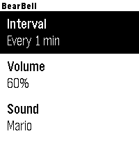</a>

<h2 class="app-name" id="app-8dc9802adc3745f08cc4c913"><a href="https://apps.repebble.com/8dc9802adc3745f08cc4c913">BearBell</a></h2>
<a class="app-source" href="https://github.com/changing-k-tanaka/pebble-watchapp-bearbell" title="Source code" data-search-exclude>View source</a>

by <a href="https://apps.repebble.com/apps/dev/changing-k-tanaka_69d06e418ce708000859e6f6" title="More from this developer">changing-k-tanaka</a>

Not checked yet v1.0.0 Updated 2026-05-03

Runs on: Time 2, Pebble 2 Duo

This app might serve as an alternative to a bear bell. Bear bells are known as an effective preventive measure for alerting bears to human presence through sound and preventing unexpected…

<a class="app-shot" href="https://apps.repebble.com/f1152802609442c08cb60daf" data-search-exclude>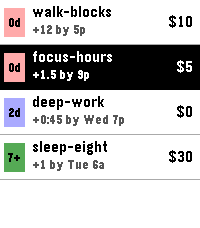</a>

<h2 class="app-name" id="app-f1152802609442c08cb60daf"><a href="https://apps.repebble.com/f1152802609442c08cb60daf">Beehave</a></h2>
<a class="app-source" href="https://tangled.org/secluded.site/beehave" title="Source code" data-search-exclude>View source</a>

by <a href="https://apps.repebble.com/apps/dev/amolith_765459e0318e61f6f01a5b2a" title="More from this developer">Amolith</a>

Not checked yet v0.1.0 Updated 2026-08-14

Runs on: Time 2

Beehave is an unofficial Beeminder client for Pebble Time 2. It lists goals in Beeminder urgency order. Open a goal to see its safety buffer, requirement, deadline, and pledge. For manual goals…

<a class="app-shot" href="https://apps.repebble.com/d2ee8ca7db384c6ca9eefa57" data-search-exclude>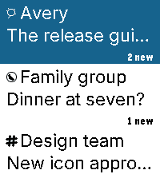</a>

<h2 class="app-name" id="app-d2ee8ca7db384c6ca9eefa57"><a href="https://apps.repebble.com/d2ee8ca7db384c6ca9eefa57">Beepster</a></h2>
<a class="app-source" href="https://github.com/GeezusChrotch/beepster" title="Source code" data-search-exclude>View source</a>

by <a href="https://apps.repebble.com/apps/dev/organik-apps_7d03e7e4a48fa1d6c0de8596" title="More from this developer">Organik Apps</a>

MIT v0.21.0 Updated 2026-09-09

Runs on: Time 2

An independent, free, open-source Beeper client for Pebble Time 2. Read chats, dictate replies, use saved replies and bitmap emoji, and view full-width photos. Reactions appear beneath messages…

<a class="app-shot" href="https://apps.repebble.com/54723e25bc2952b77f0000c3" data-search-exclude>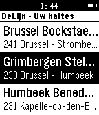</a>

<h2 class="app-name" id="app-54723e25bc2952b77f0000c3"><a href="https://apps.repebble.com/54723e25bc2952b77f0000c3">BETransport</a></h2>
<a class="app-source" href="https://github.com/Maximvdw/BETransport" title="Source code" data-search-exclude>View source</a>

by <a href="https://apps.repebble.com/apps/dev/maxim-van-de-wynckel_54636310feade13b43000052" title="More from this developer">Maxim Van de Wynckel</a>

No licence v1.1 Updated 2014-11-24

Runs on: Time 2, Pebble 2 Duo, Pebble 2, Time, Classic

BETransport is an app that provides realtime information about DeLijn and NMBS in one single app. You can configure your daily bus stops or train stations on your phone. The app is configurable in…

<a class="app-shot" href="https://apps.repebble.com/68efa55f5bf09a0009eac172" data-search-exclude>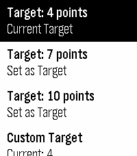</a>

<h2 class="app-name" id="app-68efa55f5bf09a0009eac172"><a href="https://apps.repebble.com/68efa55f5bf09a0009eac172">Beyblade X Simple Score Keeper</a></h2>
<a class="app-source" href="https://github.com/endgame0630/BBX-SSK" title="Source code" data-search-exclude>View source</a>

by <a href="https://apps.repebble.com/apps/dev/endgame_531b2004eb7a776ad500094b" title="More from this developer">EndGamE</a>

Not checked yet v1.6 Updated 2025-11-23

Runs on: Round 2, Time 2, Pebble 2 Duo, Pebble 2, Time Round, Time, Classic

A simple score keeper for Beyblade X

<a class="app-shot" href="https://apps.repebble.com/0cb8b674e98944d88fa3aa29" data-search-exclude>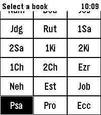</a>

<h2 class="app-name" id="app-0cb8b674e98944d88fa3aa29"><a href="https://apps.repebble.com/0cb8b674e98944d88fa3aa29">Bibble</a></h2>
<a class="app-source" href="https://github.com/nick1udwig/bibble" title="Source code" data-search-exclude>View source</a>

by <a href="https://apps.repebble.com/apps/dev/nick1udwig_d30aec49b29caa20180a2880" title="More from this developer">nick1udwig</a>

Not checked yet v0.5.0 Updated 2026-09-11

Runs on: Round 2, Time 2

A Bible app for Pebble with modern features Hold Select to dictate a Book, Chapter, or Verse, e.g. &quot;Psalms 23&quot;. Or dictate a word or phrase, e.g. &quot;God so loved the world&quot; to jump to John 3:16

<a class="app-shot" href="https://apps.repebble.com/52c63d7c7bf7b8d841000029" data-search-exclude>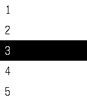</a>

<h2 class="app-name" id="app-52c63d7c7bf7b8d841000029"><a href="https://apps.repebble.com/52c63d7c7bf7b8d841000029">Bible</a></h2>
<a class="app-source" href="https://github.com/petehare/Bible" title="Source code" data-search-exclude>View source</a>

by <a href="https://apps.repebble.com/apps/dev/bengalbot_52de8fae5d0e57da26000076" title="More from this developer">Bengalbot</a>

Not checked yet v1.2 Updated 2015-11-15

Runs on: Round 2, Time 2, Pebble 2 Duo, Pebble 2, Time Round, Time, Classic

The full Bible strapped to your wrist. Navigate the entire Bible using fast book and chapter selection. Read chapters of the Bible right on your Pebble. Bible version is the New English…

<h2 class="app-name" id="app-6a3914c1884aed00097c1cb7"><a href="https://apps.rebble.io/en_US/application/6a3914c1884aed00097c1cb7">Bible Verses on Demand</a></h2>
<a class="app-source" href="https://github.com/SantiagoDePolonia/Bible_Verses_on_Demand_repebble" title="Source code" data-search-exclude>View source</a>

by <a href="https://apps.rebble.io/en_US/developer/694e91ed658abd0009484ec1/1" title="More from this developer">SantiagoDePolonia</a>

No licence v1.3.0 Updated 2026-06-22 Rebble App Store

Runs on: Round 2, Time 2, Pebble 2 Duo, Pebble 2, Time Round, Time, Classic

The app gives you Bible verses on demand. The collection contains more than 640+ verses taken from the World English Bible (Public Domain). Open the app and you get a random verse. Press down for…

<a class="app-shot" href="https://apps.repebble.com/5633012f7d83b69b6100004e" data-search-exclude>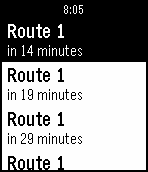</a>

<h2 class="app-name" id="app-5633012f7d83b69b6100004e"><a href="https://apps.repebble.com/5633012f7d83b69b6100004e">Big Blue Bus (unofficial beta)</a></h2>
<a class="app-source" href="https://github.com/johnheroy/bbb-api" title="Source code" data-search-exclude>View source</a>

by <a href="https://apps.repebble.com/apps/dev/john-heroy_556b2f1c761822fa23000020" title="More from this developer">John Heroy</a>

Not checked yet v1.0 Updated 2015-10-31

Runs on: Time 2, Pebble 2 Duo, Pebble 2, Time, Classic

Simple app to find the nearest bus stops and upcoming arrivals for the Big Blue Bus (transit system in Santa Monica, California).

<h2 class="app-name" id="app-69cbf53974b3f700092fd631"><a href="https://apps.repebble.com/69cbf53974b3f700092fd631">Big Date</a></h2>
<a class="app-source" href="https://github.com/cobredev/big-date" title="Source code" data-search-exclude>View source</a>

by <a href="https://apps.repebble.com/apps/dev/cobre_60c3e2b38c5c1d00089f9d1f" title="More from this developer">cobre</a>

Not checked yet v2.3.0 Updated 2026-08-03

Runs on: Round 2, Time 2, Pebble 2 Duo, Pebble 2, Time Round, Time, Classic

Shows a simple date view. Great for assigning to a Quick Launch action when using faces that don&#x27;t show the date!

<a class="app-shot" href="https://apps.repebble.com/b2b9a975d9ab466f98cb4a2d" data-search-exclude>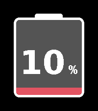</a>

<h2 class="app-name" id="app-b2b9a975d9ab466f98cb4a2d"><a href="https://apps.repebble.com/b2b9a975d9ab466f98cb4a2d">Big Rock Battery</a></h2>
<a class="app-source" href="https://github.com/snrkl-labs/BigRockBattery" title="Source code" data-search-exclude>View source</a>

by <a href="https://apps.repebble.com/apps/dev/snrkl-labs_4aece47c3cbfb14d594e6f1b" title="More from this developer">snrkl labs</a>

Not checked yet v1.4.0 Updated 2026-08-14

Runs on: Round 2, Time 2, Pebble 2 Duo, Pebble 2, Time Round, Time, Classic

I can&#x27;t see any of the built in battery gauges on the default watch while wearing my glasses, let alone without them on. This solves that problem: A giant watch battery gauge that I can see from…

<a class="app-shot" href="https://apps.repebble.com/540c2471f1b69c5228000044" data-search-exclude>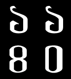</a>

<h2 class="app-name" id="app-540c2471f1b69c5228000044"><a href="https://apps.repebble.com/540c2471f1b69c5228000044">Big Time Bangla</a></h2>
<a class="app-source" href="https://github.com/ranacse05/OpenSource" title="Source code" data-search-exclude>View source</a>

by <a href="https://apps.repebble.com/apps/dev/71codes_52f1143bbb3423cd340015f1" title="More from this developer">71codes</a>

Not checked yet v1.0 Updated 2014-09-07

Runs on: Time 2, Pebble 2 Duo, Pebble 2, Time, Classic

Bangla version of the popular watch face Big Time

<a class="app-shot" href="https://apps.rebble.io/en_US/application/572c146d68ddfb5a09000006" data-search-exclude>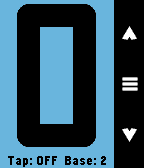</a>

<h2 class="app-name" id="app-572c146d68ddfb5a09000006"><a href="https://apps.rebble.io/en_US/application/572c146d68ddfb5a09000006">BigCounter</a></h2>
<a class="app-source" href="https://github.com/aocodermx/BigCounter" title="Source code" data-search-exclude>View source</a>

by <a href="https://apps.rebble.io/en_US/developer/564109d4ae3ac6afa2000084/1" title="More from this developer">aocodermx</a>

GPL-3.0 v1.1 Updated 2016-05-21 Rebble App Store

Runs on: Time 2, Pebble 2 Duo, Pebble 2, Time, Classic

Count anything using the whole Pebble screen with BIG NUMBERS. No more small counts, no more small numbers. Features: * Self adjustable BIG NUMBERS. * Select your base, from base 2 up to base 16…

<a class="app-shot" href="https://apps.repebble.com/6fa7606d637c4b4daabcb6a9" data-search-exclude>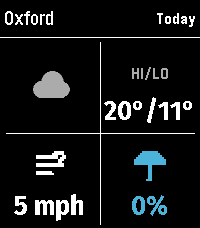</a>

<h2 class="app-name" id="app-6fa7606d637c4b4daabcb6a9"><a href="https://apps.repebble.com/6fa7606d637c4b4daabcb6a9">BigWeather</a></h2>
<a class="app-source" href="https://github.com/benjaminjgill/BigWeather" title="Source code" data-search-exclude>View source</a>

by <a href="https://apps.repebble.com/apps/dev/zeroesandones_2e6cca3d47b90f5b14f075bb" title="More from this developer">zeroesandones</a>

No licence v2.2.5 Updated 2026-10-04

Runs on: Round 2, Time 2, Pebble 2 Duo, Pebble 2, Time Round, Time

My eyesight isn&#x27;t as great as it used to be when I bought the first Pebble watch many moons ago (pesky ageing.......) Anyway it seems like all the weather apps are trying to cram loads of…

<a class="app-shot" href="https://apps.repebble.com/4cdfd7b2a87b4be4a4237639" data-search-exclude>No screenshot</a>

<h2 class="app-name" id="app-4cdfd7b2a87b4be4a4237639"><a href="https://apps.repebble.com/4cdfd7b2a87b4be4a4237639">Bike or Drive</a></h2>
<a class="app-source" href="https://github.com/rjcoolpix880/bike-or-drive" title="Source code" data-search-exclude>View source</a>

by <a href="https://apps.repebble.com/apps/dev/rjcoolpix880_af195152e8cacbf68bf0c26a" title="More from this developer">rjcoolpix880</a>

Not checked yet v0.3 Updated 2026-03-27

Runs on: Round 2, Time 2, Pebble 2 Duo, Pebble 2, Time Round, Time, Classic

Should I bike or drive to work today?

<a class="app-shot" href="https://apps.repebble.com/5717f5d4c883965d2f000016" data-search-exclude>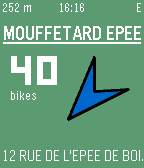</a>

<h2 class="app-name" id="app-5717f5d4c883965d2f000016"><a href="https://apps.repebble.com/5717f5d4c883965d2f000016">Bike Sharer</a></h2>
<a class="app-source" href="https://github.com/bcaller/pebble-bike-sharer" title="Source code" data-search-exclude>View source</a>

by <a href="https://apps.repebble.com/apps/dev/caller_56525a397984dec394000002" title="More from this developer">Caller</a>

GPL-3.0 v2.6 Updated 2016-10-26

Runs on: Round 2, Time 2, Pebble 2 Duo, Pebble 2, Time Round, Time, Classic

Find the nearest bike or parking spot in your city&#x27;s bicycle rental scheme. 1) open app and it will detect your city and start finding bikes near your location 2) choose bike or parking (UP to…

<a class="app-shot" href="https://apps.repebble.com/565a775914c644609649f321" data-search-exclude>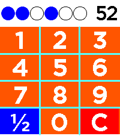</a>

<h2 class="app-name" id="app-565a775914c644609649f321"><a href="https://apps.repebble.com/565a775914c644609649f321">Binary Practice</a></h2>
<a class="app-source" href="https://github.com/Pokornz/binary-practice-pebble/tree/main" title="Source code" data-search-exclude>View source</a>

by <a href="https://apps.repebble.com/apps/dev/pokornz_68a13218defdcdea00679f24" title="More from this developer">Pokornz</a>

No licence v1.0.0 Updated 2026-08-07

Runs on: Time 2

Do you like watchfaces with binary time representation, but want to get better (faster) at mental conversion to decimal? This watch app prompts you with randomly generated number from 1 to 59 (for…

<a class="app-shot" href="https://apps.repebble.com/f9ddda6125db46fc99853a90" data-search-exclude>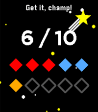</a>

<h2 class="app-name" id="app-f9ddda6125db46fc99853a90"><a href="https://apps.repebble.com/f9ddda6125db46fc99853a90">Bit Spender</a></h2>
<a class="app-source" href="https://github.com/TondaEU/BitSpender" title="Source code" data-search-exclude>View source</a>

by <a href="https://apps.repebble.com/apps/dev/tonda_aac7273b748d6598b0c5afe8" title="More from this developer">Tonda</a>

CC0-1.0 v1.51 Updated 2026-08-15

Runs on: Time 2, Pebble 2 Duo, Pebble 2, Time, Classic

Companion app for my &#x27;bit spender&#x27; productivity system. Each day you get 10 bits at 3 am and you have to spend them all before you can chillax in the evening. Each bit is spent for a specific…

<a class="app-shot" href="https://apps.repebble.com/52f020ce3be62017e1000661" data-search-exclude>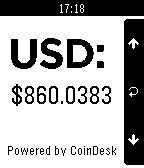</a>

<h2 class="app-name" id="app-52f020ce3be62017e1000661"><a href="https://apps.repebble.com/52f020ce3be62017e1000661">BitCoin</a></h2>
<a class="app-source" href="https://github.com/RocketMan1988/Pebble-BitCoin" title="Source code" data-search-exclude>View source</a>

by <a href="https://apps.repebble.com/apps/dev/rocketman_52d166c0c6abd2385c000029" title="More from this developer">RocketMan</a>

No licence v1.0.2 Updated 2014-03-26

Runs on: Time 2, Pebble 2 Duo, Pebble 2, Time, Classic

The application gets the current market price of a BitCoin in USD, EUR, and GBP. The select button is used to refresh the price. The up and down buttons are used to scroll between USD, EUR, and…

<a class="app-shot" href="https://apps.repebble.com/55704e25ad6c5b80320000b1" data-search-exclude>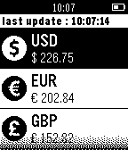</a>

<h2 class="app-name" id="app-55704e25ad6c5b80320000b1"><a href="https://apps.repebble.com/55704e25ad6c5b80320000b1">Bitcoin Price Index</a></h2>
<a class="app-source" href="https://github.com/streamdataio/pebbleBitcoin" title="Source code" data-search-exclude>View source</a>

by <a href="https://apps.repebble.com/apps/dev/streamdata-io_55704ce1b850f1358f0000ac" title="More from this developer">Streamdata.io</a>

Not checked yet v1.2 Updated 2015-06-17

Runs on: Time 2, Pebble 2 Duo, Pebble 2, Time, Classic

Bitcoin App provides a reliable bitcoin price index, it is based on a weighted average of prices from exchanges all over the world. With this application, you can always keep an eye on bitcoin…

<a class="app-shot" href="https://apps.repebble.com/583057898c7fff4a6900002e" data-search-exclude>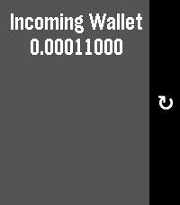</a>

<h2 class="app-name" id="app-583057898c7fff4a6900002e"><a href="https://apps.repebble.com/583057898c7fff4a6900002e">Bitcoin wallet</a></h2>
<a class="app-source" href="https://github.com/Deadolus/pebble-bitcoin" title="Source code" data-search-exclude>View source</a>

by <a href="https://apps.repebble.com/apps/dev/devegli_52c041cfb78c878ecf000052" title="More from this developer">DevEgli</a>

GPL-3.0 v1.1 Updated 2016-11-21

Runs on: Round 2, Time 2, Pebble 2 Duo, Pebble 2, Time Round, Time, Classic

Check the value of a bitcoin wallet through pebble. Configurable Wallet name and Bitcoin Address. Wallet Information from blockchain.info API

<a class="app-shot" href="https://apps.repebble.com/5712509e9fa1373237000004" data-search-exclude>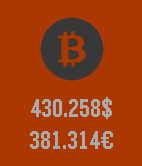</a>

<h2 class="app-name" id="app-5712509e9fa1373237000004"><a href="https://apps.repebble.com/5712509e9fa1373237000004">BitcoinToday</a></h2>
<a class="app-source" href="http://www.coindesk.com/" title="Source code" data-search-exclude>View source</a>

by <a href="https://apps.repebble.com/apps/dev/ahmed-ayed_563cb167c8f6b1fe0e000049" title="More from this developer">Ahmed-Ayed</a>

See source v2.0 Updated 2016-04-16

Runs on: Round 2, Time 2, Time Round, Time

BitcoinToday displays and monitors the current BTC exchange rates. You can set custom refresh interval and display USD and EURO rates.

<a class="app-shot" href="https://apps.rebble.io/en_US/application/53fc163a026283911c0000db" data-search-exclude>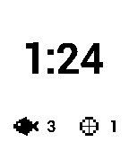</a>

<h2 class="app-name" id="app-53fc163a026283911c0000db"><a href="https://apps.rebble.io/en_US/application/53fc163a026283911c0000db">BiteBook</a></h2>
<a class="app-source" href="http://github.com/mcongrove/BiteBook" title="Source code" data-search-exclude>View source</a>

by <a href="https://apps.rebble.io/en_US/developer/52affc34e2187058f9000011/1" title="More from this developer">mcongrove</a>

No licence v1.1 Updated 2014-09-05 Rebble App Store

Runs on: Time 2, Pebble 2 Duo, Pebble 2, Time, Classic

BiteBook is a simple fish logging application. When you&#x27;re out on a boat, getting your phone out of it&#x27;s waterproof case to open a fish logging app with a million options is the worst. Who wants…

<a class="app-shot" href="https://apps.rebble.io/en_US/application/589e93d56ca38772610000e5" data-search-exclude>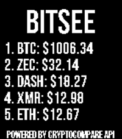</a>

<h2 class="app-name" id="app-589e93d56ca38772610000e5"><a href="https://apps.rebble.io/en_US/application/589e93d56ca38772610000e5">BitSee</a></h2>
<a class="app-source" href="https://github.com/robertDurst/BitSee" title="Source code" data-search-exclude>View source</a>

by <a href="https://apps.rebble.io/en_US/developer/5328586f29d82ffdd2000374/1" title="More from this developer">Robert Durst</a>

Not checked yet v4.0 Updated 2017-12-31 Rebble App Store

Runs on: Time 2, Pebble 2 Duo, Pebble 2, Time, Classic

Ever wanted to track cryptocurrency prices on the go? Tired of the trackers that only show BTC? Well now with the BitSee watch app you can track the top performing cryptocurrencies conveniently…

<a class="app-shot" href="https://apps.repebble.com/8b30457f0d4d483d88d698fd" data-search-exclude>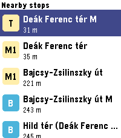</a>

<h2 class="app-name" id="app-8b30457f0d4d483d88d698fd"><a href="https://apps.repebble.com/8b30457f0d4d483d88d698fd">BKK Departures</a></h2>
<a class="app-source" href="https://github.com/keraf/pebble-bkk" title="Source code" data-search-exclude>View source</a>

by <a href="https://apps.repebble.com/apps/dev/keraf_e19acc1e1a78d97b7f3210c3" title="More from this developer">Keraf</a>

Not checked yet v1.0.0 Updated 2026-07-06

Runs on: Round 2, Time 2, Pebble 2 Duo, Pebble 2, Time Round, Time, Classic

Live Budapest public transport departures on your wrist - nearby BKK stops, real-time countdowns, and favourites.

<a class="app-shot" href="https://apps.repebble.com/9dfa9b51de8c435583370427" data-search-exclude>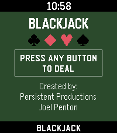</a>

<h2 class="app-name" id="app-9dfa9b51de8c435583370427"><a href="https://apps.repebble.com/9dfa9b51de8c435583370427">Blackjack</a></h2>
<a class="app-source" href="https://github.com/Joel256/Pebble-Blackjack" title="Source code" data-search-exclude>View source</a>

by <a href="https://apps.repebble.com/apps/dev/persistent-productions_807a6ca905cec674259b52f0" title="More from this developer">Persistent Productions</a>

MIT v2.1 Updated 2026-09-04

Runs on: Time 2, Pebble 2 Duo, Pebble 2, Time, Classic

Blackjack for Pebble Classic player vs. dealer, single 52 card deck, no betting Designed for Pebble 2 Duo Open source code — github.com/Joel256/Pebble-Blackjack Made by: Persistent Productions …

<a class="app-shot" href="https://apps.repebble.com/52c15f6c2be6d87e63000053" data-search-exclude>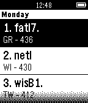</a>

<h2 class="app-name" id="app-52c15f6c2be6d87e63000053"><a href="https://apps.repebble.com/52c15f6c2be6d87e63000053">BLC Rooster</a></h2>
<a class="app-source" href="https://github.com/se-bastiaan/pebble-blcrooster" title="Source code" data-search-exclude>View source</a>

by <a href="https://apps.repebble.com/apps/dev/s-bastiaan-versteeg_52b1e6cf3beaa0d7e500000b" title="More from this developer">Sébastiaan Versteeg</a>

Not checked yet v1.0.0 Updated 2013-12-30

Runs on: Time 2, Pebble 2 Duo, Pebble 2, Time, Classic

Small application to show timetables of Blariacumcollege, Venlo, The Netherlands.

<a class="app-shot" href="https://apps.repebble.com/5590333aa0821d86ad000086" data-search-exclude>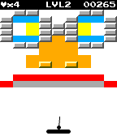</a>

<h2 class="app-name" id="app-5590333aa0821d86ad000086"><a href="https://apps.repebble.com/5590333aa0821d86ad000086">Block Breaker</a></h2>
<a class="app-source" href="https://github.com/TheIronDuke5000/Pebble-breakout" title="Source code" data-search-exclude>View source</a>

by <a href="https://apps.repebble.com/apps/dev/ironduke-industries_541cb5ceb69a1d19c90001cf" title="More from this developer">IronDuke Industries</a>

GPL-3.0 v1.7 Updated 2015-08-31

Runs on: Time 2, Pebble 2 Duo, Pebble 2, Time, Classic

It all started when Steve Wozniak created Breakout, a single player version of Pong. Since then many games have been created with the same style (Arkanoid, Brick Breaker, etc.). Block Breaker…

<a class="app-shot" href="https://apps.repebble.com/580a13ade195684f5a000132" data-search-exclude>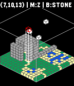</a>

<h2 class="app-name" id="app-580a13ade195684f5a000132"><a href="https://apps.repebble.com/580a13ade195684f5a000132">Block World</a></h2>
<a class="app-source" href="https://github.com/pebble-hacks/block-world" title="Source code" data-search-exclude>View source</a>

by <a href="https://apps.repebble.com/apps/dev/dennis-bednarz_58061cb19392fff80200021e" title="More from this developer">Dennis Bednarz</a>

Not checked yet v1.0 Updated 2016-10-21

Runs on: Round 2, Time 2, Time Round, Time

Simple &#x27;block-builder&#x27; game for Pebble SDK 3.0. Uses modified PGE and isometric libraries to show a grid of 16 x 16 x 14 blocks that can be placed by the user. Made by Pebble Hacks.

<a class="app-shot" href="https://apps.repebble.com/64bd08371b3bd8056570ae77" data-search-exclude>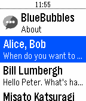</a>

<h2 class="app-name" id="app-64bd08371b3bd8056570ae77"><a href="https://apps.repebble.com/64bd08371b3bd8056570ae77">BlueBubbles</a></h2>
<a class="app-source" href="https://github.com/WinterPhoenix/pebble-bluebubbles" title="Source code" data-search-exclude>View source</a>

by <a href="https://apps.repebble.com/apps/dev/winterphoenix_549c434c0544721b720005c1" title="More from this developer">WinterPhoenix</a>

MIT v1.3 Updated 2023-07-29

Runs on: Round 2, Time 2, Pebble 2 Duo, Pebble 2, Time Round, Time, Classic

Send iMessages using your Pebble smartwatch! BlueBubbles works independently of the smartphone you have. This works with both iOS and Android! # Requirements 1. A Pebble smartwatch (w/ microphone…

<a class="app-shot" href="https://apps.rebble.io/en_US/application/67c3afe7d2acb30009a3c7c2" data-search-exclude>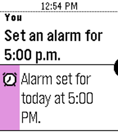</a>

<h2 class="app-name" id="app-67c3afe7d2acb30009a3c7c2"><a href="https://apps.rebble.io/en_US/application/67c3afe7d2acb30009a3c7c2">Bobby</a></h2>
<a class="app-source" href="https://github.com/pebble-dev/bobby-assistant" title="Source code" data-search-exclude>View source</a>

by <a href="https://apps.rebble.io/en_US/developer/603aa992cee2f013540a42bb/1" title="More from this developer">Rebble</a>

Not checked yet v1.5 Updated 2026-05-01 Rebble App Store

Runs on: Time 2, Pebble 2 Duo, Pebble 2, Time

Bobby is a new voice assistant for Pebble, powered by large language models. Bobby can: - Answer questions about general knowledge - Do calculations for you - Tell you the weather - Set timers and…

<a class="app-shot" href="https://apps.rebble.io/en_US/application/5aee3639f38588014500083b" data-search-exclude>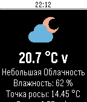</a>

<h2 class="app-name" id="app-5aee3639f38588014500083b"><a href="https://apps.rebble.io/en_US/application/5aee3639f38588014500083b">Bobruisk info</a></h2>
<a class="app-source" href="https://github.com/klejnov/Pebble-Bobruisk-info" title="Source code" data-search-exclude>View source</a>

by <a href="https://apps.rebble.io/en_US/developer/5adb79f5461a8d1f9e000849/1" title="More from this developer">klejnov</a>

Not checked yet v1.2 Updated 2018-05-07 Rebble App Store

Runs on: Time 2, Time

Актуальная погода в Бобруйске и свежие курсы валют всегда у вас на руке :) Беларусь. Бобруйск

<a class="app-shot" href="https://apps.repebble.com/546eb7115c3354a16700004d" data-search-exclude>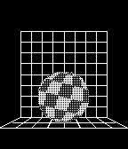</a>

<h2 class="app-name" id="app-546eb7115c3354a16700004d"><a href="https://apps.repebble.com/546eb7115c3354a16700004d">Boing Ball</a></h2>
<a class="app-source" href="https://bitbucket.org/ben-hudson/boing-ball" title="Source code" data-search-exclude>View source</a>

by <a href="https://apps.repebble.com/apps/dev/ben-hudson_5321a477c854ef9df40000d2" title="More from this developer">Ben Hudson</a>

See source v1.0 Updated 2014-11-21

Runs on: Time 2, Pebble 2 Duo, Pebble 2, Time, Classic

The iconic Amiga Boing Ball, on your wrist. Built on the minimal OpenGL 1.1 engine from PebbleGL 3D.

<h2 class="app-name" id="app-53e123f33a36f48e68000188"><a href="https://apps.repebble.com/53e123f33a36f48e68000188">Bola 8</a></h2>
<a class="app-source" href="https://github.com/Alianar/Bola-8-para-Pebble" title="Source code" data-search-exclude>View source</a>

by <a href="https://apps.repebble.com/apps/dev/allmycircuits-io_53da8be0e763e0c122000040" title="More from this developer">AllMyCircuits.io</a>

No licence v1.0 Updated 2014-08-05

Runs on: Time 2, Pebble 2 Duo, Pebble 2, Time, Classic

Juego clásico de la Bola 8 en Español que da diferentes respuestas aleatorias cuando se agita el dispositivo.

<h2 class="app-name" id="app-3c15e779928d45008d602236"><a href="https://apps.repebble.com/3c15e779928d45008d602236">BOM Weather</a></h2>
<a class="app-source" href="https://github.com/erad84/BOM-Weather" title="Source code" data-search-exclude>View source</a>

by <a href="https://apps.repebble.com/apps/dev/erad84_82bfdc4637e455ac2605841f" title="More from this developer">erad84</a>

Not checked yet v1.1.2 Updated 2026-08-30

Runs on: Round 2, Time 2, Pebble 2 Duo, Pebble 2, Time Round, Time, Classic

An app for the Australian Bureau of Meteorology (BOM) weather service. Features: - Set or auto-detect your town for weather specific to you - Looping Rain Radar with various distance views (use…

<h2 class="app-name" id="app-6a89368b6a9b270009227f6b"><a href="https://apps.repebble.com/6a89368b6a9b270009227f6b">BombleMan Demo</a></h2>
<a class="app-source" href="https://github.com/HarrisonAllen/bombleman" title="Source code" data-search-exclude>View source</a>

by <a href="https://apps.repebble.com/apps/dev/harrison-allen_5e28ea923dd3109f151c7e08" title="More from this developer">Harrison Allen</a>

No licence v1.1.0 Updated 2026-08-23

Runs on: Round 2, Time 2, Pebble 2 Duo, Pebble 2, Time Round, Time

BombleMan is a Bomberman clone for (most) Pebbles! Face off against 3 CPUs across 3 levels to become the ultimate &quot;Bombler&quot;! To play: * Select to move * Up/Down to turn * Back to place a bomb *…

<h2 class="app-name" id="app-46ec3663320f42c8bc17127c"><a href="https://apps.repebble.com/46ec3663320f42c8bc17127c">Bonnaroo 26</a></h2>
<a class="app-source" href="https://github.com/eric-lindholm/bonnaroo-26/tree/main" title="Source code" data-search-exclude>View source</a>

by <a href="https://apps.repebble.com/apps/dev/eric-lindholm_69333f1ad049f400089f6b46" title="More from this developer">Eric Lindholm</a>

Not checked yet v1.0.0 Updated 2026-05-19

Runs on: Time 2, Pebble 2 Duo, Pebble 2

An unofficial festival schedule app for Bonnaroo 2026. Browse shows, plan your festival, and get reminders when a show you don&#x27;t want to miss is coming up. Browse shows by day or stage, click into…

<h2 class="app-name" id="app-557323107d6f3d5c37000067"><a href="https://apps.repebble.com/557323107d6f3d5c37000067">Bookmarks</a></h2>
<a class="app-source" href="https://github.com/cfg1/pebble-bookmarks" title="Source code" data-search-exclude>View source</a>

by <a href="https://apps.repebble.com/apps/dev/fg_53e39e90115605c0220000be" title="More from this developer">FG</a>

Not checked yet v1.4 Updated 2015-06-10

Runs on: Time 2, Pebble 2 Duo, Pebble 2, Time, Classic

Simple watchapp that can save your page numbers when reading books. No Bluetooth connection required. Book names can be edited.

<h2 class="app-name" id="app-04b314f4955845468a2fe9a3"><a href="https://apps.repebble.com/04b314f4955845468a2fe9a3">Boulder</a></h2>
<a class="app-source" href="https://github.com/tijs/boulder" title="Source code" data-search-exclude>View source</a>

by <a href="https://apps.repebble.com/apps/dev/tijs-teulings_22e904396b7c55fbc3159d97" title="More from this developer">Tijs Teulings</a>

Not checked yet v0.1 Updated 2026-04-04

Runs on: Round 2, Time 2, Pebble 2 Duo, Pebble 2, Time Round, Time

Track your bouldering sessions right from your wrist. Log climbs by grade, mark them as flash, top, or try, and review your progress after each session. Pick your grade from the V-scale or Font…

<h2 class="app-name" id="app-2ac1cc737a7048d19b242a09"><a href="https://apps.repebble.com/2ac1cc737a7048d19b242a09">Box Breathing</a></h2>
<a class="app-source" href="https://github.com/podgorniy/pebble-box-breathing" title="Source code" data-search-exclude>View source</a>

by <a href="https://apps.repebble.com/apps/dev/podgorniy_eee1acf6754e33a7f098a973" title="More from this developer">podgorniy</a>

Not checked yet v0.5.2 Updated 2026-06-11

Runs on: Round 2, Time 2, Pebble 2 Duo, Pebble 2, Time Round, Time, Classic

Breathing technique facilitation with visual and vibration feedback

<h2 class="app-name" id="app-0d83b91c312c46c48f57753c"><a href="https://apps.repebble.com/0d83b91c312c46c48f57753c">Boxing Timer</a></h2>
<a class="app-source" href="https://github.com/vhoen/pebble-boxing-timer" title="Source code" data-search-exclude>View source</a>

by <a href="https://apps.repebble.com/apps/dev/vhoen_63dc3c53d7f92d271ff721cc" title="More from this developer">vhoen</a>

Not checked yet v1.0.4 Updated 2026-09-25

Runs on: Round 2, Time 2

Timer which alternates between exercice timer and rest timer.

<h2 class="app-name" id="app-545916455a7e52713b000075"><a href="https://apps.repebble.com/545916455a7e52713b000075">BPM Detector</a></h2>
<a class="app-source" href="https://github.com/robisodd/bpm_detector" title="Source code" data-search-exclude>View source</a>

by <a href="https://apps.repebble.com/apps/dev/robisodd_530273b74b130b71ef000192" title="More from this developer">robisodd</a>

Not checked yet v1.1 Updated 2016-03-29

Runs on: Round 2, Time 2, Pebble 2 Duo, Pebble 2, Time Round, Time, Classic

Simple BPM detector. Tap on the Pebble&#x27;s face (or tap on the table with the hand the watch is on) to get the beats per minute of your taps. Press the select button to change the sensitivity (how…

<h2 class="app-name" id="app-6a96bfc7d378d4000938224d"><a href="https://apps.repebble.com/6a96bfc7d378d4000938224d">BPM Tapper</a></h2>
<a class="app-source" href="https://github.com/tribela/pebble-bpmtapper" title="Source code" data-search-exclude>View source</a>

by <a href="https://apps.repebble.com/apps/dev/tribela_55b9ef4341919825e8000027" title="More from this developer">Tribela</a>

Not checked yet v1.1.0 Updated 2026-09-02

Runs on: Round 2, Time 2, Pebble 2 Duo, Pebble 2, Time Round, Time

Tap to detect BPM Metronome start after 2 beat no input You can adjust BPM with upper/lower button to match your music Long press middle button to setting

<h2 class="app-name" id="app-53ea37c7114d6ba266000019"><a href="https://apps.rebble.io/en_US/application/53ea37c7114d6ba266000019">Braci - Hearing Assistance</a></h2>
<a class="app-source" href="https://play.google.com/store/apps/details?id=com.ugs.braci" title="Source code" data-search-exclude>View source</a>

by <a href="https://apps.rebble.io/en_US/developer/52c1799a01696bf4a7000050/1" title="More from this developer">Braci Ltd.</a>

Not checked yet v1.6 Updated 2016-08-16 Rebble App Store

Runs on: Time 2, Pebble 2 Duo, Pebble 2, Time, Classic

Braci Ltd. Smart phone application helping deaf and hard hearing people to get alerted in case of emergencies such as : Smoke Alarms , Doorbells , Telephone Ringing and more of situations indoor…

<h2 class="app-name" id="app-54a01028bdae6cbfe70000b4"><a href="https://apps.repebble.com/54a01028bdae6cbfe70000b4">Braci - On The Go</a></h2>
<a class="app-source" href="https://play.google.com/store/apps/details?id=com.ugs.onthego" title="Source code" data-search-exclude>View source</a>

by <a href="https://apps.repebble.com/apps/dev/braci-ltd_52c1799a01696bf4a7000050" title="More from this developer">Braci Ltd.</a>

Not checked yet v1.0 Updated 2014-12-31

Runs on: Time 2, Pebble 2 Duo, Pebble 2, Time, Classic

Braci – ‘On The Go’ is a unique application that is used by people who are continuously on the go and out &amp; about cycling, driving or just having a walk while listening to music through their…

<h2 class="app-name" id="app-542b2906564a6e1366000026"><a href="https://apps.repebble.com/542b2906564a6e1366000026">Braci - Snoring Detector PRO</a></h2>
<a class="app-source" href="https://play.google.com/store/apps/details?id=com.ugs.snoring" title="Source code" data-search-exclude>View source</a>

by <a href="https://apps.repebble.com/apps/dev/braci-ltd_52c1799a01696bf4a7000050" title="More from this developer">Braci Ltd.</a>

Not checked yet v1.2 Updated 2015-06-04

Runs on: Time 2, Pebble 2 Duo, Pebble 2, Time, Classic

Description Braci - Snoring Detector App able to detect snoring during night using ( Braci -Snoring Detector App on google store ) using microphone to detect the snore &amp; notify you by short…

<h2 class="app-name" id="app-e4f66f24bb0a440b9f6aad69"><a href="https://apps.repebble.com/e4f66f24bb0a440b9f6aad69">Brain Dump (index01 for your pebble)</a></h2>
<a class="app-source" href="https://github.com/adrienthiery/pebble-brain-dump-app" title="Source code" data-search-exclude>View source</a>

by <a href="https://apps.repebble.com/apps/dev/adrien0_b1f8a46227bc6b3950864489" title="More from this developer">Adrien0</a>

No licence v2.5.0 Updated 2026-09-18

Runs on: Round 2, Time 2, Pebble 2 Duo, Pebble 2, Time Round, Time

Voice-first brain dump app. Hit the middle button, speak your thought — it gets routed to AI, Notion, tasks, or saved as a local reminder.

<h2 class="app-name" id="app-55bfc89663de442269000062"><a href="https://apps.repebble.com/55bfc89663de442269000062">Brain Trainer</a></h2>
<a class="app-source" href="https://github.com/dybm/brain_tuner" title="Source code" data-search-exclude>View source</a>

by <a href="https://apps.repebble.com/apps/dev/dybm_550c124986a646389c00007e" title="More from this developer">dybm</a>

Not checked yet v1.0 Updated 2015-08-04

Runs on: Time 2, Pebble 2 Duo, Pebble 2, Time, Classic

This fun math game challenges players to identify as many right and wrong equations as possible in 30 seconds. High scores are saved to the app so you can challenge your friends to see who can get…

<h2 class="app-name" id="app-c03747b390094828979e6aa7"><a href="https://apps.repebble.com/c03747b390094828979e6aa7">BreakerBrick</a></h2>
<a class="app-source" href="https://github.com/jplexer/breakerbrick" title="Source code" data-search-exclude>View source</a>

by <a href="https://apps.repebble.com/apps/dev/jplexer_66d9e31d281f8a000981862f" title="More from this developer">JPlexer</a>

Not checked yet v1.0.1 Updated 2026-05-01

Runs on: Round 2, Time 2

A breakout clone using touch and speaker

<h2 class="app-name" id="app-52b2b725b70e1cbfca0000f1"><a href="https://apps.repebble.com/52b2b725b70e1cbfca0000f1">Breaking News</a></h2>
<a class="app-source" href="https://github.com/Neal/pebble-breakingnews" title="Source code" data-search-exclude>View source</a>

by <a href="https://apps.repebble.com/apps/dev/neal-patel_528feeab8a8c0b97c8000005" title="More from this developer">Neal Patel</a>

No licence v1.0.5 Updated 2014-01-20

Runs on: Time 2, Pebble 2 Duo, Pebble 2, Time, Classic

Breaking News for Pebble. Read the main feed from breakingnews.com on your wrist now!

<h2 class="app-name" id="app-583dc06f00355abe66000862"><a href="https://apps.repebble.com/583dc06f00355abe66000862">Breathe</a></h2>
<a class="app-source" href="https://goo.gl/czYlUe" title="Source code" data-search-exclude>View source</a>

by <a href="https://apps.repebble.com/apps/dev/cheeseisdisgusting_55fcc1f028dd98074e000037" title="More from this developer">cheeseisdisgusting</a>

Not checked yet v1.0 Updated 2018-05-05

Runs on: Round 2, Time 2, Pebble 2 Duo, Pebble 2, Time Round, Time, Classic

Take a moment to breathe. In the hectic life that we have now, take a step back and take a moment to collect our thoughts. Features ‣ A soothing circle animation with gentle pulses to indicate…

<h2 class="app-name" id="app-58392179ca3094bdc00002ba"><a href="https://apps.rebble.io/en_US/application/58392179ca3094bdc00002ba">Breathe</a></h2>
<a class="app-source" href="https://github.com/PiwwowPants/Breathe" title="Source code" data-search-exclude>View source</a>

by <a href="https://apps.rebble.io/en_US/developer/5308eabf92c45e5f39000503/1" title="More from this developer">James Downs</a>

No licence v1.0 Updated 2016-11-26 Rebble App Store

Runs on: Round 2, Time 2, Pebble 2 Duo, Pebble 2, Time Round, Time, Classic

An app to lead you through some simple breathing. &quot;min&quot; is minutes and &quot;bpm&quot; is how many breaths you wish to do a minute.

<h2 class="app-name" id="app-5968d264b67f9f9e81001ded"><a href="https://apps.rebble.io/en_US/application/5968d264b67f9f9e81001ded">BreathePlease</a></h2>
<a class="app-source" href="https://github.com/cdoyle45/BreathePlease" title="Source code" data-search-exclude>View source</a>

by <a href="https://apps.rebble.io/en_US/developer/54cd3b5b94d00b2001000027/1" title="More from this developer">cdoyle45</a>

Not checked yet v1.0 Updated 2017-07-14 Rebble App Store

Runs on: Time 2, Pebble 2 Duo, Pebble 2, Time, Classic

Simple Pebble app created to assist in regulating breathing in the event of a panic attack

<h2 class="app-name" id="app-781c85791d034faf952c68ac"><a href="https://apps.repebble.com/781c85791d034faf952c68ac">Breathing</a></h2>
<a class="app-source" href="https://github.com/julpel8/breathing" title="Source code" data-search-exclude>View source</a>

by <a href="https://apps.repebble.com/apps/dev/julpel8_4832e5dc5bcac873d9cd9ff7" title="More from this developer">julpel8</a>

Not checked yet v0.0.2 Updated 2026-06-30

Runs on: Time 2, Pebble 2 Duo

Guided breathing for Pebble: follow an animated circle through inhale/hold/exhale with per-phase vibrations. Choose a rhythm (Box, 4-7-8, Coherent…) and the number of cycles, see the time it…

<h2 class="app-name" id="app-3022b32401cd44e2a59e05a0"><a href="https://apps.repebble.com/3022b32401cd44e2a59e05a0">BrewSession</a></h2>
<a class="app-source" href="https://github.com/thejambi/BrewSession-Pebble" title="Source code" data-search-exclude>View source</a>

by <a href="https://apps.repebble.com/apps/dev/zach-burnham_939ce698485e86de8b11f7ae" title="More from this developer">Zach Burnham</a>

Not checked yet v1.2.0 Updated 2026-08-19

Runs on: Round 2, Time 2, Pebble 2 Duo, Pebble 2, Time Round, Time

A tea timer that knows which infusion you&#x27;re on. Set a custom steep time as fast as the stock timer - no tea database, no menu asking which infusion this is. Hit Start and pour during the felt…

<h2 class="app-name" id="app-5a0fc31a461a8d0a970016c2"><a href="https://apps.repebble.com/5a0fc31a461a8d0a970016c2">Bridge to 10K</a></h2>
<a class="app-source" href="https://github.com/Odja-anarchist/Pebble-B210k/blob/master/README.md" title="Source code" data-search-exclude>View source</a>

by <a href="https://apps.repebble.com/apps/dev/tkm-software_561497cfa4b13075dd000065" title="More from this developer">TKM Software</a>

No licence v1.0 Updated 2017-11-18

Runs on: Round 2, Time 2, Pebble 2 Duo, Pebble 2, Time Round, Time, Classic

Bridge to 10K (B210K) training app. Supports a list of 18 days, all with individual progress indicators. Select a day to see the steps for that day, proceed to get a countdown click with…

<h2 class="app-name" id="app-ef2689374d2e450697b75c96"><a href="https://apps.repebble.com/ef2689374d2e450697b75c96">Brilliant Hydration</a></h2>
<a class="app-source" href="https://github.com/landostock/brilliant-hydration" title="Source code" data-search-exclude>View source</a>

by <a href="https://apps.repebble.com/apps/dev/qwert-zuiop_eae89cc7ca0f5c7682c8139c" title="More from this developer">Qwert Zuiopü</a>

Not checked yet v0.9.0 Updated 2026-09-21

Runs on: Time 2

Brilliant Hydration is a simple, thoughtfully designed water tracker for your Pebble. Controls: • Up: Log a drink • Down: Correct the amount • Select: Open 7-day and 30-day statistics • Hold…

<h2 class="app-name" id="app-31ab75460ad64fccb3f36b13"><a href="https://apps.repebble.com/31ab75460ad64fccb3f36b13">Bring!</a></h2>
<a class="app-source" href="https://github.com/aiorass/bring_pebble" title="Source code" data-search-exclude>View source</a>

by <a href="https://apps.repebble.com/apps/dev/aioras_54571268d6497ea29175596e" title="More from this developer">aioras</a>

MIT v1.1.0 Updated 2026-08-26

Runs on: Round 2, Time 2, Pebble 2 Duo, Pebble 2, Time Round, Time, Classic

Sync your Bring! shopping list directly to your Pebble. Now with touch control! View pending items on your list, featuring category-specific icons (bread, dairy, fruits, vegetables, meat…

<h2 class="app-name" id="app-14543cb7d5b94dc08eaf499a"><a href="https://apps.repebble.com/14543cb7d5b94dc08eaf499a">Brush</a></h2>
<a class="app-source" href="https://github.com/david-s-svedberg/pebble-brush" title="Source code" data-search-exclude>View source</a>

by <a href="https://apps.repebble.com/apps/dev/perpetual-second-hand_3a875aec7946accb03ce9013" title="More from this developer">Perpetual Second-Hand</a>

Not checked yet v1.3.0 Updated 2026-06-26

Runs on: Time 2, Pebble 2 Duo, Pebble 2, Time, Classic

Toothbrush timer with some configurability

<h2 class="app-name" id="app-561cb30d2116352d6600003d"><a href="https://apps.repebble.com/561cb30d2116352d6600003d">BSO Baseball Indicator</a></h2>
<a class="app-source" href="https://github.com/kusanaginoturugi/bso" title="Source code" data-search-exclude>View source</a>

by <a href="https://apps.repebble.com/apps/dev/shoei-web-services_55b855c9d01005022a00001f" title="More from this developer">SHOEI WEB SERVICES</a>

Not checked yet v1.2 Updated 2015-10-28

Runs on: Round 2, Time 2, Pebble 2 Duo, Pebble 2, Time Round, Time, Classic

This Pebble app tracks balls, strikes, outs. [Back] to undo. [Up] to increase balls. [Select] to increase strikes. [Down] to increase outs. When you press the [Back] button to return to the…

<a class="app-shot" href="https://apps.repebble.com/61b1a39099e740eabd674088" data-search-exclude>No screenshot</a>

<h2 class="app-name" id="app-61b1a39099e740eabd674088"><a href="https://apps.repebble.com/61b1a39099e740eabd674088">BT Guard</a></h2>
<a class="app-source" href="https://github.com/mc0e/BT-Guard" title="Source code" data-search-exclude>View source</a>

by <a href="https://apps.repebble.com/apps/dev/mc0e_ad6881d847504c23a06d9ecb" title="More from this developer">mc0e</a>

Not checked yet v1.0.0 Updated 2026-10-02

Runs on: Time 2, Pebble 2 Duo

Keeps your phone on a tight leash. The app runs as a background app, monitoring the bluetooth connection to your phone. If the bluetooth connection is lost, it will buzz you, repeatedly until the…

<h2 class="app-name" id="app-540018687765c3b4ee000090"><a href="https://apps.repebble.com/540018687765c3b4ee000090">BTC Simple</a></h2>
<a class="app-source" href="https://github.com/srabuini/btc-simple" title="Source code" data-search-exclude>View source</a>

by <a href="https://apps.repebble.com/apps/dev/sebastian-rabuini_536ddb4a0937ded6af00006d" title="More from this developer">Sebastian Rabuini</a>

Not checked yet v1.6 Updated 2017-01-30

Runs on: Time 2, Pebble 2 Duo, Pebble 2, Time, Classic

Just the hour, the day (name and number) and the Bitcoin price. You can choose between several price providers. At the moment they are: Bitstamp, BTCe, BitcoinAverage, Coindesk, Bitfnex and OKCoin.

<h2 class="app-name" id="app-6a8615eb1d2d890009ec85f9"><a href="https://apps.rebble.io/en_US/application/6a8615eb1d2d890009ec85f9">BubbleEater</a></h2>
<a class="app-source" href="https://github.com/falense/pebble-bubble-eater" title="Source code" data-search-exclude>View source</a>

by <a href="https://apps.rebble.io/en_US/developer/6a86112c21671500096d4694/1" title="More from this developer">Falense</a>

Not checked yet v1.2.0 Updated 2026-09-23 Rebble App Store

Runs on: Round 2, Time 2, Pebble 2 Duo, Pebble 2, Time Round, Time, Classic

A bubble eater game. Uses IMU for input. Made for the Pebble Time 2, untested on others.

<h2 class="app-name" id="app-578e6ae402f6d86ce30000b4"><a href="https://apps.repebble.com/578e6ae402f6d86ce30000b4">Building Blocks</a></h2>
<a class="app-source" href="https://github.com/pebble-hacks/block-world.git" title="Source code" data-search-exclude>View source</a>

by <a href="https://apps.repebble.com/apps/dev/p1x3l_56e01ef1320b57e74000000d" title="More from this developer">P1X3L</a>

Not checked yet v1.0 Updated 2016-07-19

Runs on: Round 2, Time 2, Time Round, Time

Building Blocks!!! This is a simple game that is uses blocks! (This is a WIP) How to play! Up - Switch axis through X, Y, Z and B (Block type) Down - Move through current axis Select - Place…

<h2 class="app-name" id="app-13c6008c1c6845bdbc353519"><a href="https://apps.repebble.com/13c6008c1c6845bdbc353519">Bullet Time</a></h2>
<a class="app-source" href="https://github.com/Finbear2/bullet-time" title="Source code" data-search-exclude>View source</a>

by <a href="https://apps.repebble.com/apps/dev/finbear2_f07790fac0cf60b0d7835a3b" title="More from this developer">FinBear2</a>

No licence v1.1.0 Updated 2026-05-04

Runs on: Time 2, Pebble 2 Duo, Pebble 2, Time, Classic

# Bullet Time ## What is it? Small Matrix client for the Pebble watches. Allows users to easily send and view messages from the pebble watch and connect it with any matrix account on any matrix…

<h2 class="app-name" id="app-5608c78f2b1bc571e800001c"><a href="https://apps.repebble.com/5608c78f2b1bc571e800001c">Burrito Pronto</a></h2>
<a class="app-source" href="https://github.com/klaw23/bp-pebble" title="Source code" data-search-exclude>View source</a>

by <a href="https://apps.repebble.com/apps/dev/kevin-law_5531281dcb952bb8b700001b" title="More from this developer">Kevin Law</a>

Not checked yet v1.1 Updated 2015-09-28

Runs on: Time 2, Pebble 2 Duo, Pebble 2, Time, Classic

Burrito Pronto delivers a burrito to you at the press of a button. San Francisco only at the moment. Everything is open source! Pebble App: https://github.com/klaw23/bp-pebble Server…

<h2 class="app-name" id="app-54033440377c7ea48500005c"><a href="https://apps.repebble.com/54033440377c7ea48500005c">Bus Elche</a></h2>
<a class="app-source" href="https://github.com/pjexposito/buselche" title="Source code" data-search-exclude>View source</a>

by <a href="https://apps.repebble.com/apps/dev/pedro_535907fa2acb26c7e50001b1" title="More from this developer">Pedro</a>

Not checked yet v2.1 Updated 2016-03-14

Runs on: Time 2, Pebble 2 Duo, Pebble 2, Time, Classic

Programa para conocer el tiempo que tardan en llegar a las paradas los autobuses de Elche. Permite guardar paradas favoritas manteniendo el botón de selección pulsado durante más de 3 segundos…

<h2 class="app-name" id="app-562234ebb701b50286000046"><a href="https://apps.repebble.com/562234ebb701b50286000046">Busal</a></h2>
<a class="app-source" href="https://github.com/jmmerino/busal" title="Source code" data-search-exclude>View source</a>

by <a href="https://apps.repebble.com/apps/dev/jes-s-merino_558c141a295a7d265000009b" title="More from this developer">Jesús Merino</a>

Not checked yet v1.3 Updated 2015-11-02

Runs on: Time 2, Pebble 2 Duo, Pebble 2, Time, Classic

Busal es una aplicación para consultar el horario de los autobuses en Salamanca. Puedes saber el tiempo que tardará en llegar el autobus en una parada en concreto.

<h2 class="app-name" id="app-6967f98ca5c72300090b149a"><a href="https://apps.repebble.com/6967f98ca5c72300090b149a">BusGoodCarBad</a></h2>
<a class="app-source" href="https://github.com/MayaTelLabs/BusGoodCarBad" title="Source code" data-search-exclude>View source</a>

by <a href="https://apps.repebble.com/apps/dev/mayatel-labs_690a8ca2694cb800081c65dd" title="More from this developer">MayaTel Labs</a>

Other v3.0 Updated 2026-01-14

Runs on: Round 2, Time 2, Pebble 2 Duo, Pebble 2, Time Round, Time, Classic

Personally, I know that the #1 thing I use a smartwatch for while in a city is transit information. I know plenty of other folks do the same. With the relaunch of the Pebble infrastructure, I…

<h2 class="app-name" id="app-6a428e6a626c07000985a657"><a href="https://apps.repebble.com/6a428e6a626c07000985a657">BusPebbIL</a></h2>
<a class="app-source" href="https://github.com/EladDv/BusPebbIL" title="Source code" data-search-exclude>View source</a>

by <a href="https://apps.repebble.com/apps/dev/eladdvash_68f79f1ed3c6e4000885b87b" title="More from this developer">EladDvash</a>

Apache-2.0 v1.2.0 Updated 2026-07-15

Runs on: Round 2, Time 2, Pebble 2 Duo, Pebble 2, Time Round, Time

Initial Rebble Appstore release for Pebble. Includes live Israeli bus arrivals, favorite stops, nearby stop lookup, manual stop-code lookup, cached fallback data, configurable settings, hidden…

<h2 class="app-name" id="app-565770dca6c43e2efe000097"><a href="https://apps.repebble.com/565770dca6c43e2efe000097">Buss i Trondheim</a></h2>
<a class="app-source" href="https://github.com/torb/didactic-sniffle" title="Source code" data-search-exclude>View source</a>

by <a href="https://apps.repebble.com/apps/dev/torbj-rn-morland_55e9a7d527839ecf17000022" title="More from this developer">Torbjørn Morland</a>

Not checked yet v1.2 Updated 2016-01-14

Runs on: Time 2, Pebble 2 Duo, Pebble 2, Time, Classic

Bussavganger i sanntid for buss i Trondheim. Viser stoppene nærmest deg, enten til eller fra byen.

<h2 class="app-name" id="app-5501ea1adff303f37a000061"><a href="https://apps.repebble.com/5501ea1adff303f37a000061">Butler for Pebble</a></h2>
<a class="app-source" href="http://github.com/martingit/butler4pebble" title="Source code" data-search-exclude>View source</a>

by <a href="https://apps.repebble.com/apps/dev/martinalmstrom_52f1e11ce21be4eeec000654" title="More from this developer">martinalmstrom</a>

No licence v1.0 Updated 2015-03-12

Runs on: Time 2, Pebble 2 Duo, Pebble 2, Time, Classic

Remote control your Butler installation with this Pebble App. Requires an installation of Butler. Butler is a home automation system for Nexa devices (Telldus tellstick required). Butler server…

<h2 class="app-name" id="app-54fad867c2eca30d2a000016"><a href="https://apps.repebble.com/54fad867c2eca30d2a000016">buttLock</a></h2>
<a class="app-source" href="https://github.com/x29a/buttLock" title="Source code" data-search-exclude>View source</a>

by <a href="https://apps.repebble.com/apps/dev/x29a_5451dd1e68e936fd0600000e" title="More from this developer">x29a</a>

Not checked yet v2.2 Updated 2016-02-28

Runs on: Round 2, Time 2, Pebble 2 Duo, Pebble 2, Time Round, Time, Classic

Loving the Simplicity Watchface? But constantly accidentally push buttons and the watch displays something else? This Watchapp was inspired by the Simplicity…

<h2 class="app-name" id="app-543f02a145b1f75605000010"><a href="https://apps.repebble.com/543f02a145b1f75605000010">Button Lock for Pebble</a></h2>
<a class="app-source" href="https://github.com/orviwan/ButtonLockForPebble" title="Source code" data-search-exclude>View source</a>

by <a href="https://apps.repebble.com/apps/dev/orviwan_5299c96ae627ce3692000095" title="More from this developer">orviwan</a>

Not checked yet v1.2 Updated 2016-01-30

Runs on: Round 2, Time 2, Pebble 2 Duo, Pebble 2, Time Round, Time, Classic

Prevents accidental button presses, this actually does nothing when you press a button. Assign the app as one of your quick launch apps, then lock your Pebble with a single long press of a button…

<h2 class="app-name" id="app-d3feeca7e927466bb4997abf"><a href="https://apps.repebble.com/d3feeca7e927466bb4997abf">Buzz in X Minutes</a></h2>
<a class="app-source" href="https://github.com/justinjhendrick/buzz-in-x-minutes" title="Source code" data-search-exclude>View source</a>

by <a href="https://apps.repebble.com/apps/dev/justinjhendrick_67f68b8a23b7a90009c87db5" title="More from this developer">justinjhendrick</a>

Not checked yet v1.1.0 Updated 2026-08-02

Runs on: Time 2

A practical minimalist timer for Pebble. It&#x27;s super easy to use! Press up to add 1 minute and down to subtract 1 minute. It automatically starts counting down. When the timer expires, the watch…

<h2 class="app-name" id="app-55e1ade03ea1fb6e85000047"><a href="https://apps.repebble.com/55e1ade03ea1fb6e85000047">Buzzer</a></h2>
<a class="app-source" href="http://github.com/nvella/buzzer" title="Source code" data-search-exclude>View source</a>

by <a href="https://apps.repebble.com/apps/dev/nick-vella_55daeb16bd5403c89800008c" title="More from this developer">Nick Vella</a>

MIT v1.0 Updated 2015-08-29

Runs on: Time 2, Pebble 2 Duo, Pebble 2, Time, Classic

Buzzer is a simple watchapp that vibrates the watch on a user-set interval. Simply start the app, set how many minutes you want between buzzes and go. The Buzzer watchapp will then tell you the…

<h2 class="app-name" id="app-56d24e4db10232dc0400004a"><a href="https://apps.repebble.com/56d24e4db10232dc0400004a">BuzzVoice</a></h2>
<a class="app-source" href="http://github.com/eliyazdi/buzzvoice2" title="Source code" data-search-exclude>View source</a>

by <a href="https://apps.repebble.com/apps/dev/eli-yazdi_56d246501f7ad6655000004e" title="More from this developer">Eli Yazdi</a>

MIT v0.4 Updated 2016-02-28

Runs on: Time 2, Time

This app lets you speak into it and the app then translates what you said into vibrations in Morse code. Possible applications include being used for hard-of-hearing people.

