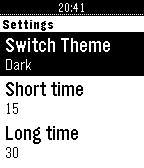

<!-- Generated by scripts/update_app_directory.py: do not edit by hand -->
# Watchapps: B

[← About this list](../watchapps.md) · [A](a.md) · **B** · [C](c.md) · [D](d.md) · [E](e.md) · [F](f.md) · [G](g.md) · [H](h.md) · [I](i.md) · [J](j.md) · [K](k.md) · [L](l.md) · [M](m.md) · [N](n.md) · [O](o.md) · [P](p.md) · [Q](q.md) · [R](r.md) · [S](s.md) · [T](t.md) · [U](u.md) · [V](v.md) · [W](w.md) · [X](x.md) · [Y](y.md) · [Z](z.md) · [0–9 & other](other.md)

*103 watchapps · Last updated 2026-10-06*

| Screenshot | Name | Developer | Licence | Updated | Description |
|------------|------|-----------|---------|---------|-------------|
| { loading=lazy width="72" } | [Baby StoneFruit](https://apps.repebble.com/db88f247deb24c56bf7794f2) | [Hoyt Labs](https://github.com/michaellunzer/babystonefruit) | <small>Not checked yet</small> | 2026-05-22 | This is the Huckleberry baby tracking app on you Pebble! It uses the Home Assistant Huckleberry Integration as a proxy since a pebble watch can't… |
| { loading=lazy width="72" } | [Baby Watch](https://apps.repebble.com/53fbc513994475c7ee0001ed) | [Miguel Branco](https://github.com/Arlanthir/pebby) | <small>No licence</small> | 2015-09-10 | Baby Watch helps you take care of your baby. It allows you to easily set the last time the baby slept, ate or had its diaper changed. Glance down and check… |
| { loading=lazy width="72" } | [Baby Watch app reborn](https://apps.repebble.com/695ca015c78a580009d9be0f) | [KamiShinn](https://github.com/saintyoga-Cyber/Baby-Watch-Reborn) | <small>Not checked yet</small> | 2026-06-26 | A revival of the Pebby (Baby watch) app - Baby tracking for Pebble smartwatches. Track bottle feedings, diaper changes, and sleep sessions right from your… |
| { loading=lazy width="72" } | [BAC2Sober](https://apps.repebble.com/3bc29e330de34d74b6f52c2a) | [J_B](https://github.com/JunderscoreB/BAC2Sober) | MIT | 2026-10-04 | BAC2Sober is a premium, real-time blood alcohol tracking companion for your Pebble smartwatch. Built with a focus on speed, privacy, and native Pebble… |
| { loading=lazy width="72" } | [Backlight](https://apps.repebble.com/558dbbc4a6c6cced76000004) | [Richard Johnson](https://github.com/rajid/pebble_backlight) | <small>Not checked yet</small> | 2018-02-07 | Simple program to automatically control your backlight. It sits in the background, allowing you to use whatever watch face you like. When you raise your arm… |
| { loading=lazy width="72" } | [Backtrack](https://apps.repebble.com/a86a293b637a4a13923d4cc0) | [yoada](https://github.com/yoann54/Backtrack) | <small>Not checked yet</small> | 2026-09-30 | Find your way back to a saved point. Drop a pin at your location and Backtrack shows a compass-oriented arrow and the distance back to it, and buzzes when… |
| { loading=lazy width="72" } | [Bad Apple!!](https://apps.rebble.io/en_US/application/682ecefc435cc40009e73634) <small>Rebble App Store</small> | [Flynn Duniho](https://github.com/FlynnD273/pebble-bad-apple) | <small>No licence</small> | 2026-05-11 | Displays the full Bad Apple!! animation on the watch, completely locally. No streaming files from the phone or the internet. |
| { loading=lazy width="72" } | [Badminton score](https://apps.repebble.com/574356ddb4818474a6000013) | [FraBo](https://github.com/FraBoCH/pebble-badminton/) | BSD-3-Clause | 2016-09-14 | An easy to use pebble app to count the points during your badminton game. Hit the bottom button when you score, the top button when your opponent scores… |
| { loading=lazy width="72" } | [Bahá'í Prayers](https://apps.repebble.com/87069cdc983047dca17368d6) | [Mitch Donaberger](https://forge.mitch.science/mitcheffendi/pebble-bahai-prayer-app) | <small>See source</small> | 2026-06-23 | An application for Bahá'ís to access a quick prayer book, act as a digital replacement for prayer beads in a pinch, and show you the current date on the… |
| { loading=lazy width="72" } | [Banner](https://apps.repebble.com/578eb23202f6d8dd8f0000ff) | [Ruud](https://github.com/Ruud48/Pebble-Banner) | <small>Not checked yet</small> | 2016-07-21 | BANNER will show very large scrolling characters/texts on your watch. This allows for showing texts to others up to 15 feet away. Texts are stored in the… |
| { loading=lazy width="72" } | [Bart Stop](https://apps.rebble.io/en_US/application/6a2224e4b9f0710009879387) <small>Rebble App Store</small> | [LavenderCorp](https://github.com/chughes87/pebble_parkway/tree/master/bart-app) | <small>Not checked yet</small> | 2026-06-05 | Configure what bart stop you want to track on your phone and this app will show the latest departure times for all destinations |
| { loading=lazy width="72" } | [Barty](https://apps.repebble.com/56ce4a6c86ce3b1bb3000058) | [Kaushik Ashodiya](https://github.com/kashodiya/barty) | <small>Not checked yet</small> | 2016-02-25 | Get realtime BART arrivals. |
| { loading=lazy width="72" } | [Basebble](https://apps.repebble.com/d1138c758eec41a8b0a7e42b) | [nick1udwig](https://github.com/nick1udwig/basebble) | <small>Not checked yet</small> | 2026-06-21 | A simple baseball game score tracker for Pebble |
| { loading=lazy width="72" } | [bash](https://apps.repebble.com/540a4c7a76ce62ae50000029) | [Joseph Choi](https://github.com/joe-choi) | <small>Not checked yet</small> | 2014-09-05 | Born Again Simon with Hands or 'bash' for short is a watchapp game for the Pebble inspired by Simon the game. By utilizing the 3 available buttons along… |
| { loading=lazy width="72" } | [BasicOpenHab](https://apps.repebble.com/f790b98190a34e8aac58633c) | [Chris Hardwick](https://github.com/widemouth31/BasicOpenHab2) | <small>Not checked yet</small> | 2026-06-24 | A simple app for toggling OpenHAB items. You can configure your OpenHAB server address and port, along with item display titles and exact item names. Item… |
| { loading=lazy width="72" } | [Battery Callback](https://apps.repebble.com/67cdf529b7a023034a3395c3) | [Stefan Bauwens](https://github.com/StefanBauwens/BatteryCallback) | <small>Not checked yet</small> | 2025-03-10 | This is a battery tool I created for the Rebble Hackathon #002. It gives you the possibility to (automatically) post your Pebble's battery status to your… |
| { loading=lazy width="72" } | [Battery life](https://apps.repebble.com/576e48e2ba2fe55fb2000029) | [qwqert](https://github.com/qwqert/Pebble_apps) | <small>Not checked yet</small> | 2016-06-25 | Trace how many days your battery has lasted. |
| { loading=lazy width="72" } | [Battery Logger](https://apps.repebble.com/55cb4982ce49c23880000064) | [FG](https://github.com/cfg1/pebble-battery_logger) | <small>Not checked yet</small> | 2015-09-08 | App to measure and log battery runtime on the pebble without the phone. |
| { loading=lazy width="72" } | [Battery Monitor](https://apps.repebble.com/52e1a139e819d83fcf000012) | [Snilius](https://github.com/victorhaggqvist/pebble-battery-monitor) | <small>Not checked yet</small> | 2015-11-21 | A simple battery monitor Hint: You can toggle the text with the middle button |
| { loading=lazy width="72" } | [Battery-](https://apps.repebble.com/5682947f94ffb2cd410000a9) | [Natasha Kerensikova](https://github.com/faelys/battery-minus) | <small>Not checked yet</small> | 2016-02-03 | Battery- uses the activity tracker slot to gather all battery-related events and store them for further display. This is very similar to Battery+ from… |
| { loading=lazy width="72" } | [baWrista](https://apps.repebble.com/52ef9118c503c88ecb00003f) | [Daniel Tse](http://github.com/jogloran/bawrista2) | <small>No licence</small> | 2014-02-03 | A timer for French press, Aeropress and plunger coffee, with animated Aeropress! Set steep time and press time with the up and down buttons, then confirm… |
| { loading=lazy width="72" } | [BCN Bus - live Barcelona bus times](https://apps.repebble.com/879a5ce7d61b4cf49bf775e5) | [Unknown](https://github.com/danigili/pebble-bcn-bus) | <small>Not checked yet</small> | 2026-09-16 | Real-time bus arrivals for Barcelona on your Pebble. See how long until the next bus at any TMB stop without taking your phone out. Favourites— keep the… |
| { loading=lazy width="72" } | [BCN Urban Mobility (for Pebble)](https://apps.repebble.com/54d5014d4ba7647bbe0000ba) | [Oscar R.C.](https://github.com/oscarrc/BUMP4Pebble) | <small>Not checked yet</small> | 2015-02-24 | With Barcelona Urban Mobility (for Pebble) you will always know where the nearest station is. This is a simple Pebble.js app that let you find bicing, bus… |
| { loading=lazy width="72" } | [Bean Bags](https://apps.repebble.com/53d873a30a91e8ee99000100) | [Jake Schultz](http://pastie.org/9430766) | <small>See source</small> | 2014-07-30 | A great app to keep score of your bean bags game! Controls: Up and Down: Change the round score up or down Up and Down Hold: Change the score by three… |
| { loading=lazy width="72" } | [BearBell](https://apps.repebble.com/8dc9802adc3745f08cc4c913) | [changing-k-tanaka](https://github.com/changing-k-tanaka/pebble-watchapp-bearbell) | <small>Not checked yet</small> | 2026-05-03 | This app might serve as an alternative to a bear bell. Bear bells are known as an effective preventive measure for alerting bears to human presence through… |
| { loading=lazy width="72" } | [Beehave](https://apps.repebble.com/f1152802609442c08cb60daf) | [Amolith](https://tangled.org/secluded.site/beehave) | <small>Not checked yet</small> | 2026-08-14 | Beehave is an unofficial Beeminder client for Pebble Time 2. It lists goals in Beeminder urgency order. Open a goal to see its safety buffer, requirement… |
| { loading=lazy width="72" } | [Beepster](https://apps.repebble.com/d2ee8ca7db384c6ca9eefa57) | [Organik Apps](https://github.com/GeezusChrotch/beepster) | MIT | 2026-09-09 | An independent, free, open-source Beeper client for Pebble Time 2. Read chats, dictate replies, use saved replies and bitmap emoji, and view full-width… |
| { loading=lazy width="72" } | [BETransport](https://apps.repebble.com/54723e25bc2952b77f0000c3) | [Maxim Van de Wynckel](https://github.com/Maximvdw/BETransport) | <small>Not checked yet</small> | 2014-11-24 | BETransport is an app that provides realtime information about DeLijn and NMBS in one single app. You can configure your daily bus stops or train stations… |
| { loading=lazy width="72" } | [Beyblade X Simple Score Keeper](https://apps.repebble.com/68efa55f5bf09a0009eac172) | [EndGamE](https://github.com/endgame0630/BBX-SSK) | <small>Not checked yet</small> | 2025-11-23 | A simple score keeper for Beyblade X |
| { loading=lazy width="72" } | [Bibble](https://apps.repebble.com/0cb8b674e98944d88fa3aa29) | [nick1udwig](https://github.com/nick1udwig/bibble) | <small>Not checked yet</small> | 2026-09-11 | A Bible app for Pebble with modern features Hold Select to dictate a Book, Chapter, or Verse, e.g. "Psalms 23". Or dictate a word or phrase, e.g. "God so… |
| { loading=lazy width="72" } | [Bible](https://apps.repebble.com/52c63d7c7bf7b8d841000029) | [Bengalbot](https://github.com/petehare/Bible) | <small>Not checked yet</small> | 2015-11-15 | The full Bible strapped to your wrist. Navigate the entire Bible using fast book and chapter selection. Read chapters of the Bible right on your Pebble… |
| { loading=lazy width="72" } | [Bible Verses on Demand](https://apps.rebble.io/en_US/application/6a3914c1884aed00097c1cb7) <small>Rebble App Store</small> | [SantiagoDePolonia](https://github.com/SantiagoDePolonia/Bible_Verses_on_Demand_repebble) | <small>Not checked yet</small> | 2026-06-22 | The app gives you Bible verses on demand. The collection contains more than 640+ verses taken from the World English Bible (Public Domain). Open the app and… |
| { loading=lazy width="72" } | [Big Blue Bus (unofficial beta)](https://apps.repebble.com/5633012f7d83b69b6100004e) | [John Heroy](https://github.com/johnheroy/bbb-api) | <small>Not checked yet</small> | 2015-10-31 | Simple app to find the nearest bus stops and upcoming arrivals for the Big Blue Bus (transit system in Santa Monica, California). |
| { loading=lazy width="72" } | [Big Date](https://apps.repebble.com/69cbf53974b3f700092fd631) | [cobre](https://github.com/cobredev/big-date) | <small>Not checked yet</small> | 2026-08-03 | Shows a simple date view. Great for assigning to a Quick Launch action when using faces that don't show the date! |
| { loading=lazy width="72" } | [Big Rock Battery](https://apps.repebble.com/b2b9a975d9ab466f98cb4a2d) | [snrkl labs](https://github.com/snrkl-labs/BigRockBattery) | <small>Not checked yet</small> | 2026-08-14 | I can't see any of the built in battery gauges on the default watch while wearing my glasses, let alone without them on. This solves that problem: A giant… |
| { loading=lazy width="72" } | [Big Time Bangla](https://apps.repebble.com/540c2471f1b69c5228000044) | [71codes](https://github.com/ranacse05/OpenSource) | <small>Not checked yet</small> | 2014-09-07 | Bangla version of the popular watch face Big Time |
| { loading=lazy width="72" } | [BigCounter](https://apps.rebble.io/en_US/application/572c146d68ddfb5a09000006) <small>Rebble App Store</small> | [aocodermx](https://github.com/aocodermx/BigCounter) | <small>Not checked yet</small> | 2016-05-21 | Count anything using the whole Pebble screen with BIG NUMBERS. No more small counts, no more small numbers. Features: * Self adjustable BIG NUMBERS. *… |
| { loading=lazy width="72" } | [BigWeather](https://apps.repebble.com/6fa7606d637c4b4daabcb6a9) | [zeroesandones](https://github.com/benjaminjgill/BigWeather) | <small>Not checked yet</small> | 2026-10-04 | My eyesight isn't as great as it used to be when I bought the first Pebble watch many moons ago (pesky ageing.......) Anyway it seems like all the weather… |
|  | [Bike or Drive](https://apps.repebble.com/4cdfd7b2a87b4be4a4237639) | [rjcoolpix880](https://github.com/rjcoolpix880/bike-or-drive) | <small>Not checked yet</small> | 2026-03-27 | Should I bike or drive to work today? |
| { loading=lazy width="72" } | [Bike Sharer](https://apps.repebble.com/5717f5d4c883965d2f000016) | [Caller](https://github.com/bcaller/pebble-bike-sharer) | <small>Not checked yet</small> | 2016-10-26 | Find the nearest bike or parking spot in your city's bicycle rental scheme. 1) open app and it will detect your city and start finding bikes near your… |
| { loading=lazy width="72" } | [Binary Practice](https://apps.repebble.com/565a775914c644609649f321) | [Pokornz](https://github.com/Pokornz/binary-practice-pebble/tree/main) | <small>Not checked yet</small> | 2026-08-07 | Do you like watchfaces with binary time representation, but want to get better (faster) at mental conversion to decimal? This watch app prompts you with… |
| { loading=lazy width="72" } | [Bit Spender](https://apps.repebble.com/f9ddda6125db46fc99853a90) | [Tonda](https://github.com/TondaEU/BitSpender) | <small>Not checked yet</small> | 2026-08-15 | Companion app for my 'bit spender' productivity system. Each day you get 10 bits at 3 am and you have to spend them all before you can chillax in the… |
| { loading=lazy width="72" } | [BitCoin](https://apps.repebble.com/52f020ce3be62017e1000661) | [RocketMan](https://github.com/RocketMan1988/Pebble-BitCoin) | <small>Not checked yet</small> | 2014-03-26 | The application gets the current market price of a BitCoin in USD, EUR, and GBP. The select button is used to refresh the price. The up and down buttons are… |
| { loading=lazy width="72" } | [Bitcoin Price Index](https://apps.repebble.com/55704e25ad6c5b80320000b1) | [Streamdata.io](https://github.com/streamdataio/pebbleBitcoin) | <small>Not checked yet</small> | 2015-06-17 | Bitcoin App provides a reliable bitcoin price index, it is based on a weighted average of prices from exchanges all over the world. With this application… |
| { loading=lazy width="72" } | [Bitcoin wallet](https://apps.repebble.com/583057898c7fff4a6900002e) | [DevEgli](https://github.com/Deadolus/pebble-bitcoin) | GPL-3.0 | 2016-11-21 | Check the value of a bitcoin wallet through pebble. Configurable Wallet name and Bitcoin Address. Wallet Information from blockchain.info API |
| { loading=lazy width="72" } | [BitcoinToday](https://apps.repebble.com/5712509e9fa1373237000004) | [Ahmed-Ayed](http://www.coindesk.com/) | <small>See source</small> | 2016-04-16 | BitcoinToday displays and monitors the current BTC exchange rates. You can set custom refresh interval and display USD and EURO rates. |
| { loading=lazy width="72" } | [BiteBook](https://apps.rebble.io/en_US/application/53fc163a026283911c0000db) <small>Rebble App Store</small> | [mcongrove](http://github.com/mcongrove/BiteBook) | <small>No licence</small> | 2014-09-05 | BiteBook is a simple fish logging application. When you're out on a boat, getting your phone out of it's waterproof case to open a fish logging app with a… |
| { loading=lazy width="72" } | [BitSee](https://apps.rebble.io/en_US/application/589e93d56ca38772610000e5) <small>Rebble App Store</small> | [Robert Durst](https://github.com/robertDurst/BitSee) | <small>Not checked yet</small> | 2017-12-31 | Ever wanted to track cryptocurrency prices on the go? Tired of the trackers that only show BTC? Well now with the BitSee watch app you can track the top… |
| { loading=lazy width="72" } | [BKK Departures](https://apps.repebble.com/8b30457f0d4d483d88d698fd) | [Keraf](https://github.com/keraf/pebble-bkk) | <small>Not checked yet</small> | 2026-07-06 | Live Budapest public transport departures on your wrist - nearby BKK stops, real-time countdowns, and favourites. |
| { loading=lazy width="72" } | [BKK Departures](https://apps.rebble.io/en_US/application/6a4bb09b06f0dc0009975df1) <small>Rebble App Store</small> | [Keraf](https://github.com/keraf/pebble-bkk) | <small>Not checked yet</small> | 2026-07-06 | Live Budapest public transport departures on your wrist - nearby BKK stops, real-time countdowns, and favourites. |
| { loading=lazy width="72" } | [Blackjack](https://apps.repebble.com/9dfa9b51de8c435583370427) | [Persistent Productions](https://github.com/Joel256/Pebble-Blackjack) | MIT | 2026-09-04 | Blackjack for Pebble Classic player vs. dealer, single 52 card deck, no betting Designed for Pebble 2 Duo Open source code —… |
| { loading=lazy width="72" } | [BLC Rooster](https://apps.repebble.com/52c15f6c2be6d87e63000053) | [Sébastiaan Versteeg](https://github.com/se-bastiaan/pebble-blcrooster) | <small>Not checked yet</small> | 2013-12-30 | Small application to show timetables of Blariacumcollege, Venlo, The Netherlands. |
| { loading=lazy width="72" } | [Block Breaker](https://apps.repebble.com/5590333aa0821d86ad000086) | [IronDuke Industries](https://github.com/TheIronDuke5000/Pebble-breakout) | <small>Not checked yet</small> | 2015-08-31 | It all started when Steve Wozniak created Breakout, a single player version of Pong. Since then many games have been created with the same style (Arkanoid… |
| { loading=lazy width="72" } | [Block World](https://apps.repebble.com/580a13ade195684f5a000132) | [Dennis Bednarz](https://github.com/pebble-hacks/block-world) | <small>Not checked yet</small> | 2016-10-21 | Simple 'block-builder' game for Pebble SDK 3.0. Uses modified PGE and isometric libraries to show a grid of 16 x 16 x 14 blocks that can be placed by the… |
| { loading=lazy width="72" } | [BlueBubbles](https://apps.repebble.com/64bd08371b3bd8056570ae77) | [WinterPhoenix](https://github.com/WinterPhoenix/pebble-bluebubbles) | <small>Not checked yet</small> | 2023-07-29 | Send iMessages using your Pebble smartwatch! BlueBubbles works independently of the smartphone you have. This works with both iOS and Android! #… |
| { loading=lazy width="72" } | [Bobby](https://apps.rebble.io/en_US/application/67c3afe7d2acb30009a3c7c2) <small>Rebble App Store</small> | [Rebble](https://github.com/pebble-dev/bobby-assistant) | <small>Not checked yet</small> | 2026-05-01 | Bobby is a new voice assistant for Pebble, powered by large language models. Bobby can: - Answer questions about general knowledge - Do calculations for you… |
| { loading=lazy width="72" } | [Bobruisk info](https://apps.rebble.io/en_US/application/5aee3639f38588014500083b) <small>Rebble App Store</small> | [klejnov](https://github.com/klejnov/Pebble-Bobruisk-info) | <small>Not checked yet</small> | 2018-05-07 | Актуальная погода в Бобруйске и свежие курсы валют всегда у вас на руке :) Беларусь. Бобруйск |
| { loading=lazy width="72" } | [Boing Ball](https://apps.repebble.com/546eb7115c3354a16700004d) | [Ben Hudson](https://bitbucket.org/ben-hudson/boing-ball) | <small>See source</small> | 2014-11-21 | The iconic Amiga Boing Ball, on your wrist. Built on the minimal OpenGL 1.1 engine from PebbleGL 3D. |
| { loading=lazy width="72" } | [Bola 8](https://apps.repebble.com/53e123f33a36f48e68000188) | [AllMyCircuits.io](https://github.com/Alianar/Bola-8-para-Pebble) | <small>No licence</small> | 2014-08-05 | Juego clásico de la Bola 8 en Español que da diferentes respuestas aleatorias cuando se agita el dispositivo. |
| { loading=lazy width="72" } | [BOM Weather](https://apps.repebble.com/3c15e779928d45008d602236) | [erad84](https://github.com/erad84/BOM-Weather) | <small>Not checked yet</small> | 2026-08-30 | An app for the Australian Bureau of Meteorology (BOM) weather service. Features: - Set or auto-detect your town for weather specific to you - Looping Rain… |
| { loading=lazy width="72" } | [BombleMan Demo](https://apps.repebble.com/6a89368b6a9b270009227f6b) | [Harrison Allen](https://github.com/HarrisonAllen/bombleman) | <small>No licence</small> | 2026-08-23 | BombleMan is a Bomberman clone for (most) Pebbles! Face off against 3 CPUs across 3 levels to become the ultimate "Bombler"! To play: * Select to move *… |
| { loading=lazy width="72" } | [Bonnaroo 26](https://apps.repebble.com/46ec3663320f42c8bc17127c) | [Eric Lindholm](https://github.com/eric-lindholm/bonnaroo-26/tree/main) | <small>Not checked yet</small> | 2026-05-19 | An unofficial festival schedule app for Bonnaroo 2026. Browse shows, plan your festival, and get reminders when a show you don't want to miss is coming up… |
| { loading=lazy width="72" } | [Bookmarks](https://apps.repebble.com/557323107d6f3d5c37000067) | [FG](https://github.com/cfg1/pebble-bookmarks) | <small>Not checked yet</small> | 2015-06-10 | Simple watchapp that can save your page numbers when reading books. No Bluetooth connection required. Book names can be edited. |
| { loading=lazy width="72" } | [Boulder](https://apps.repebble.com/04b314f4955845468a2fe9a3) | [Tijs Teulings](https://github.com/tijs/boulder) | <small>Not checked yet</small> | 2026-04-04 | Track your bouldering sessions right from your wrist. Log climbs by grade, mark them as flash, top, or try, and review your progress after each session… |
| { loading=lazy width="72" } | [Box Breathing](https://apps.repebble.com/2ac1cc737a7048d19b242a09) | [podgorniy](https://github.com/podgorniy/pebble-box-breathing) | <small>Not checked yet</small> | 2026-06-11 | Breathing technique facilitation with visual and vibration feedback |
| { loading=lazy width="72" } | [Boxing Timer](https://apps.repebble.com/0d83b91c312c46c48f57753c) | [vhoen](https://github.com/vhoen/pebble-boxing-timer) | <small>Not checked yet</small> | 2026-09-25 | Timer which alternates between exercice timer and rest timer. |
| { loading=lazy width="72" } | [BPM Detector](https://apps.repebble.com/545916455a7e52713b000075) | [robisodd](https://github.com/robisodd/bpm_detector) | <small>Not checked yet</small> | 2016-03-29 | Simple BPM detector. Tap on the Pebble's face (or tap on the table with the hand the watch is on) to get the beats per minute of your taps. Press the select… |
| { loading=lazy width="72" } | [BPM Tapper](https://apps.repebble.com/6a96bfc7d378d4000938224d) | [Tribela](https://github.com/tribela/pebble-bpmtapper) | <small>Not checked yet</small> | 2026-09-02 | Tap to detect BPM Metronome start after 2 beat no input You can adjust BPM with upper/lower button to match your music Long press middle button to setting |
| { loading=lazy width="72" } | [Braci - Hearing Assistance](https://apps.rebble.io/en_US/application/53ea37c7114d6ba266000019) <small>Rebble App Store</small> | [Braci Ltd.](https://play.google.com/store/apps/details?id=com.ugs.braci) | <small>Not checked yet</small> | 2016-08-16 | Braci Ltd. Smart phone application helping deaf and hard hearing people to get alerted in case of emergencies such as : Smoke Alarms , Doorbells , Telephone… |
| { loading=lazy width="72" } | [Braci - On The Go](https://apps.repebble.com/54a01028bdae6cbfe70000b4) | [Braci Ltd.](https://play.google.com/store/apps/details?id=com.ugs.onthego) | <small>Not checked yet</small> | 2014-12-31 | Braci – ‘On The Go’ is a unique application that is used by people who are continuously on the go and out & about cycling, driving or just having a walk… |
| { loading=lazy width="72" } | [Braci - Snoring Detector PRO](https://apps.repebble.com/542b2906564a6e1366000026) | [Braci Ltd.](https://play.google.com/store/apps/details?id=com.ugs.snoring) | <small>Not checked yet</small> | 2015-06-04 | Description Braci - Snoring Detector App able to detect snoring during night using ( Braci -Snoring Detector App on google store ) using microphone to… |
| { loading=lazy width="72" } | [Brain Dump (index01 for your pebble)](https://apps.repebble.com/e4f66f24bb0a440b9f6aad69) | [Adrien0](https://github.com/adrienthiery/pebble-brain-dump-app) | <small>Not checked yet</small> | 2026-09-18 | Voice-first brain dump app. Hit the middle button, speak your thought — it gets routed to AI, Notion, tasks, or saved as a local reminder. |
| { loading=lazy width="72" } | [Brain Trainer](https://apps.repebble.com/55bfc89663de442269000062) | [dybm](https://github.com/dybm/brain_tuner) | <small>Not checked yet</small> | 2015-08-04 | This fun math game challenges players to identify as many right and wrong equations as possible in 30 seconds. High scores are saved to the app so you can… |
| { loading=lazy width="72" } | [BreakerBrick](https://apps.repebble.com/c03747b390094828979e6aa7) | [JPlexer](https://github.com/jplexer/breakerbrick) | <small>Not checked yet</small> | 2026-05-01 | A breakout clone using touch and speaker |
| { loading=lazy width="72" } | [Breaking News](https://apps.repebble.com/52b2b725b70e1cbfca0000f1) | [Neal Patel](https://github.com/Neal/pebble-breakingnews) | <small>Not checked yet</small> | 2014-01-20 | Breaking News for Pebble. Read the main feed from breakingnews.com on your wrist now! |
| { loading=lazy width="72" } | [Breathe](https://apps.repebble.com/583dc06f00355abe66000862) | [cheeseisdisgusting](https://goo.gl/czYlUe) | <small>Not checked yet</small> | 2018-05-05 | Take a moment to breathe. In the hectic life that we have now, take a step back and take a moment to collect our thoughts. Features ‣ A soothing circle… |
| { loading=lazy width="72" } | [Breathe](https://apps.rebble.io/en_US/application/58392179ca3094bdc00002ba) <small>Rebble App Store</small> | [James Downs](https://github.com/PiwwowPants/Breathe) | <small>Not checked yet</small> | 2016-11-26 | An app to lead you through some simple breathing. "min" is minutes and "bpm" is how many breaths you wish to do a minute. |
| { loading=lazy width="72" } | [BreathePlease](https://apps.rebble.io/en_US/application/5968d264b67f9f9e81001ded) <small>Rebble App Store</small> | [cdoyle45](https://github.com/cdoyle45/BreathePlease) | <small>Not checked yet</small> | 2017-07-14 | Simple Pebble app created to assist in regulating breathing in the event of a panic attack |
| { loading=lazy width="72" } | [Breathing](https://apps.repebble.com/781c85791d034faf952c68ac) | [julpel8](https://github.com/julpel8/breathing) | <small>Not checked yet</small> | 2026-06-30 | Guided breathing for Pebble: follow an animated circle through inhale/hold/exhale with per-phase vibrations. Choose a rhythm (Box, 4-7-8, Coherent…) and the… |
| { loading=lazy width="72" } | [BrewSession](https://apps.repebble.com/3022b32401cd44e2a59e05a0) | [Zach Burnham](https://github.com/thejambi/BrewSession-Pebble) | <small>Not checked yet</small> | 2026-08-19 | A tea timer that knows which infusion you're on. Set a custom steep time as fast as the stock timer - no tea database, no menu asking which infusion this… |
| { loading=lazy width="72" } | [Bridge to 10K](https://apps.repebble.com/5a0fc31a461a8d0a970016c2) | [TKM Software](https://github.com/Odja-anarchist/Pebble-B210k/blob/master/README.md) | <small>Not checked yet</small> | 2017-11-18 | Bridge to 10K (B210K) training app. Supports a list of 18 days, all with individual progress indicators. Select a day to see the steps for that day, proceed… |
| { loading=lazy width="72" } | [Brilliant Hydration](https://apps.repebble.com/ef2689374d2e450697b75c96) | [Qwert Zuiopü](https://github.com/landostock/brilliant-hydration) | <small>Not checked yet</small> | 2026-09-21 | Brilliant Hydration is a simple, thoughtfully designed water tracker for your Pebble. Controls: • Up: Log a drink • Down: Correct the amount • Select: Open… |
| { loading=lazy width="72" } | [Bring!](https://apps.repebble.com/31ab75460ad64fccb3f36b13) | [aioras](https://github.com/aiorass/bring_pebble) | <small>Not checked yet</small> | 2026-08-26 | Sync your Bring! shopping list directly to your Pebble. Now with touch control! View pending items on your list, featuring category-specific icons (bread… |
| { loading=lazy width="72" } | [Brush](https://apps.rebble.io/en_US/application/62586c0a31bc36010fd5b223) <small>Rebble App Store</small> | [david.s.svedberg@gmail.com](https://github.com/david-s-svedberg/pebble-brush) | <small>Not checked yet</small> | 2022-05-01 | Toothbrush timer with some configurability |
| { loading=lazy width="72" } | [Brush](https://apps.repebble.com/14543cb7d5b94dc08eaf499a) | [Perpetual Second-Hand](https://github.com/david-s-svedberg/pebble-brush) | <small>Not checked yet</small> | 2026-06-26 | Toothbrush timer with some configurability |
| { loading=lazy width="72" } | [BSO Baseball Indicator](https://apps.repebble.com/561cb30d2116352d6600003d) | [SHOEI WEB SERVICES](https://github.com/kusanaginoturugi/bso) | <small>Not checked yet</small> | 2015-10-28 | This Pebble app tracks balls, strikes, outs. \[Back\] to undo. \[Up\] to increase balls. \[Select\] to increase strikes. \[Down\] to increase outs. When you press… |
|  | [BT Guard](https://apps.repebble.com/61b1a39099e740eabd674088) | [mc0e](https://github.com/mc0e/BT-Guard) | <small>Not checked yet</small> | 2026-10-02 | Keeps your phone on a tight leash. The app runs as a background app, monitoring the bluetooth connection to your phone. If the bluetooth connection is lost… |
| { loading=lazy width="72" } | [BTC Simple](https://apps.repebble.com/540018687765c3b4ee000090) | [Sebastian Rabuini](https://github.com/srabuini/btc-simple) | <small>Not checked yet</small> | 2017-01-30 | Just the hour, the day (name and number) and the Bitcoin price. You can choose between several price providers. At the moment they are: Bitstamp, BTCe… |
| { loading=lazy width="72" } | [BubbleEater](https://apps.rebble.io/en_US/application/6a8615eb1d2d890009ec85f9) <small>Rebble App Store</small> | [Falense](https://github.com/falense/pebble-bubble-eater) | <small>Not checked yet</small> | 2026-09-23 | A bubble eater game. Uses IMU for input. Made for the Pebble Time 2, untested on others. |
| { loading=lazy width="72" } | [Building Blocks](https://apps.repebble.com/578e6ae402f6d86ce30000b4) | [P1X3L](https://github.com/pebble-hacks/block-world.git) | <small>Not checked yet</small> | 2016-07-19 | Building Blocks!!! This is a simple game that is uses blocks! (This is a WIP) How to play! Up - Switch axis through X, Y, Z and B (Block type) Down - Move… |
| { loading=lazy width="72" } | [Bullet Time](https://apps.repebble.com/13c6008c1c6845bdbc353519) | [FinBear2](https://github.com/Finbear2/bullet-time) | <small>No licence</small> | 2026-05-04 | # Bullet Time ## What is it? Small Matrix client for the Pebble watches. Allows users to easily send and view messages from the pebble watch and connect it… |
| { loading=lazy width="72" } | [Burrito Pronto](https://apps.repebble.com/5608c78f2b1bc571e800001c) | [Kevin Law](https://github.com/klaw23/bp-pebble) | <small>Not checked yet</small> | 2015-09-28 | Burrito Pronto delivers a burrito to you at the press of a button. San Francisco only at the moment. Everything is open source! Pebble App… |
| { loading=lazy width="72" } | [Bus Elche](https://apps.repebble.com/54033440377c7ea48500005c) | [Pedro](https://github.com/pjexposito/buselche) | <small>Not checked yet</small> | 2016-03-14 | Programa para conocer el tiempo que tardan en llegar a las paradas los autobuses de Elche. Permite guardar paradas favoritas manteniendo el botón de… |
| { loading=lazy width="72" } | [Busal](https://apps.repebble.com/562234ebb701b50286000046) | [Jesús Merino](https://github.com/jmmerino/busal) | <small>Not checked yet</small> | 2015-11-02 | Busal es una aplicación para consultar el horario de los autobuses en Salamanca. Puedes saber el tiempo que tardará en llegar el autobus en una parada en… |
| { loading=lazy width="72" } | [BusGoodCarBad](https://apps.repebble.com/6967f98ca5c72300090b149a) | [MayaTel Labs](https://github.com/MayaTelLabs/BusGoodCarBad) | <small>Not checked yet</small> | 2026-01-14 | Personally, I know that the #1 thing I use a smartwatch for while in a city is transit information. I know plenty of other folks do the same. With the… |
| { loading=lazy width="72" } | [BusPebbIL](https://apps.repebble.com/6a428e6a626c07000985a657) | [EladDvash](https://github.com/EladDv/BusPebbIL) | Apache-2.0 | 2026-07-15 | Initial Rebble Appstore release for Pebble. Includes live Israeli bus arrivals, favorite stops, nearby stop lookup, manual stop-code lookup, cached fallback… |
| { loading=lazy width="72" } | [Buss i Trondheim](https://apps.repebble.com/565770dca6c43e2efe000097) | [Torbjørn Morland](https://github.com/torb/didactic-sniffle) | <small>Not checked yet</small> | 2016-01-14 | Bussavganger i sanntid for buss i Trondheim. Viser stoppene nærmest deg, enten til eller fra byen. |
| { loading=lazy width="72" } | [Butler for Pebble](https://apps.repebble.com/5501ea1adff303f37a000061) | [martinalmstrom](http://github.com/martingit/butler4pebble) | <small>No licence</small> | 2015-03-12 | Remote control your Butler installation with this Pebble App. Requires an installation of Butler. Butler is a home automation system for Nexa devices… |
| { loading=lazy width="72" } | [buttLock](https://apps.repebble.com/54fad867c2eca30d2a000016) | [x29a](https://github.com/x29a/buttLock) | <small>Not checked yet</small> | 2016-02-28 | Loving the Simplicity Watchface? But constantly accidentally push buttons and the watch displays something else? This Watchapp was inspired by the… |
| { loading=lazy width="72" } | [Button Lock for Pebble](https://apps.repebble.com/543f02a145b1f75605000010) | [orviwan](https://github.com/orviwan/ButtonLockForPebble) | <small>Not checked yet</small> | 2016-01-30 | Prevents accidental button presses, this actually does nothing when you press a button. Assign the app as one of your quick launch apps, then lock your… |
| { loading=lazy width="72" } | [Buzz in X Minutes](https://apps.repebble.com/d3feeca7e927466bb4997abf) | [justinjhendrick](https://github.com/justinjhendrick/buzz-in-x-minutes) | <small>Not checked yet</small> | 2026-08-02 | A practical minimalist timer for Pebble. It's super easy to use! Press up to add 1 minute and down to subtract 1 minute. It automatically starts counting… |
| { loading=lazy width="72" } | [Buzzer](https://apps.repebble.com/55e1ade03ea1fb6e85000047) | [Nick Vella](http://github.com/nvella/buzzer) | MIT | 2015-08-29 | Buzzer is a simple watchapp that vibrates the watch on a user-set interval. Simply start the app, set how many minutes you want between buzzes and go. The… |
| { loading=lazy width="72" } | [BuzzVoice](https://apps.repebble.com/56d24e4db10232dc0400004a) | [Eli Yazdi](http://github.com/eliyazdi/buzzvoice2) | MIT | 2016-02-28 | This app lets you speak into it and the app then translates what you said into vibrations in Morse code. Possible applications include being used for… |
