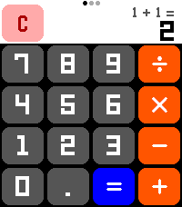
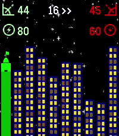
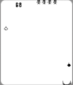
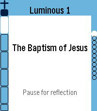
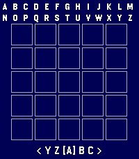

<!-- Generated by scripts/update_app_directory.py: do not edit by hand -->
# Watchapps: C

[← About this list](../watchapps.md) · [A](a.md) · [B](b.md) · **C** · [D](d.md) · [E](e.md) · [F](f.md) · [G](g.md) · [H](h.md) · [I](i.md) · [J](j.md) · [K](k.md) · [L](l.md) · [M](m.md) · [N](n.md) · [O](o.md) · [P](p.md) · [Q](q.md) · [R](r.md) · [S](s.md) · [T](t.md) · [U](u.md) · [V](v.md) · [W](w.md) · [X](x.md) · [Y](y.md) · [Z](z.md) · [0–9 & other](other.md)

*108 watchapps · Last updated 2026-10-06*

| Screenshot | Name | Developer | Licence | Updated | Description |
|------------|------|-----------|---------|---------|-------------|
| { loading=lazy width="72" } | [Caffeine Counter](https://apps.repebble.com/54a6f1fc4517d0f37c0000a8) | [Jannis Hutt](https://github.com/77u4/caffeinecounter) | <small>No licence</small> | 2015-01-02 | +++ Now supports German +++ English: Measure your daily caffeine consumption and calculate how much caffeine is in your blood. How-to: Increase/decrease… |
| { loading=lazy width="72" } | [Cairn](https://apps.repebble.com/707660e759f249eb85df1b04) | [mrTrueBeliever](https://github.com/mrtruebeliever/Cairn) | <small>Not checked yet</small> | 2026-08-13 | Breathe with the tide. A guided breathing coach with live heart rate. Inhale and the water rises, exhale and it falls. Finish a session, lay a stone. Cairn… |
| { loading=lazy width="72" } | [Calculabble](https://apps.repebble.com/574c54772e49dd0ef600000c) | [UnaDeKalamares](https://github.com/UnaDeKalamares/Calculabble) | <small>Not checked yet</small> | 2016-09-15 | Calculabble puts an easy to use calculator on your wrist. It's designed for three-button operation: - Click up to increase the current figure; hold down to… |
| { loading=lazy width="72" } | [Calculator](https://apps.repebble.com/10966bb2d22145c4b428dfd7) | [Freakified](https://github.com/freakified/pebble-calculator/) | <small>Not checked yet</small> | 2026-07-24 | A calculator! On a watch! No one has ever thought of this before! Anyway, now that the Pebble Time 2's touchscreen is enabled, let's CALCULATE! Calculator… |
| { loading=lazy width="72" } | [Calculator](https://apps.rebble.io/en_US/application/69f5f1c5b17f080009628899) <small>Rebble App Store</small> | [Freakified](https://github.com/freakified/pebble-calculator/) | <small>Not checked yet</small> | 2026-07-24 | A calculator! On a watch! No one has ever thought of this before! Now that the Pebble Time 2's touchscreen is enabled, let's CALCULATE! New for summer 2026… |
| { loading=lazy width="72" } | [Calculator](https://apps.repebble.com/5714a5e8a73befd4ec000026) | [Michael E.](https://github.com/michael-3-141/PebbleCalc) | <small>Not checked yet</small> | 2016-04-18 | A simple calculator app for the Pebble Classic, Steel, Time and Time Steel. Supports addition, subtraction, multiplication, division and exponentiation… |
| { loading=lazy width="72" } | [Calculator](https://apps.repebble.com/529a3f80129af76c4d0000d2) | [Peter Baylies](https://github.com/pbaylies/Pebble-Calculator-App) | <small>Not checked yet</small> | 2026-04-10 | A simple 4-function calculator for your wrist. |
| { loading=lazy width="72" } | [Calculator+](https://apps.repebble.com/0e435ee34ec74706a512a33e) | [t16u](https://github.com/tonylifepix/PebbleCalc/) | <small>Not checked yet</small> | 2026-05-29 | A simple calculator app for the Pebble Time 2. Features: - Supports addition, subtraction, multiplication, division, and exponentiation. - Native double and… |
| { loading=lazy width="72" } | [Calculator+](https://apps.rebble.io/en_US/application/69f6b7bfa48091000946a24f) <small>Rebble App Store</small> | [t16u](https://github.com/tonylifepix/PebbleCalc/) | <small>Not checked yet</small> | 2026-05-29 | A simple calculator app for the Pebble Time 2. Features: - Supports addition, subtraction, multiplication, division, and exponentiation. - Native double and… |
| { loading=lazy width="72" } | [CalDAV Calendar](https://apps.repebble.com/6b991b92d1d24fefa357e22d) | [overcuriousity](https://github.com/overcuriousity/pebble-caldav-calendar) | <small>Not checked yet</small> | 2026-06-13 | This is a fork of Eric McCormick's 7day ICS Calendar (https://apps.repebble.com/7day-ics-calendar_82451ba23ca641ab82821fa6). Your Calendar, at a Glance… |
| { loading=lazy width="72" } | [Calendar for Office 365](https://apps.repebble.com/221aea7552c54e9a87277a29) | [duke](https://github.com/duke0815/pebble_calender_app) | <small>Not checked yet</small> | 2026-10-01 | Your Microsoft 365 and Outlook.com calendar on your wrist. DAY VIEW See all events of a day as clear cards with time, title and location. Swipe left and… |
| { loading=lazy width="72" } | [Calendar for Pebble](https://apps.repebble.com/78408313eefa40f0bf30bc47) | [alex_pavlov](https://github.com/alex523ap/calendar-for-pebble) | <small>Not checked yet</small> | 2026-07-23 | A touch calendar watchapp for Pebble Time 2 and Pebble Round 2. Shows the month with a dot on every day that has events; tap a day for an agenda you can… |
| { loading=lazy width="72" } | [Caltrain](https://apps.repebble.com/53eb5caf6743f7a863000201) | [Katharine Berry](https://github.com/Katharine/pebble-caltrain) | MIT | 2017-06-17 | Shows the next trains to any given Caltrain stop. No phone or internet required; the schedule is stored locally. If a phone is connected, will automatically… |
| { loading=lazy width="72" } | [Caltrain.app](https://apps.repebble.com/95d3bd263e9640008e394c8d) | [Nick Winans](https://github.com/Nicell/caltrain-app-pebble) | <small>Not checked yet</small> | 2026-07-13 | Catch the right Caltrain from your wrist. Caltrain.app shows upcoming departures in one fast, glanceable list, with train details and a scrollable route… |
| { loading=lazy width="72" } | [Can I See Fuji?](https://apps.rebble.io/en_US/application/68cf73f6e9a54400096dd548) <small>Rebble App Store</small> | [James Downs](https://github.com/CometDog/pebble-can-i-see-fuji) | <small>No licence</small> | 2026-01-25 | Indicates if you'll be able to see Mt. Fuji today (JST) from the North Side (Oishi Park) and the South Side (Fuji City) Press up or down on your watch to… |
| { loading=lazy width="72" } | [Can's HR Sender for Pebble](https://apps.repebble.com/8dc4a43c3b244d85aeac474b) | [Can Köprülü](https://github.com/koprulucan/Cans_Pebbleton_HR_Sender) | <small>Not checked yet</small> | 2026-08-26 | Can's HR Sender for Pebble is a Pebble watch app that reads live heart-rate data from the watch and sends it to the Android companion app Can's Pebbleton HR… |
| { loading=lazy width="72" } | [CanIMakeIt](https://apps.repebble.com/56cd86c686ce3bde59000019) | [CMWen](https://github.com/cmwen/CanIMakeIt) | <small>Not checked yet</small> | 2016-02-26 | Wondering when you will get to the station everything when you rush out your home? This is a tool for you. CanIMakeIt shows you the distance to your… |
| { loading=lazy width="72" } | [Cannonade](https://apps.repebble.com/2a901442a4f24729b05837b3) | [Comfortably Numb](https://github.com/ygalanter/cannonade-pebble) | <small>Not checked yet</small> | 2026-06-19 | Cannonade is a classic ballistic game between 2 opponents - in this case you and A.I. (or, to be precise - you and your watch). The goal is to destroy… |
| { loading=lazy width="72" } | [Cannonade](https://apps.rebble.io/en_US/application/69f7d291c5c1b0000a7ac429) <small>Rebble App Store</small> | [Comfortably Numb](https://github.com/ygalanter/cannonade-pebble) | <small>Not checked yet</small> | 2026-06-19 | Cannonade is a classic ballistic game between 2 opponents - in this case you and A.I. (or, to be precise - you and your watch). The goal is to destroy… |
| { loading=lazy width="72" } | [CarbUnitCounter](https://apps.repebble.com/557b6c6d93628394d6000090) | [Opossum](https://github.com/OpossumGit/CarbUnitCounter) | <small>Not checked yet</small> | 2015-06-13 | App for diabetics doing carb counting. Helps you determine weight of food that contains one unit of carbohydrates (15g). Useful if you have diabetes. |
| { loading=lazy width="72" } | [Cardia](https://apps.repebble.com/8617ec913a584ba4ad22f4d6) | [Webstas “Webstas”](https://github.com/BigWebstas/PebbleCardia) | <small>No licence</small> | 2026-09-09 | A PebbleOS watchapp that watches your heart rate more closely than the system does by default and flags three things: sustained high rate, sustained low… |
| { loading=lazy width="72" } | [Cardigan](https://apps.rebble.io/en_US/application/6a6a5a1d68745900086a833f) <small>Rebble App Store</small> | [Mo](https://github.com/Seifollahi/cardigan) | <small>Not checked yet</small> | 2026-08-05 | Leave the keyring fobs at home. Cardigan keeps your loyalty cards on your Pebble as real, scannable Code 128 barcodes and QR codes — rendered pixel-perfect… |
| { loading=lazy width="72" } | [Catapult](https://apps.rebble.io/en_US/application/69501540da1501000944b086) <small>Rebble App Store</small> | [matejdro](https://github.com/matejdro/PebbleCatapult) | <small>Not checked yet</small> | 2026-06-25 | Launch Tasker tasks from your watch Android companion app is needed. It allows users to define a list of tasks that then show up on a watch and can be… |
| { loading=lazy width="72" } | [Catcher](https://apps.repebble.com/fe736f2b36744abca1e31a23) | [Cesar Hernandez](https://github.com/chernandezba/david_hernandez_bano/tree/main/pebble/catcher) | <small>Not checked yet</small> | 2026-06-03 | This is the last version released after his author, David (my brother), passed away on 2023. It's a simple catcher game. You have 2 modes of play : time… |
| { loading=lazy width="72" } | [Catcher](https://apps.rebble.io/en_US/application/692639773148ef0009f1d825) <small>Rebble App Store</small> | [chernandezba](https://github.com/chernandezba/david_hernandez_bano/tree/main/pebble/catcher) | <small>Not checked yet</small> | 2025-11-25 | This is the last version released after his author, David (my brother), passed away on 2023. It's a simple catcher game. You have 2 modes of play : time… |
| { loading=lazy width="72" } | [Catholic Daily](https://apps.repebble.com/56da609222f7b305b7000051) | [Jacob Chisholm](https://github.com/bobkingof12vs/Catholic-Daily) | <small>Not checked yet</small> | 2016-04-12 | An App designed to help you grow your Catholic Faith! This App offers the daily readings (courtesy of Universalis), as well as a simple Rosary/Chaplet of… |
| { loading=lazy width="72" } | [Catholic Rosary](https://apps.repebble.com/7f62b260bb574a4d927c382e) | [LP Fabiani](https://github.com/lpfabiani/pebble-catholic-rosary) | <small>Not checked yet</small> | 2026-09-03 | UPDATE: Now in English, Spanish, German, Italian and French. Quiet, reliable prayer companion. It walks you bead by bead through the entire Holy Rosary with… |
| { loading=lazy width="72" } | [Catholic Rosary](https://apps.rebble.io/en_US/application/6a87942e6b77960009370183) <small>Rebble App Store</small> | [LP Fabiani](https://github.com/lpfabiani/pebble-catholic-rosary) | <small>Not checked yet</small> | 2026-09-03 | UPDATE: Now in English, Spanish, German, Italian and French. Quiet, reliable prayer companion. It walks you bead by bead through the entire Holy Rosary with… |
| { loading=lazy width="72" } | [CB Schedule](https://apps.repebble.com/57604008837089081e0000e7) | [cheeseisdisgusting](https://github.com/cheeseisdisgusting/cbschedule) | <small>Not checked yet</small> | 2019-07-24 | NEVER FORGET WHAT CLASS IT IS! (At least if you go to Colonel By.) With CB Schedule, you'll be able to: - See the current day and what your next class is… |
| { loading=lazy width="72" } | [cerkit.com Daily Bible Verse](https://apps.repebble.com/558c4421fd0cf8e9890000cc) | [Michael Earls](https://github.com/cerkit/cerkitDailyVerseForPebble) | <small>Not checked yet</small> | 2015-07-07 | This is a simple app that displays a daily bible verse (New English Translation). It can also display a random verse. Scripture quoted by permission. All… |
| { loading=lazy width="72" } | [Chatty Client](https://apps.repebble.com/565b509ccb722e8f470000a4) | [Kai Tödter](https://github.com/toedter/pebble-chatty) | <small>Not checked yet</small> | 2016-11-12 | This is a small demo of a Pebble client for my RESTful demo application Chatty (see https://github.com/toedter/chatty). It gets JSON data from the RESTful… |
| { loading=lazy width="72" } | [Chebble](https://apps.repebble.com/5505ad14e1a3a859e800002a) | [A D Tennant](https://github.com/adtennant/chebble) | <small>Not checked yet</small> | 2015-03-29 | Chebble is Chatter for Pebble. Keep up with your Salesforce Chatter feed from your wrist. Chebble is a free, open source app for checking your Salesforce… |
| { loading=lazy width="72" } | [Check App](https://apps.rebble.io/en_US/application/58d7b8780dfc329fda000610) <small>Rebble App Store</small> | [Yevgeniy Barkalov](https://github.com/yevgeniybarkalov/PebbleFace) | <small>Not checked yet</small> | 2017-03-26 | Check up on you |
| { loading=lazy width="72" } | [Checklist](https://apps.repebble.com/5620e876768e7ada4e00007a) | [Freakified](https://github.com/freakified/PebbleChecklist) | <small>Not checked yet</small> | 2026-05-04 | A checklist on your watch! Grocery shopping will never be the same. You can use Checklist to keep track of anything you need without needing to hold your… |
| { loading=lazy width="72" } | [Checklists for Trello](https://apps.repebble.com/54476f1335d2bcae86000035) | [Schwittmann](https://github.com/schwittmann/pebble-trello2) | <small>Not checked yet</small> | 2017-08-20 | Mark your Trello todos on your wrist! Disclaimer: We are not affiliated, associated, authorized, endorsed by or in any way officially connected to Trello… |
| { loading=lazy width="72" } | [CheckMark](https://apps.repebble.com/691e287d23bdbb000998aff9) | [Leon Matthes](https://github.com/LeonMatthes/CheckMark) | <small>Not checked yet</small> | 2026-06-26 | Do you have your check lists organized in Markdown files somewhere? Your shopping list? Your todos? Then CheckMark is for you! Read unchecked items directly… |
| { loading=lazy width="72" } | [Cheetah's Wordle](https://apps.repebble.com/f36098fd376a43f2965478cc) | [Furchee](https://github.com/Furchee/Furchee-s-Wordle) | <small>No licence</small> | 2026-09-26 | Furchee's Wordle A fully working Wordle Game for the pebble smart watch! I made a better one because I like wordle. Tested the round screen versions using… |
| { loading=lazy width="72" } | [Cheetah's Wordle](https://apps.rebble.io/en_US/application/6a8b54991ef58d00099dccd0) <small>Rebble App Store</small> | [Furchee](https://github.com/Furchee/Furchee-s-Wordle) | <small>No licence</small> | 2026-08-23 | Furchee's Wordle Wordle Game for the pebble smart watch! I made a better one because I like wordle. I do not know if this app works alright on pebble… |
| { loading=lazy width="72" } | [Chess Clock](https://apps.repebble.com/53cfe4e760736bd808000213) | [Omar G](https://github.com/31422/Chess-Clock) | <small>No licence</small> | 2014-07-23 | Here is a chess clock on your wrist. App is already in settings when you open it. Using the up and down buttons adjust the time. The select button cycles… |
| { loading=lazy width="72" } | [Chess for Pebble](https://apps.repebble.com/56940424ead187610700004f) | [Sawyer Vaughan](https://github.com/runnersaw/pebble-chess) | <small>Not checked yet</small> | 2016-01-11 | Welcome to Chess for Pebble! Play against a chess AI with varying levels of difficulty. This game used to be a part of Games for Pebble, but was removed on… |
| { loading=lazy width="72" } | [ChileSismos](https://apps.repebble.com/56036876dafe0dea58000022) | [Camilo Saldías](https://github.com/csaldias/pebble-chilesismos) | <small>Not checked yet</small> | 2015-11-01 | Una aplicación que muestra en tu Pebble los últimos 10 sismos ocurridos en Chile Continental, utilizando datos del Centro Sismológico Nacional… |
| { loading=lazy width="72" } | [Chimer](https://apps.repebble.com/036fa1ce71bf44f991e9228c) | [RobErskine](https://github.com/RobErskine/pebble-chimer) | <small>Not checked yet</small> | 2026-07-15 | Inspired by Casio watches as well as the Sensor and Ollee Watch mods, Chimers brings back classic hourly beeps with more customization. Specify days of the… |
| { loading=lazy width="72" } | [Chinese Toy Phone](https://apps.repebble.com/69f663b5ea28ba000ab50545) | [nubbybubby](https://github.com/nubbybubby/pebble-toy-phone) | <small>Not checked yet</small> | 2026-09-19 | ay ay ay im your little butterfly ay ay ay im your little butterfly press select to use the phone, and press up/down to change the volume. you can also use… |
| { loading=lazy width="72" } | [ChipRef](https://apps.repebble.com/580e5633836d3cb4e8000016) | [Furrtek](https://github.com/furrtek/ChipRef) | <small>Not checked yet</small> | 2016-11-01 | Common integrated circuits reference app, showing internal schematics, pinouts, truth tables (to come)... |
| { loading=lazy width="72" } | [Chordinator](https://apps.repebble.com/5300d1fdd1653b1dec0000b1) | [rigel314](https://github.com/rigel314/pebbleChordinator) | <small>Not checked yet</small> | 2015-06-25 | Displays guitar chord finger positions. Now shows chords for ukulele and piano too! This data in this app was found by searching Google for chords. The… |
| { loading=lazy width="72" } | [Chronograph](https://apps.repebble.com/6946aed4da15010009fbaa7c) | [Flo Knödl](https://github.com/flokndl/chronograph) | <small>Not checked yet</small> | 2025-12-20 | Chronograph Stopwatch based on 'analogue dots' Watchface. --- - press 'down' for start/pause/resume - press 'up' for reset Display: - large hand for… |
| { loading=lazy width="72" } | [ChronoKit](https://apps.repebble.com/00e60e51de9047b68241bcb0) | [dysseus](https://github.com/dysseus-pascal/ChronoKit) | <small>Not checked yet</small> | 2026-09-24 | Stopwatch and Timer in one app |
| { loading=lazy width="72" } | [Chuck Norris Jokes](https://apps.repebble.com/579a7a3322f599f144000208) | [Frosted Torus](https://github.com/KennethSchlatter/ChuckJokes) | <small>No licence</small> | 2016-07-28 | A watchapp that loads random Chuck Norris jokes from chucknorris.io. |
|  | [Cigarette Tracker](https://apps.repebble.com/25ae7bcfc43540f6b8461f20) | [cornelius](https://github.com/L0renz00/pebble_cigarette_tracker) | <small>Not checked yet</small> | 2026-07-13 | An app to track cigarette smoking. (Vibe-coded and WIP, expect breaks/issues) |
| { loading=lazy width="72" } | [Cinematik 2015](https://apps.repebble.com/540ba18df1b69c9eff000031) | [Michal Valášek](https://github.com/michalvalasek/PebbleCinematik2014) | <small>Not checked yet</small> | 2015-08-31 | Cinematik is an international film festival taking place annually in Piešťany, Slovakia. This app shows the upcoming festival events and their details. NEW… |
| { loading=lazy width="72" } | [CinemaToday](https://apps.repebble.com/551fa70fd5e5f0cd6500000d) | [Chrstian Marra](https://github.com/cmarra/cinemaToday) | <small>Not checked yet</small> | 2016-03-03 | CinemaToday helps you to find cinema around you directly on your Pebble. See the programming and watch the movie. |
| { loading=lazy width="72" } | [Claude](https://apps.repebble.com/68fe94c3d004720009e0b41a) | [Ilia Breitburg](https://github.com/breitburg/claude-for-pebble) | <small>Not checked yet</small> | 2025-12-20 | Talk to Claude AI directly from your Pebble smartwatch. Use your watch's built-in dictation to ask questions and get streaming responses from Claude. Good… |
| { loading=lazy width="72" } | [Cleveland Historical](https://apps.repebble.com/55aeb453f825d3118100006b) | [Center for Public History + Digital Humanities](https://github.com/ebellempire/Curatescape-pebble) | <small>Not checked yet</small> | 2015-07-21 | The Cleveland Historical Pebble app puts Cleveland history on your wrist, allowing you to quickly access information about nearby historical sites around… |
| { loading=lazy width="72" } | [Clock](https://apps.repebble.com/538f9f294cd6d5b6340000e1) | [Kirby Kohlmorgen](https://github.com/tyhoff/Clock) | <small>Not checked yet</small> | 2014-06-04 | This application is just a clock...that has cheating capabilities built in. |
| { loading=lazy width="72" } | [Clock Dude](https://apps.repebble.com/6aab02d087b66c0009820cc3) | [OmgSlayKween](https://github.com/hornofabraxas/clock-dude) | <small>Not checked yet</small> | 2026-09-16 | This is a Time 2 / Round 2 touch-input port of Block Dude, a block-pushing puzzle game written by Brandon Sterner for the TI-83 in 1999, and the reason many… |
| { loading=lazy width="72" } | [CoasterWatch](https://apps.repebble.com/702bd7b27ec8456280b5ab7a) | [Chris C](https://github.com/chrisc123/coasterwatch) | <small>Not checked yet</small> | 2026-08-29 | CoasterWatch brings live theme park queue times and wait-time trends right to your wrist, powered by Queue-Times.com. Yes, it is vide-coded … |
| { loading=lazy width="72" } | [codey](https://apps.repebble.com/34c8e534967b4680980f3fdc) | [nick1udwig](https://github.com/nick1udwig/codey) | <small>Not checked yet</small> | 2026-09-22 | codey is a personal assistant, powered by codex. Check your calendar, the weather, check off TODOs, or query/instruct your codex agent, all from your wrist… |
| { loading=lazy width="72" } | [Coin Toss](https://apps.repebble.com/57f980d41fd66b4a2e00001e) | [Michael Kang](https://github.com/mrmichaelkang/coin_toss) | <small>Not checked yet</small> | 2016-10-08 | Coin Toss simulates a coin being flip. There is a simple counter that counts how many heads or tails have landed. |
| { loading=lazy width="72" } | [CoinMarket](https://apps.rebble.io/en_US/application/59ba7cad461a8dd989001bd7) <small>Rebble App Store</small> | [DylanGrl](https://github.com/DylanGrl/Pebble_CoinMarket) | <small>No licence</small> | 2017-09-14 | Check easily the value and evolution of the top 10 cryptocurrency from coinmarketcap website. Easily change your fiat from the settings of the app in the… |
| { loading=lazy width="72" } | [Cold War Simulator 2K15](https://apps.repebble.com/55076473ce75c144cc00008b) | [Ben Chapman-Kish](https://github.com/AwesomeBen1/ColdWarSim2K15) | <small>No licence</small> | 2015-05-06 | It's a number of years after the most recent global war and tensions are heating up between you and the other world superpower. The fate of the world is in… |
| { loading=lazy width="72" } | [Colectivos](https://apps.repebble.com/6850959f48a55300094e9032) | [Mauricio Videla](https://github.com/mvidelatraduc/colectivos-de-rosario-pebble) | <small>Not checked yet</small> | 2026-02-26 | Una aplicación para el sistema urbano de transporte público de Rosario, Argentina. Se muestran las paradas de colectivos cercanas y, tras seleccionar una… |
| { loading=lazy width="72" } | [Color Browser](https://apps.repebble.com/58039d22c98866a9d80000f4) | [somepaddi](https://github.com/gitpaddi/PebbleAppColorBrowser) | <small>Not checked yet</small> | 2016-10-16 | This app shows you colors with their hex codes and an example how that color looks on the Pebble Time. |
| { loading=lazy width="72" } | [Color Calendar](https://apps.repebble.com/55da378a6323c5cc54000029) | [Kelby](https://github.com/tripleplay369/pebble-color-calendar) | <small>Not checked yet</small> | 2016-01-04 | A simple, easy to read calendar designed specifically for the Pebble Time. Up and down buttons scroll between months, select button returns to today. Long… |
| { loading=lazy width="72" } | [Color Calendar Redux](https://apps.repebble.com/eb92c307037c414b80fbd943) | [Comet Designs](https://github.com/randylaheyjr/ColorCalendarRedux) | <small>Not checked yet</small> | 2026-07-11 | Color Calendar Redux This is an update of the original Color Calendar app created by Kelby. A simple, easy-to-read calendar for your Pebble. Tap or Swipe Up… |
| { loading=lazy width="72" } | [Color View Sample](https://apps.repebble.com/69d079b774b3f70009ab30cd) | [changing-k-tanaka](https://github.com/changing-k-tanaka/pebble-app-color-view-sample) | <small>Not checked yet</small> | 2026-04-27 | This app is intended for development purposes. It allows you to view and check the 64 colors available on color-capable Pebble devices (currently only… |
| { loading=lazy width="72" } | [ColorTest](https://apps.repebble.com/5587333c49c1d1c16d000037) | [rS](https://github.com/ace7196/ColorTest) | <small>Not checked yet</small> | 2015-06-22 | Just a basic app to show you what black and white text look like with different background colors on the actual screen. |
| { loading=lazy width="72" } | [Commander for Pebble](https://apps.repebble.com/5672298346ebacd2e6000082) | [Colin Murphy](https://github.com/c0decat/pebble-commander) | <small>Not checked yet</small> | 2016-01-18 | Commander for Pebble is a watchapp that turns your Pebble into a remote control for your Linux PC. You can use it to launch your favorite programs, or use… |
| { loading=lazy width="72" } | [Commute Timer](https://apps.repebble.com/bdfac08800694f72a79bfb5b) | [tjaart](https://gitlab.com/tjaart/pebble-commute-timer) | <small>Not checked yet</small> | 2026-04-30 | Live commute time on your wrist — Home ↔ Work, with real-time traffic from Google Maps. |
| { loading=lazy width="72" } | [Commuter](https://apps.repebble.com/68fd14f9504cc500097101e2) | [Werknaam](https://github.com/gbougakov/commuter-pebble/) | <small>Not checked yet</small> | 2025-10-31 | Quickly check SNCB/NMBS (Belgian Railways) train schedules from your wrist. Save favourite stations from your phone to quickly plot routes on your watch… |
| { loading=lazy width="72" } | [Compass](https://apps.repebble.com/540f7cafbc27450164000157) | [Pebble](https://github.com/coredevices/pebble-compass) | <small>Not checked yet</small> | 2026-07-27 | Compass app elegantly animates between two different modes: A compass rose when you look down at your Pebble and a heading indicator when hold the watch in… |
| { loading=lazy width="72" } | [Compass](https://apps.repebble.com/53a799768eaa2a00040000b3) | [silicarich](https://github.com/silicaRich/pebble-compass) | <small>Not checked yet</small> | 2014-06-23 | Your Android phone will send you compass data on your Pebble! Open source and in beta. Please see source link if interested :) Bug: Unfortunately your… |
| { loading=lazy width="72" } | [Compass & Star Map](https://apps.repebble.com/032214bd21df4081acf8bf55) | [Utilitarian Huguenot](https://github.com/hobbykitjr/PebbleStarMap) | <small>Not checked yet</small> | 2026-04-09 | BETA, Uses phone location and watch compass to show cardinal direction on your watch along w/ current star map based on time of day. Will need more testing… |
| { loading=lazy width="72" } | [Compliment Moi](https://apps.rebble.io/en_US/application/60a3f01f1342ae0091b7e186) <small>Rebble App Store</small> | [John Spahr](https://github.com/johnspahr/compliment-moi-pebble) | <small>Not checked yet</small> | 2021-05-20 | Feeling gloomy? If so, perhaps a compliment will brighten up your day! Compliment Moi is a simple little Pebble.js app that compliments you and gives you… |
| { loading=lazy width="72" } | [Compliment Moi (Updated)](https://apps.rebble.io/en_US/application/628ab49ce3ac04000b00b97f) <small>Rebble App Store</small> | [John Spahr](https://github.com/JohnSpahr/compliment-moi-pebble) | CC0-1.0 | 2022-05-22 | Feeling gloomy? If so, perhaps a compliment will brighten up your day! Compliment Moi is a simple little Pebble.js app that compliments you and gives you… |
| { loading=lazy width="72" } | [Constellation](https://apps.repebble.com/10f46ae849224d009644f7e8) | [Daniel Bally](https://github.com/globe-and-atlas/constellation-watch) | <small>Not checked yet</small> | 2026-10-02 | An educational orbital-geometry watchapp for Pebble Time 2. Constellation propagates public CelesTrak GP/TLE element sets with SGP4 to plot modeled GPS… |
| { loading=lazy width="72" } | [Contractions](https://apps.rebble.io/en_US/application/531d9a3714708baa95000189) <small>Rebble App Store</small> | [Tan Jay Jun](https://github.com/jayjun/Contractions) | <small>Not checked yet</small> | 2014-06-25 | Track labor contractions on your Pebble! Why fumble with smartphones? You can't check logs while calling your midwife, and how long will that battery last?… |
| { loading=lazy width="72" } | [Control Hue](https://apps.repebble.com/553349b09657f17a1d0000c0) | [Pebbling for Hue](https://github.com/JCDCJK/pebblingforhue) | MIT | 2015-04-19 | Control Hue is a Pebble smartwatch app that controls Philips Hue light bulbs. You will need Philips Hue light bulbs and the Philips Hue Bridge to use this… |
| { loading=lazy width="72" } | [Conway's Game of Life](https://apps.rebble.io/en_US/application/67d320fcd3b7b300097f1ec4) <small>Rebble App Store</small> | [Flynn Duniho](https://github.com/FlynnD273/pebble-conway) | <small>No licence</small> | 2026-03-03 | A simple Conway's Game of Life app |
| { loading=lazy width="72" } | [Cookie Clicker](https://apps.repebble.com/28a88f2d5e984cccba448035) | [Ocelot](https://github.com/Ocelot5836/cookie-clicker-pebble) | <small>Not checked yet</small> | 2026-05-22 | Cookie Clicker on the Pebble Watch! Press the button as fast as possible to get MORE cookies. Cookies are still generated when the app is closed. Press down… |
| { loading=lazy width="72" } | [Cookie Clicker](https://apps.rebble.io/en_US/application/69d5c76e2834b10009505eb6) <small>Rebble App Store</small> | [Ocelot](https://github.com/Ocelot5836/cookie-clicker-pebble) | <small>Not checked yet</small> | 2026-05-22 | Cookie Clicker on the Pebble Watch! Press the button as fast as possible to get MORE cookies. Cookies are still generated when the app is closed. Press down… |
| { loading=lazy width="72" } | [Cookie Clickers Color](https://apps.repebble.com/56a8d5e70b9e953a7100002a) | [small rock design labs!](http://bit.ly/aboutpdl) | <small>See source</small> | 2016-01-27 | Color version of the Cookie Clickers B/W |
| { loading=lazy width="72" } | [Core Temp Monitor](https://apps.repebble.com/55fdac750a5482833d000085) | [zanecodes](https://github.com/zanecodes/CoreTempMonitor) | <small>Not checked yet</small> | 2015-11-16 | A simple app for tracking your computer's CPU temperature in real time. See the app website for installation and usage instructions. |
| { loading=lazy width="72" } | [Couch to 5K](https://apps.rebble.io/en_US/application/5edde2293dd3105ab984ba5e) <small>Rebble App Store</small> | [Adam Harvey](https://github.com/LawnGnome/c25k-pebble) | <small>Not checked yet</small> | 2020-06-08 | A timer for the NHS version of the Couch to 5K running programme. This app provides an overall view of how far you are through the intervals as you run… |
| { loading=lazy width="72" } | [Couch To 5K](https://apps.repebble.com/5901e11c0dfc32464a0005bb) | [TKM Software](https://github.com/Odja-anarchist/Pebble-C25k) | <small>Not checked yet</small> | 2017-09-29 | Couch to 5K (C25K) Training app. Multi lanauge support: English, Français, Deutsche, Español. Supports a list of 24 days, all with individual progress… |
| { loading=lazy width="72" } | [Count Down](https://apps.repebble.com/52b1f7b8cd41839a69000015) | [Samuel](https://github.com/samuelmr/pebble-countdown) | <small>Not checked yet</small> | 2016-10-25 | Customizable timer with vibration notifications at specified times. Giving a talk? Training in the gym? Want to know how time passes without constantly… |
| { loading=lazy width="72" } | [Countdown timer](https://apps.repebble.com/c1e3e132dae74bbcaf1a8320) | [Sykerö Software](https://github.com/Sykero-Software/PebbleCountdownTimer) | <small>Not checked yet</small> | 2026-09-01 | Countdown timer — a simple multi-timer for your Pebble. Configure any number of named countdown timers (up to 16) from your phone, each with its own… |
| { loading=lazy width="72" } | [counter](https://apps.repebble.com/52fd881562f8c4f39e000064) | [Matthew Bauer](http://github.com/matthewbauer/counter) | <small>No licence</small> | 2014-02-14 | Counter is a multipurpose counting app with applications including card counting, lap tracking, and monitoring chicken wing intake. |
| { loading=lazy width="72" } | [Counter](https://apps.repebble.com/596e2e79461a8d34f600006c) | [MrBlue](https://github.com/mrbluue/CounterPebble/) | <small>Not checked yet</small> | 2017-07-18 | Count using the up and down buttons. You can set a limit to how far you want to count. You can also save your counts by long pressing select on the counting… |
| { loading=lazy width="72" } | [Counter proportion](https://apps.repebble.com/56d6fcacc2d302dbfc000021) | [rlirette](http://rlirette.com/counter-proportion/) | <small>See source</small> | 2016-09-12 | Français Cette application est un compteur à 2 chiffres. Le premier fait référence à une "portion" et le deuxième à une "quantité totale". L'application… |
| { loading=lazy width="72" } | [Countit-all](https://apps.repebble.com/57321b9bddb70016b600001f) | [susundberg](https://github.com/susundberg/pebble-countit-all) | <small>Not checked yet</small> | 2016-05-21 | Pebble application for counting and timing events! This application provides easy way to count and time different events. You can configure up to three (one… |
| { loading=lazy width="72" } | [CountUpVibe Timer](https://apps.repebble.com/2cc96a35a0a94e09bb6d9e1e) | [Salmontech](https://github.com/dev-salmontech/Pebble_CountUpVibe) | <small>Not checked yet</small> | 2026-07-13 | **Stay in rhythm without watching the clock.** Count-Up-Vibe Timer counts upward and taps your wrist at the interval you set — great for workouts, focus… |
| { loading=lazy width="72" } | [Countz](https://apps.repebble.com/55c36a0ac552a8f0af00000d) | [lanigram](https://github.com/wonknu/PebbleCountz) | <small>Not checked yet</small> | 2015-08-06 | Counter app for pebble watch. From 1 to 10 player, you can choose the starting number. The counter screen display a grid of player with their points. How to… |
| { loading=lazy width="72" } | [CrashApp](https://apps.repebble.com/56f9b9ea69581d21f800000d) | [MPG13](https://github.com/MPG13/CrashApp) | <small>Not checked yet</small> | 2016-03-28 | If you'd rather not give up your watch face to use CrashFace, you can use this. simply re-compiled the face as an app instead. |
| { loading=lazy width="72" } | [Cricket Counter](https://apps.repebble.com/53caf3f9f02a61e5c0000150) | [Adam Harvey](https://github.com/LawnGnome/cricket-counter-for-pebble) | <small>Not checked yet</small> | 2014-07-19 | A basic ball, over and wicket counter for cricket umpires. |
| { loading=lazy width="72" } | [Crisis](https://apps.repebble.com/536376bff905ef247600016b) | [Hithesh Reddivari](https://github.com/Hitheshaum/fall-detection) | <small>No licence</small> | 2015-05-23 | This app detects impact of fall or crash using Pebble Acceleration sensor. After 15 seconds it sends pre-selected contacts an emergency message along with… |
| { loading=lazy width="72" } | [Crypto Currency Indicator](https://apps.rebble.io/en_US/application/59774e5f461a8d1889000401) <small>Rebble App Store</small> | [AzRun](https://github.com/AzzRun/Pebble-CoinInfo) | <small>No licence</small> | 2017-08-18 | A simple currency monitor for Bitcoin,Ethereum and Bitcoin Cash. Un moniteur simple de monnaie pour Bitcoin, Ethereum et Bitcoin Cash. |
| { loading=lazy width="72" } | [Crypto Watch](https://apps.repebble.com/5a31b3f40dfc32dba00012d8) | [Brian Ouellette](https://github.com/BrianEnders/pebble-crypto) | Apache-2.0 | 2017-12-31 | Crypto Tracker for Pebble With this app you can watch the price of Bitcoin, Litecoin, Bitcoin Cash, and Ethereum on the Coinbase Market. You will be able to… |
| { loading=lazy width="72" } | [Crypto XCHG](https://apps.repebble.com/52e54e96561013fdaf0006b6) | [mr__jasper](https://github.com/kmstumpff/Crypto_XCHG) | <small>Not checked yet</small> | 2014-08-02 | Displays the current exchange prices of some of the top cryptocurrencies. Use the UP and DOWN buttons to select the currency and use SELECT to load the… |
| { loading=lazy width="72" } | [Cryptomonitor](https://apps.repebble.com/b4b3410fed6b4e03aeabb8a3) | [pinguin-wizard](https://gitlab.com/pinguin-wizard/crypto-monitor) | <small>Not checked yet</small> | 2026-04-17 | A pebble app to monitor popular crypto token exchange rates and bitcoin mining in real-time. - 16 popular crypto tokens: 1. BTC 2. ETH 3. SOL 4. BNB 5. XRP… |
| { loading=lazy width="72" } | [CSontheGO](https://apps.repebble.com/57c24bc35e3c3db4850002af) | [MrWhale](https://github.com/mrwhale/CS-on-the-GO) | <small>Not checked yet</small> | 2019-07-24 | Pebble app to display upcoming, live and completed CSGO (Counter Strike Global Offensive) match details Displays all upcoming CSGO match information, as… |
| { loading=lazy width="72" } | [CTATrack](https://apps.repebble.com/6b4d13c6c40548ddaa5cba8d) | [CFV](https://github.com/cfvescovo/CTATrack) | <small>Not checked yet</small> | 2026-05-08 | CTATrack gives you fast, focused transit info for Chicago right on your wrist. Find nearby CTA train stations and bus stops, then scroll through live… |
| { loading=lazy width="72" } | [CU Pokedex Challenge](https://apps.repebble.com/55ecef1eb3c9a0288500007a) | [ProgramTori](https://github.com/vgvbach95/UIUCPokedexChallenge) | <small>Not checked yet</small> | 2015-09-07 | Explore the Champaign-Urbana area while searching for Pokemon! Find all 151 Pokemon scattered throughout campus and the surrounding area. Requires GPS Only… |
| { loading=lazy width="72" } | [CUAC FM](https://apps.repebble.com/557c5d65db598b55e800005a) | [iverson](https://github.com/ficiverson/pebble-cuacfm) | <small>Not checked yet</small> | 2015-06-18 | CUAC FM la radio comunitaria de A Coruña presenta la app para conocer en todo momento que programa se está emitiendo en la emisora de Coruña, Galicia… |
| { loading=lazy width="72" } | [CUMTD](https://apps.repebble.com/55bbb263e6bc82c35d000055) | [Ashish Agrawal](https://github.com/lezzago/PebbleCUMTD) | <small>Not checked yet</small> | 2015-08-02 | This is a Pebble app for the CUMTD bus service in Urbana, IL and Champaing, IL. The app allows you to create 5 custom favorite stops through the settings… |
| { loading=lazy width="72" } | [Currency Exchange](https://apps.rebble.io/en_US/application/57cd93babe5ad0720c00037d) <small>Rebble App Store</small> | [Marcel Kohls](https://github.com/marcelkohl/pebbleCurrencyExchangeApp) | <small>Not checked yet</small> | 2025-10-31 | World Currency Exchange Converter. Up to 33 currencies. |
| { loading=lazy width="72" } | [Custom Workout Timer](https://apps.repebble.com/53b8f8d4c09b06bcc7000007) | [Fernando Trujano](https://github.com/Fertogo/Pebble-workout-timer) | <small>No licence</small> | 2016-03-08 | Easily create custom interval timers (with names) for your workouts. This app will time you and alert you when to change moves based on your own workout… |
| { loading=lazy width="72" } | [Cut/up+](https://apps.repebble.com/580e6947bbd9629ad2000026) | [Morris](https://github.com/MorrisTimm/cut-up/tree/plus) | <small>Not checked yet</small> | 2016-11-25 | Cut/up+ is a complementary watchapp to be used in conjunction with the Cut/up watchface, which has been created as response to a Reddit request made by… |
| { loading=lazy width="72" } | [CycleSerein](https://apps.repebble.com/1d39dcd35839487b8b0bbd4b) | [github.s2eln](https://github.com/emilepommier/PebbleCycleSerein) | <small>Not checked yet</small> | 2026-04-10 | CyclesSerein is a companion app to track basal body temperature (BBT) for natural family planning. It requires the installation of the main mobile app. |
