---
hide:
  - toc
---

<!-- Generated by scripts/update_app_directory.py: do not edit by hand -->
# Pebble Apps: C

[← All Pebble Apps](../watchapps.md) · [A](a.md) · [B](b.md) · **C** · [D](d.md) · [E](e.md) · [F](f.md) · [G](g.md) · [H](h.md) · [I](i.md) · [J](j.md) · [K](k.md) · [L](l.md) · [M](m.md) · [N](n.md) · [O](o.md) · [P](p.md) · [Q](q.md) · [R](r.md) · [S](s.md) · [T](t.md) · [U](u.md) · [V](v.md) · [W](w.md) · [X](x.md) · [Y](y.md) · [Z](z.md) · [0–9 & other](other.md)

*101 apps · Last updated 2026-10-06 · [About these lists](../about-app-lists.md)*

<a class="app-shot" href="https://apps.repebble.com/54a6f1fc4517d0f37c0000a8" data-search-exclude>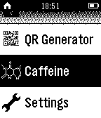</a>

<h2 class="app-name" id="app-54a6f1fc4517d0f37c0000a8"><a href="https://apps.repebble.com/54a6f1fc4517d0f37c0000a8">Caffeine Counter</a></h2>
<a class="app-source" href="https://github.com/77u4/caffeinecounter" title="Source code" data-search-exclude>View source</a>

by <a href="https://apps.repebble.com/apps/dev/jannis-hutt_532094e9deec0c9bdd000289" title="More from this developer">Jannis Hutt</a>

No licence v0.4 Updated 2015-01-02

Runs on: Time 2, Pebble 2 Duo, Pebble 2, Time, Classic

+++ Now supports German +++ English: Measure your daily caffeine consumption and calculate how much caffeine is in your blood. How-to: Increase/decrease caffeine intake with the up and down…

<a class="app-shot" href="https://apps.repebble.com/707660e759f249eb85df1b04" data-search-exclude>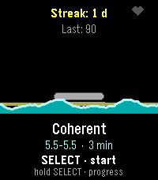</a>

<h2 class="app-name" id="app-707660e759f249eb85df1b04"><a href="https://apps.repebble.com/707660e759f249eb85df1b04">Cairn</a></h2>
<a class="app-source" href="https://github.com/mrtruebeliever/Cairn" title="Source code" data-search-exclude>View source</a>

by <a href="https://apps.repebble.com/apps/dev/mrtruebeliever_5f8814a92a6f109602136f61" title="More from this developer">mrTrueBeliever</a>

Not checked yet v1.2.0 Updated 2026-08-13

Runs on: Time 2

Breathe with the tide. A guided breathing coach with live heart rate. Inhale and the water rises, exhale and it falls. Finish a session, lay a stone. Cairn turns a breathing exercise into a tide…

<a class="app-shot" href="https://apps.repebble.com/574c54772e49dd0ef600000c" data-search-exclude>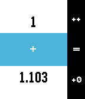</a>

<h2 class="app-name" id="app-574c54772e49dd0ef600000c"><a href="https://apps.repebble.com/574c54772e49dd0ef600000c">Calculabble</a></h2>
<a class="app-source" href="https://github.com/UnaDeKalamares/Calculabble" title="Source code" data-search-exclude>View source</a>

by <a href="https://apps.repebble.com/apps/dev/unadekalamares_5572b56e78821113a1000014" title="More from this developer">UnaDeKalamares</a>

GPL-2.0 v1.5 Updated 2016-09-15

Runs on: Round 2, Time 2, Pebble 2 Duo, Pebble 2, Time Round, Time, Classic

Calculabble puts an easy to use calculator on your wrist. It&#x27;s designed for three-button operation: - Click up to increase the current figure; hold down to negate the operand; - Click down once to…

<a class="app-shot" href="https://apps.repebble.com/10966bb2d22145c4b428dfd7" data-search-exclude>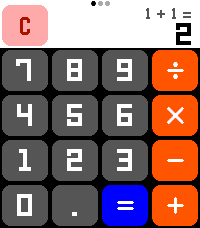</a>

<h2 class="app-name" id="app-10966bb2d22145c4b428dfd7"><a href="https://apps.repebble.com/10966bb2d22145c4b428dfd7">Calculator</a></h2>
<a class="app-source" href="https://github.com/freakified/pebble-calculator/" title="Source code" data-search-exclude>View source</a>

by <a href="https://apps.repebble.com/apps/dev/freakified_534d74f861fcaa8033000263" title="More from this developer">Freakified</a>

Not checked yet v2.0.0 Updated 2026-07-24

Runs on: Round 2, Time 2

A calculator! On a watch! No one has ever thought of this before! Anyway, now that the Pebble Time 2&#x27;s touchscreen is enabled, let&#x27;s CALCULATE! Calculator allows to perform basic math operations…

<a class="app-shot" href="https://apps.repebble.com/5714a5e8a73befd4ec000026" data-search-exclude>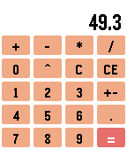</a>

<h2 class="app-name" id="app-5714a5e8a73befd4ec000026"><a href="https://apps.repebble.com/5714a5e8a73befd4ec000026">Calculator</a></h2>
<a class="app-source" href="https://github.com/michael-3-141/PebbleCalc" title="Source code" data-search-exclude>View source</a>

by <a href="https://apps.repebble.com/apps/dev/michael-e_56b37ca55af63e87d1000024" title="More from this developer">Michael E.</a>

Not checked yet v1.1 Updated 2016-04-18

Runs on: Time 2, Pebble 2 Duo, Pebble 2, Time, Classic

A simple calculator app for the Pebble Classic, Steel, Time and Time Steel. Supports addition, subtraction, multiplication, division and exponentiation. Supports up to 2 digits of decimals using…

<h2 class="app-name" id="app-529a3f80129af76c4d0000d2"><a href="https://apps.repebble.com/529a3f80129af76c4d0000d2">Calculator</a></h2>
<a class="app-source" href="https://github.com/pbaylies/Pebble-Calculator-App" title="Source code" data-search-exclude>View source</a>

by <a href="https://apps.repebble.com/apps/dev/peter-baylies_529a3876129af7c3bd0000bd" title="More from this developer">Peter Baylies</a>

Not checked yet v2.1 Updated 2026-04-10

Runs on: Round 2, Time 2, Pebble 2 Duo, Pebble 2, Time Round, Time, Classic

A simple 4-function calculator for your wrist.

<a class="app-shot" href="https://apps.repebble.com/0e435ee34ec74706a512a33e" data-search-exclude>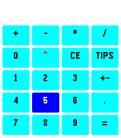</a>

<h2 class="app-name" id="app-0e435ee34ec74706a512a33e"><a href="https://apps.repebble.com/0e435ee34ec74706a512a33e">Calculator+</a></h2>
<a class="app-source" href="https://github.com/tonylifepix/PebbleCalc/" title="Source code" data-search-exclude>View source</a>

by <a href="https://apps.repebble.com/apps/dev/t16u_3049530f349f6f77366a8aa6" title="More from this developer">t16u</a>

Not checked yet v1.4 Updated 2026-05-29

Runs on: Time 2

A simple calculator app for the Pebble Time 2. Features: - Supports addition, subtraction, multiplication, division, and exponentiation. - Native double and uint64 operations for flexible…

<a class="app-shot" href="https://apps.repebble.com/6b991b92d1d24fefa357e22d" data-search-exclude>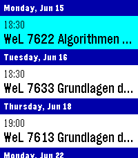</a>

<h2 class="app-name" id="app-6b991b92d1d24fefa357e22d"><a href="https://apps.repebble.com/6b991b92d1d24fefa357e22d">CalDAV Calendar</a></h2>
<a class="app-source" href="https://github.com/overcuriousity/pebble-caldav-calendar" title="Source code" data-search-exclude>View source</a>

by <a href="https://apps.repebble.com/apps/dev/overcuriousity_886814d700febfcda1ee2bcf" title="More from this developer">overcuriousity</a>

Not checked yet v1.1.0 Updated 2026-06-13

Runs on: Time 2

This is a fork of Eric McCormick&#x27;s 7day ICS Calendar (https://apps.repebble.com/7day-ics-calendar_82451ba23ca641ab82821fa6). Your Calendar, at a Glance. Leave your phone in your pocket. CalDAV…

<a class="app-shot" href="https://apps.repebble.com/221aea7552c54e9a87277a29" data-search-exclude>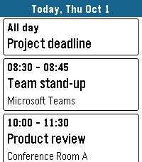</a>

<h2 class="app-name" id="app-221aea7552c54e9a87277a29"><a href="https://apps.repebble.com/221aea7552c54e9a87277a29">Calendar for Office 365</a></h2>
<a class="app-source" href="https://github.com/duke0815/pebble_calender_app" title="Source code" data-search-exclude>View source</a>

by <a href="https://apps.repebble.com/apps/dev/duke_d48f949b70fcaefd4e29e5cb" title="More from this developer">duke</a>

Not checked yet v1.0.0 Updated 2026-10-01

Runs on: Time 2, Pebble 2 Duo, Pebble 2, Time

Your Microsoft 365 and Outlook.com calendar on your wrist. DAY VIEW See all events of a day as clear cards with time, title and location. Swipe left and right to change the day on Pebble Time 2…

<a class="app-shot" href="https://apps.repebble.com/78408313eefa40f0bf30bc47" data-search-exclude>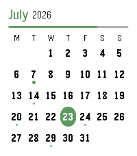</a>

<h2 class="app-name" id="app-78408313eefa40f0bf30bc47"><a href="https://apps.repebble.com/78408313eefa40f0bf30bc47">Calendar for Pebble</a></h2>
<a class="app-source" href="https://github.com/alex523ap/calendar-for-pebble" title="Source code" data-search-exclude>View source</a>

by <a href="https://apps.repebble.com/apps/dev/alex-pavlov_5db8b4eb79e5620001a7e1ce" title="More from this developer">alex_pavlov</a>

MIT v2.0.0 Updated 2026-07-23

Runs on: Round 2, Time 2

A touch calendar watchapp for Pebble Time 2 and Pebble Round 2. Shows the month with a dot on every day that has events; tap a day for an agenda you can scroll through. Syncs from iCloud and…

<a class="app-shot" href="https://apps.repebble.com/53eb5caf6743f7a863000201" data-search-exclude>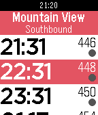</a>

<h2 class="app-name" id="app-53eb5caf6743f7a863000201"><a href="https://apps.repebble.com/53eb5caf6743f7a863000201">Caltrain</a></h2>
<a class="app-source" href="https://github.com/Katharine/pebble-caltrain" title="Source code" data-search-exclude>View source</a>

by <a href="https://apps.repebble.com/apps/dev/katharine-berry_52b6e8a9f21b2c24ef000014" title="More from this developer">Katharine Berry</a>

MIT v1.10 Updated 2017-06-17

Runs on: Round 2, Time 2, Pebble 2 Duo, Pebble 2, Time Round, Time, Classic

Shows the next trains to any given Caltrain stop. No phone or internet required; the schedule is stored locally. If a phone is connected, will automatically open the nearest station; otherwise…

<a class="app-shot" href="https://apps.repebble.com/95d3bd263e9640008e394c8d" data-search-exclude>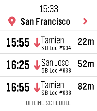</a>

<h2 class="app-name" id="app-95d3bd263e9640008e394c8d"><a href="https://apps.repebble.com/95d3bd263e9640008e394c8d">Caltrain.app</a></h2>
<a class="app-source" href="https://github.com/Nicell/caltrain-app-pebble" title="Source code" data-search-exclude>View source</a>

by <a href="https://apps.repebble.com/apps/dev/nick-winans_d41cec2e1676d30103d578c3" title="More from this developer">Nick Winans</a>

MIT v1.3.0 Updated 2026-07-13

Runs on: Round 2, Time 2

Catch the right Caltrain from your wrist. Caltrain.app shows upcoming departures in one fast, glanceable list, with train details and a scrollable route timeline. With a phone connection, it can…

<a class="app-shot" href="https://apps.rebble.io/en_US/application/68cf73f6e9a54400096dd548" data-search-exclude>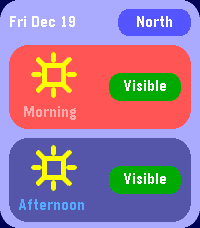</a>

<h2 class="app-name" id="app-68cf73f6e9a54400096dd548"><a href="https://apps.rebble.io/en_US/application/68cf73f6e9a54400096dd548">Can I See Fuji?</a></h2>
<a class="app-source" href="https://github.com/CometDog/pebble-can-i-see-fuji" title="Source code" data-search-exclude>View source</a>

by <a href="https://apps.rebble.io/en_US/developer/5308eabf92c45e5f39000503/1" title="More from this developer">James Downs</a>

No licence v1.2 Updated 2026-01-25 Rebble App Store

Runs on: Round 2, Time 2, Pebble 2 Duo, Pebble 2, Time Round, Time, Classic

Indicates if you&#x27;ll be able to see Mt. Fuji today (JST) from the North Side (Oishi Park) and the South Side (Fuji City) Press up or down on your watch to switch between the North and South side…

<a class="app-shot" href="https://apps.repebble.com/8dc4a43c3b244d85aeac474b" data-search-exclude>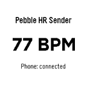</a>

<h2 class="app-name" id="app-8dc4a43c3b244d85aeac474b"><a href="https://apps.repebble.com/8dc4a43c3b244d85aeac474b">Can&#x27;s HR Sender for Pebble</a></h2>
<a class="app-source" href="https://github.com/koprulucan/Cans_Pebbleton_HR_Sender" title="Source code" data-search-exclude>View source</a>

by <a href="https://apps.repebble.com/apps/dev/can-k-pr-l_d3ad2af71c340658ae220e38" title="More from this developer">Can Köprülü</a>

Not checked yet v0.2.1 Updated 2026-08-26

Runs on: Time 2, Pebble 2 Duo, Pebble 2

Can&#x27;s HR Sender for Pebble is a Pebble watch app that reads live heart-rate data from the watch and sends it to the Android companion app Can&#x27;s Pebbleton HR Bridge. Together, the two apps make the…

<a class="app-shot" href="https://apps.repebble.com/56cd86c686ce3bde59000019" data-search-exclude>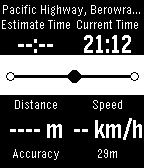</a>

<h2 class="app-name" id="app-56cd86c686ce3bde59000019"><a href="https://apps.repebble.com/56cd86c686ce3bde59000019">CanIMakeIt</a></h2>
<a class="app-source" href="https://github.com/cmwen/CanIMakeIt" title="Source code" data-search-exclude>View source</a>

by <a href="https://apps.repebble.com/apps/dev/cmwen_5553ace1dd51ad193d000060" title="More from this developer">CMWen</a>

Not checked yet v1.2 Updated 2016-02-26

Runs on: Time 2, Pebble 2 Duo, Pebble 2, Time, Classic

Wondering when you will get to the station everything when you rush out your home? This is a tool for you. CanIMakeIt shows you the distance to your destination and base on your current to…

<h2 class="app-name" id="app-2a901442a4f24729b05837b3"><a href="https://apps.repebble.com/2a901442a4f24729b05837b3">Cannonade</a></h2>
<a class="app-source" href="https://github.com/ygalanter/cannonade-pebble" title="Source code" data-search-exclude>View source</a>

by <a href="https://apps.repebble.com/apps/dev/comfortably-numb_52f547605101128b2200005a" title="More from this developer">Comfortably Numb</a>

Not checked yet v1.3.0 Updated 2026-06-19

Runs on: Time 2

Cannonade is a classic ballistic game between 2 opponents - in this case you and A.I. (or, to be precise - you and your watch). The goal is to destroy opponent&#x27;s fort with your projectile while…

<a class="app-shot" href="https://apps.repebble.com/557b6c6d93628394d6000090" data-search-exclude>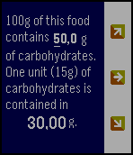</a>

<h2 class="app-name" id="app-557b6c6d93628394d6000090"><a href="https://apps.repebble.com/557b6c6d93628394d6000090">CarbUnitCounter</a></h2>
<a class="app-source" href="https://github.com/OpossumGit/CarbUnitCounter" title="Source code" data-search-exclude>View source</a>

by <a href="https://apps.repebble.com/apps/dev/opossum_5425e90055f4a0b2b200000e" title="More from this developer">Opossum</a>

No licence v1.0 Updated 2015-06-13

Runs on: Time 2, Pebble 2 Duo, Pebble 2, Time, Classic

App for diabetics doing carb counting. Helps you determine weight of food that contains one unit of carbohydrates (15g). Useful if you have diabetes.

<a class="app-shot" href="https://apps.repebble.com/8617ec913a584ba4ad22f4d6" data-search-exclude>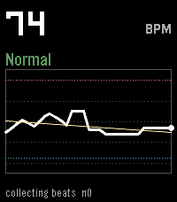</a>

<h2 class="app-name" id="app-8617ec913a584ba4ad22f4d6"><a href="https://apps.repebble.com/8617ec913a584ba4ad22f4d6">Cardia</a></h2>
<a class="app-source" href="https://github.com/BigWebstas/PebbleCardia" title="Source code" data-search-exclude>View source</a>

by <a href="https://apps.repebble.com/apps/dev/webstas-webstas_990614069b2a89f2e0c44e8b" title="More from this developer">Webstas “Webstas”</a>

No licence v1.2.0 Updated 2026-09-09

Runs on: Round 2, Time 2

A PebbleOS watchapp that watches your heart rate more closely than the system does by default and flags three things: sustained high rate, sustained low rate, and irregularly-irregular rhythm (the…

<a class="app-shot" href="https://apps.rebble.io/en_US/application/6a6a5a1d68745900086a833f" data-search-exclude>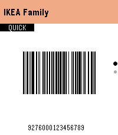</a>

<h2 class="app-name" id="app-6a6a5a1d68745900086a833f"><a href="https://apps.rebble.io/en_US/application/6a6a5a1d68745900086a833f">Cardigan</a></h2>
<a class="app-source" href="https://github.com/Seifollahi/cardigan" title="Source code" data-search-exclude>View source</a>

by <a href="https://apps.rebble.io/en_US/developer/692e6ad1cc3ef800098d69ff/1" title="More from this developer">Mo</a>

Other v1.1.0 Updated 2026-08-05 Rebble App Store

Runs on: Round 2, Time 2, Pebble 2 Duo, Pebble 2, Time Round, Time, Classic

Leave the keyring fobs at home. Cardigan keeps your loyalty cards on your Pebble as real, scannable Code 128 barcodes and QR codes — rendered pixel-perfect for e-paper and readable by laser and…

<a class="app-shot" href="https://apps.rebble.io/en_US/application/69501540da1501000944b086" data-search-exclude>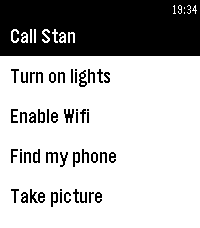</a>

<h2 class="app-name" id="app-69501540da1501000944b086"><a href="https://apps.rebble.io/en_US/application/69501540da1501000944b086">Catapult</a></h2>
<a class="app-source" href="https://github.com/matejdro/PebbleCatapult" title="Source code" data-search-exclude>View source</a>

by <a href="https://apps.rebble.io/en_US/developer/52b1ea273beaa0cecb00001f/1" title="More from this developer">matejdro</a>

Not checked yet v0.90 Updated 2026-06-25 Rebble App Store

Runs on: Time 2, Pebble 2 Duo, Pebble 2, Time

Launch Tasker tasks from your watch Android companion app is needed. It allows users to define a list of tasks that then show up on a watch and can be remotely activated. Tasks can also be put…

<h2 class="app-name" id="app-fe736f2b36744abca1e31a23"><a href="https://apps.repebble.com/fe736f2b36744abca1e31a23">Catcher</a></h2>
<a class="app-source" href="https://github.com/chernandezba/david_hernandez_bano/tree/main/pebble/catcher" title="Source code" data-search-exclude>View source</a>

by <a href="https://apps.repebble.com/apps/dev/cesar-hernandez_caddaac1097dcb3aed14d135" title="More from this developer">Cesar Hernandez</a>

Not checked yet v1.5 Updated 2026-06-03

Runs on: Time 2, Pebble 2 Duo, Pebble 2, Time, Classic

This is the last version released after his author, David (my brother), passed away on 2023. It&#x27;s a simple catcher game. You have 2 modes of play : time mode and lives mode. In time mode you will…

<a class="app-shot" href="https://apps.repebble.com/56da609222f7b305b7000051" data-search-exclude>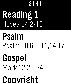</a>

<h2 class="app-name" id="app-56da609222f7b305b7000051"><a href="https://apps.repebble.com/56da609222f7b305b7000051">Catholic Daily</a></h2>
<a class="app-source" href="https://github.com/bobkingof12vs/Catholic-Daily" title="Source code" data-search-exclude>View source</a>

by <a href="https://apps.repebble.com/apps/dev/jacob-chisholm_567e0e1ca94eb3d0a80002f5" title="More from this developer">Jacob Chisholm</a>

No licence v1.3 Updated 2016-04-12

Runs on: Time 2, Pebble 2 Duo, Pebble 2, Time, Classic

An App designed to help you grow your Catholic Faith! This App offers the daily readings (courtesy of Universalis), as well as a simple Rosary/Chaplet of Devine Mercy. The readings are for today…

<h2 class="app-name" id="app-7f62b260bb574a4d927c382e"><a href="https://apps.repebble.com/7f62b260bb574a4d927c382e">Catholic Rosary</a></h2>
<a class="app-source" href="https://github.com/lpfabiani/pebble-catholic-rosary" title="Source code" data-search-exclude>View source</a>

by <a href="https://apps.repebble.com/apps/dev/lp-fabiani_d95fc96b4358d29b2d50e1f0" title="More from this developer">LP Fabiani</a>

Not checked yet v1.3.0 Updated 2026-09-03

Runs on: Round 2, Time 2, Pebble 2 Duo, Pebble 2, Time Round, Time, Classic

UPDATE: Now in English, Spanish, German, Italian and French. Quiet, reliable prayer companion. It walks you bead by bead through the entire Holy Rosary with gentle haptic feedback marking each…

<h2 class="app-name" id="app-57604008837089081e0000e7"><a href="https://apps.repebble.com/57604008837089081e0000e7">CB Schedule</a></h2>
<a class="app-source" href="https://github.com/cheeseisdisgusting/cbschedule" title="Source code" data-search-exclude>View source</a>

by <a href="https://apps.repebble.com/apps/dev/cheeseisdisgusting_55fcc1f028dd98074e000037" title="More from this developer">cheeseisdisgusting</a>

Not checked yet v0.54 Updated 2019-07-24

Runs on: Round 2, Time 2, Pebble 2 Duo, Pebble 2, Time Round, Time, Classic

NEVER FORGET WHAT CLASS IT IS! (At least if you go to Colonel By.) With CB Schedule, you&#x27;ll be able to: - See the current day and what your next class is with a few clicks of a button! - See your…

<a class="app-shot" href="https://apps.repebble.com/558c4421fd0cf8e9890000cc" data-search-exclude>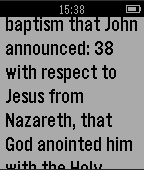</a>

<h2 class="app-name" id="app-558c4421fd0cf8e9890000cc"><a href="https://apps.repebble.com/558c4421fd0cf8e9890000cc">cerkit.com Daily Bible Verse</a></h2>
<a class="app-source" href="https://github.com/cerkit/cerkitDailyVerseForPebble" title="Source code" data-search-exclude>View source</a>

by <a href="https://apps.repebble.com/apps/dev/michael-earls_558c40b4d3f5ee67780000d0" title="More from this developer">Michael Earls</a>

Not checked yet v2.5 Updated 2015-07-07

Runs on: Time 2, Pebble 2 Duo, Pebble 2, Time, Classic

This is a simple app that displays a daily bible verse (New English Translation). It can also display a random verse. Scripture quoted by permission. All scripture quotations, unless otherwise…

<h2 class="app-name" id="app-565b509ccb722e8f470000a4"><a href="https://apps.repebble.com/565b509ccb722e8f470000a4">Chatty Client</a></h2>
<a class="app-source" href="https://github.com/toedter/pebble-chatty" title="Source code" data-search-exclude>View source</a>

by <a href="https://apps.repebble.com/apps/dev/kai-t-dter_5658971eb1c932105f000036" title="More from this developer">Kai Tödter</a>

Not checked yet v0.4 Updated 2016-11-12

Runs on: Time 2, Pebble 2 Duo, Pebble 2, Time, Classic

This is a small demo of a Pebble client for my RESTful demo application Chatty (see https://github.com/toedter/chatty). It gets JSON data from the RESTful hypermedia services of…

<a class="app-shot" href="https://apps.repebble.com/5505ad14e1a3a859e800002a" data-search-exclude>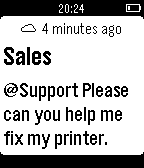</a>

<h2 class="app-name" id="app-5505ad14e1a3a859e800002a"><a href="https://apps.repebble.com/5505ad14e1a3a859e800002a">Chebble</a></h2>
<a class="app-source" href="https://github.com/adtennant/chebble" title="Source code" data-search-exclude>View source</a>

by <a href="https://apps.repebble.com/apps/dev/a-d-tennant_546ff63854f8241e18000021" title="More from this developer">A D Tennant</a>

No licence v1.0 Updated 2015-03-29

Runs on: Time 2, Pebble 2 Duo, Pebble 2, Time, Classic

Chebble is Chatter for Pebble. Keep up with your Salesforce Chatter feed from your wrist. Chebble is a free, open source app for checking your Salesforce Chatter feed on your Pebble Smartwatch…

<a class="app-shot" href="https://apps.rebble.io/en_US/application/58d7b8780dfc329fda000610" data-search-exclude>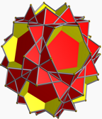</a>

<h2 class="app-name" id="app-58d7b8780dfc329fda000610"><a href="https://apps.rebble.io/en_US/application/58d7b8780dfc329fda000610">Check App</a></h2>
<a class="app-source" href="https://github.com/yevgeniybarkalov/PebbleFace" title="Source code" data-search-exclude>View source</a>

by <a href="https://apps.rebble.io/en_US/developer/562b552d015078e1ef000053/1" title="More from this developer">Yevgeniy Barkalov</a>

Not checked yet v1.0 Updated 2017-03-26 Rebble App Store

Runs on: Round 2, Time 2, Pebble 2 Duo, Pebble 2, Time Round, Time, Classic

Check up on you

<a class="app-shot" href="https://apps.repebble.com/5620e876768e7ada4e00007a" data-search-exclude>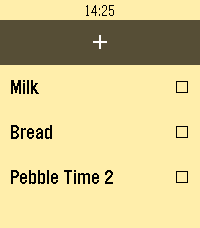</a>

<h2 class="app-name" id="app-5620e876768e7ada4e00007a"><a href="https://apps.repebble.com/5620e876768e7ada4e00007a">Checklist</a></h2>
<a class="app-source" href="https://github.com/freakified/PebbleChecklist" title="Source code" data-search-exclude>View source</a>

by <a href="https://apps.repebble.com/apps/dev/freakified_534d74f861fcaa8033000263" title="More from this developer">Freakified</a>

Not checked yet v2.3 Updated 2026-05-04

Runs on: Round 2, Time 2, Pebble 2 Duo, Pebble 2, Time Round, Time

A checklist on your watch! Grocery shopping will never be the same. You can use Checklist to keep track of anything you need without needing to hold your phone: things to-do, shopping, and more!…

<a class="app-shot" href="https://apps.repebble.com/54476f1335d2bcae86000035" data-search-exclude>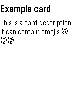</a>

<h2 class="app-name" id="app-54476f1335d2bcae86000035"><a href="https://apps.repebble.com/54476f1335d2bcae86000035">Checklists for Trello</a></h2>
<a class="app-source" href="https://github.com/schwittmann/pebble-trello2" title="Source code" data-search-exclude>View source</a>

by <a href="https://apps.repebble.com/apps/dev/schwittmann_5434faf0b3b950845a00016c" title="More from this developer">Schwittmann</a>

Not checked yet v3.2 Updated 2017-08-20

Runs on: Time 2, Pebble 2 Duo, Pebble 2, Time, Classic

Mark your Trello todos on your wrist! Disclaimer: We are not affiliated, associated, authorized, endorsed by or in any way officially connected to Trello, Inc. (www.trello.com).

<h2 class="app-name" id="app-691e287d23bdbb000998aff9"><a href="https://apps.repebble.com/691e287d23bdbb000998aff9">CheckMark</a></h2>
<a class="app-source" href="https://github.com/LeonMatthes/CheckMark" title="Source code" data-search-exclude>View source</a>

by <a href="https://apps.repebble.com/apps/dev/leon-matthes_691e21ec34f4140008daaea5" title="More from this developer">Leon Matthes</a>

No licence v1.2.0 Updated 2026-06-26

Runs on: Round 2, Time 2, Pebble 2 Duo, Pebble 2, Time Round, Time, Classic

Do you have your check lists organized in Markdown files somewhere? Your shopping list? Your todos? Then CheckMark is for you! Read unchecked items directly from your watch - marking items dones…

<a class="app-shot" href="https://apps.repebble.com/f36098fd376a43f2965478cc" data-search-exclude>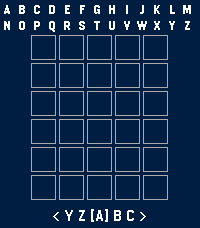</a>

<h2 class="app-name" id="app-f36098fd376a43f2965478cc"><a href="https://apps.repebble.com/f36098fd376a43f2965478cc">Cheetah&#x27;s Wordle</a></h2>
<a class="app-source" href="https://github.com/Furchee/Furchee-s-Wordle" title="Source code" data-search-exclude>View source</a>

by <a href="https://apps.repebble.com/apps/dev/furchee_1bb35cbb1c9e9aa2b06fb7d0" title="More from this developer">Furchee</a>

No licence v3.0.4 Updated 2026-09-26

Runs on: Round 2, Time 2, Pebble 2 Duo, Pebble 2, Time Round, Time, Classic

Furchee&#x27;s Wordle A fully working Wordle Game for the pebble smart watch! I made a better one because I like wordle. Tested the round screen versions using the emulator. Let me know if it doesn&#x27;t…

<a class="app-shot" href="https://apps.repebble.com/53cfe4e760736bd808000213" data-search-exclude>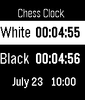</a>

<h2 class="app-name" id="app-53cfe4e760736bd808000213"><a href="https://apps.repebble.com/53cfe4e760736bd808000213">Chess Clock</a></h2>
<a class="app-source" href="https://github.com/31422/Chess-Clock" title="Source code" data-search-exclude>View source</a>

by <a href="https://apps.repebble.com/apps/dev/omar-g_537bf6d2b352cdbca3000073" title="More from this developer">Omar G</a>

No licence v1.0 Updated 2014-07-23

Runs on: Time 2, Pebble 2 Duo, Pebble 2, Time, Classic

Here is a chess clock on your wrist. App is already in settings when you open it. Using the up and down buttons adjust the time. The select button cycles through the hours, minutes, and seconds…

<a class="app-shot" href="https://apps.repebble.com/56940424ead187610700004f" data-search-exclude>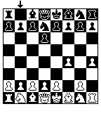</a>

<h2 class="app-name" id="app-56940424ead187610700004f"><a href="https://apps.repebble.com/56940424ead187610700004f">Chess for Pebble</a></h2>
<a class="app-source" href="https://github.com/runnersaw/pebble-chess" title="Source code" data-search-exclude>View source</a>

by <a href="https://apps.repebble.com/apps/dev/sawyer-vaughan_54a3bb34f10f42fe71000065" title="More from this developer">Sawyer Vaughan</a>

Not checked yet v1.0 Updated 2016-01-11

Runs on: Time 2, Pebble 2 Duo, Pebble 2, Time, Classic

Welcome to Chess for Pebble! Play against a chess AI with varying levels of difficulty. This game used to be a part of Games for Pebble, but was removed on Aplite due to memory restrictions.

<a class="app-shot" href="https://apps.repebble.com/56036876dafe0dea58000022" data-search-exclude>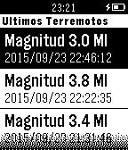</a>

<h2 class="app-name" id="app-56036876dafe0dea58000022"><a href="https://apps.repebble.com/56036876dafe0dea58000022">ChileSismos</a></h2>
<a class="app-source" href="https://github.com/csaldias/pebble-chilesismos" title="Source code" data-search-exclude>View source</a>

by <a href="https://apps.repebble.com/apps/dev/camilo-sald-as_52c616ed7bf7b87a90000011" title="More from this developer">Camilo Saldías</a>

Not checked yet v1.0 Updated 2015-11-01

Runs on: Time 2, Pebble 2 Duo, Pebble 2, Time, Classic

Una aplicación que muestra en tu Pebble los últimos 10 sismos ocurridos en Chile Continental, utilizando datos del Centro Sismológico Nacional (sismologia.cl). Los datos son actualizados en…

<a class="app-shot" href="https://apps.repebble.com/036fa1ce71bf44f991e9228c" data-search-exclude>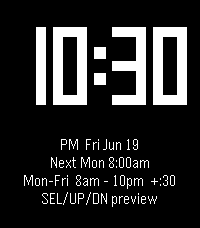</a>

<h2 class="app-name" id="app-036fa1ce71bf44f991e9228c"><a href="https://apps.repebble.com/036fa1ce71bf44f991e9228c">Chimer</a></h2>
<a class="app-source" href="https://github.com/RobErskine/pebble-chimer" title="Source code" data-search-exclude>View source</a>

by <a href="https://apps.repebble.com/apps/dev/roberskine_184b13a8b0e0be736034d50a" title="More from this developer">RobErskine</a>

No licence v1.2.0 Updated 2026-07-15

Runs on: Round 2, Time 2, Pebble 2 Duo, Pebble 2, Time Round, Time, Classic

Inspired by Casio watches as well as the Sensor and Ollee Watch mods, Chimers brings back classic hourly beeps with more customization. Specify days of the week, hour ranges, optional half-hour…

<a class="app-shot" href="https://apps.repebble.com/69f663b5ea28ba000ab50545" data-search-exclude>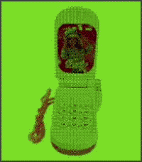</a>

<h2 class="app-name" id="app-69f663b5ea28ba000ab50545"><a href="https://apps.repebble.com/69f663b5ea28ba000ab50545">Chinese Toy Phone</a></h2>
<a class="app-source" href="https://github.com/nubbybubby/pebble-toy-phone" title="Source code" data-search-exclude>View source</a>

by <a href="https://apps.repebble.com/apps/dev/nubbybubby_67a84b8e89529e00099b3a79" title="More from this developer">nubbybubby</a>

Not checked yet v1.4.1 Updated 2026-09-19

Runs on: Time 2, Pebble 2 Duo

ay ay ay im your little butterfly ay ay ay im your little butterfly press select to use the phone, and press up/down to change the volume. you can also use the touch screen if you&#x27;re using PT2 lol

<h2 class="app-name" id="app-580e5633836d3cb4e8000016"><a href="https://apps.repebble.com/580e5633836d3cb4e8000016">ChipRef</a></h2>
<a class="app-source" href="https://github.com/furrtek/ChipRef" title="Source code" data-search-exclude>View source</a>

by <a href="https://apps.repebble.com/apps/dev/furrtek_54dfab5a91a09eff720000ef" title="More from this developer">Furrtek</a>

Not checked yet v0.12 Updated 2016-11-01

Runs on: Time 2, Pebble 2 Duo, Pebble 2, Time, Classic

Common integrated circuits reference app, showing internal schematics, pinouts, truth tables (to come)...

<a class="app-shot" href="https://apps.repebble.com/5300d1fdd1653b1dec0000b1" data-search-exclude>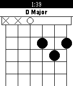</a>

<h2 class="app-name" id="app-5300d1fdd1653b1dec0000b1"><a href="https://apps.repebble.com/5300d1fdd1653b1dec0000b1">Chordinator</a></h2>
<a class="app-source" href="https://github.com/rigel314/pebbleChordinator" title="Source code" data-search-exclude>View source</a>

by <a href="https://apps.repebble.com/apps/dev/rigel314_529aa0fad17b50707b00001d" title="More from this developer">rigel314</a>

Not checked yet v2.2 Updated 2015-06-25

Runs on: Time 2, Pebble 2 Duo, Pebble 2, Time, Classic

Displays guitar chord finger positions. Now shows chords for ukulele and piano too! This data in this app was found by searching Google for chords. The chords may be entirely wrong. If you find an…

<a class="app-shot" href="https://apps.repebble.com/6946aed4da15010009fbaa7c" data-search-exclude>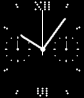</a>

<h2 class="app-name" id="app-6946aed4da15010009fbaa7c"><a href="https://apps.repebble.com/6946aed4da15010009fbaa7c">Chronograph</a></h2>
<a class="app-source" href="https://github.com/flokndl/chronograph" title="Source code" data-search-exclude>View source</a>

by <a href="https://apps.repebble.com/apps/dev/flo-kn-dl_69207a520a015600086f2e44" title="More from this developer">Flo Knödl</a>

Not checked yet v1.4 Updated 2025-12-20

Runs on: Time 2, Pebble 2 Duo, Pebble 2, Time, Classic

Chronograph Stopwatch based on &#x27;analogue dots&#x27; Watchface. --- - press &#x27;down&#x27; for start/pause/resume - press &#x27;up&#x27; for reset Display: - large hand for &#x27;seconds - small left dial for &#x27;subseconds&#x27; …

<a class="app-shot" href="https://apps.repebble.com/00e60e51de9047b68241bcb0" data-search-exclude>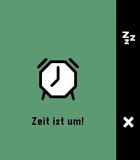</a>

<h2 class="app-name" id="app-00e60e51de9047b68241bcb0"><a href="https://apps.repebble.com/00e60e51de9047b68241bcb0">ChronoKit</a></h2>
<a class="app-source" href="https://github.com/dysseus-pascal/ChronoKit" title="Source code" data-search-exclude>View source</a>

by <a href="https://apps.repebble.com/apps/dev/dysseus_d55366949234e464067ed224" title="More from this developer">dysseus</a>

Not checked yet v1.4.0 Updated 2026-09-24

Runs on: Round 2, Time 2, Pebble 2 Duo

Stopwatch and Timer in one app

<h2 class="app-name" id="app-579a7a3322f599f144000208"><a href="https://apps.repebble.com/579a7a3322f599f144000208">Chuck Norris Jokes</a></h2>
<a class="app-source" href="https://github.com/KennethSchlatter/ChuckJokes" title="Source code" data-search-exclude>View source</a>

by <a href="https://apps.repebble.com/apps/dev/frosted-torus_55cf6edfdd278cc045000026" title="More from this developer">Frosted Torus</a>

No licence v1.0 Updated 2016-07-28

Runs on: Round 2, Time 2, Pebble 2 Duo, Pebble 2, Time Round, Time, Classic

A watchapp that loads random Chuck Norris jokes from chucknorris.io.

<a class="app-shot" href="https://apps.repebble.com/25ae7bcfc43540f6b8461f20" data-search-exclude>No screenshot</a>

<h2 class="app-name" id="app-25ae7bcfc43540f6b8461f20"><a href="https://apps.repebble.com/25ae7bcfc43540f6b8461f20">Cigarette Tracker</a></h2>
<a class="app-source" href="https://github.com/L0renz00/pebble_cigarette_tracker" title="Source code" data-search-exclude>View source</a>

by <a href="https://apps.repebble.com/apps/dev/cornelius_20cd14572b267afc302430d7" title="More from this developer">cornelius</a>

No licence v6.0 Updated 2026-07-13

Runs on: Round 2, Time 2, Pebble 2 Duo, Pebble 2, Time Round, Time, Classic

An app to track cigarette smoking. (Vibe-coded and WIP, expect breaks/issues)

<h2 class="app-name" id="app-540ba18df1b69c9eff000031"><a href="https://apps.repebble.com/540ba18df1b69c9eff000031">Cinematik 2015</a></h2>
<a class="app-source" href="https://github.com/michalvalasek/PebbleCinematik2014" title="Source code" data-search-exclude>View source</a>

by <a href="https://apps.repebble.com/apps/dev/michal-val-ek_531ade5b7e49752f250003a2" title="More from this developer">Michal Valášek</a>

Not checked yet v1.4 Updated 2015-08-31

Runs on: Time 2, Pebble 2 Duo, Pebble 2, Time, Classic

Cinematik is an international film festival taking place annually in Piešťany, Slovakia. This app shows the upcoming festival events and their details. NEW: Integration with Timeline (Pebble…

<a class="app-shot" href="https://apps.repebble.com/551fa70fd5e5f0cd6500000d" data-search-exclude>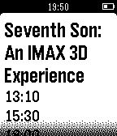</a>

<h2 class="app-name" id="app-551fa70fd5e5f0cd6500000d"><a href="https://apps.repebble.com/551fa70fd5e5f0cd6500000d">CinemaToday</a></h2>
<a class="app-source" href="https://github.com/cmarra/cinemaToday" title="Source code" data-search-exclude>View source</a>

by <a href="https://apps.repebble.com/apps/dev/chrstian-marra_549ac366a0bb06d3410000b3" title="More from this developer">Chrstian Marra</a>

Not checked yet v1.5 Updated 2016-03-03

Runs on: Time 2, Pebble 2 Duo, Pebble 2, Time, Classic

CinemaToday helps you to find cinema around you directly on your Pebble. See the programming and watch the movie.

<a class="app-shot" href="https://apps.repebble.com/68fe94c3d004720009e0b41a" data-search-exclude>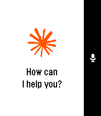</a>

<h2 class="app-name" id="app-68fe94c3d004720009e0b41a"><a href="https://apps.repebble.com/68fe94c3d004720009e0b41a">Claude</a></h2>
<a class="app-source" href="https://github.com/breitburg/claude-for-pebble" title="Source code" data-search-exclude>View source</a>

by <a href="https://apps.repebble.com/apps/dev/ilia-breitburg_5bf5720a24bed3000188e5cd" title="More from this developer">Ilia Breitburg</a>

Unlicense v1.14 Updated 2025-12-20

Runs on: Time 2, Pebble 2 Duo, Pebble 2, Time

Talk to Claude AI directly from your Pebble smartwatch. Use your watch&#x27;s built-in dictation to ask questions and get streaming responses from Claude. Good for quick queries when your phone isn&#x27;t…

<a class="app-shot" href="https://apps.repebble.com/55aeb453f825d3118100006b" data-search-exclude>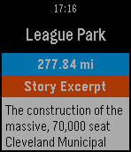</a>

<h2 class="app-name" id="app-55aeb453f825d3118100006b"><a href="https://apps.repebble.com/55aeb453f825d3118100006b">Cleveland Historical</a></h2>
<a class="app-source" href="https://github.com/ebellempire/Curatescape-pebble" title="Source code" data-search-exclude>View source</a>

by <a href="https://apps.repebble.com/apps/dev/center-for-public-history-digital-humanities_5511c1a6c496d8094500002c" title="More from this developer">Center for Public History + Digital Humanities</a>

Not checked yet v1.0 Updated 2015-07-21

Runs on: Time 2, Pebble 2 Duo, Pebble 2, Time, Classic

The Cleveland Historical Pebble app puts Cleveland history on your wrist, allowing you to quickly access information about nearby historical sites around the city. Developed by the Center for…

<a class="app-shot" href="https://apps.repebble.com/538f9f294cd6d5b6340000e1" data-search-exclude>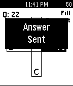</a>

<h2 class="app-name" id="app-538f9f294cd6d5b6340000e1"><a href="https://apps.repebble.com/538f9f294cd6d5b6340000e1">Clock</a></h2>
<a class="app-source" href="https://github.com/tyhoff/Clock" title="Source code" data-search-exclude>View source</a>

by <a href="https://apps.repebble.com/apps/dev/kirby-kohlmorgen_534a3cfdb68b6fb5f2000191" title="More from this developer">Kirby Kohlmorgen</a>

Not checked yet v1.0.0 Updated 2014-06-04

Runs on: Time 2, Pebble 2 Duo, Pebble 2, Time, Classic

This application is just a clock...that has cheating capabilities built in.

<a class="app-shot" href="https://apps.repebble.com/6aab02d087b66c0009820cc3" data-search-exclude>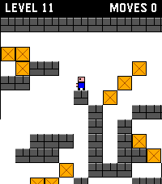</a>

<h2 class="app-name" id="app-6aab02d087b66c0009820cc3"><a href="https://apps.repebble.com/6aab02d087b66c0009820cc3">Clock Dude</a></h2>
<a class="app-source" href="https://github.com/hornofabraxas/clock-dude" title="Source code" data-search-exclude>View source</a>

by <a href="https://apps.repebble.com/apps/dev/omgslaykween_6a8876179a73d00009ee3f1a" title="More from this developer">OmgSlayKween</a>

Not checked yet v1.0 Updated 2026-09-16

Runs on: Round 2, Time 2

This is a Time 2 / Round 2 touch-input port of Block Dude, a block-pushing puzzle game written by Brandon Sterner for the TI-83 in 1999, and the reason many of us failed Calculus. The eleven…

<a class="app-shot" href="https://apps.repebble.com/702bd7b27ec8456280b5ab7a" data-search-exclude>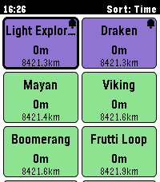</a>

<h2 class="app-name" id="app-702bd7b27ec8456280b5ab7a"><a href="https://apps.repebble.com/702bd7b27ec8456280b5ab7a">CoasterWatch</a></h2>
<a class="app-source" href="https://github.com/chrisc123/coasterwatch" title="Source code" data-search-exclude>View source</a>

by <a href="https://apps.repebble.com/apps/dev/chris-c_f072419a7c00b02e2e3351ba" title="More from this developer">Chris C</a>

Not checked yet v1.3.0 Updated 2026-08-29

Runs on: Round 2, Time 2, Pebble 2 Duo, Pebble 2, Time Round, Time, Classic

CoasterWatch brings live theme park queue times and wait-time trends right to your wrist, powered by Queue-Times.com. Yes, it is vide-coded - sorry-not-sorry 🙂. The app needs to stay open on your…

<a class="app-shot" href="https://apps.repebble.com/34c8e534967b4680980f3fdc" data-search-exclude>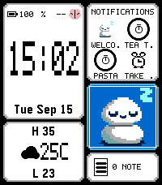</a>

<h2 class="app-name" id="app-34c8e534967b4680980f3fdc"><a href="https://apps.repebble.com/34c8e534967b4680980f3fdc">codey</a></h2>
<a class="app-source" href="https://github.com/nick1udwig/codey" title="Source code" data-search-exclude>View source</a>

by <a href="https://apps.repebble.com/apps/dev/nick1udwig_d30aec49b29caa20180a2880" title="More from this developer">nick1udwig</a>

Not checked yet v0.2.1 Updated 2026-09-22

Runs on: Round 2, Time 2

codey is a personal assistant, powered by codex. Check your calendar, the weather, check off TODOs, or query/instruct your codex agent, all from your wrist. Run the codey-server on your Linux or…

<h2 class="app-name" id="app-57f980d41fd66b4a2e00001e"><a href="https://apps.repebble.com/57f980d41fd66b4a2e00001e">Coin Toss</a></h2>
<a class="app-source" href="https://github.com/mrmichaelkang/coin_toss" title="Source code" data-search-exclude>View source</a>

by <a href="https://apps.repebble.com/apps/dev/michael-kang_54e5499d58f9c95019000023" title="More from this developer">Michael Kang</a>

Not checked yet v1.0 Updated 2016-10-08

Runs on: Round 2, Time 2, Pebble 2 Duo, Pebble 2, Time Round, Time, Classic

Coin Toss simulates a coin being flip. There is a simple counter that counts how many heads or tails have landed.

<a class="app-shot" href="https://apps.rebble.io/en_US/application/59ba7cad461a8dd989001bd7" data-search-exclude>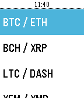</a>

<h2 class="app-name" id="app-59ba7cad461a8dd989001bd7"><a href="https://apps.rebble.io/en_US/application/59ba7cad461a8dd989001bd7">CoinMarket</a></h2>
<a class="app-source" href="https://github.com/DylanGrl/Pebble_CoinMarket" title="Source code" data-search-exclude>View source</a>

by <a href="https://apps.rebble.io/en_US/developer/58e3541c6ca387fc52000959/1" title="More from this developer">DylanGrl</a>

No licence v1.0 Updated 2017-09-14 Rebble App Store

Runs on: Time 2, Pebble 2 Duo, Pebble 2, Time, Classic

Check easily the value and evolution of the top 10 cryptocurrency from coinmarketcap website. Easily change your fiat from the settings of the app in the phone ! (Feel free to donate for dev : BTC…

<a class="app-shot" href="https://apps.repebble.com/55076473ce75c144cc00008b" data-search-exclude>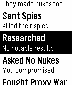</a>

<h2 class="app-name" id="app-55076473ce75c144cc00008b"><a href="https://apps.repebble.com/55076473ce75c144cc00008b">Cold War Simulator 2K15</a></h2>
<a class="app-source" href="https://github.com/AwesomeBen1/ColdWarSim2K15" title="Source code" data-search-exclude>View source</a>

by <a href="https://apps.repebble.com/apps/dev/ben-chapman-kish_549c7f5263c11a140100085f" title="More from this developer">Ben Chapman-Kish</a>

No licence v1.4 Updated 2015-05-06

Runs on: Time 2, Pebble 2 Duo, Pebble 2, Time, Classic

It&#x27;s a number of years after the most recent global war and tensions are heating up between you and the other world superpower. The fate of the world is in your hands as you use strategy and wits…

<h2 class="app-name" id="app-6850959f48a55300094e9032"><a href="https://apps.repebble.com/6850959f48a55300094e9032">Colectivos</a></h2>
<a class="app-source" href="https://github.com/mvidelatraduc/colectivos-de-rosario-pebble" title="Source code" data-search-exclude>View source</a>

by <a href="https://apps.repebble.com/apps/dev/mauricio-videla_67eeb625653eea00086eedd3" title="More from this developer">Mauricio Videla</a>

Not checked yet v1.1 Updated 2026-02-26

Runs on: Round 2, Time 2, Pebble 2 Duo, Pebble 2, Time Round, Time, Classic

Una aplicación para el sistema urbano de transporte público de Rosario, Argentina. Se muestran las paradas de colectivos cercanas y, tras seleccionar una, pueden verse los próximos arribos…

<a class="app-shot" href="https://apps.repebble.com/58039d22c98866a9d80000f4" data-search-exclude>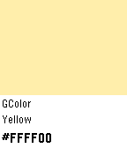</a>

<h2 class="app-name" id="app-58039d22c98866a9d80000f4"><a href="https://apps.repebble.com/58039d22c98866a9d80000f4">Color Browser</a></h2>
<a class="app-source" href="https://github.com/gitpaddi/PebbleAppColorBrowser" title="Source code" data-search-exclude>View source</a>

by <a href="https://apps.repebble.com/apps/dev/somepaddi_57daea402d0cc8673f0000dd" title="More from this developer">somepaddi</a>

Not checked yet v1.0 Updated 2016-10-16

Runs on: Time 2, Time

This app shows you colors with their hex codes and an example how that color looks on the Pebble Time.

<a class="app-shot" href="https://apps.repebble.com/55da378a6323c5cc54000029" data-search-exclude>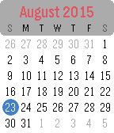</a>

<h2 class="app-name" id="app-55da378a6323c5cc54000029"><a href="https://apps.repebble.com/55da378a6323c5cc54000029">Color Calendar</a></h2>
<a class="app-source" href="https://github.com/tripleplay369/pebble-color-calendar" title="Source code" data-search-exclude>View source</a>

by <a href="https://apps.repebble.com/apps/dev/kelby_55b13e5fd53410746c000090" title="More from this developer">Kelby</a>

Not checked yet v2.0 Updated 2016-01-04

Runs on: Round 2, Time 2, Time Round, Time

A simple, easy to read calendar designed specifically for the Pebble Time. Up and down buttons scroll between months, select button returns to today. Long select button press toggles between…

<a class="app-shot" href="https://apps.repebble.com/eb92c307037c414b80fbd943" data-search-exclude>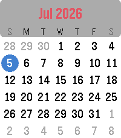</a>

<h2 class="app-name" id="app-eb92c307037c414b80fbd943"><a href="https://apps.repebble.com/eb92c307037c414b80fbd943">Color Calendar Redux</a></h2>
<a class="app-source" href="https://github.com/randylaheyjr/ColorCalendarRedux" title="Source code" data-search-exclude>View source</a>

by <a href="https://apps.repebble.com/apps/dev/comet-designs_5f179d466ba98c00eb25aa34" title="More from this developer">Comet Designs</a>

Not checked yet v2.1.1 Updated 2026-07-11

Runs on: Round 2, Time 2, Time Round, Time

Color Calendar Redux This is an update of the original Color Calendar app created by Kelby. A simple, easy-to-read calendar for your Pebble. Tap or Swipe Up and Down to scroll between months…

<a class="app-shot" href="https://apps.repebble.com/69d079b774b3f70009ab30cd" data-search-exclude>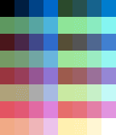</a>

<h2 class="app-name" id="app-69d079b774b3f70009ab30cd"><a href="https://apps.repebble.com/69d079b774b3f70009ab30cd">Color View Sample</a></h2>
<a class="app-source" href="https://github.com/changing-k-tanaka/pebble-app-color-view-sample" title="Source code" data-search-exclude>View source</a>

by <a href="https://apps.repebble.com/apps/dev/changing-k-tanaka_69d06e418ce708000859e6f6" title="More from this developer">changing-k-tanaka</a>

Not checked yet v1.1 Updated 2026-04-27

Runs on: Round 2, Time 2, Time Round, Time

This app is intended for development purposes. It allows you to view and check the 64 colors available on color-capable Pebble devices (currently only “Pebble Time” and “Pebble Time Round” are…

<a class="app-shot" href="https://apps.repebble.com/5587333c49c1d1c16d000037" data-search-exclude>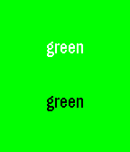</a>

<h2 class="app-name" id="app-5587333c49c1d1c16d000037"><a href="https://apps.repebble.com/5587333c49c1d1c16d000037">ColorTest</a></h2>
<a class="app-source" href="https://github.com/ace7196/ColorTest" title="Source code" data-search-exclude>View source</a>

by <a href="https://apps.repebble.com/apps/dev/rs_52f049ef1ac794fac8001087" title="More from this developer">rS</a>

No licence v1.1 Updated 2015-06-22

Runs on: Time 2, Pebble 2 Duo, Pebble 2, Time, Classic

Just a basic app to show you what black and white text look like with different background colors on the actual screen.

<a class="app-shot" href="https://apps.repebble.com/5672298346ebacd2e6000082" data-search-exclude>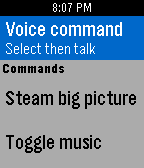</a>

<h2 class="app-name" id="app-5672298346ebacd2e6000082"><a href="https://apps.repebble.com/5672298346ebacd2e6000082">Commander for Pebble</a></h2>
<a class="app-source" href="https://github.com/c0decat/pebble-commander" title="Source code" data-search-exclude>View source</a>

by <a href="https://apps.repebble.com/apps/dev/colin-murphy_565e17745629c91d9700007a" title="More from this developer">Colin Murphy</a>

Not checked yet v1.7 Updated 2016-01-18

Runs on: Time 2, Pebble 2 Duo, Pebble 2, Time, Classic

Commander for Pebble is a watchapp that turns your Pebble into a remote control for your Linux PC. You can use it to launch your favorite programs, or use it for automation with your own scripts…

<a class="app-shot" href="https://apps.repebble.com/bdfac08800694f72a79bfb5b" data-search-exclude>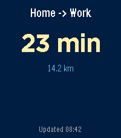</a>

<h2 class="app-name" id="app-bdfac08800694f72a79bfb5b"><a href="https://apps.repebble.com/bdfac08800694f72a79bfb5b">Commute Timer</a></h2>
<a class="app-source" href="https://gitlab.com/tjaart/pebble-commute-timer" title="Source code" data-search-exclude>View source</a>

by <a href="https://apps.repebble.com/apps/dev/tjaart_4639c7101db8c9ad09c3625e" title="More from this developer">tjaart</a>

Not checked yet v1.1.0 Updated 2026-04-30

Runs on: Round 2, Time 2, Pebble 2 Duo, Pebble 2, Time Round, Time, Classic

Live commute time on your wrist — Home ↔ Work, with real-time traffic from Google Maps.

<a class="app-shot" href="https://apps.repebble.com/68fd14f9504cc500097101e2" data-search-exclude>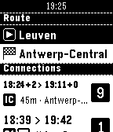</a>

<h2 class="app-name" id="app-68fd14f9504cc500097101e2"><a href="https://apps.repebble.com/68fd14f9504cc500097101e2">Commuter</a></h2>
<a class="app-source" href="https://github.com/gbougakov/commuter-pebble/" title="Source code" data-search-exclude>View source</a>

by <a href="https://apps.repebble.com/apps/dev/werknaam_67dd9c9fd943930009185733" title="More from this developer">Werknaam</a>

Not checked yet v1.4 Updated 2025-10-31

Runs on: Time 2, Pebble 2 Duo, Pebble 2, Time

Quickly check SNCB/NMBS (Belgian Railways) train schedules from your wrist. Save favourite stations from your phone to quickly plot routes on your watch. Create &quot;scheduled routes&quot; to immediately…

<h2 class="app-name" id="app-540f7cafbc27450164000157"><a href="https://apps.repebble.com/540f7cafbc27450164000157">Compass</a></h2>
<a class="app-source" href="https://github.com/coredevices/pebble-compass" title="Source code" data-search-exclude>View source</a>

by <a href="https://apps.repebble.com/apps/dev/pebble_52d8a44faef8d590d3000029" title="More from this developer">Pebble</a>

Not checked yet v1.31 Updated 2026-07-27

Runs on: Round 2, Time 2, Pebble 2 Duo, Pebble 2, Time Round, Time, Classic

Compass app elegantly animates between two different modes: A compass rose when you look down at your Pebble and a heading indicator when hold the watch in front of the horizon. A spirit level is…

<h2 class="app-name" id="app-53a799768eaa2a00040000b3"><a href="https://apps.repebble.com/53a799768eaa2a00040000b3">Compass</a></h2>
<a class="app-source" href="https://github.com/silicaRich/pebble-compass" title="Source code" data-search-exclude>View source</a>

by <a href="https://apps.repebble.com/apps/dev/silicarich_52bb32d9c41b9cd6c50001c3" title="More from this developer">silicarich</a>

Not checked yet v1.0.0 Updated 2014-06-23

Runs on: Time 2, Pebble 2 Duo, Pebble 2, Time, Classic

Your Android phone will send you compass data on your Pebble! Open source and in beta. Please see source link if interested :) Bug: Unfortunately your Android&#x27;s screen needs to be on for data…

<h2 class="app-name" id="app-032214bd21df4081acf8bf55"><a href="https://apps.repebble.com/032214bd21df4081acf8bf55">Compass &amp; Star Map</a></h2>
<a class="app-source" href="https://github.com/hobbykitjr/PebbleStarMap" title="Source code" data-search-exclude>View source</a>

by <a href="https://apps.repebble.com/apps/dev/utilitarian-huguenot_9c9ddf61631140315ab53669" title="More from this developer">Utilitarian Huguenot</a>

Not checked yet v1.0 Updated 2026-04-09

Runs on: Round 2

BETA, Uses phone location and watch compass to show cardinal direction on your watch along w/ current star map based on time of day. Will need more testing when i get a watch.

<h2 class="app-name" id="app-60a3f01f1342ae0091b7e186"><a href="https://apps.rebble.io/en_US/application/60a3f01f1342ae0091b7e186">Compliment Moi</a></h2>
<a class="app-source" href="https://github.com/johnspahr/compliment-moi-pebble" title="Source code" data-search-exclude>View source</a>

by <a href="https://apps.rebble.io/en_US/developer/60a3f01d1342ae0091b7e184/1" title="More from this developer">John Spahr</a>

Not checked yet v1.2 Updated 2021-05-20 Rebble App Store

Runs on: Round 2, Time 2, Pebble 2 Duo, Pebble 2, Time Round, Time, Classic

Feeling gloomy? If so, perhaps a compliment will brighten up your day! Compliment Moi is a simple little Pebble.js app that compliments you and gives you words of encouragement. With tons of…

<h2 class="app-name" id="app-628ab49ce3ac04000b00b97f"><a href="https://apps.rebble.io/en_US/application/628ab49ce3ac04000b00b97f">Compliment Moi (Updated)</a></h2>
<a class="app-source" href="https://github.com/JohnSpahr/compliment-moi-pebble" title="Source code" data-search-exclude>View source</a>

by <a href="https://apps.rebble.io/en_US/developer/609801a58324660009e8a4db/1" title="More from this developer">John Spahr</a>

CC0-1.0 v1.3 Updated 2022-05-22 Rebble App Store

Runs on: Round 2, Time 2, Pebble 2 Duo, Pebble 2, Time Round, Time, Classic

Feeling gloomy? If so, perhaps a compliment will brighten up your day! Compliment Moi is a simple little Pebble.js app that compliments you and gives you words of encouragement. With tons of…

<h2 class="app-name" id="app-10f46ae849224d009644f7e8"><a href="https://apps.repebble.com/10f46ae849224d009644f7e8">Constellation</a></h2>
<a class="app-source" href="https://github.com/globe-and-atlas/constellation-watch" title="Source code" data-search-exclude>View source</a>

by <a href="https://apps.repebble.com/apps/dev/daniel-bally_e8468a0ff28edd5791d1bced" title="More from this developer">Daniel Bally</a>

Not checked yet v0.2.0 Updated 2026-10-02

Runs on: Time 2

An educational orbital-geometry watchapp for Pebble Time 2. Constellation propagates public CelesTrak GP/TLE element sets with SGP4 to plot modeled GPS, Galileo, GLONASS, and BeiDou positions. It…

<h2 class="app-name" id="app-531d9a3714708baa95000189"><a href="https://apps.rebble.io/en_US/application/531d9a3714708baa95000189">Contractions</a></h2>
<a class="app-source" href="https://github.com/jayjun/Contractions" title="Source code" data-search-exclude>View source</a>

by <a href="https://apps.rebble.io/en_US/developer/5311c54d92295dd6710001f7/1" title="More from this developer">Tan Jay Jun</a>

Not checked yet v1.1 Updated 2014-06-25 Rebble App Store

Runs on: Time 2, Pebble 2 Duo, Pebble 2, Time, Classic

Track labor contractions on your Pebble! Why fumble with smartphones? You can&#x27;t check logs while calling your midwife, and how long will that battery last? Put the log &amp; timer on your wrist. Made…

<h2 class="app-name" id="app-553349b09657f17a1d0000c0"><a href="https://apps.repebble.com/553349b09657f17a1d0000c0">Control Hue</a></h2>
<a class="app-source" href="https://github.com/JCDCJK/pebblingforhue" title="Source code" data-search-exclude>View source</a>

by <a href="https://apps.repebble.com/apps/dev/pebbling-for-hue_553342989657f1a9a00000a6" title="More from this developer">Pebbling for Hue</a>

MIT v1.0 Updated 2015-04-19

Runs on: Time 2, Pebble 2 Duo, Pebble 2, Time, Classic

Control Hue is a Pebble smartwatch app that controls Philips Hue light bulbs. You will need Philips Hue light bulbs and the Philips Hue Bridge to use this app. It is user friendly with convenient…

<h2 class="app-name" id="app-67d320fcd3b7b300097f1ec4"><a href="https://apps.rebble.io/en_US/application/67d320fcd3b7b300097f1ec4">Conway&#x27;s Game of Life</a></h2>
<a class="app-source" href="https://github.com/FlynnD273/pebble-conway" title="Source code" data-search-exclude>View source</a>

by <a href="https://apps.rebble.io/en_US/developer/67bd48a737d408000a74f7d7/1" title="More from this developer">Flynn Duniho</a>

No licence v1.5 Updated 2026-03-03 Rebble App Store

Runs on: Round 2, Time 2, Pebble 2 Duo, Pebble 2, Time Round, Time, Classic

A simple Conway&#x27;s Game of Life app

<h2 class="app-name" id="app-28a88f2d5e984cccba448035"><a href="https://apps.repebble.com/28a88f2d5e984cccba448035">Cookie Clicker</a></h2>
<a class="app-source" href="https://github.com/Ocelot5836/cookie-clicker-pebble" title="Source code" data-search-exclude>View source</a>

by <a href="https://apps.repebble.com/apps/dev/ocelot_797fbdaaee85e7dd1580bc78" title="More from this developer">Ocelot</a>

MIT v1.2.1 Updated 2026-05-22

Runs on: Round 2, Time 2, Pebble 2 Duo, Pebble 2, Time Round, Time

Cookie Clicker on the Pebble Watch! Press the button as fast as possible to get MORE cookies. Cookies are still generated when the app is closed. Press down to enter the shop and purchase…

<h2 class="app-name" id="app-56a8d5e70b9e953a7100002a"><a href="https://apps.repebble.com/56a8d5e70b9e953a7100002a">Cookie Clickers Color</a></h2>
<a class="app-source" href="http://bit.ly/aboutpdl" title="Source code" data-search-exclude>View source</a>

by <a href="https://apps.repebble.com/apps/dev/small-rock-design-labs_54c3a91ca64480370e000062" title="More from this developer">small rock design labs!</a>

See source v3.1 Updated 2016-01-27

Runs on: Time 2, Pebble 2 Duo, Pebble 2, Time, Classic

Color version of the Cookie Clickers B/W

<h2 class="app-name" id="app-55fdac750a5482833d000085"><a href="https://apps.repebble.com/55fdac750a5482833d000085">Core Temp Monitor</a></h2>
<a class="app-source" href="https://github.com/zanecodes/CoreTempMonitor" title="Source code" data-search-exclude>View source</a>

by <a href="https://apps.repebble.com/apps/dev/zanecodes_534865dd4ea7988a36000082" title="More from this developer">zanecodes</a>

Not checked yet v1.1 Updated 2015-11-16

Runs on: Time 2, Pebble 2 Duo, Pebble 2, Time, Classic

A simple app for tracking your computer&#x27;s CPU temperature in real time. See the app website for installation and usage instructions.

<h2 class="app-name" id="app-5edde2293dd3105ab984ba5e"><a href="https://apps.rebble.io/en_US/application/5edde2293dd3105ab984ba5e">Couch to 5K</a></h2>
<a class="app-source" href="https://github.com/LawnGnome/c25k-pebble" title="Source code" data-search-exclude>View source</a>

by <a href="https://apps.rebble.io/en_US/developer/5edde2293dd3105ab984ba5c/1" title="More from this developer">Adam Harvey</a>

MIT v0.1 Updated 2020-06-08 Rebble App Store

Runs on: Round 2, Time 2, Pebble 2 Duo, Pebble 2, Time Round, Time, Classic

A timer for the NHS version of the Couch to 5K running programme. This app provides an overall view of how far you are through the intervals as you run. (Banner image by Beatrice Murch; licensed…

<h2 class="app-name" id="app-5901e11c0dfc32464a0005bb"><a href="https://apps.repebble.com/5901e11c0dfc32464a0005bb">Couch To 5K</a></h2>
<a class="app-source" href="https://github.com/Odja-anarchist/Pebble-C25k" title="Source code" data-search-exclude>View source</a>

by <a href="https://apps.repebble.com/apps/dev/tkm-software_561497cfa4b13075dd000065" title="More from this developer">TKM Software</a>

No licence v1.3 Updated 2017-09-29

Runs on: Round 2, Time 2, Pebble 2 Duo, Pebble 2, Time Round, Time, Classic

Couch to 5K (C25K) Training app. Multi lanauge support: English, Français, Deutsche, Español. Supports a list of 24 days, all with individual progress indicators. Select a day to see the steps for…

<h2 class="app-name" id="app-52b1f7b8cd41839a69000015"><a href="https://apps.repebble.com/52b1f7b8cd41839a69000015">Count Down</a></h2>
<a class="app-source" href="https://github.com/samuelmr/pebble-countdown" title="Source code" data-search-exclude>View source</a>

by <a href="https://apps.repebble.com/apps/dev/samuel_52b1f68fcd41831af0000014" title="More from this developer">Samuel</a>

Not checked yet v1.4 Updated 2016-10-25

Runs on: Round 2, Time 2, Pebble 2 Duo, Pebble 2, Time Round, Time, Classic

Customizable timer with vibration notifications at specified times. Giving a talk? Training in the gym? Want to know how time passes without constantly looking at your watch? Let Count Down help!…

<h2 class="app-name" id="app-c1e3e132dae74bbcaf1a8320"><a href="https://apps.repebble.com/c1e3e132dae74bbcaf1a8320">Countdown timer</a></h2>
<a class="app-source" href="https://github.com/Sykero-Software/PebbleCountdownTimer" title="Source code" data-search-exclude>View source</a>

by <a href="https://apps.repebble.com/apps/dev/syker-software_9f6c9c6e9ce88af6a0db953e" title="More from this developer">Sykerö Software</a>

GPL-3.0 v1.1.13 Updated 2026-09-01

Runs on: Time 2, Pebble 2 Duo, Pebble 2, Time, Classic

Countdown timer — a simple multi-timer for your Pebble. Configure any number of named countdown timers (up to 16) from your phone, each with its own duration. On the watch you see the list and can…

<h2 class="app-name" id="app-52fd881562f8c4f39e000064"><a href="https://apps.repebble.com/52fd881562f8c4f39e000064">counter</a></h2>
<a class="app-source" href="http://github.com/matthewbauer/counter" title="Source code" data-search-exclude>View source</a>

by <a href="https://apps.repebble.com/apps/dev/matthew-bauer_52f148288811340a1b00017f" title="More from this developer">Matthew Bauer</a>

No licence v1.0 Updated 2014-02-14

Runs on: Time 2, Pebble 2 Duo, Pebble 2, Time, Classic

Counter is a multipurpose counting app with applications including card counting, lap tracking, and monitoring chicken wing intake.

<h2 class="app-name" id="app-596e2e79461a8d34f600006c"><a href="https://apps.repebble.com/596e2e79461a8d34f600006c">Counter</a></h2>
<a class="app-source" href="https://github.com/mrbluue/CounterPebble/" title="Source code" data-search-exclude>View source</a>

by <a href="https://apps.repebble.com/apps/dev/mrblue_56dc9f89296282ad2e000034" title="More from this developer">MrBlue</a>

Not checked yet v1.2 Updated 2017-07-18

Runs on: Time 2, Pebble 2 Duo, Pebble 2, Time, Classic

Count using the up and down buttons. You can set a limit to how far you want to count. You can also save your counts by long pressing select on the counting screen. (It is not currently possible…

<h2 class="app-name" id="app-56d6fcacc2d302dbfc000021"><a href="https://apps.repebble.com/56d6fcacc2d302dbfc000021">Counter proportion</a></h2>
<a class="app-source" href="http://rlirette.com/counter-proportion/" title="Source code" data-search-exclude>View source</a>

by <a href="https://apps.repebble.com/apps/dev/rlirette_5690fa0e0da72f6a23000043" title="More from this developer">rlirette</a>

See source v1.4 Updated 2016-09-12

Runs on: Round 2, Time 2, Pebble 2 Duo, Pebble 2, Time Round, Time, Classic

Français Cette application est un compteur à 2 chiffres. Le premier fait référence à une &quot;portion&quot; et le deuxième à une &quot;quantité totale&quot;. L&#x27;application affiche: - Le rapport &quot;portion&quot; / &quot;quantité…

<h2 class="app-name" id="app-57321b9bddb70016b600001f"><a href="https://apps.repebble.com/57321b9bddb70016b600001f">Countit-all</a></h2>
<a class="app-source" href="https://github.com/susundberg/pebble-countit-all" title="Source code" data-search-exclude>View source</a>

by <a href="https://apps.repebble.com/apps/dev/susundberg_557c7399d269ce467600006b" title="More from this developer">susundberg</a>

Not checked yet v1.0 Updated 2016-05-21

Runs on: Round 2, Time 2, Pebble 2 Duo, Pebble 2, Time Round, Time, Classic

Pebble application for counting and timing events! This application provides easy way to count and time different events. You can configure up to three (one for each button) items to count and…

<h2 class="app-name" id="app-2cc96a35a0a94e09bb6d9e1e"><a href="https://apps.repebble.com/2cc96a35a0a94e09bb6d9e1e">CountUpVibe Timer</a></h2>
<a class="app-source" href="https://github.com/dev-salmontech/Pebble_CountUpVibe" title="Source code" data-search-exclude>View source</a>

by <a href="https://apps.repebble.com/apps/dev/salmontech_330048197f0aae446b6560ef" title="More from this developer">Salmontech</a>

Not checked yet v2.3.0 Updated 2026-07-13

Runs on: Round 2, Time 2, Pebble 2 Duo, Pebble 2, Time Round, Time, Classic

**Stay in rhythm without watching the clock.** Count-Up-Vibe Timer counts upward and taps your wrist at the interval you set — great for workouts, focus sprints, hydration nudges, posture checks…

<h2 class="app-name" id="app-55c36a0ac552a8f0af00000d"><a href="https://apps.repebble.com/55c36a0ac552a8f0af00000d">Countz</a></h2>
<a class="app-source" href="https://github.com/wonknu/PebbleCountz" title="Source code" data-search-exclude>View source</a>

by <a href="https://apps.repebble.com/apps/dev/lanigram_55bf576b6c5ba02fdb000023" title="More from this developer">lanigram</a>

Not checked yet v2.0 Updated 2015-08-06

Runs on: Time 2, Pebble 2 Duo, Pebble 2, Time, Classic

Counter app for pebble watch. From 1 to 10 player, you can choose the starting number. The counter screen display a grid of player with their points. How to use : - Choose the number of players…

<h2 class="app-name" id="app-56f9b9ea69581d21f800000d"><a href="https://apps.repebble.com/56f9b9ea69581d21f800000d">CrashApp</a></h2>
<a class="app-source" href="https://github.com/MPG13/CrashApp" title="Source code" data-search-exclude>View source</a>

by <a href="https://apps.repebble.com/apps/dev/mpg13_55493e11d6f29a57700000c9" title="More from this developer">MPG13</a>

No licence v1.2 Updated 2016-03-28

Runs on: Time 2, Pebble 2 Duo, Pebble 2, Time, Classic

If you&#x27;d rather not give up your watch face to use CrashFace, you can use this. simply re-compiled the face as an app instead.

<h2 class="app-name" id="app-53caf3f9f02a61e5c0000150"><a href="https://apps.repebble.com/53caf3f9f02a61e5c0000150">Cricket Counter</a></h2>
<a class="app-source" href="https://github.com/LawnGnome/cricket-counter-for-pebble" title="Source code" data-search-exclude>View source</a>

by <a href="https://apps.repebble.com/apps/dev/adam-harvey_52f14c93c4117252f900020d" title="More from this developer">Adam Harvey</a>

MIT v0.2.0 Updated 2014-07-19

Runs on: Time 2, Pebble 2 Duo, Pebble 2, Time, Classic

A basic ball, over and wicket counter for cricket umpires.

<h2 class="app-name" id="app-536376bff905ef247600016b"><a href="https://apps.repebble.com/536376bff905ef247600016b">Crisis</a></h2>
<a class="app-source" href="https://github.com/Hitheshaum/fall-detection" title="Source code" data-search-exclude>View source</a>

by <a href="https://apps.repebble.com/apps/dev/hithesh-reddivari_53086999fa744298890002c4" title="More from this developer">Hithesh Reddivari</a>

No licence v2.0 Updated 2015-05-23

Runs on: Time 2, Pebble 2 Duo, Pebble 2, Time, Classic

This app detects impact of fall or crash using Pebble Acceleration sensor. After 15 seconds it sends pre-selected contacts an emergency message along with your location. This app thus has various…

<h2 class="app-name" id="app-59774e5f461a8d1889000401"><a href="https://apps.rebble.io/en_US/application/59774e5f461a8d1889000401">Crypto Currency Indicator</a></h2>
<a class="app-source" href="https://github.com/AzzRun/Pebble-CoinInfo" title="Source code" data-search-exclude>View source</a>

by <a href="https://apps.rebble.io/en_US/developer/592d05870dfc326582000aee/1" title="More from this developer">AzRun</a>

No licence v1.1 Updated 2017-08-18 Rebble App Store

Runs on: Round 2, Time 2, Pebble 2 Duo, Pebble 2, Time Round, Time, Classic

A simple currency monitor for Bitcoin,Ethereum and Bitcoin Cash. Un moniteur simple de monnaie pour Bitcoin, Ethereum et Bitcoin Cash.

<h2 class="app-name" id="app-5a31b3f40dfc32dba00012d8"><a href="https://apps.repebble.com/5a31b3f40dfc32dba00012d8">Crypto Watch</a></h2>
<a class="app-source" href="https://github.com/BrianEnders/pebble-crypto" title="Source code" data-search-exclude>View source</a>

by <a href="https://apps.repebble.com/apps/dev/brian-ouellette_56663a467da16add50000063" title="More from this developer">Brian Ouellette</a>

Apache-2.0 v1.5 Updated 2017-12-31

Runs on: Round 2, Time 2, Pebble 2 Duo, Pebble 2, Time Round, Time, Classic

Crypto Tracker for Pebble With this app you can watch the price of Bitcoin, Litecoin, Bitcoin Cash, and Ethereum on the Coinbase Market. You will be able to choose your currency type as well. As…

<h2 class="app-name" id="app-52e54e96561013fdaf0006b6"><a href="https://apps.repebble.com/52e54e96561013fdaf0006b6">Crypto XCHG</a></h2>
<a class="app-source" href="https://github.com/kmstumpff/Crypto_XCHG" title="Source code" data-search-exclude>View source</a>

by <a href="https://apps.repebble.com/apps/dev/mr-jasper_52d434949260fe7f45000031" title="More from this developer">mr__jasper</a>

Not checked yet v2.0 Updated 2014-08-02

Runs on: Time 2, Pebble 2 Duo, Pebble 2, Time, Classic

Displays the current exchange prices of some of the top cryptocurrencies. Use the UP and DOWN buttons to select the currency and use SELECT to load the current exchange rate. Data fetched from…

<h2 class="app-name" id="app-b4b3410fed6b4e03aeabb8a3"><a href="https://apps.repebble.com/b4b3410fed6b4e03aeabb8a3">Cryptomonitor</a></h2>
<a class="app-source" href="https://gitlab.com/pinguin-wizard/crypto-monitor" title="Source code" data-search-exclude>View source</a>

by <a href="https://apps.repebble.com/apps/dev/pinguin-wizard_a70aa800ed123e2b999d2ca3" title="More from this developer">pinguin-wizard</a>

Not checked yet v1.0 Updated 2026-04-17

Runs on: Round 2, Time 2, Pebble 2 Duo, Pebble 2, Time Round, Time, Classic

A pebble app to monitor popular crypto token exchange rates and bitcoin mining in real-time. - 16 popular crypto tokens: 1. BTC 2. ETH 3. SOL 4. BNB 5. XRP 6. DOGE 7. TRX 8. ADA 9. TON 10. AVAX…

<h2 class="app-name" id="app-57c24bc35e3c3db4850002af"><a href="https://apps.repebble.com/57c24bc35e3c3db4850002af">CSontheGO</a></h2>
<a class="app-source" href="https://github.com/mrwhale/CS-on-the-GO" title="Source code" data-search-exclude>View source</a>

by <a href="https://apps.repebble.com/apps/dev/mrwhale_5309702c24c4582908000149" title="More from this developer">MrWhale</a>

Not checked yet v1.0 Updated 2019-07-24

Runs on: Time 2, Pebble 2 Duo, Pebble 2, Time, Classic

Pebble app to display upcoming, live and completed CSGO (Counter Strike Global Offensive) match details Displays all upcoming CSGO match information, as well as completed match information with…

<h2 class="app-name" id="app-6b4d13c6c40548ddaa5cba8d"><a href="https://apps.repebble.com/6b4d13c6c40548ddaa5cba8d">CTATrack</a></h2>
<a class="app-source" href="https://github.com/cfvescovo/CTATrack" title="Source code" data-search-exclude>View source</a>

by <a href="https://apps.repebble.com/apps/dev/cfv_f3166278faad61e2a9c68c8d" title="More from this developer">CFV</a>

Not checked yet v1.2.0 Updated 2026-05-08

Runs on: Round 2, Time 2, Pebble 2 Duo, Pebble 2, Time Round, Time, Classic

CTATrack gives you fast, focused transit info for Chicago right on your wrist. Find nearby CTA train stations and bus stops, then scroll through live arrival times without pulling out your phone…

<h2 class="app-name" id="app-55ecef1eb3c9a0288500007a"><a href="https://apps.repebble.com/55ecef1eb3c9a0288500007a">CU Pokedex Challenge</a></h2>
<a class="app-source" href="https://github.com/vgvbach95/UIUCPokedexChallenge" title="Source code" data-search-exclude>View source</a>

by <a href="https://apps.repebble.com/apps/dev/programtori_532b58e988718dd724000444" title="More from this developer">ProgramTori</a>

Not checked yet v1.2 Updated 2015-09-07

Runs on: Time 2, Pebble 2 Duo, Pebble 2, Time, Classic

Explore the Champaign-Urbana area while searching for Pokemon! Find all 151 Pokemon scattered throughout campus and the surrounding area. Requires GPS Only for Champaign-Urbana, Illinois, USA…

<h2 class="app-name" id="app-557c5d65db598b55e800005a"><a href="https://apps.repebble.com/557c5d65db598b55e800005a">CUAC FM</a></h2>
<a class="app-source" href="https://github.com/ficiverson/pebble-cuacfm" title="Source code" data-search-exclude>View source</a>

by <a href="https://apps.repebble.com/apps/dev/iverson_54ef883d5cc214af7d00009d" title="More from this developer">iverson</a>

Not checked yet v1.1 Updated 2015-06-18

Runs on: Time 2, Pebble 2 Duo, Pebble 2, Time, Classic

CUAC FM la radio comunitaria de A Coruña presenta la app para conocer en todo momento que programa se está emitiendo en la emisora de Coruña, Galicia, España. En siguientes versiones se podrá…

<h2 class="app-name" id="app-55bbb263e6bc82c35d000055"><a href="https://apps.repebble.com/55bbb263e6bc82c35d000055">CUMTD</a></h2>
<a class="app-source" href="https://github.com/lezzago/PebbleCUMTD" title="Source code" data-search-exclude>View source</a>

by <a href="https://apps.repebble.com/apps/dev/ashish-agrawal_5347053c025a4e2d340000e8" title="More from this developer">Ashish Agrawal</a>

Not checked yet v1.1 Updated 2015-08-02

Runs on: Time 2, Pebble 2 Duo, Pebble 2, Time, Classic

This is a Pebble app for the CUMTD bus service in Urbana, IL and Champaing, IL. The app allows you to create 5 custom favorite stops through the settings page. The user also can find nearby bus…

<h2 class="app-name" id="app-57cd93babe5ad0720c00037d"><a href="https://apps.rebble.io/en_US/application/57cd93babe5ad0720c00037d">Currency Exchange</a></h2>
<a class="app-source" href="https://github.com/marcelkohl/pebbleCurrencyExchangeApp" title="Source code" data-search-exclude>View source</a>

by <a href="https://apps.rebble.io/en_US/developer/56a5149511d0ac36df000041/1" title="More from this developer">Marcel Kohls</a>

Not checked yet v3.4 Updated 2025-10-31 Rebble App Store

Runs on: Round 2, Time 2, Pebble 2 Duo, Pebble 2, Time Round, Time, Classic

World Currency Exchange Converter. Up to 33 currencies.

<h2 class="app-name" id="app-53b8f8d4c09b06bcc7000007"><a href="https://apps.repebble.com/53b8f8d4c09b06bcc7000007">Custom Workout Timer</a></h2>
<a class="app-source" href="https://github.com/Fertogo/Pebble-workout-timer" title="Source code" data-search-exclude>View source</a>

by <a href="https://apps.repebble.com/apps/dev/fernando-trujano_52d602cb8dab8d4ece0000a0" title="More from this developer">Fernando Trujano</a>

No licence v4.1 Updated 2016-03-08

Runs on: Time 2, Pebble 2 Duo, Pebble 2, Time, Classic

Easily create custom interval timers (with names) for your workouts. This app will time you and alert you when to change moves based on your own workout program. Example: Plank for 2 minutes, 10…

<h2 class="app-name" id="app-580e6947bbd9629ad2000026"><a href="https://apps.repebble.com/580e6947bbd9629ad2000026">Cut/up+</a></h2>
<a class="app-source" href="https://github.com/MorrisTimm/cut-up/tree/plus" title="Source code" data-search-exclude>View source</a>

by <a href="https://apps.repebble.com/apps/dev/morris_53710777917647480400002a" title="More from this developer">Morris</a>

No licence v1.3 Updated 2016-11-25

Runs on: Round 2, Time 2, Pebble 2 Duo, Pebble 2, Time Round, Time, Classic

Cut/up+ is a complementary watchapp to be used in conjunction with the Cut/up watchface, which has been created as response to a Reddit request made by /u/stegosaurusflex1 who conceived the…

<h2 class="app-name" id="app-1d39dcd35839487b8b0bbd4b"><a href="https://apps.repebble.com/1d39dcd35839487b8b0bbd4b">CycleSerein</a></h2>
<a class="app-source" href="https://github.com/emilepommier/PebbleCycleSerein" title="Source code" data-search-exclude>View source</a>

by <a href="https://apps.repebble.com/apps/dev/github-s2eln_1ca22fc825cde48e75ec7808" title="More from this developer">github.s2eln</a>

Not checked yet v1.0 Updated 2026-04-10

Runs on: Round 2, Time 2, Pebble 2 Duo, Pebble 2, Time Round, Time, Classic

CyclesSerein is a companion app to track basal body temperature (BBT) for natural family planning. It requires the installation of the main mobile app.

