---
hide:
  - toc
---

<!-- Generated by scripts/update_app_directory.py: do not edit by hand -->
# Pebble Apps: D

[← All Pebble Apps](../watchapps.md) · [A](a.md) · [B](b.md) · [C](c.md) · **D** · [E](e.md) · [F](f.md) · [G](g.md) · [H](h.md) · [I](i.md) · [J](j.md) · [K](k.md) · [L](l.md) · [M](m.md) · [N](n.md) · [O](o.md) · [P](p.md) · [Q](q.md) · [R](r.md) · [S](s.md) · [T](t.md) · [U](u.md) · [V](v.md) · [W](w.md) · [X](x.md) · [Y](y.md) · [Z](z.md) · [0–9 & other](other.md)

*75 apps · Last updated 2026-10-06 · [About these lists](../about-app-lists.md)*

<h2 class="app-name" id="app-56e4df54da71e3d55a00002e"><a href="https://apps.repebble.com/56e4df54da71e3d55a00002e">D219 IRC Capacity</a></h2>
<a class="app-source" href="https://github.com/Rossmallow/D219-IRC-Capacity-WatchApp/blob/master/src/app.js" title="Source code" data-search-exclude>View source</a>

by <a href="https://apps.repebble.com/apps/dev/rossmallow_55515dcbe979af62610000a1" title="More from this developer">Rossmallow</a>

No licence v1.0 Updated 2016-03-13

Runs on: Time 2, Pebble 2 Duo, Pebble 2, Time, Classic

A WatchApp that displays the Information Resource Center capacity data for District 219 high schools, North and West. On the title screen press the up button to get Niles North&#x27;s information, or…

<a class="app-shot" href="https://apps.repebble.com/47158bcba0984d6ca2628543" data-search-exclude>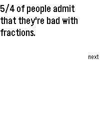</a>

<h2 class="app-name" id="app-47158bcba0984d6ca2628543"><a href="https://apps.repebble.com/47158bcba0984d6ca2628543">Dad Jokes</a></h2>
<a class="app-source" href="https://github.com/JunderscoreB/dad-jokes" title="Source code" data-search-exclude>View source</a>

by <a href="https://apps.repebble.com/apps/dev/j-b_68ecfdbe1c671100088152be" title="More from this developer">J_B</a>

MIT v1.5.1 Updated 2026-09-30

Runs on: Round 2, Time 2, Pebble 2 Duo, Pebble 2, Time Round, Time, Classic

Get ready to roll your eyes and groan. Dad Jokes delivers over 1100 of the finest, most agonizingly punny dad jokes right to your wrist. Built from the ground up for the 2026 Core Devices Pebble…

<a class="app-shot" href="https://apps.repebble.com/562c76d2b56e5d23d8000057" data-search-exclude>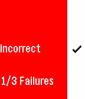</a>

<h2 class="app-name" id="app-562c76d2b56e5d23d8000057"><a href="https://apps.repebble.com/562c76d2b56e5d23d8000057">DailEQs</a></h2>
<a class="app-source" href="https://github.com/SeanmanX/hackingEDU-project" title="Source code" data-search-exclude>View source</a>

by <a href="https://apps.repebble.com/apps/dev/sean-dougher_540663c3edb9187595000006" title="More from this developer">Sean Dougher</a>

No licence v1.0 Updated 2015-10-25

Runs on: Time 2, Pebble 2 Duo, Pebble 2, Time, Classic

DailEQs is a Pebble math game that helps users increase their mental agility. Practice your arithmetic conveniently and on the go with these daily equations. This app was built at HackingEDU 2015…

<h2 class="app-name" id="app-54e8fa6f448dcd40540000a7"><a href="https://apps.repebble.com/54e8fa6f448dcd40540000a7">Daily Quote</a></h2>
<a class="app-source" href="http://github.com/issmirnov/Pebble-DailyQuote.git" title="Source code" data-search-exclude>View source</a>

by <a href="https://apps.repebble.com/apps/dev/ivan-smirnov_54e8efe877c5299b370000a6" title="More from this developer">Ivan Smirnov</a>

No licence v1.0 Updated 2015-02-21

Runs on: Time 2, Pebble 2 Duo, Pebble 2, Time, Classic

A fun app that displays a random quote on your pebble. Press any button to refresh the quote. Quotes from: http://www.iheartquotes.com/

<a class="app-shot" href="https://apps.repebble.com/b229dc1d5c514592b970629b" data-search-exclude>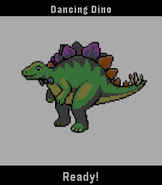</a>

<h2 class="app-name" id="app-b229dc1d5c514592b970629b"><a href="https://apps.repebble.com/b229dc1d5c514592b970629b">Dancing Dino</a></h2>
<a class="app-source" href="https://github.com/davv47/Pebble_Dino_Dance" title="Source code" data-search-exclude>View source</a>

by <a href="https://apps.repebble.com/apps/dev/davv47_1e99e01092773fbbf3fc696c" title="More from this developer">davv47</a>

Not checked yet v1.0 Updated 2026-04-08

Runs on: Round 2, Time 2, Pebble 2 Duo, Pebble 2, Time Round, Time, Classic

Dancing dino app (mostly made for my toddler).

<a class="app-shot" href="https://apps.repebble.com/5821192334da21b8b400001e" data-search-exclude>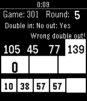</a>

<h2 class="app-name" id="app-5821192334da21b8b400001e"><a href="https://apps.repebble.com/5821192334da21b8b400001e">Darts Score</a></h2>
<a class="app-source" href="https://github.com/vassdoki/pebble-darts-counter" title="Source code" data-search-exclude>View source</a>

by <a href="https://apps.repebble.com/apps/dev/l-szl-vass_5610ec745f75c3435a000071" title="More from this developer">László Vass</a>

Not checked yet v1.2 Updated 2016-11-23

Runs on: Round 2, Time 2, Pebble 2 Duo, Pebble 2, Time Round, Time, Classic

Just play your favorite X01 darts game, and keep the score using your pebble.

<a class="app-shot" href="https://apps.repebble.com/53ec8d840c3036447e000109" data-search-exclude>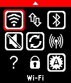</a>

<h2 class="app-name" id="app-53ec8d840c3036447e000109"><a href="https://apps.repebble.com/53ec8d840c3036447e000109">Dashboard</a></h2>
<a class="app-source" href="https://github.com/C-D-Lewis/dashboard" title="Source code" data-search-exclude>View source</a>

by <a href="https://apps.repebble.com/apps/dev/chris-lewis_5299cd30e627ce1147000099" title="More from this developer">Chris Lewis</a>

No licence v4.8 Updated 2016-12-26

Runs on: Round 2, Time 2, Pebble 2 Duo, Pebble 2, Time Round, Time, Classic

2026 Note: Since 2016 Google has steadily removed the ability to call many APIs required by Dashboard in the background, or without Device Admin or even root. So your mileage will vary :( This…

<a class="app-shot" href="https://apps.repebble.com/5741ff45bf2492f9ce000011" data-search-exclude>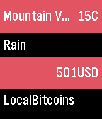</a>

<h2 class="app-name" id="app-5741ff45bf2492f9ce000011"><a href="https://apps.repebble.com/5741ff45bf2492f9ce000011">dashboard</a></h2>
<a class="app-source" href="http://github.com/PHNTXX/dashboard" title="Source code" data-search-exclude>View source</a>

by <a href="https://apps.repebble.com/apps/dev/phntxx_541c14dad813567f3c0003c2" title="More from this developer">phntxx</a>

MIT v1.3 Updated 2016-05-26

Runs on: Round 2, Time 2, Pebble 2 Duo, Pebble 2, Time Round, Time, Classic

my first c app. basically just shows you the weather and bitcoin value at a glance. this version is not really complete yet, so please keep that in mind while using the app. credit goes to…

<a class="app-shot" href="https://apps.repebble.com/077577b50210479da1285f84" data-search-exclude>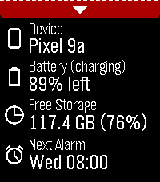</a>

<h2 class="app-name" id="app-077577b50210479da1285f84"><a href="https://apps.repebble.com/077577b50210479da1285f84">Dashboard 2</a></h2>
<a class="app-source" href="https://github.com/C-D-Lewis/pebble-dev/tree/master/watchapps/dashboard2" title="Source code" data-search-exclude>View source</a>

by <a href="https://apps.repebble.com/apps/dev/chris-lewis_5299cd30e627ce1147000099" title="More from this developer">Chris Lewis</a>

No licence v1.0.0 Updated 2026-08-31

Runs on: Round 2, Time 2, Pebble 2 Duo, Pebble 2, Time Round, Time, Classic

**IMPORTANT**: Requires Android companion app which is available from GitHub (https://github.com/C-D-Lewis/pebble-dev/tree/master/watchapps/dashboard2) or compiled from source with Android Studio…

<a class="app-shot" href="https://apps.repebble.com/57755f15ba2fe5a0c10005d9" data-search-exclude>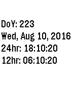</a>

<h2 class="app-name" id="app-57755f15ba2fe5a0c10005d9"><a href="https://apps.repebble.com/57755f15ba2fe5a0c10005d9">Day of Year</a></h2>
<a class="app-source" href="https://github.com/AndroidHell/DayOfYear" title="Source code" data-search-exclude>View source</a>

by <a href="https://apps.repebble.com/apps/dev/android-hell_55e113295895cba1300000c0" title="More from this developer">Android Hell</a>

No licence v1.1 Updated 2016-08-10

Runs on: Round 2, Time 2, Pebble 2 Duo, Pebble 2, Time Round, Time, Classic

**Update: I redid everything so there is a lot less code and the time actually updates now. ** This is a simple watch app used to show you the day of year. It was initially intended to help me…

<a class="app-shot" href="https://apps.repebble.com/52ef24152823060c08000002" data-search-exclude>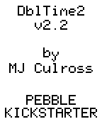</a>

<h2 class="app-name" id="app-52ef24152823060c08000002"><a href="https://apps.repebble.com/52ef24152823060c08000002">DblTime2</a></h2>
<a class="app-source" href="https://www.github.com/mjculross/DblTime2" title="Source code" data-search-exclude>View source</a>

by <a href="https://apps.repebble.com/apps/dev/mjculross_52998a08e627ced73e000037" title="More from this developer">mjculross</a>

Not checked yet v2.2.0 Updated 2014-02-03

Runs on: Time 2, Pebble 2 Duo, Pebble 2, Time, Classic

DblTime2: display two configurable timezones

<a class="app-shot" href="https://apps.rebble.io/en_US/application/57d44296ffca49e6d100019b" data-search-exclude>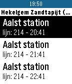</a>

<h2 class="app-name" id="app-57d44296ffca49e6d100019b"><a href="https://apps.rebble.io/en_US/application/57d44296ffca49e6d100019b">De Lijn</a></h2>
<a class="app-source" href="https://github.com/Coollision/PebbleAppDeLijn" title="Source code" data-search-exclude>View source</a>

by <a href="https://apps.rebble.io/en_US/developer/5746fd980b20f032cf000010/1" title="More from this developer">Coollision</a>

No licence v2 Updated 2017-01-19 Rebble App Store

Runs on: Round 2, Time 2, Pebble 2 Duo, Pebble 2, Time Round, Time, Classic

Kijk nu de real time tram of bus uren na van op je pols, geen nood meer om nog je gsm te nemen om te kijken hoe lang het nog duurt voor je bus er is. Een bushalte is makkelijk toe te voegen door…

<a class="app-shot" href="https://apps.rebble.io/en_US/application/54736f68c13ebfe8f5000091" data-search-exclude>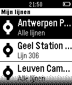</a>

<h2 class="app-name" id="app-54736f68c13ebfe8f5000091"><a href="https://apps.rebble.io/en_US/application/54736f68c13ebfe8f5000091">De Lijn</a></h2>
<a class="app-source" href="https://github.com/DriesOeyen/delijn-pebble" title="Source code" data-search-exclude>View source</a>

by <a href="https://apps.rebble.io/en_US/developer/52bf1b94f31c32267f000094/1" title="More from this developer">Nexworx</a>

No licence v1.6 Updated 2015-09-16 Rebble App Store

Runs on: Time 2, Pebble 2 Duo, Pebble 2, Time, Classic

Check snel real-time doorkomsten van bus of tram aan je favoriete haltes van De Lijn – onmiddellijk op je Pebble. Deze app is onafhankelijk ontwikkeld en wordt niet beheerd of ondersteund door…

<h2 class="app-name" id="app-563eaf4c5fafdbf3df000014"><a href="https://apps.repebble.com/563eaf4c5fafdbf3df000014">DeadFish</a></h2>
<a class="app-source" href="https://github.com/LeFauve/Deadfish-for-Pebble" title="Source code" data-search-exclude>View source</a>

by <a href="https://apps.repebble.com/apps/dev/le-fauve_531fa4eb0f3ef748ea000013" title="More from this developer">Le Fauve</a>

MIT v1.1 Updated 2015-11-08

Runs on: Round 2, Time 2, Pebble 2 Duo, Pebble 2, Time Round, Time, Classic

This is a Deadfish interpreter for Pebble! Deadfish is a very odd interpreted programming language created by Jonathan Todd Skinner. It was released under public domain and was originally…

<a class="app-shot" href="https://apps.repebble.com/f836d297402b44d7baf12e47" data-search-exclude>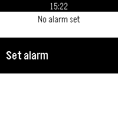</a>

<h2 class="app-name" id="app-f836d297402b44d7baf12e47"><a href="https://apps.repebble.com/f836d297402b44d7baf12e47">Deadliner</a></h2>
<a class="app-source" href="https://github.com/cibyr/deadliner" title="Source code" data-search-exclude>View source</a>

by <a href="https://apps.repebble.com/apps/dev/ian-cullinan_c64ad7a493789f44d3cdef49" title="More from this developer">Ian Cullinan</a>

Not checked yet v1.0.0 Updated 2026-05-28

Runs on: Round 2, Time 2, Pebble 2 Duo, Pebble 2, Time Round, Time, Classic

Zeno&#x27;s paradox for alarms

<a class="app-shot" href="https://apps.repebble.com/439b381033be483a8fc032dd" data-search-exclude>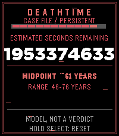</a>

<h2 class="app-name" id="app-439b381033be483a8fc032dd"><a href="https://apps.repebble.com/439b381033be483a8fc032dd">deathtime</a></h2>
<a class="app-source" href="https://github.com/HenryTheAddict/deathtime" title="Source code" data-search-exclude>View source</a>

by <a href="https://apps.repebble.com/apps/dev/h3nry_66430b30a243d294bd0df8c0" title="More from this developer">h3nry</a>

No licence v1.0.0 Updated 2026-06-23

Runs on: Round 2, Time 2, Pebble 2 Duo, Pebble 2, Time Round, Time, Classic

Unlike the pebble, we might not be reborn??? 😟 Uses the same principles as Vsause&#x27;s death clock except instead of 80 dollars, it&#x27;s free. made by a afraid agnostic. (of course its not to be…

<a class="app-shot" href="https://apps.repebble.com/3e7189da80634db7b3989d1a" data-search-exclude>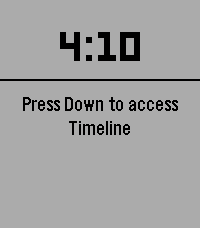</a>

<h2 class="app-name" id="app-3e7189da80634db7b3989d1a"><a href="https://apps.repebble.com/3e7189da80634db7b3989d1a">Debate Timer for Pebble</a></h2>
<a class="app-source" href="https://github.com/thinkhome-org/DebateTimerForPebble" title="Source code" data-search-exclude>View source</a>

by <a href="https://apps.repebble.com/apps/dev/thinkhome-s-r-o_615fa8440cd24e7c608bfb9e" title="More from this developer">ThinkHome s.r.o.</a>

Not checked yet v0.0.1 Updated 2026-08-30

Runs on: Round 2, Time 2, Pebble 2 Duo, Pebble 2, Time Round, Time, Classic

A dedicated timer for British Parliamentary debating. Track speeches, POI periods and speaker order directly from your wrist. Features: 7-minute BP speech timer POI period from 1:00 to 6:00…

<a class="app-shot" href="https://apps.repebble.com/571188b8c96f2e474e000003" data-search-exclude>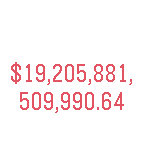</a>

<h2 class="app-name" id="app-571188b8c96f2e474e000003"><a href="https://apps.repebble.com/571188b8c96f2e474e000003">Debt Clock</a></h2>
<a class="app-source" href="https://github.com/nmittu/DebtClock" title="Source code" data-search-exclude>View source</a>

by <a href="https://apps.repebble.com/apps/dev/mittudev_5659e669c1b6ceb64b000081" title="More from this developer">MittuDev</a>

Not checked yet v1.0 Updated 2016-04-16

Runs on: Round 2, Time 2, Pebble 2 Duo, Pebble 2, Time Round, Time, Classic

Live US national debt clock.

<a class="app-shot" href="https://apps.repebble.com/5728f7829e9134971d000002" data-search-exclude>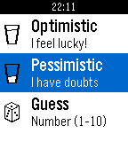</a>

<h2 class="app-name" id="app-5728f7829e9134971d000002"><a href="https://apps.repebble.com/5728f7829e9134971d000002">Decision Maker</a></h2>
<a class="app-source" href="https://github.com/petrolias/Pebble_DecisionMaker" title="Source code" data-search-exclude>View source</a>

by <a href="https://apps.repebble.com/apps/dev/petrolias-christopher_57213711a4a73c413e000006" title="More from this developer">Petrolias Christopher</a>

Not checked yet v1.8 Updated 2016-05-05

Runs on: Round 2, Time 2, Pebble 2 Duo, Pebble 2, Time Round, Time, Classic

The decision making process was never easy. This pebble app is here to help you out! Whether you are optimistic or pessimistic there is always a quote response for you!

<a class="app-shot" href="https://apps.repebble.com/52f16d07e21be486880006c3" data-search-exclude>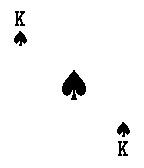</a>

<h2 class="app-name" id="app-52f16d07e21be486880006c3"><a href="https://apps.repebble.com/52f16d07e21be486880006c3">Deck of Cards</a></h2>
<a class="app-source" href="https://github.com/8a22a/DeckofCards" title="Source code" data-search-exclude>View source</a>

by <a href="https://apps.repebble.com/apps/dev/8a22a_529c6b5bf7997434c1000021" title="More from this developer">8a22a</a>

No licence v2.0 Updated 2014-02-04

Runs on: Time 2, Pebble 2 Duo, Pebble 2, Time, Classic

A full deck of cards on your wrist.

<a class="app-shot" href="https://apps.repebble.com/e1bfcb256ae040dc8bb43546" data-search-exclude>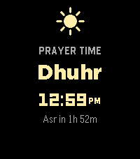</a>

<h2 class="app-name" id="app-e1bfcb256ae040dc8bb43546"><a href="https://apps.repebble.com/e1bfcb256ae040dc8bb43546">Deen: Prayer Times &amp; Qibla</a></h2>
<a class="app-source" href="https://github.com/aliofye/pebble-deen" title="Source code" data-search-exclude>View source</a>

by <a href="https://apps.repebble.com/apps/dev/aliofye_f532e07424ca50f379ea0a0a" title="More from this developer">aliofye</a>

No licence v1.2.0 Updated 2026-09-22

Runs on: Time 2

Deen keeps your five daily prayer times right on your watch, and reminds you when each one arrives. Your prayer times stay accurate on their own — you don&#x27;t need to open the app to keep them…

<a class="app-shot" href="https://apps.repebble.com/52cf84a48fdab54a4b00003d" data-search-exclude>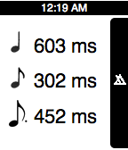</a>

<h2 class="app-name" id="app-52cf84a48fdab54a4b00003d"><a href="https://apps.repebble.com/52cf84a48fdab54a4b00003d">Delay Calculator</a></h2>
<a class="app-source" href="https://github.com/evanstoddard/delay_calculator_pebble" title="Source code" data-search-exclude>View source</a>

by <a href="https://apps.repebble.com/apps/dev/evan-stoddard_52cf7db34680affd54000034" title="More from this developer">Evan Stoddard</a>

Not checked yet v1.0 Updated 2014-01-10

Runs on: Time 2, Pebble 2 Duo, Pebble 2, Time, Classic

This app is for musicians, sound engineers, or anyone else that works with music. This app allows you to quickly calculate delay times based on the beat that you click in with the middle button…

<a class="app-shot" href="https://apps.repebble.com/5704637a0239f18ed9000013" data-search-exclude>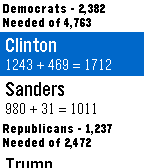</a>

<h2 class="app-name" id="app-5704637a0239f18ed9000013"><a href="https://apps.repebble.com/5704637a0239f18ed9000013">Delegate Tracker</a></h2>
<a class="app-source" href="https://github.com/nmittu/2016-Delegate-Tracker" title="Source code" data-search-exclude>View source</a>

by <a href="https://apps.repebble.com/apps/dev/mittudev_5659e669c1b6ceb64b000081" title="More from this developer">MittuDev</a>

Not checked yet v1.0 Updated 2016-04-06

Runs on: Round 2, Time 2, Pebble 2 Duo, Pebble 2, Time Round, Time, Classic

Tracks the delegate count of the 2016 presidential candidates.

<a class="app-shot" href="https://apps.repebble.com/52b2b797cd41833d960000cb" data-search-exclude>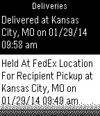</a>

<h2 class="app-name" id="app-52b2b797cd41833d960000cb"><a href="https://apps.repebble.com/52b2b797cd41833d960000cb">Deliveries</a></h2>
<a class="app-source" href="https://github.com/Neal/pebble-deliveries" title="Source code" data-search-exclude>View source</a>

by <a href="https://apps.repebble.com/apps/dev/neal-patel_528feeab8a8c0b97c8000005" title="More from this developer">Neal Patel</a>

MIT v2.1 Updated 2014-11-02

Runs on: Time 2, Pebble 2 Duo, Pebble 2, Time, Classic

An on-demand universal package tracker. Supports several carriers across the world including UPS, FedEx, DHL, USPS, TNT, Canada Post, China Post, Hongkong Post, Japan Post, Australia Post, Royal…

<a class="app-shot" href="https://apps.repebble.com/c2c541a7bc004712894f8d46" data-search-exclude>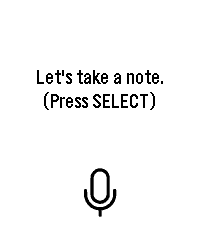</a>

<h2 class="app-name" id="app-c2c541a7bc004712894f8d46"><a href="https://apps.repebble.com/c2c541a7bc004712894f8d46">Delta Notes</a></h2>
<a class="app-source" href="https://github.com/Delta-43/pebble-watch-obsidian-notes" title="Source code" data-search-exclude>View source</a>

by <a href="https://apps.repebble.com/apps/dev/delta-43_e215a5ae13b465e6441eafe6" title="More from this developer">Delta-43</a>

AGPL-3.0 v1.0.0 Updated 2026-09-10

Runs on: Round 2, Time 2, Pebble 2 Duo, Pebble 2, Time Round, Time

Dictate a note on your wrist and have it saved straight into your own self-hosted Obsidian vault. Requires your own n8n instance — not a standalone note-taking app. Delta Notes turns your Pebble…

<a class="app-shot" href="https://apps.repebble.com/52e94daddcc23ca56000006d" data-search-exclude>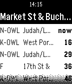</a>

<h2 class="app-name" id="app-52e94daddcc23ca56000006d"><a href="https://apps.repebble.com/52e94daddcc23ca56000006d">Departure Monitor</a></h2>
<a class="app-source" href="https://bitbucket.org/abauer/pebble-departure" title="Source code" data-search-exclude>View source</a>

by <a href="https://apps.repebble.com/apps/dev/andreas-bauer_52badafbaac0624125000087" title="More from this developer">Andreas Bauer</a>

See source v1.2 Updated 2016-01-12

Runs on: Time 2, Pebble 2 Duo, Pebble 2, Time, Classic

The app shows the departure time of buses, trams and trains at nearby stations. Many public transportation networks around the world are supported, for example: San Francisco, London, many in…

<h2 class="app-name" id="app-55f9eace416b6885e6000010"><a href="https://apps.repebble.com/55f9eace416b6885e6000010">Deploy AGR</a></h2>
<a class="app-source" href="https://instagram.com/russian_otter/" title="Source code" data-search-exclude>View source</a>

by <a href="https://apps.repebble.com/apps/dev/russian-otter_549c0abd0544722d37000293" title="More from this developer">Russian Otter</a>

Not checked yet v1.0 Updated 2015-09-16

Runs on: Time 2, Pebble 2 Duo, Pebble 2, Time, Classic

Call in your own agr from your pebble smart watch! This app gives the cool effect that you summoned an agr :D. COD Call of duty black ops

<a class="app-shot" href="https://apps.repebble.com/55002392bab0598ad60000b9" data-search-exclude>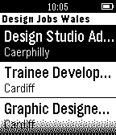</a>

<h2 class="app-name" id="app-55002392bab0598ad60000b9"><a href="https://apps.repebble.com/55002392bab0598ad60000b9">Design Jobs Wales</a></h2>
<a class="app-source" href="https://github.com/stevehalford/DJWPebble" title="Source code" data-search-exclude>View source</a>

by <a href="https://apps.repebble.com/apps/dev/steve-halford_5369045f36b875f4640001a9" title="More from this developer">Steve Halford</a>

Not checked yet v1.0 Updated 2015-03-11

Runs on: Time 2, Pebble 2 Duo, Pebble 2, Time, Classic

Displays the latest jobs from Design Jobs Wales

<a class="app-shot" href="https://apps.repebble.com/53a3df8b694928250f00015e" data-search-exclude>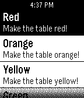</a>

<h2 class="app-name" id="app-53a3df8b694928250f00015e"><a href="https://apps.repebble.com/53a3df8b694928250f00015e">DeskLights128</a></h2>
<a class="app-source" href="https://github.com/obja/Desklights128" title="Source code" data-search-exclude>View source</a>

by <a href="https://apps.repebble.com/apps/dev/alec-harley_531aa3b0af83c14a12000200" title="More from this developer">Alec Harley</a>

Not checked yet v1.1 Updated 2014-07-06

Runs on: Time 2, Pebble 2 Duo, Pebble 2, Time, Classic

Controls a DeskLights 2.0 table with custom commands.

<a class="app-shot" href="https://apps.repebble.com/556bbaf730850a5fab000089" data-search-exclude>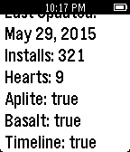</a>

<h2 class="app-name" id="app-556bbaf730850a5fab000089"><a href="https://apps.repebble.com/556bbaf730850a5fab000089">Devboard</a></h2>
<a class="app-source" href="https://github.com/fletchto99/pebble-devboard" title="Source code" data-search-exclude>View source</a>

by <a href="https://apps.repebble.com/apps/dev/matt-langlois_52e30dd32645fb8bae000fcd" title="More from this developer">Matt Langlois</a>

Not checked yet v1.10 Updated 2016-02-16

Runs on: Round 2, Time 2, Pebble 2 Duo, Pebble 2, Time Round, Time, Classic

Enables the ability for pebble developers to view the status of their projects directly from their Pebble!

<a class="app-shot" href="https://apps.repebble.com/547bbb34d9b3a90e1100009c" data-search-exclude>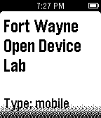</a>

<h2 class="app-name" id="app-547bbb34d9b3a90e1100009c"><a href="https://apps.repebble.com/547bbb34d9b3a90e1100009c">Device Lab Locator</a></h2>
<a class="app-source" href="https://github.com/brianrowe/Pebble-ODL" title="Source code" data-search-exclude>View source</a>

by <a href="https://apps.repebble.com/apps/dev/brian-rowe_52f00b94f26d97931a000051" title="More from this developer">Brian Rowe</a>

No licence v1.0 Updated 2014-12-01

Runs on: Time 2, Pebble 2 Duo, Pebble 2, Time, Classic

Looking for an Open Device Lab to test your web site or mobile app. Now you can easily locate the closest Open Device Lab with your Pebble Watch!

<h2 class="app-name" id="app-5506e53bed40850ea3000015"><a href="https://apps.repebble.com/5506e53bed40850ea3000015">Device status</a></h2>
<a class="app-source" href="https://bitbucket.org/tmnhy/pebble-device-status/src" title="Source code" data-search-exclude>View source</a>

by <a href="https://apps.repebble.com/apps/dev/tmnhy_54647acdd238c5d89300001e" title="More from this developer">tmnhy</a>

See source v1.5 Updated 2015-03-29

Runs on: Time 2, Pebble 2 Duo, Pebble 2, Time, Classic

Show 5 sec. pop-up notifications, phone connection and battery state: - battery icon, by wrist; - phone connection icon, by change state. Runs in the background and do not depend on others running…

<a class="app-shot" href="https://apps.repebble.com/5475839405bfc8de88000027" data-search-exclude>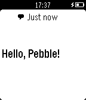</a>

<h2 class="app-name" id="app-5475839405bfc8de88000027"><a href="https://apps.repebble.com/5475839405bfc8de88000027">Device WebAPI App</a></h2>
<a class="app-source" href="https://github.com/DeviceConnect" title="Source code" data-search-exclude>View source</a>

by <a href="https://apps.repebble.com/apps/dev/gclue-inc_5475831d73fafe48db00002f" title="More from this developer">GClue, Inc.</a>

See source v1.3 Updated 2017-12-07

Runs on: Time 2, Pebble 2 Duo, Pebble 2, Time, Classic

This app is need to communicate between Pebble and the web app running on DeviceWebAPIBrowser or DeviceWebAPI Manager. The web app requests &quot;Device WebAPI App&quot; to: - Provide Pebble&#x27;s battery…

<a class="app-shot" href="https://apps.repebble.com/532323bf60c773c1420000a8" data-search-exclude>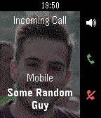</a>

<h2 class="app-name" id="app-532323bf60c773c1420000a8"><a href="https://apps.repebble.com/532323bf60c773c1420000a8">Dialer for Pebble</a></h2>
<a class="app-source" href="https://github.com/matejdro/PebbleDialer-Watchapp" title="Source code" data-search-exclude>View source</a>

by <a href="https://apps.repebble.com/apps/dev/matejdro_52b1ea273beaa0cecb00001f" title="More from this developer">matejdro</a>

Not checked yet v3.3 Updated 2016-11-25

Runs on: Round 2, Time 2, Pebble 2 Duo, Pebble 2, Time Round, Time, Classic

Answer, decline, mute, make calls from your Pebble.

<a class="app-shot" href="https://apps.repebble.com/52b301a2cd4183347d0000eb" data-search-exclude>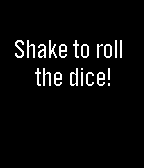</a>

<h2 class="app-name" id="app-52b301a2cd4183347d0000eb"><a href="https://apps.repebble.com/52b301a2cd4183347d0000eb">Dice</a></h2>
<a class="app-source" href="https://github.com/vvzvlad/Pebble-Dice" title="Source code" data-search-exclude>View source</a>

by <a href="https://apps.repebble.com/apps/dev/vvzvlad_52a92f2cc0ca93629100000d" title="More from this developer">vvzvlad</a>

Not checked yet v1.1 Updated 2014-12-30

Runs on: Time 2, Pebble 2 Duo, Pebble 2, Time, Classic

Dice your watch. Shake the clock to roll a die!

<a class="app-shot" href="https://apps.repebble.com/5791726850c752e32e0000e1" data-search-exclude>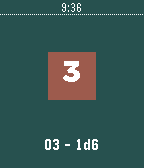</a>

<h2 class="app-name" id="app-5791726850c752e32e0000e1"><a href="https://apps.repebble.com/5791726850c752e32e0000e1">Dice Roller</a></h2>
<a class="app-source" href="https://github.com/hdyar/pebbleDiceRoller/" title="Source code" data-search-exclude>View source</a>

by <a href="https://apps.repebble.com/apps/dev/blooper_57647c273feaeea10e000008" title="More from this developer">Blooper!</a>

Not checked yet v1.0 Updated 2016-07-24

Runs on: Round 2, Time 2, Pebble 2 Duo, Pebble 2, Time Round, Time, Classic

A simple dice rolling app. Use the top button to cycle through the number of sides on the dice - 2, 3, 4, 6, 8, 10, or 20. Use the bottom button to cycle through the number of dice. 1 - 6. The…

<a class="app-shot" href="https://apps.repebble.com/70e12ae720f54b7a8666cfc8" data-search-exclude>No screenshot</a>

<h2 class="app-name" id="app-70e12ae720f54b7a8666cfc8"><a href="https://apps.repebble.com/70e12ae720f54b7a8666cfc8">Dice Roller</a></h2>
<a class="app-source" href="https://github.com/theLittleBigZ/Pebble-dice-roller" title="Source code" data-search-exclude>View source</a>

by <a href="https://apps.repebble.com/apps/dev/the403-devs_16d54e4350ecc42aa9befc8a" title="More from this developer">the403 Devs</a>

Not checked yet v1.3 Updated 2026-06-30

Runs on: Round 2, Time 2, Pebble 2 Duo, Pebble 2, Time Round, Time, Classic

An app that lets you cycle through then roll a d2, d3, d4, d6, d8, d10, d12, d20, d100. can be used as a companion to DnD or if you just need to roll a dice

<a class="app-shot" href="https://apps.repebble.com/ba09dc7f85b14dbc8319d9af" data-search-exclude>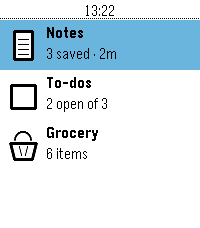</a>

<h2 class="app-name" id="app-ba09dc7f85b14dbc8319d9af"><a href="https://apps.repebble.com/ba09dc7f85b14dbc8319d9af">Dictate</a></h2>
<a class="app-source" href="https://github.com/lordkeynes/Dictate_pebble" title="Source code" data-search-exclude>View source</a>

by <a href="https://apps.repebble.com/apps/dev/keynes_b9f6a0b2865903bff0747a2b" title="More from this developer">Keynes</a>

Not checked yet v1.1.1 Updated 2026-09-21

Runs on: Round 2, Time 2, Pebble 2 Duo, Pebble 2, Time Round, Time

Note taking app built in the theme of the Pebble OS Stock weather app. Ability to store Note, To Do List, and a built in Grocery list.

<a class="app-shot" href="https://apps.repebble.com/553ae4434af0b80a1200001d" data-search-exclude>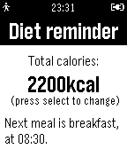</a>

<h2 class="app-name" id="app-553ae4434af0b80a1200001d"><a href="https://apps.repebble.com/553ae4434af0b80a1200001d">Diet reminder</a></h2>
<a class="app-source" href="https://github.com/bodnaristvan/pebble-diet-reminder.c" title="Source code" data-search-exclude>View source</a>

by <a href="https://apps.repebble.com/apps/dev/bodn-r-istv-n_5529be3fdb701883320000a7" title="More from this developer">Bodnár István</a>

No licence v2.1 Updated 2016-05-11

Runs on: Time 2, Pebble 2 Duo, Pebble 2, Time, Classic

App reminds you to eat healthily, five times a day

<a class="app-shot" href="https://apps.repebble.com/54c7dffb73f0aa3fb600003d" data-search-exclude>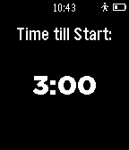</a>

<h2 class="app-name" id="app-54c7dffb73f0aa3fb600003d"><a href="https://apps.repebble.com/54c7dffb73f0aa3fb600003d">DighyTimer</a></h2>
<a class="app-source" href="http://www.github.com/TWalker-Coding/DighyTimer/tree/master" title="Source code" data-search-exclude>View source</a>

by <a href="https://apps.repebble.com/apps/dev/t-walker-coding_54c7d4d433a24bf9cc00005d" title="More from this developer">T-Walker Coding</a>

MIT v2.0 Updated 2015-01-27

Runs on: Time 2, Pebble 2 Duo, Pebble 2, Time, Classic

A simple sailing timer build by a high school sailor. It counts down from three minutes and buzzes at the ISSA highschool wistles. I am in no way an expert coder and there is most likey many bugs…

<a class="app-shot" href="https://apps.repebble.com/52c9cc186e3cc21c54000012" data-search-exclude>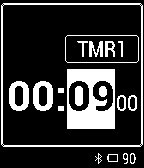</a>

<h2 class="app-name" id="app-52c9cc186e3cc21c54000012"><a href="https://apps.repebble.com/52c9cc186e3cc21c54000012">DigiChron</a></h2>
<a class="app-source" href="https://github.com/bobhwasatch/digichron" title="Source code" data-search-exclude>View source</a>

by <a href="https://apps.repebble.com/apps/dev/bob-hauck_529e79aa1a6638031c000015" title="More from this developer">Bob Hauck</a>

No licence v1.1.1 Updated 2014-02-21

Runs on: Time 2, Pebble 2 Duo, Pebble 2, Time, Classic

DigiChron is a Pebble app that is intended to operate similarly to a digital watch. It has a main watch face, two countdown timers, and a stopwatch with split and lap times. The source code link…

<a class="app-shot" href="https://apps.repebble.com/5b595252b47f4f28ae51c39d" data-search-exclude>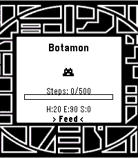</a>

<h2 class="app-name" id="app-5b595252b47f4f28ae51c39d"><a href="https://apps.repebble.com/5b595252b47f4f28ae51c39d">Digivice - Alpha build</a></h2>
<a class="app-source" href="https://github.com/vinay1017/Pebble-Digivice" title="Source code" data-search-exclude>View source</a>

by <a href="https://apps.repebble.com/apps/dev/vinayla_cf9b8101421543277d0bbc02" title="More from this developer">Vinayla</a>

Not checked yet v0.3 Updated 2026-09-24

Runs on: Round 2, Time 2

A very early, alpha build of a reworked digivice. I wished this existed for the pebble, so I made one for myself. It is NOT anywhere near completion and it&#x27;s all MY original code. Took some…

<a class="app-shot" href="https://apps.rebble.io/en_US/application/576ee8e6ba2fe5a0c10000b9" data-search-exclude>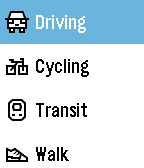</a>

<h2 class="app-name" id="app-576ee8e6ba2fe5a0c10000b9"><a href="https://apps.rebble.io/en_US/application/576ee8e6ba2fe5a0c10000b9">Directions</a></h2>
<a class="app-source" href="https://github.com/Kuchenm0nster/pebble-directions" title="Source code" data-search-exclude>View source</a>

by <a href="https://apps.rebble.io/en_US/developer/55740576f5c314a5f0000010/1" title="More from this developer">Dyedgreen</a>

No licence v1.9 Updated 2020-04-19 Rebble App Store

Runs on: Round 2, Time 2, Time Round, Time

Directions is a fast and simple navigation app. Select how you want to travel, speak your destination, and get a list of instructions that guide you there. Directions for cars, bicycles, public…

<h2 class="app-name" id="app-59616c500dfc32af6100131c"><a href="https://apps.rebble.io/en_US/application/59616c500dfc32af6100131c">Discord</a></h2>
<a class="app-source" href="https://github.com/Cellomonster/Discord-for-Pebble" title="Source code" data-search-exclude>View source</a>

by <a href="https://apps.rebble.io/en_US/developer/56db39b3d86927b35f00002c/1" title="More from this developer">Trevir</a>

MIT v8.0 Updated 2017-09-13 Rebble App Store

Runs on: Round 2, Time 2, Time Round, Time

Discord for Pebble is an unofficial Discord client for your Pebble smartwatch. The client can send messages through your account on Discord servers that you are a member of through voice. If you…

<a class="app-shot" href="https://apps.rebble.io/en_US/application/67cccea5b7a023024b214604" data-search-exclude>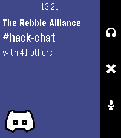</a>

<h2 class="app-name" id="app-67cccea5b7a023024b214604"><a href="https://apps.rebble.io/en_US/application/67cccea5b7a023024b214604">Discord Companion</a></h2>
<a class="app-source" href="https://github.com/jplexer/discord-companion" title="Source code" data-search-exclude>View source</a>

by <a href="https://apps.rebble.io/en_US/developer/66d9e31d281f8a000981862f/1" title="More from this developer">JPlexer</a>

Not checked yet v2.0 Updated 2025-03-28 Rebble App Store

Runs on: Round 2, Time 2, Pebble 2 Duo, Pebble 2, Time Round, Time, Classic

Requires https://github.com/jplexer/discord-companion running. This is basically a remote for your discord call! Mute, Deafen, whatever! Icons and Design by Lavender

<h2 class="app-name" id="app-5386a0646189a1be8200007a"><a href="https://apps.repebble.com/5386a0646189a1be8200007a">Dislock</a></h2>
<a class="app-source" href="https://github.com/lkorth/pebble-locker" title="Source code" data-search-exclude>View source</a>

by <a href="https://apps.repebble.com/apps/dev/luke-korth_52c585721e1161ad65000042" title="More from this developer">Luke Korth</a>

Not checked yet v1.0.0 Updated 2014-05-29

Runs on: Time 2, Pebble 2 Duo, Pebble 2, Time, Classic

Control the lock screen of your device right from your Pebble. Set your phone or tablet&#x27;s lock screen to locked, unlocked or automatic. When set to automatic, Dislock will control the lock screen…

<a class="app-shot" href="https://apps.repebble.com/5939fe5d0dfc32af610003df" data-search-exclude>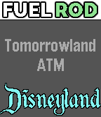</a>

<h2 class="app-name" id="app-5939fe5d0dfc32af610003df"><a href="https://apps.repebble.com/5939fe5d0dfc32af610003df">Disney Parks Fuel Rod Locator</a></h2>
<a class="app-source" href="https://github.com/thomasstoeckert/fuelRodLocator" title="Source code" data-search-exclude>View source</a>

by <a href="https://apps.repebble.com/apps/dev/thomas-stoeckert_55e827430a081ae5f9000009" title="More from this developer">Thomas Stoeckert</a>

Not checked yet v2.0 Updated 2017-06-30

Runs on: Round 2, Time 2, Pebble 2 Duo, Pebble 2, Time Round, Time, Classic

This app lets you find Fuel Rod rechargeable battery swap kiosks at any Disney park in North America. Pressing select will toggle between Walt Disney World locations and Disneyland locations…

<a class="app-shot" href="https://apps.repebble.com/55b75efd3d39bb179a00003d" data-search-exclude>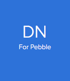</a>

<h2 class="app-name" id="app-55b75efd3d39bb179a00003d"><a href="https://apps.repebble.com/55b75efd3d39bb179a00003d">DN for Pebble</a></h2>
<a class="app-source" href="https://github.com/ireade/dn-for-pebble" title="Source code" data-search-exclude>View source</a>

by <a href="https://apps.repebble.com/apps/dev/ire_55b4a9558fde01307d00002e" title="More from this developer">Ire</a>

Not checked yet v2 Updated 2015-08-21

Runs on: Time 2, Pebble 2 Duo, Pebble 2, Time, Classic

The (unofficial) Designer News App for Pebble. Choose between Top Stories, Recent Stories, and Discussions. View the key information from each story.

<a class="app-shot" href="https://apps.rebble.io/en_US/application/60803e261342ae0104101db3" data-search-exclude>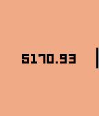</a>

<h2 class="app-name" id="app-60803e261342ae0104101db3"><a href="https://apps.rebble.io/en_US/application/60803e261342ae0104101db3">doge-balance</a></h2>
<a class="app-source" href="https://github.com/zhcong/doge-balance" title="Source code" data-search-exclude>View source</a>

by <a href="https://apps.rebble.io/en_US/developer/607dad8b1342ae005a8a9b2a/1" title="More from this developer">fork from David Gianforte</a>

Not checked yet v1.0 Updated 2021-04-21 Rebble App Store

Runs on: Time 2, Time

doge-balance is a app that show your dogecoin amount, it can also show in local currency.

<a class="app-shot" href="https://apps.repebble.com/53cd0f6765c7dc83c90000d7" data-search-exclude>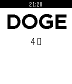</a>

<h2 class="app-name" id="app-53cd0f6765c7dc83c90000d7"><a href="https://apps.repebble.com/53cd0f6765c7dc83c90000d7">DogeRain ALPHA</a></h2>
<a class="app-source" href="https://github.com/sodoku/pebble-dogerain" title="Source code" data-search-exclude>View source</a>

by <a href="https://apps.repebble.com/apps/dev/philip-stewart_532636404735a9dd410000a1" title="More from this developer">Philip Stewart</a>

Not checked yet v1.0.2 Updated 2014-07-25

Runs on: Time 2, Pebble 2 Duo, Pebble 2, Time, Classic

EARLY ALPHA. This may crash, make your watch explode and kill all your shibes. Press the button to create a dogecoin rain. Others nearby having the app open can collect. #makeitrain Tweet @sodoku…

<a class="app-shot" href="https://apps.repebble.com/52d85f750bab47f03700001b" data-search-exclude>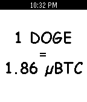</a>

<h2 class="app-name" id="app-52d85f750bab47f03700001b"><a href="https://apps.repebble.com/52d85f750bab47f03700001b">DogeWatch</a></h2>
<a class="app-source" href="http://github.com/RyanMorash/DogeWatch" title="Source code" data-search-exclude>View source</a>

by <a href="https://apps.repebble.com/apps/dev/ryan-morash_52cb3d8c45ffdd5ef200008c" title="More from this developer">Ryan Morash</a>

No licence v1.6 Updated 2014-01-19

Runs on: Time 2, Pebble 2 Duo, Pebble 2, Time, Classic

Get the most up to date price of a DogeCoin, the worlds most friendly crypto-currency. Prices are displayed in microBitCoins for worldwide use.

<a class="app-shot" href="https://apps.repebble.com/5681f92a94ffb20cb4000072" data-search-exclude>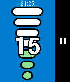</a>

<h2 class="app-name" id="app-5681f92a94ffb20cb4000072"><a href="https://apps.repebble.com/5681f92a94ffb20cb4000072">Dolce Gusto Time</a></h2>
<a class="app-source" href="https://github.com/lordlouis/dolcegustotime" title="Source code" data-search-exclude>View source</a>

by <a href="https://apps.repebble.com/apps/dev/lordlouis_5633e55cd2dcf1dd22000007" title="More from this developer">lordlouis</a>

Not checked yet v1.0 Updated 2015-12-29

Runs on: Round 2, Time 2, Pebble 2 Duo, Pebble 2, Time Round, Time, Classic

The Dolce Gusto Time application helps in the preparation of Dolce Gusto beverages in non-automatic coffee machines preparing the beverage using the level indicated in the capsule. Select the…

<a class="app-shot" href="https://apps.repebble.com/53efb1efbb2f684ce7000169" data-search-exclude>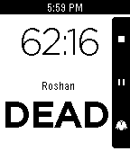</a>

<h2 class="app-name" id="app-53efb1efbb2f684ce7000169"><a href="https://apps.repebble.com/53efb1efbb2f684ce7000169">Dota2Timer</a></h2>
<a class="app-source" href="https://github.com/nicolassatragno/dota2timer" title="Source code" data-search-exclude>View source</a>

by <a href="https://apps.repebble.com/apps/dev/satragno-software_53a73e0a574522633400001a" title="More from this developer">Satragno Software</a>

Not checked yet v1.0 Updated 2014-08-23

Runs on: Time 2, Pebble 2 Duo, Pebble 2, Time, Classic

A timer app for DOTA2. Features: Roshan status - Press a button when Rosh is killed, and you&#x27;ll get a display of its status (dead or alive) or the chances of it having respawned. Optional…

<a class="app-shot" href="https://apps.repebble.com/6aa22e17c73fab0009866dfc" data-search-exclude>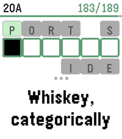</a>

<h2 class="app-name" id="app-6aa22e17c73fab0009866dfc"><a href="https://apps.repebble.com/6aa22e17c73fab0009866dfc">DownTime: Voice Crosswords</a></h2>
<a class="app-source" href="https://github.com/hornofabraxas/pebble-crossword" title="Source code" data-search-exclude>View source</a>

by <a href="https://apps.repebble.com/apps/dev/omgslaykween_6a8876179a73d00009ee3f1a" title="More from this developer">OmgSlayKween</a>

Not checked yet v1.1 Updated 2026-09-10

Runs on: Time 2

DownTime is an offline collection of 200 new crossword puzzles (9,000+ clues), supporting dictation for speech-to-text, or bespoke on-watch typing. It uses a custom crossword engine which displays…

<a class="app-shot" href="https://apps.repebble.com/567468a0a81715e9a0000048" data-search-exclude>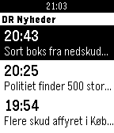</a>

<h2 class="app-name" id="app-567468a0a81715e9a0000048"><a href="https://apps.repebble.com/567468a0a81715e9a0000048">DR Nyheder</a></h2>
<a class="app-source" href="https://github.com/thomasrosted/PebbleDRNyheder" title="Source code" data-search-exclude>View source</a>

by <a href="https://apps.repebble.com/apps/dev/thomas-piil-rosted_5650248844a2b654d0000038" title="More from this developer">Thomas Piil Rosted</a>

Not checked yet v1.1 Updated 2015-12-21

Runs on: Time 2, Pebble 2 Duo, Pebble 2, Time, Classic

Latest news from DR Nyheder in danish.

<a class="app-shot" href="https://apps.repebble.com/54033c6886b01c8c15000138" data-search-exclude>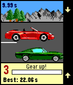</a>

<h2 class="app-name" id="app-54033c6886b01c8c15000138"><a href="https://apps.repebble.com/54033c6886b01c8c15000138">Drag Racing</a></h2>
<a class="app-source" href="https://github.com/JohnyGQD/drag-racing-pebble" title="Source code" data-search-exclude>View source</a>

by <a href="https://apps.repebble.com/apps/dev/jan-gruncl_52ea53e10cc6248ed300004b" title="More from this developer">Jan Gruncl</a>

No licence v1.11.0 Updated 2026-07-13

Runs on: Round 2, Time 2, Pebble 2 Duo, Pebble 2, Time Round, Time, Classic

XDA-Pebble Contest Winner It&#x27;s not easy to create a good game for Pebble that&#x27;s actually easy to control. Just a very few made this right. But there is a popular game genre that ought to be…

<a class="app-shot" href="https://apps.repebble.com/e7b34d918dc643d1b3d0db37" data-search-exclude>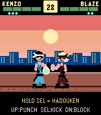</a>

<h2 class="app-name" id="app-e7b34d918dc643d1b3d0db37"><a href="https://apps.repebble.com/e7b34d918dc643d1b3d0db37">Dragon Fist</a></h2>
<a class="app-source" href="https://github.com/coredevices/pebble-watchface-agent-skill" title="Source code" data-search-exclude>View source</a>

by <a href="https://apps.repebble.com/apps/dev/aircodum_67bc77bf37d408000a74f7d3" title="More from this developer">AirCodum</a>

Not checked yet v1.0.0 Updated 2026-04-15

Runs on: Time 2

Arcade fighter for Pebble Time 2. KENZO vs BLAZE in endless mode — punch, kick, block, and unleash 3 Dragon Blaze chi blasts per round. Survive as many rounds as you can. Share with #pebbledragonfist

<h2 class="app-name" id="app-54ade8cfbd2d5ce85e000014"><a href="https://apps.repebble.com/54ade8cfbd2d5ce85e000014">Draw - Sketch on your Wrist!</a></h2>
<a class="app-source" href="https://github.com/SeaPea/Draw" title="Source code" data-search-exclude>View source</a>

by <a href="https://apps.repebble.com/apps/dev/seapea-software_52f00ed07a772ced5d0000db" title="More from this developer">SeaPea Software</a>

GPL-2.0 v0.5 Updated 2015-03-01

Runs on: Time 2, Pebble 2 Duo, Pebble 2, Time, Classic

Draw just by tilting your wrist! Note: Currently not compatible with Pebble Times. Working on fixing this and adding color. Send the drawing to your phone without sending anything to a server or…

<a class="app-shot" href="https://apps.repebble.com/68f274532342a000096820e8" data-search-exclude>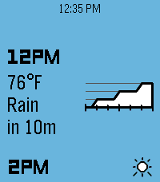</a>

<h2 class="app-name" id="app-68f274532342a000096820e8"><a href="https://apps.repebble.com/68f274532342a000096820e8">Dribble</a></h2>
<a class="app-source" href="https://github.com/erlog135/dribble" title="Source code" data-search-exclude>View source</a>

by <a href="https://apps.repebble.com/apps/dev/logan-head_5c26a4f727cdec0001c0500d" title="More from this developer">Logan Head</a>

Not checked yet v1.1.1 Updated 2026-07-26

Runs on: Round 2, Time 2, Pebble 2 Duo, Pebble 2, Time Round, Time, Classic

A precipitation &amp; hyperlocal weather app for Pebble. Location access is required for the app to work. When data is loaded, press the up or down buttons to scroll backwards or forwards through the…

<h2 class="app-name" id="app-554b93a25fa04f7f3f000058"><a href="https://apps.repebble.com/554b93a25fa04f7f3f000058">Drink Counter</a></h2>
<a class="app-source" href="https://github.com/reini1305/drinkcounter" title="Source code" data-search-exclude>View source</a>

by <a href="https://apps.repebble.com/apps/dev/christian-reinbacher_52d29655c44c044e9f00004f" title="More from this developer">Christian Reinbacher</a>

Not checked yet v7.1-rbl1 Updated 2019-07-24

Runs on: Round 2, Time 2, Pebble 2 Duo, Pebble 2, Time Round, Time, Classic

Drink Counter allows you to keep track of your alcohol, water and cigarette consumption. It even estimates the blood alcohol level based on your gender, weight and number of drinks. Remember…

<h2 class="app-name" id="app-553ea4d8602d4220260000d7"><a href="https://apps.repebble.com/553ea4d8602d4220260000d7">Drink!</a></h2>
<a class="app-source" href="https://github.com/astifter/Drink" title="Source code" data-search-exclude>View source</a>

by <a href="https://apps.repebble.com/apps/dev/andreas-neustifter_5304d9e3fe93ed25bf000249" title="More from this developer">Andreas Neustifter</a>

No licence v1.1 Updated 2015-06-15

Runs on: Time 2, Pebble 2 Duo, Pebble 2, Time, Classic

NEW: The optional companion app can fetch logged data from the watch to your Android smartphone! Stay hydrated! Reminds you to drink during the day, includes reminders, vibration, snoozing and…

<h2 class="app-name" id="app-e5b37daa64c24c5cbe11dd05"><a href="https://apps.repebble.com/e5b37daa64c24c5cbe11dd05">Drinktervall</a></h2>
<a class="app-source" href="https://github.com/dysseus-pascal/Drinktervall" title="Source code" data-search-exclude>View source</a>

by <a href="https://apps.repebble.com/apps/dev/dysseus_d55366949234e464067ed224" title="More from this developer">dysseus</a>

Not checked yet v1.19.0 Updated 2026-10-03

Runs on: Round 2, Time 2, Pebble 2 Duo

Drinking reminder app with Timeline integration and a cute animation. Stay Hydrated my friends!

<h2 class="app-name" id="app-54b2708e6357ce9213000061"><a href="https://apps.repebble.com/54b2708e6357ce9213000061">Driver Timer</a></h2>
<a class="app-source" href="https://github.com/sephallen/DriverTimer" title="Source code" data-search-exclude>View source</a>

by <a href="https://apps.repebble.com/apps/dev/joseph-allen_538f00231978653f27000045" title="More from this developer">Joseph Allen</a>

Not checked yet v1.2 Updated 2015-02-22

Runs on: Time 2, Pebble 2 Duo, Pebble 2, Time, Classic

Driver Timer keeps track of your HGV driving hours for UK truck/lorry drivers. It should also be compatible with other countries that adhere to the EU Driving Laws. As of version 1.1, the…

<h2 class="app-name" id="app-569e359791e256161800002f"><a href="https://apps.repebble.com/569e359791e256161800002f">DroidPlanner2 for 3DR IRIS+</a></h2>
<a class="app-source" href="https://github.com/ladrower/DroidPlanner-2-Pebble-forked" title="Source code" data-search-exclude>View source</a>

by <a href="https://apps.repebble.com/apps/dev/artem_550ad07084ad0239d700012d" title="More from this developer">Artem</a>

Not checked yet v1.1 Updated 2016-01-19

Runs on: Round 2, Time 2, Pebble 2 Duo, Pebble 2, Time Round, Time, Classic

Original DroidPlanner 2 pebble app

<h2 class="app-name" id="app-54d039280782b8e64200005f"><a href="https://apps.repebble.com/54d039280782b8e64200005f">Drug Wars</a></h2>
<a class="app-source" href="https://github.com/aclymer/DrugWars" title="Source code" data-search-exclude>View source</a>

by <a href="https://apps.repebble.com/apps/dev/aclymer_52a0cb5f2a0bb9c84700002c" title="More from this developer">AClymer</a>

No licence v3.5 Updated 2026-05-19

Runs on: Time 2, Pebble 2 Duo, Pebble 2, Time, Classic

The Classic Drug Wars game is now available for Pebble. Originally written for IBM by John E. Dell 1984. (Adapted from TI-84 game code)

<h2 class="app-name" id="app-536e3c760937dee0df0000c6"><a href="https://apps.repebble.com/536e3c760937dee0df0000c6">Dry Until</a></h2>
<a class="app-source" href="https://github.com/dunamis/pebble/tree/master/watchapps/dryuntil" title="Source code" data-search-exclude>View source</a>

by <a href="https://apps.repebble.com/apps/dev/chris_5325af5f8f1b377345000157" title="More from this developer">chris</a>

Not checked yet v1.0.2 Updated 2014-06-09

Runs on: Time 2, Pebble 2 Duo, Pebble 2, Time, Classic

This app shows at what time the next rain shower is expected for your location in, using data from buienradar.nl.

<h2 class="app-name" id="app-55aedba47328a882af000011"><a href="https://apps.repebble.com/55aedba47328a882af000011">DSN Now</a></h2>
<a class="app-source" href="https://github.com/flyinactor91/DSN-Now-Pebble" title="Source code" data-search-exclude>View source</a>

by <a href="https://apps.repebble.com/apps/dev/michael-dupont_54b1357d1af59f571c00008d" title="More from this developer">Michael duPont</a>

Not checked yet v0.5 Updated 2016-06-19

Runs on: Round 2, Time 2, Pebble 2 Duo, Pebble 2, Time Round, Time, Classic

The Deep Space Network on your Pebble. Displays the dishes at various stations that are currently communicating with our deep space probes and the type of link (uplink/downlink). Cards also…

<h2 class="app-name" id="app-529a56991695234d81000004"><a href="https://apps.repebble.com/529a56991695234d81000004">Dual Scorekeeper</a></h2>
<a class="app-source" href="https://github.com/saintnicster/Pebble-Projects/tree/sdk2/dual_scorekeeper" title="Source code" data-search-exclude>View source</a>

by <a href="https://apps.repebble.com/apps/dev/nick-fajardo_529a3928129af73ae30000c5" title="More from this developer">Nick Fajardo</a>

Not checked yet v2.0.3 Updated 2013-12-01

Runs on: Time 2, Pebble 2 Duo, Pebble 2, Time, Classic

Keep track of 2 player&#x27;s scores with this app on your watch. Scores are saved to the watch when switching apps Select button (middle click) to select which counter is being toggled. Hold down…

<h2 class="app-name" id="app-2a6fe2cb878f4eb4ac9082fc"><a href="https://apps.repebble.com/2a6fe2cb878f4eb4ac9082fc">Dungeon Doors</a></h2>
<a class="app-source" href="https://github.com/duke0815/pebble-dungeon" title="Source code" data-search-exclude>View source</a>

by <a href="https://apps.repebble.com/apps/dev/duke_d48f949b70fcaefd4e29e5cb" title="More from this developer">duke</a>

Not checked yet v1.0.0 Updated 2026-10-01

Runs on: Time 2

Left or right? A pocket roguelike for your wrist. Walk through three dungeons, one door at a time. Above each door you see what waits behind it: a chest, an empty room, the merchant – or a…

<h2 class="app-name" id="app-4d6fde68a2b047ef83381221"><a href="https://apps.repebble.com/4d6fde68a2b047ef83381221">Dungeon Escape</a></h2>
<a class="app-source" href="https://github.com/BrianEnders/Dungeon-Escape" title="Source code" data-search-exclude>View source</a>

by <a href="https://apps.repebble.com/apps/dev/brian-ouellette_56663a467da16add50000063" title="More from this developer">Brian Ouellette</a>

GPL-3.0 v0.6.0 Updated 2026-05-17

Runs on: Round 2, Time 2

DUNGEON ESCAPE A first-person dungeon crawler RPG built for your wrist. THE STORY You wake in a prison cell with no memory. Accused of a murder you didn&#x27;t commit, your only choice is to escape…

<h2 class="app-name" id="app-570549edd7fa4e0aa4000026"><a href="https://apps.repebble.com/570549edd7fa4e0aa4000026">Dungeon++</a></h2>
<a class="app-source" href="https://www.github.com/firestar115/DunegonPlusPlus" title="Source code" data-search-exclude>View source</a>

by <a href="https://apps.repebble.com/apps/dev/anthony-cerruti_5702943683140d54f3000030" title="More from this developer">Anthony Cerruti</a>

Not checked yet v1.0 Updated 2016-04-06

Runs on: Time 2, Pebble 2 Duo, Pebble 2, Time, Classic

This is a bare-bones dungeon app. To play, press SELECT, and to autoplay, press DOWN.

<h2 class="app-name" id="app-5800314d2cde6585e50002a4"><a href="https://apps.rebble.io/en_US/application/5800314d2cde6585e50002a4">DungeonTale</a></h2>
<a class="app-source" href="https://github.com/Torivon/MiniDungeon" title="Source code" data-search-exclude>View source</a>

by <a href="https://apps.rebble.io/en_US/developer/55f606cf883da5793f000019/1" title="More from this developer">Enova</a>

MIT v4.5 Updated 2016-10-30 Rebble App Store

Runs on: Round 2, Time 2, Pebble 2 Duo, Pebble 2, Time Round, Time, Classic

DISCLAIMER: This is a fork of MiniDungeon https://github.com/Torivon/MiniDungeon and was made a long time ago when I was quite young. Here be dragons. This is a game of traversing through a…

<h2 class="app-name" id="app-c5a2a3ecd8ac487ab39411d8"><a href="https://apps.repebble.com/c5a2a3ecd8ac487ab39411d8">DVB</a></h2>
<a class="app-source" href="https://github.com/kiliankoe/dvbpb" title="Source code" data-search-exclude>View source</a>

by <a href="https://apps.repebble.com/apps/dev/kilian-koeltzsch_56a0fcf7a7d3b05d2609ce61" title="More from this developer">Kilian Koeltzsch</a>

Not checked yet v1.2.0 Updated 2026-07-26

Runs on: Round 2, Time 2, Pebble 2 Duo, Pebble 2, Time Round, Time

Navigate Dresden&#x27;s public transport network from your wrist. This app shows you upcoming departures for stops around you. You can also view and follow a specific trip. On opening the app it shows…

<h2 class="app-name" id="app-57594fd19bcb70b5bf000014"><a href="https://apps.repebble.com/57594fd19bcb70b5bf000014">DVB Trinity</a></h2>
<a class="app-source" href="https://github.com/iherzdresden/dvb-trinity-pebble" title="Source code" data-search-exclude>View source</a>

by <a href="https://apps.repebble.com/apps/dev/roboresistance-com_551822068b7de558730000be" title="More from this developer">roboresistance.com</a>

Not checked yet v0.4 Updated 2016-09-26

Runs on: Round 2, Time 2, Time Round, Time

Displays DVB rides from the Trinitatisplatz station in Dresden

<h2 class="app-name" id="app-568fc0da40353fbb78000051"><a href="https://apps.repebble.com/568fc0da40353fbb78000051">DVBMonitor</a></h2>
<a class="app-source" href="https://github.com/eadi/dvbmonitor" title="Source code" data-search-exclude>View source</a>

by <a href="https://apps.repebble.com/apps/dev/sebastian-schneider_560e0d585495b946af00007c" title="More from this developer">Sebastian Schneider</a>

Not checked yet v2.1 Updated 2016-03-31

Runs on: Time 2, Pebble 2 Duo, Pebble 2, Time, Classic

Supports English and German. Lists the next departures on the closest DVB station (Dresden area). Mark stations as favorites to select them or other nearby stations later. Deutsch Zeigt die…

