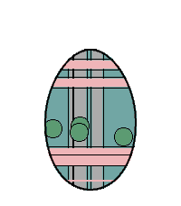

<!-- Generated by scripts/update_app_directory.py: do not edit by hand -->
# Watchapps: E

[← About this list](../watchapps.md) · [A](a.md) · [B](b.md) · [C](c.md) · [D](d.md) · **E** · [F](f.md) · [G](g.md) · [H](h.md) · [I](i.md) · [J](j.md) · [K](k.md) · [L](l.md) · [M](m.md) · [N](n.md) · [O](o.md) · [P](p.md) · [Q](q.md) · [R](r.md) · [S](s.md) · [T](t.md) · [U](u.md) · [V](v.md) · [W](w.md) · [X](x.md) · [Y](y.md) · [Z](z.md) · [0–9 & other](other.md)

*31 watchapps · Last updated 2026-10-06*

| Screenshot | Name | Developer | Licence | Updated | Description |
|------------|------|-----------|---------|---------|-------------|
| { loading=lazy width="72" } | [Earthquake!!](https://apps.repebble.com/5530b9f67b5ea6a2380000e1) | [Tyler Ouyang](https://github.com/tylerwowen/pebblequake) | <small>Not checked yet</small> | 2015-04-17 | A Watchapp that shows the newest earthquake information ranging from N30 to N45, W112 to W130 (California and its surrounding areas). The data is from USGS… |
| { loading=lazy width="72" } | [Easter Egg](https://apps.repebble.com/4392f34266ad403eadbe4247) | [Dscheinah](https://github.com/dscheinah/easter-egg-pebble) | <small>Not checked yet</small> | 2026-04-18 | Meet Eggy, the Easter Egg! 🥚 What starts as a plain white egg won’t stay that way for long. As you move, rest, and go about your day, Eggy evolves—unlocking… |
| { loading=lazy width="72" } | [Easter Egg](https://apps.rebble.io/en_US/application/69d38633a6ffe6000a092d36) <small>Rebble App Store</small> | [Dscheinah](https://github.com/dscheinah/easter-egg-pebble) | <small>Not checked yet</small> | 2026-04-18 | Meet Eggy, the Easter Egg! 🥚 What starts as a plain white egg won’t stay that way for long. As you move, rest, and go about your day, Eggy evolves—unlocking… |
| { loading=lazy width="72" } | [EatARock](https://apps.rebble.io/en_US/application/5a7cbaf6461a8de298002559) <small>Rebble App Store</small> | [OptiGE](https://github.com/OptiGE/eatapebble) | <small>Not checked yet</small> | 2018-02-09 | An app for showing todays menu at various restaurants around Chalmers University of Technology, Sweden |
| { loading=lazy width="72" } | [ECI Toolbox](https://apps.repebble.com/54bb83cb4de463ab52000014) | [Pedro](https://github.com/pjexposito/ECIToolbox) | <small>Not checked yet</small> | 2016-01-08 | Versión en color. |
| { loading=lazy width="72" } | [Ecobici DX](https://apps.repebble.com/5488eb4c7d4e8e3f70000037) | [Psyrax](https://github.com/psyrax/terminalWatch) | <small>Not checked yet</small> | 2016-06-07 | Get ecobici locations and info of stations nearby. Base API data from http://api.citybik.es/v2/ and https://ecobici.me/#/ Logo art by… |
| { loading=lazy width="72" } | [eCribbage Tournaments](https://apps.repebble.com/559dc7b7807f3e76f10000a4) | [Chase Peeler](https://github.com/chasepeeler/pebble_ecribbage) | <small>Not checked yet</small> | 2015-07-14 | Timeline Pins for eCribbage.com* tournaments. You can subscribe to pins for different kinds of tournaments: Traditional, Variations, Kings, etc. You'll get… |
| { loading=lazy width="72" } | [Edo Clock](https://apps.repebble.com/b3a9a279975041c8b078eaef) | [Thomas Cherry](https://github.com/jceaser/pebble-edo) | <small>Not checked yet</small> | 2026-04-13 | This app is an Edo Clock. Edo period clocks are based on 6 hours spaced from sun rise to sun set. Summer hours are longer then winter hours. |
| { loading=lazy width="72" } | [Egg Timer](https://apps.repebble.com/553e48c09682ccd8b60000cf) | [Erik Risinger](https://github.com/erisinger/Pegg-Timer) | <small>Not checked yet</small> | 2015-05-11 | A handy timer on your wrist. Forget the little plastic timer on your kitchen counter -- this app is perfect for that pot of pasta or the French press… |
| { loading=lazy width="72" } | [Egg Timer](https://apps.repebble.com/5682e73cacdafb8e40000051) | [Oliver Koeth](https://github.com/okoeth/eggtimer-pebble) | <small>Not checked yet</small> | 2016-01-04 | The Egg Timer based on the formula of Charles D.H. Williams is really easy to use. Before you start simply create a new configuration ("New..." in the main… |
| { loading=lazy width="72" } | [Egg Timer](https://apps.repebble.com/7fbac412862949529e130fc9) | [yoada](https://gitlab.com/piconcely/egg-timer) | <small>Not checked yet</small> | 2026-10-03 | Get the perfect breakfast egg - soft, medium or hard - right from your wrist. - Pick soft, medium or hard with Up/Down, press Select to start, pause or… |
| { loading=lazy width="72" } | [Eight Pebbles](https://apps.repebble.com/b91051fbb0564e9abd2d5a6f) | [Robbe Derks](https://github.com/robbederks/eight-pebbles) | <small>Not checked yet</small> | 2026-06-10 | Control your Eight Sleep mattress from your wrist. Designed around one use case: nudging the bed temperature at 3am without reaching for your phone. |
| { loading=lazy width="72" } | [EK Viewer](https://apps.repebble.com/5695a9ce0065c309c7000008) | [thanthos](https://github.com/thanthos/EK-Viewer) | <small>Not checked yet</small> | 2016-02-05 | This is a tool for ElasticSearch and Kibana. This help bring the Metric Visualization in Kibana to the Pebble. Tested with Found. |
| { loading=lazy width="72" } | [Elite Status](https://apps.repebble.com/581d55cb1c0888f2a400016f) | [willyb321](https://github.com/willyb321/pebble-edsm) | <small>Not checked yet</small> | 2016-11-08 | Check your stats in Elite: Dangerous. Uses EDSM. |
| { loading=lazy width="72" } | [Email for Pebble](https://apps.repebble.com/5691bdb1f72963ac6500001a) | [David Schneider](https://github.com/dnschneid/pebblegmail) | <small>Not checked yet</small> | 2016-08-26 | Read email on your wrist! Email for Pebble lets you access your Gmail accounts without having to dig out your phone. |
| { loading=lazy width="72" } | [EMAIL to SMS](https://apps.rebble.io/en_US/application/52cd665a0799b093a7000042) <small>Rebble App Store</small> | [Antonio Asaro](https://github.com/antonioasaro/Antonio-SMS_2.0.git) | <small>Not checked yet</small> | 2015-12-15 | SMS directly from the pebble. Configure email-&gt;text addr + canned msgs and then, send texts to your friends. Example of config page ... From: 4165551212… |
| { loading=lazy width="72" } | [emstime](https://apps.repebble.com/9a929d7de6fd48b992086331) | [Aidan LeMay](https://github.com/aidan-lemay/emstime) | <small>Not checked yet</small> | 2026-09-29 | Rapid-reference time and date dashboard for EMS. Track 12h/24h time and critical date metrics instantly at a glance |
| { loading=lazy width="72" } | [EMT Madrid](https://apps.repebble.com/574e8f414f3c1b6b02000020) | [Alberto Chamorro](https://github.com/ach4m0/pebble_emt_madrid) | <small>Not checked yet</small> | 2016-06-06 | ¿Quieres poder consultar desde tú reloj cuanto van a tardar los autobuses de tus paradas favoritas sin sacar tu smartphone? Con EMT Madrid ya puedes. Ves a… |
| { loading=lazy width="72" } | [Energy Tariffs](https://apps.repebble.com/6962ad396da27100081c4c25) | [Patrick van Beem](https://github.com/patrickvbe/Pebble-EnergyTariffs) | <small>Not checked yet</small> | 2026-06-27 | Displays dynamic energy tariffs on the Pebble watch. Currently, only Dutch tariffs are supported (like Zonneplan and Tibber) and only in hourly rates (I… |
| { loading=lazy width="72" } | [English Translator](https://apps.rebble.io/en_US/application/587a21f6e09e6393ec000854) <small>Rebble App Store</small> | [betmanenko](https://github.com/betmakh/pebbleTranslator) | <small>Not checked yet</small> | 2017-01-14 | Say word or sentence in English to get translation for your language. Internet connection required. Control: - press 'select' button and say your word in… |
| { loading=lazy width="72" } | [Enigma](https://apps.repebble.com/564574afb69084719900003a) | [Yang Leng](https://github.com/PeterL328/Enigma) | <small>Not checked yet</small> | 2016-10-16 | This application is emulator of the 3-rotor Kriegsmarine M3 Enigma machine, which is used during the World War II. The Enigma machine has a series of… |
| { loading=lazy width="72" } | [EnigmaVu](https://apps.repebble.com/5515c946038760763b00002d) | [KaRo](https://github.com/Roemke/enigmavu) | <small>Not checked yet</small> | 2015-05-04 | Remote Control for Dreambox(?) / Enigma based satellite receiver. Tested on Vu+ Solo2. You can control Power, Volume and Program by the buttons of your… |
| { loading=lazy width="72" } | [Eorzian Events](https://apps.rebble.io/en_US/application/6605dfa3ea09ac08481d6b6a) <small>Rebble App Store</small> | [Enova](https://github.com/Enovale/eorzian-events) | MIT | 2024-03-28 | Displays information and notifies you of timed items/locations in Final Fantasy XIV. |
| { loading=lazy width="72" } | [Etchist](https://apps.repebble.com/54b49f22daa5498e85000006) | [Brian Zwahr](https://github.com/echosa/Etchist) | <small>Not checked yet</small> | 2015-12-17 | Etchist turns your Pebble into an Etch-a-sketch! Use the select button to toggle between drawing up/down and left/right. Shake to clear the screen! |
| { loading=lazy width="72" } | [Ethicker](https://apps.repebble.com/56df00cb68994ff0f9000012) | [Sebastien Castiel](https://github.com/scastiel/pebethicker) | <small>Not checked yet</small> | 2016-03-10 | Easily get current Ether or Bitcoin value on your watch! Supported tickers: BTCEUR, BTCHKD, BTCUSD, ETHBTC, ETHEUR, ETHUSD, REPBTC. Data is fetched from… |
| { loading=lazy width="72" } | [EveningNews](https://apps.repebble.com/55a964ac0dc1ced6c40000e3) | [Antonio Asaro](https://github.com/antonioasaro/Antonio-EveningNews/tree/master/src) | <small>Not checked yet</small> | 2016-02-27 | Top 5 google rss headlines posted at ~6:30pm ET & again at ~6:30 PT. Note: sorry guys, only ET & PT timezones for the moment. To do more, I'd have to track… |
| { loading=lazy width="72" } | [Events 365](https://apps.repebble.com/55a0cf1181def002d7000002) | [Andrei Markeev](https://github.com/andrei-markeev/pebble-outlook-events) | <small>Not checked yet</small> | 2025-10-20 | The app retrieves Office 365 Outlook events and displays them as a list, which you can then browse and see details of each event. Events are cached so they… |
| { loading=lazy width="72" } | [Exec File](https://apps.repebble.com/568a4cfa496916a93f00004e) | [Roman Matiasko](https://github.com/romanmatiasko/exec-file-pebble) | <small>Not checked yet</small> | 2016-01-04 | An app that allows you to execute remote files from your pebble. The app needs a companion app, server, to be running on your local network and to be… |
| { loading=lazy width="72" } | [Exposure Calculator](https://apps.repebble.com/569d89a7c7fdf7761b000011) | [Luis Bento](https://github.com/lfhbento/ExposureCalc) | <small>Not checked yet</small> | 2016-01-19 | For film camera lovers without a light meter handy, you can just use your watch! Calculate shutter speed based on ISO, aperture and EV. Use the select… |
| { loading=lazy width="72" } | [Express Forecast](https://apps.repebble.com/56cbf445ad30ff6e3b00000e) | [Matthew McClellan](https://github.com/mcclellanmj/pebble-quick-weather) | <small>Not checked yet</small> | 2016-06-22 | A straight-to-the-point watchapp for getting the weather. Will give the next 10 days forecast as soon as its opened. The intention of this app was to answer… |
| { loading=lazy width="72" } | [Eye Protect (20-20-20)](https://apps.repebble.com/6914c16e66ee0d00098fecd5) | [David Peer](https://github.com/peerdavid/pebble-20-20-20) | <small>Not checked yet</small> | 2026-08-20 | Staring at screens all day? Give your eyes the break they desperately need with the 20-20-20 rule! This simple and essential app automatically reminds you… |
