---
hide:
  - toc
---

<!-- Generated by scripts/update_app_directory.py: do not edit by hand -->
# Pebble Apps: E

[← All Pebble Apps](../watchapps.md) · [A](a.md) · [B](b.md) · [C](c.md) · [D](d.md) · **E** · [F](f.md) · [G](g.md) · [H](h.md) · [I](i.md) · [J](j.md) · [K](k.md) · [L](l.md) · [M](m.md) · [N](n.md) · [O](o.md) · [P](p.md) · [Q](q.md) · [R](r.md) · [S](s.md) · [T](t.md) · [U](u.md) · [V](v.md) · [W](w.md) · [X](x.md) · [Y](y.md) · [Z](z.md) · [0–9 & other](other.md)

*30 apps · Last updated 2026-10-06 · [About these lists](../about-app-lists.md)*

<a class="app-shot" href="https://apps.repebble.com/5530b9f67b5ea6a2380000e1" data-search-exclude>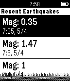</a>

<h2 class="app-name" id="app-5530b9f67b5ea6a2380000e1"><a href="https://apps.repebble.com/5530b9f67b5ea6a2380000e1">Earthquake!!</a></h2>
<a class="app-source" href="https://github.com/tylerwowen/pebblequake" title="Source code" data-search-exclude>View source</a>

by <a href="https://apps.repebble.com/apps/dev/tyler-ouyang_551fa6c651d7438f9200000a" title="More from this developer">Tyler Ouyang</a>

Not checked yet v1.0 Updated 2015-04-17

Runs on: Time 2, Pebble 2 Duo, Pebble 2, Time, Classic

A Watchapp that shows the newest earthquake information ranging from N30 to N45, W112 to W130 (California and its surrounding areas). The data is from USGS 1. Shows the newest 6 entries 2. Updates…

<a class="app-shot" href="https://apps.repebble.com/4392f34266ad403eadbe4247" data-search-exclude>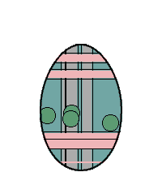</a>

<h2 class="app-name" id="app-4392f34266ad403eadbe4247"><a href="https://apps.repebble.com/4392f34266ad403eadbe4247">Easter Egg</a></h2>
<a class="app-source" href="https://github.com/dscheinah/easter-egg-pebble" title="Source code" data-search-exclude>View source</a>

by <a href="https://apps.repebble.com/apps/dev/dscheinah_5bef203e74e2a60001cef482" title="More from this developer">Dscheinah</a>

Not checked yet v1.3 Updated 2026-04-18

Runs on: Round 2, Time 2, Pebble 2 Duo, Pebble 2, Time Round, Time

Meet Eggy, the Easter Egg! 🥚 What starts as a plain white egg won’t stay that way for long. As you move, rest, and go about your day, Eggy evolves—unlocking new features and surprises along the…

<a class="app-shot" href="https://apps.rebble.io/en_US/application/5a7cbaf6461a8de298002559" data-search-exclude>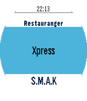</a>

<h2 class="app-name" id="app-5a7cbaf6461a8de298002559"><a href="https://apps.rebble.io/en_US/application/5a7cbaf6461a8de298002559">EatARock</a></h2>
<a class="app-source" href="https://github.com/OptiGE/eatapebble" title="Source code" data-search-exclude>View source</a>

by <a href="https://apps.rebble.io/en_US/developer/55ab90ef4f0cf8f2f8000059/1" title="More from this developer">OptiGE</a>

No licence v1.0 Updated 2018-02-09 Rebble App Store

Runs on: Round 2, Time 2, Time Round, Time

An app for showing todays menu at various restaurants around Chalmers University of Technology, Sweden

<a class="app-shot" href="https://apps.repebble.com/54bb83cb4de463ab52000014" data-search-exclude>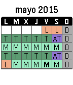</a>

<h2 class="app-name" id="app-54bb83cb4de463ab52000014"><a href="https://apps.repebble.com/54bb83cb4de463ab52000014">ECI Toolbox</a></h2>
<a class="app-source" href="https://github.com/pjexposito/ECIToolbox" title="Source code" data-search-exclude>View source</a>

by <a href="https://apps.repebble.com/apps/dev/pedro_535907fa2acb26c7e50001b1" title="More from this developer">Pedro</a>

Not checked yet v1.42 Updated 2016-01-08

Runs on: Time 2, Pebble 2 Duo, Pebble 2, Time, Classic

Versión en color.

<a class="app-shot" href="https://apps.repebble.com/5488eb4c7d4e8e3f70000037" data-search-exclude>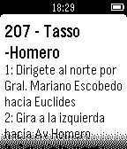</a>

<h2 class="app-name" id="app-5488eb4c7d4e8e3f70000037"><a href="https://apps.repebble.com/5488eb4c7d4e8e3f70000037">Ecobici DX</a></h2>
<a class="app-source" href="https://github.com/psyrax/terminalWatch" title="Source code" data-search-exclude>View source</a>

by <a href="https://apps.repebble.com/apps/dev/psyrax_54500432ba4430c8b200008a" title="More from this developer">Psyrax</a>

Not checked yet v1.2 Updated 2016-06-07

Runs on: Time 2, Pebble 2 Duo, Pebble 2, Time, Classic

Get ecobici locations and info of stations nearby. Base API data from http://api.citybik.es/v2/ and https://ecobici.me/#/ Logo art by https://twitter.com/vampipe

<h2 class="app-name" id="app-559dc7b7807f3e76f10000a4"><a href="https://apps.repebble.com/559dc7b7807f3e76f10000a4">eCribbage Tournaments</a></h2>
<a class="app-source" href="https://github.com/chasepeeler/pebble_ecribbage" title="Source code" data-search-exclude>View source</a>

by <a href="https://apps.repebble.com/apps/dev/chase-peeler_52f3b3de6d77774d28000399" title="More from this developer">Chase Peeler</a>

Not checked yet v2.2 Updated 2015-07-14

Runs on: Time 2, Pebble 2 Duo, Pebble 2, Time, Classic

Timeline Pins for eCribbage.com* tournaments. You can subscribe to pins for different kinds of tournaments: Traditional, Variations, Kings, etc. You&#x27;ll get a reminder 30 minutes before a…

<a class="app-shot" href="https://apps.repebble.com/b3a9a279975041c8b078eaef" data-search-exclude>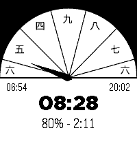</a>

<h2 class="app-name" id="app-b3a9a279975041c8b078eaef"><a href="https://apps.repebble.com/b3a9a279975041c8b078eaef">Edo Clock</a></h2>
<a class="app-source" href="https://github.com/jceaser/pebble-edo" title="Source code" data-search-exclude>View source</a>

by <a href="https://apps.repebble.com/apps/dev/thomas-cherry_e17c5c02c0004112d037771d" title="More from this developer">Thomas Cherry</a>

Not checked yet v0.1 Updated 2026-04-13

Runs on: Round 2, Time 2, Pebble 2 Duo, Pebble 2, Time Round, Time

This app is an Edo Clock. Edo period clocks are based on 6 hours spaced from sun rise to sun set. Summer hours are longer then winter hours.

<a class="app-shot" href="https://apps.repebble.com/553e48c09682ccd8b60000cf" data-search-exclude>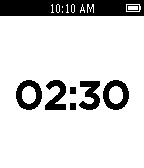</a>

<h2 class="app-name" id="app-553e48c09682ccd8b60000cf"><a href="https://apps.repebble.com/553e48c09682ccd8b60000cf">Egg Timer</a></h2>
<a class="app-source" href="https://github.com/erisinger/Pegg-Timer" title="Source code" data-search-exclude>View source</a>

by <a href="https://apps.repebble.com/apps/dev/erik-risinger_52f066234ae3632a2500174e" title="More from this developer">Erik Risinger</a>

Not checked yet v1.11 Updated 2015-05-11

Runs on: Time 2, Pebble 2 Duo, Pebble 2, Time, Classic

A handy timer on your wrist. Forget the little plastic timer on your kitchen counter -- this app is perfect for that pot of pasta or the French press brewing on the balcony. The timer can be set…

<a class="app-shot" href="https://apps.repebble.com/5682e73cacdafb8e40000051" data-search-exclude>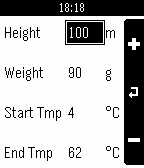</a>

<h2 class="app-name" id="app-5682e73cacdafb8e40000051"><a href="https://apps.repebble.com/5682e73cacdafb8e40000051">Egg Timer</a></h2>
<a class="app-source" href="https://github.com/okoeth/eggtimer-pebble" title="Source code" data-search-exclude>View source</a>

by <a href="https://apps.repebble.com/apps/dev/oliver-koeth_542d52a51d86053a9500018d" title="More from this developer">Oliver Koeth</a>

Not checked yet v1.1 Updated 2016-01-04

Runs on: Time 2, Pebble 2 Duo, Pebble 2, Time, Classic

The Egg Timer based on the formula of Charles D.H. Williams is really easy to use. Before you start simply create a new configuration (&quot;New...&quot; in the main menu) which fits your egg and location…

<a class="app-shot" href="https://apps.repebble.com/7fbac412862949529e130fc9" data-search-exclude>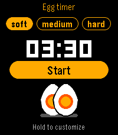</a>

<h2 class="app-name" id="app-7fbac412862949529e130fc9"><a href="https://apps.repebble.com/7fbac412862949529e130fc9">Egg Timer</a></h2>
<a class="app-source" href="https://gitlab.com/piconcely/egg-timer" title="Source code" data-search-exclude>View source</a>

by <a href="https://apps.repebble.com/apps/dev/yoada_40295452a8505728bae5a632" title="More from this developer">yoada</a>

Not checked yet v1.1.3 Updated 2026-10-03

Runs on: Round 2, Time 2, Pebble 2 Duo, Pebble 2, Time Round, Time

Get the perfect breakfast egg - soft, medium or hard - right from your wrist. - Pick soft, medium or hard with Up/Down, press Select to start, pause or resume. - Hold Select to adjust a cooking…

<a class="app-shot" href="https://apps.repebble.com/b91051fbb0564e9abd2d5a6f" data-search-exclude>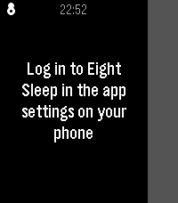</a>

<h2 class="app-name" id="app-b91051fbb0564e9abd2d5a6f"><a href="https://apps.repebble.com/b91051fbb0564e9abd2d5a6f">Eight Pebbles</a></h2>
<a class="app-source" href="https://github.com/robbederks/eight-pebbles" title="Source code" data-search-exclude>View source</a>

by <a href="https://apps.repebble.com/apps/dev/robbe-derks_646e91cc5f8258082f14349a" title="More from this developer">Robbe Derks</a>

Not checked yet v1.0.0 Updated 2026-06-10

Runs on: Time 2

Control your Eight Sleep mattress from your wrist. Designed around one use case: nudging the bed temperature at 3am without reaching for your phone.

<a class="app-shot" href="https://apps.repebble.com/5695a9ce0065c309c7000008" data-search-exclude>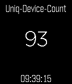</a>

<h2 class="app-name" id="app-5695a9ce0065c309c7000008"><a href="https://apps.repebble.com/5695a9ce0065c309c7000008">EK Viewer</a></h2>
<a class="app-source" href="https://github.com/thanthos/EK-Viewer" title="Source code" data-search-exclude>View source</a>

by <a href="https://apps.repebble.com/apps/dev/thanthos_531a88eaeb7a77f9cf000ac3" title="More from this developer">thanthos</a>

Not checked yet v1.1 Updated 2016-02-05

Runs on: Time 2, Pebble 2 Duo, Pebble 2, Time, Classic

This is a tool for ElasticSearch and Kibana. This help bring the Metric Visualization in Kibana to the Pebble. Tested with Found.

<a class="app-shot" href="https://apps.repebble.com/581d55cb1c0888f2a400016f" data-search-exclude>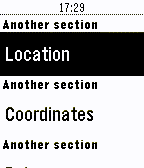</a>

<h2 class="app-name" id="app-581d55cb1c0888f2a400016f"><a href="https://apps.repebble.com/581d55cb1c0888f2a400016f">Elite Status</a></h2>
<a class="app-source" href="https://github.com/willyb321/pebble-edsm" title="Source code" data-search-exclude>View source</a>

by <a href="https://apps.repebble.com/apps/dev/willyb321_54fe3b87807d278084000062" title="More from this developer">willyb321</a>

Not checked yet v1.2 Updated 2016-11-08

Runs on: Time 2, Pebble 2 Duo, Pebble 2, Time, Classic

Check your stats in Elite: Dangerous. Uses EDSM.

<a class="app-shot" href="https://apps.repebble.com/5691bdb1f72963ac6500001a" data-search-exclude>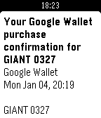</a>

<h2 class="app-name" id="app-5691bdb1f72963ac6500001a"><a href="https://apps.repebble.com/5691bdb1f72963ac6500001a">Email for Pebble</a></h2>
<a class="app-source" href="https://github.com/dnschneid/pebblegmail" title="Source code" data-search-exclude>View source</a>

by <a href="https://apps.repebble.com/apps/dev/david-schneider_5571d089a5c273c80500004e" title="More from this developer">David Schneider</a>

Not checked yet v1.1 Updated 2016-08-26

Runs on: Round 2, Time 2, Pebble 2 Duo, Pebble 2, Time Round, Time, Classic

Read email on your wrist! Email for Pebble lets you access your Gmail accounts without having to dig out your phone.

<a class="app-shot" href="https://apps.rebble.io/en_US/application/52cd665a0799b093a7000042" data-search-exclude>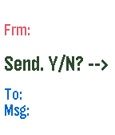</a>

<h2 class="app-name" id="app-52cd665a0799b093a7000042"><a href="https://apps.rebble.io/en_US/application/52cd665a0799b093a7000042">EMAIL to SMS</a></h2>
<a class="app-source" href="https://github.com/antonioasaro/Antonio-SMS_2.0.git" title="Source code" data-search-exclude>View source</a>

by <a href="https://apps.rebble.io/en_US/developer/52cd5e150799b0643b00003c/1" title="More from this developer">Antonio Asaro</a>

No licence v1.2 Updated 2015-12-15 Rebble App Store

Runs on: Round 2, Time 2, Pebble 2 Duo, Pebble 2, Time Round, Time, Classic

SMS directly from the pebble. Configure email-&gt;text addr + canned msgs and then, send texts to your friends. Example of config page ... From: 4165551212 Who0: Lucy Num0: 9055551212@sms.carrier.com…

<a class="app-shot" href="https://apps.repebble.com/9a929d7de6fd48b992086331" data-search-exclude>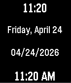</a>

<h2 class="app-name" id="app-9a929d7de6fd48b992086331"><a href="https://apps.repebble.com/9a929d7de6fd48b992086331">emstime</a></h2>
<a class="app-source" href="https://github.com/aidan-lemay/emstime" title="Source code" data-search-exclude>View source</a>

by <a href="https://apps.repebble.com/apps/dev/aidan-lemay_b14b6a375dde09cdbf37ff76" title="More from this developer">Aidan LeMay</a>

No licence v2.5 Updated 2026-09-29

Runs on: Round 2, Time 2, Pebble 2 Duo, Pebble 2, Time Round, Time, Classic

Rapid-reference time and date dashboard for EMS. Track 12h/24h time and critical date metrics instantly at a glance

<a class="app-shot" href="https://apps.repebble.com/574e8f414f3c1b6b02000020" data-search-exclude>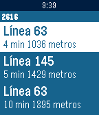</a>

<h2 class="app-name" id="app-574e8f414f3c1b6b02000020"><a href="https://apps.repebble.com/574e8f414f3c1b6b02000020">EMT Madrid</a></h2>
<a class="app-source" href="https://github.com/ach4m0/pebble_emt_madrid" title="Source code" data-search-exclude>View source</a>

by <a href="https://apps.repebble.com/apps/dev/alberto-chamorro_5749bf1dfdf50307aa000010" title="More from this developer">Alberto Chamorro</a>

No licence v1.1 Updated 2016-06-06

Runs on: Round 2, Time 2, Pebble 2 Duo, Pebble 2, Time Round, Time, Classic

¿Quieres poder consultar desde tú reloj cuanto van a tardar los autobuses de tus paradas favoritas sin sacar tu smartphone? Con EMT Madrid ya puedes. Ves a la configuración de la aplicación…

<a class="app-shot" href="https://apps.repebble.com/6962ad396da27100081c4c25" data-search-exclude>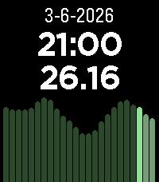</a>

<h2 class="app-name" id="app-6962ad396da27100081c4c25"><a href="https://apps.repebble.com/6962ad396da27100081c4c25">Energy Tariffs</a></h2>
<a class="app-source" href="https://github.com/patrickvbe/Pebble-EnergyTariffs" title="Source code" data-search-exclude>View source</a>

by <a href="https://apps.repebble.com/apps/dev/patrick-van-beem_6956e4df658abd0009484f11" title="More from this developer">Patrick van Beem</a>

Not checked yet v1.1.1 Updated 2026-06-27

Runs on: Round 2, Time 2, Pebble 2 Duo, Pebble 2, Time Round, Time, Classic

Displays dynamic energy tariffs on the Pebble watch. Currently, only Dutch tariffs are supported (like Zonneplan and Tibber) and only in hourly rates (I think the quarterly rates are only useful…

<a class="app-shot" href="https://apps.rebble.io/en_US/application/587a21f6e09e6393ec000854" data-search-exclude>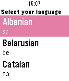</a>

<h2 class="app-name" id="app-587a21f6e09e6393ec000854"><a href="https://apps.rebble.io/en_US/application/587a21f6e09e6393ec000854">English Translator</a></h2>
<a class="app-source" href="https://github.com/betmakh/pebbleTranslator" title="Source code" data-search-exclude>View source</a>

by <a href="https://apps.rebble.io/en_US/developer/561bc3b03493942418000071/1" title="More from this developer">betmanenko</a>

No licence v1.0 Updated 2017-01-14 Rebble App Store

Runs on: Time 2, Time

Say word or sentence in English to get translation for your language. Internet connection required. Control: - press &#x27;select&#x27; button and say your word in English - hold &#x27;select&#x27; button to select…

<a class="app-shot" href="https://apps.repebble.com/564574afb69084719900003a" data-search-exclude>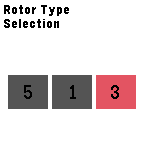</a>

<h2 class="app-name" id="app-564574afb69084719900003a"><a href="https://apps.repebble.com/564574afb69084719900003a">Enigma</a></h2>
<a class="app-source" href="https://github.com/PeterL328/Enigma" title="Source code" data-search-exclude>View source</a>

by <a href="https://apps.repebble.com/apps/dev/yang-leng_54ee57600e4705c4200000f6" title="More from this developer">Yang Leng</a>

MIT v1.1 Updated 2016-10-16

Runs on: Time 2, Time

This application is emulator of the 3-rotor Kriegsmarine M3 Enigma machine, which is used during the World War II. The Enigma machine has a series of settings that determines how it encrypts each…

<a class="app-shot" href="https://apps.repebble.com/5515c946038760763b00002d" data-search-exclude>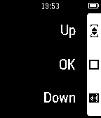</a>

<h2 class="app-name" id="app-5515c946038760763b00002d"><a href="https://apps.repebble.com/5515c946038760763b00002d">EnigmaVu</a></h2>
<a class="app-source" href="https://github.com/Roemke/enigmavu" title="Source code" data-search-exclude>View source</a>

by <a href="https://apps.repebble.com/apps/dev/karo_54da388a5f4f24af68000090" title="More from this developer">KaRo</a>

MIT v1.2 Updated 2015-05-04

Runs on: Time 2, Pebble 2 Duo, Pebble 2, Time, Classic

Remote Control for Dreambox(?) / Enigma based satellite receiver. Tested on Vu+ Solo2. You can control Power, Volume and Program by the buttons of your watch. I will left this app as it is because…

<a class="app-shot" href="https://apps.rebble.io/en_US/application/6605dfa3ea09ac08481d6b6a" data-search-exclude>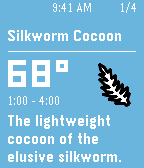</a>

<h2 class="app-name" id="app-6605dfa3ea09ac08481d6b6a"><a href="https://apps.rebble.io/en_US/application/6605dfa3ea09ac08481d6b6a">Eorzian Events</a></h2>
<a class="app-source" href="https://github.com/Enovale/eorzian-events" title="Source code" data-search-exclude>View source</a>

by <a href="https://apps.rebble.io/en_US/developer/55f606cf883da5793f000019/1" title="More from this developer">Enova</a>

MIT v0.1 Updated 2024-03-28 Rebble App Store

Runs on: Round 2, Time 2, Pebble 2 Duo, Pebble 2, Time Round, Time, Classic

Displays information and notifies you of timed items/locations in Final Fantasy XIV.

<a class="app-shot" href="https://apps.repebble.com/54b49f22daa5498e85000006" data-search-exclude>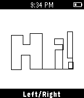</a>

<h2 class="app-name" id="app-54b49f22daa5498e85000006"><a href="https://apps.repebble.com/54b49f22daa5498e85000006">Etchist</a></h2>
<a class="app-source" href="https://github.com/echosa/Etchist" title="Source code" data-search-exclude>View source</a>

by <a href="https://apps.repebble.com/apps/dev/brian-zwahr_54a44752ea825781c10000c4" title="More from this developer">Brian Zwahr</a>

Not checked yet v2.0 Updated 2015-12-17

Runs on: Round 2, Time 2, Pebble 2 Duo, Pebble 2, Time Round, Time, Classic

Etchist turns your Pebble into an Etch-a-sketch! Use the select button to toggle between drawing up/down and left/right. Shake to clear the screen!

<a class="app-shot" href="https://apps.repebble.com/56df00cb68994ff0f9000012" data-search-exclude>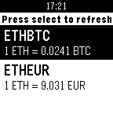</a>

<h2 class="app-name" id="app-56df00cb68994ff0f9000012"><a href="https://apps.repebble.com/56df00cb68994ff0f9000012">Ethicker</a></h2>
<a class="app-source" href="https://github.com/scastiel/pebethicker" title="Source code" data-search-exclude>View source</a>

by <a href="https://apps.repebble.com/apps/dev/sebastien-castiel_56a6855eed368bf53c00004d" title="More from this developer">Sebastien Castiel</a>

Not checked yet v1.1 Updated 2016-03-10

Runs on: Time 2, Pebble 2 Duo, Pebble 2, Time, Classic

Easily get current Ether or Bitcoin value on your watch! Supported tickers: BTCEUR, BTCHKD, BTCUSD, ETHBTC, ETHEUR, ETHUSD, REPBTC. Data is fetched from Gatecoin public API. Please note that since…

<h2 class="app-name" id="app-55a964ac0dc1ced6c40000e3"><a href="https://apps.repebble.com/55a964ac0dc1ced6c40000e3">EveningNews</a></h2>
<a class="app-source" href="https://github.com/antonioasaro/Antonio-EveningNews/tree/master/src" title="Source code" data-search-exclude>View source</a>

by <a href="https://apps.repebble.com/apps/dev/antonio-asaro_52cd5e150799b0643b00003c" title="More from this developer">Antonio Asaro</a>

No licence v2.1 Updated 2016-02-27

Runs on: Round 2, Time 2, Pebble 2 Duo, Pebble 2, Time Round, Time, Classic

Top 5 google rss headlines posted at ~6:30pm ET &amp; again at ~6:30 PT. Note: sorry guys, only ET &amp; PT timezones for the moment. To do more, I&#x27;d have to track per-user TZ in a database on the server…

<a class="app-shot" href="https://apps.repebble.com/55a0cf1181def002d7000002" data-search-exclude>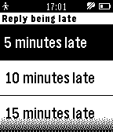</a>

<h2 class="app-name" id="app-55a0cf1181def002d7000002"><a href="https://apps.repebble.com/55a0cf1181def002d7000002">Events 365</a></h2>
<a class="app-source" href="https://github.com/andrei-markeev/pebble-outlook-events" title="Source code" data-search-exclude>View source</a>

by <a href="https://apps.repebble.com/apps/dev/andrei-markeev_55955a42e26351be6b000036" title="More from this developer">Andrei Markeev</a>

No licence v2.5 Updated 2025-10-20

Runs on: Time 2, Pebble 2 Duo, Pebble 2, Time, Classic

The app retrieves Office 365 Outlook events and displays them as a list, which you can then browse and see details of each event. Events are cached so they can also be browsed offline (even when…

<a class="app-shot" href="https://apps.repebble.com/568a4cfa496916a93f00004e" data-search-exclude>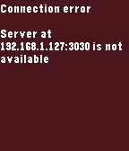</a>

<h2 class="app-name" id="app-568a4cfa496916a93f00004e"><a href="https://apps.repebble.com/568a4cfa496916a93f00004e">Exec File</a></h2>
<a class="app-source" href="https://github.com/romanmatiasko/exec-file-pebble" title="Source code" data-search-exclude>View source</a>

by <a href="https://apps.repebble.com/apps/dev/roman-matiasko_566068a80ea7f7e7a900003e" title="More from this developer">Roman Matiasko</a>

Not checked yet v1.0 Updated 2016-01-04

Runs on: Round 2, Time 2, Pebble 2 Duo, Pebble 2, Time Round, Time, Classic

An app that allows you to execute remote files from your pebble. The app needs a companion app, server, to be running on your local network and to be accessible via HTTP. The number of files that…

<a class="app-shot" href="https://apps.repebble.com/569d89a7c7fdf7761b000011" data-search-exclude>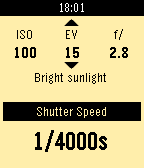</a>

<h2 class="app-name" id="app-569d89a7c7fdf7761b000011"><a href="https://apps.repebble.com/569d89a7c7fdf7761b000011">Exposure Calculator</a></h2>
<a class="app-source" href="https://github.com/lfhbento/ExposureCalc" title="Source code" data-search-exclude>View source</a>

by <a href="https://apps.repebble.com/apps/dev/luis-bento_565bbec27b470d0e550000c7" title="More from this developer">Luis Bento</a>

Not checked yet v0.1 Updated 2016-01-19

Runs on: Round 2, Time 2, Pebble 2 Duo, Pebble 2, Time Round, Time, Classic

For film camera lovers without a light meter handy, you can just use your watch! Calculate shutter speed based on ISO, aperture and EV. Use the select button to switch between ISO, EV and…

<a class="app-shot" href="https://apps.repebble.com/56cbf445ad30ff6e3b00000e" data-search-exclude>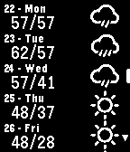</a>

<h2 class="app-name" id="app-56cbf445ad30ff6e3b00000e"><a href="https://apps.repebble.com/56cbf445ad30ff6e3b00000e">Express Forecast</a></h2>
<a class="app-source" href="https://github.com/mcclellanmj/pebble-quick-weather" title="Source code" data-search-exclude>View source</a>

by <a href="https://apps.repebble.com/apps/dev/matthew-mcclellan_52cbc5afb138282b75000118" title="More from this developer">Matthew McClellan</a>

Not checked yet v1.1 Updated 2016-06-22

Runs on: Time 2, Pebble 2 Duo, Pebble 2, Time, Classic

A straight-to-the-point watchapp for getting the weather. Will give the next 10 days forecast as soon as its opened. The intention of this app was to answer the question &quot;What&#x27;s the weather like…

<a class="app-shot" href="https://apps.repebble.com/6914c16e66ee0d00098fecd5" data-search-exclude>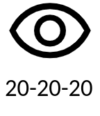</a>

<h2 class="app-name" id="app-6914c16e66ee0d00098fecd5"><a href="https://apps.repebble.com/6914c16e66ee0d00098fecd5">Eye Protect (20-20-20)</a></h2>
<a class="app-source" href="https://github.com/peerdavid/pebble-20-20-20" title="Source code" data-search-exclude>View source</a>

by <a href="https://apps.repebble.com/apps/dev/david-peer_68fb6df5d3c6e4000885b8f5" title="More from this developer">David Peer</a>

Not checked yet v1.0.1 Updated 2026-08-20

Runs on: Time 2, Pebble 2 Duo, Pebble 2, Time, Classic

Staring at screens all day? Give your eyes the break they desperately need with the 20-20-20 rule! This simple and essential app automatically reminds you about the recommended 20-20-20 rule. How…

