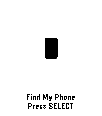

<!-- Generated by scripts/update_app_directory.py: do not edit by hand -->
# Watchapps: F

[← About this list](../watchapps.md) · [A](a.md) · [B](b.md) · [C](c.md) · [D](d.md) · [E](e.md) · **F** · [G](g.md) · [H](h.md) · [I](i.md) · [J](j.md) · [K](k.md) · [L](l.md) · [M](m.md) · [N](n.md) · [O](o.md) · [P](p.md) · [Q](q.md) · [R](r.md) · [S](s.md) · [T](t.md) · [U](u.md) · [V](v.md) · [W](w.md) · [X](x.md) · [Y](y.md) · [Z](z.md) · [0–9 & other](other.md)

*53 watchapps · Last updated 2026-10-06*

| Screenshot | Name | Developer | Licence | Updated | Description |
|------------|------|-----------|---------|---------|-------------|
| { loading=lazy width="72" } | [Falldown](https://apps.repebble.com/52b5584420fef47f82000011) | [Ari Wilson](https://github.com/evilrobot69/Falldown) | <small>Not checked yet</small> | 2015-12-14 | Falldown is a game about steering a falling ball around walls of bricks. You steer with the UP and DOWN buttons or, optionally, by flicking your wrist. Your… |
| { loading=lazy width="72" } | [FastForge](https://apps.repebble.com/a488436292ad4eb69d2a61d8) | [Paul Bütow](https://github.com/snonux/fastforge) | <small>Not checked yet</small> | 2026-09-10 | Track intermittent fasting from your wrist. Start and monitor fasts with a clear timer, use quick presets for common schedules, and review history and… |
| { loading=lazy width="72" } | [FastWasp](https://apps.repebble.com/396b4d6f5a5643f1bcf8dde0) | [gregolsky](https://github.com/gregolsky/fast-wasp-pebble) | <small>Not checked yet</small> | 2026-06-09 | FastWasp is a free, native intermittent-fasting tracker for the new Pebble devices from Core Devices. Everything runs on the watch - no companion app, no… |
| { loading=lazy width="72" } | [Feed Me Now!!!](https://apps.repebble.com/55af4a94ac7b440eed000040) | [Diego Asef](https://github.com/diegoasef/feed-me-now) | <small>Not checked yet</small> | 2015-07-22 | Now supports # Feed Me Now!!! Get food places suggested based on your location and Yelp API. How to use: 1) Open the app and wait to see a suggestion. 2)… |
| { loading=lazy width="72" } | [Feedble](https://apps.rebble.io/en_US/application/5866a69f2ee4312381000245) <small>Rebble App Store</small> | [Lander Laparra](https://github.com/lapitzasclub/Feedble) | <small>Not checked yet</small> | 2017-01-18 | A CommaFeed (https://www.commafeed.com) news reader (RSS) for Pebble. |
| { loading=lazy width="72" } | [Ferry Tracker](https://apps.rebble.io/en_US/application/61751f160ff21d000a08d921) <small>Rebble App Store</small> | [Willow Systems](https://github.com/Willow-Systems/red-funnel-pebble) | <small>Not checked yet</small> | 2021-11-06 | This app tracks the location of Red Funnel ferries in the UK, between the mainland and the Isle of Wight. It's a recreation of the tracker on their website… |
| { loading=lazy width="72" } | [fetch](https://apps.repebble.com/abb6d785901941a3810f7dc4) | [paul3m](https://github.com/paul-em/pebble-fetch) | <small>Not checked yet</small> | 2026-03-25 | Send http requests from your watch! Includes config options for up to 3 quick access requests with methods GET POST PUT DELTE PATCH and custom headers |
| { loading=lazy width="72" } | [Film Devle](https://apps.repebble.com/6a7a0321bb2e890009f6b0f8) | [BitByBit Whatever](https://gitlab.com/m00dawg/film-devle) | <small>Not checked yet</small> | 2026-08-10 | Black and White photographic film development timer |
| { loading=lazy width="72" } | [Finamp Remote (Jellyfin)](https://apps.repebble.com/a9e4acfbf46844e6b1a880df) | [Tanner Meade](https://github.com/tannermeade/finamp-remote-pebble) | <small>Not checked yet</small> | 2026-04-13 | Pebble companion for Finamp, the Jellyfin music player. This requires some changes that I've made to finamp as well. I'll be making a pull request to try to… |
| { loading=lazy width="72" } | [Find Cache - geocaching](https://apps.repebble.com/540ca9ef1120350bc20001e0) | [Samuel](https://github.com/samuelmr/pebble-findcache) | <small>Not checked yet</small> | 2016-05-23 | Geocache companion for Pebble! Configure to set multiple cache locations. Use a simple menu to choose a cache and follow easy directions to find it. Your… |
| { loading=lazy width="72" } | [Find My Gadgetbridge (Find My Phone)](https://apps.rebble.io/en_US/application/69e05d2275212a0009a68c34) <small>Rebble App Store</small> | [Ben Temple](https://codeberg.org/bentemple/pebble-findmygadgetbridge) | <small>See source</small> | 2026-04-16 | Pebble app to trigger Gadgetbridge's "Find My Phone" feature. |
| { loading=lazy width="72" } | [Find My Gadgetbridge (Find My Phone)](https://apps.repebble.com/e043cc88768d49229f716000) | [ben.temple](https://codeberg.org/bentemple/pebble-findmygadgetbridge) | <small>See source</small> | 2026-04-16 | Pebble app to trigger Gadgetbridge's "Find My Phone" feature. |
| { loading=lazy width="72" } | [Find My iPhone](https://apps.repebble.com/7ffae9b84d714b9882f7a40f) | [Analog Tick-Tocker](https://github.com/meded90/pebble-time-2-pixel-faces/tree/main/find-my-iphone) | <small>Not checked yet</small> | 2026-09-01 | Ring your iPhone directly from Pebble Time 2. Open the watch app, select an iPhone with the Up and Down buttons, then hold Select for 650 ms to send the… |
| { loading=lazy width="72" } | [Find My iPhone](https://apps.repebble.com/d71d5cfc5ec6470ebe8745d2) | [serogaq](https://github.com/serogaq/PebbleFindMyiPhone) | <small>Not checked yet</small> | 2026-08-31 | Trigger the real Apple Find My Play Sound alert for your configured iPhone from a Pebble watch through your self-hosted backend |
| { loading=lazy width="72" } | [Find Watch](https://apps.repebble.com/52ed0fe86ccd08de6200004d) | [Samuel](https://github.com/samuelmr/pebble-findwatch) | <small>Not checked yet</small> | 2016-10-27 | Can't find your Pebble? If it is still within bluetooth reach and your phone/pad is connected to your watch, installing this app will make your watch… |
| { loading=lazy width="72" } | [Find Watch 2](https://apps.repebble.com/d6c906fae28743d8be2aa4c0) | [Christian Ratzenhofer](https://github.com/merlin1991/pebble-findwatch2) | <small>Not checked yet</small> | 2026-08-25 | Can't find your Pebble? If it is still within bluetooth reach and your phone/pad is connected to your watch, installing this app will make your watch… |
| { loading=lazy width="72" } | [find-o-matic](https://apps.rebble.io/en_US/application/637ae1c6c6c24a000a815eb2) <small>Rebble App Store</small> | [kennedn](https://github.com/kennedn/find-o-matic/) | <small>Not checked yet</small> | 2023-02-20 | A compass that points at the thing you desire most. Be it booze, a big mac or anything in between. Uses the DuckDuckGo Nearest Places API to drive a compass… |
| { loading=lazy width="72" } | [FireFighterBuddy](https://apps.repebble.com/f98d526b2dcd478f94618a72) | [sylvain.migaud](https://github.com/Gnu-Bricoleur/PebbleFirefighterBuddy) | <small>No licence</small> | 2026-04-17 | A pebble app for firefighters to start a timer (and log specific time to help with reports) whenever a mobilization is accepted and fetch the intervention… |
| { loading=lazy width="72" } | [First 5km](https://apps.repebble.com/57c04b28f69d1de23e00015b) | [Brian Schau](https://github.com/bschau/First5km.git) | <small>Not checked yet</small> | 2016-08-26 | Can you run 5km? With this app you can. The First 5km app can be found in the Pebble AppStore. This app tracks your progress over 16 weeks with three days… |
| { loading=lazy width="72" } | [First of Them](https://apps.repebble.com/53dfd081107b2280a00000fa) | [Donk Studios](https://github.com/peperodo/first-of-them) | <small>Not checked yet</small> | 2014-08-05 | Follow the cursor moving along a meter at the bottom of the screen. Press when the cursor is in the zone of the black area of the meter. This will allow… |
| { loading=lazy width="72" } | [FitoTrack Display](https://apps.repebble.com/99268a452717438dbeed9466) | [Max Schillinger](https://codeberg.org/MaxGyver83/pebble-fitotrack) | <small>See source</small> | 2026-07-28 | FitoTrack Display shows the most important numbers of your current FitoTrack workout on your Pebble (Android only). Pebble support is not yet available in… |
| { loading=lazy width="72" } | [Flanders Field Poem](https://apps.repebble.com/545dea1211a9cda2c2000045) | [Connor Jewiss](https://github.com/connorypebble/Flanders-Field-Poem) | <small>Not checked yet</small> | 2014-11-08 | This is the original Flanders Field poem reformed as a pebble watchapp especially for Remembrance Day and the Royal British Legion. Support the fallen! Use… |
|  | [Flappy Pebble](https://apps.repebble.com/bd6e3f6122b449188e8faebc) | [AirCodum](https://github.com/coredevices/pebble-watchface-agent-skill) | <small>Not checked yet</small> | 2026-04-14 | Flappy Bird for your Pebble. Tap SELECT (or hold it) to flap through pipes. Gentle physics tuned for small-screen play, persistent high score. |
| { loading=lazy width="72" } | [Flashback F1 Results](https://apps.repebble.com/6929da3470731e00092debea) | [Jordan Fisher](https://github.com/thementalgoose/pebble-flashback) | <small>Not checked yet</small> | 2026-09-13 | Get info on the current F1 Formula 1 Season - Current calendar + weekend schedule in your local timezone - Timeline pins for each event per weekend … |
| { loading=lazy width="72" } | [Flashcards](https://apps.repebble.com/53ef6efd11cff6b7bd0000f7) | [MagmaStone](https://github.com/magmapus/Flashcards) | <small>Not checked yet</small> | 2014-08-18 | Flashcards lets you quiz yourself on the go! Have an upcoming test? Study on the way! Have a debate? Review your talking points. You can add all the… |
| { loading=lazy width="72" } | [FlashRead News](https://apps.repebble.com/695cea36ccb618000951b01b) | [Christophe Jeannette](https://github.com/Sichroteph/RSVP-Breaking-News) | <small>Not checked yet</small> | 2026-01-12 | FlashRead News brings RSS feeds to your Pebble using RSVP (Rapid Serial Visual Presentation), a proven speed-reading technique that displays words one at a… |
| { loading=lazy width="72" } | [Flexible Alerts](https://apps.repebble.com/cda79bd5a8184ab686b5cad3) | [Eliza](https://github.com/elizagamedev/pebble-alerts) | <small>Not checked yet</small> | 2026-07-19 | Show alerts for your Android calendars, contact birthdays, and anniversaries. Allows you to add reminders to subscribed calendars or events without built-in… |
| { loading=lazy width="72" } | [flicks](https://apps.repebble.com/55d3560c704e4657a3000013) | [n4ru](https://gitlab.com/n4ru/Flicks) | <small>Not checked yet</small> | 2016-12-13 | Introducing flicks - a watch app created to do whatever you want whenever you want - right on your wrist. flicks is a fully configurable and scriptable app… |
| { loading=lazy width="72" } | [Flipcards](https://apps.repebble.com/69065e8ace68bc0009859f49) | [Ilia Breitburg](https://github.com/flipcards) | <small>Not checked yet</small> | 2025-11-03 | Flashcards front-end to access Flipcards server. |
| { loading=lazy width="72" } | [Flipple - Flip a Coin](https://apps.repebble.com/565b8769de80b6c4c6000010) | [Joshua Chen](https://github.com/TheJsh/Flipple) | <small>Not checked yet</small> | 2016-01-02 | Flip a coin to avoid making decisions! Flip with a wrist flick, pressing the select button, or quick launching the app. If you want to do instant flips… |
| { loading=lazy width="72" } | [Flipstone](https://apps.repebble.com/4a1c9ef57e924ac596115328) | [Weagertron](https://github.com/weagertron/Flipstone) | <small>Not checked yet</small> | 2026-04-18 | Flipstone is a roguelike built for the Pebble Time smartwatch, where every combat turn resolves with a coin flip. Heads deals damage, tails misses, and a… |
| { loading=lazy width="72" } | [Flood](https://apps.repebble.com/564c2acda9379f613e000044) | [David Inglis](https://github.com/dainglis/flood-pebble-time) | <small>Not checked yet</small> | 2016-04-12 | Fill the board in as few moves as possible. Use the up and down buttons to change colors, and use select to pick. You have 26 moves to fill the board, or… |
| { loading=lazy width="72" } | [FloodWatch](https://apps.repebble.com/57b3722fbb85eddc98000636) | [Tomas Holderness](https://github.com/smart-facility/cognicity-floodwatch) | <small>Not checked yet</small> | 2019-07-24 | On-Hand Flood Alerts FloodWatch is a Pebble app that shows nearby reports of flooding in Jakarta, Indonesia. Reports are collected from the open source… |
| { loading=lazy width="72" } | [Fluid Sim](https://apps.repebble.com/e20547568e884f868586e419) | [Michael Rex](https://github.com/quantumwaffles/pebble-fluid-sim) | <small>Not checked yet</small> | 2026-05-31 | Fluid Sim runs a real-time Navier–Stokes fluid solver on your Pebble. Dye is advected through a velocity field with diffusion and incompressible projection… |
| { loading=lazy width="72" } | [Flynformer](https://apps.repebble.com/1f02276078b84a2e861d9e40) | [dysseus](https://github.com/dysseus-pascal/Flynformer) | <small>Not checked yet</small> | 2026-09-24 | Type the flight number on the watch. No hunting through the phone app: two letters, up to four digits, done. It stays until you change it. Meet Flyn — your… |
| { loading=lazy width="72" } | [Fontastic](https://apps.repebble.com/5498fac473268fc7d4000077) | [Tyler Akins](http://github.com/fidian/pebble-fontastic) | MIT | 2014-12-28 | Preview how fonts are displayed on the Pebble. Aimed at developers with the goal of helping them decide if their app should use a built-in font or one of… |
| { loading=lazy width="72" } | [food baby](https://apps.repebble.com/5409b7c7954a63bd410000a0) | [cheniel](https://github.com/cheniel/food-baby) | <small>Not checked yet</small> | 2014-09-05 | Part-nutritionist, part-digital pet, Food Baby's goal is to motivate healthy dietary choices through the raising of a virtual pet. As such, your healthy… |
| { loading=lazy width="72" } | [Forbidden Love](https://apps.rebble.io/en_US/application/5850eef977324bb64b0004fb) <small>Rebble App Store</small> | [gameblabla](https://github.com/gameblabla/forbidden_love) | <small>Not checked yet</small> | 2016-12-14 | Watch as two men discover the true meaning of life. (yes, it is very philosophical) |
| { loading=lazy width="72" } | [ForeCasWatCompanion](https://apps.repebble.com/bf411784b2584f118a4035d0) | [Midnight Clocksmith](https://github.com/the-static/forcaswatch3) | <small>Not checked yet</small> | 2026-09-24 | I made a version of the forecaswatch2 watchface that runs as an app, so you can interact with it and have different info. I found that binding the app to a… |
| { loading=lazy width="72" } | [Forekast](https://apps.repebble.com/54320b0b106a8c3b05000064) | [mcongrove](https://github.com/mcongrove/ForekastPebble) | <small>Not checked yet</small> | 2014-10-06 | Get today's Forekast events right on your wrist. Forekast is a calendar of amazing events happening worldwide, posted and voted on by an international… |
| { loading=lazy width="72" } | [Formula 1 2014](https://apps.repebble.com/5339efd74eada6fede0000ef) | [Pablo Séguin Llosá](https://github.com/PabloLlosa/FormulaOne2014Pebble) | <small>Not checked yet</small> | 2014-05-03 | Formula One 2014: Simple app to know all about this season Grand Prix. Coming soon: -Info about drivers. -Info about teams. -Live race results. -Much more. |
| { loading=lazy width="72" } | [Formule](https://apps.repebble.com/5305c47421336c693500016a) | [Adrenocortico](https://github.com/Adrenocortico/PebbleFormulas) | Unlicense | 2015-05-27 | Based on PebbleFormulas it's a quick and useful way to access to a many and always new formulas of Algebra, Geometry, Calculus, Trigonometry, Biology… |
| { loading=lazy width="72" } | [Franponator](https://apps.repebble.com/546884448103a24f52000094) | [Martin](https://github.com/pinkguy/franponator) | <small>Not checked yet</small> | 2014-11-16 | Générateur de Franponais, La langue française est très utilisée comme décoration au Japon. Retrouvez ici un générateur qui se chargera de faire cette dure… |
| { loading=lazy width="72" } | [Freebox Telec](https://apps.repebble.com/573462bdf68e7b0562000010) | [jpb31](https://github.com/jpb31/PeebleFreeboxTelec) | <small>Not checked yet</small> | 2016-08-29 | Remote for French Freebox Revolution player Télécommande Freebox Revolution 3 modes : Volume, Programme, et Pavé directionnel (SELECT pour permuter) Appuis… |
| { loading=lazy width="72" } | [French Press Buddy](https://apps.repebble.com/a216163b4af54f9f8b834fdb) | [zman441](https://github.com/zackdolsen/FrenchPressBuddy) | <small>Not checked yet</small> | 2026-08-03 | French Press Buddy is a simple, easy to use app to help you create the best French press coffee you can in 3 easy steps! Features: - Support for 5 different… |
| { loading=lazy width="72" } | [French Press Buddy](https://apps.rebble.io/en_US/application/69f0b23165bd7b00090505d8) <small>Rebble App Store</small> | [zman441](https://github.com/zackdolsen/FrenchPressBuddy) | <small>Not checked yet</small> | 2026-08-03 | French Press Buddy is a simple, easy to use app to help you create the best French press coffee you can in 3 easy steps! 1. Select the roast of your coffee… |
| { loading=lazy width="72" } | [Froggle](https://apps.repebble.com/21268740bc164e18907f66b8) | [Andrew129260](https://github.com/Andrew129260/Froggle) | GPL-3.0 | 2026-09-23 | Frogger, but for Pebble! Multiple challenging levels, which get faster as it goes... Can you dodge the cars and hop those logs? You get an extra life for… |
| { loading=lazy width="72" } | [Fruit Chop](https://apps.repebble.com/82fc69b2d0964fe28e2520c3) | [Zhang Qichuan](https://github.com/qichuan/pebble-fruit-chop) | <small>Not checked yet</small> | 2026-08-08 | Swipe across the screen to slice the fruit — just watch out for the bombs. That's all it takes to play Fruit Chop, a fast, fun fruit-slicing game built… |
| { loading=lazy width="72" } | [FT Capture](https://apps.repebble.com/474369d065a54770b5afaa7e) | [Arwalk](https://github.com/Arwalk/pebble-facilethings-capture) | <small>No licence</small> | 2026-09-01 | Quick capture using the microphone for FacileThings |
| { loading=lazy width="72" } | [FTC Match Timer](https://apps.repebble.com/54a06048d819e546e6000135) | [Alex Davis](https://github.com/i2robotics/pebble-ftc-timer) | <small>Not checked yet</small> | 2015-02-09 | Use your wrist when doing match practice! This app, designed for the FIRST Tech Challenge robotics competition, is basically a countdown timer customized… |
| { loading=lazy width="72" } | [FuelWatch](https://apps.repebble.com/3be6709f07634c0d9f9674a1) | [Moaske](https://github.com/Moaske/PebbleFuelWatch) | <small>Not checked yet</small> | 2026-09-14 | A Pebble nearby fuel station finder for Europe with price check, which kindly and gratefully uses the ANWB© fuel prices api. Watch compatibilty: Basalt… |
| { loading=lazy width="72" } | [Furry Trivia](https://apps.repebble.com/0c2054e85055424aae83ff94) | [Furchee](https://github.com/Furchee/Furry-Trivia) | <small>No licence</small> | 2026-09-03 | A simple trivia game pertaining to the furry fandom! Play it alone or with friends and test your knowledge. I've tested the ability to play this on round… |
| { loading=lazy width="72" } | [Futbolive](https://apps.repebble.com/5566a0df8c932249a4000014) | [Marco Medina](https://github.com/marcomedina/futbolive-pebble) | <small>Not checked yet</small> | 2015-05-28 | Soccer Live Results / Resultados de Futbol en Vivo Liga Mx, Libertadores, La Liga |
