---
hide:
  - toc
---

<!-- Generated by scripts/update_app_directory.py: do not edit by hand -->
# Pebble Apps: F

[← All Pebble Apps](../watchapps.md) · [A](a.md) · [B](b.md) · [C](c.md) · [D](d.md) · [E](e.md) · **F** · [G](g.md) · [H](h.md) · [I](i.md) · [J](j.md) · [K](k.md) · [L](l.md) · [M](m.md) · [N](n.md) · [O](o.md) · [P](p.md) · [Q](q.md) · [R](r.md) · [S](s.md) · [T](t.md) · [U](u.md) · [V](v.md) · [W](w.md) · [X](x.md) · [Y](y.md) · [Z](z.md) · [0–9 & other](other.md)

*51 apps · Last updated 2026-10-06 · [About these lists](../about-app-lists.md)*

<a class="app-shot" href="https://apps.repebble.com/52b5584420fef47f82000011" data-search-exclude>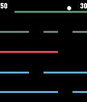</a>

<h2 class="app-name" id="app-52b5584420fef47f82000011"><a href="https://apps.repebble.com/52b5584420fef47f82000011">Falldown</a></h2>
<a class="app-source" href="https://github.com/evilrobot69/Falldown" title="Source code" data-search-exclude>View source</a>

by <a href="https://apps.repebble.com/apps/dev/ari-wilson_52a03c4b2a0bb9b0fb00000d" title="More from this developer">Ari Wilson</a>

Not checked yet v3.0 Updated 2015-12-14

Runs on: Round 2, Time 2, Pebble 2 Duo, Pebble 2, Time Round, Time, Classic

Falldown is a game about steering a falling ball around walls of bricks. You steer with the UP and DOWN buttons or, optionally, by flicking your wrist. Your objective is not to let the ball hit…

<a class="app-shot" href="https://apps.repebble.com/a488436292ad4eb69d2a61d8" data-search-exclude>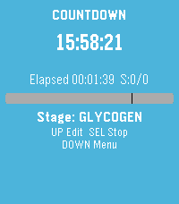</a>

<h2 class="app-name" id="app-a488436292ad4eb69d2a61d8"><a href="https://apps.repebble.com/a488436292ad4eb69d2a61d8">FastForge</a></h2>
<a class="app-source" href="https://github.com/snonux/fastforge" title="Source code" data-search-exclude>View source</a>

by <a href="https://apps.repebble.com/apps/dev/paul-b-tow_879658cff76b318b7b31f6af" title="More from this developer">Paul Bütow</a>

Not checked yet v1.6 Updated 2026-09-10

Runs on: Round 2, Time 2

Track intermittent fasting from your wrist. Start and monitor fasts with a clear timer, use quick presets for common schedules, and review history and streak-friendly stats when you need context…

<a class="app-shot" href="https://apps.repebble.com/396b4d6f5a5643f1bcf8dde0" data-search-exclude>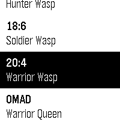</a>

<h2 class="app-name" id="app-396b4d6f5a5643f1bcf8dde0"><a href="https://apps.repebble.com/396b4d6f5a5643f1bcf8dde0">FastWasp</a></h2>
<a class="app-source" href="https://github.com/gregolsky/fast-wasp-pebble" title="Source code" data-search-exclude>View source</a>

by <a href="https://apps.repebble.com/apps/dev/gregolsky_992b6fe43b5311cf1f6f238f" title="More from this developer">gregolsky</a>

Not checked yet v1.9.0 Updated 2026-06-09

Runs on: Time 2, Pebble 2 Duo, Pebble 2, Time

FastWasp is a free, native intermittent-fasting tracker for the new Pebble devices from Core Devices. Everything runs on the watch - no companion app, no phone, no accounts, no internet. 6 fasting…

<a class="app-shot" href="https://apps.repebble.com/55af4a94ac7b440eed000040" data-search-exclude>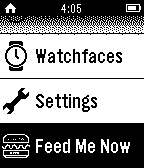</a>

<h2 class="app-name" id="app-55af4a94ac7b440eed000040"><a href="https://apps.repebble.com/55af4a94ac7b440eed000040">Feed Me Now!!!</a></h2>
<a class="app-source" href="https://github.com/diegoasef/feed-me-now" title="Source code" data-search-exclude>View source</a>

by <a href="https://apps.repebble.com/apps/dev/diego-asef_55ae58867a116fef0a0000af" title="More from this developer">Diego Asef</a>

Not checked yet v1.0 Updated 2015-07-22

Runs on: Time 2, Pebble 2 Duo, Pebble 2, Time, Classic

Now supports # Feed Me Now!!! Get food places suggested based on your location and Yelp API. How to use: 1) Open the app and wait to see a suggestion. 2) Shake your pebble to get a new suggestion…

<a class="app-shot" href="https://apps.rebble.io/en_US/application/5866a69f2ee4312381000245" data-search-exclude>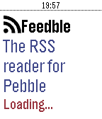</a>

<h2 class="app-name" id="app-5866a69f2ee4312381000245"><a href="https://apps.rebble.io/en_US/application/5866a69f2ee4312381000245">Feedble</a></h2>
<a class="app-source" href="https://github.com/lapitzasclub/Feedble" title="Source code" data-search-exclude>View source</a>

by <a href="https://apps.rebble.io/en_US/developer/5840820b00355a0a12000063/1" title="More from this developer">Lander Laparra</a>

Not checked yet v1.8 Updated 2017-01-18 Rebble App Store

Runs on: Round 2, Time 2, Pebble 2 Duo, Pebble 2, Time Round, Time, Classic

A CommaFeed (https://www.commafeed.com) news reader (RSS) for Pebble.

<a class="app-shot" href="https://apps.rebble.io/en_US/application/61751f160ff21d000a08d921" data-search-exclude>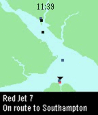</a>

<h2 class="app-name" id="app-61751f160ff21d000a08d921"><a href="https://apps.rebble.io/en_US/application/61751f160ff21d000a08d921">Ferry Tracker</a></h2>
<a class="app-source" href="https://github.com/Willow-Systems/red-funnel-pebble" title="Source code" data-search-exclude>View source</a>

by <a href="https://apps.rebble.io/en_US/developer/5d9ac26cc393f54d6b5f5443/1" title="More from this developer">Willow Systems</a>

No licence v1.1 Updated 2021-11-06 Rebble App Store

Runs on: Time 2, Pebble 2 Duo, Pebble 2, Time, Classic

This app tracks the location of Red Funnel ferries in the UK, between the mainland and the Isle of Wight. It&#x27;s a recreation of the tracker on their website at…

<a class="app-shot" href="https://apps.repebble.com/abb6d785901941a3810f7dc4" data-search-exclude>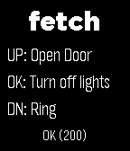</a>

<h2 class="app-name" id="app-abb6d785901941a3810f7dc4"><a href="https://apps.repebble.com/abb6d785901941a3810f7dc4">fetch</a></h2>
<a class="app-source" href="https://github.com/paul-em/pebble-fetch" title="Source code" data-search-exclude>View source</a>

by <a href="https://apps.repebble.com/apps/dev/paul3m_27ef9d2ded8279c429fce882" title="More from this developer">paul3m</a>

Not checked yet v1.1 Updated 2026-03-25

Runs on: Round 2, Time 2, Pebble 2 Duo, Pebble 2, Time Round, Time, Classic

Send http requests from your watch! Includes config options for up to 3 quick access requests with methods GET POST PUT DELTE PATCH and custom headers

<a class="app-shot" href="https://apps.repebble.com/6a7a0321bb2e890009f6b0f8" data-search-exclude>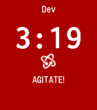</a>

<h2 class="app-name" id="app-6a7a0321bb2e890009f6b0f8"><a href="https://apps.repebble.com/6a7a0321bb2e890009f6b0f8">Film Devle</a></h2>
<a class="app-source" href="https://gitlab.com/m00dawg/film-devle" title="Source code" data-search-exclude>View source</a>

by <a href="https://apps.repebble.com/apps/dev/bitbybit-whatever_6a77f73f199a1d00081c2af9" title="More from this developer">BitByBit Whatever</a>

Not checked yet v1.0.0 Updated 2026-08-10

Runs on: Round 2, Time 2, Pebble 2 Duo, Pebble 2, Time Round, Time, Classic

Black and White photographic film development timer

<a class="app-shot" href="https://apps.repebble.com/a9e4acfbf46844e6b1a880df" data-search-exclude>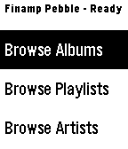</a>

<h2 class="app-name" id="app-a9e4acfbf46844e6b1a880df"><a href="https://apps.repebble.com/a9e4acfbf46844e6b1a880df">Finamp Remote (Jellyfin)</a></h2>
<a class="app-source" href="https://github.com/tannermeade/finamp-remote-pebble" title="Source code" data-search-exclude>View source</a>

by <a href="https://apps.repebble.com/apps/dev/tanner-meade_a804052e4bc7b7c1f5a3f7df" title="More from this developer">Tanner Meade</a>

Not checked yet v1.0.0 Updated 2026-04-13

Runs on: Round 2, Time 2, Pebble 2 Duo, Pebble 2, Time Round, Time, Classic

Pebble companion for Finamp, the Jellyfin music player. This requires some changes that I&#x27;ve made to finamp as well. I&#x27;ll be making a pull request to try to get them accepted into the official…

<a class="app-shot" href="https://apps.repebble.com/540ca9ef1120350bc20001e0" data-search-exclude>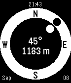</a>

<h2 class="app-name" id="app-540ca9ef1120350bc20001e0"><a href="https://apps.repebble.com/540ca9ef1120350bc20001e0">Find Cache - geocaching</a></h2>
<a class="app-source" href="https://github.com/samuelmr/pebble-findcache" title="Source code" data-search-exclude>View source</a>

by <a href="https://apps.repebble.com/apps/dev/samuel_52b1f68fcd41831af0000014" title="More from this developer">Samuel</a>

Not checked yet v1.5 Updated 2016-05-23

Runs on: Round 2, Time 2, Pebble 2 Duo, Pebble 2, Time Round, Time, Classic

Geocache companion for Pebble! Configure to set multiple cache locations. Use a simple menu to choose a cache and follow easy directions to find it. Your heading (the white dot) is estimated from…

<h2 class="app-name" id="app-e043cc88768d49229f716000"><a href="https://apps.repebble.com/e043cc88768d49229f716000">Find My Gadgetbridge (Find My Phone)</a></h2>
<a class="app-source" href="https://codeberg.org/bentemple/pebble-findmygadgetbridge" title="Source code" data-search-exclude>View source</a>

by <a href="https://apps.repebble.com/apps/dev/ben-temple_bee9e74f1f09f4c6c3294e3e" title="More from this developer">ben.temple</a>

See source v1.0 Updated 2026-04-16

Runs on: Round 2, Time 2, Pebble 2 Duo, Pebble 2, Time Round, Time, Classic

Pebble app to trigger Gadgetbridge&#x27;s &quot;Find My Phone&quot; feature.

<a class="app-shot" href="https://apps.repebble.com/7ffae9b84d714b9882f7a40f" data-search-exclude>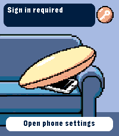</a>

<h2 class="app-name" id="app-7ffae9b84d714b9882f7a40f"><a href="https://apps.repebble.com/7ffae9b84d714b9882f7a40f">Find My iPhone</a></h2>
<a class="app-source" href="https://github.com/meded90/pebble-time-2-pixel-faces/tree/main/find-my-iphone" title="Source code" data-search-exclude>View source</a>

by <a href="https://apps.repebble.com/apps/dev/analog-tick-tocker_eb6b6dc4dbd64c7c7ea32a94" title="More from this developer">Analog Tick-Tocker</a>

Not checked yet v0.1.4 Updated 2026-09-01

Runs on: Time 2

Ring your iPhone directly from Pebble Time 2. Open the watch app, select an iPhone with the Up and Down buttons, then hold Select for 650 ms to send the sound command. The app runs through Pebble…

<a class="app-shot" href="https://apps.repebble.com/d71d5cfc5ec6470ebe8745d2" data-search-exclude>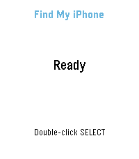</a>

<h2 class="app-name" id="app-d71d5cfc5ec6470ebe8745d2"><a href="https://apps.repebble.com/d71d5cfc5ec6470ebe8745d2">Find My iPhone</a></h2>
<a class="app-source" href="https://github.com/serogaq/PebbleFindMyiPhone" title="Source code" data-search-exclude>View source</a>

by <a href="https://apps.repebble.com/apps/dev/serogaq_2969738e6026dc0356bb3461" title="More from this developer">serogaq</a>

Not checked yet v1.2.0 Updated 2026-08-31

Runs on: Round 2, Time 2, Pebble 2 Duo, Pebble 2

Trigger the real Apple Find My Play Sound alert for your configured iPhone from a Pebble watch through your self-hosted backend

<h2 class="app-name" id="app-52ed0fe86ccd08de6200004d"><a href="https://apps.repebble.com/52ed0fe86ccd08de6200004d">Find Watch</a></h2>
<a class="app-source" href="https://github.com/samuelmr/pebble-findwatch" title="Source code" data-search-exclude>View source</a>

by <a href="https://apps.repebble.com/apps/dev/samuel_52b1f68fcd41831af0000014" title="More from this developer">Samuel</a>

Not checked yet v1.8 Updated 2016-10-27

Runs on: Round 2, Time 2, Pebble 2 Duo, Pebble 2, Time Round, Time, Classic

Can&#x27;t find your Pebble? If it is still within bluetooth reach and your phone/pad is connected to your watch, installing this app will make your watch vibrate and flash. The app counts minutes and…

<h2 class="app-name" id="app-d6c906fae28743d8be2aa4c0"><a href="https://apps.repebble.com/d6c906fae28743d8be2aa4c0">Find Watch 2</a></h2>
<a class="app-source" href="https://github.com/merlin1991/pebble-findwatch2" title="Source code" data-search-exclude>View source</a>

by <a href="https://apps.repebble.com/apps/dev/christian-ratzenhofer_cf8cc0e01f5fd63901765dc1" title="More from this developer">Christian Ratzenhofer</a>

Not checked yet v2.1.0 Updated 2026-08-25

Runs on: Round 2, Time 2, Pebble 2 Duo, Pebble 2, Time Round, Time, Classic

Can&#x27;t find your Pebble? If it is still within bluetooth reach and your phone/pad is connected to your watch, installing this app will make your watch vibrate, flash, and beep (on watches with…

<a class="app-shot" href="https://apps.rebble.io/en_US/application/637ae1c6c6c24a000a815eb2" data-search-exclude>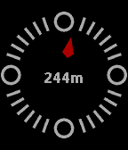</a>

<h2 class="app-name" id="app-637ae1c6c6c24a000a815eb2"><a href="https://apps.rebble.io/en_US/application/637ae1c6c6c24a000a815eb2">find-o-matic</a></h2>
<a class="app-source" href="https://github.com/kennedn/find-o-matic/" title="Source code" data-search-exclude>View source</a>

by <a href="https://apps.rebble.io/en_US/developer/5eac48e120940a03976c6b05/1" title="More from this developer">kennedn</a>

Not checked yet v1.4 Updated 2023-02-20 Rebble App Store

Runs on: Round 2, Time 2, Pebble 2 Duo, Pebble 2, Time Round, Time, Classic

A compass that points at the thing you desire most. Be it booze, a big mac or anything in between. Uses the DuckDuckGo Nearest Places API to drive a compass pointer. Configure a search term in the…

<a class="app-shot" href="https://apps.repebble.com/f98d526b2dcd478f94618a72" data-search-exclude>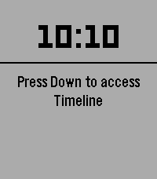</a>

<h2 class="app-name" id="app-f98d526b2dcd478f94618a72"><a href="https://apps.repebble.com/f98d526b2dcd478f94618a72">FireFighterBuddy</a></h2>
<a class="app-source" href="https://github.com/Gnu-Bricoleur/PebbleFirefighterBuddy" title="Source code" data-search-exclude>View source</a>

by <a href="https://apps.repebble.com/apps/dev/sylvain-migaud_d2179982e504a6bd1815727f" title="More from this developer">sylvain.migaud</a>

No licence v1.0 Updated 2026-04-17

Runs on: Round 2, Time 2, Pebble 2 Duo, Pebble 2, Time Round, Time, Classic

A pebble app for firefighters to start a timer (and log specific time to help with reports) whenever a mobilization is accepted and fetch the intervention type, vehicle and address from the…

<a class="app-shot" href="https://apps.repebble.com/57c04b28f69d1de23e00015b" data-search-exclude>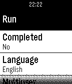</a>

<h2 class="app-name" id="app-57c04b28f69d1de23e00015b"><a href="https://apps.repebble.com/57c04b28f69d1de23e00015b">First 5km</a></h2>
<a class="app-source" href="https://github.com/bschau/First5km.git" title="Source code" data-search-exclude>View source</a>

by <a href="https://apps.repebble.com/apps/dev/brian-schau_52bc98fc530bf4ed75000183" title="More from this developer">Brian Schau</a>

No licence v2.1 Updated 2016-08-26

Runs on: Time 2, Pebble 2 Duo, Pebble 2, Time, Classic

Can you run 5km? With this app you can. The First 5km app can be found in the Pebble AppStore. This app tracks your progress over 16 weeks with three days of running per week. A run day is usually…

<a class="app-shot" href="https://apps.repebble.com/53dfd081107b2280a00000fa" data-search-exclude>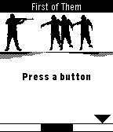</a>

<h2 class="app-name" id="app-53dfd081107b2280a00000fa"><a href="https://apps.repebble.com/53dfd081107b2280a00000fa">First of Them</a></h2>
<a class="app-source" href="https://github.com/peperodo/first-of-them" title="Source code" data-search-exclude>View source</a>

by <a href="https://apps.repebble.com/apps/dev/donk-studios_53b4d4b0faff49b44300016d" title="More from this developer">Donk Studios</a>

Not checked yet v1.0.1 Updated 2014-08-05

Runs on: Time 2, Pebble 2 Duo, Pebble 2, Time, Classic

Follow the cursor moving along a meter at the bottom of the screen. Press when the cursor is in the zone of the black area of the meter. This will allow your character to trigger his rifle to…

<a class="app-shot" href="https://apps.repebble.com/99268a452717438dbeed9466" data-search-exclude>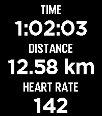</a>

<h2 class="app-name" id="app-99268a452717438dbeed9466"><a href="https://apps.repebble.com/99268a452717438dbeed9466">FitoTrack Display</a></h2>
<a class="app-source" href="https://codeberg.org/MaxGyver83/pebble-fitotrack" title="Source code" data-search-exclude>View source</a>

by <a href="https://apps.repebble.com/apps/dev/max-schillinger_4b3ac51bc36432cad013e146" title="More from this developer">Max Schillinger</a>

See source v1.2.0 Updated 2026-07-28

Runs on: Round 2, Time 2, Pebble 2 Duo, Pebble 2, Time Round, Time, Classic

FitoTrack Display shows the most important numbers of your current FitoTrack workout on your Pebble (Android only). Pebble support is not yet available in FitoTrack. See this pull request…

<a class="app-shot" href="https://apps.repebble.com/545dea1211a9cda2c2000045" data-search-exclude>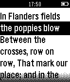</a>

<h2 class="app-name" id="app-545dea1211a9cda2c2000045"><a href="https://apps.repebble.com/545dea1211a9cda2c2000045">Flanders Field Poem</a></h2>
<a class="app-source" href="https://github.com/connorypebble/Flanders-Field-Poem" title="Source code" data-search-exclude>View source</a>

by <a href="https://apps.repebble.com/apps/dev/connor-jewiss_544b469dd68d8fe20a000045" title="More from this developer">Connor Jewiss</a>

Not checked yet v1.1 Updated 2014-11-08

Runs on: Time 2, Pebble 2 Duo, Pebble 2, Time, Classic

This is the original Flanders Field poem reformed as a pebble watchapp especially for Remembrance Day and the Royal British Legion. Support the fallen! Use website link below! It is a plain text…

<a class="app-shot" href="https://apps.repebble.com/bd6e3f6122b449188e8faebc" data-search-exclude>No screenshot</a>

<h2 class="app-name" id="app-bd6e3f6122b449188e8faebc"><a href="https://apps.repebble.com/bd6e3f6122b449188e8faebc">Flappy Pebble</a></h2>
<a class="app-source" href="https://github.com/coredevices/pebble-watchface-agent-skill" title="Source code" data-search-exclude>View source</a>

by <a href="https://apps.repebble.com/apps/dev/aircodum_67bc77bf37d408000a74f7d3" title="More from this developer">AirCodum</a>

Not checked yet v1.0.1 Updated 2026-04-14

Runs on: Time 2

Flappy Bird for your Pebble. Tap SELECT (or hold it) to flap through pipes. Gentle physics tuned for small-screen play, persistent high score.

<a class="app-shot" href="https://apps.repebble.com/6929da3470731e00092debea" data-search-exclude>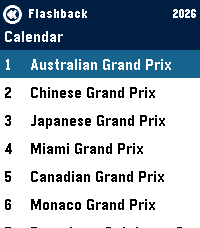</a>

<h2 class="app-name" id="app-6929da3470731e00092debea"><a href="https://apps.repebble.com/6929da3470731e00092debea">Flashback F1 Results</a></h2>
<a class="app-source" href="https://github.com/thementalgoose/pebble-flashback" title="Source code" data-search-exclude>View source</a>

by <a href="https://apps.repebble.com/apps/dev/jordan-fisher_5d482ff5d76b0f00018300f2" title="More from this developer">Jordan Fisher</a>

Not checked yet v2.2.0 Updated 2026-09-13

Runs on: Round 2, Time 2, Pebble 2 Duo, Pebble 2, Time Round, Time

Get info on the current F1 Formula 1 Season - Current calendar + weekend schedule in your local timezone - Timeline pins for each event per weekend - Drivers Standings - Team Standings

<h2 class="app-name" id="app-53ef6efd11cff6b7bd0000f7"><a href="https://apps.repebble.com/53ef6efd11cff6b7bd0000f7">Flashcards</a></h2>
<a class="app-source" href="https://github.com/magmapus/Flashcards" title="Source code" data-search-exclude>View source</a>

by <a href="https://apps.repebble.com/apps/dev/magmastone_52ee9e7ebf4b6279c500003f" title="More from this developer">MagmaStone</a>

Not checked yet v1.3 Updated 2014-08-18

Runs on: Time 2, Pebble 2 Duo, Pebble 2, Time, Classic

Flashcards lets you quiz yourself on the go! Have an upcoming test? Study on the way! Have a debate? Review your talking points. You can add all the questions and answers you want in the…

<a class="app-shot" href="https://apps.repebble.com/695cea36ccb618000951b01b" data-search-exclude>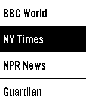</a>

<h2 class="app-name" id="app-695cea36ccb618000951b01b"><a href="https://apps.repebble.com/695cea36ccb618000951b01b">FlashRead News</a></h2>
<a class="app-source" href="https://github.com/Sichroteph/RSVP-Breaking-News" title="Source code" data-search-exclude>View source</a>

by <a href="https://apps.repebble.com/apps/dev/christophe-jeannette_54edf0599e4ff7cbf60000a0" title="More from this developer">Christophe Jeannette</a>

No licence v1.9 Updated 2026-01-12

Runs on: Time 2, Pebble 2 Duo, Pebble 2, Time, Classic

FlashRead News brings RSS feeds to your Pebble using RSVP (Rapid Serial Visual Presentation), a proven speed-reading technique that displays words one at a time, centered on the optimal…

<a class="app-shot" href="https://apps.repebble.com/cda79bd5a8184ab686b5cad3" data-search-exclude>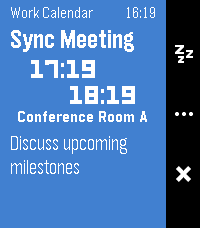</a>

<h2 class="app-name" id="app-cda79bd5a8184ab686b5cad3"><a href="https://apps.repebble.com/cda79bd5a8184ab686b5cad3">Flexible Alerts</a></h2>
<a class="app-source" href="https://github.com/elizagamedev/pebble-alerts" title="Source code" data-search-exclude>View source</a>

by <a href="https://apps.repebble.com/apps/dev/eliza_0554b97fa46644f68f1c3d55" title="More from this developer">Eliza</a>

Not checked yet v0.1.2 Updated 2026-07-19

Runs on: Time 2, Pebble 2 Duo, Pebble 2, Time

Show alerts for your Android calendars, contact birthdays, and anniversaries. Allows you to add reminders to subscribed calendars or events without built-in reminders, which is great for ICS…

<h2 class="app-name" id="app-55d3560c704e4657a3000013"><a href="https://apps.repebble.com/55d3560c704e4657a3000013">flicks</a></h2>
<a class="app-source" href="https://gitlab.com/n4ru/Flicks" title="Source code" data-search-exclude>View source</a>

by <a href="https://apps.repebble.com/apps/dev/n4ru_52c5a1cc0a89c8025a000049" title="More from this developer">n4ru</a>

Not checked yet v0.05 Updated 2016-12-13

Runs on: Time 2, Pebble 2 Duo, Pebble 2, Time, Classic

Introducing flicks - a watch app created to do whatever you want whenever you want - right on your wrist. flicks is a fully configurable and scriptable app that lets you quick launch anything on…

<a class="app-shot" href="https://apps.repebble.com/69065e8ace68bc0009859f49" data-search-exclude>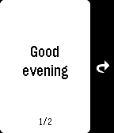</a>

<h2 class="app-name" id="app-69065e8ace68bc0009859f49"><a href="https://apps.repebble.com/69065e8ace68bc0009859f49">Flipcards</a></h2>
<a class="app-source" href="https://github.com/flipcards" title="Source code" data-search-exclude>View source</a>

by <a href="https://apps.repebble.com/apps/dev/ilia-breitburg_5bf5720a24bed3000188e5cd" title="More from this developer">Ilia Breitburg</a>

Not checked yet v1.1 Updated 2025-11-03

Runs on: Time 2, Pebble 2 Duo, Pebble 2, Time

Flashcards front-end to access Flipcards server.

<a class="app-shot" href="https://apps.repebble.com/565b8769de80b6c4c6000010" data-search-exclude>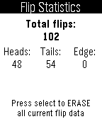</a>

<h2 class="app-name" id="app-565b8769de80b6c4c6000010"><a href="https://apps.repebble.com/565b8769de80b6c4c6000010">Flipple - Flip a Coin</a></h2>
<a class="app-source" href="https://github.com/TheJsh/Flipple" title="Source code" data-search-exclude>View source</a>

by <a href="https://apps.repebble.com/apps/dev/joshua-chen_5592e6c56a07c8417a000077" title="More from this developer">Joshua Chen</a>

No licence v2.0 Updated 2016-01-02

Runs on: Time 2, Pebble 2 Duo, Pebble 2, Time, Classic

Flip a coin to avoid making decisions! Flip with a wrist flick, pressing the select button, or quick launching the app. If you want to do instant flips, press the down button. Change the settings…

<a class="app-shot" href="https://apps.repebble.com/4a1c9ef57e924ac596115328" data-search-exclude>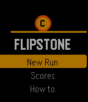</a>

<h2 class="app-name" id="app-4a1c9ef57e924ac596115328"><a href="https://apps.repebble.com/4a1c9ef57e924ac596115328">Flipstone</a></h2>
<a class="app-source" href="https://github.com/weagertron/Flipstone" title="Source code" data-search-exclude>View source</a>

by <a href="https://apps.repebble.com/apps/dev/weagertron_25c36dd83a6ff41985255a8a" title="More from this developer">Weagertron</a>

Not checked yet v1.0 Updated 2026-04-18

Runs on: Time 2, Time

Flipstone is a roguelike built for the Pebble Time smartwatch, where every combat turn resolves with a coin flip. Heads deals damage, tails misses, and a rare edge landing crits for double…

<a class="app-shot" href="https://apps.repebble.com/564c2acda9379f613e000044" data-search-exclude>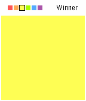</a>

<h2 class="app-name" id="app-564c2acda9379f613e000044"><a href="https://apps.repebble.com/564c2acda9379f613e000044">Flood</a></h2>
<a class="app-source" href="https://github.com/dainglis/flood-pebble-time" title="Source code" data-search-exclude>View source</a>

by <a href="https://apps.repebble.com/apps/dev/david-inglis_55b155f7d534109a520000a9" title="More from this developer">David Inglis</a>

Not checked yet v1.0 Updated 2016-04-12

Runs on: Time 2, Time

Fill the board in as few moves as possible. Use the up and down buttons to change colors, and use select to pick. You have 26 moves to fill the board, or else it&#x27;s game over!

<a class="app-shot" href="https://apps.repebble.com/57b3722fbb85eddc98000636" data-search-exclude>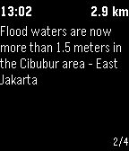</a>

<h2 class="app-name" id="app-57b3722fbb85eddc98000636"><a href="https://apps.repebble.com/57b3722fbb85eddc98000636">FloodWatch</a></h2>
<a class="app-source" href="https://github.com/smart-facility/cognicity-floodwatch" title="Source code" data-search-exclude>View source</a>

by <a href="https://apps.repebble.com/apps/dev/tomas-holderness_55ab352bfac4300252000048" title="More from this developer">Tomas Holderness</a>

Not checked yet v0.5 Updated 2019-07-24

Runs on: Time 2, Pebble 2 Duo, Pebble 2, Time, Classic

On-Hand Flood Alerts FloodWatch is a Pebble app that shows nearby reports of flooding in Jakarta, Indonesia. Reports are collected from the open source flood map PetaJakarta.org. The app lists…

<a class="app-shot" href="https://apps.repebble.com/e20547568e884f868586e419" data-search-exclude>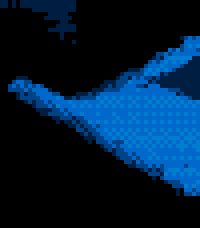</a>

<h2 class="app-name" id="app-e20547568e884f868586e419"><a href="https://apps.repebble.com/e20547568e884f868586e419">Fluid Sim</a></h2>
<a class="app-source" href="https://github.com/quantumwaffles/pebble-fluid-sim" title="Source code" data-search-exclude>View source</a>

by <a href="https://apps.repebble.com/apps/dev/michael-rex_344769cd96b2f953c9a9f56c" title="More from this developer">Michael Rex</a>

Not checked yet v1.0.1 Updated 2026-05-31

Runs on: Round 2, Time 2, Pebble 2 Duo, Pebble 2, Time Round, Time, Classic

Fluid Sim runs a real-time Navier–Stokes fluid solver on your Pebble. Dye is advected through a velocity field with diffusion and incompressible projection, producing continuous swirling…

<h2 class="app-name" id="app-1f02276078b84a2e861d9e40"><a href="https://apps.repebble.com/1f02276078b84a2e861d9e40">Flynformer</a></h2>
<a class="app-source" href="https://github.com/dysseus-pascal/Flynformer" title="Source code" data-search-exclude>View source</a>

by <a href="https://apps.repebble.com/apps/dev/dysseus_d55366949234e464067ed224" title="More from this developer">dysseus</a>

Not checked yet v0.7.0 Updated 2026-09-24

Runs on: Round 2, Time 2, Pebble 2 Duo

Type the flight number on the watch. No hunting through the phone app: two letters, up to four digits, done. It stays until you change it. Meet Flyn — your flight companion. Three pages, in the…

<a class="app-shot" href="https://apps.repebble.com/5498fac473268fc7d4000077" data-search-exclude>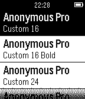</a>

<h2 class="app-name" id="app-5498fac473268fc7d4000077"><a href="https://apps.repebble.com/5498fac473268fc7d4000077">Fontastic</a></h2>
<a class="app-source" href="http://github.com/fidian/pebble-fontastic" title="Source code" data-search-exclude>View source</a>

by <a href="https://apps.repebble.com/apps/dev/tyler-akins_5494f3191a0bb14ead000060" title="More from this developer">Tyler Akins</a>

MIT v1.3 Updated 2014-12-28

Runs on: Time 2, Pebble 2 Duo, Pebble 2, Time, Classic

Preview how fonts are displayed on the Pebble. Aimed at developers with the goal of helping them decide if their app should use a built-in font or one of the more popular custom fonts. Includes…

<a class="app-shot" href="https://apps.repebble.com/5409b7c7954a63bd410000a0" data-search-exclude>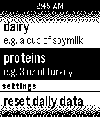</a>

<h2 class="app-name" id="app-5409b7c7954a63bd410000a0"><a href="https://apps.repebble.com/5409b7c7954a63bd410000a0">food baby</a></h2>
<a class="app-source" href="https://github.com/cheniel/food-baby" title="Source code" data-search-exclude>View source</a>

by <a href="https://apps.repebble.com/apps/dev/cheniel_537e98677539d09e5000004c" title="More from this developer">cheniel</a>

Not checked yet v1.0 Updated 2014-09-05

Runs on: Time 2, Pebble 2 Duo, Pebble 2, Time, Classic

Part-nutritionist, part-digital pet, Food Baby&#x27;s goal is to motivate healthy dietary choices through the raising of a virtual pet. As such, your healthy habits translate to both your well-being…

<h2 class="app-name" id="app-5850eef977324bb64b0004fb"><a href="https://apps.rebble.io/en_US/application/5850eef977324bb64b0004fb">Forbidden Love</a></h2>
<a class="app-source" href="https://github.com/gameblabla/forbidden_love" title="Source code" data-search-exclude>View source</a>

by <a href="https://apps.rebble.io/en_US/developer/584d5e32ce45dc907d000209/1" title="More from this developer">gameblabla</a>

Not checked yet v1.0 Updated 2016-12-14 Rebble App Store

Runs on: Time 2, Pebble 2 Duo, Pebble 2, Time, Classic

Watch as two men discover the true meaning of life. (yes, it is very philosophical)

<a class="app-shot" href="https://apps.repebble.com/bf411784b2584f118a4035d0" data-search-exclude>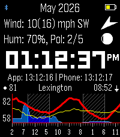</a>

<h2 class="app-name" id="app-bf411784b2584f118a4035d0"><a href="https://apps.repebble.com/bf411784b2584f118a4035d0">ForeCasWatCompanion</a></h2>
<a class="app-source" href="https://github.com/the-static/forcaswatch3" title="Source code" data-search-exclude>View source</a>

by <a href="https://apps.repebble.com/apps/dev/midnight-clocksmith_db7063815e3392824cc53a3e" title="More from this developer">Midnight Clocksmith</a>

Not checked yet v1.34.6 Updated 2026-09-24

Runs on: Time 2

I made a version of the forecaswatch2 watchface that runs as an app, so you can interact with it and have different info. I found that binding the app to a quicklaunch button helps it feel like a…

<a class="app-shot" href="https://apps.repebble.com/54320b0b106a8c3b05000064" data-search-exclude>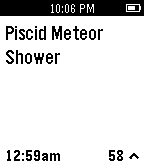</a>

<h2 class="app-name" id="app-54320b0b106a8c3b05000064"><a href="https://apps.repebble.com/54320b0b106a8c3b05000064">Forekast</a></h2>
<a class="app-source" href="https://github.com/mcongrove/ForekastPebble" title="Source code" data-search-exclude>View source</a>

by <a href="https://apps.repebble.com/apps/dev/mcongrove_52affc34e2187058f9000011" title="More from this developer">mcongrove</a>

Not checked yet v1.0 Updated 2014-10-06

Runs on: Time 2, Pebble 2 Duo, Pebble 2, Time, Classic

Get today&#x27;s Forekast events right on your wrist. Forekast is a calendar of amazing events happening worldwide, posted and voted on by an international community. Music festivals, rocket launches…

<a class="app-shot" href="https://apps.repebble.com/5339efd74eada6fede0000ef" data-search-exclude>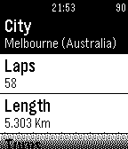</a>

<h2 class="app-name" id="app-5339efd74eada6fede0000ef"><a href="https://apps.repebble.com/5339efd74eada6fede0000ef">Formula 1 2014</a></h2>
<a class="app-source" href="https://github.com/PabloLlosa/FormulaOne2014Pebble" title="Source code" data-search-exclude>View source</a>

by <a href="https://apps.repebble.com/apps/dev/pablo-s-guin-llos_52f28cb488113476a3001720" title="More from this developer">Pablo Séguin Llosá</a>

No licence v1.0 Updated 2014-05-03

Runs on: Time 2, Pebble 2 Duo, Pebble 2, Time, Classic

Formula One 2014: Simple app to know all about this season Grand Prix. Coming soon: -Info about drivers. -Info about teams. -Live race results. -Much more.

<a class="app-shot" href="https://apps.repebble.com/5305c47421336c693500016a" data-search-exclude>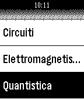</a>

<h2 class="app-name" id="app-5305c47421336c693500016a"><a href="https://apps.repebble.com/5305c47421336c693500016a">Formule</a></h2>
<a class="app-source" href="https://github.com/Adrenocortico/PebbleFormulas" title="Source code" data-search-exclude>View source</a>

by <a href="https://apps.repebble.com/apps/dev/adrenocortico_52b93f2ba1d2dfd76500003f" title="More from this developer">Adrenocortico</a>

Unlicense v1.4 Updated 2015-05-27

Runs on: Time 2, Pebble 2 Duo, Pebble 2, Time, Classic

Based on PebbleFormulas it&#x27;s a quick and useful way to access to a many and always new formulas of Algebra, Geometry, Calculus, Trigonometry, Biology, Physics, Chemistry e le Conversion. In…

<h2 class="app-name" id="app-546884448103a24f52000094"><a href="https://apps.repebble.com/546884448103a24f52000094">Franponator</a></h2>
<a class="app-source" href="https://github.com/pinkguy/franponator" title="Source code" data-search-exclude>View source</a>

by <a href="https://apps.repebble.com/apps/dev/martin_53150ee91b1a0e1232000290" title="More from this developer">Martin</a>

Not checked yet v1.0 Updated 2014-11-16

Runs on: Time 2, Pebble 2 Duo, Pebble 2, Time, Classic

Générateur de Franponais, La langue française est très utilisée comme décoration au Japon. Retrouvez ici un générateur qui se chargera de faire cette dure besogne pour vous.

<a class="app-shot" href="https://apps.repebble.com/573462bdf68e7b0562000010" data-search-exclude>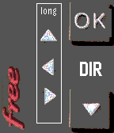</a>

<h2 class="app-name" id="app-573462bdf68e7b0562000010"><a href="https://apps.repebble.com/573462bdf68e7b0562000010">Freebox Telec</a></h2>
<a class="app-source" href="https://github.com/jpb31/PeebleFreeboxTelec" title="Source code" data-search-exclude>View source</a>

by <a href="https://apps.repebble.com/apps/dev/jpb31_571a16c9374e295d4f000012" title="More from this developer">jpb31</a>

Not checked yet v1.0 Updated 2016-08-29

Runs on: Time 2, Time

Remote for French Freebox Revolution player Télécommande Freebox Revolution 3 modes : Volume, Programme, et Pavé directionnel (SELECT pour permuter) Appuis long : Play/pause, Marche/Arrêt, Muet…

<a class="app-shot" href="https://apps.repebble.com/a216163b4af54f9f8b834fdb" data-search-exclude>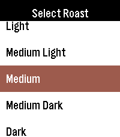</a>

<h2 class="app-name" id="app-a216163b4af54f9f8b834fdb"><a href="https://apps.repebble.com/a216163b4af54f9f8b834fdb">French Press Buddy</a></h2>
<a class="app-source" href="https://github.com/zackdolsen/FrenchPressBuddy" title="Source code" data-search-exclude>View source</a>

by <a href="https://apps.repebble.com/apps/dev/zman441_552186344c872d0a9000005e" title="More from this developer">zman441</a>

Not checked yet v2.1 Updated 2026-08-03

Runs on: Round 2, Time 2, Pebble 2 Duo, Pebble 2, Time Round, Time, Classic

French Press Buddy is a simple, easy to use app to help you create the best French press coffee you can in 3 easy steps! Features: - Support for 5 different roasts of coffee - Calculates how much…

<a class="app-shot" href="https://apps.repebble.com/21268740bc164e18907f66b8" data-search-exclude>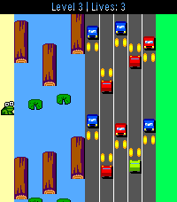</a>

<h2 class="app-name" id="app-21268740bc164e18907f66b8"><a href="https://apps.repebble.com/21268740bc164e18907f66b8">Froggle</a></h2>
<a class="app-source" href="https://github.com/Andrew129260/Froggle" title="Source code" data-search-exclude>View source</a>

by <a href="https://apps.repebble.com/apps/dev/andrew129260_d443835b77205f3b7e2f01c9" title="More from this developer">Andrew129260</a>

GPL-3.0 v5.0.6 Updated 2026-09-23

Runs on: Round 2, Time 2, Pebble 2 Duo, Pebble 2, Time Round, Time, Classic

Frogger, but for Pebble! Multiple challenging levels, which get faster as it goes... Can you dodge the cars and hop those logs? You get an extra life for each level you complete.. Good luck!…

<a class="app-shot" href="https://apps.repebble.com/82fc69b2d0964fe28e2520c3" data-search-exclude>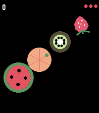</a>

<h2 class="app-name" id="app-82fc69b2d0964fe28e2520c3"><a href="https://apps.repebble.com/82fc69b2d0964fe28e2520c3">Fruit Chop</a></h2>
<a class="app-source" href="https://github.com/qichuan/pebble-fruit-chop" title="Source code" data-search-exclude>View source</a>

by <a href="https://apps.repebble.com/apps/dev/zhang-qichuan_53043485117485c22f0000cf" title="More from this developer">Zhang Qichuan</a>

Not checked yet v1.3.0 Updated 2026-08-08

Runs on: Round 2, Time 2

Swipe across the screen to slice the fruit — just watch out for the bombs. That&#x27;s all it takes to play Fruit Chop, a fast, fun fruit-slicing game built right for your wrist. This game needs a…

<h2 class="app-name" id="app-474369d065a54770b5afaa7e"><a href="https://apps.repebble.com/474369d065a54770b5afaa7e">FT Capture</a></h2>
<a class="app-source" href="https://github.com/Arwalk/pebble-facilethings-capture" title="Source code" data-search-exclude>View source</a>

by <a href="https://apps.repebble.com/apps/dev/arwalk_ef40a75448a8814a6d6b7ab7" title="More from this developer">Arwalk</a>

No licence v1.0.1 Updated 2026-09-01

Runs on: Time 2

Quick capture using the microphone for FacileThings

<a class="app-shot" href="https://apps.repebble.com/54a06048d819e546e6000135" data-search-exclude>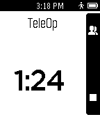</a>

<h2 class="app-name" id="app-54a06048d819e546e6000135"><a href="https://apps.repebble.com/54a06048d819e546e6000135">FTC Match Timer</a></h2>
<a class="app-source" href="https://github.com/i2robotics/pebble-ftc-timer" title="Source code" data-search-exclude>View source</a>

by <a href="https://apps.repebble.com/apps/dev/alex-davis_53168833e9e0b54c45000266" title="More from this developer">Alex Davis</a>

Not checked yet v1.1 Updated 2015-02-09

Runs on: Time 2, Pebble 2 Duo, Pebble 2, Time, Classic

Use your wrist when doing match practice! This app, designed for the FIRST Tech Challenge robotics competition, is basically a countdown timer customized for running FTC Matches. Features: …

<a class="app-shot" href="https://apps.repebble.com/3be6709f07634c0d9f9674a1" data-search-exclude>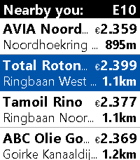</a>

<h2 class="app-name" id="app-3be6709f07634c0d9f9674a1"><a href="https://apps.repebble.com/3be6709f07634c0d9f9674a1">FuelWatch</a></h2>
<a class="app-source" href="https://github.com/Moaske/PebbleFuelWatch" title="Source code" data-search-exclude>View source</a>

by <a href="https://apps.repebble.com/apps/dev/moaske_3f1bf0845ffec82a2a96f91c" title="More from this developer">Moaske</a>

No licence v1.2.1 Updated 2026-09-14

Runs on: Time 2, Pebble 2 Duo, Pebble 2, Time

A Pebble nearby fuel station finder for Europe with price check, which kindly and gratefully uses the ANWB© fuel prices api. Watch compatibilty: Basalt, Diorite, Emery and Flint. Features: ⛽ Main…

<a class="app-shot" href="https://apps.repebble.com/0c2054e85055424aae83ff94" data-search-exclude>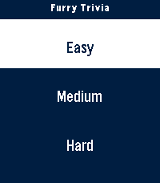</a>

<h2 class="app-name" id="app-0c2054e85055424aae83ff94"><a href="https://apps.repebble.com/0c2054e85055424aae83ff94">Furry Trivia</a></h2>
<a class="app-source" href="https://github.com/Furchee/Furry-Trivia" title="Source code" data-search-exclude>View source</a>

by <a href="https://apps.repebble.com/apps/dev/furchee_1bb35cbb1c9e9aa2b06fb7d0" title="More from this developer">Furchee</a>

No licence v1.1.0 Updated 2026-09-03

Runs on: Round 2, Time 2, Pebble 2 Duo, Pebble 2, Time Round, Time, Classic

A simple trivia game pertaining to the furry fandom! Play it alone or with friends and test your knowledge. I&#x27;ve tested the ability to play this on round screens and I believe I&#x27;ve done a good job…

<a class="app-shot" href="https://apps.repebble.com/5566a0df8c932249a4000014" data-search-exclude>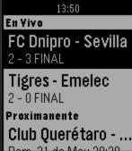</a>

<h2 class="app-name" id="app-5566a0df8c932249a4000014"><a href="https://apps.repebble.com/5566a0df8c932249a4000014">Futbolive</a></h2>
<a class="app-source" href="https://github.com/marcomedina/futbolive-pebble" title="Source code" data-search-exclude>View source</a>

by <a href="https://apps.repebble.com/apps/dev/marco-medina_52f01d0d6fc2c07858000405" title="More from this developer">Marco Medina</a>

Not checked yet v1.1 Updated 2015-05-28

Runs on: Time 2, Pebble 2 Duo, Pebble 2, Time, Classic

Soccer Live Results / Resultados de Futbol en Vivo Liga Mx, Libertadores, La Liga

