<!-- Generated by scripts/update_app_directory.py: do not edit by hand -->
# Watchapps: G

[← About this list](../watchapps.md) · [A](a.md) · [B](b.md) · [C](c.md) · [D](d.md) · [E](e.md) · [F](f.md) · **G** · [H](h.md) · [I](i.md) · [J](j.md) · [K](k.md) · [L](l.md) · [M](m.md) · [N](n.md) · [O](o.md) · [P](p.md) · [Q](q.md) · [R](r.md) · [S](s.md) · [T](t.md) · [U](u.md) · [V](v.md) · [W](w.md) · [X](x.md) · [Y](y.md) · [Z](z.md) · [0–9 & other](other.md)

*49 watchapps · Last updated 2026-10-06*

| Screenshot | Name | Developer | Licence | Updated | Description |
|------------|------|-----------|---------|---------|-------------|
| 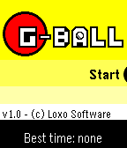{ loading=lazy width="72" } | [G-Ball](https://apps.rebble.io/en_US/application/67cb281cd2acb301fae26e13) <small>Rebble App Store</small> | [Loxo Software](https://github.com/LoxoSoftware/G-Ball/tree/master) | <small>Not checked yet</small> | 2025-03-18 | G-Ball is an action game where you move the ball by tilting your Pebble. Advance trough the levels and avoid dangers, all by tilting your wrist! Submitted… |
| 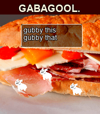{ loading=lazy width="72" } | [Gabagool.](https://apps.repebble.com/17059a2b6e774b40a7254b83) | [h3nry](https://github.com/HenryTheAddict/GabagoolPebble) | <small>No licence</small> | 2026-07-16 | Gabagool. featuring. the plexer JP as seen on CloudPebble (sorry guys) |
| 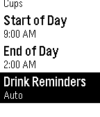{ loading=lazy width="72" } | [Gallon Challenge](https://apps.repebble.com/54f15dacbc88dfd03d000028) | [Jessica Yeh](https://github.com/JessicaYeh/pebble-gallon-challenge) | <small>No licence</small> | 2016-03-09 | Challenge yourself to drink more water for better health! Health experts recommend drinking at least a half gallon (8 cups) of water every day. Drinking… |
| 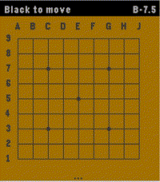{ loading=lazy width="72" } | [Game of Go](https://apps.repebble.com/35ad80179c4145118edca560) | [igrek51](https://github.com/igrek51/pebble-game-of-go) | <small>Not checked yet</small> | 2026-09-19 | This app brings the game of Go / Baduk / Weiqi to the Pebble Time 2 with a fast, fully-featured engine and a polished interface. Go is the ultimate mental… |
| 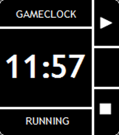{ loading=lazy width="72" } | [GameClock (American Football)](https://apps.rebble.io/en_US/application/58b20b3e0dfc320dc600090e) <small>Rebble App Store</small> | [Michael Krenn](https://github.com/wiesel81/pebble-gameclock) | <small>Not checked yet</small> | 2017-03-07 | Gameclock for American Football officials working as on-field timekeeper based on the NCAA Rules 2016. With this watchapp it is possible to operate the… |
| 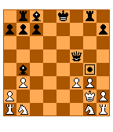{ loading=lazy width="72" } | [Games for Pebble](https://apps.repebble.com/54f65e8a13cdff61490000b6) | [Sawyer Vaughan](https://github.com/runnersaw/pebble-games) | <small>Not checked yet</small> | 2016-10-29 | The best games app for Pebble! A collection of addicting games to waste a few minutes whenever you need to. |
| 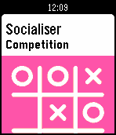{ loading=lazy width="72" } | [Gamification Elements](https://apps.repebble.com/55deed717436e680cc000019) | [Andrzej Marczewski](https://github.com/daverage/pebbleCards) | <small>Not checked yet</small> | 2015-08-27 | This is a simple app for aimed at those interested in gamification. It displays random gamification elements and mechanics from the Gamified UK Gamification… |
| 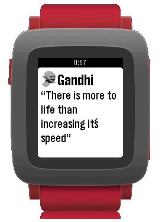{ loading=lazy width="72" } | [Gandhi](https://apps.repebble.com/56885fb8fd4a39ba4d00004b) | [Carleson](https://github.com/carleson/Gandhi) | <small>Not checked yet</small> | 2016-01-02 | Gandhi is a simple application that will generate random Gandhi quotes for the Pebble watch. It´s possible to configure behavior, textcolors, background… |
| 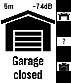{ loading=lazy width="72" } | [Garadget Controller](https://apps.repebble.com/5717624b39001518cf000012) | [Peter Summers](http://web.aanet.com.au/~summersfamily/garadget_controller_(1.3).zip) | <small>See source</small> | 2017-01-07 | Remote control for the Garadget garage door controller. Shows door state, time since last change and wifi signal strength. Controls are as follows: Up: open… |
| 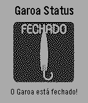{ loading=lazy width="72" } | [Garoa Status](https://apps.repebble.com/57cb37adbe5ad0936b000201) | [Amora Labs](http://github.com/soapdog/pebble-garoa-hacker-clube-status) | <small>No licence</small> | 2016-09-03 | Application in Portuguese This application shows if the famous hackerspace "Garoa Hacker Clube" is open or closed. Portuguese: Esse app mostra se o… |
| 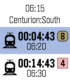{ loading=lazy width="72" } | [Gautrain Commuter](https://apps.rebble.io/en_US/application/598846a5461a8d1889000af3) <small>Rebble App Store</small> | [Loubser Kotzé](https://bitbucket.org/loubser/gautrain-commuter) | <small>See source</small> | 2017-10-16 | Gautrain commuters. Tired of just missing the last train or raced to the train station just to find the next train is only departing in 30 minutes? Select… |
| 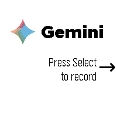{ loading=lazy width="72" } | [Gemini Voice & Text](https://apps.repebble.com/cc4b971bf63c427d8870e526) | [Eric McCormick](https://github.com/ericlmccormick/Pebble_Gemini) | <small>Not checked yet</small> | 2026-08-22 | This app turns your Pebble Time 2 into a fully functional conversational assistant using Google's Gemini with model and voice selection. If you enjoy what I… |
| { loading=lazy width="72" } | [Generate Token](https://apps.rebble.io/en_US/application/5d9ac26dc393f54d6b5f5445) <small>Rebble App Store</small> | [Willow Systems](https://github.com/Willow-Systems/pebble-generate-token/) | <small>Not checked yet</small> | 2019-10-07 | Simply generate a rebble timeline token for use with services that require it. Once you have run the watchapp, open the app settings on your phone to easily… |
| 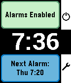{ loading=lazy width="72" } | [Gentle Wake (Daily Smart Alarm Clock with Sleep Monitoring)](https://apps.repebble.com/546047390db50db6e100002b) | [SeaPea Software](https://github.com/SeaPea/GentleWake) | <small>Not checked yet</small> | 2016-10-08 | - Alarms for each day of the week - Smart Alarm attempts to wake you if it detects you stirring shortly before the alarm time, which is the Monitor Period… |
| 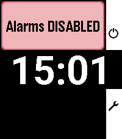{ loading=lazy width="72" } | [Gentle Wake Plus - Daily Smart Alarm Clock](https://apps.repebble.com/6ac26e83b95ba200094d50e8) | [astosia](https://github.com/astosia/GentleWake) | <small>Not checked yet</small> | 2026-10-04 | Evolution of the excellent original by SeaPea software This version adds: - Native Layouts for PT2 and PR2 - Alarm Sounds for PT2 and P2Duo - multiple… |
| 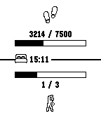{ loading=lazy width="72" } | [Get active!](https://apps.repebble.com/67cab3bad2acb301fae26dee) | [Dscheinah](https://github.com/dscheinah/get-active-pebble) | <small>Not checked yet</small> | 2025-06-03 | This app helps you to reach your health goals. It can be configured to notify you: - If you didn't spent enough time active within the last hour - If you… |
| 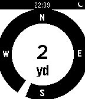{ loading=lazy width="72" } | [Get Back - directions to a set location](https://apps.repebble.com/52cae46a6126ce093f000064) | [Samuel](https://github.com/samuelmr/pebble-getback) | <small>Not checked yet</small> | 2015-02-13 | This app shows you distance and heading to a stored location. Find your way back from the wilderness - or simply find your parked car! You can also measure… |
| 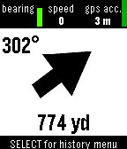{ loading=lazy width="72" } | [Get Back in Time](https://apps.repebble.com/553329021b2b662f5b000069) | [Samuel](https://github.com/samuelmr/pebble-getbackintime) | <small>Not checked yet</small> | 2016-10-28 | Save your locations to the Pebble Timeline. See where you have been and when. Choose a location you want to return to. Your Pebble will show you the compass… |
| 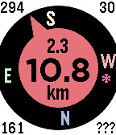{ loading=lazy width="72" } | [Get Back To](https://apps.repebble.com/550bf37f1e540c856300005e) | [Peter Summers](http://web.aanet.com.au/~summersfamily/get_back_to_(5.17).zip) | <small>See source</small> | 2019-07-24 | Get back to a previous location, or go to one selected from your list of favorites - built on the original by samualmr but now shows GPS accuracy, bearing… |
| 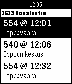{ loading=lazy width="72" } | [Get Bus - HSL stops](https://apps.repebble.com/53ed0a2367c0df00930000ea) | [Samuel](https://github.com/samuelmr/pebble-getbus) | <small>Not checked yet</small> | 2016-10-18 | Näe silmäyksellä lähimmät pysäkit ja seuraavat lähdöt. Lisää pysäkkejä suosikkeihin. Tarkastele pysäkkiaikatauluja. Katso kävelyohjeet pysäkille. English… |
| { loading=lazy width="72" } | [getme for Pebble](https://apps.repebble.com/6f7de6d295fa464aa9bc7ab8) | [tylxr](https://github.com/tylxr59/getme-for-pebble) | <small>Not checked yet</small> | 2026-05-27 | Keep your self-hosted getme grocery list on your wrist. getme for Pebble brings a fast, button-first checklist experience to Pebble, backed by your own… |
| 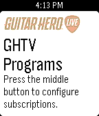{ loading=lazy width="72" } | [GHTV Programming](https://apps.repebble.com/569fdfd070f369f70f000052) | [Chase Peeler](https://github.com/chasepeeler/GHLivePrograms) | <small>Not checked yet</small> | 2016-04-19 | Get the GHTV schedule on your timeline! Subscribe to different categories and get notifications before programs in those categories begin. *Categories are… |
| 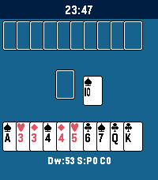{ loading=lazy width="72" } | [Gin Rummy](https://apps.repebble.com/cfb6e6458ce640bf9576c3e1) | [tc5206](https://github.com/tc5206/pebble_GIN_RUMMY) | <small>Not checked yet</small> | 2026-04-19 | A Gin Rummy game built with Gemini. Great for a quick break. Some rules may vary from the original. Thanks for understanding. |
| 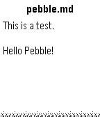{ loading=lazy width="72" } | [Gist Reader](https://apps.repebble.com/9b0dacec26c041f688e85e78) | [Dennis Muensterer](https://github.com/dnnsmnstrr/pebble-gist-reader) | <small>Not checked yet</small> | 2026-04-25 | Access GitHub Gists on your wrist! - Simple configuration with just a Gist ID - Support for multiple files in one Gist |
| 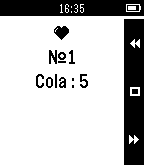{ loading=lazy width="72" } | [Go Shopping!](https://apps.rebble.io/en_US/application/553910898ee8449913000005) <small>Rebble App Store</small> | [Pavel Tsybulin](https://github.com/tsybulin/pebble-goshopping) | <small>Not checked yet</small> | 2015-05-14 | Companion app, which allows you to display and manage the current grocery list. |
| 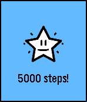{ loading=lazy width="72" } | [Goal Star](https://apps.repebble.com/56a727ff6178cf2f01000020) | [Kevin Conley](https://github.com/kevincon/goal_star) | <small>Not checked yet</small> | 2016-08-13 | A simple Pebble app that lets you set a daily health goal and get notified with vibrations and a popup when you reach it. Goal Star runs in the background… |
| 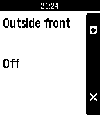{ loading=lazy width="72" } | [Gogomba](https://apps.repebble.com/530bf25cd3b64223fa000059) | [Scardiecat](https://bitbucket.org/magicmoose/gogomba/) | <small>See source</small> | 2017-03-04 | Remotely control you home from you Pebble. Communicates with your ISY-994i controller to control scenes and devices. |
| 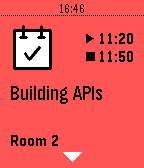{ loading=lazy width="72" } | [GolangUK 2015](https://apps.repebble.com/55c0b811718511f23900002e) | [Grimborg](http://github.com/grimborg/pebble-golanguk2015) | GPL-3.0 | 2015-08-08 | The schedule of GolangUK 2015 on your wrist! Timeline support: 24h before the conference starts the sessions will appear in your timeline. |
| 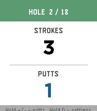{ loading=lazy width="72" } | [Golf Score](https://apps.repebble.com/d1ab3c97db27469386546977) | [Mike Eberlein](https://git.mikeeberlein.com/meberlein/PebbleGolfScore) | <small>See source</small> | 2026-05-25 | An app to track golf score (strokes and putts) Open source here: https://git.mikeeberlein.com/meberlein/PebbleGolfScore/src/branch/master |
| 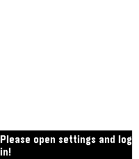{ loading=lazy width="72" } | [GoogleTasks for Pebble](https://apps.repebble.com/52b1fc07cd41830cc200001e) | [Semyon Maryasin](http://github.com/MarSoft/PebbleNotes) | MIT | 2026-04-30 | Browse all your ToDo lists (from GoogleTasks) right on your wrist! Task notes are supported too. You can also mark tasks as Done. You will no longer need to… |
| 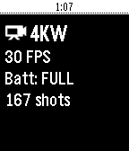{ loading=lazy width="72" } | [GoPro Remote](https://apps.repebble.com/57ef907a05e4b17e1c000186) | [Konrad Iturbe](http://github.com/konradit/HEROPebble) | <small>No licence</small> | 2021-01-30 | A GoPro Remote for Pebble. Works with: - (Partially) GoPro HERO3 and HERO3+ - GoPro HERO4 Black/Silver - GoPro HERO4 Session - GoPro HERO5 Black/Session … |
| 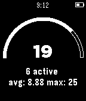{ loading=lazy width="72" } | [GoSquared for Pebble](https://apps.repebble.com/542dacf814cfa3607c0002ad) | [Robb Lewis](https://github.com/rmlewisuk/gosquared-for-pebble) | <small>Not checked yet</small> | 2025-12-01 | See GoSquared current visitors directly from your Pebble. See current and active visitors as well as 7 day average and highest. |
| 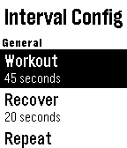{ loading=lazy width="72" } | [GoSy Run](https://apps.repebble.com/52dac915889f5d8253000261) | [Marcus Gotling](https://github.com/gotling/GoSy-Run) | <small>Not checked yet</small> | 2016-11-15 | Helps you exercise running. - Interval timer with extended rest, warm up and cool down - Ladder timer - Stretch timer with 8 exercises |
| 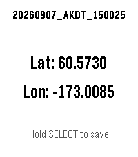{ loading=lazy width="72" } | [GPS Memo](https://apps.repebble.com/d63277af0da045f98518baef) | [Fefe-Vernius](https://github.com/Fefe-Vernius/GPS-Memo) | <small>No licence</small> | 2026-09-08 | Save a GPS coordinate with a timestamp, right from your wrist. GPS Memo shows your current latitude and longitude on screen — hold the SELECT button to log… |
| 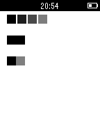{ loading=lazy width="72" } | [Gradient test](https://apps.repebble.com/5468f5f4ecee199897000011) | [Svitlana Tsymbaliuk](https://github.com/svitlanatsymbaliuk/Gradient) | <small>Not checked yet</small> | 2014-11-16 | This test app shows how B/W screen can display gradient colors. There is no magic because Pebble screen can be updated up to 60 times in a second. |
| 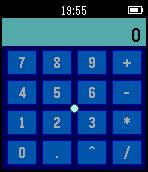{ loading=lazy width="72" } | [GravCalc](https://apps.repebble.com/54afb90f413f38e0f8000054) | [Wojciech 'vifon' Siewierski](https://github.com/Vifon/GravCalc) | <small>Not checked yet</small> | 2015-05-08 | Accelerometer-based calculator with RPN (reverse Polish notation). Move the cursor by tilting your hand. IMPORTANT: Because it uses RPN, to calculate 1+1… |
| 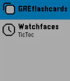{ loading=lazy width="72" } | [GRE Flashcards](https://apps.rebble.io/en_US/application/65a3d950e46ef105779235d4) <small>Rebble App Store</small> | [ankithreddy](https://github.com/ankithreddypati/GREFlashcards) | <small>Not checked yet</small> | 2024-01-14 | GRE Flashcards is a learning app designed for Pebble smartwatches for GRE examination. It provides an interactive and convenient way for users to enhance… |
| 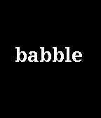{ loading=lazy width="72" } | [GRE Reminder (with Chinese translation)](https://apps.repebble.com/577b62526c21040179000074) | [Yanda Huang](https://github.com/yodahuang/Pebble-GRE-Word-Reminder) | <small>Not checked yet</small> | 2016-07-05 | An app for Chinese users to recite GRE words for conveniently. |
| 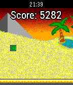{ loading=lazy width="72" } | [Greeney's Run](https://apps.repebble.com/554f9adb4e604b9ed3000071) | [Thomas Neff](https://github.com/thomasneff/GreeneysRun) | <small>Not checked yet</small> | 2019-07-24 | Greeney's Run is a procedurally generated endless running game, which is perfect for short amounts of time. Jump and run your way through segments of… |
| 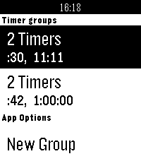{ loading=lazy width="72" } | [Grouped Timers](https://apps.rebble.io/en_US/application/58f985730dfc329fda001649) <small>Rebble App Store</small> | [spencewenski](https://gitlab.com/spencewenski/pebble_grouped_timers) | <small>Not checked yet</small> | 2018-03-17 | Now supports - French, Spanish, German, Italian, and Portuguese This is a timer app that allows you to group timers into lists. Timer groups can be set to… |
| 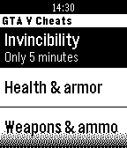{ loading=lazy width="72" } | [GTA V Cheats](https://apps.repebble.com/52da8d31227cbe9cb800012c) | [David Román](http://github.com/Dromaguirre/GTAVCheatsForPebble) | <small>No licence</small> | 2014-01-18 | A really simple watchapp that allows you to quickly access any GTA V cheat (PS3). |
| 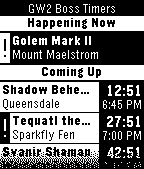{ loading=lazy width="72" } | [GW2 Boss Timers](https://apps.repebble.com/5361b1a97ca4c8ba5e00003e) | [ZDBioHazard](https://github.com/ZDBioHazard/pebble-gw2bosses) | <small>Not checked yet</small> | 2014-07-09 | This app displays a simple list of timers for the next several world boss events in Guild Wars 2. No Internet connection required. Uses the schedule… |
| 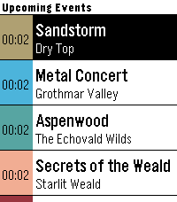{ loading=lazy width="72" } | [GW2 Event Timers](https://apps.repebble.com/69e16008fb8025000832dd2b) | [Reiner Herrmann](https://codeberg.org/reinerh/pebble-gw2et) | <small>See source</small> | 2026-09-20 | Pebble app that displays upcoming ingame events in Guild Wars 2. |
| 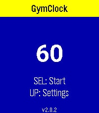{ loading=lazy width="72" } | [GymClock](https://apps.repebble.com/913596b1f09d4dab981805b3) | [Michal Blaha](https://github.com/michalblaha/GymClock) | <small>Not checked yet</small> | 2026-06-09 | GymClock — your interval & HIIT timer on the wrist. Build a circuit from your own named exercises, set the work time, rest time and number of rounds, then… |
| 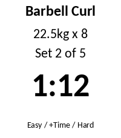{ loading=lazy width="72" } | [GymLog](https://apps.repebble.com/e7478392e757413996a8edff) | [dcmcand](https://github.com/dcmcand/gymlog) | <small>Not checked yet</small> | 2026-09-29 | See your rest timer and current set on your wrist. Finish a set in the GymLog Android app and the watch shows the exercise, your target weight and reps, and… |
| 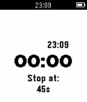{ loading=lazy width="72" } | [GymSpotter](https://apps.repebble.com/5615bbe67e6126a558000042) | [David Padilla](https://github.com/dabit/gymspotter) | <small>Not checked yet</small> | 2015-12-31 | Timer app that helps you manage rest time between sets. Set your preferred rest time and when you are done with your shake the watch a bit and let the timer… |
| { loading=lazy width="72" } | [GymTracker](https://apps.repebble.com/0664a987078943a28f196064) | [oliben10](https://github.com/oliverano95/GymTracker) | <small>Not checked yet</small> | 2026-08-24 | Leave your phone in your locker. A fully-featured, standalone workout tracker with smart rest timers, haptic coaching, and automatic data export. Transform… |
| 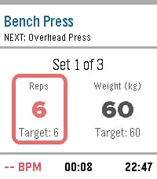{ loading=lazy width="72" } | [GymTracker](https://apps.rebble.io/en_US/application/69f4c4ee0c32da000aaaf28a) <small>Rebble App Store</small> | [Oliver Bender](https://github.com/oliverano95/GymTracker) | <small>Not checked yet</small> | 2026-08-24 | Transform your Pebble into the ultimate gym companion. GymTracker is built specifically for the tactile, screen-on experience of Pebble, letting you track… |
| 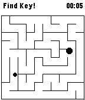{ loading=lazy width="72" } | [GyroMaze](https://apps.repebble.com/5324e550b7855aa7d20000a2) | [Marcin](https://github.com/noxytrux/Gyro-Maze) | <small>Not checked yet</small> | 2014-03-15 | Use build in gyroscope to move ball in maze. Game is divided into two phases. In first one you need to find the key, then you can navigate to exit. Finish… |
