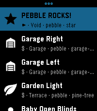
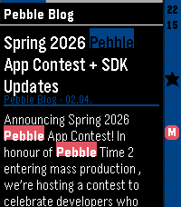
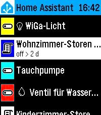

<!-- Generated by scripts/update_app_directory.py: do not edit by hand -->
# Watchapps: H

[← About this list](../watchapps.md) · [A](a.md) · [B](b.md) · [C](c.md) · [D](d.md) · [E](e.md) · [F](f.md) · [G](g.md) · **H** · [I](i.md) · [J](j.md) · [K](k.md) · [L](l.md) · [M](m.md) · [N](n.md) · [O](o.md) · [P](p.md) · [Q](q.md) · [R](r.md) · [S](s.md) · [T](t.md) · [U](u.md) · [V](v.md) · [W](w.md) · [X](x.md) · [Y](y.md) · [Z](z.md) · [0–9 & other](other.md)

*69 watchapps · Last updated 2026-10-06*

| Screenshot | Name | Developer | Licence | Updated | Description |
|------------|------|-----------|---------|---------|-------------|
| { loading=lazy width="72" } | [HA Forecast](https://apps.repebble.com/408fed6ba0354a6db2e6c8f2) | [Vincent](https://github.com/vincentezw/haforecast) | <small>Not checked yet</small> | 2026-06-28 | Display hourly and daily forecast from a Home Assistant weather entity. Also shows sunrise and sunset times. |
| { loading=lazy width="72" } | [HA Launcher](https://apps.repebble.com/870db6270e80447089753dd5) | [SHUred](https://github.com/SHU-red/pebble-ha-launcher) | <small>Not checked yet</small> | 2026-10-02 | Stored shortcuts launch instantly — no browsing, no waiting. Setup is easy: the app fetches every available SCRIPT and SCENE from your HA automatically… |
| { loading=lazy width="72" } | [HA Launcher](https://apps.rebble.io/en_US/application/6a8006531786ad00096be766) <small>Rebble App Store</small> | [SHUred](https://github.com/SHU-red/pebble-ha-launcher) | <small>Not checked yet</small> | 2026-10-02 | Stored shortcuts launch instantly — no browsing, no waiting. Setup is easy: the app fetches every available SCRIPT and SCENE from your HA automatically… |
| { loading=lazy width="72" } | [HA Voice Tasks](https://apps.repebble.com/532616a5188442dfabba058e) | [julienrbrt](https://github.com/julienrbrt/pebble-ha-voice-tasks) | <small>Not checked yet</small> | 2026-06-05 | Dictate voice notes on your Pebble and save them as tasks to Home Assistant todo lists. |
| { loading=lazy width="72" } | [HA-launch script from shortcut 01](https://apps.repebble.com/2e78cc34b3ea4a61a840b53c) | [ACW Bright](https://github.com/ArcoW2/pebble-app-HA-launch-script-from-shortcut-01) | <small>No licence</small> | 2026-09-13 | Launch any Home Assistant script from a physical button of the watch. - Faceless app (just the button-click) - Vibrates after fire Settings from phone: - HA… |
| { loading=lazy width="72" } | [Habit Trainer](https://apps.repebble.com/535c5c1a14d1794ded0000ae) | [Josh Albrecht](https://github.com/joshalbrecht/pebble_habit_trainer) | <small>Not checked yet</small> | 2014-04-27 | Now you can easily train habits that require near-continuous attention! (ex: having good posture) It vibrates periodically. If you were doing a good job… |
| { loading=lazy width="72" } | [Habitica Tasks](https://apps.repebble.com/55ddd1cb4374cb79f9000036) | [Klaus Demerath](https://github.com/kdemerath/Habitica-Tasks) | <small>Not checked yet</small> | 2019-07-24 | This watchapp lets you access your habitica (aka habitRPG) tasks and mark them completed. Select a task in the tasks list and press 'select'. The selected… |
| { loading=lazy width="72" } | [Habs: A Minimal Habit Tracker](https://apps.rebble.io/en_US/application/63fa50f863414f0009a4ca34) <small>Rebble App Store</small> | [jerroh](https://github.com/jrohall/Habs) | <small>Not checked yet</small> | 2023-02-25 | ==== BETA 1.0 ==== This app is a beta release of a minimal habit tracker that allows users to set custom habits on the pebble app, which will update the… |
| { loading=lazy width="72" } | [Hack Portal - Ingress companion](https://apps.repebble.com/54ae740485dd6760e7000077) | [Samuel](https://github.com/samuelmr/pebble-hackportal) | <small>Not checked yet</small> | 2019-07-24 | Reminds you to hack your portals when they cool down. Remembers your hacks and knows when the portals burn down. Configurable Heat Sinks and Multi-hacks… |
| { loading=lazy width="72" } | [Hacker News](https://apps.repebble.com/52cf3a634680afd4ff000003) | [Luis Iván Cuende](https://github.com/luisivan/pebble-hn) | <small>Not checked yet</small> | 2025-11-25 | Now you can read YCombinator Hacker News from your wrist! This app lets you read a summary of the 30 top news, but more features are coming soon, such as… |
| { loading=lazy width="72" } | [Hacker News](https://apps.repebble.com/52b2b6b28c081570bb0000e0) | [Neal Patel](https://github.com/Neal/pebble-hackernews) | <small>Not checked yet</small> | 2014-01-21 | Hacker News reader for Pebble! Read the front page, new, and best stories on Hacker News now right on your wrist! |
| { loading=lazy width="72" } | [HackerNews Headline Browser](https://apps.repebble.com/563139ce2c90c8ecb200000c) | [Joseph Nicholas Yarbrough](https://github.com/chisleu/HackerNewsForPebble) | <small>Not checked yet</small> | 2015-10-28 | This is a simple app to browse Hacker News Headlines. |
| { loading=lazy width="72" } | [Hackerspace](https://apps.repebble.com/57a269a31482cdecc7000203) | [Thomas Perale](https://github.com/thomacer/pebble-hackerspace) | <small>Not checked yet</small> | 2016-08-03 | "Hackerspace" is the application to use with your local hackerspace or smart home spaceAPI. It give you on your wrist all the information from a spaceAPI so… |
| { loading=lazy width="72" } | [Hackerspace.gr](https://apps.repebble.com/5672ef77fa6d41958400001f) | [Nikos Roussos](https://github.com/hsgr/hsgr-pebble) | <small>Not checked yet</small> | 2016-06-14 | Simple app to view Hackerspace.gr status |
| { loading=lazy width="72" } | [HalfLife - Smart Caffeine Tracker](https://apps.repebble.com/abd6da93b862465d836185e6) | [FPuzeras](https://github.com/FPuzeras/HalfLife) | AGPL-3.0 | 2026-04-16 | Track your caffeine like your body actually processes it. HalfLife is a real-time caffeine tracker for Pebble that simulates how caffeine is absorbed… |
| { loading=lazy width="72" } | [HannaCalendar](https://apps.repebble.com/559f949e93ff77bebd000013) | [Soomtong](https://github.com/soomtong/HannaCalendar) | <small>Not checked yet</small> | 2015-12-25 | Simple Watch-app using Hanna font for Pebble Time - Up and Down button for change Calendar - Select button for this month |
| { loading=lazy width="72" } | [HannaTimer](https://apps.repebble.com/55b34b29deeaa3c469000035) | [Soomtong](https://github.com/soomtong/HannaTimer) | <small>Not checked yet</small> | 2015-08-13 | # HannaTimer simple stopwatch for time-flow event. this app has two mode, that remember previous mode. change mode `long up click` action. ## LAP TIMER … |
| { loading=lazy width="72" } | [HanziWatch](https://apps.repebble.com/e56db32d79bc4a918a6f8c45) | [3DTero](https://github.com/3DTero/pebble-chinese-flashcards) | <small>No licence</small> | 2026-09-12 | an interactive Chinese character flashcard app built specifically for Pebble watches. Learn essential Chinese characters on the go with high-contrast Hanzi… |
| { loading=lazy width="72" } | [Harvest Time Tracker](https://apps.repebble.com/56912ecc0da72fe25a00005f) | [Timothy Soehnlin](https://github.com/timothysoehnlin/PebbleHarvest) | <small>Not checked yet</small> | 2016-02-03 | This app will allow you to create time tracking entries, and to activate/deactivate them all from your watch. |
| { loading=lazy width="72" } | [Hashcat Reactor](https://apps.repebble.com/9b341cf2753d4ae1a0a359ed) | [sky](https://github.com/jjsvs/Hashcat-Reactor) | <small>Not checked yet</small> | 2026-06-13 | Dashboard for Hashcat-Reactor |
| { loading=lazy width="72" } | [HASS To Do List](https://apps.repebble.com/bdac83d64d7a4733a699b5a1) | [Spud](https://github.com/spudje/PebbleHassToDo) | <small>Not checked yet</small> | 2026-06-14 | HASS To Do List is a simple watchapp that lists to do items of a single Home Assistant Local To Do List… |
| { loading=lazy width="72" } | [hassgraph](https://apps.repebble.com/3939513e02874195bbdf06fd) | [Vincent](https://github.com/vincentezw/hassgraph-pebble) | <small>Not checked yet</small> | 2026-06-04 | Home Assistant entity line graphs on your wrist. Supports multiple entities. |
| { loading=lazy width="72" } | [HeadeRSS](https://apps.repebble.com/a8ece66acd244751b96874a1) | [SHUred](https://github.com/SHU-red/pebble-headerss) | <small>Not checked yet</small> | 2026-08-29 | Pull feed headings and summaries from any Google Reader-compatible API, such as FreshRSS, and enjoy a lightweight reading experience on your Pebble. - Show… |
| { loading=lazy width="72" } | [HeadeRSS](https://apps.rebble.io/en_US/application/6a809d1e40cc1a00097a9d88) <small>Rebble App Store</small> | [SHUred](https://github.com/SHU-red/pebble-headerss) | <small>Not checked yet</small> | 2026-08-29 | Pull feed headings and summaries from any Google Reader-compatible API, such as FreshRSS, and enjoy a lightweight reading experience on your Pebble. - Show… |
| { loading=lazy width="72" } | [Health Export](https://apps.repebble.com/575492f7fa796cdbde00000b) | [Natasha Kerensikova](https://github.com/faelys/pebble-health-export) | <small>Not checked yet</small> | 2017-03-21 | This is a simple application for Pebble Watch that extract all the raw Pebble Health data gathered by the watch and POST it to a user-configured HTTP… |
| { loading=lazy width="72" } | [Healthy Eyes](https://apps.rebble.io/en_US/application/57fee4621fd66b81c50001e4) <small>Rebble App Store</small> | [James Smith (@poeia)](https://github.com/poeia/healthy-eyes) | <small>Not checked yet</small> | 2016-10-13 | Healthy Eyes - The Smart Pomodoro Timer for Pebble Do you find yourself staring at screens for long periods of time, eventually leading to headaches? Or… |
| { loading=lazy width="72" } | [Heart Rate FX](https://apps.repebble.com/d2ffde338d504074a760cb88) | [SIDEffect's](https://github.com/n0va-SIDEffects/pebble-Heart-Rate-FX) | <small>Not checked yet</small> | 2026-09-17 | Your pulse as a trace, a sound and a light. Heart Rate FX turns your watch into a bedside monitor. It reads the optical sensor and shows every beat three… |
| { loading=lazy width="72" } | [HEARTBEAT animation meme](https://apps.repebble.com/688c29cafc054300094a5d8b) | [nubbybubby](https://github.com/nubbybubby/pebble-heartbeat-animation-meme/) | <small>Not checked yet</small> | 2025-09-11 | I ported an animation meme to PT/PTR because I was bored. I know, no one asked for this app to exist lmao. You can toggle the subtitles by pressing select… |
| { loading=lazy width="72" } | [Heartrate2Pebble](https://apps.repebble.com/89bba5e792d9479da64be322) | [meerkat](https://github.com/meerkat42/heartrate2pebble/tree/main/watch) | <small>Not checked yet</small> | 2026-04-25 | Turn any Pebble watch into a heartrate monitor. A lightweight, open-source Android bridge that streams real-time heart rate data from Bluetooth LE wearables… |
| { loading=lazy width="72" } | [Hearts](https://apps.repebble.com/530be07a7cd17c954e000049) | [Matthew Tole](http://github.com/smallstoneapps/hearts/) | MIT | 2016-09-17 | Keep an eye on how popular your apps are on the Pebble appstore with this amazing app. |
| { loading=lazy width="72" } | [HeaterMeter](https://apps.repebble.com/55259ffe06e80c1580000063) | [Smokin' Hardware, Inc.](https://github.com/CapnBry/HeaterMeter) | MIT | 2015-04-08 | Keep track of your barbecue and control it without having someone fish around in your pocket for your phone. This Pebble app interfaces with a HeaterMeter… |
| { loading=lazy width="72" } | [Hebrew and Arabic support for Pebble - elbbeP](https://apps.repebble.com/57bc96a6f01b53ce0c000c02) | [Collin Fair](https://github.com/cpfair/elbbep) | <small>Not checked yet</small> | 2016-09-05 | elbbeP lets you read Arabic and Hebrew everywhere on your Pebble smartwatch: text messages, calendar alerts, apps & more. Any Pebble can be upgraded to… |
| { loading=lazy width="72" } | [Helibble](https://apps.repebble.com/52f4b8e3414fbc1ac100062e) | [StuartHa](https://github.com/StuartHa/helibble) | <small>Not checked yet</small> | 2014-02-07 | Classic helicopter. By Stuart Harrell. |
| { loading=lazy width="72" } | [Helios](https://apps.repebble.com/68b212c30d63e60009529624) | [Sidpatchy](https://github.com/Sidpatchy/Helios) | <small>Not checked yet</small> | 2025-08-29 | Helios puts the sun’s daily milestones on your wrist: Dawn, Sunrise, Sunset, and Dusk. Navigate forward and backwards in time with the up and down buttons… |
| { loading=lazy width="72" } | [Hello There!](https://apps.rebble.io/en_US/application/5a302ef50dfc323bd0003987) <small>Rebble App Store</small> | [LochRED](https://github.com/LochRED/ht) | <small>Not checked yet</small> | 2017-12-12 | This is an app that I made (With the help of a Cloud Pebble Design template.) It displays a message. That's about it. (BTW, 13 year old developer here. This… |
| { loading=lazy width="72" } | [HelpAnyTime](https://apps.repebble.com/5509840784ad023da7000009) | [Ugo Raffaele Piemontese](https://github.com/UgoRaffaele/HelpAnyTime-pebble) | <small>Not checked yet</small> | 2015-03-19 | Emergency alerts directly on your phone (companion app needed). For example, give your Pebble to your grandma and go to sleep, she will be able to wake you… |
| { loading=lazy width="72" } | [Helpdesk Dashboard](https://apps.repebble.com/5476627d0340c757940000cf) | [Petr Vanek](https://github.com/vanous/jitbit-helpdesk-dashboard-pebble) | <small>Not checked yet</small> | 2014-12-11 | Dashboard for JitBit helpdesk (account required) Displays number of 'N'ew, 'P'ending and 'U'nclosed tickets: total / mine. Select button for refresh. V1.2… |
| { loading=lazy width="72" } | [helpmeh](https://apps.rebble.io/en_US/application/59ec41ee0dfc329496000354) <small>Rebble App Store</small> | [jenjenyang](https://github.com/jellybellyfishmeow/t2) | <small>Not checked yet</small> | 2017-10-22 | asf |
| { loading=lazy width="72" } | [HeroBoard](https://apps.repebble.com/54f3398f2af981c827000058) | [Rmesquita](https://github.com/rmesquit/HeroBoard) | <small>Not checked yet</small> | 2015-03-03 | Demo for developers: Guitar Hero based keyboard compatible with t3/t9 text prediction algorithms. |
| { loading=lazy width="72" } | [hexbin](https://apps.repebble.com/57ee02d544581e90d400007a) | [Quint Guvernator](https://github.com/qguv/hexbin) | <small>Not checked yet</small> | 2016-09-30 | Practice your hex to binary conversion skills! Great for programmers and students. Tap 'up' to enter one-bits and tap 'down' or 'back' to enter zero-bits… |
| { loading=lazy width="72" } | [HF Band Conditions](https://apps.repebble.com/56194668aca3bb54ae00008d) | [Squirrelware](https://github.com/keisisqrl/pebble-band-conditions) | <small>Not checked yet</small> | 2015-10-10 | Uses data from NONBH's solar weather information at http://hamqsl.com/solar.html to deliver band conditions, signal noise, and MUF right to your watch. Icon… |
| { loading=lazy width="72" } | [Higher or Lower](https://apps.repebble.com/5744477700693f2944000018) | [botulf2000](https://github.com/botulf2000/random_guesser) | <small>Not checked yet</small> | 2016-05-25 | Small game, you have to guess if the next number is higher or lower than the last. |
| { loading=lazy width="72" } | [Highest Five](https://apps.repebble.com/553d01b20c00e74822000051) | [Highest Five](https://github.com/thegrumpybuffalo/HighestFive) | <small>Not checked yet</small> | 2015-04-26 | Track your high fives*! Not only the number, but also the force with which you can high five your friends! * We are not responsible for any self-inflicted… |
| { loading=lazy width="72" } | [Hirake Goma](https://apps.repebble.com/6a2ebb3ee24af40009fa5330) | [Mowken Apps](https://github.com/diced-k/hirake-goma) | <small>Not checked yet</small> | 2026-06-14 | Lock, unlock, and check your SESAME (Candy House) smart lock straight from your Pebble. Pick a lock from the menu, then use the action bar buttons — Up to… |
| { loading=lazy width="72" } | [Hive for Ecobee](https://apps.repebble.com/56c3897cf3dab7ddce00001c) | [Craig Alexander](https://github.com/calexander3/hive) | <small>Not checked yet</small> | 2026-07-14 | Pebble smartwatch app that allows you to control ecobee ( www.ecobee.com ) thermostats. |
| { loading=lazy width="72" } | [Hnefatafl](https://apps.repebble.com/b62e83df3cb74a549ef5a06f) | [Akiva](https://github.com/akivaatwood/pebble-hnefatafl) | <small>Not checked yet</small> | 2026-08-24 | Hnefatafl app |
| { loading=lazy width="72" } | [Home Alarm Control for RPi](https://apps.repebble.com/52dc7194f9d8ec503100003c) | [Hugo](https://github.com/hugoender/HomeAlarmRemotePebble/blob/master/README.md) | <small>Not checked yet</small> | 2014-01-20 | Requirements: Raspberry Pi with Webiopi installed. Allows you to control two GPIO pins on a Raspberry Pi to arm and disarm your home alarm. Each press of a… |
| { loading=lazy width="72" } | [Home Assistant](https://apps.rebble.io/en_US/application/637a99d0fdf3e30009f6397d) <small>Rebble App Store</small> | [Willow Systems](https://github.com/Willow-Systems/pebble-home-assistant) | <small>Not checked yet</small> | 2023-06-06 | A full-feature Pebble app for Home Assistant! (see home-assistant.io) With this app you can: - Quickly toggle lights - Control light brightness & colour… |
| { loading=lazy width="72" } | [Home Assistant on your Wrist](https://apps.repebble.com/9a8d925ad40f4d6e9d436726) | [George Ruinelli](https://github.com/caco3/pebble-home-assistant-on-your-wrist) | <small>Not checked yet</small> | 2026-09-11 | Easy access to your Home Assistant instance This is a fork of "Home Assistant WS" but enhanced with many new features: - Easy Favorites Pinning - Edit the… |
| { loading=lazy width="72" } | [Home Assistant on your Wrist](https://apps.rebble.io/en_US/application/6a7f8941a2b290000a2e69e8) <small>Rebble App Store</small> | [George Ruinelli](https://github.com/caco3/pebble-home-assistant-on-your-wrist) | <small>Not checked yet</small> | 2026-09-11 | Easy access to your Home Assistant instance This is a fork of "Home Assistant WS" but enhanced with many new features: - Easy Favorites Pinning - Edit the… |
| { loading=lazy width="72" } | [Home Assistant Shortcuts](https://apps.repebble.com/24d2de46621142018096799a) | [Carles F.](https://github.com/Carles-Figuerola/home-assistant-shortcuts) | <small>No licence</small> | 2026-03-27 | This application is a very simple home-assistant script-caller. The goal of the application is to be as simple as possible. It won't autodetect everything… |
| { loading=lazy width="72" } | [Home Assistant WS](https://apps.repebble.com/68dea5734be9cb0009429595) | [Skylar Sadlier](https://github.com/skylord123/pebble-home-assistant-ws) | <small>Not checked yet</small> | 2026-08-29 | Home Assistant control with real-time updates, voice commands, entity history, calendars, and support for a wide range of devices and helpers. Control your… |
| { loading=lazy width="72" } | [HomeAssistant](https://apps.rebble.io/en_US/application/5a4533bf461a8d60350019d9) <small>Rebble App Store</small> | [Matthias Hutsebaut](https://github.com/mhtsbt/PebbleHomeAssistant) | <small>Not checked yet</small> | 2017-12-28 | This app allows to trigger home-assistant scripts on your watch! |
| { loading=lazy width="72" } | [HomeP - For MyQ Garage Doors & Light Switches](https://apps.repebble.com/553723fe1fa0b37b9800002f) | [SeaPea Software](https://github.com/SeaPea/HomeP) | <small>Not checked yet</small> | 2017-02-23 | Unofficial watch app for monitoring and operating Chamberlain/Liftmaster branded MyQ devices over the Internet (Requires MyQ Internet Gateway, usually sold… |
| { loading=lazy width="72" } | [Homey Flows](https://apps.repebble.com/abf0a3fa4b7044308388f53d) | [Tom Khamis](https://github.com/ttkhamis/homey-flow-trigger) | <small>Not checked yet</small> | 2026-06-07 | Trigger your Homey flows directly from your Pebble Time 2, no phone needed once configured. Browse up to 5 customizable flow shortcuts on your wrist and… |
| { loading=lazy width="72" } | [Hook](https://apps.repebble.com/5727044991da39820e000002) | [Yaoyu Yang](http://www.yaoyuyang.com/) | <small>See source</small> | 2016-05-03 | Control your Hook devices on Pebble watch! |
| { loading=lazy width="72" } | [Hooky](https://apps.repebble.com/68fa323fa0599b0008f65a07) | [Achi](https://github.com/michi1996/pebble-hooky-webhook-trigger) | <small>Not checked yet</small> | 2026-10-04 | Hooky lets you trigger webhooks from your Pebble smartwatch with a single tap. Control smart home devices, send notifications or connect your favorite… |
| { loading=lazy width="72" } | [Horizon](https://apps.rebble.io/en_US/application/69207ecd7cdf9d000985e1a7) <small>Rebble App Store</small> | [V3L](https://github.com/skooda/pebble-horizon) | <small>Not checked yet</small> | 2025-11-21 | Toy displaying an artificial horizon (attitude indicator) based on accelerometer data. It shows a horizontal line rotated according to the tilt of the watch… |
| { loading=lazy width="72" } | [Horizon Scout](https://apps.repebble.com/b255f708d396497fa1af400f) | [Karl](https://github.com/KarlKl/HorizonScout) | <small>No licence</small> | 2026-03-29 | Explore the world around you with Horizon Scout, an app that identifies mountains and peaks in your view based on your location and direction. Perfect for… |
| { loading=lazy width="72" } | [Hourly Chime](https://apps.repebble.com/e179bf68b6924b09858dd59d) | [Webstas “Webstas”](https://github.com/BigWebstas/PebbleHourlyChime) | <small>No licence</small> | 2026-09-09 | A PebbleOS watchapp that chimes on the hour with the speaker and/or the vibration motor. Runs on Pebble Time 2 (emery) and Pebble 2 Duo (flint) — the two… |
| { loading=lazy width="72" } | [Hourly Steps](https://apps.repebble.com/b8ed8bf41c0142dfbd4fe9c5) | [Scott Hacker](https://github.com/Shacker10/Hourly-Steps) | <small>Not checked yet</small> | 2026-07-22 | Hourly Steps mimics Fitbit's "Reminder to Move" functionality but with way more user control. Through App settings you can adjust: - What hour to start… |
| { loading=lazy width="72" } | [HTTP Push](https://apps.repebble.com/567af43af66b129c7200002b) | [groundhogday](https://github.com/skonagaya/HTTP-Push) | <small>Not checked yet</small> | 2017-08-14 | A customizable HTTP request WatchApp perfect for Home Automation. The configuration page allows you to test requests before publishing to your Pebble… |
| { loading=lazy width="72" } | [Hubble](https://apps.repebble.com/698fc9d8086643000aef17a3) | [Logan Head](https://github.com/erlog135/hubble) | <small>Not checked yet</small> | 2026-02-14 | An astronomy app for Pebble. It uses the time and your location to obtain the azimuth & altitude of the sun, moon, planets, and various constellations… |
| { loading=lazy width="72" } | [Hubitat Control](https://apps.repebble.com/5090015e5ff24c0c9f46af74) | [vision9074](https://github.com/Vision9074/pebble-app-hubitat-control) | <small>Not checked yet</small> | 2026-08-12 | Control your Hubitat home from your wrist. A Pebble watch app for lights, dimmers, speakers, locks, garage doors, shades, and sensors, talking to your hub… |
| { loading=lazy width="72" } | [Huckleberry](https://apps.repebble.com/7fd2ec0472eb43a589c03d7a) | [RobErskine](https://github.com/RobErskine/pebble-huckleberry) | <small>Not checked yet</small> | 2026-07-16 | See your children's latest logs from Huckleberry so you can always stay on top of diaper changes and upcoming bottle feedings. |
| { loading=lazy width="72" } | [Hueble](https://apps.repebble.com/df31f62140dc46f295201620) | [Nick Winans](https://github.com/Nicell/hueble) | <small>Not checked yet</small> | 2026-07-20 | Hueble is a focused, watch-first remote for Philips Hue. Open it directly into your last room, toggle its lights, adjust brightness, or activate a scene… |
| { loading=lazy width="72" } | [Hug Counter](https://apps.repebble.com/56fcd2da636d81906900001a) | [Fathom](https://github.com/BlackLamb/hugcounter) | <small>No licence</small> | 2016-08-31 | Count down from a set number of hugs! Make sure your loved ones get all the hugs they ask for. |
| { loading=lazy width="72" } | [Hurry Up! Rennes](https://apps.repebble.com/561fd3fc36c6e8fdf0000084) | [Lesterpig](https://github.com/Lesterpig/hurry-up-rennes) | <small>Not checked yet</small> | 2016-10-07 | Alpha version! Displays next bus departures for nearest / bookmarked bus stops in realtime. Works only in Rennes (FR). Long click on select button while in… |
| { loading=lazy width="72" } | [HVV Departures](https://apps.rebble.io/en_US/application/69ed55b9d88ca00009d4d793) <small>Rebble App Store</small> | [ave](https://github.com/aveao/pebble-hvv) | <small>Not checked yet</small> | 2026-10-03 | Departure viewer for Hamburger Verkehrsverbund buses/trains/S-Bahn, with support for nearby stops, live departures and auto-refresh. Privacy remark: Out of… |
