---
hide:
  - toc
---

<!-- Generated by scripts/update_app_directory.py: do not edit by hand -->
# Pebble Apps: H

[← All Pebble Apps](../watchapps.md) · [A](a.md) · [B](b.md) · [C](c.md) · [D](d.md) · [E](e.md) · [F](f.md) · [G](g.md) · **H** · [I](i.md) · [J](j.md) · [K](k.md) · [L](l.md) · [M](m.md) · [N](n.md) · [O](o.md) · [P](p.md) · [Q](q.md) · [R](r.md) · [S](s.md) · [T](t.md) · [U](u.md) · [V](v.md) · [W](w.md) · [X](x.md) · [Y](y.md) · [Z](z.md) · [0–9 & other](other.md)

*66 apps · Last updated 2026-10-06 · [About these lists](../about-app-lists.md)*

<a class="app-shot" href="https://apps.repebble.com/408fed6ba0354a6db2e6c8f2" data-search-exclude>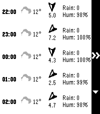</a>

<h2 class="app-name" id="app-408fed6ba0354a6db2e6c8f2"><a href="https://apps.repebble.com/408fed6ba0354a6db2e6c8f2">HA Forecast</a></h2>
<a class="app-source" href="https://github.com/vincentezw/haforecast" title="Source code" data-search-exclude>View source</a>

by <a href="https://apps.repebble.com/apps/dev/vincent_997a3d2f0b60fba729f7aece" title="More from this developer">Vincent</a>

Not checked yet v1.4.1 Updated 2026-06-28

Runs on: Round 2, Time 2

Display hourly and daily forecast from a Home Assistant weather entity. Also shows sunrise and sunset times.

<h2 class="app-name" id="app-870db6270e80447089753dd5"><a href="https://apps.repebble.com/870db6270e80447089753dd5">HA Launcher</a></h2>
<a class="app-source" href="https://github.com/SHU-red/pebble-ha-launcher" title="Source code" data-search-exclude>View source</a>

by <a href="https://apps.repebble.com/apps/dev/shured_7b17544a2d79e1b12db305ca" title="More from this developer">SHUred</a>

No licence v0.8.2 Updated 2026-10-02

Runs on: Round 2, Time 2, Pebble 2 Duo, Pebble 2, Time Round, Time

Stored shortcuts launch instantly — no browsing, no waiting. Setup is easy: the app fetches every available SCRIPT and SCENE from your HA automatically. Per-shortcut a confirmation checkpoint can…

<h2 class="app-name" id="app-532616a5188442dfabba058e"><a href="https://apps.repebble.com/532616a5188442dfabba058e">HA Voice Tasks</a></h2>
<a class="app-source" href="https://github.com/julienrbrt/pebble-ha-voice-tasks" title="Source code" data-search-exclude>View source</a>

by <a href="https://apps.repebble.com/apps/dev/julienrbrt_0511f4c82f11c069531fe928" title="More from this developer">julienrbrt</a>

Not checked yet v0.1 Updated 2026-06-05

Runs on: Time 2

Dictate voice notes on your Pebble and save them as tasks to Home Assistant todo lists.

<a class="app-shot" href="https://apps.repebble.com/2e78cc34b3ea4a61a840b53c" data-search-exclude>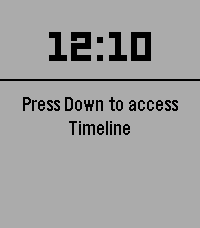</a>

<h2 class="app-name" id="app-2e78cc34b3ea4a61a840b53c"><a href="https://apps.repebble.com/2e78cc34b3ea4a61a840b53c">HA-launch script from shortcut 01</a></h2>
<a class="app-source" href="https://github.com/ArcoW2/pebble-app-HA-launch-script-from-shortcut-01" title="Source code" data-search-exclude>View source</a>

by <a href="https://apps.repebble.com/apps/dev/acw-bright_b9b8c4f23559db00c877cab5" title="More from this developer">ACW Bright</a>

No licence v1.0 Updated 2026-09-13

Runs on: Round 2, Time 2, Pebble 2 Duo, Pebble 2, Time Round, Time, Classic

Launch any Home Assistant script from a physical button of the watch. - Faceless app (just the button-click) - Vibrates after fire Settings from phone: - HA url - Token - script, e.g…

<h2 class="app-name" id="app-535c5c1a14d1794ded0000ae"><a href="https://apps.repebble.com/535c5c1a14d1794ded0000ae">Habit Trainer</a></h2>
<a class="app-source" href="https://github.com/joshalbrecht/pebble_habit_trainer" title="Source code" data-search-exclude>View source</a>

by <a href="https://apps.repebble.com/apps/dev/josh-albrecht_53326d4007233dce450000bc" title="More from this developer">Josh Albrecht</a>

Not checked yet v1.0.0 Updated 2014-04-27

Runs on: Time 2, Pebble 2 Duo, Pebble 2, Time, Classic

Now you can easily train habits that require near-continuous attention! (ex: having good posture) It vibrates periodically. If you were doing a good job, press Up and the timer will wait longer…

<a class="app-shot" href="https://apps.repebble.com/55ddd1cb4374cb79f9000036" data-search-exclude>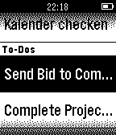</a>

<h2 class="app-name" id="app-55ddd1cb4374cb79f9000036"><a href="https://apps.repebble.com/55ddd1cb4374cb79f9000036">Habitica Tasks</a></h2>
<a class="app-source" href="https://github.com/kdemerath/Habitica-Tasks" title="Source code" data-search-exclude>View source</a>

by <a href="https://apps.repebble.com/apps/dev/klaus-demerath_552b8a4f78b9cee33b0000ca" title="More from this developer">Klaus Demerath</a>

Not checked yet v1.8 Updated 2019-07-24

Runs on: Round 2, Time 2, Pebble 2 Duo, Pebble 2, Time Round, Time, Classic

This watchapp lets you access your habitica (aka habitRPG) tasks and mark them completed. Select a task in the tasks list and press &#x27;select&#x27;. The selected tasks get IMMEDIATELY marked as completed…

<a class="app-shot" href="https://apps.rebble.io/en_US/application/63fa50f863414f0009a4ca34" data-search-exclude>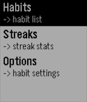</a>

<h2 class="app-name" id="app-63fa50f863414f0009a4ca34"><a href="https://apps.rebble.io/en_US/application/63fa50f863414f0009a4ca34">Habs: A Minimal Habit Tracker</a></h2>
<a class="app-source" href="https://github.com/jrohall/Habs" title="Source code" data-search-exclude>View source</a>

by <a href="https://apps.rebble.io/en_US/developer/63daefc81e4c55000844f045/1" title="More from this developer">jerroh</a>

Not checked yet v1.0 Updated 2023-02-25 Rebble App Store

Runs on: Round 2, Time 2, Pebble 2 Duo, Pebble 2, Time Round, Time, Classic

==== BETA 1.0 ==== This app is a beta release of a minimal habit tracker that allows users to set custom habits on the pebble app, which will update the pebble application. Once the user logs a…

<a class="app-shot" href="https://apps.repebble.com/54ae740485dd6760e7000077" data-search-exclude>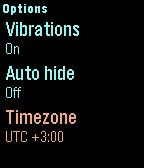</a>

<h2 class="app-name" id="app-54ae740485dd6760e7000077"><a href="https://apps.repebble.com/54ae740485dd6760e7000077">Hack Portal - Ingress companion</a></h2>
<a class="app-source" href="https://github.com/samuelmr/pebble-hackportal" title="Source code" data-search-exclude>View source</a>

by <a href="https://apps.repebble.com/apps/dev/samuel_52b1f68fcd41831af0000014" title="More from this developer">Samuel</a>

Not checked yet v3.18 Updated 2019-07-24

Runs on: Round 2, Time 2, Pebble 2 Duo, Pebble 2, Time Round, Time, Classic

Reminds you to hack your portals when they cool down. Remembers your hacks and knows when the portals burn down. Configurable Heat Sinks and Multi-hacks. You can configure up to 20 portals. Shows…

<a class="app-shot" href="https://apps.repebble.com/52cf3a634680afd4ff000003" data-search-exclude>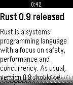</a>

<h2 class="app-name" id="app-52cf3a634680afd4ff000003"><a href="https://apps.repebble.com/52cf3a634680afd4ff000003">Hacker News</a></h2>
<a class="app-source" href="https://github.com/luisivan/pebble-hn" title="Source code" data-search-exclude>View source</a>

by <a href="https://apps.repebble.com/apps/dev/luis-iv-n-cuende_52cf3390826be30738000002" title="More from this developer">Luis Iván Cuende</a>

Not checked yet v1.0.0 Updated 2025-11-25

Runs on: Time 2, Pebble 2 Duo, Pebble 2, Time, Classic

Now you can read YCombinator Hacker News from your wrist! This app lets you read a summary of the 30 top news, but more features are coming soon, such as read later or an option to read the whole…

<a class="app-shot" href="https://apps.repebble.com/52b2b6b28c081570bb0000e0" data-search-exclude>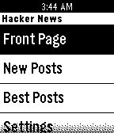</a>

<h2 class="app-name" id="app-52b2b6b28c081570bb0000e0"><a href="https://apps.repebble.com/52b2b6b28c081570bb0000e0">Hacker News</a></h2>
<a class="app-source" href="https://github.com/Neal/pebble-hackernews" title="Source code" data-search-exclude>View source</a>

by <a href="https://apps.repebble.com/apps/dev/neal-patel_528feeab8a8c0b97c8000005" title="More from this developer">Neal Patel</a>

MIT v1.1.0 Updated 2014-01-21

Runs on: Time 2, Pebble 2 Duo, Pebble 2, Time, Classic

Hacker News reader for Pebble! Read the front page, new, and best stories on Hacker News now right on your wrist!

<h2 class="app-name" id="app-563139ce2c90c8ecb200000c"><a href="https://apps.repebble.com/563139ce2c90c8ecb200000c">HackerNews Headline Browser</a></h2>
<a class="app-source" href="https://github.com/chisleu/HackerNewsForPebble" title="Source code" data-search-exclude>View source</a>

by <a href="https://apps.repebble.com/apps/dev/joseph-nicholas-yarbrough_562c611c6edde42320000040" title="More from this developer">Joseph Nicholas Yarbrough</a>

Not checked yet v1.0 Updated 2015-10-28

Runs on: Time 2, Pebble 2 Duo, Pebble 2, Time, Classic

This is a simple app to browse Hacker News Headlines.

<a class="app-shot" href="https://apps.repebble.com/57a269a31482cdecc7000203" data-search-exclude>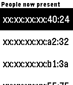</a>

<h2 class="app-name" id="app-57a269a31482cdecc7000203"><a href="https://apps.repebble.com/57a269a31482cdecc7000203">Hackerspace</a></h2>
<a class="app-source" href="https://github.com/thomacer/pebble-hackerspace" title="Source code" data-search-exclude>View source</a>

by <a href="https://apps.repebble.com/apps/dev/thomas-perale_5672e766542be03aeb000038" title="More from this developer">Thomas Perale</a>

Not checked yet v1.1 Updated 2016-08-03

Runs on: Round 2, Time 2, Pebble 2 Duo, Pebble 2, Time Round, Time, Classic

&quot;Hackerspace&quot; is the application to use with your local hackerspace or smart home spaceAPI. It give you on your wrist all the information from a spaceAPI so you can check them in a glance. The…

<a class="app-shot" href="https://apps.repebble.com/5672ef77fa6d41958400001f" data-search-exclude>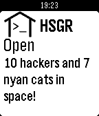</a>

<h2 class="app-name" id="app-5672ef77fa6d41958400001f"><a href="https://apps.repebble.com/5672ef77fa6d41958400001f">Hackerspace.gr</a></h2>
<a class="app-source" href="https://github.com/hsgr/hsgr-pebble" title="Source code" data-search-exclude>View source</a>

by <a href="https://apps.repebble.com/apps/dev/nikos-roussos_566b478844cb3cf34f000064" title="More from this developer">Nikos Roussos</a>

Not checked yet v0.2 Updated 2016-06-14

Runs on: Time 2, Pebble 2 Duo, Pebble 2, Time, Classic

Simple app to view Hackerspace.gr status

<a class="app-shot" href="https://apps.repebble.com/abd6da93b862465d836185e6" data-search-exclude>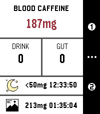</a>

<h2 class="app-name" id="app-abd6da93b862465d836185e6"><a href="https://apps.repebble.com/abd6da93b862465d836185e6">HalfLife - Smart Caffeine Tracker</a></h2>
<a class="app-source" href="https://github.com/FPuzeras/HalfLife" title="Source code" data-search-exclude>View source</a>

by <a href="https://apps.repebble.com/apps/dev/fpuzeras_6b584e89538a8246ca644902" title="More from this developer">FPuzeras</a>

AGPL-3.0 v0.5 Updated 2026-04-16

Runs on: Time 2, Pebble 2 Duo, Pebble 2, Time, Classic

Track your caffeine like your body actually processes it. HalfLife is a real-time caffeine tracker for Pebble that simulates how caffeine is absorbed, peaks, and wears off — so you can stay…

<a class="app-shot" href="https://apps.repebble.com/559f949e93ff77bebd000013" data-search-exclude>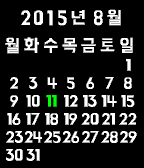</a>

<h2 class="app-name" id="app-559f949e93ff77bebd000013"><a href="https://apps.repebble.com/559f949e93ff77bebd000013">HannaCalendar</a></h2>
<a class="app-source" href="https://github.com/soomtong/HannaCalendar" title="Source code" data-search-exclude>View source</a>

by <a href="https://apps.repebble.com/apps/dev/soomtong_552d1af58215a22dc100000e" title="More from this developer">Soomtong</a>

Not checked yet v2.0 Updated 2015-12-25

Runs on: Round 2, Time 2, Pebble 2 Duo, Pebble 2, Time Round, Time, Classic

Simple Watch-app using Hanna font for Pebble Time - Up and Down button for change Calendar - Select button for this month

<a class="app-shot" href="https://apps.repebble.com/55b34b29deeaa3c469000035" data-search-exclude>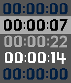</a>

<h2 class="app-name" id="app-55b34b29deeaa3c469000035"><a href="https://apps.repebble.com/55b34b29deeaa3c469000035">HannaTimer</a></h2>
<a class="app-source" href="https://github.com/soomtong/HannaTimer" title="Source code" data-search-exclude>View source</a>

by <a href="https://apps.repebble.com/apps/dev/soomtong_552d1af58215a22dc100000e" title="More from this developer">Soomtong</a>

Not checked yet v2.3 Updated 2015-08-13

Runs on: Time 2, Time

# HannaTimer simple stopwatch for time-flow event. this app has two mode, that remember previous mode. change mode `long up click` action. ## LAP TIMER - time with interval(gap) each stopwatch…

<a class="app-shot" href="https://apps.repebble.com/e56db32d79bc4a918a6f8c45" data-search-exclude>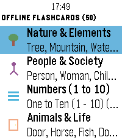</a>

<h2 class="app-name" id="app-e56db32d79bc4a918a6f8c45"><a href="https://apps.repebble.com/e56db32d79bc4a918a6f8c45">HanziWatch</a></h2>
<a class="app-source" href="https://github.com/3DTero/pebble-chinese-flashcards" title="Source code" data-search-exclude>View source</a>

by <a href="https://apps.repebble.com/apps/dev/3dtero_0e22a0bc25408281396a6f0c" title="More from this developer">3DTero</a>

No licence v1.5.1 Updated 2026-09-12

Runs on: Time 2

an interactive Chinese character flashcard app built specifically for Pebble watches. Learn essential Chinese characters on the go with high-contrast Hanzi glyphs, accurate Pinyin with tone marks…

<a class="app-shot" href="https://apps.repebble.com/56912ecc0da72fe25a00005f" data-search-exclude>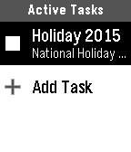</a>

<h2 class="app-name" id="app-56912ecc0da72fe25a00005f"><a href="https://apps.repebble.com/56912ecc0da72fe25a00005f">Harvest Time Tracker</a></h2>
<a class="app-source" href="https://github.com/timothysoehnlin/PebbleHarvest" title="Source code" data-search-exclude>View source</a>

by <a href="https://apps.repebble.com/apps/dev/timothy-soehnlin_567efb2aca3ddda5a10000c6" title="More from this developer">Timothy Soehnlin</a>

Not checked yet v1.4 Updated 2016-02-03

Runs on: Time 2, Pebble 2 Duo, Pebble 2, Time, Classic

This app will allow you to create time tracking entries, and to activate/deactivate them all from your watch.

<a class="app-shot" href="https://apps.repebble.com/9b341cf2753d4ae1a0a359ed" data-search-exclude>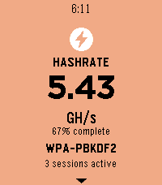</a>

<h2 class="app-name" id="app-9b341cf2753d4ae1a0a359ed"><a href="https://apps.repebble.com/9b341cf2753d4ae1a0a359ed">Hashcat Reactor</a></h2>
<a class="app-source" href="https://github.com/jjsvs/Hashcat-Reactor" title="Source code" data-search-exclude>View source</a>

by <a href="https://apps.repebble.com/apps/dev/sky_222ff63e11389faf5d8c4e40" title="More from this developer">sky</a>

Not checked yet v1.0.1 Updated 2026-06-13

Runs on: Round 2, Time 2, Pebble 2 Duo, Pebble 2, Time Round, Time, Classic

Dashboard for Hashcat-Reactor

<a class="app-shot" href="https://apps.repebble.com/bdac83d64d7a4733a699b5a1" data-search-exclude>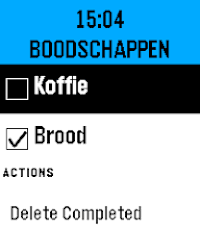</a>

<h2 class="app-name" id="app-bdac83d64d7a4733a699b5a1"><a href="https://apps.repebble.com/bdac83d64d7a4733a699b5a1">HASS To Do List</a></h2>
<a class="app-source" href="https://github.com/spudje/PebbleHassToDo" title="Source code" data-search-exclude>View source</a>

by <a href="https://apps.repebble.com/apps/dev/spud_a8592d0ab4efe177a57b17ea" title="More from this developer">Spud</a>

Not checked yet v1.0.0 Updated 2026-06-14

Runs on: Round 2, Time 2, Pebble 2 Duo, Pebble 2, Time Round, Time, Classic

HASS To Do List is a simple watchapp that lists to do items of a single Home Assistant Local To Do List (https://www.home-assistant.io/integrations/local_todo/). You can complete items on the to…

<a class="app-shot" href="https://apps.repebble.com/3939513e02874195bbdf06fd" data-search-exclude>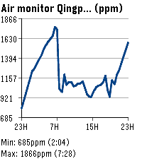</a>

<h2 class="app-name" id="app-3939513e02874195bbdf06fd"><a href="https://apps.repebble.com/3939513e02874195bbdf06fd">hassgraph</a></h2>
<a class="app-source" href="https://github.com/vincentezw/hassgraph-pebble" title="Source code" data-search-exclude>View source</a>

by <a href="https://apps.repebble.com/apps/dev/vincent_997a3d2f0b60fba729f7aece" title="More from this developer">Vincent</a>

Not checked yet v1.0.1 Updated 2026-06-04

Runs on: Round 2, Time 2

Home Assistant entity line graphs on your wrist. Supports multiple entities.

<a class="app-shot" href="https://apps.repebble.com/a8ece66acd244751b96874a1" data-search-exclude>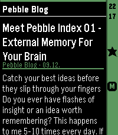</a>

<h2 class="app-name" id="app-a8ece66acd244751b96874a1"><a href="https://apps.repebble.com/a8ece66acd244751b96874a1">HeadeRSS</a></h2>
<a class="app-source" href="https://github.com/SHU-red/pebble-headerss" title="Source code" data-search-exclude>View source</a>

by <a href="https://apps.repebble.com/apps/dev/shured_7b17544a2d79e1b12db305ca" title="More from this developer">SHUred</a>

No licence v0.3.45 Updated 2026-08-29

Runs on: Round 2, Time 2, Pebble 2 Duo, Pebble 2, Time Round, Time

Pull feed headings and summaries from any Google Reader-compatible API, such as FreshRSS, and enjoy a lightweight reading experience on your Pebble. - Show all articles either at folder level or…

<a class="app-shot" href="https://apps.repebble.com/575492f7fa796cdbde00000b" data-search-exclude>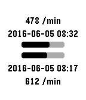</a>

<h2 class="app-name" id="app-575492f7fa796cdbde00000b"><a href="https://apps.repebble.com/575492f7fa796cdbde00000b">Health Export</a></h2>
<a class="app-source" href="https://github.com/faelys/pebble-health-export" title="Source code" data-search-exclude>View source</a>

by <a href="https://apps.repebble.com/apps/dev/natasha-kerensikova_55f99a40708b83306b00007f" title="More from this developer">Natasha Kerensikova</a>

Not checked yet v1.0 Updated 2017-03-21

Runs on: Round 2, Time 2, Time Round, Time

This is a simple application for Pebble Watch that extract all the raw Pebble Health data gathered by the watch and POST it to a user-configured HTTP endpoint. The UI independently tracks the…

<a class="app-shot" href="https://apps.rebble.io/en_US/application/57fee4621fd66b81c50001e4" data-search-exclude>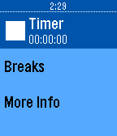</a>

<h2 class="app-name" id="app-57fee4621fd66b81c50001e4"><a href="https://apps.rebble.io/en_US/application/57fee4621fd66b81c50001e4">Healthy Eyes</a></h2>
<a class="app-source" href="https://github.com/poeia/healthy-eyes" title="Source code" data-search-exclude>View source</a>

by <a href="https://apps.rebble.io/en_US/developer/542ddd35d4d52c3f67000012/1" title="More from this developer">James Smith (@poeia)</a>

Not checked yet v1.0 Updated 2016-10-13 Rebble App Store

Runs on: Round 2, Time 2, Pebble 2 Duo, Pebble 2, Time Round, Time, Classic

Healthy Eyes - The Smart Pomodoro Timer for Pebble Do you find yourself staring at screens for long periods of time, eventually leading to headaches? Or, are you working on a task, only to find…

<a class="app-shot" href="https://apps.repebble.com/d2ffde338d504074a760cb88" data-search-exclude>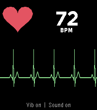</a>

<h2 class="app-name" id="app-d2ffde338d504074a760cb88"><a href="https://apps.repebble.com/d2ffde338d504074a760cb88">Heart Rate FX</a></h2>
<a class="app-source" href="https://github.com/n0va-SIDEffects/pebble-Heart-Rate-FX" title="Source code" data-search-exclude>View source</a>

by <a href="https://apps.repebble.com/apps/dev/sideffect-s_a26181dcbfab8c2033428ca1" title="More from this developer">SIDEffect&#x27;s</a>

Not checked yet v1.0 Updated 2026-09-17

Runs on: Round 2, Time 2, Pebble 2 Duo, Pebble 2

Your pulse as a trace, a sound and a light. Heart Rate FX turns your watch into a bedside monitor. It reads the optical sensor and shows every beat three ways at once: a sweeping ECG-style trace…

<h2 class="app-name" id="app-688c29cafc054300094a5d8b"><a href="https://apps.repebble.com/688c29cafc054300094a5d8b">HEARTBEAT animation meme</a></h2>
<a class="app-source" href="https://github.com/nubbybubby/pebble-heartbeat-animation-meme/" title="Source code" data-search-exclude>View source</a>

by <a href="https://apps.repebble.com/apps/dev/nubbybubby_67a84b8e89529e00099b3a79" title="More from this developer">nubbybubby</a>

Not checked yet v1.1 Updated 2025-09-11

Runs on: Round 2, Time 2, Time Round, Time

I ported an animation meme to PT/PTR because I was bored. I know, no one asked for this app to exist lmao. You can toggle the subtitles by pressing select, and the app vibrates to the beat of the…

<a class="app-shot" href="https://apps.repebble.com/89bba5e792d9479da64be322" data-search-exclude>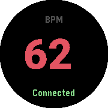</a>

<h2 class="app-name" id="app-89bba5e792d9479da64be322"><a href="https://apps.repebble.com/89bba5e792d9479da64be322">Heartrate2Pebble</a></h2>
<a class="app-source" href="https://github.com/meerkat42/heartrate2pebble/tree/main/watch" title="Source code" data-search-exclude>View source</a>

by <a href="https://apps.repebble.com/apps/dev/meerkat_885cf52196368dfa2ef8032e" title="More from this developer">meerkat</a>

Not checked yet v0.1.1 Updated 2026-04-25

Runs on: Round 2, Time 2, Pebble 2 Duo, Pebble 2, Time Round, Time, Classic

Turn any Pebble watch into a heartrate monitor. A lightweight, open-source Android bridge that streams real-time heart rate data from Bluetooth LE wearables directly to your Pebble smartwatch.

<h2 class="app-name" id="app-530be07a7cd17c954e000049"><a href="https://apps.repebble.com/530be07a7cd17c954e000049">Hearts</a></h2>
<a class="app-source" href="http://github.com/smallstoneapps/hearts/" title="Source code" data-search-exclude>View source</a>

by <a href="https://apps.repebble.com/apps/dev/matthew-tole_5283d2a9c0b0168bf6000001" title="More from this developer">Matthew Tole</a>

MIT v6.0 Updated 2016-09-17

Runs on: Round 2, Time 2, Pebble 2 Duo, Pebble 2, Time Round, Time, Classic

Keep an eye on how popular your apps are on the Pebble appstore with this amazing app.

<a class="app-shot" href="https://apps.repebble.com/55259ffe06e80c1580000063" data-search-exclude>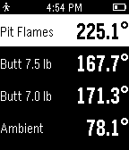</a>

<h2 class="app-name" id="app-55259ffe06e80c1580000063"><a href="https://apps.repebble.com/55259ffe06e80c1580000063">HeaterMeter</a></h2>
<a class="app-source" href="https://github.com/CapnBry/HeaterMeter" title="Source code" data-search-exclude>View source</a>

by <a href="https://apps.repebble.com/apps/dev/smokin-hardware-inc_54b16e06d461428721000098" title="More from this developer">Smokin&#x27; Hardware, Inc.</a>

MIT v1.0 Updated 2015-04-08

Runs on: Time 2, Pebble 2 Duo, Pebble 2, Time, Classic

Keep track of your barbecue and control it without having someone fish around in your pocket for your phone. This Pebble app interfaces with a HeaterMeter BBQ controller through your smartphone to…

<h2 class="app-name" id="app-57bc96a6f01b53ce0c000c02"><a href="https://apps.repebble.com/57bc96a6f01b53ce0c000c02">Hebrew and Arabic support for Pebble - elbbeP</a></h2>
<a class="app-source" href="https://github.com/cpfair/elbbep" title="Source code" data-search-exclude>View source</a>

by <a href="https://apps.repebble.com/apps/dev/collin-fair_52cb0b00b138287b32000018" title="More from this developer">Collin Fair</a>

Not checked yet v1.1 Updated 2016-09-05

Runs on: Round 2, Time 2, Pebble 2 Duo, Pebble 2, Time Round, Time, Classic

elbbeP lets you read Arabic and Hebrew everywhere on your Pebble smartwatch: text messages, calendar alerts, apps &amp; more. Any Pebble can be upgraded to display Hebrew and Arabic, and there&#x27;s no…

<a class="app-shot" href="https://apps.repebble.com/52f4b8e3414fbc1ac100062e" data-search-exclude>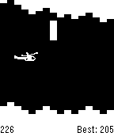</a>

<h2 class="app-name" id="app-52f4b8e3414fbc1ac100062e"><a href="https://apps.repebble.com/52f4b8e3414fbc1ac100062e">Helibble</a></h2>
<a class="app-source" href="https://github.com/StuartHa/helibble" title="Source code" data-search-exclude>View source</a>

by <a href="https://apps.repebble.com/apps/dev/stuartha_52ab9742951e34594b000002" title="More from this developer">StuartHa</a>

No licence v1.0.0 Updated 2014-02-07

Runs on: Time 2, Pebble 2 Duo, Pebble 2, Time, Classic

Classic helicopter. By Stuart Harrell.

<a class="app-shot" href="https://apps.repebble.com/68b212c30d63e60009529624" data-search-exclude>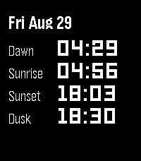</a>

<h2 class="app-name" id="app-68b212c30d63e60009529624"><a href="https://apps.repebble.com/68b212c30d63e60009529624">Helios</a></h2>
<a class="app-source" href="https://github.com/Sidpatchy/Helios" title="Source code" data-search-exclude>View source</a>

by <a href="https://apps.repebble.com/apps/dev/sidpatchy_5dc866083b94d40001b3ca96" title="More from this developer">Sidpatchy</a>

GPL-3.0 v1.0 Updated 2025-08-29

Runs on: Round 2, Time 2, Pebble 2 Duo, Pebble 2, Time Round, Time, Classic

Helios puts the sun’s daily milestones on your wrist: Dawn, Sunrise, Sunset, and Dusk. Navigate forward and backwards in time with the up and down buttons, then return to present day with the…

<a class="app-shot" href="https://apps.rebble.io/en_US/application/5a302ef50dfc323bd0003987" data-search-exclude>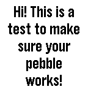</a>

<h2 class="app-name" id="app-5a302ef50dfc323bd0003987"><a href="https://apps.rebble.io/en_US/application/5a302ef50dfc323bd0003987">Hello There!</a></h2>
<a class="app-source" href="https://github.com/LochRED/ht" title="Source code" data-search-exclude>View source</a>

by <a href="https://apps.rebble.io/en_US/developer/5926fa58b67f9f43f800046c/1" title="More from this developer">LochRED</a>

No licence v1.0 Updated 2017-12-12 Rebble App Store

Runs on: Round 2, Time 2, Pebble 2 Duo, Pebble 2, Time Round, Time, Classic

This is an app that I made (With the help of a Cloud Pebble Design template.) It displays a message. That&#x27;s about it. (BTW, 13 year old developer here. This is my first app :). ) If you like this…

<a class="app-shot" href="https://apps.repebble.com/5509840784ad023da7000009" data-search-exclude>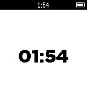</a>

<h2 class="app-name" id="app-5509840784ad023da7000009"><a href="https://apps.repebble.com/5509840784ad023da7000009">HelpAnyTime</a></h2>
<a class="app-source" href="https://github.com/UgoRaffaele/HelpAnyTime-pebble" title="Source code" data-search-exclude>View source</a>

by <a href="https://apps.repebble.com/apps/dev/ugo-raffaele-piemontese_54a54a335d5a91a9d300005e" title="More from this developer">Ugo Raffaele Piemontese</a>

GPL-3.0 v1.0 Updated 2015-03-19

Runs on: Time 2, Pebble 2 Duo, Pebble 2, Time, Classic

Emergency alerts directly on your phone (companion app needed). For example, give your Pebble to your grandma and go to sleep, she will be able to wake you up immediately just by pressing a…

<a class="app-shot" href="https://apps.repebble.com/5476627d0340c757940000cf" data-search-exclude>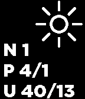</a>

<h2 class="app-name" id="app-5476627d0340c757940000cf"><a href="https://apps.repebble.com/5476627d0340c757940000cf">Helpdesk Dashboard</a></h2>
<a class="app-source" href="https://github.com/vanous/jitbit-helpdesk-dashboard-pebble" title="Source code" data-search-exclude>View source</a>

by <a href="https://apps.repebble.com/apps/dev/petr-vanek_5345c6167db5ebea6200030e" title="More from this developer">Petr Vanek</a>

Not checked yet v1.2 Updated 2014-12-11

Runs on: Time 2, Pebble 2 Duo, Pebble 2, Time, Classic

Dashboard for JitBit helpdesk (account required) Displays number of &#x27;N&#x27;ew, &#x27;P&#x27;ending and &#x27;U&#x27;nclosed tickets: total / mine. Select button for refresh. V1.2 Disclaimer: Not affiliated with JitBit in…

<h2 class="app-name" id="app-59ec41ee0dfc329496000354"><a href="https://apps.rebble.io/en_US/application/59ec41ee0dfc329496000354">helpmeh</a></h2>
<a class="app-source" href="https://github.com/jellybellyfishmeow/t2" title="Source code" data-search-exclude>View source</a>

by <a href="https://apps.rebble.io/en_US/developer/59ec290c461a8d2dd0000362/1" title="More from this developer">jenjenyang</a>

Not checked yet v1.0 Updated 2017-10-22 Rebble App Store

Runs on: Round 2, Time 2, Pebble 2 Duo, Pebble 2, Time Round, Time, Classic

asf

<a class="app-shot" href="https://apps.repebble.com/54f3398f2af981c827000058" data-search-exclude>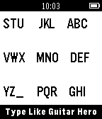</a>

<h2 class="app-name" id="app-54f3398f2af981c827000058"><a href="https://apps.repebble.com/54f3398f2af981c827000058">HeroBoard</a></h2>
<a class="app-source" href="https://github.com/rmesquit/HeroBoard" title="Source code" data-search-exclude>View source</a>

by <a href="https://apps.repebble.com/apps/dev/rmesquita_536a8ef0749b902160000022" title="More from this developer">Rmesquita</a>

Not checked yet v1.0 Updated 2015-03-03

Runs on: Time 2, Pebble 2 Duo, Pebble 2, Time, Classic

Demo for developers: Guitar Hero based keyboard compatible with t3/t9 text prediction algorithms.

<h2 class="app-name" id="app-57ee02d544581e90d400007a"><a href="https://apps.repebble.com/57ee02d544581e90d400007a">hexbin</a></h2>
<a class="app-source" href="https://github.com/qguv/hexbin" title="Source code" data-search-exclude>View source</a>

by <a href="https://apps.repebble.com/apps/dev/quint-guvernator_534edfb50c33ba3d6c0002cb" title="More from this developer">Quint Guvernator</a>

Not checked yet v1.0 Updated 2016-09-30

Runs on: Round 2, Time 2, Pebble 2 Duo, Pebble 2, Time Round, Time, Classic

Practice your hex to binary conversion skills! Great for programmers and students. Tap &#x27;up&#x27; to enter one-bits and tap &#x27;down&#x27; or &#x27;back&#x27; to enter zero-bits. Clear your guess with &#x27;select&#x27; if you…

<a class="app-shot" href="https://apps.repebble.com/56194668aca3bb54ae00008d" data-search-exclude>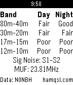</a>

<h2 class="app-name" id="app-56194668aca3bb54ae00008d"><a href="https://apps.repebble.com/56194668aca3bb54ae00008d">HF Band Conditions</a></h2>
<a class="app-source" href="https://github.com/keisisqrl/pebble-band-conditions" title="Source code" data-search-exclude>View source</a>

by <a href="https://apps.repebble.com/apps/dev/squirrelware_531a67d0eb7a77b7610008ca" title="More from this developer">Squirrelware</a>

Not checked yet v1.0 Updated 2015-10-10

Runs on: Time 2, Pebble 2 Duo, Pebble 2, Time, Classic

Uses data from NONBH&#x27;s solar weather information at http://hamqsl.com/solar.html to deliver band conditions, signal noise, and MUF right to your watch. Icon from NASA SDO

<h2 class="app-name" id="app-5744477700693f2944000018"><a href="https://apps.repebble.com/5744477700693f2944000018">Higher or Lower</a></h2>
<a class="app-source" href="https://github.com/botulf2000/random_guesser" title="Source code" data-search-exclude>View source</a>

by <a href="https://apps.repebble.com/apps/dev/botulf2000_5744452c4225ea129c000009" title="More from this developer">botulf2000</a>

No licence v1.1 Updated 2016-05-25

Runs on: Round 2, Time 2, Pebble 2 Duo, Pebble 2, Time Round, Time, Classic

Small game, you have to guess if the next number is higher or lower than the last.

<a class="app-shot" href="https://apps.repebble.com/553d01b20c00e74822000051" data-search-exclude>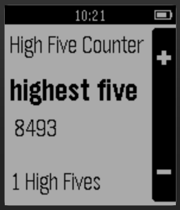</a>

<h2 class="app-name" id="app-553d01b20c00e74822000051"><a href="https://apps.repebble.com/553d01b20c00e74822000051">Highest Five</a></h2>
<a class="app-source" href="https://github.com/thegrumpybuffalo/HighestFive" title="Source code" data-search-exclude>View source</a>

by <a href="https://apps.repebble.com/apps/dev/highest-five_553bc93eb894567592000094" title="More from this developer">Highest Five</a>

Not checked yet v1.1 Updated 2015-04-26

Runs on: Time 2, Pebble 2 Duo, Pebble 2, Time, Classic

Track your high fives*! Not only the number, but also the force with which you can high five your friends! * We are not responsible for any self-inflicted harm that comes from your attempting to…

<a class="app-shot" href="https://apps.repebble.com/6a2ebb3ee24af40009fa5330" data-search-exclude>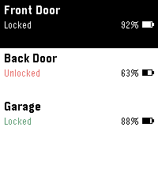</a>

<h2 class="app-name" id="app-6a2ebb3ee24af40009fa5330"><a href="https://apps.repebble.com/6a2ebb3ee24af40009fa5330">Hirake Goma</a></h2>
<a class="app-source" href="https://github.com/diced-k/hirake-goma" title="Source code" data-search-exclude>View source</a>

by <a href="https://apps.repebble.com/apps/dev/mowken-apps_6a2eb28176550100085bc243" title="More from this developer">Mowken Apps</a>

Not checked yet v1.0 Updated 2026-06-14

Runs on: Time 2, Pebble 2 Duo, Pebble 2, Time, Classic

Lock, unlock, and check your SESAME (Candy House) smart lock straight from your Pebble. Pick a lock from the menu, then use the action bar buttons — Up to unlock, Down to lock, and the middle…

<a class="app-shot" href="https://apps.repebble.com/56c3897cf3dab7ddce00001c" data-search-exclude>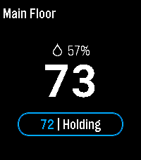</a>

<h2 class="app-name" id="app-56c3897cf3dab7ddce00001c"><a href="https://apps.repebble.com/56c3897cf3dab7ddce00001c">Hive for Ecobee</a></h2>
<a class="app-source" href="https://github.com/calexander3/hive" title="Source code" data-search-exclude>View source</a>

by <a href="https://apps.repebble.com/apps/dev/craig-alexander_532b717388718d52500004cc" title="More from this developer">Craig Alexander</a>

Not checked yet v2.0.2 Updated 2026-07-14

Runs on: Round 2, Time 2, Pebble 2 Duo

Pebble smartwatch app that allows you to control ecobee ( www.ecobee.com ) thermostats.

<a class="app-shot" href="https://apps.repebble.com/b62e83df3cb74a549ef5a06f" data-search-exclude>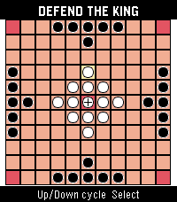</a>

<h2 class="app-name" id="app-b62e83df3cb74a549ef5a06f"><a href="https://apps.repebble.com/b62e83df3cb74a549ef5a06f">Hnefatafl</a></h2>
<a class="app-source" href="https://github.com/akivaatwood/pebble-hnefatafl" title="Source code" data-search-exclude>View source</a>

by <a href="https://apps.repebble.com/apps/dev/akiva_55c12ae1282aa3bdf31c76ea" title="More from this developer">Akiva</a>

MIT v1.3.0 Updated 2026-08-24

Runs on: Round 2, Time 2, Pebble 2 Duo, Pebble 2, Time Round, Time, Classic

Hnefatafl app

<a class="app-shot" href="https://apps.repebble.com/52dc7194f9d8ec503100003c" data-search-exclude>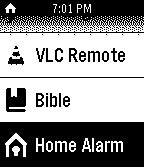</a>

<h2 class="app-name" id="app-52dc7194f9d8ec503100003c"><a href="https://apps.repebble.com/52dc7194f9d8ec503100003c">Home Alarm Control for RPi</a></h2>
<a class="app-source" href="https://github.com/hugoender/HomeAlarmRemotePebble/blob/master/README.md" title="Source code" data-search-exclude>View source</a>

by <a href="https://apps.repebble.com/apps/dev/hugo_52cb234945ffdd4be8000048" title="More from this developer">Hugo</a>

Not checked yet v2.0 Updated 2014-01-20

Runs on: Time 2, Pebble 2 Duo, Pebble 2, Time, Classic

Requirements: Raspberry Pi with Webiopi installed. Allows you to control two GPIO pins on a Raspberry Pi to arm and disarm your home alarm. Each press of a button brings the user specified GPIO…

<a class="app-shot" href="https://apps.rebble.io/en_US/application/637a99d0fdf3e30009f6397d" data-search-exclude>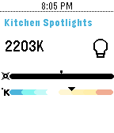</a>

<h2 class="app-name" id="app-637a99d0fdf3e30009f6397d"><a href="https://apps.rebble.io/en_US/application/637a99d0fdf3e30009f6397d">Home Assistant</a></h2>
<a class="app-source" href="https://github.com/Willow-Systems/pebble-home-assistant" title="Source code" data-search-exclude>View source</a>

by <a href="https://apps.rebble.io/en_US/developer/5d9ac26cc393f54d6b5f5443/1" title="More from this developer">Willow Systems</a>

MIT v1.4 Updated 2023-06-06 Rebble App Store

Runs on: Round 2, Time 2, Pebble 2 Duo, Pebble 2, Time Round, Time

A full-feature Pebble app for Home Assistant! (see home-assistant.io) With this app you can: - Quickly toggle lights - Control light brightness &amp; colour temperature - Control switches &amp; input…

<h2 class="app-name" id="app-9a8d925ad40f4d6e9d436726"><a href="https://apps.repebble.com/9a8d925ad40f4d6e9d436726">Home Assistant on your Wrist</a></h2>
<a class="app-source" href="https://github.com/caco3/pebble-home-assistant-on-your-wrist" title="Source code" data-search-exclude>View source</a>

by <a href="https://apps.repebble.com/apps/dev/george-ruinelli_52c9626e6025fc7211000054" title="More from this developer">George Ruinelli</a>

Not checked yet v1.3 Updated 2026-09-11

Runs on: Time 2

Easy access to your Home Assistant instance This is a fork of &quot;Home Assistant WS&quot; but enhanced with many new features: - Easy Favorites Pinning - Edit the favorites directly on the smart phone …

<a class="app-shot" href="https://apps.repebble.com/24d2de46621142018096799a" data-search-exclude>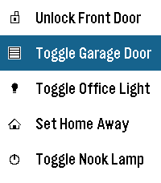</a>

<h2 class="app-name" id="app-24d2de46621142018096799a"><a href="https://apps.repebble.com/24d2de46621142018096799a">Home Assistant Shortcuts</a></h2>
<a class="app-source" href="https://github.com/Carles-Figuerola/home-assistant-shortcuts" title="Source code" data-search-exclude>View source</a>

by <a href="https://apps.repebble.com/apps/dev/carles-f_e5ecc09ef751ee01835def60" title="More from this developer">Carles F.</a>

No licence v1.1 Updated 2026-03-27

Runs on: Round 2, Time 2, Pebble 2 Duo, Pebble 2, Time Round, Time, Classic

This application is a very simple home-assistant script-caller. The goal of the application is to be as simple as possible. It won&#x27;t autodetect everything that you have configured or won&#x27;t check…

<a class="app-shot" href="https://apps.repebble.com/68dea5734be9cb0009429595" data-search-exclude>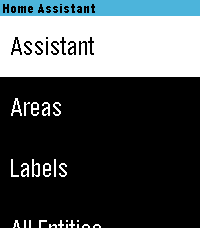</a>

<h2 class="app-name" id="app-68dea5734be9cb0009429595"><a href="https://apps.repebble.com/68dea5734be9cb0009429595">Home Assistant WS</a></h2>
<a class="app-source" href="https://github.com/skylord123/pebble-home-assistant-ws" title="Source code" data-search-exclude>View source</a>

by <a href="https://apps.repebble.com/apps/dev/skylar-sadlier_5d01f46b419d5a0001a47cfb" title="More from this developer">Skylar Sadlier</a>

Not checked yet v3.0 Updated 2026-08-29

Runs on: Round 2, Time 2, Pebble 2 Duo, Pebble 2, Time Round, Time, Classic

Home Assistant control with real-time updates, voice commands, entity history, calendars, and support for a wide range of devices and helpers. Control your Home Assistant smart home directly from…

<a class="app-shot" href="https://apps.rebble.io/en_US/application/5a4533bf461a8d60350019d9" data-search-exclude>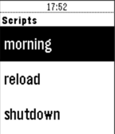</a>

<h2 class="app-name" id="app-5a4533bf461a8d60350019d9"><a href="https://apps.rebble.io/en_US/application/5a4533bf461a8d60350019d9">HomeAssistant</a></h2>
<a class="app-source" href="https://github.com/mhtsbt/PebbleHomeAssistant" title="Source code" data-search-exclude>View source</a>

by <a href="https://apps.rebble.io/en_US/developer/57c9ffdfbe5ad0936b000114/1" title="More from this developer">Matthias Hutsebaut</a>

Not checked yet v1.0 Updated 2017-12-28 Rebble App Store

Runs on: Time 2, Time

This app allows to trigger home-assistant scripts on your watch!

<a class="app-shot" href="https://apps.repebble.com/553723fe1fa0b37b9800002f" data-search-exclude>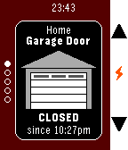</a>

<h2 class="app-name" id="app-553723fe1fa0b37b9800002f"><a href="https://apps.repebble.com/553723fe1fa0b37b9800002f">HomeP - For MyQ Garage Doors &amp; Light Switches</a></h2>
<a class="app-source" href="https://github.com/SeaPea/HomeP" title="Source code" data-search-exclude>View source</a>

by <a href="https://apps.repebble.com/apps/dev/seapea-software_52f00ed07a772ced5d0000db" title="More from this developer">SeaPea Software</a>

MIT v2.2 Updated 2017-02-23

Runs on: Round 2, Time 2, Pebble 2 Duo, Pebble 2, Time Round, Time, Classic

Unofficial watch app for monitoring and operating Chamberlain/Liftmaster branded MyQ devices over the Internet (Requires MyQ Internet Gateway, usually sold separately) , now including the &quot;MyQ…

<h2 class="app-name" id="app-abf0a3fa4b7044308388f53d"><a href="https://apps.repebble.com/abf0a3fa4b7044308388f53d">Homey Flows</a></h2>
<a class="app-source" href="https://github.com/ttkhamis/homey-flow-trigger" title="Source code" data-search-exclude>View source</a>

by <a href="https://apps.repebble.com/apps/dev/tom-khamis_221fb95fe8d07190aa28efe3" title="More from this developer">Tom Khamis</a>

Not checked yet v1.3.0 Updated 2026-06-07

Runs on: Time 2

Trigger your Homey flows directly from your Pebble Time 2, no phone needed once configured. Browse up to 5 customizable flow shortcuts on your wrist and fire them instantly with a single button…

<a class="app-shot" href="https://apps.repebble.com/5727044991da39820e000002" data-search-exclude>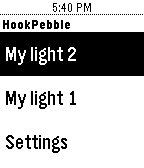</a>

<h2 class="app-name" id="app-5727044991da39820e000002"><a href="https://apps.repebble.com/5727044991da39820e000002">Hook</a></h2>
<a class="app-source" href="http://www.yaoyuyang.com/" title="Source code" data-search-exclude>View source</a>

by <a href="https://apps.repebble.com/apps/dev/yaoyu-yang_550cbee5deb0adbde6000074" title="More from this developer">Yaoyu Yang</a>

See source v0.1 Updated 2016-05-03

Runs on: Round 2, Time 2, Pebble 2 Duo, Pebble 2, Time Round, Time, Classic

Control your Hook devices on Pebble watch!

<a class="app-shot" href="https://apps.repebble.com/68fa323fa0599b0008f65a07" data-search-exclude>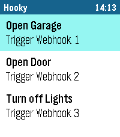</a>

<h2 class="app-name" id="app-68fa323fa0599b0008f65a07"><a href="https://apps.repebble.com/68fa323fa0599b0008f65a07">Hooky</a></h2>
<a class="app-source" href="https://github.com/michi1996/pebble-hooky-webhook-trigger" title="Source code" data-search-exclude>View source</a>

by <a href="https://apps.repebble.com/apps/dev/achi_5b39d75c38e0aa0001e8c763" title="More from this developer">Achi</a>

Not checked yet v3.1.0 Updated 2026-10-04

Runs on: Round 2, Time 2, Pebble 2 Duo, Pebble 2, Time Round, Time, Classic

Hooky lets you trigger webhooks from your Pebble smartwatch with a single tap. Control smart home devices, send notifications or connect your favorite services – simple, fast and reliable. Key…

<h2 class="app-name" id="app-69207ecd7cdf9d000985e1a7"><a href="https://apps.rebble.io/en_US/application/69207ecd7cdf9d000985e1a7">Horizon</a></h2>
<a class="app-source" href="https://github.com/skooda/pebble-horizon" title="Source code" data-search-exclude>View source</a>

by <a href="https://apps.rebble.io/en_US/developer/6903ea5c69551c0009c36237/1" title="More from this developer">V3L</a>

Not checked yet v1.0 Updated 2025-11-21 Rebble App Store

Runs on: Round 2, Time 2, Pebble 2 Duo, Pebble 2, Time Round, Time, Classic

Toy displaying an artificial horizon (attitude indicator) based on accelerometer data. It shows a horizontal line rotated according to the tilt of the watch and includes several graphical elements…

<a class="app-shot" href="https://apps.repebble.com/b255f708d396497fa1af400f" data-search-exclude>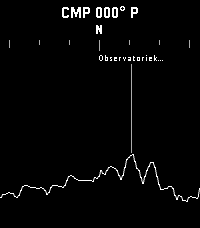</a>

<h2 class="app-name" id="app-b255f708d396497fa1af400f"><a href="https://apps.repebble.com/b255f708d396497fa1af400f">Horizon Scout</a></h2>
<a class="app-source" href="https://github.com/KarlKl/HorizonScout" title="Source code" data-search-exclude>View source</a>

by <a href="https://apps.repebble.com/apps/dev/karl_0e91d84045d24bb5497e1700" title="More from this developer">Karl</a>

No licence v1.0 Updated 2026-03-29

Runs on: Round 2, Time 2, Pebble 2 Duo, Pebble 2, Time Round, Time, Classic

Explore the world around you with Horizon Scout, an app that identifies mountains and peaks in your view based on your location and direction. Perfect for hikers, outdoor enthusiasts, and anyone…

<a class="app-shot" href="https://apps.repebble.com/e179bf68b6924b09858dd59d" data-search-exclude>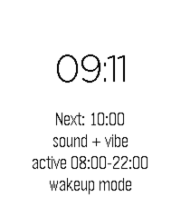</a>

<h2 class="app-name" id="app-e179bf68b6924b09858dd59d"><a href="https://apps.repebble.com/e179bf68b6924b09858dd59d">Hourly Chime</a></h2>
<a class="app-source" href="https://github.com/BigWebstas/PebbleHourlyChime" title="Source code" data-search-exclude>View source</a>

by <a href="https://apps.repebble.com/apps/dev/webstas-webstas_990614069b2a89f2e0c44e8b" title="More from this developer">Webstas “Webstas”</a>

No licence v1.4.0 Updated 2026-09-09

Runs on: Time 2, Pebble 2 Duo

A PebbleOS watchapp that chimes on the hour with the speaker and/or the vibration motor. Runs on Pebble Time 2 (emery) and Pebble 2 Duo (flint) — the two watches with a speaker.

<a class="app-shot" href="https://apps.repebble.com/b8ed8bf41c0142dfbd4fe9c5" data-search-exclude>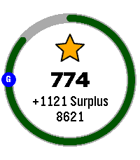</a>

<h2 class="app-name" id="app-b8ed8bf41c0142dfbd4fe9c5"><a href="https://apps.repebble.com/b8ed8bf41c0142dfbd4fe9c5">Hourly Steps</a></h2>
<a class="app-source" href="https://github.com/Shacker10/Hourly-Steps" title="Source code" data-search-exclude>View source</a>

by <a href="https://apps.repebble.com/apps/dev/scott-hacker_d1afe4ba70cf58368a1f209d" title="More from this developer">Scott Hacker</a>

MIT v1.0.0 Updated 2026-07-22

Runs on: Round 2, Time 2

Hourly Steps mimics Fitbit&#x27;s &quot;Reminder to Move&quot; functionality but with way more user control. Through App settings you can adjust: - What hour to start getting reminders - How many minutes before…

<a class="app-shot" href="https://apps.repebble.com/567af43af66b129c7200002b" data-search-exclude>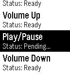</a>

<h2 class="app-name" id="app-567af43af66b129c7200002b"><a href="https://apps.repebble.com/567af43af66b129c7200002b">HTTP Push</a></h2>
<a class="app-source" href="https://github.com/skonagaya/HTTP-Push" title="Source code" data-search-exclude>View source</a>

by <a href="https://apps.repebble.com/apps/dev/groundhogday_566a7b7691873f15f800000e" title="More from this developer">groundhogday</a>

Not checked yet v3.2 Updated 2017-08-14

Runs on: Round 2, Time 2, Pebble 2 Duo, Pebble 2, Time Round, Time, Classic

A customizable HTTP request WatchApp perfect for Home Automation. The configuration page allows you to test requests before publishing to your Pebble. Configure any number of HTTP GET/POST…

<a class="app-shot" href="https://apps.repebble.com/698fc9d8086643000aef17a3" data-search-exclude>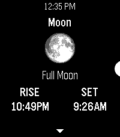</a>

<h2 class="app-name" id="app-698fc9d8086643000aef17a3"><a href="https://apps.repebble.com/698fc9d8086643000aef17a3">Hubble</a></h2>
<a class="app-source" href="https://github.com/erlog135/hubble" title="Source code" data-search-exclude>View source</a>

by <a href="https://apps.repebble.com/apps/dev/logan-head_5c26a4f727cdec0001c0500d" title="More from this developer">Logan Head</a>

Not checked yet v1.0 Updated 2026-02-14

Runs on: Round 2, Time 2, Pebble 2 Duo, Pebble 2, Time Round, Time, Classic

An astronomy app for Pebble. It uses the time and your location to obtain the azimuth &amp; altitude of the sun, moon, planets, and various constellations. Eligible bodies will also display their…

<a class="app-shot" href="https://apps.repebble.com/5090015e5ff24c0c9f46af74" data-search-exclude>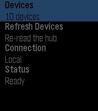</a>

<h2 class="app-name" id="app-5090015e5ff24c0c9f46af74"><a href="https://apps.repebble.com/5090015e5ff24c0c9f46af74">Hubitat Control</a></h2>
<a class="app-source" href="https://github.com/Vision9074/pebble-app-hubitat-control" title="Source code" data-search-exclude>View source</a>

by <a href="https://apps.repebble.com/apps/dev/vision9074_e7a26c7cc7610e75672e26e7" title="More from this developer">vision9074</a>

No licence v1.1.0 Updated 2026-08-12

Runs on: Round 2, Time 2, Pebble 2 Duo, Pebble 2, Time Round, Time, Classic

Control your Hubitat home from your wrist. A Pebble watch app for lights, dimmers, speakers, locks, garage doors, shades, and sensors, talking to your hub through its built-in Maker API app — over…

<a class="app-shot" href="https://apps.repebble.com/7fd2ec0472eb43a589c03d7a" data-search-exclude>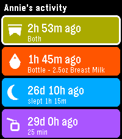</a>

<h2 class="app-name" id="app-7fd2ec0472eb43a589c03d7a"><a href="https://apps.repebble.com/7fd2ec0472eb43a589c03d7a">Huckleberry</a></h2>
<a class="app-source" href="https://github.com/RobErskine/pebble-huckleberry" title="Source code" data-search-exclude>View source</a>

by <a href="https://apps.repebble.com/apps/dev/roberskine_184b13a8b0e0be736034d50a" title="More from this developer">RobErskine</a>

MIT v1.1.0 Updated 2026-07-16

Runs on: Round 2, Time 2, Pebble 2 Duo, Pebble 2, Time Round, Time, Classic

See your children&#x27;s latest logs from Huckleberry so you can always stay on top of diaper changes and upcoming bottle feedings.

<a class="app-shot" href="https://apps.repebble.com/df31f62140dc46f295201620" data-search-exclude>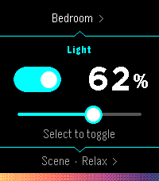</a>

<h2 class="app-name" id="app-df31f62140dc46f295201620"><a href="https://apps.repebble.com/df31f62140dc46f295201620">Hueble</a></h2>
<a class="app-source" href="https://github.com/Nicell/hueble" title="Source code" data-search-exclude>View source</a>

by <a href="https://apps.repebble.com/apps/dev/nick-winans_d41cec2e1676d30103d578c3" title="More from this developer">Nick Winans</a>

MIT v1.0.1 Updated 2026-07-20

Runs on: Round 2, Time 2

Hueble is a focused, watch-first remote for Philips Hue. Open it directly into your last room, toggle its lights, adjust brightness, or activate a scene without reaching for your phone. Rooms and…

<h2 class="app-name" id="app-56fcd2da636d81906900001a"><a href="https://apps.repebble.com/56fcd2da636d81906900001a">Hug Counter</a></h2>
<a class="app-source" href="https://github.com/BlackLamb/hugcounter" title="Source code" data-search-exclude>View source</a>

by <a href="https://apps.repebble.com/apps/dev/fathom_52b21441cd41836178000058" title="More from this developer">Fathom</a>

No licence v2.0 Updated 2016-08-31

Runs on: Round 2, Time 2, Pebble 2 Duo, Pebble 2, Time Round, Time, Classic

Count down from a set number of hugs! Make sure your loved ones get all the hugs they ask for.

<h2 class="app-name" id="app-561fd3fc36c6e8fdf0000084"><a href="https://apps.repebble.com/561fd3fc36c6e8fdf0000084">Hurry Up! Rennes</a></h2>
<a class="app-source" href="https://github.com/Lesterpig/hurry-up-rennes" title="Source code" data-search-exclude>View source</a>

by <a href="https://apps.repebble.com/apps/dev/lesterpig_55b8b589a06a0e5c1800003e" title="More from this developer">Lesterpig</a>

No licence v0.3 Updated 2016-10-07

Runs on: Round 2, Time 2, Pebble 2 Duo, Pebble 2, Time Round, Time, Classic

Alpha version! Displays next bus departures for nearest / bookmarked bus stops in realtime. Works only in Rennes (FR). Long click on select button while in stop details to (un)bookmark it…

<h2 class="app-name" id="app-69ed55b9d88ca00009d4d793"><a href="https://apps.rebble.io/en_US/application/69ed55b9d88ca00009d4d793">HVV Departures</a></h2>
<a class="app-source" href="https://github.com/aveao/pebble-hvv" title="Source code" data-search-exclude>View source</a>

by <a href="https://apps.rebble.io/en_US/developer/532c736a9df2460935000317/1" title="More from this developer">ave</a>

MIT v1.8.1 Updated 2026-10-03 Rebble App Store

Runs on: Round 2, Time 2, Pebble 2 Duo, Pebble 2, Time, Classic

Departure viewer for Hamburger Verkehrsverbund buses/trains/S-Bahn, with support for nearby stops, live departures and auto-refresh. Privacy remark: Out of the box the app sends a small amount of…

