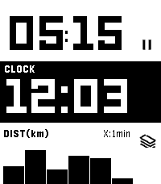

<!-- Generated by scripts/update_app_directory.py: do not edit by hand -->
# Watchapps: I

[← About this list](../watchapps.md) · [A](a.md) · [B](b.md) · [C](c.md) · [D](d.md) · [E](e.md) · [F](f.md) · [G](g.md) · [H](h.md) · **I** · [J](j.md) · [K](k.md) · [L](l.md) · [M](m.md) · [N](n.md) · [O](o.md) · [P](p.md) · [Q](q.md) · [R](r.md) · [S](s.md) · [T](t.md) · [U](u.md) · [V](v.md) · [W](w.md) · [X](x.md) · [Y](y.md) · [Z](z.md) · [0–9 & other](other.md)

*33 watchapps · Last updated 2026-10-06*

| Screenshot | Name | Developer | Licence | Updated | Description |
|------------|------|-----------|---------|---------|-------------|
| { loading=lazy width="72" } | [I can fly](https://apps.repebble.com/54f0c7166ef0940b2b00008c) | [tmnhy](https://bitbucket.org/tmnhy/icanfly/src) | <small>See source</small> | 2015-02-27 | Player throws his Pebble as high as he can. The higher, the better. Pebble registers the height. WARNING: Throwing a Pebble high into the air may result in… |
| { loading=lazy width="72" } | [I Ching](https://apps.repebble.com/32871ae08d244c0abcbeae94) | [David Konsumer](https://github.com/konsumer/pebble_iching) | <small>Not checked yet</small> | 2026-07-31 | Get I Ching reading on your watch! |
| { loading=lazy width="72" } | [Icon Pop Quiz](https://apps.repebble.com/53246928fec90d583c0000b2) | [Alegrium](http://www.alegrium.com/) | <small>See source</small> | 2014-03-28 | ICON POP Quiz challenges players to name famous characters using imaginative, handcrafted visual clues inspired by each answer. Can you guess all the icons? |
| { loading=lazy width="72" } | [Idle Dungeon](https://apps.repebble.com/38d23789644c43558635081a) | [daipoyo](https://github.com/daipoyo/idle_dungeon) | <small>Not checked yet</small> | 2026-09-22 | Idle Dungeon turns the steps you take during the day into a dungeon crawl. Pick a dungeon in the morning and go about your day. Every step carries the hero… |
| { loading=lazy width="72" } | [IFLocation](https://apps.repebble.com/56b47e6a02a659ea2e00000e) | [CMWen](http://cmwen.github.io/iflocation/) | <small>See source</small> | 2016-04-21 | IFLocation is an watch app allows you to send IFTTT Maker event on your waist. You need to connect your Maker channel, get the Maker key, then open the… |
| { loading=lazy width="72" } | [igi-Assistant](https://apps.repebble.com/008e01e6880644b0abc2abe9) | [iginoc](https://github.com/iginoc/igi-assistant) | <small>Not checked yet</small> | 2026-04-22 | A comprehensive control interface for Home Assistant on your Pebble smartwatch. Monitor sensors, control lights, manage music, and chat with your home, all… |
| { loading=lazy width="72" } | [igitimer](https://apps.repebble.com/bb5bc885bd1f4d469571a699) | [iginoc](https://github.com/iginoc/igitimer) | <small>Not checked yet</small> | 2026-05-31 | A simple and functional timer for Pebble smartwatches, featuring a high-contrast interface and quick controls. Button Functions UP Button Single Press: Adds… |
| { loading=lazy width="72" } | [igitimer-graphic-big](https://apps.repebble.com/df73341019fd4b5fa0f30f17) | [iginoc](https://github.com/iginoc/igitimer-graphic-big) | <small>Not checked yet</small> | 2026-05-27 | Timer with nice animations |
| { loading=lazy width="72" } | [Image Viewer](https://apps.repebble.com/53bdb1291c6da72083000044) | [Grégoire Sage](https://github.com/gregoiresage/pebble-image-viewer) | <small>Not checked yet</small> | 2015-07-02 | Proof of Concept Display images from internet on your Pebble Choose your image in the configuration page (jpeg/gif/png or pbi) |
| { loading=lazy width="72" } | [iMessenger](https://apps.rebble.io/en_US/application/5f275d5a3dd3109039c0c6b5) <small>Rebble App Store</small> | [mcmanetta](https://github.com/integraloftheday/Pebble-Imessager) | <small>Not checked yet</small> | 2020-08-03 | Since the takeover by Fitbit pebble smartwatches could no longer send messages on iPhones. However, using this watch app and server applications users can… |
| { loading=lazy width="72" } | [Imperial to Metric Converter](https://apps.repebble.com/548902db7d4e8e0a9e000041) | [Greg Lockwood](https://github.com/greglockwood/Imp2MetricPebble) | <small>Not checked yet</small> | 2015-04-16 | Simple imperial to metric conversion app that allows you to quickly convert between units by drilling down in menus until you find a value of sufficient… |
| { loading=lazy width="72" } | [Indigo Remote](https://apps.repebble.com/52f1d0b8e21be4b820000eb6) | [Zach Benz](https://github.com/ZachBenz/IndigoRemote) | <small>Not checked yet</small> | 2014-02-15 | A remote control for Perceptive Automation's excellent Indigo home automation server for Mac OS X. New in Version 1.1: More robust configuration, faster… |
| { loading=lazy width="72" } | [Indigo Remote+](https://apps.repebble.com/5541773725cbe39ea900000f) | [Seth Goldman](https://github.com/srgoldman/IndigoRemote) | <small>Not checked yet</small> | 2015-08-31 | An updated version of Zach Benz's Indigo Remote app. A remote control for Perceptive Automation's excellent Indigo home automation server for Mac OS X… |
| { loading=lazy width="72" } | [Indoor Softball Scorer](https://apps.repebble.com/5627b6cbcf5a8e00c600005f) | [Steve Karmeinsky](https://github.com/stevekennedyuk/IndoorSoftballScoring) | <small>Not checked yet</small> | 2016-03-01 | An app to help score indoor softball (and time innings), can be paused and restarted |
| { loading=lazy width="72" } | [InstAPP](https://apps.rebble.io/en_US/application/5859480706e776ae7200039f) <small>Rebble App Store</small> | [Igor Zalomskij](https://github.com/kaist/instapp) | <small>Not checked yet</small> | 2017-08-15 | !!! Its work again!!! InstApp is the app to view instagram timeline on PebbleTime. Attention! The app works with my server. This means that ALL… |
| { loading=lazy width="72" } | [Instaweather](https://apps.rebble.io/en_US/application/60e088801342ae01703c8430) <small>Rebble App Store</small> | [drkitt](https://github.com/drkitt/instaweather) | <small>Not checked yet</small> | 2021-07-03 | Instaweather is a weather app that fetches and caches weather data in the background every hour so you can view up-to-date weather instantly. |
| { loading=lazy width="72" } | [Insteon Control](https://apps.repebble.com/5591f1640c3212b7dc0000ad) | [Swisskid](https://github.com/SwissKid/pebble-insteon-control) | <small>Not checked yet</small> | 2015-06-30 | Insteon control Not functioning for everyone, and I haven't been able to find the source of the issue. Only reason it's up is because the users who it *was*… |
| { loading=lazy width="72" } | [Interval Timer](https://apps.repebble.com/559726f570f2c3e22500008f) | [Brian Folts](https://github.com/bafolts/pebble-interval-timer) | <small>Not checked yet</small> | 2015-07-04 | Interval timer app. Useful for when doing intervals. Upon completion of an interval the watch will vibrate to indicate the start of the next interval. The… |
| { loading=lazy width="72" } | [Intervals](https://apps.repebble.com/53211e857b666361f5000239) | [Jace Ferguson](https://github.com/fjace05/pebble-intervals) | <small>Not checked yet</small> | 2014-03-13 | Set multiple timers each with a different countdown time. The app will cycle through the timers and vibrate when a timer elapses. Starts over when all set… |
| { loading=lazy width="72" } | [Intervals Wellness Sync](https://apps.rebble.io/en_US/application/6a9cbfd2d5f13e000a813cca) <small>Rebble App Store</small> | [Daktak](https://github.com/daktak/pebble-intervals-wellness) | <small>Not checked yet</small> | 2026-09-24 | Push sleep, hr and step data to intervals.icu For HRV, enable in background apps (Pebble Time 2) |
| { loading=lazy width="72" } | [Intervals.icu](https://apps.rebble.io/en_US/application/6a813cce06c3a00009b85c96) <small>Rebble App Store</small> | [Daktak](https://github.com/daktak/pebble_intervals_icu) | <small>Not checked yet</small> | 2026-10-02 | Unofficial Intervals.icu app View the weeks activities and summary View your fitness/form graph |
| { loading=lazy width="72" } | [IoT Buddy](https://apps.repebble.com/568f550d05f633c62800003d) | [amcolash](https://github.com/amcolash/PebbleIoT) | <small>Not checked yet</small> | 2016-10-28 | IoT Buddy is an app to send commands to the Maker channel of IFTTT. Currently is supports sending a simple POST to the channel. You can add as many event… |
| { loading=lazy width="72" } | [IP Cam Alarm](https://apps.repebble.com/55e6171cf6d4f9b842000071) | [Stefanos Togoulidis](https://github.com/hypest/ipcamAlarmPebble) | <small>Not checked yet</small> | 2015-09-04 | IP Cam Alarm toggles your Foscam's email alarm setting, effectively "arming" the alarm. Email and alarm settings need to be set up through your Foscam… |
| { loading=lazy width="72" } | [Irish Weather](https://apps.repebble.com/54a33341cab1c18f05000160) | [finmix](http://www.CloudServicesIreland.com) | <small>See source</small> | 2016-03-06 | Simple Irish Weather App that shows you Today, Tomorrow & the 3 Day Outlook for Ireland; as well as regional weather. Data is pulled directly from the MET… |
| { loading=lazy width="72" } | [IRKit Remote](https://apps.repebble.com/54b7e129986a229c5700004c) | [Makoto Kawasaki](https://github.com/makotokw/pebble-irkit-remote) | <small>Not checked yet</small> | 2016-10-12 | Send IR signal to IRKit. (IRKit device is IR remote controller and is seller in only Japan) Japanese IRkitに赤外線コマンドを送信します。設定方法はWEBSITEを確認してください。 |
| { loading=lazy width="72" } | [Iron](https://apps.repebble.com/6c34b655b63f4f8a918844a8) | [1987haaa](https://github.com/hag1987haaa/Iron-for-Pebble) | <small>Not checked yet</small> | 2026-10-05 | Iron - Workout Companion for Pebble Iron is a high-performance, open-source sports tracker for your Pebble smartwatch. Designed for runners and fitness… |
| { loading=lazy width="72" } | [Iron](https://apps.rebble.io/en_US/application/6a3af8195961b6000983ee8f) <small>Rebble App Store</small> | [1987haaa](https://github.com/hag1987haaa/Iron-for-Pebble) | <small>Not checked yet</small> | 2026-10-05 | Iron - Workout Companion for Pebble Iron is a high-performance, open-source sports tracker for your Pebble smartwatch. Designed for runners and fitness… |
| { loading=lazy width="72" } | [Is Deadpool Out Yet?](https://apps.repebble.com/55f3c813f4177db70e00005c) | [Patrick Teglia](https://github.com/teglia/isdeadpooloutyet/tree/pebble-develop) | <small>Not checked yet</small> | 2015-09-14 | Is Deadpool out yet? You won't know until you put this on your watch! |
| { loading=lazy width="72" } | [Is Socs Open](https://apps.repebble.com/567f3278d1d309864700015c) | [John Wiseheart](https://github.com/johnwiseheart/issocsopen-pebble) | <small>Not checked yet</small> | 2015-12-27 | Is Socs Open lets you know whether or not the CSESoc office is open, from the convenience of your Pebble. |
| { loading=lazy width="72" } | [Ishiki](https://apps.repebble.com/d6892e90080847018c17441c) | [Fanu](https://github.com/f4nu/ishiki) | <small>Not checked yet</small> | 2026-06-05 | Ishiki — Anki on your wrist Flashcards on your wrist. Flip, grade, repeat. Review your Anki decks straight from your Core Time 2. Pick a deck, read the… |
|  | [Ishiki JP](https://apps.repebble.com/0578bf44c3184b82acd4d200) | [Fanu](https://github.com/f4nu/ishiki) | <small>Not checked yet</small> | 2026-06-23 | Flashcards on your wrist. Flip, grade, repeat. Supports the Japanese language. Review your Anki decks straight from your Core Time 2. Pick a deck, read the… |
| { loading=lazy width="72" } | [It's Tavern Brawl Time](https://apps.repebble.com/56d6ca7d153e89984a00000f) | [gibbage](https://github.com/gibbage/tavern-brawl-time) | <small>Not checked yet</small> | 2016-03-29 | Sick of opening Hearthstone just to see details of the latest Tavern Brawl? Me too! So why not let your Pebble do the work for you? "It's Tavern Brawl Time"… |
| { loading=lazy width="72" } | [iTunesify Remote](https://apps.repebble.com/55b5bdfe5e07169f58000022) | [Mario Cecchi](https://github.com/macecchi/pebble-itunesify-remote) | <small>Not checked yet</small> | 2016-07-07 | Control iTunes and Spotify on your Mac using your Pebble, just like the Music app! You'll need to run 'iTunesify Remote for Pebble' on your Mac. On your… |
