---
hide:
  - toc
---

<!-- Generated by scripts/update_app_directory.py: do not edit by hand -->
# Pebble Apps: I

[← All Pebble Apps](../watchapps.md) · [A](a.md) · [B](b.md) · [C](c.md) · [D](d.md) · [E](e.md) · [F](f.md) · [G](g.md) · [H](h.md) · **I** · [J](j.md) · [K](k.md) · [L](l.md) · [M](m.md) · [N](n.md) · [O](o.md) · [P](p.md) · [Q](q.md) · [R](r.md) · [S](s.md) · [T](t.md) · [U](u.md) · [V](v.md) · [W](w.md) · [X](x.md) · [Y](y.md) · [Z](z.md) · [0–9 & other](other.md)

*32 apps · Last updated 2026-10-06 · [About these lists](../about-app-lists.md)*

<a class="app-shot" href="https://apps.repebble.com/54f0c7166ef0940b2b00008c" data-search-exclude>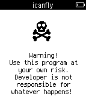</a>

<h2 class="app-name" id="app-54f0c7166ef0940b2b00008c"><a href="https://apps.repebble.com/54f0c7166ef0940b2b00008c">I can fly</a></h2>
<a class="app-source" href="https://bitbucket.org/tmnhy/icanfly/src" title="Source code" data-search-exclude>View source</a>

by <a href="https://apps.repebble.com/apps/dev/tmnhy_54647acdd238c5d89300001e" title="More from this developer">tmnhy</a>

See source v1.0 Updated 2015-02-27

Runs on: Time 2, Pebble 2 Duo, Pebble 2, Time, Classic

Player throws his Pebble as high as he can. The higher, the better. Pebble registers the height. WARNING: Throwing a Pebble high into the air may result in both damage to the Pebble, property…

<a class="app-shot" href="https://apps.repebble.com/32871ae08d244c0abcbeae94" data-search-exclude>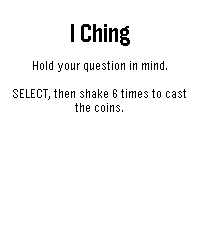</a>

<h2 class="app-name" id="app-32871ae08d244c0abcbeae94"><a href="https://apps.repebble.com/32871ae08d244c0abcbeae94">I Ching</a></h2>
<a class="app-source" href="https://github.com/konsumer/pebble_iching" title="Source code" data-search-exclude>View source</a>

by <a href="https://apps.repebble.com/apps/dev/david-konsumer_52bcf29983ed912283000028" title="More from this developer">David Konsumer</a>

Not checked yet v1.0.1 Updated 2026-07-31

Runs on: Round 2, Time 2, Pebble 2 Duo, Pebble 2, Time Round, Time

Get I Ching reading on your watch!

<a class="app-shot" href="https://apps.repebble.com/53246928fec90d583c0000b2" data-search-exclude>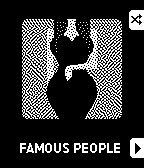</a>

<h2 class="app-name" id="app-53246928fec90d583c0000b2"><a href="https://apps.repebble.com/53246928fec90d583c0000b2">Icon Pop Quiz</a></h2>
<a class="app-source" href="http://www.alegrium.com/" title="Source code" data-search-exclude>View source</a>

by <a href="https://apps.repebble.com/apps/dev/alegrium_53246842a072ac5e9d000102" title="More from this developer">Alegrium</a>

See source v1.0.2 Updated 2014-03-28

Runs on: Time 2, Pebble 2 Duo, Pebble 2, Time, Classic

ICON POP Quiz challenges players to name famous characters using imaginative, handcrafted visual clues inspired by each answer. Can you guess all the icons?

<a class="app-shot" href="https://apps.repebble.com/38d23789644c43558635081a" data-search-exclude>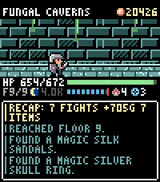</a>

<h2 class="app-name" id="app-38d23789644c43558635081a"><a href="https://apps.repebble.com/38d23789644c43558635081a">Idle Dungeon</a></h2>
<a class="app-source" href="https://github.com/daipoyo/idle_dungeon" title="Source code" data-search-exclude>View source</a>

by <a href="https://apps.repebble.com/apps/dev/daipoyo_af992eff386264ca6a6e17bb" title="More from this developer">daipoyo</a>

Not checked yet v1.0.3 Updated 2026-09-22

Runs on: Time 2

Idle Dungeon turns the steps you take during the day into a dungeon crawl. Pick a dungeon in the morning and go about your day. Every step carries the hero deeper: monsters, traps, fountains and…

<a class="app-shot" href="https://apps.repebble.com/56b47e6a02a659ea2e00000e" data-search-exclude>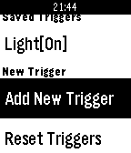</a>

<h2 class="app-name" id="app-56b47e6a02a659ea2e00000e"><a href="https://apps.repebble.com/56b47e6a02a659ea2e00000e">IFLocation</a></h2>
<a class="app-source" href="http://cmwen.github.io/iflocation/" title="Source code" data-search-exclude>View source</a>

by <a href="https://apps.repebble.com/apps/dev/cmwen_5553ace1dd51ad193d000060" title="More from this developer">CMWen</a>

See source v1.7 Updated 2016-04-21

Runs on: Time 2, Pebble 2 Duo, Pebble 2, Time, Classic

IFLocation is an watch app allows you to send IFTTT Maker event on your waist. You need to connect your Maker channel, get the Maker key, then open the settings of this app on your phone…

<a class="app-shot" href="https://apps.repebble.com/008e01e6880644b0abc2abe9" data-search-exclude>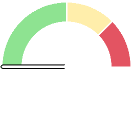</a>

<h2 class="app-name" id="app-008e01e6880644b0abc2abe9"><a href="https://apps.repebble.com/008e01e6880644b0abc2abe9">igi-Assistant</a></h2>
<a class="app-source" href="https://github.com/iginoc/igi-assistant" title="Source code" data-search-exclude>View source</a>

by <a href="https://apps.repebble.com/apps/dev/iginoc_b831c2f23c283d5eb0ca1134" title="More from this developer">iginoc</a>

Not checked yet v1.4.1 Updated 2026-04-22

Runs on: Round 2, Time 2, Pebble 2 Duo, Pebble 2, Time Round, Time, Classic

A comprehensive control interface for Home Assistant on your Pebble smartwatch. Monitor sensors, control lights, manage music, and chat with your home, all from your wrist with a high-contrast…

<a class="app-shot" href="https://apps.repebble.com/bb5bc885bd1f4d469571a699" data-search-exclude>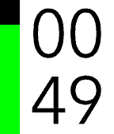</a>

<h2 class="app-name" id="app-bb5bc885bd1f4d469571a699"><a href="https://apps.repebble.com/bb5bc885bd1f4d469571a699">igitimer</a></h2>
<a class="app-source" href="https://github.com/iginoc/igitimer" title="Source code" data-search-exclude>View source</a>

by <a href="https://apps.repebble.com/apps/dev/iginoc_b831c2f23c283d5eb0ca1134" title="More from this developer">iginoc</a>

Not checked yet v1.4.0 Updated 2026-05-31

Runs on: Round 2, Time 2, Pebble 2 Duo, Pebble 2, Time Round, Time, Classic

A simple and functional timer for Pebble smartwatches, featuring a high-contrast interface and quick controls. Button Functions UP Button Single Press: Adds 1 minute to the timer. Long Press: Adds…

<a class="app-shot" href="https://apps.repebble.com/df73341019fd4b5fa0f30f17" data-search-exclude>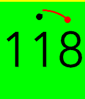</a>

<h2 class="app-name" id="app-df73341019fd4b5fa0f30f17"><a href="https://apps.repebble.com/df73341019fd4b5fa0f30f17">igitimer-graphic-big</a></h2>
<a class="app-source" href="https://github.com/iginoc/igitimer-graphic-big" title="Source code" data-search-exclude>View source</a>

by <a href="https://apps.repebble.com/apps/dev/iginoc_b831c2f23c283d5eb0ca1134" title="More from this developer">iginoc</a>

Not checked yet v1.6 Updated 2026-05-27

Runs on: Round 2, Time 2, Pebble 2 Duo, Pebble 2, Time Round, Time, Classic

Timer with nice animations

<h2 class="app-name" id="app-53bdb1291c6da72083000044"><a href="https://apps.repebble.com/53bdb1291c6da72083000044">Image Viewer</a></h2>
<a class="app-source" href="https://github.com/gregoiresage/pebble-image-viewer" title="Source code" data-search-exclude>View source</a>

by <a href="https://apps.repebble.com/apps/dev/gr-goire-sage_52b216cf05c04653a9000080" title="More from this developer">Grégoire Sage</a>

Not checked yet v2.3 Updated 2015-07-02

Runs on: Time 2, Pebble 2 Duo, Pebble 2, Time, Classic

Proof of Concept Display images from internet on your Pebble Choose your image in the configuration page (jpeg/gif/png or pbi)

<a class="app-shot" href="https://apps.rebble.io/en_US/application/5f275d5a3dd3109039c0c6b5" data-search-exclude>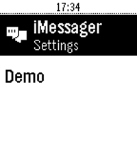</a>

<h2 class="app-name" id="app-5f275d5a3dd3109039c0c6b5"><a href="https://apps.rebble.io/en_US/application/5f275d5a3dd3109039c0c6b5">iMessenger</a></h2>
<a class="app-source" href="https://github.com/integraloftheday/Pebble-Imessager" title="Source code" data-search-exclude>View source</a>

by <a href="https://apps.rebble.io/en_US/developer/5f275d593dd3109039c0c6b3/1" title="More from this developer">mcmanetta</a>

Not checked yet v0.4 Updated 2020-08-03 Rebble App Store

Runs on: Round 2, Time 2, Pebble 2 Duo, Pebble 2, Time Round, Time, Classic

Since the takeover by Fitbit pebble smartwatches could no longer send messages on iPhones. However, using this watch app and server applications users can once again send iMessages from iPhones…

<a class="app-shot" href="https://apps.repebble.com/548902db7d4e8e0a9e000041" data-search-exclude>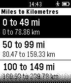</a>

<h2 class="app-name" id="app-548902db7d4e8e0a9e000041"><a href="https://apps.repebble.com/548902db7d4e8e0a9e000041">Imperial to Metric Converter</a></h2>
<a class="app-source" href="https://github.com/greglockwood/Imp2MetricPebble" title="Source code" data-search-exclude>View source</a>

by <a href="https://apps.repebble.com/apps/dev/greg-lockwood_548443cf9b0ef2e77e000070" title="More from this developer">Greg Lockwood</a>

Not checked yet v1.4 Updated 2015-04-16

Runs on: Time 2, Pebble 2 Duo, Pebble 2, Time, Classic

Simple imperial to metric conversion app that allows you to quickly convert between units by drilling down in menus until you find a value of sufficient accuracy. So the less precision you…

<h2 class="app-name" id="app-52f1d0b8e21be4b820000eb6"><a href="https://apps.repebble.com/52f1d0b8e21be4b820000eb6">Indigo Remote</a></h2>
<a class="app-source" href="https://github.com/ZachBenz/IndigoRemote" title="Source code" data-search-exclude>View source</a>

by <a href="https://apps.repebble.com/apps/dev/zach-benz_52f04fb9af0eabd0d500123e" title="More from this developer">Zach Benz</a>

Other v1.1 Updated 2014-02-15

Runs on: Time 2, Pebble 2 Duo, Pebble 2, Time, Classic

A remote control for Perceptive Automation&#x27;s excellent Indigo home automation server for Mac OS X. New in Version 1.1: More robust configuration, faster loading Please note: Perceptive Automation…

<a class="app-shot" href="https://apps.repebble.com/5541773725cbe39ea900000f" data-search-exclude>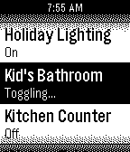</a>

<h2 class="app-name" id="app-5541773725cbe39ea900000f"><a href="https://apps.repebble.com/5541773725cbe39ea900000f">Indigo Remote+</a></h2>
<a class="app-source" href="https://github.com/srgoldman/IndigoRemote" title="Source code" data-search-exclude>View source</a>

by <a href="https://apps.repebble.com/apps/dev/seth-goldman_52f02429af0eabd57c0006f9" title="More from this developer">Seth Goldman</a>

Not checked yet v2.4 Updated 2015-08-31

Runs on: Time 2, Pebble 2 Duo, Pebble 2, Time, Classic

An updated version of Zach Benz&#x27;s Indigo Remote app. A remote control for Perceptive Automation&#x27;s excellent Indigo home automation server for Mac OS X. There is a limit of 50 devices and 50…

<a class="app-shot" href="https://apps.repebble.com/5627b6cbcf5a8e00c600005f" data-search-exclude>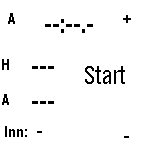</a>

<h2 class="app-name" id="app-5627b6cbcf5a8e00c600005f"><a href="https://apps.repebble.com/5627b6cbcf5a8e00c600005f">Indoor Softball Scorer</a></h2>
<a class="app-source" href="https://github.com/stevekennedyuk/IndoorSoftballScoring" title="Source code" data-search-exclude>View source</a>

by <a href="https://apps.repebble.com/apps/dev/steve-karmeinsky_52e55acb6ff0da2ece000657" title="More from this developer">Steve Karmeinsky</a>

Not checked yet v1.3 Updated 2016-03-01

Runs on: Round 2, Time 2, Pebble 2 Duo, Pebble 2, Time Round, Time, Classic

An app to help score indoor softball (and time innings), can be paused and restarted

<a class="app-shot" href="https://apps.rebble.io/en_US/application/5859480706e776ae7200039f" data-search-exclude>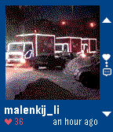</a>

<h2 class="app-name" id="app-5859480706e776ae7200039f"><a href="https://apps.rebble.io/en_US/application/5859480706e776ae7200039f">InstAPP</a></h2>
<a class="app-source" href="https://github.com/kaist/instapp" title="Source code" data-search-exclude>View source</a>

by <a href="https://apps.rebble.io/en_US/developer/583c663200355a4bea00030d/1" title="More from this developer">Igor Zalomskij</a>

Not checked yet v1.2 Updated 2017-08-15 Rebble App Store

Runs on: Round 2, Time 2, Time Round, Time

!!! Its work again!!! InstApp is the app to view instagram timeline on PebbleTime. Attention! The app works with my server. This means that ALL communication goes through a third party site…

<a class="app-shot" href="https://apps.rebble.io/en_US/application/60e088801342ae01703c8430" data-search-exclude>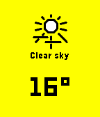</a>

<h2 class="app-name" id="app-60e088801342ae01703c8430"><a href="https://apps.rebble.io/en_US/application/60e088801342ae01703c8430">Instaweather</a></h2>
<a class="app-source" href="https://github.com/drkitt/instaweather" title="Source code" data-search-exclude>View source</a>

by <a href="https://apps.rebble.io/en_US/developer/60e088801342ae01703c842e/1" title="More from this developer">drkitt</a>

Not checked yet v1.0 Updated 2021-07-03 Rebble App Store

Runs on: Round 2, Time 2, Pebble 2 Duo, Pebble 2, Time Round, Time, Classic

Instaweather is a weather app that fetches and caches weather data in the background every hour so you can view up-to-date weather instantly.

<a class="app-shot" href="https://apps.repebble.com/5591f1640c3212b7dc0000ad" data-search-exclude>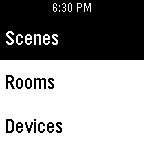</a>

<h2 class="app-name" id="app-5591f1640c3212b7dc0000ad"><a href="https://apps.repebble.com/5591f1640c3212b7dc0000ad">Insteon Control</a></h2>
<a class="app-source" href="https://github.com/SwissKid/pebble-insteon-control" title="Source code" data-search-exclude>View source</a>

by <a href="https://apps.repebble.com/apps/dev/swisskid_5396b6edae4b4c2f8800000d" title="More from this developer">Swisskid</a>

No licence v1.01 Updated 2015-06-30

Runs on: Time 2, Pebble 2 Duo, Pebble 2, Time, Classic

Insteon control Not functioning for everyone, and I haven&#x27;t been able to find the source of the issue. Only reason it&#x27;s up is because the users who it *was* functioning for requested I leave it…

<a class="app-shot" href="https://apps.repebble.com/559726f570f2c3e22500008f" data-search-exclude>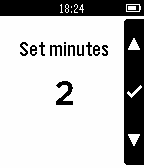</a>

<h2 class="app-name" id="app-559726f570f2c3e22500008f"><a href="https://apps.repebble.com/559726f570f2c3e22500008f">Interval Timer</a></h2>
<a class="app-source" href="https://github.com/bafolts/pebble-interval-timer" title="Source code" data-search-exclude>View source</a>

by <a href="https://apps.repebble.com/apps/dev/brian-folts_55915487612d762e0e000058" title="More from this developer">Brian Folts</a>

No licence v1.0 Updated 2015-07-04

Runs on: Time 2, Pebble 2 Duo, Pebble 2, Time, Classic

Interval timer app. Useful for when doing intervals. Upon completion of an interval the watch will vibrate to indicate the start of the next interval. The interval can be paused or restarted at…

<a class="app-shot" href="https://apps.repebble.com/53211e857b666361f5000239" data-search-exclude>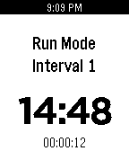</a>

<h2 class="app-name" id="app-53211e857b666361f5000239"><a href="https://apps.repebble.com/53211e857b666361f5000239">Intervals</a></h2>
<a class="app-source" href="https://github.com/fjace05/pebble-intervals" title="Source code" data-search-exclude>View source</a>

by <a href="https://apps.repebble.com/apps/dev/jace-ferguson_531b8b8f2a95cc72b00008b7" title="More from this developer">Jace Ferguson</a>

Not checked yet v2.0.0 Updated 2014-03-13

Runs on: Time 2, Pebble 2 Duo, Pebble 2, Time, Classic

Set multiple timers each with a different countdown time. The app will cycle through the timers and vibrate when a timer elapses. Starts over when all set timers have expired. [Double Click…

<a class="app-shot" href="https://apps.rebble.io/en_US/application/6a9cbfd2d5f13e000a813cca" data-search-exclude>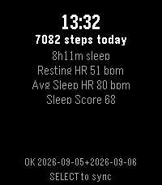</a>

<h2 class="app-name" id="app-6a9cbfd2d5f13e000a813cca"><a href="https://apps.rebble.io/en_US/application/6a9cbfd2d5f13e000a813cca">Intervals Wellness Sync</a></h2>
<a class="app-source" href="https://github.com/daktak/pebble-intervals-wellness" title="Source code" data-search-exclude>View source</a>

by <a href="https://apps.rebble.io/en_US/developer/56e681d026fa04b2d900006c/1" title="More from this developer">Daktak</a>

Not checked yet v1.5.0 Updated 2026-09-24 Rebble App Store

Runs on: Round 2, Time 2, Pebble 2 Duo, Pebble 2, Time Round, Time

Push sleep, hr and step data to intervals.icu For HRV, enable in background apps (Pebble Time 2)

<a class="app-shot" href="https://apps.rebble.io/en_US/application/6a813cce06c3a00009b85c96" data-search-exclude>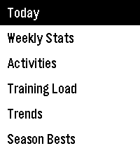</a>

<h2 class="app-name" id="app-6a813cce06c3a00009b85c96"><a href="https://apps.rebble.io/en_US/application/6a813cce06c3a00009b85c96">Intervals.icu</a></h2>
<a class="app-source" href="https://github.com/daktak/pebble_intervals_icu" title="Source code" data-search-exclude>View source</a>

by <a href="https://apps.rebble.io/en_US/developer/56e681d026fa04b2d900006c/1" title="More from this developer">Daktak</a>

Not checked yet v0.6.0 Updated 2026-10-02 Rebble App Store

Runs on: Time 2, Pebble 2 Duo, Pebble 2, Time

Unofficial Intervals.icu app View the weeks activities and summary View your fitness/form graph

<a class="app-shot" href="https://apps.repebble.com/568f550d05f633c62800003d" data-search-exclude>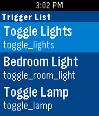</a>

<h2 class="app-name" id="app-568f550d05f633c62800003d"><a href="https://apps.repebble.com/568f550d05f633c62800003d">IoT Buddy</a></h2>
<a class="app-source" href="https://github.com/amcolash/PebbleIoT" title="Source code" data-search-exclude>View source</a>

by <a href="https://apps.repebble.com/apps/dev/amcolash_535552f41b0c43bce500007f" title="More from this developer">amcolash</a>

MIT v2.2 Updated 2016-10-28

Runs on: Round 2, Time 2, Pebble 2 Duo, Pebble 2, Time Round, Time, Classic

IoT Buddy is an app to send commands to the Maker channel of IFTTT. Currently is supports sending a simple POST to the channel. You can add as many event triggers as you want to the list and can…

<h2 class="app-name" id="app-55e6171cf6d4f9b842000071"><a href="https://apps.repebble.com/55e6171cf6d4f9b842000071">IP Cam Alarm</a></h2>
<a class="app-source" href="https://github.com/hypest/ipcamAlarmPebble" title="Source code" data-search-exclude>View source</a>

by <a href="https://apps.repebble.com/apps/dev/stefanos-togoulidis_54efae372e6a47962d0000cd" title="More from this developer">Stefanos Togoulidis</a>

Not checked yet v1.1 Updated 2015-09-04

Runs on: Time 2, Pebble 2 Duo, Pebble 2, Time, Classic

IP Cam Alarm toggles your Foscam&#x27;s email alarm setting, effectively &quot;arming&quot; the alarm. Email and alarm settings need to be set up through your Foscam control panel.

<h2 class="app-name" id="app-54a33341cab1c18f05000160"><a href="https://apps.repebble.com/54a33341cab1c18f05000160">Irish Weather</a></h2>
<a class="app-source" href="http://www.CloudServicesIreland.com" title="Source code" data-search-exclude>View source</a>

by <a href="https://apps.repebble.com/apps/dev/finmix_547e259fbca84bf7cf00007a" title="More from this developer">finmix</a>

See source v2.2 Updated 2016-03-06

Runs on: Time 2, Pebble 2 Duo, Pebble 2, Time, Classic

Simple Irish Weather App that shows you Today, Tomorrow &amp; the 3 Day Outlook for Ireland; as well as regional weather. Data is pulled directly from the MET Eireann website and updated hourly. It&#x27;s…

<a class="app-shot" href="https://apps.repebble.com/54b7e129986a229c5700004c" data-search-exclude>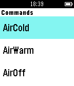</a>

<h2 class="app-name" id="app-54b7e129986a229c5700004c"><a href="https://apps.repebble.com/54b7e129986a229c5700004c">IRKit Remote</a></h2>
<a class="app-source" href="https://github.com/makotokw/pebble-irkit-remote" title="Source code" data-search-exclude>View source</a>

by <a href="https://apps.repebble.com/apps/dev/makoto-kawasaki_531f1484433d09be900001b5" title="More from this developer">Makoto Kawasaki</a>

Not checked yet v1.4 Updated 2016-10-12

Runs on: Round 2, Time 2, Pebble 2 Duo, Pebble 2, Time Round, Time, Classic

Send IR signal to IRKit. (IRKit device is IR remote controller and is seller in only Japan) Japanese IRkitに赤外線コマンドを送信します。設定方法はWEBSITEを確認してください。

<a class="app-shot" href="https://apps.repebble.com/6c34b655b63f4f8a918844a8" data-search-exclude>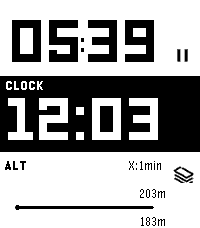</a>

<h2 class="app-name" id="app-6c34b655b63f4f8a918844a8"><a href="https://apps.repebble.com/6c34b655b63f4f8a918844a8">Iron</a></h2>
<a class="app-source" href="https://github.com/hag1987haaa/Iron-for-Pebble" title="Source code" data-search-exclude>View source</a>

by <a href="https://apps.repebble.com/apps/dev/1987haaa_4f73b53120792bffd3b3c1b4" title="More from this developer">1987haaa</a>

Not checked yet v1.4.1 Updated 2026-10-05

Runs on: Round 2, Time 2, Pebble 2 Duo, Pebble 2, Time Round, Time, Classic

Iron - Workout Companion for Pebble Iron is a high-performance, open-source sports tracker for your Pebble smartwatch. Designed for runners and fitness enthusiasts, it tracks your real-time…

<a class="app-shot" href="https://apps.repebble.com/55f3c813f4177db70e00005c" data-search-exclude>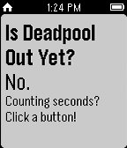</a>

<h2 class="app-name" id="app-55f3c813f4177db70e00005c"><a href="https://apps.repebble.com/55f3c813f4177db70e00005c">Is Deadpool Out Yet?</a></h2>
<a class="app-source" href="https://github.com/teglia/isdeadpooloutyet/tree/pebble-develop" title="Source code" data-search-exclude>View source</a>

by <a href="https://apps.repebble.com/apps/dev/patrick-teglia_557f8130e512e3e392000089" title="More from this developer">Patrick Teglia</a>

Not checked yet v1.2 Updated 2015-09-14

Runs on: Time 2, Pebble 2 Duo, Pebble 2, Time, Classic

Is Deadpool out yet? You won&#x27;t know until you put this on your watch!

<h2 class="app-name" id="app-567f3278d1d309864700015c"><a href="https://apps.repebble.com/567f3278d1d309864700015c">Is Socs Open</a></h2>
<a class="app-source" href="https://github.com/johnwiseheart/issocsopen-pebble" title="Source code" data-search-exclude>View source</a>

by <a href="https://apps.repebble.com/apps/dev/john-wiseheart_567e35b6c247f87509000477" title="More from this developer">John Wiseheart</a>

Not checked yet v1.0 Updated 2015-12-27

Runs on: Time 2, Pebble 2 Duo, Pebble 2, Time, Classic

Is Socs Open lets you know whether or not the CSESoc office is open, from the convenience of your Pebble.

<h2 class="app-name" id="app-d6892e90080847018c17441c"><a href="https://apps.repebble.com/d6892e90080847018c17441c">Ishiki</a></h2>
<a class="app-source" href="https://github.com/f4nu/ishiki" title="Source code" data-search-exclude>View source</a>

by <a href="https://apps.repebble.com/apps/dev/fanu_106d07aaa0bc0803240043f1" title="More from this developer">Fanu</a>

Not checked yet v0.2.2 Updated 2026-06-05

Runs on: Time 2

Ishiki — Anki on your wrist Flashcards on your wrist. Flip, grade, repeat. Review your Anki decks straight from your Core Time 2. Pick a deck, read the front, press to flip, and grade with a…

<a class="app-shot" href="https://apps.repebble.com/0578bf44c3184b82acd4d200" data-search-exclude>No screenshot</a>

<h2 class="app-name" id="app-0578bf44c3184b82acd4d200"><a href="https://apps.repebble.com/0578bf44c3184b82acd4d200">Ishiki JP</a></h2>
<a class="app-source" href="https://github.com/f4nu/ishiki" title="Source code" data-search-exclude>View source</a>

by <a href="https://apps.repebble.com/apps/dev/fanu_106d07aaa0bc0803240043f1" title="More from this developer">Fanu</a>

Not checked yet v0.3.0 Updated 2026-06-23

Runs on: Time 2

Flashcards on your wrist. Flip, grade, repeat. Supports the Japanese language. Review your Anki decks straight from your Core Time 2. Pick a deck, read the front, press to flip, and grade with a…

<a class="app-shot" href="https://apps.repebble.com/56d6ca7d153e89984a00000f" data-search-exclude>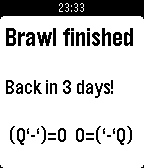</a>

<h2 class="app-name" id="app-56d6ca7d153e89984a00000f"><a href="https://apps.repebble.com/56d6ca7d153e89984a00000f">It&#x27;s Tavern Brawl Time</a></h2>
<a class="app-source" href="https://github.com/gibbage/tavern-brawl-time" title="Source code" data-search-exclude>View source</a>

by <a href="https://apps.repebble.com/apps/dev/gibbage_53709b2b73825a03f20000c8" title="More from this developer">gibbage</a>

Not checked yet v1.5 Updated 2016-03-29

Runs on: Time 2, Pebble 2 Duo, Pebble 2, Time, Classic

Sick of opening Hearthstone just to see details of the latest Tavern Brawl? Me too! So why not let your Pebble do the work for you? &quot;It&#x27;s Tavern Brawl Time&quot; is a simple watchapp that displays the…

<a class="app-shot" href="https://apps.repebble.com/55b5bdfe5e07169f58000022" data-search-exclude>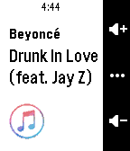</a>

<h2 class="app-name" id="app-55b5bdfe5e07169f58000022"><a href="https://apps.repebble.com/55b5bdfe5e07169f58000022">iTunesify Remote</a></h2>
<a class="app-source" href="https://github.com/macecchi/pebble-itunesify-remote" title="Source code" data-search-exclude>View source</a>

by <a href="https://apps.repebble.com/apps/dev/mario-cecchi_52f135477435d3a17f0001a4" title="More from this developer">Mario Cecchi</a>

Not checked yet v1.5 Updated 2016-07-07

Runs on: Round 2, Time 2, Pebble 2 Duo, Pebble 2, Time Round, Time, Classic

Control iTunes and Spotify on your Mac using your Pebble, just like the Music app! You&#x27;ll need to run &#x27;iTunesify Remote for Pebble&#x27; on your Mac. On your Mac, go to bit.ly/pebble-itunes-mac and…

