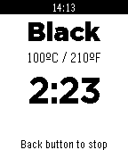
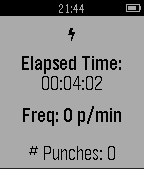
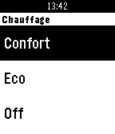
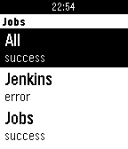
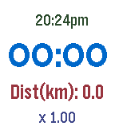
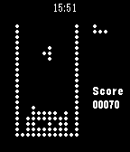
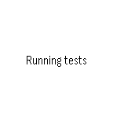
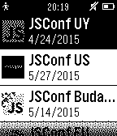
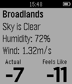
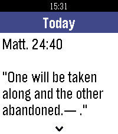

<!-- Generated by scripts/update_app_directory.py: do not edit by hand -->
# Watchapps: J

[← About this list](../watchapps.md) · [A](a.md) · [B](b.md) · [C](c.md) · [D](d.md) · [E](e.md) · [F](f.md) · [G](g.md) · [H](h.md) · [I](i.md) · **J** · [K](k.md) · [L](l.md) · [M](m.md) · [N](n.md) · [O](o.md) · [P](p.md) · [Q](q.md) · [R](r.md) · [S](s.md) · [T](t.md) · [U](u.md) · [V](v.md) · [W](w.md) · [X](x.md) · [Y](y.md) · [Z](z.md) · [0–9 & other](other.md)

*13 watchapps · Last updated 2026-10-06*

| Screenshot | Name | Developer | Licence | Updated | Description |
|------------|------|-----------|---------|---------|-------------|
| { loading=lazy width="72" } | [J's Tea Timer](https://apps.repebble.com/5421ac37c6da7aeb0000018b) | [Jaran Nilsen](https://github.com/jarannilsen/PebbleTeaTime) | <small>Not checked yet</small> | 2014-10-15 | Tea timer for your Pebble. Select your type of tea and the application will tell you the best temperature for the water and how long you should let your tea… |
| { loading=lazy width="72" } | [Jab](https://apps.repebble.com/5529cf1a05b83a307900009e) | [Hongyu Chen](https://github.com/hongyuchen/jab) | <small>Not checked yet</small> | 2015-04-12 | Until now, measuring improvement and tracking performance for punch-based athletics were difficult tasks, measured only by the face of your opponents. Now… |
| { loading=lazy width="72" } | [JavaPay](https://apps.repebble.com/54527bf9d692a12cfa000081) | [Alex Akers](https://github.com/a2/javapay) | <small>Not checked yet</small> | 2015-11-01 | JavaPay allows quick access to your Starbucks card. Just enter your card number on the watch and scan it at the till to pay. ——— Disclaimer: JavaPay is not… |
| { loading=lazy width="72" } | [Jebble](https://apps.repebble.com/56a49e1711d0acdd4700002a) | [Edouard Kleinhans](https://github.com/edouardkleinhans/jebble_watchapp) | <small>Not checked yet</small> | 2016-11-03 | Plugin pour permettre à votre montre Pebble de contrôler Jeedom (www.jeedom.fr) |
| { loading=lazy width="72" } | [Jenkins Build Status](https://apps.repebble.com/558723ce4fa1ea5864000035) | [FuriKuri](https://github.com/FuriKuri/jenkins-build-status.git) | <small>No licence</small> | 2015-06-21 | Simple app to get an overview of your Jenkins jobs. |
| { loading=lazy width="72" } | [Jogger](https://apps.repebble.com/5479daef572d57ad9100002b) | [Antonio Asaro](https://github.com/antonioasaro/Antonio-Jogger) | <small>Not checked yet</small> | 2016-03-06 | Very very simple jogging aid. For 10+1 runs. Vibrates after 10mins (== walk break) and then one minute later (== resume running). Buttons: top=start… |
| { loading=lazy width="72" } | [JP'Tris](https://apps.repebble.com/52ff8e23432d1c7d2200012c) | [JP'Studio](https://github.com/jpca/pebble-jptris) | <small>Not checked yet</small> | 2014-02-17 | This is a Tetris clone for pebble smart watch, with extra pieces if you exceed 300 points. Instructions : - up button : move left - down button : move right… |
| { loading=lazy width="72" } | [JS Compatibility](https://apps.repebble.com/576619b60cc8f5552100016d) | [Brian Douglass](https://github.com/bhdouglass/pebble-js-compatibility) | <small>Not checked yet</small> | 2016-06-22 | A Pebble watch app to test the compatibility of different JavaScript engines. This is being used to test RockWork's compatibility with the official Pebble… |
| { loading=lazy width="72" } | [JsConf](https://apps.repebble.com/54ebb991b0a2e249e20000e9) | [Joel Lovera](https://github.com/loverajoel/jsconf-pebble) | <small>Not checked yet</small> | 2015-02-23 | - Events - Talks - Info Beta version Open source project |
| { loading=lazy width="72" } | [json_pull](https://apps.repebble.com/5717ea24a86f0f5c67000008) | [phntxx](https://github.com/PHNTXX/first_pebble_app) | <small>Not checked yet</small> | 2016-08-26 | my first pebble app. basically just pulls information from json apis. credit goes to openweathermap, bitcoinaverage and theysaidso for the apis. |
| { loading=lazy width="72" } | [JumpRopeCounter](https://apps.repebble.com/55cd00b3197194813b000045) | [Fumikazu Fujiwara](https://github.com/freddiefujiwara/JumpRopeCounter) | <small>Not checked yet</small> | 2015-08-13 | You can count your jump rope exercise now! |
| { loading=lazy width="72" } | [Just Weather](https://apps.repebble.com/54db4d94d913346bc3000055) | [Honourity](https://github.com/jtcgreyfox/PBWeather) | <small>Not checked yet</small> | 2016-09-01 | Gets current weather stats for current location. Update: Added choice of wind speed units in app config. Displays: Closest location weather data was… |
| { loading=lazy width="72" } | [JW Daily Text](https://apps.repebble.com/672b1221aeef4d30897a361c) | [testarossa47](https://github.com/testarossa47/jw-daily-text) | <small>Not checked yet</small> | 2026-09-21 | Read today's Bible text and commentary on your Pebble. Works offline, preselects your watch language, with color UI, smooth day animations and touch scrolling. |
