<!-- Generated by scripts/update_app_directory.py: do not edit by hand -->
# Watchapps: K

[← About this list](../watchapps.md) · [A](a.md) · [B](b.md) · [C](c.md) · [D](d.md) · [E](e.md) · [F](f.md) · [G](g.md) · [H](h.md) · [I](i.md) · [J](j.md) · **K** · [L](l.md) · [M](m.md) · [N](n.md) · [O](o.md) · [P](p.md) · [Q](q.md) · [R](r.md) · [S](s.md) · [T](t.md) · [U](u.md) · [V](v.md) · [W](w.md) · [X](x.md) · [Y](y.md) · [Z](z.md) · [0–9 & other](other.md)

*32 watchapps · Last updated 2026-10-06*

| Screenshot | Name | Developer | Licence | Updated | Description |
|------------|------|-----------|---------|---------|-------------|
| { loading=lazy width="72" } | [Kablooey!](https://apps.repebble.com/1e6c5bbde96f4e6ca3497194) | [Ben Combee (@unwiredben)](https://github.com/unwiredben/kablooey-for-pebble) | <small>Not checked yet</small> | 2026-09-18 | Scarry Kablam is at it again, and you and your bucket brigade are what stands in the way of devastation. Use your touch-enabled Pebble Time 2 to catch the… |
| 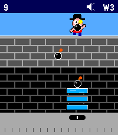{ loading=lazy width="72" } | [Kablooey!](https://apps.rebble.io/en_US/application/6aaccb0543e51f0009de7a05) <small>Rebble App Store</small> | [Ben Combee (@unwiredben)](https://github.com/unwiredben/kablooey-for-pebble) | <small>Not checked yet</small> | 2026-09-18 | Scarry Kablam is at it again, and you and your bucket brigade are what stands in the way of devastation. Use your touch-enabled Pebble Time 2 to catch the… |
| 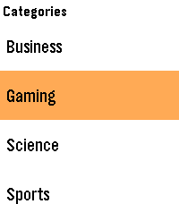{ loading=lazy width="72" } | [Kagi News](https://apps.rebble.io/en_US/application/692b3f0549be450009b545ce) <small>Rebble App Store</small> | [James Downs](https://github.com/CometDog/pebble-kite) | GPL-3.0 | 2026-06-18 | Unofficial front-end for Kagi News. About the App: !NEW! Now supports touch-based navigation on Pebble Time 2 and Pebble Round 2. Scroll up and down on… |
| 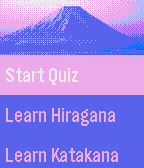{ loading=lazy width="72" } | [Kana Teacher](https://apps.repebble.com/549aed9ca0bb069fba0000f6) | [Filip](https://github.com/Aare-/PebbleKana) | GPL-2.0 | 2016-10-04 | Learn hiragana and katakana on the go! Test your knowledge in a highly configurable quiz mini-game. |
| 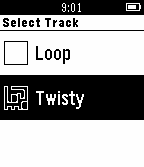{ loading=lazy width="72" } | [Kart](https://apps.repebble.com/558697acf14558ea410000a0) | [Matt Williams](https://github.com/matt-williams/pebble-kart) | <small>Not checked yet</small> | 2015-06-23 | A kart-racing game for the Pebble Watch, controlled using the built-in accelerometer. Now working in colour on Pebble Time as well as original Pebble! |
| 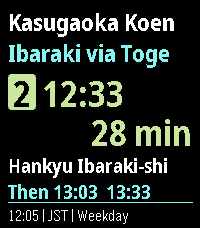{ loading=lazy width="72" } | [KasugaBus](https://apps.repebble.com/f63e6ed24301414a95909564) | [Edward](https://github.com/ewijaya/kasugabus-pebble) | <small>Not checked yet</small> | 2026-10-02 | Local buses for Minami-kasugaoka, Ibaraki, Osaka, Japan. KasugaBus shows the next scheduled Kintetsu and Hankyu buses at eight stops around… |
| 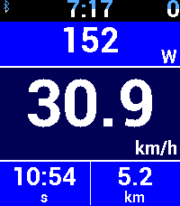{ loading=lazy width="72" } | [KayPS](https://apps.rebble.io/en_US/application/6a8533eb6b779600084ed8e1) <small>Rebble App Store</small> | [Daktak](https://github.com/daktak/JayPS-WatchFace) | <small>Not checked yet</small> | 2026-09-08 | Android app required. https://github.com/daktak/JayPS-AndroidApp (formerly known as Pebble Bike/Ventoo/JayPS) KayPS is a GPS sports tracker for your Pebble… |
| 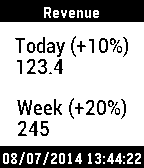{ loading=lazy width="72" } | [Keboola Stats](https://apps.repebble.com/53bbd8c7c22300d74600018a) | [Keboola](https://github.com/keboola/pebble-watchapp) | <small>Not checked yet</small> | 2014-08-22 | The most important BI metric at your fingertips (literally). “Keboola Stats” connects with your data to deliver business insights on the go. Whether it's a… |
| 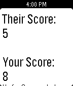{ loading=lazy width="72" } | [Keep Score](https://apps.repebble.com/53668fce14acdba301000218) | [Ravin](https://github.com/randomite/Pebble/tree/master/KeepScore) | <small>Not checked yet</small> | 2014-05-27 | A simple app to keep the score, whether you're playing golf with a buddy, ping-pong with some friends, or watching your daughter's soccer tournament, "Keep… |
| { loading=lazy width="72" } | [KEXP Now Playing](https://apps.repebble.com/54f249a4150dd1f8120000ab) | [Rachael Ludwick](https://github.com/ludwick/pebble-kexp-now-playing) | <small>Not checked yet</small> | 2015-02-28 | KEXP Now Playing shows at application start the currently playing song on the radio station KEXP (http://kexp.org/). Force it to refresh by pressing the… |
| 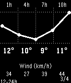{ loading=lazy width="72" } | [Keystone](https://apps.repebble.com/69b1ef8172240d000a726e3a) | [Christophe Jeannette](https://github.com/Sichroteph/Din-Clean-App) | <small>Not checked yet</small> | 2026-03-24 | Keystone turns your Pebble into a fully button-driven hub. It looks like a watchface, but every button is yours. Short press opens custom menus or widgets… |
| 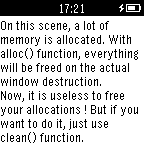{ loading=lazy width="72" } | [Khelljyr Framework Example (garbage collector)](https://apps.repebble.com/54b7e81f986a22be1a000072) | [Nicolas VAREILLE](https://github.com/nvareille/Khelljyr) | <small>Not checked yet</small> | 2015-01-15 | This is an example made with Khelljyr Pebble Framework The topic of this example is the garbage collector feature. /!\This is a code example for pebble… |
| 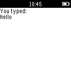{ loading=lazy width="72" } | [Khelljyr Framework Example (Keyboard Scene)](https://apps.repebble.com/54c75f12c5de00257c0000bb) | [Nicolas VAREILLE](https://github.com/nvareille/KhelljyrExamples/tree/master/simple_keyboard_demo) | <small>Not checked yet</small> | 2015-01-27 | This is an example made with Khelljyr Pebble Framework The topic of this example is the Keyboard scene feature. /!\This is a code example for pebble. Unless… |
| 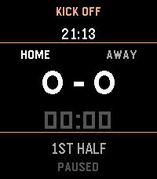{ loading=lazy width="72" } | [Kick Off](https://apps.repebble.com/edd90fe5fe5f47cd91e8cb68) | [Kris Gesling](https://github.com/krisgesling/pebble-kick-off) | <small>Not checked yet</small> | 2026-04-04 | A simple football (soccer) game tracking app, perfect for kids game day. |
| 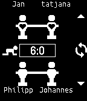{ loading=lazy width="72" } | [Kicker App](https://apps.repebble.com/540dc1d840aa75a29700018b) | [Railslove](https://github.com/stephanpavlovic/pebble-kicker-app) | <small>Not checked yet</small> | 2015-06-20 | All your foosball matches on your wrist. Create your own league at http://kicker.cool |
| 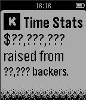{ loading=lazy width="72" } | [Kickstarter Stats](https://apps.repebble.com/54fe872bdbd96e00fa0000c0) | [Greg Lockwood](https://github.com/greglockwood/PebbleTimeKickstarterStats) | <small>Not checked yet</small> | 2015-03-10 | Display how much money the Pebble guys made with the Pebble Time project on KickStarter. No guarantees are provided that this will continue to work since… |
| 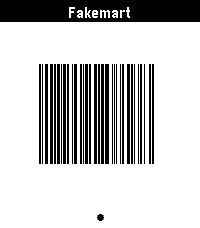{ loading=lazy width="72" } | [kijete](https://apps.repebble.com/6a10bbd87d641e0009ce6a58) | [Hazel Atkinson](https://github.com/yellowsink/kijete/) | <small>Not checked yet</small> | 2026-05-22 | kijete is an app for Pebble that allows you to display Code 128, Aztec, Data Matrix, PDF417, and QR codes on your wrist. It is a fork of Skunk by Harley… |
| 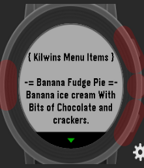{ loading=lazy width="72" } | [Kilwins Store](https://apps.rebble.io/en_US/application/58d412536ca387b8da0001b2) <small>Rebble App Store</small> | [Russian Otter](https://www.kilwins.com/) | <small>Not checked yet</small> | 2017-03-23 | This app contains a full list of all the ice creams found at Kilwins Ice Cream and Candy Stores! Updates will come out soon for more information on all the… |
| 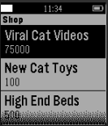{ loading=lazy width="72" } | [Kitty Clicker](https://apps.repebble.com/561146339af99091be000007) | [Grylis](https://github.com/Grylis/kittycatclicker) | <small>No licence</small> | 2015-10-04 | Kitty Clicker! This game is an incremental game for the Pebble watch that involves cats. |
| 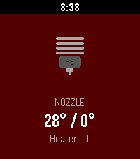{ loading=lazy width="72" } | [Klipper Monitor](https://apps.repebble.com/a363f7be311a4480831ab357) | [willbsp](https://github.com/willbsp/klipper-pebble) | <small>Not checked yet</small> | 2026-05-28 | Monitor your Klipper 3D printer |
| 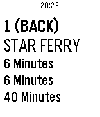{ loading=lazy width="72" } | [KMB Estimate Arrival Time](https://apps.repebble.com/576e766d6c21042b7b00004f) | [Richard Fan](https://github.com/richardfan1126/pebble-kmb-eta) | <small>Not checked yet</small> | 2016-06-26 | Pebble app for getting KMB bus arrival time |
| 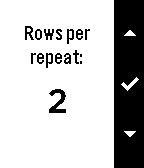{ loading=lazy width="72" } | [Knibble](https://apps.repebble.com/56e3a8485d0b2e499d000037) | [Indika Informatics](https://github.com/kaveet/knibble) | <small>Not checked yet</small> | 2016-03-20 | NiftyKnit is reborn as Knibble! Keep track of your knitting row and repeat counts from the convenience of your wrist. Knibble even remembers where you left… |
| 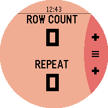{ loading=lazy width="72" } | [Knibble In The Round](https://apps.repebble.com/571198f9c96f2ef8fc000007) | [Android Hell](https://github.com/AndroidHell/KnibbleInTheRound) | <small>No licence</small> | 2016-04-22 | DISCLAIMER: This is a fork of Knibble by Indika Informatics with PTR compatability. Knibble In The Round is a simple stitch counter for knitters. It keeps… |
| 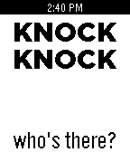{ loading=lazy width="72" } | [Knock Knock](https://apps.repebble.com/53439874b32bb7bda9000070) | [PebbLiz Technologies](https://github.com/pouves/Knock-Knock) | <small>Not checked yet</small> | 2014-05-20 | Knock-knock jokes! (version 2.0...double the jokes!) Make a knocking motion with your hand to generate a joke...push the down button for the punchline!… |
| { loading=lazy width="72" } | [Know everything](https://apps.repebble.com/560c32454bf0ac0115000095) | [Samuel](https://github.com/samuelmr/pebble-knoweverything) | <small>Not checked yet</small> | 2016-05-19 | Encyclopedia always at hand. Long press select, speak a term and get the Wikipedia definition to your watch. Get random articles from Wikipedia with a flick… |
| 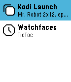{ loading=lazy width="72" } | [Kodi Launch](https://apps.repebble.com/57e837473095e38a8900036c) | [YS](https://github.com/ghys/pebble-kodi-launch) | <small>Not checked yet</small> | 2026-03-16 | The most complete controller and library browser for Kodi! (This watchapp is unofficial and not endorsed or supported by Team Kodi or the XBMC Foundation… |
| 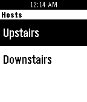{ loading=lazy width="72" } | [Kodi Remote](https://apps.repebble.com/558ed93ea6c6cce3c60000a5) | [Jeremy Marzka](https://github.com/jamarzka/pebble-kodi-remote) | <small>Not checked yet</small> | 2015-06-28 | A simple and easy-to-use remote control for Kodi. Features: - Easy configuration for multiple devices - Separate controls for playback and navigation … |
| 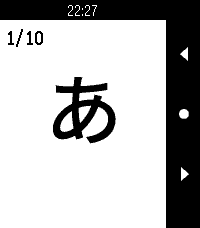{ loading=lazy width="72" } | [Koishi - Japanese Kana Flashcards](https://apps.repebble.com/64177b1e419fd9053e31a7b5) | [robinfire110](https://github.com/robinfire110/koishi-japanese-flashcards) | <small>Not checked yet</small> | 2026-07-19 | Koishi is a flashcard application that gives you a full set of Japanese Hiragana and Katakana flashcards right on your wrist! Study your kana recognition… |
| 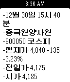{ loading=lazy width="72" } | [KOREA STOCK](https://apps.repebble.com/5688becc03f3a1b21a000051) | [Hyunjoong Kim](https://github.com/82joong/PebbleKoreaStock) | <small>No licence</small> | 2016-01-03 | - Settings를 통해 주식 코드 등록 - 내가 등록한 코스닥/코스피 종목 실시간 확인 - 상세 항목에서 5초 마다 데이터 업데이트 |
| 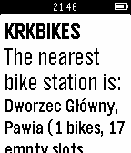{ loading=lazy width="72" } | [KRKBIKES](https://apps.repebble.com/55d44bf939cb5c7ee7000077) | [njet](https://github.com/tenpawelnowak/KRKBIKES-for-Pebble) | <small>Not checked yet</small> | 2015-08-19 | KRKBIKES displays the nearest city bike station in Cracow, Poland. |
| 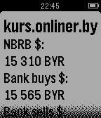{ loading=lazy width="72" } | [kurs.onliner.by](https://apps.repebble.com/54c93a4bbcb00065d300004b) | [introkun](http://github.com/introkun/PebbleCurrencyMinsk) | <small>No licence</small> | 2015-01-28 | Most recent currency exchange rates in Minsk, Belarus |
| 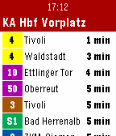{ loading=lazy width="72" } | [KVV.live](https://apps.repebble.com/52bb592c530bf4dc60000018) | [luchs](https://github.com/lluchs/kvv.live) | <small>Not checked yet</small> | 2016-12-13 | Shows live departure data from Karlsruhe's public transit (KVV). Configure your frequented stops on the phone, then view departure information on Pebble… |
