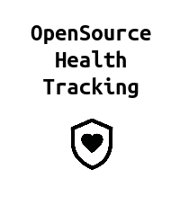
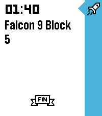

<!-- Generated by scripts/update_app_directory.py: do not edit by hand -->
# Watchapps: L

[← About this list](../watchapps.md) · [A](a.md) · [B](b.md) · [C](c.md) · [D](d.md) · [E](e.md) · [F](f.md) · [G](g.md) · [H](h.md) · [I](i.md) · [J](j.md) · [K](k.md) · **L** · [M](m.md) · [N](n.md) · [O](o.md) · [P](p.md) · [Q](q.md) · [R](r.md) · [S](s.md) · [T](t.md) · [U](u.md) · [V](v.md) · [W](w.md) · [X](x.md) · [Y](y.md) · [Z](z.md) · [0–9 & other](other.md)

*48 watchapps · Last updated 2026-10-06*

| Screenshot | Name | Developer | Licence | Updated | Description |
|------------|------|-----------|---------|---------|-------------|
|  | [Lagree Timer](https://apps.repebble.com/c169b123e06b4b5a91ae492d) | [Citrus Bolt](https://github.com/citrusbolt/lagree_timer) | <small>Not checked yet</small> | 2026-06-07 | Timer for running a Lagree class. Class duration is 45 minutes. Short click of UP triggers a 1 minute move timer. Short click of SELECT triggers a 1.5… |
| { loading=lazy width="72" } | [Langton's Anthill](https://apps.repebble.com/5324a390d7d0f23827000184) | [jerith](https://github.com/jerith/pebble-langtons-anthill) | <small>Not checked yet</small> | 2014-03-16 | Langton's ant is a two-dimensional Turing machine with a very simple set of rules but complicated emergent behaviour. Langton's Anthill simulates one or… |
| { loading=lazy width="72" } | [Lap counter](https://apps.repebble.com/576e0cf5ba2fe50eb0000018) | [qwqert](https://github.com/qwqert/Pebble_apps) | <small>Not checked yet</small> | 2016-06-25 | A simple lap counter for runner or swimmer. |
| { loading=lazy width="72" } | [Lapin Futé](https://apps.repebble.com/6d6aa01b7ecb4cfea469a183) | [Anthodev](https://github.com/Anthodev/lapin-fute) | MIT | 2026-09-20 | Lapin Futé brings the next Île-de-France public transport arrivals to your Pebble. Save up to six favorite journeys across Métro, RER, Transilien, tram and… |
| { loading=lazy width="72" } | [Last Corridor](https://apps.repebble.com/69ab4a4c2f77690009cb2a0e) | [Christophe Jeannette](https://github.com/Sichroteph/Last-Corridor) | <small>Not checked yet</small> | 2026-03-06 | You're trapped in a hostile facility overrun by alien creatures. Move through the corridors, find and shoot every enemy before they reach you. Survive long… |
| { loading=lazy width="72" } | [Last Tube London](https://apps.repebble.com/52cb3fbf45ffdd11e6000090) | [mattmb](https://github.com/mattmb/pebble-last-tube) | <small>Not checked yet</small> | 2014-01-18 | This app finds the last tube at nearby stations in London. It finds the three nearest stations and then finds the last tubes on all lines. Disclaimers: This… |
| { loading=lazy width="72" } | [LaTC Remote](https://apps.repebble.com/54307b17ec1644c4d2000007) | [Fingalo](https://github.com/fingalo/LaTC-Remote.git) | <small>Not checked yet</small> | 2016-01-04 | Pebble app for connecting to Telldus Live! server. Control your ligths and wallsockets from you watch. (Long press on middle button will cycle dimmers 25%… |
| { loading=lazy width="72" } | [Learn Morse](https://apps.repebble.com/05be35b816874fa9a85ce6c4) | [awwaiid](https://github.com/awwaiid/pebble-watchapp-learn-morse) | <small>Not checked yet</small> | 2026-09-12 | Learn to send Morse code on your wrist. Learn Morse shows you a character and you key it back. A short press of the DOWN button is a dot and a hold is a… |
| { loading=lazy width="72" } | [Legend of Pebble](https://apps.repebble.com/402da10688d6443aa4a9a751) | [Devfootclan](https://github.com/damocamo/ledged-of-pebble-) | <small>Not checked yet</small> | 2026-09-13 | LEGEND OF PEBBLE A first-person dungeon crawler RPG for your wrist. THE STORY You check the time. The watch flares. The world twists. You wake in a rift… |
| { loading=lazy width="72" } | [Length Converter](https://apps.repebble.com/55217260e1e3d5551000004e) | [small rock design labs!](http://bit.ly/aboutpdl) | <small>See source</small> | 2015-04-05 | About: http://bit.ly/aboutpdl ---------- This app tells you how to convert length from your wrist! Simply open the app, and then select your method of… |
| { loading=lazy width="72" } | [Letterfall](https://apps.repebble.com/a3b06903fd6f46f5b9b8780b) | [Comfortably Numb](https://github.com/ygalanter/letterfall-pebble) | <small>Not checked yet</small> | 2026-07-25 | TEST YOUR BOOKWORM SKILLS! 📝 "Letterfall" is a word-building game. The longer word you make the more scoring points you get. As you add points - you advance… |
| { loading=lazy width="72" } | [Letterfall](https://apps.rebble.io/en_US/application/69f62ed5ae1b9200092bd777) <small>Rebble App Store</small> | [Comfortably Numb](https://github.com/ygalanter/letterfall-pebble) | <small>Not checked yet</small> | 2026-07-25 | TEST YOUR BOOKWORM SKILLS! 📝 "Letterfall" is a word-building game. The longer word you make the more scoring points you get. As you add points - you advance… |
| { loading=lazy width="72" } | [Level](https://apps.repebble.com/6948196e16fdf5000991cbc4) | [Flo Knödl](https://github.com/flokndl/level-watchapp) | <small>Not checked yet</small> | 2025-12-21 | A simple Level measuring tool. - Simply tilt the watch to measure - At 0° Level is a subtle nudge vibration |
| { loading=lazy width="72" } | [Level for Pebble](https://apps.repebble.com/53fcf89614ee006f33000004) | [Loren Lugosch](http://www.github.com/lorenlugosch/PebbleLevel) | <small>No licence</small> | 2014-08-26 | Carpentry level using your Pebble! Just choose vertical or horizontal mode using the top button and align the bubble track with the surface you want to level. |
| { loading=lazy width="72" } | [LibreHealth](https://apps.repebble.com/2fe5ba2363c042e89553c33e) | [David Peer](https://github.com/peerdavid/pebble-libre-health) | <small>Not checked yet</small> | 2026-03-15 | # Libre Health Companion Pebble companion app for Libre Health, the open-source, local-only health tracker for Android. Warning: Requires the LibreHealth… |
| { loading=lazy width="72" } | [LibreHealth](https://apps.rebble.io/en_US/application/69b66538cb95f2000983c006) <small>Rebble App Store</small> | [David Peer](https://github.com/peerdavid/pebble-libre-health) | <small>Not checked yet</small> | 2026-03-15 | Pebble Mesh is an open-source, retro-digital watch face designed for maximum clarity and essential stats. This face features a signature dot-matrix grid… |
| { loading=lazy width="72" } | [LibreNMS](https://apps.repebble.com/556c868e4155358c3e00000c) | [zarya](https://github.com/zarya/Pebble-Librenms/) | <small>Not checked yet</small> | 2015-06-01 | App to monitor LibreNMS |
| { loading=lazy width="72" } | [Lichess TV](https://apps.repebble.com/42e5e2cf8c1e4dcdac540555) | [CATEIN](https://github.com/CATEIN/lichess-tv-for-pebble) | MIT | 2026-08-24 | Watch live chess, on your wrist! Lichess TV streams a live game position to your watch as it happens: every move, both players' names, titles, and ratings… |
| { loading=lazy width="72" } | [LifeGame](https://apps.repebble.com/54af21b5f663710a2d000102) | [taturou](https://github.com/taturou/pebble_LifeGameWatch) | <small>Not checked yet</small> | 2015-05-22 | THE UNIVERSE IS ON YOUR WRIST. This app has four selectable modes. 1. Clock 2. Glider 3. Spaceship 4. R-pentomino |
| { loading=lazy width="72" } | [Lifelink](https://apps.repebble.com/56808c7c54f8d36ac50000e9) | [David Morgan](https://github.com/Spitemare/lifelink) | <small>Not checked yet</small> | 2016-09-01 | Lifelink is a simple life counter for Magic: the Gathering. Press the select button to swap between players. Up and down buttons add and subtract life… |
| { loading=lazy width="72" } | [Lift](https://apps.repebble.com/569d35184da1717a1f000043) | [Edward Delaporte](https://github.com/edthedev/LiftPebble) | <small>Not checked yet</small> | 2016-09-04 | Count exercise sets and track 90 seconds to cool down in between, as needed. |
| { loading=lazy width="72" } | [Liftoff 2](https://apps.repebble.com/bc759f096635405aabe7c52e) | [Meep apps](https://github.com/only-meeps/Liftoff-2-Pebble) | <small>Not checked yet</small> | 2026-08-09 | Inspired by the watch timeline app liftoff, this app shows timeline pins about upcoming launches with a small description provided thespacedevs.com… |
| { loading=lazy width="72" } | [Liftoff 2](https://apps.rebble.io/en_US/application/6a236bb5d255610009668f7c) <small>Rebble App Store</small> | [Meep Apps](https://github.com/only-meeps/Liftoff-2-Pebble) | <small>Not checked yet</small> | 2026-08-09 | Inspired by the watch timeline app liftoff, this app shows timeline pins about upcoming launches with a small description provided thespacedevs.com… |
| { loading=lazy width="72" } | [LiftSlow](https://apps.repebble.com/54341c6f79b9e51d360001fa) | [CRAE](https://github.com/craedev1/LiftSlow) | <small>Not checked yet</small> | 2014-10-22 | Struggling to break a plateau? Experiment with slow and deliberate weight lifting. The app features timing for slow up and down lift strokes, and variable… |
| { loading=lazy width="72" } | [LIFX](https://apps.repebble.com/56b5f4147d6b52077500001b) | [Markus Gutbrod](https://github.com/bigbug/LIFX4Pebble) | <small>Not checked yet</small> | 2016-02-24 | With this app you can control your LIFX bulb(s). Currently supported features: - turn your bulb on and off - change the color, brightness and saturation … |
| { loading=lazy width="72" } | [LIFX Client](https://apps.repebble.com/71e51f9f204444e39374282a) | [Chris Lewicki](https://github.com/chrislewicki/lifx-client) | <small>Not checked yet</small> | 2026-04-06 | Control your LIFX smart lights from your Pebble. LIFX Client lets you adjust brightness and color temperature on the fly, or pick from a palette of colors… |
| { loading=lazy width="72" } | [LIFxPebble](https://apps.repebble.com/552f7a8c06bedc3ef70000cd) | [PixelSoup](https://github.com/jorgerdz/lifxpebble) | <small>Not checked yet</small> | 2015-07-03 | A Pebble app for controlling your LIFX apps using the Cloud API. PayPal contributions are welcome at mail@jorgerdz.com, thanks! Reddit thread… |
| { loading=lazy width="72" } | [Light-Controller (BETA)](https://apps.repebble.com/576e0ad06c21042b7b00000e) | [MrWhale](https://github.com/mrwhale/pebble-light-controller) | <small>Not checked yet</small> | 2016-09-22 | Control your LimitelessLED, milight or EasyBulb lights with your pebble! This is currently the BETA build, so only has basic functionality working (on/off)… |
| { loading=lazy width="72" } | [Lightdash](https://apps.repebble.com/82c00d2a1a234861a5039b6f) | [Javier Rengel](https://github.com/rephus/pebble-lightdash-app) | <small>Not checked yet</small> | 2026-04-17 | A Pebble watchapp that rotates through your \[Lightdash\](https://www.lightdash.com/) saved charts. Glance at your BI numbers from your wrist. No phone needed… |
| { loading=lazy width="72" } | [Lighthaul](https://apps.repebble.com/9420a2e218e54ce986c7c871) | [Zach Burnham](https://github.com/thejambi/Lighthaul-Pebble) | <small>Not checked yet</small> | 2026-08-01 | Haul cargo and passengers between the stars at a hair under lightspeed - and let special relativity be the economy. Deadlines run on universe time. You and… |
| { loading=lazy width="72" } | [Limone](https://apps.repebble.com/569061bfd5ba00104e000016) | [Akihiro Uchida](https://github.com/uchida/limone-watchapp/) | <small>Not checked yet</small> | 2016-01-17 | A simple pomodoro timer for Pebble, to notify 25 minutes work finished and after take 5 minutes break. Optionally supports to trigger IFTTT Maker channel… |
| { loading=lazy width="72" } | [Linux remote](https://apps.repebble.com/55e1a222eec9a4e4d9000030) | [susundberg](https://github.com/susundberg/pebble-linux-remote) | <small>Not checked yet</small> | 2015-08-29 | This open source remote allows you to run shell commands in your linux by pressing Pebble buttons. You can use it for presentation slide changer or for… |
| { loading=lazy width="72" } | [Liquicity 2026](https://apps.repebble.com/e803cc1eebcc4ffc9df7a86e) | [Pottkopp](https://github.com/eric-lindholm/bonnaroo-26/) | <small>Not checked yet</small> | 2026-07-23 | Unofficial Timetable watchapp for Liquicity 2026. Browse shows, plan your festival, and get reminders when a show you don't want to miss is coming up… |
| { loading=lazy width="72" } | [Little 8 Ball](https://apps.rebble.io/en_US/application/67cc5a88b7a023024b2145b8) <small>Rebble App Store</small> | [kjy00302](https://github.com/kjy00302/pebble-8ball-glance) | <small>Not checked yet</small> | 2025-03-08 | Yet another experimental Magic 8 Ball app uses App Glance without any screens. |
| { loading=lazy width="72" } | [Liveblog](https://apps.repebble.com/554ec47cecdc00f8140000c6) | [Thomas Suarez](https://github.com/tomthecarrot/PebbleTimeLiveblog) | <small>Not checked yet</small> | 2015-05-11 | Liveblog tracker for Pebble Time, utilizing the new Timeline functionality. 1. Before (or during) a live event, install the app on your Pebble Time. 2. Once… |
| { loading=lazy width="72" } | [Liveconfig Demo](https://apps.repebble.com/56bed5490ed2a75acd000040) | [Matt Langlois](https://github.com/fletchto99/Pebble-liveconfig) | <small>Not checked yet</small> | 2016-02-13 | Demo of Live config library for developers! |
| { loading=lazy width="72" } | [LMS Controller](https://apps.repebble.com/565c94c0eae744b790000068) | [daduke](https://github.com/daduke/LMSController) | <small>Not checked yet</small> | 2019-07-24 | Control your Logitech Media Server (aka LMS or Squeezebox) via Pebble. new feature: long press select in track info screen enters the music menu! Buttons… |
| { loading=lazy width="72" } | [LocateMe](https://apps.repebble.com/556625566ad39158ce00009d) | [Ajin](https://github.com/ajinabraham/PebbleWatch-LocateMe) | <small>Not checked yet</small> | 2015-05-27 | LocateMe is a watch app that tells your location. |
| { loading=lazy width="72" } | [Locator](https://apps.rebble.io/en_US/application/5f3ee4ad3dd310431df1c5e7) <small>Rebble App Store</small> | [Lesosoftware](https://github.com/leso-kn/Pebble.Locator) | <small>Not checked yet</small> | 2023-06-27 | This app simply displays the user's current location! Credits go to Campion Fellin. This is a continuation of his work over at… |
| { loading=lazy width="72" } | [Lockitron for Pebble](https://apps.repebble.com/569991c86f0a1b4c23000070) | [Rishie](https://github.com/PebbleKat/Lockitron-for-Pebble) | <small>Not checked yet</small> | 2016-01-20 | Control any of your Lockitron locks right from your wrist! Choose favorite locks to keep on the main menu for easy access. Works with all Lockitron… |
| { loading=lazy width="72" } | [Locomo](https://apps.repebble.com/5738e66eeae0b2ef05000024) | [yoziru-desu](https://github.com/yoziru-desu/locomo-pebble) | <small>Not checked yet</small> | 2025-11-25 | Start Locomo when going to work or returning home and stop worrying about which train is next and which platform you need to go to. Locomo will show you how… |
| { loading=lazy width="72" } | [London TFL Bike Point Tracker](https://apps.repebble.com/55c90209d0e6da92ae000036) | [Chris Berry](https://github.com/chrisberry4545/BikeTracker) | <small>Not checked yet</small> | 2015-09-21 | Points the way to the nearest Satander bike point in London. Useful for when you're cycling around London. |
| { loading=lazy width="72" } | [Long Rest](https://apps.repebble.com/dacf9696730748cfb809166f) | [Delta_G](https://github.com/MGibson1/pebble-rest-timer/) | <small>Not checked yet</small> | 2026-04-16 | Super simple Pebble app for rest intervals (like in the gym or pomodoro) Originally built by \[Remy\](https://github.com/remy) for use in the gym, for rest… |
| { loading=lazy width="72" } | [Long Run Stopwatch](https://apps.repebble.com/151e6e63251a4881a96585de) | [justinjhendrick](https://github.com/justinjhendrick/long-run-stopwatch-pebble-app) | <small>Not checked yet</small> | 2026-09-27 | A stopwatch for long runs. Elapsed time on top. Time of day on bottom. Features: * Battery efficient (updates once per minute) * Large text |
| { loading=lazy width="72" } | [Lovense Remote](https://apps.repebble.com/4a1b7995c8d142f099d98dbb) | [Arron](https://github.com/MrArron/Lovense-Pebble-Control) | <small>Not checked yet</small> | 2026-09-20 | Control your Lovense toy discreetly from your wrist. Choose an open Basic remote-control face, or a Discrete face (Analog or Digital) that looks like an… |
| { loading=lazy width="72" } | [Lunar Crasher](https://apps.rebble.io/en_US/application/67ca8dc6d2acb301fae26de7) <small>Rebble App Store</small> | [JossMa](https://github.com/Jose-Amendola22/lunar-crasher) | <small>No licence</small> | 2025-03-07 | A mock of lunar lander, this was done for the hackathon 002. I could add more levels and a more complex landing system, maybe for later |
| { loading=lazy width="72" } | [LuxParking](https://apps.repebble.com/568d42568cd1f8e2a5000072) | [Olivier Gérardin](https://github.com/ogerardin/LuxParking) | <small>Not checked yet</small> | 2016-01-28 | A Pebble watchapp for displaying parking occupancy in Luxembourg city using the RSS feed provided by Ville de Luxembourg. The first screen shows a list of… |
| { loading=lazy width="72" } | [LvivBus](https://apps.rebble.io/en_US/application/598c1b8f461a8d34f6000c46) <small>Rebble App Store</small> | [alivespirit](https://github.com/alivespirit/lvivbus) | <small>Not checked yet</small> | 2017-08-10 | Pebble watchapp to show info about public transport waiting time on different bus stops in Lviv, Ukraine. Uses API of lad.lviv.ua. Geolocation option (last… |
