---
hide:
  - toc
---

<!-- Generated by scripts/update_app_directory.py: do not edit by hand -->
# Pebble Apps: L

[← All Pebble Apps](../watchapps.md) · [A](a.md) · [B](b.md) · [C](c.md) · [D](d.md) · [E](e.md) · [F](f.md) · [G](g.md) · [H](h.md) · [I](i.md) · [J](j.md) · [K](k.md) · **L** · [M](m.md) · [N](n.md) · [O](o.md) · [P](p.md) · [Q](q.md) · [R](r.md) · [S](s.md) · [T](t.md) · [U](u.md) · [V](v.md) · [W](w.md) · [X](x.md) · [Y](y.md) · [Z](z.md) · [0–9 & other](other.md)

*45 apps · Last updated 2026-10-06 · [About these lists](../about-app-lists.md)*

<a class="app-shot" href="https://apps.repebble.com/c169b123e06b4b5a91ae492d" data-search-exclude>No screenshot</a>

<h2 class="app-name" id="app-c169b123e06b4b5a91ae492d"><a href="https://apps.repebble.com/c169b123e06b4b5a91ae492d">Lagree Timer</a></h2>
<a class="app-source" href="https://github.com/citrusbolt/lagree_timer" title="Source code" data-search-exclude>View source</a>

by <a href="https://apps.repebble.com/apps/dev/citrus-bolt_a814b2dc3ba13e4b1192abf8" title="More from this developer">Citrus Bolt</a>

Not checked yet v1.0.5 Updated 2026-06-07

Runs on: Round 2, Time 2, Pebble 2 Duo, Pebble 2, Time Round, Time, Classic

Timer for running a Lagree class. Class duration is 45 minutes. Short click of UP triggers a 1 minute move timer. Short click of SELECT triggers a 1.5 minute move timer. Short click of DOWN…

<a class="app-shot" href="https://apps.repebble.com/5324a390d7d0f23827000184" data-search-exclude>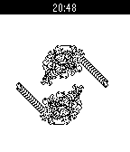</a>

<h2 class="app-name" id="app-5324a390d7d0f23827000184"><a href="https://apps.repebble.com/5324a390d7d0f23827000184">Langton&#x27;s Anthill</a></h2>
<a class="app-source" href="https://github.com/jerith/pebble-langtons-anthill" title="Source code" data-search-exclude>View source</a>

by <a href="https://apps.repebble.com/apps/dev/jerith_52ba9deb6437d1df62000055" title="More from this developer">jerith</a>

Not checked yet v1.0 Updated 2014-03-16

Runs on: Time 2, Pebble 2 Duo, Pebble 2, Time, Classic

Langton&#x27;s ant is a two-dimensional Turing machine with a very simple set of rules but complicated emergent behaviour. Langton&#x27;s Anthill simulates one or more ants on a toroidal Pebble-sized field.

<a class="app-shot" href="https://apps.repebble.com/576e0cf5ba2fe50eb0000018" data-search-exclude>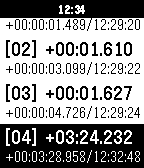</a>

<h2 class="app-name" id="app-576e0cf5ba2fe50eb0000018"><a href="https://apps.repebble.com/576e0cf5ba2fe50eb0000018">Lap counter</a></h2>
<a class="app-source" href="https://github.com/qwqert/Pebble_apps" title="Source code" data-search-exclude>View source</a>

by <a href="https://apps.repebble.com/apps/dev/qwqert_563040ae4cb14285e0000029" title="More from this developer">qwqert</a>

Not checked yet v1.0 Updated 2016-06-25

Runs on: Time 2, Pebble 2 Duo, Pebble 2, Time, Classic

A simple lap counter for runner or swimmer.

<a class="app-shot" href="https://apps.repebble.com/6d6aa01b7ecb4cfea469a183" data-search-exclude>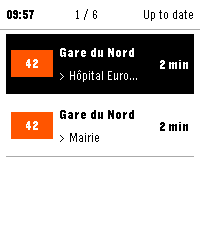</a>

<h2 class="app-name" id="app-6d6aa01b7ecb4cfea469a183"><a href="https://apps.repebble.com/6d6aa01b7ecb4cfea469a183">Lapin Futé</a></h2>
<a class="app-source" href="https://github.com/Anthodev/lapin-fute" title="Source code" data-search-exclude>View source</a>

by <a href="https://apps.repebble.com/apps/dev/anthodev_80b2b96681175b0fd3ddfe88" title="More from this developer">Anthodev</a>

MIT v1.2.1 Updated 2026-09-20

Runs on: Round 2, Time 2

Lapin Futé brings the next Île-de-France public transport arrivals to your Pebble. Save up to six favorite journeys across Métro, RER, Transilien, tram and bus services. Choose your departure…

<a class="app-shot" href="https://apps.repebble.com/69ab4a4c2f77690009cb2a0e" data-search-exclude>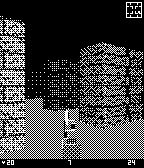</a>

<h2 class="app-name" id="app-69ab4a4c2f77690009cb2a0e"><a href="https://apps.repebble.com/69ab4a4c2f77690009cb2a0e">Last Corridor</a></h2>
<a class="app-source" href="https://github.com/Sichroteph/Last-Corridor" title="Source code" data-search-exclude>View source</a>

by <a href="https://apps.repebble.com/apps/dev/christophe-jeannette_54edf0599e4ff7cbf60000a0" title="More from this developer">Christophe Jeannette</a>

No licence v1.0 Updated 2026-03-06

Runs on: Time 2, Pebble 2 Duo, Pebble 2, Time, Classic

You&#x27;re trapped in a hostile facility overrun by alien creatures. Move through the corridors, find and shoot every enemy before they reach you. Survive long enough to clear the level. Controls: up…

<a class="app-shot" href="https://apps.repebble.com/52cb3fbf45ffdd11e6000090" data-search-exclude>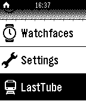</a>

<h2 class="app-name" id="app-52cb3fbf45ffdd11e6000090"><a href="https://apps.repebble.com/52cb3fbf45ffdd11e6000090">Last Tube London</a></h2>
<a class="app-source" href="https://github.com/mattmb/pebble-last-tube" title="Source code" data-search-exclude>View source</a>

by <a href="https://apps.repebble.com/apps/dev/mattmb_52b86238200b9b1de200002d" title="More from this developer">mattmb</a>

Not checked yet v1.0.1 Updated 2014-01-18

Runs on: Time 2, Pebble 2 Duo, Pebble 2, Time, Classic

This app finds the last tube at nearby stations in London. It finds the three nearest stations and then finds the last tubes on all lines. Disclaimers: This app is not endorsed by TfL although it…

<a class="app-shot" href="https://apps.repebble.com/54307b17ec1644c4d2000007" data-search-exclude>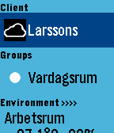</a>

<h2 class="app-name" id="app-54307b17ec1644c4d2000007"><a href="https://apps.repebble.com/54307b17ec1644c4d2000007">LaTC Remote</a></h2>
<a class="app-source" href="https://github.com/fingalo/LaTC-Remote.git" title="Source code" data-search-exclude>View source</a>

by <a href="https://apps.repebble.com/apps/dev/fingalo_538888906ef2f2762300012b" title="More from this developer">Fingalo</a>

Not checked yet v2.0 Updated 2016-01-04

Runs on: Round 2, Time 2, Pebble 2 Duo, Pebble 2, Time Round, Time, Classic

Pebble app for connecting to Telldus Live! server. Control your ligths and wallsockets from you watch. (Long press on middle button will cycle dimmers 25% at a time). Single press on sensor will…

<a class="app-shot" href="https://apps.repebble.com/05be35b816874fa9a85ce6c4" data-search-exclude>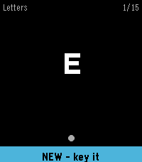</a>

<h2 class="app-name" id="app-05be35b816874fa9a85ce6c4"><a href="https://apps.repebble.com/05be35b816874fa9a85ce6c4">Learn Morse</a></h2>
<a class="app-source" href="https://github.com/awwaiid/pebble-watchapp-learn-morse" title="Source code" data-search-exclude>View source</a>

by <a href="https://apps.repebble.com/apps/dev/awwaiid_a6122c9c814c119e3a27343e" title="More from this developer">awwaiid</a>

MIT v1.0.1 Updated 2026-09-12

Runs on: Round 2, Time 2, Pebble 2 Duo, Pebble 2, Time Round, Time, Classic

Learn to send Morse code on your wrist. Learn Morse shows you a character and you key it back. A short press of the DOWN button is a dot and a hold is a dash; on Pebble Time 2 you can key on the…

<a class="app-shot" href="https://apps.repebble.com/402da10688d6443aa4a9a751" data-search-exclude>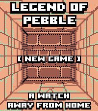</a>

<h2 class="app-name" id="app-402da10688d6443aa4a9a751"><a href="https://apps.repebble.com/402da10688d6443aa4a9a751">Legend of Pebble</a></h2>
<a class="app-source" href="https://github.com/damocamo/ledged-of-pebble-" title="Source code" data-search-exclude>View source</a>

by <a href="https://apps.repebble.com/apps/dev/devfootclan_9e60866ea641e9284c6367a9" title="More from this developer">Devfootclan</a>

Not checked yet v3.5.0 Updated 2026-09-13

Runs on: Round 2, Time 2

LEGEND OF PEBBLE A first-person dungeon crawler RPG for your wrist. THE STORY You check the time. The watch flares. The world twists. You wake in a rift ruled by the Signal Keepers. Ten floors…

<a class="app-shot" href="https://apps.repebble.com/55217260e1e3d5551000004e" data-search-exclude>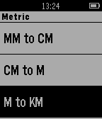</a>

<h2 class="app-name" id="app-55217260e1e3d5551000004e"><a href="https://apps.repebble.com/55217260e1e3d5551000004e">Length Converter</a></h2>
<a class="app-source" href="http://bit.ly/aboutpdl" title="Source code" data-search-exclude>View source</a>

by <a href="https://apps.repebble.com/apps/dev/small-rock-design-labs_54c3a91ca64480370e000062" title="More from this developer">small rock design labs!</a>

See source v1.0 Updated 2015-04-05

Runs on: Time 2, Pebble 2 Duo, Pebble 2, Time, Classic

About: http://bit.ly/aboutpdl ---------- This app tells you how to convert length from your wrist! Simply open the app, and then select your method of conversion ------- Donate…

<a class="app-shot" href="https://apps.repebble.com/a3b06903fd6f46f5b9b8780b" data-search-exclude>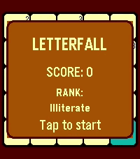</a>

<h2 class="app-name" id="app-a3b06903fd6f46f5b9b8780b"><a href="https://apps.repebble.com/a3b06903fd6f46f5b9b8780b">Letterfall</a></h2>
<a class="app-source" href="https://github.com/ygalanter/letterfall-pebble" title="Source code" data-search-exclude>View source</a>

by <a href="https://apps.repebble.com/apps/dev/comfortably-numb_52f547605101128b2200005a" title="More from this developer">Comfortably Numb</a>

Not checked yet v1.3.0 Updated 2026-07-25

Runs on: Time 2

TEST YOUR BOOKWORM SKILLS! 📝 &quot;Letterfall&quot; is a word-building game. The longer word you make the more scoring points you get. As you add points - you advance in ranks. ⛓️ To create a word - tap…

<h2 class="app-name" id="app-6948196e16fdf5000991cbc4"><a href="https://apps.repebble.com/6948196e16fdf5000991cbc4">Level</a></h2>
<a class="app-source" href="https://github.com/flokndl/level-watchapp" title="Source code" data-search-exclude>View source</a>

by <a href="https://apps.repebble.com/apps/dev/flo-kn-dl_69207a520a015600086f2e44" title="More from this developer">Flo Knödl</a>

Not checked yet v1.0 Updated 2025-12-21

Runs on: Time 2, Pebble 2 Duo, Pebble 2, Time, Classic

A simple Level measuring tool. - Simply tilt the watch to measure - At 0° Level is a subtle nudge vibration

<a class="app-shot" href="https://apps.repebble.com/53fcf89614ee006f33000004" data-search-exclude>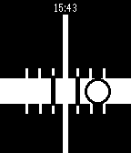</a>

<h2 class="app-name" id="app-53fcf89614ee006f33000004"><a href="https://apps.repebble.com/53fcf89614ee006f33000004">Level for Pebble</a></h2>
<a class="app-source" href="http://www.github.com/lorenlugosch/PebbleLevel" title="Source code" data-search-exclude>View source</a>

by <a href="https://apps.repebble.com/apps/dev/loren-lugosch_52c2e955da4287f00c000061" title="More from this developer">Loren Lugosch</a>

No licence v1.1 Updated 2014-08-26

Runs on: Time 2, Pebble 2 Duo, Pebble 2, Time, Classic

Carpentry level using your Pebble! Just choose vertical or horizontal mode using the top button and align the bubble track with the surface you want to level.

<h2 class="app-name" id="app-2fe5ba2363c042e89553c33e"><a href="https://apps.repebble.com/2fe5ba2363c042e89553c33e">LibreHealth</a></h2>
<a class="app-source" href="https://github.com/peerdavid/pebble-libre-health" title="Source code" data-search-exclude>View source</a>

by <a href="https://apps.repebble.com/apps/dev/david-peer_68fb6df5d3c6e4000885b8f5" title="More from this developer">David Peer</a>

Not checked yet v1.0 Updated 2026-03-15

Runs on: Round 2, Time 2, Pebble 2 Duo, Pebble 2, Time Round, Time, Classic

# Libre Health Companion Pebble companion app for Libre Health, the open-source, local-only health tracker for Android. Warning: Requires the LibreHealth Android companion app. Automatically syncs…

<a class="app-shot" href="https://apps.repebble.com/556c868e4155358c3e00000c" data-search-exclude>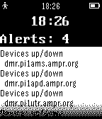</a>

<h2 class="app-name" id="app-556c868e4155358c3e00000c"><a href="https://apps.repebble.com/556c868e4155358c3e00000c">LibreNMS</a></h2>
<a class="app-source" href="https://github.com/zarya/Pebble-Librenms/" title="Source code" data-search-exclude>View source</a>

by <a href="https://apps.repebble.com/apps/dev/zarya_5565bb8508c376c66200004e" title="More from this developer">zarya</a>

Not checked yet v1.1 Updated 2015-06-01

Runs on: Time 2, Pebble 2 Duo, Pebble 2, Time, Classic

App to monitor LibreNMS

<a class="app-shot" href="https://apps.repebble.com/42e5e2cf8c1e4dcdac540555" data-search-exclude>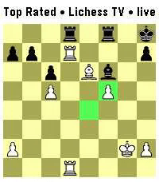</a>

<h2 class="app-name" id="app-42e5e2cf8c1e4dcdac540555"><a href="https://apps.repebble.com/42e5e2cf8c1e4dcdac540555">Lichess TV</a></h2>
<a class="app-source" href="https://github.com/CATEIN/lichess-tv-for-pebble" title="Source code" data-search-exclude>View source</a>

by <a href="https://apps.repebble.com/apps/dev/catein_5451ddc920d58674e460e802" title="More from this developer">CATEIN</a>

MIT v1.1.0 Updated 2026-08-24

Runs on: Time 2

Watch live chess, on your wrist! Lichess TV streams a live game position to your watch as it happens: every move, both players&#x27; names, titles, and ratings, and clocks that count down in real time…

<a class="app-shot" href="https://apps.repebble.com/54af21b5f663710a2d000102" data-search-exclude>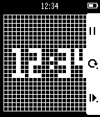</a>

<h2 class="app-name" id="app-54af21b5f663710a2d000102"><a href="https://apps.repebble.com/54af21b5f663710a2d000102">LifeGame</a></h2>
<a class="app-source" href="https://github.com/taturou/pebble_LifeGameWatch" title="Source code" data-search-exclude>View source</a>

by <a href="https://apps.repebble.com/apps/dev/taturou_547d9dd836aa9b5fa40000ed" title="More from this developer">taturou</a>

Not checked yet v1.0 Updated 2015-05-22

Runs on: Time 2, Pebble 2 Duo, Pebble 2, Time, Classic

THE UNIVERSE IS ON YOUR WRIST. This app has four selectable modes. 1. Clock 2. Glider 3. Spaceship 4. R-pentomino

<a class="app-shot" href="https://apps.repebble.com/56808c7c54f8d36ac50000e9" data-search-exclude>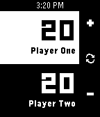</a>

<h2 class="app-name" id="app-56808c7c54f8d36ac50000e9"><a href="https://apps.repebble.com/56808c7c54f8d36ac50000e9">Lifelink</a></h2>
<a class="app-source" href="https://github.com/Spitemare/lifelink" title="Source code" data-search-exclude>View source</a>

by <a href="https://apps.repebble.com/apps/dev/david-morgan_564924e14f9b2989ec000014" title="More from this developer">David Morgan</a>

No licence v2.1 Updated 2016-09-01

Runs on: Round 2, Time 2, Pebble 2 Duo, Pebble 2, Time Round, Time, Classic

Lifelink is a simple life counter for Magic: the Gathering. Press the select button to swap between players. Up and down buttons add and subtract life. Double press the select button to reset life…

<a class="app-shot" href="https://apps.repebble.com/569d35184da1717a1f000043" data-search-exclude>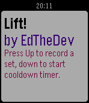</a>

<h2 class="app-name" id="app-569d35184da1717a1f000043"><a href="https://apps.repebble.com/569d35184da1717a1f000043">Lift</a></h2>
<a class="app-source" href="https://github.com/edthedev/LiftPebble" title="Source code" data-search-exclude>View source</a>

by <a href="https://apps.repebble.com/apps/dev/edward-delaporte_54f3a0af2eee750ed80000d0" title="More from this developer">Edward Delaporte</a>

Not checked yet v1.3 Updated 2016-09-04

Runs on: Time 2, Pebble 2 Duo, Pebble 2, Time, Classic

Count exercise sets and track 90 seconds to cool down in between, as needed.

<a class="app-shot" href="https://apps.repebble.com/bc759f096635405aabe7c52e" data-search-exclude>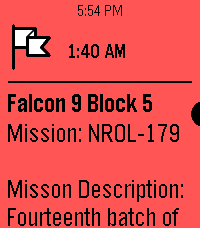</a>

<h2 class="app-name" id="app-bc759f096635405aabe7c52e"><a href="https://apps.repebble.com/bc759f096635405aabe7c52e">Liftoff 2</a></h2>
<a class="app-source" href="https://github.com/only-meeps/Liftoff-2-Pebble" title="Source code" data-search-exclude>View source</a>

by <a href="https://apps.repebble.com/apps/dev/meep-apps_afb52ceff8e7b6067c428fea" title="More from this developer">Meep apps</a>

Not checked yet v9.7 Updated 2026-08-09

Runs on: Round 2, Time 2, Pebble 2 Duo, Pebble 2, Time Round, Time, Classic

Inspired by the watch timeline app liftoff, this app shows timeline pins about upcoming launches with a small description provided thespacedevs.com. Unfortunately, due to the current pebble app…

<a class="app-shot" href="https://apps.repebble.com/54341c6f79b9e51d360001fa" data-search-exclude>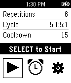</a>

<h2 class="app-name" id="app-54341c6f79b9e51d360001fa"><a href="https://apps.repebble.com/54341c6f79b9e51d360001fa">LiftSlow</a></h2>
<a class="app-source" href="https://github.com/craedev1/LiftSlow" title="Source code" data-search-exclude>View source</a>

by <a href="https://apps.repebble.com/apps/dev/crae_52efa898593184556400004b" title="More from this developer">CRAE</a>

Not checked yet v1.0 Updated 2014-10-22

Runs on: Time 2, Pebble 2 Duo, Pebble 2, Time, Classic

Struggling to break a plateau? Experiment with slow and deliberate weight lifting. The app features timing for slow up and down lift strokes, and variable rest, warmup and cool down intervals. The…

<a class="app-shot" href="https://apps.repebble.com/56b5f4147d6b52077500001b" data-search-exclude>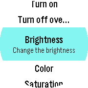</a>

<h2 class="app-name" id="app-56b5f4147d6b52077500001b"><a href="https://apps.repebble.com/56b5f4147d6b52077500001b">LIFX</a></h2>
<a class="app-source" href="https://github.com/bigbug/LIFX4Pebble" title="Source code" data-search-exclude>View source</a>

by <a href="https://apps.repebble.com/apps/dev/markus-gutbrod_56a684837a473973dc000060" title="More from this developer">Markus Gutbrod</a>

No licence v0.98 Updated 2016-02-24

Runs on: Round 2, Time Round

With this app you can control your LIFX bulb(s). Currently supported features: - turn your bulb on and off - change the color, brightness and saturation - Experimental: set an alarm. Before the…

<a class="app-shot" href="https://apps.repebble.com/71e51f9f204444e39374282a" data-search-exclude>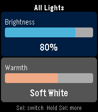</a>

<h2 class="app-name" id="app-71e51f9f204444e39374282a"><a href="https://apps.repebble.com/71e51f9f204444e39374282a">LIFX Client</a></h2>
<a class="app-source" href="https://github.com/chrislewicki/lifx-client" title="Source code" data-search-exclude>View source</a>

by <a href="https://apps.repebble.com/apps/dev/chris-lewicki_53f25ba1e45d533568000139" title="More from this developer">Chris Lewicki</a>

Not checked yet v1.1 Updated 2026-04-06

Runs on: Round 2, Time 2, Pebble 2 Duo, Pebble 2, Time Round, Time, Classic

Control your LIFX smart lights from your Pebble. LIFX Client lets you adjust brightness and color temperature on the fly, or pick from a palette of colors. Features: - Adjust brightness in 5%…

<a class="app-shot" href="https://apps.repebble.com/552f7a8c06bedc3ef70000cd" data-search-exclude>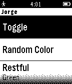</a>

<h2 class="app-name" id="app-552f7a8c06bedc3ef70000cd"><a href="https://apps.repebble.com/552f7a8c06bedc3ef70000cd">LIFxPebble</a></h2>
<a class="app-source" href="https://github.com/jorgerdz/lifxpebble" title="Source code" data-search-exclude>View source</a>

by <a href="https://apps.repebble.com/apps/dev/pixelsoup_5351d58a0fdc9b998f00006a" title="More from this developer">PixelSoup</a>

Not checked yet v0.6 Updated 2015-07-03

Runs on: Time 2, Pebble 2 Duo, Pebble 2, Time, Classic

A Pebble app for controlling your LIFX apps using the Cloud API. PayPal contributions are welcome at mail@jorgerdz.com, thanks! Reddit thread…

<a class="app-shot" href="https://apps.repebble.com/576e0ad06c21042b7b00000e" data-search-exclude>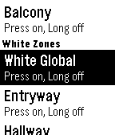</a>

<h2 class="app-name" id="app-576e0ad06c21042b7b00000e"><a href="https://apps.repebble.com/576e0ad06c21042b7b00000e">Light-Controller (BETA)</a></h2>
<a class="app-source" href="https://github.com/mrwhale/pebble-light-controller" title="Source code" data-search-exclude>View source</a>

by <a href="https://apps.repebble.com/apps/dev/mrwhale_5309702c24c4582908000149" title="More from this developer">MrWhale</a>

Not checked yet v0.9 Updated 2016-09-22

Runs on: Round 2, Time 2, Pebble 2 Duo, Pebble 2, Time Round, Time, Classic

Control your LimitelessLED, milight or EasyBulb lights with your pebble! This is currently the BETA build, so only has basic functionality working (on/off) but there is colourful UI to come! (This…

<a class="app-shot" href="https://apps.repebble.com/82c00d2a1a234861a5039b6f" data-search-exclude>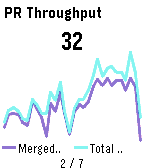</a>

<h2 class="app-name" id="app-82c00d2a1a234861a5039b6f"><a href="https://apps.repebble.com/82c00d2a1a234861a5039b6f">Lightdash</a></h2>
<a class="app-source" href="https://github.com/rephus/pebble-lightdash-app" title="Source code" data-search-exclude>View source</a>

by <a href="https://apps.repebble.com/apps/dev/javier-rengel_4050fea4292cac94cd096b9d" title="More from this developer">Javier Rengel</a>

Not checked yet v0.1 Updated 2026-04-17

Runs on: Round 2, Time 2, Pebble 2 Duo, Pebble 2, Time Round, Time, Classic

A Pebble watchapp that rotates through your [Lightdash](https://www.lightdash.com/) saved charts. Glance at your BI numbers from your wrist. No phone needed once the tiles load.

<a class="app-shot" href="https://apps.repebble.com/9420a2e218e54ce986c7c871" data-search-exclude>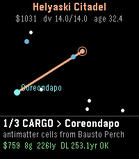</a>

<h2 class="app-name" id="app-9420a2e218e54ce986c7c871"><a href="https://apps.repebble.com/9420a2e218e54ce986c7c871">Lighthaul</a></h2>
<a class="app-source" href="https://github.com/thejambi/Lighthaul-Pebble" title="Source code" data-search-exclude>View source</a>

by <a href="https://apps.repebble.com/apps/dev/zach-burnham_939ce698485e86de8b11f7ae" title="More from this developer">Zach Burnham</a>

Not checked yet v1.2.2 Updated 2026-08-01

Runs on: Round 2, Time 2, Pebble 2 Duo, Pebble 2, Time Round, Time

Haul cargo and passengers between the stars at a hair under lightspeed - and let special relativity be the economy. Deadlines run on universe time. You and your passengers age on ship time. The…

<a class="app-shot" href="https://apps.repebble.com/569061bfd5ba00104e000016" data-search-exclude>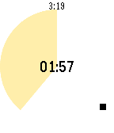</a>

<h2 class="app-name" id="app-569061bfd5ba00104e000016"><a href="https://apps.repebble.com/569061bfd5ba00104e000016">Limone</a></h2>
<a class="app-source" href="https://github.com/uchida/limone-watchapp/" title="Source code" data-search-exclude>View source</a>

by <a href="https://apps.repebble.com/apps/dev/akihiro-uchida_567155e246ebac9661000023" title="More from this developer">Akihiro Uchida</a>

Not checked yet v0.3 Updated 2016-01-17

Runs on: Round 2, Time 2, Pebble 2 Duo, Pebble 2, Time Round, Time, Classic

A simple pomodoro timer for Pebble, to notify 25 minutes work finished and after take 5 minutes break. Optionally supports to trigger IFTTT Maker channel and show today&#x27;s tasks in Todoist.

<a class="app-shot" href="https://apps.repebble.com/55e1a222eec9a4e4d9000030" data-search-exclude>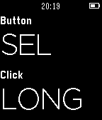</a>

<h2 class="app-name" id="app-55e1a222eec9a4e4d9000030"><a href="https://apps.repebble.com/55e1a222eec9a4e4d9000030">Linux remote</a></h2>
<a class="app-source" href="https://github.com/susundberg/pebble-linux-remote" title="Source code" data-search-exclude>View source</a>

by <a href="https://apps.repebble.com/apps/dev/susundberg_557c7399d269ce467600006b" title="More from this developer">susundberg</a>

Not checked yet v1.0 Updated 2015-08-29

Runs on: Time 2, Pebble 2 Duo, Pebble 2, Time, Classic

This open source remote allows you to run shell commands in your linux by pressing Pebble buttons. You can use it for presentation slide changer or for example to lock your screen with single…

<a class="app-shot" href="https://apps.repebble.com/e803cc1eebcc4ffc9df7a86e" data-search-exclude>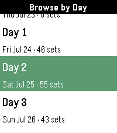</a>

<h2 class="app-name" id="app-e803cc1eebcc4ffc9df7a86e"><a href="https://apps.repebble.com/e803cc1eebcc4ffc9df7a86e">Liquicity 2026</a></h2>
<a class="app-source" href="https://github.com/eric-lindholm/bonnaroo-26/" title="Source code" data-search-exclude>View source</a>

by <a href="https://apps.repebble.com/apps/dev/pottkopp_82c5b97291d272e0b4e1aa46" title="More from this developer">Pottkopp</a>

Not checked yet v1.0.1 Updated 2026-07-23

Runs on: Time 2, Pebble 2 Duo, Pebble 2

Unofficial Timetable watchapp for Liquicity 2026. Browse shows, plan your festival, and get reminders when a show you don&#x27;t want to miss is coming up. Browse shows by day or stage, click into a…

<a class="app-shot" href="https://apps.rebble.io/en_US/application/67cc5a88b7a023024b2145b8" data-search-exclude>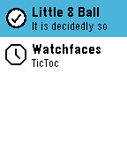</a>

<h2 class="app-name" id="app-67cc5a88b7a023024b2145b8"><a href="https://apps.rebble.io/en_US/application/67cc5a88b7a023024b2145b8">Little 8 Ball</a></h2>
<a class="app-source" href="https://github.com/kjy00302/pebble-8ball-glance" title="Source code" data-search-exclude>View source</a>

by <a href="https://apps.rebble.io/en_US/developer/5d8006bf831cc00001cfba22/1" title="More from this developer">kjy00302</a>

Not checked yet v1.0 Updated 2025-03-08 Rebble App Store

Runs on: Round 2, Time 2, Pebble 2 Duo, Pebble 2, Time Round, Time

Yet another experimental Magic 8 Ball app uses App Glance without any screens.

<h2 class="app-name" id="app-554ec47cecdc00f8140000c6"><a href="https://apps.repebble.com/554ec47cecdc00f8140000c6">Liveblog</a></h2>
<a class="app-source" href="https://github.com/tomthecarrot/PebbleTimeLiveblog" title="Source code" data-search-exclude>View source</a>

by <a href="https://apps.repebble.com/apps/dev/thomas-suarez_53c5b7f2a21bef1f75000037" title="More from this developer">Thomas Suarez</a>

Not checked yet v1.0 Updated 2015-05-11

Runs on: Time 2, Time

Liveblog tracker for Pebble Time, utilizing the new Timeline functionality. 1. Before (or during) a live event, install the app on your Pebble Time. 2. Once the app is installed on your Pebble…

<a class="app-shot" href="https://apps.repebble.com/56bed5490ed2a75acd000040" data-search-exclude>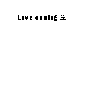</a>

<h2 class="app-name" id="app-56bed5490ed2a75acd000040"><a href="https://apps.repebble.com/56bed5490ed2a75acd000040">Liveconfig Demo</a></h2>
<a class="app-source" href="https://github.com/fletchto99/Pebble-liveconfig" title="Source code" data-search-exclude>View source</a>

by <a href="https://apps.repebble.com/apps/dev/matt-langlois_52e30dd32645fb8bae000fcd" title="More from this developer">Matt Langlois</a>

Not checked yet v1.01 Updated 2016-02-13

Runs on: Round 2, Time 2, Pebble 2 Duo, Pebble 2, Time Round, Time, Classic

Demo of Live config library for developers!

<a class="app-shot" href="https://apps.repebble.com/565c94c0eae744b790000068" data-search-exclude>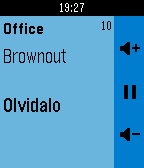</a>

<h2 class="app-name" id="app-565c94c0eae744b790000068"><a href="https://apps.repebble.com/565c94c0eae744b790000068">LMS Controller</a></h2>
<a class="app-source" href="https://github.com/daduke/LMSController" title="Source code" data-search-exclude>View source</a>

by <a href="https://apps.repebble.com/apps/dev/daduke_56490a754f9b2993b0000011" title="More from this developer">daduke</a>

Not checked yet v2.61 Updated 2019-07-24

Runs on: Round 2, Time 2, Pebble 2 Duo, Pebble 2, Time Round, Time, Classic

Control your Logitech Media Server (aka LMS or Squeezebox) via Pebble. new feature: long press select in track info screen enters the music menu! Buttons (up / select / down): player menu: * short…

<a class="app-shot" href="https://apps.repebble.com/556625566ad39158ce00009d" data-search-exclude>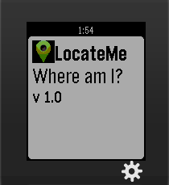</a>

<h2 class="app-name" id="app-556625566ad39158ce00009d"><a href="https://apps.repebble.com/556625566ad39158ce00009d">LocateMe</a></h2>
<a class="app-source" href="https://github.com/ajinabraham/PebbleWatch-LocateMe" title="Source code" data-search-exclude>View source</a>

by <a href="https://apps.repebble.com/apps/dev/ajin_5565f30e3986100a91000081" title="More from this developer">Ajin</a>

No licence v1.0 Updated 2015-05-27

Runs on: Time 2, Pebble 2 Duo, Pebble 2, Time, Classic

LocateMe is a watch app that tells your location.

<a class="app-shot" href="https://apps.rebble.io/en_US/application/5f3ee4ad3dd310431df1c5e7" data-search-exclude>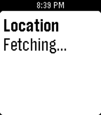</a>

<h2 class="app-name" id="app-5f3ee4ad3dd310431df1c5e7"><a href="https://apps.rebble.io/en_US/application/5f3ee4ad3dd310431df1c5e7">Locator</a></h2>
<a class="app-source" href="https://github.com/leso-kn/Pebble.Locator" title="Source code" data-search-exclude>View source</a>

by <a href="https://apps.rebble.io/en_US/developer/5f3ee4ac3dd310431df1c5e5/1" title="More from this developer">Lesosoftware</a>

Not checked yet v1.2 Updated 2023-06-27 Rebble App Store

Runs on: Round 2, Time 2, Pebble 2 Duo, Pebble 2, Time Round, Time, Classic

This app simply displays the user&#x27;s current location! Credits go to Campion Fellin. This is a continuation of his work over at…

<a class="app-shot" href="https://apps.repebble.com/569991c86f0a1b4c23000070" data-search-exclude>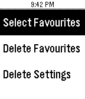</a>

<h2 class="app-name" id="app-569991c86f0a1b4c23000070"><a href="https://apps.repebble.com/569991c86f0a1b4c23000070">Lockitron for Pebble</a></h2>
<a class="app-source" href="https://github.com/PebbleKat/Lockitron-for-Pebble" title="Source code" data-search-exclude>View source</a>

by <a href="https://apps.repebble.com/apps/dev/rishie_537ff1f561e8e220bb000006" title="More from this developer">Rishie</a>

MIT v1 Updated 2016-01-20

Runs on: Round 2, Time 2, Pebble 2 Duo, Pebble 2, Time Round, Time, Classic

Control any of your Lockitron locks right from your wrist! Choose favorite locks to keep on the main menu for easy access. Works with all Lockitron products. Requires authentication only on first…

<a class="app-shot" href="https://apps.repebble.com/5738e66eeae0b2ef05000024" data-search-exclude>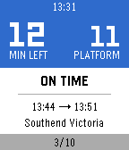</a>

<h2 class="app-name" id="app-5738e66eeae0b2ef05000024"><a href="https://apps.repebble.com/5738e66eeae0b2ef05000024">Locomo</a></h2>
<a class="app-source" href="https://github.com/yoziru-desu/locomo-pebble" title="Source code" data-search-exclude>View source</a>

by <a href="https://apps.repebble.com/apps/dev/yoziru-desu_560fd7a8ba529bd5f4000094" title="More from this developer">yoziru-desu</a>

Not checked yet v2.1 Updated 2025-11-25

Runs on: Round 2, Time 2, Pebble 2 Duo, Pebble 2, Time Round, Time, Classic

Start Locomo when going to work or returning home and stop worrying about which train is next and which platform you need to go to. Locomo will show you how much time you have left, if your train…

<a class="app-shot" href="https://apps.repebble.com/55c90209d0e6da92ae000036" data-search-exclude>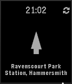</a>

<h2 class="app-name" id="app-55c90209d0e6da92ae000036"><a href="https://apps.repebble.com/55c90209d0e6da92ae000036">London TFL Bike Point Tracker</a></h2>
<a class="app-source" href="https://github.com/chrisberry4545/BikeTracker" title="Source code" data-search-exclude>View source</a>

by <a href="https://apps.repebble.com/apps/dev/chris-berry_55c8ff87d0e6da5f0a00002e" title="More from this developer">Chris Berry</a>

Not checked yet v1.1 Updated 2015-09-21

Runs on: Time 2, Time

Points the way to the nearest Satander bike point in London. Useful for when you&#x27;re cycling around London.

<a class="app-shot" href="https://apps.repebble.com/dacf9696730748cfb809166f" data-search-exclude>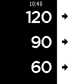</a>

<h2 class="app-name" id="app-dacf9696730748cfb809166f"><a href="https://apps.repebble.com/dacf9696730748cfb809166f">Long Rest</a></h2>
<a class="app-source" href="https://github.com/MGibson1/pebble-rest-timer/" title="Source code" data-search-exclude>View source</a>

by <a href="https://apps.repebble.com/apps/dev/delta-g_ebeb8cc0511fe42af871e833" title="More from this developer">Delta_G</a>

No licence v2.4.1 Updated 2026-04-16

Runs on: Time 2, Pebble 2 Duo, Pebble 2, Time, Classic

Super simple Pebble app for rest intervals (like in the gym or pomodoro) Originally built by [Remy](https://github.com/remy) for use in the gym, for rest intervals, and updated by updated by…

<a class="app-shot" href="https://apps.repebble.com/151e6e63251a4881a96585de" data-search-exclude>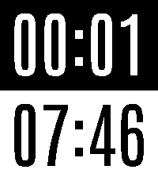</a>

<h2 class="app-name" id="app-151e6e63251a4881a96585de"><a href="https://apps.repebble.com/151e6e63251a4881a96585de">Long Run Stopwatch</a></h2>
<a class="app-source" href="https://github.com/justinjhendrick/long-run-stopwatch-pebble-app" title="Source code" data-search-exclude>View source</a>

by <a href="https://apps.repebble.com/apps/dev/justinjhendrick_67f68b8a23b7a90009c87db5" title="More from this developer">justinjhendrick</a>

Not checked yet v1.1.0 Updated 2026-09-27

Runs on: Time 2

A stopwatch for long runs. Elapsed time on top. Time of day on bottom. Features: * Battery efficient (updates once per minute) * Large text

<a class="app-shot" href="https://apps.repebble.com/4a1b7995c8d142f099d98dbb" data-search-exclude>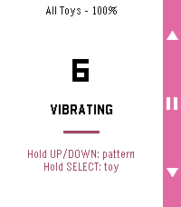</a>

<h2 class="app-name" id="app-4a1b7995c8d142f099d98dbb"><a href="https://apps.repebble.com/4a1b7995c8d142f099d98dbb">Lovense Remote</a></h2>
<a class="app-source" href="https://github.com/MrArron/Lovense-Pebble-Control" title="Source code" data-search-exclude>View source</a>

by <a href="https://apps.repebble.com/apps/dev/arron_524aee3521fec8fbd71a5a3f" title="More from this developer">Arron</a>

CC0-1.0 v1.2.4 Updated 2026-09-20

Runs on: Round 2, Time 2, Pebble 2 Duo, Pebble 2, Time Round, Time, Classic

Control your Lovense toy discreetly from your wrist. Choose an open Basic remote-control face, or a Discrete face (Analog or Digital) that looks like an ordinary watch to everyone but you —…

<a class="app-shot" href="https://apps.rebble.io/en_US/application/67ca8dc6d2acb301fae26de7" data-search-exclude>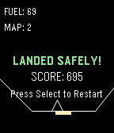</a>

<h2 class="app-name" id="app-67ca8dc6d2acb301fae26de7"><a href="https://apps.rebble.io/en_US/application/67ca8dc6d2acb301fae26de7">Lunar Crasher</a></h2>
<a class="app-source" href="https://github.com/Jose-Amendola22/lunar-crasher" title="Source code" data-search-exclude>View source</a>

by <a href="https://apps.rebble.io/en_US/developer/6695b8f8440dbd00082fac2d/1" title="More from this developer">JossMa</a>

No licence v1.0 Updated 2025-03-07 Rebble App Store

Runs on: Time 2, Pebble 2 Duo, Pebble 2, Time, Classic

A mock of lunar lander, this was done for the hackathon 002. I could add more levels and a more complex landing system, maybe for later

<a class="app-shot" href="https://apps.repebble.com/568d42568cd1f8e2a5000072" data-search-exclude>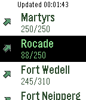</a>

<h2 class="app-name" id="app-568d42568cd1f8e2a5000072"><a href="https://apps.repebble.com/568d42568cd1f8e2a5000072">LuxParking</a></h2>
<a class="app-source" href="https://github.com/ogerardin/LuxParking" title="Source code" data-search-exclude>View source</a>

by <a href="https://apps.repebble.com/apps/dev/olivier-g-rardin_56700e12057ecdc54700001f" title="More from this developer">Olivier Gérardin</a>

Not checked yet v0.3 Updated 2016-01-28

Runs on: Round 2, Time 2, Pebble 2 Duo, Pebble 2, Time Round, Time, Classic

A Pebble watchapp for displaying parking occupancy in Luxembourg city using the RSS feed provided by Ville de Luxembourg. The first screen shows a list of city areas. If you select an area, you…

<a class="app-shot" href="https://apps.rebble.io/en_US/application/598c1b8f461a8d34f6000c46" data-search-exclude>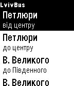</a>

<h2 class="app-name" id="app-598c1b8f461a8d34f6000c46"><a href="https://apps.rebble.io/en_US/application/598c1b8f461a8d34f6000c46">LvivBus</a></h2>
<a class="app-source" href="https://github.com/alivespirit/lvivbus" title="Source code" data-search-exclude>View source</a>

by <a href="https://apps.rebble.io/en_US/developer/582fb1cd36ac5acf1800009c/1" title="More from this developer">alivespirit</a>

No licence v1.2 Updated 2017-08-10 Rebble App Store

Runs on: Time 2, Pebble 2 Duo, Pebble 2, Time, Classic

Pebble watchapp to show info about public transport waiting time on different bus stops in Lviv, Ukraine. Uses API of lad.lviv.ua. Geolocation option (last item in menu) allows to get info about…

