---
hide:
  - toc
---

<!-- Generated by scripts/update_app_directory.py: do not edit by hand -->
# Pebble Apps: M

[← All Pebble Apps](../watchapps.md) · [A](a.md) · [B](b.md) · [C](c.md) · [D](d.md) · [E](e.md) · [F](f.md) · [G](g.md) · [H](h.md) · [I](i.md) · [J](j.md) · [K](k.md) · [L](l.md) · **M** · [N](n.md) · [O](o.md) · [P](p.md) · [Q](q.md) · [R](r.md) · [S](s.md) · [T](t.md) · [U](u.md) · [V](v.md) · [W](w.md) · [X](x.md) · [Y](y.md) · [Z](z.md) · [0–9 & other](other.md)

*95 apps · Last updated 2026-10-06 · [About these lists](../about-app-lists.md)*

<h2 class="app-name" id="app-56341f9cab1061e3b700003d"><a href="https://apps.repebble.com/56341f9cab1061e3b700003d">Mad Eye Moody</a></h2>
<a class="app-source" href="https://github.com/SetPebble/mad-eye" title="Source code" data-search-exclude>View source</a>

by <a href="https://apps.repebble.com/apps/dev/setpebble_529a308a129af7e79b0000b3" title="More from this developer">SetPebble</a>

No licence v3.2 Updated 2026-08-17

Runs on: Round 2, Time 2, Pebble 2 Duo, Pebble 2, Time Round, Time, Classic

App that displays an eyeball that moves and blinks. Put it on a head strap for a fun costume prop! Top button: start animation Middle button: light on/off Bottom button: pause/resume Open Pebble…

<a class="app-shot" href="https://apps.repebble.com/549316778718b29e75000112" data-search-exclude>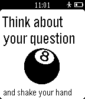</a>

<h2 class="app-name" id="app-549316778718b29e75000112"><a href="https://apps.repebble.com/549316778718b29e75000112">Magic 8 ball</a></h2>
<a class="app-source" href="https://github.com/sver40k/Pebble8Ball" title="Source code" data-search-exclude>View source</a>

by <a href="https://apps.repebble.com/apps/dev/andrii-piasetskyi_5474f6c314b37f16cc0000a3" title="More from this developer">Andrii Piasetskyi</a>

Not checked yet v1.0 Updated 2014-12-18

Runs on: Time 2, Pebble 2 Duo, Pebble 2, Time, Classic

This is a simple but still useful decision maker app for your Pebble. Just: - Open the app - Think about your question - Shake your hand - Voila! The answer is on the screen) If you don&#x27;t like…

<a class="app-shot" href="https://apps.repebble.com/542bf2247a4316d5be000051" data-search-exclude>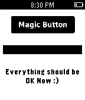</a>

<h2 class="app-name" id="app-542bf2247a4316d5be000051"><a href="https://apps.repebble.com/542bf2247a4316d5be000051">Magic Button</a></h2>
<a class="app-source" href="https://github.com/pebble-tr/Magic-Button" title="Source code" data-search-exclude>View source</a>

by <a href="https://apps.repebble.com/apps/dev/aybuke-ozdemir_535e5fec91c4a6f10d0001f6" title="More from this developer">aybuke ozdemir</a>

Not checked yet v1.4 Updated 2014-11-18

Runs on: Time 2, Pebble 2 Duo, Pebble 2, Time, Classic

A magic button that makes everything OK. Insprired by http://make-everything-ok.com

<a class="app-shot" href="https://apps.repebble.com/52b3043ecd41834a620000ef" data-search-exclude>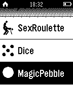</a>

<h2 class="app-name" id="app-52b3043ecd41834a620000ef"><a href="https://apps.repebble.com/52b3043ecd41834a620000ef">Magic Pebble RUS/EN</a></h2>
<a class="app-source" href="https://github.com/vvzvlad/Pebble-MagicPebble" title="Source code" data-search-exclude>View source</a>

by <a href="https://apps.repebble.com/apps/dev/vvzvlad_52a92f2cc0ca93629100000d" title="More from this developer">vvzvlad</a>

Not checked yet v1.1 Updated 2014-12-30

Runs on: Time 2, Pebble 2 Duo, Pebble 2, Time, Classic

Turn your clocks in the magic ball, answering questions Превратите ваши часы в шарик с ответами. Получите ответы на волнующие вас вопросы

<h2 class="app-name" id="app-5304dcfe3985ada2bc000228"><a href="https://apps.repebble.com/5304dcfe3985ada2bc000228">Magic Watch</a></h2>
<a class="app-source" href="https://github.com/VGraupera/magic-watch" title="Source code" data-search-exclude>View source</a>

by <a href="https://apps.repebble.com/apps/dev/vidal-graupera_52cd5df49505d12f12000056" title="More from this developer">Vidal Graupera</a>

MIT v1.0.0 Updated 2014-02-19

Runs on: Time 2, Pebble 2 Duo, Pebble 2, Time, Classic

Now your watch has all the answers! Ask any question. Shake your watch. Get the answer.

<a class="app-shot" href="https://apps.repebble.com/52aa2b39b8f6c25ce1000003" data-search-exclude>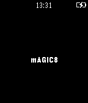</a>

<h2 class="app-name" id="app-52aa2b39b8f6c25ce1000003"><a href="https://apps.repebble.com/52aa2b39b8f6c25ce1000003">mAGIC8(accelerometer)</a></h2>
<a class="app-source" href="https://github.com/dsexton702/magic8" title="Source code" data-search-exclude>View source</a>

by <a href="https://apps.repebble.com/apps/dev/dsexton702_52aa24cc7314ca7a6a000001" title="More from this developer">Dsexton702</a>

Not checked yet v1.0.0 Updated 2013-12-12

Runs on: Time 2, Pebble 2 Duo, Pebble 2, Time, Classic

Now have the all the answers to your questions with the flick of a wrist! This app is based off of the magic 8 ball. Contains 20 different answers.

<a class="app-shot" href="https://apps.rebble.io/en_US/application/586bf8f7e09e63b4c7000473" data-search-exclude>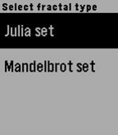</a>

<h2 class="app-name" id="app-586bf8f7e09e63b4c7000473"><a href="https://apps.rebble.io/en_US/application/586bf8f7e09e63b4c7000473">MandaFractal</a></h2>
<a class="app-source" href="https://github.com/computergeek314/PebbleFractal/blob/master/main.c" title="Source code" data-search-exclude>View source</a>

by <a href="https://apps.rebble.io/en_US/developer/585ffd9e0e3a49dd2600003f/1" title="More from this developer">Ben</a>

Not checked yet v1.0 Updated 2017-01-05 Rebble App Store

Runs on: Round 2, Time 2, Pebble 2 Duo, Pebble 2, Time Round, Time, Classic

Generate colorful fractals on the fly with this watchapp. Capable of rendering Julia and Mandelbrot sets quickly and zooming and panning within them. NOTE: On non color screens, the parts that…

<h2 class="app-name" id="app-586ca9255de8502559000106"><a href="https://apps.rebble.io/en_US/application/586ca9255de8502559000106">Mandelbrot</a></h2>
<a class="app-source" href="http://debiaonoldcomputers.blogspot.it/2017/01/mandelbrot-su-pebble.html" title="Source code" data-search-exclude>View source</a>

by <a href="https://apps.rebble.io/en_US/developer/58262c63b62cef3e7c0001a1/1" title="More from this developer">Luca Innocenti</a>

See source v1.0 Updated 2017-01-04 Rebble App Store

Runs on: Round 2, Time 2, Pebble 2 Duo, Pebble 2, Time Round, Time, Classic

A simple Mandelbrot set generator

<h2 class="app-name" id="app-52eaaa9026dfc38c0e000010"><a href="https://apps.repebble.com/52eaaa9026dfc38c0e000010">Mandelbrot Generator</a></h2>
<a class="app-source" href="https://github.com/mhungerford/pebble-mandelbrot-generator" title="Source code" data-search-exclude>View source</a>

by <a href="https://apps.repebble.com/apps/dev/matthew-hungerford_52bca741d438930a650001b6" title="More from this developer">Matthew Hungerford</a>

Not checked yet v1.0.0 Updated 2014-01-30

Runs on: Time 2, Pebble 2 Duo, Pebble 2, Time, Classic

Renders interesting regions of the Mandelbrot set, regenerating the image at each level. Uses fastmath and direct framebuffer and on watch dithering (4-bit to 1-bit).

<a class="app-shot" href="https://apps.repebble.com/99279aadf6df4c0fadfdb39a" data-search-exclude>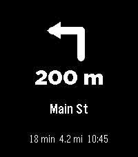</a>

<h2 class="app-name" id="app-99279aadf6df4c0fadfdb39a"><a href="https://apps.repebble.com/99279aadf6df4c0fadfdb39a">Maps Nav</a></h2>
<a class="app-source" href="https://github.com/konsumer/pebble-map-android" title="Source code" data-search-exclude>View source</a>

by <a href="https://apps.repebble.com/apps/dev/david-konsumer_52bcf29983ed912283000028" title="More from this developer">David Konsumer</a>

Not checked yet v1.0.0 Updated 2026-06-29

Runs on: Round 2, Time 2, Pebble 2 Duo, Pebble 2, Time Round, Time, Classic

ONLY ON ANDROID I wanted a nice &amp; simple nav app that starts when I get directions in Google Maps. Totally open-source, and simple. Check the github for more complete directions (requires…

<a class="app-shot" href="https://apps.rebble.io/en_US/application/6a9eaa93c73fab000922277c" data-search-exclude>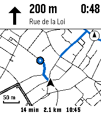</a>

<h2 class="app-name" id="app-6a9eaa93c73fab000922277c"><a href="https://apps.rebble.io/en_US/application/6a9eaa93c73fab000922277c">Maps Navigation for Pebble</a></h2>
<a class="app-source" href="https://github.com/peblum/maps-for-pebble" title="Source code" data-search-exclude>View source</a>

by <a href="https://apps.rebble.io/en_US/developer/697bed7402360800096afe3b/1" title="More from this developer">Adrian Pascu</a>

Not checked yet v1.2.0 Updated 2026-09-07 Rebble App Store

Runs on: Time 2

Google Maps walking and cycling directions on your wrist, with a map. Start directions in Google Maps on your Android phone and Maps Navigation opens on the watch: Google&#x27;s own turn arrow, the…

<a class="app-shot" href="https://apps.repebble.com/550519808d3907c55200006b" data-search-exclude>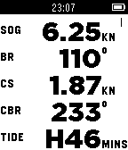</a>

<h2 class="app-name" id="app-550519808d3907c55200006b"><a href="https://apps.repebble.com/550519808d3907c55200006b">Marine</a></h2>
<a class="app-source" href="https://github.com/silasbw/pebble_marine" title="Source code" data-search-exclude>View source</a>

by <a href="https://apps.repebble.com/apps/dev/sbw_538eab1f58c12c5335000072" title="More from this developer">sbw</a>

Not checked yet v1.0 Updated 2015-10-31

Runs on: Time 2, Pebble 2 Duo, Pebble 2, Time, Classic

Pebble Marine provides useful instrumentation while sailing, windsurfing, kayaking, paddle boarding, or boating. Your Pebble watch displays speed (knots), bearing (degrees), current speed (knots)…

<h2 class="app-name" id="app-89428bc020ae4ee7af64469d"><a href="https://apps.repebble.com/89428bc020ae4ee7af64469d">Marquee</a></h2>
<a class="app-source" href="https://github.com/ProggroP/Marquee" title="Source code" data-search-exclude>View source</a>

by <a href="https://apps.repebble.com/apps/dev/kieselleger_56f70d3fe58879cfd4000013" title="More from this developer">Kieselleger</a>

No licence v1.3 Updated 2026-05-31

Runs on: Round 2, Time 2, Pebble 2 Duo, Pebble 2, Time Round, Time, Classic

Marquee Got something you need to glance at quickly? Marquee shows any text you want right on your wrist — always visible, no fumbling with your phone. Perfect for: 🔑 Door and gate PIN codes 📶…

<a class="app-shot" href="https://apps.repebble.com/561079d546914a9e6c00005a" data-search-exclude>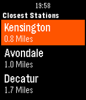</a>

<h2 class="app-name" id="app-561079d546914a9e6c00005a"><a href="https://apps.repebble.com/561079d546914a9e6c00005a">Marta Next Train</a></h2>
<a class="app-source" href="https://github.com/calexander3/PebbleMartaTrainArrivals" title="Source code" data-search-exclude>View source</a>

by <a href="https://apps.repebble.com/apps/dev/craig-alexander_532b717388718d52500004cc" title="More from this developer">Craig Alexander</a>

Not checked yet v2.0.1 Updated 2026-06-28

Runs on: Round 2, Time 2, Pebble 2 Duo

Marta Next Train displays the arrival times of the upcoming trains in the metro Atlanta, Georgia area. *A connection to your phone is required for location and data services. Marta Next Train is…

<a class="app-shot" href="https://apps.repebble.com/552aaf2078b9ce4416000042" data-search-exclude>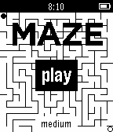</a>

<h2 class="app-name" id="app-552aaf2078b9ce4416000042"><a href="https://apps.repebble.com/552aaf2078b9ce4416000042">Maze</a></h2>
<a class="app-source" href="https://github.com/Zerthick/PebbleMaze" title="Source code" data-search-exclude>View source</a>

by <a href="https://apps.repebble.com/apps/dev/ramdev_55289a79e0d84325860000bc" title="More from this developer">RAMDev</a>

No licence v1.1 Updated 2015-04-14

Runs on: Time 2, Pebble 2 Duo, Pebble 2, Time, Classic

PebbleMaze is a &quot;virtual tabletop&quot; marble maze where you tilt in the direction you want to go to reach your goal. The maze is uniquely procedurally generated each game. The up and down buttons…

<a class="app-shot" href="https://apps.repebble.com/52a97439c0ca9349a0000051" data-search-exclude>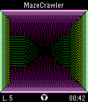</a>

<h2 class="app-name" id="app-52a97439c0ca9349a0000051"><a href="https://apps.repebble.com/52a97439c0ca9349a0000051">MazeCrawler</a></h2>
<a class="app-source" href="https://github.com/theDrake/mazecrawler" title="Source code" data-search-exclude>View source</a>

by <a href="https://apps.repebble.com/apps/dev/david-c-drake_52a967dbc0ca9380d8000046" title="More from this developer">David C. Drake</a>

Not checked yet v1.9 Updated 2016-01-14

Runs on: Time 2, Pebble 2 Duo, Pebble 2, Time, Classic

A 3D first-person maze-navigation game and the foundation for SpaceMerc and PebbleQuest. Search each maze for its exit, marked by a hole in the ground, to earn points and unlock up to 12…

<a class="app-shot" href="https://apps.repebble.com/69446bdf105d0c00095aaf51" data-search-exclude>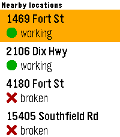</a>

<h2 class="app-name" id="app-69446bdf105d0c00095aaf51"><a href="https://apps.repebble.com/69446bdf105d0c00095aaf51">mcbroken</a></h2>
<a class="app-source" href="https://github.com/nubbybubby/pebble-mcbroken" title="Source code" data-search-exclude>View source</a>

by <a href="https://apps.repebble.com/apps/dev/nubbybubby_67a84b8e89529e00099b3a79" title="More from this developer">nubbybubby</a>

Not checked yet v1.30 Updated 2026-04-15

Runs on: Time 2, Pebble 2 Duo, Pebble 2, Time, Classic

A mcbroken client for Pebble smartwatches. Now you can check if the ice cream machine is down on your wrist! Nearby shows up to 5 McDonald&#x27;s locations within a 5-mile (8.04 km) radius from your…

<a class="app-shot" href="https://apps.repebble.com/2c08d28f32f4496baa7ce502" data-search-exclude>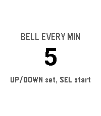</a>

<h2 class="app-name" id="app-2c08d28f32f4496baa7ce502"><a href="https://apps.repebble.com/2c08d28f32f4496baa7ce502">Meditation Timer</a></h2>
<a class="app-source" href="https://github.com/briancbarrow/meditation-timer" title="Source code" data-search-exclude>View source</a>

by <a href="https://apps.repebble.com/apps/dev/brian-barrow_f274760627a9ea167ea488f3" title="More from this developer">Brian Barrow</a>

No licence v0.0.2 Updated 2026-08-17

Runs on: Round 2, Time 2

A meditation timer with interval bells, entirely on the watch.

<a class="app-shot" href="https://apps.rebble.io/en_US/application/610fffcc1342ae019adb50a0" data-search-exclude>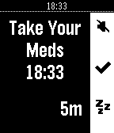</a>

<h2 class="app-name" id="app-610fffcc1342ae019adb50a0"><a href="https://apps.rebble.io/en_US/application/610fffcc1342ae019adb50a0">Meds</a></h2>
<a class="app-source" href="https://github.com/david-s-svedberg/pebble-medicine" title="Source code" data-search-exclude>View source</a>

by <a href="https://apps.rebble.io/en_US/developer/610fffcb1342ae019adb509e/1" title="More from this developer">david.s.svedberg@gmail.com</a>

Not checked yet v1.3 Updated 2022-04-13 Rebble App Store

Runs on: Time 2, Pebble 2 Duo, Pebble 2, Time, Classic

Simple app to get reminders to take your medicine

<a class="app-shot" href="https://apps.repebble.com/5539d8fdbf1a59d7ac000053" data-search-exclude>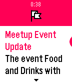</a>

<h2 class="app-name" id="app-5539d8fdbf1a59d7ac000053"><a href="https://apps.repebble.com/5539d8fdbf1a59d7ac000053">Meetup</a></h2>
<a class="app-source" href="https://github.com/fletchto99/Pebble-Meetup" title="Source code" data-search-exclude>View source</a>

by <a href="https://apps.repebble.com/apps/dev/matt-langlois_52e30dd32645fb8bae000fcd" title="More from this developer">Matt Langlois</a>

Not checked yet v2.22 Updated 2016-02-16

Runs on: Round 2, Time 2, Pebble 2 Duo, Pebble 2, Time Round, Time, Classic

Keep on top of the upcoming Pebble &amp; Other meetup events/groups in your area! Actions include: - View Pebble meetup groups, world wide! - View upcoming Pebble meetup events within a configurable…

<h2 class="app-name" id="app-73d2d5a2cc2c4a7e90cf1090"><a href="https://apps.repebble.com/73d2d5a2cc2c4a7e90cf1090">Meme Stream</a></h2>
<a class="app-source" href="https://github.com/coredevices/pebble-watchface-agent-skill" title="Source code" data-search-exclude>View source</a>

by <a href="https://apps.repebble.com/apps/dev/aircodum_67bc77bf37d408000a74f7d3" title="More from this developer">AirCodum</a>

Not checked yet v1.0.0 Updated 2026-06-21

Runs on: Time 2

Meme Stream shows random captioned memes pulled live from Reddit&#x27;s popular meme communities via the public meme-api.com service. Press any button for the next meme. All content is sourced from…

<a class="app-shot" href="https://apps.repebble.com/580ad207e1956855d1000075" data-search-exclude>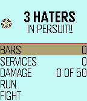</a>

<h2 class="app-name" id="app-580ad207e1956855d1000075"><a href="https://apps.repebble.com/580ad207e1956855d1000075">Meme Wars</a></h2>
<a class="app-source" href="https://github.com/ElijahZAwesome/MemeWars" title="Source code" data-search-exclude>View source</a>

by <a href="https://apps.repebble.com/apps/dev/elijahzawesome_55f606cf883da5793f000019" title="More from this developer">ElijahZAwesome</a>

No licence v3.5 Updated 2016-10-22

Runs on: Time 2, Pebble 2 Duo, Pebble 2, Time, Classic

This is a sort of &quot;hack&quot; of Drug Wars for pebble. ABSOLUTELY ALL CREDIT GOES TO ACLYMER HE CREATED THIS GAME. IM JUST TRYING TO HAVE SOME FUN WITH IT. Your job is to sell and buy memes so that you…

<h2 class="app-name" id="app-6962e51d29173c0009b18f8e"><a href="https://apps.repebble.com/6962e51d29173c0009b18f8e">Memos</a></h2>
<a class="app-source" href="https://github.com/erimow/pebble-memos/" title="Source code" data-search-exclude>View source</a>

by <a href="https://apps.repebble.com/apps/dev/erimow_6747de4133d355000a518dd7" title="More from this developer">erimow</a>

Not checked yet v1.0 Updated 2026-01-10

Runs on: Round 2, Time 2, Pebble 2 Duo, Pebble 2, Time Round, Time

A very simple app to connect with your self-hosted Memos server and quickly send thoughts or ideas straight over! Requires dictation. https://github.com/usememos/memos Use keywords such as: check…

<a class="app-shot" href="https://apps.repebble.com/560ae6554bf0ac5620000001" data-search-exclude>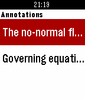</a>

<h2 class="app-name" id="app-560ae6554bf0ac5620000001"><a href="https://apps.repebble.com/560ae6554bf0ac5620000001">Mendeley</a></h2>
<a class="app-source" href="https://github.com/joshje/mendeley-pebble-app" title="Source code" data-search-exclude>View source</a>

by <a href="https://apps.repebble.com/apps/dev/josh-emerson_54f6d5ad077144f23d000026" title="More from this developer">Josh Emerson</a>

Not checked yet v1.0 Updated 2015-09-29

Runs on: Time 2, Pebble 2 Duo, Pebble 2, Time, Classic

Browse your Mendeley library on your Pebble! You can read the documents added via Mendeley, and see any annotations you&#x27;ve added. This is an unofficial app for Mendeley and is not affiliated with…

<a class="app-shot" href="https://apps.repebble.com/580525f2c988667eaa00000f" data-search-exclude>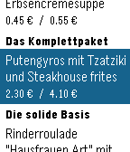</a>

<h2 class="app-name" id="app-580525f2c988667eaa00000f"><a href="https://apps.repebble.com/580525f2c988667eaa00000f">Mensa Stuttgart</a></h2>
<a class="app-source" href="https://github.com/janh/mensa-stuttgart" title="Source code" data-search-exclude>View source</a>

by <a href="https://apps.repebble.com/apps/dev/jan-hoffmann_57dafd212d0cc80b6f0000d3" title="More from this developer">Jan Hoffmann</a>

Not checked yet v1.2 Updated 2018-06-20

Runs on: Round 2, Time 2, Pebble 2 Duo, Pebble 2, Time Round, Time, Classic

Diese App zeigt jederzeit das aktuelle Essensangebot der Mensen des Studierendenwerks Stuttgart. Das Angebot der kommenden Tage wird gespeichert, sodass der Zugriff auch ohne Internetverbindung…

<a class="app-shot" href="https://apps.repebble.com/5604317400b04812a7000031" data-search-exclude>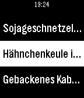</a>

<h2 class="app-name" id="app-5604317400b04812a7000031"><a href="https://apps.repebble.com/5604317400b04812a7000031">Mensa UPB</a></h2>
<a class="app-source" href="https://github.com/cbruegg/Mensa-UPB-Pebble" title="Source code" data-search-exclude>View source</a>

by <a href="https://apps.repebble.com/apps/dev/christian-br-ggemann_55fdb541997a425df300009f" title="More from this developer">Christian Brüggemann</a>

Not checked yet v1.1 Updated 2015-09-24

Runs on: Time 2, Pebble 2 Duo, Pebble 2, Time, Classic

Mensa UPB is a small utility app for displaying the current dishes of the restaurants of the University of Paderborn.

<a class="app-shot" href="https://apps.rebble.io/en_US/application/67ce4f0cb7a0230391426cc7" data-search-exclude>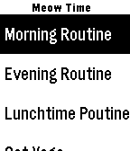</a>

<h2 class="app-name" id="app-67ce4f0cb7a0230391426cc7"><a href="https://apps.rebble.io/en_US/application/67ce4f0cb7a0230391426cc7">MeowTime</a></h2>
<a class="app-source" href="https://github.com/binamkayastha/MeowTime" title="Source code" data-search-exclude>View source</a>

by <a href="https://apps.rebble.io/en_US/developer/67ce4aef84758d000924fbef/1" title="More from this developer">Binam Kayastha</a>

No licence v1.5 Updated 2025-04-18 Rebble App Store

Runs on: Round 2, Time 2, Pebble 2 Duo, Pebble 2, Time Round, Time, Classic

This is the purrrfect routine app for you! Complete your routines and make your pet cat (Routini) happy. When should you start your routines - Routini says MEOW!

<a class="app-shot" href="https://apps.repebble.com/56340377ffc90183ee00001e" data-search-exclude>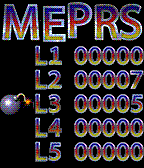</a>

<h2 class="app-name" id="app-56340377ffc90183ee00001e"><a href="https://apps.repebble.com/56340377ffc90183ee00001e">MEPRS - Mine Sweepers</a></h2>
<a class="app-source" href="https://github.com/HGustavs/MEPRS" title="Source code" data-search-exclude>View source</a>

by <a href="https://apps.repebble.com/apps/dev/henrik-gustavsson_54f40c4a975f690b38000018" title="More from this developer">Henrik Gustavsson</a>

GPL-2.0 v1.00 Updated 2015-10-31

Runs on: Time 2, Time

MEPRS is a variation of the classic Mine Sweeper game. It has colorful graphics and a persistent high-score table and five different levels with increasing difficulty. As the application only…

<a class="app-shot" href="https://apps.rebble.io/en_US/application/69d9d794afd84300099c2003" data-search-exclude>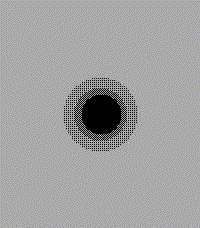</a>

<h2 class="app-name" id="app-69d9d794afd84300099c2003"><a href="https://apps.rebble.io/en_US/application/69d9d794afd84300099c2003">Metaballs</a></h2>
<a class="app-source" href="https://github.com/flynnd273/pebble-metaballs" title="Source code" data-search-exclude>View source</a>

by <a href="https://apps.rebble.io/en_US/developer/67bd48a737d408000a74f7d7/1" title="More from this developer">Flynn Duniho</a>

Not checked yet v1.0 Updated 2026-04-11 Rebble App Store

Runs on: Round 2, Time 2, Pebble 2 Duo, Pebble 2, Time Round, Time, Classic

Play with a bouncy metaball! It kinda merges together with the other one lol

<a class="app-shot" href="https://apps.repebble.com/23eaa3d5cc07456fa6c2f03b" data-search-exclude>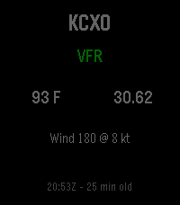</a>

<h2 class="app-name" id="app-23eaa3d5cc07456fa6c2f03b"><a href="https://apps.repebble.com/23eaa3d5cc07456fa6c2f03b">METAR Aviation Weather</a></h2>
<a class="app-source" href="https://github.com/jasonmarquette/mini-metar-pebble" title="Source code" data-search-exclude>View source</a>

by <a href="https://apps.repebble.com/apps/dev/jason-marquette_5bee80559abfa407b64d6d00" title="More from this developer">Jason Marquette</a>

Not checked yet v1.2.1 Updated 2026-07-19

Runs on: Round 2, Time 2, Pebble 2 Duo, Pebble 2, Time, Classic

Mini METAR brings current aviation weather directly to your Pebble smartwatch. View live METAR information for any ICAO airport, including flight category, temperature, wind, altimeter setting…

<a class="app-shot" href="https://apps.repebble.com/53d544b109b2d7c464000065" data-search-exclude>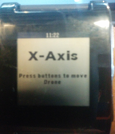</a>

<h2 class="app-name" id="app-53d544b109b2d7c464000065"><a href="https://apps.repebble.com/53d544b109b2d7c464000065">Meteor Flies Drone</a></h2>
<a class="app-source" href="https://github.com/afuhrtrumpet/meteorhack14" title="Source code" data-search-exclude>View source</a>

by <a href="https://apps.repebble.com/apps/dev/akshay-dixit_53d414cbeafa28ae64000085" title="More from this developer">Akshay Dixit</a>

No licence v1.0.0 Updated 2014-07-27

Runs on: Time 2, Pebble 2 Duo, Pebble 2, Time, Classic

Fly an AR Drone 2.0 collaboratively with others!!

<a class="app-shot" href="https://apps.repebble.com/54ffe7a20bde9aff230000ef" data-search-exclude>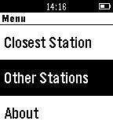</a>

<h2 class="app-name" id="app-54ffe7a20bde9aff230000ef"><a href="https://apps.repebble.com/54ffe7a20bde9aff230000ef">Metro DC</a></h2>
<a class="app-source" href="https://github.com/sammanthp007/HUhack" title="Source code" data-search-exclude>View source</a>

by <a href="https://apps.repebble.com/apps/dev/gaarathu_5443d83233c9c090c20000c1" title="More from this developer">Gaarathu</a>

Not checked yet v1.0 Updated 2015-03-11

Runs on: Time 2, Pebble 2 Duo, Pebble 2, Time, Classic

Locates the nearest metro near you anywhere in Washington, DC.

<a class="app-shot" href="https://apps.repebble.com/57f447413c754a887a0000e1" data-search-exclude>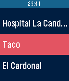</a>

<h2 class="app-name" id="app-57f447413c754a887a0000e1"><a href="https://apps.repebble.com/57f447413c754a887a0000e1">Metro Tenerife</a></h2>
<a class="app-source" href="https://github.com/Alexsays/MetroTenerifePebbleApp" title="Source code" data-search-exclude>View source</a>

by <a href="https://apps.repebble.com/apps/dev/alexsays_577ad76066202abaab000043" title="More from this developer">Alexsays</a>

MIT v1.1 Updated 2016-10-05

Runs on: Round 2, Time 2, Pebble 2 Duo, Pebble 2, Time Round, Time, Classic

Metro Tenerife te permite visualizar los próximos tranvías que se acercan a la estación que elijas. Para más ayuda, visita la wiki en Github

<a class="app-shot" href="https://apps.repebble.com/e1f486d7efeb4d1a980d19e6" data-search-exclude>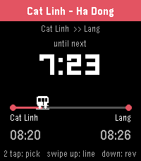</a>

<h2 class="app-name" id="app-e1f486d7efeb4d1a980d19e6"><a href="https://apps.repebble.com/e1f486d7efeb4d1a980d19e6">Metro VietNam</a></h2>
<a class="app-source" href="https://github.com/dungngminh/pebble_metro_vietnam" title="Source code" data-search-exclude>View source</a>

by <a href="https://apps.repebble.com/apps/dev/dzung-nguyen_953495be3bbba9424ed38e9b" title="More from this developer">Dzung Nguyen</a>

Not checked yet v1.2.0 Updated 2026-06-28

Runs on: Round 2, Time 2, Pebble 2 Duo, Pebble 2, Time Round, Time, Classic

Track Hanoi &amp; Ho Chi Minh City metro from your wrist. Pick your trip A → B, watch the next train count down, get a buzz before it arrives.

<a class="app-shot" href="https://apps.repebble.com/6598a3a2e46ef1043582fff3" data-search-exclude>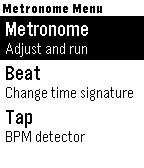</a>

<h2 class="app-name" id="app-6598a3a2e46ef1043582fff3"><a href="https://apps.repebble.com/6598a3a2e46ef1043582fff3">Metronome</a></h2>
<a class="app-source" href="https://github.com/dscheinah/metronome-pebble" title="Source code" data-search-exclude>View source</a>

by <a href="https://apps.repebble.com/apps/dev/dscheinah_5bef203e74e2a60001cef482" title="More from this developer">Dscheinah</a>

Not checked yet v1.1 Updated 2024-01-06

Runs on: Round 2, Time 2, Pebble 2 Duo, Pebble 2, Time Round, Time, Classic

This is a haptic metronome app for Pebble devices. It gives you visual and vibration feedback to display the tempo. It is also possible to configure the time signature and tap in a tempo. The app…

<a class="app-shot" href="https://apps.repebble.com/5553693764e9b7cd8d000024" data-search-exclude>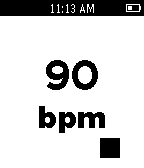</a>

<h2 class="app-name" id="app-5553693764e9b7cd8d000024"><a href="https://apps.repebble.com/5553693764e9b7cd8d000024">Metronome</a></h2>
<a class="app-source" href="https://github.com/erisinger/Metronome" title="Source code" data-search-exclude>View source</a>

by <a href="https://apps.repebble.com/apps/dev/erik-risinger_52f066234ae3632a2500174e" title="More from this developer">Erik Risinger</a>

Not checked yet v1.0 Updated 2015-05-13

Runs on: Time 2, Pebble 2 Duo, Pebble 2, Time, Classic

A private, silent metronome on your wrist. Metronome buzzes quietly to indicate beats -- no more in-ear monitors or worrying about the click track bleeding into your recording. In a live setting…

<a class="app-shot" href="https://apps.repebble.com/569b571ddba9797f93000012" data-search-exclude>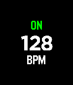</a>

<h2 class="app-name" id="app-569b571ddba9797f93000012"><a href="https://apps.repebble.com/569b571ddba9797f93000012">Metronome</a></h2>
<a class="app-source" href="https://github.com/Evan-Goode/pebble-metronome" title="Source code" data-search-exclude>View source</a>

by <a href="https://apps.repebble.com/apps/dev/evan-goode_567d54d107ac230cca00010e" title="More from this developer">Evan Goode</a>

Unlicense v1.2 Updated 2016-01-21

Runs on: Round 2, Time 2, Pebble 2 Duo, Pebble 2, Time Round, Time, Classic

A minimalistic haptic metronome for the Pebble Time. Adjust the tempo with the up and down buttons and toggle vibration with the select button.

<a class="app-shot" href="https://apps.repebble.com/56c23cf0919c5a29fa00002a" data-search-exclude>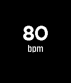</a>

<h2 class="app-name" id="app-56c23cf0919c5a29fa00002a"><a href="https://apps.repebble.com/56c23cf0919c5a29fa00002a">Metronome</a></h2>
<a class="app-source" href="https://github.com/Jan18101997/Pebble-Metronome" title="Source code" data-search-exclude>View source</a>

by <a href="https://apps.repebble.com/apps/dev/jan-wiesemann_559ed15014e579cf2900005d" title="More from this developer">Jan Wiesemann</a>

No licence v1.4 Updated 2016-02-19

Runs on: Time 2, Pebble 2 Duo, Pebble 2, Time, Classic

A simple Metronome

<a class="app-shot" href="https://apps.repebble.com/559d3dc9d106c8c6af000034" data-search-exclude>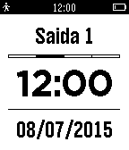</a>

<h2 class="app-name" id="app-559d3dc9d106c8c6af000034"><a href="https://apps.repebble.com/559d3dc9d106c8c6af000034">Meu Ponto</a></h2>
<a class="app-source" href="https://github.com/thiagosalles/meu_ponto_pebble/" title="Source code" data-search-exclude>View source</a>

by <a href="https://apps.repebble.com/apps/dev/thiago-salles_559166e40c3212d7b500005d" title="More from this developer">Thiago Salles</a>

Not checked yet v1.1 Updated 2015-07-09

Runs on: Time 2, Pebble 2 Duo, Pebble 2, Time, Classic

Meu Ponto é um aplicativo para controlar os seus horários de entrada e saída do trabalho e saldo total de horas. Meu Ponto para o Pebble permite que você registre os horários na sua conta do Meu…

<a class="app-shot" href="https://apps.repebble.com/53b6e0eb5ad92e9a2600020f" data-search-exclude>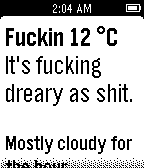</a>

<h2 class="app-name" id="app-53b6e0eb5ad92e9a2600020f"><a href="https://apps.repebble.com/53b6e0eb5ad92e9a2600020f">MF&#x27;n Weather</a></h2>
<a class="app-source" href="https://github.com/argyleink/Colorful-Weather" title="Source code" data-search-exclude>View source</a>

by <a href="https://apps.repebble.com/apps/dev/argyleink_52f9b7c5afe055aaff0000b3" title="More from this developer">ArgyleInk</a>

MIT v2.0 Updated 2015-10-11

Runs on: Time 2, Pebble 2 Duo, Pebble 2, Time, Classic

CAUTION: This app is full of profanity. It&#x27;s the most vulgar, inappropriate, foul, disgusting weather app. I think it&#x27;s funny. Celsius is now supported, hit the select button to bring up a menu.

<a class="app-shot" href="https://apps.repebble.com/b8d039c740774c7db01fbb62" data-search-exclude>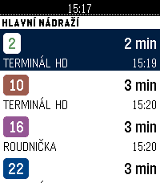</a>

<h2 class="app-name" id="app-b8d039c740774c7db01fbb62"><a href="https://apps.repebble.com/b8d039c740774c7db01fbb62">MHD HK</a></h2>
<a class="app-source" href="https://github.com/ArzykDev/pebble-dpmhk" title="Source code" data-search-exclude>View source</a>

by <a href="https://apps.repebble.com/apps/dev/arzyk_537f54c5edaa6f19c2a22493" title="More from this developer">Arzyk</a>

MIT v2.0.1 Updated 2026-10-03

Runs on: Round 2, Time 2, Pebble 2 Duo, Pebble 2, Time Round, Time, Classic

Odjezdy hradecké MHD (DPMHK) přímo na hodinkách. Zvednete ruku, vidíte, za kolik minut vám to jede. CO UMÍ Odjezdy — nejbližší spoje ze zastávky: linka, směr a čas odjezdu. Odpočet do odjezdu se…

<a class="app-shot" href="https://apps.repebble.com/23b7e4023deb47b2b30b8a40" data-search-exclude>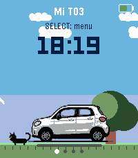</a>

<h2 class="app-name" id="app-23b7e4023deb47b2b30b8a40"><a href="https://apps.repebble.com/23b7e4023deb47b2b30b8a40">Mi T03</a></h2>
<a class="app-source" href="https://github.com/aiorass/t03-pebble" title="Source code" data-search-exclude>View source</a>

by <a href="https://apps.repebble.com/apps/dev/aioras_54571268d6497ea29175596e" title="More from this developer">aioras</a>

No licence v1.5.0 Updated 2026-08-29

Runs on: Round 2, Time 2, Pebble 2 Duo, Pebble 2, Time Round, Time, Classic

Mi T03 connects your Pebble watch to your Leapmotor T03 through Home Assistant (leapmotor-ha integration) — no custom servers or MQTT bridges needed. From your wrist you can: - Check battery…

<a class="app-shot" href="https://apps.repebble.com/4e0ab343fe694b889ef1808d" data-search-exclude>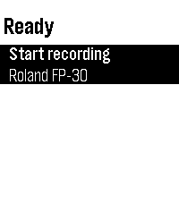</a>

<h2 class="app-name" id="app-4e0ab343fe694b889ef1808d"><a href="https://apps.repebble.com/4e0ab343fe694b889ef1808d">MIDI Recorder</a></h2>
<a class="app-source" href="https://github.com/Sykero-Software/PebbleMidiRecorder" title="Source code" data-search-exclude>View source</a>

by <a href="https://apps.repebble.com/apps/dev/syker-software_9f6c9c6e9ce88af6a0db953e" title="More from this developer">Sykerö Software</a>

GPL-3.0 v1.0.4 Updated 2026-07-03

Runs on: Time 2, Pebble 2 Duo, Pebble 2, Time, Classic

Control MIDI Recorder from your wrist. Start and stop recording with one tap, and see the current recording time and the connected MIDI device at a glance — no need to pick up your phone…

<a class="app-shot" href="https://apps.repebble.com/dc217d9f68044c209c3b7f2f" data-search-exclude>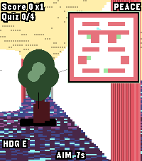</a>

<h2 class="app-name" id="app-dc217d9f68044c209c3b7f2f"><a href="https://apps.repebble.com/dc217d9f68044c209c3b7f2f">Migi&#x27;s Basics</a></h2>
<a class="app-source" href="https://github.com/HenryTheAddict/MigiBasics" title="Source code" data-search-exclude>View source</a>

by <a href="https://apps.repebble.com/apps/dev/h3nry_66430b30a243d294bd0df8c0" title="More from this developer">h3nry</a>

No licence v1.0 Updated 2026-04-04

Runs on: Round 2, Time 2

Imagine baldi&#x27;s basics (the game) but instead of baldi, it was eric migi, and you have to run around the pebble warehouse and steal pebbles, oh yeah and there is a map... there is story mode…

<a class="app-shot" href="https://apps.repebble.com/54690692ecee196dde000019" data-search-exclude>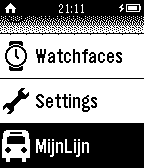</a>

<h2 class="app-name" id="app-54690692ecee196dde000019"><a href="https://apps.repebble.com/54690692ecee196dde000019">MijnLijn</a></h2>
<a class="app-source" href="https://github.com/runelaenen/MijnLijnPebble" title="Source code" data-search-exclude>View source</a>

by <a href="https://apps.repebble.com/apps/dev/rune-laenen_54535818133890a624000077" title="More from this developer">Rune Laenen</a>

Not checked yet v1.4 Updated 2015-02-03

Runs on: Time 2, Pebble 2 Duo, Pebble 2, Time, Classic

Volg je bus op je Pebble. Deze app stelt je in staat je bus van De Lijn te volgen. Geen koude handen meer om je gsm uit je broekzak te halen! Dit is géén officiele app van De Lijn. Eventuele…

<a class="app-shot" href="https://apps.rebble.io/en_US/application/5328353ce35fcc67380002a8" data-search-exclude>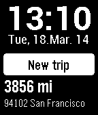</a>

<h2 class="app-name" id="app-5328353ce35fcc67380002a8"><a href="https://apps.rebble.io/en_US/application/5328353ce35fcc67380002a8">Mileage Log | Fahrtenbuch</a></h2>
<a class="app-source" href="https://itunes.apple.com/us/app/fahrtenbuch/id286070473?mt=8" title="Source code" data-search-exclude>View source</a>

by <a href="https://apps.rebble.io/en_US/developer/52b200a105c0464291000030/1" title="More from this developer">meyer-solutions</a>

Not checked yet v1.3 Updated 2014-11-05 Rebble App Store

Runs on: Time 2, Pebble 2 Duo, Pebble 2, Time, Classic

Mileage Log | Fahrtenbuch - the #1 mileage logging application in Germany, essential for anyone who needs to track mileage for tax deduction or reimbursement. Enjoy your pebble, enjoy your ride…

<a class="app-shot" href="https://apps.repebble.com/54aba1fe8068b7203f00007c" data-search-exclude>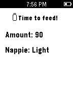</a>

<h2 class="app-name" id="app-54aba1fe8068b7203f00007c"><a href="https://apps.repebble.com/54aba1fe8068b7203f00007c">Milktime</a></h2>
<a class="app-source" href="https://github.com/santrancisco/milktime" title="Source code" data-search-exclude>View source</a>

by <a href="https://apps.repebble.com/apps/dev/santrancisco_54ab9f13f3a173dfa500007b" title="More from this developer">santrancisco</a>

Not checked yet v0.9 Updated 2015-01-06

Runs on: Time 2, Pebble 2 Duo, Pebble 2, Time, Classic

Milktime is good for mum and dad who have a newborn or an infant. This app alert you the next time your baby has milk, the amount and the potential of soiled nappie base on previous entries…

<a class="app-shot" href="https://apps.repebble.com/54e3ee69d412a8ba5100001b" data-search-exclude>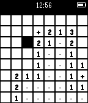</a>

<h2 class="app-name" id="app-54e3ee69d412a8ba5100001b"><a href="https://apps.repebble.com/54e3ee69d412a8ba5100001b">Minesweeper</a></h2>
<a class="app-source" href="https://github.com/jtcgreyfox/PBMinesweeper" title="Source code" data-search-exclude>View source</a>

by <a href="https://apps.repebble.com/apps/dev/honourity_54cdfd96d429c37ba300008d" title="More from this developer">Honourity</a>

Not checked yet v1.0 Updated 2018-02-19

Runs on: Time 2, Pebble 2 Duo, Pebble 2, Time, Classic

10 Mines, 64 Locations Controls DOWN - move down UP - move right SELECT - choose square SELECT (long press) - flag square UP (long press) - reset the game Game ends when you have cleared…

<a class="app-shot" href="https://apps.repebble.com/e62be379bf534a5c8142db2f" data-search-exclude>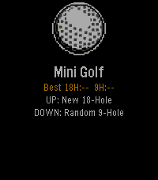</a>

<h2 class="app-name" id="app-e62be379bf534a5c8142db2f"><a href="https://apps.repebble.com/e62be379bf534a5c8142db2f">Mini Golf Touch</a></h2>
<a class="app-source" href="https://github.com/brooks2564/Pebble-Mini-Golf" title="Source code" data-search-exclude>View source</a>

by <a href="https://apps.repebble.com/apps/dev/brooman-inks_44b97418cf47663c00fb67bc" title="More from this developer">Brooman Inks</a>

No licence v2.0 Updated 2026-05-04

Runs on: Round 2, Time 2, Pebble 2 Duo, Pebble 2, Time Round, Time, Classic

⛳ Pebble Mini Golf... Now with Touch Controls A fully playable mini golf game for Pebble smartwatches — now with full touch screen support on Pebble Time 2 and other touch-enabled models. Take on…

<a class="app-shot" href="https://apps.rebble.io/en_US/application/56657d6851620851c0000011" data-search-exclude>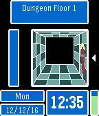</a>

<h2 class="app-name" id="app-56657d6851620851c0000011"><a href="https://apps.rebble.io/en_US/application/56657d6851620851c0000011">MiniAdventure</a></h2>
<a class="app-source" href="https://github.com/Torivon/MiniAdventure" title="Source code" data-search-exclude>View source</a>

by <a href="https://apps.rebble.io/en_US/developer/52e7ee4e217dd094a200002f/1" title="More from this developer">Torivon</a>

MIT v1.0 Updated 2016-12-13 Rebble App Store

Runs on: Round 2, Time 2, Pebble 2 Duo, Pebble 2, Time Round, Time

MiniAdventure is an engine for making games for the Pebble platform. The focus of the features developed is to make first person adventure and RPG games. This began as an extension of MiniDungeon…

<a class="app-shot" href="https://apps.repebble.com/52ee8b9294cc96542400002c" data-search-exclude>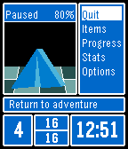</a>

<h2 class="app-name" id="app-52ee8b9294cc96542400002c"><a href="https://apps.repebble.com/52ee8b9294cc96542400002c">MiniDungeon</a></h2>
<a class="app-source" href="https://github.com/Torivon/MiniDungeon" title="Source code" data-search-exclude>View source</a>

by <a href="https://apps.repebble.com/apps/dev/torivon_52e7ee4e217dd094a200002f" title="More from this developer">Torivon</a>

MIT v3.4 Updated 2016-09-20

Runs on: Round 2, Time 2, Pebble 2 Duo, Pebble 2, Time Round, Time, Classic

Explore a dungeon as you go about your day. Exploring is randomized and time based, so you only act when an event is triggered. Encounter random monsters and chests. Survive, and you can advance…

<a class="app-shot" href="https://apps.repebble.com/52a8c1702438eb042600000b" data-search-exclude>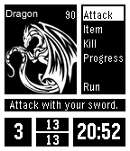</a>

<h2 class="app-name" id="app-52a8c1702438eb042600000b"><a href="https://apps.repebble.com/52a8c1702438eb042600000b">MiniDungeon EX</a></h2>
<a class="app-source" href="https://github.com/Belphemur/MiniDungeon" title="Source code" data-search-exclude>View source</a>

by <a href="https://apps.repebble.com/apps/dev/belphemur_529a46ed129af768b50000ea" title="More from this developer">Belphemur</a>

No licence v5.4 Updated 2015-07-09

Runs on: Time 2, Pebble 2 Duo, Pebble 2, Time, Classic

MiniDungeon Extended is a small adventure game on your watch. The goal is to survive to the 20th floor of the dungeon and defeat the final monster there. In order to aid you with this task, you…

<a class="app-shot" href="https://apps.repebble.com/53b6d46f8847ca3dd200027c" data-search-exclude>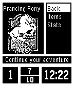</a>

<h2 class="app-name" id="app-53b6d46f8847ca3dd200027c"><a href="https://apps.repebble.com/53b6d46f8847ca3dd200027c">MiniLOTR</a></h2>
<a class="app-source" href="https://github.com/Torivon/MiniDungeon" title="Source code" data-search-exclude>View source</a>

by <a href="https://apps.repebble.com/apps/dev/metroidmen_529f67f51a663894e5000071" title="More from this developer">metroidmen</a>

MIT v1.1 Updated 2014-07-25

Runs on: Time 2, Pebble 2 Duo, Pebble 2, Time, Classic

Traverse Middle-Earth fighting your way through random encounters with all of your favorite creatures from Tolkiens universe! Stay alive, use your magic sparingly, and prepare yourself for your…

<a class="app-shot" href="https://apps.repebble.com/d905c29fb79d436f803a64df" data-search-exclude>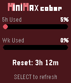</a>

<h2 class="app-name" id="app-d905c29fb79d436f803a64df"><a href="https://apps.repebble.com/d905c29fb79d436f803a64df">MiniMax Balance</a></h2>
<a class="app-source" href="https://github.com/zhcong/minimax-balance-pebble" title="Source code" data-search-exclude>View source</a>

by <a href="https://apps.repebble.com/apps/dev/zhcong_2cb7ef1900abdccd21d29eef" title="More from this developer">zhcong</a>

Not checked yet v1.0.0 Updated 2026-07-02

Runs on: Round 2, Time 2, Pebble 2 Duo, Pebble 2, Time Round, Time, Classic

A Pebble watch app that displays MiniMax Code Plan usage balance. - 5h limit usage percentage with progress bar - Weekly limit usage percentage with progress bar - 5h window reset countdown …

<a class="app-shot" href="https://apps.repebble.com/c55bf63c1eed4b1d87558961" data-search-exclude>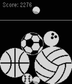</a>

<h2 class="app-name" id="app-c55bf63c1eed4b1d87558961"><a href="https://apps.repebble.com/c55bf63c1eed4b1d87558961">MiniSuika</a></h2>
<a class="app-source" href="https://faceswithlove.framer.ai/" title="Source code" data-search-exclude>View source</a>

by <a href="https://apps.repebble.com/apps/dev/flo-kn-dl_69207a520a015600086f2e44" title="More from this developer">Flo Knödl</a>

See source v1.1 Updated 2026-04-05

Runs on: Pebble 2 Duo

Drop &amp; merge balls together before get over the line. How to play? - Drop a ball with the DOWN button - Balls of the same type will merge on contact - Try to keep all balls under the white line

<a class="app-shot" href="https://apps.repebble.com/a6afc81d58194fa6969f0c34" data-search-exclude>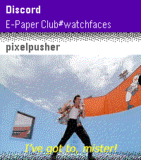</a>

<h2 class="app-name" id="app-a6afc81d58194fa6969f0c34"><a href="https://apps.repebble.com/a6afc81d58194fa6969f0c34">MirrorMsg</a></h2>
<a class="app-source" href="https://github.com/killdano/mirrormsg" title="Source code" data-search-exclude>View source</a>

by <a href="https://apps.repebble.com/apps/dev/dan-o_7554f7efe7fa233696d7913a" title="More from this developer">dAN-o</a>

Not checked yet v0.92 Updated 2026-10-05

Runs on: Time 2, Time

MirrorMsg is the most advanced messaging client for Pebble. Log in to your accounts and see all your live conversations in chat threads that scroll through the entire chat, with rich modern…

<a class="app-shot" href="https://apps.repebble.com/55063b35b2a34da33f0000f0" data-search-exclude>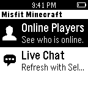</a>

<h2 class="app-name" id="app-55063b35b2a34da33f0000f0"><a href="https://apps.repebble.com/55063b35b2a34da33f0000f0">Misfit MC</a></h2>
<a class="app-source" href="https://github.com/hanamj/pebble-misfitmc-chat" title="Source code" data-search-exclude>View source</a>

by <a href="https://apps.repebble.com/apps/dev/john_54ff9f45d0323be1e3000091" title="More from this developer">John</a>

Not checked yet v2.0 Updated 2015-03-28

Runs on: Time 2, Pebble 2 Duo, Pebble 2, Time, Classic

See who is online the Misfit Minecraft server, and monitor the live in-game chat. Press the Select button on either view to refresh the content.

<h2 class="app-name" id="app-99bfa7344bcb48179e60dfb6"><a href="https://apps.repebble.com/99bfa7344bcb48179e60dfb6">MLB Scores</a></h2>
<a class="app-source" href="https://github.com/RobErskine/pebble-mlb-scores" title="Source code" data-search-exclude>View source</a>

by <a href="https://apps.repebble.com/apps/dev/roberskine_184b13a8b0e0be736034d50a" title="More from this developer">RobErskine</a>

No licence v1.1.1 Updated 2026-07-01

Runs on: Round 2, Time 2, Pebble 2 Duo, Pebble 2, Time Round, Time, Classic

MLB Gameday on your wrist. See all games, their current inning, and their scores. Drill into any game to see the pitcher, active hitter, and their count down to the current balls and strikes. See…

<h2 class="app-name" id="app-340419796c294b859314a975"><a href="https://apps.repebble.com/340419796c294b859314a975">MMS Viewer</a></h2>
<a class="app-source" href="https://github.com/zachthebeasty12345-sketch/MMS-Viewer-for-Pebble-Watch" title="Source code" data-search-exclude>View source</a>

by <a href="https://apps.repebble.com/apps/dev/boxofdanger_5c70607c37fbb400014e5d33" title="More from this developer">BoxofDanger</a>

Not checked yet v1.0 Updated 2026-05-07

Runs on: Round 2, Time 2, Pebble 2 Duo, Pebble 2, Time Round, Time, Classic

WOAAH Extremely beta. Check out for full info on GitHub Allows you to see text images on the watch , beware probably really buggy.

<h2 class="app-name" id="app-55f6642c701b34da31000041"><a href="https://apps.repebble.com/55f6642c701b34da31000041">Mnemosyne Elixir</a></h2>
<a class="app-source" href="https://github.com/kurtlawrence/AndroidShoppingList_pebble" title="Source code" data-search-exclude>View source</a>

by <a href="https://apps.repebble.com/apps/dev/kurt-lawrence_55c95471a29d99642d00002d" title="More from this developer">Kurt Lawrence</a>

Not checked yet v2.0 Updated 2015-10-17

Runs on: Round 2, Time 2, Pebble 2 Duo, Pebble 2, Time Round, Time, Classic

A useful checklist app that will move checked items out of the way when checked. The app is designed for shopping or todo applications, position unchecked items at the top of the stack for ease of…

<h2 class="app-name" id="app-536c13bd59f889ec77000051"><a href="https://apps.repebble.com/536c13bd59f889ec77000051">Modern Caffeine</a></h2>
<a class="app-source" href="https://github.com/asymptoticflight/ModernCaffeine" title="Source code" data-search-exclude>View source</a>

by <a href="https://apps.repebble.com/apps/dev/asymptoticflight_535d761aaf5917f374000065" title="More from this developer">asymptoticflight</a>

No licence v1.1.1 Updated 2014-06-19

Runs on: Time 2, Pebble 2 Duo, Pebble 2, Time, Classic

1.1.1: fix loading settings from watch Tracks caffeine intake and metabolism to monitor current caffeine level. Caffeine consumption is logged by configurable button presses and state is…

<h2 class="app-name" id="app-54ac712b75975b92b2000057"><a href="https://apps.repebble.com/54ac712b75975b92b2000057">Mojio spot</a></h2>
<a class="app-source" href="https://github.com/mojio/mojio.pebble" title="Source code" data-search-exclude>View source</a>

by <a href="https://apps.repebble.com/apps/dev/rob-chartier_54a7283e4517d074890000e1" title="More from this developer">Rob Chartier</a>

Not checked yet v1.0 Updated 2015-01-06

Runs on: Time 2, Pebble 2 Duo, Pebble 2, Time, Classic

Find the distance, walking directions, fuel level, to your moj.io enabled vehicle all from your watch!

<h2 class="app-name" id="app-5515ddb99b7c8a162c000036"><a href="https://apps.repebble.com/5515ddb99b7c8a162c000036">MOL Bubble - MOL Bubi for Pebble</a></h2>
<a class="app-source" href="https://github.com/dhanak/molbubble" title="Source code" data-search-exclude>View source</a>

by <a href="https://apps.repebble.com/apps/dev/david-hanak_54a2f01a47214275c50000ce" title="More from this developer">David Hanak</a>

Not checked yet v1.3 Updated 2015-05-29

Runs on: Time 2, Pebble 2 Duo, Pebble 2, Time, Classic

Unofficial Pebble app for MOL Bubi, the Budapest public bike-sharing system. It lists the docking stations, closest first, showing the distance, number of available bikes and the total number of…

<h2 class="app-name" id="app-2be94e8e7ac1453988aba54e"><a href="https://apps.repebble.com/2be94e8e7ac1453988aba54e">Monarch Net Worth</a></h2>
<a class="app-source" href="https://github.com/radicand/pebble-monarch" title="Source code" data-search-exclude>View source</a>

by <a href="https://apps.repebble.com/apps/dev/nick-pappas_55079df5febe68ca0b0000a2" title="More from this developer">Nick Pappas</a>

Not checked yet v1.2 Updated 2026-05-05

Runs on: Time 2

Quickly see your latest Net Worth figures from Monarch

<h2 class="app-name" id="app-5389ccd2b773456af50000cc"><a href="https://apps.repebble.com/5389ccd2b773456af50000cc">Monty Hall Problem</a></h2>
<a class="app-source" href="https://github.com/cmcculloh/pebble-hall" title="Source code" data-search-exclude>View source</a>

by <a href="https://apps.repebble.com/apps/dev/christopher-mcculloh_53876b22ce37d4bb16000160" title="More from this developer">Christopher McCulloh</a>

Not checked yet v1.0 Updated 2014-05-31

Runs on: Time 2, Pebble 2 Duo, Pebble 2, Time, Classic

A goat is hidden behind one of three doors. Select a door and the watch will open one of the two other doors (that doesn&#x27;t have the goat). Now select again. Will you switch doors or keep your…

<h2 class="app-name" id="app-557adc79bdeaadabcb00001b"><a href="https://apps.repebble.com/557adc79bdeaadabcb00001b">Mood Tracker</a></h2>
<a class="app-source" href="https://github.com/alni/MoodTracker" title="Source code" data-search-exclude>View source</a>

by <a href="https://apps.repebble.com/apps/dev/alexander-nilsen_536a385a5f431de2db000202" title="More from this developer">Alexander Nilsen</a>

MIT v1.1 Updated 2015-06-28

Runs on: Time 2, Pebble 2 Duo, Pebble 2, Time, Classic

Mood Tracking for Pebble. With this app you can log how the mood has been during the last week. The data can be viewed in an overview graph when pressing the select button.

<h2 class="app-name" id="app-55b65b171ad0f4bb56000061"><a href="https://apps.repebble.com/55b65b171ad0f4bb56000061">MoodApp</a></h2>
<a class="app-source" href="https://github.com/bberenberg/MoodApp" title="Source code" data-search-exclude>View source</a>

by <a href="https://apps.repebble.com/apps/dev/abrega_5539a63fa7c65798c800006a" title="More from this developer">Abrega</a>

No licence v2.5 Updated 2016-06-10

Runs on: Round 2, Time 2, Pebble 2 Duo, Pebble 2, Time Round, Time, Classic

Track your mood. Provides reminders and historical graphs. Register an account via the settings to see the analytics.

<h2 class="app-name" id="app-56570b62cae23b950f000049"><a href="https://apps.repebble.com/56570b62cae23b950f000049">Moon Ascending Descending</a></h2>
<a class="app-source" href="https://cloudpebble.net/ide/project/89386#" title="Source code" data-search-exclude>View source</a>

by <a href="https://apps.repebble.com/apps/dev/walteregli_53fc5c7df4342cf934000046" title="More from this developer">walteregli</a>

See source v1.9 Updated 2016-04-15

Runs on: Round 2, Time 2, Pebble 2 Duo, Pebble 2, Time Round, Time, Classic

Moon Ascending Descending Slope. All the calculation is done locally in pebble ( no link to internet is needed). The moon declination slope will shown as a real calculated graph in pebble by…

<h2 class="app-name" id="app-86a2d34ade9646dfb84d51af"><a href="https://apps.repebble.com/86a2d34ade9646dfb84d51af">Moon Phase</a></h2>
<a class="app-source" href="https://github.com/loxK/Pebble-Moon-Phase" title="Source code" data-search-exclude>View source</a>

by <a href="https://apps.repebble.com/apps/dev/laurent-dinclaux_9496cb13574a3964b0079f36" title="More from this developer">Laurent Dinclaux</a>

Not checked yet v1.1.1 Updated 2026-08-23

Runs on: Round 2, Time 2, Pebble 2 Duo, Pebble 2, Time Round, Time, Classic

See the Moon exactly as it looks in the sky tonight — right on your wrist. Moon Phase draws the Moon the way you&#x27;d actually see it — the real illuminated shape, oriented for your hemisphere — then…

<h2 class="app-name" id="app-22330449b7294382b0291836"><a href="https://apps.repebble.com/22330449b7294382b0291836">Moon Phase</a></h2>
<a class="app-source" href="https://github.com/shrunyan/pebble-moon-phase" title="Source code" data-search-exclude>View source</a>

by <a href="https://apps.repebble.com/apps/dev/stubu_c9f590c7c6c06f28a67b5164" title="More from this developer">stubu</a>

Not checked yet v1.1.0 Updated 2026-08-28

Runs on: Time 2

Pebble app to show tonight&#x27;s moon phase

<h2 class="app-name" id="app-568d03658cd1f84a99000068"><a href="https://apps.repebble.com/568d03658cd1f84a99000068">Mopidy-Player</a></h2>
<a class="app-source" href="https://github.com/bkbilly/Mopidy-Player" title="Source code" data-search-exclude>View source</a>

by <a href="https://apps.repebble.com/apps/dev/bkbilly_56494d724f9b29484c000032" title="More from this developer">bkbilly</a>

MIT v0.9 Updated 2016-02-07

Runs on: Round 2, Time 2, Pebble 2 Duo, Pebble 2, Time Round, Time, Classic

Mopidy-Player is a remote control for the mopidy service. Control the volume, playback, add songs from your playlist to the queue and remove from songs the queue. Make sure you have access to the…

<h2 class="app-name" id="app-68ba72cacce54bfc836b749a"><a href="https://apps.repebble.com/68ba72cacce54bfc836b749a">MORE-RECOMO</a></h2>
<a class="app-source" href="https://github.com/fumi6625/RECOMO-JAVA" title="Source code" data-search-exclude>View source</a>

by <a href="https://apps.repebble.com/apps/dev/zefuru_6190e1008e31f0a6d6aba7af" title="More from this developer">zefuru</a>

Not checked yet v2.0.0 Updated 2026-10-03

Runs on: Time 2

MORE RECOMO This is an enhanced version of the original RECOMO app. It’s a voice memo and notification app. Jot down, save, and set reminders for thoughts that pop into your head. The app enters…

<h2 class="app-name" id="app-52b20a9b05c04688bf000058"><a href="https://apps.repebble.com/52b20a9b05c04688bf000058">Morpheuz</a></h2>
<a class="app-source" href="https://github.com/JamesFowler42/morpheuz20" title="Source code" data-search-exclude>View source</a>

by <a href="https://apps.repebble.com/apps/dev/james-fowler_52b208abb70e1ced1f00004c" title="More from this developer">James Fowler</a>

Other v4.6 Updated 2019-07-24

Runs on: Round 2, Time 2, Pebble 2 Duo, Pebble 2, Time Round, Time, Classic

A Complete Sleep App For Pebble. * Smart Alarm with Snooze * Sleep Movement Charts * Digital and Analogue Faces * Voice Control * Powernap * Daily charts sent to Pushover * Daily sleep time sent…

<h2 class="app-name" id="app-532eadd24e66a6b2a4000137"><a href="https://apps.repebble.com/532eadd24e66a6b2a4000137">Movie Times</a></h2>
<a class="app-source" href="https://github.com/logbon72/pebble-movies" title="Source code" data-search-exclude>View source</a>

by <a href="https://apps.repebble.com/apps/dev/joseph-orilogbon_531a428eaf83c17f1e000515" title="More from this developer">Joseph Orilogbon</a>

Not checked yet v2.7 Updated 2016-01-11

Runs on: Round 2, Time 2, Pebble 2 Duo, Pebble 2, Time Round, Time, Classic

Movie Times (formerly Pebble Movies) allows you to browse movie showtimes in cinemas near you. It also provides you with a QRCode (for some movie times) to make ticket purchase. You can browse by…

<h2 class="app-name" id="app-57ff60cf2cde651f0300020d"><a href="https://apps.repebble.com/57ff60cf2cde651f0300020d">MPD Client</a></h2>
<a class="app-source" href="https://github.com/Sorunome/pebble-mpd-client" title="Source code" data-search-exclude>View source</a>

by <a href="https://apps.repebble.com/apps/dev/sorunome_57f546304529f55dd7000029" title="More from this developer">Sorunome</a>

No licence v1.1 Updated 2016-11-20

Runs on: Round 2, Time 2, Pebble 2 Duo, Pebble 2, Time Round, Time, Classic

Be able to control your MPD servers right from your smartwatch! Be sure to check out the installation guide over here, you might need to install a proxy server…

<h2 class="app-name" id="app-52f07626af0eabd0d5001942"><a href="https://apps.repebble.com/52f07626af0eabd0d5001942">MTG Life Counter</a></h2>
<a class="app-source" href="https://github.com/crankeye/pebble-mtg-life-counter" title="Source code" data-search-exclude>View source</a>

by <a href="https://apps.repebble.com/apps/dev/crankeye_52ead377eaff132c51000017" title="More from this developer">crankeye</a>

Not checked yet v1.1 Updated 2014-10-21

Runs on: Time 2, Pebble 2 Duo, Pebble 2, Time, Classic

A Magic: The Gathering life counter and round timer for the Pebble smart watch. Tracks two players life totals, the last two life total changes per player, and round time. How To Use: Up: Me +/- 1…

<h2 class="app-name" id="app-52d30a1d19412b4d84000025"><a href="https://apps.repebble.com/52d30a1d19412b4d84000025">Multi Timer</a></h2>
<a class="app-source" href="http://github.com/smallstoneapps/multi-timer/" title="Source code" data-search-exclude>View source</a>

by <a href="https://apps.repebble.com/apps/dev/matthew-tole_5283d2a9c0b0168bf6000001" title="More from this developer">Matthew Tole</a>

MIT v3.4 Updated 2015-01-02

Runs on: Time 2, Pebble 2 Duo, Pebble 2, Time, Classic

Multi Timer is simply the best timer and stopwatch app for Pebble. You can create as many independent timers and stopwatches as you need. With the release of 3.0, timers will now launch the app…

<h2 class="app-name" id="app-5814a5a946041f90f4000161"><a href="https://apps.repebble.com/5814a5a946041f90f4000161">Multi Timer ++</a></h2>
<a class="app-source" href="https://github.com/reini1305/multi-timer" title="Source code" data-search-exclude>View source</a>

by <a href="https://apps.repebble.com/apps/dev/christian-reinbacher_52d29655c44c044e9f00004f" title="More from this developer">Christian Reinbacher</a>

Not checked yet v1.9-rbl1 Updated 2019-07-24

Runs on: Round 2, Time 2, Pebble 2 Duo, Pebble 2, Time Round, Time

This is a remix of the Multi-Timer app of Matthew Tole with a few added features: - Set descriptions for each timer - Dictate descriptions - Timeline Support (for the next timer) - AppGlance…

<h2 class="app-name" id="app-6975a845ae32660009f7c254"><a href="https://apps.repebble.com/6975a845ae32660009f7c254">Multi Weather</a></h2>
<a class="app-source" href="https://github.com/skylord123/pebble-multi-weather" title="Source code" data-search-exclude>View source</a>

by <a href="https://apps.repebble.com/apps/dev/skylar-sadlier_5d01f46b419d5a0001a47cfb" title="More from this developer">Skylar Sadlier</a>

Not checked yet v1.2 Updated 2026-02-04

Runs on: Round 2, Time 2, Pebble 2 Duo, Pebble 2, Time Round, Time

Multi Weather is a Pebble smartwatch app that lets you view weather information from multiple weather providers in one place. Quickly check current conditions, daily high and low temperatures, and…

<h2 class="app-name" id="app-531696cc9497a69aa90002cc"><a href="https://apps.repebble.com/531696cc9497a69aa90002cc">Multibase Clock</a></h2>
<a class="app-source" href="https://github.com/eeevanbbb/MultiBaseClock" title="Source code" data-search-exclude>View source</a>

by <a href="https://apps.repebble.com/apps/dev/evan-bernstein_52f017d38e6ca0e8f2000219" title="More from this developer">Evan Bernstein</a>

Not checked yet v1.0 Updated 2014-03-05

Runs on: Time 2, Pebble 2 Duo, Pebble 2, Time, Classic

Multibase Clock displays time in bases 2-16. Switch bases with the up and down buttons. Click the center button to see an analog version.

<h2 class="app-name" id="app-55747e02f5c314f182000074"><a href="https://apps.repebble.com/55747e02f5c314f182000074">MultiCount</a></h2>
<a class="app-source" href="https://github.com/GilDev/MultiCount" title="Source code" data-search-exclude>View source</a>

by <a href="https://apps.repebble.com/apps/dev/gildev_531b6c608d1b3e5776000467" title="More from this developer">GilDev</a>

MIT v2.1 Updated 2015-07-31

Runs on: Time 2, Pebble 2 Duo, Pebble 2, Time, Classic

Now supports: Français, Deutsch, Espanõl Do you, sometimes, want or need to count things, but just can&#x27;t keep track of everything in your head? MultiCount is what you need! It allows you to manage…

<h2 class="app-name" id="app-5a07302d461a8d603500097e"><a href="https://apps.rebble.io/en_US/application/5a07302d461a8d603500097e">MultiDice</a></h2>
<a class="app-source" href="https://github.com/agwilt/Pebble-MultiDice" title="Source code" data-search-exclude>View source</a>

by <a href="https://apps.rebble.io/en_US/developer/59f8585f461a8dfe420006cf/1" title="More from this developer">Andreas Gwilt</a>

No licence v1.0 Updated 2017-11-11 Rebble App Store

Runs on: Time 2, Pebble 2 Duo, Pebble 2, Time, Classic

Small app that gives you random numbers from 1 to 6, or shuffles the alphabet, giving you 26 different random letters in a row.

<h2 class="app-name" id="app-692b3821d7dcba000a809ba5"><a href="https://apps.repebble.com/692b3821d7dcba000a809ba5">Muninn - Battery Wisdom</a></h2>
<a class="app-source" href="https://github.com/C-D-Lewis/pebble-dev" title="Source code" data-search-exclude>View source</a>

by <a href="https://apps.repebble.com/apps/dev/chris-lewis_5299cd30e627ce1147000099" title="More from this developer">Chris Lewis</a>

No licence v1.50.0 Updated 2026-07-16

Runs on: Round 2, Time 2, Pebble 2 Duo, Pebble 2, Time Round, Time, Classic

Muninn is an extremely lightweight battery tracking and prediction app. It uses the Wakeup API (every 6 hours) instead of the Background Worker to monitor trends and provide insight without…

<h2 class="app-name" id="app-5735dac91e53f337c9000014"><a href="https://apps.repebble.com/5735dac91e53f337c9000014">Musetrap</a></h2>
<a class="app-source" href="https://github.com/excentris/musetrap-pebble" title="Source code" data-search-exclude>View source</a>

by <a href="https://apps.repebble.com/apps/dev/excentris_54eef2312365a456f0000052" title="More from this developer">excentris</a>

Not checked yet v0.3 Updated 2016-05-13

Runs on: Round 2, Time 2, Pebble 2 Duo, Pebble 2, Time Round, Time, Classic

Musetrap is a tool to provide prompts to ignite your inspiration. This watchapp is a stripped-down version of the musetrap.org web application.

<h2 class="app-name" id="app-4274579b352a4e609de34d48"><a href="https://apps.repebble.com/4274579b352a4e609de34d48">Music Assistant Control</a></h2>
<a class="app-source" href="https://github.com/s256/pebble-musicassistant-remote/" title="Source code" data-search-exclude>View source</a>

by <a href="https://apps.repebble.com/apps/dev/snoe_444b0aa9d8662f61e4b53b34" title="More from this developer">snoe</a>

Not checked yet v1.2.1 Updated 2026-06-22

Runs on: Time 2

Music Assistant Remote turns your Pebble Time 2 into a proper remote for your Music Assistant server. Transport, volume, multi-room grouping, and one-tap shortcuts to your library — all from your…

<h2 class="app-name" id="app-52de30796094ff3d09000068"><a href="https://apps.rebble.io/en_US/application/52de30796094ff3d09000068">Music Tweeter</a></h2>
<a class="app-source" href="https://github.com/radzinzki/Pebble-MusicTweeter" title="Source code" data-search-exclude>View source</a>

by <a href="https://apps.rebble.io/en_US/developer/52c283e3560422048b00003b/1" title="More from this developer">Arnav Kumar</a>

Not checked yet v1.0.0 Updated 2014-02-03 Rebble App Store

Runs on: Time 2, Pebble 2 Duo, Pebble 2, Time, Classic

Share what you are listening with the world from your wrist. Set your tweet template from the iOS app and share away! The templates can include a link from Last.FM.

<h2 class="app-name" id="app-5554f75b078ad3f468000022"><a href="https://apps.repebble.com/5554f75b078ad3f468000022">Musica (DEPRECATED)</a></h2>
<a class="app-source" href="https://github.com/ransagy/MusicaForPebbleWatch" title="Source code" data-search-exclude>View source</a>

by <a href="https://apps.repebble.com/apps/dev/ran-sagy_542be31b700caae0470000e0" title="More from this developer">Ran Sagy</a>

Not checked yet v1.32 Updated 2015-11-12

Runs on: Time 2, Pebble 2 Duo, Pebble 2, Time, Classic

** THIS APP IS NOW DEPRECATED AND NO LONGER MAINTAINED. Please see https://elbbep.cpfx.ca/ for the recommended solution for RTL on Pebble. ** Musica allows you to control your favorite Android…

<h2 class="app-name" id="app-575c85fd365d2e062d000005"><a href="https://apps.repebble.com/575c85fd365d2e062d000005">MVV Abfahrtszeiten</a></h2>
<a class="app-source" href="https://github.com/infanf/pebble-abfahrten" title="Source code" data-search-exclude>View source</a>

by <a href="https://apps.repebble.com/apps/dev/infanf_5667793a53e4746707000021" title="More from this developer">infanf</a>

Not checked yet v1.11 Updated 2017-12-09

Runs on: Round 2, Time 2, Pebble 2 Duo, Pebble 2, Time Round, Time, Classic

Search for nearby train stations and bus stops in Munich and get the next departures at those stations. Deutsch Zeigt die nächstgelegenen Haltestellen im Münchner Nahverkehr und die nächsten…

<h2 class="app-name" id="app-5425862155f4a0a817000101"><a href="https://apps.rebble.io/en_US/application/5425862155f4a0a817000101">My Calendar</a></h2>
<a class="app-source" href="https://github.com/bexcite/pebble-cal" title="Source code" data-search-exclude>View source</a>

by <a href="https://apps.rebble.io/en_US/developer/53612da417c60e02d8000172/1" title="More from this developer">Stanfy</a>

No licence v1.7 Updated 2016-01-25 Rebble App Store

Runs on: Round 2, Time 2, Pebble 2 Duo, Pebble 2, Time Round, Time, Classic

Displays 3 nearest events from your Google calendar - just login to your Google calendar in the app settings and you are ready to go. No companion app required. Works with iOS and Android. All…

<h2 class="app-name" id="app-53b0607c94943f8e710001e2"><a href="https://apps.repebble.com/53b0607c94943f8e710001e2">My Data</a></h2>
<a class="app-source" href="https://github.com/bahbka/pebble-my-data" title="Source code" data-search-exclude>View source</a>

by <a href="https://apps.repebble.com/apps/dev/bahbka_531a2fda5af66046500004e9" title="More from this developer">bahbka</a>

MIT v2.3.5 Updated 2014-07-28

Runs on: Time 2, Pebble 2 Duo, Pebble 2, Time, Classic

Shows your data, JSON prepared on your own server. Simple and minimalistic. Vibrate, change theme, change font from your JSON. See documentation on github. WARNING: You need own server and some…

<h2 class="app-name" id="app-5198a3a797fe41ee984ee795"><a href="https://apps.repebble.com/5198a3a797fe41ee984ee795">MyBuddy Pet Sugar Glider (AKA MySuggie)</a></h2>
<a class="app-source" href="https://github.com/johosoft0/mybuddy_virtual_pet" title="Source code" data-search-exclude>View source</a>

by <a href="https://apps.repebble.com/apps/dev/joho-software_fff3f577a126f422d571b0e6" title="More from this developer">Joho Software</a>

Not checked yet v0.5 Updated 2026-04-16

Runs on: Round 2, Time 2, Time Round, Time

Have your very own Suggie living on your wrist! Cute simple virtual pet sugar glider ready to enjoy every day. Keep him fed and happy. More features planned for the future!

<h2 class="app-name" id="app-539c8fd657e2cccdad000036"><a href="https://apps.repebble.com/539c8fd657e2cccdad000036">MyNotes</a></h2>
<a class="app-source" href="https://github.com/vasylp/pebblenotes" title="Source code" data-search-exclude>View source</a>

by <a href="https://apps.repebble.com/apps/dev/vasyl-pasternak_5319c49a05c740cd0f000084" title="More from this developer">Vasyl Pasternak</a>

Not checked yet v1.0 Updated 2014-06-14

Runs on: Time 2, Pebble 2 Duo, Pebble 2, Time, Classic

An easy to use notes app, that could contain up to 5 notes and stores them in the watch internal memory. So you won&#x27;t need to sync the application with your phone, or even connect to it.

<h2 class="app-name" id="app-54ce42c994d00b0ebf0000c9"><a href="https://apps.repebble.com/54ce42c994d00b0ebf0000c9">MyTodoist</a></h2>
<a class="app-source" href="https://github.com/NitroG42/pebble-mytodoist" title="Source code" data-search-exclude>View source</a>

by <a href="https://apps.repebble.com/apps/dev/nitrog42_52daeab8c3e836901b000296" title="More from this developer">NitroG42</a>

Apache-2.0 v2.3 Updated 2016-09-09

Runs on: Round 2, Time 2, Pebble 2 Duo, Pebble 2, Time Round, Time, Classic

This app displays your Todoist&#x27;s task list and allows you to complete or uncomplete tasks. It is basic but it does the work. You need your api key to use it. Go in the settings of the Todoist…

<h2 class="app-name" id="app-bb6ffbee520f4c4cafc2b424"><a href="https://apps.repebble.com/bb6ffbee520f4c4cafc2b424">Mölkky scorekeeper</a></h2>
<a class="app-source" href="https://github.com/metuuu/pebble-molkky-scorekeeper" title="Source code" data-search-exclude>View source</a>

by <a href="https://apps.repebble.com/apps/dev/poppodi_9295c819841fb75ce47331b4" title="More from this developer">Poppodi</a>

Not checked yet v1.0.1 Updated 2026-08-09

Runs on: Time 2

Keep score for Mölkky on your Pebble. Add up to 16 players, record each throw, undo mistakes, and view past games and player stats. Includes optional three-miss and final-round rules, offline…

<h2 class="app-name" id="app-568d16fa8cd1f81f97000059"><a href="https://apps.repebble.com/568d16fa8cd1f81f97000059">Můj účet</a></h2>
<a class="app-source" href="https://github.com/matopeto/fio-pebble" title="Source code" data-search-exclude>View source</a>

by <a href="https://apps.repebble.com/apps/dev/matej-hrincar_543000f4333299f0400000bb" title="More from this developer">Matej Hrincar</a>

Not checked yet v1.0 Updated 2016-12-12

Runs on: Time 2, Pebble 2 Duo, Pebble 2, Time, Classic

Neoficiálna aplikácia pre zobrazenie zostatku a pohybov na účte vo FIO Banke. Aplikácia využíva oficiálne API. Pre používanie je potreba vygenerovať token pre prístup k účtu vo FIO…

