---
hide:
  - toc
---

<!-- Generated by scripts/update_app_directory.py: do not edit by hand -->
# Pebble Apps: N

[← All Pebble Apps](../watchapps.md) · [A](a.md) · [B](b.md) · [C](c.md) · [D](d.md) · [E](e.md) · [F](f.md) · [G](g.md) · [H](h.md) · [I](i.md) · [J](j.md) · [K](k.md) · [L](l.md) · [M](m.md) · **N** · [O](o.md) · [P](p.md) · [Q](q.md) · [R](r.md) · [S](s.md) · [T](t.md) · [U](u.md) · [V](v.md) · [W](w.md) · [X](x.md) · [Y](y.md) · [Z](z.md) · [0–9 & other](other.md)

*42 apps · Last updated 2026-10-06 · [About these lists](../about-app-lists.md)*

<h2 class="app-name" id="app-55e76ba4b0f5477de8000064"><a href="https://apps.repebble.com/55e76ba4b0f5477de8000064">Nag for Pebble</a></h2>
<a class="app-source" href="https://github.com/ygalanter/priv-nag-for-pebble" title="Source code" data-search-exclude>View source</a>

by <a href="https://apps.repebble.com/apps/dev/comfortably-numb_52f547605101128b2200005a" title="More from this developer">Comfortably Numb</a>

Not checked yet v1.61.0 Updated 2026-06-28

Runs on: Round 2, Time 2, Pebble 2 Duo, Pebble 2, Time Round, Time, Classic

Once launched and configured, Nag for Pebble exits immediately so you can keep using your watchface and other apps — but it keeps buzzing your Pebble (every hour by default) in the background. Use…

<a class="app-shot" href="https://apps.repebble.com/52a046fc07234439822d30e5" data-search-exclude>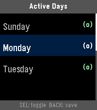</a>

<h2 class="app-name" id="app-52a046fc07234439822d30e5"><a href="https://apps.repebble.com/52a046fc07234439822d30e5">NapBuster</a></h2>
<a class="app-source" href="https://github.com/JoLeungGitHub/nap-buster" title="Source code" data-search-exclude>View source</a>

by <a href="https://apps.repebble.com/apps/dev/jo_964159c0fb993b31086d1da4" title="More from this developer">Jo</a>

No licence v3.0.6 Updated 2026-09-23

Runs on: Round 2, Time 2, Pebble 2 Duo, Pebble 2, Time Round, Time

A Pebble smartwatch app that stops you from napping during the day so you can fall asleep easier at night. When NapBuster sees sustained signs that you may be dozing during your configured no-nap…

<h2 class="app-name" id="app-2a3821196720411081d3dfc9"><a href="https://apps.repebble.com/2a3821196720411081d3dfc9">Nashki</a></h2>
<a class="app-source" href="https://github.com/ygalanter/nashki-pebble" title="Source code" data-search-exclude>View source</a>

by <a href="https://apps.repebble.com/apps/dev/comfortably-numb_52f547605101128b2200005a" title="More from this developer">Comfortably Numb</a>

Not checked yet v1.0.0 Updated 2026-05-01

Runs on: Time 2

Nashki is a sliding puzzle game tests your visual, logic, and memory skills. Shuffle the pic then try to restore it by tapping on tiles next to empty space to slide them. Game tracks the best…

<h2 class="app-name" id="app-eccd3b6ffdd2436cbe643201"><a href="https://apps.repebble.com/eccd3b6ffdd2436cbe643201">Nasu</a></h2>
<a class="app-source" href="https://github.com/marukitano/Nasu" title="Source code" data-search-exclude>View source</a>

by <a href="https://apps.repebble.com/apps/dev/marukitano_ff2831479c1011a82df1985d" title="More from this developer">marukitano</a>

Not checked yet v1.1.5 Updated 2026-10-02

Runs on: Time 2

Deutsch Nasu ist eine Medikamenten-Erinnerungs-App für die Pebble Time 2 – mit einer kleinen Krankenschwester, die dich auf ihrer Vespa begleitet und daran erinnert, deine Medikamente zu nehmen…

<a class="app-shot" href="https://apps.repebble.com/5620febdece634b47600007a" data-search-exclude>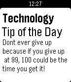</a>

<h2 class="app-name" id="app-5620febdece634b47600007a"><a href="https://apps.repebble.com/5620febdece634b47600007a">Nathan&#x27;s Tech</a></h2>
<a class="app-source" href="http://tpnnetwork.info/subnetwork/?nid=40625" title="Source code" data-search-exclude>View source</a>

by <a href="https://apps.repebble.com/apps/dev/programmer-248_55f838c18a2e8a317800007d" title="More from this developer">Programmer 248</a>

See source v1.0 Updated 2016-02-12

Runs on: Time 2, Pebble 2 Duo, Pebble 2, Time, Classic

Hey Guys welcome to my app. This is for you tech people out there who want to grow some more knowledge everyday!

<a class="app-shot" href="https://apps.repebble.com/5e0010ad98264c2cb90174d5" data-search-exclude>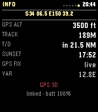</a>

<h2 class="app-name" id="app-5e0010ad98264c2cb90174d5"><a href="https://apps.repebble.com/5e0010ad98264c2cb90174d5">Nav Aid</a></h2>
<a class="app-source" href="https://github.com/Keatr0n/pebble_nav_aid" title="Source code" data-search-exclude>View source</a>

by <a href="https://apps.repebble.com/apps/dev/keatr0n_2a36dcefb2ef947e811561d5" title="More from this developer">Keatr0n</a>

No licence v1.0.3 Updated 2026-10-04

Runs on: Round 2, Time 2, Pebble 2 Duo

Nav Aid is designed to be a glanceable supplemental information system for navigation and situational awareness in the air. Mostly for GA pilots, but useful for anyone operating in the air…

<a class="app-shot" href="https://apps.repebble.com/e5e4d6c0ecbd44b980379456" data-search-exclude>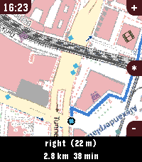</a>

<h2 class="app-name" id="app-e5e4d6c0ecbd44b980379456"><a href="https://apps.repebble.com/e5e4d6c0ecbd44b980379456">Navi App</a></h2>
<a class="app-source" href="https://github.com/JonnyKreng/pebble-navi" title="Source code" data-search-exclude>View source</a>

by <a href="https://apps.repebble.com/apps/dev/jonny_5d5ba1411aa8f6110d6f9c64" title="More from this developer">jonny</a>

Other v1.1.10 Updated 2026-07-12

Runs on: Round 2, Time 2, Pebble 2 Duo, Pebble 2, Time Round, Time

Welcome to Pebble Navi - Turn-by-turn navigation on your wrist - Support walking, driving and cycling modes - Destination selection from saved locations - Save current location - Supports Pebble…

<a class="app-shot" href="https://apps.repebble.com/6a97d5588db846359d7fb84b" data-search-exclude>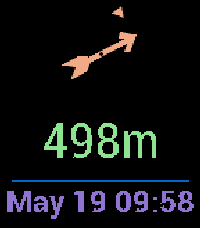</a>

<h2 class="app-name" id="app-6a97d5588db846359d7fb84b"><a href="https://apps.repebble.com/6a97d5588db846359d7fb84b">Navigation / Geocaching for Pebble</a></h2>
<a class="app-source" href="https://github.com/caco3/pebble-navigation" title="Source code" data-search-exclude>View source</a>

by <a href="https://apps.repebble.com/apps/dev/george-ruinelli_52c9626e6025fc7211000054" title="More from this developer">George Ruinelli</a>

Not checked yet v2.0.1 Updated 2026-05-19

Runs on: Round 2, Time 2, Pebble 2 Duo, Pebble 2, Time Round, Time, Classic

This app shows you distance and direction to the navigation point or geocache on your pebble! It supports Pebble compass! It is based on…

<a class="app-shot" href="https://apps.repebble.com/52cb3d92b13828a9e4000090" data-search-exclude>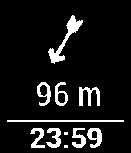</a>

<h2 class="app-name" id="app-52cb3d92b13828a9e4000090"><a href="https://apps.repebble.com/52cb3d92b13828a9e4000090">Navigation / Geocaching for Pebble</a></h2>
<a class="app-source" href="https://github.com/WebMajstr-/pebble-cgeo" title="Source code" data-search-exclude>View source</a>

by <a href="https://apps.repebble.com/apps/dev/webmajstr_52b9bb46a1d2df2862000099" title="More from this developer">WebMajstr</a>

Apache-2.0 v2.0 Updated 2015-01-06

Runs on: Time 2, Pebble 2 Duo, Pebble 2, Time, Classic

This app shows you distance and direction to the navigation point or geocache on your pebble! You must also install Android app on your phone, then you can use C:Geo / Geocaching / Locus app to…

<a class="app-shot" href="https://apps.repebble.com/52c9b69ed088ea378f00000a" data-search-exclude>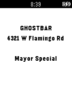</a>

<h2 class="app-name" id="app-52c9b69ed088ea378f00000a"><a href="https://apps.repebble.com/52c9b69ed088ea378f00000a">Nearby Specials</a></h2>
<a class="app-source" href="https://github.com/leejaew/pebble_nearby_specials" title="Source code" data-search-exclude>View source</a>

by <a href="https://apps.repebble.com/apps/dev/leejaew_52c93dd76025fc274e000049" title="More from this developer">leejaew</a>

Not checked yet v1.0.0 Updated 2014-01-05

Runs on: Time 2, Pebble 2 Duo, Pebble 2, Time, Classic

Get Nearby Specials from the nearest venue listed on Foursquare.

<a class="app-shot" href="https://apps.rebble.io/en_US/application/59e0f0370dfc329496000048" data-search-exclude>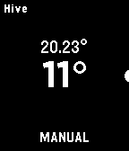</a>

<h2 class="app-name" id="app-59e0f0370dfc329496000048"><a href="https://apps.rebble.io/en_US/application/59e0f0370dfc329496000048">Nectar for Hive</a></h2>
<a class="app-source" href="https://github.com/greenturtwig/nectarforhive" title="Source code" data-search-exclude>View source</a>

by <a href="https://apps.rebble.io/en_US/developer/5571cab17dbb9ed60200003c/1" title="More from this developer">GreenTurtwig</a>

Not checked yet v1.0 Updated 2017-10-16 Rebble App Store

Runs on: Time 2, Pebble 2 Duo, Pebble 2, Time, Classic

Nectar allow you to control your Hive heating from your Pebble! Push up and down to adjust the temperature or push select to change the mode.

<a class="app-shot" href="https://apps.repebble.com/5579cfbfc8061af31f000051" data-search-exclude>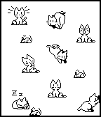</a>

<h2 class="app-name" id="app-5579cfbfc8061af31f000051"><a href="https://apps.repebble.com/5579cfbfc8061af31f000051">Neko</a></h2>
<a class="app-source" href="https://github.com/markbush/pebble-neko" title="Source code" data-search-exclude>View source</a>

by <a href="https://apps.repebble.com/apps/dev/mark-bush_52f2b53327122e3ad3000090" title="More from this developer">Mark Bush</a>

Not checked yet v1.0 Updated 2015-06-13

Runs on: Time 2, Pebble 2 Duo, Pebble 2, Time, Classic

Neko, that lovable rascal, is back, and this time, she&#x27;s on your wrist! Tilt the watch to move the mouse and Neko will chase after it. When she catches it, she gets bored and falls asleep. If the…

<a class="app-shot" href="https://apps.repebble.com/5480e782d581a15cd4000088" data-search-exclude>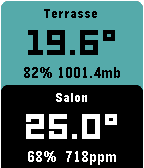</a>

<h2 class="app-name" id="app-5480e782d581a15cd4000088"><a href="https://apps.repebble.com/5480e782d581a15cd4000088">NetAtmo for Pebble</a></h2>
<a class="app-source" href="https://github.com/gregoiresage/pebble-netatmo" title="Source code" data-search-exclude>View source</a>

by <a href="https://apps.repebble.com/apps/dev/gr-goire-sage_52b216cf05c04653a9000080" title="More from this developer">Grégoire Sage</a>

Not checked yet v2.2 Updated 2026-09-06

Runs on: Time 2, Pebble 2 Duo, Pebble 2, Time, Classic

This watchapp displays data from your NetAtmo® stations. Open the configuration page, enter your credentials and select your default NetAtmo station. The outdoor module is displayed on top. Press…

<h2 class="app-name" id="app-5716e62fe0e8f34571000001"><a href="https://apps.repebble.com/5716e62fe0e8f34571000001">News</a></h2>
<a class="app-source" href="https://github.com/nmittu/Pebble-News" title="Source code" data-search-exclude>View source</a>

by <a href="https://apps.repebble.com/apps/dev/mittudev_5659e669c1b6ceb64b000081" title="More from this developer">MittuDev</a>

Not checked yet v1.0 Updated 2016-04-20

Runs on: Round 2, Time 2, Pebble 2 Duo, Pebble 2, Time Round, Time, Classic

View most popular news from the New York Times API. -API keys are needed from http://developer.nytimes.com/docs

<a class="app-shot" href="https://apps.repebble.com/5387b383f60819963900000e" data-search-exclude>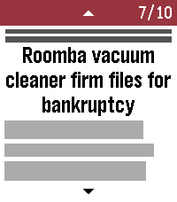</a>

<h2 class="app-name" id="app-5387b383f60819963900000e"><a href="https://apps.repebble.com/5387b383f60819963900000e">News Headlines</a></h2>
<a class="app-source" href="https://github.com/C-D-Lewis/pebble-dev" title="Source code" data-search-exclude>View source</a>

by <a href="https://apps.repebble.com/apps/dev/chris-lewis_5299cd30e627ce1147000099" title="More from this developer">Chris Lewis</a>

No licence v4.12 Updated 2026-01-28

Runs on: Round 2, Time 2, Pebble 2 Duo, Pebble 2, Time Round, Time, Classic

Read the top 10 - 20 BBC News stories on your wrist. Categories available: Headlines, World, UK, Politics, Science &amp; Environment, Technology, Health, Education, Entertainment &amp; Arts. Also includes…

<a class="app-shot" href="https://apps.repebble.com/56880d0593f78ce99e000018" data-search-exclude>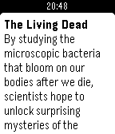</a>

<h2 class="app-name" id="app-56880d0593f78ce99e000018"><a href="https://apps.repebble.com/56880d0593f78ce99e000018">newsWire</a></h2>
<a class="app-source" href="https://github.com/ryanpcmcquen/PEBBLE--newsWire" title="Source code" data-search-exclude>View source</a>

by <a href="https://apps.repebble.com/apps/dev/ryanpcmcquen_567c70738dba1f775c0000c2" title="More from this developer">ryanpcmcquen</a>

Not checked yet v1.8 Updated 2017-02-09

Runs on: Round 2, Time 2, Pebble 2 Duo, Pebble 2, Time Round, Time, Classic

Read stories with short abstracts. Click &#x27;Select&#x27;: move to next article Long click &#x27;Select&#x27;: move to last article Flick wrist: move to new feed

<a class="app-shot" href="https://apps.repebble.com/5400ffd65b56a15a20000003" data-search-exclude>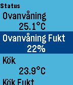</a>

<h2 class="app-name" id="app-5400ffd65b56a15a20000003"><a href="https://apps.repebble.com/5400ffd65b56a15a20000003">NexaHome P</a></h2>
<a class="app-source" href="https://github.com/fingalo/NexaHomeP" title="Source code" data-search-exclude>View source</a>

by <a href="https://apps.repebble.com/apps/dev/fingalo_538888906ef2f2762300012b" title="More from this developer">Fingalo</a>

Not checked yet v2.1 Updated 2016-11-18

Runs on: Round 2, Time 2, Pebble 2 Duo, Pebble 2, Time Round, Time, Classic

Pebble app for connecting to NexaHome (Tellstick) server. Control your ligths and wallsockets from you watch. Long press on middle button will cycle dimmers 25% at a time. See github for use of…

<a class="app-shot" href="https://apps.repebble.com/52cf5ccf4680af89b0000018" data-search-exclude>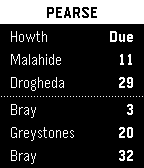</a>

<h2 class="app-name" id="app-52cf5ccf4680af89b0000018"><a href="https://apps.repebble.com/52cf5ccf4680af89b0000018">Next DART</a></h2>
<a class="app-source" href="https://bitbucket.org/rmooney/nextdart" title="Source code" data-search-exclude>View source</a>

by <a href="https://apps.repebble.com/apps/dev/rob-mooney_52b1f887b70e1c2ead000017" title="More from this developer">Rob Mooney</a>

See source v2 Updated 2015-05-03

Runs on: Time 2, Pebble 2 Duo, Pebble 2, Time, Classic

Check DART times right from your Pebble watch. Automatically displays times for your nearest DART station. Uses realtime data from Irish Rail. http://api.irishrail.ie/realtime/ DART is Dublin’s…

<a class="app-shot" href="https://apps.repebble.com/54ffb9650bde9a0d850000ac" data-search-exclude>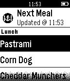</a>

<h2 class="app-name" id="app-54ffb9650bde9a0d850000ac"><a href="https://apps.repebble.com/54ffb9650bde9a0d850000ac">Next Meal</a></h2>
<a class="app-source" href="https://github.com/ansonl/next-meal-pebble" title="Source code" data-search-exclude>View source</a>

by <a href="https://apps.repebble.com/apps/dev/next-meal_54fdbbbadbd96e96ac00001b" title="More from this developer">Next Meal</a>

No licence v1.2 Updated 2015-03-22

Runs on: Time 2, Pebble 2 Duo, Pebble 2, Time, Classic

Get the menu for your next meal at King Hall on your wrist! - Updated in realtime - Featuring six week rotation of delicacies - Experimental asian cuisine Never be left wondering what the Next…

<a class="app-shot" href="https://apps.repebble.com/dabfbfda961243aebcdc8353" data-search-exclude>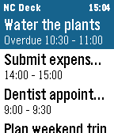</a>

<h2 class="app-name" id="app-dabfbfda961243aebcdc8353"><a href="https://apps.repebble.com/dabfbfda961243aebcdc8353">Nextcloud Deck</a></h2>
<a class="app-source" href="https://github.com/blauvster/Pebble-Nextcloud-Deck" title="Source code" data-search-exclude>View source</a>

by <a href="https://apps.repebble.com/apps/dev/blueworld_ffc48decaf6355721c5e1a3d" title="More from this developer">BlueWorld</a>

MIT v0.2.0 Updated 2026-09-28

Runs on: Round 2, Time 2, Pebble 2 Duo, Pebble 2, Time Round, Time, Classic

Pebble watchapp for Nextcloud Deck: browse cards, mark them done or archive them from your wrist, and get timeline pins with actions.

<a class="app-shot" href="https://apps.repebble.com/56ce4c6195d6f6340d000057" data-search-exclude>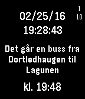</a>

<h2 class="app-name" id="app-56ce4c6195d6f6340d000057"><a href="https://apps.repebble.com/56ce4c6195d6f6340d000057">NextSkyssBuss</a></h2>
<a class="app-source" href="https://github.com/danislu/skyss" title="Source code" data-search-exclude>View source</a>

by <a href="https://apps.repebble.com/apps/dev/danislu_56c977faf3e1f7e5f0000016" title="More from this developer">danislu</a>

Not checked yet v1.2 Updated 2016-03-29

Runs on: Time 2, Pebble 2 Duo, Pebble 2, Time, Classic

when is the next buss from my house to work

<a class="app-shot" href="https://apps.repebble.com/5426c4165b15c8c5fb0000bc" data-search-exclude>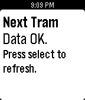</a>

<h2 class="app-name" id="app-5426c4165b15c8c5fb0000bc"><a href="https://apps.repebble.com/5426c4165b15c8c5fb0000bc">NextTram</a></h2>
<a class="app-source" href="https://github.com/coljac/NextTram" title="Source code" data-search-exclude>View source</a>

by <a href="https://apps.repebble.com/apps/dev/colin-jacobs_52fd99a23415567ced0000b9" title="More from this developer">Colin Jacobs</a>

Not checked yet v1.0 Updated 2014-09-27

Runs on: Time 2, Pebble 2 Duo, Pebble 2, Time, Classic

For residents of Melbourne and patrons of Yarra Trams. Shows time until the next tram at your favourite stops. Configurable with up to 4 stops/trams.

<a class="app-shot" href="https://apps.repebble.com/5814927a204470de17000154" data-search-exclude>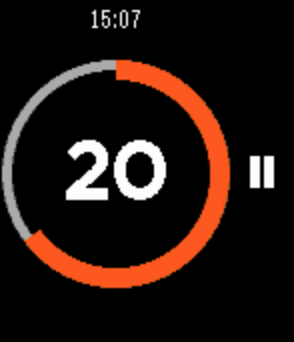</a>

<h2 class="app-name" id="app-5814927a204470de17000154"><a href="https://apps.repebble.com/5814927a204470de17000154">Nice Timer</a></h2>
<a class="app-source" href="https://github.com/AlexeySoshin/nice_timer" title="Source code" data-search-exclude>View source</a>

by <a href="https://apps.repebble.com/apps/dev/alexey-soshin_58035d19c9886643220001bc" title="More from this developer">Alexey Soshin</a>

MIT v1.3 Updated 2017-02-04

Runs on: Round 2, Time 2, Pebble 2 Duo, Pebble 2, Time Round, Time, Classic

Nice Timer is a simple to use fitness timer. No need to set duration every time. No risk of deleting your timers. Just select the desired interval, and start your training. Useful for crossfit, or…

<h2 class="app-name" id="app-54721996178bd6326800007f"><a href="https://apps.repebble.com/54721996178bd6326800007f">Nicolas Cage Quotes</a></h2>
<a class="app-source" href="https://github.com/ilepow34/CageQuotesPebble" title="Source code" data-search-exclude>View source</a>

by <a href="https://apps.repebble.com/apps/dev/isaac-lepow_52f0451661b752a5520010e6" title="More from this developer">Isaac Lepow</a>

Not checked yet v1.0 Updated 2014-11-23

Runs on: Time 2, Pebble 2 Duo, Pebble 2, Time, Classic

An app to show quotes from Nicolas Cage movies, chosen randomly from a list. Made at Northwestern University&#x27;s WildHacks. This app is open source and freely available on GitHub.

<h2 class="app-name" id="app-f46eb17ac96247139ac80a0a"><a href="https://apps.repebble.com/f46eb17ac96247139ac80a0a">Niedziela normalna czy popierdolona</a></h2>
<a class="app-source" href="https://github.com/Random90/Pebble-Niedziela-Normalna-Czy-Popierdolona" title="Source code" data-search-exclude>View source</a>

by <a href="https://apps.repebble.com/apps/dev/geckocode_a78d5cdbcd8d9b4b5416b615" title="More from this developer">GeckoCode</a>

No licence v1.0.0 Updated 2026-09-25

Runs on: Round 2, Time 2

English below. Sprawdź, czy sklepy w najbliższą niedzielę będą otwarte bezpośrednio w apce lub na timeline Pebble. Aplikacja wylicza niedziele bezpośrednio na zegarku, na podstawie zasad…

<a class="app-shot" href="https://apps.repebble.com/600c4b4584db46f18783250e" data-search-exclude>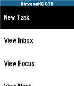</a>

<h2 class="app-name" id="app-600c4b4584db46f18783250e"><a href="https://apps.repebble.com/600c4b4584db46f18783250e">NirvanaHQ</a></h2>
<a class="app-source" href="https://github.com/jsexauer/nirvanahq_pebble_app" title="Source code" data-search-exclude>View source</a>

by <a href="https://apps.repebble.com/apps/dev/jason-sexauer_48305110983b988fde2d0e5a" title="More from this developer">Jason Sexauer</a>

Not checked yet v1.0.0 Updated 2026-05-15

Runs on: Round 2, Time 2, Pebble 2 Duo, Pebble 2, Time Round, Time, Classic

NirvanaHQ The ultimate Getting Things Done® (GTD) companion for your wrist. Manage your NirvanaHQ tasks right from your Pebble! Designed specifically for the Getting Things Done methodology, this…

<a class="app-shot" href="https://apps.repebble.com/550301bc458f26e1ef00003b" data-search-exclude>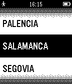</a>

<h2 class="app-name" id="app-550301bc458f26e1ef00003b"><a href="https://apps.repebble.com/550301bc458f26e1ef00003b">Nivel de Polen en Castilla y León</a></h2>
<a class="app-source" href="https://github.com/lencorredera/polencyl_pebble" title="Source code" data-search-exclude>View source</a>

by <a href="https://apps.repebble.com/apps/dev/flag-solutions_5315d276649865527a000194" title="More from this developer">FLAG Solutions</a>

Not checked yet v1.4 Updated 2016-01-13

Runs on: Time 2, Pebble 2 Duo, Pebble 2, Time, Classic

Muestra los niveles de polen actual y previstos para Castilla y León. La información procede del servicio de Datos Abiertos de la Junta de Castilla y León

<a class="app-shot" href="https://apps.repebble.com/5486c0e6e67af55f1800000e" data-search-exclude>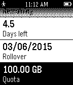</a>

<h2 class="app-name" id="app-5486c0e6e67af55f1800000e"><a href="https://apps.repebble.com/5486c0e6e67af55f1800000e">NodeUsage</a></h2>
<a class="app-source" href="https://github.com/jamesflores/NodeUsage" title="Source code" data-search-exclude>View source</a>

by <a href="https://apps.repebble.com/apps/dev/james-flores_542de1100be493acb500002d" title="More from this developer">James Flores</a>

Not checked yet v1.3 Updated 2015-05-29

Runs on: Time 2, Pebble 2 Duo, Pebble 2, Time, Classic

View your Internode usage information on your Pebble. Usage is checked hourly and cached by NodeUsage. Hold the center button to force a refresh.

<h2 class="app-name" id="app-548703c6e67af54a04000037"><a href="https://apps.repebble.com/548703c6e67af54a04000037">Noise</a></h2>
<a class="app-source" href="https://github.com/pahakorolev/pebble_noise" title="Source code" data-search-exclude>View source</a>

by <a href="https://apps.repebble.com/apps/dev/tech_546f37cf5c3354c5f400009e" title="More from this developer">Tech</a>

Not checked yet v1.3 Updated 2016-02-08

Runs on: Round 2, Time 2, Pebble 2 Duo, Pebble 2, Time Round, Time, Classic

Simple sample of pebble application which using graphical api

<a class="app-shot" href="https://apps.repebble.com/5688f71d3f3554829f00008a" data-search-exclude>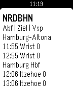</a>

<h2 class="app-name" id="app-5688f71d3f3554829f00008a"><a href="https://apps.repebble.com/5688f71d3f3554829f00008a">nordbahn</a></h2>
<a class="app-source" href="https://github.com/mhutzsch/nrdbhn" title="Source code" data-search-exclude>View source</a>

by <a href="https://apps.repebble.com/apps/dev/marco-hutzsch_567c24078dba1f775c000040" title="More from this developer">Marco Hutzsch</a>

Not checked yet v0.2 Updated 2016-01-12

Runs on: Time 2, Pebble 2 Duo, Pebble 2, Time, Classic

German: Überprüfe die Verspätungen der Nordbahn (www.nordbahn.de), Start Bahnhöfe können ausgewählt werden (Settings auf der pebble App am Handy). Klicke auf &#x27;Select&#x27; um die Angaben zu…

<a class="app-shot" href="https://apps.repebble.com/52b16d566c239f90a1000001" data-search-exclude>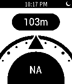</a>

<h2 class="app-name" id="app-52b16d566c239f90a1000001"><a href="https://apps.repebble.com/52b16d566c239f90a1000001">North Pole</a></h2>
<a class="app-source" href="https://github.com/iOSCowboy/NorthPole" title="Source code" data-search-exclude>View source</a>

by <a href="https://apps.repebble.com/apps/dev/hector-zarate_529cf27d679472812e00000c" title="More from this developer">Hector Zarate</a>

Not checked yet v1.0.0 Updated 2014-01-15

Runs on: Time 2, Pebble 2 Duo, Pebble 2, Time, Classic

North Pole is an altimeter and compass for your Pebble watch. Put your phone&#x27;s GPS and internal compass within a hand&#x27;s reach

<a class="app-shot" href="https://apps.repebble.com/52d1305b2fb69516c7000017" data-search-exclude>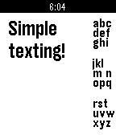</a>

<h2 class="app-name" id="app-52d1305b2fb69516c7000017"><a href="https://apps.repebble.com/52d1305b2fb69516c7000017">Notepad (Tertiary Text)</a></h2>
<a class="app-source" href="https://github.com/vgmoose/tertiary_text" title="Source code" data-search-exclude>View source</a>

by <a href="https://apps.repebble.com/apps/dev/vgmoose_52d0f6d63b9c7ba25e0000e6" title="More from this developer">VGMoose</a>

Not checked yet v2.1.0 Updated 2014-01-14

Runs on: Time 2, Pebble 2 Duo, Pebble 2, Time, Classic

Notepad allows you to take notes directly on the Pebble! Using Tertiary Text it is possible to quickly type complete and full messages directly on your Pebble. Visit the site for more information…

<a class="app-shot" href="https://apps.repebble.com/56e4b9c2b7a601cf7900003b" data-search-exclude>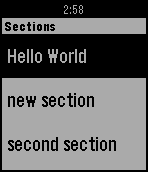</a>

<h2 class="app-name" id="app-56e4b9c2b7a601cf7900003b"><a href="https://apps.repebble.com/56e4b9c2b7a601cf7900003b">Notes 365</a></h2>
<a class="app-source" href="https://github.com/andrei-markeev/pebble-onenote" title="Source code" data-search-exclude>View source</a>

by <a href="https://apps.repebble.com/apps/dev/andrei-markeev_55955a42e26351be6b000036" title="More from this developer">Andrei Markeev</a>

Unlicense v1.7 Updated 2024-12-03

Runs on: Round 2, Time 2, Pebble 2 Duo, Pebble 2, Time Round, Time, Classic

Displays OneNote notebooks from Office365 or OneNote Online on Pebble. P.S. This app was NOT developed by Microsoft and is not affiliated with Microsoft. Office 365 is trademark and OneNote is…

<a class="app-shot" href="https://apps.repebble.com/6c3b99402ffd45569323b7aa" data-search-exclude>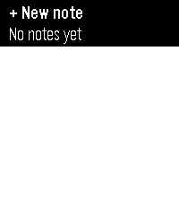</a>

<h2 class="app-name" id="app-6c3b99402ffd45569323b7aa"><a href="https://apps.repebble.com/6c3b99402ffd45569323b7aa">Notes+</a></h2>
<a class="app-source" href="https://m8y.org/pebble/" title="Source code" data-search-exclude>View source</a>

by <a href="https://apps.repebble.com/apps/dev/derek-pomery_a3018d0553fce8ef213841de" title="More from this developer">Derek Pomery</a>

Not checked yet v1.1.0 Updated 2026-10-05

Runs on: Round 2, Time 2, Pebble 2 Duo, Pebble 2, Time Round, Time

Directly inspired by the Simple Notes app. It was just missing 2 features I really wanted. ① Ability to append to notes. ② (and this was the big one) getting the notes out of the watch so I could…

<a class="app-shot" href="https://apps.repebble.com/a9d4515681c34b5088993dc6" data-search-exclude>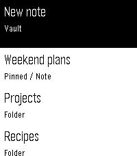</a>

<h2 class="app-name" id="app-a9d4515681c34b5088993dc6"><a href="https://apps.repebble.com/a9d4515681c34b5088993dc6">Notesy</a></h2>
<a class="app-source" href="https://github.com/GeezusChrotch/notesy" title="Source code" data-search-exclude>View source</a>

by <a href="https://apps.repebble.com/apps/dev/organik-apps_7d03e7e4a48fa1d6c0de8596" title="More from this developer">Organik Apps</a>

MIT v1.4.8 Updated 2026-09-08

Runs on: Time 2, Time

Your Obsidian vault, on your wrist. Free, MIT open source, public beta. Dictate new notes or append to existing ones. Quick Dictate captures a 15-second recording; Stitch joins sections into…

<a class="app-shot" href="https://apps.repebble.com/81ae848ad40a48f4903cd40f" data-search-exclude>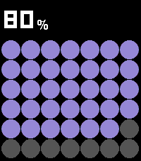</a>

<h2 class="app-name" id="app-81ae848ad40a48f4903cd40f"><a href="https://apps.repebble.com/81ae848ad40a48f4903cd40f">Nothing Battery</a></h2>
<a class="app-source" href="https://github.com/ttkhamis/Pebble_Battery" title="Source code" data-search-exclude>View source</a>

by <a href="https://apps.repebble.com/apps/dev/tom-khamis_221fb95fe8d07190aa28efe3" title="More from this developer">Tom Khamis</a>

Not checked yet v1.0.5 Updated 2026-08-06

Runs on: Time 2, Pebble 2 Duo, Pebble 2, Time, Classic

Pebble Battery is a clean, glanceable battery app inspired by the Nothing Phone widget aesthetic. The main screen fills the display with a bold dot grid, purple on dark, red on light, where each…

<a class="app-shot" href="https://apps.rebble.io/en_US/application/69c000c26d8fa50009bffa61" data-search-exclude>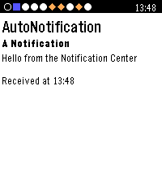</a>

<h2 class="app-name" id="app-69c000c26d8fa50009bffa61"><a href="https://apps.rebble.io/en_US/application/69c000c26d8fa50009bffa61">Notification Center</a></h2>
<a class="app-source" href="https://github.com/matejdro/PebbleNotificationCenter2" title="Source code" data-search-exclude>View source</a>

by <a href="https://apps.rebble.io/en_US/developer/52b1ea273beaa0cecb00001f/1" title="More from this developer">matejdro</a>

Not checked yet v2.10 Updated 2026-09-16 Rebble App Store

Runs on: Time 2, Pebble 2 Duo, Pebble 2, Time

A complete replacement app for Pebble notifications with more features and wider customisation. Click &quot;Website Link&quot; below for more information. (Thanks to the LCP for the help with the banner)

<h2 class="app-name" id="app-554bffaf92dfd346430000be"><a href="https://apps.repebble.com/554bffaf92dfd346430000be">Notre Dame</a></h2>
<a class="app-source" href="https://github.com/dmattia/NDPebbleWatchFace" title="Source code" data-search-exclude>View source</a>

by <a href="https://apps.repebble.com/apps/dev/david_53768e138c2698c4b300005f" title="More from this developer">David</a>

Not checked yet v1.0 Updated 2015-05-08

Runs on: Time 2, Pebble 2 Duo, Pebble 2, Time, Classic

Notre Dame Golden Dome Watchface

<a class="app-shot" href="https://apps.repebble.com/561f306b1b2dd148e4000032" data-search-exclude>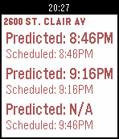</a>

<h2 class="app-name" id="app-561f306b1b2dd148e4000032"><a href="https://apps.repebble.com/561f306b1b2dd148e4000032">Nova&#x27;s Next Ride</a></h2>
<a class="app-source" href="http://github.com/elrond1369/nnr" title="Source code" data-search-exclude>View source</a>

by <a href="https://apps.repebble.com/apps/dev/j-s-web-dev_560065e70d3b04b47c00008b" title="More from this developer">J. S. Web Dev</a>

No licence v1.2 Updated 2016-01-16

Runs on: Time 2, Pebble 2 Duo, Pebble 2, Time, Classic

Check realtime/scheduled transit times for the Greater Cleveland Regional Transit Authority (GCRTA) on your watch. Save frequently uses stops as favorites for quick &amp; easy access. You can also…

<a class="app-shot" href="https://apps.repebble.com/512528cffc5f49ccabd99686" data-search-exclude>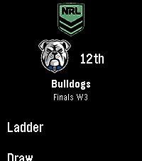</a>

<h2 class="app-name" id="app-512528cffc5f49ccabd99686"><a href="https://apps.repebble.com/512528cffc5f49ccabd99686">NRL Fan</a></h2>
<a class="app-source" href="https://github.com/erad84/NRL-fan" title="Source code" data-search-exclude>View source</a>

by <a href="https://apps.repebble.com/apps/dev/erad84_82bfdc4637e455ac2605841f" title="More from this developer">erad84</a>

Not checked yet v1.0.3 Updated 2026-09-23

Runs on: Round 2, Time 2, Pebble 2 Duo, Pebble 2, Time Round, Time, Classic

An app for Australian NRL fans to keep up with their favourite teams. It features: - Set your favourite team and code (NRL, NRLW + Origin series) - Current ladder and rankings - Upcoming matches…

<a class="app-shot" href="https://apps.repebble.com/52ed57fbe647b0c74c00000c" data-search-exclude>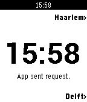</a>

<h2 class="app-name" id="app-52ed57fbe647b0c74c00000c"><a href="https://apps.repebble.com/52ed57fbe647b0c74c00000c">NS.NL Vertrektijden</a></h2>
<a class="app-source" href="https://github.com/dewagter/pebbleapps/tree/master/ns" title="Source code" data-search-exclude>View source</a>

by <a href="https://apps.repebble.com/apps/dev/c-de-wagter_52d43a45cba0684f1b00003f" title="More from this developer">C De Wagter</a>

Not checked yet v1.0 Updated 2014-05-20

Runs on: Time 2, Pebble 2 Duo, Pebble 2, Time, Classic

Dutch railroad departure times app for pebble.

<a class="app-shot" href="https://apps.repebble.com/d0a1a7162b53466f9eae87cb" data-search-exclude>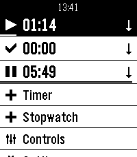</a>

<h2 class="app-name" id="app-d0a1a7162b53466f9eae87cb"><a href="https://apps.repebble.com/d0a1a7162b53466f9eae87cb">Nuovo Multi Timer</a></h2>
<a class="app-source" href="https://codeberg.org/louwers/pebble-nuovo-multi-timer" title="Source code" data-search-exclude>View source</a>

by <a href="https://apps.repebble.com/apps/dev/bart_677816f9a89c5300085e541a" title="More from this developer">Bart</a>

See source v1.0 Updated 2026-07-02

Runs on: Time 2

Multi Timer is simply the best timer and stopwatch app for Pebble. It was developed by Matthew Tole in 2014. Nuovo Multi Timer is an adaption for Pebble Time 2.

