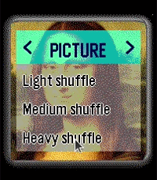
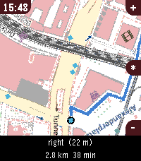

<!-- Generated by scripts/update_app_directory.py: do not edit by hand -->
# Watchapps: N

[← About this list](../watchapps.md) · [A](a.md) · [B](b.md) · [C](c.md) · [D](d.md) · [E](e.md) · [F](f.md) · [G](g.md) · [H](h.md) · [I](i.md) · [J](j.md) · [K](k.md) · [L](l.md) · [M](m.md) · **N** · [O](o.md) · [P](p.md) · [Q](q.md) · [R](r.md) · [S](s.md) · [T](t.md) · [U](u.md) · [V](v.md) · [W](w.md) · [X](x.md) · [Y](y.md) · [Z](z.md) · [0–9 & other](other.md)

*44 watchapps · Last updated 2026-10-06*

| Screenshot | Name | Developer | Licence | Updated | Description |
|------------|------|-----------|---------|---------|-------------|
| { loading=lazy width="72" } | [Nag for Pebble](https://apps.repebble.com/55e76ba4b0f5477de8000064) | [Comfortably Numb](https://github.com/ygalanter/priv-nag-for-pebble) | <small>Not checked yet</small> | 2026-06-28 | Once launched and configured, Nag for Pebble exits immediately so you can keep using your watchface and other apps — but it keeps buzzing your Pebble (every… |
| { loading=lazy width="72" } | [NapBuster](https://apps.repebble.com/52a046fc07234439822d30e5) | [Jo](https://github.com/JoLeungGitHub/nap-buster) | <small>No licence</small> | 2026-09-23 | A Pebble smartwatch app that stops you from napping during the day so you can fall asleep easier at night. When NapBuster sees sustained signs that you may… |
| { loading=lazy width="72" } | [Nashki](https://apps.repebble.com/2a3821196720411081d3dfc9) | [Comfortably Numb](https://github.com/ygalanter/nashki-pebble) | <small>Not checked yet</small> | 2026-05-01 | Nashki is a sliding puzzle game tests your visual, logic, and memory skills. Shuffle the pic then try to restore it by tapping on tiles next to empty space… |
| { loading=lazy width="72" } | [Nashki](https://apps.rebble.io/en_US/application/69f53c93c5c1b0000a42058a) <small>Rebble App Store</small> | [Comfortably Numb](https://github.com/ygalanter/nashki-pebble) | <small>Not checked yet</small> | 2026-05-01 | Nashki is a sliding puzzle game tests your visual, logic, and memory skills. Shuffle the pic then try to restore it by tapping on tiles next to empty space… |
| { loading=lazy width="72" } | [Nasu](https://apps.repebble.com/eccd3b6ffdd2436cbe643201) | [marukitano](https://github.com/marukitano/Nasu) | <small>Not checked yet</small> | 2026-10-02 | Deutsch Nasu ist eine Medikamenten-Erinnerungs-App für die Pebble Time 2 – mit einer kleinen Krankenschwester, die dich auf ihrer Vespa begleitet und daran… |
| { loading=lazy width="72" } | [Nathan's Tech](https://apps.repebble.com/5620febdece634b47600007a) | [Programmer 248](http://tpnnetwork.info/subnetwork/?nid=40625) | <small>See source</small> | 2016-02-12 | Hey Guys welcome to my app. This is for you tech people out there who want to grow some more knowledge everyday! |
| { loading=lazy width="72" } | [Nav Aid](https://apps.repebble.com/5e0010ad98264c2cb90174d5) | [Keatr0n](https://github.com/Keatr0n/pebble_nav_aid) | <small>No licence</small> | 2026-10-04 | Nav Aid is designed to be a glanceable supplemental information system for navigation and situational awareness in the air. Mostly for GA pilots, but useful… |
| { loading=lazy width="72" } | [Navi App](https://apps.repebble.com/e5e4d6c0ecbd44b980379456) | [jonny](https://github.com/JonnyKreng/pebble-navi) | <small>Other</small> | 2026-07-12 | Welcome to Pebble Navi - Turn-by-turn navigation on your wrist - Support walking, driving and cycling modes - Destination selection from saved locations … |
| { loading=lazy width="72" } | [Navi App](https://apps.rebble.io/en_US/application/6a2ec9ab000bc200090963fc) <small>Rebble App Store</small> | [Jonny](https://github.com/JonnyKreng/pebble-navi) | <small>Other</small> | 2026-07-12 | Welcome to Pebble Navi - Turn-by-turn navigation and a map on your wrist - No companion app needed - Support walking, driving and cycling modes … |
| { loading=lazy width="72" } | [Navigation / Geocaching for Pebble](https://apps.repebble.com/6a97d5588db846359d7fb84b) | [George Ruinelli](https://github.com/caco3/pebble-navigation) | <small>Not checked yet</small> | 2026-05-19 | This app shows you distance and direction to the navigation point or geocache on your pebble! It supports Pebble compass! It is based on… |
| { loading=lazy width="72" } | [Navigation / Geocaching for Pebble](https://apps.repebble.com/52cb3d92b13828a9e4000090) | [WebMajstr](https://github.com/WebMajstr-/pebble-cgeo) | <small>Not checked yet</small> | 2015-01-06 | This app shows you distance and direction to the navigation point or geocache on your pebble! You must also install Android app on your phone, then you can… |
| { loading=lazy width="72" } | [Nearby Specials](https://apps.repebble.com/52c9b69ed088ea378f00000a) | [leejaew](https://github.com/leejaew/pebble_nearby_specials) | <small>Not checked yet</small> | 2014-01-05 | Get Nearby Specials from the nearest venue listed on Foursquare. |
| { loading=lazy width="72" } | [Nectar for Hive](https://apps.rebble.io/en_US/application/59e0f0370dfc329496000048) <small>Rebble App Store</small> | [GreenTurtwig](https://github.com/greenturtwig/nectarforhive) | <small>Not checked yet</small> | 2017-10-16 | Nectar allow you to control your Hive heating from your Pebble! Push up and down to adjust the temperature or push select to change the mode. |
| { loading=lazy width="72" } | [Neko](https://apps.repebble.com/5579cfbfc8061af31f000051) | [Mark Bush](https://github.com/markbush/pebble-neko) | <small>Not checked yet</small> | 2015-06-13 | Neko, that lovable rascal, is back, and this time, she's on your wrist! Tilt the watch to move the mouse and Neko will chase after it. When she catches it… |
| { loading=lazy width="72" } | [NetAtmo for Pebble](https://apps.repebble.com/5480e782d581a15cd4000088) | [Grégoire Sage](https://github.com/gregoiresage/pebble-netatmo) | <small>Not checked yet</small> | 2026-09-06 | This watchapp displays data from your NetAtmo® stations. Open the configuration page, enter your credentials and select your default NetAtmo station. The… |
| { loading=lazy width="72" } | [News](https://apps.repebble.com/5716e62fe0e8f34571000001) | [MittuDev](https://github.com/nmittu/Pebble-News) | <small>Not checked yet</small> | 2016-04-20 | View most popular news from the New York Times API. -API keys are needed from http://developer.nytimes.com/docs |
| { loading=lazy width="72" } | [News Headlines](https://apps.repebble.com/5387b383f60819963900000e) | [Chris Lewis](https://github.com/C-D-Lewis/pebble-dev) | <small>No licence</small> | 2026-01-28 | Read the top 10 - 20 BBC News stories on your wrist. Categories available: Headlines, World, UK, Politics, Science & Environment, Technology, Health… |
| { loading=lazy width="72" } | [newsWire](https://apps.repebble.com/56880d0593f78ce99e000018) | [ryanpcmcquen](https://github.com/ryanpcmcquen/PEBBLE--newsWire) | <small>Not checked yet</small> | 2017-02-09 | Read stories with short abstracts. Click 'Select': move to next article Long click 'Select': move to last article Flick wrist: move to new feed |
| { loading=lazy width="72" } | [NexaHome P](https://apps.repebble.com/5400ffd65b56a15a20000003) | [Fingalo](https://github.com/fingalo/NexaHomeP) | <small>Not checked yet</small> | 2016-11-18 | Pebble app for connecting to NexaHome (Tellstick) server. Control your ligths and wallsockets from you watch. Long press on middle button will cycle dimmers… |
| { loading=lazy width="72" } | [Next DART](https://apps.repebble.com/52cf5ccf4680af89b0000018) | [Rob Mooney](https://bitbucket.org/rmooney/nextdart) | <small>See source</small> | 2015-05-03 | Check DART times right from your Pebble watch. Automatically displays times for your nearest DART station. Uses realtime data from Irish Rail… |
| { loading=lazy width="72" } | [Next Meal](https://apps.repebble.com/54ffb9650bde9a0d850000ac) | [Next Meal](https://github.com/ansonl/next-meal-pebble) | <small>Not checked yet</small> | 2015-03-22 | Get the menu for your next meal at King Hall on your wrist! - Updated in realtime - Featuring six week rotation of delicacies - Experimental asian cuisine… |
| { loading=lazy width="72" } | [Nextcloud Deck](https://apps.repebble.com/dabfbfda961243aebcdc8353) | [BlueWorld](https://github.com/blauvster/Pebble-Nextcloud-Deck) | <small>Not checked yet</small> | 2026-09-28 | Pebble watchapp for Nextcloud Deck: browse cards, mark them done or archive them from your wrist, and get timeline pins with actions. |
| { loading=lazy width="72" } | [NextSkyssBuss](https://apps.repebble.com/56ce4c6195d6f6340d000057) | [danislu](https://github.com/danislu/skyss) | <small>Not checked yet</small> | 2016-03-29 | when is the next buss from my house to work |
| { loading=lazy width="72" } | [NextTram](https://apps.repebble.com/5426c4165b15c8c5fb0000bc) | [Colin Jacobs](https://github.com/coljac/NextTram) | <small>Not checked yet</small> | 2014-09-27 | For residents of Melbourne and patrons of Yarra Trams. Shows time until the next tram at your favourite stops. Configurable with up to 4 stops/trams. |
| { loading=lazy width="72" } | [Nice Timer](https://apps.repebble.com/5814927a204470de17000154) | [Alexey Soshin](https://github.com/AlexeySoshin/nice_timer) | MIT | 2017-02-04 | Nice Timer is a simple to use fitness timer. No need to set duration every time. No risk of deleting your timers. Just select the desired interval, and… |
| { loading=lazy width="72" } | [Nicolas Cage Quotes](https://apps.repebble.com/54721996178bd6326800007f) | [Isaac Lepow](https://github.com/ilepow34/CageQuotesPebble) | <small>Not checked yet</small> | 2014-11-23 | An app to show quotes from Nicolas Cage movies, chosen randomly from a list. Made at Northwestern University's WildHacks. This app is open source and freely… |
| { loading=lazy width="72" } | [Niedziela normalna czy popierdolona](https://apps.repebble.com/f46eb17ac96247139ac80a0a) | [GeckoCode](https://github.com/Random90/Pebble-Niedziela-Normalna-Czy-Popierdolona) | <small>Not checked yet</small> | 2026-09-25 | English below. Sprawdź, czy sklepy w najbliższą niedzielę będą otwarte bezpośrednio w apce lub na timeline Pebble. Aplikacja wylicza niedziele bezpośrednio… |
| { loading=lazy width="72" } | [NirvanaHQ](https://apps.repebble.com/600c4b4584db46f18783250e) | [Jason Sexauer](https://github.com/jsexauer/nirvanahq_pebble_app) | <small>Not checked yet</small> | 2026-05-15 | NirvanaHQ The ultimate Getting Things Done® (GTD) companion for your wrist. Manage your NirvanaHQ tasks right from your Pebble! Designed specifically for… |
| { loading=lazy width="72" } | [Nivel de Polen en Castilla y León](https://apps.repebble.com/550301bc458f26e1ef00003b) | [FLAG Solutions](https://github.com/lencorredera/polencyl_pebble) | <small>Not checked yet</small> | 2016-01-13 | Muestra los niveles de polen actual y previstos para Castilla y León. La información procede del servicio de Datos Abiertos de la Junta de Castilla y León |
| { loading=lazy width="72" } | [NodeUsage](https://apps.repebble.com/5486c0e6e67af55f1800000e) | [James Flores](https://github.com/jamesflores/NodeUsage) | <small>Not checked yet</small> | 2015-05-29 | View your Internode usage information on your Pebble. Usage is checked hourly and cached by NodeUsage. Hold the center button to force a refresh. |
| { loading=lazy width="72" } | [Noise](https://apps.repebble.com/548703c6e67af54a04000037) | [Tech](https://github.com/pahakorolev/pebble_noise) | <small>Not checked yet</small> | 2016-02-08 | Simple sample of pebble application which using graphical api |
| { loading=lazy width="72" } | [nordbahn](https://apps.repebble.com/5688f71d3f3554829f00008a) | [Marco Hutzsch](https://github.com/mhutzsch/nrdbhn) | <small>Not checked yet</small> | 2016-01-12 | German: Überprüfe die Verspätungen der Nordbahn (www.nordbahn.de), Start Bahnhöfe können ausgewählt werden (Settings auf der pebble App am Handy). Klicke… |
| { loading=lazy width="72" } | [North Pole](https://apps.repebble.com/52b16d566c239f90a1000001) | [Hector Zarate](https://github.com/iOSCowboy/NorthPole) | <small>Not checked yet</small> | 2014-01-15 | North Pole is an altimeter and compass for your Pebble watch. Put your phone's GPS and internal compass within a hand's reach |
| { loading=lazy width="72" } | [Notepad (Tertiary Text)](https://apps.repebble.com/52d1305b2fb69516c7000017) | [VGMoose](https://github.com/vgmoose/tertiary_text) | <small>Not checked yet</small> | 2014-01-14 | Notepad allows you to take notes directly on the Pebble! Using Tertiary Text it is possible to quickly type complete and full messages directly on your… |
| { loading=lazy width="72" } | [Notes 365](https://apps.repebble.com/56e4b9c2b7a601cf7900003b) | [Andrei Markeev](https://github.com/andrei-markeev/pebble-onenote) | <small>Not checked yet</small> | 2024-12-03 | Displays OneNote notebooks from Office365 or OneNote Online on Pebble. P.S. This app was NOT developed by Microsoft and is not affiliated with Microsoft… |
| { loading=lazy width="72" } | [Notes+](https://apps.repebble.com/6c3b99402ffd45569323b7aa) | [Derek Pomery](https://m8y.org/pebble/) | <small>Not checked yet</small> | 2026-10-05 | Directly inspired by the Simple Notes app. It was just missing 2 features I really wanted. ① Ability to append to notes. ② (and this was the big one)… |
| { loading=lazy width="72" } | [Notesy](https://apps.repebble.com/a9d4515681c34b5088993dc6) | [Organik Apps](https://github.com/GeezusChrotch/notesy) | MIT | 2026-09-08 | Your Obsidian vault, on your wrist. Free, MIT open source, public beta. Dictate new notes or append to existing ones. Quick Dictate captures a 15-second… |
| { loading=lazy width="72" } | [Nothing Battery](https://apps.repebble.com/81ae848ad40a48f4903cd40f) | [Tom Khamis](https://github.com/ttkhamis/Pebble_Battery) | <small>Not checked yet</small> | 2026-08-06 | Pebble Battery is a clean, glanceable battery app inspired by the Nothing Phone widget aesthetic. The main screen fills the display with a bold dot grid… |
| { loading=lazy width="72" } | [Notification Center](https://apps.rebble.io/en_US/application/69c000c26d8fa50009bffa61) <small>Rebble App Store</small> | [matejdro](https://github.com/matejdro/PebbleNotificationCenter2) | <small>Not checked yet</small> | 2026-09-16 | A complete replacement app for Pebble notifications with more features and wider customisation. Click "Website Link" below for more information. (Thanks to… |
| { loading=lazy width="72" } | [Notre Dame](https://apps.repebble.com/554bffaf92dfd346430000be) | [David](https://github.com/dmattia/NDPebbleWatchFace) | <small>Not checked yet</small> | 2015-05-08 | Notre Dame Golden Dome Watchface |
| { loading=lazy width="72" } | [Nova's Next Ride](https://apps.repebble.com/561f306b1b2dd148e4000032) | [J. S. Web Dev](http://github.com/elrond1369/nnr) | <small>No licence</small> | 2016-01-16 | Check realtime/scheduled transit times for the Greater Cleveland Regional Transit Authority (GCRTA) on your watch. Save frequently uses stops as favorites… |
| { loading=lazy width="72" } | [NRL Fan](https://apps.repebble.com/512528cffc5f49ccabd99686) | [erad84](https://github.com/erad84/NRL-fan) | <small>Not checked yet</small> | 2026-09-23 | An app for Australian NRL fans to keep up with their favourite teams. It features: - Set your favourite team and code (NRL, NRLW + Origin series) - Current… |
| { loading=lazy width="72" } | [NS.NL Vertrektijden](https://apps.repebble.com/52ed57fbe647b0c74c00000c) | [C De Wagter](https://github.com/dewagter/pebbleapps/tree/master/ns) | <small>Not checked yet</small> | 2014-05-20 | Dutch railroad departure times app for pebble. |
| { loading=lazy width="72" } | [Nuovo Multi Timer](https://apps.repebble.com/d0a1a7162b53466f9eae87cb) | [Bart](https://codeberg.org/louwers/pebble-nuovo-multi-timer) | <small>See source</small> | 2026-07-02 | Multi Timer is simply the best timer and stopwatch app for Pebble. It was developed by Matthew Tole in 2014. Nuovo Multi Timer is an adaption for Pebble Time 2. |
