---
hide:
  - toc
---

<!-- Generated by scripts/update_app_directory.py: do not edit by hand -->
# Pebble Apps: O

[← All Pebble Apps](../watchapps.md) · [A](a.md) · [B](b.md) · [C](c.md) · [D](d.md) · [E](e.md) · [F](f.md) · [G](g.md) · [H](h.md) · [I](i.md) · [J](j.md) · [K](k.md) · [L](l.md) · [M](m.md) · [N](n.md) · **O** · [P](p.md) · [Q](q.md) · [R](r.md) · [S](s.md) · [T](t.md) · [U](u.md) · [V](v.md) · [W](w.md) · [X](x.md) · [Y](y.md) · [Z](z.md) · [0–9 & other](other.md)

*37 apps · Last updated 2026-10-06 · [About these lists](../about-app-lists.md)*

<a class="app-shot" href="https://apps.rebble.io/en_US/application/6a2eb7a169dd300009bf84e4" data-search-exclude>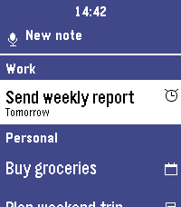</a>

<h2 class="app-name" id="app-6a2eb7a169dd300009bf84e4"><a href="https://apps.rebble.io/en_US/application/6a2eb7a169dd300009bf84e4">ObsidianTasks</a></h2>
<a class="app-source" href="https://github.com/bquelhas/ObsidianTasksPebbleBridge" title="Source code" data-search-exclude>View source</a>

by <a href="https://apps.rebble.io/en_US/developer/52f2728a881134fe540016b4/1" title="More from this developer">bquelhas</a>

MIT v2.2 Updated 2026-06-20 Rebble App Store

Runs on: Round 2, Time 2, Pebble 2 Duo, Pebble 2, Time Round, Time, Classic

ObsidianTasks shows your Obsidian to-dos on your Pebble, grouped by tag. From the watch you can: • Mark tasks as done — the change is written straight back to your Markdown vault • Snooze tasks…

<h2 class="app-name" id="app-58d9119c0dfc320a5300069d"><a href="https://apps.rebble.io/en_US/application/58d9119c0dfc320a5300069d">OC Transpo Tracker</a></h2>
<a class="app-source" href="https://github.com/mattohara/OCTranspoTracker" title="Source code" data-search-exclude>View source</a>

by <a href="https://apps.rebble.io/en_US/developer/56c768a156b5d62ca800003b/1" title="More from this developer">Matt O&#x27;Hara</a>

Not checked yet v1.2 Updated 2017-05-15 Rebble App Store

Runs on: Time 2, Pebble 2 Duo, Pebble 2, Time, Classic

Helps track OC Transpo buses in Ottawa, ON.

<a class="app-shot" href="https://apps.repebble.com/542c75c514cfa386de00000a" data-search-exclude>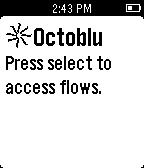</a>

<h2 class="app-name" id="app-542c75c514cfa386de00000a"><a href="https://apps.repebble.com/542c75c514cfa386de00000a">Octoblu Triggers</a></h2>
<a class="app-source" href="https://github.com/octoblu/octoblu-pebble" title="Source code" data-search-exclude>View source</a>

by <a href="https://apps.repebble.com/apps/dev/octoblu_542c74017a4316d5be0001c8" title="More from this developer">Octoblu</a>

Not checked yet v1.1 Updated 2014-10-01

Runs on: Time 2, Pebble 2 Duo, Pebble 2, Time, Classic

This is the official Octoblu pebble app to control the Internet of Everything from your watch.

<a class="app-shot" href="https://apps.repebble.com/553d8acde95db472f8000021" data-search-exclude>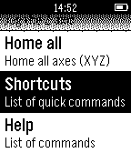</a>

<h2 class="app-name" id="app-553d8acde95db472f8000021"><a href="https://apps.repebble.com/553d8acde95db472f8000021">OctoControl - Control your 3D printer with your watch</a></h2>
<a class="app-source" href="https://github.com/quillford/OctoControl-Pebble" title="Source code" data-search-exclude>View source</a>

by <a href="https://apps.repebble.com/apps/dev/quillford_54977fc0754bc13c3f00005e" title="More from this developer">quillford</a>

Not checked yet v1.0 Updated 2015-04-27

Runs on: Time 2, Pebble 2 Duo, Pebble 2, Time, Classic

OctoControl allows you to use your watch to control your 3D printer. You can do things such as jogging, homing, controlling fans, and turning the motors off. Note: This requires that you have…

<a class="app-shot" href="https://apps.repebble.com/52f704e6a374bac2ac0000ab" data-search-exclude>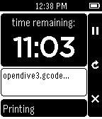</a>

<h2 class="app-name" id="app-52f704e6a374bac2ac0000ab"><a href="https://apps.repebble.com/52f704e6a374bac2ac0000ab">Octowatch</a></h2>
<a class="app-source" href="https://github.com/jjg/octowatch" title="Source code" data-search-exclude>View source</a>

by <a href="https://apps.repebble.com/apps/dev/gullickson-laboratories_52ef1bc428230698d9000006" title="More from this developer">Gullickson Laboratories</a>

Not checked yet v2.0 Updated 2014-12-18

Runs on: Time 2, Pebble 2 Duo, Pebble 2, Time, Classic

Monitor and control any Octoprint-enabled 3D printer using your Pebble smartwatch.

<a class="app-shot" href="https://apps.repebble.com/542e92931e7cac9d95000172" data-search-exclude>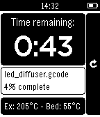</a>

<h2 class="app-name" id="app-542e92931e7cac9d95000172"><a href="https://apps.repebble.com/542e92931e7cac9d95000172">Octowatch-devel</a></h2>
<a class="app-source" href="https://github.com/kieranc/octowatch/" title="Source code" data-search-exclude>View source</a>

by <a href="https://apps.repebble.com/apps/dev/kieranc_533340361c55345058000124" title="More from this developer">KieranC</a>

Not checked yet v1.0 Updated 2014-10-03

Runs on: Time 2, Pebble 2 Duo, Pebble 2, Time, Classic

A status monitor for OctoPrint. Displays time remaining, current file, % complete, temperatures Forked from the original to support the new -devel branch of OctoPrint

<a class="app-shot" href="https://apps.rebble.io/en_US/application/58392d9900355abe6600058b" data-search-exclude>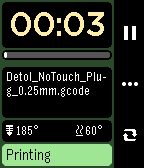</a>

<h2 class="app-name" id="app-58392d9900355abe6600058b"><a href="https://apps.rebble.io/en_US/application/58392d9900355abe6600058b">Octowatch2</a></h2>
<a class="app-source" href="https://github.com/schlotzz/octowatch2/" title="Source code" data-search-exclude>View source</a>

by <a href="https://apps.rebble.io/en_US/developer/56d2f6f9eb3b9775c6000011/1" title="More from this developer">schlotzz</a>

Not checked yet v1.2 Updated 2016-12-09 Rebble App Store

Runs on: Time 2, Pebble 2 Duo, Pebble 2, Time, Classic

Use your Pebble watch to monitor and control 3D printers that use the excellent Octoprint host software. Octowatch2 is heavily inspired by Octowatch, but completely rewritten from scratch to…

<a class="app-shot" href="https://apps.repebble.com/56c9fedbadda1e01cd00004a" data-search-exclude>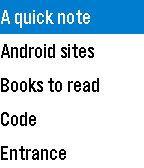</a>

<h2 class="app-name" id="app-56c9fedbadda1e01cd00004a"><a href="https://apps.repebble.com/56c9fedbadda1e01cd00004a">OI Notepad</a></h2>
<a class="app-source" href="https://github.com/nfriess/oipebble" title="Source code" data-search-exclude>View source</a>

by <a href="https://apps.repebble.com/apps/dev/nathan-friess_5680139f54f8d31ce700004a" title="More from this developer">Nathan Friess</a>

Not checked yet v1.1 Updated 2016-04-12

Runs on: Round 2, Time 2, Pebble 2 Duo, Pebble 2, Time Round, Time, Classic

An interface to the OpenIntents Notepad on Android phones. View your OI notes on your watch.

<a class="app-shot" href="https://apps.repebble.com/56c4baaca02787abc8000015" data-search-exclude>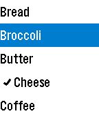</a>

<h2 class="app-name" id="app-56c4baaca02787abc8000015"><a href="https://apps.repebble.com/56c4baaca02787abc8000015">OI Shopping List</a></h2>
<a class="app-source" href="https://github.com/nfriess/oipebble" title="Source code" data-search-exclude>View source</a>

by <a href="https://apps.repebble.com/apps/dev/nathan-friess_5680139f54f8d31ce700004a" title="More from this developer">Nathan Friess</a>

Not checked yet v1.2 Updated 2016-04-12

Runs on: Round 2, Time 2, Pebble 2 Duo, Pebble 2, Time Round, Time, Classic

An interface to the OpenIntents Shopping List on Android phones. View your shopping lists on your watch, check/uncheck items while you are shopping, and add items from your watch (experimental).

<a class="app-shot" href="https://apps.repebble.com/56350847ffc9017113000095" data-search-exclude>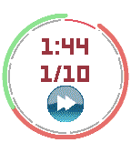</a>

<h2 class="app-name" id="app-56350847ffc9017113000095"><a href="https://apps.repebble.com/56350847ffc9017113000095">oInterval</a></h2>
<a class="app-source" href="https://github.com/Oupsman/oInterval" title="Source code" data-search-exclude>View source</a>

by <a href="https://apps.repebble.com/apps/dev/benoit-serra_5497e525a8c1252f2b0000c5" title="More from this developer">Benoit SERRA</a>

No licence v1.3 Updated 2015-11-15

Runs on: Round 2, Time 2, Time Round, Time

I started running a few weeks ago and I could not find an app helping me with the training rythm. So, I&#x27;ve made this one. It&#x27;s not the fanciest ever, but it do what it is aimed to do. The main…

<h2 class="app-name" id="app-531d77d84decc11c0d000081"><a href="https://apps.repebble.com/531d77d84decc11c0d000081">Olde English Insult Generator</a></h2>
<a class="app-source" href="https://github.com/cassidoo/PebbleInsultGenerator" title="Source code" data-search-exclude>View source</a>

by <a href="https://apps.repebble.com/apps/dev/cassidoo_530153ea87b742d27c000250" title="More from this developer">cassidoo</a>

Not checked yet v1.0 Updated 2014-03-10

Runs on: Time 2, Pebble 2 Duo, Pebble 2, Time, Classic

On the go and you run into an enemy! Have no fear! Get a classy insult with a click of a button on your Pebble. Get a new insult with every click for eternal verbal jousting.

<h2 class="app-name" id="app-47c033c2212447868f69335f"><a href="https://apps.repebble.com/47c033c2212447868f69335f">Omnitrix</a></h2>
<a class="app-source" href="https://github.com/predatorx7/pebble-omnitrix" title="Source code" data-search-exclude>View source</a>

by <a href="https://apps.repebble.com/apps/dev/mushaheed-syed_5e6815a2a8cc432415179121" title="More from this developer">Mushaheed Syed</a>

Not checked yet v0.1.2 Updated 2026-07-12

Runs on: Round 2, Time 2, Pebble 2 Duo, Pebble 2, Time Round, Time, Classic

Just a simple copy of Ben 10&#x27;s omnitrix with functions you can play with

<a class="app-shot" href="https://apps.repebble.com/92d7342455c741eeb3e4565d" data-search-exclude>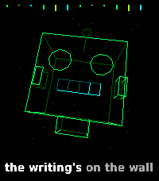</a>

<h2 class="app-name" id="app-92d7342455c741eeb3e4565d"><a href="https://apps.repebble.com/92d7342455c741eeb3e4565d">One and Only</a></h2>
<a class="app-source" href="https://github.com/CATEIN/one-and-only-time-2" title="Source code" data-search-exclude>View source</a>

by <a href="https://apps.repebble.com/apps/dev/catein_5451ddc920d58674e460e802" title="More from this developer">CATEIN</a>

Other v1.0.0 Updated 2026-10-01

Runs on: Time 2

SAM, the 1982 speech synthesizer, sings &quot;One and Only&quot; by rai1367, with a 3D wireframe music video. It&#x27;s all made on the watch as it plays: SAM&#x27;s voice (lead and harmony), the bass and the keys…

<a class="app-shot" href="https://apps.repebble.com/1591f53bc7f94a8a81cf7920" data-search-exclude>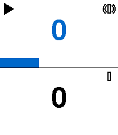</a>

<h2 class="app-name" id="app-1591f53bc7f94a8a81cf7920"><a href="https://apps.repebble.com/1591f53bc7f94a8a81cf7920">One More Minute</a></h2>
<a class="app-source" href="https://github.com/HarlanH/one-more-minute" title="Source code" data-search-exclude>View source</a>

by <a href="https://apps.repebble.com/apps/dev/harlan-harris_6e7531b9711890693c7dc2e7" title="More from this developer">Harlan Harris</a>

MIT v1.1.0 Updated 2026-06-30

Runs on: Round 2, Time 2, Pebble 2 Duo, Pebble 2, Time Round, Time

A count-up timer app for the Pebble smartwatch. Run two independent stopwatches displayed in stacked zones, each with a seconds progress bar and play/pause indicator. Assign vibration feedback to…

<h2 class="app-name" id="app-6a6547fd412ee900097a6070"><a href="https://apps.rebble.io/en_US/application/6a6547fd412ee900097a6070">One-Off Alarm</a></h2>
<a class="app-source" href="https://github.com/MrMastodon/Pebble-Watch-apps/tree/main/apps/one-off-alarm" title="Source code" data-search-exclude>View source</a>

by <a href="https://apps.rebble.io/en_US/developer/6a6258396d78640008528d92/1" title="More from this developer">MrMastodon</a>

No licence v1.4.0 Updated 2026-08-27 Rebble App Store

Runs on: Time 2

One-Off Alarm lets you schedule alarms for any point (up to 180 days)in the future - &quot;in 3 weeks at 09:00&quot;, &quot;tomorrow at 06:30&quot; - instead of the recurring daily alarms of the usual alarm apps. Use…

<a class="app-shot" href="https://apps.rebble.io/en_US/application/58321a598c7fff9ce1000137" data-search-exclude>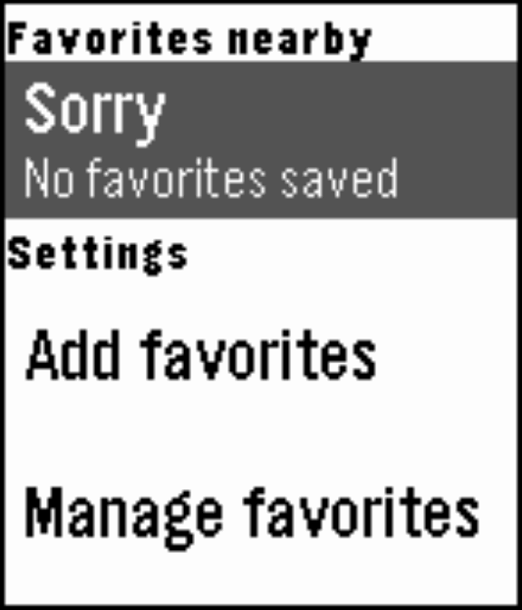</a>

<h2 class="app-name" id="app-58321a598c7fff9ce1000137"><a href="https://apps.rebble.io/en_US/application/58321a598c7fff9ce1000137">OneBusAway</a></h2>
<a class="app-source" href="https://github.com/OneBusAway/onebusaway-pebbletime" title="Source code" data-search-exclude>View source</a>

by <a href="https://apps.rebble.io/en_US/developer/5832132c8c7fff4a69000107/1" title="More from this developer">OneBusAway</a>

Other v1.3 Updated 2016-12-31 Rebble App Store

Runs on: Round 2, Time 2, Pebble 2 Duo, Pebble 2, Time Round, Time

Never miss the bus again! OneBusAway serves up fresh, real-time transit information in the following regions: * Atlanta, Georgia * New York (MTA) * Rogue Valley, Oregon * San Diego, California *…

<a class="app-shot" href="https://apps.repebble.com/54531ad3133890ddd1000053" data-search-exclude>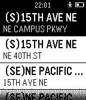</a>

<h2 class="app-name" id="app-54531ad3133890ddd1000053"><a href="https://apps.repebble.com/54531ad3133890ddd1000053">OneBusAway for Pebble</a></h2>
<a class="app-source" href="https://github.com/karan/PebBus" title="Source code" data-search-exclude>View source</a>

by <a href="https://apps.repebble.com/apps/dev/karan-goel_541475c68bc9dcd65b0001a4" title="More from this developer">Karan Goel</a>

Not checked yet v0.1 Updated 2014-10-31

Runs on: Time 2, Pebble 2 Duo, Pebble 2, Time, Classic

OneBusAway on your Pebble!

<a class="app-shot" href="https://apps.repebble.com/5694e8c7705d5fe1a9000040" data-search-exclude>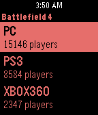</a>

<h2 class="app-name" id="app-5694e8c7705d5fe1a9000040"><a href="https://apps.repebble.com/5694e8c7705d5fe1a9000040">Online Player Stats</a></h2>
<a class="app-source" href="https://github.com/jackchuka/OnlinePlayerStats" title="Source code" data-search-exclude>View source</a>

by <a href="https://apps.repebble.com/apps/dev/masanori-uehara_53ac9736c2fd15860700006e" title="More from this developer">Masanori Uehara</a>

Not checked yet v1.1 Updated 2016-01-31

Runs on: Time 2, Pebble 2 Duo, Pebble 2, Time, Classic

See how many people are playing the game on your wrist! List of the games available now: - Battlefront - Battlefield 4 - Battlefield 3 - Battlefield Hardline Stats powered by p-stats.com

<a class="app-shot" href="https://apps.repebble.com/57536f158576a4e23f000010" data-search-exclude>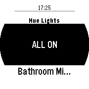</a>

<h2 class="app-name" id="app-57536f158576a4e23f000010"><a href="https://apps.repebble.com/57536f158576a4e23f000010">OnOffHue</a></h2>
<a class="app-source" href="https://github.com/deviavir/pebblehue" title="Source code" data-search-exclude>View source</a>

by <a href="https://apps.repebble.com/apps/dev/chase_5321b5897b6663c6ca0001d4" title="More from this developer">Chase</a>

Not checked yet v1.0 Updated 2016-12-22

Runs on: Round 2, Time 2, Pebble 2 Duo, Pebble 2, Time Round, Time, Classic

Control your hue lights from your wrist.

<a class="app-shot" href="https://apps.repebble.com/53f502ee31aeb7a47e00005b" data-search-exclude>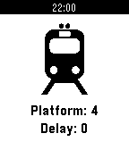</a>

<h2 class="app-name" id="app-53f502ee31aeb7a47e00005b"><a href="https://apps.repebble.com/53f502ee31aeb7a47e00005b">OnTime</a></h2>
<a class="app-source" href="https://github.com/D-32/OnTimePebble" title="Source code" data-search-exclude>View source</a>

by <a href="https://apps.repebble.com/apps/dev/dylan-marriott_53c1148506ea4a56ed00012f" title="More from this developer">Dylan Marriott</a>

No licence v1.2 Updated 2015-06-30

Runs on: Time 2, Pebble 2 Duo, Pebble 2, Time, Classic

SBB Timetable for your Pebble. Easy way to see the next train, bus or tram connections in Switzerland.

<a class="app-shot" href="https://apps.repebble.com/53328f8e07233daf4b00020e" data-search-exclude>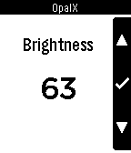</a>

<h2 class="app-name" id="app-53328f8e07233daf4b00020e"><a href="https://apps.repebble.com/53328f8e07233daf4b00020e">OpalX</a></h2>
<a class="app-source" href="https://github.com/Neal/OpalX" title="Source code" data-search-exclude>View source</a>

by <a href="https://apps.repebble.com/apps/dev/neal-patel_528feeab8a8c0b97c8000005" title="More from this developer">Neal Patel</a>

MIT v1.0.3 Updated 2025-12-01

Runs on: Time 2, Pebble 2 Duo, Pebble 2, Time, Classic

A LIFX remote app. Control all LIFX lights on your network! Toggle them or change the colors from your wrist. No companion app needed. It uses the LIFX HTTP API (find instructions on how to…

<a class="app-shot" href="https://apps.repebble.com/5712b0e918b16185ee000020" data-search-exclude>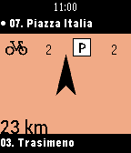</a>

<h2 class="app-name" id="app-5712b0e918b16185ee000020"><a href="https://apps.repebble.com/5712b0e918b16185ee000020">Open Bike Sharing</a></h2>
<a class="app-source" href="https://github.com/thomacer/pebble-villo" title="Source code" data-search-exclude>View source</a>

by <a href="https://apps.repebble.com/apps/dev/thomas-perale_5672e766542be03aeb000038" title="More from this developer">Thomas Perale</a>

Not checked yet v2.4 Updated 2016-08-13

Runs on: Round 2, Time 2, Pebble 2 Duo, Pebble 2, Time Round, Time, Classic

Use your local bike sharing system with Open Bike Sharing to find the closest station according to your position. Open Bike Sharing use an easy to use design to look after stations in a glance…

<a class="app-shot" href="https://apps.rebble.io/en_US/application/6a0d1efc79fb740009cb37ba" data-search-exclude>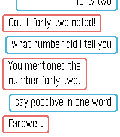</a>

<h2 class="app-name" id="app-6a0d1efc79fb740009cb37ba"><a href="https://apps.rebble.io/en_US/application/6a0d1efc79fb740009cb37ba">Open Pebble AI</a></h2>
<a class="app-source" href="https://github.com/DataScienceDIY/open-pebble-ai" title="Source code" data-search-exclude>View source</a>

by <a href="https://apps.rebble.io/en_US/developer/6a0cbf614787e50008f7f37f/1" title="More from this developer">DataScienceDIY</a>

MIT v1.0.0 Updated 2026-05-20 Rebble App Store

Runs on: Time 2

Open Pebble AI brings your self-hosted OpenWebUI LLMs to your wrist. Press SELECT, speak your question, and read the answer in chat bubbles. NOTE: YOU NEED YOUR OWN SELF-HOSTED LLM OR AN API KEY…

<a class="app-shot" href="https://apps.repebble.com/54d28a43e4d94c043f000008" data-search-exclude>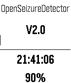</a>

<h2 class="app-name" id="app-54d28a43e4d94c043f000008"><a href="https://apps.repebble.com/54d28a43e4d94c043f000008">Open_Seizure_Detector</a></h2>
<a class="app-source" href="https://github.com/openseizuredetector" title="Source code" data-search-exclude>View source</a>

by <a href="https://apps.repebble.com/apps/dev/graham-jones_54ba2f975efa47cc9100001f" title="More from this developer">Graham Jones</a>

Not checked yet v2.1 Updated 2016-06-11

Runs on: Round 2, Time 2, Pebble 2 Duo, Pebble 2, Time Round, Time, Classic

Pebble based epileptic seizure detector to warn a carer that someone is experiencing a tonic-clonic seizure. Uses an associated Application that runs on an Android phone to raise alarms. Version 2…

<a class="app-shot" href="https://apps.repebble.com/5542604d45bf334314000098" data-search-exclude>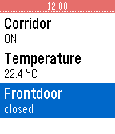</a>

<h2 class="app-name" id="app-5542604d45bf334314000098"><a href="https://apps.repebble.com/5542604d45bf334314000098">openHAB</a></h2>
<a class="app-source" href="http://github.com/openhab/openhab.pebble" title="Source code" data-search-exclude>View source</a>

by <a href="https://apps.repebble.com/apps/dev/openhab-foundation_5541ba7d4b4d96b07500003c" title="More from this developer">openHAB Foundation</a>

Apache-2.0 v1.5 Updated 2018-02-05

Runs on: Round 2, Time 2, Pebble 2 Duo, Pebble 2, Time Round, Time, Classic

This app allows you to use your Pebble SmartWatch to connect to and control your OpenHAB server. Most of the basic kinds of sitemap elements are supported (Frame, Group, Selection, Setpoint…

<a class="app-shot" href="https://apps.repebble.com/57e01b32f9536fb19b00000d" data-search-exclude>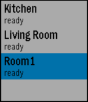</a>

<h2 class="app-name" id="app-57e01b32f9536fb19b00000d"><a href="https://apps.repebble.com/57e01b32f9536fb19b00000d">OpenHab control</a></h2>
<a class="app-source" href="https://github.com/Beungoud/openhab-control" title="Source code" data-search-exclude>View source</a>

by <a href="https://apps.repebble.com/apps/dev/benoit-goudy_5771380dba2fe55fb200027b" title="More from this developer">Benoit Goudy</a>

No licence v1.2 Updated 2016-09-19

Runs on: Round 2, Time 2, Pebble 2 Duo, Pebble 2, Time Round, Time, Classic

Connect to your OpenHab server and quickly send commands to switch any light on/off. This app is intended to be quick and simple. It doesn&#x27;t use your full OpenHab site map. You just configure what…

<a class="app-shot" href="https://apps.repebble.com/66e9f326960bb300094251fc" data-search-exclude>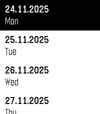</a>

<h2 class="app-name" id="app-66e9f326960bb300094251fc"><a href="https://apps.repebble.com/66e9f326960bb300094251fc">OpenMensa</a></h2>
<a class="app-source" href="https://github.com/jplexer/OpenMensa" title="Source code" data-search-exclude>View source</a>

by <a href="https://apps.repebble.com/apps/dev/jplexer_66d9e31d281f8a000981862f" title="More from this developer">JPlexer</a>

Not checked yet v1.5 Updated 2025-11-24

Runs on: Round 2, Time 2, Pebble 2 Duo, Pebble 2, Time Round, Time, Classic

Your local Mensa, right on your Pebble! Compatible with any Mensa on https://openmensa.org

<a class="app-shot" href="https://apps.rebble.io/en_US/application/69d59f8ab11d330009716a20" data-search-exclude>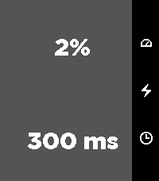</a>

<h2 class="app-name" id="app-69d59f8ab11d330009716a20"><a href="https://apps.rebble.io/en_US/application/69d59f8ab11d330009716a20">OpenShock Pebble</a></h2>
<a class="app-source" href="https://github.com/LostQuasar/pebble-openshock-remote" title="Source code" data-search-exclude>View source</a>

by <a href="https://apps.rebble.io/en_US/developer/5aee23cff3858853b8000896/1" title="More from this developer">LostQuasar</a>

MIT v1.5 Updated 2026-04-08 Rebble App Store

Runs on: Round 2, Time 2, Pebble 2 Duo, Pebble 2, Time Round, Time, Classic

Remote control OpenShock Devices using your pebble watch!

<a class="app-shot" href="https://apps.repebble.com/55b3b8e4ecb919cccb000062" data-search-exclude>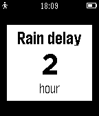</a>

<h2 class="app-name" id="app-55b3b8e4ecb919cccb000062"><a href="https://apps.repebble.com/55b3b8e4ecb919cccb000062">OpenSprinkler</a></h2>
<a class="app-source" href="https://github.com/littleprojects/Pebble_Opensprinkler" title="Source code" data-search-exclude>View source</a>

by <a href="https://apps.repebble.com/apps/dev/david-lenk_550c6a346caaed82dd000013" title="More from this developer">David Lenk</a>

Not checked yet v1.32 Updated 2016-11-18

Runs on: Time 2, Pebble 2 Duo, Pebble 2, Time, Classic

A Remote for your OpenSprinkler on your watch! - show the sprinkler status and Infos - set rain delay - reset rain delay - manual Mode - stop all stations - start test or programs - update with…

<a class="app-shot" href="https://apps.repebble.com/56ac4a755319ec979400000d" data-search-exclude>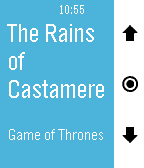</a>

<h2 class="app-name" id="app-56ac4a755319ec979400000d"><a href="https://apps.repebble.com/56ac4a755319ec979400000d">Opus - A Kodi Remote</a></h2>
<a class="app-source" href="https://github.com/mattmattmatt/opus-pebble" title="Source code" data-search-exclude>View source</a>

by <a href="https://apps.repebble.com/apps/dev/pretty-good-apps_5584d6677ecc11dec3000082" title="More from this developer">Pretty Good Apps</a>

Not checked yet v2.3 Updated 2016-05-17

Runs on: Time 2, Pebble 2 Duo, Pebble 2, Time, Classic

A free, beautiful remote for Kodi. Take control of your media center from your wrist. Adjust your Kodi&#x27;s volume by short pressing up and down buttons, skip to previous and next tracks or playlist…

<a class="app-shot" href="https://apps.repebble.com/9882f741750c43eb8309777e" data-search-exclude>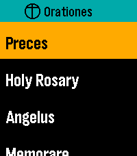</a>

<h2 class="app-name" id="app-9882f741750c43eb8309777e"><a href="https://apps.repebble.com/9882f741750c43eb8309777e">Orationes</a></h2>
<a class="app-source" href="https://github.com/ewijaya/pebble-orationes" title="Source code" data-search-exclude>View source</a>

by <a href="https://apps.repebble.com/apps/dev/edward_c476f03f63cabb0964fbce2e" title="More from this developer">Edward</a>

Not checked yet v0.14.0 Updated 2026-09-30

Runs on: Time 2

Make time for prayer. On your wrist. Available offline. Orationes is a Catholic prayer book for Pebble Time 2. Large text and clear contrast help you focus on the words. Your prayers stay on your…

<h2 class="app-name" id="app-56db86f7eeaab1cad5000045"><a href="https://apps.repebble.com/56db86f7eeaab1cad5000045">Orémus</a></h2>
<a class="app-source" href="https://github.com/jherforth/DailyRosaryApp.git" title="Source code" data-search-exclude>View source</a>

by <a href="https://apps.repebble.com/apps/dev/jaythepapist_56b3d3daed001be08f000040" title="More from this developer">JayThePapist</a>

Not checked yet v1.5 Updated 2016-05-16

Runs on: Time 2, Pebble 2 Duo, Pebble 2, Time, Classic

This app was an endeavor to provide a Catholic prayer guide for daily use. All of the basics are found in this app for your daily prayer life. The rosary updates daily to show you the current…

<a class="app-shot" href="https://apps.repebble.com/2c9f24660c0c46cb9044f1c2" data-search-exclude>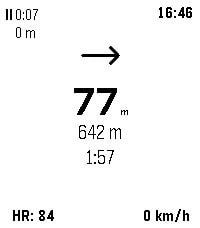</a>

<h2 class="app-name" id="app-2c9f24660c0c46cb9044f1c2"><a href="https://apps.repebble.com/2c9f24660c0c46cb9044f1c2">OsmAnd Pebble Companion</a></h2>
<a class="app-source" href="https://github.com/DrUlysses/OsmAnd-Pebble-Companion" title="Source code" data-search-exclude>View source</a>

by <a href="https://apps.repebble.com/apps/dev/ulysses_cc8a17ce0a9a598566d58bfc" title="More from this developer">Ulysses</a>

MIT v1.0.0 Updated 2026-08-25

Runs on: Round 2, Time 2, Pebble 2 Duo, Pebble 2, Time Round, Time, Classic

# OsmAnd Pebble Companion OsmAnd Pebble Companion is a bridge application that connects the [OsmAnd](https://osmand.net/) navigation app on Android with Pebble smartwatches. It allows users to…

<a class="app-shot" href="https://apps.rebble.io/en_US/application/69a50e6dc698570008fa2fc6" data-search-exclude>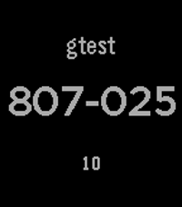</a>

<h2 class="app-name" id="app-69a50e6dc698570008fa2fc6"><a href="https://apps.rebble.io/en_US/application/69a50e6dc698570008fa2fc6">otp4p</a></h2>
<a class="app-source" href="https://github.com/clach04/pebble-otp4p" title="Source code" data-search-exclude>View source</a>

by <a href="https://apps.rebble.io/en_US/developer/5524604a9de9550a3300007a/1" title="More from this developer">clach04</a>

Not checked yet v2.4 Updated 2026-03-03 Rebble App Store

Runs on: Round 2, Time 2, Pebble 2 Duo, Pebble 2, Time Round, Time, Classic

Offline config (via Clay) [TOTP](http://en.wikipedia.org/wiki/Time-based_One-time_Password_Algorithm) based two-factor authentication manager for Pebble. It generates **T**ime-based…

<a class="app-shot" href="https://apps.repebble.com/696b98c4eb3552000933f466" data-search-exclude>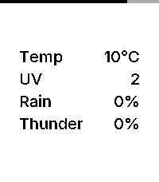</a>

<h2 class="app-name" id="app-696b98c4eb3552000933f466"><a href="https://apps.repebble.com/696b98c4eb3552000933f466">Out</a></h2>
<a class="app-source" href="https://github.com/alexanderteinum/pebble-out" title="Source code" data-search-exclude>View source</a>

by <a href="https://apps.repebble.com/apps/dev/alexander-teinum_6963ccc2cc35bb000808bce4" title="More from this developer">Alexander Teinum</a>

MIT v0.5 Updated 2026-03-23

Runs on: Round 2, Time 2, Pebble 2 Duo, Pebble 2, Time Round, Time, Classic

Out is an open source, minimalist weather dashboard for Pebble, giving you exactly what you need before you step out the door. Features: – Current Temperature: Displays real-time temperature in…

<a class="app-shot" href="https://apps.repebble.com/57542b7f70c28c587d000004" data-search-exclude>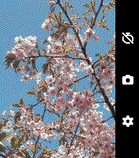</a>

<h2 class="app-name" id="app-57542b7f70c28c587d000004"><a href="https://apps.repebble.com/57542b7f70c28c587d000004">OW Camera Remote</a></h2>
<a class="app-source" href="https://github.com/jamsinclair/ow-camera-remote" title="Source code" data-search-exclude>View source</a>

by <a href="https://apps.repebble.com/apps/dev/jamsinclair_5753d6d88576a40cc700001a" title="More from this developer">jamsinclair</a>

Not checked yet v2.0.3 Updated 2026-04-26

Runs on: Round 2, Time 2, Pebble 2 Duo, Pebble 2, Time Round, Time, Classic

OW Camera Remote lets you preview your phone&#x27;s camera and remotely take pictures with a timer. Rebuilt and enhanced from the original app version from 10 years ago. Set a timer, strike a pose, and…

<h2 class="app-name" id="app-7e832ffe51a0444bbca0b079"><a href="https://apps.repebble.com/7e832ffe51a0444bbca0b079">OwnTone Remote</a></h2>
<a class="app-source" href="https://github.com/cdlenfert/pebble-owntone-remote" title="Source code" data-search-exclude>View source</a>

by <a href="https://apps.repebble.com/apps/dev/chillydown_14ccca880682209b692799c9" title="More from this developer">ChillyDown</a>

Not checked yet v1.18 Updated 2026-07-20

Runs on: Time 2, Pebble 2 Duo, Pebble 2, Time, Classic

Control your OwnTone (owntone/owntone) music server from your Pebble watch. Browse results, play/pause, skip tracks, and adjust volume or outputs without touching your phone. Features - Search and…

