<!-- Generated by scripts/update_app_directory.py: do not edit by hand -->
# Watchapps: 0–9 & other

[← About this list](../watchapps.md) · [A](a.md) · [B](b.md) · [C](c.md) · [D](d.md) · [E](e.md) · [F](f.md) · [G](g.md) · [H](h.md) · [I](i.md) · [J](j.md) · [K](k.md) · [L](l.md) · [M](m.md) · [N](n.md) · [O](o.md) · [P](p.md) · [Q](q.md) · [R](r.md) · [S](s.md) · [T](t.md) · [U](u.md) · [V](v.md) · [W](w.md) · [X](x.md) · [Y](y.md) · [Z](z.md) · **0–9 & other**

*22 watchapps · Last updated 2026-10-06*

| Screenshot | Name | Developer | Licence | Updated | Description |
|------------|------|-----------|---------|---------|-------------|
| { loading=lazy width="72" } | [(P)ermes](https://apps.repebble.com/6719b421d889454cb28ac745) | [Sergei Silnov](https://github.com/kumekay/pblpg) | <small>Not checked yet</small> | 2026-09-01 | Talk to your self-hosted Hermes agent from your Pebble. |
| { loading=lazy width="72" } | [+1](https://apps.repebble.com/56d24ad11f7ad6e109000035) | [Damian C Dev](https://github.com/DamianCDev/plus1) | <small>No licence</small> | 2016-02-28 | You need an easier way of tracking the number of laps you do around that oval, or, the number of times you drink a glass of water. Whatever you need to keep… |
| { loading=lazy width="72" } | [1 More Episode](https://apps.repebble.com/84498bc5f637462ead44802c) | [RandyTheSilly](https://git.wetfence.xyz/RandyTheSilly/1-More-Episode) | <small>See source</small> | 2026-05-10 | "#^%$! I fell asleep and woke up watching a different season! What was the last episode I saw?!" - You, probably Well now your Pebble smartwatch can tell… |
| 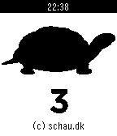{ loading=lazy width="72" } | [10-20-30](https://apps.repebble.com/57c047745e3c3db62800013a) | [Brian Schau](https://github.com/bschau/TenTwentyThirty) | <small>Not checked yet</small> | 2016-08-26 | 10-20-30 is a way to spice up your running giving you good results. This app tracks an entire run. |
| 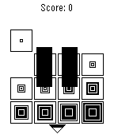{ loading=lazy width="72" } | [2048](https://apps.repebble.com/5325c3d4ee3b27892f000493) | [crazy2be](https://github.com/crazy2be/2048-pebble/) | <small>Not checked yet</small> | 2014-03-16 | A clone of 2048 for the Pebble smartwatch. Tilt the screen to combine adjacent matching tiles. You win when you reach the 2048 tile! Press the middle button… |
| 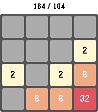{ loading=lazy width="72" } | [2048 Touch](https://apps.repebble.com/6df87b64b7174448a065ef54) | [vorsk](https://github.com/lanrat/pebble-2048-touch) | <small>Not checked yet</small> | 2026-05-24 | Play the classic 2048 sliding-tile puzzle on your Pebble. Combine matching numbered tiles to add them together and work your way up to the 2048 tile — and… |
| 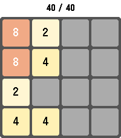{ loading=lazy width="72" } | [2048 Touch](https://apps.rebble.io/en_US/application/6a0567d11cbe56000ae6c9a8) <small>Rebble App Store</small> | [vorsk](https://github.com/lanrat/pebble-2048-touch) | <small>Not checked yet</small> | 2026-05-24 | Play the classic 2048 sliding-tile puzzle on your Pebble. Combine matching numbered tiles to add them together and work your way up to the 2048 tile — and… |
| 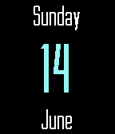{ loading=lazy width="72" } | [2Day App](https://apps.repebble.com/557c61814923dd2fc0000051) | [mephissto](https://github.com/mephissto/2day-app) | <small>Not checked yet</small> | 2015-11-16 | Simple app that display the current day of the weak, day of the month and the month. Sometimes I use a watchface that don't have the day of the week or the… |
| 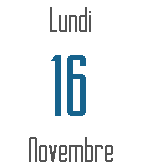{ loading=lazy width="72" } | [2Day App Light](https://apps.repebble.com/564a3d7a406ba6596c00007e) | [mephissto](https://github.com/mephissto/2day-app-light) | <small>Not checked yet</small> | 2015-11-16 | 2Day Appl with light color |
| 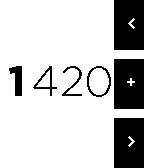{ loading=lazy width="72" } | [4 Digit numeric keyboard demo](https://apps.repebble.com/56acbb21778c299ff9000025) | [iAbadia](https://github.com/iAbadia/Pebble-4-Digit-Num-Keyboard) | <small>Not checked yet</small> | 2016-01-30 | Numeric Keyboard demo, pebble.js source available at my GitHub: iAbadia |
| 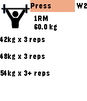{ loading=lazy width="72" } | [5/3/1 Training](https://apps.repebble.com/6891dd78069d3e0009f9f825) | [Bart](https://github.com/louwers/531-pebble) | <small>Not checked yet</small> | 2025-08-05 | Calculates weights and sets based on Jim Wendler's 5/3/1 barbell training program so your next lifts are always available right on your wrist. |
| 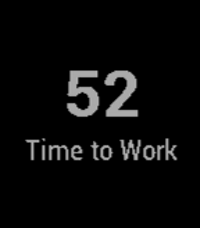{ loading=lazy width="72" } | [52/17](https://apps.rebble.io/en_US/application/59cae9e8461a8da6ca002084) <small>Rebble App Store</small> | [Brian](https://github.com/howcatsjam/5217) | <small>Not checked yet</small> | 2017-09-27 | 52/17 is a simple productivity timer based on the 52/17 split: 52 minutes working, followed by 17 minutes resting. Single-click select to start and pause… |
| 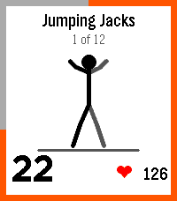{ loading=lazy width="72" } | [7-Minute Workout](https://apps.repebble.com/0ca00e938572442eb31cff74) | [Derek Pomery](https://m8y.org/pebble/) | <small>Not checked yet</small> | 2026-10-03 | 7-Minute Workout I wanted a Pebble version of my daily exercise. This is the well-known 12-exercise high-intensity circuit for the Pebble, courtesy of… |
| { loading=lazy width="72" } | [7-Minute+](https://apps.repebble.com/55c6658f65af420a55000043) | [Ycleptic Studios](https://github.com/YclepticStudios/pebble-7-min) | <small>Not checked yet</small> | 2019-07-24 | Get in shape with this simple 7-Minute Workout app! Never forget to exercise with a daily timeline reminder, and receive a pin when you complete it. Like… |
| 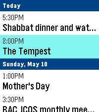{ loading=lazy width="72" } | [7day ICS Calendar](https://apps.repebble.com/82451ba23ca641ab82821fa6) | [Eric McCormick](https://github.com/ericlmccormick/Pebble_7_day_ICS_Calendar) | <small>Not checked yet</small> | 2026-07-02 | This is designed to pull the date time and name of the events happening in the next 7 days from any ICS file. I have only tested it using a private google… |
| 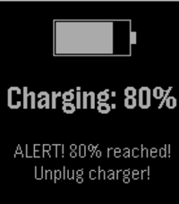{ loading=lazy width="72" } | [80% battery charged](https://apps.repebble.com/e7540c9775d545af81ba7f3f) | [Coconauts](https://github.com/rephus/pebble-battery-charged) | <small>Not checked yet</small> | 2026-04-17 | Get notified when you charge your pebble and the battery level reaches 80%. This way, you can manually interrupt the charge. Preventing batteries to charge… |
| 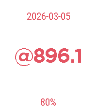{ loading=lazy width="72" } | [@beat](https://apps.repebble.com/177f26f0ace84ea9bdb29a99) | [Thomas Cherry](https://github.com/jceaser/pebble-beat/) | <small>Not checked yet</small> | 2026-04-05 | Initial release of an old Pebble app that I never got around to publishing when Pebble was now, but now that we are here for round 2 I'm inspired to share… |
| 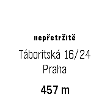{ loading=lazy width="72" } | [ČS ATM](https://apps.repebble.com/56818e4e94ffb216e400001f) | [Jirka Chadima](https://github.com/jirkachadima/pebble-csas-nearest) | <small>Not checked yet</small> | 2015-12-28 | Demo app that shows nearest ATM of CSas |
| 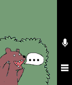{ loading=lazy width="72" } | [Шепот](https://apps.rebble.io/en_US/application/58ec86dd6ca3872acd0005d2) <small>Rebble App Store</small> | [Igor Zalomskij](https://github.com/kaist/shepot) | <small>Not checked yet</small> | 2019-07-24 | The application only in Russian language! Делайте заметки и напоминания голосом на ваших pebble на русском языке. Приложение понимает фразы: Напомни… |
| { loading=lazy width="72" } | [今日美剧](https://apps.rebble.io/en_US/application/550da15ead788c5858000012) <small>Rebble App Store</small> | [legend](https://github.com/legendtired/PebbleATS) | <small>Not checked yet</small> | 2015-03-22 | 美剧播出时刻表（北京时间） |
| { loading=lazy width="72" } | [실시간 검색어](https://apps.repebble.com/570707b34ff0c8e47900000a) | [SappyPrg](https://github.com/imdanboy/RTK) | <small>Not checked yet</small> | 2016-08-04 | - It will not display correctly without korean language pack installed. (in that case, do not download it) - 네이버, 다음으로부터 실시간 검색어를 보여줍니다. --- version 2.0 에… |
|  | [🔦 torch color edition](https://apps.repebble.com/5b5c25bdb840489c921b4b23) | [wiegand](https://github.com/chuckmoritzgg/pebble-torch-color-edition) | <small>Not checked yet</small> | 2026-06-06 | Unfortunately dimming brightness is not possible but we can circle a few colors on PT2 |
