---
hide:
  - toc
---

<!-- Generated by scripts/update_app_directory.py: do not edit by hand -->
# Pebble Apps: P

[← All Pebble Apps](../watchapps.md) · [A](a.md) · [B](b.md) · [C](c.md) · [D](d.md) · [E](e.md) · [F](f.md) · [G](g.md) · [H](h.md) · [I](i.md) · [J](j.md) · [K](k.md) · [L](l.md) · [M](m.md) · [N](n.md) · [O](o.md) · **P** · [Q](q.md) · [R](r.md) · [S](s.md) · [T](t.md) · [U](u.md) · [V](v.md) · [W](w.md) · [X](x.md) · [Y](y.md) · [Z](z.md) · [0–9 & other](other.md)

*188 apps · Last updated 2026-10-06 · [About these lists](../about-app-lists.md)*

<a class="app-shot" href="https://apps.repebble.com/551c91e57a1b581177000025" data-search-exclude>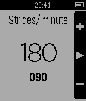</a>

<h2 class="app-name" id="app-551c91e57a1b581177000025"><a href="https://apps.repebble.com/551c91e57a1b581177000025">PaceKeeper</a></h2>
<a class="app-source" href="https://github.com/uaraven/pacekeeper" title="Source code" data-search-exclude>View source</a>

by <a href="https://apps.repebble.com/apps/dev/ninjacat_52f162f9c41172b4470005bd" title="More from this developer">Ninjacat</a>

Not checked yet v1.0 Updated 2015-04-07

Runs on: Time 2, Pebble 2 Duo, Pebble 2, Time, Classic

Whatchapp to help you keep your running cadence. It will vibrate your watch to keep your rhythm. Up and down buttons to set strides per minute. Select button to start/stop rhythm. Long press on…

<a class="app-shot" href="https://apps.repebble.com/81fc38ce91e5491d91b72840" data-search-exclude>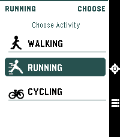</a>

<h2 class="app-name" id="app-81fc38ce91e5491d91b72840"><a href="https://apps.repebble.com/81fc38ce91e5491d91b72840">Pacelet</a></h2>
<a class="app-source" href="https://github.com/LiamCordelle/pacelet" title="Source code" data-search-exclude>View source</a>

by <a href="https://apps.repebble.com/apps/dev/liam-cordelle_e31645c88f617059803cfa71" title="More from this developer">Liam Cordelle</a>

MIT v0.6.1 Updated 2026-09-22

Runs on: Time 2

A simple activity tracker, using phone GPS

<a class="app-shot" href="https://apps.repebble.com/571a0c6069f1bd4ca4000006" data-search-exclude>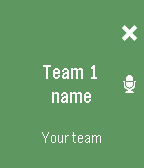</a>

<h2 class="app-name" id="app-571a0c6069f1bd4ca4000006"><a href="https://apps.repebble.com/571a0c6069f1bd4ca4000006">Paddle Time</a></h2>
<a class="app-source" href="https://github.com/bitwinkel/paddletime.git" title="Source code" data-search-exclude>View source</a>

by <a href="https://apps.repebble.com/apps/dev/bitwinkel_5301c0cdd1653b8d5e0003ac" title="More from this developer">Bitwinkel</a>

No licence v1.1 Updated 2016-04-24

Runs on: Time 2, Pebble 2 Duo, Pebble 2, Time, Classic

A simple app to keep track your paddle match points. It will help you know who and where has the service and you can use your real name and your team name. This app is in english and spanish…

<a class="app-shot" href="https://apps.repebble.com/574bec916037e86f0c000002" data-search-exclude>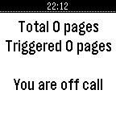</a>

<h2 class="app-name" id="app-574bec916037e86f0c000002"><a href="https://apps.repebble.com/574bec916037e86f0c000002">PagerDuty JS</a></h2>
<a class="app-source" href="https://github.com/murat1985/pebblejs-pagerduty" title="Source code" data-search-exclude>View source</a>

by <a href="https://apps.repebble.com/apps/dev/murat-mukhtarov_56dbcb65f92cb6a1a4000003" title="More from this developer">Murat Mukhtarov</a>

Not checked yet v1.1 Updated 2016-05-31

Runs on: Time 2, Pebble 2 Duo, Pebble 2, Time, Classic

Receive incidents and view them as cards on your Pebble Watch; Acknowledge an incident when you received it; Acknowledge all incidents; App will show you how long you are going to be on-call - and…

<a class="app-shot" href="https://apps.repebble.com/78e5649f62a84ec593f49110" data-search-exclude>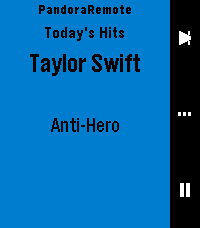</a>

<h2 class="app-name" id="app-78e5649f62a84ec593f49110"><a href="https://apps.repebble.com/78e5649f62a84ec593f49110">Pandora Remote</a></h2>
<a class="app-source" href="https://github.com/gravity-rose/PandoraRemote" title="Source code" data-search-exclude>View source</a>

by <a href="https://apps.repebble.com/apps/dev/gravity-rose_a89ac83e4a28a87236ff87f8" title="More from this developer">gravity_rose</a>

Not checked yet v1.5.2 Updated 2026-05-04

Runs on: Round 2, Time 2, Pebble 2 Duo, Pebble 2, Time Round, Time

Control Pandora from your wrist. PandoraRemote lets you manage playback, rate songs, and adjust volume directly from your Pebble watch. FEATURES - Skip tracks, play/pause with a single button…

<h2 class="app-name" id="app-439d3664960b40d0a1911cb0"><a href="https://apps.repebble.com/439d3664960b40d0a1911cb0">Paperless</a></h2>
<a class="app-source" href="https://github.com/Zeichenfolge/paperless-pebble" title="Source code" data-search-exclude>View source</a>

by <a href="https://apps.repebble.com/apps/dev/michael-runge_af7723c36fa525e548676631" title="More from this developer">Michael Runge</a>

MIT v1.4.0 Updated 2026-10-02

Runs on: Time 2, Pebble 2 Duo, Pebble 2, Time

Your Paperless-ngx inbox on your wrist. - See the newest documents in your inbox with correspondent and date - Look at the scan: whole page or zoomed in until the text is readable – split into…

<a class="app-shot" href="https://apps.rebble.io/en_US/application/6a485d66b6d159000952a982" data-search-exclude>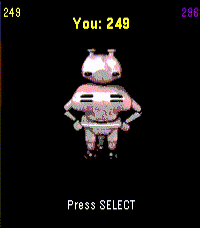</a>

<h2 class="app-name" id="app-6a485d66b6d159000952a982"><a href="https://apps.rebble.io/en_US/application/6a485d66b6d159000952a982">Paradroid Takeover</a></h2>
<a class="app-source" href="https://github.com/daktak/pebble_paradroid_takeover" title="Source code" data-search-exclude>View source</a>

by <a href="https://apps.rebble.io/en_US/developer/56e681d026fa04b2d900006c/1" title="More from this developer">Daktak</a>

Not checked yet v0.3.0 Updated 2026-07-08 Rebble App Store

Runs on: Time 2, Time

Takeover droids to reach Captain

<a class="app-shot" href="https://apps.repebble.com/b29dcf9df26f41888a420a31" data-search-exclude>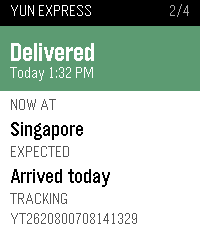</a>

<h2 class="app-name" id="app-b29dcf9df26f41888a420a31"><a href="https://apps.repebble.com/b29dcf9df26f41888a420a31">Parcel Tracking</a></h2>
<a class="app-source" href="https://github.com/qichuan/pebble-parcel-tracking" title="Source code" data-search-exclude>View source</a>

by <a href="https://apps.repebble.com/apps/dev/zhang-qichuan_53043485117485c22f0000cf" title="More from this developer">Zhang Qichuan</a>

Not checked yet v1.1 Updated 2026-09-22

Runs on: Round 2, Time 2, Pebble 2 Duo, Pebble 2, Time Round, Time, Classic

Wondering if any parcel is arriving today? This app answers that question in an instant. Open any shipment to check its current status, location, estimated delivery time, and complete past…

<h2 class="app-name" id="app-561250ba1cdcfc612600008c"><a href="https://apps.repebble.com/561250ba1cdcfc612600008c">Paris Transilien</a></h2>
<a class="app-source" href="https://github.com/CocoaBob/PebbleTransilien" title="Source code" data-search-exclude>View source</a>

by <a href="https://apps.repebble.com/apps/dev/cocoabob_54edee1596fa9a0127000094" title="More from this developer">CocoaBob</a>

MIT v1.10 Updated 2016-03-11

Runs on: Round 2, Time 2, Pebble 2 Duo, Pebble 2, Time Round, Time, Classic

Paris Transilien is an unofficial app for checking SNCF Transilien™ trains on your wrist. Transilien™ is the brand name of the suburban railway service of the SNCF-owned railway network operating…

<a class="app-shot" href="https://apps.repebble.com/549ee1d3ef9cfa427a00018c" data-search-exclude>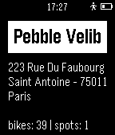</a>

<h2 class="app-name" id="app-549ee1d3ef9cfa427a00018c"><a href="https://apps.repebble.com/549ee1d3ef9cfa427a00018c">Paris Velib Finder</a></h2>
<a class="app-source" href="https://github.com/AlexKovax/PebbleVelib" title="Source code" data-search-exclude>View source</a>

by <a href="https://apps.repebble.com/apps/dev/kovaxlabs_5454da5fe77c14f021000086" title="More from this developer">Kovaxlabs</a>

GPL-2.0 v1.0 Updated 2014-12-27

Runs on: Time 2, Pebble 2 Duo, Pebble 2, Time, Classic

Paris Velib Finder is a very simplistic app that gives you the address of the closest Velib station in Paris and the available bikes/spots number. That&#x27;s it!

<a class="app-shot" href="https://apps.rebble.io/en_US/application/67ccf9b0d2acb302d5ba8210" data-search-exclude>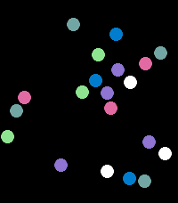</a>

<h2 class="app-name" id="app-67ccf9b0d2acb302d5ba8210"><a href="https://apps.rebble.io/en_US/application/67ccf9b0d2acb302d5ba8210">Particles</a></h2>
<a class="app-source" href="https://github.com/FlynnD273/pebble-physics" title="Source code" data-search-exclude>View source</a>

by <a href="https://apps.rebble.io/en_US/developer/67bd48a737d408000a74f7d7/1" title="More from this developer">Flynn Duniho</a>

MIT v1.4 Updated 2026-03-03 Rebble App Store

Runs on: Round 2, Time 2, Pebble 2 Duo, Pebble 2, Time Round, Time, Classic

Just a physics sim with a bunch of balls, uses the accelerometer

<a class="app-shot" href="https://apps.repebble.com/08f732a3c6a54684a1f3e3ee" data-search-exclude>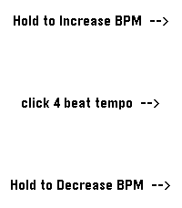</a>

<h2 class="app-name" id="app-08f732a3c6a54684a1f3e3ee"><a href="https://apps.repebble.com/08f732a3c6a54684a1f3e3ee">Party Light</a></h2>
<a class="app-source" href="https://github.com/viktorNybom/pebble_party_light_c" title="Source code" data-search-exclude>View source</a>

by <a href="https://apps.repebble.com/apps/dev/viktor-nybom_dbb7ffdd75e492e34029e149" title="More from this developer">Viktor Nybom</a>

Not checked yet v1.0 Updated 2026-08-19

Runs on: Time 2

Uses the RGB backlight of the Pebble Time 2, so the app only works for the Time 2. Changes backlight color to a new backlight color in the set BPM. Colors are random from: Red, Blue, Green, Cyan…

<h2 class="app-name" id="app-87448e2399a94cd58d2c8284"><a href="https://apps.repebble.com/87448e2399a94cd58d2c8284">Patch</a></h2>
<a class="app-source" href="https://github.com/mattnovelli/patch" title="Source code" data-search-exclude>View source</a>

by <a href="https://apps.repebble.com/apps/dev/matt_e56a0276e82f3b9205e1cfb8" title="More from this developer">Matt</a>

Not checked yet v1.1.0 Updated 2026-07-12

Runs on: Round 2, Time 2, Time Round, Time

Harness the power of iOS Automations to send text messages (including iMessages) from your Pebble! No server required. Patch uses Outlook (yes, Outlook!) to send an email to yourself, which…

<a class="app-shot" href="https://apps.repebble.com/559af16358bc81d930000067" data-search-exclude>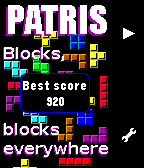</a>

<h2 class="app-name" id="app-559af16358bc81d930000067"><a href="https://apps.repebble.com/559af16358bc81d930000067">Patris</a></h2>
<a class="app-source" href="https://github.com/Fabien-Chouteau/Ada_Time" title="Source code" data-search-exclude>View source</a>

by <a href="https://apps.repebble.com/apps/dev/fabien_5504bcb38d390726a800002d" title="More from this developer">Fabien</a>

No licence v1.2 Updated 2015-11-04

Runs on: Time 2, Time

Patris is a game inspired by the famous classic falling blocks. The game is automatically saved when you exit the app and you can change level in the menu. This app was developed using formal…

<a class="app-shot" href="https://apps.repebble.com/3cbee0195ebb4709be91f6d2" data-search-exclude>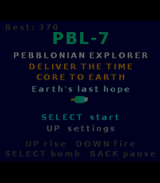</a>

<h2 class="app-name" id="app-3cbee0195ebb4709be91f6d2"><a href="https://apps.repebble.com/3cbee0195ebb4709be91f6d2">PBL-7</a></h2>
<a class="app-source" href="https://github.com/mrtruebeliever/PBL-7" title="Source code" data-search-exclude>View source</a>

by <a href="https://apps.repebble.com/apps/dev/mrtruebeliever_5f8814a92a6f109602136f61" title="More from this developer">mrTrueBeliever</a>

Not checked yet v1.0.1 Updated 2026-08-13

Runs on: Time 2

A landscape shmup through the solar system. Hold your Pebble Time 2 sideways and fly PBL-7 to Earth. Rise, fire, dodge, and beat a boss on every planet. 11 planets, secrets, 5 languages. PBL-7 is…

<a class="app-shot" href="https://apps.repebble.com/52bdb232dc2f4ff50f00009a" data-search-exclude>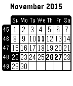</a>

<h2 class="app-name" id="app-52bdb232dc2f4ff50f00009a"><a href="https://apps.repebble.com/52bdb232dc2f4ff50f00009a">PCal</a></h2>
<a class="app-source" href="https://github.com/Jnmattern/PCal" title="Source code" data-search-exclude>View source</a>

by <a href="https://apps.repebble.com/apps/dev/jnm_529994c0e627ce7ba1000050" title="More from this developer">Jnm</a>

No licence v3.5 Updated 2016-02-17

Runs on: Round 2, Time 2, Pebble 2 Duo, Pebble 2, Time Round, Time, Classic

Universal Calendar, configuration screen available from the Phone Pebble App, allowing to set language, display of week numbers, first day of week and public holidays for some countries. Available…

<a class="app-shot" href="https://apps.rebble.io/en_US/application/6a80ccf8d08b360009a90351" data-search-exclude>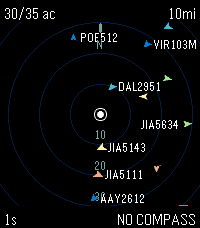</a>

<h2 class="app-name" id="app-6a80ccf8d08b360009a90351"><a href="https://apps.rebble.io/en_US/application/6a80ccf8d08b360009a90351">Peb1090</a></h2>
<a class="app-source" href="https://github.com/partofthething/peb1090" title="Source code" data-search-exclude>View source</a>

by <a href="https://apps.rebble.io/en_US/developer/6a7749febaddf70009b25be8/1" title="More from this developer">Nick Touran</a>

Not checked yet v1.0.2 Updated 2026-08-17 Rebble App Store

Runs on: Round 2, Time 2, Pebble 2 Duo, Pebble 2, Time Round, Time, Classic

View flight data around you from a tar1090 server. This is generally useful for people who run ADS-B receivers themselves and want to plug into their own data, though it would work with a friend&#x27;s…

<h2 class="app-name" id="app-67cdcb18d2acb303aedd4a91"><a href="https://apps.rebble.io/en_US/application/67cdcb18d2acb303aedd4a91">Pebball! - Interactive Motion Game Concept</a></h2>
<a class="app-source" href="https://github.com/tertty/pebball-web" title="Source code" data-search-exclude>View source</a>

by <a href="https://apps.rebble.io/en_US/developer/52d4acb6d8d9dfc9e000002a/1" title="More from this developer">Stanivision Inc.</a>

Not checked yet v1.1 Updated 2025-03-10 Rebble App Store

Runs on: Round 2, Time 2, Pebble 2 Duo, Pebble 2, Time Round, Time, Classic

Pebball! is a baseball inspired interactive, motion controlled game concept for the Pebble Smartwatch. When paired with the Pebball! Web Server, this Watchapp acts as a controller for an endless…

<a class="app-shot" href="https://apps.repebble.com/8b5a3a62e2ba4522840fb658" data-search-exclude>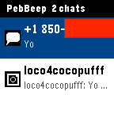</a>

<h2 class="app-name" id="app-8b5a3a62e2ba4522840fb658"><a href="https://apps.repebble.com/8b5a3a62e2ba4522840fb658">PebBeep</a></h2>
<a class="app-source" href="https://github.com/scottrules44/PebBeep-Pebble" title="Source code" data-search-exclude>View source</a>

by <a href="https://apps.repebble.com/apps/dev/scott-harrison_52f03487af0eab46cf000ce6" title="More from this developer">Scott Harrison</a>

Not checked yet v1.1 Updated 2026-04-08

Runs on: Round 2, Time 2, Pebble 2 Duo, Pebble 2, Time Round, Time, Classic

PebBeep — Messages on Your Pebble Read and reply to your iMessage, Slack, WhatsApp, Signal, Telegram, Discord, Messenger, Instagram, Google Chat, Google Messages, Matrix, X (Twitter), and LinkedIn…

<a class="app-shot" href="https://apps.rebble.io/en_US/application/66310701ea09ac0e67193520" data-search-exclude>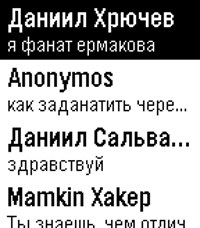</a>

<h2 class="app-name" id="app-66310701ea09ac0e67193520"><a href="https://apps.rebble.io/en_US/application/66310701ea09ac0e67193520">Pebblakte</a></h2>
<a class="app-source" href="https://github.com/veselcraft/pebblakte" title="Source code" data-search-exclude>View source</a>

by <a href="https://apps.rebble.io/en_US/developer/6533d557c375090008b0c90b/1" title="More from this developer">Veselcraft</a>

Not checked yet v2.1 Updated 2025-10-18 Rebble App Store

Runs on: Round 2, Time 2, Pebble 2 Duo, Pebble 2, Time Round, Time, Classic

Messaging app for VK and OpenVK. Below is description in Russian language. Мессенджер для VK и OpenVK. Для входа потребуется токен. Для ВК его можно сгенерировать так: зайти на vkhost.github.io…

<a class="app-shot" href="https://apps.repebble.com/5346b35474eafce75b000334" data-search-exclude>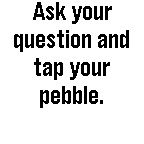</a>

<h2 class="app-name" id="app-5346b35474eafce75b000334"><a href="https://apps.repebble.com/5346b35474eafce75b000334">Pebble 8 Ball</a></h2>
<a class="app-source" href="https://github.com/ptcryan/pebble8ball" title="Source code" data-search-exclude>View source</a>

by <a href="https://apps.repebble.com/apps/dev/david-ryan_52f0647ca0cb6af44f001749" title="More from this developer">David Ryan</a>

Not checked yet v1.0.0 Updated 2014-04-10

Runs on: Time 2, Pebble 2 Duo, Pebble 2, Time, Classic

A pebble rendition of the classic magic 8 ball game.

<a class="app-shot" href="https://apps.repebble.com/d50eaec84a5e410298a3d2c7" data-search-exclude>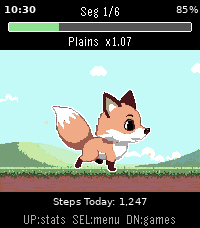</a>

<h2 class="app-name" id="app-d50eaec84a5e410298a3d2c7"><a href="https://apps.repebble.com/d50eaec84a5e410298a3d2c7">Pebble Adventure</a></h2>
<a class="app-source" href="https://github.com/levonn-dev/pebble-adventure" title="Source code" data-search-exclude>View source</a>

by <a href="https://apps.repebble.com/apps/dev/levonn_f316bd30e30eb999711b5614" title="More from this developer">Levonn</a>

Not checked yet v1.1.0 Updated 2026-05-21

Runs on: Time 2, Pebble 2 Duo

# Pebble Adventure ## Walk further. Level up. Explore the world. One step at a time. --- ## The Game Born from a love of Chao Adventure, Tamagotchi, and Ragnarok Online, Pebble Adventure is a…

<a class="app-shot" href="https://apps.repebble.com/1e8def94044d4f4ca69cc566" data-search-exclude>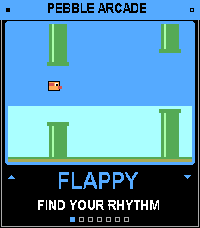</a>

<h2 class="app-name" id="app-1e8def94044d4f4ca69cc566"><a href="https://apps.repebble.com/1e8def94044d4f4ca69cc566">Pebble Arcade</a></h2>
<a class="app-source" href="https://github.com/salim-benhamadi/Pebble-Arcade" title="Source code" data-search-exclude>View source</a>

by <a href="https://apps.repebble.com/apps/dev/salim-benhamadi_661d02d636de4056f2a5eada" title="More from this developer">Salim Benhamadi</a>

Not checked yet v1.0.3 Updated 2026-09-29

Runs on: Round 2, Time 2, Pebble 2 Duo, Pebble 2, Time Round, Time, Classic

Six retro arcade games in one app, playable with just your watch buttons. Pick a game from the menu, play a quick round, and hit SELECT to retry. Games Flappy: tap to flap through the pipes…

<a class="app-shot" href="https://apps.repebble.com/556a32990bfdada493000060" data-search-exclude>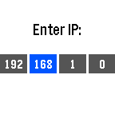</a>

<h2 class="app-name" id="app-556a32990bfdada493000060"><a href="https://apps.repebble.com/556a32990bfdada493000060">Pebble Controller</a></h2>
<a class="app-source" href="https://github.com/andars/pebble-controller" title="Source code" data-search-exclude>View source</a>

by <a href="https://apps.repebble.com/apps/dev/andars_52f077a9a0cb6a3454001a9e" title="More from this developer">andars</a>

MIT v0.2 Updated 2015-06-02

Runs on: Time 2, Pebble 2 Duo, Pebble 2, Time, Classic

This watch app allows you to transmit button presses from your Pebble to a computer and perform actions there. See the github page at https://github.com/andars/pebble-controller (linked below) for…

<a class="app-shot" href="https://apps.repebble.com/533f81d2cb6cd3fb2b0001b4" data-search-exclude>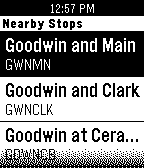</a>

<h2 class="app-name" id="app-533f81d2cb6cd3fb2b0001b4"><a href="https://apps.repebble.com/533f81d2cb6cd3fb2b0001b4">Pebble CUMTD</a></h2>
<a class="app-source" href="https://github.com/nhandler/pebble-cumtd" title="Source code" data-search-exclude>View source</a>

by <a href="https://apps.repebble.com/apps/dev/nathan-handler_530d1fe7d3b642ac1a000335" title="More from this developer">Nathan Handler</a>

Not checked yet v1.1 Updated 2015-03-03

Runs on: Time 2, Pebble 2 Duo, Pebble 2, Time, Classic

Locate the nearest Champaign-Urbana Mass Transit District (CUMTD) bus stop, and then view upcoming bus departure times.

<a class="app-shot" href="https://apps.rebble.io/en_US/application/608059da1342ae003ce73f02" data-search-exclude>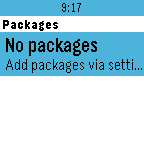</a>

<h2 class="app-name" id="app-608059da1342ae003ce73f02"><a href="https://apps.rebble.io/en_US/application/608059da1342ae003ce73f02">Pebble Deliveries</a></h2>
<a class="app-source" href="https://github.com/oonqt/pebble-deliveries" title="Source code" data-search-exclude>View source</a>

by <a href="https://apps.rebble.io/en_US/developer/608059d81342ae003ce73f00/1" title="More from this developer">JSystems</a>

Not checked yet v1.3 Updated 2021-05-19 Rebble App Store

Runs on: Round 2, Time 2, Pebble 2 Duo, Pebble 2, Time Round, Time, Classic

Pebble Deliveries is an app that makes it easy to track your shipment from dozens of different postal carriers. Simply app your package name and tracking number from the settings page to begin…

<h2 class="app-name" id="app-53ff99c7d08f53676a000043"><a href="https://apps.repebble.com/53ff99c7d08f53676a000043">Pebble Demos</a></h2>
<a class="app-source" href="https://github.com/pebble/pebble-sdk-examples" title="Source code" data-search-exclude>View source</a>

by <a href="https://apps.repebble.com/apps/dev/gr-goire-sage_52b216cf05c04653a9000080" title="More from this developer">Grégoire Sage</a>

Not checked yet v1.3 Updated 2014-09-21

Runs on: Time 2, Pebble 2 Duo, Pebble 2, Time, Classic

All the Pebble SDK demos in ONE app ! Contains all the watchapps and all the watchfaces

<a class="app-shot" href="https://apps.repebble.com/144e5a593cc0494a81200cb1" data-search-exclude>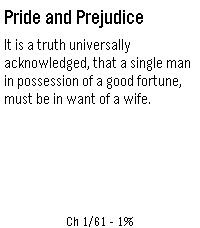</a>

<h2 class="app-name" id="app-144e5a593cc0494a81200cb1"><a href="https://apps.repebble.com/144e5a593cc0494a81200cb1">Pebble eReader</a></h2>
<a class="app-source" href="https://github.com/ErikLundin98/pebble-ereader" title="Source code" data-search-exclude>View source</a>

by <a href="https://apps.repebble.com/apps/dev/erik-lundin_33c249a5a80aceb3a9575d76" title="More from this developer">Erik Lundin</a>

No licence v1.1.0 Updated 2026-07-05

Runs on: Round 2, Time 2, Pebble 2 Duo, Pebble 2, Time Round, Time, Classic

Read EPUB books on your Pebble watch. Upload an EPUB via the in-app settings page, then read chapter-by-chapter with proper headings, progress tracking, and a chapter menu.

<h2 class="app-name" id="app-55594b659655054dcb00006b"><a href="https://apps.repebble.com/55594b659655054dcb00006b">Pebble Fortune</a></h2>
<a class="app-source" href="https://github.com/OMerkel/pebble-js-samples" title="Source code" data-search-exclude>View source</a>

by <a href="https://apps.repebble.com/apps/dev/oliver-merkel_55592fc6b038d44f9e00003e" title="More from this developer">Oliver Merkel</a>

MIT v1.0 Updated 2015-05-18

Runs on: Time 2, Pebble 2 Duo, Pebble 2, Time, Classic

Pebble Fortune Cookies allows to retrieve a fortune text. Its objective is to display the fortune cookie text from AJAX request on a Pebble Watch Window.

<a class="app-shot" href="https://apps.repebble.com/57f80ba0bfbe4ad7a44dbbcf" data-search-exclude>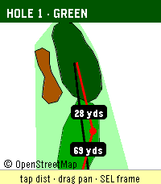</a>

<h2 class="app-name" id="app-57f80ba0bfbe4ad7a44dbbcf"><a href="https://apps.repebble.com/57f80ba0bfbe4ad7a44dbbcf">Pebble Golf</a></h2>
<a class="app-source" href="https://github.com/chrissnyder2337/pebble-golf" title="Source code" data-search-exclude>View source</a>

by <a href="https://apps.repebble.com/apps/dev/chris-snyder_f23977cddca91c4889074295" title="More from this developer">Chris Snyder</a>

Not checked yet v1.7.0 Updated 2026-09-30

Runs on: Round 2, Time 2, Pebble 2 Duo, Pebble 2, Time Round, Time

Pebble Golf turns your watch into a golf rangefinder, digital scorecard, and tap-to-measure course map, all live on your wrist. Supported languages: English, Français, Deutsch, Español, Italiano…

<a class="app-shot" href="https://apps.repebble.com/c27fee0f38424667a861e49a" data-search-exclude>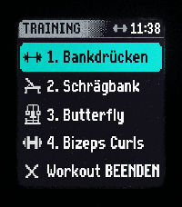</a>

<h2 class="app-name" id="app-c27fee0f38424667a861e49a"><a href="https://apps.repebble.com/c27fee0f38424667a861e49a">Pebble Gym</a></h2>
<a class="app-source" href="https://github.com/sirTob1/pebble-gym-hevy" title="Source code" data-search-exclude>View source</a>

by <a href="https://apps.repebble.com/apps/dev/tob1_482f35c41c8881124fe8662b" title="More from this developer">tob1</a>

Not checked yet v3.8 Updated 2026-08-14

Runs on: Round 2, Time 2, Time Round, Time

Hevy Workout Routine Companion &amp; History Tracker for Pebble Smartwatches NOTE This is a Vibe-Coding project! 🎸✨ Built interactively using advanced agentic AI pair-programming to prototype, test…

<a class="app-shot" href="https://apps.repebble.com/cbdd9cc7fab247d5b9a20d84" data-search-exclude>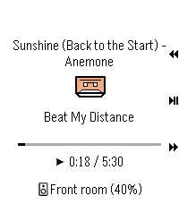</a>

<h2 class="app-name" id="app-cbdd9cc7fab247d5b9a20d84"><a href="https://apps.repebble.com/cbdd9cc7fab247d5b9a20d84">Pebble MA</a></h2>
<a class="app-source" href="https://github.com/vincentezw/pebble-ma" title="Source code" data-search-exclude>View source</a>

by <a href="https://apps.repebble.com/apps/dev/vincent_997a3d2f0b60fba729f7aece" title="More from this developer">Vincent</a>

Not checked yet v2.1.0 Updated 2026-09-04

Runs on: Round 2, Time 2

Pebble Music Assistant client

<a class="app-shot" href="https://apps.repebble.com/3d0ba0e64e5d48bba0a38ef9" data-search-exclude>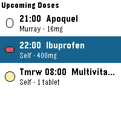</a>

<h2 class="app-name" id="app-3d0ba0e64e5d48bba0a38ef9"><a href="https://apps.repebble.com/3d0ba0e64e5d48bba0a38ef9">Pebble Meds</a></h2>
<a class="app-source" href="https://github.com/bpiehler/PebbleMeds" title="Source code" data-search-exclude>View source</a>

by <a href="https://apps.repebble.com/apps/dev/britt-piehler_c0ec6f37e661ddfe4e620900" title="More from this developer">Britt Piehler</a>

No licence v1.0.5 Updated 2026-07-15

Runs on: Round 2, Time 2, Pebble 2 Duo, Pebble 2, Time Round, Time, Classic

Never miss a dose — for you, your family, or your pets. PebbleMeds delivers quiet, wrist-based medication reminders with simple one-button confirmations. It&#x27;s designed for people managing multiple…

<a class="app-shot" href="https://apps.repebble.com/6a74fe5c49abe2000a25c7f0" data-search-exclude>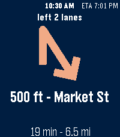</a>

<h2 class="app-name" id="app-6a74fe5c49abe2000a25c7f0"><a href="https://apps.repebble.com/6a74fe5c49abe2000a25c7f0">Pebble Nav HUD</a></h2>
<a class="app-source" href="https://gitlab.com/Ryan-Mooney/pebble-hud-navigation" title="Source code" data-search-exclude>View source</a>

by <a href="https://apps.repebble.com/apps/dev/moondawg_5fb06bdfb0b9e000539df15c" title="More from this developer">Moondawg</a>

Not checked yet v1.11.0 Updated 2026-09-06

Runs on: Round 2, Time 2, Pebble 2 Duo, Pebble 2, Time

Google Maps turn-by-turn directions, on your wrist. REQUIRES a free companion app for Android: https://ryan-mooney.com/pebble-nav-hud Android only. There is no iOS version, because iOS does not…

<a class="app-shot" href="https://apps.rebble.io/en_US/application/666e80ff7568f7000a0b966f" data-search-exclude>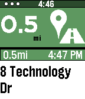</a>

<h2 class="app-name" id="app-666e80ff7568f7000a0b966f"><a href="https://apps.rebble.io/en_US/application/666e80ff7568f7000a0b966f">Pebble Nav Me (2026 Edition)</a></h2>
<a class="app-source" href="https://www.reddit.com/r/pebble/comments/1vy0g25/pebble_nav_me_v158_2026/" title="Source code" data-search-exclude>View source</a>

by <a href="https://apps.rebble.io/en_US/developer/5b6faadba423b9000124ad93/1" title="More from this developer">aviation_hacker</a>

Not checked yet v1.58 Updated 2026-08-25 Rebble App Store

Runs on: Round 2, Time 2, Pebble 2 Duo, Pebble 2, Time Round, Time, Classic

This is an modified version of the Original Pebble Nav Me App made by bates.apps. This version is modified to work with Google Maps Post December 2025, and the listing serves as a means of…

<a class="app-shot" href="https://apps.repebble.com/613a872008144c7eb0404912" data-search-exclude>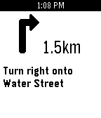</a>

<h2 class="app-name" id="app-613a872008144c7eb0404912"><a href="https://apps.repebble.com/613a872008144c7eb0404912">Pebble Pilot</a></h2>
<a class="app-source" href="https://github.com/matteomiceli/pebble-pilot" title="Source code" data-search-exclude>View source</a>

by <a href="https://apps.repebble.com/apps/dev/matteo-miceli_334a6176a0e49c37a49775c1" title="More from this developer">Matteo Miceli</a>

Not checked yet v0.2 Updated 2026-06-30

Runs on: Time 2, Pebble 2 Duo

A minimal turn-by-turn navigation app. Features - Configurable destination with location auto-complete - Automatic manuever detection - Shows the distance to manuever Setup 1. Setup an…

<a class="app-shot" href="https://apps.repebble.com/63515ba580094bc4af7cf70c" data-search-exclude>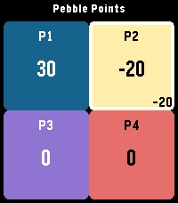</a>

<h2 class="app-name" id="app-63515ba580094bc4af7cf70c"><a href="https://apps.repebble.com/63515ba580094bc4af7cf70c">Pebble Points</a></h2>
<a class="app-source" href="https://github.com/ClickCalickClick/Pebble-Points" title="Source code" data-search-exclude>View source</a>

by <a href="https://apps.repebble.com/apps/dev/clickcalickclick-touchy-weather_703379b8b79fb665a4666945" title="More from this developer">ClickCalickClick (Touchy Weather)</a>

No licence v1.6 Updated 2026-04-10

Runs on: Round 2, Time 2, Pebble 2 Duo, Pebble 2, Time Round, Time, Classic

Pebble Points is a fast, colorful multiplayer score tracker for Pebble watches. Keep score for 2 to 4 players with a layout that adapts to the watch face, clear high-contrast visuals, and simple…

<a class="app-shot" href="https://apps.repebble.com/52bd9778b1ce8e22de000099" data-search-exclude>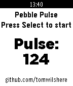</a>

<h2 class="app-name" id="app-52bd9778b1ce8e22de000099"><a href="https://apps.repebble.com/52bd9778b1ce8e22de000099">Pebble Pulse</a></h2>
<a class="app-source" href="http://github.com/tomwilshere/pebblepulse" title="Source code" data-search-exclude>View source</a>

by <a href="https://apps.repebble.com/apps/dev/tom-wilshere_52bbe7b7db136095620000ed" title="More from this developer">Tom Wilshere</a>

No licence v1.0.0 Updated 2013-12-27

Runs on: Time 2, Pebble 2 Duo, Pebble 2, Time, Classic

Quickly, easily and accurately calculate a patient&#x27;s pulse using this handy pebble app. Simply press the button, count 10 beats and press again, the pulse is displayed immediately on the screen.

<a class="app-shot" href="https://apps.repebble.com/542ccf390edc7256750000db" data-search-exclude>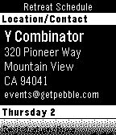</a>

<h2 class="app-name" id="app-542ccf390edc7256750000db"><a href="https://apps.repebble.com/542ccf390edc7256750000db">Pebble Retreat Schedule</a></h2>
<a class="app-source" href="https://github.com/BalestraPatrick/PebbleRetreatSchedule" title="Source code" data-search-exclude>View source</a>

by <a href="https://apps.repebble.com/apps/dev/patrick-balestra_52bca2f1db13600a130001a1" title="More from this developer">Patrick Balestra</a>

No licence v1.1 Updated 2014-10-02

Runs on: Time 2, Pebble 2 Duo, Pebble 2, Time, Classic

The perfect watch app to attend the Pebble Developer Retreat 2014.

<a class="app-shot" href="https://apps.repebble.com/54ad8b9d32203eb1200000b3" data-search-exclude>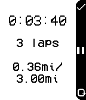</a>

<h2 class="app-name" id="app-54ad8b9d32203eb1200000b3"><a href="https://apps.repebble.com/54ad8b9d32203eb1200000b3">Pebble Runner</a></h2>
<a class="app-source" href="https://github.com/rickyman20/PocketRunnerPebble" title="Source code" data-search-exclude>View source</a>

by <a href="https://apps.repebble.com/apps/dev/rickyman20_52cdcc33ad26b45b09000013" title="More from this developer">rickyman20</a>

Not checked yet v1.0 Updated 2015-01-07

Runs on: Time 2, Pebble 2 Duo, Pebble 2, Time, Classic

NOTE: THIS APP IS ONLY COMPATIBLE WITH ANDROID A simple app for all your lap-keeping needs! This watch app lets you keep a track-record of your runs, by acting much like a chronometer. The run…

<a class="app-shot" href="https://apps.repebble.com/55370164fa195b7afb00001f" data-search-exclude>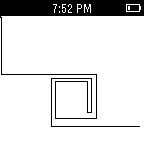</a>

<h2 class="app-name" id="app-55370164fa195b7afb00001f"><a href="https://apps.repebble.com/55370164fa195b7afb00001f">Pebble Sketch</a></h2>
<a class="app-source" href="https://github.com/jpfeiffer16/pebble-etch" title="Source code" data-search-exclude>View source</a>

by <a href="https://apps.repebble.com/apps/dev/joe-pfeiffer_552943de006da01f1d000030" title="More from this developer">Joe Pfeiffer</a>

Not checked yet v1.1 Updated 2015-04-24

Runs on: Time 2, Pebble 2 Duo, Pebble 2, Time, Classic

A simple Etch-A-Sketch like watch app for Pebble

<a class="app-shot" href="https://apps.repebble.com/557824714f8d9860dc00001b" data-search-exclude>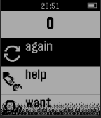</a>

<h2 class="app-name" id="app-557824714f8d9860dc00001b"><a href="https://apps.repebble.com/557824714f8d9860dc00001b">Pebble Speak Easy AAC App</a></h2>
<a class="app-source" href="https://github.com/Utsav2/PebbleAndroid" title="Source code" data-search-exclude>View source</a>

by <a href="https://apps.repebble.com/apps/dev/uiuc-bioengineering_5542a00380f0ad0d610000bc" title="More from this developer">UIUC Bioengineering</a>

No licence v1.0 Updated 2015-06-19

Runs on: Time 2, Pebble 2 Duo, Pebble 2, Time, Classic

Pebble Speak Easy is an AAC App designed to make communication simple and customizable. The purpose of this app is to enable easy, quick, and human communication with loved ones. The speaker wears…

<a class="app-shot" href="https://apps.repebble.com/84d17b57b0aa48ce8813659b" data-search-exclude>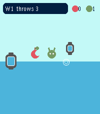</a>

<h2 class="app-name" id="app-84d17b57b0aa48ce8813659b"><a href="https://apps.repebble.com/84d17b57b0aa48ce8813659b">Pebble Throw</a></h2>
<a class="app-source" href="https://github.com/dhrme/pebble-apps" title="Source code" data-search-exclude>View source</a>

by <a href="https://apps.repebble.com/apps/dev/dhrme_069a96fda19388b2bd028bfa" title="More from this developer">dhrme</a>

Not checked yet v1.0.0 Updated 2026-06-25

Runs on: Time 2

The Pebble Throw rescues the world against evil fruit and robots. Ahem.

<a class="app-shot" href="https://apps.repebble.com/de7fc2dccd464e299badc6c0" data-search-exclude>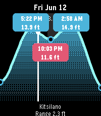</a>

<h2 class="app-name" id="app-de7fc2dccd464e299badc6c0"><a href="https://apps.repebble.com/de7fc2dccd464e299badc6c0">Pebble Tides</a></h2>
<a class="app-source" href="https://github.com/gli-james-roland/pebble-tide" title="Source code" data-search-exclude>View source</a>

by <a href="https://apps.repebble.com/apps/dev/james-roland_74b1dca27068ad03cb37e37d" title="More from this developer">James Roland</a>

Not checked yet v1.0.10 Updated 2026-07-03

Runs on: Round 2, Time 2, Pebble 2 Duo, Pebble 2, Time Round, Time, Classic

Pebble Tides shows the day&#x27;s tides at a glance: a graph of the high and low tides with their exact times and heights, the current water level, whether the tide is rising or falling, and optional…

<a class="app-shot" href="https://apps.repebble.com/53a705f969f1e6bd040001e4" data-search-exclude>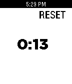</a>

<h2 class="app-name" id="app-53a705f969f1e6bd040001e4"><a href="https://apps.repebble.com/53a705f969f1e6bd040001e4">Pebble timer</a></h2>
<a class="app-source" href="https://github.com/lorenlugosch/pebble_stopwatch" title="Source code" data-search-exclude>View source</a>

by <a href="https://apps.repebble.com/apps/dev/josh-evans_52fba17f4c38ceaa1d000588" title="More from this developer">Josh Evans</a>

Not checked yet v1.0 Updated 2014-06-22

Runs on: Time 2, Pebble 2 Duo, Pebble 2, Time, Classic

A simple stopwatch for your wrist

<a class="app-shot" href="https://apps.repebble.com/554f0a794e604bb48200000f" data-search-exclude>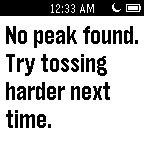</a>

<h2 class="app-name" id="app-554f0a794e604bb48200000f"><a href="https://apps.repebble.com/554f0a794e604bb48200000f">Pebble Toss</a></h2>
<a class="app-source" href="https://github.com/stevenpovlitz/PebbleTrial" title="Source code" data-search-exclude>View source</a>

by <a href="https://apps.repebble.com/apps/dev/steven-povlitz_551f992a51d7431fe2000006" title="More from this developer">Steven Povlitz</a>

Not checked yet v0.9 Updated 2015-05-10

Runs on: Time 2, Pebble 2 Duo, Pebble 2, Time, Classic

How high can you throw your watch? Step 1: Toss skyward. Step 2: Catch watch. Step 3: Marvel at height thrown. Pebble toss calculates how high a watch is thrown vertically using accelerometer data.

<a class="app-shot" href="https://apps.rebble.io/en_US/application/62304a7d2a976b000a6e73df" data-search-exclude>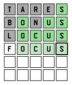</a>

<h2 class="app-name" id="app-62304a7d2a976b000a6e73df"><a href="https://apps.rebble.io/en_US/application/62304a7d2a976b000a6e73df">Pebble Wordle</a></h2>
<a class="app-source" href="https://github.com/Katharine/pebble-wordle" title="Source code" data-search-exclude>View source</a>

by <a href="https://apps.rebble.io/en_US/developer/52b6e8a9f21b2c24ef000014/1" title="More from this developer">Katharine Berry</a>

MIT v1.3 Updated 2022-05-27 Rebble App Store

Runs on: Time 2, Pebble 2 Duo, Pebble 2, Time, Classic

Full featured Wordle on your Pebble! - Uses the same word each day as the New York Times&#x27; Wordle! - Saves your work when you leave the app. - Tracks your gameplay stats - streak, guess…

<a class="app-shot" href="https://apps.rebble.io/en_US/application/69f5d27a8bb70b00099fc067" data-search-exclude>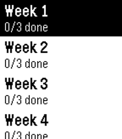</a>

<h2 class="app-name" id="app-69f5d27a8bb70b00099fc067"><a href="https://apps.rebble.io/en_US/application/69f5d27a8bb70b00099fc067">pebble-c25k</a></h2>
<a class="app-source" href="https://github.com/Wyoc/pebble-c25k" title="Source code" data-search-exclude>View source</a>

by <a href="https://apps.rebble.io/en_US/developer/56327d227d13f9d558000078/1" title="More from this developer">Wyoc</a>

No licence v1.1.1 Updated 2026-05-02 Rebble App Store

Runs on: Round 2, Time 2, Pebble 2 Duo, Pebble 2, Time Round, Time, Classic

A pebble 2 C25K watchapp

<a class="app-shot" href="https://apps.repebble.com/531bafa016c197909a0002f0" data-search-exclude>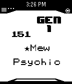</a>

<h2 class="app-name" id="app-531bafa016c197909a0002f0"><a href="https://apps.repebble.com/531bafa016c197909a0002f0">Pebble-Dex</a></h2>
<a class="app-source" href="https://github.com/DKote/Pebble-Dex" title="Source code" data-search-exclude>View source</a>

by <a href="https://apps.repebble.com/apps/dev/dakota-kryzanowski_5317b97f291eff82d900021d" title="More from this developer">Dakota Kryzanowski</a>

No licence v2.0.0 Updated 2014-03-09

Runs on: Time 2, Pebble 2 Duo, Pebble 2, Time, Classic

NOTE: No Update Soon Pebble-Dex is a update of Pokedex Kanto developed by Shutdown27! Base Code From Shutdown27! Controls: Up button to move up by 1 Down button to move down by 1 Press Middle…

<a class="app-shot" href="https://apps.repebble.com/e274ceede0b440fd8045ad7b" data-search-exclude>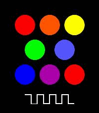</a>

<h2 class="app-name" id="app-e274ceede0b440fd8045ad7b"><a href="https://apps.repebble.com/e274ceede0b440fd8045ad7b">PEBBLE-TONE</a></h2>
<a class="app-source" href="https://github.com/shikarunochi/PebbleTone" title="Source code" data-search-exclude>View source</a>

by <a href="https://apps.repebble.com/apps/dev/nochi-shikarunochi_3ecb25cb217534d4bbc7e9c2" title="More from this developer">Nochi Shikarunochi</a>

Not checked yet v1.7 Updated 2026-05-03

Runs on: Time 2

A simple piano app for Pebble Time 2. You can play one octave of notes.

<h2 class="app-name" id="app-5337460457418e3bd600007d"><a href="https://apps.repebble.com/5337460457418e3bd600007d">Pebble2048</a></h2>
<a class="app-source" href="https://github.com/elvinyung/Pebble2048" title="Source code" data-search-exclude>View source</a>

by <a href="https://apps.repebble.com/apps/dev/elvin-yung_533743d90c987fbffe000099" title="More from this developer">Elvin Yung</a>

Not checked yet v1.0.0 Updated 2014-03-29

Runs on: Time 2, Pebble 2 Duo, Pebble 2, Time, Classic

An adaptation of 2048 on the Pebble Smartwatch showcasing various features of the Pebble SDK.

<a class="app-shot" href="https://apps.repebble.com/4015983bf15545d6ad50803b" data-search-exclude>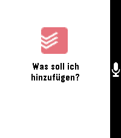</a>

<h2 class="app-name" id="app-4015983bf15545d6ad50803b"><a href="https://apps.repebble.com/4015983bf15545d6ad50803b">pebble2todoist</a></h2>
<a class="app-source" href="https://github.com/flecmart/pebble2todoist" title="Source code" data-search-exclude>View source</a>

by <a href="https://apps.repebble.com/apps/dev/flecmart_56b2a154d47512b8de5ebcdd" title="More from this developer">Flecmart</a>

Not checked yet v1.0.0 Updated 2026-06-18

Runs on: Round 2, Time 2, Pebble 2 Duo, Pebble 2, Time Round, Time, Classic

A Pebble watchapp that adds tasks to Todoist using your voice. Press SELECT, speak a command, and the task appears in your Todoist project — or in your Inbox with a &quot;today&quot; due date so it never…

<a class="app-shot" href="https://apps.repebble.com/64853961143b6504611fbc06" data-search-exclude>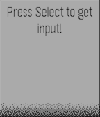</a>

<h2 class="app-name" id="app-64853961143b6504611fbc06"><a href="https://apps.repebble.com/64853961143b6504611fbc06">PebbleAI</a></h2>
<a class="app-source" href="https://github.com/huntboom/PebbleAI" title="Source code" data-search-exclude>View source</a>

by <a href="https://apps.repebble.com/apps/dev/huntboom_63590f2e40d3e00007cf6169" title="More from this developer">huntboom</a>

Not checked yet v2.2 Updated 2025-09-22

Runs on: Round 2, Time 2, Pebble 2 Duo, Pebble 2, Time Round, Time

ChatGPT, Gemini, DeepSeek, Grok or Claude for the Pebble Time! This app takes your voice message and displays a response from the AI assistant of your choice using their API. Requires an API key…

<a class="app-shot" href="https://apps.repebble.com/7996ad2f480d4549b3996f58" data-search-exclude>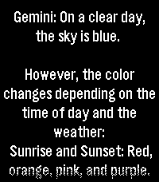</a>

<h2 class="app-name" id="app-7996ad2f480d4549b3996f58"><a href="https://apps.repebble.com/7996ad2f480d4549b3996f58">PebbleAI+</a></h2>
<a class="app-source" href="https://github.com/JagerSprinkles/PebbleAI-Plus" title="Source code" data-search-exclude>View source</a>

by <a href="https://apps.repebble.com/apps/dev/chronometric-second-hand_18c1392aeb0a87662b1c8517" title="More from this developer">Chronometric Second-Hand</a>

MIT v1.0.1 Updated 2026-10-03

Runs on: Round 2, Time 2, Pebble 2 Duo, Pebble 2, Time Round, Time

PebbleAI-Plus is a resource-aware fork of PebbleAI. It keeps the same idea of the original PebbleAI, access to ChatGPT, Gemini, DeepSeek, Grok, or Claude on your Pebble but with a focus on smooth…

<a class="app-shot" href="https://apps.repebble.com/7a641809d43a4acf813fdea5" data-search-exclude>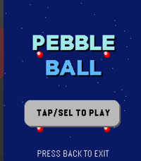</a>

<h2 class="app-name" id="app-7a641809d43a4acf813fdea5"><a href="https://apps.repebble.com/7a641809d43a4acf813fdea5">PebbleBall</a></h2>
<a class="app-source" href="https://github.com/Andrew129260/PebbleBall" title="Source code" data-search-exclude>View source</a>

by <a href="https://apps.repebble.com/apps/dev/andrew129260_d443835b77205f3b7e2f01c9" title="More from this developer">Andrew129260</a>

GPL-3.0 v2.1 Updated 2026-09-23

Runs on: Time 2

This is a Jezzball clone for the pebble time 2! The classic windows game on your wrist! With touch support! Your goal is to trap all the balls in the smallest boxes that you can. Give it a try!

<a class="app-shot" href="https://apps.repebble.com/53820c69ad57fd7a430000c9" data-search-exclude>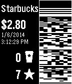</a>

<h2 class="app-name" id="app-53820c69ad57fd7a430000c9"><a href="https://apps.repebble.com/53820c69ad57fd7a430000c9">PebbleBucksE</a></h2>
<a class="app-source" href="https://github.com/esw148/PebbleBucks" title="Source code" data-search-exclude>View source</a>

by <a href="https://apps.repebble.com/apps/dev/eric-wood_52f17df0f216769cb900040a" title="More from this developer">Eric Wood</a>

Not checked yet v1.0.1 Updated 2014-05-25

Runs on: Time 2, Pebble 2 Duo, Pebble 2, Time, Classic

This lets you pay for Starbucks using your watch. You can also view your balance and rewards information. (This is based on the 2.0.1 version of the PebbleBucks app by Alexsander Akers. His 3.0…

<a class="app-shot" href="https://apps.repebble.com/08e04f5944424a97977d9f57" data-search-exclude>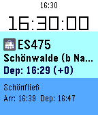</a>

<h2 class="app-name" id="app-08e04f5944424a97977d9f57"><a href="https://apps.repebble.com/08e04f5944424a97977d9f57">PebbleConduct - Pebble App For Train Conductors</a></h2>
<a class="app-source" href="https://github.com/meyskens/PebbleConduct" title="Source code" data-search-exclude>View source</a>

by <a href="https://apps.repebble.com/apps/dev/maartje-eyskens_34c02825342440b7eebba982" title="More from this developer">Maartje Eyskens</a>

Not checked yet v1.0.5 Updated 2026-06-29

Runs on: Round 2, Time 2, Pebble 2 Duo, Pebble 2, Time Round, Time, Classic

PebbleConduct is a Pebble watch app designed with professional train use in mind. It will provide you real time information about your train wherever you are.

<h2 class="app-name" id="app-d529bfb1bcb14e369c9ac112"><a href="https://apps.repebble.com/d529bfb1bcb14e369c9ac112">PebbleDiver</a></h2>
<a class="app-source" href="https://github.com/mrtruebeliever/PebbleDiver" title="Source code" data-search-exclude>View source</a>

by <a href="https://apps.repebble.com/apps/dev/mrtruebeliever_5f8814a92a6f109602136f61" title="More from this developer">mrTrueBeliever</a>

Not checked yet v1.1.0 Updated 2026-08-13

Runs on: Time 2

A one-button deep-sea dive. Hold to swim up, let go to sink. Dodge rocks and jellyfish, grab pearls and air, upgrade your gear, and dive as deep as you dare. PebbleDiver is a one-button arcade…

<h2 class="app-name" id="app-62a96010e98448ebaaa647fb"><a href="https://apps.repebble.com/62a96010e98448ebaaa647fb">PebbleDoist</a></h2>
<a class="app-source" href="https://github.com/mrtruebeliever/PebbleDoist" title="Source code" data-search-exclude>View source</a>

by <a href="https://apps.repebble.com/apps/dev/mrtruebeliever_5f8814a92a6f109602136f61" title="More from this developer">mrTrueBeliever</a>

Not checked yet v1.6.0 Updated 2026-08-18

Runs on: Time 2

Your Todoist tasks on your wrist — add them by voice. Browse Todoist by list, label or Today, read details and subtasks, tick tasks off, and dictate new ones. Touch on PT2. 5 languages…

<h2 class="app-name" id="app-52d1e4e4c44c04959200000b"><a href="https://apps.repebble.com/52d1e4e4c44c04959200000b">PebbleDoro</a></h2>
<a class="app-source" href="https://github.com/mertdikmen/pebbledoro" title="Source code" data-search-exclude>View source</a>

by <a href="https://apps.repebble.com/apps/dev/mert_52c78f3d116f1596b1000015" title="More from this developer">Mert</a>

Not checked yet v1.0.1 Updated 2014-01-26

Runs on: Time 2, Pebble 2 Duo, Pebble 2, Time, Classic

Pomodoro Timer for Pebble

<h2 class="app-name" id="app-55625d08fd8f4b8c140000cc"><a href="https://apps.repebble.com/55625d08fd8f4b8c140000cc">PebbleFlix</a></h2>
<a class="app-source" href="https://github.com/octalmage/PebbleFlix" title="Source code" data-search-exclude>View source</a>

by <a href="https://apps.repebble.com/apps/dev/jason-stallings_52fbbd3732b7167e98000604" title="More from this developer">Jason Stallings</a>

Not checked yet v0.1 Updated 2015-05-25

Runs on: Time 2, Pebble 2 Duo, Pebble 2, Time, Classic

PebbleFlix allows you to control Netflix on your Mac. Just install and run the server app on your Mac, open PebbleFlix on your watch, then you can pause, play, and adjust the volume. To download…

<h2 class="app-name" id="app-5395fc78c500b46a5b000010"><a href="https://apps.repebble.com/5395fc78c500b46a5b000010">PebbleForce Dashboard for Salesforce</a></h2>
<a class="app-source" href="https://github.com/developerforce/WearablePack-Pebble" title="Source code" data-search-exclude>View source</a>

by <a href="https://apps.repebble.com/apps/dev/danhca_530673457f35766a670004cb" title="More from this developer">DanHca</a>

Not checked yet v1.1 Updated 2014-06-10

Runs on: Time 2, Pebble 2 Duo, Pebble 2, Time, Classic

Salesforce1 Pebble Dashboard This is an application that can connect to any Salesforce Instance and securely display the totals from your reports on your Pebble using iOS. You simply need to set…

<h2 class="app-name" id="app-541e31e4c52901a0a300003b"><a href="https://apps.repebble.com/541e31e4c52901a0a300003b">PebbleForce for Salesforce</a></h2>
<a class="app-source" href="https://github.com/DanHca/PebbleForce" title="Source code" data-search-exclude>View source</a>

by <a href="https://apps.repebble.com/apps/dev/danhca_530673457f35766a670004cb" title="More from this developer">DanHca</a>

No licence v1.1 Updated 2014-09-27

Runs on: Time 2, Pebble 2 Duo, Pebble 2, Time, Classic

Display information from Salesforce, post to Chatter, or create a Case using your own menu structure without any code. Used in conjunction with the Salesforce AppExchange component to easily…

<h2 class="app-name" id="app-52d714aaaf3794159d000006"><a href="https://apps.repebble.com/52d714aaaf3794159d000006">PebbleFormulas</a></h2>
<a class="app-source" href="https://github.com/blackpaw78/PebbleFormulas" title="Source code" data-search-exclude>View source</a>

by <a href="https://apps.repebble.com/apps/dev/devin-simmons_52d70618af37946a7b000001" title="More from this developer">Devin Simmons</a>

Unlicense v1.1.8 Updated 2014-02-03

Runs on: Time 2, Pebble 2 Duo, Pebble 2, Time, Classic

A quick convenient way to access many formulas for Algebra, Geometry, Trigonometry, Calculus, Biology, Chemistry, Physics, Electricity, and Conversions. Updates will be common, adding new…

<h2 class="app-name" id="app-52efed1b4ae3636d4c00000d"><a href="https://apps.repebble.com/52efed1b4ae3636d4c00000d">PebbleFormulas Portuguese</a></h2>
<a class="app-source" href="https://github.com/blackpaw78/PebbleFormulasPortuguese" title="Source code" data-search-exclude>View source</a>

by <a href="https://apps.repebble.com/apps/dev/devin-simmons_52d70618af37946a7b000001" title="More from this developer">Devin Simmons</a>

No licence v1.1.8 Updated 2014-02-03

Runs on: Time 2, Pebble 2 Duo, Pebble 2, Time, Classic

PebbleFormulas agora em portruguese! Uma maneira rápida conveniente de acessar muitas fórmulas para álgebra, geometria, trigonometria, cálculo, Biologia, Física, Química, conversões e…

<h2 class="app-name" id="app-53960f64261143288500011f"><a href="https://apps.repebble.com/53960f64261143288500011f">PebbleGL 3D</a></h2>
<a class="app-source" href="https://github.com/mhungerford/PebbleGL" title="Source code" data-search-exclude>View source</a>

by <a href="https://apps.repebble.com/apps/dev/matthew-hungerford_52bca741d438930a650001b6" title="More from this developer">Matthew Hungerford</a>

Not checked yet v1.0.0 Updated 2014-07-21

Runs on: Time 2, Pebble 2 Duo, Pebble 2, Time, Classic

OpenGL for Pebble. Provides minimal OpenGL 1.1 engine for rendering 3D graphics. Renders STL models in both wireframe and filled with positional lighting sources. Top button changes angle, middle…

<h2 class="app-name" id="app-399b6a126b314717818cbcee"><a href="https://apps.repebble.com/399b6a126b314717818cbcee">Pebblegotchi</a></h2>
<a class="app-source" href="https://github.com/walkerdeath/Pebblegotchi" title="Source code" data-search-exclude>View source</a>

by <a href="https://apps.repebble.com/apps/dev/walkerdeath_29e02d6aeb82b422cdf9b7ba" title="More from this developer">Walkerdeath</a>

Not checked yet v1.0 Updated 2026-04-06

Runs on: Time 2, Pebble 2 Duo, Pebble 2, Time

Feed, clean, play, and meditate with a tiny wrist pet. A daily ritual that revives pixel‑era nostalgia and turns small habits into a warm, retro moment.

<h2 class="app-name" id="app-3f9cfd3aefd84e59a0128849"><a href="https://apps.repebble.com/3f9cfd3aefd84e59a0128849">Pebblegram</a></h2>
<a class="app-source" href="https://github.com/TomBolger/Pebblegram" title="Source code" data-search-exclude>View source</a>

by <a href="https://apps.repebble.com/apps/dev/tombolger_0e985d2ac18230a88bcbe6b8" title="More from this developer">TomBolger</a>

No licence v3.5.0 Updated 2026-06-10

Runs on: Round 2, Time 2, Pebble 2 Duo, Pebble 2, Time

A Telegram client for Pebble. Currently relies on a service that runs on a computer and requires some setup, and that service needs to be running for the app to work. All data and access is…

<h2 class="app-name" id="app-54694ee5bfc6a28d0300004f"><a href="https://apps.repebble.com/54694ee5bfc6a28d0300004f">PebbleGRT</a></h2>
<a class="app-source" href="https://github.com/mvanderh/PebbleGRT/" title="Source code" data-search-exclude>View source</a>

by <a href="https://apps.repebble.com/apps/dev/mitchell-van-der-hoeff_545fac88f520d9d228000086" title="More from this developer">Mitchell Van Der Hoeff</a>

Not checked yet v0.3 Updated 2014-11-23

Runs on: Time 2, Pebble 2 Duo, Pebble 2, Time, Classic

Check real time bus times and distances for GRT in the Kitchener/Waterloo area! - Click on a Nearby Bus to see Delay and Upcoming Stops - Click on a Nearby Stop to see Upcoming Buses

<h2 class="app-name" id="app-bef8e6181d804c4aaa40c482"><a href="https://apps.repebble.com/bef8e6181d804c4aaa40c482">pebblek</a></h2>
<a class="app-source" href="https://github.com/iuriaranda/pebblek" title="Source code" data-search-exclude>View source</a>

by <a href="https://apps.repebble.com/apps/dev/iuri-a_a1f82895eeb60348595af897" title="More from this developer">Iuri A.</a>

Not checked yet v0.1.0 Updated 2026-07-02

Runs on: Round 2, Time 2

PebbleK — SignalK boat monitor &amp; autopilot remote PebbleK turns your Pebble into a glanceable helm display and autopilot remote for boats running a SignalK server. Leave the phone in your pocket…

<h2 class="app-name" id="app-4ab5c72a6eb74d5581ebcf6d"><a href="https://apps.repebble.com/4ab5c72a6eb74d5581ebcf6d">PebbleKimai</a></h2>
<a class="app-source" href="https://github.com/mrtruebeliever/PebbleKimai" title="Source code" data-search-exclude>View source</a>

by <a href="https://apps.repebble.com/apps/dev/mrtruebeliever_5f8814a92a6f109602136f61" title="More from this developer">mrTrueBeliever</a>

Not checked yet v2.8.1 Updated 2026-08-18

Runs on: Round 2, Time 2, Pebble 2 Duo, Pebble 2, Time Round, Time, Classic

Track your time in Kimai, straight from your wrist. Start, stop and switch Kimai time tracking from your Pebble. Recent activities in one press. Touch on PT2. 5 languages. PebbleKimai puts your…

<h2 class="app-name" id="app-81a2a1cef20f45b4935929e7"><a href="https://apps.repebble.com/81a2a1cef20f45b4935929e7">PebbleKuma</a></h2>
<a class="app-source" href="https://github.com/mrtruebeliever/PebbleKuma" title="Source code" data-search-exclude>View source</a>

by <a href="https://apps.repebble.com/apps/dev/mrtruebeliever_5f8814a92a6f109602136f61" title="More from this developer">mrTrueBeliever</a>

Not checked yet v1.2.0 Updated 2026-08-13

Runs on: Time 2

PebbleKuma brings your Uptime Kuma status pages to your Pebble Time 2. Browse a clean list of your monitors at a glance, a colored dot tells you what&#x27;s up, down, in maintenance, or pending, with…

<h2 class="app-name" id="app-53a9a197990481964a000245"><a href="https://apps.repebble.com/53a9a197990481964a000245">PebbleLock</a></h2>
<a class="app-source" href="https://github.com/soothslayer/PebbleLock" title="Source code" data-search-exclude>View source</a>

by <a href="https://apps.repebble.com/apps/dev/hanlon_52b87d409efe580877000036" title="More from this developer">Hanlon</a>

Not checked yet v2.0 Updated 2014-10-26

Runs on: Time 2, Pebble 2 Duo, Pebble 2, Time, Classic

Use your Pebble to lock/unlock your Lockitron door lock. (After downloading be sure to go to Settings for PebbleLock within the Pebble app and log into Lockitron.com).

<h2 class="app-name" id="app-c1696238887342beb6459e8d"><a href="https://apps.repebble.com/c1696238887342beb6459e8d">PebbleMetro</a></h2>
<a class="app-source" href="https://github.com/audietron171/pebblemetro" title="Source code" data-search-exclude>View source</a>

by <a href="https://apps.repebble.com/apps/dev/audietron171_091e5b5a39f202c65ef4b4bd" title="More from this developer">audietron171</a>

No licence v2.0.5 Updated 2026-08-14

Runs on: Time 2, Pebble 2 Duo, Pebble 2, Time, Classic

PebbleMetro is a simple watch-app that allows you to display upcoming departures from your favourite stops using the Melbourne PTV API. Support’s all stops supported by the API including metro…

<h2 class="app-name" id="app-60ec78db1342ae0152f9a409"><a href="https://apps.repebble.com/60ec78db1342ae0152f9a409">Pebblemon</a></h2>
<a class="app-source" href="https://github.com/HarrisonAllen/pebble-gbc-graphics-demo" title="Source code" data-search-exclude>View source</a>

by <a href="https://apps.repebble.com/apps/dev/harrison-allen_5e28ea923dd3109f151c7e08" title="More from this developer">Harrison Allen</a>

MIT v2.1.2 Updated 2026-06-18

Runs on: Round 2, Time 2, Pebble 2 Duo, Pebble 2, Time Round, Time

Pebblemon! A mini Pokemon adventure on your wrist. Explore various areas within the Johto region. Encounter all 251 Pokemon from the Game Boy Color games. Level up and unlock 22 different sprites!…

<h2 class="app-name" id="app-67cd9987d2acb302d5ba822e"><a href="https://apps.repebble.com/67cd9987d2acb302d5ba822e">Pebblemon Lite</a></h2>
<a class="app-source" href="https://github.com/HarrisonAllen/pebble-gbc-graphics-demo/tree/master/pebblemon-lite" title="Source code" data-search-exclude>View source</a>

by <a href="https://apps.repebble.com/apps/dev/harrison-allen_5e28ea923dd3109f151c7e08" title="More from this developer">Harrison Allen</a>

MIT v1.0 Updated 2025-03-09

Runs on: Time 2, Pebble 2 Duo, Pebble 2, Time, Classic

Pebblemon Lite! A bite-sized Pokemon adventure on your wrist. Pebblemon finally comes to the Pebble Classic and Pebble Steel! It&#x27;s a much smaller experience than the original Pebblemon, but you…

<h2 class="app-name" id="app-ad4971e345854b909b73b1a9"><a href="https://apps.repebble.com/ad4971e345854b909b73b1a9">PebbleNTN - Maps Nav Notification To Navigation</a></h2>
<a class="app-source" href="https://github.com/optio/PebbleNTN" title="Source code" data-search-exclude>View source</a>

by <a href="https://apps.repebble.com/apps/dev/sacha_d20b893110bbd447f8a8a554" title="More from this developer">Sacha</a>

Not checked yet v0.0.49 Updated 2026-10-03

Runs on: Round 2, Time 2, Pebble 2 Duo, Pebble 2, Time Round, Time, Classic

Turn-by-turn directions from your phone&#x27;s nav app, on your pebble. PebbleNTN reads your navigation app&#x27;s notifications and shows the next turn, distance, road, and ETA on your Pebble. No need to…

<h2 class="app-name" id="app-58e5474f6ca387fc52000a3f"><a href="https://apps.rebble.io/en_US/application/58e5474f6ca387fc52000a3f">PebblePATH</a></h2>
<a class="app-source" href="https://github.com/djlevine/PebblePATH" title="Source code" data-search-exclude>View source</a>

by <a href="https://apps.rebble.io/en_US/developer/54106f95816f735f200001ba/1" title="More from this developer">DLevine.us</a>

Not checked yet v0.72 Updated 2017-04-21 Rebble App Store

Runs on: Round 2, Time 2, Pebble 2 Duo, Pebble 2, Time Round, Time, Classic

Provides train times at specified intervals for all PATH train lines Choose the direction you want to travel and your current location to receive upcoming train times.

<h2 class="app-name" id="app-53cec3433967e94f5500000b"><a href="https://apps.repebble.com/53cec3433967e94f5500000b">PebblePoint</a></h2>
<a class="app-source" href="https://github.com/rjacoby/pebblepoint" title="Source code" data-search-exclude>View source</a>

by <a href="https://apps.repebble.com/apps/dev/rafi-jacoby_52f07e62a0cb6abe6d001d4d" title="More from this developer">Rafi Jacoby</a>

Not checked yet v1.0 Updated 2014-07-22

Runs on: Time 2, Pebble 2 Duo, Pebble 2, Time, Classic

Control Microsoft PowerPoint on Mac OS X from your Pebble! Use the buttons to go to next/previous slides, or press and hold for last/first. Requires: - Mac OS X - Microsoft PowerPoint Download and…

<h2 class="app-name" id="app-52b961505dfb6ed2b400005d"><a href="https://apps.repebble.com/52b961505dfb6ed2b400005d">PebblePong</a></h2>
<a class="app-source" href="https://github.com/kije/PebblePong-2" title="Source code" data-search-exclude>View source</a>

by <a href="https://apps.repebble.com/apps/dev/kije-dev_52b953e7fd4763c452000066" title="More from this developer">kije-dev</a>

Not checked yet v2.0.2 Updated 2014-01-18

Runs on: Time 2, Pebble 2 Duo, Pebble 2, Time, Classic

Pong for Pebble Now with accelerometer support. Simply control your paddle by turning your wrist. To reset the calibration of the accelerometer during the game, press the select (middle) button on…

<h2 class="app-name" id="app-52d6a7307b4f9ad65300000c"><a href="https://apps.repebble.com/52d6a7307b4f9ad65300000c">PebbleQuest</a></h2>
<a class="app-source" href="https://github.com/theDrake/pebblequest" title="Source code" data-search-exclude>View source</a>

by <a href="https://apps.repebble.com/apps/dev/david-c-drake_52a967dbc0ca9380d8000046" title="More from this developer">David C. Drake</a>

Not checked yet v1.4 Updated 2016-01-18

Runs on: Time 2, Time

A 3D fantasy action-RPG! Explore dungeons, slay monsters, level up, and wield Pebbles of Power to cast spells or enchant your weapons and armor. How long will you last in the dark, cavernous…

<h2 class="app-name" id="app-67a8c311b5e348000915b07b"><a href="https://apps.repebble.com/67a8c311b5e348000915b07b">PebbleRail</a></h2>
<a class="app-source" href="https://github.com/jccit/pebblerail" title="Source code" data-search-exclude>View source</a>

by <a href="https://apps.repebble.com/apps/dev/jcit_542040a2d6b6c950fa000132" title="More from this developer">jcit</a>

Not checked yet v0.9 Updated 2025-12-15

Runs on: Round 2, Time 2, Pebble 2 Duo, Pebble 2, Time Round, Time, Classic

View live UK train times from your Pebble! Features: * View departures from nearby stations * See upcoming and previous stops * Pin departure/arrival to the timeline Timeline icons by LCP Powered…

<h2 class="app-name" id="app-afcad232b3cd40398cbb0c04"><a href="https://apps.repebble.com/afcad232b3cd40398cbb0c04">PebbleRecorder</a></h2>
<a class="app-source" href="https://github.com/BigWebstas/PebbleRecorder" title="Source code" data-search-exclude>View source</a>

by <a href="https://apps.repebble.com/apps/dev/webstas-webstas_990614069b2a89f2e0c44e8b" title="More from this developer">Webstas “Webstas”</a>

GPL-3.0 v1.0.3 Updated 2026-08-29

Runs on: Round 2, Time 2, Pebble 2 Duo, Pebble 2, Time Round, Time, Classic

Turn your Pebble watch into a remote start/stop trigger for audio recording on your phone. Press a button on the watch, and a companion Android app records straight to a folder you choose — no…

<h2 class="app-name" id="app-8e3da086c3734552b0f0bcb7"><a href="https://apps.repebble.com/8e3da086c3734552b0f0bcb7">Pebbles on the Street</a></h2>
<a class="app-source" href="https://github.com/illright/pebble-streetcomplete" title="Source code" data-search-exclude>View source</a>

by <a href="https://apps.repebble.com/apps/dev/lev-c_0c67058526953d84480eb6eb" title="More from this developer">Lev C</a>

Not checked yet v0.5 Updated 2026-04-19

Runs on: Round 2, Time 2, Pebble 2 Duo, Pebble 2, Time Round, Time, Classic

The Pebble version of a popular on-the-go editor for OpenStreetMap — StreetComplete! Not affiliated with StreetComplete itself (yet 😛). This app lets you improve public maps by completing quick…

<h2 class="app-name" id="app-255715276bde48f1bcf59a80"><a href="https://apps.repebble.com/255715276bde48f1bcf59a80">PebbleSky Detail</a></h2>
<a class="app-source" href="https://github.com/dbortz/PebbleSky" title="Source code" data-search-exclude>View source</a>

by <a href="https://apps.repebble.com/apps/dev/dave-bortz_a5ed2ca64fa47426fc50360e" title="More from this developer">Dave Bortz</a>

Not checked yet v1.2.0 Updated 2026-06-09

Runs on: Time 2

Companion for the PebbleSky watchface: 2-hour precipitation detail, 5-day forecast, and current conditions.

<h2 class="app-name" id="app-5542ef13a7a3a66ee500002a"><a href="https://apps.repebble.com/5542ef13a7a3a66ee500002a">PebbleSOS</a></h2>
<a class="app-source" href="https://github.com/Uberi/PebbleSOS" title="Source code" data-search-exclude>View source</a>

by <a href="https://apps.repebble.com/apps/dev/az_541cbd8d8de571cb4800001c" title="More from this developer">AZ</a>

MIT v1.0 Updated 2015-05-01

Runs on: Time 2, Pebble 2 Duo, Pebble 2, Time, Classic

====== IMPORTANT ====== THE COMPANION APP FOR iOS IS CURRENTLY PENDING APPROVAL, AND IS EXPECTED TO RELEASE AROUND MAY 14TH. THE COMPANION APP IS REQUIRED FOR POSTING MESSAGES. ====== IMPORTANT…

<h2 class="app-name" id="app-23692844dacf4630bbd80f96"><a href="https://apps.repebble.com/23692844dacf4630bbd80f96">PebbleTalk</a></h2>
<a class="app-source" href="https://github.com/neonfire42/pebbletalk" title="Source code" data-search-exclude>View source</a>

by <a href="https://apps.repebble.com/apps/dev/neonfire_eb9220b4f504a68bcfd99cec" title="More from this developer">Neonfire</a>

Not checked yet v1.1.0 Updated 2026-06-09

Runs on: Time 2

A tiny retro speech synthesizer that talks through the Pebble Time 2 speaker. Fully algorithmic MacinTalk-style formant synthesis: no samples, no internet, just math. Press Select to hear the…

<h2 class="app-name" id="app-da6fc48e443c49ebbc9d5ff0"><a href="https://apps.repebble.com/da6fc48e443c49ebbc9d5ff0">PebbleTasks</a></h2>
<a class="app-source" href="https://github.com/shan-srini/PebbleTasks" title="Source code" data-search-exclude>View source</a>

by <a href="https://apps.repebble.com/apps/dev/breezy_a9ed8f2b80eaaf6c033c87f0" title="More from this developer">breezy</a>

Not checked yet v1.0.4 Updated 2026-05-23

Runs on: Round 2, Time 2, Pebble 2 Duo, Pebble 2, Time Round, Time

# 📋 PebbleTasks — Google Tasks on your wrist ⌚ Your to-dos, right on your Pebble. 📱➡️⌚ Open lists, tick things off, and stay organised without pulling out your phone. 🎯 --- ## ✨ Getting started…

<h2 class="app-name" id="app-695fca487697aa0009be2375"><a href="https://apps.repebble.com/695fca487697aa0009be2375">Pebbletracker</a></h2>
<a class="app-source" href="https://github.com/breitburg/pebbletracker" title="Source code" data-search-exclude>View source</a>

by <a href="https://apps.repebble.com/apps/dev/ilia-breitburg_5bf5720a24bed3000188e5cd" title="More from this developer">Ilia Breitburg</a>

No licence v1.0 Updated 2026-01-08

Runs on: Round 2, Time 2, Pebble 2 Duo, Pebble 2, Time Round, Time, Classic

Pebbletracker provides detailed information on every Pebble smartwatch ever made, including items such as processor speed, memory, display type, supported firmware versions, price, storage, and…

<h2 class="app-name" id="app-85c73ce43dac489ea6b8908d"><a href="https://apps.repebble.com/85c73ce43dac489ea6b8908d">PebbleTrail Map</a></h2>
<a class="app-source" href="https://github.com/KarlKl/PebbleTrail" title="Source code" data-search-exclude>View source</a>

by <a href="https://apps.repebble.com/apps/dev/karl_0e91d84045d24bb5497e1700" title="More from this developer">Karl</a>

No licence v1.3 Updated 2026-03-30

Runs on: Round 2, Time 2, Pebble 2 Duo, Pebble 2, Time Round, Time, Classic

PebbleTrail Map: Your Adventure Companion Explore the outdoors with confidence using PebbleTrail Map, the ultimate GPS and map app for your Pebble smartwatch. Track your real-time location, load…

<h2 class="app-name" id="app-693b187bd8c67a0009650e91"><a href="https://apps.repebble.com/693b187bd8c67a0009650e91">Pebbletris Redux</a></h2>
<a class="app-source" href="https://github.com/mrbluue/Tetris-PebbleTime" title="Source code" data-search-exclude>View source</a>

by <a href="https://apps.repebble.com/apps/dev/mrblue_56dc9f89296282ad2e000034" title="More from this developer">MrBlue</a>

Not checked yet v2.30 Updated 2026-06-18

Runs on: Round 2, Time 2, Pebble 2 Duo, Pebble 2, Time Round, Time, Classic

A new version of the classic game for the future of Pebbles! Inspired by Tetris, this is a fork of the original Tebbletris app by WRansohoff, keeping the same core game and features but with some…

<h2 class="app-name" id="app-5394ad79e553f6ec0a000094"><a href="https://apps.repebble.com/5394ad79e553f6ec0a000094">Pebbletron</a></h2>
<a class="app-source" href="https://github.com/ericmigi/PebbleTron" title="Source code" data-search-exclude>View source</a>

by <a href="https://apps.repebble.com/apps/dev/eric-migicovsky_52aa4bf57314cae60a000004" title="More from this developer">Eric Migicovsky</a>

Not checked yet v1.1 Updated 2014-06-09

Runs on: Time 2, Pebble 2 Duo, Pebble 2, Time, Classic

Control your Lockitron lock right from your Pebble! Built using Pebble.js and Cloudpebble.net. Thanks Huy and Katharine! No locks? remember to log in: My Pebble -&gt; Pebbletron -&gt; Settings Source…

<h2 class="app-name" id="app-532f73624e66a650030003d9"><a href="https://apps.repebble.com/532f73624e66a650030003d9">PebbLIFX</a></h2>
<a class="app-source" href="https://github.com/jadengore/PebbLIFX" title="Source code" data-search-exclude>View source</a>

by <a href="https://apps.repebble.com/apps/dev/jadengore_530db4abae03dc219d00023d" title="More from this developer">jadengore</a>

Not checked yet v0.7 Updated 2014-04-22

Runs on: Time 2, Pebble 2 Duo, Pebble 2, Time, Classic

Control your LIFX bulbs from your Pebble Watch. Currently supports bulb name discovery as well as on/off commands. This app will not work without the companion app on Android. This app is powered…

<h2 class="app-name" id="app-5ff3b52b1e6bb11b9eee5c5a"><a href="https://apps.rebble.io/en_US/application/5ff3b52b1e6bb11b9eee5c5a">Pebblify</a></h2>
<a class="app-source" href="https://github.com/lourheroes/pebblify" title="Source code" data-search-exclude>View source</a>

by <a href="https://apps.rebble.io/en_US/developer/5ff3b52a1e6bb11b9eee5c58/1" title="More from this developer">lourheroes</a>

Not checked yet v0.1 Updated 2021-01-05 Rebble App Store

Runs on: Round 2, Time 2, Pebble 2 Duo, Pebble 2, Time Round, Time, Classic

Pebblify is a full featured Spotify app for your Pebble. Control your Spotify session on any devices, directly from your wrist. Authorize Pebblify to access your Spotify account from the app…

<h2 class="app-name" id="app-532b66bcda514ee90000001d"><a href="https://apps.repebble.com/532b66bcda514ee90000001d">Pebblin</a></h2>
<a class="app-source" href="http://github.com/rbtying/pebblelin" title="Source code" data-search-exclude>View source</a>

by <a href="https://apps.repebble.com/apps/dev/robert-ying_52feabb13085a05a4b0004ae" title="More from this developer">Robert Ying</a>

No licence v1.0.1 Updated 2014-03-20

Runs on: Time 2, Pebble 2 Duo, Pebble 2, Time, Classic

Pebblin&#x27; is an air violin developed on a Pebble smartwatch and an Android smartphone. Here, the Pebble acts as the &quot;bow&quot; for the violin, while the phone acts as a &quot;fret&quot;. The angle of the watch…

<h2 class="app-name" id="app-5ec1f90f3dd31081fc98fce0"><a href="https://apps.rebble.io/en_US/application/5ec1f90f3dd31081fc98fce0">PebbLisp</a></h2>
<a class="app-source" href="https://gitlab.com/sagev9000/pebblisp" title="Source code" data-search-exclude>View source</a>

by <a href="https://apps.rebble.io/en_US/developer/5ec1f90f3dd31081fc98fcde/1" title="More from this developer">Sage V.</a>

Not checked yet v0.3 Updated 2020-08-10 Rebble App Store

Runs on: Time 2, Pebble 2 Duo, Pebble 2, Time, Classic

A very simple LISP editor and interpreter called PebbLisp. Only supports the most basic LISP functionality, but still offers a somewhat usable set. Built-ins include `if`, `def`, `fn` (lambda)…

<h2 class="app-name" id="app-0fbc95ed5419436185c7f0c5"><a href="https://apps.repebble.com/0fbc95ed5419436185c7f0c5">PebbLoop</a></h2>
<a class="app-source" href="https://github.com/Mesa-LLC/PebbLoop/" title="Source code" data-search-exclude>View source</a>

by <a href="https://apps.repebble.com/apps/dev/dimitrios-vlachos_296346ae8a735277a71ae4c6" title="More from this developer">Dimitrios Vlachos</a>

Apache-2.0 v1.4 Updated 2026-04-07

Runs on: Time 2, Time

Ever wished being able to play Zuma or Puzz Loop on your Pebble? Now you can! Survive as long as you can in this addictive and fast-paced ball-shooting game! Shoot balls of the same color to…

<h2 class="app-name" id="app-67c3a3e6d2acb30009a3c7ba"><a href="https://apps.repebble.com/67c3a3e6d2acb30009a3c7ba">Pebblsky</a></h2>
<a class="app-source" href="https://github.com/lamasters/pebblsky" title="Source code" data-search-exclude>View source</a>

by <a href="https://apps.repebble.com/apps/dev/lamasters_5ca7f156835c6200017635d5" title="More from this developer">lamasters</a>

Not checked yet v1.96 Updated 2026-08-30

Runs on: Round 2, Time 2, Pebble 2 Duo, Pebble 2, Time Round, Time, Classic

Browse your pinned feeds and stay up to date with what people are talking about with the latest trending topics from Bluesky. Support my work https://ko-fi.com/lamasters Thanks to denden1088 in…

<h2 class="app-name" id="app-54b81929cba63619cf000080"><a href="https://apps.repebble.com/54b81929cba63619cf000080">Pebboard</a></h2>
<a class="app-source" href="https://github.com/dewguzzler/pebboard" title="Source code" data-search-exclude>View source</a>

by <a href="https://apps.repebble.com/apps/dev/jpdesigns_531a21865af660f5fd00034f" title="More from this developer">jpdesigns</a>

Not checked yet v1 Updated 2015-01-15

Runs on: Time 2, Pebble 2 Duo, Pebble 2, Time, Classic

**Must download companion app and open it at least once to actually send SMS** Using a custom made keyboard for Pebble, you can enter a phone number first and then a message. Long press select…

<h2 class="app-name" id="app-546a1fefecee192af60000c1"><a href="https://apps.repebble.com/546a1fefecee192af60000c1">Pebbos</a></h2>
<a class="app-source" href="https://github.com/jamesfairhurst/Pebbos" title="Source code" data-search-exclude>View source</a>

by <a href="https://apps.repebble.com/apps/dev/james-fairhurst_53edfa2ed7d50558e00000fd" title="More from this developer">James Fairhurst</a>

Not checked yet v1.0 Updated 2014-11-17

Runs on: Time 2, Pebble 2 Duo, Pebble 2, Time, Classic

A simple Pebble.js app that allows you to control your Sonos speakers with your Pebble.

<h2 class="app-name" id="app-52ab113cb8f6c20e31000019"><a href="https://apps.repebble.com/52ab113cb8f6c20e31000019">PebCiti - NYC CitiBike and London Barclays Cycle Hire</a></h2>
<a class="app-source" href="https://github.com/joemasilotti/PebCiti" title="Source code" data-search-exclude>View source</a>

by <a href="https://apps.repebble.com/apps/dev/joe-masilotti_52a92b8179c18fd92c000005" title="More from this developer">Joe Masilotti</a>

Not checked yet v2.0 Updated 2015-01-31

Runs on: Time 2, Pebble 2 Duo, Pebble 2, Time, Classic

A simple, open-source app to show the nearest available bike share dock or bike on your Pebble. New York City&#x27;s CitiBike and London&#x27;s Barclays Cycle Hire are currently supported.

<h2 class="app-name" id="app-5384b2119c84af48350000c7"><a href="https://apps.repebble.com/5384b2119c84af48350000c7">pebduroam</a></h2>
<a class="app-source" href="https://builds.cloudpebble.net/bf238895-2c3d-4bb7-bfd4-e3a4948fd898/watchface.pbw" title="Source code" data-search-exclude>View source</a>

by <a href="https://apps.repebble.com/apps/dev/leopoul_53472ac4c47c292c7b000025" title="More from this developer">leopoul</a>

See source v1.1 Updated 2014-05-27

Runs on: Time 2, Pebble 2 Duo, Pebble 2, Time, Classic

Find your closest eduroam point worldwide. Get walking instructions (up/down) and continuous update of your route (shake).

<h2 class="app-name" id="app-555b99ac45377abb4a00001c"><a href="https://apps.repebble.com/555b99ac45377abb4a00001c">PebFUTÁR</a></h2>
<a class="app-source" href="https://github.com/vzsg/bkk-futar-pebble" title="Source code" data-search-exclude>View source</a>

by <a href="https://apps.repebble.com/apps/dev/zsolt-v-radi_540df624949c0447f600002f" title="More from this developer">Zsolt Váradi</a>

Not checked yet v1.4 Updated 2017-04-09

Runs on: Time 2, Pebble 2 Duo, Pebble 2, Time, Classic

Támogatott nyelvek: magyar és angol a telefon nyelve alapján. Supported languages: Hungarian and English, set according to the phone language. A PebFUTÁR alkalmazással nyomon követheted a BKK…

<h2 class="app-name" id="app-faa7fc596f704d099f1a9f2e"><a href="https://apps.repebble.com/faa7fc596f704d099f1a9f2e">PebGoBrrrr</a></h2>
<a class="app-source" href="https://github.com/turtwig/pebgobrrrr/" title="Source code" data-search-exclude>View source</a>

by <a href="https://apps.repebble.com/apps/dev/legitimate-software_22fd972553d16d7f8194f83c" title="More from this developer">Legitimate Software</a>

Not checked yet v1.4.0 Updated 2026-06-11

Runs on: Round 2, Time 2, Pebble 2 Duo, Pebble 2, Time Round, Time, Classic

You know that moment when you&#x27;re half asleep, trying to decide whether you can get away with a little more sleep, but checking the time would wake you up completely? PebGoBrrrr is built for…

<h2 class="app-name" id="app-54c007c60badda05e600006b"><a href="https://apps.repebble.com/54c007c60badda05e600006b">PebHub: Unofficial GitHub Client for Pebble</a></h2>
<a class="app-source" href="https://github.com/stephen-mitchell/PebHub" title="Source code" data-search-exclude>View source</a>

by <a href="https://apps.repebble.com/apps/dev/stephen-mitchell_546e289f13159f3bbe0000c5" title="More from this developer">Stephen Mitchell</a>

Not checked yet v0.2 Updated 2015-02-02

Runs on: Time 2, Pebble 2 Duo, Pebble 2, Time, Classic

View your most recent GitHub notifications on your Pebble

<h2 class="app-name" id="app-8373ed0024e3421f8fef20c5"><a href="https://apps.repebble.com/8373ed0024e3421f8fef20c5">PeBluelink</a></h2>
<a class="app-source" href="https://github.com/Ender97/PeBluelink" title="Source code" data-search-exclude>View source</a>

by <a href="https://apps.repebble.com/apps/dev/kevin-alexander-bizzoco_b803e5152ee568a9b34e6880" title="More from this developer">Kevin Alexander Bizzoco</a>

GPL-3.0 v1.1.0 Updated 2026-06-11

Runs on: Round 2, Time 2, Pebble 2 Duo, Pebble 2, Time Round, Time, Classic

A remote for Hyundai Bluelink enabled vehicles that allows for communication with your car via your watch. Supports lock/unlock, remote start/stop, and more! Includes additional features for EVs…

<h2 class="app-name" id="app-5519ec560f4ab7928f00002d"><a href="https://apps.repebble.com/5519ec560f4ab7928f00002d">PebRunner</a></h2>
<a class="app-source" href="https://github.com/adamnfish/PebRunner" title="Source code" data-search-exclude>View source</a>

by <a href="https://apps.repebble.com/apps/dev/adamnfish_531b2719af83c1bfbb000613" title="More from this developer">adamnfish</a>

Other v0.7 Updated 2016-10-01

Runs on: Round 2, Time 2, Pebble 2 Duo, Pebble 2, Time Round, Time, Classic

PebRunner is an Android: Netrunner assistant for your wrist! It features a click tracker, round timer, and a random number generator to randomise hand access.

<h2 class="app-name" id="app-01c0ce6bd4e540b4aecd70f4"><a href="https://apps.repebble.com/01c0ce6bd4e540b4aecd70f4">PebTrader Zero</a></h2>
<a class="app-source" href="https://github.com/dottorblaster/pebtrader-zero" title="Source code" data-search-exclude>View source</a>

by <a href="https://apps.repebble.com/apps/dev/alessio-biancalana_5c93bc49fc50bcdf9d3b3b0f" title="More from this developer">Alessio Biancalana</a>

Not checked yet v0.3.1 Updated 2026-09-25

Runs on: Round 2, Time 2

PebTrader Zero shows the state of your CardTrader Zero orders on your Pebble. • Your orders at a glance: state, item count, total and counterparty • Open an order for its timeline, totals…

<h2 class="app-name" id="app-5313c2f943d9606d1d0000ef"><a href="https://apps.repebble.com/5313c2f943d9606d1d0000ef">Pedometer</a></h2>
<a class="app-source" href="https://github.com/jathusanT/pebble_pedometer" title="Source code" data-search-exclude>View source</a>

by <a href="https://apps.repebble.com/apps/dev/jathusan-thiruchelvanathan_52f1363a36bae3f5700001eb" title="More from this developer">Jathusan Thiruchelvanathan</a>

Not checked yet v1.5 Updated 2014-04-05

Runs on: Time 2, Pebble 2 Duo, Pebble 2, Time, Classic

The open-source, stand alone pedometer for the Pebble SmartWatch! NEW in v1.5: - sensitivity settings - improved accuracy - updated ui View your steps, and calories burned throughout your run, and…

<h2 class="app-name" id="app-5734fe1f0aae1f3a0f000020"><a href="https://apps.repebble.com/5734fe1f0aae1f3a0f000020">Pekkle</a></h2>
<a class="app-source" href="https://github.com/tmszdmsk/pekkle" title="Source code" data-search-exclude>View source</a>

by <a href="https://apps.repebble.com/apps/dev/tmszdmsk_56f97b953f944d658a000001" title="More from this developer">tmszdmsk</a>

Not checked yet v1.2 Updated 2016-05-19

Runs on: Round 2, Time 2, Pebble 2 Duo, Pebble 2, Time Round, Time, Classic

Poznań, Poland timetable app. Shows stops around you and fetches live data about departure times from PEKA system. tags: Poznań, Poznan, mpk, ztm, peka

<h2 class="app-name" id="app-6958f4e091ea9d0009ebd756"><a href="https://apps.repebble.com/6958f4e091ea9d0009ebd756">Penger 3D</a></h2>
<a class="app-source" href="https://github.com/innokentiyt/formula-pebble" title="Source code" data-search-exclude>View source</a>

by <a href="https://apps.repebble.com/apps/dev/innokentiy-t_68f9c18dd3c6e4000885b8cb" title="More from this developer">innokentiy_t</a>

Not checked yet v1.0 Updated 2026-01-03

Runs on: Round 2, Time 2, Pebble 2 Duo, Pebble 2, Time Round, Time, Classic

It&#x27;s just a simple demo app based on Tsoding&#x27;s &quot;One Formula That Demystifies 3D Graphics&quot; YouTube video for simple perspective-correct 3D rendering using wireframes and one really simple math…

<h2 class="app-name" id="app-4f1bca0b807d40b3bb0243cb"><a href="https://apps.repebble.com/4f1bca0b807d40b3bb0243cb">Percentage</a></h2>
<a class="app-source" href="https://git.aintmina.org/aintgit/percentage" title="Source code" data-search-exclude>View source</a>

by <a href="https://apps.repebble.com/apps/dev/aintmina_d314315373304de9dd1236a5" title="More from this developer">AintMina</a>

See source v1.1 Updated 2026-09-19

Runs on: Time 2

Do you want to keep track of success/fail rates of 24 items? This app lets you configure up to 24 items with phone and update the success/fail values via the touchscreen buttons. It shows you the…

<h2 class="app-name" id="app-50ec29de91b54dbaac23f45a"><a href="https://apps.repebble.com/50ec29de91b54dbaac23f45a">PeReader</a></h2>
<a class="app-source" href="https://github.com/erimow/PeReader" title="Source code" data-search-exclude>View source</a>

by <a href="https://apps.repebble.com/apps/dev/erimow_6747de4133d355000a518dd7" title="More from this developer">erimow</a>

Not checked yet v1.0 Updated 2026-04-19

Runs on: Time 2, Pebble 2 Duo, Pebble 2, Time, Classic

Welcome to PeReader! A super simple .TXT reader for all your reading on the go! Is the ol&#x27; 9-5 sucking your life away? Throw your favorite novel in here and disappear for awhile! Have several…

<h2 class="app-name" id="app-637a4c21fdf3e30009f6395d"><a href="https://apps.repebble.com/637a4c21fdf3e30009f6395d">Perihelion</a></h2>
<a class="app-source" href="https://github.com/thomasstoeckert/local-launch-library" title="Source code" data-search-exclude>View source</a>

by <a href="https://apps.repebble.com/apps/dev/thomas-stoeckert_55e827430a081ae5f9000009" title="More from this developer">Thomas Stoeckert</a>

Not checked yet v1.0 Updated 2022-11-20

Runs on: Round 2, Time 2, Pebble 2 Duo, Pebble 2, Time Round, Time, Classic

This app displays the names, dates, and times of the next 10 rocket launches from around the world, using data provided by LaunchLibrary. Made as part of the first Rebble Hackathon

<h2 class="app-name" id="app-699b8db5c8946800093f0603"><a href="https://apps.repebble.com/699b8db5c8946800093f0603">Persistent Reminders</a></h2>
<a class="app-source" href="https://github.com/chrislewicki/persistent-reminders" title="Source code" data-search-exclude>View source</a>

by <a href="https://apps.repebble.com/apps/dev/chris-lewicki_53f25ba1e45d533568000139" title="More from this developer">Chris Lewicki</a>

Not checked yet v1.1 Updated 2026-04-04

Runs on: Round 2, Time 2, Pebble 2 Duo, Pebble 2, Time Round, Time

A reminders app for people who need reminders for their reminders. Dictate the thing you need to be reminded of and when (i.e. &quot;Do the dishes in 1 hour 30 minutes&quot;), and Persistent Reminders will…

<h2 class="app-name" id="app-c48a055647ef4dbeb13daf66"><a href="https://apps.repebble.com/c48a055647ef4dbeb13daf66">Pest Stop</a></h2>
<a class="app-source" href="https://github.com/FlyinPancake/pest-stop" title="Source code" data-search-exclude>View source</a>

by <a href="https://apps.repebble.com/apps/dev/flyinpancake_a626469556fb9e4c7f3cadaa" title="More from this developer">FlyinPancake</a>

No licence v0.0.1 Updated 2026-04-19

Runs on: Round 2, Time 2, Pebble 2 Duo, Pebble 2, Time Round, Time

Your wrist-sized companion for the Budapest Transit system

<h2 class="app-name" id="app-575e54858e426b7cab00000f"><a href="https://apps.repebble.com/575e54858e426b7cab00000f">Petrello</a></h2>
<a class="app-source" href="https://github.com/trapias/Petrello" title="Source code" data-search-exclude>View source</a>

by <a href="https://apps.repebble.com/apps/dev/alberto-velo_568fb54a05f633497c00003f" title="More from this developer">Alberto Velo</a>

Not checked yet v1.9 Updated 2019-07-24

Runs on: Round 2, Time 2, Pebble 2 Duo, Pebble 2, Time Round, Time, Classic

Petrello is a simple Trello client, allowing you to navigate through your boards, check/uncheck checklist item, move cards within lists and add due cards to your timeline. More info at…

<h2 class="app-name" id="app-b08db659baf2425c85bcc5aa"><a href="https://apps.repebble.com/b08db659baf2425c85bcc5aa">Pexic</a></h2>
<a class="app-source" href="https://github.com/Andrew129260/PeXic" title="Source code" data-search-exclude>View source</a>

by <a href="https://apps.repebble.com/apps/dev/andrew129260_d443835b77205f3b7e2f01c9" title="More from this developer">Andrew129260</a>

GPL-3.0 v3.1 Updated 2026-09-23

Runs on: Round 2, Time 2

Hexic but for pebble! It&#x27;s the classic you know and love, optimized for Pebble Time 2 (emery) and Pebble Round 2 (gabbro)

<h2 class="app-name" id="app-537ac468463ca3e5ae0000a7"><a href="https://apps.repebble.com/537ac468463ca3e5ae0000a7">Phoenix</a></h2>
<a class="app-source" href="https://github.com/dijs/Phoenix" title="Source code" data-search-exclude>View source</a>

by <a href="https://apps.repebble.com/apps/dev/dijs_5304f76ae3fb8e7bef0002bb" title="More from this developer">dijs</a>

Not checked yet v1.1.1 Updated 2014-07-14

Runs on: Time 2, Pebble 2 Duo, Pebble 2, Time, Classic

Phoenix is a shoot-em-up game based in space. It includes never ending levels and a store where you can buy different guns and upgrades. Tilt your wrist to move the ship and destroy the enemies…

<h2 class="app-name" id="app-5689b808b92fe59343000007"><a href="https://apps.rebble.io/en_US/application/5689b808b92fe59343000007">Phone Finder</a></h2>
<a class="app-source" href="https://github.com/JackYoustra/Phone-Finder-Pebble" title="Source code" data-search-exclude>View source</a>

by <a href="https://apps.rebble.io/en_US/developer/52f30e0f33661a1de70003b3/1" title="More from this developer">Jack Youstra</a>

No licence v1.1 Updated 2017-01-03 Rebble App Store

Runs on: Round 2, Time 2, Pebble 2 Duo, Pebble 2, Time Round, Time, Classic

A Bluetooth-Only phone finder Features: - Upper button: Ring phone once - Middle button: Toggle repeating ring - Bottom button: Surprise sound This app connects to the companion app, persistently…

<h2 class="app-name" id="app-5648ba2982267d5caa00006c"><a href="https://apps.repebble.com/5648ba2982267d5caa00006c">PHuntFeed</a></h2>
<a class="app-source" href="https://github.com/mdottavio/pebblehunt" title="Source code" data-search-exclude>View source</a>

by <a href="https://apps.repebble.com/apps/dev/mdottavio_56353e969ac02bbf3700000f" title="More from this developer">mdottavio</a>

Not checked yet v1.0 Updated 2015-11-15

Runs on: Time 2, Pebble 2 Duo, Pebble 2, Time, Classic

Get the latests 10 posts from ProductHunt.

<h2 class="app-name" id="app-61262da242074a6a8009efed"><a href="https://apps.repebble.com/61262da242074a6a8009efed">Pilatable</a></h2>
<a class="app-source" href="https://github.com/Wyoc/pilatable" title="Source code" data-search-exclude>View source</a>

by <a href="https://apps.repebble.com/apps/dev/wyoc_6bce85d8ae51db9b0f0f1959" title="More from this developer">Wyoc</a>

No licence v1.0.0 Updated 2026-06-18

Runs on: Time 2

Guided Pilates mat workouts on your wrist, paced by your breath. Pilatable turns your Pebble Time 2 into a calm, glanceable Pilates coach. Instead of staring at a screen, you follow your breath…

<h2 class="app-name" id="app-384b30aa3eeb468ba63a4f7e"><a href="https://apps.repebble.com/384b30aa3eeb468ba63a4f7e">Pill Reminder</a></h2>
<a class="app-source" href="https://github.com/michft/pebble-watch-pills" title="Source code" data-search-exclude>View source</a>

by <a href="https://apps.repebble.com/apps/dev/m-t_bd702c101c8cc5e7be72747d" title="More from this developer">M T</a>

Not checked yet v0.2.14 Updated 2026-09-17

Runs on: Time 2

App to remind me to take my pills and track when I do.

<h2 class="app-name" id="app-5535ed458a7157a2cb000055"><a href="https://apps.repebble.com/5535ed458a7157a2cb000055">Pilot Watch</a></h2>
<a class="app-source" href="https://github.com/dse/watchapp-pilot-watch" title="Source code" data-search-exclude>View source</a>

by <a href="https://apps.repebble.com/apps/dev/darren-embry_53fe39bc95b19192710000d4" title="More from this developer">Darren Embry</a>

Not checked yet v1.0 Updated 2018-03-11

Runs on: Time 2, Pebble 2 Duo, Pebble 2, Time, Classic

An analog watchface app. UP button starts/stops. DOWN button resets.

<h2 class="app-name" id="app-0c761d3e7ea44ab1bea5d4dd"><a href="https://apps.repebble.com/0c761d3e7ea44ab1bea5d4dd">Pinball</a></h2>
<a class="app-source" href="https://github.com/Bod9001/PebblePinball" title="Source code" data-search-exclude>View source</a>

by <a href="https://apps.repebble.com/apps/dev/bod9001_31cbe3b76824204a147878ff" title="More from this developer">Bod9001</a>

AGPL-3.0 v0.88 Updated 2026-04-15

Runs on: Round 2, Time 2

Pinball on your wrist! with the ability to load custom maps via your phone saving on the watch, allowing you to play any time, and allowing the ability for anyone to make maps for the game…

<h2 class="app-name" id="app-54c14c00bcd4c7b7ca000069"><a href="https://apps.repebble.com/54c14c00bcd4c7b7ca000069">Pinball Map</a></h2>
<a class="app-source" href="https://github.com/fmscode/pbm-pebble" title="Source code" data-search-exclude>View source</a>

by <a href="https://apps.repebble.com/apps/dev/frank-michael-sanchez_52f029211ac794870800095d" title="More from this developer">Frank Michael Sanchez</a>

Not checked yet v1.0 Updated 2015-01-25

Runs on: Time 2, Pebble 2 Duo, Pebble 2, Time, Classic

Find nearby pinball machines! The Pinball Map Pebble App tells you the closest places to play pinball, as well as which machines have been recently added to spots. You can also use it to find…

<h2 class="app-name" id="app-54a83e3fdf4908bb310000b4"><a href="https://apps.repebble.com/54a83e3fdf4908bb310000b4">Pingly</a></h2>
<a class="app-source" href="https://github.com/empayne/pingly" title="Source code" data-search-exclude>View source</a>

by <a href="https://apps.repebble.com/apps/dev/empayne_5479fc7e0723085390000059" title="More from this developer">empayne</a>

Not checked yet v1.0 Updated 2015-01-03

Runs on: Time 2, Pebble 2 Duo, Pebble 2, Time, Classic

Instantly check if you&#x27;re connected to the Internet from your Pebble! Pingly pings Google and tells you if you&#x27;re connected to or disconnected from the Internet. It provides latency data to tell…

<h2 class="app-name" id="app-789d24302fcd416ab4f68cf4"><a href="https://apps.repebble.com/789d24302fcd416ab4f68cf4">PinHole</a></h2>
<a class="app-source" href="https://github.com/tylxr59/PinHole" title="Source code" data-search-exclude>View source</a>

by <a href="https://apps.repebble.com/apps/dev/tylxr_733c943276de33fbfd3f2f37" title="More from this developer">tylxr</a>

Not checked yet v1.2.2 Updated 2026-07-20

Runs on: Time 2

PinHole lets you quickly check go2rtc camera snapshots from your Pebble Time 2. Use the hardware buttons to switch between up to six configured cameras, then press SELECT to refresh the current…

<h2 class="app-name" id="app-67cd0880d2acb302d5ba8218"><a href="https://apps.repebble.com/67cd0880d2acb302d5ba8218">Pinout</a></h2>
<a class="app-source" href="https://krei.lambdacreate.com/durrendal/Pinout" title="Source code" data-search-exclude>View source</a>

by <a href="https://apps.repebble.com/apps/dev/corrivatus_567d7ff30bdc469402000225" title="More from this developer">Corrivatus</a>

Not checked yet v1.0 Updated 2025-03-09

Runs on: Time 2, Time

Have you ever found yourself 30ft up a ladder tipping cables? Perhaps you just don&#x27;t remember which termination to make for an A side crossover cable? Wonder no longer, for you too can have these…

<h2 class="app-name" id="app-545674f5a13219e58b000099"><a href="https://apps.rebble.io/en_US/application/545674f5a13219e58b000099">Pinsleep</a></h2>
<a class="app-source" href="https://github.com/npenkov/pebslee-pebble" title="Source code" data-search-exclude>View source</a>

by <a href="https://apps.rebble.io/en_US/developer/53ef190611cff6b7bd000063/1" title="More from this developer">Nick Penkov</a>

Not checked yet v1.10 Updated 2015-11-28 Rebble App Store

Runs on: Round 2, Time 2, Pebble 2 Duo, Pebble 2, Time Round, Time, Classic

Former PebSlee application. Smart sleep alarm and sleep tracking app with free Companion apps for fetching and syncing data with Apple HealthKit and Dropbox. Android and iOS Companion apps are…

<h2 class="app-name" id="app-579f8f9f22f599f05b00055f"><a href="https://apps.repebble.com/579f8f9f22f599f05b00055f">pInTheAM - TaskWarrior Client</a></h2>
<a class="app-source" href="http://github.com/KonradIT/pebble-taskwarrior" title="Source code" data-search-exclude>View source</a>

by <a href="https://apps.repebble.com/apps/dev/konrad-iturbe_554fa8d38d6d430fd500006d" title="More from this developer">Konrad Iturbe</a>

No licence v1.0-rbl1 Updated 2019-07-24

Runs on: Round 2, Time 2, Pebble 2 Duo, Pebble 2, Time Round, Time, Classic

pInTheAM is a Taskwarrior client for Pebble watches. You need a active Inthe.AM account synced with Taskwarrior. Features: - View all tasks - Set task complete, start task, stop task and delete…

<h2 class="app-name" id="app-574ec5bc02b51fb2af000006"><a href="https://apps.repebble.com/574ec5bc02b51fb2af000006">Piwik for Pebble</a></h2>
<a class="app-source" href="https://github.com/Branlala/Piwik-for-Pebble" title="Source code" data-search-exclude>View source</a>

by <a href="https://apps.repebble.com/apps/dev/mrraph_552293bf40edc5f1ca000034" title="More from this developer">MrRaph_</a>

No licence v1.1 Updated 2016-06-03

Runs on: Round 2, Time 2, Pebble 2 Duo, Pebble 2, Time Round, Time, Classic

Simple app that display Piwik daily statistics for a given website. There&#x27;s currently only one screen that displays website&#x27;s visits summary. More screen with more stats will come next ! :-)

<h2 class="app-name" id="app-56a63eaeed368bd240000035"><a href="https://apps.repebble.com/56a63eaeed368bd240000035">Pixebble</a></h2>
<a class="app-source" href="https://github.com/marcteys/pixebble" title="Source code" data-search-exclude>View source</a>

by <a href="https://apps.repebble.com/apps/dev/marcteys_5515c4455ca749d2ce00001a" title="More from this developer">Marcteys</a>

Not checked yet v1.2 Updated 2016-12-27

Runs on: Round 2, Time 2, Pebble 2 Duo, Pebble 2, Time Round, Time, Classic

Pixebble is the fastest way to preview your designs accurately on Pebble devices. With Pixebble, you can make sure your designs appear exactly the way you want on the Pebble OG, Pebble Time or…

<h2 class="app-name" id="app-56e96a786214ffd83400000b"><a href="https://apps.repebble.com/56e96a786214ffd83400000b">Pixel Muncher v0.6 alpha</a></h2>
<a class="app-source" href="https://github.com/robisodd/PixelMuncher0.6" title="Source code" data-search-exclude>View source</a>

by <a href="https://apps.repebble.com/apps/dev/robisodd_530273b74b130b71ef000192" title="More from this developer">robisodd</a>

Not checked yet v0.6 Updated 2016-07-15

Runs on: Time 2, Pebble 2 Duo, Pebble 2, Time, Classic

Pixel Muncher - Version 0.6 Alpha Controls: Up - Turn Left Down - Turn Right Select - Reverse Back - Pause (Back again to Exit) Not ready for release. Still much to do.

<h2 class="app-name" id="app-62bf6209f6d2473b895d2f03"><a href="https://apps.repebble.com/62bf6209f6d2473b895d2f03">Pixel Sampler</a></h2>
<a class="app-source" href="https://github.com/SterlingEly/PixelSampler" title="Source code" data-search-exclude>View source</a>

by <a href="https://apps.repebble.com/apps/dev/sterling-ely_52f01309f27a483dd1000171" title="More from this developer">Sterling Ely</a>

No licence v1.0 Updated 2026-04-13

Runs on: Round 2, Time 2, Pebble 2 Duo, Pebble 2, Time Round, Time, Classic

The Pebble developer&#x27;s on-wrist reference. Building a Pebble app and need to check what LECO 38 Bold looks like, or grab the hex code for GColorVividCerulean? Stop switching windows. Pixel Sampler…

<h2 class="app-name" id="app-55095e3cc9bc1664e10000e3"><a href="https://apps.repebble.com/55095e3cc9bc1664e10000e3">PJoke</a></h2>
<a class="app-source" href="https://github.com/yyaskiv/PJoke" title="Source code" data-search-exclude>View source</a>

by <a href="https://apps.repebble.com/apps/dev/bal1_55094e0f7d3b947fe50000de" title="More from this developer">Bal1</a>

Not checked yet v1.0 Updated 2015-03-18

Runs on: Time 2, Pebble 2 Duo, Pebble 2, Time, Classic

Random joke about Chuck Norris

<h2 class="app-name" id="app-6aaf0625cf733a0009498c27"><a href="https://apps.rebble.io/en_US/application/6aaf0625cf733a0009498c27">pl8s</a></h2>
<a class="app-source" href="https://github.com/cmalec/pl8s" title="Source code" data-search-exclude>View source</a>

by <a href="https://apps.rebble.io/en_US/developer/6aaf0376ed67e90009f5a8d9/1" title="More from this developer">cmalec</a>

Not checked yet v1.0.1 Updated 2026-09-20 Rebble App Store

Runs on: Round 2, Time 2, Pebble 2 Duo, Pebble 2, Time Round, Time, Classic

pl8s (&quot;plates&quot;) is a barbell percentage and plate calculator for your wrist. Enter a training max once and it shows each working weight with the exact plates to load per side, so the math is done…

<h2 class="app-name" id="app-77adb361a9aa4038b0f9cecf"><a href="https://apps.repebble.com/77adb361a9aa4038b0f9cecf">Plain</a></h2>
<a class="app-source" href="https://github.com/ndom91/pebble-plain" title="Source code" data-search-exclude>View source</a>

by <a href="https://apps.repebble.com/apps/dev/ndom91_a36d646258c3a87fa9ed2e25" title="More from this developer">ndom91</a>

Not checked yet v1.0.5 Updated 2026-06-07

Runs on: Round 2, Time 2

Plain for Pebble shows your Plain TODO support threads on the watch, including thread references, titles, customer metadata, labels, assignees, and recent messages. Requires a Plain machine-user…

<h2 class="app-name" id="app-69b5c228f7b0f40009c93e83"><a href="https://apps.repebble.com/69b5c228f7b0f40009c93e83">Plane Map</a></h2>
<a class="app-source" href="https://github.com/ZeeCas/planemap" title="Source code" data-search-exclude>View source</a>

by <a href="https://apps.repebble.com/apps/dev/zeecas_5c1856a8a7d0c00001737778" title="More from this developer">ZeeCas</a>

MIT v1.11 Updated 2026-04-04

Runs on: Round 2, Time 2, Pebble 2 Duo, Pebble 2, Time Round, Time, Classic

See local air traffic on your wrist! This app utilizes a free ADS-B web api to show aircraft around you in a configurable radius! The up and down buttons can be used to zoom in and out and the…

<h2 class="app-name" id="app-6944f2e9da1501000896b74a"><a href="https://apps.rebble.io/en_US/application/6944f2e9da1501000896b74a">Planetarium</a></h2>
<a class="app-source" href="https://github.com/CometDog/SolarSystem" title="Source code" data-search-exclude>View source</a>

by <a href="https://apps.rebble.io/en_US/developer/5308eabf92c45e5f39000503/1" title="More from this developer">James Downs</a>

No licence v1.1 Updated 2025-12-20 Rebble App Store

Runs on: Round 2, Time 2, Pebble 2 Duo, Pebble 2, Time Round, Time, Classic

View the relative positions of the planets on any day This app lets you simulate the positions of the planets on a 2D plane. Many liberties are taken to position the planets on the low resolution…

<h2 class="app-name" id="app-0af0a40d63c34ef4bb110074"><a href="https://apps.repebble.com/0af0a40d63c34ef4bb110074">Plant friend</a></h2>
<a class="app-source" href="https://github.com/vincentezw/plantfriend-pebble" title="Source code" data-search-exclude>View source</a>

by <a href="https://apps.repebble.com/apps/dev/vincent_997a3d2f0b60fba729f7aece" title="More from this developer">Vincent</a>

Not checked yet v1.0.1 Updated 2026-09-01

Runs on: Round 2, Time 2, Pebble 2 Duo, Pebble 2, Time Round, Time, Classic

Pebble watchapp for Plant friend. Keep track of your plant care schedule directly from your watch.

<h2 class="app-name" id="app-28c249db540c459a894c9bef"><a href="https://apps.repebble.com/28c249db540c459a894c9bef">Plant Tracker</a></h2>
<a class="app-source" href="https://github.com/Chazmus/pebble-plant-tracker" title="Source code" data-search-exclude>View source</a>

by <a href="https://apps.repebble.com/apps/dev/chazmus_942af01f6d1a039d330b229c" title="More from this developer">Chazmus</a>

No licence v1.0.4 Updated 2026-07-11

Runs on: Round 2, Time 2

🌿 Pebble Plant Tracker is a premium, offline-first companion application designed to manage your indoor garden directly from your wrist. It displays your plants in a sleek, high-contrast dark…

<h2 class="app-name" id="app-6aa6b6a6e3f54100094b9b13"><a href="https://apps.rebble.io/en_US/application/6aa6b6a6e3f54100094b9b13">Play / Pause</a></h2>
<a class="app-source" href="https://github.com/itsamenathan/pebble-play-pause" title="Source code" data-search-exclude>View source</a>

by <a href="https://apps.rebble.io/en_US/developer/6aa6b066a87c0c0008aa77a4/1" title="More from this developer">FRCV</a>

Not checked yet v1.0.0 Updated 2026-09-13 Rebble App Store

Runs on: Round 2, Time 2

A one-click app for Quick Launch. Opening it checks the phone&#x27;s current media state, flips play/pause, then returns to the watchface. Special Instructions: * Android Only * Needs &quot;Use experimental…

<h2 class="app-name" id="app-cd7c4d5fe7ec4989a64976c6"><a href="https://apps.repebble.com/cd7c4d5fe7ec4989a64976c6">Playback for Spotify</a></h2>
<a class="app-source" href="https://github.com/alex523ap/Playback-for-Spotify" title="Source code" data-search-exclude>View source</a>

by <a href="https://apps.repebble.com/apps/dev/alex-pavlov_5db8b4eb79e5620001a7e1ce" title="More from this developer">alex_pavlov</a>

No licence v1.3 Updated 2026-05-14

Runs on: Round 2, Time 2, Pebble 2 Duo, Pebble 2, Time Round, Time, Classic

Playback for Spotify Control Spotify from your wrist without reaching for your phone. Features -Now Playing: Track info, live progress bar, and album art (full color, dithered B&amp;W, or full-screen…

<h2 class="app-name" id="app-5849c27777324bcbcc0000bb"><a href="https://apps.rebble.io/en_US/application/5849c27777324bcbcc0000bb">PlayClock (American Football)</a></h2>
<a class="app-source" href="https://github.com/wiesel81/pebble-playclock" title="Source code" data-search-exclude>View source</a>

by <a href="https://apps.rebble.io/en_US/developer/582d964f36ac5a946d000406/1" title="More from this developer">Michael Krenn</a>

Not checked yet v1.1 Updated 2017-03-07 Rebble App Store

Runs on: Round 2, Time 2, Pebble 2 Duo, Pebble 2, Time Round, Time, Classic

Playclock for American Football officials working as on-field timekeeper based on the NCAA Rules 2016. With this watchapp it is possible to operate the 40/25 on the field without taking a look at…

<h2 class="app-name" id="app-54e23ff0cf66dc457400001e"><a href="https://apps.rebble.io/en_US/application/54e23ff0cf66dc457400001e">PlexFit for Pebble</a></h2>
<a class="app-source" href="http://bidusoft.blogspot.com/" title="Source code" data-search-exclude>View source</a>

by <a href="https://apps.rebble.io/en_US/developer/547fd6328164e16d560000d2/1" title="More from this developer">BiDuSoft</a>

See source v3.2 Updated 2015-12-22 Rebble App Store

Runs on: Round 2, Time 2, Pebble 2 Duo, Pebble 2, Time Round, Time, Classic

Why PlexFit ? PlexFit is the most customizable and the most comprehensive fitness tracking solution available today on the Pebble. It has walking, sleeping, running and biking and more. It also…

<h2 class="app-name" id="app-67cbd46ed2acb301fae26e30"><a href="https://apps.rebble.io/en_US/application/67cbd46ed2acb301fae26e30">Plurble</a></h2>
<a class="app-source" href="https://github.com/not-phoeniix/plurble" title="Source code" data-search-exclude>View source</a>

by <a href="https://apps.rebble.io/en_US/developer/6050f9b61342ae00755aeb46/1" title="More from this developer">Nikki</a>

Not checked yet v0.6.1 Updated 2026-08-14 Rebble App Store

Runs on: Round 2, Time 2, Pebble 2 Duo, Pebble 2, Time Round, Time

A plural management app on your wrist! Plurble is an app designed to help people who are plural/systems manage and keep track of members on the go! This was an app originally made for the Rebble…

<h2 class="app-name" id="app-55b647c15e0716cd6b00005a"><a href="https://apps.repebble.com/55b647c15e0716cd6b00005a">Plus or Minus</a></h2>
<a class="app-source" href="https://github.com/PGestewitz/Pebble-PlusorMinus" title="Source code" data-search-exclude>View source</a>

by <a href="https://apps.repebble.com/apps/dev/pete-gestewitz_52b224cbcd4183800b00007e" title="More from this developer">Pete Gestewitz</a>

No licence v1.0 Updated 2015-07-27

Runs on: Time 2, Time

You thought that calculators were your friends, but now your parent&#x27;s generation smokes you at basic math. You&#x27;re taking Calculus, but customers at your minimum wage job are still telling you how…

<a class="app-shot" href="https://apps.repebble.com/e238969c7fd34ef39d992b6d" data-search-exclude>No screenshot</a>

<h2 class="app-name" id="app-e238969c7fd34ef39d992b6d"><a href="https://apps.repebble.com/e238969c7fd34ef39d992b6d">PoiBoi</a></h2>
<a class="app-source" href="https://github.com/repomaa/poiboi" title="Source code" data-search-exclude>View source</a>

by <a href="https://apps.repebble.com/apps/dev/unknown_7caea7557a4d3ce4690360a2" title="More from this developer">Unknown</a>

Not checked yet v1.0.0 Updated 2026-05-25

Runs on: Round 2, Time 2, Pebble 2 Duo, Pebble 2

A radar-like poi explorer. Point your hand at interesting things around you and PoiBoi will home in on the corresponding POI from OpenStreetMaps.

<h2 class="app-name" id="app-551da41085e5ba4af9000058"><a href="https://apps.repebble.com/551da41085e5ba4af9000058">Pokedex</a></h2>
<a class="app-source" href="https://github.com/jascosius/Pebble-Pokedex" title="Source code" data-search-exclude>View source</a>

by <a href="https://apps.repebble.com/apps/dev/jascosius_531f9501433d091017000126" title="More from this developer">Jascosius</a>

Not checked yet v3.1 Updated 2017-01-11

Runs on: Time 2, Pebble 2 Duo, Pebble 2, Time, Classic

A Pokédex-App including all 721 Pokémon from all generations plus Mega Evolutions. Features: - English and German name (configurable), types, number and generation of every Pokémon. - Sort the…

<h2 class="app-name" id="app-52bb89bd7e4312c62d0000a4"><a href="https://apps.repebble.com/52bb89bd7e4312c62d0000a4">Pokedex Kanto</a></h2>
<a class="app-source" href="http://github.com/shutdown27/pebble-Pokedex-App" title="Source code" data-search-exclude>View source</a>

by <a href="https://apps.repebble.com/apps/dev/peter-berweiler-de_5299f3a4e627ce4d500000ba" title="More from this developer">Peter-Berweiler.de</a>

No licence v2.1 Updated 2016-10-08

Runs on: Round 2, Time 2, Pebble 2 Duo, Pebble 2, Time Round, Time, Classic

This Pokédex App lists all 151 Pokémon from the Kanto Region (First Generation). - Press Select to switch between different information (type, height/weight or a larger image) - Up/Down to scroll…

<h2 class="app-name" id="app-5798e5b11482cdda2b0000c8"><a href="https://apps.repebble.com/5798e5b11482cdda2b0000c8">PokeHunt</a></h2>
<a class="app-source" href="https://github.com/tetrapus/PoGoPebble/tree/watchapp" title="Source code" data-search-exclude>View source</a>

by <a href="https://apps.repebble.com/apps/dev/joey-tuong_558210aa389bccce8500003b" title="More from this developer">Joey Tuong</a>

Not checked yet v1.4 Updated 2016-08-01

Runs on: Time 2, Time

Hunt down nearby Pokemon! See directions to Pokemon around you, get notified when new ones pop up, and represent your team! Check out the settings page to customise your team and change your…

<h2 class="app-name" id="app-55b847c0d584f7a879000011"><a href="https://apps.repebble.com/55b847c0d584f7a879000011">Pokemon EV Counter / Tracker</a></h2>
<a class="app-source" href="https://github.com/CTNeptune/PebbleEVStatTracker/" title="Source code" data-search-exclude>View source</a>

by <a href="https://apps.repebble.com/apps/dev/thomas-neptune_559e2b65479e456928000008" title="More from this developer">Thomas Neptune</a>

No licence v1.0 Updated 2015-07-29

Runs on: Time 2, Pebble 2 Duo, Pebble 2, Time, Classic

This is an app for both Pebble and Pebble Time devices that keeps track of how many EV (Effort Values) your pokemon has. Useful for competitive pokemon players, your pokemon&#x27;s EVs are now just a…

<h2 class="app-name" id="app-6c46a2c833bc45a7872d51ab"><a href="https://apps.repebble.com/6c46a2c833bc45a7872d51ab">PoketchCoinFlip+</a></h2>
<a class="app-source" href="https://github.com/QuinnDaniels/PoketchCoinFlipperPlus" title="Source code" data-search-exclude>View source</a>

by <a href="https://apps.repebble.com/apps/dev/unknown_da297dca7ed52c2c48d934c4" title="More from this developer">Unknown</a>

MIT v1.0 Updated 2026-07-20

Runs on: Round 2, Time 2, Pebble 2 Duo, Pebble 2, Time Round, Time, Classic

A fork of GamerJrdn&#x27;s recreation of the Poketch&#x27;s coin flipping app for the Pebble with the goal of adding features centered around Pebble Time 2 . This is the first app that I&#x27;ve ever worked on…

<h2 class="app-name" id="app-579841731482cdda2b000061"><a href="https://apps.repebble.com/579841731482cdda2b000061">Pokémon GO Radar (BETA)</a></h2>
<a class="app-source" href="https://github.com/pokewatch/PoGO" title="Source code" data-search-exclude>View source</a>

by <a href="https://apps.repebble.com/apps/dev/pokewatch_57983f1222f599ede800004a" title="More from this developer">pokewatch</a>

Not checked yet v0.9 Updated 2016-08-25

Runs on: Round 2, Time 2, Pebble 2 Duo, Pebble 2, Time Round, Time, Classic

This app represents a collaborative proof-of-concept for a full Pokémon tracking app for Pokémon GO. Currently working: * Pokemon sprites * Distance/bearing * Real-time compass * Duplicate…

<h2 class="app-name" id="app-56f269f81fd1e7abbf000040"><a href="https://apps.repebble.com/56f269f81fd1e7abbf000040">Pollental</a></h2>
<a class="app-source" href="https://github.com/thomasrosted/PebblePollental" title="Source code" data-search-exclude>View source</a>

by <a href="https://apps.repebble.com/apps/dev/thomas-piil-rosted_5650248844a2b654d0000038" title="More from this developer">Thomas Piil Rosted</a>

Not checked yet v1.1 Updated 2016-03-24

Runs on: Time 2, Pebble 2 Duo, Pebble 2, Time, Classic

Daily danish pollen counts (pollental) provided by Danmarks Meteorologiske Institut.

<h2 class="app-name" id="app-98a5501cdace41fea679452d"><a href="https://apps.repebble.com/98a5501cdace41fea679452d">Polly</a></h2>
<a class="app-source" href="https://github.com/mrtruebeliever/Polly" title="Source code" data-search-exclude>View source</a>

by <a href="https://apps.repebble.com/apps/dev/mrtruebeliever_5f8814a92a6f109602136f61" title="More from this developer">mrTrueBeliever</a>

Not checked yet v1.4.0 Updated 2026-08-13

Runs on: Time 2

Polly — your talking parrot Press SELECT, speak a sentence, and Polly repeats it out loud through your Pebble Time 2&#x27;s speaker in real, natural-sounding speech. Powered by Google Cloud…

<h2 class="app-name" id="app-f8d530f36d5a44aa85d1c137"><a href="https://apps.repebble.com/f8d530f36d5a44aa85d1c137">Pome</a></h2>
<a class="app-source" href="https://github.com/GeezusChrotch/pome" title="Source code" data-search-exclude>View source</a>

by <a href="https://apps.repebble.com/apps/dev/organik-apps_7d03e7e4a48fa1d6c0de8596" title="More from this developer">Organik Apps</a>

MIT v3.0.0 Updated 2026-09-08

Runs on: Time 2, Time

Pome puts Apple Home controls on Pebble Time and Time 2 through Itsyhome on your Mac. Make your Home Screen yours: pin scenes, rooms, devices and sensors, then drag to reorder pins and sections in…

<h2 class="app-name" id="app-558643b1f14558aa57000089"><a href="https://apps.repebble.com/558643b1f14558aa57000089">POMO D&#x27;ORO</a></h2>
<a class="app-source" href="https://github.com/kalangaum/pomopebble" title="Source code" data-search-exclude>View source</a>

by <a href="https://apps.repebble.com/apps/dev/lucas-concei-o_557f12233c562e59ad00004f" title="More from this developer">Lucas Conceição</a>

Not checked yet v1.3 Updated 2015-07-02

Runs on: Time 2, Time

Make yourself more productive. Use a pomodoro timer on your wrist with Pomo D&#x27;oro for Pebble Time. You dont need to set alarms on your phone or install apps on your computer. The watch will…

<h2 class="app-name" id="app-56c5c3d61818a105fc000008"><a href="https://apps.repebble.com/56c5c3d61818a105fc000008">Pomodoro</a></h2>
<a class="app-source" href="https://github.com/jojonki/pomodoro" title="Source code" data-search-exclude>View source</a>

by <a href="https://apps.repebble.com/apps/dev/pomodoro_5583fc910a225d2a3d000020" title="More from this developer">Pomodoro</a>

Not checked yet v1.0 Updated 2016-02-18

Runs on: Round 2, Time Round

25 minutes concentration and 5 minutes rest. Enjoy!

<h2 class="app-name" id="app-5738d37c771f1fc4ed000017"><a href="https://apps.repebble.com/5738d37c771f1fc4ed000017">Pomotime</a></h2>
<a class="app-source" href="https://github.com/61quisberth/pomotime" title="Source code" data-search-exclude>View source</a>

by <a href="https://apps.repebble.com/apps/dev/jason-quisberth_545e680ff17b0f11e400001a" title="More from this developer">Jason Quisberth</a>

MIT v2.0 Updated 2016-10-31

Runs on: Round 2, Time 2, Pebble 2 Duo, Pebble 2, Time Round, Time, Classic

PomoTime - Tomato-based productivity timer Sleek, simple, and intuitive pomodoro timer for use with Pebble. Spend less time figuring out how to use the app and more time getting things done…

<h2 class="app-name" id="app-57a77b4022f5994a8f000af7"><a href="https://apps.repebble.com/57a77b4022f5994a8f000af7">Pong Classic</a></h2>
<a class="app-source" href="https://github.com/awesommee333/Pebble-Pong" title="Source code" data-search-exclude>View source</a>

by <a href="https://apps.repebble.com/apps/dev/semiprocoder_57a39f911482cd2d6e000247" title="More from this developer">semiprocoder</a>

GPL-3.0 v1.0 Updated 2016-08-07

Runs on: Time 2, Pebble 2 Duo, Pebble 2, Time, Classic

This is a basic pong game for the pebble. It features a relatively simple ai. You keep playing forever, with no winning. Just see how high of a score you can get relative to the ai. Help me out by…

<h2 class="app-name" id="app-5622c9edbdf1bfbb7000000a"><a href="https://apps.repebble.com/5622c9edbdf1bfbb7000000a">Ponte Rio-Niterói</a></h2>
<a class="app-source" href="http://cslaviero.github.io/statusponte/" title="Source code" data-search-exclude>View source</a>

by <a href="https://apps.repebble.com/apps/dev/cleyton-slaviero_54b27b5c3b59afc0b2000072" title="More from this developer">Cleyton Slaviero</a>

See source v0.5 Updated 2016-04-08

Runs on: Round 2, Time 2, Pebble 2 Duo, Pebble 2, Time Round, Time, Classic

Watchapp para saber o tempo de travessia da Ponte Rio-Niterói (RJ - Brasil). --- Watchapp to discover the journey time to cross the Rio-Niterói Bridge. (RJ - Brazil).

<h2 class="app-name" id="app-5591b5a0981ce4436c000079"><a href="https://apps.repebble.com/5591b5a0981ce4436c000079">pontveer</a></h2>
<a class="app-source" href="http://github.com/realitygaps/pontveer" title="Source code" data-search-exclude>View source</a>

by <a href="https://apps.repebble.com/apps/dev/realitygaps_52f0995ebb342334370020b5" title="More from this developer">realitygaps</a>

No licence v1.0 Updated 2015-06-29

Runs on: Time 2, Pebble 2 Duo, Pebble 2, Time, Classic

Pontveer is a ferry timetable app for ferries in Amsterdam, Netherlands. It utilises the very useful API by lamalama and pontveer.nl

<h2 class="app-name" id="app-687e65a16248550009699f0c"><a href="https://apps.repebble.com/687e65a16248550009699f0c">Pool Monitor</a></h2>
<a class="app-source" href="https://github.com/Sichroteph/PoolMonitor" title="Source code" data-search-exclude>View source</a>

by <a href="https://apps.repebble.com/apps/dev/christophe-jeannette_54edf0599e4ff7cbf60000a0" title="More from this developer">Christophe Jeannette</a>

Apache-2.0 v1.2 Updated 2025-07-22

Runs on: Time 2, Pebble 2 Duo, Pebble 2, Time, Classic

This application enables the use of the IoPool pool probe API to extract data on water temperature, oxidation level, and pH.

<h2 class="app-name" id="app-e9cb2950ca21440798fb1db8"><a href="https://apps.repebble.com/e9cb2950ca21440798fb1db8">Popeye G&amp;W</a></h2>
<a class="app-source" href="https://github.com/ewijaya/popeye-gw" title="Source code" data-search-exclude>View source</a>

by <a href="https://apps.repebble.com/apps/dev/edward_c476f03f63cabb0964fbce2e" title="More from this developer">Edward</a>

Not checked yet v1.3.0 Updated 2026-10-06

Runs on: Time 2

A whole childhood on one small screen. There was a time when a whole afternoon could fit in your hands. A little boat, a few black shapes, and the solemn promise that this would be your last game…

<h2 class="app-name" id="app-5547d644859050ed2d0000b7"><a href="https://apps.repebble.com/5547d644859050ed2d0000b7">Porter-Gaud Schedule App</a></h2>
<a class="app-source" href="https://github.com/t94j0/PG-SchedulePebbleApp" title="Source code" data-search-exclude>View source</a>

by <a href="https://apps.repebble.com/apps/dev/max-harley_544573b72a5191665800012b" title="More from this developer">Max Harley</a>

Not checked yet v1.3 Updated 2015-05-12

Runs on: Time 2, Pebble 2 Duo, Pebble 2, Time, Classic

This is the description. Hurr durr

<h2 class="app-name" id="app-55acda3cd4cc3810e3000062"><a href="https://apps.repebble.com/55acda3cd4cc3810e3000062">Posture</a></h2>
<a class="app-source" href="https://github.com/lukewakeford/Posture" title="Source code" data-search-exclude>View source</a>

by <a href="https://apps.repebble.com/apps/dev/luke_54f77c7693d5fb3ec9000092" title="More from this developer">Luke</a>

Not checked yet v1.2 Updated 2016-03-18

Runs on: Time 2, Pebble 2 Duo, Pebble 2, Time, Classic

Simple watch app that reminds you to sit up straight with scheduled notifications and slouch detection. Hook the watch over your collar and press the start button.

<h2 class="app-name" id="app-e66883065cae401eb91f6987"><a href="https://apps.repebble.com/e66883065cae401eb91f6987">POTA Pebble</a></h2>
<a class="app-source" href="https://github.com/sonyccd/pota-pebble" title="Source code" data-search-exclude>View source</a>

by <a href="https://apps.repebble.com/apps/dev/brad-bazemore_2d642c94cac196c7c7510df0" title="More from this developer">Brad Bazemore</a>

Not checked yet v0.0.2 Updated 2026-05-29

Runs on: Round 2, Time 2, Pebble 2 Duo, Pebble 2, Time Round, Time, Classic

Shows you the latest POTA spots. You can filter by band and mode.

<h2 class="app-name" id="app-54cec0c362cb36cc2800003a"><a href="https://apps.repebble.com/54cec0c362cb36cc2800003a">Power Nap</a></h2>
<a class="app-source" href="https://github.com/JessicaYeh/PebblePowerNap" title="Source code" data-search-exclude>View source</a>

by <a href="https://apps.repebble.com/apps/dev/jessica-yeh_54cbc3b00a912f754500000c" title="More from this developer">Jessica Yeh</a>

No licence v1.2 Updated 2015-03-05

Runs on: Time 2, Pebble 2 Duo, Pebble 2, Time, Classic

Take a power nap and be awoken by gentle vibrations. Customize the nap length to fit your schedule. New in version 1.2: Alarm now stays set if you exit the app while one is set.

<h2 class="app-name" id="app-56f56ae8acd389e632000052"><a href="https://apps.repebble.com/56f56ae8acd389e632000052">PowerPoint Presenter</a></h2>
<a class="app-source" href="https://github.com/WuerfelDev/PPP" title="Source code" data-search-exclude>View source</a>

by <a href="https://apps.repebble.com/apps/dev/wuerfeldev_56dab64f59ab332abd00000b" title="More from this developer">WuerfelDev</a>

MIT v1.0 Updated 2016-03-26

Runs on: Round 2, Time 2, Pebble 2 Duo, Pebble 2, Time Round, Time, Classic

ONLY ANDROID This watchapp lets you do the PC&#x27;s PowerPoint/LibreOffice/OpenOffice -presentations NEXT and BACK functions. Additionally the time is displayed to have everything under control. What…

<h2 class="app-name" id="app-54a762910cd9361163000177"><a href="https://apps.repebble.com/54a762910cd9361163000177">Premier League Scores</a></h2>
<a class="app-source" href="https://github.com/joshgerdes/pebblejs-epl" title="Source code" data-search-exclude>View source</a>

by <a href="https://apps.repebble.com/apps/dev/josh-gerdes_5498bfcb914326b1c9000027" title="More from this developer">Josh Gerdes</a>

Not checked yet v1.3 Updated 2015-02-03

Runs on: Time 2, Pebble 2 Duo, Pebble 2, Time, Classic

This is a pebble.js watchapp for displaying today&#x27;s English Premier League scores. Get up to the minute scores on the soccer/football matches happening today. Do you enjoy this app? Why help fund…

<h2 class="app-name" id="app-562d0711b56e5d1c570000b0"><a href="https://apps.repebble.com/562d0711b56e5d1c570000b0">Prepple</a></h2>
<a class="app-source" href="https://github.com/Vivek-sagar/Prepple.git" title="Source code" data-search-exclude>View source</a>

by <a href="https://apps.repebble.com/apps/dev/vivek-vidyasagaran_562bbf7b7c45cb47190000a5" title="More from this developer">Vivek Vidyasagaran</a>

No licence v1.0 Updated 2015-10-25

Runs on: Time 2, Time

A handy little flash cards app that helps you prep for your GRE exam

<h2 class="app-name" id="app-52d093bf3b9c7b1ea200007e"><a href="https://apps.repebble.com/52d093bf3b9c7b1ea200007e">Presenter Timer</a></h2>
<a class="app-source" href="https://github.com/fediskhakov/pebble_presenter_timer" title="Source code" data-search-exclude>View source</a>

by <a href="https://apps.repebble.com/apps/dev/fedor-iskhakov_52cc7329d76e990aa400003b" title="More from this developer">Fedor Iskhakov</a>

Not checked yet v1.0.0 Updated 2014-01-11

Runs on: Time 2, Pebble 2 Duo, Pebble 2, Time, Classic

Keep your presentation talk within time limits with this simple fully on-pebble visual time keeper that will notify half time, 5 and 1 min remaining with a vibration pulse. A list of common…

<h2 class="app-name" id="app-7e8fda844ba74051a0f32b71"><a href="https://apps.repebble.com/7e8fda844ba74051a0f32b71">PrintWrist</a></h2>
<a class="app-source" href="https://github.com/jordanfromeverywhere/printwrist" title="Source code" data-search-exclude>View source</a>

by <a href="https://apps.repebble.com/apps/dev/jordan-storme_5e6455b63eb686623206c76f" title="More from this developer">Jordan Storme</a>

Not checked yet v1.1.0 Updated 2026-09-26

Runs on: Time 2

Your Bambu Lab printer, on your wrist, from anywhere. PrintWrist shows your print&#x27;s progress, time left, temperatures, fans, speed and AMS filament on your Pebble Time 2, over Bambu Cloud, so it…

<h2 class="app-name" id="app-54560feea13219611e000069"><a href="https://apps.repebble.com/54560feea13219611e000069">ProductHunter</a></h2>
<a class="app-source" href="https://github.com/saigrandhi/PebHunter" title="Source code" data-search-exclude>View source</a>

by <a href="https://apps.repebble.com/apps/dev/sai-grandhi_545484efe77c14970000003e" title="More from this developer">Sai Grandhi</a>

Not checked yet v0.4 Updated 2014-11-02

Runs on: Time 2, Pebble 2 Duo, Pebble 2, Time, Classic

Product Hunt application for Pebble watches

<h2 class="app-name" id="app-6ac1601e855b950009abfe3a"><a href="https://apps.repebble.com/6ac1601e855b950009abfe3a">Prusa Connect (unofficial)</a></h2>
<a class="app-source" href="https://github.com/RP1-MVac/Prusa-Connect-Client-for-Pebble" title="Source code" data-search-exclude>View source</a>

by <a href="https://apps.repebble.com/apps/dev/rp1-mvac_6ac14dc643575a0009d9385a" title="More from this developer">RP1-MVac</a>

MIT v1.0.0 Updated 2026-10-03

Runs on: Round 2, Time 2

If you own a Prusa printer and want to view it&#x27;s print progress, stop it or set an alarm for when it&#x27;s done on your Pebble this app is for you. It uses the reverse engineered Prusa Connect API and…

<h2 class="app-name" id="app-4c2a4793dc5e4703862b901a"><a href="https://apps.repebble.com/4c2a4793dc5e4703862b901a">PTZ Remote</a></h2>
<a class="app-source" href="https://github.com/n0va-SIDEffects/Pebble-Panasonic-PTZ-Kamera" title="Source code" data-search-exclude>View source</a>

by <a href="https://apps.repebble.com/apps/dev/sideffect-s_a26181dcbfab8c2033428ca1" title="More from this developer">SIDEffect&#x27;s</a>

Not checked yet v0.9 Updated 2026-09-17

Runs on: Time 2, Pebble 2 Duo, Pebble 2, Time

Drive Panasonic PTZ cameras from your wrist - with the buttons or by tilting the watch. PTZ Remote controls Panasonic AW-series cameras through their HTTP interface. Your phone does the talking…

<h2 class="app-name" id="app-54cb8d42cccc995fa900002f"><a href="https://apps.repebble.com/54cb8d42cccc995fa900002f">Public Transit Navigator (beta)</a></h2>
<a class="app-source" href="https://github.com/samuelmr/pebble-navitia" title="Source code" data-search-exclude>View source</a>

by <a href="https://apps.repebble.com/apps/dev/samuel_52b1f68fcd41831af0000014" title="More from this developer">Samuel</a>

Not checked yet v0.1 Updated 2015-02-23

Runs on: Time 2, Pebble 2 Duo, Pebble 2, Time, Classic

Find nearby stops and get route directions to your favorite places. Works in parts of France, Germany, the Netherlands, Spain and the United States. Feedback appreciated!

<h2 class="app-name" id="app-6a8bc61f06d13300097edc49"><a href="https://apps.repebble.com/6a8bc61f06d13300097edc49">Pulsar Chronograph</a></h2>
<a class="app-source" href="https://github.com/tmcinerney/pebble-pulsar/tree/main/apps/chrono" title="Source code" data-search-exclude>View source</a>

by <a href="https://apps.repebble.com/apps/dev/torabaasu_6a88b50c4b542c00088bca2f" title="More from this developer">Torabaasu</a>

Not checked yet v1.1.0 Updated 2026-08-24

Runs on: Time 2, Pebble 2 Duo, Pebble 2, Time, Classic

Pulsar Chrono is a high-performance digital chronograph and split-lap stopwatch for Pebble OS styled after vintage 1970s solid-state LED timing instruments. TIMING FEATURES: • Centisecond…

<h2 class="app-name" id="app-586a9a9fe09e637c8c0003a7"><a href="https://apps.rebble.io/en_US/application/586a9a9fe09e637c8c0003a7">Pulse Alert</a></h2>
<a class="app-source" href="https://github.com/noiob/pulse-alert" title="Source code" data-search-exclude>View source</a>

by <a href="https://apps.rebble.io/en_US/developer/57743b6bba2fe5d0c60004ad/1" title="More from this developer">Noiob</a>

Not checked yet v2.4 Updated 2017-03-02 Rebble App Store

Runs on: Time 2, Pebble 2 Duo, Pebble 2

Need to watch your heart rate? This is the app for you! Pulse Alert runs in the background and notifies you if Pebble Health detects a heart rate higher than your set value. You can set the…

<h2 class="app-name" id="app-88e1ab6a7e1b45559a5023e1"><a href="https://apps.repebble.com/88e1ab6a7e1b45559a5023e1">Pulse Metronome</a></h2>
<a class="app-source" href="https://github.com/rhaist/pebble-pulse" title="Source code" data-search-exclude>View source</a>

by <a href="https://apps.repebble.com/apps/dev/robert-haist_4c449704e339662b0abb6af1" title="More from this developer">Robert Haist</a>

Not checked yet v1.2.0 Updated 2026-07-14

Runs on: Round 2, Time 2, Pebble 2 Duo, Pebble 2, Time Round, Time, Classic

A clean, precise metronome for Pebble smartwatches.

<h2 class="app-name" id="app-24a69d7ca71b4dcf81afeea5"><a href="https://apps.repebble.com/24a69d7ca71b4dcf81afeea5">Punchy</a></h2>
<a class="app-source" href="https://github.com/firefreak9/Punchy/blob/main/README.md?plain=1" title="Source code" data-search-exclude>View source</a>

by <a href="https://apps.repebble.com/apps/dev/firefreak9_d4ca9c1ea40f3cef05627b1e" title="More from this developer">Firefreak9</a>

Not checked yet v1.9 Updated 2026-09-13

Runs on: Round 2, Time 2, Pebble 2 Duo

A versatile time card app to keep track of work hours and earnings more easily. -Track hours by punching in and out -Change data and hours at any time -Adjustable default punch times and automatic…

<h2 class="app-name" id="app-56099b37364a068199000091"><a href="https://apps.repebble.com/56099b37364a068199000091">Purdue Menu</a></h2>
<a class="app-source" href="https://github.com/TomFanella4/Purdue-Menu" title="Source code" data-search-exclude>View source</a>

by <a href="https://apps.repebble.com/apps/dev/tom-fanella_549c8720dc93036df4000835" title="More from this developer">Tom Fanella</a>

No licence v1.0 Updated 2015-09-29

Runs on: Time 2, Pebble 2 Duo, Pebble 2, Time, Classic

View the entire Purdue Dining Court menu right on your Pebble! - View the menu for all 5 of Purdue&#x27;s Dining Courts - Displays &quot;(NS)&quot; when the dining court is not serving at that time Email me if…

<h2 class="app-name" id="app-6965fe1b38332800099df680"><a href="https://apps.repebble.com/6965fe1b38332800099df680">PureNavi</a></h2>
<a class="app-source" href="https://github.com/atomlabor/purenavi-pebble/tree/main" title="Source code" data-search-exclude>View source</a>

by <a href="https://apps.repebble.com/apps/dev/atomlabor_5c1e0bc226259d0001915df5" title="More from this developer">atomlabor</a>

MIT v2.0 Updated 2026-01-15

Runs on: Round 2, Time 2, Pebble 2 Duo, Pebble 2, Time Round, Time, Classic

PureNavi is a minimalist, highly efficient straight-line navi. Instead of distracting you with complex maps, PureNavi delivers navigation in its purest form. A single arrow and the exact distance…

<h2 class="app-name" id="app-b5dd8463784242919479af00"><a href="https://apps.repebble.com/b5dd8463784242919479af00">Pushup Reminder</a></h2>
<a class="app-source" href="https://github.com/sirTob1/pebble-pushup-reminder" title="Source code" data-search-exclude>View source</a>

by <a href="https://apps.repebble.com/apps/dev/tob1_482f35c41c8881124fe8662b" title="More from this developer">tob1</a>

Not checked yet v2.3 Updated 2026-09-27

Runs on: Round 2, Time 2, Time Round, Time

A Vibe Coding Project: Built entirely through the magic of Vibe Coding, this app represents the perfect blend of human intuition and AI-assisted engineering to bring modern features back to our…

<h2 class="app-name" id="app-555b914f85693f7067000005"><a href="https://apps.repebble.com/555b914f85693f7067000005">PyGrunn 2015</a></h2>
<a class="app-source" href="http://github.com/grimborg/pebble-pygrunn2015" title="Source code" data-search-exclude>View source</a>

by <a href="https://apps.repebble.com/apps/dev/grimborg_52c70e3b5ce57118c100000a" title="More from this developer">Grimborg</a>

No licence v2.1 Updated 2015-05-20

Runs on: Time 2, Pebble 2 Duo, Pebble 2, Time, Classic

The schedule for PyGrunn 2015 on your wrist!

<h2 class="app-name" id="app-69de48d8ae7c00000a5493b6"><a href="https://apps.repebble.com/69de48d8ae7c00000a5493b6">pyoro</a></h2>
<a class="app-source" href="https://github.com/huntboom/pyoropebble" title="Source code" data-search-exclude>View source</a>

by <a href="https://apps.repebble.com/apps/dev/huntboom_63590f2e40d3e00007cf6169" title="More from this developer">huntboom</a>

Not checked yet v1.0 Updated 2026-04-14

Runs on: Time 2, Pebble 2 Duo, Pebble 2, Time, Classic

This is a port/demake of the bird and beans pyoro game from the warioware minigame and DsiWare shop

