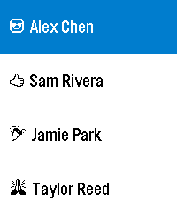
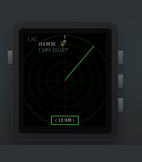
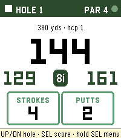
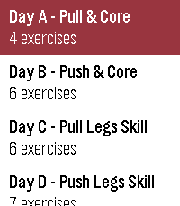
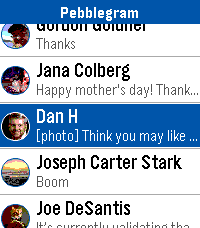
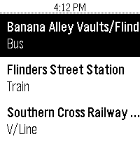
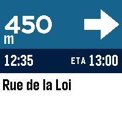

<!-- Generated by scripts/update_app_directory.py: do not edit by hand -->
# Watchapps: P

[← About this list](../watchapps.md) · [A](a.md) · [B](b.md) · [C](c.md) · [D](d.md) · [E](e.md) · [F](f.md) · [G](g.md) · [H](h.md) · [I](i.md) · [J](j.md) · [K](k.md) · [L](l.md) · [M](m.md) · [N](n.md) · [O](o.md) · **P** · [Q](q.md) · [R](r.md) · [S](s.md) · [T](t.md) · [U](u.md) · [V](v.md) · [W](w.md) · [X](x.md) · [Y](y.md) · [Z](z.md) · [0–9 & other](other.md)

*199 watchapps · Last updated 2026-10-06*

| Screenshot | Name | Developer | Licence | Updated | Description |
|------------|------|-----------|---------|---------|-------------|
| { loading=lazy width="72" } | [PaceKeeper](https://apps.repebble.com/551c91e57a1b581177000025) | [Ninjacat](https://github.com/uaraven/pacekeeper) | <small>Not checked yet</small> | 2015-04-07 | Whatchapp to help you keep your running cadence. It will vibrate your watch to keep your rhythm. Up and down buttons to set strides per minute. Select… |
| { loading=lazy width="72" } | [Pacelet](https://apps.repebble.com/81fc38ce91e5491d91b72840) | [Liam Cordelle](https://github.com/LiamCordelle/pacelet) | <small>Not checked yet</small> | 2026-09-22 | A simple activity tracker, using phone GPS |
| { loading=lazy width="72" } | [Paddle Time](https://apps.repebble.com/571a0c6069f1bd4ca4000006) | [Bitwinkel](https://github.com/bitwinkel/paddletime.git) | <small>Not checked yet</small> | 2016-04-24 | A simple app to keep track your paddle match points. It will help you know who and where has the service and you can use your real name and your team name… |
| { loading=lazy width="72" } | [PagerDuty JS](https://apps.repebble.com/574bec916037e86f0c000002) | [Murat Mukhtarov](https://github.com/murat1985/pebblejs-pagerduty) | <small>Not checked yet</small> | 2016-05-31 | Receive incidents and view them as cards on your Pebble Watch; Acknowledge an incident when you received it; Acknowledge all incidents; App will show you… |
| { loading=lazy width="72" } | [Pandora Remote](https://apps.repebble.com/78e5649f62a84ec593f49110) | [gravity_rose](https://github.com/gravity-rose/PandoraRemote) | <small>Not checked yet</small> | 2026-05-04 | Control Pandora from your wrist. PandoraRemote lets you manage playback, rate songs, and adjust volume directly from your Pebble watch. FEATURES - Skip… |
| { loading=lazy width="72" } | [Pandora Remote](https://apps.rebble.io/en_US/application/69f942c68fdda5000a3bb759) <small>Rebble App Store</small> | [gravity_rose](https://github.com/gravity-rose/PandoraRemote) | <small>Not checked yet</small> | 2026-05-05 | Control Pandora from your wrist. PandoraRemote lets you manage playback, rate songs, and adjust volume directly from your Pebble watch. FEATURES - Skip… |
| { loading=lazy width="72" } | [Paperless](https://apps.repebble.com/439d3664960b40d0a1911cb0) | [Michael Runge](https://github.com/Zeichenfolge/paperless-pebble) | <small>Not checked yet</small> | 2026-10-02 | Your Paperless-ngx inbox on your wrist. - See the newest documents in your inbox with correspondent and date - Look at the scan: whole page or zoomed in… |
| { loading=lazy width="72" } | [Paradroid Takeover](https://apps.rebble.io/en_US/application/6a485d66b6d159000952a982) <small>Rebble App Store</small> | [Daktak](https://github.com/daktak/pebble_paradroid_takeover) | <small>Not checked yet</small> | 2026-07-08 | Takeover droids to reach Captain |
| { loading=lazy width="72" } | [Parcel Tracking](https://apps.repebble.com/b29dcf9df26f41888a420a31) | [Zhang Qichuan](https://github.com/qichuan/pebble-parcel-tracking) | <small>Not checked yet</small> | 2026-09-22 | Wondering if any parcel is arriving today? This app answers that question in an instant. Open any shipment to check its current status, location, estimated… |
| { loading=lazy width="72" } | [Paris Transilien](https://apps.repebble.com/561250ba1cdcfc612600008c) | [CocoaBob](https://github.com/CocoaBob/PebbleTransilien) | MIT | 2016-03-11 | Paris Transilien is an unofficial app for checking SNCF Transilien™ trains on your wrist. Transilien™ is the brand name of the suburban railway service of… |
| { loading=lazy width="72" } | [Paris Velib Finder](https://apps.repebble.com/549ee1d3ef9cfa427a00018c) | [Kovaxlabs](https://github.com/AlexKovax/PebbleVelib) | GPL-2.0 | 2014-12-27 | Paris Velib Finder is a very simplistic app that gives you the address of the closest Velib station in Paris and the available bikes/spots number. That's it! |
| { loading=lazy width="72" } | [Particles](https://apps.rebble.io/en_US/application/67ccf9b0d2acb302d5ba8210) <small>Rebble App Store</small> | [Flynn Duniho](https://github.com/FlynnD273/pebble-physics) | MIT | 2026-03-03 | Just a physics sim with a bunch of balls, uses the accelerometer |
| { loading=lazy width="72" } | [Party Light](https://apps.repebble.com/08f732a3c6a54684a1f3e3ee) | [Viktor Nybom](https://github.com/viktorNybom/pebble_party_light_c) | <small>Not checked yet</small> | 2026-08-19 | Uses the RGB backlight of the Pebble Time 2, so the app only works for the Time 2. Changes backlight color to a new backlight color in the set BPM. Colors… |
| { loading=lazy width="72" } | [Patch](https://apps.repebble.com/87448e2399a94cd58d2c8284) | [Matt](https://github.com/mattnovelli/patch) | <small>Not checked yet</small> | 2026-07-12 | Harness the power of iOS Automations to send text messages (including iMessages) from your Pebble! No server required. Patch uses Outlook (yes, Outlook!) to… |
| { loading=lazy width="72" } | [Patch](https://apps.rebble.io/en_US/application/69fd580bea28ba000ab3246c) <small>Rebble App Store</small> | [Matt Novelli](https://github.com/mattnovelli/patch) | <small>Not checked yet</small> | 2026-05-08 | Harness the power of iOS Automations to send text messages (including iMessages) from your Pebble! No server required. Patch uses Outlook (yes, Outlook!) to… |
| { loading=lazy width="72" } | [Patris](https://apps.repebble.com/559af16358bc81d930000067) | [Fabien](https://github.com/Fabien-Chouteau/Ada_Time) | <small>No licence</small> | 2015-11-04 | Patris is a game inspired by the famous classic falling blocks. The game is automatically saved when you exit the app and you can change level in the menu… |
| { loading=lazy width="72" } | [PBL-7](https://apps.repebble.com/3cbee0195ebb4709be91f6d2) | [mrTrueBeliever](https://github.com/mrtruebeliever/PBL-7) | <small>Not checked yet</small> | 2026-08-13 | A landscape shmup through the solar system. Hold your Pebble Time 2 sideways and fly PBL-7 to Earth. Rise, fire, dodge, and beat a boss on every planet. 11… |
| { loading=lazy width="72" } | [PCal](https://apps.repebble.com/52bdb232dc2f4ff50f00009a) | [Jnm](https://github.com/Jnmattern/PCal) | <small>No licence</small> | 2016-02-17 | Universal Calendar, configuration screen available from the Phone Pebble App, allowing to set language, display of week numbers, first day of week and… |
| { loading=lazy width="72" } | [Peb1090](https://apps.rebble.io/en_US/application/6a80ccf8d08b360009a90351) <small>Rebble App Store</small> | [Nick Touran](https://github.com/partofthething/peb1090) | <small>Not checked yet</small> | 2026-08-17 | View flight data around you from a tar1090 server. This is generally useful for people who run ADS-B receivers themselves and want to plug into their own… |
| { loading=lazy width="72" } | [Pebball! - Interactive Motion Game Concept](https://apps.rebble.io/en_US/application/67cdcb18d2acb303aedd4a91) <small>Rebble App Store</small> | [Stanivision Inc.](https://github.com/tertty/pebball-web) | <small>Not checked yet</small> | 2025-03-10 | Pebball! is a baseball inspired interactive, motion controlled game concept for the Pebble Smartwatch. When paired with the Pebball! Web Server, this… |
| { loading=lazy width="72" } | [PebBeep](https://apps.repebble.com/8b5a3a62e2ba4522840fb658) | [Scott Harrison](https://github.com/scottrules44/PebBeep-Pebble) | <small>Not checked yet</small> | 2026-04-08 | PebBeep — Messages on Your Pebble Read and reply to your iMessage, Slack, WhatsApp, Signal, Telegram, Discord, Messenger, Instagram, Google Chat, Google… |
| { loading=lazy width="72" } | [Pebblakte](https://apps.rebble.io/en_US/application/66310701ea09ac0e67193520) <small>Rebble App Store</small> | [Veselcraft](https://github.com/veselcraft/pebblakte) | <small>Not checked yet</small> | 2025-10-18 | Messaging app for VK and OpenVK. Below is description in Russian language. Мессенджер для VK и OpenVK. Для входа потребуется токен. Для ВК его можно… |
| { loading=lazy width="72" } | [Pebble 8 Ball](https://apps.repebble.com/5346b35474eafce75b000334) | [David Ryan](https://github.com/ptcryan/pebble8ball) | <small>Not checked yet</small> | 2014-04-10 | A pebble rendition of the classic magic 8 ball game. |
| { loading=lazy width="72" } | [Pebble ADS-B Radar](https://apps.rebble.io/en_US/application/6a5381d3412ee9000955650d) <small>Rebble App Store</small> | [Jason Marquette](https://github.com/jasonmarquette/pebble-adsb-radar) | <small>Not checked yet</small> | 2026-07-12 | Displays nearby aircraft on your Pebble using live ADS-B data, GPS location, callsigns, altitude, and adjustable radar range. |
| { loading=lazy width="72" } | [Pebble Adventure](https://apps.repebble.com/d50eaec84a5e410298a3d2c7) | [Levonn](https://github.com/levonn-dev/pebble-adventure) | <small>Not checked yet</small> | 2026-05-21 | # Pebble Adventure ## Walk further. Level up. Explore the world. One step at a time. --- ## The Game Born from a love of Chao Adventure, Tamagotchi, and… |
| { loading=lazy width="72" } | [Pebble Arcade](https://apps.repebble.com/1e8def94044d4f4ca69cc566) | [Salim Benhamadi](https://github.com/salim-benhamadi/Pebble-Arcade) | <small>Not checked yet</small> | 2026-09-29 | Six retro arcade games in one app, playable with just your watch buttons. Pick a game from the menu, play a quick round, and hit SELECT to retry. Games… |
| { loading=lazy width="72" } | [Pebble Controller](https://apps.repebble.com/556a32990bfdada493000060) | [andars](https://github.com/andars/pebble-controller) | <small>Not checked yet</small> | 2015-06-02 | This watch app allows you to transmit button presses from your Pebble to a computer and perform actions there. See the github page at… |
| { loading=lazy width="72" } | [Pebble CUMTD](https://apps.repebble.com/533f81d2cb6cd3fb2b0001b4) | [Nathan Handler](https://github.com/nhandler/pebble-cumtd) | <small>Not checked yet</small> | 2015-03-03 | Locate the nearest Champaign-Urbana Mass Transit District (CUMTD) bus stop, and then view upcoming bus departure times. |
| { loading=lazy width="72" } | [Pebble Deliveries](https://apps.rebble.io/en_US/application/608059da1342ae003ce73f02) <small>Rebble App Store</small> | [JSystems](https://github.com/oonqt/pebble-deliveries) | <small>Not checked yet</small> | 2021-05-19 | Pebble Deliveries is an app that makes it easy to track your shipment from dozens of different postal carriers. Simply app your package name and tracking… |
| { loading=lazy width="72" } | [Pebble Demos](https://apps.repebble.com/53ff99c7d08f53676a000043) | [Grégoire Sage](https://github.com/pebble/pebble-sdk-examples) | <small>Not checked yet</small> | 2014-09-21 | All the Pebble SDK demos in ONE app ! Contains all the watchapps and all the watchfaces |
| { loading=lazy width="72" } | [Pebble eReader](https://apps.repebble.com/144e5a593cc0494a81200cb1) | [Erik Lundin](https://github.com/ErikLundin98/pebble-ereader) | <small>No licence</small> | 2026-07-05 | Read EPUB books on your Pebble watch. Upload an EPUB via the in-app settings page, then read chapter-by-chapter with proper headings, progress tracking, and… |
| { loading=lazy width="72" } | [Pebble Fortune](https://apps.repebble.com/55594b659655054dcb00006b) | [Oliver Merkel](https://github.com/OMerkel/pebble-js-samples) | <small>Not checked yet</small> | 2015-05-18 | Pebble Fortune Cookies allows to retrieve a fortune text. Its objective is to display the fortune cookie text from AJAX request on a Pebble Watch Window. |
| { loading=lazy width="72" } | [Pebble Golf](https://apps.repebble.com/57f80ba0bfbe4ad7a44dbbcf) | [Chris Snyder](https://github.com/chrissnyder2337/pebble-golf) | <small>Not checked yet</small> | 2026-09-30 | Pebble Golf turns your watch into a golf rangefinder, digital scorecard, and tap-to-measure course map, all live on your wrist. Supported languages… |
| { loading=lazy width="72" } | [Pebble Golf](https://apps.rebble.io/en_US/application/6a33777a1464770009cb8c91) <small>Rebble App Store</small> | [Chris Snyder](https://github.com/chrissnyder2337/pebble-golf) | <small>Not checked yet</small> | 2026-09-30 | Pebble Golf turns your watch into a golf rangefinder, digital scorecard, and tap-to-measure course map, all live on your wrist. Supported languages… |
| { loading=lazy width="72" } | [Pebble Gym](https://apps.repebble.com/c27fee0f38424667a861e49a) | [tob1](https://github.com/sirTob1/pebble-gym-hevy) | <small>Not checked yet</small> | 2026-08-14 | Hevy Workout Routine Companion & History Tracker for Pebble Smartwatches NOTE This is a Vibe-Coding project! 🎸✨ Built interactively using advanced agentic… |
| { loading=lazy width="72" } | [Pebble MA](https://apps.repebble.com/cbdd9cc7fab247d5b9a20d84) | [Vincent](https://github.com/vincentezw/pebble-ma) | <small>Not checked yet</small> | 2026-09-04 | Pebble Music Assistant client |
| { loading=lazy width="72" } | [Pebble Meds](https://apps.repebble.com/3d0ba0e64e5d48bba0a38ef9) | [Britt Piehler](https://github.com/bpiehler/PebbleMeds) | <small>Not checked yet</small> | 2026-07-15 | Never miss a dose — for you, your family, or your pets. PebbleMeds delivers quiet, wrist-based medication reminders with simple one-button confirmations… |
| { loading=lazy width="72" } | [Pebble Nav HUD](https://apps.repebble.com/6a74fe5c49abe2000a25c7f0) | [Moondawg](https://gitlab.com/Ryan-Mooney/pebble-hud-navigation) | <small>Not checked yet</small> | 2026-09-06 | Google Maps turn-by-turn directions, on your wrist. REQUIRES a free companion app for Android: https://ryan-mooney.com/pebble-nav-hud Android only. There is… |
| { loading=lazy width="72" } | [Pebble Nav Me (2026 Edition)](https://apps.rebble.io/en_US/application/666e80ff7568f7000a0b966f) <small>Rebble App Store</small> | [aviation_hacker](https://www.reddit.com/r/pebble/comments/1vy0g25/pebble_nav_me_v158_2026/) | <small>Not checked yet</small> | 2026-08-25 | This is an modified version of the Original Pebble Nav Me App made by bates.apps. This version is modified to work with Google Maps Post December 2025, and… |
| { loading=lazy width="72" } | [Pebble OwnTone Remote](https://apps.rebble.io/en_US/application/699cdba9484121000903f7d2) <small>Rebble App Store</small> | [ChillyDown](https://github.com/cdlenfert/pebble-owntone-remote) | <small>Not checked yet</small> | 2026-07-20 | Control your OwnTone (owntone/owntone) music server from your Pebble watch. Browse results, play/pause, skip tracks, and adjust volume or outputs without… |
| { loading=lazy width="72" } | [Pebble Pilot](https://apps.repebble.com/613a872008144c7eb0404912) | [Matteo Miceli](https://github.com/matteomiceli/pebble-pilot) | <small>Not checked yet</small> | 2026-06-30 | A minimal turn-by-turn navigation app. Features - Configurable destination with location auto-complete - Automatic manuever detection - Shows the distance… |
| { loading=lazy width="72" } | [Pebble Points](https://apps.repebble.com/63515ba580094bc4af7cf70c) | [ClickCalickClick (Touchy Weather)](https://github.com/ClickCalickClick/Pebble-Points) | <small>No licence</small> | 2026-04-10 | Pebble Points is a fast, colorful multiplayer score tracker for Pebble watches. Keep score for 2 to 4 players with a layout that adapts to the watch face… |
| { loading=lazy width="72" } | [Pebble Pulse](https://apps.repebble.com/52bd9778b1ce8e22de000099) | [Tom Wilshere](http://github.com/tomwilshere/pebblepulse) | <small>No licence</small> | 2013-12-27 | Quickly, easily and accurately calculate a patient's pulse using this handy pebble app. Simply press the button, count 10 beats and press again, the pulse… |
| { loading=lazy width="72" } | [Pebble Retreat Schedule](https://apps.repebble.com/542ccf390edc7256750000db) | [Patrick Balestra](https://github.com/BalestraPatrick/PebbleRetreatSchedule) | <small>No licence</small> | 2014-10-02 | The perfect watch app to attend the Pebble Developer Retreat 2014. |
| { loading=lazy width="72" } | [Pebble Runner](https://apps.repebble.com/54ad8b9d32203eb1200000b3) | [rickyman20](https://github.com/rickyman20/PocketRunnerPebble) | <small>Not checked yet</small> | 2015-01-07 | NOTE: THIS APP IS ONLY COMPATIBLE WITH ANDROID A simple app for all your lap-keeping needs! This watch app lets you keep a track-record of your runs, by… |
| { loading=lazy width="72" } | [Pebble Sketch](https://apps.repebble.com/55370164fa195b7afb00001f) | [Joe Pfeiffer](https://github.com/jpfeiffer16/pebble-etch) | <small>Not checked yet</small> | 2015-04-24 | A simple Etch-A-Sketch like watch app for Pebble |
| { loading=lazy width="72" } | [Pebble Speak Easy AAC App](https://apps.repebble.com/557824714f8d9860dc00001b) | [UIUC Bioengineering](https://github.com/Utsav2/PebbleAndroid) | <small>Not checked yet</small> | 2015-06-19 | Pebble Speak Easy is an AAC App designed to make communication simple and customizable. The purpose of this app is to enable easy, quick, and human… |
| { loading=lazy width="72" } | [Pebble Strength](https://apps.rebble.io/en_US/application/6a613f4855030a00092907bb) <small>Rebble App Store</small> | [Andrew Whaley](https://github.com/azw413/pebble-strength) | <small>Not checked yet</small> | 2026-07-27 | A Pebble based strength/gym trainer with workouts, sessions, hundred of exercises and automatic rep counting for some exercises with more coming soon. |
| { loading=lazy width="72" } | [Pebble Throw](https://apps.repebble.com/84d17b57b0aa48ce8813659b) | [dhrme](https://github.com/dhrme/pebble-apps) | <small>Not checked yet</small> | 2026-06-25 | The Pebble Throw rescues the world against evil fruit and robots. Ahem. |
| { loading=lazy width="72" } | [Pebble Tides](https://apps.repebble.com/de7fc2dccd464e299badc6c0) | [James Roland](https://github.com/gli-james-roland/pebble-tide) | <small>Not checked yet</small> | 2026-07-03 | Pebble Tides shows the day's tides at a glance: a graph of the high and low tides with their exact times and heights, the current water level, whether the… |
| { loading=lazy width="72" } | [Pebble timer](https://apps.repebble.com/53a705f969f1e6bd040001e4) | [Josh Evans](https://github.com/lorenlugosch/pebble_stopwatch) | <small>Not checked yet</small> | 2014-06-22 | A simple stopwatch for your wrist |
| { loading=lazy width="72" } | [Pebble Toss](https://apps.repebble.com/554f0a794e604bb48200000f) | [Steven Povlitz](https://github.com/stevenpovlitz/PebbleTrial) | <small>Not checked yet</small> | 2015-05-10 | How high can you throw your watch? Step 1: Toss skyward. Step 2: Catch watch. Step 3: Marvel at height thrown. Pebble toss calculates how high a watch is… |
| { loading=lazy width="72" } | [Pebble Wordle](https://apps.rebble.io/en_US/application/62304a7d2a976b000a6e73df) <small>Rebble App Store</small> | [Katharine Berry](https://github.com/Katharine/pebble-wordle) | MIT | 2022-05-27 | Full featured Wordle on your Pebble! - Uses the same word each day as the New York Times' Wordle! - Saves your work when you leave the app. - Tracks your… |
| { loading=lazy width="72" } | [pebble-c25k](https://apps.rebble.io/en_US/application/69f5d27a8bb70b00099fc067) <small>Rebble App Store</small> | [Wyoc](https://github.com/Wyoc/pebble-c25k) | <small>Not checked yet</small> | 2026-05-02 | A pebble 2 C25K watchapp |
| { loading=lazy width="72" } | [Pebble-Dex](https://apps.repebble.com/531bafa016c197909a0002f0) | [Dakota Kryzanowski](https://github.com/DKote/Pebble-Dex) | <small>No licence</small> | 2014-03-09 | NOTE: No Update Soon Pebble-Dex is a update of Pokedex Kanto developed by Shutdown27! Base Code From Shutdown27! Controls: Up button to move up by 1 Down… |
| { loading=lazy width="72" } | [PEBBLE-TONE](https://apps.repebble.com/e274ceede0b440fd8045ad7b) | [Nochi Shikarunochi](https://github.com/shikarunochi/PebbleTone) | <small>Not checked yet</small> | 2026-05-03 | A simple piano app for Pebble Time 2. You can play one octave of notes. |
| { loading=lazy width="72" } | [Pebble2048](https://apps.repebble.com/5337460457418e3bd600007d) | [Elvin Yung](https://github.com/elvinyung/Pebble2048) | <small>Not checked yet</small> | 2014-03-29 | An adaptation of 2048 on the Pebble Smartwatch showcasing various features of the Pebble SDK. |
| { loading=lazy width="72" } | [pebble2todoist](https://apps.repebble.com/4015983bf15545d6ad50803b) | [Flecmart](https://github.com/flecmart/pebble2todoist) | <small>Not checked yet</small> | 2026-06-18 | A Pebble watchapp that adds tasks to Todoist using your voice. Press SELECT, speak a command, and the task appears in your Todoist project — or in your… |
| { loading=lazy width="72" } | [PebbleAI](https://apps.repebble.com/64853961143b6504611fbc06) | [huntboom](https://github.com/huntboom/PebbleAI) | <small>Not checked yet</small> | 2025-09-22 | ChatGPT, Gemini, DeepSeek, Grok or Claude for the Pebble Time! This app takes your voice message and displays a response from the AI assistant of your… |
| { loading=lazy width="72" } | [PebbleAI+](https://apps.repebble.com/7996ad2f480d4549b3996f58) | [Chronometric Second-Hand](https://github.com/JagerSprinkles/PebbleAI-Plus) | MIT | 2026-10-03 | PebbleAI-Plus is a resource-aware fork of PebbleAI. It keeps the same idea of the original PebbleAI, access to ChatGPT, Gemini, DeepSeek, Grok, or Claude on… |
| { loading=lazy width="72" } | [PebbleBall](https://apps.repebble.com/7a641809d43a4acf813fdea5) | [Andrew129260](https://github.com/Andrew129260/PebbleBall) | GPL-3.0 | 2026-09-23 | This is a Jezzball clone for the pebble time 2! The classic windows game on your wrist! With touch support! Your goal is to trap all the balls in the… |
| { loading=lazy width="72" } | [PebbleBucksE](https://apps.repebble.com/53820c69ad57fd7a430000c9) | [Eric Wood](https://github.com/esw148/PebbleBucks) | <small>Not checked yet</small> | 2014-05-25 | This lets you pay for Starbucks using your watch. You can also view your balance and rewards information. (This is based on the 2.0.1 version of the… |
| { loading=lazy width="72" } | [PebbleConduct - Pebble App For Train Conductors](https://apps.repebble.com/08e04f5944424a97977d9f57) | [Maartje Eyskens](https://github.com/meyskens/PebbleConduct) | <small>Not checked yet</small> | 2026-06-29 | PebbleConduct is a Pebble watch app designed with professional train use in mind. It will provide you real time information about your train wherever you are. |
| { loading=lazy width="72" } | [PebbleDiver](https://apps.repebble.com/d529bfb1bcb14e369c9ac112) | [mrTrueBeliever](https://github.com/mrtruebeliever/PebbleDiver) | <small>Not checked yet</small> | 2026-08-13 | A one-button deep-sea dive. Hold to swim up, let go to sink. Dodge rocks and jellyfish, grab pearls and air, upgrade your gear, and dive as deep as you… |
| { loading=lazy width="72" } | [PebbleDoist](https://apps.repebble.com/62a96010e98448ebaaa647fb) | [mrTrueBeliever](https://github.com/mrtruebeliever/PebbleDoist) | <small>Not checked yet</small> | 2026-08-18 | Your Todoist tasks on your wrist — add them by voice. Browse Todoist by list, label or Today, read details and subtasks, tick tasks off, and dictate new… |
| { loading=lazy width="72" } | [PebbleDoro](https://apps.repebble.com/52d1e4e4c44c04959200000b) | [Mert](https://github.com/mertdikmen/pebbledoro) | <small>Not checked yet</small> | 2014-01-26 | Pomodoro Timer for Pebble |
| { loading=lazy width="72" } | [PebbleFlix](https://apps.repebble.com/55625d08fd8f4b8c140000cc) | [Jason Stallings](https://github.com/octalmage/PebbleFlix) | <small>Not checked yet</small> | 2015-05-25 | PebbleFlix allows you to control Netflix on your Mac. Just install and run the server app on your Mac, open PebbleFlix on your watch, then you can pause… |
| { loading=lazy width="72" } | [PebbleForce Dashboard for Salesforce](https://apps.repebble.com/5395fc78c500b46a5b000010) | [DanHca](https://github.com/developerforce/WearablePack-Pebble) | <small>Not checked yet</small> | 2014-06-10 | Salesforce1 Pebble Dashboard This is an application that can connect to any Salesforce Instance and securely display the totals from your reports on your… |
| { loading=lazy width="72" } | [PebbleForce for Salesforce](https://apps.repebble.com/541e31e4c52901a0a300003b) | [DanHca](https://github.com/DanHca/PebbleForce) | <small>No licence</small> | 2014-09-27 | Display information from Salesforce, post to Chatter, or create a Case using your own menu structure without any code. Used in conjunction with the… |
| { loading=lazy width="72" } | [PebbleFormulas](https://apps.repebble.com/52d714aaaf3794159d000006) | [Devin Simmons](https://github.com/blackpaw78/PebbleFormulas) | <small>Not checked yet</small> | 2014-02-03 | A quick convenient way to access many formulas for Algebra, Geometry, Trigonometry, Calculus, Biology, Chemistry, Physics, Electricity, and Conversions… |
| { loading=lazy width="72" } | [PebbleFormulas Portuguese](https://apps.repebble.com/52efed1b4ae3636d4c00000d) | [Devin Simmons](https://github.com/blackpaw78/PebbleFormulasPortuguese) | <small>Not checked yet</small> | 2014-02-03 | PebbleFormulas agora em portruguese! Uma maneira rápida conveniente de acessar muitas fórmulas para álgebra, geometria, trigonometria, cálculo, Biologia… |
| { loading=lazy width="72" } | [PebbleGL 3D](https://apps.repebble.com/53960f64261143288500011f) | [Matthew Hungerford](https://github.com/mhungerford/PebbleGL) | <small>Not checked yet</small> | 2014-07-21 | OpenGL for Pebble. Provides minimal OpenGL 1.1 engine for rendering 3D graphics. Renders STL models in both wireframe and filled with positional lighting… |
| { loading=lazy width="72" } | [Pebblegotchi](https://apps.repebble.com/399b6a126b314717818cbcee) | [Walkerdeath](https://github.com/walkerdeath/Pebblegotchi) | <small>Not checked yet</small> | 2026-04-06 | Feed, clean, play, and meditate with a tiny wrist pet. A daily ritual that revives pixel‑era nostalgia and turns small habits into a warm, retro moment. |
| { loading=lazy width="72" } | [Pebblegram](https://apps.repebble.com/3f9cfd3aefd84e59a0128849) | [TomBolger](https://github.com/TomBolger/Pebblegram) | <small>Not checked yet</small> | 2026-06-10 | A Telegram client for Pebble. Currently relies on a service that runs on a computer and requires some setup, and that service needs to be running for the… |
| { loading=lazy width="72" } | [Pebblegram](https://apps.rebble.io/en_US/application/69f1c4c865bd7b00090505fc) <small>Rebble App Store</small> | [TomBolger](https://github.com/TomBolger/Pebblegram) | <small>Not checked yet</small> | 2026-06-10 | A Telegram client for Pebble. It no longer requires an additional service and everything runs right on the watch! |
| { loading=lazy width="72" } | [PebbleGRT](https://apps.repebble.com/54694ee5bfc6a28d0300004f) | [Mitchell Van Der Hoeff](https://github.com/mvanderh/PebbleGRT/) | <small>Not checked yet</small> | 2014-11-23 | Check real time bus times and distances for GRT in the Kitchener/Waterloo area! - Click on a Nearby Bus to see Delay and Upcoming Stops - Click on a Nearby… |
| { loading=lazy width="72" } | [pebblek](https://apps.repebble.com/bef8e6181d804c4aaa40c482) | [Iuri A.](https://github.com/iuriaranda/pebblek) | <small>Not checked yet</small> | 2026-07-02 | PebbleK — SignalK boat monitor & autopilot remote PebbleK turns your Pebble into a glanceable helm display and autopilot remote for boats running a SignalK… |
| { loading=lazy width="72" } | [PebbleKimai](https://apps.repebble.com/4ab5c72a6eb74d5581ebcf6d) | [mrTrueBeliever](https://github.com/mrtruebeliever/PebbleKimai) | <small>Not checked yet</small> | 2026-08-18 | Track your time in Kimai, straight from your wrist. Start, stop and switch Kimai time tracking from your Pebble. Recent activities in one press. Touch on… |
| { loading=lazy width="72" } | [PebbleKuma](https://apps.repebble.com/81a2a1cef20f45b4935929e7) | [mrTrueBeliever](https://github.com/mrtruebeliever/PebbleKuma) | <small>Not checked yet</small> | 2026-08-13 | PebbleKuma brings your Uptime Kuma status pages to your Pebble Time 2. Browse a clean list of your monitors at a glance, a colored dot tells you what's up… |
| { loading=lazy width="72" } | [PebbleLock](https://apps.repebble.com/53a9a197990481964a000245) | [Hanlon](https://github.com/soothslayer/PebbleLock) | <small>Not checked yet</small> | 2014-10-26 | Use your Pebble to lock/unlock your Lockitron door lock. (After downloading be sure to go to Settings for PebbleLock within the Pebble app and log into… |
| { loading=lazy width="72" } | [PebbleMetro](https://apps.repebble.com/c1696238887342beb6459e8d) | [audietron171](https://github.com/audietron171/pebblemetro) | <small>Not checked yet</small> | 2026-08-14 | PebbleMetro is a simple watch-app that allows you to display upcoming departures from your favourite stops using the Melbourne PTV API. Support’s all stops… |
| { loading=lazy width="72" } | [PebbleMetro](https://apps.rebble.io/en_US/application/6a7ed027a262dd000996d372) <small>Rebble App Store</small> | [audietron171](https://github.com/audietron171/pebblemetro) | <small>Not checked yet</small> | 2026-08-14 | PebbleMetro is a simple watch-app that allows you to display upcoming departures from your favourite stops using the Melbourne PTV API. Support’s all stops… |
| { loading=lazy width="72" } | [Pebblemon](https://apps.repebble.com/60ec78db1342ae0152f9a409) | [Harrison Allen](https://github.com/HarrisonAllen/pebble-gbc-graphics-demo) | MIT | 2026-06-18 | Pebblemon! A mini Pokemon adventure on your wrist. Explore various areas within the Johto region. Encounter all 251 Pokemon from the Game Boy Color games… |
| { loading=lazy width="72" } | [Pebblemon Lite](https://apps.repebble.com/67cd9987d2acb302d5ba822e) | [Harrison Allen](https://github.com/HarrisonAllen/pebble-gbc-graphics-demo/tree/master/pebblemon-lite) | MIT | 2025-03-09 | Pebblemon Lite! A bite-sized Pokemon adventure on your wrist. Pebblemon finally comes to the Pebble Classic and Pebble Steel! It's a much smaller experience… |
| { loading=lazy width="72" } | [PebbleNTN - Maps Nav Notification To Navigation](https://apps.repebble.com/ad4971e345854b909b73b1a9) | [Sacha](https://github.com/optio/PebbleNTN) | <small>Not checked yet</small> | 2026-10-03 | Turn-by-turn directions from your phone's nav app, on your pebble. PebbleNTN reads your navigation app's notifications and shows the next turn, distance… |
| { loading=lazy width="72" } | [PebbleNTN - Maps Nav Notification To Navigation](https://apps.rebble.io/en_US/application/6a5e8ca850bd250008fbc3be) <small>Rebble App Store</small> | [Sacha](https://github.com/optio/PebbleNTN/releases) | <small>Not checked yet</small> | 2026-10-03 | Turn-by-turn directions from your phone's nav app, on your pebble. PebbleNTN reads your navigation app's notifications and shows the next turn, distance… |
| { loading=lazy width="72" } | [PebblePATH](https://apps.rebble.io/en_US/application/58e5474f6ca387fc52000a3f) <small>Rebble App Store</small> | [DLevine.us](https://github.com/djlevine/PebblePATH) | <small>Not checked yet</small> | 2017-04-21 | Provides train times at specified intervals for all PATH train lines Choose the direction you want to travel and your current location to receive upcoming… |
| { loading=lazy width="72" } | [PebblePoint](https://apps.repebble.com/53cec3433967e94f5500000b) | [Rafi Jacoby](https://github.com/rjacoby/pebblepoint) | <small>Not checked yet</small> | 2014-07-22 | Control Microsoft PowerPoint on Mac OS X from your Pebble! Use the buttons to go to next/previous slides, or press and hold for last/first. Requires: - Mac… |
| { loading=lazy width="72" } | [PebblePong](https://apps.repebble.com/52b961505dfb6ed2b400005d) | [kije-dev](https://github.com/kije/PebblePong-2) | <small>Not checked yet</small> | 2014-01-18 | Pong for Pebble Now with accelerometer support. Simply control your paddle by turning your wrist. To reset the calibration of the accelerometer during the… |
| { loading=lazy width="72" } | [PebbleQuest](https://apps.repebble.com/52d6a7307b4f9ad65300000c) | [David C. Drake](https://github.com/theDrake/pebblequest) | <small>Not checked yet</small> | 2016-01-18 | A 3D fantasy action-RPG! Explore dungeons, slay monsters, level up, and wield Pebbles of Power to cast spells or enchant your weapons and armor. How long… |
| { loading=lazy width="72" } | [PebbleRail](https://apps.repebble.com/67a8c311b5e348000915b07b) | [jcit](https://github.com/jccit/pebblerail) | <small>Not checked yet</small> | 2025-12-15 | View live UK train times from your Pebble! Features: * View departures from nearby stations * See upcoming and previous stops * Pin departure/arrival to the… |
| { loading=lazy width="72" } | [PebbleRecorder](https://apps.repebble.com/afcad232b3cd40398cbb0c04) | [Webstas “Webstas”](https://github.com/BigWebstas/PebbleRecorder) | GPL-3.0 | 2026-08-29 | Turn your Pebble watch into a remote start/stop trigger for audio recording on your phone. Press a button on the watch, and a companion Android app records… |
| { loading=lazy width="72" } | [Pebbles on the Street](https://apps.repebble.com/8e3da086c3734552b0f0bcb7) | [Lev C](https://github.com/illright/pebble-streetcomplete) | <small>Not checked yet</small> | 2026-04-19 | The Pebble version of a popular on-the-go editor for OpenStreetMap — StreetComplete! Not affiliated with StreetComplete itself (yet 😛). This app lets you… |
| { loading=lazy width="72" } | [PebbleSky Detail](https://apps.repebble.com/255715276bde48f1bcf59a80) | [Dave Bortz](https://github.com/dbortz/PebbleSky) | <small>Not checked yet</small> | 2026-06-09 | Companion for the PebbleSky watchface: 2-hour precipitation detail, 5-day forecast, and current conditions. |
| { loading=lazy width="72" } | [PebbleSOS](https://apps.repebble.com/5542ef13a7a3a66ee500002a) | [AZ](https://github.com/Uberi/PebbleSOS) | <small>Not checked yet</small> | 2015-05-01 | ====== IMPORTANT ====== THE COMPANION APP FOR iOS IS CURRENTLY PENDING APPROVAL, AND IS EXPECTED TO RELEASE AROUND MAY 14TH. THE COMPANION APP IS REQUIRED… |
| { loading=lazy width="72" } | [PebbleTalk](https://apps.repebble.com/23692844dacf4630bbd80f96) | [Neonfire](https://github.com/neonfire42/pebbletalk) | <small>Not checked yet</small> | 2026-06-09 | A tiny retro speech synthesizer that talks through the Pebble Time 2 speaker. Fully algorithmic MacinTalk-style formant synthesis: no samples, no internet… |
| { loading=lazy width="72" } | [PebbleTasks](https://apps.repebble.com/da6fc48e443c49ebbc9d5ff0) | [breezy](https://github.com/shan-srini/PebbleTasks) | <small>Not checked yet</small> | 2026-05-23 | # 📋 PebbleTasks — Google Tasks on your wrist ⌚ Your to-dos, right on your Pebble. 📱➡️⌚ Open lists, tick things off, and stay organised without pulling out… |
| { loading=lazy width="72" } | [Pebbletracker](https://apps.repebble.com/695fca487697aa0009be2375) | [Ilia Breitburg](https://github.com/breitburg/pebbletracker) | <small>Not checked yet</small> | 2026-01-08 | Pebbletracker provides detailed information on every Pebble smartwatch ever made, including items such as processor speed, memory, display type, supported… |
| { loading=lazy width="72" } | [PebbleTrail Map](https://apps.repebble.com/85c73ce43dac489ea6b8908d) | [Karl](https://github.com/KarlKl/PebbleTrail) | <small>No licence</small> | 2026-03-30 | PebbleTrail Map: Your Adventure Companion Explore the outdoors with confidence using PebbleTrail Map, the ultimate GPS and map app for your Pebble… |
| { loading=lazy width="72" } | [Pebbletris Redux](https://apps.repebble.com/693b187bd8c67a0009650e91) | [MrBlue](https://github.com/mrbluue/Tetris-PebbleTime) | <small>Not checked yet</small> | 2026-06-18 | A new version of the classic game for the future of Pebbles! Inspired by Tetris, this is a fork of the original Tebbletris app by WRansohoff, keeping the… |
| { loading=lazy width="72" } | [Pebbletron](https://apps.repebble.com/5394ad79e553f6ec0a000094) | [Eric Migicovsky](https://github.com/ericmigi/PebbleTron) | <small>Not checked yet</small> | 2014-06-09 | Control your Lockitron lock right from your Pebble! Built using Pebble.js and Cloudpebble.net. Thanks Huy and Katharine! No locks? remember to log in: My… |
| { loading=lazy width="72" } | [PebbLIFX](https://apps.repebble.com/532f73624e66a650030003d9) | [jadengore](https://github.com/jadengore/PebbLIFX) | <small>Not checked yet</small> | 2014-04-22 | Control your LIFX bulbs from your Pebble Watch. Currently supports bulb name discovery as well as on/off commands. This app will not work without the… |
| { loading=lazy width="72" } | [Pebblify](https://apps.rebble.io/en_US/application/5ff3b52b1e6bb11b9eee5c5a) <small>Rebble App Store</small> | [lourheroes](https://github.com/lourheroes/pebblify) | <small>Not checked yet</small> | 2021-01-05 | Pebblify is a full featured Spotify app for your Pebble. Control your Spotify session on any devices, directly from your wrist. Authorize Pebblify to access… |
| { loading=lazy width="72" } | [Pebblin](https://apps.repebble.com/532b66bcda514ee90000001d) | [Robert Ying](http://github.com/rbtying/pebblelin) | <small>No licence</small> | 2014-03-20 | Pebblin' is an air violin developed on a Pebble smartwatch and an Android smartphone. Here, the Pebble acts as the "bow" for the violin, while the phone… |
| { loading=lazy width="72" } | [PebbLisp](https://apps.rebble.io/en_US/application/5ec1f90f3dd31081fc98fce0) <small>Rebble App Store</small> | [Sage V.](https://gitlab.com/sagev9000/pebblisp) | <small>Not checked yet</small> | 2020-08-10 | A very simple LISP editor and interpreter called PebbLisp. Only supports the most basic LISP functionality, but still offers a somewhat usable set… |
| { loading=lazy width="72" } | [PebbLoop](https://apps.repebble.com/0fbc95ed5419436185c7f0c5) | [Dimitrios Vlachos](https://github.com/Mesa-LLC/PebbLoop/) | <small>Not checked yet</small> | 2026-04-07 | Ever wished being able to play Zuma or Puzz Loop on your Pebble? Now you can! Survive as long as you can in this addictive and fast-paced ball-shooting… |
| { loading=lazy width="72" } | [Pebblsky](https://apps.repebble.com/67c3a3e6d2acb30009a3c7ba) | [lamasters](https://github.com/lamasters/pebblsky) | <small>Not checked yet</small> | 2026-08-30 | Browse your pinned feeds and stay up to date with what people are talking about with the latest trending topics from Bluesky. Support my work… |
| { loading=lazy width="72" } | [Pebboard](https://apps.repebble.com/54b81929cba63619cf000080) | [jpdesigns](https://github.com/dewguzzler/pebboard) | <small>Not checked yet</small> | 2015-01-15 | **Must download companion app and open it at least once to actually send SMS** Using a custom made keyboard for Pebble, you can enter a phone number first… |
| { loading=lazy width="72" } | [Pebbos](https://apps.repebble.com/546a1fefecee192af60000c1) | [James Fairhurst](https://github.com/jamesfairhurst/Pebbos) | <small>Not checked yet</small> | 2014-11-17 | A simple Pebble.js app that allows you to control your Sonos speakers with your Pebble. |
| { loading=lazy width="72" } | [PebCiti - NYC CitiBike and London Barclays Cycle Hire](https://apps.repebble.com/52ab113cb8f6c20e31000019) | [Joe Masilotti](https://github.com/joemasilotti/PebCiti) | <small>Not checked yet</small> | 2015-01-31 | A simple, open-source app to show the nearest available bike share dock or bike on your Pebble. New York City's CitiBike and London's Barclays Cycle Hire… |
| { loading=lazy width="72" } | [pebduroam](https://apps.repebble.com/5384b2119c84af48350000c7) | [leopoul](https://builds.cloudpebble.net/bf238895-2c3d-4bb7-bfd4-e3a4948fd898/watchface.pbw) | <small>See source</small> | 2014-05-27 | Find your closest eduroam point worldwide. Get walking instructions (up/down) and continuous update of your route (shake). |
| { loading=lazy width="72" } | [PebFUTÁR](https://apps.repebble.com/555b99ac45377abb4a00001c) | [Zsolt Váradi](https://github.com/vzsg/bkk-futar-pebble) | <small>Not checked yet</small> | 2017-04-09 | Támogatott nyelvek: magyar és angol a telefon nyelve alapján. Supported languages: Hungarian and English, set according to the phone language. A PebFUTÁR… |
| { loading=lazy width="72" } | [PebGoBrrrr](https://apps.repebble.com/faa7fc596f704d099f1a9f2e) | [Legitimate Software](https://github.com/turtwig/pebgobrrrr/) | <small>Not checked yet</small> | 2026-06-11 | You know that moment when you're half asleep, trying to decide whether you can get away with a little more sleep, but checking the time would wake you up… |
| { loading=lazy width="72" } | [PebHub: Unofficial GitHub Client for Pebble](https://apps.repebble.com/54c007c60badda05e600006b) | [Stephen Mitchell](https://github.com/stephen-mitchell/PebHub) | <small>Not checked yet</small> | 2015-02-02 | View your most recent GitHub notifications on your Pebble |
| { loading=lazy width="72" } | [PeBluelink](https://apps.repebble.com/8373ed0024e3421f8fef20c5) | [Kevin Alexander Bizzoco](https://github.com/Ender97/PeBluelink) | GPL-3.0 | 2026-06-11 | A remote for Hyundai Bluelink enabled vehicles that allows for communication with your car via your watch. Supports lock/unlock, remote start/stop, and… |
| { loading=lazy width="72" } | [PebRunner](https://apps.repebble.com/5519ec560f4ab7928f00002d) | [adamnfish](https://github.com/adamnfish/PebRunner) | <small>Not checked yet</small> | 2016-10-01 | PebRunner is an Android: Netrunner assistant for your wrist! It features a click tracker, round timer, and a random number generator to randomise hand access. |
| { loading=lazy width="72" } | [PebTrader Zero](https://apps.repebble.com/01c0ce6bd4e540b4aecd70f4) | [Alessio Biancalana](https://github.com/dottorblaster/pebtrader-zero) | <small>Not checked yet</small> | 2026-09-25 | PebTrader Zero shows the state of your CardTrader Zero orders on your Pebble. • Your orders at a glance: state, item count, total and counterparty • Open an… |
| { loading=lazy width="72" } | [Pedometer](https://apps.repebble.com/5313c2f943d9606d1d0000ef) | [Jathusan Thiruchelvanathan](https://github.com/jathusanT/pebble_pedometer) | <small>Not checked yet</small> | 2014-04-05 | The open-source, stand alone pedometer for the Pebble SmartWatch! NEW in v1.5: - sensitivity settings - improved accuracy - updated ui View your steps, and… |
| { loading=lazy width="72" } | [Pekkle](https://apps.repebble.com/5734fe1f0aae1f3a0f000020) | [tmszdmsk](https://github.com/tmszdmsk/pekkle) | <small>Not checked yet</small> | 2016-05-19 | Poznań, Poland timetable app. Shows stops around you and fetches live data about departure times from PEKA system. tags: Poznań, Poznan, mpk, ztm, peka |
| { loading=lazy width="72" } | [Penger 3D](https://apps.repebble.com/6958f4e091ea9d0009ebd756) | [innokentiy_t](https://github.com/innokentiyt/formula-pebble) | <small>Not checked yet</small> | 2026-01-03 | It's just a simple demo app based on Tsoding's "One Formula That Demystifies 3D Graphics" YouTube video for simple perspective-correct 3D rendering using… |
| { loading=lazy width="72" } | [Percentage](https://apps.repebble.com/4f1bca0b807d40b3bb0243cb) | [AintMina](https://git.aintmina.org/aintgit/percentage) | <small>See source</small> | 2026-09-19 | Do you want to keep track of success/fail rates of 24 items? This app lets you configure up to 24 items with phone and update the success/fail values via… |
| { loading=lazy width="72" } | [PeReader](https://apps.repebble.com/50ec29de91b54dbaac23f45a) | [erimow](https://github.com/erimow/PeReader) | <small>Not checked yet</small> | 2026-04-19 | Welcome to PeReader! A super simple .TXT reader for all your reading on the go! Is the ol' 9-5 sucking your life away? Throw your favorite novel in here and… |
| { loading=lazy width="72" } | [Perihelion](https://apps.repebble.com/637a4c21fdf3e30009f6395d) | [Thomas Stoeckert](https://github.com/thomasstoeckert/local-launch-library) | <small>Not checked yet</small> | 2022-11-20 | This app displays the names, dates, and times of the next 10 rocket launches from around the world, using data provided by LaunchLibrary. Made as part of… |
| { loading=lazy width="72" } | [Persistent Reminders](https://apps.repebble.com/699b8db5c8946800093f0603) | [Chris Lewicki](https://github.com/chrislewicki/persistent-reminders) | <small>Not checked yet</small> | 2026-04-04 | A reminders app for people who need reminders for their reminders. Dictate the thing you need to be reminded of and when (i.e. "Do the dishes in 1 hour 30… |
| { loading=lazy width="72" } | [Pest Stop](https://apps.repebble.com/c48a055647ef4dbeb13daf66) | [FlyinPancake](https://github.com/FlyinPancake/pest-stop) | <small>No licence</small> | 2026-04-19 | Your wrist-sized companion for the Budapest Transit system |
| { loading=lazy width="72" } | [Petrello](https://apps.repebble.com/575e54858e426b7cab00000f) | [Alberto Velo](https://github.com/trapias/Petrello) | <small>Not checked yet</small> | 2019-07-24 | Petrello is a simple Trello client, allowing you to navigate through your boards, check/uncheck checklist item, move cards within lists and add due cards to… |
| { loading=lazy width="72" } | [Pexic](https://apps.repebble.com/b08db659baf2425c85bcc5aa) | [Andrew129260](https://github.com/Andrew129260/PeXic) | GPL-3.0 | 2026-09-23 | Hexic but for pebble! It's the classic you know and love, optimized for Pebble Time 2 (emery) and Pebble Round 2 (gabbro) |
| { loading=lazy width="72" } | [Phoenix](https://apps.repebble.com/537ac468463ca3e5ae0000a7) | [dijs](https://github.com/dijs/Phoenix) | <small>Not checked yet</small> | 2014-07-14 | Phoenix is a shoot-em-up game based in space. It includes never ending levels and a store where you can buy different guns and upgrades. Tilt your wrist to… |
| { loading=lazy width="72" } | [Phone Finder](https://apps.rebble.io/en_US/application/5689b808b92fe59343000007) <small>Rebble App Store</small> | [Jack Youstra](https://github.com/JackYoustra/Phone-Finder-Pebble) | <small>No licence</small> | 2017-01-03 | A Bluetooth-Only phone finder Features: - Upper button: Ring phone once - Middle button: Toggle repeating ring - Bottom button: Surprise sound This app… |
| { loading=lazy width="72" } | [PHuntFeed](https://apps.repebble.com/5648ba2982267d5caa00006c) | [mdottavio](https://github.com/mdottavio/pebblehunt) | <small>Not checked yet</small> | 2015-11-15 | Get the latests 10 posts from ProductHunt. |
| { loading=lazy width="72" } | [Pilatable](https://apps.repebble.com/61262da242074a6a8009efed) | [Wyoc](https://github.com/Wyoc/pilatable) | <small>Not checked yet</small> | 2026-06-18 | Guided Pilates mat workouts on your wrist, paced by your breath. Pilatable turns your Pebble Time 2 into a calm, glanceable Pilates coach. Instead of… |
| { loading=lazy width="72" } | [Pill Reminder](https://apps.repebble.com/384b30aa3eeb468ba63a4f7e) | [M T](https://github.com/michft/pebble-watch-pills) | <small>Not checked yet</small> | 2026-09-17 | App to remind me to take my pills and track when I do. |
| { loading=lazy width="72" } | [Pilot Watch](https://apps.repebble.com/5535ed458a7157a2cb000055) | [Darren Embry](https://github.com/dse/watchapp-pilot-watch) | <small>Not checked yet</small> | 2018-03-11 | An analog watchface app. UP button starts/stops. DOWN button resets. |
| { loading=lazy width="72" } | [Pinball](https://apps.repebble.com/0c761d3e7ea44ab1bea5d4dd) | [Bod9001](https://github.com/Bod9001/PebblePinball) | AGPL-3.0 | 2026-04-15 | Pinball on your wrist! with the ability to load custom maps via your phone saving on the watch, allowing you to play any time, and allowing the ability for… |
| { loading=lazy width="72" } | [Pinball Map](https://apps.repebble.com/54c14c00bcd4c7b7ca000069) | [Frank Michael Sanchez](https://github.com/fmscode/pbm-pebble) | <small>Not checked yet</small> | 2015-01-25 | Find nearby pinball machines! The Pinball Map Pebble App tells you the closest places to play pinball, as well as which machines have been recently added to… |
| { loading=lazy width="72" } | [Pingly](https://apps.repebble.com/54a83e3fdf4908bb310000b4) | [empayne](https://github.com/empayne/pingly) | <small>Not checked yet</small> | 2015-01-03 | Instantly check if you're connected to the Internet from your Pebble! Pingly pings Google and tells you if you're connected to or disconnected from the… |
| { loading=lazy width="72" } | [PinHole](https://apps.repebble.com/789d24302fcd416ab4f68cf4) | [tylxr](https://github.com/tylxr59/PinHole) | <small>Not checked yet</small> | 2026-07-20 | PinHole lets you quickly check go2rtc camera snapshots from your Pebble Time 2. Use the hardware buttons to switch between up to six configured cameras… |
| { loading=lazy width="72" } | [Pinout](https://apps.repebble.com/67cd0880d2acb302d5ba8218) | [Corrivatus](https://krei.lambdacreate.com/durrendal/Pinout) | <small>Not checked yet</small> | 2025-03-09 | Have you ever found yourself 30ft up a ladder tipping cables? Perhaps you just don't remember which termination to make for an A side crossover cable?… |
| { loading=lazy width="72" } | [Pinsleep](https://apps.rebble.io/en_US/application/545674f5a13219e58b000099) <small>Rebble App Store</small> | [Nick Penkov](https://github.com/npenkov/pebslee-pebble) | <small>Not checked yet</small> | 2015-11-28 | Former PebSlee application. Smart sleep alarm and sleep tracking app with free Companion apps for fetching and syncing data with Apple HealthKit and… |
| { loading=lazy width="72" } | [pInTheAM - TaskWarrior Client](https://apps.repebble.com/579f8f9f22f599f05b00055f) | [Konrad Iturbe](http://github.com/KonradIT/pebble-taskwarrior) | <small>No licence</small> | 2019-07-24 | pInTheAM is a Taskwarrior client for Pebble watches. You need a active Inthe.AM account synced with Taskwarrior. Features: - View all tasks - Set task… |
| { loading=lazy width="72" } | [Piwik for Pebble](https://apps.repebble.com/574ec5bc02b51fb2af000006) | [MrRaph_](https://github.com/Branlala/Piwik-for-Pebble) | <small>No licence</small> | 2016-06-03 | Simple app that display Piwik daily statistics for a given website. There's currently only one screen that displays website's visits summary. More screen… |
| { loading=lazy width="72" } | [Pixebble](https://apps.repebble.com/56a63eaeed368bd240000035) | [Marcteys](https://github.com/marcteys/pixebble) | <small>Not checked yet</small> | 2016-12-27 | Pixebble is the fastest way to preview your designs accurately on Pebble devices. With Pixebble, you can make sure your designs appear exactly the way you… |
| { loading=lazy width="72" } | [Pixel Muncher v0.6 alpha](https://apps.repebble.com/56e96a786214ffd83400000b) | [robisodd](https://github.com/robisodd/PixelMuncher0.6) | <small>Not checked yet</small> | 2016-07-15 | Pixel Muncher - Version 0.6 Alpha Controls: Up - Turn Left Down - Turn Right Select - Reverse Back - Pause (Back again to Exit) Not ready for release. Still… |
| { loading=lazy width="72" } | [Pixel Sampler](https://apps.repebble.com/62bf6209f6d2473b895d2f03) | [Sterling Ely](https://github.com/SterlingEly/PixelSampler) | <small>Not checked yet</small> | 2026-04-13 | The Pebble developer's on-wrist reference. Building a Pebble app and need to check what LECO 38 Bold looks like, or grab the hex code for… |
| { loading=lazy width="72" } | [Pixel Sampler](https://apps.rebble.io/en_US/application/69dd7e9a7fe9ea0009fa1c56) <small>Rebble App Store</small> | [Sterling Ely](https://github.com/SterlingEly/PixelSampler) | <small>Not checked yet</small> | 2026-04-13 | The Pebble developer's on-wrist reference. Building a Pebble app and need to check what LECO 38 Bold looks like, or grab the hex code for… |
| { loading=lazy width="72" } | [PJoke](https://apps.repebble.com/55095e3cc9bc1664e10000e3) | [Bal1](https://github.com/yyaskiv/PJoke) | <small>Not checked yet</small> | 2015-03-18 | Random joke about Chuck Norris |
| { loading=lazy width="72" } | [pl8s](https://apps.rebble.io/en_US/application/6aaf0625cf733a0009498c27) <small>Rebble App Store</small> | [cmalec](https://github.com/cmalec/pl8s) | <small>Not checked yet</small> | 2026-09-20 | pl8s ("plates") is a barbell percentage and plate calculator for your wrist. Enter a training max once and it shows each working weight with the exact… |
| { loading=lazy width="72" } | [Plain](https://apps.repebble.com/77adb361a9aa4038b0f9cecf) | [ndom91](https://github.com/ndom91/pebble-plain) | <small>Not checked yet</small> | 2026-06-07 | Plain for Pebble shows your Plain TODO support threads on the watch, including thread references, titles, customer metadata, labels, assignees, and recent… |
| { loading=lazy width="72" } | [Plane Map](https://apps.repebble.com/69b5c228f7b0f40009c93e83) | [ZeeCas](https://github.com/ZeeCas/planemap) | <small>Not checked yet</small> | 2026-04-04 | See local air traffic on your wrist! This app utilizes a free ADS-B web api to show aircraft around you in a configurable radius! The up and down buttons… |
| { loading=lazy width="72" } | [Planetarium](https://apps.rebble.io/en_US/application/6944f2e9da1501000896b74a) <small>Rebble App Store</small> | [James Downs](https://github.com/CometDog/SolarSystem) | <small>No licence</small> | 2025-12-20 | View the relative positions of the planets on any day This app lets you simulate the positions of the planets on a 2D plane. Many liberties are taken to… |
| { loading=lazy width="72" } | [Plant friend](https://apps.repebble.com/0af0a40d63c34ef4bb110074) | [Vincent](https://github.com/vincentezw/plantfriend-pebble) | <small>Not checked yet</small> | 2026-09-01 | Pebble watchapp for Plant friend. Keep track of your plant care schedule directly from your watch. |
| { loading=lazy width="72" } | [Plant Tracker](https://apps.repebble.com/28c249db540c459a894c9bef) | [Chazmus](https://github.com/Chazmus/pebble-plant-tracker) | <small>No licence</small> | 2026-07-11 | 🌿 Pebble Plant Tracker is a premium, offline-first companion application designed to manage your indoor garden directly from your wrist. It displays your… |
| { loading=lazy width="72" } | [Play / Pause](https://apps.rebble.io/en_US/application/6aa6b6a6e3f54100094b9b13) <small>Rebble App Store</small> | [FRCV](https://github.com/itsamenathan/pebble-play-pause) | <small>Not checked yet</small> | 2026-09-13 | A one-click app for Quick Launch. Opening it checks the phone's current media state, flips play/pause, then returns to the watchface. Special Instructions… |
| { loading=lazy width="72" } | [Playback for Spotify](https://apps.repebble.com/cd7c4d5fe7ec4989a64976c6) | [alex_pavlov](https://github.com/alex523ap/Playback-for-Spotify) | <small>Not checked yet</small> | 2026-05-14 | Playback for Spotify Control Spotify from your wrist without reaching for your phone. Features -Now Playing: Track info, live progress bar, and album art… |
| { loading=lazy width="72" } | [Playback for Spotify](https://apps.rebble.io/en_US/application/69ea05185e15690009886610) <small>Rebble App Store</small> | [alex_pavlov](https://github.com/alex523ap/Playback-for-Spotify) | <small>Not checked yet</small> | 2026-05-14 | Playback for Spotify Control Spotify from your wrist without reaching for your phone. Features -Now Playing: Track info, live progress bar, and album art… |
| { loading=lazy width="72" } | [PlayClock (American Football)](https://apps.rebble.io/en_US/application/5849c27777324bcbcc0000bb) <small>Rebble App Store</small> | [Michael Krenn](https://github.com/wiesel81/pebble-playclock) | <small>Not checked yet</small> | 2017-03-07 | Playclock for American Football officials working as on-field timekeeper based on the NCAA Rules 2016. With this watchapp it is possible to operate the… |
| { loading=lazy width="72" } | [PlexFit for Pebble](https://apps.rebble.io/en_US/application/54e23ff0cf66dc457400001e) <small>Rebble App Store</small> | [BiDuSoft](http://bidusoft.blogspot.com/) | <small>See source</small> | 2015-12-22 | Why PlexFit ? PlexFit is the most customizable and the most comprehensive fitness tracking solution available today on the Pebble. It has walking, sleeping… |
| { loading=lazy width="72" } | [Plurble](https://apps.rebble.io/en_US/application/67cbd46ed2acb301fae26e30) <small>Rebble App Store</small> | [Nikki](https://github.com/not-phoeniix/plurble) | <small>Not checked yet</small> | 2026-08-14 | A plural management app on your wrist! Plurble is an app designed to help people who are plural/systems manage and keep track of members on the go! This was… |
| { loading=lazy width="72" } | [Plus or Minus](https://apps.repebble.com/55b647c15e0716cd6b00005a) | [Pete Gestewitz](https://github.com/PGestewitz/Pebble-PlusorMinus) | <small>Not checked yet</small> | 2015-07-27 | You thought that calculators were your friends, but now your parent's generation smokes you at basic math. You're taking Calculus, but customers at your… |
|  | [PoiBoi](https://apps.repebble.com/e238969c7fd34ef39d992b6d) | [Unknown](https://github.com/repomaa/poiboi) | <small>Not checked yet</small> | 2026-05-25 | A radar-like poi explorer. Point your hand at interesting things around you and PoiBoi will home in on the corresponding POI from OpenStreetMaps. |
| { loading=lazy width="72" } | [Pokedex](https://apps.repebble.com/551da41085e5ba4af9000058) | [Jascosius](https://github.com/jascosius/Pebble-Pokedex) | <small>Not checked yet</small> | 2017-01-11 | A Pokédex-App including all 721 Pokémon from all generations plus Mega Evolutions. Features: - English and German name (configurable), types, number and… |
| { loading=lazy width="72" } | [Pokedex Kanto](https://apps.repebble.com/52bb89bd7e4312c62d0000a4) | [Peter-Berweiler.de](http://github.com/shutdown27/pebble-Pokedex-App) | <small>No licence</small> | 2016-10-08 | This Pokédex App lists all 151 Pokémon from the Kanto Region (First Generation). - Press Select to switch between different information (type, height/weight… |
| { loading=lazy width="72" } | [PokeHunt](https://apps.repebble.com/5798e5b11482cdda2b0000c8) | [Joey Tuong](https://github.com/tetrapus/PoGoPebble/tree/watchapp) | <small>Not checked yet</small> | 2016-08-01 | Hunt down nearby Pokemon! See directions to Pokemon around you, get notified when new ones pop up, and represent your team! Check out the settings page to… |
| { loading=lazy width="72" } | [Pokemon EV Counter / Tracker](https://apps.repebble.com/55b847c0d584f7a879000011) | [Thomas Neptune](https://github.com/CTNeptune/PebbleEVStatTracker/) | <small>No licence</small> | 2015-07-29 | This is an app for both Pebble and Pebble Time devices that keeps track of how many EV (Effort Values) your pokemon has. Useful for competitive pokemon… |
| { loading=lazy width="72" } | [PoketchCoinFlip+](https://apps.repebble.com/6c46a2c833bc45a7872d51ab) | [Unknown](https://github.com/QuinnDaniels/PoketchCoinFlipperPlus) | <small>Not checked yet</small> | 2026-07-20 | A fork of GamerJrdn's recreation of the Poketch's coin flipping app for the Pebble with the goal of adding features centered around Pebble Time 2 . This is… |
| { loading=lazy width="72" } | [Pokémon GO Radar (BETA)](https://apps.repebble.com/579841731482cdda2b000061) | [pokewatch](https://github.com/pokewatch/PoGO) | <small>Not checked yet</small> | 2016-08-25 | This app represents a collaborative proof-of-concept for a full Pokémon tracking app for Pokémon GO. Currently working: * Pokemon sprites * Distance/bearing… |
| { loading=lazy width="72" } | [Pollental](https://apps.repebble.com/56f269f81fd1e7abbf000040) | [Thomas Piil Rosted](https://github.com/thomasrosted/PebblePollental) | <small>Not checked yet</small> | 2016-03-24 | Daily danish pollen counts (pollental) provided by Danmarks Meteorologiske Institut. |
| { loading=lazy width="72" } | [Polly](https://apps.repebble.com/98a5501cdace41fea679452d) | [mrTrueBeliever](https://github.com/mrtruebeliever/Polly) | <small>Not checked yet</small> | 2026-08-13 | Polly — your talking parrot Press SELECT, speak a sentence, and Polly repeats it out loud through your Pebble Time 2's speaker in real, natural-sounding… |
| { loading=lazy width="72" } | [Pome](https://apps.repebble.com/f8d530f36d5a44aa85d1c137) | [Organik Apps](https://github.com/GeezusChrotch/pome) | MIT | 2026-09-08 | Pome puts Apple Home controls on Pebble Time and Time 2 through Itsyhome on your Mac. Make your Home Screen yours: pin scenes, rooms, devices and sensors… |
| { loading=lazy width="72" } | [POMO D'ORO](https://apps.repebble.com/558643b1f14558aa57000089) | [Lucas Conceição](https://github.com/kalangaum/pomopebble) | <small>Not checked yet</small> | 2015-07-02 | Make yourself more productive. Use a pomodoro timer on your wrist with Pomo D'oro for Pebble Time. You dont need to set alarms on your phone or install apps… |
| { loading=lazy width="72" } | [Pomodoro](https://apps.repebble.com/56c5c3d61818a105fc000008) | [Pomodoro](https://github.com/jojonki/pomodoro) | <small>Not checked yet</small> | 2016-02-18 | 25 minutes concentration and 5 minutes rest. Enjoy! |
| { loading=lazy width="72" } | [Pomotime](https://apps.repebble.com/5738d37c771f1fc4ed000017) | [Jason Quisberth](https://github.com/61quisberth/pomotime) | MIT | 2016-10-31 | PomoTime - Tomato-based productivity timer Sleek, simple, and intuitive pomodoro timer for use with Pebble. Spend less time figuring out how to use the app… |
| { loading=lazy width="72" } | [Pong Classic](https://apps.repebble.com/57a77b4022f5994a8f000af7) | [semiprocoder](https://github.com/awesommee333/Pebble-Pong) | <small>Not checked yet</small> | 2016-08-07 | This is a basic pong game for the pebble. It features a relatively simple ai. You keep playing forever, with no winning. Just see how high of a score you… |
| { loading=lazy width="72" } | [Ponte Rio-Niterói](https://apps.repebble.com/5622c9edbdf1bfbb7000000a) | [Cleyton Slaviero](http://cslaviero.github.io/statusponte/) | <small>See source</small> | 2016-04-08 | Watchapp para saber o tempo de travessia da Ponte Rio-Niterói (RJ - Brasil). --- Watchapp to discover the journey time to cross the Rio-Niterói Bridge. (RJ… |
| { loading=lazy width="72" } | [pontveer](https://apps.repebble.com/5591b5a0981ce4436c000079) | [realitygaps](http://github.com/realitygaps/pontveer) | <small>No licence</small> | 2015-06-29 | Pontveer is a ferry timetable app for ferries in Amsterdam, Netherlands. It utilises the very useful API by lamalama and pontveer.nl |
| { loading=lazy width="72" } | [Pool Monitor](https://apps.repebble.com/687e65a16248550009699f0c) | [Christophe Jeannette](https://github.com/Sichroteph/PoolMonitor) | <small>Not checked yet</small> | 2025-07-22 | This application enables the use of the IoPool pool probe API to extract data on water temperature, oxidation level, and pH. |
| { loading=lazy width="72" } | [Popeye G&W](https://apps.repebble.com/e9cb2950ca21440798fb1db8) | [Edward](https://github.com/ewijaya/popeye-gw) | <small>Not checked yet</small> | 2026-10-06 | A whole childhood on one small screen. There was a time when a whole afternoon could fit in your hands. A little boat, a few black shapes, and the solemn… |
| { loading=lazy width="72" } | [Porter-Gaud Schedule App](https://apps.repebble.com/5547d644859050ed2d0000b7) | [Max Harley](https://github.com/t94j0/PG-SchedulePebbleApp) | <small>Not checked yet</small> | 2015-05-12 | This is the description. Hurr durr |
| { loading=lazy width="72" } | [Posture](https://apps.repebble.com/55acda3cd4cc3810e3000062) | [Luke](https://github.com/lukewakeford/Posture) | <small>Not checked yet</small> | 2016-03-18 | Simple watch app that reminds you to sit up straight with scheduled notifications and slouch detection. Hook the watch over your collar and press the start… |
| { loading=lazy width="72" } | [POTA Pebble](https://apps.repebble.com/e66883065cae401eb91f6987) | [Brad Bazemore](https://github.com/sonyccd/pota-pebble) | <small>Not checked yet</small> | 2026-05-29 | Shows you the latest POTA spots. You can filter by band and mode. |
| { loading=lazy width="72" } | [Power Nap](https://apps.repebble.com/54cec0c362cb36cc2800003a) | [Jessica Yeh](https://github.com/JessicaYeh/PebblePowerNap) | <small>No licence</small> | 2015-03-05 | Take a power nap and be awoken by gentle vibrations. Customize the nap length to fit your schedule. New in version 1.2: Alarm now stays set if you exit the… |
| { loading=lazy width="72" } | [PowerPoint Presenter](https://apps.repebble.com/56f56ae8acd389e632000052) | [WuerfelDev](https://github.com/WuerfelDev/PPP) | <small>Not checked yet</small> | 2016-03-26 | ONLY ANDROID This watchapp lets you do the PC's PowerPoint/LibreOffice/OpenOffice -presentations NEXT and BACK functions. Additionally the time is displayed… |
| { loading=lazy width="72" } | [Premier League Scores](https://apps.repebble.com/54a762910cd9361163000177) | [Josh Gerdes](https://github.com/joshgerdes/pebblejs-epl) | <small>Not checked yet</small> | 2015-02-03 | This is a pebble.js watchapp for displaying today's English Premier League scores. Get up to the minute scores on the soccer/football matches happening… |
| { loading=lazy width="72" } | [Prepple](https://apps.repebble.com/562d0711b56e5d1c570000b0) | [Vivek Vidyasagaran](https://github.com/Vivek-sagar/Prepple.git) | <small>Not checked yet</small> | 2015-10-25 | A handy little flash cards app that helps you prep for your GRE exam |
| { loading=lazy width="72" } | [Presenter Timer](https://apps.repebble.com/52d093bf3b9c7b1ea200007e) | [Fedor Iskhakov](https://github.com/fediskhakov/pebble_presenter_timer) | <small>Not checked yet</small> | 2014-01-11 | Keep your presentation talk within time limits with this simple fully on-pebble visual time keeper that will notify half time, 5 and 1 min remaining with a… |
| { loading=lazy width="72" } | [PrintWrist](https://apps.repebble.com/7e8fda844ba74051a0f32b71) | [Jordan Storme](https://github.com/jordanfromeverywhere/printwrist) | <small>Not checked yet</small> | 2026-09-26 | Your Bambu Lab printer, on your wrist, from anywhere. PrintWrist shows your print's progress, time left, temperatures, fans, speed and AMS filament on your… |
| { loading=lazy width="72" } | [ProductHunter](https://apps.repebble.com/54560feea13219611e000069) | [Sai Grandhi](https://github.com/saigrandhi/PebHunter) | <small>Not checked yet</small> | 2014-11-02 | Product Hunt application for Pebble watches |
| { loading=lazy width="72" } | [Prusa Connect (unofficial)](https://apps.repebble.com/6ac1601e855b950009abfe3a) | [RP1-MVac](https://github.com/RP1-MVac/Prusa-Connect-Client-for-Pebble) | <small>Not checked yet</small> | 2026-10-03 | If you own a Prusa printer and want to view it's print progress, stop it or set an alarm for when it's done on your Pebble this app is for you. It uses the… |
| { loading=lazy width="72" } | [PTZ Remote](https://apps.repebble.com/4c2a4793dc5e4703862b901a) | [SIDEffect's](https://github.com/n0va-SIDEffects/Pebble-Panasonic-PTZ-Kamera) | <small>Not checked yet</small> | 2026-09-17 | Drive Panasonic PTZ cameras from your wrist - with the buttons or by tilting the watch. PTZ Remote controls Panasonic AW-series cameras through their HTTP… |
| { loading=lazy width="72" } | [Public Transit Navigator (beta)](https://apps.repebble.com/54cb8d42cccc995fa900002f) | [Samuel](https://github.com/samuelmr/pebble-navitia) | <small>Not checked yet</small> | 2015-02-23 | Find nearby stops and get route directions to your favorite places. Works in parts of France, Germany, the Netherlands, Spain and the United States… |
| { loading=lazy width="72" } | [Pulsar Chronograph](https://apps.repebble.com/6a8bc61f06d13300097edc49) | [Torabaasu](https://github.com/tmcinerney/pebble-pulsar/tree/main/apps/chrono) | <small>Not checked yet</small> | 2026-08-24 | Pulsar Chrono is a high-performance digital chronograph and split-lap stopwatch for Pebble OS styled after vintage 1970s solid-state LED timing instruments… |
| { loading=lazy width="72" } | [Pulse Alert](https://apps.rebble.io/en_US/application/586a9a9fe09e637c8c0003a7) <small>Rebble App Store</small> | [Noiob](https://github.com/noiob/pulse-alert) | <small>Not checked yet</small> | 2017-03-02 | Need to watch your heart rate? This is the app for you! Pulse Alert runs in the background and notifies you if Pebble Health detects a heart rate higher… |
| { loading=lazy width="72" } | [Pulse Metronome](https://apps.repebble.com/88e1ab6a7e1b45559a5023e1) | [Robert Haist](https://github.com/rhaist/pebble-pulse) | <small>Not checked yet</small> | 2026-07-14 | A clean, precise metronome for Pebble smartwatches. |
| { loading=lazy width="72" } | [Punchy](https://apps.repebble.com/24a69d7ca71b4dcf81afeea5) | [Firefreak9](https://github.com/firefreak9/Punchy/blob/main/README.md?plain=1) | <small>Not checked yet</small> | 2026-09-13 | A versatile time card app to keep track of work hours and earnings more easily. -Track hours by punching in and out -Change data and hours at any time… |
| { loading=lazy width="72" } | [Purdue Menu](https://apps.repebble.com/56099b37364a068199000091) | [Tom Fanella](https://github.com/TomFanella4/Purdue-Menu) | <small>Not checked yet</small> | 2015-09-29 | View the entire Purdue Dining Court menu right on your Pebble! - View the menu for all 5 of Purdue's Dining Courts - Displays "(NS)" when the dining court… |
| { loading=lazy width="72" } | [PureNavi](https://apps.repebble.com/6965fe1b38332800099df680) | [atomlabor](https://github.com/atomlabor/purenavi-pebble/tree/main) | <small>Not checked yet</small> | 2026-01-15 | PureNavi is a minimalist, highly efficient straight-line navi. Instead of distracting you with complex maps, PureNavi delivers navigation in its purest… |
| { loading=lazy width="72" } | [Pushup Reminder](https://apps.repebble.com/b5dd8463784242919479af00) | [tob1](https://github.com/sirTob1/pebble-pushup-reminder) | <small>Not checked yet</small> | 2026-09-27 | A Vibe Coding Project: Built entirely through the magic of Vibe Coding, this app represents the perfect blend of human intuition and AI-assisted engineering… |
| { loading=lazy width="72" } | [PyGrunn 2015](https://apps.repebble.com/555b914f85693f7067000005) | [Grimborg](http://github.com/grimborg/pebble-pygrunn2015) | <small>No licence</small> | 2015-05-20 | The schedule for PyGrunn 2015 on your wrist! |
| { loading=lazy width="72" } | [pyoro](https://apps.repebble.com/69de48d8ae7c00000a5493b6) | [huntboom](https://github.com/huntboom/pyoropebble) | <small>Not checked yet</small> | 2026-04-14 | This is a port/demake of the bird and beans pyoro game from the warioware minigame and DsiWare shop |
