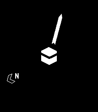
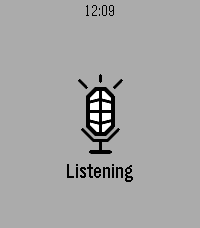
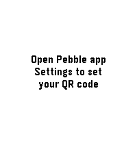
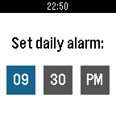
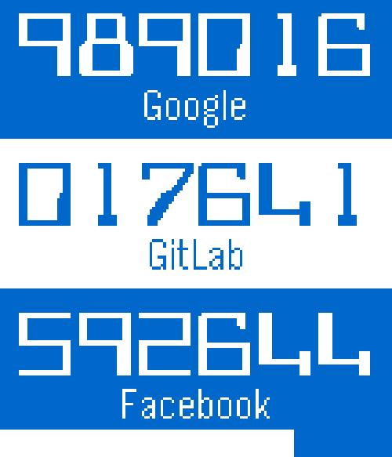
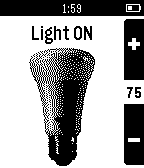
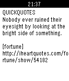
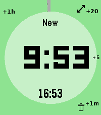
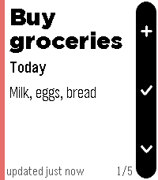
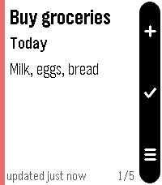

<!-- Generated by scripts/update_app_directory.py: do not edit by hand -->
# Watchapps: Q

[← About this list](../watchapps.md) · [A](a.md) · [B](b.md) · [C](c.md) · [D](d.md) · [E](e.md) · [F](f.md) · [G](g.md) · [H](h.md) · [I](i.md) · [J](j.md) · [K](k.md) · [L](l.md) · [M](m.md) · [N](n.md) · [O](o.md) · [P](p.md) · **Q** · [R](r.md) · [S](s.md) · [T](t.md) · [U](u.md) · [V](v.md) · [W](w.md) · [X](x.md) · [Y](y.md) · [Z](z.md) · [0–9 & other](other.md)

*19 watchapps · Last updated 2026-10-06*

| Screenshot | Name | Developer | Licence | Updated | Description |
|------------|------|-----------|---------|---------|-------------|
| { loading=lazy width="72" } | [Qibla - Prayer Times & Compass](https://apps.repebble.com/53ab84141d576ea3c30000d6) | [Collin Fair](https://github.com/cpfair/pebble-qibla) | <small>Not checked yet</small> | 2016-09-14 | Prayer times & notifications on your Timeline, plus a Qibla compass for your Pebble. Automatically calculates prayer times based on your location - so make… |
| { loading=lazy width="72" } | [Qibla - Prayer Times & Compass (NEW)](https://apps.repebble.com/69aaf1e62f1bed0009deb65b) | [Jibran Iqbal](https://github.com/jibraniqbal666/pebble-qibla) | <small>Not checked yet</small> | 2026-06-15 | Prayer times & notifications on your Timeline, plus a Qibla compass for your Pebble. Automatically calculates prayer times based on your location - so make… |
| { loading=lazy width="72" } | [qnote](https://apps.repebble.com/2d83367c2e4a408a807bd2e5) | [Neonfire](https://github.com/neonfire42/qnote) | <small>Not checked yet</small> | 2026-09-04 | Speak a note into your Pebble. It's on your phone before you lower your wrist. Opening qnote starts dictation immediately - no menu, no button to find… |
| { loading=lazy width="72" } | [QR Display](https://apps.rebble.io/en_US/application/6a36952969dd300009e91831) <small>Rebble App Store</small> | [SantiagoDePolonia](https://github.com/SantiagoDePolonia/QR_Display_repebble) | <small>Not checked yet</small> | 2026-06-20 | Turn any text into a QR code right on your watch. Type a URL, Wi-Fi password, contact, note, or any text in the app's settings on your phone, and QR Display… |
| { loading=lazy width="72" } | [QR Generator](https://apps.repebble.com/535e84d0af59179a46000088) | [Christian Reinbacher](https://github.com/reini1305/qrgenerator) | <small>Not checked yet</small> | 2016-10-24 | This app is open source! If you like my apps heart them in the appstore and consider a donation (link is at the source link of this app). Displays your… |
| { loading=lazy width="72" } | [QR Generator](https://apps.rebble.io/en_US/application/67ddcf03d8284900098ed1a4) <small>Rebble App Store</small> | [Flynn Duniho](https://github.com/flynnD273/pebble-qr) | <small>Not checked yet</small> | 2026-03-03 | Display configurable QR codes from your watch |
| { loading=lazy width="72" } | [QR Viewer](https://apps.repebble.com/4a491e1c63d44729af0dcc57) | [Vintage Mainspring](https://github.com/watollop/qr-viewer) | <small>Not checked yet</small> | 2026-06-09 | A lightweight Pebble app that displays a static QR code directly on your watch screen. Ideal for quick access to payment codes, attendance check-ins… |
| { loading=lazy width="72" } | [QRBuddy for Pebble](https://apps.rebble.io/en_US/application/55c712656b4abe9e19000069) <small>Rebble App Store</small> | [Tyler Ouyang](https://github.com/tylerwowen/wechatbuddy) | <small>Not checked yet</small> | 2015-10-04 | Show your QR code on your wrist in a second. 1. Install iOS app 'QRBuddy for Pebble' 2. Install Pebble Watchapp 'QRBuddy for Pebble' 3. Save your QR code to… |
| { loading=lazy width="72" } | [Quebble](https://apps.repebble.com/568057b24893f90bb2000098) | [Quentin Bellanger](https://github.com/bellangerq/quebble) | <small>Not checked yet</small> | 2016-09-11 | Because some days can be tough, Quebble sends you one motivational quote every day on your wrist. Get inspirational ideas and upgrade your mood with a… |
|  | [Queue Times](https://apps.repebble.com/b741ee9dcce54a5f98738dea) | [Ryan F](https://github.com/Link1400/Queue-Times) | <small>Not checked yet</small> | 2026-08-02 | Powered by queue-times.com API Please excuse the screenshots, the emulator kept hitting back Have you ever been at a theme park and wanted a quick and easy… |
| { loading=lazy width="72" } | [QuickAuth](https://apps.repebble.com/53131df8bb31cf87cd00019a) | [Kevin Cooper](https://github.com/JumpMaster/QuickAuth) | GPL-3.0 | 2016-11-30 | Get your one time codes from your Pebble! Just add your keys using the configuration page and use two-step authentication without the Google Authenticator… |
| { loading=lazy width="72" } | [QuickAuth 4](https://apps.rebble.io/en_US/application/64d25223482a0c03a5ab933a) <small>Rebble App Store</small> | [Gonzalo Muñoz](https://github.com/zamuz/QuickAuth4) | <small>Not checked yet</small> | 2023-08-08 | A fork of the original QuickAuth app by Kevin Cooper, now with support for SHA256 codes. |
| { loading=lazy width="72" } | [QuickHarvard](https://apps.repebble.com/54adadf34fdd2ade80000112) | [Ved Topkar](https://github.com/vedtopkar/quickharvard.git) | <small>Not checked yet</small> | 2015-01-07 | Quickly access information pertaining to Harvard dining (daily menu) and shuttle service (shuttle tracker). |
| { loading=lazy width="72" } | [QuickHue](https://apps.repebble.com/5526f89e1c36ea04bd00006b) | [carlosperate](http://github.com/carlosperate/PebbleQuickHue) | MIT | 2026-04-18 | Pebble app to facilitate quick control of a Philips Hue light bulb. It will toggle the preselected light ON or OFF as soon as the app loads, so it is… |
| { loading=lazy width="72" } | [quickquotes](https://apps.repebble.com/537d57142859a8c5b900007c) | [virgc](https://github.com/virginiacook/quickquotes) | <small>Not checked yet</small> | 2014-05-22 | Displays a random quote for the user. Press the middle button to randomize. Quotes provided by the iheartquotes api. |
| { loading=lazy width="72" } | [QuickTimer](https://apps.repebble.com/63a5cca9f2e945c092123615) | [jazzabeanie](https://github.com/jazzabeanie/pebble-timer-quick) | <small>Not checked yet</small> | 2026-06-29 | # pebble-timer-quick QuickTimer is a timer app for the Pebble Smartwatch, intended to be the fastest way to start a timer or stopwatch. Made for people that… |
| { loading=lazy width="72" } | [QuickTodoist](https://apps.repebble.com/10f3dfb18e4d4256824ad844) | [Tools on Tech](https://gitlab.com/tools-on-tech/quicktodoist) | <small>Not checked yet</small> | 2026-08-05 | I wanted a Todoist app that would start instantly. So this setup uses an api key and cache to make that possible. It's meant for me to quickly check my… |
| { loading=lazy width="72" } | [QuickTodoist](https://apps.rebble.io/en_US/application/6a64c6081eb8590009121b9d) <small>Rebble App Store</small> | [Tools on Tech](https://gitlab.com/tools-on-tech/quicktodoist) | <small>Not checked yet</small> | 2026-07-25 | Today's Todoist tasks. Instantly. Built for speed: the watch renders your cached task list the moment the app opens - no spinner, no waiting for your phone… |
| { loading=lazy width="72" } | [Quran](https://apps.repebble.com/4037fe94ec644729a49b6461) | [Aymane Taibi](https://github.com/nimda95/Pebble-Quran-Offline) | <small>Not checked yet</small> | 2026-08-12 | The Holy Quran fully offline independent from phone connectivity. |
