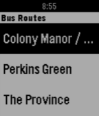

---
hide:
  - toc
---

<!-- Generated by scripts/update_app_directory.py: do not edit by hand -->
# Pebble Apps: R

[← All Pebble Apps](../watchapps.md) · [A](a.md) · [B](b.md) · [C](c.md) · [D](d.md) · [E](e.md) · [F](f.md) · [G](g.md) · [H](h.md) · [I](i.md) · [J](j.md) · [K](k.md) · [L](l.md) · [M](m.md) · [N](n.md) · [O](o.md) · [P](p.md) · [Q](q.md) · **R** · [S](s.md) · [T](t.md) · [U](u.md) · [V](v.md) · [W](w.md) · [X](x.md) · [Y](y.md) · [Z](z.md) · [0–9 & other](other.md)

*74 apps · Last updated 2026-10-06 · [About these lists](../about-app-lists.md)*

<h2 class="app-name" id="app-57b7ea4fbb85eddc98000910"><a href="https://apps.repebble.com/57b7ea4fbb85eddc98000910">RaceTimer</a></h2>
<a class="app-source" href="https://github.com/jessedusty/RaceTimer" title="Source code" data-search-exclude>View source</a>

by <a href="https://apps.repebble.com/apps/dev/jesse-stevenson_554a5bc71c6fe7228500006b" title="More from this developer">Jesse Stevenson</a>

Not checked yet v1.1 Updated 2017-10-01

Runs on: Time 2, Pebble 2 Duo, Pebble 2, Time, Classic

Watchapp for sailors that want a timer that reminds them of the passage of time during a 5 minute dingy start. Sync to nearest horn with the select button. Advance or regrade by 10 seconds with…

<h2 class="app-name" id="app-02b779dcf9084fecb0375df1"><a href="https://apps.repebble.com/02b779dcf9084fecb0375df1">Radiant Lyrics</a></h2>
<a class="app-source" href="https://github.com/meowarex/rl-pebble" title="Source code" data-search-exclude>View source</a>

by <a href="https://apps.repebble.com/apps/dev/meowarex_a367b02b52abb6fdca6cbe15" title="More from this developer">meowarex</a>

Not checked yet v1.3.0 Updated 2026-09-17

Runs on: Round 2, Time 2, Pebble 2 Duo, Pebble 2, Time Round, Time

Relays Radiant Lyrics to your Pebble Time 2!

<h2 class="app-name" id="app-d42063edd3194272807c7eeb"><a href="https://apps.repebble.com/d42063edd3194272807c7eeb">Rain Map</a></h2>
<a class="app-source" href="https://github.com/truhanen/pebble-rain-map" title="Source code" data-search-exclude>View source</a>

by <a href="https://apps.repebble.com/apps/dev/tuukka-ruhanen_2a1ec999749817a461025038" title="More from this developer">Tuukka Ruhanen</a>

Not checked yet v2.1.1 Updated 2026-08-27

Runs on: Time 2

App for viewing recent rain radar data. For the most accurate near-future rain forecast. The app features proximity-based resolution, to give you the most detailed data closest to your location…

<h2 class="app-name" id="app-02d34a66846d4bd89c300ae6"><a href="https://apps.repebble.com/02d34a66846d4bd89c300ae6">Rain Map Finland</a></h2>
<a class="app-source" href="https://github.com/truhanen/pebble-rain-map-finland" title="Source code" data-search-exclude>View source</a>

by <a href="https://apps.repebble.com/apps/dev/tuukka-ruhanen_2a1ec999749817a461025038" title="More from this developer">Tuukka Ruhanen</a>

Not checked yet v1.4.0 Updated 2026-06-04

Runs on: Time 2

App for viewing recent rain radar data in Finland. For the most accurate rain forecast. This is an earlier, Finland-only version of my other app, Rain Map. Rain Map has all the same features, and…

<h2 class="app-name" id="app-f8d809ec478d4dd9a8af1450"><a href="https://apps.repebble.com/f8d809ec478d4dd9a8af1450">Rain Radar</a></h2>
<a class="app-source" href="https://github.com/MarkBrack/pebble-weather-radar" title="Source code" data-search-exclude>View source</a>

by <a href="https://apps.repebble.com/apps/dev/mark-brackenborough_ce59705c6fa3e86a17db5e3e" title="More from this developer">Mark Brackenborough</a>

No licence v4.5.0 Updated 2026-09-19

Runs on: Time 2

See rain heading your way, right from your wrist. Rain Radar combines animated rain radar with a clear street map centred on your location, helping you judge where the rain is and whether it’s…

<h2 class="app-name" id="app-53e34a13b52fe7649500013b"><a href="https://apps.repebble.com/53e34a13b52fe7649500013b">Random</a></h2>
<a class="app-source" href="https://github.com/tstein4/random-pebble" title="Source code" data-search-exclude>View source</a>

by <a href="https://apps.repebble.com/apps/dev/tj-stein_52b91beca1d2df1269000037" title="More from this developer">TJ Stein</a>

Not checked yet v2.0 Updated 2014-08-21

Runs on: Time 2, Pebble 2 Duo, Pebble 2, Time, Classic

Ever needed a bit of randomness to make a decision? Well then this is the app for you! Formerly Coin Flip, this app now has a brand new Random Number Generator in addition to the old coin flipping…

<h2 class="app-name" id="app-5ac4bf6cf38588775f000125"><a href="https://apps.rebble.io/en_US/application/5ac4bf6cf38588775f000125">RandomReminder</a></h2>
<a class="app-source" href="https://github.com/stosem/pebble-app-RandomReminder" title="Source code" data-search-exclude>View source</a>

by <a href="https://apps.rebble.io/en_US/developer/5a2a0e690dfc329d17001135/1" title="More from this developer">stosem</a>

Not checked yet v1.0 Updated 2018-04-04 Rebble App Store

Runs on: Round 2, Time 2, Pebble 2 Duo, Pebble 2, Time Round, Time, Classic

RandomReminder. You can set up to 8 remindes in a day which will be happend in random time on specified period. It useful for remind for drink enough of water in a day, step away from computer…

<h2 class="app-name" id="app-5abf322df38588510f000046"><a href="https://apps.rebble.io/en_US/application/5abf322df38588510f000046">RandomTimer</a></h2>
<a class="app-source" href="https://github.com/stosem/pebble-app-RandomTimer" title="Source code" data-search-exclude>View source</a>

by <a href="https://apps.rebble.io/en_US/developer/5a2a0e690dfc329d17001135/1" title="More from this developer">stosem</a>

Not checked yet v1.1 Updated 2018-04-04 Rebble App Store

Runs on: Round 2, Time 2, Pebble 2 Duo, Pebble 2, Time Round, Time, Classic

RandomTimer. Countdown timer with random interval. Useful for board or party games (like hot potato) with reaction. Also may used in some other practice where you need a countdown that will expire…

<h2 class="app-name" id="app-56f978253c131b455b000009"><a href="https://apps.repebble.com/56f978253c131b455b000009">raspio</a></h2>
<a class="app-source" href="https://github.com/Roemke/pebbleraspio" title="Source code" data-search-exclude>View source</a>

by <a href="https://apps.repebble.com/apps/dev/karo_54da388a5f4f24af68000090" title="More from this developer">KaRo</a>

MIT v1.2 Updated 2016-04-01

Runs on: Time 2, Pebble 2 Duo, Pebble 2, Time, Classic

Control Vu+ Solo satelite receiver and Raspberry Pi Internetradio. See Github for more information (link to source code) Satellitenreceiver Vu+Solo und Internetradio steuern. Weitere Informationen…

<h2 class="app-name" id="app-562eca98a3c514c92a00001b"><a href="https://apps.repebble.com/562eca98a3c514c92a00001b">React</a></h2>
<a class="app-source" href="https://github.com/davidozhang/pebblereact" title="Source code" data-search-exclude>View source</a>

by <a href="https://apps.repebble.com/apps/dev/david-zhang_558a4e13fb51551e4b000050" title="More from this developer">David Zhang</a>

Not checked yet v1.1 Updated 2015-10-28

Runs on: Time 2, Pebble 2 Duo, Pebble 2, Time, Classic

Test your reaction time with this simple reaction-testing app!

<h2 class="app-name" id="app-52f9c21e8bc57c9c820000db"><a href="https://apps.repebble.com/52f9c21e8bc57c9c820000db">Readebble</a></h2>
<a class="app-source" href="https://github.com/Neal/Readebble" title="Source code" data-search-exclude>View source</a>

by <a href="https://apps.repebble.com/apps/dev/neal-patel_528feeab8a8c0b97c8000005" title="More from this developer">Neal Patel</a>

MIT v2.2 Updated 2015-01-13

Runs on: Time 2, Pebble 2 Duo, Pebble 2, Time, Classic

A multiple source RSS reader for Pebble that allows you to read the headlines of your favorite feeds and a summarized story for each headline. *NEW: Pocket support. Add items to your Pocket by…

<h2 class="app-name" id="app-5300e4029810e0a8940000e8"><a href="https://apps.repebble.com/5300e4029810e0a8940000e8">Rebble</a></h2>
<a class="app-source" href="https://github.com/Spacetech/Rebble" title="Source code" data-search-exclude>View source</a>

by <a href="https://apps.repebble.com/apps/dev/polynomial_5300e28408b054089b0000dd" title="More from this developer">polyNOMial</a>

MIT v1.4 Updated 2015-04-28

Runs on: Time 2, Pebble 2 Duo, Pebble 2, Time, Classic

Reddit on the Pebble Smartwatch. With Rebble, you can easily view Reddit on the go; You can read threads and view linked images. You can sign in and browse your favorite subreddits and even upvote…

<h2 class="app-name" id="app-6a2d9fdbe24af40009fa531e"><a href="https://apps.repebble.com/6a2d9fdbe24af40009fa531e">REcounter</a></h2>
<a class="app-source" href="https://git.wetfence.xyz/RandyTheSilly/REcounter" title="Source code" data-search-exclude>View source</a>

by <a href="https://apps.repebble.com/apps/dev/randythesilly_68e97cfa1c6711000953d795" title="More from this developer">RandyTheSilly</a>

See source v1.0.0 Updated 2026-06-13

Runs on: Round 2, Time 2, Pebble 2 Duo, Pebble 2, Time Round, Time, Classic

Why? Because, in an era where a simple counter app would likely be left up to the AI overlords, I&#x27;d rather just fork something some guy made in 2014 and add touch support. This fork of the…

<h2 class="app-name" id="app-53cbaca97e8944cab0749b1e"><a href="https://apps.repebble.com/53cbaca97e8944cab0749b1e">Red Flagr</a></h2>
<a class="app-source" href="https://github.com/salim-benhamadi/Pebble-Red-Flagr" title="Source code" data-search-exclude>View source</a>

by <a href="https://apps.repebble.com/apps/dev/salim-benhamadi_661d02d636de4056f2a5eada" title="More from this developer">Salim Benhamadi</a>

Not checked yet v1.0.3 Updated 2026-09-29

Runs on: Round 2, Time 2, Pebble 2 Duo, Pebble 2, Time Round, Time, Classic

Would you like to know if he&#x27;s the one, or just one more red flag? Red Flagr is the magic 8-ball for your love life, and it lives on your wrist. Shake your Pebble and it reveals a red flag about…

<h2 class="app-name" id="app-54bc4ded53e5a72ad60000b0"><a href="https://apps.repebble.com/54bc4ded53e5a72ad60000b0">Redloj - Bip!QR e Itinerario</a></h2>
<a class="app-source" href="https://git.7709.cl/e/redloj" title="Source code" data-search-exclude>View source</a>

by <a href="https://apps.repebble.com/apps/dev/xorcl_53134ca2bb31cf87cd000254" title="More from this developer">xorcl</a>

See source v3.0.0 Updated 2026-09-05

Runs on: Round 2, Time 2, Pebble 2 Duo, Pebble 2, Time Round, Time, Classic

English: (This application was called &quot;Transanpbl&quot; and then &quot;Redpbl&quot;. It maintains that functionality, adding Bip!QR payments) Santiago de Chile&#x27;s Public Bus System (Also known as Red Movilidad)…

<h2 class="app-name" id="app-62bcf5295724432897c2e7cc"><a href="https://apps.repebble.com/62bcf5295724432897c2e7cc">Ref Match</a></h2>
<a class="app-source" href="https://github.com/briancbarrow/ref-match" title="Source code" data-search-exclude>View source</a>

by <a href="https://apps.repebble.com/apps/dev/brian-barrow_f274760627a9ea167ea488f3" title="More from this developer">Brian Barrow</a>

No licence v0.1.0 Updated 2026-08-29

Runs on: Round 2, Time 2

App to record time, goals, cards as a soccer referee

<h2 class="app-name" id="app-53f45811d1a7a93dff00014e"><a href="https://apps.repebble.com/53f45811d1a7a93dff00014e">RefWatch</a></h2>
<a class="app-source" href="https://github.com/zaubererty/RefWatch" title="Source code" data-search-exclude>View source</a>

by <a href="https://apps.repebble.com/apps/dev/zauberertz_52f00b8a4ae363b8e300007d" title="More from this developer">Zauberertz</a>

Not checked yet v1.2 Updated 2015-03-15

Runs on: Time 2, Pebble 2 Duo, Pebble 2, Time, Classic

This is a soccer referee watch app with pre defined profiles for swiss football Up Button: * Long - Start / Pause * Long while game running - Time penalty * Short after break - Shift period (1.2)…

<a class="app-shot" href="https://apps.repebble.com/6ebeacb4c7fc47d9950942df" data-search-exclude>No screenshot</a>

<h2 class="app-name" id="app-6ebeacb4c7fc47d9950942df"><a href="https://apps.repebble.com/6ebeacb4c7fc47d9950942df">Reload Face</a></h2>
<a class="app-source" href="https://github.com/andrewchilds/pebble-watchface-reload" title="Source code" data-search-exclude>View source</a>

by <a href="https://apps.repebble.com/apps/dev/andrewfchilds_109102dd9dbda1b7e4b51462" title="More from this developer">andrewfchilds</a>

MIT v1.0.0 Updated 2026-06-08

Runs on: Round 2, Time 2, Pebble 2 Duo, Pebble 2, Time Round, Time, Classic

Immediately exits and reloads your selected watchface.

<h2 class="app-name" id="app-594cde1eb67f9fae630013ae"><a href="https://apps.rebble.io/en_US/application/594cde1eb67f9fae630013ae">Reminder</a></h2>
<a class="app-source" href="https://github.com/AzzRun/Pebble-Reminder" title="Source code" data-search-exclude>View source</a>

by <a href="https://apps.rebble.io/en_US/developer/592d05870dfc326582000aee/1" title="More from this developer">AzRun</a>

No licence v1.1-rbl1 Updated 2019-07-24 Rebble App Store

Runs on: Round 2, Time 2, Pebble 2 Duo, Pebble 2, Time Round, Time, Classic

<h2 class="app-name" id="app-d7f2ccd94a0746d1a059433a"><a href="https://apps.repebble.com/d7f2ccd94a0746d1a059433a">Remindery</a></h2>
<a class="app-source" href="https://github.com/GeezusChrotch/reminderz" title="Source code" data-search-exclude>View source</a>

by <a href="https://apps.repebble.com/apps/dev/organik-apps_7d03e7e4a48fa1d6c0de8596" title="More from this developer">Organik Apps</a>

MIT v1.4.2 Updated 2026-09-07

Runs on: Time 2, Time

Remindery brings Apple Reminders to Pebble Time and Pebble Time 2. Browse lists, check or reopen reminders, dictate new items, and delete with confirmation. Pin favorite lists and browse every…

<h2 class="app-name" id="app-5638629377a1ea802e000027"><a href="https://apps.repebble.com/5638629377a1ea802e000027">RemindMe</a></h2>
<a class="app-source" href="https://github.com/davidstosik/pebble-remind-me" title="Source code" data-search-exclude>View source</a>

by <a href="https://apps.repebble.com/apps/dev/david-stosik_535657c3c822ffc62800014f" title="More from this developer">David Stosik</a>

Not checked yet v1.2 Updated 2015-11-09

Runs on: Round 2, Time 2, Time Round, Time

Create reminders on your Pebble watch the easiest possible way. ## Idea Dumb, repetitive and mechanical tasks (doing the dishes, taking a shower, driving to work, jogging, what-have-you) are…

<h2 class="app-name" id="app-5afda2da461a8d6af4000d7b"><a href="https://apps.rebble.io/en_US/application/5afda2da461a8d6af4000d7b">Remote for Automate</a></h2>
<a class="app-source" href="https://github.com/greenlover1991/pebble-remote-for-automate" title="Source code" data-search-exclude>View source</a>

by <a href="https://apps.rebble.io/en_US/developer/58d3bcef6ca387cb86000cf8/1" title="More from this developer">Steven Go</a>

Not checked yet v1.1 Updated 2018-05-17 Rebble App Store

Runs on: Round 2, Time 2, Pebble 2 Duo, Pebble 2, Time Round, Time, Classic

Ever wanted to have more control of your phone via your Pebble? Wanted to send a text, start the flashlight, toggle the WiFi, get the bus&#x27; ETA, send an HTTP request with parameters, trigger the…

<h2 class="app-name" id="app-562cfbeab56e5de360000091"><a href="https://apps.repebble.com/562cfbeab56e5de360000091">Remote for LIFX</a></h2>
<a class="app-source" href="https://github.com/kz/lifx-pebble-app" title="Source code" data-search-exclude>View source</a>

by <a href="https://apps.repebble.com/apps/dev/thepurplek_5606dc7f2f167dbd3d000076" title="More from this developer">ThePurpleK</a>

Not checked yet v1.2 Updated 2016-10-02

Runs on: Round 2, Time 2, Pebble 2 Duo, Pebble 2, Time Round, Time, Classic

Toggle your LIFX lights and activate your scenes using Remote for LIFX. Suggestions? Bugs? Feel free to get in touch! Disclaimer: Remote for LIFX is an unofficial app and is not affiliated with…

<h2 class="app-name" id="app-52ebbc927d49761086000033"><a href="https://apps.repebble.com/52ebbc927d49761086000033">Remote Presentations</a></h2>
<a class="app-source" href="https://github.com/sergioaraki/RemotePresentations" title="Source code" data-search-exclude>View source</a>

by <a href="https://apps.repebble.com/apps/dev/sergio-araki_52b1e53cc8363de035000007" title="More from this developer">Sergio Araki</a>

Not checked yet v1.2 Updated 2014-11-02

Runs on: Time 2, Pebble 2 Duo, Pebble 2, Time, Classic

Controls HTML5 presentations from your wrist. You will need a computer running the server side, follow instructions from: https://github.com/sergioaraki/RemotePresentations

<h2 class="app-name" id="app-54c025140badda221300007f"><a href="https://apps.repebble.com/54c025140badda221300007f">Reservoir</a></h2>
<a class="app-source" href="https://github.com/a--hoang/pebble-reservoir" title="Source code" data-search-exclude>View source</a>

by <a href="https://apps.repebble.com/apps/dev/elton-tian-andrew-hoang_54b92e29ffc3fdb279000053" title="More from this developer">Elton Tian, Andrew Hoang</a>

No licence v1.0 Updated 2015-01-21

Runs on: Time 2, Pebble 2 Duo, Pebble 2, Time, Classic

Reservoir will help you keep track of your daily water consumption habits and running statistics over time. We hope to make staying hydrated as effortless and entertaining as possible: say bye-bye…

<h2 class="app-name" id="app-5855a09206e77674a7000177"><a href="https://apps.rebble.io/en_US/application/5855a09206e77674a7000177">Resistor calculator</a></h2>
<a class="app-source" href="https://github.com/bobbiy/Resistors" title="Source code" data-search-exclude>View source</a>

by <a href="https://apps.rebble.io/en_US/developer/583c369a00355a8e2700075f/1" title="More from this developer">Bram Rausch</a>

No licence v2.1 Updated 2017-01-03 Rebble App Store

Runs on: Round 2, Time 2, Time Round, Time

This is an app to help you find the value of a 4-ring resistor.

<h2 class="app-name" id="app-53ff41ed8cdf37902b000050"><a href="https://apps.repebble.com/53ff41ed8cdf37902b000050">Rest</a></h2>
<a class="app-source" href="https://github.com/remy/rest" title="Source code" data-search-exclude>View source</a>

by <a href="https://apps.repebble.com/apps/dev/remy-sharp_52f219def21676b008001172" title="More from this developer">Remy Sharp</a>

Not checked yet v2.0 Updated 2015-07-29

Runs on: Time 2, Pebble 2 Duo, Pebble 2, Time, Classic

Simple and intuitive rest interval timer. Particularly useful for timing rests in the gym, with configurable presets, vibrate on done and an overrun counter. The main menu buttons also work on the…

<h2 class="app-name" id="app-5a1add180dfc32dba0000dd3"><a href="https://apps.rebble.io/en_US/application/5a1add180dfc32dba0000dd3">Rest Time</a></h2>
<a class="app-source" href="https://github.com/aleung/rest-time" title="Source code" data-search-exclude>View source</a>

by <a href="https://apps.rebble.io/en_US/developer/5313f1b743d9607ef00003c7/1" title="More from this developer">Leo Liang</a>

No licence v2.2 Updated 2017-11-26 Rebble App Store

Runs on: Time 2, Pebble 2 Duo, Pebble 2, Time, Classic

A Pebble app that reminds you to rest. Two clock displays: the bottom shows the current time, the top shows a timer counting down the time until your next break. Controls Up Button: Reset the…

<h2 class="app-name" id="app-552d2c598215a262c0000018"><a href="https://apps.repebble.com/552d2c598215a262c0000018">Rest Time</a></h2>
<a class="app-source" href="https://github.com/mattd/rest-time" title="Source code" data-search-exclude>View source</a>

by <a href="https://apps.repebble.com/apps/dev/matt-dawson_52f4338ea991ccfb8b00030e" title="More from this developer">Matt Dawson</a>

Not checked yet v1.5 Updated 2015-12-22

Runs on: Time 2, Pebble 2 Duo, Pebble 2, Time, Classic

A Pebble app that reminds you to rest.

<h2 class="app-name" id="app-931683527605431e96bf2772"><a href="https://apps.repebble.com/931683527605431e96bf2772">RESTForge</a></h2>
<a class="app-source" href="https://github.com/snonux/restforge" title="Source code" data-search-exclude>View source</a>

by <a href="https://apps.repebble.com/apps/dev/paul-b-tow_879658cff76b318b7b31f6af" title="More from this developer">Paul Bütow</a>

Not checked yet v0.6 Updated 2026-08-19

Runs on: Round 2, Time 2

RESTForge — control any Siren API from your wrist RESTForge turns your Pebble into a remote control for any web API that speaks Siren — a standard way for a server to describe itself. You don&#x27;t…

<h2 class="app-name" id="app-52e52eff97213707e0000595"><a href="https://apps.repebble.com/52e52eff97213707e0000595">Revolution YachtTimer, StopWatch, Countdown, Yacht Timer</a></h2>
<a class="app-source" href="https://github.com/MikeMoore63/RevolutionStopWatch" title="Source code" data-search-exclude>View source</a>

by <a href="https://apps.repebble.com/apps/dev/mikem_5299a2ae129af7accf00005c" title="More from this developer">MikeM</a>

No licence v3.1 Updated 2015-05-05

Runs on: Time 2, Pebble 2 Duo, Pebble 2, Time, Classic

A version of Revolution Watch but as an App with Stopwatch, countdown, YachtTimer and Adjustment features.

<h2 class="app-name" id="app-c3e702834987434a8ec3d470"><a href="https://apps.repebble.com/c3e702834987434a8ec3d470">ReVolver</a></h2>
<a class="app-source" href="https://github.com/piotrserafin/ReVolver" title="Source code" data-search-exclude>View source</a>

by <a href="https://apps.repebble.com/apps/dev/piotr-serafin_a19d3e6ff0253a431a752641" title="More from this developer">Piotr Serafin</a>

Not checked yet v1.1.0 Updated 2026-09-04

Runs on: Round 2, Time 2, Pebble 2 Duo, Pebble 2, Time Round, Time, Classic

Remote control your Volvo car from your wrist. ReVolver — Remote Volvo controller. Also &quot;volver&quot; (Spanish): &quot;to return/come back&quot; to your car. Control your Volvo from your Pebble watch via the…

<h2 class="app-name" id="app-a85552c5082244e398ad79f1"><a href="https://apps.repebble.com/a85552c5082244e398ad79f1">RFD Hot Deals</a></h2>
<a class="app-source" href="https://github.com/JacobNussbaum/Pebble-RFD-hotdeals" title="Source code" data-search-exclude>View source</a>

by <a href="https://apps.repebble.com/apps/dev/sapphire-mainspring_ffbacd7465c00b9f11de7137" title="More from this developer">Sapphire Mainspring</a>

No licence v1.0 Updated 2026-09-13

Runs on: Round 2, Time 2, Pebble 2 Duo, Pebble 2, Time Round, Time, Classic

Canadian deals forum comes to your wrist! The Hot deals feed of Redflagdeals.com (No affiliation) vibe coded into a feed with comments intact you can check from your pebble watch. Built for the…

<h2 class="app-name" id="app-d0bf4929609b4a1baa6ba168"><a href="https://apps.repebble.com/d0bf4929609b4a1baa6ba168">RGB Backlight Test</a></h2>
<a class="app-source" href="https://github.com/brooks2564/rgb-backlight-test" title="Source code" data-search-exclude>View source</a>

by <a href="https://apps.repebble.com/apps/dev/brooman-inks_44b97418cf47663c00fb67bc" title="More from this developer">Brooman Inks</a>

No licence v1.0 Updated 2026-05-05

Runs on: Time 2

RGB Backlight Test A Pebble app for the Pebble Time 2 (Emery) to interactively test the RGB backlight using the new light_set_color_rgb888() API introduced in SDK 4.9.169. Features Live R, G, B…

<h2 class="app-name" id="app-69fd0a1a0c32da000906f9f9"><a href="https://apps.rebble.io/en_US/application/69fd0a1a0c32da000906f9f9">RHR Tracker</a></h2>
<a class="app-source" href="https://github.com/ToyFraz/RHR-tracker" title="Source code" data-search-exclude>View source</a>

by <a href="https://apps.rebble.io/en_US/developer/690d12be3399bf0009b60d10/1" title="More from this developer">ToyFraz</a>

MIT v1.66.0 Updated 2026-05-13 Rebble App Store

Runs on: Time 2

The app uses the information already gathered by Pebble Health, so it is very lightweight. It takes the heartrate measurements from the night before from 12:00 until 4:00 am. It discards any…

<h2 class="app-name" id="app-52ef1b925931845564000005"><a href="https://apps.repebble.com/52ef1b925931845564000005">Ricochet2</a></h2>
<a class="app-source" href="https://www.github.com/mjculross/Ricochet2" title="Source code" data-search-exclude>View source</a>

by <a href="https://apps.repebble.com/apps/dev/mjculross_52998a08e627ced73e000037" title="More from this developer">mjculross</a>

Not checked yet v2.3.0 Updated 2014-02-03

Runs on: Time 2, Pebble 2 Duo, Pebble 2, Time, Classic

Ricochet2: time &amp; date bounce around the screen &amp; ricochet off of each other

<h2 class="app-name" id="app-52ed9b199755252f26000005"><a href="https://apps.repebble.com/52ed9b199755252f26000005">RING MY PHONE</a></h2>
<a class="app-source" href="https://github.com/Wavesonics/RingMyPhonePebble" title="Source code" data-search-exclude>View source</a>

by <a href="https://apps.repebble.com/apps/dev/dark-rock-studios_52b2051cb70e1c6827000041" title="More from this developer">Dark Rock Studios</a>

MIT v3.0 Updated 2015-12-22

Runs on: Round 2, Time 2, Pebble 2 Duo, Pebble 2, Time Round, Time, Classic

Do you ever lose your phone and ask someone to call it so you can find it? No more! Now you can ring your phone from your Pebble smart watch. RingMyPhone is a simple Android app that allows you to…

<h2 class="app-name" id="app-861415a105c74b7cb81ae436"><a href="https://apps.repebble.com/861415a105c74b7cb81ae436">RingView</a></h2>
<a class="app-source" href="https://github.com/Nicell/ringview-pebble" title="Source code" data-search-exclude>View source</a>

by <a href="https://apps.repebble.com/apps/dev/nick-winans_d41cec2e1676d30103d578c3" title="More from this developer">Nick Winans</a>

MIT v1.0.0 Updated 2026-07-17

Runs on: Round 2, Time 2

Selected Oura health summaries on your Pebble.

<h2 class="app-name" id="app-378bcb0a5fac43ca91e051d0"><a href="https://apps.repebble.com/378bcb0a5fac43ca91e051d0">ripple</a></h2>
<a class="app-source" href="https://github.com/chorankates/ripple" title="Source code" data-search-exclude>View source</a>

by <a href="https://apps.repebble.com/apps/dev/conor-code_dbb81f26ddb9f47c715d60b9" title="More from this developer">conor.code</a>

Not checked yet v1.1 Updated 2025-12-24

Runs on: Round 2, Time 2, Pebble 2 Duo, Pebble 2, Time Round, Time, Classic

a timer application with a number of visualization options

<h2 class="app-name" id="app-7bff2f5004fa47e094b8c32d"><a href="https://apps.repebble.com/7bff2f5004fa47e094b8c32d">Ripple Alarm</a></h2>
<a class="app-source" href="https://github.com/ttkhamis/pebble_alarm" title="Source code" data-search-exclude>View source</a>

by <a href="https://apps.repebble.com/apps/dev/tom-khamis_221fb95fe8d07190aa28efe3" title="More from this developer">Tom Khamis</a>

Not checked yet v1.2.40 Updated 2026-09-15

Runs on: Time 2

A large-text alarm clock designed to be easy to read at a glance. Set up to 5 alarms from your phone — each with its own label, color, and weekly schedule.

<h2 class="app-name" id="app-57ca36d1f69d1da5f5000382"><a href="https://apps.repebble.com/57ca36d1f69d1da5f5000382">Ripples 3D</a></h2>
<a class="app-source" href="https://github.com/reciprocum/Pebble-SDK4-WatchApp-Ripples3D" title="Source code" data-search-exclude>View source</a>

by <a href="https://apps.repebble.com/apps/dev/afonso-santos_53c7f761e5c0719320000162" title="More from this developer">Afonso Santos</a>

Not checked yet v4.2 Updated 2017-01-25

Runs on: Round 2, Time 2, Pebble 2 Duo, Pebble 2, Time Round, Time, Classic

An interactive 3D math function demo. *** BUTTONS *** UP : colorization (Monochromatic,Distance). SELECT: pattern (Dots,Lines,Stripes,Grid). DOWN : oscillator (Anchored,Floating,Bouncing). long…

<h2 class="app-name" id="app-56e8053abbcd74ba4b000004"><a href="https://apps.repebble.com/56e8053abbcd74ba4b000004">RITBus [BETA]</a></h2>
<a class="app-source" href="https://github.com/Chris-Bitler/RITBus" title="Source code" data-search-exclude>View source</a>

by <a href="https://apps.repebble.com/apps/dev/chris-bitler_56db268aeeaab1a2af000030" title="More from this developer">Chris Bitler</a>

GPL-3.0 v1.2 Updated 2016-03-17

Runs on: Time 2, Pebble 2 Duo, Pebble 2, Time, Classic

An app that allows Rochester Institute of Technology students to see how soon the various campus busses are going to hit the bus stops. A few of these busses currently don&#x27;t work due to an issue…

<h2 class="app-name" id="app-f0b97c77cced465aa69b5044"><a href="https://apps.repebble.com/f0b97c77cced465aa69b5044">River Depth</a></h2>
<a class="app-source" href="https://github.com/qmonagle/RiverData" title="Source code" data-search-exclude>View source</a>

by <a href="https://apps.repebble.com/apps/dev/quentin-monagle_23d70dbde1f8d619a24b316c" title="More from this developer">Quentin Monagle</a>

Not checked yet v0.6 Updated 2026-04-24

Runs on: Time 2, Pebble 2 Duo, Pebble 2, Time, Classic

This app pulls depth data from river monitoring locations tracked by USGS. It then plots the last week of data, scaling automatically to your screen. The ID will default to a location near…

<h2 class="app-name" id="app-5544a7bbe62871ef6d000038"><a href="https://apps.repebble.com/5544a7bbe62871ef6d000038">RoboMaze</a></h2>
<a class="app-source" href="https://github.com/jackokring/pebble-sdk-examples/tree/master/watchapps/RoboMaze" title="Source code" data-search-exclude>View source</a>

by <a href="https://apps.repebble.com/apps/dev/simon-jackson_53b089fdb9bff86310000009" title="More from this developer">Simon Jackson</a>

Not checked yet v2.7 Updated 2015-10-17

Runs on: Time 2, Pebble 2 Duo, Pebble 2, Time, Classic

A simple game and watch face dual use app. The BACK button is mode select. Use long press BACK to exit. Features (Watch): Clock, Date, Stopwatch (959:59:59 seconds loop. Think old style 1st/2nd…

<h2 class="app-name" id="app-56acfea45319ec52a600003c"><a href="https://apps.repebble.com/56acfea45319ec52a600003c">Rock Crusher</a></h2>
<a class="app-source" href="https://github.com/timboe/RockCrush" title="Source code" data-search-exclude>View source</a>

by <a href="https://apps.repebble.com/apps/dev/tim-martin_552d83aa083523c826000080" title="More from this developer">Tim Martin</a>

Not checked yet v2.0.0 Updated 2026-06-27

Runs on: Round 2, Time 2, Pebble 2 Duo, Pebble 2, Time Round, Time, Classic

Rock Crusher is a match-three game for Pebble where you swap neighbouring rocks to get at least three of the same type in a row. The game ends when you have used all your lives and there are no…

<h2 class="app-name" id="app-5359f8493387a6efb600014b"><a href="https://apps.repebble.com/5359f8493387a6efb600014b">Rock Paper Scissors</a></h2>
<a class="app-source" href="https://github.com/randomite/Pebble/tree/master/RockPaperScissors" title="Source code" data-search-exclude>View source</a>

by <a href="https://apps.repebble.com/apps/dev/ravin_535406895fad0faa5b000198" title="More from this developer">Ravin</a>

Not checked yet v1.0 Updated 2014-04-25

Runs on: Time 2, Pebble 2 Duo, Pebble 2, Time, Classic

A simple rock paper scissor app for quick entertainment.

<h2 class="app-name" id="app-55379310fa195bf921000088"><a href="https://apps.repebble.com/55379310fa195bf921000088">Rock Paper Scissors the game</a></h2>
<a class="app-source" href="https://github.com/Crasytoser/RPS" title="Source code" data-search-exclude>View source</a>

by <a href="https://apps.repebble.com/apps/dev/djinn-gloom_549cf1c51127937b6200013b" title="More from this developer">Djinn Gloom</a>

No licence v1.0 Updated 2015-04-22

Runs on: Time 2, Pebble 2 Duo, Pebble 2, Time, Classic

Rock Paper Scissors. The watch will do it for you

<h2 class="app-name" id="app-479c3ffae56a4529bdeafced"><a href="https://apps.repebble.com/479c3ffae56a4529bdeafced">Rock Timer</a></h2>
<a class="app-source" href="https://github.com/snrkl-labs" title="Source code" data-search-exclude>View source</a>

by <a href="https://apps.repebble.com/apps/dev/snrkl-labs_4aece47c3cbfb14d594e6f1b" title="More from this developer">snrkl labs</a>

Not checked yet v0.11.0 Updated 2026-07-02

Runs on: Time 2, Pebble 2 Duo, Pebble 2

• Fork of the official Pebble timer app • Full touchscreen support — inertial drag-to-scroll, long-press / double-tap to select • Configurable timer presets, edited from your phone • Choose your…

<h2 class="app-name" id="app-637af1dac6c24a000a815ec3"><a href="https://apps.rebble.io/en_US/application/637af1dac6c24a000a815ec3">ROCK! The Vote</a></h2>
<a class="app-source" href="https://github.com/tertty/ROCK-the-Vote-backend" title="Source code" data-search-exclude>View source</a>

by <a href="https://apps.rebble.io/en_US/developer/52d4acb6d8d9dfc9e000002a/1" title="More from this developer">Stanivision Inc.</a>

Not checked yet v1.2 Updated 2025-03-16 Rebble App Store

Runs on: Round 2, Time 2, Pebble 2 Duo, Pebble 2, Time Round, Time, Classic

ROCK! The Vote is a Pebble application that allows you to voice your opinion, tip the scales, and influence those around you. Each day (12am UTC), users will be able to log into the app and see…

<h2 class="app-name" id="app-68b7d031bd624a9ebaeb9102"><a href="https://apps.repebble.com/68b7d031bd624a9ebaeb9102">Rockbeat</a></h2>
<a class="app-source" href="https://github.com/qichuan/pebble-rockbeat" title="Source code" data-search-exclude>View source</a>

by <a href="https://apps.repebble.com/apps/dev/zhang-qichuan_53043485117485c22f0000cf" title="More from this developer">Zhang Qichuan</a>

Not checked yet v1.4 Updated 2026-09-06

Runs on: Time 2, Pebble 2 Duo

A simple rhythm game. Just hit the UP or SELECT button to the melody! Right now you can play the following songs: Never Gonna Give You Up — Rick Astley You Are Not Alone — M. Jackson Golden —…

<h2 class="app-name" id="app-52bdf04583ed9124110000dc"><a href="https://apps.repebble.com/52bdf04583ed9124110000dc">Rogue Watch</a></h2>
<a class="app-source" href="https://github.com/jmlaitpebble/roguewatch" title="Source code" data-search-exclude>View source</a>

by <a href="https://apps.repebble.com/apps/dev/jeff-lait_52bdec2db1ce8e14c10000e7" title="More from this developer">Jeff Lait</a>

Not checked yet v1.0 Updated 2013-12-28

Runs on: Time 2, Pebble 2 Duo, Pebble 2, Time, Classic

A roguelike on your watch! H is health, D is Depth, and $ is your gold. Get as much as you can before you die!

<h2 class="app-name" id="app-52fb08c99ecfefd511000288"><a href="https://apps.repebble.com/52fb08c99ecfefd511000288">Rogue&#x27;s Ring</a></h2>
<a class="app-source" href="https://github.com/charlesrubach/RoguesRing.git" title="Source code" data-search-exclude>View source</a>

by <a href="https://apps.repebble.com/apps/dev/charles-rubach_52cb0a9d6e5f70711200001d" title="More from this developer">Charles Rubach</a>

Not checked yet v1.04 Updated 2016-05-13

Runs on: Time 2, Pebble 2 Duo, Pebble 2, Time, Classic

The Rogue&#x27;s Ring Companion App features cryptic hieroglyphs that provide crib notes for 24+ different Scam School effects. No matter what room you&#x27;re in, no matter what kind of crowd you&#x27;re faced…

<h2 class="app-name" id="app-567050ba2e7c0c788700003d"><a href="https://apps.repebble.com/567050ba2e7c0c788700003d">Roll</a></h2>
<a class="app-source" href="https://github.com/nonproftechie/roll" title="Source code" data-search-exclude>View source</a>

by <a href="https://apps.repebble.com/apps/dev/josh_562aeeb815ecb9261c00001f" title="More from this developer">Josh</a>

Not checked yet v1.0 Updated 2016-03-07

Runs on: Round 2, Time 2, Pebble 2 Duo, Pebble 2, Time Round, Time, Classic

Want to play a game that requires rolling a die, but you lost it? Have no fear, Roll app is near! Wiggle your Pebble or push one of the buttons to get your lucky number!

<h2 class="app-name" id="app-56081e08f4e5610339000055"><a href="https://apps.repebble.com/56081e08f4e5610339000055">Roomer</a></h2>
<a class="app-source" href="https://github.com/fletchto99/roomer-pebble" title="Source code" data-search-exclude>View source</a>

by <a href="https://apps.repebble.com/apps/dev/matt-langlois_52e30dd32645fb8bae000fcd" title="More from this developer">Matt Langlois</a>

Not checked yet v1.05 Updated 2015-12-16

Runs on: Time 2, Pebble 2 Duo, Pebble 2, Time, Classic

Would you like to have a quiet place to study on campus? Do you find the libraries to be too crowded sometimes? If so, Roomer is the perfect app for you. Roomer lets you find an empty classroom on…

<h2 class="app-name" id="app-696edc515cd4fc0009ce6f5c"><a href="https://apps.repebble.com/696edc515cd4fc0009ce6f5c">Roon Remote for Pebble</a></h2>
<a class="app-source" href="https://github.com/JunderscoreB/pebble-roon-remote" title="Source code" data-search-exclude>View source</a>

by <a href="https://apps.repebble.com/apps/dev/j-b_68ecfdbe1c671100088152be" title="More from this developer">J_B</a>

MIT v1.3.0 Updated 2026-09-29

Runs on: Round 2, Time 2, Pebble 2 Duo, Pebble 2, Time Round, Time, Classic

Roon Remote is a Pebble app that connects seamlessly to your Roon Core, letting you manage your audiophile endpoints without ever reaching for your phone. KEY FEATURES - Complete Playback Control…

<h2 class="app-name" id="app-5666e0e39a52c999eb00001f"><a href="https://apps.repebble.com/5666e0e39a52c999eb00001f">Rope Size</a></h2>
<a class="app-source" href="https://github.com/anderssonfilip/pebble-ropesize" title="Source code" data-search-exclude>View source</a>

by <a href="https://apps.repebble.com/apps/dev/filip_54edb7500cd3c5625500007b" title="More from this developer">Filip</a>

No licence v1.0 Updated 2015-12-08

Runs on: Time 2, Pebble 2 Duo, Pebble 2, Time, Classic

Utiltity for the Pebble watch to measure the dimension of a rope between 5/32&quot;(4mm) 1 1/32&quot; (26mm). Place part of the rope over the face of the watch to measure its width. Increase or decrease…

<h2 class="app-name" id="app-529993a5e627cef6e100004b"><a href="https://apps.repebble.com/529993a5e627cef6e100004b">Rosewright Chronograph</a></h2>
<a class="app-source" href="https://github.com/drwrose/rosewright.git" title="Source code" data-search-exclude>View source</a>

by <a href="https://apps.repebble.com/apps/dev/drwrose_52995888e627ce1aff000009" title="More from this developer">drwrose</a>

Not checked yet v5.1.0 Updated 2026-05-20

Runs on: Round 2, Time 2, Pebble 2 Duo, Pebble 2, Time Round, Time, Classic

An analog &quot;Chronograph&quot; three-subdial watchface. It&#x27;s a fully functioning stopwatch with start/stop and lap buttons, and 0.1-second resolution. Like all Rosewright faces, it is extensively…

<h2 class="app-name" id="app-68a759a7652aec0009f26c41"><a href="https://apps.repebble.com/68a759a7652aec0009f26c41">Rozkład jazdy pociągów Polish Trains</a></h2>
<a class="app-source" href="https://github.com/merito/rozklad_jazdy_pociagow" title="Source code" data-search-exclude>View source</a>

by <a href="https://apps.repebble.com/apps/dev/merito_6883657b0c0ce60008a5293f" title="More from this developer">merito</a>

Not checked yet v1.7.2 Updated 2026-09-10

Runs on: Time 2, Pebble 2 Duo, Pebble 2, Time, Classic

Never miss your train again! The app shows the closest stations and departures with delays, platform and track numbers. It primarily uses the custom backend in `rozklad_backend/` directory, which…

<h2 class="app-name" id="app-5491ca9da34dfb129d0000fa"><a href="https://apps.repebble.com/5491ca9da34dfb129d0000fa">RPI Shuttle Schedule</a></h2>
<a class="app-source" href="https://github.com/clarkb7/Pebble_RPI_Shuttle_Schedule" title="Source code" data-search-exclude>View source</a>

by <a href="https://apps.repebble.com/apps/dev/branden-clark_54440e55c7733b43f90000e9" title="More from this developer">Branden Clark</a>

Not checked yet v0.5 Updated 2017-02-08

Runs on: Time 2, Pebble 2 Duo, Pebble 2, Time, Classic

View the RPI Shuttle Schedule on your Pebble

<h2 class="app-name" id="app-541086d676c551c5790001f2"><a href="https://apps.repebble.com/541086d676c551c5790001f2">RPi-Monitor</a></h2>
<a class="app-source" href="https://github.com/kropochev/RPi-Monitor-Pebble" title="Source code" data-search-exclude>View source</a>

by <a href="https://apps.repebble.com/apps/dev/alexander-kropochev_53c4cc43e524ad62230000b4" title="More from this developer">Alexander Kropochev</a>

Not checked yet v1.4 Updated 2025-11-25

Runs on: Time 2, Pebble 2 Duo, Pebble 2, Time, Classic

App to monitor the status Raspberri Pi. Changelog of version 1.4: - Added support for basic authentication (Oscar R.C.) Important. You must install the RPi-Monitor…

<h2 class="app-name" id="app-5d8d503bc393f5215a13e5e6"><a href="https://apps.rebble.io/en_US/application/5d8d503bc393f5215a13e5e6">RSS Reader</a></h2>
<a class="app-source" href="https://github.com/Wowfunhappy/Pebble-RSS-Reader" title="Source code" data-search-exclude>View source</a>

by <a href="https://apps.rebble.io/en_US/developer/5d8d503bc393f5215a13e5e4/1" title="More from this developer">Jonathan Alland</a>

GPL-3.0 v2.0 Updated 2020-02-14 Rebble App Store

Runs on: Round 2, Time 2, Pebble 2 Duo, Pebble 2, Time Round, Time, Classic

Hands full? No problem! As long as you have a Pebble smartwatch and at least one free finger, you can read the news--no pulling out your phone required. Pebble RSS Reader is the only way to read…

<h2 class="app-name" id="app-599dc335461a8d8fd10011ed"><a href="https://apps.rebble.io/en_US/application/599dc335461a8d8fd10011ed">RU Bus</a></h2>
<a class="app-source" href="https://github.com/mnadev/RUBus" title="Source code" data-search-exclude>View source</a>

by <a href="https://apps.rebble.io/en_US/developer/595eb39bb67f9f43f80019a4/1" title="More from this developer">Mohammad Nadeem</a>

Not checked yet v1.0 Updated 2017-08-23 Rebble App Store

Runs on: Round 2, Time 2, Pebble 2 Duo, Pebble 2, Time Round, Time, Classic

A Pebble Watch App that lets you see Rutgers Bus Times on your Pebble.

<h2 class="app-name" id="app-accc6b0ed4da421198f5e503"><a href="https://apps.repebble.com/accc6b0ed4da421198f5e503">Rubik&#x27;s Cube</a></h2>
<a class="app-source" href="https://github.com/CATEIN/rubiks-cube-for-pebble" title="Source code" data-search-exclude>View source</a>

by <a href="https://apps.repebble.com/apps/dev/catein_5451ddc920d58674e460e802" title="More from this developer">CATEIN</a>

MIT v1.0.0 Updated 2026-08-29

Runs on: Time 2

Virtual Rubik&#x27;s Cube for Pebble Time 2. I got close to solving it but messed up on the last layer 😭 Open source so yall can fork and make it better. Made using Claude.

<h2 class="app-name" id="app-560ca51c2dd2f194aa000045"><a href="https://apps.repebble.com/560ca51c2dd2f194aa000045">Rubiks Shuffle</a></h2>
<a class="app-source" href="https://github.com/vlaadbrain/RubiksShuffle" title="Source code" data-search-exclude>View source</a>

by <a href="https://apps.repebble.com/apps/dev/carlos-j-torres_560ca4179c52a7e0e100004d" title="More from this developer">Carlos J. Torres</a>

Not checked yet v1.3 Updated 2015-10-16

Runs on: Time 2, Pebble 2 Duo, Pebble 2, Time, Classic

Shuffle Your Rubik&#x27;s Cube with your Pebble :) largely based on http://shuffle.akselipalen.com/

<h2 class="app-name" id="app-56410b02500343416c000086"><a href="https://apps.rebble.io/en_US/application/56410b02500343416c000086">RubikStopTap</a></h2>
<a class="app-source" href="https://github.com/aocodermx/RubikStopTap" title="Source code" data-search-exclude>View source</a>

by <a href="https://apps.rebble.io/en_US/developer/564109d4ae3ac6afa2000084/1" title="More from this developer">aocodermx</a>

GPL-3.0 v1.3 Updated 2016-01-17 Rebble App Store

Runs on: Round 2, Time 2, Pebble 2 Duo, Pebble 2, Time Round, Time, Classic

The best application to measure your time solving the Magic Cube, just select the size of your cube, Scramble your cube, shake your Pebble to start review time, when Pebble vibes start solving…

<h2 class="app-name" id="app-698adb61ea64380009779fa6"><a href="https://apps.repebble.com/698adb61ea64380009779fa6">RuckPebble</a></h2>
<a class="app-source" href="https://github.com/gordonbazeley/ruckpebble" title="Source code" data-search-exclude>View source</a>

by <a href="https://apps.repebble.com/apps/dev/modusapps_57f55e314529f5b84f00003f" title="More from this developer">ModusApps</a>

Not checked yet v1.4.4 Updated 2026-08-17

Runs on: Round 2, Time 2

Calculates calories expended during a ruck (aka moving quickly with a heavy pack on your back) using a modified version of the Pandolf equation which calculates based on weight, terrain and…

<h2 class="app-name" id="app-52ed51b6a77704c8c100000e"><a href="https://apps.repebble.com/52ed51b6a77704c8c100000e">Rudd</a></h2>
<a class="app-source" href="https://github.com/bday106/Rudd" title="Source code" data-search-exclude>View source</a>

by <a href="https://apps.repebble.com/apps/dev/gordon-weeks_52e2f79547a8e74636000e2b" title="More from this developer">Gordon Weeks</a>

No licence v2.0.0 Updated 2014-02-01

Runs on: Time 2, Pebble 2 Duo, Pebble 2, Time, Classic

Rudd is an app for Pebble that helps you manage time by vibrating on a set interval. When you&#x27;re working out for a given interval, don&#x27;t keep checking your watch, set Rudd for 1-2 minutes. Time…

<h2 class="app-name" id="app-58802e9a93254a9262000088"><a href="https://apps.rebble.io/en_US/application/58802e9a93254a9262000088">rumline</a></h2>
<a class="app-source" href="https://github.com/clint-tseng/rumline" title="Source code" data-search-exclude>View source</a>

by <a href="https://apps.rebble.io/en_US/developer/53ac46e3e9ecada316000030/1" title="More from this developer">Clint Tseng</a>

Not checked yet v0.2 Updated 2025-11-25 Rebble App Store

Runs on: Time 2, Time

Rumline tells you, very simply, which way to go and how far it is to get from here to there. You can preprogram a set of points into your watch, and then at any point pull up distance and bearing…

<h2 class="app-name" id="app-52f1fa11b9d04556a636bb3c"><a href="https://apps.repebble.com/52f1fa11b9d04556a636bb3c">Run Tracker</a></h2>
<a class="app-source" href="https://github.com/marian42/pebble-run-tracker" title="Source code" data-search-exclude>View source</a>

by <a href="https://apps.repebble.com/apps/dev/marian-kleineberg_baf010dd9e5a56929a4b069a" title="More from this developer">Marian Kleineberg</a>

Not checked yet v1.0 Updated 2026-04-12

Runs on: Round 2, Time 2, Pebble 2 Duo, Pebble 2, Time Round, Time, Classic

This is a run / walk tracker for Pebble with a focus on simplicity. It doesn&#x27;t require a companion app but it does require a connection to a phone for GPS. The app shows the time, distance and…

<h2 class="app-name" id="app-5eddde203dd3102760a948be"><a href="https://apps.rebble.io/en_US/application/5eddde203dd3102760a948be">Running</a></h2>
<a class="app-source" href="https://franz-bender.de" title="Source code" data-search-exclude>View source</a>

by <a href="https://apps.rebble.io/en_US/developer/5eddde1f3dd3102760a948bc/1" title="More from this developer">Franz Bender</a>

See source v1.0 Updated 2020-06-08 Rebble App Store

Runs on: Time 2, Time

This is a simple timer for runners. Especially on longer runs, one might need a break. At least I do sometimes. To be able to keep track of the length of the break, I developed this app. Press…

<h2 class="app-name" id="app-5722a9907adf6b48cf000018"><a href="https://apps.repebble.com/5722a9907adf6b48cf000018">Running assistant</a></h2>
<a class="app-source" href="https://github.com/Sichroteph/Running-Assistant" title="Source code" data-search-exclude>View source</a>

by <a href="https://apps.repebble.com/apps/dev/christophe-jeannette_54edf0599e4ff7cbf60000a0" title="More from this developer">Christophe Jeannette</a>

No licence v1.1 Updated 2016-04-29

Runs on: Round 2, Time 2, Pebble 2 Duo, Pebble 2, Time Round, Time, Classic

This app is specifically designed to help new joggers to gradualy start running, or to confort moderate joggers to reinforce their pace. Working with intervals, the app will strongly vibrate when…

<h2 class="app-name" id="app-53f32d22b62b051081000085"><a href="https://apps.repebble.com/53f32d22b62b051081000085">Running Coach</a></h2>
<a class="app-source" href="https://github.com/jango/pebble_running" title="Source code" data-search-exclude>View source</a>

by <a href="https://apps.repebble.com/apps/dev/nikita-pchelin_5361688475901be700000236" title="More from this developer">Nikita Pchelin</a>

Not checked yet v1.0 Updated 2014-08-19

Runs on: Time 2, Pebble 2 Duo, Pebble 2, Time, Classic

A running app that provides users with timers for each workout of the C25K and B210K running programs. A buzz will alert you about the end of a running or walking interval and you will also be…

<h2 class="app-name" id="app-57c2bbc3f69d1d18de0002d3"><a href="https://apps.repebble.com/57c2bbc3f69d1d18de0002d3">Ruter Departures</a></h2>
<a class="app-source" href="https://github.com/pebblejtkarlsen/RuterDepartures" title="Source code" data-search-exclude>View source</a>

by <a href="https://apps.repebble.com/apps/dev/jan-karlsen_5437d74d1d16a7d5120001f3" title="More from this developer">Jan Karlsen</a>

Not checked yet v1.0 Updated 2016-08-28

Runs on: Time 2, Pebble 2 Duo, Pebble 2, Time, Classic

Ruter Departures is an app for finding the departures of bus, tram, train and boats managed by the company Ruter. The app will locate the closest stops from your current location and when…

<h2 class="app-name" id="app-5521a22dd7356c80ea000059"><a href="https://apps.repebble.com/5521a22dd7356c80ea000059">Rutgers Bus and Dining</a></h2>
<a class="app-source" href="https://github.com/revan/Pebble-Rutgers" title="Source code" data-search-exclude>View source</a>

by <a href="https://apps.repebble.com/apps/dev/revan-sopher_5439632ffe01ff7df0000218" title="More from this developer">Revan Sopher</a>

Not checked yet v1.0 Updated 2015-04-07

Runs on: Time 2, Pebble 2 Duo, Pebble 2, Time, Classic

Provides bus times and dining hall menus for Rutgers New Brunswick.

