<!-- Generated by scripts/update_app_directory.py: do not edit by hand -->
# Watchapps: R

[← About this list](../watchapps.md) · [A](a.md) · [B](b.md) · [C](c.md) · [D](d.md) · [E](e.md) · [F](f.md) · [G](g.md) · [H](h.md) · [I](i.md) · [J](j.md) · [K](k.md) · [L](l.md) · [M](m.md) · [N](n.md) · [O](o.md) · [P](p.md) · [Q](q.md) · **R** · [S](s.md) · [T](t.md) · [U](u.md) · [V](v.md) · [W](w.md) · [X](x.md) · [Y](y.md) · [Z](z.md) · [0–9 & other](other.md)

*75 watchapps · Last updated 2026-10-06*

| Screenshot | Name | Developer | Licence | Updated | Description |
|------------|------|-----------|---------|---------|-------------|
| 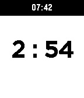{ loading=lazy width="72" } | [RaceTimer](https://apps.repebble.com/57b7ea4fbb85eddc98000910) | [Jesse Stevenson](https://github.com/jessedusty/RaceTimer) | <small>Not checked yet</small> | 2017-10-01 | Watchapp for sailors that want a timer that reminds them of the passage of time during a 5 minute dingy start. Sync to nearest horn with the select button… |
| 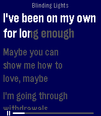{ loading=lazy width="72" } | [Radiant Lyrics](https://apps.repebble.com/02b779dcf9084fecb0375df1) | [meowarex](https://github.com/meowarex/rl-pebble) | <small>Not checked yet</small> | 2026-09-17 | Relays Radiant Lyrics to your Pebble Time 2! |
| 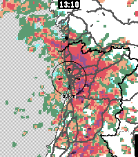{ loading=lazy width="72" } | [Rain Map](https://apps.repebble.com/d42063edd3194272807c7eeb) | [Tuukka Ruhanen](https://github.com/truhanen/pebble-rain-map) | <small>Not checked yet</small> | 2026-08-27 | App for viewing recent rain radar data. For the most accurate near-future rain forecast. The app features proximity-based resolution, to give you the most… |
| 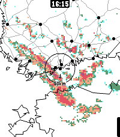{ loading=lazy width="72" } | [Rain Map Finland](https://apps.repebble.com/02d34a66846d4bd89c300ae6) | [Tuukka Ruhanen](https://github.com/truhanen/pebble-rain-map-finland) | <small>Not checked yet</small> | 2026-06-04 | App for viewing recent rain radar data in Finland. For the most accurate rain forecast. This is an earlier, Finland-only version of my other app, Rain Map… |
| 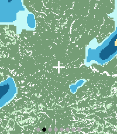{ loading=lazy width="72" } | [Rain Radar](https://apps.repebble.com/f8d809ec478d4dd9a8af1450) | [Mark Brackenborough](https://github.com/MarkBrack/pebble-weather-radar) | <small>Not checked yet</small> | 2026-09-19 | See rain heading your way, right from your wrist. Rain Radar combines animated rain radar with a clear street map centred on your location, helping you… |
| { loading=lazy width="72" } | [Random](https://apps.repebble.com/53e34a13b52fe7649500013b) | [TJ Stein](https://github.com/tstein4/random-pebble) | <small>Not checked yet</small> | 2014-08-21 | Ever needed a bit of randomness to make a decision? Well then this is the app for you! Formerly Coin Flip, this app now has a brand new Random Number… |
| 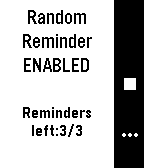{ loading=lazy width="72" } | [RandomReminder](https://apps.rebble.io/en_US/application/5ac4bf6cf38588775f000125) <small>Rebble App Store</small> | [stosem](https://github.com/stosem/pebble-app-RandomReminder) | <small>Not checked yet</small> | 2018-04-04 | RandomReminder. You can set up to 8 remindes in a day which will be happend in random time on specified period. It useful for remind for drink enough of… |
| 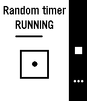{ loading=lazy width="72" } | [RandomTimer](https://apps.rebble.io/en_US/application/5abf322df38588510f000046) <small>Rebble App Store</small> | [stosem](https://github.com/stosem/pebble-app-RandomTimer) | <small>Not checked yet</small> | 2018-04-04 | RandomTimer. Countdown timer with random interval. Useful for board or party games (like hot potato) with reaction. Also may used in some other practice… |
| 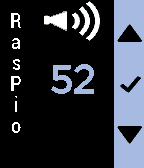{ loading=lazy width="72" } | [raspio](https://apps.repebble.com/56f978253c131b455b000009) | [KaRo](https://github.com/Roemke/pebbleraspio) | <small>Not checked yet</small> | 2016-04-01 | Control Vu+ Solo satelite receiver and Raspberry Pi Internetradio. See Github for more information (link to source code) Satellitenreceiver Vu+Solo und… |
| 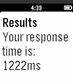{ loading=lazy width="72" } | [React](https://apps.repebble.com/562eca98a3c514c92a00001b) | [David Zhang](https://github.com/davidozhang/pebblereact) | <small>Not checked yet</small> | 2015-10-28 | Test your reaction time with this simple reaction-testing app! |
| { loading=lazy width="72" } | [Readebble](https://apps.repebble.com/52f9c21e8bc57c9c820000db) | [Neal Patel](https://github.com/Neal/Readebble) | <small>Not checked yet</small> | 2015-01-13 | A multiple source RSS reader for Pebble that allows you to read the headlines of your favorite feeds and a summarized story for each headline. *NEW: Pocket… |
| 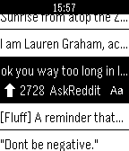{ loading=lazy width="72" } | [Rebble](https://apps.repebble.com/5300e4029810e0a8940000e8) | [polyNOMial](https://github.com/Spacetech/Rebble) | <small>Not checked yet</small> | 2015-04-28 | Reddit on the Pebble Smartwatch. With Rebble, you can easily view Reddit on the go; You can read threads and view linked images. You can sign in and browse… |
| 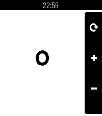{ loading=lazy width="72" } | [REcounter](https://apps.repebble.com/6a2d9fdbe24af40009fa531e) | [RandyTheSilly](https://git.wetfence.xyz/RandyTheSilly/REcounter) | <small>See source</small> | 2026-06-13 | Why? Because, in an era where a simple counter app would likely be left up to the AI overlords, I'd rather just fork something some guy made in 2014 and add… |
| { loading=lazy width="72" } | [Red Flagr](https://apps.repebble.com/53cbaca97e8944cab0749b1e) | [Salim Benhamadi](https://github.com/salim-benhamadi/Pebble-Red-Flagr) | <small>Not checked yet</small> | 2026-09-29 | Would you like to know if he's the one, or just one more red flag? Red Flagr is the magic 8-ball for your love life, and it lives on your wrist. Shake your… |
| 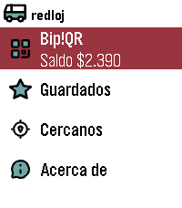{ loading=lazy width="72" } | [Redloj - Bip!QR e Itinerario](https://apps.repebble.com/54bc4ded53e5a72ad60000b0) | [xorcl](https://git.7709.cl/e/redloj) | <small>See source</small> | 2026-09-05 | English: (This application was called "Transanpbl" and then "Redpbl". It maintains that functionality, adding Bip!QR payments) Santiago de Chile's Public… |
| 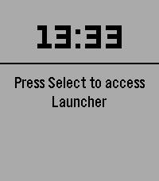{ loading=lazy width="72" } | [Ref Match](https://apps.repebble.com/62bcf5295724432897c2e7cc) | [Brian Barrow](https://github.com/briancbarrow/ref-match) | <small>Not checked yet</small> | 2026-08-29 | App to record time, goals, cards as a soccer referee |
| 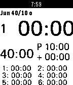{ loading=lazy width="72" } | [RefWatch](https://apps.repebble.com/53f45811d1a7a93dff00014e) | [Zauberertz](https://github.com/zaubererty/RefWatch) | <small>Not checked yet</small> | 2015-03-15 | This is a soccer referee watch app with pre defined profiles for swiss football Up Button: * Long - Start / Pause * Long while game running - Time penalty *… |
|  | [Reload Face](https://apps.repebble.com/6ebeacb4c7fc47d9950942df) | [andrewfchilds](https://github.com/andrewchilds/pebble-watchface-reload) | <small>Not checked yet</small> | 2026-06-08 | Immediately exits and reloads your selected watchface. |
| 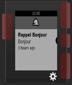{ loading=lazy width="72" } | [Reminder](https://apps.rebble.io/en_US/application/594cde1eb67f9fae630013ae) <small>Rebble App Store</small> | [AzRun](https://github.com/AzzRun/Pebble-Reminder) | <small>No licence</small> | 2019-07-24 |  |
| 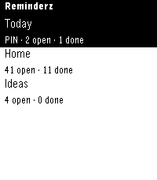{ loading=lazy width="72" } | [Remindery](https://apps.repebble.com/d7f2ccd94a0746d1a059433a) | [Organik Apps](https://github.com/GeezusChrotch/reminderz) | MIT | 2026-09-07 | Remindery brings Apple Reminders to Pebble Time and Pebble Time 2. Browse lists, check or reopen reminders, dictate new items, and delete with confirmation… |
| 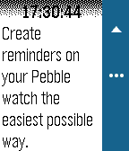{ loading=lazy width="72" } | [RemindMe](https://apps.repebble.com/5638629377a1ea802e000027) | [David Stosik](https://github.com/davidstosik/pebble-remind-me) | <small>Not checked yet</small> | 2015-11-09 | Create reminders on your Pebble watch the easiest possible way. ## Idea Dumb, repetitive and mechanical tasks (doing the dishes, taking a shower, driving to… |
| 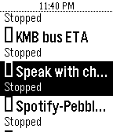{ loading=lazy width="72" } | [Remote for Automate](https://apps.rebble.io/en_US/application/5afda2da461a8d6af4000d7b) <small>Rebble App Store</small> | [Steven Go](https://github.com/greenlover1991/pebble-remote-for-automate) | <small>Not checked yet</small> | 2018-05-17 | Ever wanted to have more control of your phone via your Pebble? Wanted to send a text, start the flashlight, toggle the WiFi, get the bus' ETA, send an HTTP… |
| 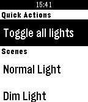{ loading=lazy width="72" } | [Remote for LIFX](https://apps.repebble.com/562cfbeab56e5de360000091) | [ThePurpleK](https://github.com/kz/lifx-pebble-app) | <small>Not checked yet</small> | 2016-10-02 | Toggle your LIFX lights and activate your scenes using Remote for LIFX. Suggestions? Bugs? Feel free to get in touch! Disclaimer: Remote for LIFX is an… |
| 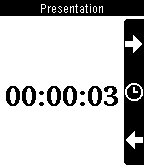{ loading=lazy width="72" } | [Remote Presentations](https://apps.repebble.com/52ebbc927d49761086000033) | [Sergio Araki](https://github.com/sergioaraki/RemotePresentations) | <small>Not checked yet</small> | 2014-11-02 | Controls HTML5 presentations from your wrist. You will need a computer running the server side, follow instructions from… |
| 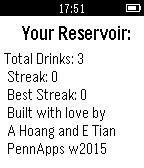{ loading=lazy width="72" } | [Reservoir](https://apps.repebble.com/54c025140badda221300007f) | [Elton Tian, Andrew Hoang](https://github.com/a--hoang/pebble-reservoir) | <small>Not checked yet</small> | 2015-01-21 | Reservoir will help you keep track of your daily water consumption habits and running statistics over time. We hope to make staying hydrated as effortless… |
| 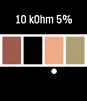{ loading=lazy width="72" } | [Resistor calculator](https://apps.rebble.io/en_US/application/5855a09206e77674a7000177) <small>Rebble App Store</small> | [Bram Rausch](https://github.com/bobbiy/Resistors) | <small>Not checked yet</small> | 2017-01-03 | This is an app to help you find the value of a 4-ring resistor. |
| { loading=lazy width="72" } | [Rest](https://apps.repebble.com/53ff41ed8cdf37902b000050) | [Remy Sharp](https://github.com/remy/rest) | <small>Not checked yet</small> | 2015-07-29 | Simple and intuitive rest interval timer. Particularly useful for timing rests in the gym, with configurable presets, vibrate on done and an overrun… |
| 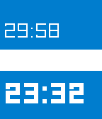{ loading=lazy width="72" } | [Rest Time](https://apps.rebble.io/en_US/application/5a1add180dfc32dba0000dd3) <small>Rebble App Store</small> | [Leo Liang](https://github.com/aleung/rest-time) | <small>Not checked yet</small> | 2017-11-26 | A Pebble app that reminds you to rest. Two clock displays: the bottom shows the current time, the top shows a timer counting down the time until your next… |
| 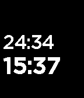{ loading=lazy width="72" } | [Rest Time](https://apps.repebble.com/552d2c598215a262c0000018) | [Matt Dawson](https://github.com/mattd/rest-time) | <small>Not checked yet</small> | 2015-12-22 | A Pebble app that reminds you to rest. |
| 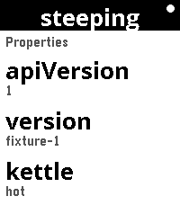{ loading=lazy width="72" } | [RESTForge](https://apps.repebble.com/931683527605431e96bf2772) | [Paul Bütow](https://github.com/snonux/restforge) | <small>Not checked yet</small> | 2026-08-19 | RESTForge — control any Siren API from your wrist RESTForge turns your Pebble into a remote control for any web API that speaks Siren — a standard way for a… |
| 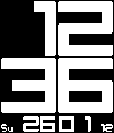{ loading=lazy width="72" } | [Revolution YachtTimer, StopWatch, Countdown, Yacht Timer](https://apps.repebble.com/52e52eff97213707e0000595) | [MikeM](https://github.com/MikeMoore63/RevolutionStopWatch) | <small>Not checked yet</small> | 2015-05-05 | A version of Revolution Watch but as an App with Stopwatch, countdown, YachtTimer and Adjustment features. |
| 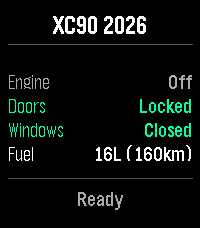{ loading=lazy width="72" } | [ReVolver](https://apps.repebble.com/c3e702834987434a8ec3d470) | [Piotr Serafin](https://github.com/piotrserafin/ReVolver) | <small>Not checked yet</small> | 2026-09-04 | Remote control your Volvo car from your wrist. ReVolver — Remote Volvo controller. Also "volver" (Spanish): "to return/come back" to your car. Control your… |
| 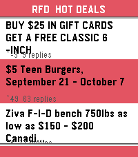{ loading=lazy width="72" } | [RFD Hot Deals](https://apps.repebble.com/a85552c5082244e398ad79f1) | [Sapphire Mainspring](https://github.com/JacobNussbaum/Pebble-RFD-hotdeals) | <small>No licence</small> | 2026-09-13 | Canadian deals forum comes to your wrist! The Hot deals feed of Redflagdeals.com (No affiliation) vibe coded into a feed with comments intact you can check… |
| 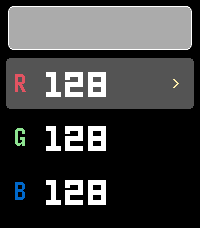{ loading=lazy width="72" } | [RGB Backlight Test](https://apps.repebble.com/d0bf4929609b4a1baa6ba168) | [Brooman Inks](https://github.com/brooks2564/rgb-backlight-test) | <small>Not checked yet</small> | 2026-05-05 | RGB Backlight Test A Pebble app for the Pebble Time 2 (Emery) to interactively test the RGB backlight using the new light_set_color_rgb888() API introduced… |
| 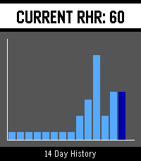{ loading=lazy width="72" } | [RHR Tracker](https://apps.rebble.io/en_US/application/69fd0a1a0c32da000906f9f9) <small>Rebble App Store</small> | [ToyFraz](https://github.com/ToyFraz/RHR-tracker) | <small>Not checked yet</small> | 2026-05-13 | The app uses the information already gathered by Pebble Health, so it is very lightweight. It takes the heartrate measurements from the night before from… |
| 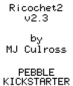{ loading=lazy width="72" } | [Ricochet2](https://apps.repebble.com/52ef1b925931845564000005) | [mjculross](https://www.github.com/mjculross/Ricochet2) | <small>Not checked yet</small> | 2014-02-03 | Ricochet2: time & date bounce around the screen & ricochet off of each other |
| 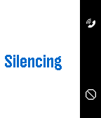{ loading=lazy width="72" } | [RING MY PHONE](https://apps.repebble.com/52ed9b199755252f26000005) | [Dark Rock Studios](https://github.com/Wavesonics/RingMyPhonePebble) | <small>Not checked yet</small> | 2015-12-22 | Do you ever lose your phone and ask someone to call it so you can find it? No more! Now you can ring your phone from your Pebble smart watch. RingMyPhone is… |
| 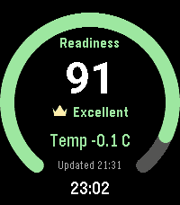{ loading=lazy width="72" } | [RingView](https://apps.repebble.com/861415a105c74b7cb81ae436) | [Nick Winans](https://github.com/Nicell/ringview-pebble) | <small>Not checked yet</small> | 2026-07-17 | Selected Oura health summaries on your Pebble. |
| 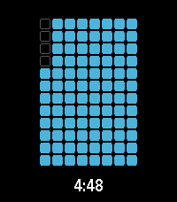{ loading=lazy width="72" } | [ripple](https://apps.repebble.com/378bcb0a5fac43ca91e051d0) | [conor.code](https://github.com/chorankates/ripple) | <small>Not checked yet</small> | 2025-12-24 | a timer application with a number of visualization options |
| 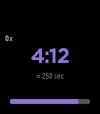{ loading=lazy width="72" } | [ripple](https://apps.rebble.io/en_US/application/694d70e931c43a000955699f) <small>Rebble App Store</small> | [conor.code](https://github.com/chorankates/ripple) | <small>Not checked yet</small> | 2026-01-04 | a timer with 15 customizable visualization styles, see screenshots of all styles on all platforms at github link |
| 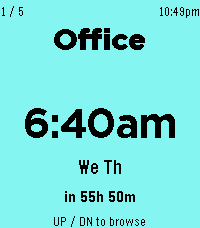{ loading=lazy width="72" } | [Ripple Alarm](https://apps.repebble.com/7bff2f5004fa47e094b8c32d) | [Tom Khamis](https://github.com/ttkhamis/pebble_alarm) | <small>Not checked yet</small> | 2026-09-15 | A large-text alarm clock designed to be easy to read at a glance. Set up to 5 alarms from your phone — each with its own label, color, and weekly schedule. |
| { loading=lazy width="72" } | [Ripples 3D](https://apps.repebble.com/57ca36d1f69d1da5f5000382) | [Afonso Santos](https://github.com/reciprocum/Pebble-SDK4-WatchApp-Ripples3D) | <small>Not checked yet</small> | 2017-01-25 | An interactive 3D math function demo. *** BUTTONS *** UP : colorization (Monochromatic,Distance). SELECT: pattern (Dots,Lines,Stripes,Grid). DOWN … |
| ![RITBus \[BETA\]](../images/apps/56e8053abbcd74ba4b000004.png){ loading=lazy width="72" } | [RITBus \[BETA\]](https://apps.repebble.com/56e8053abbcd74ba4b000004) | [Chris Bitler](https://github.com/Chris-Bitler/RITBus) | GPL-3.0 | 2016-03-17 | An app that allows Rochester Institute of Technology students to see how soon the various campus busses are going to hit the bus stops. A few of these… |
| 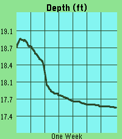{ loading=lazy width="72" } | [River Depth](https://apps.repebble.com/f0b97c77cced465aa69b5044) | [Quentin Monagle](https://github.com/qmonagle/RiverData) | <small>Not checked yet</small> | 2026-04-24 | This app pulls depth data from river monitoring locations tracked by USGS. It then plots the last week of data, scaling automatically to your screen. The ID… |
| 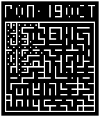{ loading=lazy width="72" } | [RoboMaze](https://apps.repebble.com/5544a7bbe62871ef6d000038) | [Simon Jackson](https://github.com/jackokring/pebble-sdk-examples/tree/master/watchapps/RoboMaze) | <small>Not checked yet</small> | 2015-10-17 | A simple game and watch face dual use app. The BACK button is mode select. Use long press BACK to exit. Features (Watch): Clock, Date, Stopwatch (959:59:59… |
| 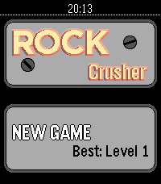{ loading=lazy width="72" } | [Rock Crusher](https://apps.repebble.com/56acfea45319ec52a600003c) | [Tim Martin](https://github.com/timboe/RockCrush) | <small>Not checked yet</small> | 2026-06-27 | Rock Crusher is a match-three game for Pebble where you swap neighbouring rocks to get at least three of the same type in a row. The game ends when you have… |
| 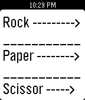{ loading=lazy width="72" } | [Rock Paper Scissors](https://apps.repebble.com/5359f8493387a6efb600014b) | [Ravin](https://github.com/randomite/Pebble/tree/master/RockPaperScissors) | <small>Not checked yet</small> | 2014-04-25 | A simple rock paper scissor app for quick entertainment. |
| { loading=lazy width="72" } | [Rock Paper Scissors the game](https://apps.repebble.com/55379310fa195bf921000088) | [Djinn Gloom](https://github.com/Crasytoser/RPS) | <small>No licence</small> | 2015-04-22 | Rock Paper Scissors. The watch will do it for you |
| 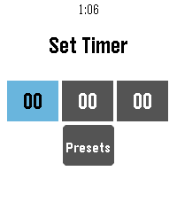{ loading=lazy width="72" } | [Rock Timer](https://apps.repebble.com/479c3ffae56a4529bdeafced) | [snrkl labs](https://github.com/snrkl-labs) | <small>Not checked yet</small> | 2026-07-02 | • Fork of the official Pebble timer app • Full touchscreen support — inertial drag-to-scroll, long-press / double-tap to select • Configurable timer… |
| { loading=lazy width="72" } | [ROCK! The Vote](https://apps.rebble.io/en_US/application/637af1dac6c24a000a815ec3) <small>Rebble App Store</small> | [Stanivision Inc.](https://github.com/tertty/ROCK-the-Vote-backend) | <small>Not checked yet</small> | 2025-03-16 | ROCK! The Vote is a Pebble application that allows you to voice your opinion, tip the scales, and influence those around you. Each day (12am UTC), users… |
| 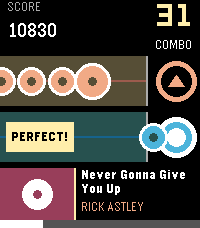{ loading=lazy width="72" } | [Rockbeat](https://apps.repebble.com/68b7d031bd624a9ebaeb9102) | [Zhang Qichuan](https://github.com/qichuan/pebble-rockbeat) | <small>Not checked yet</small> | 2026-09-06 | A simple rhythm game. Just hit the UP or SELECT button to the melody! Right now you can play the following songs: Never Gonna Give You Up — Rick Astley You… |
| 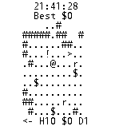{ loading=lazy width="72" } | [Rogue Watch](https://apps.repebble.com/52bdf04583ed9124110000dc) | [Jeff Lait](https://github.com/jmlaitpebble/roguewatch) | <small>Not checked yet</small> | 2013-12-28 | A roguelike on your watch! H is health, D is Depth, and $ is your gold. Get as much as you can before you die! |
| { loading=lazy width="72" } | [Rogue's Ring](https://apps.repebble.com/52fb08c99ecfefd511000288) | [Charles Rubach](https://github.com/charlesrubach/RoguesRing.git) | <small>Not checked yet</small> | 2016-05-13 | The Rogue's Ring Companion App features cryptic hieroglyphs that provide crib notes for 24+ different Scam School effects. No matter what room you're in, no… |
| { loading=lazy width="72" } | [Roll](https://apps.repebble.com/567050ba2e7c0c788700003d) | [Josh](https://github.com/nonproftechie/roll) | <small>Not checked yet</small> | 2016-03-07 | Want to play a game that requires rolling a die, but you lost it? Have no fear, Roll app is near! Wiggle your Pebble or push one of the buttons to get your… |
| 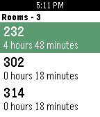{ loading=lazy width="72" } | [Roomer](https://apps.repebble.com/56081e08f4e5610339000055) | [Matt Langlois](https://github.com/fletchto99/roomer-pebble) | <small>Not checked yet</small> | 2015-12-16 | Would you like to have a quiet place to study on campus? Do you find the libraries to be too crowded sometimes? If so, Roomer is the perfect app for you… |
| 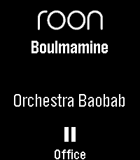{ loading=lazy width="72" } | [Roon Remote for Pebble](https://apps.repebble.com/696edc515cd4fc0009ce6f5c) | [J_B](https://github.com/JunderscoreB/pebble-roon-remote) | MIT | 2026-09-29 | Roon Remote is a Pebble app that connects seamlessly to your Roon Core, letting you manage your audiophile endpoints without ever reaching for your phone… |
| 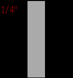{ loading=lazy width="72" } | [Rope Size](https://apps.repebble.com/5666e0e39a52c999eb00001f) | [Filip](https://github.com/anderssonfilip/pebble-ropesize) | <small>Not checked yet</small> | 2015-12-08 | Utiltity for the Pebble watch to measure the dimension of a rope between 5/32"(4mm) 1 1/32" (26mm). Place part of the rope over the face of the watch to… |
| 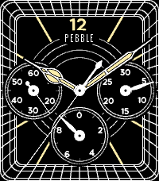{ loading=lazy width="72" } | [Rosewright Chronograph](https://apps.repebble.com/529993a5e627cef6e100004b) | [drwrose](https://github.com/drwrose/rosewright.git) | <small>Not checked yet</small> | 2026-05-20 | An analog "Chronograph" three-subdial watchface. It's a fully functioning stopwatch with start/stop and lap buttons, and 0.1-second resolution. Like all… |
| 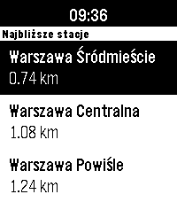{ loading=lazy width="72" } | [Rozkład jazdy pociągów Polish Trains](https://apps.repebble.com/68a759a7652aec0009f26c41) | [merito](https://github.com/merito/rozklad_jazdy_pociagow) | <small>Not checked yet</small> | 2026-09-10 | Never miss your train again! The app shows the closest stations and departures with delays, platform and track numbers. It primarily uses the custom backend… |
| 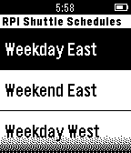{ loading=lazy width="72" } | [RPI Shuttle Schedule](https://apps.repebble.com/5491ca9da34dfb129d0000fa) | [Branden Clark](https://github.com/clarkb7/Pebble_RPI_Shuttle_Schedule) | <small>Not checked yet</small> | 2017-02-08 | View the RPI Shuttle Schedule on your Pebble |
| 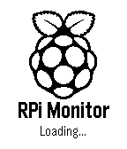{ loading=lazy width="72" } | [RPi-Monitor](https://apps.repebble.com/541086d676c551c5790001f2) | [Alexander Kropochev](https://github.com/kropochev/RPi-Monitor-Pebble) | <small>Not checked yet</small> | 2025-11-25 | App to monitor the status Raspberri Pi. Changelog of version 1.4: - Added support for basic authentication (Oscar R.C.) Important. You must install the… |
| { loading=lazy width="72" } | [RSS Reader](https://apps.rebble.io/en_US/application/5d8d503bc393f5215a13e5e6) <small>Rebble App Store</small> | [Jonathan Alland](https://github.com/Wowfunhappy/Pebble-RSS-Reader) | <small>Not checked yet</small> | 2020-02-14 | Hands full? No problem! As long as you have a Pebble smartwatch and at least one free finger, you can read the news--no pulling out your phone required… |
| { loading=lazy width="72" } | [RU Bus](https://apps.rebble.io/en_US/application/599dc335461a8d8fd10011ed) <small>Rebble App Store</small> | [Mohammad Nadeem](https://github.com/mnadev/RUBus) | <small>Not checked yet</small> | 2017-08-23 | A Pebble Watch App that lets you see Rutgers Bus Times on your Pebble. |
| { loading=lazy width="72" } | [Rubik's Cube](https://apps.repebble.com/accc6b0ed4da421198f5e503) | [CATEIN](https://github.com/CATEIN/rubiks-cube-for-pebble) | MIT | 2026-08-29 | Virtual Rubik's Cube for Pebble Time 2. I got close to solving it but messed up on the last layer 😭 Open source so yall can fork and make it better. Made… |
| { loading=lazy width="72" } | [Rubiks Shuffle](https://apps.repebble.com/560ca51c2dd2f194aa000045) | [Carlos J. Torres](https://github.com/vlaadbrain/RubiksShuffle) | <small>Not checked yet</small> | 2015-10-16 | Shuffle Your Rubik's Cube with your Pebble :) largely based on http://shuffle.akselipalen.com/ |
| { loading=lazy width="72" } | [RubikStopTap](https://apps.rebble.io/en_US/application/56410b02500343416c000086) <small>Rebble App Store</small> | [aocodermx](https://github.com/aocodermx/RubikStopTap) | <small>Not checked yet</small> | 2016-01-17 | The best application to measure your time solving the Magic Cube, just select the size of your cube, Scramble your cube, shake your Pebble to start review… |
| { loading=lazy width="72" } | [RuckPebble](https://apps.repebble.com/698adb61ea64380009779fa6) | [ModusApps](https://github.com/gordonbazeley/ruckpebble) | <small>Not checked yet</small> | 2026-08-17 | Calculates calories expended during a ruck (aka moving quickly with a heavy pack on your back) using a modified version of the Pandolf equation which… |
| { loading=lazy width="72" } | [Rudd](https://apps.repebble.com/52ed51b6a77704c8c100000e) | [Gordon Weeks](https://github.com/bday106/Rudd) | <small>Not checked yet</small> | 2014-02-01 | Rudd is an app for Pebble that helps you manage time by vibrating on a set interval. When you're working out for a given interval, don't keep checking your… |
| { loading=lazy width="72" } | [rumline](https://apps.rebble.io/en_US/application/58802e9a93254a9262000088) <small>Rebble App Store</small> | [Clint Tseng](https://github.com/clint-tseng/rumline) | <small>Not checked yet</small> | 2025-11-25 | Rumline tells you, very simply, which way to go and how far it is to get from here to there. You can preprogram a set of points into your watch, and then at… |
| { loading=lazy width="72" } | [Run Tracker](https://apps.repebble.com/52f1fa11b9d04556a636bb3c) | [Marian Kleineberg](https://github.com/marian42/pebble-run-tracker) | <small>Not checked yet</small> | 2026-04-12 | This is a run / walk tracker for Pebble with a focus on simplicity. It doesn't require a companion app but it does require a connection to a phone for GPS… |
| { loading=lazy width="72" } | [Running](https://apps.rebble.io/en_US/application/5eddde203dd3102760a948be) <small>Rebble App Store</small> | [Franz Bender](https://franz-bender.de) | <small>See source</small> | 2020-06-08 | This is a simple timer for runners. Especially on longer runs, one might need a break. At least I do sometimes. To be able to keep track of the length of… |
| { loading=lazy width="72" } | [Running assistant](https://apps.repebble.com/5722a9907adf6b48cf000018) | [Christophe Jeannette](https://github.com/Sichroteph/Running-Assistant) | <small>Not checked yet</small> | 2016-04-29 | This app is specifically designed to help new joggers to gradualy start running, or to confort moderate joggers to reinforce their pace. Working with… |
| { loading=lazy width="72" } | [Running Coach](https://apps.repebble.com/53f32d22b62b051081000085) | [Nikita Pchelin](https://github.com/jango/pebble_running) | <small>Not checked yet</small> | 2014-08-19 | A running app that provides users with timers for each workout of the C25K and B210K running programs. A buzz will alert you about the end of a running or… |
| { loading=lazy width="72" } | [Ruter Departures](https://apps.repebble.com/57c2bbc3f69d1d18de0002d3) | [Jan Karlsen](https://github.com/pebblejtkarlsen/RuterDepartures) | <small>Not checked yet</small> | 2016-08-28 | Ruter Departures is an app for finding the departures of bus, tram, train and boats managed by the company Ruter. The app will locate the closest stops from… |
| { loading=lazy width="72" } | [Rutgers Bus and Dining](https://apps.repebble.com/5521a22dd7356c80ea000059) | [Revan Sopher](https://github.com/revan/Pebble-Rutgers) | <small>Not checked yet</small> | 2015-04-07 | Provides bus times and dining hall menus for Rutgers New Brunswick. |
