---
hide:
  - toc
---

<!-- Generated by scripts/update_app_directory.py: do not edit by hand -->
# Pebble Apps: S

[← All Pebble Apps](../watchapps.md) · [A](a.md) · [B](b.md) · [C](c.md) · [D](d.md) · [E](e.md) · [F](f.md) · [G](g.md) · [H](h.md) · [I](i.md) · [J](j.md) · [K](k.md) · [L](l.md) · [M](m.md) · [N](n.md) · [O](o.md) · [P](p.md) · [Q](q.md) · [R](r.md) · **S** · [T](t.md) · [U](u.md) · [V](v.md) · [W](w.md) · [X](x.md) · [Y](y.md) · [Z](z.md) · [0–9 & other](other.md)

*148 apps · Last updated 2026-10-06 · [About these lists](../about-app-lists.md)*

<h2 class="app-name" id="app-5771a0126c210445010002e3"><a href="https://apps.repebble.com/5771a0126c210445010002e3">s0lrider</a></h2>
<a class="app-source" href="https://github.com/eslimasec/S0lRider/tree/master/pebble/CloudPebble_Sources" title="Source code" data-search-exclude>View source</a>

by <a href="https://apps.repebble.com/apps/dev/eslimasec_570434ebd7fa4e6c96000006" title="More from this developer">eslimasec</a>

Not checked yet v1.0 Updated 2016-06-27

Runs on: Time 2, Time

This app allows you to control s0lrider (solar Knight Rider) robot via voice commands. The robot can be charged by sun and even has the cool red scanner lights! :) more details here…

<a class="app-shot" href="https://apps.repebble.com/583b006e00355aeba4000124" data-search-exclude>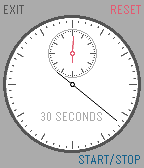</a>

<h2 class="app-name" id="app-583b006e00355aeba4000124"><a href="https://apps.repebble.com/583b006e00355aeba4000124">S5-S0-S6</a></h2>
<a class="app-source" href="https://github.com/GreenHex/Pebble.S5-S0-S6" title="Source code" data-search-exclude>View source</a>

by <a href="https://apps.repebble.com/apps/dev/the-resetter_5415133bbcd1cf9264000081" title="More from this developer">The Resetter</a>

MIT v1.1 Updated 2016-11-28

Runs on: Time 2, Pebble 2 Duo, Pebble 2, Time, Classic

Analog chronometer for the Pebble, with smooth animated seconds movement.

<a class="app-shot" href="https://apps.repebble.com/40ec229ff6dc4188841a514f" data-search-exclude>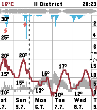</a>

<h2 class="app-name" id="app-40ec229ff6dc4188841a514f"><a href="https://apps.repebble.com/40ec229ff6dc4188841a514f">Sae Weather Graph</a></h2>
<a class="app-source" href="https://github.com/truhanen/pebble-sae-weather-graph" title="Source code" data-search-exclude>View source</a>

by <a href="https://apps.repebble.com/apps/dev/tuukka-ruhanen_2a1ec999749817a461025038" title="More from this developer">Tuukka Ruhanen</a>

Not checked yet v1.8.0 Updated 2026-09-02

Runs on: Time 2

Highly informative weather forecast graph for Pebble Time 2. The only weather app you&#x27;ll ever need! Sää [ˈs̠æː] is Finnish for weather. Sae is Finnish for rain. The app works globally. Displays 10…

<h2 class="app-name" id="app-56d2bac4d4f5886fb100000a"><a href="https://apps.rebble.io/en_US/application/56d2bac4d4f5886fb100000a">Sal</a></h2>
<a class="app-source" href="https://github.com/jjv360/Sal-Pebble" title="Source code" data-search-exclude>View source</a>

by <a href="https://apps.rebble.io/en_US/developer/52e0dde67487e523520000da/1" title="More from this developer">jjv360</a>

Not checked yet v2.3 Updated 2017-06-04 Rebble App Store

Runs on: Round 2, Time 2, Pebble 2 Duo, Pebble 2, Time Round, Time

Sal is a personal AI assistant for your Pebble. Features: - Speak to Sal via the Pebble&#x27;s built-in microphone - Downloadable plugins stored on the phone for faster responses - Answers general…

<a class="app-shot" href="https://apps.repebble.com/40c8c70ad768489f908b499e" data-search-exclude>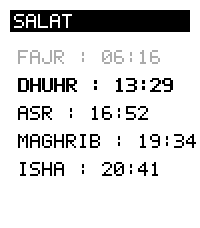</a>

<h2 class="app-name" id="app-40c8c70ad768489f908b499e"><a href="https://apps.repebble.com/40c8c70ad768489f908b499e">Salat</a></h2>
<a class="app-source" href="https://github.com/vhoen/pebble-salat" title="Source code" data-search-exclude>View source</a>

by <a href="https://apps.repebble.com/apps/dev/vhoen_63dc3c53d7f92d271ff721cc" title="More from this developer">vhoen</a>

Not checked yet v1.0.0 Updated 2026-09-22

Runs on: Round 2, Time 2

Displays Salat time for a given latitude. Using lat/lng instead of location in order to avoid using an api key from a geocoding provider.

<a class="app-shot" href="https://apps.repebble.com/531be14dc8dc40c7a869464d" data-search-exclude>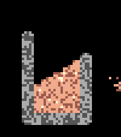</a>

<h2 class="app-name" id="app-531be14dc8dc40c7a869464d"><a href="https://apps.repebble.com/531be14dc8dc40c7a869464d">Sand Sim</a></h2>
<a class="app-source" href="https://github.com/quantumwaffles/pebble-sand-sim" title="Source code" data-search-exclude>View source</a>

by <a href="https://apps.repebble.com/apps/dev/michael-rex_344769cd96b2f953c9a9f56c" title="More from this developer">Michael Rex</a>

Not checked yet v0.1.0 Updated 2026-06-06

Runs on: Time 2

A fun little sand simulation for your wrist. Hope you enjoy! 😊 Requires Touch Support Interactions - Up → Quick select tools - Down → Quick select materials - Select → Open menu (navigate with up…

<a class="app-shot" href="https://apps.repebble.com/5738327fb934e67f9d000007" data-search-exclude>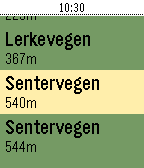</a>

<h2 class="app-name" id="app-5738327fb934e67f9d000007"><a href="https://apps.repebble.com/5738327fb934e67f9d000007">Sanntid</a></h2>
<a class="app-source" href="https://github.com/powermosfet/pebble-sanntid" title="Source code" data-search-exclude>View source</a>

by <a href="https://apps.repebble.com/apps/dev/asmund-berge_5674836844d454b3ef000045" title="More from this developer">Asmund Berge</a>

Not checked yet v0.4 Updated 2016-05-18

Runs on: Round 2, Time 2, Pebble 2 Duo, Pebble 2, Time Round, Time, Classic

Show realtime schedule info for busses in Rogaland, Norway (Kolumbus)

<a class="app-shot" href="https://apps.repebble.com/5454937be77c146539000051" data-search-exclude>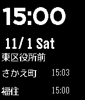</a>

<h2 class="app-name" id="app-5454937be77c146539000051"><a href="https://apps.repebble.com/5454937be77c146539000051">Saposub</a></h2>
<a class="app-source" href="https://github.com/planset/pebble_sapporo_subway" title="Source code" data-search-exclude>View source</a>

by <a href="https://apps.repebble.com/apps/dev/planset_530063a16061bd63ba000463" title="More from this developer">planset</a>

Not checked yet v0.1 Updated 2014-11-01

Runs on: Time 2, Pebble 2 Duo, Pebble 2, Time, Classic

札幌の地下鉄の時刻を表示します。 一番近くの駅の次の出発時刻を表示します。 今のところ東豊線のみです。 This watchapp shows the subway of time of Sapporo. It displays the next departure time of the nearest station. **Currently only Sapporo subway…

<a class="app-shot" href="https://apps.repebble.com/6e920a2fa6304e45b4644116" data-search-exclude>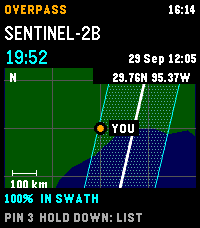</a>

<h2 class="app-name" id="app-6e920a2fa6304e45b4644116"><a href="https://apps.repebble.com/6e920a2fa6304e45b4644116">Satellite Overpass</a></h2>
<a class="app-source" href="https://github.com/globe-and-atlas/overpass-watch" title="Source code" data-search-exclude>View source</a>

by <a href="https://apps.repebble.com/apps/dev/daniel-bally_e8468a0ff28edd5791d1bced" title="More from this developer">Daniel Bally</a>

Not checked yet v0.4.0 Updated 2026-10-02

Runs on: Time 2

Plan Landsat 8/9 and Sentinel-2A/B/C passes over your location on Pebble Time 2. See a countdown, hourly cloud forecast, and modeled cross-track coverage. A 30-day history reports matching Earth…

<a class="app-shot" href="https://apps.repebble.com/56b16e2a10121e5d36000001" data-search-exclude>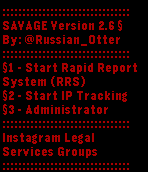</a>

<h2 class="app-name" id="app-56b16e2a10121e5d36000001"><a href="https://apps.repebble.com/56b16e2a10121e5d36000001">SAVAGE For Basalt -Preview- v2.6</a></h2>
<a class="app-source" href="https://www.instagram.com/russian_otter/" title="Source code" data-search-exclude>View source</a>

by <a href="https://apps.repebble.com/apps/dev/russian-otter_549c0abd0544722d37000293" title="More from this developer">Russian Otter</a>

Not checked yet v2.6 Updated 2016-02-03

Runs on: Time 2, Pebble 2 Duo, Pebble 2, Time, Classic

This is a preview for the program I made call Savage2v4.2.6. This client simplifys tasks and has features that allow it to be very effective with computers. Its also good for legal reporting of…

<a class="app-shot" href="https://apps.repebble.com/56430fa03d7eefdc8800002d" data-search-exclude>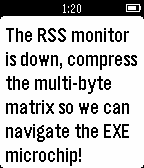</a>

<h2 class="app-name" id="app-56430fa03d7eefdc8800002d"><a href="https://apps.repebble.com/56430fa03d7eefdc8800002d">Say Something Smart</a></h2>
<a class="app-source" href="https://github.com/iMears/say_something_smart_pebble" title="Source code" data-search-exclude>View source</a>

by <a href="https://apps.repebble.com/apps/dev/imears_563ef3cf979310674700002f" title="More from this developer">iMears</a>

Not checked yet v1.0 Updated 2015-11-11

Runs on: Time 2, Pebble 2 Duo, Pebble 2, Time, Classic

Generate phrases that make you sound like a super hacker!

<h2 class="app-name" id="app-938ab8920dc84e6ca776a751"><a href="https://apps.repebble.com/938ab8920dc84e6ca776a751">Scalemates</a></h2>
<a class="app-source" href="https://github.com/Moaske/PebbleScalemates" title="Source code" data-search-exclude>View source</a>

by <a href="https://apps.repebble.com/apps/dev/moaske_3f1bf0845ffec82a2a96f91c" title="More from this developer">Moaske</a>

No licence v1.0.5 Updated 2026-09-06

Runs on: Time 2

Scalemates profile viewer for having your Stash and Wishlist lists at hand when out and about ✈️on scalemodelling events 🛩️ or fairs. #ModelAircraft #ScaleModelling I know, pretty niche; you gotta…

<a class="app-shot" href="https://apps.repebble.com/556301c032fe79034000004b" data-search-exclude>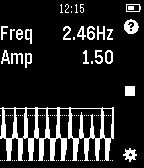</a>

<h2 class="app-name" id="app-556301c032fe79034000004b"><a href="https://apps.repebble.com/556301c032fe79034000004b">Scalerometer</a></h2>
<a class="app-source" href="https://github.com/technicallyfeasible/PebbleScale" title="Source code" data-search-exclude>View source</a>

by <a href="https://apps.repebble.com/apps/dev/techfeasible_52dbd1049ffd8704a300004e" title="More from this developer">techfeasible</a>

Not checked yet v1.2 Updated 2016-06-27

Runs on: Time 2, Pebble 2 Duo, Pebble 2, Time, Classic

Scalerometer is a novel app which lets you weigh things using only the accelerometer in Pebble. A scale on your wrist! How it works: The app works by detecting how fast you can oscillate a certain…

<a class="app-shot" href="https://apps.repebble.com/5485783fc1f41bcadd00001d" data-search-exclude>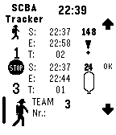</a>

<h2 class="app-name" id="app-5485783fc1f41bcadd00001d"><a href="https://apps.repebble.com/5485783fc1f41bcadd00001d">SCBA Fire Scene Team Tracker</a></h2>
<a class="app-source" href="https://github.com/dresber/scba_tracker" title="Source code" data-search-exclude>View source</a>

by <a href="https://apps.repebble.com/apps/dev/bernhard_531b1fee8d1b3e5776000013" title="More from this developer">Bernhard</a>

Not checked yet v1.3 Updated 2015-06-15

Runs on: Time 2, Pebble 2 Duo, Pebble 2, Time, Classic

This app assists you to monitor up to three SCBA teams on a fire scene. Supports 9l, 6l, 6.8l, 2x6.8l, 2x4l and 2x6l SCBA bottles. You can choose the default breathing rate, specifiy the bottle…

<a class="app-shot" href="https://apps.repebble.com/56c8e1571261184eef000048" data-search-exclude>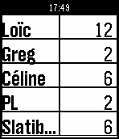</a>

<h2 class="app-name" id="app-56c8e1571261184eef000048"><a href="https://apps.repebble.com/56c8e1571261184eef000048">ScoreCards</a></h2>
<a class="app-source" href="https://github.com/lehenry/ScoreCards" title="Source code" data-search-exclude>View source</a>

by <a href="https://apps.repebble.com/apps/dev/lehenry_54f7573d3aeaed913500008a" title="More from this developer">lehenry</a>

Not checked yet v1.6 Updated 2016-06-27

Runs on: Round 2, Time 2, Pebble 2 Duo, Pebble 2, Time Round, Time, Classic

ScoreCards is a simple score tracking application for your dice/cards or boardgames - Set and order players in settings - Activate/Deactivate players - Choose first player (long select in &#x27;Set…

<a class="app-shot" href="https://apps.repebble.com/56dcd972042803d6fd00003d" data-search-exclude>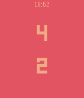</a>

<h2 class="app-name" id="app-56dcd972042803d6fd00003d"><a href="https://apps.repebble.com/56dcd972042803d6fd00003d">Scorekeeper</a></h2>
<a class="app-source" href="https://github.com/nonproftechie/scorekeeper" title="Source code" data-search-exclude>View source</a>

by <a href="https://apps.repebble.com/apps/dev/josh_562aeeb815ecb9261c00001f" title="More from this developer">Josh</a>

Not checked yet v1.3 Updated 2016-03-21

Runs on: Round 2, Time 2, Pebble 2 Duo, Pebble 2, Time Round, Time, Classic

A simple scorekeeper for 2 teams. Pressing the top and bottom buttons changes the score for the upper and lower scores, respectively. Pressing the middle button toggles positive/negative scoring…

<a class="app-shot" href="https://apps.repebble.com/5830b6418c7fff66e1000061" data-search-exclude>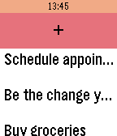</a>

<h2 class="app-name" id="app-5830b6418c7fff66e1000061"><a href="https://apps.repebble.com/5830b6418c7fff66e1000061">Scripple</a></h2>
<a class="app-source" href="https://github.com/wfernandes/scripple" title="Source code" data-search-exclude>View source</a>

by <a href="https://apps.repebble.com/apps/dev/warren-fernandes_56a5aa16ed368bdaa3000012" title="More from this developer">Warren Fernandes</a>

Not checked yet v1.1 Updated 2016-11-21

Runs on: Round 2, Time 2, Time Round, Time

A pebble app the scribes spontaneous thoughts, ideas and yes, also to-do items. It uses the dictation service and can store up to ten items.

<a class="app-shot" href="https://apps.rebble.io/en_US/application/6a14b141c130af00096bf774" data-search-exclude>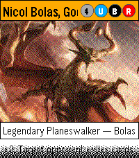</a>

<h2 class="app-name" id="app-6a14b141c130af00096bf774"><a href="https://apps.rebble.io/en_US/application/6a14b141c130af00096bf774">Scryble - A Magic: The Gathering card viewer</a></h2>
<a class="app-source" href="https://github.com/ofietze/scryble" title="Source code" data-search-exclude>View source</a>

by <a href="https://apps.rebble.io/en_US/developer/563f600c8e55a1b90c00004f/1" title="More from this developer">4T2</a>

Not checked yet v1.0.0 Updated 2026-05-25 Rebble App Store

Runs on: Time 2

A Magic: The Gathering card viewer for Pebble. You don&#x27;t need this. Your phone can look up cards just fine. But when a buddy mentions a card you&#x27;ve never heard of and you want to pull it up — or…

<a class="app-shot" href="https://apps.repebble.com/557cde795f5eb8acdb0000b1" data-search-exclude>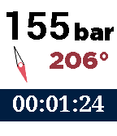</a>

<h2 class="app-name" id="app-557cde795f5eb8acdb0000b1"><a href="https://apps.repebble.com/557cde795f5eb8acdb0000b1">Scubawatch</a></h2>
<a class="app-source" href="https://github.com/dmollaaliod/scubawatch" title="Source code" data-search-exclude>View source</a>

by <a href="https://apps.repebble.com/apps/dev/diego-molla_5531e08acb952be9ed0000ac" title="More from this developer">Diego Molla</a>

Not checked yet v2.3 Updated 2016-05-15

Runs on: Time 2, Pebble 2 Duo, Pebble 2, Time, Classic

A companion to scuba divers. This app can help you time your dives, and record your air consumption and compass heading. Simply press the up and down buttons to change the air pressure, and it…

<a class="app-shot" href="https://apps.repebble.com/63823894c6c24a000a815f17" data-search-exclude>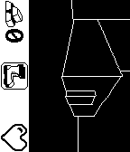</a>

<h2 class="app-name" id="app-63823894c6c24a000a815f17"><a href="https://apps.repebble.com/63823894c6c24a000a815f17">Searching Emery</a></h2>
<a class="app-source" href="https://github.com/Helco/PebbleOfDoom/tree/searching-emery" title="Source code" data-search-exclude>View source</a>

by <a href="https://apps.repebble.com/apps/dev/helco_53205de12d3c7bdc620000ed" title="More from this developer">Helco</a>

MIT v1.0 Updated 2022-11-26

Runs on: Time 2, Pebble 2 Duo, Pebble 2, Time

A small 3D game about almost-alive watches. Made (almost) during Rebble Hackathon-001

<a class="app-shot" href="https://apps.rebble.io/en_US/application/605cb7441342ae00bc1202ed" data-search-exclude>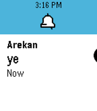</a>

<h2 class="app-name" id="app-605cb7441342ae00bc1202ed"><a href="https://apps.rebble.io/en_US/application/605cb7441342ae00bc1202ed">Send Discord Message</a></h2>
<a class="app-source" href="https://github.com/Cellomonster/discord-pebble" title="Source code" data-search-exclude>View source</a>

by <a href="https://apps.rebble.io/en_US/developer/56db39b3d86927b35f00002c/1" title="More from this developer">Trevir</a>

MIT v1.0 Updated 2021-03-25 Rebble App Store

Runs on: Round 2, Time 2, Pebble 2 Duo, Pebble 2, Time Round, Time

Send messages to Discord users in your DMs list. Useful for quickly replying to notifications. Works similarly to the built-in Send Text app. Conversations are sorted by recent activity. Using…

<a class="app-shot" href="https://apps.repebble.com/56014a2508e93f4b6d000063" data-search-exclude>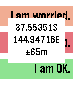</a>

<h2 class="app-name" id="app-56014a2508e93f4b6d000063"><a href="https://apps.repebble.com/56014a2508e93f4b6d000063">Send Message</a></h2>
<a class="app-source" href="http://web.aanet.com.au/~summersfamily/send_message_(5.5).zip" title="Source code" data-search-exclude>View source</a>

by <a href="https://apps.repebble.com/apps/dev/peter-summers_544f79d4ba44304f8400004c" title="More from this developer">Peter Summers</a>

See source v5.5 Updated 2017-02-10

Runs on: Round 2, Time 2, Pebble 2 Duo, Pebble 2, Time Round, Time, Classic

GPS-aware HTTP client supporting GET and POST requests and server response verification or display. Allows configuration with three sets of label, URL, JSON data segment (if using POST) and string…

<a class="app-shot" href="https://apps.rebble.io/en_US/application/5939f07fb67f9fb68e000c48" data-search-exclude>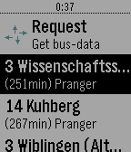</a>

<h2 class="app-name" id="app-5939f07fb67f9fb68e000c48"><a href="https://apps.rebble.io/en_US/application/5939f07fb67f9fb68e000c48">Served! Ulm (Busses in Ulm)</a></h2>
<a class="app-source" href="https://github.com/DeltaTimo/DINGConnections" title="Source code" data-search-exclude>View source</a>

by <a href="https://apps.rebble.io/en_US/developer/58e36a7a0dfc3254c6000932/1" title="More from this developer">Timo Zuccarello</a>

No licence v2.0 Updated 2017-09-21 Rebble App Store

Runs on: Time 2, Pebble 2 Duo, Pebble 2, Time, Classic

Now supports - German. Never miss your bus home from a party again! Served! Ulm shows you departure times of busses and trams near you queried directly from the Official DING Server. Supports only…

<a class="app-shot" href="https://apps.rebble.io/en_US/application/6377f2c7fdf3e30009f63951" data-search-exclude>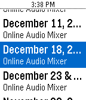</a>

<h2 class="app-name" id="app-6377f2c7fdf3e30009f63951"><a href="https://apps.rebble.io/en_US/application/6377f2c7fdf3e30009f63951">Services for Pebble</a></h2>
<a class="app-source" href="https://github.com/blockarchitech/pebble" title="Source code" data-search-exclude>View source</a>

by <a href="https://apps.rebble.io/en_US/developer/5cdc3a87f518e60001e4c071/1" title="More from this developer">gibbiemonster</a>

No licence v2.1 Updated 2024-04-09 Rebble App Store

Runs on: Round 2, Time 2, Pebble 2 Duo, Pebble 2, Time Round, Time, Classic

Manage your Planning Center Services - on your wrist!

<a class="app-shot" href="https://apps.repebble.com/578265d46c21044cf5000653" data-search-exclude>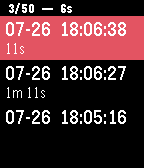</a>

<h2 class="app-name" id="app-578265d46c21044cf5000653"><a href="https://apps.repebble.com/578265d46c21044cf5000653">Session Timer</a></h2>
<a class="app-source" href="https://github.com/robinson2/PebbleSessionTimer" title="Source code" data-search-exclude>View source</a>

by <a href="https://apps.repebble.com/apps/dev/oldschool-de_54353c3c32035c53d80001c5" title="More from this developer">Oldschool.de</a>

Not checked yet v1.4 Updated 2016-08-31

Runs on: Round 2, Time 2, Pebble 2 Duo, Pebble 2, Time Round, Time, Classic

Track your surfing or swimming sessions and other activities while your smartphone is out of reach. The app lists and saves up to 50 timestamps with duration of each session (the time between two…

<a class="app-shot" href="https://apps.repebble.com/53131440bb31cfb4250001ac" data-search-exclude>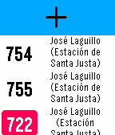</a>

<h2 class="app-name" id="app-53131440bb31cfb4250001ac"><a href="https://apps.repebble.com/53131440bb31cfb4250001ac">Sevilla Bus</a></h2>
<a class="app-source" href="https://github.com/juanrarodriguez18/Sevilla-Bus" title="Source code" data-search-exclude>View source</a>

by <a href="https://apps.repebble.com/apps/dev/juan-ram-n-rodr-guez_54de19613d38fe91380000a0" title="More from this developer">Juan Ramón Rodríguez</a>

Not checked yet v3.0 Updated 2017-09-25

Runs on: Round 2, Time 2, Pebble 2 Duo, Pebble 2, Time Round, Time, Classic

Get realtime service information for Seville buses.

<a class="app-shot" href="https://apps.repebble.com/7f8d2c5153c8436abdada1eb" data-search-exclude>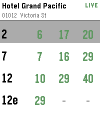</a>

<h2 class="app-name" id="app-7f8d2c5153c8436abdada1eb"><a href="https://apps.repebble.com/7f8d2c5153c8436abdada1eb">SG Bus</a></h2>
<a class="app-source" href="https://github.com/qichuan/pebble-sg-bus" title="Source code" data-search-exclude>View source</a>

by <a href="https://apps.repebble.com/apps/dev/zhang-qichuan_53043485117485c22f0000cf" title="More from this developer">Zhang Qichuan</a>

Not checked yet v1.0.1 Updated 2026-07-26

Runs on: Round 2, Time 2, Pebble 2 Duo, Pebble 2, Time Round, Time, Classic

Singapore bus arrival times on your wrist. Find bus stops near you using your phone&#x27;s location, or open a favourite stop to see live arrival times. Tap a bus service for the next few buses…

<a class="app-shot" href="https://apps.repebble.com/427683454738466d9aff642a" data-search-exclude>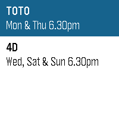</a>

<h2 class="app-name" id="app-427683454738466d9aff642a"><a href="https://apps.repebble.com/427683454738466d9aff642a">SG Toto &amp; 4D</a></h2>
<a class="app-source" href="https://github.com/qichuan/pebble-sg-toto-4d" title="Source code" data-search-exclude>View source</a>

by <a href="https://apps.repebble.com/apps/dev/zhang-qichuan_53043485117485c22f0000cf" title="More from this developer">Zhang Qichuan</a>

Not checked yet v1.0.0 Updated 2026-07-05

Runs on: Round 2, Time 2, Pebble 2 Duo, Pebble 2, Time Round, Time, Classic

Huat ah! 🎉 Feeling lucky? SG Toto &amp; 4D puts the latest Singapore Pools results right on your wrist. Results are updated shortly after every draw — TOTO on Monday &amp; Thursday, 4D on Wednesday…

<h2 class="app-name" id="app-55139d546f2fceea99000085"><a href="https://apps.repebble.com/55139d546f2fceea99000085">SGDtoINR ExchRate</a></h2>
<a class="app-source" href="http://www.techworldviews.com/pebblewatchapp/" title="Source code" data-search-exclude>View source</a>

by <a href="https://apps.repebble.com/apps/dev/thota-vinay_547c424f36aa9be7b6000002" title="More from this developer">Thota Vinay</a>

See source v2.1 Updated 2015-03-31

Runs on: Time 2, Pebble 2 Duo, Pebble 2, Time, Classic

&quot;SGDtoINR ExchRate” App allows you to get exchange rate by launching it.Currently the App supports SGD(Singapore Dollar) to INR(Indian Rupees) from Banks in Singapore.

<a class="app-shot" href="https://apps.repebble.com/55079bdbce75c114d30000c7" data-search-exclude>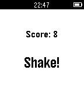</a>

<h2 class="app-name" id="app-55079bdbce75c114d30000c7"><a href="https://apps.repebble.com/55079bdbce75c114d30000c7">Shake It!</a></h2>
<a class="app-source" href="https://github.com/triedal/Shake-It" title="Source code" data-search-exclude>View source</a>

by <a href="https://apps.repebble.com/apps/dev/tyler-riedal_54e6b031b3b8c3b10000002e" title="More from this developer">Tyler Riedal</a>

Not checked yet v1.0 Updated 2015-03-17

Runs on: Time 2, Pebble 2 Duo, Pebble 2, Time, Classic

Bop It clone for Pebble! Get ready to react fast! Mimic the displayed commands by using the side buttons and shaking your watch.

<a class="app-shot" href="https://apps.repebble.com/5678b7d3bdb5f06f4b00007d" data-search-exclude>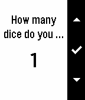</a>

<h2 class="app-name" id="app-5678b7d3bdb5f06f4b00007d"><a href="https://apps.repebble.com/5678b7d3bdb5f06f4b00007d">Shake2Roll</a></h2>
<a class="app-source" href="https://www.github.com/Frosted-Torus/Shake2Roll" title="Source code" data-search-exclude>View source</a>

by <a href="https://apps.repebble.com/apps/dev/frosted-torus_55cf6edfdd278cc045000026" title="More from this developer">Frosted Torus</a>

Not checked yet v1.5 Updated 2016-07-25

Runs on: Round 2, Time 2, Pebble 2 Duo, Pebble 2, Time Round, Time, Classic

Are you frustrated with game dice? Shake2Roll is for you! Whether you&#x27;re playing Yahtzee or Dungeons &amp; Dragons or exploring probability in a math class, you can use this app. Press the middle…

<a class="app-shot" href="https://apps.repebble.com/5430e9adec1644f8b70000de" data-search-exclude>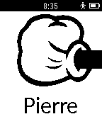</a>

<h2 class="app-name" id="app-5430e9adec1644f8b70000de"><a href="https://apps.repebble.com/5430e9adec1644f8b70000de">Shifumi</a></h2>
<a class="app-source" href="https://github.com/nicoplv/shifumi-pebble" title="Source code" data-search-exclude>View source</a>

by <a href="https://apps.repebble.com/apps/dev/nicoplv_542a54bff96784ad2a00004b" title="More from this developer">Nicoplv</a>

Not checked yet v1.0 Updated 2014-10-05

Runs on: Time 2, Pebble 2 Duo, Pebble 2, Time, Classic

Simple shifumi game for pebble Use Up, Select and Down buttons to select your choice, and shake your wrist to show the selection to your opponent.

<a class="app-shot" href="https://apps.repebble.com/d9ae0d91c6b94bd2add22405" data-search-exclude>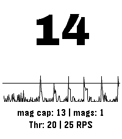</a>

<h2 class="app-name" id="app-d9ae0d91c6b94bd2add22405"><a href="https://apps.repebble.com/d9ae0d91c6b94bd2add22405">Shot &amp; Recoil Counter</a></h2>
<a class="app-source" href="https://github.com/dcanelhas/ShotCounter" title="Source code" data-search-exclude>View source</a>

by <a href="https://apps.repebble.com/apps/dev/drc_f9f561c351b06fcf9db54d67" title="More from this developer">DRC</a>

Not checked yet v1.1.2 Updated 2026-09-01

Runs on: Time 2

This app uses the accelerometer to measure recoil (as spikes in acceleration) in order to count the number of shots taken in sports shooting. Settings: - Color Theme (default: Dark Mono) - Recoil…

<a class="app-shot" href="https://apps.repebble.com/54efac282e6a4711130000dc" data-search-exclude>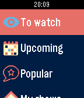</a>

<h2 class="app-name" id="app-54efac282e6a4711130000dc"><a href="https://apps.repebble.com/54efac282e6a4711130000dc">Shows</a></h2>
<a class="app-source" href="https://github.com/youtux/PebbleShows" title="Source code" data-search-exclude>View source</a>

by <a href="https://apps.repebble.com/apps/dev/alessio-bogon_52fe8094e2d6411af5000399" title="More from this developer">Alessio Bogon</a>

Not checked yet v3.8 Updated 2016-02-14

Runs on: Round 2, Time 2, Pebble 2 Duo, Pebble 2, Time Round, Time, Classic

Keep track of your TV shows on your Pebble! With this watchapp you can view what episodes you have to watch and what&#x27;s coming out in the next days. On your timeline, too! The watchapp needs to…

<a class="app-shot" href="https://apps.repebble.com/52b40d99b06f4b836900001d" data-search-exclude>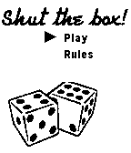</a>

<h2 class="app-name" id="app-52b40d99b06f4b836900001d"><a href="https://apps.repebble.com/52b40d99b06f4b836900001d">Shut the box</a></h2>
<a class="app-source" href="https://github.com/danhead/ShutTheBox/" title="Source code" data-search-exclude>View source</a>

by <a href="https://apps.repebble.com/apps/dev/daniel-head_52b408c8f637b2bfe7000014" title="More from this developer">Daniel Head</a>

Not checked yet v1.0.1 Updated 2014-02-10

Runs on: Time 2, Pebble 2 Duo, Pebble 2, Time, Classic

Centuries old table top dice game, reimagined for your Pebble Watch!

<a class="app-shot" href="https://apps.repebble.com/57c43fca5e3c3db6280003a9" data-search-exclude>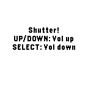</a>

<h2 class="app-name" id="app-57c43fca5e3c3db6280003a9"><a href="https://apps.repebble.com/57c43fca5e3c3db6280003a9">Shutter</a></h2>
<a class="app-source" href="http://github.com/konradit/shutter" title="Source code" data-search-exclude>View source</a>

by <a href="https://apps.repebble.com/apps/dev/konrad-iturbe_554fa8d38d6d430fd500006d" title="More from this developer">Konrad Iturbe</a>

No licence v1.0 Updated 2016-08-29

Runs on: Round 2, Time 2, Pebble 2 Duo, Pebble 2, Time Round, Time, Classic

FOR ROOTED DEVICES ONLY. This app allows you to take a photo on your Android phone It emulates touchscreen press on the app&#x27;s shutter button and takes a picture/starts or stops a video. Android…

<a class="app-shot" href="https://apps.repebble.com/5355e775c822ffafd0000096" data-search-exclude>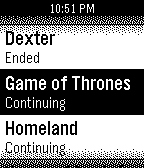</a>

<h2 class="app-name" id="app-5355e775c822ffafd0000096"><a href="https://apps.repebble.com/5355e775c822ffafd0000096">SickPebble</a></h2>
<a class="app-source" href="https://github.com/mongo527/SickPebble" title="Source code" data-search-exclude>View source</a>

by <a href="https://apps.repebble.com/apps/dev/mongo527_52f00a513be620b3a4000018" title="More from this developer">mongo527</a>

Not checked yet v1.1.3 Updated 2014-05-10

Runs on: Time 2, Pebble 2 Duo, Pebble 2, Time, Classic

Control SickBeard from your Pebble! Features: - Configurable to your liking - View Shows in SickBeard (With Status) - View Upcoming/Future Shows (With Time, Day, Date) - View History (Downloaded…

<a class="app-shot" href="https://apps.repebble.com/37360ca4d9764881bd1d6f4d" data-search-exclude>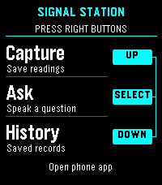</a>

<h2 class="app-name" id="app-37360ca4d9764881bd1d6f4d"><a href="https://apps.repebble.com/37360ca4d9764881bd1d6f4d">Signal Station</a></h2>
<a class="app-source" href="https://dr.eamer.dev/downloads/apps/signal-station/#source" title="Source code" data-search-exclude>View source</a>

by <a href="https://apps.repebble.com/apps/dev/ambient-time_3a9986a63073f9f293be7e14" title="More from this developer">Ambient Time</a>

See source v1.8.1 Updated 2026-10-05

Runs on: Round 2, Time 2, Pebble 2 Duo, Pebble 2, Time Round, Time

EXPERMENTAL This is a signal / presence awareness system with a Pebble face serving as interface and capture tool. It also offers chat from your wrist with the language model you choose, enriched…

<a class="app-shot" href="https://apps.repebble.com/9170d8ea82e842e6b0abdbe3" data-search-exclude>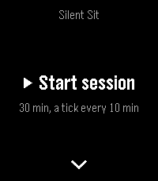</a>

<h2 class="app-name" id="app-9170d8ea82e842e6b0abdbe3"><a href="https://apps.repebble.com/9170d8ea82e842e6b0abdbe3">Silent Sit</a></h2>
<a class="app-source" href="https://github.com/stefanoverna/silent-sit-pebble" title="Source code" data-search-exclude>View source</a>

by <a href="https://apps.repebble.com/apps/dev/stefano-verna_c5e307b33ca3e561263b6720" title="More from this developer">Stefano Verna</a>

Not checked yet v1.1.0 Updated 2026-06-27

Runs on: Time 2

Silent Sit — Silent, tactile meditation timer Silent Sit paces your sitting with vibrations alone. No bells, no sound, no screen to look at: you feel the rhythm on your wrist and keep your eyes…

<h2 class="app-name" id="app-54166746ba06e4e0db000073"><a href="https://apps.repebble.com/54166746ba06e4e0db000073">SimonRemote</a></h2>
<a class="app-source" href="https://github.com/simonremote" title="Source code" data-search-exclude>View source</a>

by <a href="https://apps.repebble.com/apps/dev/tyler-hoffman_52da8e31889f5d6e23000165" title="More from this developer">Tyler Hoffman</a>

Not checked yet v1.2 Updated 2015-01-03

Runs on: Time 2, Pebble 2 Duo, Pebble 2, Time, Classic

SimonRemote allows a Pebble to control iTunes, Spotify, PowerPoint, and Keynote, and the keyboard on a user&#x27;s Mac computer. It even allows multiple Pebbles to control the same computer...great for…

<a class="app-shot" href="https://apps.repebble.com/75a3c14b89724bd8b9c42be6" data-search-exclude>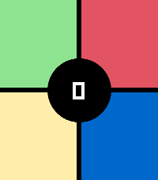</a>

<h2 class="app-name" id="app-75a3c14b89724bd8b9c42be6"><a href="https://apps.repebble.com/75a3c14b89724bd8b9c42be6">SimonTime</a></h2>
<a class="app-source" href="https://github.com/sheppoor/SimonTime" title="Source code" data-search-exclude>View source</a>

by <a href="https://apps.repebble.com/apps/dev/sheppoor_412a498a797c10f09b9da5a7" title="More from this developer">sheppoor</a>

Not checked yet v1.0.1 Updated 2026-07-25

Runs on: Round 2, Time 2

Classic pattern memory game with touch and sound. High score. Up button to see/change speaker on/off state. Select button or center tap to start a new game. Designed for Pebble Time 2, looks even…

<a class="app-shot" href="https://apps.repebble.com/52e5449b97213707e00005b8" data-search-exclude>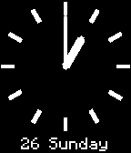</a>

<h2 class="app-name" id="app-52e5449b97213707e00005b8"><a href="https://apps.repebble.com/52e5449b97213707e00005b8">Simple Analogue Watch, Stop Watch, Countdown Yacht Timer</a></h2>
<a class="app-source" href="https://github.com/MikeMoore63/swanalog" title="Source code" data-search-exclude>View source</a>

by <a href="https://apps.repebble.com/apps/dev/mikem_5299a2ae129af7accf00005c" title="More from this developer">MikeM</a>

No licence v3.0 Updated 2015-05-05

Runs on: Time 2, Pebble 2 Duo, Pebble 2, Time, Classic

A simple analog Watch, Countdown, Stop Watch, Yacht Timer with countdown adjustment. Vibrates at key times i.e. in Yacht Timer mode 4 minutes 1 minutes, 30 seconds, 20 secs, 10 secs, start.

<a class="app-shot" href="https://apps.repebble.com/69c9ca0340411f0009fd69a9" data-search-exclude>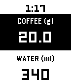</a>

<h2 class="app-name" id="app-69c9ca0340411f0009fd69a9"><a href="https://apps.repebble.com/69c9ca0340411f0009fd69a9">Simple coffee ratio calculator</a></h2>
<a class="app-source" href="https://github.com/valerialaura/pebble-coffee-ratio" title="Source code" data-search-exclude>View source</a>

by <a href="https://apps.repebble.com/apps/dev/valerialaura_53a46235694928d8ef0001b2" title="More from this developer">valerialaura</a>

Not checked yet v1.1 Updated 2026-09-23

Runs on: Time 2, Pebble 2 Duo, Pebble 2, Time

A coffee-to-water ratio calculator for your wrist. Set your brewing ratio once, then dial in coffee or water to get the matching amount instantly. Perfect for pour-over, when you weigh your beans…

<a class="app-shot" href="https://apps.rebble.io/en_US/application/59dceb380dfc32af61003d5a" data-search-exclude>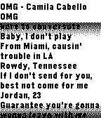</a>

<h2 class="app-name" id="app-59dceb380dfc32af61003d5a"><a href="https://apps.rebble.io/en_US/application/59dceb380dfc32af61003d5a">Simple Lyrics Viewer</a></h2>
<a class="app-source" href="https://github.com/greenlover1991/pebble-lyrics-viewer" title="Source code" data-search-exclude>View source</a>

by <a href="https://apps.rebble.io/en_US/developer/58d3bcef6ca387cb86000cf8/1" title="More from this developer">Steven Go</a>

Not checked yet v1.0 Updated 2017-10-11 Rebble App Store

Runs on: Time 2, Pebble 2 Duo, Pebble 2, Time, Classic

Simple scollable Lyrics Viewer - ANDROID only - REQUIRES Automate Flow companion to properly work. Link at the external website link. - REQUIRES Spotify&#x27;s &quot;Device Broadcast Status&quot; is enabled …

<a class="app-shot" href="https://apps.repebble.com/5772e69e6c21047b2c00040d" data-search-exclude>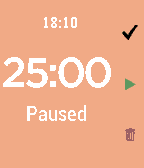</a>

<h2 class="app-name" id="app-5772e69e6c21047b2c00040d"><a href="https://apps.repebble.com/5772e69e6c21047b2c00040d">Simple Pomodoro</a></h2>
<a class="app-source" href="https://github.com/shawnzxiang/pebble-pomodoro" title="Source code" data-search-exclude>View source</a>

by <a href="https://apps.repebble.com/apps/dev/shawn-xiang_56ad39de5319ec4ac1000053" title="More from this developer">Shawn Xiang</a>

Not checked yet v1.5 Updated 2016-09-25

Runs on: Round 2, Time 2, Pebble 2 Duo, Pebble 2, Time Round, Time, Classic

This pomodoro app in pebble can: Customize time (work, rest, long rest and long rest frequency) and UI Screen Color Ability to take a long break after several iterations Shows the time and status…

<a class="app-shot" href="https://apps.repebble.com/52e8cb0fa85c6301af000005" data-search-exclude>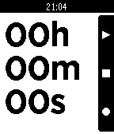</a>

<h2 class="app-name" id="app-52e8cb0fa85c6301af000005"><a href="https://apps.repebble.com/52e8cb0fa85c6301af000005">Simple Stopwatch</a></h2>
<a class="app-source" href="https://github.com/brandonio21/SimpleStopwatch" title="Source code" data-search-exclude>View source</a>

by <a href="https://apps.repebble.com/apps/dev/brandon-milton_52d06b4f74a38ec3b500005f" title="More from this developer">Brandon Milton</a>

MIT v2.2.5 Updated 2014-03-14

Runs on: Time 2, Pebble 2 Duo, Pebble 2, Time, Classic

A simple stopwatch app with a large, clear display and functionality to pause, reset, and lap. Also continues timing when app is closed! -The top button pauses/resumes the stopwatch -The middle…

<a class="app-shot" href="https://apps.repebble.com/5584198e5160209a4600009c" data-search-exclude>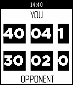</a>

<h2 class="app-name" id="app-5584198e5160209a4600009c"><a href="https://apps.repebble.com/5584198e5160209a4600009c">Simple Tennis Scorer</a></h2>
<a class="app-source" href="https://github.com/scottyblizz/TennisScorer" title="Source code" data-search-exclude>View source</a>

by <a href="https://apps.repebble.com/apps/dev/scott-d_558413a50a225dd5f50000a6" title="More from this developer">Scott D</a>

Not checked yet v1.0 Updated 2015-06-19

Runs on: Time 2, Pebble 2 Duo, Pebble 2, Time, Classic

Tennis scoring app. Useful for forgetful veterans or beginners unsure on the rules. Press UP or DOWN every time someone scores a point. Press SELECT to reset the scores.

<a class="app-shot" href="https://apps.repebble.com/55fa4a4f18a3ff5eb100004b" data-search-exclude>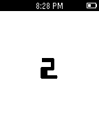</a>

<h2 class="app-name" id="app-55fa4a4f18a3ff5eb100004b"><a href="https://apps.repebble.com/55fa4a4f18a3ff5eb100004b">SimpleCount</a></h2>
<a class="app-source" href="https://github.com/CGTheLegend/Pebble_Counter.git" title="Source code" data-search-exclude>View source</a>

by <a href="https://apps.repebble.com/apps/dev/cgthelegend_54b05ee9478cd30b0c0000f6" title="More from this developer">CGTheLegend</a>

No licence v1.2 Updated 2015-09-18

Runs on: Time 2, Pebble 2 Duo, Pebble 2, Time, Classic

This is a simple application that keeps tracks and displays a count. The count can be increased or decreased as well as cleared. Negative numbers are supported.

<a class="app-shot" href="https://apps.repebble.com/57b309a2f01b53ce0c000591" data-search-exclude>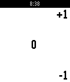</a>

<h2 class="app-name" id="app-57b309a2f01b53ce0c000591"><a href="https://apps.repebble.com/57b309a2f01b53ce0c000591">SimpleCounter</a></h2>
<a class="app-source" href="https://github.com/sheydenis/SimpleCounter" title="Source code" data-search-exclude>View source</a>

by <a href="https://apps.repebble.com/apps/dev/masmddr_54323d5d4a9ca48ba80000d5" title="More from this developer">masmddr</a>

Not checked yet v1.11 Updated 2016-09-28

Runs on: Time 2, Pebble 2 Duo, Pebble 2, Time, Classic

A simple counter app. Saves count on exit, no vibrations, no fancy colors. Comma separated digits by groups of 3. (Free Pro feature) Up / down buttons for +1 / -1 . Long press down to reset count…

<a class="app-shot" href="https://apps.repebble.com/5596039d49b3c859510000cd" data-search-exclude>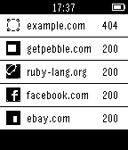</a>

<h2 class="app-name" id="app-5596039d49b3c859510000cd"><a href="https://apps.repebble.com/5596039d49b3c859510000cd">SiteStatus</a></h2>
<a class="app-source" href="https://github.com/tbloncar/pebble-sitestatus" title="Source code" data-search-exclude>View source</a>

by <a href="https://apps.repebble.com/apps/dev/moonbeam_558e02ede3975e0e10000033" title="More from this developer">Moonbeam</a>

Not checked yet v1.4 Updated 2015-09-16

Runs on: Time 2, Pebble 2 Duo, Pebble 2, Time, Classic

Monitor the status of your websites from your Pebble device. SiteStatus displays a configurable list of sites, each with a green (up) / red (down) status and HTTP status codes returned from the…

<h2 class="app-name" id="app-5609b2db60c427e11b000080"><a href="https://apps.repebble.com/5609b2db60c427e11b000080">Six Nations Rugby 2016</a></h2>
<a class="app-source" href="https://github.com/comicmuse/SixNations" title="Source code" data-search-exclude>View source</a>

by <a href="https://apps.repebble.com/apps/dev/comicmuse_5349837b4586aa348400033b" title="More from this developer">comicmuse</a>

Not checked yet v2.0 Updated 2017-02-07

Runs on: Time 2, Pebble 2 Duo, Pebble 2, Time, Classic

Here we are, back in time for the Six Nations. See the scores and match details for every Six Nations match. This is the RWC app with a new feed, but will continue to work on it during the…

<a class="app-shot" href="https://apps.repebble.com/52f1095ba0cb6abe6d002f05" data-search-exclude>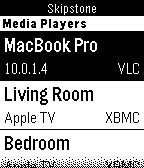</a>

<h2 class="app-name" id="app-52f1095ba0cb6abe6d002f05"><a href="https://apps.repebble.com/52f1095ba0cb6abe6d002f05">Skipstone</a></h2>
<a class="app-source" href="https://github.com/Skipstone/Skipstone" title="Source code" data-search-exclude>View source</a>

by <a href="https://apps.repebble.com/apps/dev/neal-patel_528feeab8a8c0b97c8000005" title="More from this developer">Neal Patel</a>

MIT v2.5 Updated 2015-02-09

Runs on: Time 2, Pebble 2 Duo, Pebble 2, Time, Classic

A fully featured universal media player remote watch app that allows you to control Plex, VLC, XBMC and WDTV. Skipstone is an open-source project by @petehare, @spangborn, and @iNeal. Source code…

<a class="app-shot" href="https://apps.repebble.com/553aaf29bf1a5965020000c8" data-search-exclude>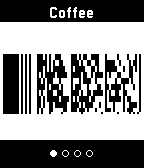</a>

<h2 class="app-name" id="app-553aaf29bf1a5965020000c8"><a href="https://apps.repebble.com/553aaf29bf1a5965020000c8">skunk</a></h2>
<a class="app-source" href="https://github.com/unlobito/skunk" title="Source code" data-search-exclude>View source</a>

by <a href="https://apps.repebble.com/apps/dev/harley-watson_52b1e71c6ba927524b00000f" title="More from this developer">Harley Watson</a>

Not checked yet v1.9 Updated 2026-04-29

Runs on: Round 2, Time 2, Pebble 2 Duo, Pebble 2, Time Round, Time, Classic

Skunk allows easy access to up to eight store cards and other barcodes. Linear Barcodes: Codabar, Code 39, Code 128, EAN-8, EAN-13, Interleaved 2 of 5 (ITF), UPC-A Matrix Barcodes: Aztec, Data…

<a class="app-shot" href="https://apps.repebble.com/5561a6d9fd8f4b8de400004b" data-search-exclude>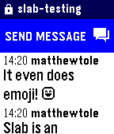</a>

<h2 class="app-name" id="app-5561a6d9fd8f4b8de400004b"><a href="https://apps.repebble.com/5561a6d9fd8f4b8de400004b">Slab</a></h2>
<a class="app-source" href="https://github.com/finebyte/slabforpebble" title="Source code" data-search-exclude>View source</a>

by <a href="https://apps.repebble.com/apps/dev/finebyte_528b2ad3e717391712000018" title="More from this developer">finebyte</a>

Not checked yet v1.3 Updated 2016-05-05

Runs on: Round 2, Time 2, Pebble 2 Duo, Pebble 2, Time Round, Time, Classic

Slab by finebyte &amp; Matthew Tole Read Slack channels, private groups and direct messages. Reply with dictation, short messages and Emoji. Feel awesomely connected. This app and the authors are not…

<a class="app-shot" href="https://apps.repebble.com/552179d9d7356c3f40000048" data-search-exclude>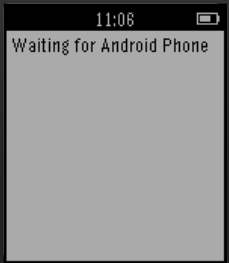</a>

<h2 class="app-name" id="app-552179d9d7356c3f40000048"><a href="https://apps.repebble.com/552179d9d7356c3f40000048">Slapp</a></h2>
<a class="app-source" href="https://github.com/ibrahimansari/Slapp-Pebble-Client" title="Source code" data-search-exclude>View source</a>

by <a href="https://apps.repebble.com/apps/dev/ibrahimansari_53137898bb31cff552000340" title="More from this developer">IbrahimAnsari</a>

Not checked yet v1.0 Updated 2015-04-05

Runs on: Time 2, Pebble 2 Duo, Pebble 2, Time, Classic

A revolutionary way to meet new people and immediately connect with them. We can exchange your contact and other social networking information with a customizble gesture on your wearble device…

<a class="app-shot" href="https://apps.repebble.com/5620a39525ef793651000045" data-search-exclude>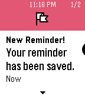</a>

<h2 class="app-name" id="app-5620a39525ef793651000045"><a href="https://apps.repebble.com/5620a39525ef793651000045">Slate</a></h2>
<a class="app-source" href="https://github.com/hipsterbrown/slate" title="Source code" data-search-exclude>View source</a>

by <a href="https://apps.repebble.com/apps/dev/wristy-business_52f0096f61b75268a1000052" title="More from this developer">Wristy Business</a>

Not checked yet v1.1 Updated 2019-07-24

Runs on: Round 2, Time 2, Time Round, Time

Apple has Siri. Microsoft has Cortana. Now Pebble has Slate. Instantly add reminders to your Pebble Timeline simply by telling Slate what you need. Say &quot;Remind me to/about &lt;task&gt; at/on…

<h2 class="app-name" id="app-56b40e11ed001b5bc6000051"><a href="https://apps.repebble.com/56b40e11ed001b5bc6000051">SLC Omnivox Cancelled Classes</a></h2>
<a class="app-source" href="https://github.com/Malpp/SLC" title="Source code" data-search-exclude>View source</a>

by <a href="https://apps.repebble.com/apps/dev/malp_55b276c33dcdb0c7c5000069" title="More from this developer">Malp</a>

No licence v1.1 Updated 2016-02-09

Runs on: Time 2, Pebble 2 Duo, Pebble 2, Time, Classic

This app looks up which classes have been canceled on Omnivox. This is made for the St.Laurence College Omnivox.

<h2 class="app-name" id="app-5320c36f53fab421d000003a"><a href="https://apps.repebble.com/5320c36f53fab421d000003a">Slebble</a></h2>
<a class="app-source" href="https://github.com/xdjinnx/Slebble" title="Source code" data-search-exclude>View source</a>

by <a href="https://apps.repebble.com/apps/dev/peter-lundberg_52f0b6fc3be620c78000237b" title="More from this developer">Peter Lundberg</a>

Not checked yet v2.9 Updated 2016-09-03

Runs on: Round 2, Time 2, Pebble 2 Duo, Pebble 2, Time Round, Time, Classic

Public transportation watchapp for sweden. Save your favorite stations and check the arrival time of them. Supports: Stockholms Lokaltrafik (SL), Västtrafik, Skånetrafiken and more. Network…

<h2 class="app-name" id="app-57ccd97df69d1d6360000223"><a href="https://apps.repebble.com/57ccd97df69d1d6360000223">Sleepy-Watch</a></h2>
<a class="app-source" href="https://github.com/TerttyCurlyfries/Sleepy-Watch" title="Source code" data-search-exclude>View source</a>

by <a href="https://apps.repebble.com/apps/dev/stanivision-inc_52d4acb6d8d9dfc9e000002a" title="More from this developer">Stanivision Inc.</a>

No licence v1.0 Updated 2016-12-21

Runs on: Round 2, Time 2, Pebble 2 Duo, Pebble 2, Time Round, Time, Classic

There is a world as tangible as our own, impossible to see yet unavoidable to sense, a world enveloped by an unending ocean of forests. Buried deep in that forest, tucked away neatly by a blanket…

<h2 class="app-name" id="app-11c43afc299e4d1d88aea8f4"><a href="https://apps.repebble.com/11c43afc299e4d1d88aea8f4">Slice It!</a></h2>
<a class="app-source" href="https://github.com/KarlKl/Pebble-SliceIt" title="Source code" data-search-exclude>View source</a>

by <a href="https://apps.repebble.com/apps/dev/karl_0e91d84045d24bb5497e1700" title="More from this developer">Karl</a>

No licence v1.0.0 Updated 2026-05-18

Runs on: Time 2

Slice It! is a fast-paced fruit-slicing game for Pebble Time 2. Swipe across the screen to slice flying fruits and rack up your score. But watch out - black bombs are mixed in, and slicing one…

<h2 class="app-name" id="app-52ee43b994cc96bd0b00000c"><a href="https://apps.repebble.com/52ee43b994cc96bd0b00000c">Slides</a></h2>
<a class="app-source" href="https://github.com/luisivan/pebble-slides" title="Source code" data-search-exclude>View source</a>

by <a href="https://apps.repebble.com/apps/dev/luis-iv-n-cuende_52cf3390826be30738000002" title="More from this developer">Luis Iván Cuende</a>

Not checked yet v1.0.0 Updated 2014-02-02

Runs on: Time 2, Pebble 2 Duo, Pebble 2, Time, Classic

Pebble app to toggle slides on Linux, Mac and Windows, includes chronometer and notes to make giving talks easier. The app displays a chronometer and you can go back/forth in your slides using the…

<h2 class="app-name" id="app-601b22a11342ae01cc2e3fb1"><a href="https://apps.repebble.com/601b22a11342ae01cc2e3fb1">Slope Buddy</a></h2>
<a class="app-source" href="https://github.com/konradit/slopebuddy" title="Source code" data-search-exclude>View source</a>

by <a href="https://apps.repebble.com/apps/dev/konrad-iturbe_554fa8d38d6d430fd500006d" title="More from this developer">Konrad Iturbe</a>

Not checked yet v0.1 Updated 2021-02-03

Runs on: Round 2, Time 2, Pebble 2 Duo, Pebble 2, Time Round, Time, Classic

Slope Buddy tells you what you need to know before heading out to ski. See the weather 1-7 days ahead, see how much fresh snow there&#x27;ll be at the top of the resort, see which lifts are open and…

<h2 class="app-name" id="app-56c16f9b2ff87c44b4000043"><a href="https://apps.repebble.com/56c16f9b2ff87c44b4000043">Smart Metronome</a></h2>
<a class="app-source" href="https://github.com/scottrules44/pebbleMetro" title="Source code" data-search-exclude>View source</a>

by <a href="https://apps.repebble.com/apps/dev/scott-harrison_52f03487af0eab46cf000ce6" title="More from this developer">Scott Harrison</a>

Not checked yet v1.0 Updated 2016-02-15

Runs on: Round 2, Time 2, Pebble 2 Duo, Pebble 2, Time Round, Time, Classic

This metronome is very easy to use. It can handle almost anytime time scale at the speed you want.

<h2 class="app-name" id="app-58795dba5de85036d5000178"><a href="https://apps.rebble.io/en_US/application/58795dba5de85036d5000178">Smart things Remote</a></h2>
<a class="app-source" href="https://cloudpebble.net/ide/project/388885" title="Source code" data-search-exclude>View source</a>

by <a href="https://apps.rebble.io/en_US/developer/559af33f071c858fbb000062/1" title="More from this developer">Isaiah Kasten</a>

See source v1.1 Updated 2017-01-13 Rebble App Store

Runs on: Time 2, Pebble 2 Duo, Pebble 2, Time, Classic

Remote

<h2 class="app-name" id="app-54f44fee89900eba28000041"><a href="https://apps.repebble.com/54f44fee89900eba28000041">SmartDAYS</a></h2>
<a class="app-source" href="https://github.com/itzkha/pebble_code/" title="Source code" data-search-exclude>View source</a>

by <a href="https://apps.repebble.com/apps/dev/smartdays_52d9ae3cb82a9fd7d7000017" title="More from this developer">smartDAYS</a>

Not checked yet v0.3 Updated 2015-03-10

Runs on: Time 2, Pebble 2 Duo, Pebble 2, Time, Classic

Research application aiming to automatically detect and log daily activities from motion sensors onboard the Pebble watch. Note: This application is simply a data logging application for now…

<h2 class="app-name" id="app-528fc3f5a92e1fb5ac000019"><a href="https://apps.rebble.io/en_US/application/528fc3f5a92e1fb5ac000019">SmartStatus</a></h2>
<a class="app-source" href="http://github.com/robhh/SmartStatus-AppStore" title="Source code" data-search-exclude>View source</a>

by <a href="https://apps.rebble.io/en_US/developer/5283fe46c0b016202300001b/1" title="More from this developer">robhh</a>

No licence v1.9 Updated 2015-06-03 Rebble App Store

Runs on: Time 2, Pebble 2 Duo, Pebble 2, Time, Classic

Display the current weather alongside the iPhone&#x27;s and Pebble&#x27;s battery level, the current/next calendar appointment, and the currently playing song from your iPhone&#x27;s iPod music player. This…

<h2 class="app-name" id="app-52cded255c88b9059700000e"><a href="https://apps.repebble.com/52cded255c88b9059700000e">SmartStatus-op</a></h2>
<a class="app-source" href="https://github.com/opasco/SmartStatus-op" title="Source code" data-search-exclude>View source</a>

by <a href="https://apps.repebble.com/apps/dev/olivier-pasco_52ab4b9cb8f6c2b68400001e" title="More from this developer">Olivier Pasco</a>

Not checked yet v1.01 Updated 2014-06-27

Runs on: Time 2, Pebble 2 Duo, Pebble 2, Time, Classic

This is a modified version of the SmartStatus watch app by Robert Hesse. It only works in conjunction with the Smartwatch+ iOS app available on the Apple App Store…

<h2 class="app-name" id="app-52ee5a0c94cc969637000016"><a href="https://apps.repebble.com/52ee5a0c94cc969637000016">SmartTraining</a></h2>
<a class="app-source" href="https://github.com/awwa/pebble-smarttraining/tree/sdk2.0" title="Source code" data-search-exclude>View source</a>

by <a href="https://apps.repebble.com/apps/dev/awwa_52eda206a8030f8ea800000d" title="More from this developer">awwa</a>

No licence v2.0.0 Updated 2014-02-03

Runs on: Time 2, Pebble 2 Duo, Pebble 2, Time, Classic

SmartTraining is cloud based GPS tracking tool for Android. The data work with Google Fusion Tables in both directions. You can post your training record to Google Maps(Fusion Table), Docs…

<h2 class="app-name" id="app-52ac94f731a5fa35c500001d"><a href="https://apps.rebble.io/en_US/application/52ac94f731a5fa35c500001d">Smartwatch Pro</a></h2>
<a class="app-source" href="https://github.com/maxbaeumle/smartwatchface" title="Source code" data-search-exclude>View source</a>

by <a href="https://apps.rebble.io/en_US/developer/529e272138dd3faefd00001f/1" title="More from this developer">Max Bäumle</a>

Not checked yet v2.0 Updated 2016-09-23 Rebble App Store

Runs on: Round 2, Time 2, Pebble 2 Duo, Pebble 2, Time Round, Time, Classic

Provides useful additional functionality with your Pebble watch including displaying upcoming calendar events, your Twitter timeline, step count and more. &quot;Best Technical Achievement&quot; - Pebble…

<h2 class="app-name" id="app-52f0573d1ac7949119001518"><a href="https://apps.rebble.io/en_US/application/52f0573d1ac7949119001518">Smartwatch+</a></h2>
<a class="app-source" href="http://github.com/robhh/SmartStatus-AppStore" title="Source code" data-search-exclude>View source</a>

by <a href="https://apps.rebble.io/en_US/developer/5283fe46c0b016202300001b/1" title="More from this developer">robhh</a>

No licence v1.91 Updated 2015-06-07 Rebble App Store

Runs on: Time 2, Pebble 2 Duo, Pebble 2, Time, Classic

Smartwatch+ allows you to display additional information on your watch, such as weather, your iPhone&#x27;s battery status, current stock and Bitcoin prices, your current GPS location, your latest…

<h2 class="app-name" id="app-69840d77623fe200090616d3"><a href="https://apps.repebble.com/69840d77623fe200090616d3">Smooth Counter</a></h2>
<a class="app-source" href="https://github.com/FlynnD273/smooth-counter" title="Source code" data-search-exclude>View source</a>

by <a href="https://apps.repebble.com/apps/dev/flynn-duniho_67bd48a737d408000a74f7d7" title="More from this developer">Flynn Duniho</a>

No licence v1.2 Updated 2026-03-03

Runs on: Round 2, Time 2, Pebble 2 Duo, Pebble 2, Time Round, Time, Classic

A simple counter app with nice animations that lets you highlight every N numbers.

<h2 class="app-name" id="app-553dbc0dbdf9b3ae8c000025"><a href="https://apps.repebble.com/553dbc0dbdf9b3ae8c000025">SmoothieControl</a></h2>
<a class="app-source" href="https://github.com/quillford/SmoothieControl-Pebble" title="Source code" data-search-exclude>View source</a>

by <a href="https://apps.repebble.com/apps/dev/quillford_54977fc0754bc13c3f00005e" title="More from this developer">quillford</a>

Not checked yet v1.0 Updated 2015-04-27

Runs on: Time 2, Pebble 2 Duo, Pebble 2, Time, Classic

Control your Smoothieware powered device with your watch! You can do things such as homing axes, jogging, and fan control.

<h2 class="app-name" id="app-136139ee8be14ed0aab4e67c"><a href="https://apps.repebble.com/136139ee8be14ed0aab4e67c">SMX Buddy</a></h2>
<a class="app-source" href="https://5panel.dance" title="Source code" data-search-exclude>View source</a>

by <a href="https://apps.repebble.com/apps/dev/dj505_051e18f31233d7a481a3870e" title="More from this developer">dj505</a>

See source v1.3 Updated 2026-05-15

Runs on: Time 2, Pebble 2 Duo, Pebble 2, Time, Classic

All the StepManiaX stats you wanna see, right on your wrist! SMX Buddy pulls useful data, like your 3-digit QuickPIN, profile QR code, step statistics, and in-app follower/following count, and…

<h2 class="app-name" id="app-53047f5c534d8a0a380001a6"><a href="https://apps.repebble.com/53047f5c534d8a0a380001a6">Snakey</a></h2>
<a class="app-source" href="https://github.com/phmagic/snakey" title="Source code" data-search-exclude>View source</a>

by <a href="https://apps.repebble.com/apps/dev/phun_52d8e23db82a9fd7d7000006" title="More from this developer">phun</a>

Not checked yet v1.2 Updated 2014-03-13

Runs on: Time 2, Pebble 2 Duo, Pebble 2, Time, Classic

Play the classic game of snake with a twist on your Pebble! *Updated* The faster you eat the apple, the more points you get. Play it in the rain, on a train, on a plane, in a house, in a car, in a…

<h2 class="app-name" id="app-e49994e7bb154924a6eebb66"><a href="https://apps.repebble.com/e49994e7bb154924a6eebb66">SnapCounter</a></h2>
<a class="app-source" href="https://github.com/Gnu-Bricoleur/PebbleSnapCounter" title="Source code" data-search-exclude>View source</a>

by <a href="https://apps.repebble.com/apps/dev/sylvain-migaud_d2179982e504a6bd1815727f" title="More from this developer">sylvain.migaud</a>

No licence v1.1 Updated 2026-04-11

Runs on: Round 2, Time 2

An app to count things and calculate percentages using the Pebble buttons or finger motion (snapping/tapping)

<h2 class="app-name" id="app-556bf9c4389795518100008d"><a href="https://apps.repebble.com/556bf9c4389795518100008d">SnowSki</a></h2>
<a class="app-source" href="https://github.com/mhungerford" title="Source code" data-search-exclude>View source</a>

by <a href="https://apps.repebble.com/apps/dev/matthew-hungerford_52bca741d438930a650001b6" title="More from this developer">Matthew Hungerford</a>

Not checked yet v1.0 Updated 2015-06-11

Runs on: Time 2, Time

Pixel Penguin skis downhill avoiding trees, rocks, snowmen and other miscellaneous obstacles. Tilt the pebble to steer down the hill. You get 3 lives, and every 100 points things get faster. All…

<h2 class="app-name" id="app-561960c8a1dd2652af00000d"><a href="https://apps.rebble.io/en_US/application/561960c8a1dd2652af00000d">Snowy</a></h2>
<a class="app-source" href="https://github.com/pebble-dev/snowy" title="Source code" data-search-exclude>View source</a>

by <a href="https://apps.rebble.io/en_US/developer/52f02483af0eab7af50006d3/1" title="More from this developer">Mathew Reiss</a>

Not checked yet v4.5-rbl1 Updated 2019-07-24 Rebble App Store

Runs on: Round 2, Time 2, Pebble 2 Duo, Pebble 2, Time Round, Time

Snowy is the most popular personal assistant for Pebble Time. Set reminders, translate sentences, control your home through IFTTT - you name it, and chances are Snowy can help you out. For just…

<h2 class="app-name" id="app-530db564ae03dcd9cf00024d"><a href="https://apps.repebble.com/530db564ae03dcd9cf00024d">SoberUp</a></h2>
<a class="app-source" href="https://github.com/kevincon/SoberUp" title="Source code" data-search-exclude>View source</a>

by <a href="https://apps.repebble.com/apps/dev/kevin-conley_52ef236f282306c38f00000d" title="More from this developer">Kevin Conley</a>

Not checked yet v1.0.1 Updated 2024-01-21

Runs on: Time 2, Pebble 2 Duo, Pebble 2, Time, Classic

Count your drinks, estimate your BAC, and learn about the effects of alcohol on your body.

<h2 class="app-name" id="app-c0f875a52eb944f985579524"><a href="https://apps.repebble.com/c0f875a52eb944f985579524">Soccer Timer</a></h2>
<a class="app-source" href="https://github.com/briancbarrow/ref-timer" title="Source code" data-search-exclude>View source</a>

by <a href="https://apps.repebble.com/apps/dev/brian-barrow_f274760627a9ea167ea488f3" title="More from this developer">Brian Barrow</a>

No licence v0.0.2 Updated 2026-08-29

Runs on: Round 2, Time 2

Soccer match timer with vibration alerts at 2 minutes, 30 seconds, and full time. Keeps counting past zero so you can track stoppage time.&quot;

<h2 class="app-name" id="app-550b1131ad7be0af4900003e"><a href="https://apps.repebble.com/550b1131ad7be0af4900003e">Softball/Baseball Umpire Clicker</a></h2>
<a class="app-source" href="https://github.com/stevekennedyuk/SoftballUmpClicker" title="Source code" data-search-exclude>View source</a>

by <a href="https://apps.repebble.com/apps/dev/steve-karmeinsky_52e55acb6ff0da2ece000657" title="More from this developer">Steve Karmeinsky</a>

Not checked yet v2.0 Updated 2016-03-02

Runs on: Round 2, Time 2, Pebble 2 Duo, Pebble 2, Time Round, Time, Classic

A simple ump clicker for softball UP increments balls SELECT increments outs DOWN increments strikes If BACK is (single) pressed it will take you back to the last state (i.e. if 4 balls so a walk…

<h2 class="app-name" id="app-5581703b7e7934d33a00000d"><a href="https://apps.repebble.com/5581703b7e7934d33a00000d">SolarEdge Status</a></h2>
<a class="app-source" href="https://github.com/Martijn02/pebble-solaredge-status/" title="Source code" data-search-exclude>View source</a>

by <a href="https://apps.repebble.com/apps/dev/martijn02_54f02d3c380aa60797000047" title="More from this developer">Martijn02</a>

No licence v1.2 Updated 2015-06-24

Runs on: Time 2, Pebble 2 Duo, Pebble 2, Time, Classic

Keep track of your solar energy production from your Pebble. Contains a view with detailed information, and a graph displaying your generated power per 15 minutes. Works with SolarEdge inverters…

<h2 class="app-name" id="app-557c39d85f5eb87f5800001f"><a href="https://apps.repebble.com/557c39d85f5eb87f5800001f">SolarInfo</a></h2>
<a class="app-source" href="https://github.com/ace7196/ConfigSolarMonitor" title="Source code" data-search-exclude>View source</a>

by <a href="https://apps.repebble.com/apps/dev/rs_52f049ef1ac794fac8001087" title="More from this developer">rS</a>

No licence v1.1 Updated 2015-06-21

Runs on: Time 2, Pebble 2 Duo, Pebble 2, Time, Classic

This is a Watchapp that grabs info from the SolarEdge Technologies Inc. © API for your site and will relay information such as current power generation, as well as historical energy production. To…

<h2 class="app-name" id="app-a4d14d8c1e7140e79a4f588d"><a href="https://apps.repebble.com/a4d14d8c1e7140e79a4f588d">Solfarer Atlas</a></h2>
<a class="app-source" href="https://github.com/thejambi/Solfarer-Atlas-Pebble" title="Source code" data-search-exclude>View source</a>

by <a href="https://apps.repebble.com/apps/dev/zach-burnham_939ce698485e86de8b11f7ae" title="More from this developer">Zach Burnham</a>

Not checked yet v1.2.0 Updated 2026-08-11

Runs on: Round 2, Time 2, Pebble 2 Duo, Pebble 2, Time Round, Time

Travel where you like. Solfarer Atlas is the Local Bubble as a place you can walk around: 2,236 real star systems within 100 light-years of Sol - Proxima Centauri, Barnard&#x27;s Star, Wolf 359…

<h2 class="app-name" id="app-53db2daae4fa76655c000077"><a href="https://apps.repebble.com/53db2daae4fa76655c000077">Solitaire</a></h2>
<a class="app-source" href="http://code.google.com/p/pebble-solitaire/source/browse/" title="Source code" data-search-exclude>View source</a>

by <a href="https://apps.repebble.com/apps/dev/calamari-software_53cb0606f87b113d8700000d" title="More from this developer">calamari Software</a>

See source v1.0.0 Updated 2014-08-01

Runs on: Time 2, Pebble 2 Duo, Pebble 2, Time, Classic

Klondike Solitaire for Pebble. Includes Vegas scoring, one and three card draw modes, and selectable flip limit. Controls allow you to automatically skip over ineligible piles and move cards to…

<h2 class="app-name" id="app-55a7f76374e429d266000040"><a href="https://apps.repebble.com/55a7f76374e429d266000040">SomaFM – Now Playing</a></h2>
<a class="app-source" href="https://github.com/humantorch/pebble-somafm" title="Source code" data-search-exclude>View source</a>

by <a href="https://apps.repebble.com/apps/dev/scott-kosman_559eedd5e2b45afe44000070" title="More from this developer">scott kosman</a>

Not checked yet v1.0 Updated 2015-07-16

Runs on: Time 2, Pebble 2 Duo, Pebble 2, Time, Classic

Listen to SomaFM (http://somafm.com) streaming radio on the go? Now you can easily get the artist and title of the currently-playing track on any SomaFM station without digging your phone out of…

<h2 class="app-name" id="app-05a900301a1642d4a086e782"><a href="https://apps.repebble.com/05a900301a1642d4a086e782">Soundboard</a></h2>
<a class="app-source" href="https://github.com/mattnovelli/soundboard" title="Source code" data-search-exclude>View source</a>

by <a href="https://apps.repebble.com/apps/dev/matt_e56a0276e82f3b9205e1cfb8" title="More from this developer">Matt</a>

Not checked yet v1.0.1 Updated 2026-07-24

Runs on: Round 2, Time 2

Pick sounds from your phone. Play them through your Pebble&#x27;s speakers. All-on device. It&#x27;s that simple, folks.

<h2 class="app-name" id="app-55e5ff7bd99ac93dd9000054"><a href="https://apps.repebble.com/55e5ff7bd99ac93dd9000054">Space Clicker</a></h2>
<a class="app-source" href="https://github.com/Grylis/PebbleSpaceClicker" title="Source code" data-search-exclude>View source</a>

by <a href="https://apps.repebble.com/apps/dev/grylis_551a8afcca2aa4bb58000074" title="More from this developer">Grylis</a>

No licence v1.0 Updated 2015-09-01

Runs on: Time 2, Pebble 2 Duo, Pebble 2, Time, Classic

This is an incremental game where you use your spaceship to earn science and improve NASA facilities.

<h2 class="app-name" id="app-544e55029d8757daae000060"><a href="https://apps.repebble.com/544e55029d8757daae000060">Space Dragon</a></h2>
<a class="app-source" href="https://github.com/ClusterM/space-dragon/" title="Source code" data-search-exclude>View source</a>

by <a href="https://apps.repebble.com/apps/dev/alexey-cluster_541d0dc59a11beda980000c8" title="More from this developer">Alexey Cluster</a>

No licence v2.3 Updated 2015-10-17

Runs on: Round 2, Time 2, Pebble 2 Duo, Pebble 2, Time Round, Time, Classic

Simple game. Tilt your watch to control the spaceship and avoid asteroids. Beat you own record! Be number one in online ratings! Press select button for a second to enable permanent backlight (but…

<h2 class="app-name" id="app-52d6a8c0333d76e3d000000a"><a href="https://apps.repebble.com/52d6a8c0333d76e3d000000a">SpaceMerc</a></h2>
<a class="app-source" href="https://github.com/theDrake/spacemerc" title="Source code" data-search-exclude>View source</a>

by <a href="https://apps.repebble.com/apps/dev/david-c-drake_52a967dbc0ca9380d8000046" title="More from this developer">David C. Drake</a>

Not checked yet v1.9 Updated 2016-01-14

Runs on: Time 2, Pebble 2 Duo, Pebble 2, Time, Classic

A 3D first-person shooter (FPS game)! Defend humanity against hostile aliens, earn money, and buy upgrades as you progress through this intense sci-fi action thriller. UP: Press once to step…

<h2 class="app-name" id="app-560aea092e1a4ac097000003"><a href="https://apps.repebble.com/560aea092e1a4ac097000003">Splatime Monitor</a></h2>
<a class="app-source" href="https://github.com/greaternemo/splatime-monitor" title="Source code" data-search-exclude>View source</a>

by <a href="https://apps.repebble.com/apps/dev/greater-nemo_55f8a3921e01e9c144000015" title="More from this developer">greater_nemo</a>

Not checked yet v2.2 Updated 2016-02-08

Runs on: Time 2, Pebble 2 Duo, Pebble 2, Time, Classic

UPDATED 07 FEB 16 Splatime Monitor is a daily utility app that reports the current and upcoming maps in rotation for the Wii U game &#x27;Splatoon&#x27;. Using pebble.js and the splatoon.ink API, the app…

<h2 class="app-name" id="app-52b2088505c0467ea900004f"><a href="https://apps.repebble.com/52b2088505c0467ea900004f">Spoon</a></h2>
<a class="app-source" href="https://github.com/thunsaker/spoon" title="Source code" data-search-exclude>View source</a>

by <a href="https://apps.repebble.com/apps/dev/thomas-hunsaker_52b20405b70e1cd469000037" title="More from this developer">Thomas Hunsaker</a>

Not checked yet v3.3 Updated 2019-07-24

Runs on: Round 2, Time 2, Pebble 2 Duo, Pebble 2, Time Round, Time

Spoon is a simple Foursquare/Swarm check-in app for Pebble. The watchapp lists nearby venues using your phone&#x27;s GPS location. Pick a venue and check-in. All from your wrist. Español Spoon es un…

<h2 class="app-name" id="app-637af4ebc6c24a000a815ecb"><a href="https://apps.repebble.com/637af4ebc6c24a000a815ecb">Sports</a></h2>
<a class="app-source" href="https://github.com/andyburris/pebble-sports" title="Source code" data-search-exclude>View source</a>

by <a href="https://apps.repebble.com/apps/dev/andy-burris_5b71f6bb23eade0001c9f627" title="More from this developer">Andy Burris</a>

No licence v0.3 Updated 2025-09-02

Runs on: Round 2, Time 2, Pebble 2 Duo, Pebble 2, Time Round, Time, Classic

A native sports app for Pebble-- get your favorite NFL, MLB, NHL, and NBA scores live on your wrist

<h2 class="app-name" id="app-6952154891ea9d0009991da2"><a href="https://apps.repebble.com/6952154891ea9d0009991da2">Sports Simplified</a></h2>
<a class="app-source" href="https://github.com/saintyoga-Cyber/Sports-simplified/tree/main" title="Source code" data-search-exclude>View source</a>

by <a href="https://apps.repebble.com/apps/dev/kamishinn_5630f6bc025b51246b000062" title="More from this developer">KamiShinn</a>

Not checked yet v2.1.0 Updated 2026-06-12

Runs on: Round 2, Time 2, Pebble 2 Duo, Pebble 2, Time Round, Time, Classic

A simple Pebble watchapp that pushes NHL game timeline pins for the Vancouver Canucks and Montreal Canadiens.

<h2 class="app-name" id="app-6117fb58afc14c73a427c1af"><a href="https://apps.repebble.com/6117fb58afc14c73a427c1af">Sports Timer</a></h2>
<a class="app-source" href="https://github.com/faijdherbe/sports-timer" title="Source code" data-search-exclude>View source</a>

by <a href="https://apps.repebble.com/apps/dev/jeroen-faijdherbe_37595655433de54811d65e16" title="More from this developer">Jeroen Faijdherbe</a>

Not checked yet v1.0.0 Updated 2026-09-26

Runs on: Time 2, Pebble 2 Duo, Pebble 2, Time, Classic

Sports Timer is a match timer for field hockey on your wrist. It counts down each quarter and keeps the score of the home team and the away team. At 0:00 the watch vibrates, then the time counts…

<h2 class="app-name" id="app-5596fdf684bff56157000094"><a href="https://apps.repebble.com/5596fdf684bff56157000094">SportsOfficial</a></h2>
<a class="app-source" href="https://github.com/iandonnelly/SportsOfficial" title="Source code" data-search-exclude>View source</a>

by <a href="https://apps.repebble.com/apps/dev/ian-donnelly_52f049ddbb34231cf300115a" title="More from this developer">Ian Donnelly</a>

Not checked yet v1.2 Updated 2015-11-08

Runs on: Time 2, Pebble 2 Duo, Pebble 2, Time, Classic

SportsOfficial is a scorekeeping app which allows users to keep track of score and time for nearly any sport! The app includes stopwatch functionality to keep track of the time of a sporting…

<h2 class="app-name" id="app-6951db4a91ea9d0009991d94"><a href="https://apps.rebble.io/en_US/application/6951db4a91ea9d0009991d94">sportsomatic</a></h2>
<a class="app-source" href="https://github.com/bruhdev1290/sportsomatic" title="Source code" data-search-exclude>View source</a>

by <a href="https://apps.rebble.io/en_US/developer/5899351a6d34e3ad97000250/1" title="More from this developer">andrew</a>

No licence v1.1 Updated 2026-03-27 Rebble App Store

Runs on: Round 2, Time 2, Pebble 2 Duo, Pebble 2, Time Round, Time, Classic

The app is designed to incorporate the sports features found in Timex Ironman and other triathlon watches, allowing users to track their sports data. It was developed using AI techniques and is…

<h2 class="app-name" id="app-766a729db7134e859e889565"><a href="https://apps.repebble.com/766a729db7134e859e889565">Sprinkle Do</a></h2>
<a class="app-source" href="https://sprinkledo.com" title="Source code" data-search-exclude>View source</a>

by <a href="https://apps.repebble.com/apps/dev/malte-makes_896e5405c93e19ac03f3c392" title="More from this developer">Malte Makes</a>

Not checked yet v1.24.20 Updated 2026-10-05

Runs on: Round 2, Time 2

Sprinkle Do is your shopping lists and to-dos, right on your wrist. Browse your sections at a glance, check off shopping items with a single tap, and add new tasks by voice - all synced live with…

<h2 class="app-name" id="app-f0119ffb67fe47d38d1097f6"><a href="https://apps.repebble.com/f0119ffb67fe47d38d1097f6">Sprinkle Do Local</a></h2>
<a class="app-source" href="https://sprinkledo.com" title="Source code" data-search-exclude>View source</a>

by <a href="https://apps.repebble.com/apps/dev/malte-makes_896e5405c93e19ac03f3c392" title="More from this developer">Malte Makes</a>

Not checked yet v1.0.0 Updated 2026-09-27

Runs on: Round 2, Time 2

A free, no-account trial of Sprinkle Do that runs entirely on your watch. Three ready-made lists - Shopping, Notes, To-Do - add items by voice, tap to check them off. Nothing syncs anywhere…

<h2 class="app-name" id="app-56f92d675e4cdd12c9000039"><a href="https://apps.repebble.com/56f92d675e4cdd12c9000039">SpritPreis</a></h2>
<a class="app-source" href="https://github.com/awlx/Pebble-SpritPreis" title="Source code" data-search-exclude>View source</a>

by <a href="https://apps.repebble.com/apps/dev/awlx_53c8f4109fb0e121280000ed" title="More from this developer">awlx</a>

GPL-3.0 v1.2 Updated 2016-03-28

Runs on: Round 2, Time 2, Pebble 2 Duo, Pebble 2, Time Round, Time, Classic

# Pebble-SpritPreis WatchApp um aktuelle Spritpreise auf der Uhr zusehen. Damit man immer die günstigste Tankstelle zum Tanken in der Nähe findet. (Nur Deutschland) App to fetch fuel prices from…

<h2 class="app-name" id="app-5740f39cb8bc1b0b89000019"><a href="https://apps.repebble.com/5740f39cb8bc1b0b89000019">SQL Episode 1</a></h2>
<a class="app-source" href="https://instagram.com/russian_otter/" title="Source code" data-search-exclude>View source</a>

by <a href="https://apps.repebble.com/apps/dev/russian-otter_549c0abd0544722d37000293" title="More from this developer">Russian Otter</a>

Not checked yet v1.0 Updated 2016-05-22

Runs on: Round 2, Time 2, Pebble 2 Duo, Pebble 2, Time Round, Time, Classic

We here at SavageO would like to present to you: SQL hacking Episode 1 This is a very basic and important understanding of SQL Injection coding that covers small important things! Its like an…

<h2 class="app-name" id="app-574102491b2ed80e6300002d"><a href="https://apps.repebble.com/574102491b2ed80e6300002d">SQL Episode 2</a></h2>
<a class="app-source" href="https://instagram.com/russian_otter/" title="Source code" data-search-exclude>View source</a>

by <a href="https://apps.repebble.com/apps/dev/russian-otter_549c0abd0544722d37000293" title="More from this developer">Russian Otter</a>

Not checked yet v1.0 Updated 2016-10-28

Runs on: Round 2, Time 2, Pebble 2 Duo, Pebble 2, Time Round, Time, Classic

This is an app that is full of dork codes, vpns, and other information that new hackers find useful! We at SAVAGEO hope you enjoy this app! It is episode 2 in it&#x27;s series of hacking apps /…

<h2 class="app-name" id="app-5754480670c28cee0e00000a"><a href="https://apps.repebble.com/5754480670c28cee0e00000a">Squash</a></h2>
<a class="app-source" href="https://github.com/bengourley/pebble-squash" title="Source code" data-search-exclude>View source</a>

by <a href="https://apps.repebble.com/apps/dev/ben-gourley_568aaba9b54aa7a22d000014" title="More from this developer">Ben Gourley</a>

BSD-3-Clause v0.1 Updated 2016-06-05

Runs on: Time 2, Pebble 2 Duo, Pebble 2, Time, Classic

Keep track of the score in your squash matches with simple controls and a clean, uncluttered interface. This is the squash version of my Tennis score keeper app. Match formats are easily…

<h2 class="app-name" id="app-b1ff884434e84d3191c8bac2"><a href="https://apps.repebble.com/b1ff884434e84d3191c8bac2">Squeeze Lyrion LMS</a></h2>
<a class="app-source" href="https://github.com/pagnotta/pebble-squeeze-lms" title="Source code" data-search-exclude>View source</a>

by <a href="https://apps.repebble.com/apps/dev/pagnotta_68e2cbd07e5b5d7763ad27dd" title="More from this developer">pagnotta</a>

Not checked yet v1.0.0 Updated 2026-08-03

Runs on: Round 2, Time 2

A native, touch-first remote for Squeezebox, squeezelite, and Lyrion Music Server — the server formerly known as Logitech Media Server (LMS) or SlimServer — tailored for the Pebble Time 2 and…

<h2 class="app-name" id="app-6f24d81f31bf470ba81139fc"><a href="https://apps.repebble.com/6f24d81f31bf470ba81139fc">Squire</a></h2>
<a class="app-source" href="https://github.com/jmsunseri/pebble-squire" title="Source code" data-search-exclude>View source</a>

by <a href="https://apps.repebble.com/apps/dev/justin-sunseri_bc86b00b933f3ca278718653" title="More from this developer">Justin Sunseri</a>

Not checked yet v0.1.0 Updated 2026-06-20

Runs on: Round 2, Time 2

Squire is that allows you to communicate with either OpenClaw or Hermes using Telegram

<h2 class="app-name" id="app-5469057015309c6c9600000e"><a href="https://apps.repebble.com/5469057015309c6c9600000e">Stack Attack</a></h2>
<a class="app-source" href="https://github.com/svitlanatsymbaliuk/Stack-Attack-for-Pebble" title="Source code" data-search-exclude>View source</a>

by <a href="https://apps.repebble.com/apps/dev/svitlana-tsymbaliuk_53d24c81071db34b34000097" title="More from this developer">Svitlana Tsymbaliuk</a>

Not checked yet v1.0 Updated 2014-11-16

Runs on: Time 2, Pebble 2 Duo, Pebble 2, Time, Classic

Fill as many lines at the bottom as possible. Use UP and DOWN buttons to walk left/right and to push crates. To jump use SELECT. To use super jump press SELECT twice. Jump against a falling crate…

<h2 class="app-name" id="app-9bf1158041d44e60a531f166"><a href="https://apps.repebble.com/9bf1158041d44e60a531f166">Stamina</a></h2>
<a class="app-source" href="https://github.com/n0va-SIDEffects/Pebble-Stamina" title="Source code" data-search-exclude>View source</a>

by <a href="https://apps.repebble.com/apps/dev/sideffect-s_a26181dcbfab8c2033428ca1" title="More from this developer">SIDEffect&#x27;s</a>

Not checked yet v0.6 Updated 2026-09-19

Runs on: Time 2, Pebble 2 Duo, Pebble 2, Time

Stamina is a private wellness tracker for your intimate life, solo or with a partner. It measures rhythm, heart rate and estimated calories, and shows how a session affects your sleep and the…

<h2 class="app-name" id="app-e69d5a2df1fa4e54a8e24cc6"><a href="https://apps.repebble.com/e69d5a2df1fa4e54a8e24cc6">Star Watch</a></h2>
<a class="app-source" href="https://github.com/erad84/star-watch" title="Source code" data-search-exclude>View source</a>

by <a href="https://apps.repebble.com/apps/dev/erad84_82bfdc4637e455ac2605841f" title="More from this developer">erad84</a>

Not checked yet v1.1.0 Updated 2026-08-25

Runs on: Round 2, Time 2, Pebble 2 Duo

A tool for finding and identifying objects in the night sky. Just hold your wrist up to the sky and discover what&#x27;s up there! Features include: - Manual targeting (point the crosshair at sky…

<h2 class="app-name" id="app-5315e6c13184b483160001e5"><a href="https://apps.repebble.com/5315e6c13184b483160001e5">Starfield Graphics Demo</a></h2>
<a class="app-source" href="https://github.com/C-D-Lewis/starfield-demo" title="Source code" data-search-exclude>View source</a>

by <a href="https://apps.repebble.com/apps/dev/chris-lewis_5299cd30e627ce1147000099" title="More from this developer">Chris Lewis</a>

No licence v1.0.0 Updated 2014-03-04

Runs on: Time 2, Pebble 2 Duo, Pebble 2, Time, Classic

This is a simple graphics demo showing randomly generated stars flying across the display at 30 FPS

<h2 class="app-name" id="app-5307a4b88230400fea000153"><a href="https://apps.repebble.com/5307a4b88230400fea000153">start9</a></h2>
<a class="app-source" href="https://code.google.com/p/start9/source/browse/" title="Source code" data-search-exclude>View source</a>

by <a href="https://apps.repebble.com/apps/dev/goldkin-drake_5306878021336cc68f0002ea" title="More from this developer">Goldkin Drake</a>

See source v0.0.4 Updated 2014-02-22

Runs on: Time 2, Pebble 2 Duo, Pebble 2, Time, Classic

Displays the current screen of Twitch Plays Pokemon once a minute. Currently in very early alpha testing. To view the live stream, visit http://www.twitch.tv/twitchplayspokemon This app is neither…

<h2 class="app-name" id="app-6242c8b5f13e30000921d65a"><a href="https://apps.rebble.io/en_US/application/6242c8b5f13e30000921d65a">Stateful</a></h2>
<a class="app-source" href="https://github.com/kennedn/Stateful" title="Source code" data-search-exclude>View source</a>

by <a href="https://apps.rebble.io/en_US/developer/5eac48e120940a03976c6b05/1" title="More from this developer">kennedn</a>

Not checked yet v1.4 Updated 2022-07-12 Rebble App Store

Runs on: Round 2, Time 2, Pebble 2 Duo, Pebble 2, Time Round, Time, Classic

Automate with state! Stateful is a watch app with one goal: to make interacting with IoT devices and RESTful API&#x27;s as seamless as possible. At its core, Stateful has the ability to send arbitrary…

<h2 class="app-name" id="app-5707e10561753a0689000024"><a href="https://apps.repebble.com/5707e10561753a0689000024">StatusChecker</a></h2>
<a class="app-source" href="https://github.com/DeviaVir/pebble-statuschecker" title="Source code" data-search-exclude>View source</a>

by <a href="https://apps.repebble.com/apps/dev/chase_5321b5897b6663c6ca0001d4" title="More from this developer">Chase</a>

MIT v0.4 Updated 2016-04-08

Runs on: Round 2, Time 2, Pebble 2 Duo, Pebble 2, Time Round, Time, Classic

A pebble app designed for webops-y people that would like to check certain website statuses from their watch.

<h2 class="app-name" id="app-6a4bef0e55030a000a818fc0"><a href="https://apps.rebble.io/en_US/application/6a4bef0e55030a000a818fc0">Steer</a></h2>
<a class="app-source" href="https://github.com/bquelhas/pebble-steer" title="Source code" data-search-exclude>View source</a>

by <a href="https://apps.rebble.io/en_US/developer/52f2728a881134fe540016b4/1" title="More from this developer">bquelhas</a>

MIT v1.5.1 Updated 2026-07-09 Rebble App Store

Runs on: Round 2, Time 2, Pebble 2 Duo, Pebble 2, Time Round, Time, Classic

STEER mirrors your phone&#x27;s turn-by-turn navigation onto your Pebble: the next maneuver icon, distance, street name and ETA - glanceable on your wrist, so your phone can stay in your pocket. What I…

<h2 class="app-name" id="app-535928d3bb7fb9eac40001aa"><a href="https://apps.rebble.io/en_US/application/535928d3bb7fb9eac40001aa">Stempeluhr</a></h2>
<a class="app-source" href="https://itunes.apple.com/de/app/stempeluhr/id331889894?mt=8" title="Source code" data-search-exclude>View source</a>

by <a href="https://apps.rebble.io/en_US/developer/52b200a105c0464291000030/1" title="More from this developer">meyer-solutions</a>

Not checked yet v1.2 Updated 2014-09-03 Rebble App Store

Runs on: Time 2, Pebble 2 Duo, Pebble 2, Time, Classic

Zeiterfassung mit GPS Unterstützung - erkennt Ihren Kunden vor Ort automatisch wieder! Sie arbeiten für einen Kunden und sind es leid umständlich einzelne Zeiten für Kundenprojekte zu…

<h2 class="app-name" id="app-56b12f2171e34780f600004d"><a href="https://apps.repebble.com/56b12f2171e34780f600004d">Step Goal</a></h2>
<a class="app-source" href="https://github.com/exiva/Pebble-Step-Goals" title="Source code" data-search-exclude>View source</a>

by <a href="https://apps.repebble.com/apps/dev/travis-la-marr_52d0e98574a38e910b0000ee" title="More from this developer">Travis La Marr</a>

Not checked yet v1.96 Updated 2016-09-27

Runs on: Round 2, Time 2, Pebble 2 Duo, Pebble 2, Time Round, Time

Step Goal lets you set a daily step goal, and tracks your progress throughout the day towards your goal. It will buzz your wrist when you reach the goal you&#x27;ve set. It also features an optional…

<h2 class="app-name" id="app-ec357a2a9d6f439e813f5429"><a href="https://apps.repebble.com/ec357a2a9d6f439e813f5429">Step Goals Plus</a></h2>
<a class="app-source" href="https://github.com/yaronf/Pebble-Step-Goals-Plus" title="Source code" data-search-exclude>View source</a>

by <a href="https://apps.repebble.com/apps/dev/yaron-sheffer_96a692ff40490c816176095f" title="More from this developer">Yaron Sheffer</a>

Not checked yet v2.1.0 Updated 2026-08-29

Runs on: Round 2, Time 2, Time Round, Time

Track daily steps with a live progress fill, streak counting, bonus goals, and mid-goal encouragements — built for Pebble Time, Time Round, and Pebble Time 2 (Emery). Open the app to see today’s…

<h2 class="app-name" id="app-5820a0e1e7785b894200007f"><a href="https://apps.repebble.com/5820a0e1e7785b894200007f">Steps</a></h2>
<a class="app-source" href="https://github.com/dtsbourg/steps" title="Source code" data-search-exclude>View source</a>

by <a href="https://apps.repebble.com/apps/dev/dylan-bourgeois_52c6eba430db18908f000088" title="More from this developer">Dylan Bourgeois</a>

Not checked yet v1.0 Updated 2016-11-07

Runs on: Time 2, Pebble 2 Duo, Pebble 2, Time, Classic

Introducing the DOGE coach, who will help you become a more active shibe !

<h2 class="app-name" id="app-5797ac0c5883b3374600010c"><a href="https://apps.repebble.com/5797ac0c5883b3374600010c">Steps</a></h2>
<a class="app-source" href="https://github.com/pebble-examples/simple-health-example.git" title="Source code" data-search-exclude>View source</a>

by <a href="https://apps.repebble.com/apps/dev/p1x3l_56e01ef1320b57e74000000d" title="More from this developer">P1X3L</a>

Not checked yet v1.0 Updated 2016-07-26

Runs on: Round 2, Time 2, Time Round, Time

This is a simple step counter for Time series Pebble&#x27;s! Hope you enjoy! If there are any issues feel free to email me! Opensource! Heart it!!!

<h2 class="app-name" id="app-5864e58f2ee431bb220001b2"><a href="https://apps.rebble.io/en_US/application/5864e58f2ee431bb220001b2">stib-mivb</a></h2>
<a class="app-source" href="https://github.com/aureooms/pebble-stib-mivb" title="Source code" data-search-exclude>View source</a>

by <a href="https://apps.rebble.io/en_US/developer/57dd45002d0cc8c5a400025a/1" title="More from this developer">Aurélien Ooms</a>

AGPL-3.0 v1.5 Updated 2017-01-27 Rebble App Store

Runs on: Round 2, Time 2, Pebble 2 Duo, Pebble 2, Time Round, Time, Classic

Displays Brussels&#x27;s STIB-MIVB bus, tram and metro network realtime schedule for the ten closest stops. Works with phone and geolocation only. No configuration. Short-press select once to display…

<h2 class="app-name" id="app-ceaa036bfc5543f6b0873247"><a href="https://apps.repebble.com/ceaa036bfc5543f6b0873247">Stibble</a></h2>
<a class="app-source" href="https://git.devtechnica.com/pebbletechnica/stibble" title="Source code" data-search-exclude>View source</a>

by <a href="https://apps.repebble.com/apps/dev/sreedev-kodichath_80f9fee74b865c854d660952" title="More from this developer">Sreedev Kodichath</a>

See source v2.7.1 Updated 2026-08-28

Runs on: Time 2

Stibble shows live STIB-MIVB departures on your Pebble Time 2. It covers the bus, tram, and metro network of Brussels. The app finds the stops nearest to you. Each stop shows its lines. Each line…

<h2 class="app-name" id="app-2e82bbee93a2452d872b7aad"><a href="https://apps.repebble.com/2e82bbee93a2452d872b7aad">Stochastic Fists</a></h2>
<a class="app-source" href="https://github.com/mnadev/stochastic_fists" title="Source code" data-search-exclude>View source</a>

by <a href="https://apps.repebble.com/apps/dev/mohammad-nadeem_16c160e1b9ed917af4fc90cc" title="More from this developer">Mohammad Nadeem</a>

Not checked yet v1.0.0 Updated 2026-06-28

Runs on: Round 2, Time 2, Pebble 2 Duo, Pebble 2, Time Round, Time, Classic

Stochastic Fists turns your Pebble into a silent corner coach for shadowboxing. Instead of audio callouts, it uses custom vibration patterns to call out real boxing combos — so you can train to…

<h2 class="app-name" id="app-b292eadd4d16465eb0c5b133"><a href="https://apps.repebble.com/b292eadd4d16465eb0c5b133">Stocky HD</a></h2>
<a class="app-source" href="https://github.com/ldibuccio/Stocky-hd" title="Source code" data-search-exclude>View source</a>

by <a href="https://apps.repebble.com/apps/dev/ldibuccio_d2fd4e76dc5d7e45e63c5527" title="More from this developer">Ldibuccio</a>

Not checked yet v1.0.0 Updated 2026-06-14

Runs on: Time 2

Stocky HD — track your investment portfolios right from your wrist. This is the HD edition, built for the Pebble Time 2 and its larger, higher-resolution display: bigger numbers and more…

<h2 class="app-name" id="app-52b6e9f65dd7573050000011"><a href="https://apps.repebble.com/52b6e9f65dd7573050000011">Stopwatch</a></h2>
<a class="app-source" href="http://github.com/Katharine/pebble-stopwatch" title="Source code" data-search-exclude>View source</a>

by <a href="https://apps.repebble.com/apps/dev/katharine-berry_52b6e8a9f21b2c24ef000014" title="More from this developer">Katharine Berry</a>

No licence v2.0 Updated 2013-12-22

Runs on: Time 2, Pebble 2 Duo, Pebble 2, Time, Classic

Stopwatch with thirty lap history.

<h2 class="app-name" id="app-55b6c2c3e68f5acdfc00008d"><a href="https://apps.repebble.com/55b6c2c3e68f5acdfc00008d">Stopwatch</a></h2>
<a class="app-source" href="https://github.com/coredevices/pebble-stopwatch" title="Source code" data-search-exclude>View source</a>

by <a href="https://apps.repebble.com/apps/dev/pebble_52d8a44faef8d590d3000029" title="More from this developer">Pebble</a>

Not checked yet v1.3.0 Updated 2026-04-04

Runs on: Round 2, Time 2, Pebble 2 Duo, Pebble 2, Time Round, Time, Classic

Time anything you wish with Pebble&#x27;s beautifully simple stopwatch app! It runs in the background and can hold up to twenty laps.

<h2 class="app-name" id="app-52cad8d66126ce217100005f"><a href="https://apps.repebble.com/52cad8d66126ce217100005f">StopWatch</a></h2>
<a class="app-source" href="https://github.com/Stopka/StopWatch" title="Source code" data-search-exclude>View source</a>

by <a href="https://apps.repebble.com/apps/dev/stopka_52b3394dcd41836fcb000101" title="More from this developer">Stopka</a>

No licence v5.0 Updated 2015-03-15

Runs on: Time 2, Pebble 2 Duo, Pebble 2, Time, Classic

Supports - English, French, German and Spanish. A handy time measuring tool. You can create up to 10 independent timers and/or stopwatches. There are in fact no limits for maximum measured time…

<h2 class="app-name" id="app-53f7a2aa12a9f1b6bf000263"><a href="https://apps.repebble.com/53f7a2aa12a9f1b6bf000263">Stopwatch!</a></h2>
<a class="app-source" href="https://github.com/lorenlugosch/pebble_stopwatch" title="Source code" data-search-exclude>View source</a>

by <a href="https://apps.repebble.com/apps/dev/loren-lugosch_52c2e955da4287f00c000061" title="More from this developer">Loren Lugosch</a>

Not checked yet v1.2 Updated 2016-06-30

Runs on: Time 2, Pebble 2 Duo, Pebble 2, Time, Classic

It&#x27;s a stopwatch- for the future! Very simple stopwatch for your Pebble with a fun animation.

<h2 class="app-name" id="app-5822f80d34da21ff12000122"><a href="https://apps.repebble.com/5822f80d34da21ff12000122">Stopwatch+</a></h2>
<a class="app-source" href="https://github.com/sunpazed/Pebble-Stopwatch-Plus" title="Source code" data-search-exclude>View source</a>

by sunpazed

Not checked yet Updated unknown

An updated Stopwatch that tracks your running stats. Measure and track Distance and Pace - all without a companion app on your phone.

<h2 class="app-name" id="app-68fbf93925e7530009b78b10"><a href="https://apps.repebble.com/68fbf93925e7530009b78b10">Storefront</a></h2>
<a class="app-source" href="https://github.com/breitburg/pebble-storefront" title="Source code" data-search-exclude>View source</a>

by <a href="https://apps.repebble.com/apps/dev/ilia-breitburg_5bf5720a24bed3000188e5cd" title="More from this developer">Ilia Breitburg</a>

No licence v1.2 Updated 2025-10-26

Runs on: Time 2, Pebble 2 Duo, Pebble 2, Time

See recently added apps at the Rebble Store.

<h2 class="app-name" id="app-fd32e47ead3d43358a153b8e"><a href="https://apps.repebble.com/fd32e47ead3d43358a153b8e">Strava GPX</a></h2>
<a class="app-source" href="https://github.com/cletqui/pebble-strava" title="Source code" data-search-exclude>View source</a>

by <a href="https://apps.repebble.com/apps/dev/clet_d2bf7c7db293536c99c19ee0" title="More from this developer">clet</a>

Not checked yet v2.0.0 Updated 2026-06-15

Runs on: Time 2

Strava GPX turns your Pebble Time 2 into a standalone GPX workout recorder for cycling, running, and walking. It captures GPS distance, speed/pace, and heart rate, and saves a GPX file directly to…

<h2 class="app-name" id="app-4354ca8ffa6949d2997de703"><a href="https://apps.repebble.com/4354ca8ffa6949d2997de703">Strength</a></h2>
<a class="app-source" href="https://github.com/azw413/pebble-strength" title="Source code" data-search-exclude>View source</a>

by <a href="https://apps.repebble.com/apps/dev/andrew-whaley_768abc6975453cf041d07667" title="More from this developer">Andrew Whaley</a>

Apache-2.0 v1.1.1 Updated 2026-07-27

Runs on: Round 2, Time 2, Pebble 2 Duo, Pebble 2, Time Round, Time

Program strength workouts on the web and run them from your Pebble - guided sets, timed holds, and rest countdowns, fully usable mid-set. Your sets sync back to pebblestrength.app for volume…

<h2 class="app-name" id="app-536f821e5c6fab9d0c00015f"><a href="https://apps.repebble.com/536f821e5c6fab9d0c00015f">Stroke Keeper</a></h2>
<a class="app-source" href="https://www.github.com/anderson-michael-ryan/PebbleStrokeKeeper/tree/master/src" title="Source code" data-search-exclude>View source</a>

by <a href="https://apps.repebble.com/apps/dev/ryan-anderson_52cb46dee2dd026853000093" title="More from this developer">Ryan Anderson</a>

Not checked yet v3.3 Updated 2016-08-19

Runs on: Round 2, Time 2, Pebble 2 Duo, Pebble 2, Time Round, Time, Classic

Stroke Keeper is the perfect watch app that you need to keep track of your golf score whenever your out on the course. I am proud to say that after a couple thousand of downloads we are still…

<h2 class="app-name" id="app-52e541bd56101313b2000650"><a href="https://apps.repebble.com/52e541bd56101313b2000650">Studio Watch, StopWatch, Countdown, Yacht Timer</a></h2>
<a class="app-source" href="https://github.com/MikeMoore63/Studiosw" title="Source code" data-search-exclude>View source</a>

by <a href="https://apps.repebble.com/apps/dev/mikem_5299a2ae129af7accf00005c" title="More from this developer">MikeM</a>

No licence v3.1 Updated 2015-05-05

Runs on: Time 2, Pebble 2 Duo, Pebble 2, Time, Classic

Stylish - Multi-function stopwatch, watch, countdown timer, yacht timer with adjustments and vibration on key times.

<h2 class="app-name" id="app-3a5c54b7fe3e48d8ba6b234d"><a href="https://apps.repebble.com/3a5c54b7fe3e48d8ba6b234d">Subnet Helper</a></h2>
<a class="app-source" href="https://git.wetfence.xyz/RandyTheSilly/Subnet-Helper" title="Source code" data-search-exclude>View source</a>

by <a href="https://apps.repebble.com/apps/dev/randythesilly_68e97cfa1c6711000953d795" title="More from this developer">RandyTheSilly</a>

See source v1.2.0 Updated 2026-08-24

Runs on: Round 2, Time 2, Pebble 2 Duo, Pebble 2, Time Round, Time, Classic

Remember subnets on your wrist, not in your head. Main purpose is translating between CIDR notation and traditional masks. Also shows some other useful info, especially on Chalk, Emery, and Gabbro.

<h2 class="app-name" id="app-6c7e1da6cbdd4c39b2e7bee7"><a href="https://apps.repebble.com/6c7e1da6cbdd4c39b2e7bee7">Subtitles</a></h2>
<a class="app-source" href="https://github.com/ACMCMC/pebble-subtitles" title="Source code" data-search-exclude>View source</a>

by <a href="https://apps.repebble.com/apps/dev/acmc_ad2ff26b86cb890177f9e873" title="More from this developer">acmc</a>

No licence v1.0.3 Updated 2026-08-29

Runs on: Round 2, Time 2, Pebble 2 Duo, Pebble 2, Time Round, Time, Classic

This is an app to see the subtitles of a movie or show on your watch :)

<h2 class="app-name" id="app-69060c506d633e0008928e93"><a href="https://apps.rebble.io/en_US/application/69060c506d633e0008928e93">Sun2Timeline</a></h2>
<a class="app-source" href="https://github.com/TensorChris/PebbleSun2Timeline" title="Source code" data-search-exclude>View source</a>

by <a href="https://apps.rebble.io/en_US/developer/6903d4d0856ddb000912d39e/1" title="More from this developer">realjavajim</a>

MIT v1.9 Updated 2025-11-01 Rebble App Store

Runs on: Time 2, Pebble 2 Duo, Pebble 2, Time, Classic

CURRENTLY NOT FUNCTIONAL CANNOT REMOVE FROM REBBLE STORE UNFORTUNATELY THE IDEA WAS: It puts the Sunset &amp; Sundawn in the timeline.

<h2 class="app-name" id="app-04848268a8b24e949f4eb832"><a href="https://apps.repebble.com/04848268a8b24e949f4eb832">SupCycle</a></h2>
<a class="app-source" href="https://github.com/dysseus-pascal/SupCycle" title="Source code" data-search-exclude>View source</a>

by <a href="https://apps.repebble.com/apps/dev/dysseus_d55366949234e464067ed224" title="More from this developer">dysseus</a>

Not checked yet v0.14.0 Updated 2026-10-03

Runs on: Round 2, Time 2, Pebble 2 Duo

Präparate im Blick behalten: was heute ansteht, und wo die zyklischen gerade in ihrem Zyklus stehen. Die Oberfläche folgt der Sprache der Uhr (Deutsch und Englisch, Englisch als Rückfall) und dem…

<h2 class="app-name" id="app-f4bcb24149f94952b206b6f0"><a href="https://apps.repebble.com/f4bcb24149f94952b206b6f0">Super Eki</a></h2>
<a class="app-source" href="https://github.com/letrongnghiajp/ekisupa-pebble" title="Source code" data-search-exclude>View source</a>

by <a href="https://apps.repebble.com/apps/dev/leatjapan_a607d8b9d56aaf8e1f4abf00" title="More from this developer">LeAtJapan</a>

Not checked yet v1.5.0 Updated 2026-08-25

Runs on: Round 2, Time 2, Time Round, Time

A Pebble Time 2 transit assistant that provides real-time and scheduled train departures, countdowns, and service alerts from Ekispert.

<h2 class="app-name" id="app-30755d3528b34509bb0b5107"><a href="https://apps.repebble.com/30755d3528b34509bb0b5107">Super Gravitron</a></h2>
<a class="app-source" href="https://github.com/eliwss0/super-gravitron-pebble" title="Source code" data-search-exclude>View source</a>

by <a href="https://apps.repebble.com/apps/dev/eli-weiss_66e26246b91c38ab22abab14" title="More from this developer">Eli Weiss</a>

Not checked yet v0.1.0 Updated 2026-08-21

Runs on: Time 2, Pebble 2 Duo, Pebble 2, Time, Classic

A port of the Super Gravitron minigame from VVVVVV, now on your Pebble! This port is based on the VVVVVV source code and distributed with permission from the game&#x27;s author, Terry Cavanagh.

<h2 class="app-name" id="app-5bb5f299dfbb4455aa21a3fb"><a href="https://apps.repebble.com/5bb5f299dfbb4455aa21a3fb">Super Productivity</a></h2>
<a class="app-source" href="https://github.com/BigWebstas/PebbleSuperProductivity" title="Source code" data-search-exclude>View source</a>

by <a href="https://apps.repebble.com/apps/dev/webstas-webstas_990614069b2a89f2e0c44e8b" title="More from this developer">Webstas “Webstas”</a>

GPL-3.0 v0.6.48 Updated 2026-09-09

Runs on: Round 2, Time 2, Pebble 2 Duo, Pebble 2, Time Round, Time, Classic

A PebbleOS watchapp that shows your active tasks from Super Productivity — optionally grouped by project — and lets you mark them done, track time, dictate new tasks by voice, and track habits…

<h2 class="app-name" id="app-55846a486b94558b5f000024"><a href="https://apps.repebble.com/55846a486b94558b5f000024">Swatch</a></h2>
<a class="app-source" href="https://github.com/MathewReiss/dithering" title="Source code" data-search-exclude>View source</a>

by <a href="https://apps.repebble.com/apps/dev/mathew-reiss_52f02483af0eab7af50006d3" title="More from this developer">Mathew Reiss</a>

MIT v1.1 Updated 2015-06-22

Runs on: Time 2, Time

Simple app to control individual R G B values and see the result of passing them into draw_dithered_rect_from_RGB. Uses Simple Dithering Library, available via the &quot;View Source&quot; link below.

<h2 class="app-name" id="app-5637f7b277a1ea0c45000009"><a href="https://apps.repebble.com/5637f7b277a1ea0c45000009">Sweetcadence</a></h2>
<a class="app-source" href="https://github.com/andrewhao/sweetcadence" title="Source code" data-search-exclude>View source</a>

by <a href="https://apps.repebble.com/apps/dev/andrew-hao_5542f94e51d7a12b4b00001e" title="More from this developer">Andrew Hao</a>

No licence v2.0 Updated 2016-02-25

Runs on: Time 2, Pebble 2 Duo, Pebble 2, Time, Classic

Track the tempo of your runs with Sweetcadence on your wrist. You now have the ability to measure how fast your legs are turning from under you to tune your run performance. Sweet.

<h2 class="app-name" id="app-5336673782fdcfe028000008"><a href="https://apps.repebble.com/5336673782fdcfe028000008">Swim Counter</a></h2>
<a class="app-source" href="https://github.com/cameronwilby/swim-counter" title="Source code" data-search-exclude>View source</a>

by <a href="https://apps.repebble.com/apps/dev/cameron-wilby_531ce0582ef7d3157d000374" title="More from this developer">Cameron Wilby</a>

Not checked yet v1.0.1 Updated 2014-03-29

Runs on: Time 2, Pebble 2 Duo, Pebble 2, Time, Classic

A basic app that counts lengths of the four main swimming strokes. Utilize the Pebble’s ability to be taken underwater.

<h2 class="app-name" id="app-6a67197c81cc7800096d0f77"><a href="https://apps.rebble.io/en_US/application/6a67197c81cc7800096d0f77">Swim Tracker</a></h2>
<a class="app-source" href="https://drive.google.com/file/d/1PVfQHVpM8_gSF2-BslJrJ9O1d9uKIF16/view?usp=drive_link" title="Source code" data-search-exclude>View source</a>

by <a href="https://apps.rebble.io/en_US/developer/6a524100b297de00081b9f83/1" title="More from this developer">Rene Coffeng</a>

See source v2.0.0 Updated 2026-08-22 Rebble App Store

Runs on: Round 2, Time 2, Pebble 2 Duo, Pebble 2, Time Round, Time

Swim Tracker - watch app with accelerometer-based stroke counting, template-matched turn detection, stroke classification, and cloud sync via Google Apps Script for report generation and…

<h2 class="app-name" id="app-24973dcf491d46fd90e166e1"><a href="https://apps.repebble.com/24973dcf491d46fd90e166e1">Swiss Chronograph</a></h2>
<a class="app-source" href="https://github.com/marukitano/Swiss-Chronograph" title="Source code" data-search-exclude>View source</a>

by <a href="https://apps.repebble.com/apps/dev/marukitano_ff2831479c1011a82df1985d" title="More from this developer">marukitano</a>

Not checked yet v1.0.2 Updated 2026-09-01

Runs on: Time 2

English One swipe. That’s it. Are you tired of timer apps where your finger covers exactly what you are trying to set? Or of tapping through menus again and again just to start a simple countdown?…

<h2 class="app-name" id="app-56b32f43a1eca08b5b000013"><a href="https://apps.repebble.com/56b32f43a1eca08b5b000013">Swiss Transport</a></h2>
<a class="app-source" href="https://github.com/irgusite/SwissTP" title="Source code" data-search-exclude>View source</a>

by <a href="https://apps.repebble.com/apps/dev/philipp-schuler_56acc5219f30b57e3c000023" title="More from this developer">Philipp Schuler</a>

Not checked yet v1.5 Updated 2016-02-11

Runs on: Round 2, Time 2, Pebble 2 Duo, Pebble 2, Time Round, Time, Classic

This apps shows you the nearests public transport stations in switzerland. It uses the Swiss public transport API. The app uses the geolocation to show you the nearest stations and the 10 next…

<h2 class="app-name" id="app-570e3c223add23d9cc00001b"><a href="https://apps.repebble.com/570e3c223add23d9cc00001b">Switt</a></h2>
<a class="app-source" href="https://github.com/STAR-ZERO/switt" title="Source code" data-search-exclude>View source</a>

by <a href="https://apps.repebble.com/apps/dev/kenji-abe_56ee4caf11c02b65d8000038" title="More from this developer">Kenji Abe</a>

No licence v1.0 Updated 2016-04-14

Runs on: Round 2, Time 2, Pebble 2 Duo, Pebble 2, Time Round, Time, Classic

Simple Swarm (Foursquare) client which can post to Twitter. You can post to twitter when you check-in.

<h2 class="app-name" id="app-a993645f974e4673a215a9e0"><a href="https://apps.repebble.com/a993645f974e4673a215a9e0">Sykerö Smart Alarm</a></h2>
<a class="app-source" href="https://github.com/Sykero-Software/PebbleSykeroAlarm" title="Source code" data-search-exclude>View source</a>

by <a href="https://apps.repebble.com/apps/dev/syker-software_9f6c9c6e9ce88af6a0db953e" title="More from this developer">Sykerö Software</a>

GPL-3.0 v1.4.1 Updated 2026-09-04

Runs on: Time 2, Pebble 2 Duo, Pebble 2, Time

Sykerö Smart Alarm wakes you a few minutes early, at a moment you are already stirring — and never a minute later than the time you set. Instead of firing at the first twitch of movement, it…

<h2 class="app-name" id="app-2c694894e79e439cb8db3033"><a href="https://apps.repebble.com/2c694894e79e439cb8db3033">Sykerö Track Work Time</a></h2>
<a class="app-source" href="https://github.com/Sykero-Software/PebbleTrackWorkTime" title="Source code" data-search-exclude>View source</a>

by <a href="https://apps.repebble.com/apps/dev/syker-software_9f6c9c6e9ce88af6a0db953e" title="More from this developer">Sykerö Software</a>

GPL-3.0 v1.1.0 Updated 2026-07-30

Runs on: Time 2, Pebble 2 Duo, Pebble 2, Time, Classic

Control Sykerö Track Work Time from your wrist. Start and stop work-time tracking, switch tasks, and see your current status — time worked today and time remaining — without reaching for your…

<h2 class="app-name" id="app-529aa8d5d17b5078d7000025"><a href="https://apps.repebble.com/529aa8d5d17b5078d7000025">System Info</a></h2>
<a class="app-source" href="https://github.com/rigel314/pebbleSystemInfo" title="Source code" data-search-exclude>View source</a>

by <a href="https://apps.repebble.com/apps/dev/rigel314_529aa0fad17b50707b00001d" title="More from this developer">rigel314</a>

Not checked yet v2.2 Updated 2015-08-16

Runs on: Time 2, Pebble 2 Duo, Pebble 2, Time, Classic

Hexeditor and Disassembler for your watch. This is a DANGEROUS tool, not a toy. Be careful with it. Misuse could brick your Pebble. Some areas of memory are not allowed to be read. If you try, the…

