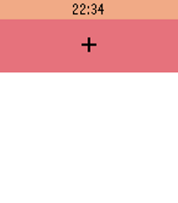
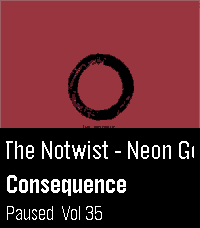
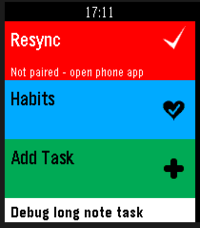

<!-- Generated by scripts/update_app_directory.py: do not edit by hand -->
# Watchapps: S

[← About this list](../watchapps.md) · [A](a.md) · [B](b.md) · [C](c.md) · [D](d.md) · [E](e.md) · [F](f.md) · [G](g.md) · [H](h.md) · [I](i.md) · [J](j.md) · [K](k.md) · [L](l.md) · [M](m.md) · [N](n.md) · [O](o.md) · [P](p.md) · [Q](q.md) · [R](r.md) · **S** · [T](t.md) · [U](u.md) · [V](v.md) · [W](w.md) · [X](x.md) · [Y](y.md) · [Z](z.md) · [0–9 & other](other.md)

*153 watchapps · Last updated 2026-10-06*

| Screenshot | Name | Developer | Licence | Updated | Description |
|------------|------|-----------|---------|---------|-------------|
| { loading=lazy width="72" } | [s0lrider](https://apps.repebble.com/5771a0126c210445010002e3) | [eslimasec](https://github.com/eslimasec/S0lRider/tree/master/pebble/CloudPebble_Sources) | <small>Not checked yet</small> | 2016-06-27 | This app allows you to control s0lrider (solar Knight Rider) robot via voice commands. The robot can be charged by sun and even has the cool red scanner… |
| { loading=lazy width="72" } | [S5-S0-S6](https://apps.repebble.com/583b006e00355aeba4000124) | [The Resetter](https://github.com/GreenHex/Pebble.S5-S0-S6) | MIT | 2016-11-28 | Analog chronometer for the Pebble, with smooth animated seconds movement. |
| { loading=lazy width="72" } | [Sae Weather Graph](https://apps.repebble.com/40ec229ff6dc4188841a514f) | [Tuukka Ruhanen](https://github.com/truhanen/pebble-sae-weather-graph) | <small>Not checked yet</small> | 2026-09-02 | Highly informative weather forecast graph for Pebble Time 2. The only weather app you'll ever need! Sää \[ˈs̠æː\] is Finnish for weather. Sae is Finnish for… |
| { loading=lazy width="72" } | [Sal](https://apps.rebble.io/en_US/application/56d2bac4d4f5886fb100000a) <small>Rebble App Store</small> | [jjv360](https://github.com/jjv360/Sal-Pebble) | <small>Not checked yet</small> | 2017-06-04 | Sal is a personal AI assistant for your Pebble. Features: - Speak to Sal via the Pebble's built-in microphone - Downloadable plugins stored on the phone for… |
| { loading=lazy width="72" } | [Salat](https://apps.repebble.com/40c8c70ad768489f908b499e) | [vhoen](https://github.com/vhoen/pebble-salat) | <small>Not checked yet</small> | 2026-09-22 | Displays Salat time for a given latitude. Using lat/lng instead of location in order to avoid using an api key from a geocoding provider. |
| { loading=lazy width="72" } | [Sand Sim](https://apps.repebble.com/531be14dc8dc40c7a869464d) | [Michael Rex](https://github.com/quantumwaffles/pebble-sand-sim) | <small>Not checked yet</small> | 2026-06-06 | A fun little sand simulation for your wrist. Hope you enjoy! 😊 Requires Touch Support Interactions - Up → Quick select tools - Down → Quick select materials… |
| { loading=lazy width="72" } | [Sanntid](https://apps.repebble.com/5738327fb934e67f9d000007) | [Asmund Berge](https://github.com/powermosfet/pebble-sanntid) | <small>Not checked yet</small> | 2016-05-18 | Show realtime schedule info for busses in Rogaland, Norway (Kolumbus) |
| { loading=lazy width="72" } | [Saposub](https://apps.repebble.com/5454937be77c146539000051) | [planset](https://github.com/planset/pebble_sapporo_subway) | <small>Not checked yet</small> | 2014-11-01 | 札幌の地下鉄の時刻を表示します。 一番近くの駅の次の出発時刻を表示します。 今のところ東豊線のみです。 This watchapp shows the subway of time of Sapporo. It displays the next departure time of the nearest… |
| { loading=lazy width="72" } | [Satellite Overpass](https://apps.repebble.com/6e920a2fa6304e45b4644116) | [Daniel Bally](https://github.com/globe-and-atlas/overpass-watch) | <small>Not checked yet</small> | 2026-10-02 | Plan Landsat 8/9 and Sentinel-2A/B/C passes over your location on Pebble Time 2. See a countdown, hourly cloud forecast, and modeled cross-track coverage. A… |
| { loading=lazy width="72" } | [SAVAGE For Basalt -Preview- v2.6](https://apps.repebble.com/56b16e2a10121e5d36000001) | [Russian Otter](https://www.instagram.com/russian_otter/) | <small>Not checked yet</small> | 2016-02-03 | This is a preview for the program I made call Savage2v4.2.6. This client simplifys tasks and has features that allow it to be very effective with computers… |
| { loading=lazy width="72" } | [Say Something Smart](https://apps.repebble.com/56430fa03d7eefdc8800002d) | [iMears](https://github.com/iMears/say_something_smart_pebble) | <small>Not checked yet</small> | 2015-11-11 | Generate phrases that make you sound like a super hacker! |
| { loading=lazy width="72" } | [Scalemates](https://apps.repebble.com/938ab8920dc84e6ca776a751) | [Moaske](https://github.com/Moaske/PebbleScalemates) | <small>Not checked yet</small> | 2026-09-06 | Scalemates profile viewer for having your Stash and Wishlist lists at hand when out and about ✈️on scalemodelling events 🛩️ or fairs. #ModelAircraft… |
| { loading=lazy width="72" } | [Scalerometer](https://apps.repebble.com/556301c032fe79034000004b) | [techfeasible](https://github.com/technicallyfeasible/PebbleScale) | <small>Not checked yet</small> | 2016-06-27 | Scalerometer is a novel app which lets you weigh things using only the accelerometer in Pebble. A scale on your wrist! How it works: The app works by… |
| { loading=lazy width="72" } | [SCBA Fire Scene Team Tracker](https://apps.repebble.com/5485783fc1f41bcadd00001d) | [Bernhard](https://github.com/dresber/scba_tracker) | <small>Not checked yet</small> | 2015-06-15 | This app assists you to monitor up to three SCBA teams on a fire scene. Supports 9l, 6l, 6.8l, 2x6.8l, 2x4l and 2x6l SCBA bottles. You can choose the… |
| { loading=lazy width="72" } | [ScoreCards](https://apps.repebble.com/56c8e1571261184eef000048) | [lehenry](https://github.com/lehenry/ScoreCards) | <small>Not checked yet</small> | 2016-06-27 | ScoreCards is a simple score tracking application for your dice/cards or boardgames - Set and order players in settings - Activate/Deactivate players … |
| { loading=lazy width="72" } | [Scorekeeper](https://apps.repebble.com/56dcd972042803d6fd00003d) | [Josh](https://github.com/nonproftechie/scorekeeper) | <small>Not checked yet</small> | 2016-03-21 | A simple scorekeeper for 2 teams. Pressing the top and bottom buttons changes the score for the upper and lower scores, respectively. Pressing the middle… |
| { loading=lazy width="72" } | [Scripple](https://apps.repebble.com/5830b6418c7fff66e1000061) | [Warren Fernandes](https://github.com/wfernandes/scripple) | <small>Not checked yet</small> | 2016-11-21 | A pebble app the scribes spontaneous thoughts, ideas and yes, also to-do items. It uses the dictation service and can store up to ten items. |
| { loading=lazy width="72" } | [Scripple](https://apps.rebble.io/en_US/application/589a1ea36d34e3adde000281) <small>Rebble App Store</small> | [Warren Fernandes](https://github.com/wfernandes/scripple) | <small>Not checked yet</small> | 2017-02-07 | A pebble app the scribes spontaneous thoughts, ideas and yes, also to-do items. It uses the dictation service and can store up to ten items. |
| { loading=lazy width="72" } | [Scryble - A Magic: The Gathering card viewer](https://apps.rebble.io/en_US/application/6a14b141c130af00096bf774) <small>Rebble App Store</small> | [4T2](https://github.com/ofietze/scryble) | <small>Not checked yet</small> | 2026-05-25 | A Magic: The Gathering card viewer for Pebble. You don't need this. Your phone can look up cards just fine. But when a buddy mentions a card you've never… |
| { loading=lazy width="72" } | [Scubawatch](https://apps.repebble.com/557cde795f5eb8acdb0000b1) | [Diego Molla](https://github.com/dmollaaliod/scubawatch) | <small>Not checked yet</small> | 2016-05-15 | A companion to scuba divers. This app can help you time your dives, and record your air consumption and compass heading. Simply press the up and down… |
| { loading=lazy width="72" } | [Searching Emery](https://apps.repebble.com/63823894c6c24a000a815f17) | [Helco](https://github.com/Helco/PebbleOfDoom/tree/searching-emery) | MIT | 2022-11-26 | A small 3D game about almost-alive watches. Made (almost) during Rebble Hackathon-001 |
| { loading=lazy width="72" } | [Send Discord Message](https://apps.rebble.io/en_US/application/605cb7441342ae00bc1202ed) <small>Rebble App Store</small> | [Trevir](https://github.com/Cellomonster/discord-pebble) | MIT | 2021-03-25 | Send messages to Discord users in your DMs list. Useful for quickly replying to notifications. Works similarly to the built-in Send Text app. Conversations… |
| { loading=lazy width="72" } | [Send Message](https://apps.repebble.com/56014a2508e93f4b6d000063) | [Peter Summers](http://web.aanet.com.au/~summersfamily/send_message_(5.5).zip) | <small>See source</small> | 2017-02-10 | GPS-aware HTTP client supporting GET and POST requests and server response verification or display. Allows configuration with three sets of label, URL, JSON… |
| { loading=lazy width="72" } | [Served! Ulm (Busses in Ulm)](https://apps.rebble.io/en_US/application/5939f07fb67f9fb68e000c48) <small>Rebble App Store</small> | [Timo Zuccarello](https://github.com/DeltaTimo/DINGConnections) | <small>No licence</small> | 2017-09-21 | Now supports - German. Never miss your bus home from a party again! Served! Ulm shows you departure times of busses and trams near you queried directly from… |
| { loading=lazy width="72" } | [Services for Pebble](https://apps.rebble.io/en_US/application/6377f2c7fdf3e30009f63951) <small>Rebble App Store</small> | [gibbiemonster](https://github.com/blockarchitech/pebble) | <small>Not checked yet</small> | 2024-04-09 | Manage your Planning Center Services - on your wrist! |
| { loading=lazy width="72" } | [Session Timer](https://apps.repebble.com/578265d46c21044cf5000653) | [Oldschool.de](https://github.com/robinson2/PebbleSessionTimer) | <small>Not checked yet</small> | 2016-08-31 | Track your surfing or swimming sessions and other activities while your smartphone is out of reach. The app lists and saves up to 50 timestamps with… |
| { loading=lazy width="72" } | [Sevilla Bus](https://apps.repebble.com/53131440bb31cfb4250001ac) | [Juan Ramón Rodríguez](https://github.com/juanrarodriguez18/Sevilla-Bus) | <small>Not checked yet</small> | 2017-09-25 | Get realtime service information for Seville buses. |
| { loading=lazy width="72" } | [SG Bus](https://apps.repebble.com/7f8d2c5153c8436abdada1eb) | [Zhang Qichuan](https://github.com/qichuan/pebble-sg-bus) | <small>Not checked yet</small> | 2026-07-26 | Singapore bus arrival times on your wrist. Find bus stops near you using your phone's location, or open a favourite stop to see live arrival times. Tap a… |
| { loading=lazy width="72" } | [SG Toto & 4D](https://apps.repebble.com/427683454738466d9aff642a) | [Zhang Qichuan](https://github.com/qichuan/pebble-sg-toto-4d) | <small>Not checked yet</small> | 2026-07-05 | Huat ah! 🎉 Feeling lucky? SG Toto & 4D puts the latest Singapore Pools results right on your wrist. Results are updated shortly after every draw — TOTO on… |
| { loading=lazy width="72" } | [SGDtoINR ExchRate](https://apps.repebble.com/55139d546f2fceea99000085) | [Thota Vinay](http://www.techworldviews.com/pebblewatchapp/) | <small>See source</small> | 2015-03-31 | "SGDtoINR ExchRate” App allows you to get exchange rate by launching it.Currently the App supports SGD(Singapore Dollar) to INR(Indian Rupees) from Banks in… |
| { loading=lazy width="72" } | [Shake It!](https://apps.repebble.com/55079bdbce75c114d30000c7) | [Tyler Riedal](https://github.com/triedal/Shake-It) | <small>Not checked yet</small> | 2015-03-17 | Bop It clone for Pebble! Get ready to react fast! Mimic the displayed commands by using the side buttons and shaking your watch. |
| { loading=lazy width="72" } | [Shake2Roll](https://apps.repebble.com/5678b7d3bdb5f06f4b00007d) | [Frosted Torus](https://www.github.com/Frosted-Torus/Shake2Roll) | <small>Not checked yet</small> | 2016-07-25 | Are you frustrated with game dice? Shake2Roll is for you! Whether you're playing Yahtzee or Dungeons & Dragons or exploring probability in a math class, you… |
| { loading=lazy width="72" } | [Shifumi](https://apps.repebble.com/5430e9adec1644f8b70000de) | [Nicoplv](https://github.com/nicoplv/shifumi-pebble) | <small>Not checked yet</small> | 2014-10-05 | Simple shifumi game for pebble Use Up, Select and Down buttons to select your choice, and shake your wrist to show the selection to your opponent. |
| { loading=lazy width="72" } | [Shot & Recoil Counter](https://apps.repebble.com/d9ae0d91c6b94bd2add22405) | [DRC](https://github.com/dcanelhas/ShotCounter) | <small>Not checked yet</small> | 2026-09-01 | This app uses the accelerometer to measure recoil (as spikes in acceleration) in order to count the number of shots taken in sports shooting. Settings: … |
| { loading=lazy width="72" } | [Shows](https://apps.repebble.com/54efac282e6a4711130000dc) | [Alessio Bogon](https://github.com/youtux/PebbleShows) | <small>Not checked yet</small> | 2016-02-14 | Keep track of your TV shows on your Pebble! With this watchapp you can view what episodes you have to watch and what's coming out in the next days. On your… |
| { loading=lazy width="72" } | [Shut the box](https://apps.repebble.com/52b40d99b06f4b836900001d) | [Daniel Head](https://github.com/danhead/ShutTheBox/) | <small>Not checked yet</small> | 2014-02-10 | Centuries old table top dice game, reimagined for your Pebble Watch! |
| { loading=lazy width="72" } | [Shutter](https://apps.repebble.com/57c43fca5e3c3db6280003a9) | [Konrad Iturbe](http://github.com/konradit/shutter) | <small>No licence</small> | 2016-08-29 | FOR ROOTED DEVICES ONLY. This app allows you to take a photo on your Android phone It emulates touchscreen press on the app's shutter button and takes a… |
| { loading=lazy width="72" } | [SickPebble](https://apps.repebble.com/5355e775c822ffafd0000096) | [mongo527](https://github.com/mongo527/SickPebble) | <small>Not checked yet</small> | 2014-05-10 | Control SickBeard from your Pebble! Features: - Configurable to your liking - View Shows in SickBeard (With Status) - View Upcoming/Future Shows (With Time… |
| { loading=lazy width="72" } | [Signal Station](https://apps.repebble.com/37360ca4d9764881bd1d6f4d) | [Ambient Time](https://dr.eamer.dev/downloads/apps/signal-station/#source) | <small>See source</small> | 2026-10-05 | EXPERMENTAL This is a signal / presence awareness system with a Pebble face serving as interface and capture tool. It also offers chat from your wrist with… |
| { loading=lazy width="72" } | [Silent Sit](https://apps.repebble.com/9170d8ea82e842e6b0abdbe3) | [Stefano Verna](https://github.com/stefanoverna/silent-sit-pebble) | <small>Not checked yet</small> | 2026-06-27 | Silent Sit — Silent, tactile meditation timer Silent Sit paces your sitting with vibrations alone. No bells, no sound, no screen to look at: you feel the… |
| { loading=lazy width="72" } | [SimonRemote](https://apps.repebble.com/54166746ba06e4e0db000073) | [Tyler Hoffman](https://github.com/simonremote) | <small>Not checked yet</small> | 2015-01-03 | SimonRemote allows a Pebble to control iTunes, Spotify, PowerPoint, and Keynote, and the keyboard on a user's Mac computer. It even allows multiple Pebbles… |
| { loading=lazy width="72" } | [SimonTime](https://apps.repebble.com/75a3c14b89724bd8b9c42be6) | [sheppoor](https://github.com/sheppoor/SimonTime) | <small>Not checked yet</small> | 2026-07-25 | Classic pattern memory game with touch and sound. High score. Up button to see/change speaker on/off state. Select button or center tap to start a new game… |
| { loading=lazy width="72" } | [Simple Analogue Watch, Stop Watch, Countdown Yacht Timer](https://apps.repebble.com/52e5449b97213707e00005b8) | [MikeM](https://github.com/MikeMoore63/swanalog) | <small>Not checked yet</small> | 2015-05-05 | A simple analog Watch, Countdown, Stop Watch, Yacht Timer with countdown adjustment. Vibrates at key times i.e. in Yacht Timer mode 4 minutes 1 minutes, 30… |
| { loading=lazy width="72" } | [Simple coffee ratio calculator](https://apps.repebble.com/69c9ca0340411f0009fd69a9) | [valerialaura](https://github.com/valerialaura/pebble-coffee-ratio) | <small>Not checked yet</small> | 2026-09-23 | A coffee-to-water ratio calculator for your wrist. Set your brewing ratio once, then dial in coffee or water to get the matching amount instantly. Perfect… |
| { loading=lazy width="72" } | [Simple Lyrics Viewer](https://apps.rebble.io/en_US/application/59dceb380dfc32af61003d5a) <small>Rebble App Store</small> | [Steven Go](https://github.com/greenlover1991/pebble-lyrics-viewer) | <small>Not checked yet</small> | 2017-10-11 | Simple scollable Lyrics Viewer - ANDROID only - REQUIRES Automate Flow companion to properly work. Link at the external website link. - REQUIRES Spotify's… |
| { loading=lazy width="72" } | [Simple Pomodoro](https://apps.repebble.com/5772e69e6c21047b2c00040d) | [Shawn Xiang](https://github.com/shawnzxiang/pebble-pomodoro) | <small>Not checked yet</small> | 2016-09-25 | This pomodoro app in pebble can: Customize time (work, rest, long rest and long rest frequency) and UI Screen Color Ability to take a long break after… |
| { loading=lazy width="72" } | [Simple Stopwatch](https://apps.repebble.com/52e8cb0fa85c6301af000005) | [Brandon Milton](https://github.com/brandonio21/SimpleStopwatch) | <small>Not checked yet</small> | 2014-03-14 | A simple stopwatch app with a large, clear display and functionality to pause, reset, and lap. Also continues timing when app is closed! -The top button… |
| { loading=lazy width="72" } | [Simple Tennis Scorer](https://apps.repebble.com/5584198e5160209a4600009c) | [Scott D](https://github.com/scottyblizz/TennisScorer) | <small>Not checked yet</small> | 2015-06-19 | Tennis scoring app. Useful for forgetful veterans or beginners unsure on the rules. Press UP or DOWN every time someone scores a point. Press SELECT to… |
| { loading=lazy width="72" } | [SimpleCount](https://apps.repebble.com/55fa4a4f18a3ff5eb100004b) | [CGTheLegend](https://github.com/CGTheLegend/Pebble_Counter.git) | <small>No licence</small> | 2015-09-18 | This is a simple application that keeps tracks and displays a count. The count can be increased or decreased as well as cleared. Negative numbers are supported. |
| { loading=lazy width="72" } | [SimpleCounter](https://apps.repebble.com/57b309a2f01b53ce0c000591) | [masmddr](https://github.com/sheydenis/SimpleCounter) | <small>Not checked yet</small> | 2016-09-28 | A simple counter app. Saves count on exit, no vibrations, no fancy colors. Comma separated digits by groups of 3. (Free Pro feature) Up / down buttons for… |
| { loading=lazy width="72" } | [SiteStatus](https://apps.repebble.com/5596039d49b3c859510000cd) | [Moonbeam](https://github.com/tbloncar/pebble-sitestatus) | <small>Not checked yet</small> | 2015-09-16 | Monitor the status of your websites from your Pebble device. SiteStatus displays a configurable list of sites, each with a green (up) / red (down) status… |
| { loading=lazy width="72" } | [Six Nations Rugby 2016](https://apps.repebble.com/5609b2db60c427e11b000080) | [comicmuse](https://github.com/comicmuse/SixNations) | <small>Not checked yet</small> | 2017-02-07 | Here we are, back in time for the Six Nations. See the scores and match details for every Six Nations match. This is the RWC app with a new feed, but will… |
| { loading=lazy width="72" } | [Skipstone](https://apps.repebble.com/52f1095ba0cb6abe6d002f05) | [Neal Patel](https://github.com/Skipstone/Skipstone) | <small>Not checked yet</small> | 2015-02-09 | A fully featured universal media player remote watch app that allows you to control Plex, VLC, XBMC and WDTV. Skipstone is an open-source project by… |
| { loading=lazy width="72" } | [skunk](https://apps.repebble.com/553aaf29bf1a5965020000c8) | [Harley Watson](https://github.com/unlobito/skunk) | <small>Not checked yet</small> | 2026-04-29 | Skunk allows easy access to up to eight store cards and other barcodes. Linear Barcodes: Codabar, Code 39, Code 128, EAN-8, EAN-13, Interleaved 2 of 5… |
| { loading=lazy width="72" } | [Slab](https://apps.repebble.com/5561a6d9fd8f4b8de400004b) | [finebyte](https://github.com/finebyte/slabforpebble) | <small>Not checked yet</small> | 2016-05-05 | Slab by finebyte & Matthew Tole Read Slack channels, private groups and direct messages. Reply with dictation, short messages and Emoji. Feel awesomely… |
| { loading=lazy width="72" } | [Slapp](https://apps.repebble.com/552179d9d7356c3f40000048) | [IbrahimAnsari](https://github.com/ibrahimansari/Slapp-Pebble-Client) | <small>Not checked yet</small> | 2015-04-05 | A revolutionary way to meet new people and immediately connect with them. We can exchange your contact and other social networking information with a… |
| { loading=lazy width="72" } | [Slate](https://apps.repebble.com/5620a39525ef793651000045) | [Wristy Business](https://github.com/hipsterbrown/slate) | <small>Not checked yet</small> | 2019-07-24 | Apple has Siri. Microsoft has Cortana. Now Pebble has Slate. Instantly add reminders to your Pebble Timeline simply by telling Slate what you need. Say… |
| { loading=lazy width="72" } | [SLC Omnivox Cancelled Classes](https://apps.repebble.com/56b40e11ed001b5bc6000051) | [Malp](https://github.com/Malpp/SLC) | <small>Not checked yet</small> | 2016-02-09 | This app looks up which classes have been canceled on Omnivox. This is made for the St.Laurence College Omnivox. |
| { loading=lazy width="72" } | [Slebble](https://apps.repebble.com/5320c36f53fab421d000003a) | [Peter Lundberg](https://github.com/xdjinnx/Slebble) | <small>Not checked yet</small> | 2016-09-03 | Public transportation watchapp for sweden. Save your favorite stations and check the arrival time of them. Supports: Stockholms Lokaltrafik (SL)… |
| { loading=lazy width="72" } | [Sleepy-Watch](https://apps.repebble.com/57ccd97df69d1d6360000223) | [Stanivision Inc.](https://github.com/TerttyCurlyfries/Sleepy-Watch) | <small>Not checked yet</small> | 2016-12-21 | There is a world as tangible as our own, impossible to see yet unavoidable to sense, a world enveloped by an unending ocean of forests. Buried deep in that… |
| { loading=lazy width="72" } | [Slice It!](https://apps.repebble.com/11c43afc299e4d1d88aea8f4) | [Karl](https://github.com/KarlKl/Pebble-SliceIt) | <small>No licence</small> | 2026-05-18 | Slice It! is a fast-paced fruit-slicing game for Pebble Time 2. Swipe across the screen to slice flying fruits and rack up your score. But watch out - black… |
| { loading=lazy width="72" } | [Slides](https://apps.repebble.com/52ee43b994cc96bd0b00000c) | [Luis Iván Cuende](https://github.com/luisivan/pebble-slides) | <small>Not checked yet</small> | 2014-02-02 | Pebble app to toggle slides on Linux, Mac and Windows, includes chronometer and notes to make giving talks easier. The app displays a chronometer and you… |
| { loading=lazy width="72" } | [Slope Buddy](https://apps.repebble.com/601b22a11342ae01cc2e3fb1) | [Konrad Iturbe](https://github.com/konradit/slopebuddy) | <small>Not checked yet</small> | 2021-02-03 | Slope Buddy tells you what you need to know before heading out to ski. See the weather 1-7 days ahead, see how much fresh snow there'll be at the top of the… |
| { loading=lazy width="72" } | [Smart Metronome](https://apps.repebble.com/56c16f9b2ff87c44b4000043) | [Scott Harrison](https://github.com/scottrules44/pebbleMetro) | <small>Not checked yet</small> | 2016-02-15 | This metronome is very easy to use. It can handle almost anytime time scale at the speed you want. |
| { loading=lazy width="72" } | [Smart things Remote](https://apps.rebble.io/en_US/application/58795dba5de85036d5000178) <small>Rebble App Store</small> | [Isaiah Kasten](https://cloudpebble.net/ide/project/388885) | <small>See source</small> | 2017-01-13 | Remote |
| { loading=lazy width="72" } | [SmartDAYS](https://apps.repebble.com/54f44fee89900eba28000041) | [smartDAYS](https://github.com/itzkha/pebble_code/) | <small>Not checked yet</small> | 2015-03-10 | Research application aiming to automatically detect and log daily activities from motion sensors onboard the Pebble watch. Note: This application is simply… |
| { loading=lazy width="72" } | [SmartStatus](https://apps.rebble.io/en_US/application/528fc3f5a92e1fb5ac000019) <small>Rebble App Store</small> | [robhh](http://github.com/robhh/SmartStatus-AppStore) | <small>No licence</small> | 2015-06-03 | Display the current weather alongside the iPhone's and Pebble's battery level, the current/next calendar appointment, and the currently playing song from… |
| { loading=lazy width="72" } | [SmartStatus-op](https://apps.repebble.com/52cded255c88b9059700000e) | [Olivier Pasco](https://github.com/opasco/SmartStatus-op) | <small>Not checked yet</small> | 2014-06-27 | This is a modified version of the SmartStatus watch app by Robert Hesse. It only works in conjunction with the Smartwatch+ iOS app available on the Apple… |
| { loading=lazy width="72" } | [SmartTraining](https://apps.repebble.com/52ee5a0c94cc969637000016) | [awwa](https://github.com/awwa/pebble-smarttraining/tree/sdk2.0) | <small>Not checked yet</small> | 2014-02-03 | SmartTraining is cloud based GPS tracking tool for Android. The data work with Google Fusion Tables in both directions. You can post your training record to… |
| { loading=lazy width="72" } | [Smartwatch Pro](https://apps.rebble.io/en_US/application/52ac94f731a5fa35c500001d) <small>Rebble App Store</small> | [Max Bäumle](https://github.com/maxbaeumle/smartwatchface) | <small>Not checked yet</small> | 2016-09-23 | Provides useful additional functionality with your Pebble watch including displaying upcoming calendar events, your Twitter timeline, step count and more… |
| { loading=lazy width="72" } | [Smartwatch+](https://apps.rebble.io/en_US/application/52f0573d1ac7949119001518) <small>Rebble App Store</small> | [robhh](http://github.com/robhh/SmartStatus-AppStore) | <small>No licence</small> | 2015-06-07 | Smartwatch+ allows you to display additional information on your watch, such as weather, your iPhone's battery status, current stock and Bitcoin prices… |
| { loading=lazy width="72" } | [Smooth Counter](https://apps.repebble.com/69840d77623fe200090616d3) | [Flynn Duniho](https://github.com/FlynnD273/smooth-counter) | <small>No licence</small> | 2026-03-03 | A simple counter app with nice animations that lets you highlight every N numbers. |
| { loading=lazy width="72" } | [SmoothieControl](https://apps.repebble.com/553dbc0dbdf9b3ae8c000025) | [quillford](https://github.com/quillford/SmoothieControl-Pebble) | <small>Not checked yet</small> | 2015-04-27 | Control your Smoothieware powered device with your watch! You can do things such as homing axes, jogging, and fan control. |
| { loading=lazy width="72" } | [SMX Buddy](https://apps.repebble.com/136139ee8be14ed0aab4e67c) | [dj505](https://5panel.dance) | <small>See source</small> | 2026-05-15 | All the StepManiaX stats you wanna see, right on your wrist! SMX Buddy pulls useful data, like your 3-digit QuickPIN, profile QR code, step statistics, and… |
| { loading=lazy width="72" } | [Snakey](https://apps.repebble.com/53047f5c534d8a0a380001a6) | [phun](https://github.com/phmagic/snakey) | <small>Not checked yet</small> | 2014-03-13 | Play the classic game of snake with a twist on your Pebble! *Updated* The faster you eat the apple, the more points you get. Play it in the rain, on a… |
| { loading=lazy width="72" } | [SnapCounter](https://apps.repebble.com/e49994e7bb154924a6eebb66) | [sylvain.migaud](https://github.com/Gnu-Bricoleur/PebbleSnapCounter) | <small>No licence</small> | 2026-04-11 | An app to count things and calculate percentages using the Pebble buttons or finger motion (snapping/tapping) |
| { loading=lazy width="72" } | [SnowSki](https://apps.repebble.com/556bf9c4389795518100008d) | [Matthew Hungerford](https://github.com/mhungerford) | <small>Not checked yet</small> | 2015-06-11 | Pixel Penguin skis downhill avoiding trees, rocks, snowmen and other miscellaneous obstacles. Tilt the pebble to steer down the hill. You get 3 lives, and… |
| { loading=lazy width="72" } | [Snowy](https://apps.rebble.io/en_US/application/561960c8a1dd2652af00000d) <small>Rebble App Store</small> | [Mathew Reiss](https://github.com/pebble-dev/snowy) | <small>Not checked yet</small> | 2019-07-24 | Snowy is the most popular personal assistant for Pebble Time. Set reminders, translate sentences, control your home through IFTTT - you name it, and chances… |
| { loading=lazy width="72" } | [SoberUp](https://apps.repebble.com/530db564ae03dcd9cf00024d) | [Kevin Conley](https://github.com/kevincon/SoberUp) | <small>Not checked yet</small> | 2024-01-21 | Count your drinks, estimate your BAC, and learn about the effects of alcohol on your body. |
| { loading=lazy width="72" } | [Soccer Timer](https://apps.repebble.com/c0f875a52eb944f985579524) | [Brian Barrow](https://github.com/briancbarrow/ref-timer) | <small>Not checked yet</small> | 2026-08-29 | Soccer match timer with vibration alerts at 2 minutes, 30 seconds, and full time. Keeps counting past zero so you can track stoppage time." |
| { loading=lazy width="72" } | [Softball/Baseball Umpire Clicker](https://apps.repebble.com/550b1131ad7be0af4900003e) | [Steve Karmeinsky](https://github.com/stevekennedyuk/SoftballUmpClicker) | <small>Not checked yet</small> | 2016-03-02 | A simple ump clicker for softball UP increments balls SELECT increments outs DOWN increments strikes If BACK is (single) pressed it will take you back to… |
| { loading=lazy width="72" } | [SolarEdge Status](https://apps.repebble.com/5581703b7e7934d33a00000d) | [Martijn02](https://github.com/Martijn02/pebble-solaredge-status/) | <small>Not checked yet</small> | 2015-06-24 | Keep track of your solar energy production from your Pebble. Contains a view with detailed information, and a graph displaying your generated power per 15… |
| { loading=lazy width="72" } | [SolarInfo](https://apps.repebble.com/557c39d85f5eb87f5800001f) | [rS](https://github.com/ace7196/ConfigSolarMonitor) | <small>Not checked yet</small> | 2015-06-21 | This is a Watchapp that grabs info from the SolarEdge Technologies Inc. © API for your site and will relay information such as current power generation, as… |
| { loading=lazy width="72" } | [Solfarer Atlas](https://apps.repebble.com/a4d14d8c1e7140e79a4f588d) | [Zach Burnham](https://github.com/thejambi/Solfarer-Atlas-Pebble) | <small>Not checked yet</small> | 2026-08-11 | Travel where you like. Solfarer Atlas is the Local Bubble as a place you can walk around: 2,236 real star systems within 100 light-years of Sol - Proxima… |
| { loading=lazy width="72" } | [Solitaire](https://apps.repebble.com/53db2daae4fa76655c000077) | [calamari Software](http://code.google.com/p/pebble-solitaire/source/browse/) | <small>See source</small> | 2014-08-01 | Klondike Solitaire for Pebble. Includes Vegas scoring, one and three card draw modes, and selectable flip limit. Controls allow you to automatically skip… |
| { loading=lazy width="72" } | [SomaFM – Now Playing](https://apps.repebble.com/55a7f76374e429d266000040) | [scott kosman](https://github.com/humantorch/pebble-somafm) | <small>Not checked yet</small> | 2015-07-16 | Listen to SomaFM (http://somafm.com) streaming radio on the go? Now you can easily get the artist and title of the currently-playing track on any SomaFM… |
| { loading=lazy width="72" } | [Soundboard](https://apps.repebble.com/05a900301a1642d4a086e782) | [Matt](https://github.com/mattnovelli/soundboard) | <small>Not checked yet</small> | 2026-07-24 | Pick sounds from your phone. Play them through your Pebble's speakers. All-on device. It's that simple, folks. |
| { loading=lazy width="72" } | [Space Clicker](https://apps.repebble.com/55e5ff7bd99ac93dd9000054) | [Grylis](https://github.com/Grylis/PebbleSpaceClicker) | <small>No licence</small> | 2015-09-01 | This is an incremental game where you use your spaceship to earn science and improve NASA facilities. |
| { loading=lazy width="72" } | [Space Dragon](https://apps.repebble.com/544e55029d8757daae000060) | [Alexey Cluster](https://github.com/ClusterM/space-dragon/) | <small>No licence</small> | 2015-10-17 | Simple game. Tilt your watch to control the spaceship and avoid asteroids. Beat you own record! Be number one in online ratings! Press select button for a… |
| { loading=lazy width="72" } | [SpaceMerc](https://apps.repebble.com/52d6a8c0333d76e3d000000a) | [David C. Drake](https://github.com/theDrake/spacemerc) | <small>Not checked yet</small> | 2016-01-14 | A 3D first-person shooter (FPS game)! Defend humanity against hostile aliens, earn money, and buy upgrades as you progress through this intense sci-fi… |
| { loading=lazy width="72" } | [Splatime Monitor](https://apps.repebble.com/560aea092e1a4ac097000003) | [greater_nemo](https://github.com/greaternemo/splatime-monitor) | <small>Not checked yet</small> | 2016-02-08 | UPDATED 07 FEB 16 Splatime Monitor is a daily utility app that reports the current and upcoming maps in rotation for the Wii U game 'Splatoon'. Using… |
| { loading=lazy width="72" } | [Spoon](https://apps.repebble.com/52b2088505c0467ea900004f) | [Thomas Hunsaker](https://github.com/thunsaker/spoon) | <small>Not checked yet</small> | 2019-07-24 | Spoon is a simple Foursquare/Swarm check-in app for Pebble. The watchapp lists nearby venues using your phone's GPS location. Pick a venue and check-in. All… |
| { loading=lazy width="72" } | [Sports](https://apps.repebble.com/637af4ebc6c24a000a815ecb) | [Andy Burris](https://github.com/andyburris/pebble-sports) | <small>Not checked yet</small> | 2025-09-02 | A native sports app for Pebble-- get your favorite NFL, MLB, NHL, and NBA scores live on your wrist |
| { loading=lazy width="72" } | [Sports Simplified](https://apps.repebble.com/6952154891ea9d0009991da2) | [KamiShinn](https://github.com/saintyoga-Cyber/Sports-simplified/tree/main) | <small>Not checked yet</small> | 2026-06-12 | A simple Pebble watchapp that pushes NHL game timeline pins for the Vancouver Canucks and Montreal Canadiens. |
| { loading=lazy width="72" } | [Sports Timer](https://apps.repebble.com/6117fb58afc14c73a427c1af) | [Jeroen Faijdherbe](https://github.com/faijdherbe/sports-timer) | <small>Not checked yet</small> | 2026-09-26 | Sports Timer is a match timer for field hockey on your wrist. It counts down each quarter and keeps the score of the home team and the away team. At 0:00… |
| { loading=lazy width="72" } | [SportsOfficial](https://apps.repebble.com/5596fdf684bff56157000094) | [Ian Donnelly](https://github.com/iandonnelly/SportsOfficial) | <small>Not checked yet</small> | 2015-11-08 | SportsOfficial is a scorekeeping app which allows users to keep track of score and time for nearly any sport! The app includes stopwatch functionality to… |
| { loading=lazy width="72" } | [sportsomatic](https://apps.rebble.io/en_US/application/6951db4a91ea9d0009991d94) <small>Rebble App Store</small> | [andrew](https://github.com/bruhdev1290/sportsomatic) | <small>Not checked yet</small> | 2026-03-27 | The app is designed to incorporate the sports features found in Timex Ironman and other triathlon watches, allowing users to track their sports data. It was… |
| { loading=lazy width="72" } | [Sprinkle Do](https://apps.repebble.com/766a729db7134e859e889565) | [Malte Makes](https://sprinkledo.com) | <small>Not checked yet</small> | 2026-10-05 | Sprinkle Do is your shopping lists and to-dos, right on your wrist. Browse your sections at a glance, check off shopping items with a single tap, and add… |
| { loading=lazy width="72" } | [Sprinkle Do Local](https://apps.repebble.com/f0119ffb67fe47d38d1097f6) | [Malte Makes](https://sprinkledo.com) | <small>Not checked yet</small> | 2026-09-27 | A free, no-account trial of Sprinkle Do that runs entirely on your watch. Three ready-made lists - Shopping, Notes, To-Do - add items by voice, tap to check… |
| { loading=lazy width="72" } | [SpritPreis](https://apps.repebble.com/56f92d675e4cdd12c9000039) | [awlx](https://github.com/awlx/Pebble-SpritPreis) | <small>Not checked yet</small> | 2016-03-28 | # Pebble-SpritPreis WatchApp um aktuelle Spritpreise auf der Uhr zusehen. Damit man immer die günstigste Tankstelle zum Tanken in der Nähe findet. (Nur… |
| { loading=lazy width="72" } | [SQL Episode 1](https://apps.repebble.com/5740f39cb8bc1b0b89000019) | [Russian Otter](https://instagram.com/russian_otter/) | <small>Not checked yet</small> | 2016-05-22 | We here at SavageO would like to present to you: SQL hacking Episode 1 This is a very basic and important understanding of SQL Injection coding that covers… |
| { loading=lazy width="72" } | [SQL Episode 2](https://apps.repebble.com/574102491b2ed80e6300002d) | [Russian Otter](https://instagram.com/russian_otter/) | <small>Not checked yet</small> | 2016-10-28 | This is an app that is full of dork codes, vpns, and other information that new hackers find useful! We at SAVAGEO hope you enjoy this app! It is episode 2… |
| { loading=lazy width="72" } | [Squash](https://apps.repebble.com/5754480670c28cee0e00000a) | [Ben Gourley](https://github.com/bengourley/pebble-squash) | <small>Not checked yet</small> | 2016-06-05 | Keep track of the score in your squash matches with simple controls and a clean, uncluttered interface. This is the squash version of my Tennis score keeper… |
| { loading=lazy width="72" } | [Squeeze Lyrion LMS](https://apps.repebble.com/b1ff884434e84d3191c8bac2) | [pagnotta](https://github.com/pagnotta/pebble-squeeze-lms) | <small>Not checked yet</small> | 2026-08-03 | A native, touch-first remote for Squeezebox, squeezelite, and Lyrion Music Server — the server formerly known as Logitech Media Server (LMS) or SlimServer —… |
| { loading=lazy width="72" } | [Squeeze Lyrion LMS](https://apps.rebble.io/en_US/application/6a70cb8e3f744900090ed34f) <small>Rebble App Store</small> | [pagnotta](https://github.com/pagnotta/pebble-squeeze-lms) | <small>Not checked yet</small> | 2026-08-03 | Leave your phone in your pocket! A native, touch-first remote for Squeezebox, squeezelite, and Lyrion Music Server — the server formerly known as Logitech… |
| { loading=lazy width="72" } | [Squire](https://apps.repebble.com/6f24d81f31bf470ba81139fc) | [Justin Sunseri](https://github.com/jmsunseri/pebble-squire) | <small>Not checked yet</small> | 2026-06-20 | Squire is that allows you to communicate with either OpenClaw or Hermes using Telegram |
| { loading=lazy width="72" } | [Stack Attack](https://apps.repebble.com/5469057015309c6c9600000e) | [Svitlana Tsymbaliuk](https://github.com/svitlanatsymbaliuk/Stack-Attack-for-Pebble) | <small>Not checked yet</small> | 2014-11-16 | Fill as many lines at the bottom as possible. Use UP and DOWN buttons to walk left/right and to push crates. To jump use SELECT. To use super jump press… |
| { loading=lazy width="72" } | [Stamina](https://apps.repebble.com/9bf1158041d44e60a531f166) | [SIDEffect's](https://github.com/n0va-SIDEffects/Pebble-Stamina) | <small>Not checked yet</small> | 2026-09-19 | Stamina is a private wellness tracker for your intimate life, solo or with a partner. It measures rhythm, heart rate and estimated calories, and shows how a… |
| { loading=lazy width="72" } | [Star Watch](https://apps.repebble.com/e69d5a2df1fa4e54a8e24cc6) | [erad84](https://github.com/erad84/star-watch) | <small>Not checked yet</small> | 2026-08-25 | A tool for finding and identifying objects in the night sky. Just hold your wrist up to the sky and discover what's up there! Features include: - Manual… |
| { loading=lazy width="72" } | [Starfield Graphics Demo](https://apps.repebble.com/5315e6c13184b483160001e5) | [Chris Lewis](https://github.com/C-D-Lewis/starfield-demo) | <small>No licence</small> | 2014-03-04 | This is a simple graphics demo showing randomly generated stars flying across the display at 30 FPS |
| { loading=lazy width="72" } | [start9](https://apps.repebble.com/5307a4b88230400fea000153) | [Goldkin Drake](https://code.google.com/p/start9/source/browse/) | <small>See source</small> | 2014-02-22 | Displays the current screen of Twitch Plays Pokemon once a minute. Currently in very early alpha testing. To view the live stream, visit… |
| { loading=lazy width="72" } | [Stateful](https://apps.rebble.io/en_US/application/6242c8b5f13e30000921d65a) <small>Rebble App Store</small> | [kennedn](https://github.com/kennedn/Stateful) | <small>Not checked yet</small> | 2022-07-12 | Automate with state! Stateful is a watch app with one goal: to make interacting with IoT devices and RESTful API's as seamless as possible. At its core… |
| { loading=lazy width="72" } | [StatusChecker](https://apps.repebble.com/5707e10561753a0689000024) | [Chase](https://github.com/DeviaVir/pebble-statuschecker) | MIT | 2016-04-08 | A pebble app designed for webops-y people that would like to check certain website statuses from their watch. |
| { loading=lazy width="72" } | [Steer](https://apps.rebble.io/en_US/application/6a4bef0e55030a000a818fc0) <small>Rebble App Store</small> | [bquelhas](https://github.com/bquelhas/pebble-steer) | <small>Not checked yet</small> | 2026-07-09 | STEER mirrors your phone's turn-by-turn navigation onto your Pebble: the next maneuver icon, distance, street name and ETA - glanceable on your wrist, so… |
| { loading=lazy width="72" } | [Stempeluhr](https://apps.rebble.io/en_US/application/535928d3bb7fb9eac40001aa) <small>Rebble App Store</small> | [meyer-solutions](https://itunes.apple.com/de/app/stempeluhr/id331889894?mt=8) | <small>Not checked yet</small> | 2014-09-03 | Zeiterfassung mit GPS Unterstützung - erkennt Ihren Kunden vor Ort automatisch wieder! Sie arbeiten für einen Kunden und sind es leid umständlich einzelne… |
| { loading=lazy width="72" } | [Step Goal](https://apps.repebble.com/56b12f2171e34780f600004d) | [Travis La Marr](https://github.com/exiva/Pebble-Step-Goals) | <small>Not checked yet</small> | 2016-09-27 | Step Goal lets you set a daily step goal, and tracks your progress throughout the day towards your goal. It will buzz your wrist when you reach the goal… |
| { loading=lazy width="72" } | [Step Goals Plus](https://apps.repebble.com/ec357a2a9d6f439e813f5429) | [Yaron Sheffer](https://github.com/yaronf/Pebble-Step-Goals-Plus) | <small>Not checked yet</small> | 2026-08-29 | Track daily steps with a live progress fill, streak counting, bonus goals, and mid-goal encouragements — built for Pebble Time, Time Round, and Pebble Time… |
| { loading=lazy width="72" } | [Steps](https://apps.repebble.com/5820a0e1e7785b894200007f) | [Dylan Bourgeois](https://github.com/dtsbourg/steps) | <small>Not checked yet</small> | 2016-11-07 | Introducing the DOGE coach, who will help you become a more active shibe ! |
| { loading=lazy width="72" } | [Steps](https://apps.repebble.com/5797ac0c5883b3374600010c) | [P1X3L](https://github.com/pebble-examples/simple-health-example.git) | <small>Not checked yet</small> | 2016-07-26 | This is a simple step counter for Time series Pebble's! Hope you enjoy! If there are any issues feel free to email me! Opensource! Heart it!!! |
| { loading=lazy width="72" } | [stib-mivb](https://apps.rebble.io/en_US/application/5864e58f2ee431bb220001b2) <small>Rebble App Store</small> | [Aurélien Ooms](https://github.com/aureooms/pebble-stib-mivb) | <small>Not checked yet</small> | 2017-01-27 | Displays Brussels's STIB-MIVB bus, tram and metro network realtime schedule for the ten closest stops. Works with phone and geolocation only. No… |
| { loading=lazy width="72" } | [Stibble](https://apps.repebble.com/ceaa036bfc5543f6b0873247) | [Sreedev Kodichath](https://git.devtechnica.com/pebbletechnica/stibble) | <small>See source</small> | 2026-08-28 | Stibble shows live STIB-MIVB departures on your Pebble Time 2. It covers the bus, tram, and metro network of Brussels. The app finds the stops nearest to… |
| { loading=lazy width="72" } | [Stochastic Fists](https://apps.repebble.com/2e82bbee93a2452d872b7aad) | [Mohammad Nadeem](https://github.com/mnadev/stochastic_fists) | <small>Not checked yet</small> | 2026-06-28 | Stochastic Fists turns your Pebble into a silent corner coach for shadowboxing. Instead of audio callouts, it uses custom vibration patterns to call out… |
| { loading=lazy width="72" } | [Stocky HD](https://apps.repebble.com/b292eadd4d16465eb0c5b133) | [Ldibuccio](https://github.com/ldibuccio/Stocky-hd) | <small>Not checked yet</small> | 2026-06-14 | Stocky HD — track your investment portfolios right from your wrist. This is the HD edition, built for the Pebble Time 2 and its larger, higher-resolution… |
| { loading=lazy width="72" } | [Stopwatch](https://apps.repebble.com/52b6e9f65dd7573050000011) | [Katharine Berry](http://github.com/Katharine/pebble-stopwatch) | <small>No licence</small> | 2013-12-22 | Stopwatch with thirty lap history. |
| { loading=lazy width="72" } | [Stopwatch](https://apps.repebble.com/55b6c2c3e68f5acdfc00008d) | [Pebble](https://github.com/coredevices/pebble-stopwatch) | <small>Not checked yet</small> | 2026-04-04 | Time anything you wish with Pebble's beautifully simple stopwatch app! It runs in the background and can hold up to twenty laps. |
| { loading=lazy width="72" } | [StopWatch](https://apps.repebble.com/52cad8d66126ce217100005f) | [Stopka](https://github.com/Stopka/StopWatch) | <small>Not checked yet</small> | 2015-03-15 | Supports - English, French, German and Spanish. A handy time measuring tool. You can create up to 10 independent timers and/or stopwatches. There are in… |
| { loading=lazy width="72" } | [Stopwatch!](https://apps.repebble.com/53f7a2aa12a9f1b6bf000263) | [Loren Lugosch](https://github.com/lorenlugosch/pebble_stopwatch) | <small>Not checked yet</small> | 2016-06-30 | It's a stopwatch- for the future! Very simple stopwatch for your Pebble with a fun animation. |
| { loading=lazy width="72" } | [Stopwatch+](https://apps.repebble.com/5822f80d34da21ff12000122) | [sunpazed](https://github.com/sunpazed/Pebble-Stopwatch-Plus) | <small>Not checked yet</small> | <small>Unknown</small> | An updated Stopwatch that tracks your running stats. Measure and track Distance and Pace - all without a companion app on your phone. |
| { loading=lazy width="72" } | [Storefront](https://apps.repebble.com/68fbf93925e7530009b78b10) | [Ilia Breitburg](https://github.com/breitburg/pebble-storefront) | <small>Not checked yet</small> | 2025-10-26 | See recently added apps at the Rebble Store. |
| { loading=lazy width="72" } | [Strava GPX](https://apps.repebble.com/fd32e47ead3d43358a153b8e) | [clet](https://github.com/cletqui/pebble-strava) | <small>Not checked yet</small> | 2026-06-15 | Strava GPX turns your Pebble Time 2 into a standalone GPX workout recorder for cycling, running, and walking. It captures GPS distance, speed/pace, and… |
| { loading=lazy width="72" } | [Strength](https://apps.repebble.com/4354ca8ffa6949d2997de703) | [Andrew Whaley](https://github.com/azw413/pebble-strength) | <small>Not checked yet</small> | 2026-07-27 | Program strength workouts on the web and run them from your Pebble - guided sets, timed holds, and rest countdowns, fully usable mid-set. Your sets sync… |
| { loading=lazy width="72" } | [Stroke Keeper](https://apps.repebble.com/536f821e5c6fab9d0c00015f) | [Ryan Anderson](https://www.github.com/anderson-michael-ryan/PebbleStrokeKeeper/tree/master/src) | <small>Not checked yet</small> | 2016-08-19 | Stroke Keeper is the perfect watch app that you need to keep track of your golf score whenever your out on the course. I am proud to say that after a couple… |
| { loading=lazy width="72" } | [Studio Watch, StopWatch, Countdown, Yacht Timer](https://apps.repebble.com/52e541bd56101313b2000650) | [MikeM](https://github.com/MikeMoore63/Studiosw) | <small>Not checked yet</small> | 2015-05-05 | Stylish - Multi-function stopwatch, watch, countdown timer, yacht timer with adjustments and vibration on key times. |
| { loading=lazy width="72" } | [Subnet Helper](https://apps.repebble.com/3a5c54b7fe3e48d8ba6b234d) | [RandyTheSilly](https://git.wetfence.xyz/RandyTheSilly/Subnet-Helper) | <small>See source</small> | 2026-08-24 | Remember subnets on your wrist, not in your head. Main purpose is translating between CIDR notation and traditional masks. Also shows some other useful… |
| { loading=lazy width="72" } | [Subnet Helper](https://apps.rebble.io/en_US/application/69dd9c2ec555b600099c6bcb) <small>Rebble App Store</small> | [RandyTheSilly](https://git.wetfence.xyz/RandyTheSilly/Subnet-Helper) | <small>See source</small> | 2026-08-24 | Remember subnets on your wrist, not in your head. Main purpose is translating between CIDR notation and traditional masks. Also shows some other useful… |
| { loading=lazy width="72" } | [Subtitles](https://apps.repebble.com/6c7e1da6cbdd4c39b2e7bee7) | [acmc](https://github.com/ACMCMC/pebble-subtitles) | <small>No licence</small> | 2026-08-29 | This is an app to see the subtitles of a movie or show on your watch :) |
| { loading=lazy width="72" } | [Subtitles](https://apps.rebble.io/en_US/application/6a9278d60ffbfd000ae45300) <small>Rebble App Store</small> | [acmc](https://github.com/ACMCMC/pebble-subtitles) | <small>No licence</small> | 2026-08-29 | This is an app to see the subtitles of a movie or show on your watch :) |
| { loading=lazy width="72" } | [Sun2Timeline](https://apps.rebble.io/en_US/application/69060c506d633e0008928e93) <small>Rebble App Store</small> | [realjavajim](https://github.com/TensorChris/PebbleSun2Timeline) | <small>Not checked yet</small> | 2025-11-01 | CURRENTLY NOT FUNCTIONAL CANNOT REMOVE FROM REBBLE STORE UNFORTUNATELY THE IDEA WAS: It puts the Sunset & Sundawn in the timeline. |
| { loading=lazy width="72" } | [SupCycle](https://apps.repebble.com/04848268a8b24e949f4eb832) | [dysseus](https://github.com/dysseus-pascal/SupCycle) | <small>Not checked yet</small> | 2026-10-03 | Präparate im Blick behalten: was heute ansteht, und wo die zyklischen gerade in ihrem Zyklus stehen. Die Oberfläche folgt der Sprache der Uhr (Deutsch und… |
| { loading=lazy width="72" } | [Super Eki](https://apps.repebble.com/f4bcb24149f94952b206b6f0) | [LeAtJapan](https://github.com/letrongnghiajp/ekisupa-pebble) | <small>Not checked yet</small> | 2026-08-25 | A Pebble Time 2 transit assistant that provides real-time and scheduled train departures, countdowns, and service alerts from Ekispert. |
| { loading=lazy width="72" } | [Super Gravitron](https://apps.repebble.com/30755d3528b34509bb0b5107) | [Eli Weiss](https://github.com/eliwss0/super-gravitron-pebble) | <small>Not checked yet</small> | 2026-08-21 | A port of the Super Gravitron minigame from VVVVVV, now on your Pebble! This port is based on the VVVVVV source code and distributed with permission from… |
| { loading=lazy width="72" } | [Super Productivity](https://apps.rebble.io/en_US/application/6a9dfcabe4a0880009a8c88b) <small>Rebble App Store</small> | [BigWebstas](https://github.com/BigWebstas/PebbleSuperProductivity) | GPL-3.0 | 2026-09-06 | A PebbleOS watchapp that shows your active tasks from Super Productivity, optionally grouped by project, and lets you mark them done, track time, dictate… |
| { loading=lazy width="72" } | [Super Productivity](https://apps.repebble.com/5bb5f299dfbb4455aa21a3fb) | [Webstas “Webstas”](https://github.com/BigWebstas/PebbleSuperProductivity) | GPL-3.0 | 2026-09-09 | A PebbleOS watchapp that shows your active tasks from Super Productivity — optionally grouped by project — and lets you mark them done, track time, dictate… |
| { loading=lazy width="72" } | [Swatch](https://apps.repebble.com/55846a486b94558b5f000024) | [Mathew Reiss](https://github.com/MathewReiss/dithering) | <small>Not checked yet</small> | 2015-06-22 | Simple app to control individual R G B values and see the result of passing them into draw_dithered_rect_from_RGB. Uses Simple Dithering Library, available… |
| { loading=lazy width="72" } | [Sweetcadence](https://apps.repebble.com/5637f7b277a1ea0c45000009) | [Andrew Hao](https://github.com/andrewhao/sweetcadence) | <small>Not checked yet</small> | 2016-02-25 | Track the tempo of your runs with Sweetcadence on your wrist. You now have the ability to measure how fast your legs are turning from under you to tune your… |
| { loading=lazy width="72" } | [Swim Counter](https://apps.repebble.com/5336673782fdcfe028000008) | [Cameron Wilby](https://github.com/cameronwilby/swim-counter) | <small>Not checked yet</small> | 2014-03-29 | A basic app that counts lengths of the four main swimming strokes. Utilize the Pebble’s ability to be taken underwater. |
| { loading=lazy width="72" } | [Swim Tracker](https://apps.rebble.io/en_US/application/6a67197c81cc7800096d0f77) <small>Rebble App Store</small> | [Rene Coffeng](https://drive.google.com/file/d/1PVfQHVpM8_gSF2-BslJrJ9O1d9uKIF16/view?usp=drive_link) | <small>See source</small> | 2026-08-22 | Swim Tracker - watch app with accelerometer-based stroke counting, template-matched turn detection, stroke classification, and cloud sync via Google Apps… |
| { loading=lazy width="72" } | [Swiss Chronograph](https://apps.repebble.com/24973dcf491d46fd90e166e1) | [marukitano](https://github.com/marukitano/Swiss-Chronograph) | <small>Not checked yet</small> | 2026-09-01 | English One swipe. That’s it. Are you tired of timer apps where your finger covers exactly what you are trying to set? Or of tapping through menus again and… |
| { loading=lazy width="72" } | [Swiss Transport](https://apps.repebble.com/56b32f43a1eca08b5b000013) | [Philipp Schuler](https://github.com/irgusite/SwissTP) | <small>Not checked yet</small> | 2016-02-11 | This apps shows you the nearests public transport stations in switzerland. It uses the Swiss public transport API. The app uses the geolocation to show you… |
| { loading=lazy width="72" } | [Switt](https://apps.repebble.com/570e3c223add23d9cc00001b) | [Kenji Abe](https://github.com/STAR-ZERO/switt) | <small>Not checked yet</small> | 2016-04-14 | Simple Swarm (Foursquare) client which can post to Twitter. You can post to twitter when you check-in. |
| { loading=lazy width="72" } | [Sykerö Smart Alarm](https://apps.repebble.com/a993645f974e4673a215a9e0) | [Sykerö Software](https://github.com/Sykero-Software/PebbleSykeroAlarm) | <small>Not checked yet</small> | 2026-09-04 | Sykerö Smart Alarm wakes you a few minutes early, at a moment you are already stirring — and never a minute later than the time you set. Instead of firing… |
| { loading=lazy width="72" } | [Sykerö Track Work Time](https://apps.repebble.com/2c694894e79e439cb8db3033) | [Sykerö Software](https://github.com/Sykero-Software/PebbleTrackWorkTime) | <small>Not checked yet</small> | 2026-07-30 | Control Sykerö Track Work Time from your wrist. Start and stop work-time tracking, switch tasks, and see your current status — time worked today and time… |
| { loading=lazy width="72" } | [System Info](https://apps.repebble.com/529aa8d5d17b5078d7000025) | [rigel314](https://github.com/rigel314/pebbleSystemInfo) | <small>Not checked yet</small> | 2015-08-16 | Hexeditor and Disassembler for your watch. This is a DANGEROUS tool, not a toy. Be careful with it. Misuse could brick your Pebble. Some areas of memory are… |
