<!-- Generated by scripts/update_app_directory.py: do not edit by hand -->
# Watchapps: T

[← About this list](../watchapps.md) · [A](a.md) · [B](b.md) · [C](c.md) · [D](d.md) · [E](e.md) · [F](f.md) · [G](g.md) · [H](h.md) · [I](i.md) · [J](j.md) · [K](k.md) · [L](l.md) · [M](m.md) · [N](n.md) · [O](o.md) · [P](p.md) · [Q](q.md) · [R](r.md) · [S](s.md) · **T** · [U](u.md) · [V](v.md) · [W](w.md) · [X](x.md) · [Y](y.md) · [Z](z.md) · [0–9 & other](other.md)

*164 watchapps · Last updated 2026-10-06*

| Screenshot | Name | Developer | Licence | Updated | Description |
|------------|------|-----------|---------|---------|-------------|
| 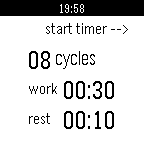{ loading=lazy width="72" } | [Tabata Timer](https://apps.repebble.com/532611eadac14132e900003f) | [nalcire](https://github.com/nalcire/pebble_tabata_timer) | <small>Not checked yet</small> | 2015-06-09 | A simple configurable high-intensity interval training timer for Pebble. up - start/pause timer select - configure timer down - reset timer |
| 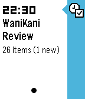{ loading=lazy width="72" } | [TabiTabi](https://apps.repebble.com/56899e10142c4f815500002b) | [JR Mobley](https://github.com/jrmobley/pebble-wanikani-tabitabi) | <small>Not checked yet</small> | 2016-02-08 | Keep track of your WaniKani review schedule on your Pebble timeline. WaniKani (https://www.wanakani.com) is an awesome Japanese Kanji learning website, and… |
| 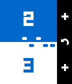{ loading=lazy width="72" } | [Table Tennis](https://apps.repebble.com/57c180145e3c3ddfb8000236) | [nippysaurus](https://github.com/nippysaurus/table_tennis) | <small>Not checked yet</small> | 2016-10-03 | Track your table tennis scoring during play. Features: - Play to 11 or 21. - Overtime serving rules (when game reaches 10:10 or 20:20). - Choose vibration… |
| 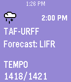{ loading=lazy width="72" } | [TAFline](https://apps.repebble.com/55542994b5b4f648720000d9) | [Michael duPont](https://github.com/flyinactor91/TAFline) | <small>Not checked yet</small> | 2019-07-24 | Going flying today? Put a TAF report on your wrist! TAFline pushes TAF report pins into your Pebble Timeline. Not only will you get the weather forecast… |
| 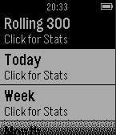{ loading=lazy width="72" } | [Tagpro Stats](https://apps.repebble.com/55cd44f01971947dcd00005c) | [blaziken311](https://github.com/blaziken311/TP-Stats-Pebble) | <small>Not checked yet</small> | 2015-08-15 | Access your Tagpro stats from your Pebble watch! |
| 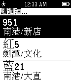{ loading=lazy width="72" } | [Taiwan Bus Info](https://apps.repebble.com/5516e3b35ca7494b610000d4) | [Pou](http://www.dotblogs.com.tw/pou) | <small>See source</small> | 2015-03-31 | 快速查詢關注的公車與到達指定站點的時間。 需搭配手機至 App Settings 加入關注的公車。 |
| 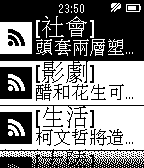{ loading=lazy width="72" } | [TaiwanNewsMessage](https://apps.repebble.com/5512dac6e28a65b3670000e7) | [Donma](http://no2don.com) | <small>See source</small> | 2015-03-25 | 台灣新聞快訊，台灣重大新聞標題，快速瀏覽!! |
| 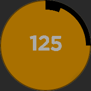{ loading=lazy width="72" } | [Takt](https://apps.repebble.com/5714065395235f65eb000019) | [JGerdes](https://github.com/JGerdes/Takt) | MIT | 2016-04-23 | Detect BPM (speed) of a song on your Pebble Time Round! Whether you are a DJ and/or a musician, if you want to know the beats per minute (BPM) of a song or… |
| 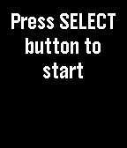{ loading=lazy width="72" } | [Talk2Web](https://apps.repebble.com/566423c99be95ecaee000023) | [bahbka](https://github.com/bahbka/pebble-talk2web) | <small>Not checked yet</small> | 2015-12-07 | Sends dictation results to your server. Very simple App uses Pebble Dictation API to recognize voice and sends results to your server with HTTP-request. |
| 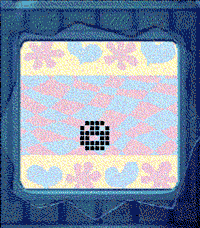{ loading=lazy width="72" } | [Tamagotchi Emulator](https://apps.repebble.com/216a0f62c6e44aac8f725e68) | [Stefan Bauwens](https://github.com/StefanBauwens/Tamagotchi-Emulator-Pebble) | <small>Not checked yet</small> | 2026-07-31 | Tamagotchi Emulator for Pebble! Run the original 1997 Tamagotchi P1 on your Pebble. Includes optional support for running your own background service to… |
| 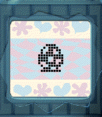{ loading=lazy width="72" } | [Tamagotchi Emulator](https://apps.rebble.io/en_US/application/69e19d25cc376400090073d5) <small>Rebble App Store</small> | [Stefan Bauwens](https://github.com/StefanBauwens/Tamagotchi-Emulator-Pebble) | <small>Not checked yet</small> | 2026-04-17 | Tamagotchi Emulator for Pebble! Run the original 1996-1997 Tamagotchi P1 an P2 on your Pebble. Includes optional support for running your own background… |
| 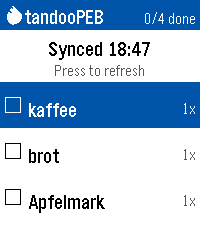{ loading=lazy width="72" } | [tandooPEB](https://apps.repebble.com/8f1c74a599ba4c1abe9f6428) | [Midnight Sundial](https://github.com/Carunga/tandooPEB) | GPL-3.0 | 2026-09-17 | Another shopping list for the Pebble Time 2. This one syncs with your Tandoor Recipie Manager (https://github.com/TandoorRecipes/recipes). Only one basic… |
|  | [Tap Diagnostic](https://apps.repebble.com/06062ca973244672b62e4d6d) | [Utilitarian Huguenot](https://github.com/hobbykitjr/PebbleTapTest) | <small>Not checked yet</small> | 2026-05-11 | Diagnostics to test the various Accelerometer data coming from the watch |
| 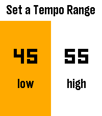{ loading=lazy width="72" } | [Tap Tap](https://apps.rebble.io/en_US/application/6975959f0791ce000af8163e) <small>Rebble App Store</small> | [James Downs](https://github.com/CometDog/pebble-tap-tempo) | <small>No licence</small> | 2026-01-31 | A general tempo finder utility For me, this replaces the PuckPuck app on iOS for keeping track of the tempo of my cold drip coffee. Setting a tempo range at… |
| 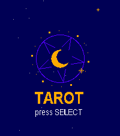{ loading=lazy width="72" } | [Tarot](https://apps.repebble.com/f10917da43df4fb78599e0b9) | [Salim Benhamadi](https://github.com/salim-benhamadi/Pebble-Tarot) | <small>Not checked yet</small> | 2026-09-28 | puts a full 78-card Rider-Waite deck on your wrist and lets the stars do the talking. Choose your reading: a Daily Card that stays yours all day, a quick… |
| 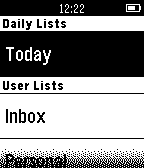{ loading=lazy width="72" } | [Task Checker](https://apps.repebble.com/55085c157d3b94cb14000029) | [Prient Technologies](https://github.com/Rocketeer007/TaskChecker) | <small>Not checked yet</small> | 2016-10-21 | Quickly view, complete or postpone your Remember the Milk tasks from your Pebble. Based on Pebble.JS, so requires an online connection to your phone. This… |
| 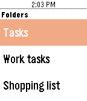{ loading=lazy width="72" } | [Tasks 365](https://apps.rebble.io/en_US/application/59182e3e6ca3871fe8000aa2) <small>Rebble App Store</small> | [Andrei Markeev](https://github.com/andrei-markeev/pebble-outlook-tasks) | <small>Not checked yet</small> | 2017-05-14 | Display tasks from MS Outlook and complete them right from the watch! Note: Project is not affiliated with Microsoft. |
| { loading=lazy width="72" } | [Tasks.org](https://apps.repebble.com/13e39c547aee442eb19a4755) | [Tasks.org, LLC](https://github.com/tasks/tasks) | <small>Not checked yet</small> | 2026-03-28 | The official companion app for Tasks.org. Manage your CalDAV, Google Tasks, and Microsoft To Do lists directly from your wrist. |
| 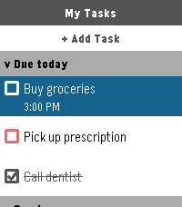{ loading=lazy width="72" } | [Tasks.org](https://apps.rebble.io/en_US/application/69c598c0f20a0a0009e54acf) <small>Rebble App Store</small> | [Tasks.org, LLC](https://github.com/tasks/tasks) | <small>Not checked yet</small> | 2026-03-28 | The official companion app for Tasks.org. Manage your CalDAV, Google Tasks, and Microsoft To Do lists directly from your wrist. |
| 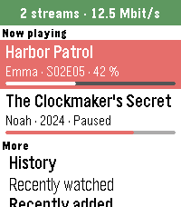{ loading=lazy width="72" } | [Tautulli](https://apps.repebble.com/e1db1c9105ba4876a72a946a) | [Michael Runge](https://github.com/Zeichenfolge/tautulli-pebble) | <small>Not checked yet</small> | 2026-10-04 | **English** Your Plex activity on your wrist, powered by your own Tautulli server. - Now playing: who is watching what, with progress bar, device, quality… |
| 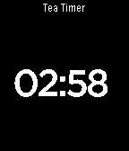{ loading=lazy width="72" } | [Tea Timer](https://apps.repebble.com/52dc626719ed61d10000002d) | [bennett](https://github.com/bennettp123/tea_timer) | <small>Not checked yet</small> | 2015-05-31 | This is a timer for the Pebble Smartwatch. I don't know why it didn't come with one. Forked from https://github.com/mfollett/tea_timer |
| 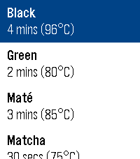{ loading=lazy width="72" } | [Tea's Ready](https://apps.rebble.io/en_US/application/68aa0fab4d6161000851b5ae) <small>Rebble App Store</small> | [astosia](https://github.com/astosia/Tea/tree/clay) | <small>Not checked yet</small> | 2026-05-11 | Patched version of the excellent Tea's Ready Tea Timer by Léomike Hébert. Updated for Pebble Time 2 and Pebble Round 2, and now works with Clay settings… |
| 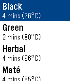{ loading=lazy width="72" } | [Tea's Ready](https://apps.repebble.com/56bcec5ea4f2533892000021) | [Léomike Hébert](https://github.com/leomike/tea) | <small>Not checked yet</small> | 2016-02-25 | Ever forgot to take the tea bag out of your cup? Wondered what temperature the water should be at for green tea? What is the recommended steeping time for… |
| 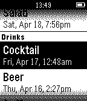{ loading=lazy width="72" } | [Teacup](https://apps.repebble.com/5456c83433c864a87f0000b9) | [Aaron Parecki](https://github.com/aaronpk/Teacup-for-Pebble) | <small>Not checked yet</small> | 2015-04-21 | Teacup is a simple app for tracking what you eat and drink. |
| 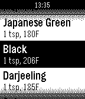{ loading=lazy width="72" } | [teatime](https://apps.repebble.com/52c9dad38ed01e843b00001d) | [Word to the Wise](https://github.com/wttw/pebble-teatime) | <small>Not checked yet</small> | 2014-11-22 | A timer to help you brew the perfect cup of tea. |
| 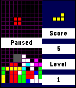{ loading=lazy width="72" } | [Tebbletris](https://apps.repebble.com/557aaf5b9362838d9300000a) | [WRansohoff](https://github.com/WRansohoff/Tetris-PebbleTime) | <small>Not checked yet</small> | 2015-06-16 | Tetris for the Pebble Time! I loved the original Pebble's Tetris app, so I decided to make one in color for the Pebble Time. Controls: Back: Pause / Quit… |
| 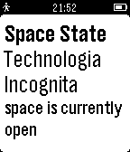{ loading=lazy width="72" } | [Techinc State](https://apps.repebble.com/556b6580e42ea406d8000049) | [Matthew Frost](https://github.com/mattronix/pebble-techinc-app/) | <small>Not checked yet</small> | 2015-05-31 | This app was made to show if the Amsterdam Hackerspace Techinc is open or closed. |
| 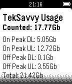{ loading=lazy width="72" } | [TekSavvy Usage](https://apps.repebble.com/54f4fbcd89900ede4d0000b2) | [Mike Mallin](http://github.com/mremallin/ts-usage) | MIT | 2015-06-13 | TekSavvy Usage will let you keep track of your current month's bandwidth usage (both on and off peak). This information is usually updated once per day… |
| 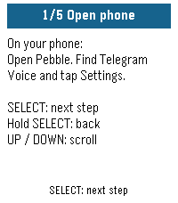{ loading=lazy width="72" } | [Telegram Voice](https://apps.repebble.com/64c41a2069e54ac7a980478c) | [altarr](https://github.com/altarr/pebble-telegram-voice) | <small>Not checked yet</small> | 2026-09-13 | Use your Pebble watch to speak to your Telegram bot. Press SELECT, say what's on your mind, and read your bot's reply on your wrist. Connect your own… |
| 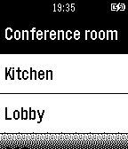{ loading=lazy width="72" } | [Telldus Live!](https://apps.repebble.com/52cc1a8c45ffdd84b5000146) | [Micke Prag](https://github.com/mickeprag/telldus-live-pebble) | <small>Not checked yet</small> | 2014-01-07 | Pebble app for connecting to Telldus Live! Control you lights and appliances from your wrist. |
| 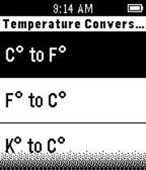{ loading=lazy width="72" } | [Temperature Converter](https://apps.repebble.com/54cf873e6d23f890220000a3) | [small rock design labs!](http://bit.ly/aboutpdl) | <small>See source</small> | 2015-02-02 | About: http://bit.ly/aboutpdl ---------- This converter app allows you to convert temperatures from your wrist! Simply open the app and method to convert… |
| 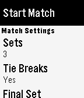{ loading=lazy width="72" } | [Tennis](https://apps.repebble.com/572a8209381261f35e00000a) | [Ben Gourley](https://github.com/bengourley/pebble-tennis) | <small>Not checked yet</small> | 2016-05-26 | Built by a tennis player for tennis players. Keep track of the score in your tennis matches with simple controls and a clean, uncluttered interface. Match… |
| 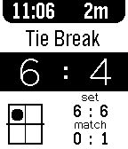{ loading=lazy width="72" } | [Tennis Pro](https://apps.repebble.com/52d23589c44c048e1d00002a) | [cstrat](https://github.com/cstrat/tennis-pro.git) | <small>Not checked yet</small> | 2014-01-30 | Keep track of your tennis match with ease, for free! - Highly configurable - Config and game data saves locally - Allows for multiple game lengths … |
| 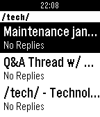{ loading=lazy width="72" } | [Terminus](https://apps.repebble.com/5695b5bf0065c3cecc000011) | [Gitgud Software](https://gitgud.io/gitgud-software/terminus) | <small>See source</small> | 2016-03-08 | Terminus is an endchan browser for Pebble. |
| 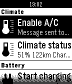{ loading=lazy width="72" } | [Tesla Control](https://apps.repebble.com/5300fe0261dee5ed4a00014a) | [Erik de Bruijn](https://github.com/ErikDeBruijn/TeslaFTW) | GPL-3.0 | 2016-10-22 | Control your Tesla Model S or X. Start/stop charging, heat/cool your car, you can check in/outdoor temperatures, see your range... Enter Tesla login on the… |
| 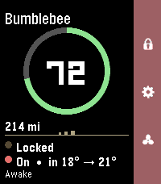{ loading=lazy width="72" } | [Tesla Control](https://apps.repebble.com/f335b06286af446e9ab3e803) | [Unknown](https://github.com/NolanFoster/pebble-tesla) | <small>Not checked yet</small> | 2026-06-06 | Your Tesla, on your wrist. Tesla Control turns your Pebble into a slim remote for your car. A clean status card shows your vehicle at a glance, and a… |
| 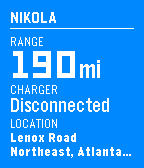{ loading=lazy width="72" } | [Tesla Time](https://apps.repebble.com/559d32659bd78d3bc1000032) | [Tim Dorr](https://github.com/timdorr/tesla-time) | <small>Not checked yet</small> | 2017-05-26 | Monitor and control your Tesla Model S from your wrist. **IMPORTANT** Make sure you visit the settings from your Pebble or Pebble Time app first. The app… |
| { loading=lazy width="72" } | [Test Location](https://apps.repebble.com/54b3cfebd5587f3596000056) | [Samuel](https://github.com/samuelmr/pebble-testlocation) | <small>Not checked yet</small> | 2016-05-22 | Test location functionality of your Pebble. You can test if your Pebble can get your current location or track your location while you are moving. |
| 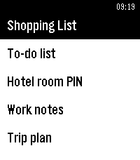{ loading=lazy width="72" } | [Text Sync](https://apps.rebble.io/en_US/application/6a3cc9bccd52370009f40d2d) <small>Rebble App Store</small> | [matejdro](https://github.com/matejdro/PebbleTextSync) | <small>Not checked yet</small> | 2026-08-02 | Show your text/markdown files on the watch. Click "Website Link" below for more information. |
| 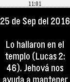{ loading=lazy width="72" } | [Texto Diario 2016](https://apps.repebble.com/56a28232956f0b99f1000050) | [Camilo Tabares](https://github.com/soycamiloypunto/Examinando2016) | <small>Not checked yet</small> | 2019-07-24 | Muchos quisieramos tener un texto bíblico para meditar en él, durante la escuela o el trabajo. Ahora podrás revisar el Texto del Año, Texto del Día y el… |
| 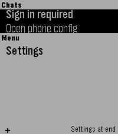{ loading=lazy width="72" } | [tg](https://apps.repebble.com/87f0ec7418924c2aa843a159) | [nick1udwig](https://github.com/nick1udwig/tg-pebble) | <small>Not checked yet</small> | 2026-07-17 | Telegram interface for Pebble (unofficial). Read your messages and send with dictation. Message your friends -- or your OpenClaw -- all from your Pebble! |
| 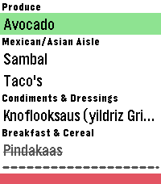{ loading=lazy width="72" } | [The Every Shopping list app](https://apps.repebble.com/ff64d2aeab204b2ba3645c8a) | [Marshal](https://github.com/Velzeboer/pebble-every-list-shopping) | <small>Not checked yet</small> | 2026-09-21 | Have your shopping list right on your wrist! Just log in with your credentials on the settings page and you're good to go. Features: - Check off items … |
| 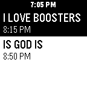{ loading=lazy width="72" } | [The New Parkway Today](https://apps.rebble.io/en_US/application/6a1fc43133a2dc000a63cf32) <small>Rebble App Store</small> | [LavenderCorp](https://github.com/chughes87/pebble_parkway/tree/master/pebble-app) | <small>Not checked yet</small> | 2026-06-05 | Showings at The New Parkway in Oakland, California today. Only shows showings that are in the future for convenience |
| 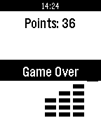{ loading=lazy width="72" } | [The Stacker](https://apps.repebble.com/52b61a69f9d7a3652d000006) | [ameiga](https://github.com/YagoCarballo/pebble_stacker) | <small>Not checked yet</small> | 2015-05-27 | The classic stacker game now on your wrist, ideal to play in those spare minutes when you have to wait for something. |
| { loading=lazy width="72" } | [TheEconFeed](https://apps.repebble.com/d7506acfae684656a37c6f17) | [a22.dev](https://github.com/ankur22/TheEconFeed) | <small>Not checked yet</small> | 2026-07-27 | A section menu of all 17 Economist sections leads to scrollable headline-and-dek feeds you can flick through story by story. Everything is cached on the… |
| 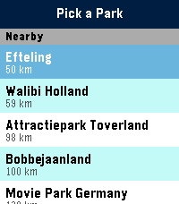{ loading=lazy width="72" } | [ThemePark Queues](https://apps.repebble.com/533b48a130db491a96830e41) | [Jamie Holding](https://github.com/ThemeParks/pebble) | <small>Not checked yet</small> | 2026-08-02 | Skip the guesswork. TP Queues brings live theme-park data straight to your Pebble — for every park, worldwide. No phone-fumbling, no app-switching, no… |
| { loading=lazy width="72" } | [ThermoPebbleStat](https://apps.repebble.com/5420cf45a2bee9baf7000021) | [Jose Troche](https://github.com/jose-troche/PebbleThermostatSetter) | <small>Not checked yet</small> | 2014-09-23 | A Pebble watch application to set the temperature of multiple thermostats. |
| 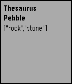{ loading=lazy width="72" } | [Thesaurus](https://apps.repebble.com/574cf5286037e8af36000013) | [Sean Sullivan](https://github.com/seanthesheep/PebbleThesaurus) | <small>Not checked yet</small> | 2016-05-31 | Very simple voice-dictated thesaurus using the Big Huge Thesaurus API. |
| 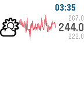{ loading=lazy width="72" } | [ThingSpark](https://apps.repebble.com/5679794d160619693200002b) | [Adam Cohen-Rose](https://github.com/adamcohenrose/thingspark-pebble) | <small>Not checked yet</small> | 2015-12-23 | A Pebble watch app to display ThingSpeak (https://thingspeak.com/) data as sparklines. Heavily based on xively-pebble (thank you!) |
| 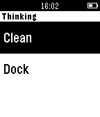{ loading=lazy width="72" } | [Thinking Cleaner](https://apps.repebble.com/549d81f114355eb29f00020f) | [Tim](https://github.com/Timvdv/Thinking-Cleaner-Pebble) | <small>Not checked yet</small> | 2014-12-26 | A simple remote for your iRobot Roomba. Note: This requires the Thinking Cleaner module (www.thinkingcleaner.com) |
| 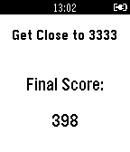{ loading=lazy width="72" } | [Threaction](https://apps.repebble.com/54f356b33b62c94ca3000081) | [Graham Cooper](https://github.com/thadeaus/Threaction) | <small>Not checked yet</small> | 2015-03-01 | Try and get as close to 3333 as possible. |
| 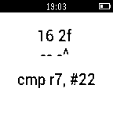{ loading=lazy width="72" } | [Thumb2 Disassembler](https://apps.repebble.com/55ccce0c203382e5ec000027) | [pancake](https://github.com/radare/pebble-disthumb) | <small>Not checked yet</small> | 2015-08-13 | This is an ARM Thumb2 disassembler tool that allows you to input some hexadecimal bytes and get the human readable instruction right there. |
| 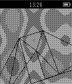{ loading=lazy width="72" } | [thumpa](https://apps.repebble.com/55da2dff260e9cc5a2000031) | [tox](http://github.com/mtoksvig/cloud-thumpa) | <small>No licence</small> | 2015-08-23 | plasma and spinning 3D wireframe |
| 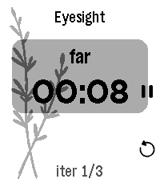{ loading=lazy width="72" } | [Thymer](https://apps.repebble.com/337bcb025b4e48788aa24d00) | [Brandon Norick](https://github.com/bnorick/pebble-dev/tree/main/apps/thymer) | <small>Not checked yet</small> | 2026-07-13 | Thymer is a highly configurable timer app specifically tuned for Pebble Time 2: moderately big text for my old eyes, touch controls, and... that's it I… |
| 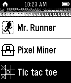{ loading=lazy width="72" } | [Tic Tac Toe](https://apps.repebble.com/5573606078821148190000b0) | [HeatBorn](https://cloudpebble.net/ide/project/194955#) | <small>See source</small> | 2015-07-13 | A 1 v 1 battle between 2 players! This REQUIRES at least one pebble (note: at the moment there is no way to use two pebble devices). |
| { loading=lazy width="72" } | [Tick Every](https://apps.repebble.com/f64d58f70cb8458390cd7749) | [G-Cyrille](https://github.com/G-Cyrille/tick-every) | MIT | 2026-08-13 | Supports: Aplite, Basalt, Chalk, Diorite, Emery, Flint and Gabbro. English by default; French and optional local session history are available from… |
| { loading=lazy width="72" } | [Tick Talk](https://apps.repebble.com/563e5b2e0023547b7f00006f) | [Benjamin von Deschwanden](https://github.com/vdeschwb/Tick-Talk) | <small>Not checked yet</small> | 2015-11-10 | This application for the Pebble smartwatch allows you to prepare perfectly for precisely timed presentations. The application lets you record and play back… |
| { loading=lazy width="72" } | [TickTick Timeline](https://apps.repebble.com/21194297071144f9a9b946b1) | [pascaloon](https://github.com/pascaloon/TickTickTimeline) | <small>Not checked yet</small> | 2026-08-23 | Unofficial TickTick integration for the Pebble Watch. This app is not affiliated with the official TickTick team. This is a community project because I love… |
| { loading=lazy width="72" } | [TickTickTimeline](https://apps.rebble.io/en_US/application/6a8a5093de44760009b7db81) <small>Rebble App Store</small> | [pascaloon](https://github.com/pascaloon/TickTickTimeline) | <small>Not checked yet</small> | 2026-08-23 | Unofficial TickTick integration for the Pebble Watch. This app is not affiliated with the official TickTick team. This is a community project because I love… |
| { loading=lazy width="72" } | [Tide Aware](https://apps.repebble.com/530e9f7f306a45f5bc00003f) | [Mike Dombrowski](https://github.com/md100play/PebbleTides-WatchApp) | <small>Not checked yet</small> | 2016-06-11 | **US Only** Tide Aware is the incredibly simple way to check the closest tides based on GPS, ZIP Codes, or city and state input by the user through the… |
| { loading=lazy width="72" } | [Tide Aware (Non-US)](https://apps.repebble.com/5360443e43c553e46a000023) | [Mike Dombrowski](https://github.com/md100play/PebbleTides-Non-US) | <small>Not checked yet</small> | 2016-06-11 | Tide Aware now supports thousands of locations outside of the US. Tide Aware is the incredibly simple way to check the closest tides based on locations… |
| { loading=lazy width="72" } | [TidePebble](https://apps.repebble.com/5dd24e3290e8451781d0df7c) | [ModusApps](https://github.com/gordonbazeley/tidepebble) | <small>Not checked yet</small> | 2026-08-17 | TidePebble puts the local tide forecast on your wrist. It uses your phone’s location to find the nearest available marine forecast and displays the next 24… |
| { loading=lazy width="72" } | [TidePebble](https://apps.rebble.io/en_US/application/6a3a09396e53bd00094c3a7c) <small>Rebble App Store</small> | [ModusApps](https://github.com/gordonbazeley/tidepebble) | <small>Not checked yet</small> | 2026-08-17 | TidePebble puts the local tide forecast on your wrist. It uses your phone’s location to find the nearest available marine forecast and displays the next 24… |
| { loading=lazy width="72" } | [TilesApp](https://apps.repebble.com/549e223cef9cfaabe000004b) | [Konstantin](https://bitbucket.org/kvorobyev/pebbletiles) | <small>See source</small> | 2015-09-12 | Create your own watchface for Pebble by arranging tiles(widgets) |
| { loading=lazy width="72" } | [Time Eye-Opener](https://apps.repebble.com/6c04120d1cd1470594cfa29e) | [YoubieDr](https://github.com/AUBee19/Time-Eye-Opener/tree/main) | <small>No licence</small> | 2026-04-18 | Time Eye-Opener: The notification that doesn't take "no" for an answer. You’re in a meeting and a crucial text comes in. You can’t reply right now, but if… |
| { loading=lazy width="72" } | [Time Helper](https://apps.repebble.com/55af3b34f52274489e000037) | [Ben Galbraith](https://github.com/bgalbs/time-helper) | <small>Not checked yet</small> | 2015-07-22 | Time Helper is an app for telling time through vibrations. When run, Time Helper appears to be one of the Pebble's watchfaces. However, unlike a standard… |
| { loading=lazy width="72" } | [Time Recording](https://apps.repebble.com/57ae0288f01b53901a00021c) | [BaaaZen (Mirko Hansen)](https://github.com/BaaaZen/TimerecordingForPebble) | MPL-2.0 | 2016-11-08 | Timerecording for Pebble is an information and control app for Time Recording on the Pebble Smartwatch. The companion app is compatible with the pro version… |
| { loading=lazy width="72" } | [Time To Feierabend](https://apps.repebble.com/552d0cb20835233ebf00000d) | [niesse](https://github.com/njesse/TimeToFeierabend) | <small>Not checked yet</small> | 2017-08-11 | Deutsch: Die App zeigt die relevanten Uhrzeiten entsprechend dem deutschen Arbeitszeitgesetz an. Dazu gehören Arbeitsbeginn, Arbeitsende, eine 30 Minuten… |
| { loading=lazy width="72" } | [Time Tracker](https://apps.rebble.io/en_US/application/585d44f85de850e8dc000629) <small>Rebble App Store</small> | [Sergey Kotsur](https://github.com/joker512/pebble_tracker) | <small>Not checked yet</small> | 2017-09-22 | There is no good time tracking apps for Pebble, you know. I hope this one would close the gap. Read the full documentation here… |
| { loading=lazy width="72" } | [Time Traveler](https://apps.rebble.io/en_US/application/69d3a680a6ffe6000a092d42) <small>Rebble App Store</small> | [Freakified](https://github.com/freakified/time-traveler/) | <small>Not checked yet</small> | 2026-05-22 | Remember the old days, when your digital watch would come preloaded with 49 cities of the world, and a world map prominently displayed on the screen? Wasn't… |
| { loading=lazy width="72" } | [Time Traveler - World Clock](https://apps.repebble.com/50caf7145cc2474da2aaf6cc) | [Freakified](https://github.com/freakified/time-traveler/) | <small>Not checked yet</small> | 2026-05-22 | Remember the old days, when your digital watch would come preloaded with 49 cities of the world, and a world map prominently displayed on the screen? Wasn't… |
| { loading=lazy width="72" } | [Timebridge](https://apps.repebble.com/7cec9ebe19e84044b22d30da) | [keshavpratap](https://github.com/KeshavPratap-K/Timebridge-Watchapp) | <small>No licence</small> | 2026-09-19 | 🌍 Time Bridge — Compare local and global times at a glance, switch timezones instantly with the Up/Down buttons, and enjoy fun sun ☀️ and moon 🌙 icons… |
| { loading=lazy width="72" } | [Timeline WX](https://apps.repebble.com/1149e6999c21493aa99532e7) | [Eric McCormick](https://github.com/ericlmccormick/Pebble_Hourly_Weather/) | <small>Not checked yet</small> | 2026-07-28 | Pulls the next 24hrs of weather at your location. Shows temperature, conditions(icon), wind speed, chance of rain(pie chart) and UV (color bar). Text colors… |
| { loading=lazy width="72" } | [TimePulse](https://apps.repebble.com/65c20b964e72c30009761e85) | [Christophe Jeannette](https://github.com/Sichroteph/Nag_for_Pebble) | <small>Not checked yet</small> | 2026-07-14 | Time Pulse is a practical timekeeping app designed to assist you throughout your day. - With Time Pulse, you can set specific intervals for notifications… |
| { loading=lazy width="72" } | [timer](https://apps.repebble.com/52cded9b279716a25400001f) | [mpwh](https://github.com/mpwh/pebble-stopwatch) | <small>Not checked yet</small> | 2014-01-09 | simple stopwatch |
| { loading=lazy width="72" } | [Timer](https://apps.repebble.com/55b6cd955e0716cd6b0000a1) | [Pebble](https://github.com/coredevices/pebble-timer) | <small>Not checked yet</small> | 2026-10-02 | Pebble's first official timer! Set up to eight different timers and watch them run down. Timers longer than fifteen minutes also push a pin to your timeline. |
| { loading=lazy width="72" } | [Timer](https://apps.repebble.com/8b210e928160473495d2fc80) | [Unknown](https://github.com/nichols-t/timer) | <small>Not checked yet</small> | 2026-05-09 | A minimal timer application inspired by physical rotational timers. |
| { loading=lazy width="72" } | [Timer - Instant Timer](https://apps.repebble.com/1a42bf7ed056404abbdd7bf9) | [howeaj](https://github.com/howeaj/pebble-instant-timer) | <small>Not checked yet</small> | 2026-07-19 | A polished combination timer, alarm and stopwatch. Designed for quick-launch to set everyday timers/alarms for cooking, reminders and alarm clocks. Packed… |
| { loading=lazy width="72" } | [Timer - Instant Timer](https://apps.rebble.io/en_US/application/69d6c2f786d8ae000970259b) <small>Rebble App Store</small> | [howeaj](https://github.com/howeaj/pebble-instant-timer) | <small>Not checked yet</small> | 2026-07-19 | Stopwatch / Alarm / Timer combo designed for quick launch, for everyday cooking, reminders and alarms. Touch controls; set with one swipe! Sound! Packed… |
| { loading=lazy width="72" } | [Timer / Chrono](https://apps.repebble.com/45cf2394b13b49e9b88bd4ba) | [ACW Bright](https://github.com/ArcoW2/Pebble-app-Timer-Chrono) | <small>No licence</small> | 2026-09-24 | Modes ----- Count up, count down for a duration, or count down until a clock time. The three are distinguishable modes, each with its own screen layout… |
| { loading=lazy width="72" } | [Timer+](https://apps.repebble.com/54a1ba1afc5f23e4c000012d) | [Ycleptic Studios](https://github.com/YclepticStudios/pebble-timer-plus) | <small>Not checked yet</small> | 2026-03-03 | Timer+ is a beautifully animated, simple timer and stopwatch for your Pebble! It keeps track of your timer even after you close the app and will open the… |
| { loading=lazy width="72" } | [Timer+ Touch](https://apps.repebble.com/4c0e0a3919a74fdf85cf11ab) | [Brian Ouellette](https://github.com/BrianEnders/pebble-timer-plus-touch) | MIT | 2026-06-28 | Timer+ is a beautifully animated, simple timer and stopwatch for your Pebble! It was created by Ycleptic Studios. It keeps track of your timer even after… |
| { loading=lazy width="72" } | [Timer++](https://apps.repebble.com/c0fb8a9ee65046f1a3f0c071) | [Cosmic Oscillator](https://github.com/tew42/pebble-timer-plus-plus) | <small>Not checked yet</small> | 2026-09-15 | A beautiful, simple timer/stopwatch for the Pebble smartwatch, now with optimized battery life and more! Tell it how coarsely to show the time while it is a… |
| { loading=lazy width="72" } | [TimeReader](https://apps.repebble.com/651226388f4f4e8989e1f1f2) | [Magnetz](https://github.com/magnetz/timereader-pebble) | <small>Not checked yet</small> | 2026-08-27 | Reading stopwatch: time each session, track pages/hour and ETA. |
| { loading=lazy width="72" } | [Timers](https://apps.repebble.com/5673ae9a96914ac297bfec85) | [Persitz](https://github.com/Persitz/pebble-timers) | <small>Not checked yet</small> | 2026-07-30 | Run several timers at once: countdowns, stopwatches with laps, and repeating intervals. Timers are easy to tell apart by color and size. Alarms buzz until… |
| { loading=lazy width="72" } | [TimeSchedule](https://apps.rebble.io/en_US/application/53e3f86af2e150c76c000049) <small>Rebble App Store</small> | [Matzo](https://github.com/Matzo/PebbleTimeSchuedule) | <small>Not checked yet</small> | 2015-04-12 | Display today's your time schedule on Pebble. You can send your schedule to Pebble from iOS companion app. http://appstore.com/PebbleTimeSchedule REQUIRED… |
| { loading=lazy width="72" } | [TimeSync](https://apps.repebble.com/56009847ce8997bbc9000007) | [Dan Forever](https://github.com/DanForever/TimeSync) | Apache-2.0 | 2015-12-16 | Populate your Pebble timeline with your RSVP'd Facebook events or your TVShowTime.com agenda! |
| { loading=lazy width="72" } | [TimeTable](https://apps.repebble.com/565260877984de09c6000008) | [willyb321](https://github.com/willyb321/pebble-timetable_c) | <small>Not checked yet</small> | 2016-02-01 | Made this for my friend. |
| { loading=lazy width="72" } | [Timetable Pusher](https://apps.repebble.com/562a89497480835e51000090) | [ThePurpleK](https://github.com/kz/timetable-pusher-pebble) | <small>Not checked yet</small> | 2018-06-14 | Push your class timetable to your timeline with Timetable Pusher. Simply visit https://timetablepush.me/, enter your timetables, install the app and get… |
| { loading=lazy width="72" } | [TimeTick Watchface](https://apps.repebble.com/67ab20fdc6af4c228d04f055) | [atomlabor](https://github.com/atomlabor/TimeTick) | <small>Not checked yet</small> | 2026-06-01 | This is my first attempt at a touchscreen watch face. Here you can view the time, steps, date and battery information, and if you tap the time, a countdown… |
| { loading=lazy width="72" } | [TimeToDo](https://apps.rebble.io/en_US/application/6837b69b7c3a470009af6c56) <small>Rebble App Store</small> | [gibbiemonster](https://github.com/blockarchitech/timetodo) | <small>Not checked yet</small> | 2025-09-23 | **This app does not work with the Core Devices mobile app. A Rebble account is required to use TimeToDo.** Sync your Todoist tasks with your timeline! … |
| { loading=lazy width="72" } | [Timezone Traveler](https://apps.rebble.io/en_US/application/68c60a4e361d4900088efa99) <small>Rebble App Store</small> | [kinncj](https://github.com/kinncj/pebble-traveler) | <small>Not checked yet</small> | 2025-09-14 | A clean and modern GMT watch face with simple functionality. Tap to seamlessly switch between your configured time zones. More details at… |
| { loading=lazy width="72" } | [Tinder for Pebble](https://apps.repebble.com/5435bc7926edd83fea0000ab) | [Neal Patel](https://github.com/Neal/pebble-tinder) | <small>Not checked yet</small> | 2014-12-11 | A Tinder app for Pebble that allows you to like, pass and view profiles on the go! Coming soon: read messages, send preset messages, change preferences and… |
| { loading=lazy width="72" } | [Tinder for Pebble Time](https://apps.repebble.com/570686d3016c2522e600003b) | [Arowe](https://github.com/aprowe/pebble-tinder) | <small>Not checked yet</small> | 2016-07-18 | A tinder app for Pebble that allows you to like, pass and view profiles on the go! Forked and made in color from "Tinder for Pebble" by Neal Patel, found… |
| { loading=lazy width="72" } | [Tinker](https://apps.repebble.com/56f985d469581de981000005) | [Mohamed Fadiga](https://www.hackster.io/Momy93/control-your-particle-photon-from-a-pebble-smartwatch-03d1c4) | <small>Not checked yet</small> | 2016-03-28 | Control your Particle Photon from your Pebble smartwatch. You can read and write all the digital and analog pins, directly on your wrist. |
| { loading=lazy width="72" } | [Tiny Bird](https://apps.repebble.com/52f7a04b777f7eee6d000258) | [StuartHa](https://github.com/StuartHa/tiny_bird) | <small>Not checked yet</small> | 2015-12-13 | Port of Flappy Bird. By Stuart Harrell. Support developer by donating via Paypal to skh076000@gmail.com Colorized for Pebble Time by Frank Martinez (Dezign999). |
| { loading=lazy width="72" } | [Tiny Drunkard](https://apps.repebble.com/565ada8acb722e1d6e000043) | [Olli Salli](http://github.com/ollisal/tiny-drunkard) | <small>No licence</small> | 2015-11-29 | Client for drunkards.duckdns.org |
| { loading=lazy width="72" } | [Tiny Life](https://apps.repebble.com/5481037659fcc2ab1b0000cb) | [Benjamin Johns](https://github.com/theoreticalb/pebble_life) | <small>Not checked yet</small> | 2014-12-05 | Tiny Life is an implementation of the zero-player classic Conway's Game of Life for the Pebble smartwatch. Choose from multiple cell sizes and generation… |
| { loading=lazy width="72" } | [Tiny Pilot](https://apps.repebble.com/60fed69f1342ae020c35a654) | [Harrison Allen](https://github.com/HarrisonAllen/pebble-gbc-graphics) | <small>No licence</small> | 2021-07-26 | Tiny Pilot is a game where you fly a tiny plane and collect as many balloons as you can before you run out of fuel! This is powered by the Pebble GBC… |
| { loading=lazy width="72" } | [Tiny Reversi](https://apps.repebble.com/548fcfb2cd117d43a9000084) | [Benjamin Johns](https://github.com/theoreticalb/pebble_reversi) | <small>Not checked yet</small> | 2015-06-09 | The perfectly Pebble-sized strategy game has arrived. Reversi, marketed in the US as Othello and in Hong Kong as Apple Chess, is the classic game of… |
| { loading=lazy width="72" } | [tiny3words](https://apps.repebble.com/57d1ec88ffca49beb5000018) | [FelixJ20000](https://github.com/12johnsonf/tiny3words) | <small>No licence</small> | 2016-09-16 | Takes your current location and uses the what3words location system to feed it back in 3 words! Now with autorefresh, configurable in settings! |
| { loading=lazy width="72" } | [TinyMaker Monitor](https://apps.repebble.com/7fa7ce8511334007a8756c53) | [Brooman Inks](https://github.com/brooks2564/Pebble-Tiny-Maker-App) | <small>Not checked yet</small> | 2026-09-05 | Watch a print on your TinyMaker resin printer from your wrist. Layer count, time left, resin level — live, on any Pebble. Requires the TinyMakerWifi… |
| { loading=lazy width="72" } | [Tip Calculator](https://apps.repebble.com/53090bbfab1ae26bc70005e3) | [SlideWave, LLC](https://github.com/ddaeschler/pebble-tipcalc) | <small>Not checked yet</small> | 2014-03-09 | Enter the check amount and set a tip percentage and this app will calculate the tip amount and bill total |
| { loading=lazy width="72" } | [TipCalc](https://apps.repebble.com/55ca3971688a90d0850000a9) | [Joseph Roque](https://github.com/joseph-roque/tip-calc) | <small>Not checked yet</small> | 2015-08-13 | Quickly calculate the tip on your bill based on the quality of service you feel you received! Between great, average, and poor service, the values you… |
| { loading=lazy width="72" } | [Tippy](https://apps.repebble.com/5313eae14f9d0e8a15000557) | [SpecificApps](https://github.com/Med116/tippy) | <small>Not checked yet</small> | 2014-03-03 | Enter restaurant tip bill info into the watch, using the select button to toggle between "dollars", "cents", "tip %", and "people". The incrementer (up… |
| { loading=lazy width="72" } | [Today Is](https://apps.repebble.com/57f1dc9405e4b1be61000122) | [High Panda](https://github.com/mikea/pebble-current-date-app) | <small>Not checked yet</small> | 2016-10-10 | Current date at a glance and in the app. Configurable formats. |
| { loading=lazy width="72" } | [ToDoIt](https://apps.repebble.com/5674333b1caa14bc3500003e) | [Michal Kowalkowski](https://github.com/michalkow/pebble-ToDoIt) | <small>Not checked yet</small> | 2015-12-28 | ToDoIt is a a checklist app with daily reminders. You can customize few times a day, when you want to be reminded about planned tasks. You can use voice to… |
| { loading=lazy width="72" } | [Toggle](https://apps.repebble.com/53206fc7e271df5719000162) | [Rogier Slag](https://github.com/rogierslag/TogglAppPebble) | <small>Not checked yet</small> | 2015-09-12 | You also love to use Toggl for your time keeping and would love to integrate that to your Pebble for easy billing and keeping track of everything? That's… |
| { loading=lazy width="72" } | [Toll Tracker](https://apps.repebble.com/568addb26518afb63600002a) | [animadverto](https://github.com/mehmetakalin/Toll-Tracker) | <small>Not checked yet</small> | 2016-01-04 | Toll Tracking prototype app for bridges over the Bosphorus sea in Turkey https://en.wikipedia.org/wiki/Category:Bridges_in_Istanbul |
| { loading=lazy width="72" } | [Tomato](https://apps.repebble.com/543c53cc708958c68800001c) | [Alexander Kuznetsov](http://github.com/alexkuz/tomato) | <small>No licence</small> | 2015-12-05 | Pomodoro tool for Pebble http://en.wikipedia.org/wiki/Pomodoro_Technique Controls ---------- Up / Down - subtract / add one minute; Up (long click) - switch… |
| { loading=lazy width="72" } | [Tomato Timer](https://apps.repebble.com/5674f3d17528c39387000094) | [Matt Del Signore](https://github.com/toastking/pebble_pomodoro) | <small>Not checked yet</small> | 2015-12-19 | A timer for the Pomodoro Method! |
| { loading=lazy width="72" } | [Toothbrush Buddy](https://apps.repebble.com/54f53b23a8d073ffd7000004) | [Brandon Berookhim](https://github.com/brandonio/toothbrushbuddy) | <small>Not checked yet</small> | 2015-03-03 | This app should be used as a companion while brushing one's teeth. Once started, the app gives the user three seconds to prepare. It then allots 10 seconds… |
| { loading=lazy width="72" } | [Toothbrush Timer](https://apps.repebble.com/7face576f12b4d8b88141f34) | [elanmed](https://github.com/elanmed/toothbrush-timer) | <small>Not checked yet</small> | 2026-05-28 | A simple timer for brushing your teeth, built for the Pebble watch. The app runs two back-to-back timers: a 2-minute timer for brushing your teeth, and a… |
| { loading=lazy width="72" } | [Toothbrushtimer](https://apps.repebble.com/52aca26019ff50f332000016) | [Christoph](http://gitlab.christophhaefner.de/pebble/toothbrushtimer) | <small>See source</small> | 2015-03-09 | Basically a digital version of the little sandglass I had when I was a kid to ensure I'm toothbrushing a proper amount of time… |
| { loading=lazy width="72" } | [ToothTimer](https://apps.repebble.com/54c9beb965fbc10a9e0000aa) | [mlv](https://github.com/mlv/ToothTimer) | <small>Not checked yet</small> | 2015-03-03 | Timer that times (in 15 second intervals per section of the mouth) the brushing of teeth. |
| { loading=lazy width="72" } | [TopoNav](https://apps.repebble.com/4396804c939041c5a7b9edf1) | [tob1](https://github.com/sirTob1/pebble-topo-nav) | <small>Not checked yet</small> | 2026-09-27 | TopoNav brings offline-capable topographic maps and smart turn-by-turn navigation directly to your wrist. Perfect for hikers, cyclists, geocachers, and… |
| { loading=lazy width="72" } | [TOPTer](https://apps.repebble.com/692194cf23bdbb000998b007) | [Alexey Cluster](https://github.com/ClusterM/pebble-totper) | GPL-3.0 | 2026-03-23 | A powerful, standalone Time-based One-Time Password (TOTP) authenticator for Pebble smartwatches that doesn't require a companion app on your phone… |
| { loading=lazy width="72" } | [Torch/Flash Light](https://apps.repebble.com/52cf043c988ec1b9bb00007f) | [wowthatisrandom](https://github.com/wowthatisrandom/PebbleTorch) | <small>Not checked yet</small> | 2016-01-03 | Basic App that turns on the backlight and makes the screen white, until the back button is pressed. Great if you need a quick light, but dont want to light… |
| { loading=lazy width="72" } | [Toroidal Tic-Tac-Toe](https://apps.repebble.com/b4eb7f620ba64bc6b7c56e02) | [Quartz Clocksmith](https://github.com/lynxmonkey/Tic-Tac-Tor_Pebble) | <small>Not checked yet</small> | 2026-10-06 | tic-tac-toe game, but on a 3D torus. A very simple game where every box is a center and the edges all wrap around. |
| { loading=lazy width="72" } | [Toronto Transit Time](https://apps.repebble.com/57315941c351ffcdf500000f) | [Carlos Duarte Do Nascimento (Chester)](https://github.com/chesterbr/toronto-transit-time/) | <small>Not checked yet</small> | 2016-10-19 | Get realtime arrival predicitons and service messages for bus and streetcar routes at the nearest stops directly on your Pebble - no extra app required. |
| { loading=lazy width="72" } | [Torrent helper](https://apps.repebble.com/53a6d40ed5712479fc00018f) | [Josh Evans](https://github.com/jjv360/uTorrent-Pebble) | <small>Not checked yet</small> | 2014-06-22 | Control your torrent client from your wrist ! |
| { loading=lazy width="72" } | [Touch Grass](https://apps.repebble.com/a7de79b5e84b46f7a656a019) | [Nicolai Søborg](https://hg.sr.ht/~nicolai/touch-grass) | <small>Not checked yet</small> | 2026-07-23 | Hello BornHack 2026 - this app allows you to touch grass |
| { loading=lazy width="72" } | [Touch Tone](https://apps.repebble.com/917ae403a3024a9d979c57d7) | [sheppoor](https://github.com/sheppoor/touch-tone) | <small>Not checked yet</small> | 2026-06-13 | Plays the touch tone classic sounds on an old 12-button telephone. Experience those dulcet tones from the before times. |
| { loading=lazy width="72" } | [Touchpebble](https://apps.rebble.io/en_US/application/6a8171dc8f5f320009d22c7e) <small>Rebble App Store</small> | [Jackson Goode](https://github.com/jacksongoode/touchpebble) | <small>Not checked yet</small> | 2026-08-16 | Pebble watchapp that shows your Touchstone Climbing check-in QR on your watch, so you don't have to pull out your phone. |
| { loading=lazy width="72" } | [Touchy Weather - Weather App](https://apps.repebble.com/532286232c5d4dc499b5918c) | [ClickCalickClick (Touchy Weather)](https://github.com/ClickCalickClick/TouchyWeather) | <small>Other</small> | 2026-09-03 | TouchyWeather is a playful, card-based weather app for Pebble that mixes useful forecast data with personality for touchscreen Pebble Watches. It’s designed… |
| { loading=lazy width="72" } | [Tower](https://apps.repebble.com/54d54fede8bb36ea9d00001f) | [squilter](https://github.com/DroidPlanner/dp-pebble) | <small>Other</small> | 2015-03-15 | Tower is a Ground Control Station (GCS) app built atop 3DR Services, for UAVs running Ardupilot software. |
| { loading=lazy width="72" } | [Track Mood](https://apps.repebble.com/5552100eec8de733ba00003f) | [Samuel](https://github.com/samuelmr/pebble-trackmood) | <small>Not checked yet</small> | 2019-07-24 | Record your emotional state to your timeline and find happiness! You can rate your mood any time you like. The app will push a corresponding pin to your… |
| { loading=lazy width="72" } | [Tracker](https://apps.repebble.com/5556f77b2696c7fb270000a6) | [Richard Johnson](https://github.com/rajid/pebble_tracker) | <small>Not checked yet</small> | 2016-01-17 | Simple time tracking program for up to five projects. You can edit the project names and times using "Settings" on the phone. It's ok to run a different… |
| { loading=lazy width="72" } | [TrackGlance](https://apps.repebble.com/6a8e0fd8f97a9e000a7e475b) | [Christian Herget](https://github.com/ChristianHerget/trackglance) | <small>Other</small> | 2026-08-27 | View and control Locus Map track recordings from a Pebble Time 2 or Pebble Round 2. TrackGlance brings an active Locus Map track recording to your wrist… |
| { loading=lazy width="72" } | [Tracks](https://apps.repebble.com/52c1b39a01696b6979000089) | [Sébastiaan Versteeg](http://github.com/se-bastiaan/pebble-tracks) | <small>No licence</small> | 2014-03-17 | The watchapp that makes travelling easier. (Only works in the Netherlands and Belgium, for the time being) It'll show you the current departures of the… |
| { loading=lazy width="72" } | [Tracks for Pebble](https://apps.repebble.com/56bf7fac7711eec73f00002b) | [Tomasz Modrzyński](https://github.com/modrzew/tracks-for-pebble) | <small>Not checked yet</small> | 2016-04-12 | Unofficial client application for Tracks - an excellent Getting Things Done implementation. What it does: - displays list of active todos, together with due… |
| { loading=lazy width="72" } | [Traffic Info Luxembourg](https://apps.repebble.com/55bc364028d738687f000001) | [YS](https://github.com/ghys/PebbleTrafficLux) | <small>Not checked yet</small> | 2015-09-25 | Traffic information for Luxembourg motorways on your wrist! Data is fetched from http://cita.lu. This app is unofficial and NOT in any way supported or… |
| { loading=lazy width="72" } | [Train 2 Time](https://apps.repebble.com/bd1149292c64436c938840dc) | [tc5206](https://github.com/tc5206/pebble_Train2Time) | <small>Not checked yet</small> | 2026-08-19 | Inspired by "TrainTime" by otoone_dev: https://apps.rebble.io/en_US/application/5904a0c90dfc329df8000706 I created this app to improve its usability for my… |
| { loading=lazy width="72" } | [Train Times (GB)](https://apps.rebble.io/en_US/application/58bb064b6ca387c7de000d57) <small>Rebble App Store</small> | [Kieron Quinn](https://github.com/KieronQuinn/pebble-train-times-gb) | GPL-3.0 | 2025-07-15 | Train Times on your pebble! This app displays train times for all National Rail stations in England, Scotland and Wales. Features: - Display departures and… |
| { loading=lazy width="72" } | [Training Time](https://apps.repebble.com/ee2719042ba540b9a8b48408) | [Kris Gesling](https://github.com/krisgesling/pebble-training-time) | <small>Not checked yet</small> | 2026-04-04 | app for running kids soccer training sessions. Build a session plan on your phone, then work through it on your wrist - activity by activity, with countdown… |
| { loading=lazy width="72" } | [Tramlin](https://apps.repebble.com/56b738ac0d7f3910c4000011) | [Cheese](https://github.com/cheesenoc/tramlin) | <small>Not checked yet</small> | 2016-05-08 | Tramlin is a rudimentary Pebble-port of Wemlin, the successful Swiss public transport app. For the closest 10 stops, it shows you the next 10 departures of… |
| { loading=lazy width="72" } | [Transit](https://apps.repebble.com/547413c1441df0bd66000017) | [Tomas Ruzicka](https://github.com/LeZuse/pebble-transit-app) | <small>Not checked yet</small> | 2014-11-25 | Quick public transport search from point A to point B. Uses Google Maps Directions API. Discussion: http://bit.ly/pebble-transit Bugs… |
| { loading=lazy width="72" } | [Transit](https://apps.rebble.io/en_US/application/59507a8d0dfc32aacf0015a2) <small>Rebble App Store</small> | [Victor Pineda](https://github.com/vpineda1996/vantransit) | <small>Not checked yet</small> | 2017-06-26 | Simple watchapp that gives you real-time updates for your saved bus stops and organizes them according to your current location. Press down to explore your… |
| { loading=lazy width="72" } | [Transit Arrivals](https://apps.repebble.com/bf3aa4e4c7bd4ce5ad8b9392) | [David Torcivia](https://github.com/davidtorcivia/transit-arrivals) | <small>Not checked yet</small> | 2026-09-16 | You're three blocks from the platform. Do you run? MTA Arrivals answers the only question that matters to the new yorker on the go: how long until the next… |
| { loading=lazy width="72" } | [TransLoc](https://apps.repebble.com/8d5a983845754bd0b3c8ac68) | [DEVELARPER](https://github.com/GuruGitHubTheG/TransLoc-Pebble) | <small>No licence</small> | 2026-10-05 | Catch the bus in style with TransLoc for Pebble! This app can get you where you need to go. Don't second guess when your bus will arrive, find out now from… |
| { loading=lazy width="72" } | [Transmission Torrent](https://apps.repebble.com/54eb8c6b87bfd3bde300009f) | [Shikataganai](https://github.com/ishepard/TransmissionTorrent) | <small>Not checked yet</small> | 2015-08-28 | A remote control for Transmission, with support for the Timeline! Features: - List of torrents - Details for each torrent, such as speed and progress … |
| { loading=lazy width="72" } | [TransSee Transit Time](https://apps.repebble.com/f88025a5c8794321acb050e7) | [TransSee](https://github.com/doconnoronca/toronto-transit-time) | <small>Not checked yet</small> | 2026-09-14 | Real-time transit arrival predictions for more than 200 transit agencies across Canada, US and around the world. See www.transsee.ca for the complete list… |
| { loading=lazy width="72" } | [Travvik](https://apps.repebble.com/52b26ea9b70e1c131c0000cf) | [jaimeyu](https://github.com/jaimeyu/travvik_pebble_3) | <small>Not checked yet</small> | 2015-03-24 | This app will keep you to up to date on your next upcoming OC Transpo bus. It periodically updates itself so it will always have the latest information for… |
| { loading=lazy width="72" } | [Treble](https://apps.repebble.com/a71b955ceef1469fbae23373) | [Logan Head](https://github.com/erlog135/treble) | <small>Not checked yet</small> | 2026-09-18 | IMPORTANT: Version 1.0.0 of the Android app will stop working before October 2026. Update it to 1.1.0 before then, or you won’t be able to recognize any… |
| { loading=lazy width="72" } | [Treble](https://apps.rebble.io/en_US/application/69e778e765bd7b0009840b1e) <small>Rebble App Store</small> | [Logan Head](https://github.com/erlog135/treble) | <small>Not checked yet</small> | 2026-09-18 | IMPORTANT: Version 1.0.0 of the Android app will stop working before October 2026. Update it to 1.1.0 before then, or you won’t be able to recognize any… |
| { loading=lazy width="72" } | [TRED](https://apps.rebble.io/en_US/application/548f18603a6cf2c4f8000109) <small>Rebble App Store</small> | [glyakovlev](http://optin.northwestern.edu/TRD/) | <small>See source</small> | 2015-04-06 | Pebble App for TRED study iOS and android application. The app will track eating habits and notify about achievements |
| { loading=lazy width="72" } | [Trefoil](https://apps.repebble.com/54c28707f3cb6cf024000064) | [Gitgud Software](https://gitgud.io/gitgud-software/trefoil) | <small>See source</small> | 2016-01-12 | Trefoil is an unofficial 4chan browser for Pebble. Now you can check your favorite boards from anywhere, easily and discreetly. Gitgud Software does not… |
| { loading=lazy width="72" } | [Trein](https://apps.repebble.com/68f93536504cc500097101b9) | [Guus H. Beckett](https://github.com/guusbeckett/trein-pebble) | <small>Not checked yet</small> | 2026-05-21 | A Pebble smartwatch app that shows live train information from Nederlandse Spoorwegen (Dutch Railways), including countdown to your next train, departure… |
| { loading=lazy width="72" } | [Treinreisplanner](https://apps.repebble.com/ae3f1445b08449f28c0069ff) | [Matthijsvdww](https://github.com/Matthijsvdww/Pebble-Treinreisplanner) | <small>Not checked yet</small> | 2026-09-07 | Let op: pure vibecode. Heb de meeste bugs er proberen uit te halen, maar dit is vooral een persoonlijk project wat toch nog wel handig is geworden. Als je… |
| { loading=lazy width="72" } | [Trello GTD](https://apps.repebble.com/beb6e05a43eb48b0a6f3f526) | [Bart](https://git.sr.ht/~bl/pebble-trello-gtd) | <small>See source</small> | 2026-07-16 | Manage a Trello GTD board from your Pebble |
| { loading=lazy width="72" } | [Trigalarm](https://apps.repebble.com/ed22b4471337441096cdb89e) | [RandyTheSilly](https://git.wetfence.xyz/RandyTheSilly/Trigalarm) | <small>See source</small> | 2026-08-30 | Trigalarm is a habit-correcting alarm for heavy sleepers that forces you to solve for theta in right triangles. It's the perfect amount of thought to… |
| { loading=lazy width="72" } | [Trigalarm](https://apps.rebble.io/en_US/application/6a93bb75784eb40009448567) <small>Rebble App Store</small> | [RandyTheSilly](https://git.wetfence.xyz/RandyTheSilly/Trigalarm) | <small>See source</small> | 2026-08-30 | Trigalarm is a habit-correcting alarm for heavy sleepers that forces you to solve for theta in right triangles. It's the perfect amount of thought to… |
| { loading=lazy width="72" } | [TripAdvisor](https://apps.rebble.io/en_US/application/5509b04684ad023da7000030) <small>Rebble App Store</small> | [TripAdvisor LLC](http://developer-tripadvisor.com/content-api/) | <small>See source</small> | 2019-07-24 | Millions of restaurants and traveler reviews available right on your wrist. TripAdvisor for Pebble makes it easy to find great places to eat, wherever you… |
| { loading=lazy width="72" } | [Trivia for Pebble](https://apps.repebble.com/0e450d792bd44863af3f313a) | [Brooman Inks](https://github.com/brooks2564/Pebble-Trivia) | <small>Not checked yet</small> | 2026-05-14 | ❓Pebble Trivia A trivia game for Pebble smartwatches. Questions pulled live from the Open Trivia Database - completely free, no account or API key needed… |
| { loading=lazy width="72" } | [TTC Subway & Bus](https://apps.repebble.com/79b07c1b90df42e6a39e2458) | [Tom Khamis](https://github.com/ttkhamis/Pebble_TTC_Info) | <small>Not checked yet</small> | 2026-07-24 | TTC Subway & Bus — Toronto transit at a glance, right on your wrist. Get real-time bus and streetcar arrivals for up to 5 saved locations (4 routes each)… |
| { loading=lazy width="72" } | [Tube Status](https://apps.repebble.com/529e8742d7894b189c000012) | [Chris Lewis](https://github.com/C-D-Lewis/pebble-dev) | <small>No licence</small> | 2026-05-31 | See the line status of the London Underground from your wrist! Unofficial app using the TfL Unified API. |
| { loading=lazy width="72" } | [Tuya Lights](https://apps.repebble.com/dfc4441530f946c895d73257) | [Sykerö Software](https://github.com/Sykero-Software/PebbleTuyaControl) | <small>Not checked yet</small> | 2026-09-01 | Tuya Lights — control your smart lights from your wrist. See all your Tuya / Smart Life lights in one list and switch them on or off with a tap. Open a… |
| { loading=lazy width="72" } | [Tvheadend-EPG](https://apps.repebble.com/56b69f4b114cc5849400004d) | [bkbilly](https://github.com/bkbilly/Tvheadend-EPG) | <small>Not checked yet</small> | 2016-02-07 | This uses the Tvheadend that you have installed on your PC, and shows the Program Guide. This is not an official app. |
| { loading=lazy width="72" } | [Tweakers.net](https://apps.repebble.com/547c7a652dc8d2eb7f000018) | [Rune Laenen](https://github.com/runelaenen/TweakersPebble) | <small>Not checked yet</small> | 2014-12-01 | Tweakers.net app voor Pebble. De 10 laatste headlines op je horloge. (dit is geen officiele app) |
| { loading=lazy width="72" } | [Twebble for Twitch](https://apps.repebble.com/3c13fa7a4d7144ae98bba3c6) | [outadoc](https://github.com/outadoc/pebble-twitch) | <small>Not checked yet</small> | 2026-04-09 | Twebble is a Pebble app to see what the streamers you follow are currently playing on Twitch! |
| { loading=lazy width="72" } | [Twibble](https://apps.repebble.com/5620481225ef793e5a00001a) | [E. Poon & I. Gollish](https://github.com/navies/Twibble/) | <small>Not checked yet</small> | 2016-11-19 | Keep up to all your favorite streamers with Twibble, the Twitch Pebble app! Features include: - Checking which of your followed streamers is online by… |
| { loading=lazy width="72" } | [Twist Chat](https://apps.repebble.com/52dcc80bf6af49a51e000055) | [WinSuk](https://github.com/WinSuk/TwistChat) | <small>Not checked yet</small> | 2015-05-30 | Type and send SMS with your wrist - using the accelerometer! Great for short replies, and capable of long messages if desired. Just in case, here are the… |
| { loading=lazy width="72" } | [Twist It!](https://apps.repebble.com/6a4ad2f55118a30009e22787) | [nubbybubby](https://github.com/nubbybubby/pebble-twist-it) | <small>Not checked yet</small> | 2026-08-20 | bop it twist it pull it pull it bop it clone that uses the speaker controls: up: twist (volume up if the game isn't active) select: bop down: pull (volume… |
| { loading=lazy width="72" } | [TZplus2](https://apps.repebble.com/52ef2157c503c8acee000008) | [mjculross](https://www.github.com/mjculross/TZplus2) | <small>Not checked yet</small> | 2014-02-03 | TZplus2: display multiple configurable timezones |
