---
hide:
  - toc
---

<!-- Generated by scripts/update_app_directory.py: do not edit by hand -->
# Pebble Apps: U

[← All Pebble Apps](../watchapps.md) · [A](a.md) · [B](b.md) · [C](c.md) · [D](d.md) · [E](e.md) · [F](f.md) · [G](g.md) · [H](h.md) · [I](i.md) · [J](j.md) · [K](k.md) · [L](l.md) · [M](m.md) · [N](n.md) · [O](o.md) · [P](p.md) · [Q](q.md) · [R](r.md) · [S](s.md) · [T](t.md) · **U** · [V](v.md) · [W](w.md) · [X](x.md) · [Y](y.md) · [Z](z.md) · [0–9 & other](other.md)

*26 apps · Last updated 2026-10-06 · [About these lists](../about-app-lists.md)*

<a class="app-shot" href="https://apps.repebble.com/c1f17d76aabe41fd9d1060dc" data-search-exclude>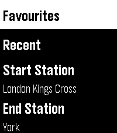</a>

<h2 class="app-name" id="app-c1f17d76aabe41fd9d1060dc"><a href="https://apps.repebble.com/c1f17d76aabe41fd9d1060dc">UK Rail</a></h2>
<a class="app-source" href="https://github.com/benjaminjgill/UKRail" title="Source code" data-search-exclude>View source</a>

by <a href="https://apps.repebble.com/apps/dev/zeroesandones_2e6cca3d47b90f5b14f075bb" title="More from this developer">zeroesandones</a>

No licence v1.23.1 Updated 2026-09-19

Runs on: Round 2, Time 2, Pebble 2 Duo, Pebble 2, Time Round, Time

**New Version - This now works with no requirement to sign up for a National Rail Data account key, you can use the default UK Rail data source provided in settings to retrieve National Rail Data…

<a class="app-shot" href="https://apps.repebble.com/52d3086712ea3dec7e00001b" data-search-exclude>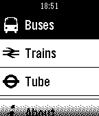</a>

<h2 class="app-name" id="app-52d3086712ea3dec7e00001b"><a href="https://apps.repebble.com/52d3086712ea3dec7e00001b">UK Transport</a></h2>
<a class="app-source" href="http://github.com/smallstoneapps/uk-transport/" title="Source code" data-search-exclude>View source</a>

by <a href="https://apps.repebble.com/apps/dev/matthew-tole_5283d2a9c0b0168bf6000001" title="More from this developer">Matthew Tole</a>

No licence v1.8 Updated 2015-07-27

Runs on: Time 2, Pebble 2 Duo, Pebble 2, Time, Classic

The must have Pebble app for people who use UK public transport. Look up upcoming bus and train departures from your closest stops and stations, and mark your favourites for easy access in the…

<a class="app-shot" href="https://apps.repebble.com/90b69a2d24954ae184433c85" data-search-exclude>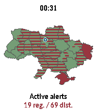</a>

<h2 class="app-name" id="app-90b69a2d24954ae184433c85"><a href="https://apps.repebble.com/90b69a2d24954ae184433c85">Ukraine Alerts</a></h2>
<a class="app-source" href="https://github.com/LittleCrabby/pebble-ukraine-alerts" title="Source code" data-search-exclude>View source</a>

by <a href="https://apps.repebble.com/apps/dev/crabbydev_350fc823f69da343c74a82ac" title="More from this developer">CrabbyDev</a>

GPL-3.0 v1.0.0 Updated 2026-09-12

Runs on: Round 2, Time 2

Ukraine Alerts brings real-time air raid alert monitoring and situational awareness directly to your Pebble smartwatch. Featuring an interactive vector map of Ukraine, the app tracks sirens across…

<a class="app-shot" href="https://apps.repebble.com/074924ee10c84f6bbde78ad3" data-search-exclude>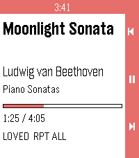</a>

<h2 class="app-name" id="app-074924ee10c84f6bbde78ad3"><a href="https://apps.repebble.com/074924ee10c84f6bbde78ad3">Ultrasonic</a></h2>
<a class="app-source" href="https://github.com/P1R4N351/ultrasonic-for-pebble" title="Source code" data-search-exclude>View source</a>

by <a href="https://apps.repebble.com/apps/dev/pisces_adc4868835dd4511698cd737" title="More from this developer">PiSCES</a>

MPL-2.0 v0.1.1 Updated 2026-09-19

Runs on: Time 2, Pebble 2 Duo

Ultrasonic for Pebble is a wrist-side controller for Ultrasonic, the open-source Subsonic/Navidrome client for Android. It runs on Pebble 2 Duo and Pebble Time 2, and it needs a small companion…

<a class="app-shot" href="https://apps.rebble.io/en_US/application/5864c9fb0e3a494b820002c4" data-search-exclude>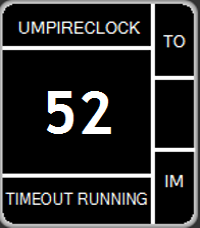</a>

<h2 class="app-name" id="app-5864c9fb0e3a494b820002c4"><a href="https://apps.rebble.io/en_US/application/5864c9fb0e3a494b820002c4">UmpireClock (American Football)</a></h2>
<a class="app-source" href="https://github.com/wiesel81/pebble-umpireclock" title="Source code" data-search-exclude>View source</a>

by <a href="https://apps.rebble.io/en_US/developer/582d964f36ac5a946d000406/1" title="More from this developer">Michael Krenn</a>

Not checked yet v1.3 Updated 2018-04-04 Rebble App Store

Runs on: Round 2, Time 2, Pebble 2 Duo, Pebble 2, Time Round, Time, Classic

Clock for American Football Umpires working as on-field timekeeper based on the NCAA Rules 2016. With this watchapp it is possible to measure the timeouts (even a 30-second timeout) and 1-minute…

<a class="app-shot" href="https://apps.repebble.com/56ad0adf9f30b55594000037" data-search-exclude>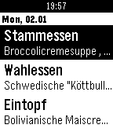</a>

<h2 class="app-name" id="app-56ad0adf9f30b55594000037"><a href="https://apps.repebble.com/56ad0adf9f30b55594000037">Uni Konstanz Mensa</a></h2>
<a class="app-source" href="https://github.com/duerrsimon/konstanz-pebble-mensa/" title="Source code" data-search-exclude>View source</a>

by <a href="https://apps.repebble.com/apps/dev/simon-d-rr_542fa717e47c05228e000029" title="More from this developer">Simon Dürr</a>

Not checked yet v1.0 Updated 2016-01-30

Runs on: Time 2, Pebble 2 Duo, Pebble 2, Time, Classic

App für die Mensa der Universität Konstanz

<a class="app-shot" href="https://apps.repebble.com/51bcf10c57fa407181b80a1f" data-search-exclude>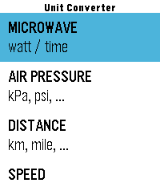</a>

<h2 class="app-name" id="app-51bcf10c57fa407181b80a1f"><a href="https://apps.repebble.com/51bcf10c57fa407181b80a1f">UNIT CONV JP</a></h2>
<a class="app-source" href="https://github.com/tc5206/pebble_UNIT_CONV_JP" title="Source code" data-search-exclude>View source</a>

by <a href="https://apps.repebble.com/apps/dev/tc5206_f10b6e35701081a6841ded3d" title="More from this developer">tc5206</a>

Not checked yet v1.1.0 Updated 2026-08-23

Runs on: Round 2, Time 2, Pebble 2 Duo, Pebble 2, Time Round, Time, Classic

Description: A quick unit conversion app for when pulling out your smartphone feels like too much hassle. Inspired by small personal frustrations—such as &quot;I want to heat up my frozen food faster&quot;…

<a class="app-shot" href="https://apps.repebble.com/564803d3b2013f752b000042" data-search-exclude>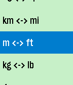</a>

<h2 class="app-name" id="app-564803d3b2013f752b000042"><a href="https://apps.repebble.com/564803d3b2013f752b000042">UnitVersal</a></h2>
<a class="app-source" href="https://github.com/Technicalleigh/unitversal" title="Source code" data-search-exclude>View source</a>

by <a href="https://apps.repebble.com/apps/dev/technicalleigh_531a1ebc7e497544cf00037c" title="More from this developer">Technicalleigh</a>

MIT v1.1 Updated 2015-11-15

Runs on: Round 2, Time 2, Pebble 2 Duo, Pebble 2, Time Round, Time, Classic

UnitVersal converts between common SI (metric) and US units, plus the Celsius and Fahrenheit temperature scales. Just scroll up or down. Select button: Single-click: Switch the unit whose quantity…

<a class="app-shot" href="https://apps.repebble.com/d786a982571341658836baf2" data-search-exclude>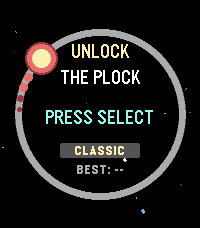</a>

<h2 class="app-name" id="app-d786a982571341658836baf2"><a href="https://apps.repebble.com/d786a982571341658836baf2">UnlockThePlock</a></h2>
<a class="app-source" href="https://github.com/HenryTheAddict/unlockploc" title="Source code" data-search-exclude>View source</a>

by <a href="https://apps.repebble.com/apps/dev/h3nry_66430b30a243d294bd0df8c0" title="More from this developer">h3nry</a>

No licence v1.0 Updated 2026-04-19

Runs on: Round 2, Time 2, Pebble 2 Duo, Pebble 2, Time Round, Time, Classic

A clone of the game &quot;Pop The Lock&quot; For pebbles, this time it&#x27;s kinda more space themed.

<a class="app-shot" href="https://apps.repebble.com/54d96e9e63eb4186fc000048" data-search-exclude>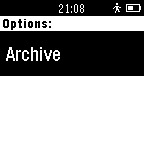</a>

<h2 class="app-name" id="app-54d96e9e63eb4186fc000048"><a href="https://apps.repebble.com/54d96e9e63eb4186fc000048">Unofficial Support for Trello</a></h2>
<a class="app-source" href="https://github.com/clintoncrick/Unofficial-Support-for-Trello" title="Source code" data-search-exclude>View source</a>

by <a href="https://apps.repebble.com/apps/dev/clintoncrick_54cfb2330dcf4512f9000099" title="More from this developer">clintoncrick</a>

Not checked yet v1.4 Updated 2015-12-18

Runs on: Time 2, Pebble 2 Duo, Pebble 2, Time, Classic

&quot;Unofficial Support for Trello&quot; is a Pebble app which allows access to your Trello boards. View boards, lists, and individual cards from your Pebble. Change log: *Version 1.4 (2015-12-17) fixes…

<a class="app-shot" href="https://apps.repebble.com/6a98f3c7039ea900095fe2da" data-search-exclude>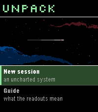</a>

<h2 class="app-name" id="app-6a98f3c7039ea900095fe2da"><a href="https://apps.repebble.com/6a98f3c7039ea900095fe2da">Unpack</a></h2>
<a class="app-source" href="https://github.com/eduardochiaro/unpack-watchapp" title="Source code" data-search-exclude>View source</a>

by <a href="https://apps.repebble.com/apps/dev/ec-apps_6818b3bd53899000082d25a4" title="More from this developer">EC Apps</a>

Not checked yet v1.1.0 Updated 2026-09-03

Runs on: Round 2, Time 2, Pebble 2 Duo, Pebble 2, Time Round, Time

A von Neumann probe game for Pebble. You arrive in an uncharted system with a seed payload and no infrastructure. Unpack yourself into power and extraction, work the bodies you find, and build…

<a class="app-shot" href="https://apps.repebble.com/05578696ebbd4e9b82110fea" data-search-exclude>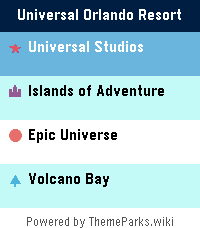</a>

<h2 class="app-name" id="app-05578696ebbd4e9b82110fea"><a href="https://apps.repebble.com/05578696ebbd4e9b82110fea">UOR Queues</a></h2>
<a class="app-source" href="https://github.com/ThemeParks/pebble" title="Source code" data-search-exclude>View source</a>

by <a href="https://apps.repebble.com/apps/dev/jamie-holding_30b1c336b9f7ddf808f16c5f" title="More from this developer">Jamie Holding</a>

MIT v1.4.0 Updated 2026-08-02

Runs on: Round 2, Time 2

Skip the guesswork. UOR Queues brings live Universal Orlando Resort data straight to your Pebble — no phone-fumbling, no app-switching, no squinting at a tiny map. What you get: - Live wait times…

<a class="app-shot" href="https://apps.repebble.com/5468365c32e2d70d26000095" data-search-exclude>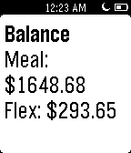</a>

<h2 class="app-name" id="app-5468365c32e2d70d26000095"><a href="https://apps.repebble.com/5468365c32e2d70d26000095">uOttawa Card Manager</a></h2>
<a class="app-source" href="https://github.com/fletchto99/uOttawa-Card-Pebble" title="Source code" data-search-exclude>View source</a>

by <a href="https://apps.repebble.com/apps/dev/matt-langlois_52e30dd32645fb8bae000fcd" title="More from this developer">Matt Langlois</a>

Not checked yet v2.05 Updated 2016-02-16

Runs on: Round 2, Time 2, Pebble 2 Duo, Pebble 2, Time Round, Time, Classic

Allows University of Ottawa students to preform various actions on their uOttawa card. Actions include: - Check Flex &amp; Meal plan balance - Check history of last 10 Meal plan purchases - Check…

<a class="app-shot" href="https://apps.repebble.com/53e809036ce38e36a900017f" data-search-exclude>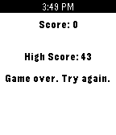</a>

<h2 class="app-name" id="app-53e809036ce38e36a900017f"><a href="https://apps.repebble.com/53e809036ce38e36a900017f">Up Down</a></h2>
<a class="app-source" href="https://github.com/aradreed/up-down" title="Source code" data-search-exclude>View source</a>

by <a href="https://apps.repebble.com/apps/dev/arad-reed_53e7f992a4563aecf1000156" title="More from this developer">Arad Reed</a>

No licence v1.0.0 Updated 2014-08-11

Runs on: Time 2, Pebble 2 Duo, Pebble 2, Time, Classic

Up Down is a simple game that randomly picks a direction, up or down. You must push the corresponding button within the time interval or you lose. If you press the wrong button, you&#x27;ll lose as…

<a class="app-shot" href="https://apps.repebble.com/556c1dc2e42ea416be0000aa" data-search-exclude>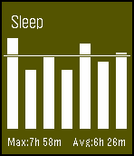</a>

<h2 class="app-name" id="app-556c1dc2e42ea416be0000aa"><a href="https://apps.repebble.com/556c1dc2e42ea416be0000aa">upTempo BETA</a></h2>
<a class="app-source" href="https://github.com/vssh/pebble-upTempo" title="Source code" data-search-exclude>View source</a>

by <a href="https://apps.repebble.com/apps/dev/vssh_54e22b7decca846cee000082" title="More from this developer">vssh</a>

Not checked yet v0.24 Updated 2017-04-24

Runs on: Round 2, Time 2, Pebble 2 Duo, Pebble 2, Time Round, Time, Classic

Activity monitor for Pebble watch. This is a beta app. Please test it and leave feedback. Current features: Activity detection: walk, run, sleep and steps taken. Idle alerts: configurable time…

<a class="app-shot" href="https://apps.repebble.com/539fc03d051716df30000187" data-search-exclude>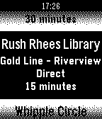</a>

<h2 class="app-name" id="app-539fc03d051716df30000187"><a href="https://apps.repebble.com/539fc03d051716df30000187">UR Buses</a></h2>
<a class="app-source" href="https://github.com/tstein4/urbuses-pebble" title="Source code" data-search-exclude>View source</a>

by <a href="https://apps.repebble.com/apps/dev/tj-stein_52b91beca1d2df1269000037" title="More from this developer">TJ Stein</a>

Not checked yet v2.3 Updated 2014-08-27

Runs on: Time 2, Pebble 2 Duo, Pebble 2, Time, Classic

Get real time arrival estimates on your watch for the University of Rochester bus service. Pick any 5 route and stop combinations to view on your Pebble. Changelog at urbuses.tjstein.me/changelog

<a class="app-shot" href="https://apps.repebble.com/55c93b45a7343b4caf000011" data-search-exclude>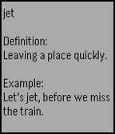</a>

<h2 class="app-name" id="app-55c93b45a7343b4caf000011"><a href="https://apps.repebble.com/55c93b45a7343b4caf000011">Urbble</a></h2>
<a class="app-source" href="https://github.com/berdandy/UrbanPebble" title="Source code" data-search-exclude>View source</a>

by <a href="https://apps.repebble.com/apps/dev/andy-berdan_55c28b5e2903efd82a000030" title="More from this developer">Andy Berdan</a>

No licence v0.1 Updated 2015-08-13

Runs on: Time 2, Pebble 2 Duo, Pebble 2, Time, Classic

Load a random Urban Dictionary definition on your smartwatch. WARNING: Urban Dictionary contains very adult content. There are no filters. You have been warned.

<h2 class="app-name" id="app-55d6340b0756eb050d00002c"><a href="https://apps.repebble.com/55d6340b0756eb050d00002c">URL Launcher</a></h2>
<a class="app-source" href="https://github.com/ahenry91/pebble_url_launcher" title="Source code" data-search-exclude>View source</a>

by <a href="https://apps.repebble.com/apps/dev/andrew-henry_531a25889091c4587400017c" title="More from this developer">Andrew Henry</a>

MIT v1.3 Updated 2016-08-23

Runs on: Round 2, Time 2, Pebble 2 Duo, Pebble 2, Time Round, Time, Classic

Launch actions via URL. No companion app needed. * Long vibrate = Success * Double short vibrate = Error (Error message shown) Add URLs in the app settings and trigger them from your Pebble…

<a class="app-shot" href="https://apps.repebble.com/54d0b0dd699bcefb4f000094" data-search-exclude>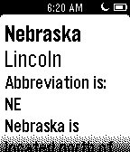</a>

<h2 class="app-name" id="app-54d0b0dd699bcefb4f000094"><a href="https://apps.repebble.com/54d0b0dd699bcefb4f000094">US States</a></h2>
<a class="app-source" href="http://bit.ly/aboutpdl" title="Source code" data-search-exclude>View source</a>

by <a href="https://apps.repebble.com/apps/dev/small-rock-design-labs_54c3a91ca64480370e000062" title="More from this developer">small rock design labs!</a>

See source v1.0 Updated 2015-02-04

Runs on: Time 2, Pebble 2 Duo, Pebble 2, Time, Classic

About: http://bit.ly/aboutpdl ---------- This state app allows you to study the states from your wrist! Simply open the app choose the state to study. ------- Donate: http://bit.ly/statepay

<a class="app-shot" href="https://apps.repebble.com/4cd94d569cf74819a2d66816" data-search-exclude>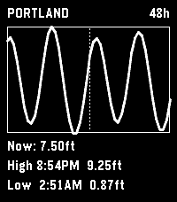</a>

<h2 class="app-name" id="app-4cd94d569cf74819a2d66816"><a href="https://apps.repebble.com/4cd94d569cf74819a2d66816">US Tidemaps</a></h2>
<a class="app-source" href="https://github.com/jashyotes/us-tidemaps" title="Source code" data-search-exclude>View source</a>

by <a href="https://apps.repebble.com/apps/dev/jashyotes_ef13c80cb0a9403c1736ae5c" title="More from this developer">jashyotes</a>

Not checked yet v0.4.0 Updated 2026-07-16

Runs on: Round 2, Time 2, Time Round

# US Tidemaps Standalone Pebble app showing NOAA tide predictions for a user-configured station. Designed for the Pebble Time 2 (emery). 48-hour hourly window centered on &quot;now&quot; (24 past, 24…

<a class="app-shot" href="https://apps.repebble.com/18c2676b7c764b5eb221dc34" data-search-exclude>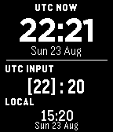</a>

<h2 class="app-name" id="app-18c2676b7c764b5eb221dc34"><a href="https://apps.repebble.com/18c2676b7c764b5eb221dc34">UTC Companion</a></h2>
<a class="app-source" href="https://github.com/tmccormi/pebble-utc" title="Source code" data-search-exclude>View source</a>

by <a href="https://apps.repebble.com/apps/dev/tony-mccormick_616ed675e357fc1f1e38e9c3" title="More from this developer">Tony McCormick</a>

Not checked yet v1.0.0 Updated 2026-08-23

Runs on: Time 2, Pebble 2 Duo, Pebble 2, Time, Classic

UTC Companion puts the current UTC time and a fast UTC-to-local converter on one screen. The upper section shows the current UTC time and date. In the lower section, enter any UTC hour and minute…

<a class="app-shot" href="https://apps.repebble.com/52e7b8ee217dd0e5bc00000f" data-search-exclude>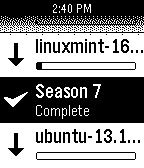</a>

<h2 class="app-name" id="app-52e7b8ee217dd0e5bc00000f"><a href="https://apps.repebble.com/52e7b8ee217dd0e5bc00000f">uTorrent Remote</a></h2>
<a class="app-source" href="https://github.com/jjv360/uTorrent-Pebble" title="Source code" data-search-exclude>View source</a>

by <a href="https://apps.repebble.com/apps/dev/jjv360_52e0dde67487e523520000da" title="More from this developer">jjv360</a>

Not checked yet v1.1.3 Updated 2025-11-25

Runs on: Time 2, Pebble 2 Duo, Pebble 2, Time, Classic

A simple remote control for uTorrent. Features: - List of torrents - View size, speed and ETA - Progress bar to quickly see download progress - Start and stop torrents

<a class="app-shot" href="https://apps.repebble.com/5731e16382fa53acfd000019" data-search-exclude>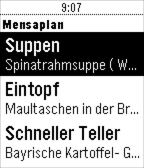</a>

<h2 class="app-name" id="app-5731e16382fa53acfd000019"><a href="https://apps.repebble.com/5731e16382fa53acfd000019">UUlm Mensaplan</a></h2>
<a class="app-source" href="https://github.com/matou/PebbleMensaplanUUlm" title="Source code" data-search-exclude>View source</a>

by <a href="https://apps.repebble.com/apps/dev/matou_53305d39981bcd9580000219" title="More from this developer">matou</a>

Not checked yet v1.6 Updated 2016-06-13

Runs on: Round 2, Time 2, Pebble 2 Duo, Pebble 2, Time Round, Time, Classic

This app can fetch and display the &#x27;Mensaplan&#x27; of Ulm University. It can show the menu of UUlm&#x27;s Mensa, Bistro, Cafeteria Nord, Cafeteria West, Mensa Hochschule, Burgerbar SouthSide, and…

<a class="app-shot" href="https://apps.repebble.com/5610dd7d198996d1bc000076" data-search-exclude>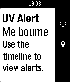</a>

<h2 class="app-name" id="app-5610dd7d198996d1bc000076"><a href="https://apps.repebble.com/5610dd7d198996d1bc000076">UV Alert</a></h2>
<a class="app-source" href="https://github.com/koterpillar/uv-alert" title="Source code" data-search-exclude>View source</a>

by <a href="https://apps.repebble.com/apps/dev/alexey-kotlyarov_558a827fb0279c1c8700008e" title="More from this developer">Alexey Kotlyarov</a>

Not checked yet v1.8 Updated 2016-08-06

Runs on: Round 2, Time 2, Pebble 2 Duo, Pebble 2, Time Round, Time, Classic

Timeline alerts for UV radiation levels in Australia, USA and Japan

<a class="app-shot" href="https://apps.repebble.com/ce83e3b7c2f4491991a5fc19" data-search-exclude>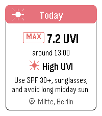</a>

<h2 class="app-name" id="app-ce83e3b7c2f4491991a5fc19"><a href="https://apps.repebble.com/ce83e3b7c2f4491991a5fc19">UV Guard</a></h2>
<a class="app-source" href="https://github.com/ggogel/pebble-uv-guard" title="Source code" data-search-exclude>View source</a>

by <a href="https://apps.repebble.com/apps/dev/ggogel_002394681bf3f1258a2de4b8" title="More from this developer">ggogel</a>

Not checked yet v1.0.1 Updated 2026-07-03

Runs on: Round 2, Time 2, Pebble 2 Duo, Pebble 2, Time Round, Time, Classic

UV Guard helps you know when the sun is worth taking seriously. Get a quick, glanceable UV forecast on your Pebble with the information that actually matters: how strong UV will get, when it…

<a class="app-shot" href="https://apps.repebble.com/541e565b6cd005e3d3000079" data-search-exclude>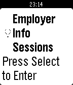</a>

<h2 class="app-name" id="app-541e565b6cd005e3d3000079"><a href="https://apps.repebble.com/541e565b6cd005e3d3000079">UW- Info Session</a></h2>
<a class="app-source" href="https://github.com/shayywun/Pebble--InfoSession-app" title="Source code" data-search-exclude>View source</a>

by <a href="https://apps.repebble.com/apps/dev/oluwaseun-makinde_541d28a8eb3444e5ad000009" title="More from this developer">Oluwaseun Makinde</a>

Not checked yet v1.0 Updated 2014-09-21

Runs on: Time 2, Pebble 2 Duo, Pebble 2, Time, Classic

This app lists all the employer info sessions occurring at the University of Waterloo weekly.

