<!-- Generated by scripts/update_app_directory.py: do not edit by hand -->
# Watchapps: V

[← About this list](../watchapps.md) · [A](a.md) · [B](b.md) · [C](c.md) · [D](d.md) · [E](e.md) · [F](f.md) · [G](g.md) · [H](h.md) · [I](i.md) · [J](j.md) · [K](k.md) · [L](l.md) · [M](m.md) · [N](n.md) · [O](o.md) · [P](p.md) · [Q](q.md) · [R](r.md) · [S](s.md) · [T](t.md) · [U](u.md) · **V** · [W](w.md) · [X](x.md) · [Y](y.md) · [Z](z.md) · [0–9 & other](other.md)

*25 watchapps · Last updated 2026-10-06*

| Screenshot | Name | Developer | Licence | Updated | Description |
|------------|------|-----------|---------|---------|-------------|
| 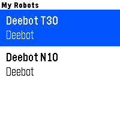{ loading=lazy width="72" } | [Vacuum](https://apps.repebble.com/319084c8494c44ae821ccee9) | [Dzung Nguyen](https://github.com/dungngminh/pebble_vacuum) | <small>Not checked yet</small> | 2026-07-14 | Put your robot vacuum on your wrist. Vacuum connects your Pebble watch to your robot's cloud API, so you can check and control it without reaching for your… |
| 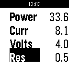{ loading=lazy width="72" } | [Vaper](https://apps.repebble.com/5395ed394b51113c8e00000b) | [Eric Moritz](https://github.com/ericmoritz/pebble-vaper) | <small>Not checked yet</small> | 2014-06-09 | An OHM calculator on your wrist! |
| 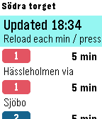{ loading=lazy width="72" } | [VastTid](https://apps.repebble.com/55eb169809fc08b14a000034) | [David Svantesson](https://github.com/davidsvantesson/VastTid) | <small>Not checked yet</small> | 2015-09-05 | Public Transport app for West Sweden transport system (Västtrafik), showing the next departures (bus, tram, train and boats) in real time from the selected… |
| { loading=lazy width="72" } | [VATSIM ATC Viewer](https://apps.repebble.com/544cd3fbb8bf900119000055) | [a_halka](https://github.com/halka/vatsim_atc_for_pebble) | <small>Not checked yet</small> | 2016-03-01 | Just you can check opening ATC stations on VATSIM. This is unofficial application. source code available on github… |
| 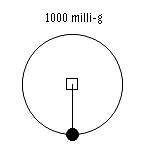{ loading=lazy width="72" } | [Vectorometer](https://apps.rebble.io/en_US/application/67c5321cd2acb30009a3c7e6) <small>Rebble App Store</small> | [mrp](https://codeberg.org/mrp/vectorometer) | <small>See source</small> | 2025-03-08 | Vectorometer is an accelerometer app for Pebble watches. It draws a reaction vector (the opposite direction of the acceleration vector). The line shows the… |
| { loading=lazy width="72" } | [Velo](https://apps.repebble.com/6a9079ee06d133000845328c) | [Caulfield](https://github.com/Schmaxine1024/velo) | <small>Not checked yet</small> | 2026-08-27 | Biking/Cycling Companion for your Pebble, local to your pebble. Download the companion app for your phone and click select to start tracking, currently… |
| 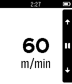{ loading=lazy width="72" } | [Velocimeter](https://apps.repebble.com/550520f5be287a2e0a000085) | [Gianpaulo M. Soares](https://github.com/jampow/Peb-2-3-4) | <small>Not checked yet</small> | 2015-03-15 | It's just like a metronome by vibrations to regular walks. |
| 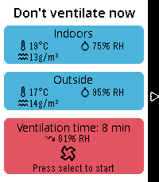{ loading=lazy width="72" } | [Ventilate](https://apps.repebble.com/9a25b4c1c01648f18cb13086) | [Vincent](https://github.com/vincentezw/ventilate-pebble) | <small>Not checked yet</small> | 2026-09-18 | Calculate an optimal time for shock ventilation using sensors from Home Assistant. It calculates absolute humidity, tracks the time on your wrist and gives… |
| 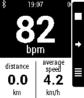{ loading=lazy width="72" } | [Ventoo - GPS sports tracker](https://apps.repebble.com/529289cee07df1fa76000009) | [Pebble Bike](https://github.com/pebble-bike/PebbleBike-AndroidApp) | <small>Not checked yet</small> | 2017-07-22 | (formerly known as Pebble Bike) Ventoo is a GPS sports tracker for your Pebble. It uses your phone's GPS to send speed, distance and altitude data to your… |
| 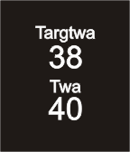{ loading=lazy width="72" } | [Ventus](https://apps.rebble.io/en_US/application/57c055a05e3c3db485000173) <small>Rebble App Store</small> | [Source code](http://www.ventusnavigation.com/Pebble.html) | <small>See source</small> | 2016-08-26 | Pebble Ventus displays navigation data on your Pebble watch received from either Android Ventus PRO or iOS Ventus PRO. |
| 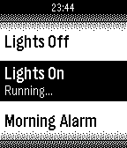{ loading=lazy width="72" } | [Vera Scenes](https://apps.repebble.com/52f47ee73f5d46cf5c00050b) | [PeopleTech](https://github.com/drewying/VeraPebble) | <small>Not checked yet</small> | 2014-02-07 | Control your micasaverde Vera unit from your Pebble Watch! This allows you to browse through all Vera scenes as well as run them. |
| { loading=lazy width="72" } | [Verse](https://apps.repebble.com/934da6babfa94dbcba0fdf14) | [ledenis](https://github.com/ledenis/pebble-verse) | <small>Not checked yet</small> | 2026-08-29 | Simple app to get a verse of the day Powered by ourmanna.com API |
| { loading=lazy width="72" } | [Verse](https://apps.rebble.io/en_US/application/6a8f5f3af97a9e0009cabaec) <small>Rebble App Store</small> | [ledenis](https://github.com/ledenis/pebble-verse) | <small>Not checked yet</small> | 2026-08-29 | Simple app to get a verse of the day Powered by ourmanna.com API |
| { loading=lazy width="72" } | [Vibe Time](https://apps.repebble.com/569e992eeeede1484900003e) | [Michael D. Adams](https://bitbucket.org/adamsmd/vibe-time) | <small>See source</small> | 2016-01-21 | Vibe Time lets you check you watch without looking by vibrating your watch the current hour and minute. Vibe Time sends the vibrations immediately when… |
| 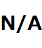{ loading=lazy width="72" } | [vibration watch](https://apps.repebble.com/566565742369a701f7000036) | [appne](https://github.com/appne/vibe_watch) | <small>Not checked yet</small> | 2015-12-07 | This app shows the time by the vibration of up to 8 times. No need to count the vibration and/or to learn the pattern. Short vibration indicates the first… |
| { loading=lazy width="72" } | [Visual Metronome](https://apps.repebble.com/57a3d37b1482cd5d4b00089d) | [Cody](https://github.com/burn123/PebbleMetronome) | <small>Not checked yet</small> | 2017-02-07 | This fantastic metronome allows for simple haptic feedback while you play, removing the need to hear anything. It can now model an older metronome by… |
| 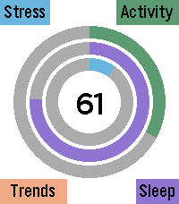{ loading=lazy width="72" } | [VitalGauge](https://apps.repebble.com/11c122085392419b8479ce94) | [Eric McCormick](https://github.com/ericlmccormick/Pebble_Stress_Tracker) | <small>Not checked yet</small> | 2026-07-27 | Main screen provides a history of hear rate Pressing up takes you to a screen for measuring your heart rate and stress level. EKG simulator using your… |
| 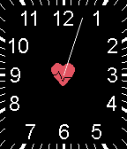{ loading=lazy width="72" } | [Vitals](https://apps.repebble.com/548fd72876c8c324eb000080) | [Bengalbot](https://github.com/carledwards/vitals) | <small>Not checked yet</small> | 2015-11-22 | Vitals is a Timer/Watchface Pebble App assisting Nurses in measuring the heart rate of their patients. When you start to measure the patient's heart rate… |
| 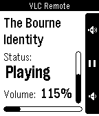{ loading=lazy width="72" } | [VLC Remote](https://apps.repebble.com/52960f40bcd790ff41000007) | [Neal Patel](https://github.com/Neal/pebble-vlc-remote) | <small>Not checked yet</small> | 2013-12-14 | This app has been merged with Skipstone and is no longer maintained. Please use Skipstone instead. --------- A remote control watch app for VLC Media Player… |
| 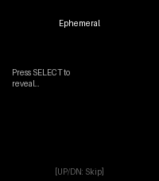{ loading=lazy width="72" } | [Vocab Learner](https://apps.rebble.io/en_US/application/6a38d2e88ba8e5000adbc6be) <small>Rebble App Store</small> | [Mo](https://github.com/Seifollahi/pebble-vocab-learner) | <small>Not checked yet</small> | 2026-07-14 | ## Features - **Ultra-Minimalist UI**: Designed with a pure OLED-friendly black background. Distractions are removed so 55% of the screen is dedicated… |
| 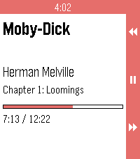{ loading=lazy width="72" } | [Voice](https://apps.repebble.com/f1c75a4109aa488eab95f6da) | [PiSCES](https://github.com/P1R4N351/voice-for-pebble) | <small>Not checked yet</small> | 2026-09-19 | Voice for Pebble controls an Android audiobook player from the wrist. One watchapp drives two players: Voice, the open-source audiobook player, and Audible… |
| 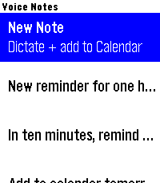{ loading=lazy width="72" } | [Voice Notes (with calendar)](https://apps.repebble.com/042ca18f3372422d9e07a406) | [dhrme](https://github.com/dhrme/pebble-apps/tree/main) | <small>Not checked yet</small> | 2026-06-26 | Speak a note, save a note, optionally get a calendar event. Dictate a quick note on your wrist and it lands in your Google Calendar — with the date and time… |
| 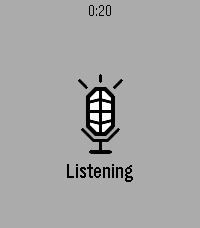{ loading=lazy width="72" } | [Voice Relay](https://apps.repebble.com/4e5ef67664e84cb49c9025d9) | [Maxim Lepekha](https://github.com/maxmaxme/pebble-voice-relay) | <small>Not checked yet</small> | 2026-09-12 | Dictate on your wrist, relay to your own endpoint |
| 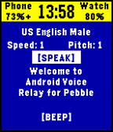{ loading=lazy width="72" } | [Voice 🎤 Relay](https://apps.repebble.com/56e46269b7a6019d4700001c) | [robisodd](https://github.com/robisodd/VoiceRelay) | <small>Not checked yet</small> | 2016-03-12 | Allows you to remotely make your phone talk or make BEEP noises. Good for a phone finder or phone locator to find your phone find phone or scare your dog… |
| 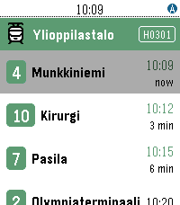{ loading=lazy width="72" } | [Vuoro](https://apps.repebble.com/579e0b101482cd0515000491) | [Roni Helppi](https://github.com/ronijaakkola/trebble) | <small>Not checked yet</small> | 2026-07-07 | Vuoro finds the nearest public transport stops in Finland using your phone's GPS and shows the next departing lines with real-time predictions. Pin your… |
