<!-- Generated by scripts/update_app_directory.py: do not edit by hand -->
# Watchapps: W

[← About this list](../watchapps.md) · [A](a.md) · [B](b.md) · [C](c.md) · [D](d.md) · [E](e.md) · [F](f.md) · [G](g.md) · [H](h.md) · [I](i.md) · [J](j.md) · [K](k.md) · [L](l.md) · [M](m.md) · [N](n.md) · [O](o.md) · [P](p.md) · [Q](q.md) · [R](r.md) · [S](s.md) · [T](t.md) · [U](u.md) · [V](v.md) · **W** · [X](x.md) · [Y](y.md) · [Z](z.md) · [0–9 & other](other.md)

*72 watchapps · Last updated 2026-10-06*

| Screenshot | Name | Developer | Licence | Updated | Description |
|------------|------|-----------|---------|---------|-------------|
| 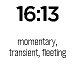{ loading=lazy width="72" } | [W&L: Vocabulary](https://apps.repebble.com/5344d1cd40f5878be800019e) | [PebbLiz Technologies](https://github.com/pouves/Watch_and_Learn_Vocabulary) | <small>Not checked yet</small> | 2014-04-09 | Watch & Learn Flashcards show vocabulary words. Want to add your own content? Website linked below includes easy-to-follow directions! A flick of the wrist… |
| 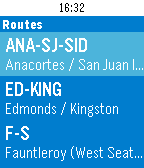{ loading=lazy width="72" } | [WA Ferries](https://apps.repebble.com/57091fd38448d8e6e4000026) | [Rogoon](https://github.com/Rogoon/WAFerriesPebble) | <small>Not checked yet</small> | 2019-07-24 | Get departure times for all Washington State ferries on your Pebble. Check real-time alerts. Pin times to your timeline so you never forget! This app… |
| 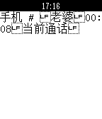{ loading=lazy width="72" } | [Wachatpebble](https://apps.repebble.com/533227ae326898b7df000025) | [yunshansimon](https://github.com/yunshansimon/pebble-notifier-international.git) | <small>Not checked yet</small> | 2014-03-26 | This pebble-app is rewritten by Yang Tsao according to the source code by Tiago R. Espinha , compatible with pebble2.0. Because of using same UUID, you can… |
| 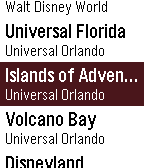{ loading=lazy width="72" } | [Wait Times](https://apps.repebble.com/60cdd1811342ae86c897beab) | [Thomas Stoeckert](https://github.com/thomasstoeckert/waittimes) | <small>Not checked yet</small> | 2025-09-07 | A pebble watchapp to conveniently organize the live wait-time information for attractions at various theme parks around the world - including those at Walt… |
| 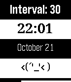{ loading=lazy width="72" } | [Wake Me Up](https://apps.repebble.com/544788d2ca36fba9ec00003d) | [Gavin Zhang](https://github.com/gavinz0228/WakeUp-pebble-watchapp) | <small>Not checked yet</small> | 2014-10-23 | It's an app that can wake you up by its vibration. The interval of its vibration can be customized. By clicking 'UP' or ‘Down’, you can adjust the vibrating… |
| 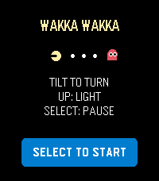{ loading=lazy width="72" } | [Wakka Wakka](https://apps.repebble.com/d7730c67fb89412e9c655cfd) | [howardpchen](https://github.com/howardpchen/wakka-wakka) | <small>Not checked yet</small> | 2026-07-29 | Wakka Wakka is a compact maze-chase game designed for Pebble Time 2. Guide a quick golden runner through a scrolling stage by tilting your wrist. Clear… |
| 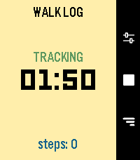{ loading=lazy width="72" } | [Walk Log](https://apps.repebble.com/69a412a94c5ae70009a92597) | [EC Apps](https://github.com/eduardochiaro/walk-log) | <small>Not checked yet</small> | 2026-05-23 | Walk Log is a Pebble application that tracks the time and steps taken during your walks. Your walk history is stored in the logs view, where you can review… |
| 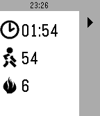{ loading=lazy width="72" } | [Walkr](https://apps.repebble.com/571a98266495d4757a00001a) | [Brian Schau](https://github.com/bschau/Walkr) | <small>Not checked yet</small> | 2016-04-27 | Walkr tracks your steps taken and calories burned during a training lap. Walkr uses the built-in health kit in your Pebble. When launched Walkr will show… |
| 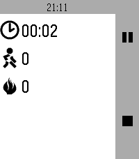{ loading=lazy width="72" } | [Walkr](https://apps.rebble.io/en_US/application/58f7b7576ca387fc520012a8) <small>Rebble App Store</small> | [Brian Schau](https://github.com/bschau/Portfolio/tree/main/pebble/Walkr) | <small>Not checked yet</small> | 2017-04-19 | Record steps taken and calories burned. |
| 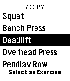{ loading=lazy width="72" } | [Warmup Sets](https://apps.repebble.com/573273836dfc301c9d000002) | [thomasfiveash](https://github.com/thomasfiveash/PebbleWarmupSets) | <small>Not checked yet</small> | 2021-12-05 | **New Feature** With the release of 2.0 I have added the ability to specify the warmup set multipliers! This means that for each exercise you can say… |
| 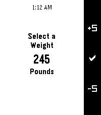{ loading=lazy width="72" } | [Warmup Sets 2](https://apps.rebble.io/en_US/application/58b3588e0dfc32a52a00016a) <small>Rebble App Store</small> | [thomasfiveash](https://github.com/t0mf/PebbleWarmupSetsV2) | <small>Not checked yet</small> | 2021-12-05 | Warmup Sets 2 is the watch app to have while you're in the gym! The goal is to help you determine the sets you should do for your warmup while also… |
| 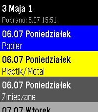{ loading=lazy width="72" } | [WasteWatch](https://apps.repebble.com/7116d162b29041aa94e40542) | [Piotr Serafin](https://github.com/piotrserafin/WasteWatch) | <small>Not checked yet</small> | 2026-07-05 | Personal app to check my waste collection schedule without pulling out the phone. Shows upcoming dates with color-coded waste types (Bio, Paper, Plastics… |
| 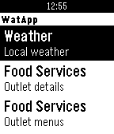{ loading=lazy width="72" } | [WatApp](https://apps.repebble.com/55da162a264607d00d000021) | [MRahman](https://github.com/MunazR/WatApp) | <small>Not checked yet</small> | 2016-03-22 | WatApp uses the University of Waterloo Open Data API to display information on your wrist. It includes the following; ~ Weather - Displays the University… |
| 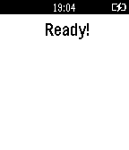{ loading=lazy width="72" } | [watchbot](https://apps.repebble.com/52b11885b0661fb292000004) | [HybridGroup](https://github.com/hybridgroup/watchbot) | <small>Not checked yet</small> | 2015-06-02 | Pebble watch app to control robots using Artoo, Cylon.js, or Gobot frameworks |
| 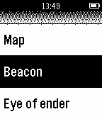{ loading=lazy width="72" } | [WatchCraft](https://apps.repebble.com/55cf773067907b4aa200002a) | [Frosted Torus](https://github.com/Frosted-Torus/WatchCraft) | <small>No licence</small> | 2015-12-22 | Get Minecraft crafting recipes on your watch! The menus make it simple to find recipes. The key makes it easy to understand the recipes. This is still buggy… |
| 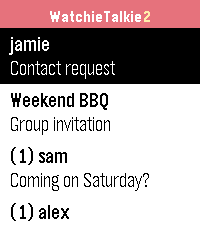{ loading=lazy width="72" } | [WatchieTalkie2](https://apps.repebble.com/5baaf5505dcf4454bdab0478) | [sgitaize](https://github.com/sgitaize/Pebble-WatchieTalkie) | <small>Not checked yet</small> | 2026-10-04 | Walkie-talkie for your Pebble – with text. Pick a friend, press SELECT, speak: your words arrive as a text message on their watch. End-to-end encrypted… |
| 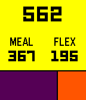{ loading=lazy width="72" } | [WatMoney](https://apps.repebble.com/56f4bd20a16b34e00c000036) | [Andrei Ciubotariu](https://github.com/andreiciubotariu/watmoney) | <small>Not checked yet</small> | 2016-09-01 | View your University of Waterloo WatCard balance from your wrist. Total at the top, broken down into meal and flex balances below. Not affiliated with the… |
| 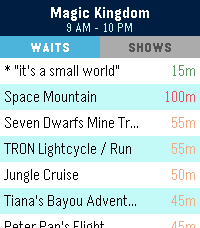{ loading=lazy width="72" } | [WDW Queues](https://apps.repebble.com/00ae673262094c56bd404d14) | [Jamie Holding](https://github.com/ThemeParks/pebble) | <small>Not checked yet</small> | 2026-08-02 | Skip the guesswork. WDW Queues brings live Walt Disney World data straight to your Pebble — no phone-fumbling, no app-switching, no squinting at a tiny map… |
| 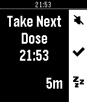{ loading=lazy width="72" } | [Wean](https://apps.rebble.io/en_US/application/62572dfbf13e3000e1c60301) <small>Rebble App Store</small> | [david.s.svedberg@gmail.com](https://github.com/david-s-svedberg/pebble-nicotine) | <small>Not checked yet</small> | 2022-04-13 | Nicotine is an alarm app for spacing out (and hopefully decreasing) the intake of nicotine or other substances. |
| 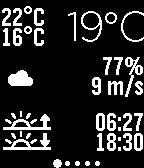{ loading=lazy width="72" } | [Weather Graph](https://apps.repebble.com/56b15425000ea69de500003b) | [Christophe Jeannette](https://github.com/Sichroteph/Weather-Graph) | <small>Not checked yet</small> | 2026-01-14 | Display a graph for the upcoming 24 hours, showing details on temperature, rain precipitation, and wind speed. The interface consists of 7 screens, starting… |
| 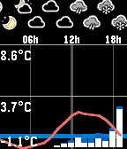{ loading=lazy width="72" } | [Weather-O-Graph](https://apps.repebble.com/56c241cb919c5a40fd000034) | [Andrej Krutak](https://github.com/andree182/pebble-weatherograph) | <small>Not checked yet</small> | 2026-06-23 | This app displays current weather forecast in a graph form, from one of the following services: * yr.no (probably most of the world) * aladin (Czech… |
| 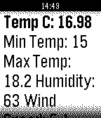{ loading=lazy width="72" } | [WeatherRequest](https://apps.repebble.com/541edbe104629f7ba7000025) | [CodeLuca](http://www.github.com/codeluca/weatherrequest/) | <small>No licence</small> | 2014-09-21 | Weather Request is a detailed weather app which shows you more than just the temperature. |
| { loading=lazy width="72" } | [webmon](https://apps.repebble.com/554627a6ab49e41f8f00004b) | [Aravinda](https://github.com/aravindavk/webmon) | <small>Not checked yet</small> | 2015-05-31 | Pebble Timeline app for Websites Health monitoring. Open APP CONFIG and add URL you want to Track. Thats it. A Cron runs every one hour in App server, sends… |
| 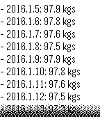{ loading=lazy width="72" } | [WeightTracker](https://apps.repebble.com/54c1918d146d67002f000096) | [Viktor](https://github.com/vcsala/weighttracker.git) | <small>Not checked yet</small> | 2019-07-24 | Simple, standalone pebble app to record, monitor and track weight loss (or gain) in the last 14 days period. Supports daily reminders and timeline pins… |
| 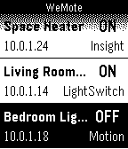{ loading=lazy width="72" } | [WeMote](https://apps.repebble.com/52fcf2182ace7a838f000123) | [Neal Patel](https://github.com/Neal/WeMote) | <small>Not checked yet</small> | 2014-02-17 | A remote app to flip your WeMo switches from your wrist. Works with all WeMo products. WeMote requires the Ouimeaux REST API running on a computer on the… |
| { loading=lazy width="72" } | [Western Ideals](https://apps.rebble.io/en_US/application/62b3e47098768d000911de59) <small>Rebble App Store</small> | [gameblabla](https://github.com/gameblabla/western_ideals) | <small>Not checked yet</small> | 2022-06-23 | Go on a fantastic journey with Bakaka, your trusty friend ! Witness dramatic events and chat with your friend ! |
| 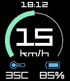{ loading=lazy width="72" } | [WheelLog](https://apps.repebble.com/5793c91150c75291fa00026e) | [Kevin Cooper](https://github.com/JumpMaster/WheelLogPebble) | <small>No licence</small> | 2016-10-06 | A Dashboard for KingSong and Gotway electric unicycles. |
| 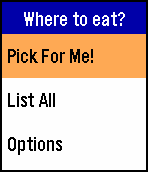{ loading=lazy width="72" } | [Where to Eat](https://apps.repebble.com/55dd6d104374cb930300000d) | [pychen0918](https://github.com/pychen0918/pebble-where-to-eat) | <small>Not checked yet</small> | 2015-10-27 | NEW v1.1 release! Supports Pebble Time Round and more features! Cannot decide where to eat? This app discovers nearby restaurants, and picks one for you!… |
| 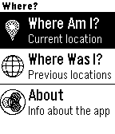{ loading=lazy width="72" } | [Where?](https://apps.repebble.com/545e9082a9ec3be830000006) | [Tony Erwin](https://github.com/aerwin/bluemix-where-pebble) | <small>Not checked yet</small> | 2014-12-31 | Get the nearest address based on your GPS location, and access a history of your 10 past positions. The app is real, but intended to demo how a backend… |
| 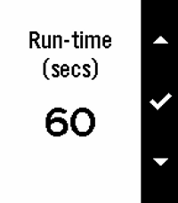{ loading=lazy width="72" } | [Whip](https://apps.rebble.io/en_US/application/59fa25710dfc323e11002d46) <small>Rebble App Store</small> | [Brian Schau](https://github.com/bschau/Portfolio/tree/main/pebble/Whip) | <small>Not checked yet</small> | 2017-11-01 | If you need to start running f.ex. to help accelerate a weight-loss, Whip may be just what you need. In Whip you set for how long to run and walk and the… |
| 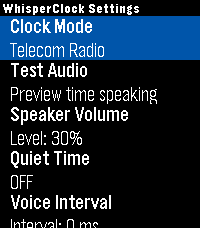{ loading=lazy width="72" } | [WhisperClock](https://apps.repebble.com/5b885cbac419464b82c27e75) | [J_B](https://github.com/JunderscoreB/whisperclock) | MIT | 2026-07-16 | Timekeeping should be accessible to everyone, in any situation. WhisperClock is a discrete, audio-first utility designed exclusively for the Pebble Time 2… |
| 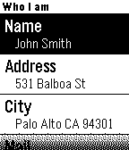{ loading=lazy width="72" } | [Who I am for Pebble](https://apps.rebble.io/en_US/application/53e53cfad9e891f46e000179) <small>Rebble App Store</small> | [expositomarc](https://github.com/expositomarc/Who-I-am-for-Pebble) | <small>Not checked yet</small> | 2014-08-30 | Identify your Pebble as it was your ID. Fill out all the fields using the iOS app and press synchronize to send your info to your Pebble. Don't be afraid of… |
| { loading=lazy width="72" } | [Who's In Space?](https://apps.repebble.com/5307eed3ab1ae26bc700006c) | [Cameron Bernhardt](https://github.com/AstronomyiPhone/PebbleAstronauts) | <small>No licence</small> | 2014-07-13 | Quickly find out who's currently in space and their dwellings. Data is provided by the Open Notify API, which licensed under the Creative Commons… |
| 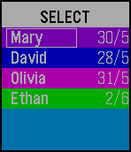{ loading=lazy width="72" } | [Who's Next](https://apps.repebble.com/556bc45b480902c4b500008b) | [jas-b](http://github.com/jas-b/Whos_Next) | MIT | 2016-01-23 | A simple app to keep track of whose turn it is next. Tracks up to six names. Hold down the select button to change modes, press to perform the selected… |
| 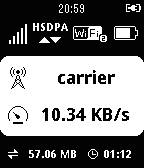{ loading=lazy width="72" } | [wifi status](https://apps.repebble.com/543e6f8f6fbfc12dcd00009c) | [noondaymoon](https://github.com/noondaymoon/e585) | <small>Not checked yet</small> | 2016-10-17 | display mobile rooter status for huawei e585 (myfi) and hw-01c, gl10p it can display: ・signal level ・network type ・connecting device number ・battery level… |
| { loading=lazy width="72" } | [Wikipedia](https://apps.repebble.com/56529432d2d67dc49100001f) | [Kyle H.](http://git.io/wikipedia) | <small>See source</small> | 2016-06-08 | Search Wikipedia from your Pebble! You can now search Wikipedia using the microphone on your Pebble Time or find articles based on your current location or… |
| { loading=lazy width="72" } | [Wikipedia Nearby](https://apps.repebble.com/5597b314b8e7d1d93200001d) | [Prateek Saxena](https://github.com/prtksxna/pebble-nearby) | <small>Not checked yet</small> | 2015-07-04 | Find interesting places around you by looking for Wikipedia articles near your current location. Note: Wikipedia Wordmark is a trademark of the Wikimedia… |
| 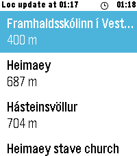{ loading=lazy width="72" } | [WikiRadar](https://apps.repebble.com/61288080085549ccb302c108) | [Daniel E V](https://github.com/danieleldjarn/WikiRadar) | <small>Not checked yet</small> | 2026-07-10 | WikiRadar shows you Wikipedia articles about the places around you. SCAN — a list of nearby articles with distances, refreshed automatically as you move… |
| 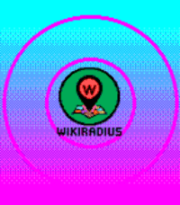{ loading=lazy width="72" } | [WikiRadius](https://apps.repebble.com/9b37bbba750e4a5e96da4d78) | [atomlabor](https://github.com/atomlabor/WikiRadius) | <small>Not checked yet</small> | 2026-04-25 | Whether you are a tourist in a new city or a local history enthusiast, WikiRadius turns a simple walk into an educational journey. |
| 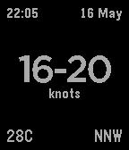{ loading=lazy width="72" } | [Wind Watch](https://apps.repebble.com/5557a371809acd83c1000019) | [John O'Nolan](https://github.com/JohnONolan/windwatch) | <small>No licence</small> | 2015-05-16 | Wind Watch is a very simple app which provides live streaming data from the Kiteboarding Club El Gouna weather station in Egypt. |
| 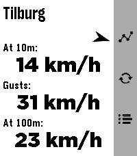{ loading=lazy width="72" } | [WindSock](https://apps.repebble.com/bef46f4d7aba46eaa0628ebf) | [Moaske](https://github.com/Moaske/PebbleWindsock) | <small>Not checked yet</small> | 2026-08-12 | WindSock is a basic location based wind Forecast app that I made mainly for my drone flying. But I'd imagine it being useful for many outdoor activities 🚁⛵😎… |
| 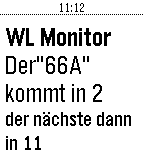{ loading=lazy width="72" } | [WLmonitor](https://apps.repebble.com/575a87b53d02b16e2c000016) | [BlackDev](https://github.com/boggyjoe/PebbleTimeWL_API) | <small>Not checked yet</small> | 2016-06-10 | App zeigt die kommenden beiden Abfahrten der Wiener Linien Bus: 66A in der Station Alterlaa Richtung Reumannplatz an. Weitere Entwicklungen kommen. |
| { loading=lazy width="72" } | [WMATA Times](https://apps.repebble.com/67cde4b6d2acb303aedd4aa8) | [Jacob Latonis](https://github.com/latonis/wmata-timetables) | <small>Not checked yet</small> | 2025-03-09 | View real-time WMATA prediction times for trains. |
| 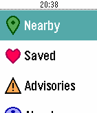{ loading=lazy width="72" } | [WMATA With You](https://apps.repebble.com/5404f8e0ec33d19e2200008b) | [ZeroUptime](https://github.com/aelindeman/wmata-with-you) | <small>Not checked yet</small> | 2017-01-13 | Washington, D.C. Metrobus & Metrorail schedules on your wrist! View incoming buses and trains for stations and stops near your location, and check network… |
| 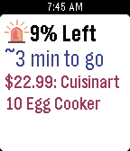{ loading=lazy width="72" } | [WootCrap](https://apps.repebble.com/56a2cb2955a5564cb3000004) | [Jessica Yeh](https://github.com/JessicaYeh/WootCrap) | <small>No licence</small> | 2016-11-01 | Are you tired of missing out on Bags of Crap? With WootCrap, your house will soon be filled with cheap crap! During one of Woot’s famous Woot-Offs, just… |
| 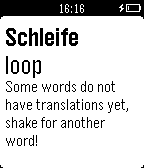{ loading=lazy width="72" } | [Word Shake](https://apps.rebble.io/en_US/application/547e7f9ec252df95770000c6) <small>Rebble App Store</small> | [Jake Schultz](https://github.com/iamjake648/wordshake_pebble) | <small>Not checked yet</small> | 2014-12-06 | Word Shake for Pebble is a great app to quickly learn new vocab in new languages! Simply shake your pebble to see a brand new word! Over 4,000 words to… |
| 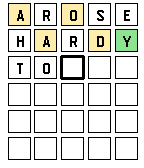{ loading=lazy width="72" } | [Wordle](https://apps.rebble.io/en_US/application/622e0e5a4a1ad20009ffd783) <small>Rebble App Store</small> | [Willow Systems](https://github.com/Willow-Systems/wordle-for-pebble) | <small>Not checked yet</small> | 2022-03-16 | It's Wordle on your wrist! (But totally unofficial) This clone of the popular game Wordle lets you play with the same word as the real thing, but on your… |
| 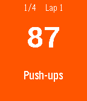{ loading=lazy width="72" } | [Work Out](https://apps.repebble.com/55243c3fc190e01045000062) | [Samuel](https://github.com/samuelmr/pebble-workout) | <small>Not checked yet</small> | 2016-10-28 | A work out timer. Work out for 90 seconds, rest for 30 seconds. Repeat. Vibrations every 30 seconds. Customize your own workout routines and times. |
| 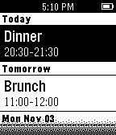{ loading=lazy width="72" } | [Workmate](https://apps.repebble.com/5455d6147871924620000045) | [Keanu Lee](https://github.com/keanulee/workmate) | <small>Not checked yet</small> | 2015-03-30 | Workmate lets you preview and manage Gmail messages, see your Google Calendar events, and manage your Google Tasks. |
| 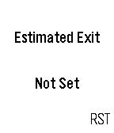{ loading=lazy width="72" } | [WorkTime](https://apps.repebble.com/571ff77ac46a52b6e9000006) | [dega1999](https://github.com/crazycoder1999/worktime) | <small>Not checked yet</small> | 2016-06-26 | Do you want to be alerted when you can leave the office? Just 3 screens and you are done! I did it in my spare time.. nothing professional, just for fun! |
| 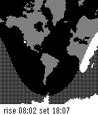{ loading=lazy width="72" } | [World Map](https://apps.repebble.com/52cce846d4686c0945000043) | [Tom Yedwab](https://github.com/tomyedwab/pebble-worldmap) | <small>Not checked yet</small> | 2014-01-26 | A day/night map of the world showing a user-defined location and approximate sunrise/sunset times for that location. |
| 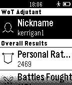{ loading=lazy width="72" } | [WoT Adjutant](https://apps.repebble.com/546e1e2813159fbb420000bb) | [Alexander Kropochev](https://github.com/kropochev/WoT-Adjutant) | <small>Not checked yet</small> | 2025-11-25 | Watch your achievements the game World of Tanks with Pebble |
| { loading=lazy width="72" } | [Wrastle](https://apps.repebble.com/57bbb7b5bb85edbc76000b33) | [Sirfry](https://github.com/nategraf/wrastle) | <small>Not checked yet</small> | 2016-08-26 | An arm wrestling referee, score keeper and excuse to challenge your friends! Download this app if you ever arm wrestle so many people that you lose track of… |
| 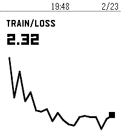{ loading=lazy width="72" } | [Wrist & Biases](https://apps.repebble.com/695542edce101c00098adc05) | [Ilia Breitburg](https://github.com/breitburg/wrist-and-biases) | <small>Not checked yet</small> | 2026-02-09 | Monitor your Weights & Biases ML training runs from your Pebble smartwatch. |
| { loading=lazy width="72" } | [Wrist AI](https://apps.repebble.com/7ee7208cdc8c49a280326abd) | [Asterwyn](https://github.com/deusaw/Pebble-Wrist-AI) | <small>Not checked yet</small> | 2026-07-27 | Wrist AI — A Flexible LLM Client for Pebble Wrist AI lets you talk to any Large Language Model directly from your Pebble watch. Speak your question, get a… |
| 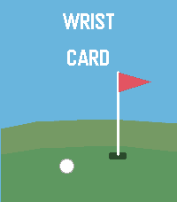{ loading=lazy width="72" } | [Wrist Card](https://apps.repebble.com/a280906f118d4b00a09c4998) | [Brad Taylor](https://github.com/taylorbradn/wrist-card-pebble-watch) | <small>Not checked yet</small> | 2026-06-16 | Keep score on the course without breaking your rhythm. Wrist Card is a minimalist golf scorecard for your wrist - track strokes, putts, and penalties hole… |
| 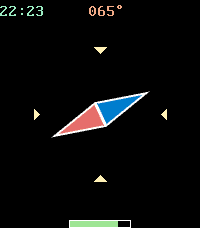{ loading=lazy width="72" } | [Wrist Compass](https://apps.rebble.io/en_US/application/58a14b0b0dfc32b76100021d) <small>Rebble App Store</small> | [Ivan Gorinov](https://github.com/igorinov/pebble_wrist_compass) | <small>Not checked yet</small> | 2017-02-27 | Compass with needle and digital indicators |
| 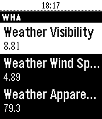{ loading=lazy width="72" } | [Wrist Home Assistant](https://apps.repebble.com/57759f9aba2fe5d0c60005b5) | [texnofobix](https://github.com/texnofobix/WristHomeAssistant) | <small>Not checked yet</small> | 2016-10-12 | Connects to your Home-Assistant (home-assistant.io) instance. Can control lights and switches at this time. |
| { loading=lazy width="72" } | [Wrist HQ](https://apps.repebble.com/54091610954a631487000078) | [Haifisch](https://github.com/Haifisch/WristHQ) | <small>No licence</small> | 2014-09-05 | Using WristHQ, and a Pinoccio microcontroller, you can easily connect two pieces of startup hardware together. Using the Pebble, you can modify most of the… |
| { loading=lazy width="72" } | [Wrist Key](https://apps.repebble.com/8f87be4ef19641069bd66359) | [AIR](https://github.com/PkAIR/wrist-key) | <small>Not checked yet</small> | 2026-08-15 | Control your WiFi-enabled Nuki Smart Lock straight from your Pebble watch. List your locks and open, unlock or lock the door without reaching for your phone. |
| { loading=lazy width="72" } | [Wrist Key](https://apps.rebble.io/en_US/application/6a47e170626c0700099f5faa) <small>Rebble App Store</small> | [AIR](https://github.com/PkAIR/wrist-key) | <small>Not checked yet</small> | 2026-08-15 | Control your WiFi-enabled Nuki Smart Lock straight from your Pebble watch. List your locks and open, unlock or lock the door without reaching for your phone. |
| { loading=lazy width="72" } | [Wrist Light](https://apps.rebble.io/en_US/application/69065ea495dc89000831c084) <small>Rebble App Store</small> | [t-lo](https://github.com/t-lo/pebble-wristlight) | <small>Not checked yet</small> | 2025-11-01 | Very basic wrist light app for pebble. Turn your pebble into a wrist light at the press of a button. This app is open source. Please report issues and feel… |
| { loading=lazy width="72" } | [Wrist Steam](https://apps.repebble.com/56b91139226cb174f8000032) | [Hull Softworks (Austin Hull)](https://www.github.com/AustinHull/SteamPebble) | <small>Not checked yet</small> | 2017-05-14 | Wrist Steam is a free, open-source application built to help bridge the gap between Pebble users and their Steam profiles. In development since mid-2014… |
| { loading=lazy width="72" } | [Wristcards](https://apps.repebble.com/6aae5837cf733a0009498c16) | [EC Apps](https://github.com/eduardochiaro/wristcards) | <small>Not checked yet</small> | 2026-09-19 | One Pebble watchapp for vocabulary drills, with the deck chosen on the phone. Dutch, French, German, Italian and Spanish are ready-made; any text file of… |
| { loading=lazy width="72" } | [Wristcord](https://apps.repebble.com/c61d68498f25458ebc9a2ec6) | [dotJustin](https://github.com/dot-Justin/Wristcord) | <small>Not checked yet</small> | 2026-06-08 | Discord on your wrist! Browse your servers, follow chats, and send a reply with your voice, right from Pebble Time 2. Heads up, Wristcord is a selfbot; by… |
| { loading=lazy width="72" } | [WristList (Index 01 for your watch!)](https://apps.repebble.com/d274e5b6487946bf915b7810) | [zeroesandones](https://github.com/benjaminjgill/WristList) | <small>Not checked yet</small> | 2026-10-04 | Pebble Index for your watch. This app allows you to dictate a message on your watch and publish the dictation to a CalDav server (Nextcloud/Ownecloud etc.)… |
| { loading=lazy width="72" } | [Wristotle](https://apps.repebble.com/6a0e71faced0bb000943bc90) | [lazydevs](https://codeberg.org/wristotle/wristotle) | <small>See source</small> | 2026-09-10 | Wristotle turns your Pebble's dictation button into a voice command surface. Press the button, speak, and the Wristotle companion app on your Android phone… |
| { loading=lazy width="72" } | [WunderPebble](https://apps.repebble.com/54aabf29ef47e1e246000072) | [Jahdai Cintron](https://github.com/jahdaic/WunderPebbleJS) | <small>Not checked yet</small> | 2016-07-07 | An elegant and feature-filled Wunderlist client for your Pebble. View Lists and mark Tasks complete right on your wrist. I'm constantly adding new features… |
| { loading=lazy width="72" } | [WunderVoice](https://apps.repebble.com/56674eb653e474310100000f) | [Scrabosoft](https://github.com/alirawashdeh/wundervoice) | <small>Not checked yet</small> | 2025-11-25 | Quickly add tasks to Wunderlist using your Pebble Time. Opening WunderVoice starts the microphone on your Pebble Time so you can quickly and easily dictate… |
| { loading=lazy width="72" } | [WWatch](https://apps.repebble.com/55f3346c1e9927da45000015) | [chuckwired](https://github.com/chuckwired/WWatch) | <small>Not checked yet</small> | 2015-09-11 | Essential stopwatch to keep track of your workout session! Start, stop and resume a session and review up to 5 previous sessions. Stopwatch only goes up to… |
| { loading=lazy width="72" } | [wwTimer](https://apps.repebble.com/56845ff6b35693bfc400004e) | [Brian Schau](http://www.github.com/bschau) | <small>See source</small> | 2015-12-30 | This is a combi app containing a simple egg-timer and a stopwatch. The stopwatch allows for checkpointing. |
| { loading=lazy width="72" } | [Wyze Control](https://apps.repebble.com/05b16db5ea9949bbbabe972f) | [ClickCalickClick (Touchy Weather)](https://github.com/ClickCalickClick/Wyze-Control-for-Pebble) | <small>No licence</small> | 2026-06-17 | # Wyze Control for Pebble - Application Description ## A complete Wyze control center, built for Pebble **Wyze Control for Pebble** turns your smartwatch… |
