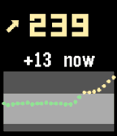

<!-- Generated by scripts/update_app_directory.py: do not edit by hand -->
# Watchapps: X

[← About this list](../watchapps.md) · [A](a.md) · [B](b.md) · [C](c.md) · [D](d.md) · [E](e.md) · [F](f.md) · [G](g.md) · [H](h.md) · [I](i.md) · [J](j.md) · [K](k.md) · [L](l.md) · [M](m.md) · [N](n.md) · [O](o.md) · [P](p.md) · [Q](q.md) · [R](r.md) · [S](s.md) · [T](t.md) · [U](u.md) · [V](v.md) · [W](w.md) · **X** · [Y](y.md) · [Z](z.md) · [0–9 & other](other.md)

*5 watchapps · Last updated 2026-10-06*

| Screenshot | Name | Developer | Licence | Updated | Description |
|------------|------|-----------|---------|---------|-------------|
| { loading=lazy width="72" } | [XCTimer](https://apps.repebble.com/62cdbbd1f0886b0009c74042) | [Clayton Does Things](https://github.com/clay53/PebbleXCTimer) | <small>Not checked yet</small> | 2023-01-06 | A repeating timer and stopwatch for XC and track. |
| { loading=lazy width="72" } | [xDrip CGM](https://apps.repebble.com/54adbee8647b4f548f339063) | [Webstas “Webstas”](https://github.com/BigWebstas/PebbleXDrip) | <small>No licence</small> | 2026-09-09 | A Pebble quick-launch app that shows your xDrip+ CGM data — number, trend, delta and a 2-hour graph. It is not a watchface, so you can run any watchface and… |
| { loading=lazy width="72" } | [XKCD Comic](https://apps.repebble.com/52f0253c4ae3633a6400083a) | [Matthew Hungerford](https://github.com/mhungerford/png_xkcd) | <small>Not checked yet</small> | 2015-12-18 | Update: More comics, now resumes where you left off. XKCD is webcomic about sarcasm, math, technology, and science. XCDK is licensed under the Creative… |
| { loading=lazy width="72" } | [XKCD Reader](https://apps.repebble.com/b626e39712aa46adb6d09fe1) | [AirCodum](https://github.com/priyankark/xkcd-reader-pebble) | <small>Not checked yet</small> | 2026-04-18 | Interactive XKCD comic reader. Controls: SELECT loads a random comic. UP/DOWN scrolls the comic manually. Long-press SELECT or shake the watch to reveal the… |
| { loading=lazy width="72" } | [XKCD Reader](https://apps.rebble.io/en_US/application/69e28b1977602b0009d6425b) <small>Rebble App Store</small> | [AirCodum](https://github.com/priyankark/xkcd-reader-pebble) | <small>Not checked yet</small> | 2026-04-18 | XKCD Reader — the entire archive on your wrist. Over 3,000 XKCDs, pulled on demand. The app streams today's comic when you launch it. Press SELECT to roll a… |
