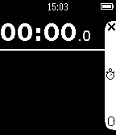
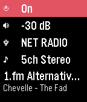
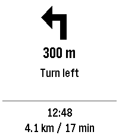
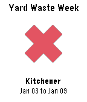
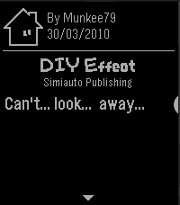
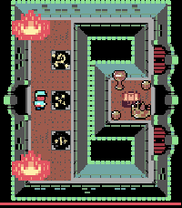

---
hide:
  - toc
---

<!-- Generated by scripts/update_app_directory.py: do not edit by hand -->
# Pebble Apps: Y

[← All Pebble Apps](../watchapps.md) · [A](a.md) · [B](b.md) · [C](c.md) · [D](d.md) · [E](e.md) · [F](f.md) · [G](g.md) · [H](h.md) · [I](i.md) · [J](j.md) · [K](k.md) · [L](l.md) · [M](m.md) · [N](n.md) · [O](o.md) · [P](p.md) · [Q](q.md) · [R](r.md) · [S](s.md) · [T](t.md) · [U](u.md) · [V](v.md) · [W](w.md) · [X](x.md) · **Y** · [Z](z.md) · [0–9 & other](other.md)

*7 apps · Last updated 2026-10-06 · [About these lists](../about-app-lists.md)*

<h2 class="app-name" id="app-52e52bd98af5795fcc0005c9"><a href="https://apps.repebble.com/52e52bd98af5795fcc0005c9">Yacht Timer</a></h2>
<a class="app-source" href="https://github.com/MikeMoore63/yachttimer" title="Source code" data-search-exclude>View source</a>

by <a href="https://apps.repebble.com/apps/dev/mikem_5299a2ae129af7accf00005c" title="More from this developer">MikeM</a>

No licence v7.0 Updated 2015-05-05

Runs on: Time 2, Pebble 2 Duo, Pebble 2, Time, Classic

Simple app supporting Yacht Racing countdown timer, StopWatch, Countdow and Watch. Countdown supports adjustments by Hours, Minutes, Seconds. Vibrate on signifigant Times e.g. 4 minute gun, 1…

<h2 class="app-name" id="app-568888f73f3554bc53000056"><a href="https://apps.repebble.com/568888f73f3554bc53000056">Yamaha AV Remote</a></h2>
<a class="app-source" href="https://github.com/ghys/pebble-yamaha-remote" title="Source code" data-search-exclude>View source</a>

by <a href="https://apps.repebble.com/apps/dev/ys_55787e740ad90da1d6000069" title="More from this developer">YS</a>

Not checked yet v2.0 Updated 2026-03-16

Runs on: Round 2, Time 2, Pebble 2 Duo, Pebble 2, Time Round, Time, Classic

A simple control watchapp for the basic functions of your network-enabled Yamaha AV receiver. Never look for the remote again! Tested on a RX-V479 but should work on all models compatible with the…

<h2 class="app-name" id="app-609c311158bd4a25a409a209"><a href="https://apps.repebble.com/609c311158bd4a25a409a209">YaNaviPeb</a></h2>
<a class="app-source" href="https://github.com/DimaK21/YaNaviPeb" title="Source code" data-search-exclude>View source</a>

by <a href="https://apps.repebble.com/apps/dev/dimak21_5197d01875c2244ade01662d" title="More from this developer">dimak21</a>

0BSD v0.3.0 Updated 2026-09-24

Runs on: Round 2, Time 2, Pebble 2 Duo, Pebble 2, Time Round, Time, Classic

Turn-by-turn directions from Yandex Maps or Yandex Navigator on your Pebble watch. While you navigate, the watch shows the maneuver arrow, the distance to it, the maneuver text, your arrival time…

<h2 class="app-name" id="app-55711f9ce1777eac3c000072"><a href="https://apps.repebble.com/55711f9ce1777eac3c000072">Yard Waste Week</a></h2>
<a class="app-source" href="https://github.com/s0j/yardwasteweek" title="Source code" data-search-exclude>View source</a>

by <a href="https://apps.repebble.com/apps/dev/halogray_550dfba660dc26d635000079" title="More from this developer">Halogray</a>

Not checked yet v1.5 Updated 2016-03-12

Runs on: Time 2, Pebble 2 Duo, Pebble 2, Time, Classic

Yard Waste Week is a simple application that quickly informs you if &quot;this week&quot; is yard waste week. Using the Yard Waste Schedule published by the Region of Waterloo, you have the option to select…

<h2 class="app-name" id="app-abc5ed3b095e4bd380de6909"><a href="https://apps.repebble.com/abc5ed3b095e4bd380de6909">YarraTrak</a></h2>
<a class="app-source" href="https://github.com/ShinkoNet/YarraTrak" title="Source code" data-search-exclude>View source</a>

by <a href="https://apps.repebble.com/apps/dev/shinkonet_3d56e6eebb8d1a10961ee37a" title="More from this developer">ShinkoNet</a>

No licence v2.0 Updated 2026-04-25

Runs on: Round 2, Time 2, Pebble 2 Duo, Pebble 2, Time Round, Time, Classic

Real-time Melbourne public transport departures on your Pebble smartwatch. YarraTrak shows live train, tram, and V/Line departure times directly on your wrist. Configure your favourite stations…

<h2 class="app-name" id="app-2adaea94d1d0494fb015b4e8"><a href="https://apps.repebble.com/2adaea94d1d0494fb015b4e8">Yonderu! DoujinSoft</a></h2>
<a class="app-source" href="https://github.com/Difegue/Yonderu-pebble" title="Source code" data-search-exclude>View source</a>

by <a href="https://apps.repebble.com/apps/dev/difegue_59875ea00dfc321335000a40" title="More from this developer">Difegue</a>

GPL-3.0 v1.2 Updated 2026-05-01

Runs on: Time 2, Pebble 2 Duo, Pebble 2, Time

A client for the DoujinSoft Store on Pebble, granting access to thousands of comics from the 2010 NDS game WarioWare DIY. Through the power of PebbleKit JS, get one curated B&amp;W 4-panel comic from…

<h2 class="app-name" id="app-56e4693181ff036ba9000020"><a href="https://apps.repebble.com/56e4693181ff036ba9000020">You Cannot Go Back!</a></h2>
<a class="app-source" href="https://github.com/timboe/YouCannotGoBack" title="Source code" data-search-exclude>View source</a>

by <a href="https://apps.repebble.com/apps/dev/tim-martin_552d83aa083523c826000080" title="More from this developer">Tim Martin</a>

Not checked yet v2.0.0 Updated 2026-06-28

Runs on: Round 2, Time 2, Pebble 2 Duo, Pebble 2, Time Round, Time

A fiendish challenge awaits you, an adventure of puzzle solving, memory and skill. Just remember dungeoneer - the only way is onwards; you cannot go back! Version 2 is now out for Time 2, Round 2…

