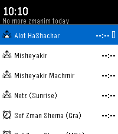
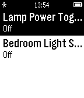
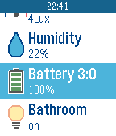

<!-- Generated by scripts/update_app_directory.py: do not edit by hand -->
# Watchapps: Z

[← About this list](../watchapps.md) · [A](a.md) · [B](b.md) · [C](c.md) · [D](d.md) · [E](e.md) · [F](f.md) · [G](g.md) · [H](h.md) · [I](i.md) · [J](j.md) · [K](k.md) · [L](l.md) · [M](m.md) · [N](n.md) · [O](o.md) · [P](p.md) · [Q](q.md) · [R](r.md) · [S](s.md) · [T](t.md) · [U](u.md) · [V](v.md) · [W](w.md) · [X](x.md) · [Y](y.md) · **Z** · [0–9 & other](other.md)

*5 watchapps · Last updated 2026-10-06*

| Screenshot | Name | Developer | Licence | Updated | Description |
|------------|------|-----------|---------|---------|-------------|
| { loading=lazy width="72" } | [Zaragoza Public Transport](https://apps.repebble.com/5689657664bdb8bfb800001d) | [iAbadia](https://github.com/iAbadia/Pebble-Public-Transport-Zgz) | <small>Not checked yet</small> | 2016-02-03 | Pebble app for Zaragoza tram and bus times How to use: For tram times, select between the full list of stops or choose one from your recent searches. For… |
| { loading=lazy width="72" } | [Zarapp](https://apps.repebble.com/55171822b89c9e54f500000a) | [KilFer - Fernando Belaza](https://github.com/KilFer/Zarapp) | MIT | 2015-08-22 | ¡Ten a mano toda la información sobre los transportes urbanos de Zaragoza! Consulta cualquier parada del tranvía, bus o bizis y guarda para un acceso más… |
| { loading=lazy width="72" } | [Zmanim](https://apps.repebble.com/8a706e64a4f745cc94398e35) | [discountdeadcats](https://github.com/discountdeadcats/Zmanim-app) | <small>Not checked yet</small> | 2026-05-03 | Precise halachic times at a glance. View key zmanim, track the current time period, and stay aware of what’s coming next all in a clean, fast interface… |
| { loading=lazy width="72" } | [ZWay Control](https://apps.repebble.com/55ec8deb4fcd1c6dc300004e) | [Nick Pappas](https://github.com/radicand/PebbleZWay) | <small>Not checked yet</small> | 2015-09-26 | PLEASE NOTE: I no longer have a Z-Way system, I cannot verify whether this app still works. If you have one and want to take over maintenance, please reach… |
| { loading=lazy width="72" } | [ZWay Time](https://apps.repebble.com/564cdd04435b21d2ec000020) | [sionyx](https://github.com/sionyx/pebble_zway_time) | <small>Not checked yet</small> | 2016-01-28 | ZWay Time application allows you to control your RaZberry based smart home. It supports controls: - on-off switches; - dimmers; - RGB switches; and sensors… |
