---
hide:
  - toc
---

<!-- Generated by scripts/update_app_directory.py: do not edit by hand -->
# Pebble Watchfaces: A

[← All Pebble Watchfaces](../watchfaces.md) · **A** · [B](b.md) · [C](c.md) · [D](d.md) · [E](e.md) · [F](f.md) · [G](g.md) · [H](h.md) · [I](i.md) · [J](j.md) · [K](k.md) · [L](l.md) · [M](m.md) · [N](n.md) · [O](o.md) · [P](p.md) · [Q](q.md) · [R](r.md) · [S](s.md) · [T](t.md) · [U](u.md) · [V](v.md) · [W](w.md) · [X](x.md) · [Y](y.md) · [Z](z.md) · [0–9 & other](other.md)

*132 watchfaces · Last updated 2026-10-06 · [About these lists](../about-app-lists.md)*

<h2 class="app-name" id="app-530a781e24c458af7d00011e"><a href="https://apps.repebble.com/530a781e24c458af7d00011e">A Better Bit (Binary)</a></h2>
<a class="app-source" href="https://github.com/joshgordon/better_bit" title="Source code" data-search-exclude>View source</a>

by <a href="https://apps.repebble.com/apps/dev/josh-gordon_530a766d60f21fec5f00006f" title="More from this developer">Josh Gordon</a>

Not checked yet v1.0.0 Updated 2014-02-23

Runs on: Time 2, Pebble 2 Duo, Pebble 2, Time, Classic

This is the pebble default &quot;Just a Bit&quot; watchface modified to use truly binary bits instead of using binary bits to represent base 10 numbers.

<a class="app-shot" href="https://apps.repebble.com/69153581a0d99d0009ff0a03" data-search-exclude>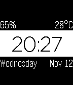</a>

<h2 class="app-name" id="app-69153581a0d99d0009ff0a03"><a href="https://apps.repebble.com/69153581a0d99d0009ff0a03">A Little More</a></h2>
<a class="app-source" href="https://github.com/chrislewicki/A-Little-More" title="Source code" data-search-exclude>View source</a>

by <a href="https://apps.repebble.com/apps/dev/chris-lewicki_53f25ba1e45d533568000139" title="More from this developer">Chris Lewicki</a>

Not checked yet v3.2.0 Updated 2026-09-21

Runs on: Round 2, Time 2, Pebble 2 Duo, Pebble 2, Time Round, Time, Classic

A full remake of my face A Little Less, with more features and much cleaner code. Complications in each corner can be customized to be any of the following: - Battery - Temperature - Day of week …

<h2 class="app-name" id="app-573d93ea5253b12407000009"><a href="https://apps.repebble.com/573d93ea5253b12407000009">A Maze</a></h2>
<a class="app-source" href="https://github.com/gogothegogo/Maze_Pebble" title="Source code" data-search-exclude>View source</a>

by <a href="https://apps.repebble.com/apps/dev/gogothegogo_56e335002526c72e66000023" title="More from this developer">gogothegogo</a>

Not checked yet v1.0 Updated 2016-05-19

Runs on: Time 2, Pebble 2 Duo, Pebble 2, Time, Classic

Cool watchface with maze-like appearance showing time. Shake the watch and you get seconds and date. It is coded to preserve the battery, meaning seconds are not tracked until you shake watch, and…

<a class="app-shot" href="https://apps.repebble.com/52fb7da13f98abae960000eb" data-search-exclude>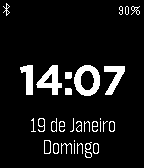</a>

<h2 class="app-name" id="app-52fb7da13f98abae960000eb"><a href="https://apps.repebble.com/52fb7da13f98abae960000eb">A Portuguesa</a></h2>
<a class="app-source" href="https://github.com/joaopluis/A-Portuguesa" title="Source code" data-search-exclude>View source</a>

by <a href="https://apps.repebble.com/apps/dev/jo-o-lu-s_52cfd1031d006dc01700000e" title="More from this developer">João Luís</a>

Not checked yet v1.1.2 Updated 2014-03-07

Runs on: Time 2, Pebble 2 Duo, Pebble 2, Time, Classic

A simple watchface I designed, mainly because I wanted one in Portuguese. It shows the time, the date, the weekday, the connection status and the battery status. It is named after the Portuguese…

<a class="app-shot" href="https://apps.repebble.com/b655ae247e9b47ea8e7166e8" data-search-exclude>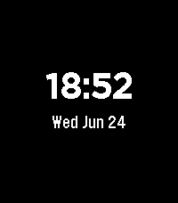</a>

<h2 class="app-name" id="app-b655ae247e9b47ea8e7166e8"><a href="https://apps.repebble.com/b655ae247e9b47ea8e7166e8">A Rainy Face</a></h2>
<a class="app-source" href="https://github.com/volksen/a_rainy_face" title="Source code" data-search-exclude>View source</a>

by <a href="https://apps.repebble.com/apps/dev/volksen_2d30d3eefc7e77d201cb94ca" title="More from this developer">volksen</a>

Not checked yet v0.0.4 Updated 2026-09-04

Runs on: Round 2, Time 2

Simple watchface with weather info from openmeteo, especially precipitation

<h2 class="app-name" id="app-57a85f001482cdecc700063d"><a href="https://apps.repebble.com/57a85f001482cdecc700063d">a8bit</a></h2>
<a class="app-source" href="https://github.com/axel668/a8bit" title="Source code" data-search-exclude>View source</a>

by <a href="https://apps.repebble.com/apps/dev/axel_56c56e989a0e12214c00000c" title="More from this developer">Axel</a>

GPL-3.0 v1.2 Updated 2016-09-01

Runs on: Time 2, Pebble 2 Duo, Pebble 2, Time, Classic

Deprecated - this app is provided &quot;As Is&quot; and can be used, but there will be no further development or bugfixes. a8bit is a simple 8bit retro style watch face with big numbers for good…

<a class="app-shot" href="https://apps.repebble.com/5584cb7f7726b7ecdc000071" data-search-exclude>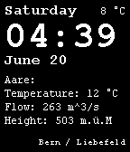</a>

<h2 class="app-name" id="app-5584cb7f7726b7ecdc000071"><a href="https://apps.repebble.com/5584cb7f7726b7ecdc000071">Aare</a></h2>
<a class="app-source" href="https://github.com/f3lan/aare-watchface/tree/master/aare" title="Source code" data-search-exclude>View source</a>

by <a href="https://apps.repebble.com/apps/dev/felix_550d49d4783f36b3940000c1" title="More from this developer">Felix</a>

Not checked yet v1.0 Updated 2015-06-20

Runs on: Time 2, Pebble 2 Duo, Pebble 2, Time, Classic

This watchface displays the time, date and temperature but also the temperature, flow velocity and height of the Aare. Deutsch Dieses Watchface zeigt Zeit, Datum und Temperatur an und zusätzlich…

<a class="app-shot" href="https://apps.repebble.com/55eac1984d076dee0a00000f" data-search-exclude>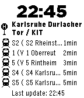</a>

<h2 class="app-name" id="app-55eac1984d076dee0a00000f"><a href="https://apps.repebble.com/55eac1984d076dee0a00000f">Abfahrtsmonitor</a></h2>
<a class="app-source" href="https://github.com/tobiwe/pebble" title="Source code" data-search-exclude>View source</a>

by <a href="https://apps.repebble.com/apps/dev/tobi_53b81918289beb51560001e0" title="More from this developer">Tobi</a>

Not checked yet v0.40 Updated 2015-11-10

Runs on: Time 2, Pebble 2 Duo, Pebble 2, Time, Classic

Dieses Watchface zeigt dir den Abfahrtsplan deiner Haltestelle in Baden-Württemberg an. Egal ob Bus, Bahn, Zug, Tram, Straßenbahn! Es werden alle Haltestellen in Baden-Württemberg gefunden…

<h2 class="app-name" id="app-5572b7287d6f3d4845000017"><a href="https://apps.repebble.com/5572b7287d6f3d4845000017">About time</a></h2>
<a class="app-source" href="https://github.com/frogamic/abouttime" title="Source code" data-search-exclude>View source</a>

by <a href="https://apps.repebble.com/apps/dev/frogamic_55015e7e7ed24a01d400000c" title="More from this developer">frogamic</a>

Not checked yet v1.3 Updated 2015-06-18

Runs on: Time 2, Pebble 2 Duo, Pebble 2, Time, Classic

It&#x27;s about time. Pebble Time. The color of this watchface changes to match your Pebble. This face is all about your time. About time shows the time exactly as you need it, not a string of numbers…

<h2 class="app-name" id="app-52c773da97bd5a21b500000c"><a href="https://apps.repebble.com/52c773da97bd5a21b500000c">Abstract Analog</a></h2>
<a class="app-source" href="http://github.com/alecgoebel/abstract_analog" title="Source code" data-search-exclude>View source</a>

by <a href="https://apps.repebble.com/apps/dev/alec-goebel_52c770e1116f1521fc00000b" title="More from this developer">Alec Goebel</a>

No licence v1.0.2 Updated 2014-02-10

Runs on: Time 2, Pebble 2 Duo, Pebble 2, Time, Classic

A minimalistic watch face. Minute hand is attached to the hour hand tip. Triangle at top is day of the week starting with Sunday. Animated GIF: http://imgur.com/HvXtm9H

<a class="app-shot" href="https://apps.repebble.com/55eb91a7e41fa80a4c000083" data-search-exclude>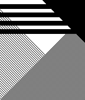</a>

<h2 class="app-name" id="app-55eb91a7e41fa80a4c000083"><a href="https://apps.repebble.com/55eb91a7e41fa80a4c000083">Abstracted</a></h2>
<a class="app-source" href="https://github.com/profbetis/Abstracted" title="Source code" data-search-exclude>View source</a>

by <a href="https://apps.repebble.com/apps/dev/kevin-weber_53220c40a3f12b6331000032" title="More from this developer">Kevin Weber</a>

Not checked yet v1.1 Updated 2015-09-06

Runs on: Time 2, Pebble 2 Duo, Pebble 2, Time, Classic

Abstracted is a concept that uses art to display time. To Read: (The displayed time is 4:36 PM) Hours are the large horizontal black bars. They act as tally marks (4 bars = 4 hours past 12, 5 bars…

<h2 class="app-name" id="app-57281561983547624100001a"><a href="https://apps.repebble.com/57281561983547624100001a">Acceleration</a></h2>
<a class="app-source" href="https://github.com/cutman2002/PebbleWatchface_Acceleration" title="Source code" data-search-exclude>View source</a>

by <a href="https://apps.repebble.com/apps/dev/cutman_563444ce716fdbf9c4000043" title="More from this developer">Cutman</a>

Not checked yet v1.5 Updated 2016-05-29

Runs on: Round 2, Time 2, Pebble 2 Duo, Pebble 2, Time Round, Time, Classic

A Watchface that displays the time along with colorful balls that move with your watch. Just shake your watch to get them moving. If you love Acceleration and you&#x27;d like to donate you can send…

<a class="app-shot" href="https://apps.repebble.com/52a39fc6b1da839d06000024" data-search-exclude>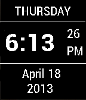</a>

<h2 class="app-name" id="app-52a39fc6b1da839d06000024"><a href="https://apps.repebble.com/52a39fc6b1da839d06000024">AccuInfo</a></h2>
<a class="app-source" href="https://github.com/bobhwasatch/accuinfo" title="Source code" data-search-exclude>View source</a>

by <a href="https://apps.repebble.com/apps/dev/bob-hauck_529e79aa1a6638031c000015" title="More from this developer">Bob Hauck</a>

No licence v2.0.1 Updated 2014-02-20

Runs on: Time 2, Pebble 2 Duo, Pebble 2, Time, Classic

For people who want all the time information at once. Can be configured for normal or inverted display. Based on a concept by plumliz.

<a class="app-shot" href="https://apps.repebble.com/56b6bb3c0b97730da600002e" data-search-exclude>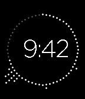</a>

<h2 class="app-name" id="app-56b6bb3c0b97730da600002e"><a href="https://apps.repebble.com/56b6bb3c0b97730da600002e">Active Hour</a></h2>
<a class="app-source" href="https://github.com/thejambi/ActiveHour" title="Source code" data-search-exclude>View source</a>

by <a href="https://apps.repebble.com/apps/dev/zach-burnham_552f3680c34162df9100008f" title="More from this developer">Zach Burnham</a>

Not checked yet v1.20 Updated 2016-10-14

Runs on: Round 2, Time 2, Pebble 2 Duo, Pebble 2, Time Round, Time

This watchface uses Pebble Health data to show the time along with a visual display of how active you are every minute of the hour. It is inspired by a Fitbit watchface. Includes the following…

<a class="app-shot" href="https://apps.repebble.com/932411b4b5ba45ce839ff833" data-search-exclude>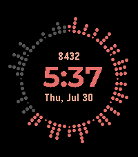</a>

<h2 class="app-name" id="app-932411b4b5ba45ce839ff833"><a href="https://apps.repebble.com/932411b4b5ba45ce839ff833">ActiveHour2</a></h2>
<a class="app-source" href="https://github.com/thejambi/ActiveHour" title="Source code" data-search-exclude>View source</a>

by <a href="https://apps.repebble.com/apps/dev/zach-burnham_939ce698485e86de8b11f7ae" title="More from this developer">Zach Burnham</a>

Not checked yet v2.2.1 Updated 2026-07-23

Runs on: Round 2, Time 2, Pebble 2 Duo, Pebble 2, Time Round, Time

This watchface uses Pebble Health data to show the time along with a visual display of how active you are every minute of the hour. It is inspired by a Fitbit watchface. Includes the following…

<a class="app-shot" href="https://apps.repebble.com/535d6bda91c4a6472e000061" data-search-exclude>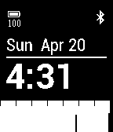</a>

<h2 class="app-name" id="app-535d6bda91c4a6472e000061"><a href="https://apps.repebble.com/535d6bda91c4a6472e000061">Activity</a></h2>
<a class="app-source" href="https://github.com/antonioasaro/Antonio-Activity_2.0.git" title="Source code" data-search-exclude>View source</a>

by <a href="https://apps.repebble.com/apps/dev/antonio-asaro_52cd5e150799b0643b00003c" title="More from this developer">Antonio Asaro</a>

No licence v1.1 Updated 2014-04-27

Runs on: Time 2, Pebble 2 Duo, Pebble 2, Time, Classic

Tracks last hour of activity along with standard battery + phone connection (with vibration) status

<h2 class="app-name" id="app-5a33009e461a8d2dd000128f"><a href="https://apps.rebble.io/en_US/application/5a33009e461a8d2dd000128f">Actual Tic Toc</a></h2>
<a class="app-source" href="https://github.com/LochRED/ActTTAlt" title="Source code" data-search-exclude>View source</a>

by <a href="https://apps.rebble.io/en_US/developer/5926fa58b67f9f43f800046c/1" title="More from this developer">LochRED</a>

No licence v1.0 Updated 2017-12-14 Rebble App Store

Runs on: Round 2, Time 2, Time Round, Time

An actual tic toc watchface for pebble watches. If you like this, Send me some Bitcoins! Wallet ID 16VyPy2uBHp3QYHMTJbKz7si8HxudpJkgv

<h2 class="app-name" id="app-5a3d63490dfc321afc000024"><a href="https://apps.rebble.io/en_US/application/5a3d63490dfc321afc000024">Actual Tic Toc Pink</a></h2>
<a class="app-source" href="https://github.com/LochRED/Attp" title="Source code" data-search-exclude>View source</a>

by <a href="https://apps.rebble.io/en_US/developer/5926fa58b67f9f43f800046c/1" title="More from this developer">LochRED</a>

No licence v1.0 Updated 2017-12-22 Rebble App Store

Runs on: Round 2, Time 2, Time Round, Time

An Actual Tic Toc pink watchface for Pebble watches. (The difference between this and Actual Tic Toc is this version has pink hands.) If you like this, Send me some Bitcoins! Wallet ID…

<a class="app-shot" href="https://apps.repebble.com/0d9749fe636a4d96acf4d37a" data-search-exclude>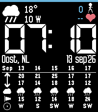</a>

<h2 class="app-name" id="app-0d9749fe636a4d96acf4d37a"><a href="https://apps.repebble.com/0d9749fe636a4d96acf4d37a">ACW BIG time with forecast weather table</a></h2>
<a class="app-source" href="https://github.com/ArcoW2/Pebble-watchface-BIG-tabled-forecast" title="Source code" data-search-exclude>View source</a>

by <a href="https://apps.repebble.com/apps/dev/acw-bright_b9b8c4f23559db00c877cab5" title="More from this developer">ACW Bright</a>

No licence v1.0.1 Updated 2026-09-13

Runs on: Time 2

Big digital time Current weather and activity Full weather forecast table at the bottom

<a class="app-shot" href="https://apps.repebble.com/55415124c10fd868f70000bf" data-search-exclude>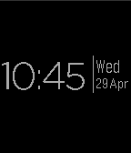</a>

<h2 class="app-name" id="app-55415124c10fd868f70000bf"><a href="https://apps.repebble.com/55415124c10fd868f70000bf">Adamxp12 Watchface</a></h2>
<a class="app-source" href="https://github.com/adamxp12/Adamxp12PebbleFace" title="Source code" data-search-exclude>View source</a>

by <a href="https://apps.repebble.com/apps/dev/adamxp12-com_5541060ec10fd8287000008e" title="More from this developer">Adamxp12.com</a>

No licence v1.1 Updated 2015-04-29

Runs on: Time 2, Pebble 2 Duo, Pebble 2, Time, Classic

A nice and simple watchface

<a class="app-shot" href="https://apps.rebble.io/en_US/application/5aa584f10dfc325c1c0001f3" data-search-exclude>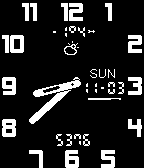</a>

<h2 class="app-name" id="app-5aa584f10dfc325c1c0001f3"><a href="https://apps.rebble.io/en_US/application/5aa584f10dfc325c1c0001f3">Advanced Analog</a></h2>
<a class="app-source" href="https://github.com/stosem/pebble-wf-AdvancedAnalog" title="Source code" data-search-exclude>View source</a>

by <a href="https://apps.rebble.io/en_US/developer/5a2a0e690dfc329d17001135/1" title="More from this developer">stosem</a>

Not checked yet v2.1 Updated 2018-03-15 Rebble App Store

Runs on: Round 2, Time 2, Pebble 2 Duo, Pebble 2, Time Round, Time, Classic

Analog Watchface with weather and health data. Features: - Support rectangle and round display. - White or black theme. - Bluetooth, QuietTime, Charge icons. - Display steps. - Battery indicator…

<h2 class="app-name" id="app-54bd47263e50447f5d00005c"><a href="https://apps.repebble.com/54bd47263e50447f5d00005c">Adventure Time</a></h2>
<a class="app-source" href="https://github.com/jessemillar/Pebbling/tree/master/Adventure-Time" title="Source code" data-search-exclude>View source</a>

by <a href="https://apps.repebble.com/apps/dev/jesse-millar_54305df1a2f622febf0001cc" title="More from this developer">Jesse Millar</a>

Not checked yet v1.1 Updated 2015-01-20

Runs on: Time 2, Pebble 2 Duo, Pebble 2, Time, Classic

With Jake the Dog and Finn the Human, the fun will never end! Shake your wrist to switch characters.

<a class="app-shot" href="https://apps.repebble.com/5830a01b00355a2f3a00004f" data-search-exclude>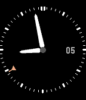</a>

<h2 class="app-name" id="app-5830a01b00355a2f3a00004f"><a href="https://apps.repebble.com/5830a01b00355a2f3a00004f">Aeronaut</a></h2>
<a class="app-source" href="https://github.com/egid/pebbleAnalog" title="Source code" data-search-exclude>View source</a>

by <a href="https://apps.repebble.com/apps/dev/eric-gideon_58180d45c68d00fc6c000024" title="More from this developer">Eric Gideon</a>

Not checked yet v0.8 Updated 2017-08-05

Runs on: Round 2, Time 2, Pebble 2 Duo, Pebble 2, Time Round, Time

Aeronaut is inspired by pilot&#x27;s watches, with a GMT pointer and the date. Second hand optional. Black and white styles available.

<h2 class="app-name" id="app-d64decb8397c43e3a3344dc6"><a href="https://apps.repebble.com/d64decb8397c43e3a3344dc6">After Hours</a></h2>
<a class="app-source" href="https://github.com/justinjhendrick/after-hours-pebble-watchface" title="Source code" data-search-exclude>View source</a>

by <a href="https://apps.repebble.com/apps/dev/justinjhendrick_67f68b8a23b7a90009c87db5" title="More from this developer">justinjhendrick</a>

Not checked yet v1.0.0 Updated 2026-06-29

Runs on: Round 2, Time 2, Pebble 2 Duo, Pebble 2, Time Round, Time, Classic

Extreme Battery Saver. Only updates once per hour!

<a class="app-shot" href="https://apps.repebble.com/6516c39fb2704211b668a318" data-search-exclude>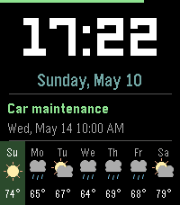</a>

<h2 class="app-name" id="app-6516c39fb2704211b668a318"><a href="https://apps.repebble.com/6516c39fb2704211b668a318">Agenda</a></h2>
<a class="app-source" href="https://github.com/ygalanter/agenda-pebble" title="Source code" data-search-exclude>View source</a>

by <a href="https://apps.repebble.com/apps/dev/comfortably-numb_52f547605101128b2200005a" title="More from this developer">Comfortably Numb</a>

Not checked yet v1.5.0 Updated 2026-07-11

Runs on: Time 2, Pebble 2 Duo, Pebble 2, Time, Classic

Digital watchface that displays time, weather, and your next calendar event. Features - Large digital clock - Date display with day of the week - 7-day weather forecast - Current weather for today…

<a class="app-shot" href="https://apps.repebble.com/52e81244e822d1bdda00004a" data-search-exclude>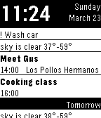</a>

<h2 class="app-name" id="app-52e81244e822d1bdda00004a"><a href="https://apps.repebble.com/52e81244e822d1bdda00004a">Agenda Watchface</a></h2>
<a class="app-source" href="https://github.com/JanBobolz" title="Source code" data-search-exclude>View source</a>

by <a href="https://apps.repebble.com/apps/dev/jan-bobolz_52d3bf8ef659f0fa38000016" title="More from this developer">Jan Bobolz</a>

See source v2.14 Updated 2014-10-05

Runs on: Time 2, Pebble 2 Duo, Pebble 2, Time, Classic

Shows your upcoming appointments from the Android calendar. (And - with plugins - tasks, notifications, ...) Quite customizable. You need the companion app.

<h2 class="app-name" id="app-561045fa46914a14ee00003a"><a href="https://apps.repebble.com/561045fa46914a14ee00003a">Ai Kanji</a></h2>
<a class="app-source" href="https://github.com/DarkxKen/Ai-watchface" title="Source code" data-search-exclude>View source</a>

by <a href="https://apps.repebble.com/apps/dev/darkxken_547fbbb48164e16a8d0000cf" title="More from this developer">DarkxKen</a>

MIT v1.0 Updated 2015-10-03

Runs on: Time 2, Pebble 2 Duo, Pebble 2, Time, Classic

Ai Kanji that means love. Use this watchface to keep the love with you.

<a class="app-shot" href="https://apps.repebble.com/fdf36c678ce849fb8e0d5650" data-search-exclude>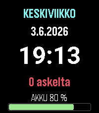</a>

<h2 class="app-name" id="app-fdf36c678ce849fb8e0d5650"><a href="https://apps.repebble.com/fdf36c678ce849fb8e0d5650">Aikapaneeli</a></h2>
<a class="app-source" href="https://github.com/jrs8205/aikapaneeli" title="Source code" data-search-exclude>View source</a>

by <a href="https://apps.repebble.com/apps/dev/jrs8205_dc6f8c24a8fb680254d674d7" title="More from this developer">jrs8205</a>

Not checked yet v1.1.0 Updated 2026-06-16

Runs on: Time 2

Aikapaneeli on selkeä, täysin suomenkielinen kellotaulu Pebble Time 2:lle. Yhdellä silmäyksellä näet nämä kaikki: suuri 24 h kello, suomenkielinen viikonpäivä ja päivämäärä, päivän askelmäärä sekä…

<h2 class="app-name" id="app-53aa3ea003d7da59780000b0"><a href="https://apps.repebble.com/53aa3ea003d7da59780000b0">AIS rhythm of digital life</a></h2>
<a class="app-source" href="https://bitbucket.org/itsara_ais/aiswatch" title="Source code" data-search-exclude>View source</a>

by <a href="https://apps.repebble.com/apps/dev/dld_5347a9c342b3b250760001cc" title="More from this developer">DLD</a>

See source v1.0.0 Updated 2014-06-25

Runs on: Time 2, Pebble 2 Duo, Pebble 2, Time, Classic

AIS rhythm of digital life, sound visualizer concept.

<a class="app-shot" href="https://apps.repebble.com/54194fe6019321e332000151" data-search-exclude>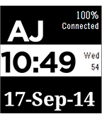</a>

<h2 class="app-name" id="app-54194fe6019321e332000151"><a href="https://apps.repebble.com/54194fe6019321e332000151">AJ Pebble Face</a></h2>
<a class="app-source" href="http://dunhindevelopers.wordpress.com/2014/09/17/aj-pebble-face/" title="Source code" data-search-exclude>View source</a>

by <a href="https://apps.repebble.com/apps/dev/johnny-dunhin_52be95796ecafe8fe0000045" title="More from this developer">Johnny Dunhin</a>

See source v2.0 Updated 2014-09-18

Runs on: Time 2, Pebble 2 Duo, Pebble 2, Time, Classic

Personal touch to my Pebble. Source code is on website.

<a class="app-shot" href="https://apps.repebble.com/5642ae311c68dcdba900000e" data-search-exclude>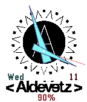</a>

<h2 class="app-name" id="app-5642ae311c68dcdba900000e"><a href="https://apps.repebble.com/5642ae311c68dcdba900000e">Aldevetz Watchface</a></h2>
<a class="app-source" href="https://github.com/shizukukun/aldevetzwatch" title="Source code" data-search-exclude>View source</a>

by <a href="https://apps.repebble.com/apps/dev/shizuku-kun_55b5831f5e07167c5f000007" title="More from this developer">shizuku kun</a>

Not checked yet v1.3 Updated 2015-11-11

Runs on: Round 2, Time 2, Time Round, Time

J-Rock Band Aldevetz Watchface

<a class="app-shot" href="https://apps.repebble.com/27712bf7eb5f44a1b56a4204" data-search-exclude>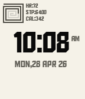</a>

<h2 class="app-name" id="app-27712bf7eb5f44a1b56a4204"><a href="https://apps.repebble.com/27712bf7eb5f44a1b56a4204">Aldo Watch</a></h2>
<a class="app-source" href="https://github.com/manaksu/AldoWatch" title="Source code" data-search-exclude>View source</a>

by <a href="https://apps.repebble.com/apps/dev/creative-manaks_504fe850dc7e97a445b0a10d" title="More from this developer">Creative Manaks</a>

Not checked yet v4.20 Updated 2026-05-30

Runs on: Time 2, Pebble 2 Duo, Pebble 2, Time

Aldo Clean and typographic. Built around the bold geometric character of the Aldo the Apache font, this watchface keeps it minimal — time front and center on a creamy white canvas, with a subtle…

<h2 class="app-name" id="app-536a6c35a50bc82bc200005d"><a href="https://apps.repebble.com/536a6c35a50bc82bc200005d">AlfaSlab Big Time</a></h2>
<a class="app-source" href="https://github.com/TheChrisPratt/ASPebble" title="Source code" data-search-exclude>View source</a>

by <a href="https://apps.repebble.com/apps/dev/anodyzed_531a1d41af83c1f14400007c" title="More from this developer">Anodyzed</a>

No licence v1.3 Updated 2014-05-12

Runs on: Time 2, Pebble 2 Duo, Pebble 2, Time, Classic

The Big Time watchface using the Alfa Slab font Note: Requires version 2.1 Firmware

<a class="app-shot" href="https://apps.repebble.com/2ee3a721b23b44968487102b" data-search-exclude>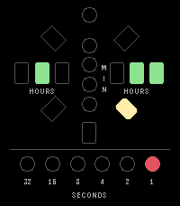</a>

<h2 class="app-name" id="app-2ee3a721b23b44968487102b"><a href="https://apps.repebble.com/2ee3a721b23b44968487102b">Alien Clock</a></h2>
<a class="app-source" href="https://github.com/GeoffAtLarge/pebble-alien-clock" title="Source code" data-search-exclude>View source</a>

by <a href="https://apps.repebble.com/apps/dev/netnoise_164926ef742b9ab422a9bacb" title="More from this developer">NetNoise</a>

No licence v1.2.0 Updated 2026-09-22

Runs on: Round 2, Time 2

A watchface to emulate the Alien Clock as seen on Star Trek: Deep Space Nine. This working prop was made by the Alien Time Company in 1995 and I&#x27;m fortunate enough to own one. I thought it would…

<a class="app-shot" href="https://apps.rebble.io/en_US/application/637a6466c6c24a000a815e8b" data-search-exclude>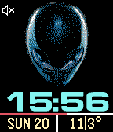</a>

<h2 class="app-name" id="app-637a6466c6c24a000a815e8b"><a href="https://apps.rebble.io/en_US/application/637a6466c6c24a000a815e8b">Alienwear</a></h2>
<a class="app-source" href="https://github.com/astosia/Alien-head" title="Source code" data-search-exclude>View source</a>

by <a href="https://apps.rebble.io/en_US/developer/58a635d30dfc320dc60003b4/1" title="More from this developer">astosia</a>

No licence v2.5 Updated 2025-05-11 Rebble App Store

Runs on: Round 2, Time 2, Pebble 2 Duo, Pebble 2, Time Round, Time, Classic

Alienware inspired weather watchface. Alien picture now changes to show rain, snow or cloud (select whether this is current or forecast in the phone config menu). Features: - Dark or light theme…

<a class="app-shot" href="https://apps.repebble.com/53e71ec8d889b3947f000051" data-search-exclude>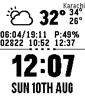</a>

<h2 class="app-name" id="app-53e71ec8d889b3947f000051"><a href="https://apps.repebble.com/53e71ec8d889b3947f000051">All in One</a></h2>
<a class="app-source" href="https://github.com/tazzix/AllinOnePebbleFace" title="Source code" data-search-exclude>View source</a>

by <a href="https://apps.repebble.com/apps/dev/tasnim-ahmed_539280adca2234142b000091" title="More from this developer">Tasnim Ahmed</a>

Not checked yet v1.4 Updated 2015-12-15

Runs on: Time 2, Pebble 2 Duo, Pebble 2, Time, Classic

This Watchface is a fork of Chunk Weather 2.1, I have added more details for weather like Humidity, Sunrise, Sunset; as well as other features from other watchfaces / apps. It adds a pedometer…

<a class="app-shot" href="https://apps.repebble.com/5468b9fe32e2d7bfbc0000ce" data-search-exclude>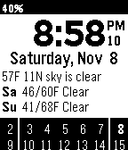</a>

<h2 class="app-name" id="app-5468b9fe32e2d7bfbc0000ce"><a href="https://apps.repebble.com/5468b9fe32e2d7bfbc0000ce">All Info As Text</a></h2>
<a class="app-source" href="https://github.com/clintka/AllInfoAsText.git" title="Source code" data-search-exclude>View source</a>

by <a href="https://apps.repebble.com/apps/dev/clintonk_5430520ca2f62248d600017b" title="More from this developer">ClintonK</a>

Not checked yet v1.2 Updated 2015-10-26

Runs on: Time 2, Pebble 2 Duo, Pebble 2, Time, Classic

All Info As Text watch face delivers the time, date, current weather, today&#x27;s / tomorrow&#x27;s forecast, and a 2 week calendar. Config options include: week format temperature units wind speed units…

<a class="app-shot" href="https://apps.repebble.com/57cbaf2bbe5ad0a9cf00024c" data-search-exclude>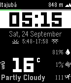</a>

<h2 class="app-name" id="app-57cbaf2bbe5ad0a9cf00024c"><a href="https://apps.repebble.com/57cbaf2bbe5ad0a9cf00024c">All That Info</a></h2>
<a class="app-source" href="https://github.com/elieserleao/allthatinfo" title="Source code" data-search-exclude>View source</a>

by <a href="https://apps.repebble.com/apps/dev/elieser-le-o_537f8996048750f65c000026" title="More from this developer">Elieser Leão</a>

Not checked yet v1.10 Updated 2017-05-03

Runs on: Round 2, Time 2, Pebble 2 Duo, Pebble 2, Time Round, Time, Classic

All info possible. - Open source - Using Weather Underground or OpenWeatherMap (default) - Step counter - Sunrise and sunset - Relative humidity - Current altitude - Wind speed - Watch battery bar

<a class="app-shot" href="https://apps.repebble.com/56fd939f34e0e2225900000a" data-search-exclude>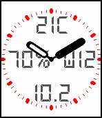</a>

<h2 class="app-name" id="app-56fd939f34e0e2225900000a"><a href="https://apps.repebble.com/56fd939f34e0e2225900000a">All-In</a></h2>
<a class="app-source" href="https://github.com/Sichroteph/All-In-One2" title="Source code" data-search-exclude>View source</a>

by <a href="https://apps.repebble.com/apps/dev/christophe-jeannette_54edf0599e4ff7cbf60000a0" title="More from this developer">Christophe Jeannette</a>

No licence v1.2 Updated 2016-04-04

Runs on: Round 2, Time 2, Pebble 2 Duo, Pebble 2, Time Round, Time, Classic

Keep all your important informations in one stylish analog/digital watchface. Data displayed: - Time (No kidding !) - Current weather (Provided by Forecast.io) - Weekday - Day of the month …

<a class="app-shot" href="https://apps.repebble.com/e7e6e7aac1e24f90b0c8d43b" data-search-exclude>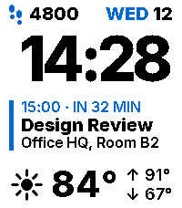</a>

<h2 class="app-name" id="app-e7e6e7aac1e24f90b0c8d43b"><a href="https://apps.repebble.com/e7e6e7aac1e24f90b0c8d43b">Almanac</a></h2>
<a class="app-source" href="https://github.com/chrizel/Almanac" title="Source code" data-search-exclude>View source</a>

by <a href="https://apps.repebble.com/apps/dev/chrizel_e680f3182a066dc5d559126d" title="More from this developer">chrizel</a>

Not checked yet v1.3.0 Updated 2026-09-07

Runs on: Time 2

A calm watchface built around the two things you actually look down for: what&#x27;s coming up, and what the sky is doing. Three blocks on a plain field, nothing else. DATE - weekday and day number…

<h2 class="app-name" id="app-3812c87f414c4b61b4e51ed0"><a href="https://apps.repebble.com/3812c87f414c4b61b4e51ed0">Almost Five</a></h2>
<a class="app-source" href="https://github.com/HarlanH/Almost-Five-Watchface" title="Source code" data-search-exclude>View source</a>

by <a href="https://apps.repebble.com/apps/dev/harlan-harris_6e7531b9711890693c7dc2e7" title="More from this developer">Harlan Harris</a>

MIT v1.3.0 Updated 2026-06-22

Runs on: Time 2, Pebble 2 Duo, Pebble 2, Time, Classic

It&#x27;s &quot;Almost Five&quot; on &quot;The Twenty-Ninth&quot;! Text-based watchface with approximate (fuzzy) times and day of month. Based on previous watchfaces such as PebbleTextWatch and Fuzzy-Text-Watch-Plus…

<a class="app-shot" href="https://apps.repebble.com/be7ddcf0613941d1842c8310" data-search-exclude>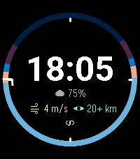</a>

<h2 class="app-name" id="app-be7ddcf0613941d1842c8310"><a href="https://apps.repebble.com/be7ddcf0613941d1842c8310">Alpenglow</a></h2>
<a class="app-source" href="https://github.com/Greenteyn/alpenglow-watchface" title="Source code" data-search-exclude>View source</a>

by <a href="https://apps.repebble.com/apps/dev/greenteyn_2e30445a303d4cff7ad4c5df" title="More from this developer">Greenteyn</a>

MIT v1.3.0 Updated 2026-09-25

Runs on: Round 2, Time 2, Pebble 2 Duo, Pebble 2, Time Round, Time

Alpenglow tells you when the light happens. A ring of the day wraps the time and colours every phase by the brightness of the sky: astronomical night, twilight, blue hour, daytime, golden hour. A…

<a class="app-shot" href="https://apps.repebble.com/5637b2514096619e3e000073" data-search-exclude>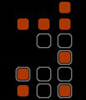</a>

<h2 class="app-name" id="app-5637b2514096619e3e000073"><a href="https://apps.repebble.com/5637b2514096619e3e000073">Alpha Binary Clock</a></h2>
<a class="app-source" href="https://github.com/tmunz/PebbleAlphaBinary/" title="Source code" data-search-exclude>View source</a>

by <a href="https://apps.repebble.com/apps/dev/tmunz_55f1ddc12d148e10c8000015" title="More from this developer">TMunz</a>

Not checked yet v1.1 Updated 2015-11-02

Runs on: Time 2, Pebble 2 Duo, Pebble 2, Time, Classic

The picture above shows the watchface of the Alpha Binary Clock. The orange dots display the time, the grey borders the date. The time can be simply calculated by summing up their values, which…

<h2 class="app-name" id="app-557f34de71b57053c3000049"><a href="https://apps.repebble.com/557f34de71b57053c3000049">Alternate</a></h2>
<a class="app-source" href="https://github.com/inerg/WatchFaceLearning" title="Source code" data-search-exclude>View source</a>

by <a href="https://apps.repebble.com/apps/dev/inerg_531bd06216c197260300023a" title="More from this developer">inerg</a>

Not checked yet v1.2 Updated 2015-06-15

Runs on: Time 2, Pebble 2 Duo, Pebble 2, Time, Classic

Battery is the top bar which steps down in 20% increments. When empty the battery is below 20%. Bottom bar is the Bluetooth connection. Month+Date will alternate depending on if the hour is even…

<a class="app-shot" href="https://apps.rebble.io/en_US/application/57aa228f693f7eb8dd000015" data-search-exclude>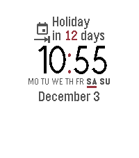</a>

<h2 class="app-name" id="app-57aa228f693f7eb8dd000015"><a href="https://apps.rebble.io/en_US/application/57aa228f693f7eb8dd000015">Alternating Tidbits</a></h2>
<a class="app-source" href="http://github.com/jacobsjan/AlternatingTidbits" title="Source code" data-search-exclude>View source</a>

by <a href="https://apps.rebble.io/en_US/developer/573ef54158b158b89e000009/1" title="More from this developer">Jan Jacobs</a>

No licence v2.3 Updated 2017-12-28 Rebble App Store

Runs on: Round 2, Time 2, Pebble 2 Duo, Pebble 2, Time Round, Time, Classic

A calm, elegant and professional watch face boasting lots of features. Displays one tidbit of information at a time, alternating between them every minute. And in case you want to check something…

<a class="app-shot" href="https://apps.repebble.com/55bd604da5c6f3772200008c" data-search-exclude>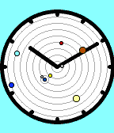</a>

<h2 class="app-name" id="app-55bd604da5c6f3772200008c"><a href="https://apps.repebble.com/55bd604da5c6f3772200008c">Ambient</a></h2>
<a class="app-source" href="https://github.com/tripleplay369/PebbleAmbient" title="Source code" data-search-exclude>View source</a>

by <a href="https://apps.repebble.com/apps/dev/kelby_55b13e5fd53410746c000090" title="More from this developer">Kelby</a>

Not checked yet v1.07 Updated 2015-08-10

Runs on: Time 2, Time

Simple analog watchface that includes the location of the 8 planets, and the moon (sorry Pluto, no room). Background color gradually changes from black to light blue based on the time of day.

<a class="app-shot" href="https://apps.repebble.com/55995cf6e47bb3dce400004e" data-search-exclude>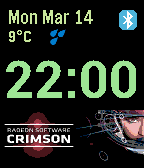</a>

<h2 class="app-name" id="app-55995cf6e47bb3dce400004e"><a href="https://apps.repebble.com/55995cf6e47bb3dce400004e">AMD Watchface</a></h2>
<a class="app-source" href="https://github.com/antonioasaro/Antonio-AMD" title="Source code" data-search-exclude>View source</a>

by <a href="https://apps.repebble.com/apps/dev/antonio-asaro_52cd5e150799b0643b00003c" title="More from this developer">Antonio Asaro</a>

No licence v1.91 Updated 2016-12-09

Runs on: Time 2, Pebble 2 Duo, Pebble 2, Time, Classic

Simple animated AMD watchface (every min). With BT connectivity alerts. FYI - trying to emulate this: https://www.youtube.com/watch?v=c2QKdtU2YvE

<a class="app-shot" href="https://apps.repebble.com/52ee9fd7e75bd2c34300003c" data-search-exclude>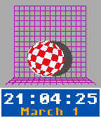</a>

<h2 class="app-name" id="app-52ee9fd7e75bd2c34300003c"><a href="https://apps.repebble.com/52ee9fd7e75bd2c34300003c">Amiga Boing</a></h2>
<a class="app-source" href="https://github.com/lesliesbird/AmigaBoing" title="Source code" data-search-exclude>View source</a>

by <a href="https://apps.repebble.com/apps/dev/lesliesbird_52ed13ae077dd4f458000033" title="More from this developer">lesliesbird</a>

Not checked yet v3.6 Updated 2016-11-28

Runs on: Round 2, Time 2, Pebble 2 Duo, Pebble 2, Time Round, Time, Classic

Recreates the original Boing Ball demo from the Amiga computer. The ball rotates and bounces around the screen, while the time readout is using the original Amiga Topaz font. Shake or tap the…

<a class="app-shot" href="https://apps.repebble.com/568690d8ecd40927fa0000be" data-search-exclude>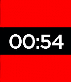</a>

<h2 class="app-name" id="app-568690d8ecd40927fa0000be"><a href="https://apps.repebble.com/568690d8ecd40927fa0000be">Amsterdam</a></h2>
<a class="app-source" href="https://github.com/tardypad/pebble-watchface-amsterdam" title="Source code" data-search-exclude>View source</a>

by <a href="https://apps.repebble.com/apps/dev/tardypad_54f499c184bffcea9f000068" title="More from this developer">tardypad</a>

Not checked yet v1.2 Updated 2016-09-07

Runs on: Round 2, Time 2, Time Round, Time

Watchface displaying the flag of Amsterdam at every minute change, with an animation Local settings to display the date as well handle Timeline Quick View

<a class="app-shot" href="https://apps.repebble.com/ccf3493e462a4b938b528cfc" data-search-exclude>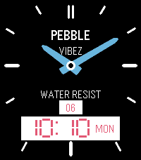</a>

<h2 class="app-name" id="app-ccf3493e462a4b938b528cfc"><a href="https://apps.repebble.com/ccf3493e462a4b938b528cfc">Ana-Digi Pro</a></h2>
<a class="app-source" href="https://github.com/Mesa-LLC/Ana-Digi-Pro" title="Source code" data-search-exclude>View source</a>

by <a href="https://apps.repebble.com/apps/dev/dimitrios-vlachos_296346ae8a735277a71ae4c6" title="More from this developer">Dimitrios Vlachos</a>

Apache-2.0 v4.4 Updated 2026-04-06

Runs on: Time 2, Pebble 2 Duo, Pebble 2, Time, Classic

Hybrid analogue-digital watchface Casio vibes for Pebble Classic and Pebble Steel. Combines virtual hands and dual LCD windows, all animating like an 80s sci-fi watch when returning to it. Sleek…

<a class="app-shot" href="https://apps.repebble.com/f8ea4d34aa3d4ba594745fac" data-search-exclude>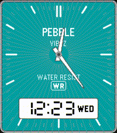</a>

<h2 class="app-name" id="app-f8ea4d34aa3d4ba594745fac"><a href="https://apps.repebble.com/f8ea4d34aa3d4ba594745fac">Ana-digi Vibez</a></h2>
<a class="app-source" href="https://github.com/ericmigi/anadigi-vibez" title="Source code" data-search-exclude>View source</a>

by <a href="https://apps.repebble.com/apps/dev/eric-migicovsky_cef3527f00d692f8c467ca17" title="More from this developer">Eric Migicovsky</a>

Not checked yet v1.0.0 Updated 2026-03-26

Runs on: Round 2, Time 2

Retro ana-digi with Casio vibes! For Pebble Time 2 and Pebble Round 2

<a class="app-shot" href="https://apps.repebble.com/54f72c27077144f816000055" data-search-exclude>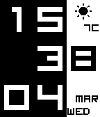</a>

<h2 class="app-name" id="app-54f72c27077144f816000055"><a href="https://apps.repebble.com/54f72c27077144f816000055">Anablock</a></h2>
<a class="app-source" href="https://github.com/vssh/pebble-anablock" title="Source code" data-search-exclude>View source</a>

by <a href="https://apps.repebble.com/apps/dev/vssh_54e22b7decca846cee000082" title="More from this developer">vssh</a>

Not checked yet v1.7 Updated 2015-03-15

Runs on: Time 2, Pebble 2 Duo, Pebble 2, Time, Classic

Watchface with weather, date and low battery and disconnect warning. Switches between analog and digital on wrist shake. Codebase from Simplicity and design inspiration from Crowex and Two Lines…

<a class="app-shot" href="https://apps.rebble.io/en_US/application/6a5248c9c5fa780009da3efd" data-search-exclude>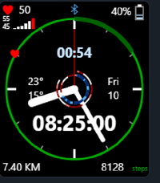</a>

<h2 class="app-name" id="app-6a5248c9c5fa780009da3efd"><a href="https://apps.rebble.io/en_US/application/6a5248c9c5fa780009da3efd">Analog Arcs</a></h2>
<a class="app-source" href="https://github.com/coffeng/Pebble-Watchface-Analog-Arcs" title="Source code" data-search-exclude>View source</a>

by <a href="https://apps.rebble.io/en_US/developer/6a524100b297de00081b9f83/1" title="More from this developer">Rene Coffeng</a>

Not checked yet v1.0.1 Updated 2026-07-27 Rebble App Store

Runs on: Time 2

Display activiy and sleep arcs on an analog watch. Includes also heart rate trend.

<a class="app-shot" href="https://apps.repebble.com/5608b975364a06eba9000022" data-search-exclude>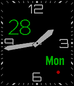</a>

<h2 class="app-name" id="app-5608b975364a06eba9000022"><a href="https://apps.repebble.com/5608b975364a06eba9000022">Analog BigDate</a></h2>
<a class="app-source" href="https://github.com/yoshimov/pebble-bigdate" title="Source code" data-search-exclude>View source</a>

by <a href="https://apps.repebble.com/apps/dev/yoshimov_5566c4b53b08fe49dd000022" title="More from this developer">yoshimov</a>

Not checked yet v1.8 Updated 2015-11-14

Runs on: Round 2, Time 2, Pebble 2 Duo, Pebble 2, Time Round, Time, Classic

Simple analog watch face with big date. The date and week texts will move to avoid overlapping with hands. The following items are customizable. - Second hand style (none/ball/line) - Second hand…

<a class="app-shot" href="https://apps.repebble.com/36d73649eeed467ab7e37551" data-search-exclude>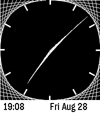</a>

<h2 class="app-name" id="app-36d73649eeed467ab7e37551"><a href="https://apps.repebble.com/36d73649eeed467ab7e37551">Analog Curve Stitch</a></h2>
<a class="app-source" href="https://github.com/unoctium1/PebbleFaceCurveStitch" title="Source code" data-search-exclude>View source</a>

by <a href="https://apps.repebble.com/apps/dev/unoctium1_26ff57466b2b8d653880091b" title="More from this developer">unoctium1</a>

Not checked yet v1.0.0 Updated 2026-08-29

Runs on: Round 2, Time 2

Minimal analog watch face inspired by curve stitching patterns. Includes customizable colors Compatible with Pebble Time 2 &amp; Pebble Round 2

<a class="app-shot" href="https://apps.repebble.com/570f8d6da3a1f9aa1f000010" data-search-exclude>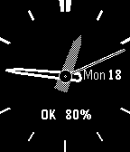</a>

<h2 class="app-name" id="app-570f8d6da3a1f9aa1f000010"><a href="https://apps.repebble.com/570f8d6da3a1f9aa1f000010">ANALOG P-SHOCK</a></h2>
<a class="app-source" href="https://github.com/bake-san/ANALOG-P-SHOCK.git" title="Source code" data-search-exclude>View source</a>

by <a href="https://apps.repebble.com/apps/dev/akemori-oda_56c1c9c5919c5acb8c000002" title="More from this developer">Akemori Oda</a>

No licence v1.2 Updated 2016-04-18

Runs on: Round 2, Time 2, Pebble 2 Duo, Pebble 2, Time Round, Time, Classic

The sample source to the original has been modifications to the reference to the analog clock of CASIO. サンプルソースを元にCASIOのアナログ時計を参考に修正をしました。 Ver1.1 was thinner second hand . Ver1.1 秒針を細くした。 Ver1.2…

<a class="app-shot" href="https://apps.repebble.com/2ecc5b56c55b46dc89a38a03" data-search-exclude>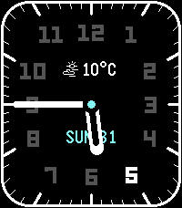</a>

<h2 class="app-name" id="app-2ecc5b56c55b46dc89a38a03"><a href="https://apps.repebble.com/2ecc5b56c55b46dc89a38a03">Analog Pretty</a></h2>
<a class="app-source" href="https://github.com/rafaelc007/pebble-analog-pretty" title="Source code" data-search-exclude>View source</a>

by <a href="https://apps.repebble.com/apps/dev/rafael-pereira_dd633264db7cf077fb225583" title="More from this developer">Rafael Pereira</a>

Not checked yet v1.2.7 Updated 2026-06-17

Runs on: Round 2, Time 2, Pebble 2 Duo, Pebble 2, Time Round, Time, Classic

Simple analog watchface with weather support. Digits dynamically change every hour.

<a class="app-shot" href="https://apps.repebble.com/55525cc271c40dcfc7000071" data-search-exclude>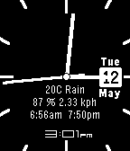</a>

<h2 class="app-name" id="app-55525cc271c40dcfc7000071"><a href="https://apps.repebble.com/55525cc271c40dcfc7000071">Analog Simple Thin</a></h2>
<a class="app-source" href="https://github.com/leonlipe/thinwithnumbers.git" title="Source code" data-search-exclude>View source</a>

by <a href="https://apps.repebble.com/apps/dev/leon-felipe_550f9acac0455737850000b5" title="More from this developer">Leon Felipe</a>

Not checked yet v1.11 Updated 2015-05-15

Runs on: Time 2, Pebble 2 Duo, Pebble 2, Time, Classic

A simple Analog Watch face You can show: - Time in digital - Temperature, conditions - Humidity, wind speed - Sunrise and sunset hours - Shows the date Plus, size for the hands, style of the…

<a class="app-shot" href="https://apps.repebble.com/57f3f1953c754a887a0000a9" data-search-exclude>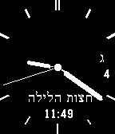</a>

<h2 class="app-name" id="app-57f3f1953c754a887a0000a9"><a href="https://apps.repebble.com/57f3f1953c754a887a0000a9">Analog Zmanim</a></h2>
<a class="app-source" href="https://github.com/BeezyWorks/pebble_zman" title="Source code" data-search-exclude>View source</a>

by <a href="https://apps.repebble.com/apps/dev/beezy-works-studios_54a02306a5a51914a3000114" title="More from this developer">Beezy Works Studios</a>

GPL-3.0 v1.5 Updated 2017-01-26

Runs on: Round 2, Time 2, Pebble 2 Duo, Pebble 2, Time Round, Time, Classic

Simple analog watchface with Hebrew and Gregorian date that displays upcoming zmanim. Zmanim are calculated on the watch itself and do not require an internet connection. Zmanim are accurate +- 2…

<a class="app-shot" href="https://apps.repebble.com/57016a58cd2a15ffcd000041" data-search-exclude>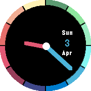</a>

<h2 class="app-name" id="app-57016a58cd2a15ffcd000041"><a href="https://apps.repebble.com/57016a58cd2a15ffcd000041">AnalogRainbow</a></h2>
<a class="app-source" href="https://github.com/ofietze/analograinbow" title="Source code" data-search-exclude>View source</a>

by <a href="https://apps.repebble.com/apps/dev/4t2_563f600c8e55a1b90c00004f" title="More from this developer">4T2</a>

Not checked yet v1.3 Updated 2016-05-29

Runs on: Round 2, Time Round

This Watchface is all about Color! The hour and minute hands change their color, depending on which part of the outer ring they are pointing at. Displayed on the right (or left, depending on where…

<a class="app-shot" href="https://apps.rebble.io/en_US/application/69343ba1bd6440000946e487" data-search-exclude>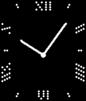</a>

<h2 class="app-name" id="app-69343ba1bd6440000946e487"><a href="https://apps.rebble.io/en_US/application/69343ba1bd6440000946e487">Analogue Dots</a></h2>
<a class="app-source" href="https://github.com/flokndl/watchface-analogue-dots" title="Source code" data-search-exclude>View source</a>

by <a href="https://apps.rebble.io/en_US/developer/69207a520a015600086f2e44/1" title="More from this developer">Flo Knödl</a>

Not checked yet v1.5 Updated 2025-12-20 Rebble App Store

Runs on: Time 2, Pebble 2 Duo, Pebble 2

Simple analoge watchface with two style. -- Now with Chronomode -- Activate it settings -&gt; tap/flick starts seconds&amp;minute stopwatch. -&gt; if persistent mode is active tap/flick resets chrono.

<a class="app-shot" href="https://apps.repebble.com/7aa753337cf04ec89830e08b" data-search-exclude>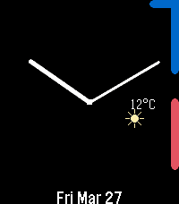</a>

<h2 class="app-name" id="app-7aa753337cf04ec89830e08b"><a href="https://apps.repebble.com/7aa753337cf04ec89830e08b">Analogue Time Arc</a></h2>
<a class="app-source" href="https://github.com/davv47/Analogue_Time_Arc" title="Source code" data-search-exclude>View source</a>

by <a href="https://apps.repebble.com/apps/dev/davv47_1e99e01092773fbbf3fc696c" title="More from this developer">davv47</a>

Not checked yet v1.3 Updated 2026-04-08

Runs on: Round 2, Time 2, Time Round, Time

Watchface that shows public event event calendars in an arc on the perimeter of the screen. Notes: - This only works on public calendar feeds (at the moment). You can create public calendar feeds…

<a class="app-shot" href="https://apps.repebble.com/4b9bac75f03745dcb4d86f25" data-search-exclude>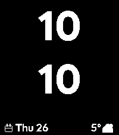</a>

<h2 class="app-name" id="app-4b9bac75f03745dcb4d86f25"><a href="https://apps.repebble.com/4b9bac75f03745dcb4d86f25">Android Pixel</a></h2>
<a class="app-source" href="https://github.com/paul-em/pebble-android-watchface" title="Source code" data-search-exclude>View source</a>

by <a href="https://apps.repebble.com/apps/dev/paul3m_27ef9d2ded8279c429fce882" title="More from this developer">paul3m</a>

Not checked yet v1.1 Updated 2026-03-26

Runs on: Round 2, Time 2, Pebble 2 Duo, Pebble 2, Time Round, Time, Classic

Currently mainly built for Pebble 2 Duo. Pebble Time 2 optimizations will follow

<a class="app-shot" href="https://apps.repebble.com/54fc3b8f2bf1bf614f000004" data-search-exclude>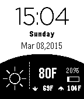</a>

<h2 class="app-name" id="app-54fc3b8f2bf1bf614f000004"><a href="https://apps.repebble.com/54fc3b8f2bf1bf614f000004">Android Weather</a></h2>
<a class="app-source" href="https://github.com/cchienhs/androidweather.git" title="Source code" data-search-exclude>View source</a>

by <a href="https://apps.repebble.com/apps/dev/coolskies_54d911a405db7bc4c20000c0" title="More from this developer">coolskies</a>

Not checked yet v2.03 Updated 2015-08-12

Runs on: Time 2, Pebble 2 Duo, Pebble 2, Time, Classic

WatchFace that emulates Android Weather Face. Used to be know as Android Weather F or Android Weather C. Have merged the two together since there is now a settings page.

<a class="app-shot" href="https://apps.repebble.com/550e454cad788cf90b0000ad" data-search-exclude>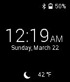</a>

<h2 class="app-name" id="app-550e454cad788cf90b0000ad"><a href="https://apps.repebble.com/550e454cad788cf90b0000ad">AndroidHome</a></h2>
<a class="app-source" href="https://github.com/kjlaw89/Pebble-AndroidHome" title="Source code" data-search-exclude>View source</a>

by <a href="https://apps.repebble.com/apps/dev/kj-lawrence_54fbb88ba3892f6af2000053" title="More from this developer">KJ Lawrence</a>

Not checked yet v1.0 Updated 2015-03-22

Runs on: Time 2, Pebble 2 Duo, Pebble 2, Time, Classic

A simple watchface that takes visual cues from Android&#x27;s lockscreen. AndroidHome provides weather and bluetooth/battery statuses. Weather is provided by Forecast.io and needs an API key that can…

<h2 class="app-name" id="app-580b468353c08f2d950000b1"><a href="https://apps.repebble.com/580b468353c08f2d950000b1">Anery</a></h2>
<a class="app-source" href="https://github.com/GreenHex/Pebble.Anery" title="Source code" data-search-exclude>View source</a>

by <a href="https://apps.repebble.com/apps/dev/the-resetter_5415133bbcd1cf9264000081" title="More from this developer">The Resetter</a>

MIT v1.33 Updated 2017-02-05

Runs on: Time 2, Pebble 2 Duo, Pebble 2, Time, Classic

Anery for Pebble. - Precise, easy-to-read analog watchface. - Three analog watchfaces selectable by the user. - Large date. - Hourly or half-hourly buzz. - Display seconds hand by shaking watch. …

<h2 class="app-name" id="app-580ca87153c08f730600019f"><a href="https://apps.repebble.com/580ca87153c08f730600019f">Anery+</a></h2>
<a class="app-source" href="https://github.com/GreenHex/Pebble.Anery.Plus" title="Source code" data-search-exclude>View source</a>

by <a href="https://apps.repebble.com/apps/dev/the-resetter_5415133bbcd1cf9264000081" title="More from this developer">The Resetter</a>

MIT v1.2 Updated 2016-11-02

Runs on: Time 2

Anery+ for Pebble Time 2. Anery+ is based on BLISS TIME by Michael Reyes. - Super precise, easy-to-read, analog clock face. - Digital and analog watch faces. - Display seconds in analog display by…

<h2 class="app-name" id="app-583cf2e1ca3094bdc0000507"><a href="https://apps.repebble.com/583cf2e1ca3094bdc0000507">Anery-</a></h2>
<a class="app-source" href="https://github.com/GreenHex/Pebble.Anery.Minus" title="Source code" data-search-exclude>View source</a>

by <a href="https://apps.repebble.com/apps/dev/the-resetter_5415133bbcd1cf9264000081" title="More from this developer">The Resetter</a>

MIT v1.16 Updated 2017-01-21

Runs on: Time 2, Pebble 2 Duo, Pebble 2, Time, Classic

Lightweight version of the &quot;Anery&quot; watchface. - Easy-to-read, clean analog watchface. - Small, power-efficient code. - Supports Timeline Quick View. - Shake to display seconds hand for 5 seconds…

<h2 class="app-name" id="app-585369da5de85056f0000044"><a href="https://apps.repebble.com/585369da5de85056f0000044">Anery-SQ</a></h2>
<a class="app-source" href="https://github.com/GreenHex/Pebble.Anery.SQ" title="Source code" data-search-exclude>View source</a>

by <a href="https://apps.repebble.com/apps/dev/the-resetter_5415133bbcd1cf9264000081" title="More from this developer">The Resetter</a>

No licence v1.9 Updated 2017-02-06

Runs on: Time 2, Pebble 2 Duo, Pebble 2, Time, Classic

Another variation of the Anery watchface, {influenced|copied|derived} {by|from} the famous &quot;Notorious&quot; watchface by Tim Krief. Shake watch to display seconds and battery status for 8 seconds.

<h2 class="app-name" id="app-6829ed79e282b00009e55256"><a href="https://apps.repebble.com/6829ed79e282b00009e55256">Angelic Ascent</a></h2>
<a class="app-source" href="https://github.com/HarrisonAllen/angels-and-demons" title="Source code" data-search-exclude>View source</a>

by <a href="https://apps.repebble.com/apps/dev/harrison-allen_5e28ea923dd3109f151c7e08" title="More from this developer">Harrison Allen</a>

No licence v1.0 Updated 2025-05-18

Runs on: Round 2, Time 2, Pebble 2 Duo, Pebble 2, Time Round, Time, Classic

Embrace your inner angel with Angelic Ascent, with the following features: * Time * Date * Weather * Temperature * Shown as a range from very cold (30F) to very hot(100F), with comfortable (65F)…

<h2 class="app-name" id="app-53e9cbba80a0272d690001cb"><a href="https://apps.repebble.com/53e9cbba80a0272d690001cb">Angled Left</a></h2>
<a class="app-source" href="https://github.com/mereed/pebbleface-angled" title="Source code" data-search-exclude>View source</a>

by <a href="https://apps.repebble.com/apps/dev/chops_52d76309bd61272345000001" title="More from this developer">chops</a>

Not checked yet v1.0 Updated 2014-08-19

Runs on: Time 2, Pebble 2 Duo, Pebble 2, Time, Classic

Borrows from a similar watchface, &#x27;diagonal&#x27;, by dotar, and similar to the &#x27;slanted&#x27; concept by firelighter. ps. the un-eveness of text is intentional. settings: invert, bluetooth vibe (with…

<h2 class="app-name" id="app-56a23556956f0b5e06000046"><a href="https://apps.repebble.com/56a23556956f0b5e06000046">Angry kitty</a></h2>
<a class="app-source" href="https://github.com/OlessiaPanteleeva/PebbleWatchFacesEvilCat.git" title="Source code" data-search-exclude>View source</a>

by <a href="https://apps.repebble.com/apps/dev/olessia-panteleeva_5685b785ecd4098d8b000059" title="More from this developer">Olessia Panteleeva</a>

MIT v1.1 Updated 2016-02-11

Runs on: Time 2, Pebble 2 Duo, Pebble 2, Time, Classic

Watchface with time and angry cat

<h2 class="app-name" id="app-54c530ef2bf96f8f1d00003d"><a href="https://apps.repebble.com/54c530ef2bf96f8f1d00003d">Animated Gumball Watchface</a></h2>
<a class="app-source" href="https://cloudpebble.net/ide/project/123128" title="Source code" data-search-exclude>View source</a>

by <a href="https://apps.repebble.com/apps/dev/grsan_54baf562e2329c50940000ba" title="More from this developer">grsan</a>

See source v1.0 Updated 2015-02-07

Runs on: Time 2, Pebble 2 Duo, Pebble 2, Time, Classic

This is a watchface I made for my friend originally, but now, anyone can modify it if they want, but you must give credit to me, the creator, for the original product. Note: if the link to the…

<h2 class="app-name" id="app-5723a8c7801d31f15900000c"><a href="https://apps.repebble.com/5723a8c7801d31f15900000c">Animated Pokemon Face</a></h2>
<a class="app-source" href="https://github.com/a-spo/AnimatedDex.git" title="Source code" data-search-exclude>View source</a>

by <a href="https://apps.repebble.com/apps/dev/invitedsun_570af466235d5ac80f000006" title="More from this developer">invitedsun</a>

No licence v1.0 Updated 2016-05-02

Runs on: Round 2, Time 2, Time Round, Time

This watchface features Gen 6 sprites! Included in this version are Mega Asbol, Lanturn, Azumarill, and Luxray. Shake to animate each sprite for 10 seconds. With the release of sun and moon, gen 7…

<h2 class="app-name" id="app-575b9310beeadda36e000018"><a href="https://apps.repebble.com/575b9310beeadda36e000018">Ann Arbor Meetup Demo Watchface</a></h2>
<a class="app-source" href="https://github.com/PebbleA2/PebbleA2" title="Source code" data-search-exclude>View source</a>

by <a href="https://apps.repebble.com/apps/dev/ish-ot-jr_52f1ada1f216769cb90007ca" title="More from this developer">Ish Ot Jr.</a>

No licence v0.1 Updated 2016-06-11

Runs on: Round 2, Time 2, Pebble 2 Duo, Pebble 2, Time Round, Time, Classic

This is a simple demo watchface for the PebbleA2 Meetup in Ann Arbor, Michigan. Unless you&#x27;re an attendee, or interested in learning how to make a basic watchface, it&#x27;s probably not of any…

<h2 class="app-name" id="app-55a59977ba679ad6c2000074"><a href="https://apps.repebble.com/55a59977ba679ad6c2000074">ANNA&#x27;S NS</a></h2>
<a class="app-source" href="https://github.com/Kdisimone/cgm-pebble.git" title="Source code" data-search-exclude>View source</a>

by <a href="https://apps.repebble.com/apps/dev/testyk8_55514ddbcf532c2c780000a6" title="More from this developer">testyk8</a>

No licence v1.1 Updated 2015-07-14

Runs on: Time 2, Pebble 2 Duo, Pebble 2, Time, Classic

A CUSTOMIZED WATCHFACE FOR MY T1D ANNA. DEVELOPED FROM NS CGM PEBBLE SOURCE FILES

<h2 class="app-name" id="app-57cd7bd4f69d1dff8d000352"><a href="https://apps.repebble.com/57cd7bd4f69d1dff8d000352">Another Revolution</a></h2>
<a class="app-source" href="https://github.com/Sichroteph/Another_Revolution" title="Source code" data-search-exclude>View source</a>

by <a href="https://apps.repebble.com/apps/dev/christophe-jeannette_54edf0599e4ff7cbf60000a0" title="More from this developer">Christophe Jeannette</a>

No licence v2.0 Updated 2016-09-05

Runs on: Time 2, Pebble 2 Duo, Pebble 2, Time, Classic

Implemented by Douwe Maan. Slightly modified by Christophe Jeannette in order to add : Slicker animations Battery instead of the seconds (Battery friendly) Two automatic languages : English and…

<h2 class="app-name" id="app-53ff6a20d08f5306bb0000df"><a href="https://apps.repebble.com/53ff6a20d08f5306bb0000df">Another Spock</a></h2>
<a class="app-source" href="https://github.com/thexf/pebble_wf.git" title="Source code" data-search-exclude>View source</a>

by <a href="https://apps.repebble.com/apps/dev/andrey_5305fbc67f3576d15a0001f7" title="More from this developer">Andrey</a>

Not checked yet v1.00 Updated 2015-04-05

Runs on: Time 2, Pebble 2 Duo, Pebble 2, Time, Classic

Time, battery state and Mr. Spock! And for weekends &quot;Dark Picard&quot; =)

<h2 class="app-name" id="app-557001f1f51afe500d00009a"><a href="https://apps.repebble.com/557001f1f51afe500d00009a">AnsaWatchface</a></h2>
<a class="app-source" href="http://github.com/Antroid/Blesciasw_watchface" title="Source code" data-search-exclude>View source</a>

by <a href="https://apps.repebble.com/apps/dev/antonio_532c25a281004176850001f8" title="More from this developer">Antonio</a>

No licence v1.0 Updated 2015-06-04

Runs on: Time 2, Pebble 2 Duo, Pebble 2, Time, Classic

AnsaWatchface consente di visualizzare le ultime notizie pubblicate sul sito ansa.it direttamente sul tuo orologio.

<h2 class="app-name" id="app-529aab4a16952349bb000027"><a href="https://apps.repebble.com/529aab4a16952349bb000027">Antichamber</a></h2>
<a class="app-source" href="https://github.com/rigel314/pebbleAntichamber" title="Source code" data-search-exclude>View source</a>

by <a href="https://apps.repebble.com/apps/dev/rigel314_529aa0fad17b50707b00001d" title="More from this developer">rigel314</a>

Not checked yet v2.0.0 Updated 2014-02-04

Runs on: Time 2, Pebble 2 Duo, Pebble 2, Time, Classic

A Pebble watchface inspired by the map in the amazing game, Antichamber.

<h2 class="app-name" id="app-723a7e89e3624f45a3e323b5"><a href="https://apps.repebble.com/723a7e89e3624f45a3e323b5">Anticipate</a></h2>
<a class="app-source" href="https://github.com/unruh-bros-print-co/anticipate" title="Source code" data-search-exclude>View source</a>

by <a href="https://apps.repebble.com/apps/dev/unruh-bros-print-co_b6bfb46eef94f16e84d4cd95" title="More from this developer">Unruh Bros. Print Co.</a>

Not checked yet v1.2.0 Updated 2026-05-31

Runs on: Round 2, Time 2, Pebble 2 Duo, Pebble 2, Time

Anticipate! All the basic information you need to be prepared for the day ahead! Features - Today&#x27;s date - Step Count - Forecasted high temperature - Current temperature - Forecasted low…

<h2 class="app-name" id="app-56ed6b537e080dac26000006"><a href="https://apps.repebble.com/56ed6b537e080dac26000006">AoFaceClock1st</a></h2>
<a class="app-source" href="https://github.com/bake-san/PebleWatch" title="Source code" data-search-exclude>View source</a>

by <a href="https://apps.repebble.com/apps/dev/akemori-oda_56c1c9c5919c5acb8c000002" title="More from this developer">Akemori Oda</a>

No licence v1.6 Updated 2016-04-26

Runs on: Round 2, Time 2, Pebble 2 Duo, Pebble 2, Time Round, Time, Classic

Pebble is the first work of the Watch Face Clock. And the analog clock by the circle , digital clock at the center The connection status (OK / NG), have been displayed in the remaining battery…

<h2 class="app-name" id="app-39337ad3575d4d669763f6cc"><a href="https://apps.repebble.com/39337ad3575d4d669763f6cc">Apex Shadow</a></h2>
<a class="app-source" href="https://github.com/AhmedTheGeek/apex-shadow" title="Source code" data-search-exclude>View source</a>

by <a href="https://apps.repebble.com/apps/dev/me_feb5b371a72bf135f131570d" title="More from this developer">me</a>

No licence v1.1.0 Updated 2026-05-19

Runs on: Round 2, Time 2, Pebble 2 Duo, Pebble 2, Time Round, Time, Classic

A sundial that learned to keep secrets. There is a light you cannot see. A shadow that knows the hour. And underneath, the minutes, waiting for the shadow to pass over. Read it twice. The first…

<h2 class="app-name" id="app-1269ce5888024c51a96e8b67"><a href="https://apps.repebble.com/1269ce5888024c51a96e8b67">Approach</a></h2>
<a class="app-source" href="https://github.com/sybenx/approach" title="Source code" data-search-exclude>View source</a>

by <a href="https://apps.repebble.com/apps/dev/sybenx_d4c43f7b0132a46ff8340e8e" title="More from this developer">sybenx</a>

Not checked yet v1.3.2 Updated 2026-10-01

Runs on: Time 2, Pebble 2 Duo, Pebble 2, Time, Classic

Approach is a bold, high-contrast watchface built around the next mark. A segmented bar fills a minute at a time toward :00 and :30 (or every 15, 20 or 60 minutes, at any minutes past the hour)…

<h2 class="app-name" id="app-458f35557f90489f8a0967ce"><a href="https://apps.repebble.com/458f35557f90489f8a0967ce">Aptos Watch</a></h2>
<a class="app-source" href="https://github.com/manaksu/Aptos-Watch" title="Source code" data-search-exclude>View source</a>

by <a href="https://apps.repebble.com/apps/dev/creative-manaks_504fe850dc7e97a445b0a10d" title="More from this developer">Creative Manaks</a>

Not checked yet v1.0.7 Updated 2026-05-30

Runs on: Time 2, Pebble 2 Duo, Pebble 2, Time

new

<h2 class="app-name" id="app-ddf9f5400c1e4c62911fcc56"><a href="https://apps.repebble.com/ddf9f5400c1e4c62911fcc56">AQ-800</a></h2>
<a class="app-source" href="https://github.com/dot-Justin/Pebble-WF-Casio-AQ-800" title="Source code" data-search-exclude>View source</a>

by <a href="https://apps.repebble.com/apps/dev/dotjustin_4b6299c72480e7810068a64a" title="More from this developer">dotJustin</a>

Not checked yet v1.2.0 Updated 2026-06-15

Runs on: Time 2

Faithful recreation of the classic 80s ana-digi dual-display watch for Pebble Time 2. Metal hands that catch the light as they sweep, applied markers, grid dial, and a segment-true LCD showing…

<h2 class="app-name" id="app-67fbabbd8b96250009ecfabe"><a href="https://apps.repebble.com/67fbabbd8b96250009ecfabe">Aqua (Animated)</a></h2>
<a class="app-source" href="https://github.com/priyankark/aqua-pbw" title="Source code" data-search-exclude>View source</a>

by <a href="https://apps.repebble.com/apps/dev/aircodum_67bc77bf37d408000a74f7d3" title="More from this developer">AirCodum</a>

Not checked yet v6.0 Updated 2025-04-14

Runs on: Round 2, Time 2, Pebble 2 Duo, Pebble 2, Time Round, Time, Classic

A live aquarium on your wrist!

<h2 class="app-name" id="app-52e534556e3045b08c05482e"><a href="https://apps.repebble.com/52e534556e3045b08c05482e">Aquarium</a></h2>
<a class="app-source" href="https://github.com/ygalanter/Aquarium-Pebble" title="Source code" data-search-exclude>View source</a>

by <a href="https://apps.repebble.com/apps/dev/comfortably-numb_52f547605101128b2200005a" title="More from this developer">Comfortably Numb</a>

Not checked yet v1.2.0 Updated 2026-06-19

Runs on: Time 2

Time floating inside of beautiful tropical aquarium. Shake the watch to cycles thru: Date 📅 Day of the week 📆 Steps count 👟 Calories burned 🔥 Distance walked 🚶(miles or kilometers, depending on…

<h2 class="app-name" id="app-530367889847d1bdee00020f"><a href="https://apps.repebble.com/530367889847d1bdee00020f">Arabesque</a></h2>
<a class="app-source" href="https://cloudpebble.net/ide/project/35597#" title="Source code" data-search-exclude>View source</a>

by <a href="https://apps.repebble.com/apps/dev/eric-bergelin_52cc26b045ffdd1c56000157" title="More from this developer">Eric BERGELIN</a>

See source v1.4 Updated 2014-03-04

Runs on: Time 2, Pebble 2 Duo, Pebble 2, Time, Classic

Random art &amp; drawings. Become an artist every minute. How nice! Oh! hour is indicated by the tangent at the center, and minutes where the curve leaves the screen. New version more readeable. Enjoy

<h2 class="app-name" id="app-533c0b7cee460af0a70001f8"><a href="https://apps.repebble.com/533c0b7cee460af0a70001f8">Arabic Hijri</a></h2>
<a class="app-source" href="https://github.com/saljam/hijri-watchface" title="Source code" data-search-exclude>View source</a>

by <a href="https://apps.repebble.com/apps/dev/salman-aljammaz_532c3d9142be7edd0e00027f" title="More from this developer">Salman Aljammaz</a>

Not checked yet v3.6 Updated 2015-10-11

Runs on: Time 2, Pebble 2 Duo, Pebble 2, Time, Classic

Arabic watchface with Hijri and Gregorian calendar.

<h2 class="app-name" id="app-54caed17ff5972bf4500004d"><a href="https://apps.repebble.com/54caed17ff5972bf4500004d">Arc</a></h2>
<a class="app-source" href="https://github.com/adamheins/arc" title="Source code" data-search-exclude>View source</a>

by <a href="https://apps.repebble.com/apps/dev/adam-heins_54ac569df3a173a17a000103" title="More from this developer">Adam Heins</a>

MIT v1.0 Updated 2015-01-30

Runs on: Time 2, Pebble 2 Duo, Pebble 2, Time, Classic

A minimalist Watchface that displays time using arcs. The inner arc represents the number of hours since twelve o&#x27;clock. The outer arc represents the number of minutes since the start of the hour.

<h2 class="app-name" id="app-52bdadff83ed912a860000a1"><a href="https://apps.repebble.com/52bdadff83ed912a860000a1">Arc</a></h2>
<a class="app-source" href="https://github.com/Jnmattern/Arc_2.0" title="Source code" data-search-exclude>View source</a>

by <a href="https://apps.repebble.com/apps/dev/jnm_529994c0e627ce7ba1000050" title="More from this developer">Jnm</a>

No licence v3.3 Updated 2026-03-02

Runs on: Round 2, Time 2, Pebble 2 Duo, Pebble 2, Time Round, Time, Classic

Simple design watchface showing hour and minutes. Tap or twist your wrist to sequentially display the date, the battery percentage, the phone connection status and the time in digits. Use the…

<h2 class="app-name" id="app-5d9ac4c4c393f5765a696540"><a href="https://apps.repebble.com/5d9ac4c4c393f5765a696540">Arc Calendar</a></h2>
<a class="app-source" href="https://bitbucket.org/derivat3/pebble-watchface-arc-calendar" title="Source code" data-search-exclude>View source</a>

by <a href="https://apps.repebble.com/apps/dev/sesio_5d9ac4c3c393f5765a69653e" title="More from this developer">sesio</a>

See source v2.1 Updated 2021-12-17

Runs on: Round 2, Time 2, Pebble 2 Duo, Pebble 2, Time Round, Time, Classic

Highly configurable analog watchface, which solves the problem of scheduling in daily business. With a connected Google Calendar, you will now see upcoming appointments directly on your wrist and…

<h2 class="app-name" id="app-5843921800355aeb3d0008d1"><a href="https://apps.rebble.io/en_US/application/5843921800355aeb3d0008d1">Arc Diem</a></h2>
<a class="app-source" href="https://github.com/JenniferNeff/arc-diem" title="Source code" data-search-exclude>View source</a>

by <a href="https://apps.rebble.io/en_US/developer/54b0c3604b9e28fb69000046/1" title="More from this developer">Jennifer Neff</a>

No licence v1.2 Updated 2016-12-29 Rebble App Store

Runs on: Round 2, Time 2, Pebble 2 Duo, Pebble 2, Time Round, Time, Classic

Configure this watchface with the hour your day starts, and the hour it ends, and the hand will trace out the duration of your day and night. The design was inspired by semicircular clocks in…

<h2 class="app-name" id="app-6abe92fb5af6a30009f371ac"><a href="https://apps.rebble.io/en_US/application/6abe92fb5af6a30009f371ac">Arc View</a></h2>
<a class="app-source" href="https://github.com/lnbot/arc-view" title="Source code" data-search-exclude>View source</a>

by <a href="https://apps.rebble.io/en_US/developer/6abe8fcaaef3d70009c6ff7b/1" title="More from this developer">lnbot</a>

Not checked yet v1.0.1 Updated 2026-10-01 Rebble App Store

Runs on: Round 2, Time Round

Watchface with a minute hand and digital hour. Also features optional orbiting complications, sub-minute hand movement, and a minute tick visibility window. With the optional Android companion…

<h2 class="app-name" id="app-55ef051aaab2f909b9000021"><a href="https://apps.repebble.com/55ef051aaab2f909b9000021">Arc Watchface</a></h2>
<a class="app-source" href="https://github.com/grit96/ArcWatchface" title="Source code" data-search-exclude>View source</a>

by <a href="https://apps.repebble.com/apps/dev/geraint-white_549bf174054472596700023a" title="More from this developer">Geraint White</a>

Not checked yet v1.4 Updated 2025-12-01

Runs on: Time 2, Pebble 2 Duo, Pebble 2, Time, Classic

Arc watchface with arcs for hours (inner) and minutes (outer). Has battery percentage in the middle and date below. Colours can be inverted and battery percentage and date visibility can be…

<h2 class="app-name" id="app-55107bb6daf2051cdb000027"><a href="https://apps.repebble.com/55107bb6daf2051cdb000027">Arc1</a></h2>
<a class="app-source" href="https://codeberg.org/fnord/Arc1" title="Source code" data-search-exclude>View source</a>

by <a href="https://apps.repebble.com/apps/dev/fnord-prefect_54f396182eee75ef250000ba" title="More from this developer">Fnord Prefect</a>

See source v1.15 Updated 2025-04-21

Runs on: Round 2, Time 2, Pebble 2 Duo, Pebble 2, Time Round, Time, Classic

A distinct arc for minutes, a small hour arc or hand that&#x27;s clearly visible but does not distract from the minutes arc, and a subtle seconds display. Additional features include a (subtle) battery…

<h2 class="app-name" id="app-52f072e93fbdba5287001a81"><a href="https://apps.repebble.com/52f072e93fbdba5287001a81">Arcade Time</a></h2>
<a class="app-source" href="https://github.com/ice2097/Arcade_Time" title="Source code" data-search-exclude>View source</a>

by <a href="https://apps.repebble.com/apps/dev/ice2097_52f060be61b75250fb0016d1" title="More from this developer">Ice2097</a>

Not checked yet v2.0.0 Updated 2014-02-04

Runs on: Time 2, Pebble 2 Duo, Pebble 2, Time, Classic

A BigTime variant, with a classic arcade score font, and the day, month, and date at the bottom.

<h2 class="app-name" id="app-564f8291331881d7d1000018"><a href="https://apps.repebble.com/564f8291331881d7d1000018">Arcangle</a></h2>
<a class="app-source" href="https://github.com/lastfuture/Pebble-Time-Watchface-Arcangle" title="Source code" data-search-exclude>View source</a>

by <a href="https://apps.repebble.com/apps/dev/lastfuture_52f00cd8e523d0248c00000d" title="More from this developer">lastfuture</a>

Not checked yet v1.3 Updated 2015-11-25

Runs on: Round 2, Time Round

A watchface for the hacker spy in you. Made exclusively for Pebble Time Round Examples: 8:01, 5:20, 8:17, 11:52 You read the start and the end of the line like regular watch hands, the piece…

<h2 class="app-name" id="app-fe84cab39618424480b5b4f6"><a href="https://apps.repebble.com/fe84cab39618424480b5b4f6">Archery</a></h2>
<a class="app-source" href="https://github.com/howeaj/pebble-archery" title="Source code" data-search-exclude>View source</a>

by <a href="https://apps.repebble.com/apps/dev/howeaj_985832377863a3ae441861fe" title="More from this developer">howeaj</a>

Not checked yet v1.10 Updated 2026-04-25

Runs on: Round 2, Time 2, Pebble 2 Duo, Pebble 2, Time Round, Time, Classic

Watch out! Tiny archers are shooting your wrist! Luckily, the arrows conveniently point to the current time. Their aim is a bit off, but if you can figure out how to help them, you may be…

<h2 class="app-name" id="app-72fb25c0fe5544428d71d221"><a href="https://apps.repebble.com/72fb25c0fe5544428d71d221">Arcminute</a></h2>
<a class="app-source" href="https://github.com/arfct/arcminute-watchface" title="Source code" data-search-exclude>View source</a>

by <a href="https://apps.repebble.com/apps/dev/artifact_52e20aedb806fdcf4300018b" title="More from this developer">Artifact</a>

MIT v2.6.0 Updated 2026-09-11

Runs on: Round 2, Time 2, Pebble 2 Duo, Pebble 2, Time Round, Time, Classic

Formerly Chronology. Most watch faces show twelve hours so you can find one. Arcminute shows the one it is. The dial is wider than the screen and slides past through the day, so the current hour…

<h2 class="app-name" id="app-54f245bd0bea20aa090000ce"><a href="https://apps.repebble.com/54f245bd0bea20aa090000ce">ArcS</a></h2>
<a class="app-source" href="https://github.com/chms/ArcS" title="Source code" data-search-exclude>View source</a>

by <a href="https://apps.repebble.com/apps/dev/cs_5453716ff44f6aceb9000061" title="More from this developer">cS</a>

Not checked yet v1.1 Updated 2015-03-05

Runs on: Time 2, Pebble 2 Duo, Pebble 2, Time, Classic

Yet another watchface that uses arcs to illustrate how time flies.

<h2 class="app-name" id="app-40d48d07d398413fbe331dc3"><a href="https://apps.repebble.com/40d48d07d398413fbe331dc3">ARCs</a></h2>
<a class="app-source" href="https://github.com/thementalgoose/pebble-arcs" title="Source code" data-search-exclude>View source</a>

by <a href="https://apps.repebble.com/apps/dev/jordan-fisher_5d482ff5d76b0f00018300f2" title="More from this developer">Jordan Fisher</a>

Not checked yet v2.3.0 Updated 2026-09-29

Runs on: Round 2, Time 2, Pebble 2 Duo, Pebble 2, Time Round, Time, Classic

Simple pebble watchface with indicator arcs in 4 corners of the display - Support for 12/24h times - Support for all watch types and sizes - Configurable colors for each indicators - Configurable…

<h2 class="app-name" id="app-54fb92804720a88f330000a6"><a href="https://apps.repebble.com/54fb92804720a88f330000a6">ArcS+</a></h2>
<a class="app-source" href="https://github.com/chms/ArcS" title="Source code" data-search-exclude>View source</a>

by <a href="https://apps.repebble.com/apps/dev/cs_5453716ff44f6aceb9000061" title="More from this developer">cS</a>

Not checked yet v1.2 Updated 2015-03-08

Runs on: Time 2, Pebble 2 Duo, Pebble 2, Time, Classic

ArcS+ uses arcs to illustrate how time flies. At the same time it features a digital clock, the date, the weekday and indicators for your battery and the bluetooth connection to your phone.

<h2 class="app-name" id="app-5508e6201a6b43fbeb00008f"><a href="https://apps.repebble.com/5508e6201a6b43fbeb00008f">ArcTime</a></h2>
<a class="app-source" href="https://github.com/sitefeng/ArcTime" title="Source code" data-search-exclude>View source</a>

by <a href="https://apps.repebble.com/apps/dev/si-te_541a4e73a3c11b4d5c000089" title="More from this developer">Si Te</a>

Not checked yet v1.0 Updated 2015-03-18

Runs on: Time 2, Pebble 2 Duo, Pebble 2, Time, Classic

ArcTime is an artistic watchface that uses only lines and dots to create intricate numbers. Made for Pebble Time and Pebble Time Steel.

<h2 class="app-name" id="app-d119efdfa11e498496d4d411"><a href="https://apps.repebble.com/d119efdfa11e498496d4d411">Argus</a></h2>
<a class="app-source" href="https://github.com/filcuk/pebble-watchface-argus" title="Source code" data-search-exclude>View source</a>

by <a href="https://apps.repebble.com/apps/dev/filcuk_ca14dda8e44031072403fd6a" title="More from this developer">Filcuk</a>

Not checked yet v1.3.1 Updated 2026-07-27

Runs on: Time 2

Argus guides you through the days ahead with hourly weather forecast, a two-week calendar view and a configurable header to focus on what is important.

<h2 class="app-name" id="app-52ace1ec19ff5001fc00001d"><a href="https://apps.rebble.io/en_US/application/52ace1ec19ff5001fc00001d">ARRL</a></h2>
<a class="app-source" href="https://github.com/DHKaplan/ARRL/blob/master/ARRL-V7.2.zip" title="Source code" data-search-exclude>View source</a>

by <a href="https://apps.rebble.io/en_US/developer/52acd9c431a5fa984900002e/1" title="More from this developer">WA1OUI</a>

No licence v7.2 Updated 2016-10-18 Rebble App Store

Runs on: Round 2, Time 2, Pebble 2 Duo, Pebble 2, Time Round, Time, Classic

This is the Logo of the ARRL (American Radio Relay League) which is the US National organization for Ham (Amateur) Radio. A Bluetooth indicator (and optional vibration when connectivity is lost)…

<h2 class="app-name" id="app-5692f973a45b56bdcb000008"><a href="https://apps.repebble.com/5692f973a45b56bdcb000008">Arrow</a></h2>
<a class="app-source" href="https://github.com/fgolemo/pebble-face-arrow" title="Source code" data-search-exclude>View source</a>

by <a href="https://apps.repebble.com/apps/dev/flogo_5491ccc0f94ab3937f0000ee" title="More from this developer">flogo</a>

Not checked yet v1.3 Updated 2016-02-12

Runs on: Round 2, Time 2, Pebble 2 Duo, Pebble 2, Time Round, Time, Classic

Simple retro digital watchface with pixel art font. Now with battery indicator (thin black line at the border between black and white, full = black, low = white). If you want some optional…

<h2 class="app-name" id="app-56ff9ad23ca6fda7bd00002e"><a href="https://apps.repebble.com/56ff9ad23ca6fda7bd00002e">Arsenal</a></h2>
<a class="app-source" href="https://github.com/sdneon/Arsenal" title="Source code" data-search-exclude>View source</a>

by <a href="https://apps.repebble.com/apps/dev/neon_5568037a1034b0abf70000a1" title="More from this developer">Neon</a>

Not checked yet v1.0 Updated 2016-04-05

Runs on: Time 2, Time

Arsenal inspired watch face for Pebble Time. (Colour, Digital). Watch face with Arsenal colours. The examples show (1) 9:20pm, Bluetooth connected, battery level ok, (2) 1806H (24-h style). - Red…

<h2 class="app-name" id="app-54a23f3785047c66b6000054"><a href="https://apps.repebble.com/54a23f3785047c66b6000054">Arsenal FC</a></h2>
<a class="app-source" href="https://github.com/zecoj/arsenal.fc/" title="Source code" data-search-exclude>View source</a>

by <a href="https://apps.repebble.com/apps/dev/ben-nguyen_5481875759fcc2e9ef000148" title="More from this developer">Ben Nguyen</a>

Not checked yet v1.7 Updated 2015-06-20

Runs on: Time 2, Pebble 2 Duo, Pebble 2, Time, Classic

★Weather+Bluetooth+Configuration+Colour★ For all gooners. Shake to show extra information (time, date &amp; battery)

<h2 class="app-name" id="app-52e1250ad8561d30c500023f"><a href="https://apps.repebble.com/52e1250ad8561d30c500023f">Art Deco</a></h2>
<a class="app-source" href="https://github.com/8a22a/ArtDeco" title="Source code" data-search-exclude>View source</a>

by <a href="https://apps.repebble.com/apps/dev/8a22a_529c6b5bf7997434c1000021" title="More from this developer">8a22a</a>

No licence v2.0.1 Updated 2014-01-27

Runs on: Time 2, Pebble 2 Duo, Pebble 2, Time, Classic

A beautiful analogue watchface including day, date and battery percentage. Based on artwork by c0u94r.

<h2 class="app-name" id="app-8e703bb113c84671900a754b"><a href="https://apps.repebble.com/8e703bb113c84671900a754b">Artemis II</a></h2>
<a class="app-source" href="https://github.com/nicksterx/artemis-watchface" title="Source code" data-search-exclude>View source</a>

by <a href="https://apps.repebble.com/apps/dev/nick-bachicha_1020315d951b0c0f1b22addb" title="More from this developer">Nick Bachicha</a>

Not checked yet v1.0 Updated 2026-04-18

Runs on: Round 2, Time 2, Pebble 2 Duo, Pebble 2, Time Round, Time

A Live Artemis II Launch on your wrist every hour! This watch face has the famous T minus countdown and you get to watch it launch off the launch pad. This was my first time doing an animated…

<h2 class="app-name" id="app-71a8d7de19f04fdca2eb2c43"><a href="https://apps.repebble.com/71a8d7de19f04fdca2eb2c43">Artemis Mission</a></h2>
<a class="app-source" href="https://github.com/lpfabiani/pebble-artemis-watchface" title="Source code" data-search-exclude>View source</a>

by <a href="https://apps.repebble.com/apps/dev/lp-fabiani_d95fc96b4358d29b2d50e1f0" title="More from this developer">LP Fabiani</a>

Not checked yet v2.4.0 Updated 2026-08-10

Runs on: Round 2, Time 2, Pebble 2 Duo, Pebble 2, Time Round, Time, Classic

A very simple watchface to follow the Artemis II mission.

<h2 class="app-name" id="app-6802c8906b6dee0009d0cc36"><a href="https://apps.repebble.com/6802c8906b6dee0009d0cc36">Artface</a></h2>
<a class="app-source" href="https://github.com/dscheinah/artface" title="Source code" data-search-exclude>View source</a>

by <a href="https://apps.repebble.com/apps/dev/dscheinah_5bef203e74e2a60001cef482" title="More from this developer">Dscheinah</a>

Not checked yet v1.1 Updated 2025-04-29

Runs on: Round 2, Time 2, Pebble 2 Duo, Pebble 2, Time Round, Time, Classic

This watchface creates a random background out of up to 30 different shapes. It changes one shape every hour.

<h2 class="app-name" id="app-e5614fc4168a486b9108c468"><a href="https://apps.repebble.com/e5614fc4168a486b9108c468">ASCII and Ye Shall Receive</a></h2>
<a class="app-source" href="https://github.com/sammo312/pebble-wf-01" title="Source code" data-search-exclude>View source</a>

by <a href="https://apps.repebble.com/apps/dev/sam_2c27d574c8b3978fe6d5e34f" title="More from this developer">Sam</a>

Not checked yet v2.4.0 Updated 2026-05-03

Runs on: Time 2, Time

Nerd-core ASCII watchface with fun touch interactions. Configurable. WIP

<h2 class="app-name" id="app-58e00e34ca124034bcb4acca"><a href="https://apps.repebble.com/58e00e34ca124034bcb4acca">astroface</a></h2>
<a class="app-source" href="https://github.com/Thimoteus/astroface" title="Source code" data-search-exclude>View source</a>

by <a href="https://apps.repebble.com/apps/dev/thimoteus_e1a874df2b9d5bc078a1ba78" title="More from this developer">Thimoteus</a>

No licence v1.1 Updated 2026-04-19

Runs on: Time 2

A watchface for the PT2 that displays local time, date, and apparent sidereal time, as well as a starfield of what is above the observer&#x27;s head at the current moment.

<h2 class="app-name" id="app-0c064b7a21e841279cdc7bed"><a href="https://apps.repebble.com/0c064b7a21e841279cdc7bed">AstroLife</a></h2>
<a class="app-source" href="https://github.com/stared/pebble-time-2-astrolife" title="Source code" data-search-exclude>View source</a>

by <a href="https://apps.repebble.com/apps/dev/piotr-migda_e7e11c1645c1d7b38d9cb0c0" title="More from this developer">Piotr Migdał</a>

Not checked yet v1.0.3 Updated 2026-08-06

Runs on: Time 2

Pebble Time 2 watchface with astronomy (moon phase countdown, sunrise/sunset) and health charts (pulse, steps, sleep).

<h2 class="app-name" id="app-56c50baea02787929a000040"><a href="https://apps.repebble.com/56c50baea02787929a000040">Astrological</a></h2>
<a class="app-source" href="http://github.com/revdrbrown/PebbleAstrological" title="Source code" data-search-exclude>View source</a>

by <a href="https://apps.repebble.com/apps/dev/dr-david-brown_55315ebd8763f8a6e5000043" title="More from this developer">Dr. David Brown</a>

No licence v1.0 Updated 2016-02-18

Runs on: Round 2, Time 2, Pebble 2 Duo, Pebble 2, Time Round, Time, Classic

Astrological is a text-based watchface showing: * Date * Time * Sun Sign * Lunar Phase (as text) * Planet associated with Day of Week * Equinoxes and Solstices * Battery Level Indicator *…

<h2 class="app-name" id="app-55d1b7047e217af6e4000075"><a href="https://apps.repebble.com/55d1b7047e217af6e4000075">Astronomy Face</a></h2>
<a class="app-source" href="https://github.com/kurtlawrence/PebbleWatch_Astronomy_Face" title="Source code" data-search-exclude>View source</a>

by <a href="https://apps.repebble.com/apps/dev/kurt-lawrence_55c95471a29d99642d00002d" title="More from this developer">Kurt Lawrence</a>

Not checked yet v2.3 Updated 2016-02-21

Runs on: Time 2, Pebble 2 Duo, Pebble 2, Time, Classic

Displays interesting location based data like compass heading and bearing, sun rise and set times, moon rise and phase, battery status, and GPS coordinates, along with time and date data. Does not…

<h2 class="app-name" id="app-7727666da5c84c259b3a70b3"><a href="https://apps.repebble.com/7727666da5c84c259b3a70b3">At A Glance</a></h2>
<a class="app-source" href="https://github.com/jhatax/at-a-glance" title="Source code" data-search-exclude>View source</a>

by <a href="https://apps.repebble.com/apps/dev/manoj-mehta_49657dd6f957e757c3df4c24" title="More from this developer">Manoj Mehta</a>

Not checked yet v1.5.0 Updated 2026-09-17

Runs on: Round 2, Time 2, Pebble 2 Duo, Pebble 2, Time Round, Time, Classic

__At A Glance__ is a Pebble watch face inspired by cockpit instrumentation. It displays information with minimal interpretation. Time stays dominant. Icons identify. Numbers quantify. Lines show…

<h2 class="app-name" id="app-08a97783ae8947b092fbecfe"><a href="https://apps.repebble.com/08a97783ae8947b092fbecfe">ATC radar</a></h2>
<a class="app-source" href="https://github.com/chuckmoritzgg/pebble-atc-radar" title="Source code" data-search-exclude>View source</a>

by <a href="https://apps.repebble.com/apps/dev/wiegand_56353c069ac02bf83300000e" title="More from this developer">wiegand</a>

Not checked yet v1.4 Updated 2026-06-27

Runs on: Round 2, Time 2

Clean aviation timekeeping: labeled hands represent analog time trackers. Battery, steps, and next event are flight strips and keep you heads-up. Pure radar aesthetic, zero clutter. Perfect for…

<h2 class="app-name" id="app-185892fdf82e4e89849309e3"><a href="https://apps.repebble.com/185892fdf82e4e89849309e3">ATOMLAB</a></h2>
<a class="app-source" href="https://github.com/atomlabor/atomlab" title="Source code" data-search-exclude>View source</a>

by <a href="https://apps.repebble.com/apps/dev/atomlabor_5c1e0bc226259d0001915df5" title="More from this developer">atomlabor</a>

No licence v1.6.0 Updated 2026-05-02

Runs on: Round 2, Time 2, Pebble 2 Duo, Pebble 2, Time Round, Time, Classic

ATOMLAB is a clean, telemetry-inspired watchface designed for the Pebble ecosystem. It features a distinctive 3D-layered dashboard layout that provides critical data at a glance without cluttering…

<h2 class="app-name" id="app-696770ea0bd367000908977b"><a href="https://apps.repebble.com/696770ea0bd367000908977b">AtomWave</a></h2>
<a class="app-source" href="https://github.com/atomlabor/atomwave" title="Source code" data-search-exclude>View source</a>

by <a href="https://apps.repebble.com/apps/dev/atomlabor_5c1e0bc226259d0001915df5" title="More from this developer">atomlabor</a>

MIT v2.2 Updated 2026-01-19

Runs on: Round 2, Time 2, Pebble 2 Duo, Pebble 2, Time Round, Time, Classic

Time in Flow. AtomWave 2.2 visualises the passing of time through organic fluid physics. Watch as your screen fills with water, rising from the bottom at minute 0 to full immersion by minute 60…

<h2 class="app-name" id="app-554ab78093cc44c1d10000dd"><a href="https://apps.repebble.com/554ab78093cc44c1d10000dd">Attitude Indicator</a></h2>
<a class="app-source" href="http://www.github.com/pyropenguin/AttitudeIndicator" title="Source code" data-search-exclude>View source</a>

by <a href="https://apps.repebble.com/apps/dev/pyropenguin_52a93a1e79c18f597c000019" title="More from this developer">PyroPenguin</a>

No licence v1.0 Updated 2015-05-07

Runs on: Time 2, Time

A simple attitude indicator for Pebble. Completes a full roll each minute.

<h2 class="app-name" id="app-6a181c317d2b4f438dc28bea"><a href="https://apps.repebble.com/6a181c317d2b4f438dc28bea">Aura</a></h2>
<a class="app-source" href="https://github.com/ClickCalickClick/Sky_C" title="Source code" data-search-exclude>View source</a>

by <a href="https://apps.repebble.com/apps/dev/clickcalickclick-touchy-weather_703379b8b79fb665a4666945" title="More from this developer">ClickCalickClick (Touchy Weather)</a>

No licence v2.6 Updated 2026-05-21

Runs on: Round 2, Time 2, Time Round, Time

Aura: The Sky, Hand-Painted by Physics Why settle for a static watchface when you can wear the actual atmosphere? Aura is a real-time, mathematically driven simulation of the light above your…

<h2 class="app-name" id="app-19335d2e746b4d6aa6ba8c63"><a href="https://apps.repebble.com/19335d2e746b4d6aa6ba8c63">Aura Essential</a></h2>
<a class="app-source" href="https://github.com/mabaeyens/aura-pebble" title="Source code" data-search-exclude>View source</a>

by <a href="https://apps.repebble.com/apps/dev/miguel-angel-baeyens_1147b782781f1f1115f63f5b" title="More from this developer">Miguel Angel Baeyens</a>

Not checked yet v1.4.0 Updated 2026-09-09

Runs on: Time 2

This face is my homage to Essential by Kiezel, one of my favourite watchfaces on the original Pebble and Pebble Time, the Kickstarter watches I backed, bought and gifted a few of. Essential has…

<h2 class="app-name" id="app-2fbd6661cc6a48d18690e77f"><a href="https://apps.repebble.com/2fbd6661cc6a48d18690e77f">Aurora</a></h2>
<a class="app-source" href="https://github.com/ProggroP/Aurora" title="Source code" data-search-exclude>View source</a>

by <a href="https://apps.repebble.com/apps/dev/kieselleger_56f70d3fe58879cfd4000013" title="More from this developer">Kieselleger</a>

No licence v1.2.0 Updated 2026-06-10

Runs on: Round 2, Time Round

text

<h2 class="app-name" id="app-8703388706394b1981bfebea"><a href="https://apps.repebble.com/8703388706394b1981bfebea">Aurora</a></h2>
<a class="app-source" href="https://github.com/nyinyiz/Pebble-watchfaces" title="Source code" data-search-exclude>View source</a>

by <a href="https://apps.repebble.com/apps/dev/nyinyiz_f5e3748c0c0d40c0ef52a98a" title="More from this developer">nyinyiz</a>

Not checked yet v2.0.2 Updated 2026-08-22

Runs on: Round 2, Time 2, Pebble 2 Duo, Pebble 2, Time Round, Time

A premium utility-first watchface with an aurora borealis visual design. Features - Animated aurora bands — three layered sine-wave bands (violet, teal, green) that flow and pulse in real time …

<h2 class="app-name" id="app-54c6abf9ead20ff601000046"><a href="https://apps.repebble.com/54c6abf9ead20ff601000046">Aurora Watchface</a></h2>
<a class="app-source" href="https://github.com/HannesHofer/Pebble" title="Source code" data-search-exclude>View source</a>

by <a href="https://apps.repebble.com/apps/dev/hannes-hofer_542e9541d4d52caaac0000f7" title="More from this developer">Hannes Hofer</a>

BSD-2-Clause v4.0 Updated 2015-02-12

Runs on: Time 2, Pebble 2 Duo, Pebble 2, Time, Classic

This watchface shows bluetooth icon when your phone is connected. Also current battery level is shown. Both bluetooth and battery can be disabled in the settings menu. It is possible to configure…

<h2 class="app-name" id="app-5498cf1173268f42dd000048"><a href="https://apps.repebble.com/5498cf1173268f42dd000048">av-wx</a></h2>
<a class="app-source" href="https://github.com/geoffeg/PebblePilotTz" title="Source code" data-search-exclude>View source</a>

by <a href="https://apps.repebble.com/apps/dev/geoffrey-gallaway_52f3e35840e790d9fd000091" title="More from this developer">Geoffrey Gallaway</a>

Not checked yet v1.1 Updated 2015-02-03

Runs on: Time 2, Pebble 2 Duo, Pebble 2, Time, Classic

Weather for pilots! Shows local time and date, METAR of closest airport (US only) and zulu time.

<h2 class="app-name" id="app-52dd9c3df9d8ec91e8000026"><a href="https://apps.repebble.com/52dd9c3df9d8ec91e8000026">Aviator</a></h2>
<a class="app-source" href="https://github.com/pebble-hacks/aviator" title="Source code" data-search-exclude>View source</a>

by <a href="https://apps.repebble.com/apps/dev/orviwan_5299c96ae627ce3692000095" title="More from this developer">orviwan</a>

Not checked yet v2.3 Updated 2015-10-09

Runs on: Round 2, Time 2, Pebble 2 Duo, Pebble 2, Time Round, Time, Classic

An aviation-inspired watch face with configurable styles. 12h/24h Toggle &quot;Seconds&quot; Invert Bluetooth vibration Vibration timer (Minutes) Toggle &quot;Hands&quot; International/US date or Local/Timezone…

<h2 class="app-name" id="app-554cc6c5b62c11889b000053"><a href="https://apps.repebble.com/554cc6c5b62c11889b000053">Aviator 24h</a></h2>
<a class="app-source" href="https://github.com/MartialElch/PebbleAviator24hWatch.git" title="Source code" data-search-exclude>View source</a>

by <a href="https://apps.repebble.com/apps/dev/martialelch_552d74770835230eb000005d" title="More from this developer">MartialElch</a>

GPL-2.0 v1.4 Updated 2025-11-25

Runs on: Time 2, Pebble 2 Duo, Pebble 2, Time, Classic

Pilots watchface with 24h dial.

