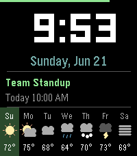
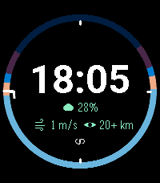
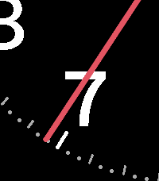

<!-- Generated by scripts/update_app_directory.py: do not edit by hand -->
# Watchfaces: A

[← About this list](../watchfaces.md) · **A** · [B](b.md) · [C](c.md) · [D](d.md) · [E](e.md) · [F](f.md) · [G](g.md) · [H](h.md) · [I](i.md) · [J](j.md) · [K](k.md) · [L](l.md) · [M](m.md) · [N](n.md) · [O](o.md) · [P](p.md) · [Q](q.md) · [R](r.md) · [S](s.md) · [T](t.md) · [U](u.md) · [V](v.md) · [W](w.md) · [X](x.md) · [Y](y.md) · [Z](z.md) · [0–9 & other](other.md)

*139 watchfaces · Last updated 2026-10-06*

| Screenshot | Name | Developer | Licence | Updated | Description |
|------------|------|-----------|---------|---------|-------------|
| { loading=lazy width="72" } | [A Better Bit (Binary)](https://apps.rebble.io/en_US/application/530a781e24c458af7d00011e) <small>Rebble App Store</small> | [Josh Gordon](https://github.com/joshgordon/better_bit) | <small>Not checked yet</small> | 2014-02-23 | This is the pebble default "Just a Bit" watchface modified to use truly binary bits instead of using binary bits to represent base 10 numbers. |
| { loading=lazy width="72" } | [A Little More](https://apps.repebble.com/69153581a0d99d0009ff0a03) | [Chris Lewicki](https://github.com/chrislewicki/A-Little-More) | <small>Not checked yet</small> | 2026-09-21 | A full remake of my face A Little Less, with more features and much cleaner code. Complications in each corner can be customized to be any of the following… |
| { loading=lazy width="72" } | [A Maze](https://apps.repebble.com/573d93ea5253b12407000009) | [gogothegogo](https://github.com/gogothegogo/Maze_Pebble) | <small>Not checked yet</small> | 2016-05-19 | Cool watchface with maze-like appearance showing time. Shake the watch and you get seconds and date. It is coded to preserve the battery, meaning seconds… |
| { loading=lazy width="72" } | [A Portuguesa](https://apps.rebble.io/en_US/application/52fb7da13f98abae960000eb) <small>Rebble App Store</small> | [João Luís](https://github.com/joaopluis/A-Portuguesa) | <small>Not checked yet</small> | 2014-03-07 | A simple watchface I designed, mainly because I wanted one in Portuguese. It shows the time, the date, the weekday, the connection status and the battery… |
| { loading=lazy width="72" } | [A Rainy Face](https://apps.repebble.com/b655ae247e9b47ea8e7166e8) | [volksen](https://github.com/volksen/a_rainy_face) | <small>Not checked yet</small> | 2026-09-04 | Simple watchface with weather info from openmeteo, especially precipitation |
| { loading=lazy width="72" } | [a8bit](https://apps.repebble.com/57a85f001482cdecc700063d) | [Axel](https://github.com/axel668/a8bit) | <small>Not checked yet</small> | 2016-09-01 | Deprecated - this app is provided "As Is" and can be used, but there will be no further development or bugfixes. a8bit is a simple 8bit retro style watch… |
| { loading=lazy width="72" } | [Aare](https://apps.rebble.io/en_US/application/5584cb7f7726b7ecdc000071) <small>Rebble App Store</small> | [Felix](https://github.com/f3lan/aare-watchface/tree/master/aare) | <small>Not checked yet</small> | 2015-06-20 | This watchface displays the time, date and temperature but also the temperature, flow velocity and height of the Aare. Deutsch Dieses Watchface zeigt Zeit… |
| { loading=lazy width="72" } | [Abfahrtsmonitor](https://apps.rebble.io/en_US/application/55eac1984d076dee0a00000f) <small>Rebble App Store</small> | [Tobi](https://github.com/tobiwe/pebble) | <small>Not checked yet</small> | 2015-11-10 | Dieses Watchface zeigt dir den Abfahrtsplan deiner Haltestelle in Baden-Württemberg an. Egal ob Bus, Bahn, Zug, Tram, Straßenbahn! Es werden alle… |
| { loading=lazy width="72" } | [About time](https://apps.rebble.io/en_US/application/5572b7287d6f3d4845000017) <small>Rebble App Store</small> | [frogamic](https://github.com/frogamic/abouttime) | <small>Not checked yet</small> | 2015-06-18 | It's about time. Pebble Time. The color of this watchface changes to match your Pebble. This face is all about your time. About time shows the time exactly… |
| { loading=lazy width="72" } | [Abstract Analog](https://apps.rebble.io/en_US/application/52c773da97bd5a21b500000c) <small>Rebble App Store</small> | [Alec Goebel](http://github.com/alecgoebel/abstract_analog) | <small>No licence</small> | 2014-02-10 | A minimalistic watch face. Minute hand is attached to the hour hand tip. Triangle at top is day of the week starting with Sunday. Animated GIF… |
| { loading=lazy width="72" } | [Abstracted](https://apps.rebble.io/en_US/application/55eb91a7e41fa80a4c000083) <small>Rebble App Store</small> | [Kevin Weber](https://github.com/profbetis/Abstracted) | <small>Not checked yet</small> | 2015-09-06 | Abstracted is a concept that uses art to display time. To Read: (The displayed time is 4:36 PM) Hours are the large horizontal black bars. They act as tally… |
| { loading=lazy width="72" } | [Acceleration](https://apps.repebble.com/57281561983547624100001a) | [Cutman](https://github.com/cutman2002/PebbleWatchface_Acceleration) | <small>Not checked yet</small> | 2016-05-29 | A Watchface that displays the time along with colorful balls that move with your watch. Just shake your watch to get them moving. If you love Acceleration… |
| { loading=lazy width="72" } | [AccuInfo](https://apps.rebble.io/en_US/application/52a39fc6b1da839d06000024) <small>Rebble App Store</small> | [Bob Hauck](https://github.com/bobhwasatch/accuinfo) | <small>Not checked yet</small> | 2014-02-20 | For people who want all the time information at once. Can be configured for normal or inverted display. Based on a concept by plumliz. |
| { loading=lazy width="72" } | [Active Hour](https://apps.repebble.com/56b6bb3c0b97730da600002e) | [Zach Burnham](https://github.com/thejambi/ActiveHour) | <small>Not checked yet</small> | 2016-10-14 | This watchface uses Pebble Health data to show the time along with a visual display of how active you are every minute of the hour. It is inspired by a… |
| { loading=lazy width="72" } | [ActiveHour2](https://apps.repebble.com/932411b4b5ba45ce839ff833) | [Zach Burnham](https://github.com/thejambi/ActiveHour) | <small>Not checked yet</small> | 2026-07-23 | This watchface uses Pebble Health data to show the time along with a visual display of how active you are every minute of the hour. It is inspired by a… |
| { loading=lazy width="72" } | [Activity](https://apps.rebble.io/en_US/application/535d6bda91c4a6472e000061) <small>Rebble App Store</small> | [Antonio Asaro](https://github.com/antonioasaro/Antonio-Activity_2.0.git) | <small>Not checked yet</small> | 2014-04-27 | Tracks last hour of activity along with standard battery + phone connection (with vibration) status |
| { loading=lazy width="72" } | [Actual Tic Toc](https://apps.rebble.io/en_US/application/5a33009e461a8d2dd000128f) <small>Rebble App Store</small> | [LochRED](https://github.com/LochRED/ActTTAlt) | <small>Not checked yet</small> | 2017-12-14 | An actual tic toc watchface for pebble watches. If you like this, Send me some Bitcoins! Wallet ID 16VyPy2uBHp3QYHMTJbKz7si8HxudpJkgv |
| { loading=lazy width="72" } | [Actual Tic Toc Pink](https://apps.rebble.io/en_US/application/5a3d63490dfc321afc000024) <small>Rebble App Store</small> | [LochRED](https://github.com/LochRED/Attp) | <small>Not checked yet</small> | 2017-12-22 | An Actual Tic Toc pink watchface for Pebble watches. (The difference between this and Actual Tic Toc is this version has pink hands.) If you like this, Send… |
| { loading=lazy width="72" } | [ACW BIG time with forecast weather table](https://apps.repebble.com/0d9749fe636a4d96acf4d37a) | [ACW Bright](https://github.com/ArcoW2/Pebble-watchface-BIG-tabled-forecast) | <small>No licence</small> | 2026-09-13 | Big digital time Current weather and activity Full weather forecast table at the bottom |
| { loading=lazy width="72" } | [Adamxp12 Watchface](https://apps.rebble.io/en_US/application/55415124c10fd868f70000bf) <small>Rebble App Store</small> | [Adamxp12.com](https://github.com/adamxp12/Adamxp12PebbleFace) | <small>Not checked yet</small> | 2015-04-29 | A nice and simple watchface |
| { loading=lazy width="72" } | [Advanced Analog](https://apps.rebble.io/en_US/application/5aa584f10dfc325c1c0001f3) <small>Rebble App Store</small> | [stosem](https://github.com/stosem/pebble-wf-AdvancedAnalog) | <small>Not checked yet</small> | 2018-03-15 | Analog Watchface with weather and health data. Features: - Support rectangle and round display. - White or black theme. - Bluetooth, QuietTime, Charge… |
| { loading=lazy width="72" } | [Adventure Time](https://apps.rebble.io/en_US/application/54bd47263e50447f5d00005c) <small>Rebble App Store</small> | [Jesse Millar](https://github.com/jessemillar/Pebbling/tree/master/Adventure-Time) | <small>Not checked yet</small> | 2015-01-20 | With Jake the Dog and Finn the Human, the fun will never end! Shake your wrist to switch characters. |
| { loading=lazy width="72" } | [Aeronaut](https://apps.repebble.com/5830a01b00355a2f3a00004f) | [Eric Gideon](https://github.com/egid/pebbleAnalog) | <small>Not checked yet</small> | 2017-08-05 | Aeronaut is inspired by pilot's watches, with a GMT pointer and the date. Second hand optional. Black and white styles available. |
| { loading=lazy width="72" } | [After Hours](https://apps.repebble.com/d64decb8397c43e3a3344dc6) | [justinjhendrick](https://github.com/justinjhendrick/after-hours-pebble-watchface) | <small>Not checked yet</small> | 2026-06-29 | Extreme Battery Saver. Only updates once per hour! |
| { loading=lazy width="72" } | [After Hours](https://apps.rebble.io/en_US/application/6a41ef4298141d0009ec89f1) <small>Rebble App Store</small> | [justinjhendrick](https://github.com/justinjhendrick/after-hours-pebble-watchface) | <small>Not checked yet</small> | 2026-06-29 | Extreme Battery Saver. Only updates once per hour! |
| { loading=lazy width="72" } | [Agenda](https://apps.repebble.com/6516c39fb2704211b668a318) | [Comfortably Numb](https://github.com/ygalanter/agenda-pebble) | <small>Not checked yet</small> | 2026-07-11 | Digital watchface that displays time, weather, and your next calendar event. Features - Large digital clock - Date display with day of the week - 7-day… |
| { loading=lazy width="72" } | [Agenda](https://apps.rebble.io/en_US/application/6a00f8bcb8dd290008d7c5f0) <small>Rebble App Store</small> | [Comfortably Numb](https://github.com/ygalanter/agenda-pebble) | <small>Not checked yet</small> | 2026-07-11 | Digital watchface that displays time, weather, and your next calendar event. Features - Large digital clock - Date display with day of the week - 7-day… |
| { loading=lazy width="72" } | [Agenda Watchface](https://apps.rebble.io/en_US/application/52e81244e822d1bdda00004a) <small>Rebble App Store</small> | [Jan Bobolz](https://github.com/JanBobolz) | <small>See source</small> | 2014-10-05 | Shows your upcoming appointments from the Android calendar. (And - with plugins - tasks, notifications, ...) Quite customizable. You need the companion app. |
| { loading=lazy width="72" } | [Ai Kanji](https://apps.rebble.io/en_US/application/561045fa46914a14ee00003a) <small>Rebble App Store</small> | [DarkxKen](https://github.com/DarkxKen/Ai-watchface) | MIT | 2015-10-03 | Ai Kanji that means love. Use this watchface to keep the love with you. |
| { loading=lazy width="72" } | [Aikapaneeli](https://apps.repebble.com/fdf36c678ce849fb8e0d5650) | [jrs8205](https://github.com/jrs8205/aikapaneeli) | <small>Not checked yet</small> | 2026-06-16 | Aikapaneeli on selkeä, täysin suomenkielinen kellotaulu Pebble Time 2:lle. Yhdellä silmäyksellä näet nämä kaikki: suuri 24 h kello, suomenkielinen… |
| { loading=lazy width="72" } | [AIS rhythm of digital life](https://apps.rebble.io/en_US/application/53aa3ea003d7da59780000b0) <small>Rebble App Store</small> | [DLD](https://bitbucket.org/itsara_ais/aiswatch) | <small>See source</small> | 2014-06-25 | AIS rhythm of digital life, sound visualizer concept. |
| { loading=lazy width="72" } | [AJ Pebble Face](https://apps.rebble.io/en_US/application/54194fe6019321e332000151) <small>Rebble App Store</small> | [Johnny Dunhin](http://dunhindevelopers.wordpress.com/2014/09/17/aj-pebble-face/) | <small>See source</small> | 2014-09-18 | Personal touch to my Pebble. Source code is on website. |
| { loading=lazy width="72" } | [Aldevetz Watchface](https://apps.rebble.io/en_US/application/5642ae311c68dcdba900000e) <small>Rebble App Store</small> | [shizuku kun](https://github.com/shizukukun/aldevetzwatch) | <small>Not checked yet</small> | 2015-11-11 | J-Rock Band Aldevetz Watchface |
| { loading=lazy width="72" } | [Aldo Watch](https://apps.repebble.com/27712bf7eb5f44a1b56a4204) | [Creative Manaks](https://github.com/manaksu/AldoWatch) | <small>Not checked yet</small> | 2026-05-30 | Aldo Clean and typographic. Built around the bold geometric character of the Aldo the Apache font, this watchface keeps it minimal — time front and center… |
| { loading=lazy width="72" } | [AlfaSlab Big Time](https://apps.rebble.io/en_US/application/536a6c35a50bc82bc200005d) <small>Rebble App Store</small> | [Anodyzed](https://github.com/TheChrisPratt/ASPebble) | <small>Not checked yet</small> | 2014-05-12 | The Big Time watchface using the Alfa Slab font Note: Requires version 2.1 Firmware |
| { loading=lazy width="72" } | [Alien Clock](https://apps.repebble.com/2ee3a721b23b44968487102b) | [NetNoise](https://github.com/GeoffAtLarge/pebble-alien-clock) | <small>No licence</small> | 2026-09-22 | A watchface to emulate the Alien Clock as seen on Star Trek: Deep Space Nine. This working prop was made by the Alien Time Company in 1995 and I'm fortunate… |
| { loading=lazy width="72" } | [Alienwear](https://apps.rebble.io/en_US/application/637a6466c6c24a000a815e8b) <small>Rebble App Store</small> | [astosia](https://github.com/astosia/Alien-head) | <small>Not checked yet</small> | 2025-05-11 | Alienware inspired weather watchface. Alien picture now changes to show rain, snow or cloud (select whether this is current or forecast in the phone config… |
| { loading=lazy width="72" } | [All in One](https://apps.rebble.io/en_US/application/53e71ec8d889b3947f000051) <small>Rebble App Store</small> | [Tasnim Ahmed](https://github.com/tazzix/AllinOnePebbleFace) | <small>Not checked yet</small> | 2015-12-15 | This Watchface is a fork of Chunk Weather 2.1, I have added more details for weather like Humidity, Sunrise, Sunset; as well as other features from other… |
| { loading=lazy width="72" } | [All Info As Text](https://apps.rebble.io/en_US/application/5468b9fe32e2d7bfbc0000ce) <small>Rebble App Store</small> | [ClintonK](https://github.com/clintka/AllInfoAsText.git) | <small>Not checked yet</small> | 2015-10-26 | All Info As Text watch face delivers the time, date, current weather, today's / tomorrow's forecast, and a 2 week calendar. Config options include: week… |
| { loading=lazy width="72" } | [All That Info](https://apps.repebble.com/57cbaf2bbe5ad0a9cf00024c) | [Elieser Leão](https://github.com/elieserleao/allthatinfo) | <small>Not checked yet</small> | 2017-05-03 | All info possible. - Open source - Using Weather Underground or OpenWeatherMap (default) - Step counter - Sunrise and sunset - Relative humidity - Current… |
| { loading=lazy width="72" } | [All-In](https://apps.repebble.com/56fd939f34e0e2225900000a) | [Christophe Jeannette](https://github.com/Sichroteph/All-In-One2) | <small>Not checked yet</small> | 2016-04-04 | Keep all your important informations in one stylish analog/digital watchface. Data displayed: - Time (No kidding !) - Current weather (Provided by… |
| { loading=lazy width="72" } | [Almanac](https://apps.repebble.com/e7e6e7aac1e24f90b0c8d43b) | [chrizel](https://github.com/chrizel/Almanac) | <small>Not checked yet</small> | 2026-09-07 | A calm watchface built around the two things you actually look down for: what's coming up, and what the sky is doing. Three blocks on a plain field, nothing… |
| { loading=lazy width="72" } | [Almost Five](https://apps.repebble.com/3812c87f414c4b61b4e51ed0) | [Harlan Harris](https://github.com/HarlanH/Almost-Five-Watchface) | MIT | 2026-06-22 | It's "Almost Five" on "The Twenty-Ninth"! Text-based watchface with approximate (fuzzy) times and day of month. Based on previous watchfaces such as… |
| { loading=lazy width="72" } | [Alpenglow](https://apps.repebble.com/be7ddcf0613941d1842c8310) | [Greenteyn](https://github.com/Greenteyn/alpenglow-watchface) | MIT | 2026-09-25 | Alpenglow tells you when the light happens. A ring of the day wraps the time and colours every phase by the brightness of the sky: astronomical night… |
| { loading=lazy width="72" } | [Alpenglow](https://apps.rebble.io/en_US/application/6a7c98ebe5bc86000907ff68) <small>Rebble App Store</small> | [Greenteyn](https://github.com/Greenteyn/alpenglow-watchface) | MIT | 2026-08-31 | Alpenglow tells you when the light happens. A ring of the day wraps the time and colours every phase by the brightness of the sky: astronomical night… |
| { loading=lazy width="72" } | [Alpha Binary Clock](https://apps.rebble.io/en_US/application/5637b2514096619e3e000073) <small>Rebble App Store</small> | [TMunz](https://github.com/tmunz/PebbleAlphaBinary/) | <small>Not checked yet</small> | 2015-11-02 | The picture above shows the watchface of the Alpha Binary Clock. The orange dots display the time, the grey borders the date. The time can be simply… |
| { loading=lazy width="72" } | [Alternate](https://apps.rebble.io/en_US/application/557f34de71b57053c3000049) <small>Rebble App Store</small> | [inerg](https://github.com/inerg/WatchFaceLearning) | <small>Not checked yet</small> | 2015-06-15 | Battery is the top bar which steps down in 20% increments. When empty the battery is below 20%. Bottom bar is the Bluetooth connection. Month+Date will… |
| { loading=lazy width="72" } | [Alternating Tidbits](https://apps.rebble.io/en_US/application/57aa228f693f7eb8dd000015) <small>Rebble App Store</small> | [Jan Jacobs](http://github.com/jacobsjan/AlternatingTidbits) | <small>No licence</small> | 2017-12-28 | A calm, elegant and professional watch face boasting lots of features. Displays one tidbit of information at a time, alternating between them every minute… |
| { loading=lazy width="72" } | [Ambient](https://apps.rebble.io/en_US/application/55bd604da5c6f3772200008c) <small>Rebble App Store</small> | [Kelby](https://github.com/tripleplay369/PebbleAmbient) | <small>Not checked yet</small> | 2015-08-10 | Simple analog watchface that includes the location of the 8 planets, and the moon (sorry Pluto, no room). Background color gradually changes from black to… |
| { loading=lazy width="72" } | [AMD Watchface](https://apps.repebble.com/55995cf6e47bb3dce400004e) | [Antonio Asaro](https://github.com/antonioasaro/Antonio-AMD) | <small>Not checked yet</small> | 2016-12-09 | Simple animated AMD watchface (every min). With BT connectivity alerts. FYI - trying to emulate this: https://www.youtube.com/watch?v=c2QKdtU2YvE |
| { loading=lazy width="72" } | [Amiga Boing](https://apps.repebble.com/52ee9fd7e75bd2c34300003c) | [lesliesbird](https://github.com/lesliesbird/AmigaBoing) | <small>Not checked yet</small> | 2016-11-28 | Recreates the original Boing Ball demo from the Amiga computer. The ball rotates and bounces around the screen, while the time readout is using the original… |
| { loading=lazy width="72" } | [Amsterdam](https://apps.repebble.com/568690d8ecd40927fa0000be) | [tardypad](https://github.com/tardypad/pebble-watchface-amsterdam) | <small>Not checked yet</small> | 2016-09-07 | Watchface displaying the flag of Amsterdam at every minute change, with an animation Local settings to display the date as well handle Timeline Quick View |
| { loading=lazy width="72" } | [Ana-Digi Pro](https://apps.repebble.com/ccf3493e462a4b938b528cfc) | [Dimitrios Vlachos](https://github.com/Mesa-LLC/Ana-Digi-Pro) | <small>Not checked yet</small> | 2026-04-06 | Hybrid analogue-digital watchface Casio vibes for Pebble Classic and Pebble Steel. Combines virtual hands and dual LCD windows, all animating like an 80s… |
| { loading=lazy width="72" } | [Ana-digi Vibez](https://apps.repebble.com/f8ea4d34aa3d4ba594745fac) | [Eric Migicovsky](https://github.com/ericmigi/anadigi-vibez) | <small>Not checked yet</small> | 2026-03-26 | Retro ana-digi with Casio vibes! For Pebble Time 2 and Pebble Round 2 |
| { loading=lazy width="72" } | [Anablock](https://apps.rebble.io/en_US/application/54f72c27077144f816000055) <small>Rebble App Store</small> | [vssh](https://github.com/vssh/pebble-anablock) | <small>Not checked yet</small> | 2015-03-15 | Watchface with weather, date and low battery and disconnect warning. Switches between analog and digital on wrist shake. Codebase from Simplicity and design… |
| { loading=lazy width="72" } | [Analog Arcs](https://apps.rebble.io/en_US/application/6a5248c9c5fa780009da3efd) <small>Rebble App Store</small> | [Rene Coffeng](https://github.com/coffeng/Pebble-Watchface-Analog-Arcs) | <small>Not checked yet</small> | 2026-07-27 | Display activiy and sleep arcs on an analog watch. Includes also heart rate trend. |
| { loading=lazy width="72" } | [Analog BigDate](https://apps.rebble.io/en_US/application/5608b975364a06eba9000022) <small>Rebble App Store</small> | [yoshimov](https://github.com/yoshimov/pebble-bigdate) | <small>Not checked yet</small> | 2015-11-14 | Simple analog watch face with big date. The date and week texts will move to avoid overlapping with hands. The following items are customizable. - Second… |
| { loading=lazy width="72" } | [Analog Curve Stitch](https://apps.repebble.com/36d73649eeed467ab7e37551) | [unoctium1](https://github.com/unoctium1/PebbleFaceCurveStitch) | <small>Not checked yet</small> | 2026-08-29 | Minimal analog watch face inspired by curve stitching patterns. Includes customizable colors Compatible with Pebble Time 2 & Pebble Round 2 |
| { loading=lazy width="72" } | [ANALOG P-SHOCK](https://apps.repebble.com/570f8d6da3a1f9aa1f000010) | [Akemori Oda](https://github.com/bake-san/ANALOG-P-SHOCK.git) | <small>Not checked yet</small> | 2016-04-18 | The sample source to the original has been modifications to the reference to the analog clock of CASIO. サンプルソースを元にCASIOのアナログ時計を参考に修正をしました。 Ver1.1 was… |
| { loading=lazy width="72" } | [Analog Pretty](https://apps.repebble.com/2ecc5b56c55b46dc89a38a03) | [Rafael Pereira](https://github.com/rafaelc007/pebble-analog-pretty) | <small>Not checked yet</small> | 2026-06-17 | Simple analog watchface with weather support. Digits dynamically change every hour. |
| { loading=lazy width="72" } | [Analog Simple Thin](https://apps.rebble.io/en_US/application/55525cc271c40dcfc7000071) <small>Rebble App Store</small> | [Leon Felipe](https://github.com/leonlipe/thinwithnumbers.git) | <small>Not checked yet</small> | 2015-05-15 | A simple Analog Watch face You can show: - Time in digital - Temperature, conditions - Humidity, wind speed - Sunrise and sunset hours - Shows the date… |
| { loading=lazy width="72" } | [Analog Zmanim](https://apps.repebble.com/57f3f1953c754a887a0000a9) | [Beezy Works Studios](https://github.com/BeezyWorks/pebble_zman) | GPL-3.0 | 2017-01-26 | Simple analog watchface with Hebrew and Gregorian date that displays upcoming zmanim. Zmanim are calculated on the watch itself and do not require an… |
| { loading=lazy width="72" } | [AnalogRainbow](https://apps.repebble.com/57016a58cd2a15ffcd000041) | [4T2](https://github.com/ofietze/analograinbow) | <small>Not checked yet</small> | 2016-05-29 | This Watchface is all about Color! The hour and minute hands change their color, depending on which part of the outer ring they are pointing at. Displayed… |
| { loading=lazy width="72" } | [Analogue Dots](https://apps.rebble.io/en_US/application/69343ba1bd6440000946e487) <small>Rebble App Store</small> | [Flo Knödl](https://github.com/flokndl/watchface-analogue-dots) | <small>Not checked yet</small> | 2025-12-20 | Simple analoge watchface with two style. -- Now with Chronomode -- Activate it settings -&gt; tap/flick starts seconds&minute stopwatch. -&gt; if persistent mode… |
| { loading=lazy width="72" } | [Analogue Time Arc](https://apps.repebble.com/7aa753337cf04ec89830e08b) | [davv47](https://github.com/davv47/Analogue_Time_Arc) | <small>Not checked yet</small> | 2026-04-08 | Watchface that shows public event event calendars in an arc on the perimeter of the screen. Notes: - This only works on public calendar feeds (at the… |
| { loading=lazy width="72" } | [Android Pixel](https://apps.repebble.com/4b9bac75f03745dcb4d86f25) | [paul3m](https://github.com/paul-em/pebble-android-watchface) | <small>Not checked yet</small> | 2026-03-26 | Currently mainly built for Pebble 2 Duo. Pebble Time 2 optimizations will follow |
| { loading=lazy width="72" } | [Android Weather](https://apps.rebble.io/en_US/application/54fc3b8f2bf1bf614f000004) <small>Rebble App Store</small> | [coolskies](https://github.com/cchienhs/androidweather.git) | <small>Not checked yet</small> | 2015-08-12 | WatchFace that emulates Android Weather Face. Used to be know as Android Weather F or Android Weather C. Have merged the two together since there is now a… |
| { loading=lazy width="72" } | [AndroidHome](https://apps.rebble.io/en_US/application/550e454cad788cf90b0000ad) <small>Rebble App Store</small> | [KJ Lawrence](https://github.com/kjlaw89/Pebble-AndroidHome) | <small>Not checked yet</small> | 2015-03-22 | A simple watchface that takes visual cues from Android's lockscreen. AndroidHome provides weather and bluetooth/battery statuses. Weather is provided by… |
| { loading=lazy width="72" } | [Anery](https://apps.repebble.com/580b468353c08f2d950000b1) | [The Resetter](https://github.com/GreenHex/Pebble.Anery) | MIT | 2017-02-05 | Anery for Pebble. - Precise, easy-to-read analog watchface. - Three analog watchfaces selectable by the user. - Large date. - Hourly or half-hourly buzz. … |
| { loading=lazy width="72" } | [Anery+](https://apps.repebble.com/580ca87153c08f730600019f) | [The Resetter](https://github.com/GreenHex/Pebble.Anery.Plus) | MIT | 2016-11-02 | Anery+ for Pebble Time 2. Anery+ is based on BLISS TIME by Michael Reyes. - Super precise, easy-to-read, analog clock face. - Digital and analog watch… |
| { loading=lazy width="72" } | [Anery-](https://apps.repebble.com/583cf2e1ca3094bdc0000507) | [The Resetter](https://github.com/GreenHex/Pebble.Anery.Minus) | MIT | 2017-01-21 | Lightweight version of the "Anery" watchface. - Easy-to-read, clean analog watchface. - Small, power-efficient code. - Supports Timeline Quick View. - Shake… |
| { loading=lazy width="72" } | [Anery-SQ](https://apps.repebble.com/585369da5de85056f0000044) | [The Resetter](https://github.com/GreenHex/Pebble.Anery.SQ) | <small>No licence</small> | 2017-02-06 | Another variation of the Anery watchface, {influenced\|copied\|derived} {by\|from} the famous "Notorious" watchface by Tim Krief. Shake watch to display… |
| { loading=lazy width="72" } | [Angelic Ascent](https://apps.repebble.com/6829ed79e282b00009e55256) | [Harrison Allen](https://github.com/HarrisonAllen/angels-and-demons) | <small>No licence</small> | 2025-05-18 | Embrace your inner angel with Angelic Ascent, with the following features: * Time * Date * Weather * Temperature * Shown as a range from very cold (30F) to… |
| { loading=lazy width="72" } | [Angled Left](https://apps.rebble.io/en_US/application/53e9cbba80a0272d690001cb) <small>Rebble App Store</small> | [chops](https://github.com/mereed/pebbleface-angled) | <small>Not checked yet</small> | 2014-08-19 | Borrows from a similar watchface, 'diagonal', by dotar, and similar to the 'slanted' concept by firelighter. ps. the un-eveness of text is intentional… |
| { loading=lazy width="72" } | [Angry kitty](https://apps.rebble.io/en_US/application/56a23556956f0b5e06000046) <small>Rebble App Store</small> | [Olessia Panteleeva](https://github.com/OlessiaPanteleeva/PebbleWatchFacesEvilCat.git) | <small>Not checked yet</small> | 2016-02-11 | Watchface with time and angry cat |
| { loading=lazy width="72" } | [Animated Gumball Watchface](https://apps.rebble.io/en_US/application/54c530ef2bf96f8f1d00003d) <small>Rebble App Store</small> | [grsan](https://cloudpebble.net/ide/project/123128) | <small>See source</small> | 2015-02-07 | This is a watchface I made for my friend originally, but now, anyone can modify it if they want, but you must give credit to me, the creator, for the… |
| { loading=lazy width="72" } | [Animated Pokemon Face](https://apps.repebble.com/5723a8c7801d31f15900000c) | [invitedsun](https://github.com/a-spo/AnimatedDex.git) | <small>Not checked yet</small> | 2016-05-02 | This watchface features Gen 6 sprites! Included in this version are Mega Asbol, Lanturn, Azumarill, and Luxray. Shake to animate each sprite for 10 seconds… |
| { loading=lazy width="72" } | [Ann Arbor Meetup Demo Watchface](https://apps.repebble.com/575b9310beeadda36e000018) | [Ish Ot Jr.](https://github.com/PebbleA2/PebbleA2) | <small>Not checked yet</small> | 2016-06-11 | This is a simple demo watchface for the PebbleA2 Meetup in Ann Arbor, Michigan. Unless you're an attendee, or interested in learning how to make a basic… |
| { loading=lazy width="72" } | [ANNA'S NS](https://apps.rebble.io/en_US/application/55a59977ba679ad6c2000074) <small>Rebble App Store</small> | [testyk8](https://github.com/Kdisimone/cgm-pebble.git) | <small>No licence</small> | 2015-07-14 | A CUSTOMIZED WATCHFACE FOR MY T1D ANNA. DEVELOPED FROM NS CGM PEBBLE SOURCE FILES |
| { loading=lazy width="72" } | [Another Revolution](https://apps.repebble.com/57cd7bd4f69d1dff8d000352) | [Christophe Jeannette](https://github.com/Sichroteph/Another_Revolution) | <small>Not checked yet</small> | 2016-09-05 | Implemented by Douwe Maan. Slightly modified by Christophe Jeannette in order to add : Slicker animations Battery instead of the seconds (Battery friendly)… |
| { loading=lazy width="72" } | [Another Spock](https://apps.rebble.io/en_US/application/53ff6a20d08f5306bb0000df) <small>Rebble App Store</small> | [Andrey](https://github.com/thexf/pebble_wf.git) | <small>Not checked yet</small> | 2015-04-05 | Time, battery state and Mr. Spock! And for weekends "Dark Picard" =) |
| { loading=lazy width="72" } | [AnsaWatchface](https://apps.rebble.io/en_US/application/557001f1f51afe500d00009a) <small>Rebble App Store</small> | [Antonio](http://github.com/Antroid/Blesciasw_watchface) | <small>No licence</small> | 2015-06-04 | AnsaWatchface consente di visualizzare le ultime notizie pubblicate sul sito ansa.it direttamente sul tuo orologio. |
| { loading=lazy width="72" } | [Antichamber](https://apps.rebble.io/en_US/application/529aab4a16952349bb000027) <small>Rebble App Store</small> | [rigel314](https://github.com/rigel314/pebbleAntichamber) | <small>Not checked yet</small> | 2014-02-04 | A Pebble watchface inspired by the map in the amazing game, Antichamber. |
| { loading=lazy width="72" } | [Anticipate](https://apps.repebble.com/723a7e89e3624f45a3e323b5) | [Unruh Bros. Print Co.](https://github.com/unruh-bros-print-co/anticipate) | <small>Not checked yet</small> | 2026-05-31 | Anticipate! All the basic information you need to be prepared for the day ahead! Features - Today's date - Step Count - Forecasted high temperature … |
| { loading=lazy width="72" } | [AoFaceClock1st](https://apps.repebble.com/56ed6b537e080dac26000006) | [Akemori Oda](https://github.com/bake-san/PebleWatch) | <small>Not checked yet</small> | 2016-04-26 | Pebble is the first work of the Watch Face Clock. And the analog clock by the circle , digital clock at the center The connection status (OK / NG), have… |
| { loading=lazy width="72" } | [Apex Shadow](https://apps.repebble.com/39337ad3575d4d669763f6cc) | [me](https://github.com/AhmedTheGeek/apex-shadow) | <small>No licence</small> | 2026-05-19 | A sundial that learned to keep secrets. There is a light you cannot see. A shadow that knows the hour. And underneath, the minutes, waiting for the shadow… |
| { loading=lazy width="72" } | [Approach](https://apps.repebble.com/1269ce5888024c51a96e8b67) | [sybenx](https://github.com/sybenx/approach) | <small>Not checked yet</small> | 2026-10-01 | Approach is a bold, high-contrast watchface built around the next mark. A segmented bar fills a minute at a time toward :00 and :30 (or every 15, 20 or 60… |
| { loading=lazy width="72" } | [Aptos Watch](https://apps.repebble.com/458f35557f90489f8a0967ce) | [Creative Manaks](https://github.com/manaksu/Aptos-Watch) | <small>Not checked yet</small> | 2026-05-30 | new |
| { loading=lazy width="72" } | [AQ-800](https://apps.repebble.com/ddf9f5400c1e4c62911fcc56) | [dotJustin](https://github.com/dot-Justin/Pebble-WF-Casio-AQ-800) | <small>Not checked yet</small> | 2026-06-15 | Faithful recreation of the classic 80s ana-digi dual-display watch for Pebble Time 2. Metal hands that catch the light as they sweep, applied markers, grid… |
| { loading=lazy width="72" } | [Aqua (Animated)](https://apps.repebble.com/67fbabbd8b96250009ecfabe) | [AirCodum](https://github.com/priyankark/aqua-pbw) | <small>Not checked yet</small> | 2025-04-14 | A live aquarium on your wrist! |
| { loading=lazy width="72" } | [Aquarium](https://apps.repebble.com/52e534556e3045b08c05482e) | [Comfortably Numb](https://github.com/ygalanter/Aquarium-Pebble) | <small>Not checked yet</small> | 2026-06-19 | Time floating inside of beautiful tropical aquarium. Shake the watch to cycles thru: Date 📅 Day of the week 📆 Steps count 👟 Calories burned 🔥 Distance… |
| { loading=lazy width="72" } | [Aquarium](https://apps.rebble.io/en_US/application/69ebf6234bcac10009da41ef) <small>Rebble App Store</small> | [Comfortably Numb](https://github.com/ygalanter/Aquarium-Pebble) | <small>Not checked yet</small> | 2026-06-19 | Time floating inside of beautiful tropical aquarium. Shake the watch to cycles thru: Date 📅 Day of the week 📆 Steps count 👟 Calories burned 🔥 Distance… |
| { loading=lazy width="72" } | [Arabesque](https://apps.rebble.io/en_US/application/530367889847d1bdee00020f) <small>Rebble App Store</small> | [Eric BERGELIN](https://cloudpebble.net/ide/project/35597#) | <small>See source</small> | 2014-03-04 | Random art & drawings. Become an artist every minute. How nice! Oh! hour is indicated by the tangent at the center, and minutes where the curve leaves the… |
| { loading=lazy width="72" } | [Arabic Hijri](https://apps.rebble.io/en_US/application/533c0b7cee460af0a70001f8) <small>Rebble App Store</small> | [Salman Aljammaz](https://github.com/saljam/hijri-watchface) | <small>Not checked yet</small> | 2015-10-11 | Arabic watchface with Hijri and Gregorian calendar. |
| { loading=lazy width="72" } | [Arc](https://apps.rebble.io/en_US/application/54caed17ff5972bf4500004d) <small>Rebble App Store</small> | [Adam Heins](https://github.com/adamheins/arc) | <small>Not checked yet</small> | 2015-01-30 | A minimalist Watchface that displays time using arcs. The inner arc represents the number of hours since twelve o'clock. The outer arc represents the number… |
| { loading=lazy width="72" } | [Arc](https://apps.repebble.com/52bdadff83ed912a860000a1) | [Jnm](https://github.com/Jnmattern/Arc_2.0) | <small>No licence</small> | 2026-03-02 | Simple design watchface showing hour and minutes. Tap or twist your wrist to sequentially display the date, the battery percentage, the phone connection… |
| { loading=lazy width="72" } | [Arc Calendar](https://apps.repebble.com/5d9ac4c4c393f5765a696540) | [sesio](https://bitbucket.org/derivat3/pebble-watchface-arc-calendar) | <small>See source</small> | 2021-12-17 | Highly configurable analog watchface, which solves the problem of scheduling in daily business. With a connected Google Calendar, you will now see upcoming… |
| { loading=lazy width="72" } | [Arc Diem](https://apps.rebble.io/en_US/application/5843921800355aeb3d0008d1) <small>Rebble App Store</small> | [Jennifer Neff](https://github.com/JenniferNeff/arc-diem) | <small>No licence</small> | 2016-12-29 | Configure this watchface with the hour your day starts, and the hour it ends, and the hand will trace out the duration of your day and night. The design was… |
| { loading=lazy width="72" } | [Arc View](https://apps.rebble.io/en_US/application/6abe92fb5af6a30009f371ac) <small>Rebble App Store</small> | [lnbot](https://github.com/lnbot/arc-view) | <small>Not checked yet</small> | 2026-10-01 | Watchface with a minute hand and digital hour. Also features optional orbiting complications, sub-minute hand movement, and a minute tick visibility window… |
| { loading=lazy width="72" } | [Arc Watchface](https://apps.rebble.io/en_US/application/55ef051aaab2f909b9000021) <small>Rebble App Store</small> | [Geraint White](https://github.com/grit96/ArcWatchface) | <small>Not checked yet</small> | 2025-12-01 | Arc watchface with arcs for hours (inner) and minutes (outer). Has battery percentage in the middle and date below. Colours can be inverted and battery… |
| { loading=lazy width="72" } | [Arc1](https://apps.repebble.com/55107bb6daf2051cdb000027) | [Fnord Prefect](https://codeberg.org/fnord/Arc1) | <small>See source</small> | 2025-04-21 | A distinct arc for minutes, a small hour arc or hand that's clearly visible but does not distract from the minutes arc, and a subtle seconds display… |
| { loading=lazy width="72" } | [Arcade Time](https://apps.rebble.io/en_US/application/52f072e93fbdba5287001a81) <small>Rebble App Store</small> | [Ice2097](https://github.com/ice2097/Arcade_Time) | <small>Not checked yet</small> | 2014-02-04 | A BigTime variant, with a classic arcade score font, and the day, month, and date at the bottom. |
| { loading=lazy width="72" } | [Arcangle](https://apps.rebble.io/en_US/application/564f8291331881d7d1000018) <small>Rebble App Store</small> | [lastfuture](https://git.broken.graphics/alina/Pebble-Time-Watchface-Arcangle) | <small>See source</small> | 2015-11-25 | A watchface for the hacker spy in you. Made exclusively for Pebble Time Round Examples: 8:01, 5:20, 8:17, 11:52 You read the start and the end of the line… |
| { loading=lazy width="72" } | [Archery](https://apps.repebble.com/fe84cab39618424480b5b4f6) | [howeaj](https://github.com/howeaj/pebble-archery) | <small>Not checked yet</small> | 2026-04-25 | Watch out! Tiny archers are shooting your wrist! Luckily, the arrows conveniently point to the current time. Their aim is a bit off, but if you can figure… |
| { loading=lazy width="72" } | [Arcminute](https://apps.repebble.com/72fb25c0fe5544428d71d221) | [Artifact](https://github.com/arfct/arcminute-watchface) | <small>Not checked yet</small> | 2026-09-11 | Formerly Chronology. Most watch faces show twelve hours so you can find one. Arcminute shows the one it is. The dial is wider than the screen and slides… |
| { loading=lazy width="72" } | [Arcminute](https://apps.rebble.io/en_US/application/68937d18f7ca35000951da1b) <small>Rebble App Store</small> | [Artifact](https://github.com/arfct/arcminute-watchface/) | <small>Not checked yet</small> | 2026-09-11 | Most watch faces show twelve hours so you can find one. Arcminute shows the one it is. The dial is wider than the screen and slides past through the day, so… |
| { loading=lazy width="72" } | [ArcS](https://apps.rebble.io/en_US/application/54f245bd0bea20aa090000ce) <small>Rebble App Store</small> | [cS](https://github.com/chms/ArcS) | <small>Not checked yet</small> | 2015-03-05 | Yet another watchface that uses arcs to illustrate how time flies. |
| { loading=lazy width="72" } | [ARCs](https://apps.repebble.com/40d48d07d398413fbe331dc3) | [Jordan Fisher](https://github.com/thementalgoose/pebble-arcs) | <small>Not checked yet</small> | 2026-09-29 | Simple pebble watchface with indicator arcs in 4 corners of the display - Support for 12/24h times - Support for all watch types and sizes - Configurable… |
| { loading=lazy width="72" } | [ArcS+](https://apps.rebble.io/en_US/application/54fb92804720a88f330000a6) <small>Rebble App Store</small> | [cS](https://github.com/chms/ArcS) | <small>Not checked yet</small> | 2015-03-08 | ArcS+ uses arcs to illustrate how time flies. At the same time it features a digital clock, the date, the weekday and indicators for your battery and the… |
| { loading=lazy width="72" } | [ArcTime](https://apps.rebble.io/en_US/application/5508e6201a6b43fbeb00008f) <small>Rebble App Store</small> | [Si Te](https://github.com/sitefeng/ArcTime) | <small>Not checked yet</small> | 2015-03-18 | ArcTime is an artistic watchface that uses only lines and dots to create intricate numbers. Made for Pebble Time and Pebble Time Steel. |
| { loading=lazy width="72" } | [Argus](https://apps.repebble.com/d119efdfa11e498496d4d411) | [Filcuk](https://github.com/filcuk/pebble-watchface-argus) | <small>Not checked yet</small> | 2026-07-27 | Argus guides you through the days ahead with hourly weather forecast, a two-week calendar view and a configurable header to focus on what is important. |
| { loading=lazy width="72" } | [Argus](https://apps.rebble.io/en_US/application/6a48d3975cf4bd0009ff8ba7) <small>Rebble App Store</small> | [Filcuk](https://github.com/filcuk/pebble-watchface-argus) | <small>Not checked yet</small> | 2026-07-27 | Argus guides you through the days ahead with hourly weather forecast, a two-week calendar view and a configurable header to focus on what is important. |
| { loading=lazy width="72" } | [ARRL](https://apps.rebble.io/en_US/application/52ace1ec19ff5001fc00001d) <small>Rebble App Store</small> | [WA1OUI](https://github.com/DHKaplan/ARRL/blob/master/ARRL-V7.2.zip) | <small>No licence</small> | 2016-10-18 | This is the Logo of the ARRL (American Radio Relay League) which is the US National organization for Ham (Amateur) Radio. A Bluetooth indicator (and… |
| { loading=lazy width="72" } | [Arrow](https://apps.rebble.io/en_US/application/5692f973a45b56bdcb000008) <small>Rebble App Store</small> | [flogo](https://github.com/fgolemo/pebble-face-arrow) | <small>Not checked yet</small> | 2016-02-12 | Simple retro digital watchface with pixel art font. Now with battery indicator (thin black line at the border between black and white, full = black, low =… |
| { loading=lazy width="72" } | [Arsenal](https://apps.repebble.com/56ff9ad23ca6fda7bd00002e) | [Neon](https://github.com/sdneon/Arsenal) | <small>Not checked yet</small> | 2016-04-05 | Arsenal inspired watch face for Pebble Time. (Colour, Digital). Watch face with Arsenal colours. The examples show (1) 9:20pm, Bluetooth connected, battery… |
| { loading=lazy width="72" } | [Arsenal FC](https://apps.rebble.io/en_US/application/54a23f3785047c66b6000054) <small>Rebble App Store</small> | [Ben Nguyen](https://github.com/zecoj/arsenal.fc/) | <small>Not checked yet</small> | 2015-06-20 | ★Weather+Bluetooth+Configuration+Colour★ For all gooners. Shake to show extra information (time, date & battery) |
| { loading=lazy width="72" } | [Art Deco](https://apps.rebble.io/en_US/application/52e1250ad8561d30c500023f) <small>Rebble App Store</small> | [8a22a](https://github.com/8a22a/ArtDeco) | <small>No licence</small> | 2014-01-27 | A beautiful analogue watchface including day, date and battery percentage. Based on artwork by c0u94r. |
| { loading=lazy width="72" } | [Artemis II](https://apps.repebble.com/8e703bb113c84671900a754b) | [Nick Bachicha](https://github.com/nicksterx/artemis-watchface) | <small>Not checked yet</small> | 2026-04-18 | A Live Artemis II Launch on your wrist every hour! This watch face has the famous T minus countdown and you get to watch it launch off the launch pad. This… |
| { loading=lazy width="72" } | [Artemis Mission](https://apps.repebble.com/71a8d7de19f04fdca2eb2c43) | [LP Fabiani](https://github.com/lpfabiani/pebble-artemis-watchface) | <small>Not checked yet</small> | 2026-08-10 | A very simple watchface to follow the Artemis II mission. |
| { loading=lazy width="72" } | [Artemis Mission](https://apps.rebble.io/en_US/application/6a16f7e0e8f0f60008226bae) <small>Rebble App Store</small> | [LP Fabiani](https://github.com/lpfabiani/pebble-artemis-watchface) | <small>Not checked yet</small> | 2026-08-10 | A very simple watchface to follow the Artemis program. It's not showing any program information at this moment, but a tribute to the program. It will show… |
| { loading=lazy width="72" } | [Artface](https://apps.repebble.com/6802c8906b6dee0009d0cc36) | [Dscheinah](https://github.com/dscheinah/artface) | <small>Not checked yet</small> | 2025-04-29 | This watchface creates a random background out of up to 30 different shapes. It changes one shape every hour. |
| { loading=lazy width="72" } | [ASCII and Ye Shall Receive](https://apps.repebble.com/e5614fc4168a486b9108c468) | [Sam](https://github.com/sammo312/pebble-wf-01) | <small>Not checked yet</small> | 2026-05-03 | Nerd-core ASCII watchface with fun touch interactions. Configurable. WIP |
| { loading=lazy width="72" } | [astroface](https://apps.repebble.com/58e00e34ca124034bcb4acca) | [Thimoteus](https://github.com/Thimoteus/astroface) | <small>Not checked yet</small> | 2026-04-19 | A watchface for the PT2 that displays local time, date, and apparent sidereal time, as well as a starfield of what is above the observer's head at the… |
| { loading=lazy width="72" } | [AstroLife](https://apps.repebble.com/0c064b7a21e841279cdc7bed) | [Piotr Migdał](https://github.com/stared/pebble-time-2-astrolife) | <small>Not checked yet</small> | 2026-08-06 | Pebble Time 2 watchface with astronomy (moon phase countdown, sunrise/sunset) and health charts (pulse, steps, sleep). |
| { loading=lazy width="72" } | [Astrological](https://apps.repebble.com/56c50baea02787929a000040) | [Dr. David Brown](http://github.com/revdrbrown/PebbleAstrological) | <small>No licence</small> | 2016-02-18 | Astrological is a text-based watchface showing: * Date * Time * Sun Sign * Lunar Phase (as text) * Planet associated with Day of Week * Equinoxes and… |
| { loading=lazy width="72" } | [Astronomy Face](https://apps.repebble.com/55d1b7047e217af6e4000075) | [Kurt Lawrence](https://github.com/kurtlawrence/PebbleWatch_Astronomy_Face) | <small>Not checked yet</small> | 2016-02-21 | Displays interesting location based data like compass heading and bearing, sun rise and set times, moon rise and phase, battery status, and GPS coordinates… |
| { loading=lazy width="72" } | [At A Glance](https://apps.repebble.com/7727666da5c84c259b3a70b3) | [Manoj Mehta](https://github.com/jhatax/at-a-glance) | <small>Not checked yet</small> | 2026-09-17 | __At A Glance__ is a Pebble watch face inspired by cockpit instrumentation. It displays information with minimal interpretation. Time stays dominant. Icons… |
| { loading=lazy width="72" } | [ATC radar](https://apps.repebble.com/08a97783ae8947b092fbecfe) | [wiegand](https://github.com/chuckmoritzgg/pebble-atc-radar) | <small>Not checked yet</small> | 2026-06-27 | Clean aviation timekeeping: labeled hands represent analog time trackers. Battery, steps, and next event are flight strips and keep you heads-up. Pure radar… |
| { loading=lazy width="72" } | [ATOMLAB](https://apps.repebble.com/185892fdf82e4e89849309e3) | [atomlabor](https://github.com/atomlabor/atomlab) | <small>Not checked yet</small> | 2026-05-02 | ATOMLAB is a clean, telemetry-inspired watchface designed for the Pebble ecosystem. It features a distinctive 3D-layered dashboard layout that provides… |
| { loading=lazy width="72" } | [AtomWave](https://apps.repebble.com/696770ea0bd367000908977b) | [atomlabor](https://github.com/atomlabor/atomwave) | <small>Not checked yet</small> | 2026-01-19 | Time in Flow. AtomWave 2.2 visualises the passing of time through organic fluid physics. Watch as your screen fills with water, rising from the bottom at… |
| { loading=lazy width="72" } | [Attitude Indicator](https://apps.rebble.io/en_US/application/554ab78093cc44c1d10000dd) <small>Rebble App Store</small> | [PyroPenguin](http://www.github.com/pyropenguin/AttitudeIndicator) | <small>No licence</small> | 2015-05-07 | A simple attitude indicator for Pebble. Completes a full roll each minute. |
| { loading=lazy width="72" } | [Aura](https://apps.repebble.com/6a181c317d2b4f438dc28bea) | [ClickCalickClick (Touchy Weather)](https://github.com/ClickCalickClick/Sky_C) | <small>No licence</small> | 2026-05-21 | Aura: The Sky, Hand-Painted by Physics Why settle for a static watchface when you can wear the actual atmosphere? Aura is a real-time, mathematically driven… |
| { loading=lazy width="72" } | [Aura Essential](https://apps.repebble.com/19335d2e746b4d6aa6ba8c63) | [Miguel Angel Baeyens](https://github.com/mabaeyens/aura-pebble) | <small>Not checked yet</small> | 2026-09-09 | This face is my homage to Essential by Kiezel, one of my favourite watchfaces on the original Pebble and Pebble Time, the Kickstarter watches I backed… |
| { loading=lazy width="72" } | [Aurora](https://apps.repebble.com/2fbd6661cc6a48d18690e77f) | [Kieselleger](https://github.com/ProggroP/Aurora) | <small>Not checked yet</small> | 2026-06-10 | text |
| { loading=lazy width="72" } | [Aurora](https://apps.repebble.com/8703388706394b1981bfebea) | [nyinyiz](https://github.com/nyinyiz/Pebble-watchfaces) | <small>Not checked yet</small> | 2026-08-22 | A premium utility-first watchface with an aurora borealis visual design. Features - Animated aurora bands — three layered sine-wave bands (violet, teal… |
| { loading=lazy width="72" } | [Aurora Watchface](https://apps.rebble.io/en_US/application/54c6abf9ead20ff601000046) <small>Rebble App Store</small> | [Hannes Hofer](https://github.com/HannesHofer/Pebble) | BSD-2-Clause | 2015-02-12 | This watchface shows bluetooth icon when your phone is connected. Also current battery level is shown. Both bluetooth and battery can be disabled in the… |
| { loading=lazy width="72" } | [av-wx](https://apps.rebble.io/en_US/application/5498cf1173268f42dd000048) <small>Rebble App Store</small> | [Geoffrey Gallaway](https://github.com/geoffeg/PebblePilotTz) | <small>Not checked yet</small> | 2015-02-03 | Weather for pilots! Shows local time and date, METAR of closest airport (US only) and zulu time. |
| { loading=lazy width="72" } | [Aviator](https://apps.rebble.io/en_US/application/52dd9c3df9d8ec91e8000026) <small>Rebble App Store</small> | [orviwan](https://github.com/pebble-hacks/aviator) | <small>Not checked yet</small> | 2015-10-09 | An aviation-inspired watch face with configurable styles. 12h/24h Toggle "Seconds" Invert Bluetooth vibration Vibration timer (Minutes) Toggle "Hands"… |
| { loading=lazy width="72" } | [Aviator 24h](https://apps.rebble.io/en_US/application/554cc6c5b62c11889b000053) <small>Rebble App Store</small> | [MartialElch](https://github.com/MartialElch/PebbleAviator24hWatch.git) | <small>Not checked yet</small> | 2025-11-25 | Pilots watchface with 24h dial. |
