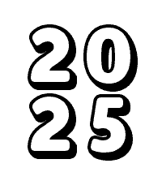
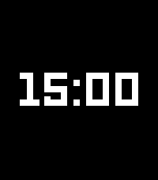
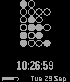
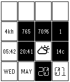
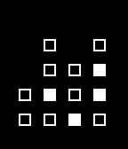
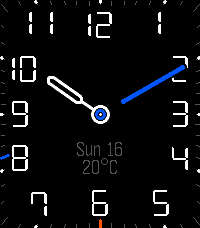
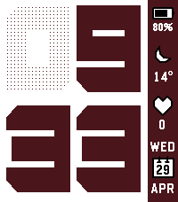
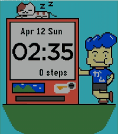

<!-- Generated by scripts/update_app_directory.py: do not edit by hand -->
# Watchfaces: B

[← About this list](../watchfaces.md) · [A](a.md) · **B** · [C](c.md) · [D](d.md) · [E](e.md) · [F](f.md) · [G](g.md) · [H](h.md) · [I](i.md) · [J](j.md) · [K](k.md) · [L](l.md) · [M](m.md) · [N](n.md) · [O](o.md) · [P](p.md) · [Q](q.md) · [R](r.md) · [S](s.md) · [T](t.md) · [U](u.md) · [V](v.md) · [W](w.md) · [X](x.md) · [Y](y.md) · [Z](z.md) · [0–9 & other](other.md)

*186 watchfaces · Last updated 2026-10-06*

| Screenshot | Name | Developer | Licence | Updated | Description |
|------------|------|-----------|---------|---------|-------------|
| { loading=lazy width="72" } | [Bad Selection](https://apps.rebble.io/en_US/application/67cc84c7b7a023024b2145d9) <small>Rebble App Store</small> | [articld](https://github.com/articld/BadSelection) | <small>Not checked yet</small> | 2025-04-20 | This watchface was created during Rebble's Hackathon #002! I got largely inspired by old mechanical flipboards, but the design kinda shifted with time. This… |
| { loading=lazy width="72" } | [Bahnuhr](https://apps.repebble.com/bb596e1c5474439b96017a1f) | [Maartje Eyskens](https://github.com/meyskens/Bahnuhr) | <small>Not checked yet</small> | 2026-05-29 | placeholder |
| { loading=lazy width="72" } | [Bakugo - My Hero Academia](https://apps.repebble.com/a757b4ff558e4308af4ea1b4) | [Vinayla](https://github.com/vinay1017/Pebble-BakugoWatchface) | <small>Not checked yet</small> | 2026-09-15 | I saw an image of bakugo where the text in the background said BOOM! and it was wonderfully comicbook-y. Took the image, removed the BOOM! and swapped in… |
| { loading=lazy width="72" } | [Balatro-style Watchface](https://apps.repebble.com/6a656dad55030a000901ea38) | [yannyfox](https://gitlab.com/yannyfox/balatro-watchface) | <small>Not checked yet</small> | 2026-07-26 | Balatro UI inspired watchface featuring the original font from the game, as well as health tracking. Currently only for the Pebble Time 2. This watchface is… |
| { loading=lazy width="72" } | [Band](https://apps.repebble.com/573674d776951a3d05000005) | [Andrei Ciubotariu](https://github.com/andreiciubotariu/band-watchface) | <small>Not checked yet</small> | 2016-09-01 | A (really) simple watchface. Time, date, disconnect indicator, and colour options. |
|  | [Bar Graph](https://apps.rebble.io/en_US/application/5305a587b704cb4e7d0000e5) <small>Rebble App Store</small> | [Cameron MacFarland](https://github.com/distantcam/Watchface-BarGraph) | <small>Not checked yet</small> | 2014-03-05 | Designed by Sterling B Ely on the Pebble forums. |
| { loading=lazy width="72" } | [Barcelona](https://apps.repebble.com/56fea0cf0f5be2595800002e) | [Neon](https://github.com/sdneon/Barcelona/) | <small>Not checked yet</small> | 2016-04-05 | Barcelona football club inspired watch face for Pebble Time. (Colour, Digital). Watch face looks similar to Barcelona's crest, with a little fun. The… |
| { loading=lazy width="72" } | [Barely V2](https://apps.rebble.io/en_US/application/530a2f2b24c458d540000476) <small>Rebble App Store</small> | [Phil Plückthun](https://github.com/philplckthun/pebble-barely-v2) | <small>Not checked yet</small> | 2014-02-24 | Simplified digits displayed only using horizontal and vertical lines. Four squares for the time, four for the date, and four for the year, filling the whole… |
| { loading=lazy width="72" } | [Bars](https://apps.rebble.io/en_US/application/583b182600355aeba4000137) <small>Rebble App Store</small> | [alekoz47](https://github.com/alekoz47/bars) | <small>Not checked yet</small> | 2016-11-28 | A simple watchface using loading bars to represent the time and date. The date is ticked by marks every 7 days, hours every 3, and minutes every 5. |
| { loading=lazy width="72" } | [Bars 2](https://apps.repebble.com/629300609a284e1fab80a763) | [julpel8](https://github.com/julpel8/pebble-bars-2) | <small>Not checked yet</small> | 2026-07-26 | Because ELEQUENT’s Bars doesn’t work on the Pebble Time 2 and because it’s such a lovely watchface, I decided to recreate it for the new generation of… |
| { loading=lazy width="72" } | [BarsOne](https://apps.repebble.com/8a6bdc2d8d254225b3f437dc) | [Dominik Hauser](https://github.com/dasdom/pebble_watch_face_bars_one) | <small>Not checked yet</small> | 2026-02-20 | Watch face for all the bar chart lovers out there. |
| { loading=lazy width="72" } | [Baseball Countdown](https://apps.repebble.com/6cce984be2de40baa07d4785) | [Ebenezer Development](https://github.com/treverjohnston/pebbleMLB) | <small>Not checked yet</small> | 2026-04-08 | A basic watchface that counts down to the game time of your favorite MLB team. Complete with baseball 'bat'-tery bar. Once a game starts, countdown converts… |
| { loading=lazy width="72" } | [Baseball Scores](https://apps.repebble.com/17d9e63004874c0b9755c1bc) | [Jimmy Timmons](https://github.com/jimmytimmons/pebble-baseball) | <small>Not checked yet</small> | 2026-06-03 | Live MLB scores on your wrist. Baseball Scores auto-cycles through up to three of your favorite teams, showing the live score, base runners, the… |
| { loading=lazy width="72" } | [Basic 1](https://apps.repebble.com/581cd8db9cbbafc558000127) | [Maxwell Moseley](https://github.com/maxmoseley23/Basic-1) | <small>Not checked yet</small> | 2016-11-06 | Back to basics. Battery friendly and lightweight. Just the time and date. Configure every colour. Set it to vibrate on top of the hour. Use military time… |
| { loading=lazy width="72" } | [Basic big digital](https://apps.repebble.com/b063aceac2394267982a890d) | [awwaiid](https://github.com/awwaiid/pebble-watchface-basic-big-digital) | <small>Not checked yet</small> | 2026-08-09 | Big, clean digital watchface for Pebble Time 2 (emery). Huge centered LECO digits, AM/PM tucked above the last digit in 12-hour mode, a red accent line, and… |
| { loading=lazy width="72" } | [basic plus utc](https://apps.rebble.io/en_US/application/557b4e42bae817ca0b000080) <small>Rebble App Store</small> | [Chris Perelstein](https://github.com/chrisperelstein/basic_plus_utc) | <small>Not checked yet</small> | 2015-08-24 | Basic watchface with UTC date and time at the bottom. |
| { loading=lazy width="72" } | [Basic watchface](https://apps.rebble.io/en_US/application/54c94eb3bcb000619a000062) <small>Rebble App Store</small> | [petermcconn](https://cloudpebble.net/ide/project/123497#) | <small>See source</small> | 2015-01-28 | just your average watchface with the weather on it |
| { loading=lazy width="72" } | [BasicTime](https://apps.rebble.io/en_US/application/548e2839f1f4ab6c44000029) <small>Rebble App Store</small> | [Charles Meyer](https://github.com/charles-meyer/basic-watchface) | <small>Not checked yet</small> | 2014-12-17 | Minimalist, no nonsense, time, date, and day of the week. |
| { loading=lazy width="72" } | [BasicTime II](https://apps.rebble.io/en_US/application/549afa9da003de7939000122) <small>Rebble App Store</small> | [Charles Meyer](https://github.com/charles-meyer/basic-watchface) | <small>Not checked yet</small> | 2014-12-25 | A minimalist time, date, and day of the week. Inverted colors of original BasicTime watchface. |
| { loading=lazy width="72" } | [Batman beyond (Batman of the Future)](https://apps.rebble.io/en_US/application/558b450bfd0cf8c7c6000027) <small>Rebble App Store</small> | [BOBdotEXE](https://github.com/BOBdotEXE/pebblebeyond/tree/release) | <small>No licence</small> | 2017-08-08 | The future is under your protection with this new BATMAN BEYOND pebble watchface! every 18 seconds it animates, and has a special surprise at the change of… |
| { loading=lazy width="72" } | [Battery Info](https://apps.repebble.com/5785910869ee718ea2000011) | [fieldWalking](http://fieldwalking.jp/blog/watch-face_battery-info/) | <small>See source</small> | 2016-11-23 | display clock and battery. inner circle means second. outer circle means remaining battery. If it's ok with you,please try my app. Don't step the White… |
| { loading=lazy width="72" } | [Battery Monitor Watchface](https://apps.rebble.io/en_US/application/52b214b18c0815094d000064) <small>Rebble App Store</small> | [Ave Wrigley](https://github.com/avewrigley/pebble-batttery-monitor) | <small>Not checked yet</small> | 2014-06-23 | Simple watch face, displaying time / date, location, local weather, and bluetooth connection / battery status. Vibrates when battery low / bluetooth… |
| { loading=lazy width="72" } | [Batteryface](https://apps.rebble.io/en_US/application/56a88003124705dd7800001f) <small>Rebble App Store</small> | [NovaG](https://github.com/NovaGL/Batteryface) | <small>Not checked yet</small> | 2016-02-14 | Simple Pebble watch face with time and date. Features battery bar below time to show current battery level, also contains BT level. Supports multiple… |
| { loading=lazy width="72" } | [Battlestar Galactica BSG75](https://apps.repebble.com/577dd52c66202a598b00029b) | [Daniel Lima](https://github.com/DanielLimaDF/BATTLESTAR_GALACTICA_BSG75_PEBBLE_FACE) | <small>No licence</small> | 2016-07-07 | Battlestar Galactica watchface showing current date, day of week, time, steps and battery status. So say we all! |
| { loading=lazy width="72" } | [Battlestar Galactica Photos](https://apps.repebble.com/577de5476c21044cf50002a9) | [Daniel Lima](https://github.com/DanielLimaDF/BATTLESTAR_GALACTICA_PEBBLE_WATCHFACE) | <small>No licence</small> | 2016-07-07 | Battlestar Galactica watchface with three different backgrounds that change every 5 minutes. Showing current date, day of week, time, steps and battery… |
| { loading=lazy width="72" } | [Battlestar Galactica Quotes](https://apps.repebble.com/577ddfc566202a598b0002a4) | [Daniel Lima](https://github.com/DanielLimaDF/BATTLESTAR_GALACTICA_QUOTES_PEBBLE_FACE) | <small>No licence</small> | 2016-07-07 | Battlestar Galactica watchface with quotes that change every minute. Showing current date, day of week, time, steps and battery status. So say we all! |
| { loading=lazy width="72" } | [BattMan](https://apps.repebble.com/1565d65a737b4d3591cff3b4) | [Noah Kiser](https://github.com/KiserDesigns/Pebble_BattMan) | <small>No licence</small> | 2026-07-07 | Simple Watchface that predicts battery life and charge time. Weather from Open-Meteo. Charge and Discharge rate estimates are saved to persistent storage… |
| { loading=lazy width="72" } | [Bavarian Clock](https://apps.rebble.io/en_US/application/55a2cb2c2965f266c4000062) <small>Rebble App Store</small> | [Dieter Meiller](https://github.com/oth-aw/BavarianClock.git) | <small>Not checked yet</small> | 2015-07-13 | This watchface tells the time in the bavarian language (Bairisch). |
| { loading=lazy width="72" } | [Baymax](https://apps.rebble.io/en_US/application/54bb25f95efa476fee0000f4) <small>Rebble App Store</small> | [Jesse Millar](https://github.com/jessemillar/Pebbling/tree/master/Baymax) | <small>Not checked yet</small> | 2015-01-18 | A cute, Big Hero 6 companion for your watch. He blinks on occasion and even gets drunk when your Pebble is low on power. |
| { loading=lazy width="72" } | [Baymax - Big Hero 6](https://apps.rebble.io/en_US/application/55447aad3bbdc6296e00001e) <small>Rebble App Store</small> | [Will Sloan](https://github.com/sloan-848/BigHero-Watchface) | <small>Not checked yet</small> | 2015-05-06 | A Big Hero 6 watchface featuring everyone's favorite healthcare companion: Baymax! |
| { loading=lazy width="72" } | [BBC](https://apps.rebble.io/en_US/application/55994a75a3e6689532000038) <small>Rebble App Store</small> | [Llamasoft](https://github.com/an-ox/bbc) | <small>Not checked yet</small> | 2015-08-09 | Watchfaces based on BBC continuity clocks from various eras 1953-1991. Extended colour mode available that incorporates battery level information into the… |
| { loading=lazy width="72" } | [BBC Weather](https://apps.repebble.com/561181e5ce7b4c4a4400001b) | [Eleni Mikroyannidi](https://github.com/elenimikro/bbc-weather-pebbleface) | <small>Not checked yet</small> | 2016-06-05 | A simple pebble watchface that gets BBC weather data of your location. This is not an official BBC weather app. |
| { loading=lazy width="72" } | [BCD](https://apps.rebble.io/en_US/application/690a0923ce68bc0009859f56) <small>Rebble App Store</small> | [Mark Shroyer](https://github.com/mshroyer/pebble-bcdface/) | <small>Not checked yet</small> | 2025-11-04 | Displays local time in binary coded decimal (BCD) format |
| { loading=lazy width="72" } | [BCD Clock](https://apps.rebble.io/en_US/application/5456af5633c864aa220000cb) <small>Rebble App Store</small> | [stilvoid](https://github.com/stilvoid/binary-face) | <small>Not checked yet</small> | 2014-11-02 | A left-to-right Binary Coded Decimal watchface. Each column represents a single digit of the current time. |
| { loading=lazy width="72" } | [BCD Face](https://apps.rebble.io/en_US/application/52c519e61e1161eea4000012) <small>Rebble App Store</small> | [Paleogene](https://github.com/markshroyer/pebble-bcdface) | <small>Not checked yet</small> | 2014-01-02 | A binary (actually, BCD) watch face for the Pebble. This face will additionally vibrate and display a "no phone" icon if you lose connection with your phone. |
| { loading=lazy width="72" } | [Beam Up](https://apps.repebble.com/5299d4da129af7d723000079) | [Chris Lewis](https://github.com/C-D-Lewis/pebble-dev) | <small>No licence</small> | 2026-01-14 | Note: All variant features are now rolled into this version! Choose from 'Settings'. A minimal watch face with small, compact animations that show 15, 30… |
| { loading=lazy width="72" } | [Beam Up: Date, Inverted, 5 Second](https://apps.rebble.io/en_US/application/52e9cee25c062b090700003d) <small>Rebble App Store</small> | [JoshuaJ0](https://github.com/JoshuaJ0/Beam-Up-Date-Inverted-5-Seconds) | <small>No licence</small> | 2014-02-08 | The Beam Up watch face for the Pebble Smart Watch on SDK 2.0...with a twist! Has the date on the face, and it's inverted (black numbers, white background)… |
| { loading=lazy width="72" } | [Beapoch](https://apps.rebble.io/en_US/application/52bae728aac062f2210000a1) <small>Rebble App Store</small> | [jerith](https://github.com/jerith/pebble-beapoch) | <small>Not checked yet</small> | 2014-03-08 | Pebble watch face that displays Unix time and Swatch .beats. |
| { loading=lazy width="72" } | [Bearing](https://apps.repebble.com/6b5e3c1ac0a849e09de40b22) | [astosia](https://github.com/astosia/Bearing) | <small>Not checked yet</small> | 2026-06-20 | Analogue & Digital watchface styled after magnetic ball watches. The hands rolls around the ball race of the bearing. Works on all pebbles. Features &… |
| { loading=lazy width="72" } | [Bearing](https://apps.rebble.io/en_US/application/69ee8ccb65bd7b00091cfc92) <small>Rebble App Store</small> | [astosia](https://github.com/astosia/Bearing) | <small>Not checked yet</small> | 2026-06-20 | Analogue & Digital watchface styled after magnetic ball watches. The hands rolls around the ball race of the bearing. Works on all pebbles. Features &… |
| { loading=lazy width="72" } | [Beat](https://apps.rebble.io/en_US/application/55c8cf1c7fde01b16d000003) <small>Rebble App Store</small> | [Edwin Finch](https://edwinfinch.com/redirect/pebble-legacy-source) | <small>See source</small> | 2021-06-17 | An old classic from our original collection from 2014-2016, now free & open source! |
| { loading=lazy width="72" } | [Beat It](https://apps.repebble.com/57e1019916a229b23e000083) | [Xowap](https://github.com/Xowap/BeatIt) | <small>Not checked yet</small> | 2016-09-20 | Displays the Internet Time! Internet Time is a time standard invented by Swatch. The idea is to split days in 1000 slices that are ".beats". Those are… |
| { loading=lazy width="72" } | [BEAVER Typeface](https://apps.rebble.io/en_US/application/557d3c400abe26cc990000f8) <small>Rebble App Store</small> | [0610.org](https://github.com/suzuki/beaver-typeface-watchface) | <small>Not checked yet</small> | 2015-10-21 | The "BEAVER Typeface" watchface. I like this typeface/font. So, create watchface this. |
| { loading=lazy width="72" } | [BebasNeue Forque - Silent Assassin Edition](https://apps.rebble.io/en_US/application/5a77514d0dfc321c120024d7) <small>Rebble App Store</small> | [itmitica](https://github.com/itmitica/Pebble-BebasNeue.git) | <small>Not checked yet</small> | 2018-02-08 | Time - The Silent Assassin Shake your wrist to shake off the silent assassin ! Displays date, marked weekday, time BebasNeue and Forque fonts |
| { loading=lazy width="72" } | [Beer O'Clock](https://apps.rebble.io/en_US/application/53cab0926c9b69335b00014f) <small>Rebble App Store</small> | [Jeff](https://github.com/obihann/Beer-O-Clock) | <small>Not checked yet</small> | 2014-07-21 | 5PM... What is their to say? The time that we all count down until, the time we dream of, the time we ditch our suits and ties and partake in the drink of… |
| { loading=lazy width="72" } | [Beer O'Clock](https://apps.rebble.io/en_US/application/548be6a73987d6a62100007c) <small>Rebble App Store</small> | [Patrick Crager](https://github.com/patch-e/pebble-beer-o-clock-dx) | <small>Not checked yet</small> | 2014-12-14 | A silly watchface featuring a beer mug that fills from 9am until Beer O'Clock (aka 5pm). This is a port of a Pebble 1.0 firmware watchface written by ThomW… |
| { loading=lazy width="72" } | [Beer O'Clock](https://apps.rebble.io/en_US/application/531a8ed72559af6f680007ff) <small>Rebble App Store</small> | [TJ Hunter](https://github.com/Hypnopompia/pebble-beerOClock) | MIT | 2014-03-08 | A simple watch face that only shows the text "Beer O'Clock" and never changes. |
| { loading=lazy width="72" } | [Beer O'Clock](https://apps.rebble.io/en_US/application/565f477e716fd9d5f6000097) <small>Rebble App Store</small> | [Torbjørn Morland](https://github.com/torb/fluffy-kidney) | <small>Not checked yet</small> | 2025-11-25 | Tired of your watch telling you what time it is? You now have the power to tell it instead. Beer O'Clock? Five O'Clock? Anything is possible. There are also… |
| { loading=lazy width="72" } | [Berlin Clock](https://apps.rebble.io/en_US/application/55aaa4c6609cd536c10000b5) <small>Rebble App Store</small> | [John Hammond](http://pastebin.com/GCvt4MJt) | <small>See source</small> | 2015-07-18 | The Berlin Clock, on your wrist! From Wikipedia... Telling the time based on the "set theory principle", the Mengenlehreuhr (Berlin Clock) consists of 24… |
| { loading=lazy width="72" } | [Berlin Clock](https://apps.rebble.io/en_US/application/52e4522b34ba6657d7000cd7) <small>Rebble App Store</small> | [Mitch Patenaude](https://github.com/pneumaticdeath/berlin_clock) | <small>Not checked yet</small> | 2014-02-22 | An implementation of the famous Berlin clock. Misnamed the Mengenlehreuhr, or "set theory clock", it uses a series of blocks to represent the time in 24h… |
| { loading=lazy width="72" } | [BetterWeather](https://apps.rebble.io/en_US/application/52cb11e6b13828dedf00002b) <small>Rebble App Store</small> | [Marc-André Dufresne](https://github.com/MarcDufresne/betterweather-watchface) | <small>Not checked yet</small> | 2014-01-11 | This watchface displays weather by connecting to the BetterWeather DashClock extension on Android. It will display one of the more than 10 icons available… |
| { loading=lazy width="72" } | [BetteryWatch](https://apps.rebble.io/en_US/application/5554f3a8f5c8abb110000016) <small>Rebble App Store</small> | [Andreas Neustifter](https://github.com/astifter/BetteryWatch) | <small>Not checked yet</small> | 2015-06-09 | A watchface with a better battery estimate. This watchface shows (beside the Bluetooth state and the battery percentage) the time since last fully charged… |
| { loading=lazy width="72" } | [Bezier](https://apps.repebble.com/6834f92e6eeb590009984aa3) | [fish](https://github.com/sockeye-d/pebble-bezier) | <small>Not checked yet</small> | 2025-05-26 | it draw the hand bezierly |
| { loading=lazy width="72" } | [bezier](https://apps.rebble.io/en_US/application/5448714d00cbca32f1000046) <small>Rebble App Store</small> | [quarter](https://github.com/quartersdg/bezier) | <small>Not checked yet</small> | 2014-12-24 | Draws digits using bezier curves and morphs between digits as time passes. |
| { loading=lazy width="72" } | [BibleSwitch](https://apps.rebble.io/en_US/application/55bf91e406d9564d9d00003d) <small>Rebble App Store</small> | [Marcus Edwards](https://github.com/MackEdweise/BibleSwitch) | <small>Not checked yet</small> | 2015-08-03 | This watchface displays a new inspirational Bible verse every five minutes. |
| { loading=lazy width="72" } | [Bifurcan](https://apps.repebble.com/69262dc863df8c000925858f) | [Chloe Greene](https://git.sr.ht/~angelwood/uxn-pebble) | <small>See source</small> | 2026-01-01 | Every second, the Labyrinth reorganize itself to display the time in twists and turns. It takes a little practice to be able to see the patterns in the… |
| { loading=lazy width="72" } | [Big](https://apps.repebble.com/58024684c988665c14000016) | [Brian Schau](https://github.com/bschau/Big) | <small>Not checked yet</small> | 2016-10-15 | Big shows the current time in big numbers. Flick the watch to reveal the date and battery status. |
| { loading=lazy width="72" } | [Big](https://apps.rebble.io/en_US/application/58f7a9ab6ca387283400036e) <small>Rebble App Store</small> | [Brian Schau](https://github.com/bschau/Portfolio/tree/main/pebble/Big) | <small>Not checked yet</small> | 2017-04-19 | Show time with big numbers. Shake to show date and battery. |
| { loading=lazy width="72" } | [Big](https://apps.repebble.com/8c24105f15544c5987dfa240) | [sjmerel](https://github.com/sjmerel/big) | <small>Not checked yet</small> | 2025-12-08 | Simple watchface with big numbers for people with old eyes. Give your wrist a quick twist to show the date. The battery level will appear when charging, or… |
| { loading=lazy width="72" } | [BIG again](https://apps.repebble.com/5685b3f4ecd409c59a000063) | [Wesley Brooks](http://github.com/wrbrooks/bigagain) | MIT | 2025-11-25 | A simple watchface featuring big, clear, handsome numerals. Use the configuration page to select colors. |
| { loading=lazy width="72" } | [Big and clean and all](https://apps.repebble.com/ed7cd76621eb4acb91388a58) | [artyom](https://github.com/artyomxx/pwf-big-and-clean) | <small>Not checked yet</small> | 2026-06-28 | It can be just big digits. It can be no digits at all. It also have a daily timeline based on your morning wake-up time and sleep duration so you can kinda… |
| { loading=lazy width="72" } | [Big and clean and all](https://apps.rebble.io/en_US/application/6a416d6912f6bb00095df70f) <small>Rebble App Store</small> | [artyom](https://github.com/artyomxx/pwf-big-and-clean) | <small>Not checked yet</small> | 2026-06-28 | It can be just big digits. It can be no digits at all. It also have a daily timeline based on your morning wake-up time and sleep duration so you can kinda… |
| { loading=lazy width="72" } | [Big Bariol](https://apps.rebble.io/en_US/application/531b45c62a95cc72b0000523) <small>Rebble App Store</small> | [Oliver Bowe](https://github.com/thunderchild7/big_time_bariol) | <small>Not checked yet</small> | 2014-03-27 | Big Time but with the Bariol font and configurable. Can also vibrate at configurable intervals. kudos to Albert Rojo (@albertrojo) based on the Big Time… |
| { loading=lazy width="72" } | [Big Black and Simple](https://apps.repebble.com/52f36a4dd690783a4400013c) | [chops](https://github.com/mereed/pebbleface-bigblack) | <small>Not checked yet</small> | 2016-10-05 | 22 Sep: added new clay settings page This watchface is based on code for the original 91 dub but has been adapted a lot and was designed originally for a… |
| { loading=lazy width="72" } | [Big Blocks](https://apps.rebble.io/en_US/application/52cdd45efc5bf835cb00001e) <small>Rebble App Store</small> | [mcongrove](https://github.com/mcongrove/PebbleBigBlocks) | <small>Not checked yet</small> | 2014-01-19 | A Pebble face where large blocks build up around the edge of the watch as the hours tick along. Colors can be inverted, and display of the full time, hour… |
| { loading=lazy width="72" } | [BIG Date](https://apps.rebble.io/en_US/application/54d7f4915e8d874386000025) <small>Rebble App Store</small> | [MagmaStone](http://github.com/magmapus/bigdate) | Apache-2.0 | 2015-02-08 | This is very similar to the BIG watchface, but with the addition of the date at the top! Many thanks to Simon Lee for the art assets and design! |
| { loading=lazy width="72" } | [Big Datetime](https://apps.rebble.io/en_US/application/53e8e537d20a0aacc700001e) <small>Rebble App Store</small> | [Kipling Inscore](https://github.com/kinscore/big_datetime) | <small>Not checked yet</small> | 2014-08-14 | Shows date and time in a format similar to Big Time. Top line is year, middle line is month (left two digits) and day (right two digits). Bottom line is… |
| { loading=lazy width="72" } | [Big Digital 3](https://apps.rebble.io/en_US/application/53fb3336155524e5e2000103) <small>Rebble App Store</small> | [chops](https://github.com/mereed/pebbleface-bigdig3) | <small>Not checked yet</small> | 2025-12-01 | This is an enhanced version of a much earlier generated watchface. Have everything on, or have it all off (for a very minimal display) You can do the… |
| { loading=lazy width="72" } | [Big Face](https://apps.rebble.io/en_US/application/5426db4cd7b4b066dc0000cd) <small>Rebble App Store</small> | [nab.aki](https://sites.google.com/site/nabakiaw/pebbleapl/thebigface#source) | <small>Not checked yet</small> | 2014-10-11 | I create a simple Watchface for my middle-aged eyes. 1st line: Time 2nd line: a day of week and day 3rd line: Month and year Bottom line: BlueTooth… |
| { loading=lazy width="72" } | [Big Flip Clock](https://apps.repebble.com/53a9f0fa6b1a978507000083) | [Comfortably Numb](https://github.com/ygalanter/BIG_FLIP_CLOCK) | <small>Not checked yet</small> | 2026-09-13 | Old-style flip clock watchface with smooth flip animation, digital date, and day of the week. Supports both 12-hour and 24-hour modes based on the watch… |
| { loading=lazy width="72" } | [Big H](https://apps.rebble.io/en_US/application/52b9d3a65dfb6ed84c0000d5) <small>Rebble App Store</small> | [Samalander](https://github.com/samalander/big-h) | <small>Not checked yet</small> | 2025-11-25 | Big H is a watchface that shows the hour (12/24) and minutes in big numbers, the weekday with the dates of 3 days before and after, the full date, a seconds… |
| { loading=lazy width="72" } | [Big Kick](https://apps.rebble.io/en_US/application/58699adde09e63748e00036d) <small>Rebble App Store</small> | [Wesley Brooks](https://github.com/wrbrooks/health-watchface) | <small>Not checked yet</small> | 2017-01-02 | The Kickstart watch face, but with a bigger front for the time. Average activity indicator is based on past 28 days. |
| { loading=lazy width="72" } | [Big Simple](https://apps.rebble.io/en_US/application/581f51449cbbaf2ef20002bb) <small>Rebble App Store</small> | [Anubhav Gupta](https://github.com/anubhavgupta/pebble-big-simple-watch-face) | <small>Not checked yet</small> | 2016-11-17 | Big and simple watch face, shows 12hr time, day, date and month. For 24 hr version, please search for 'Big Simple 24'. |
| { loading=lazy width="72" } | [Big Simple 24](https://apps.rebble.io/en_US/application/58215c5d34da213f22000029) <small>Rebble App Store</small> | [Anubhav Gupta](https://github.com/anubhavgupta/pebble-big-simple-watch-face/tree/24-hrs) | <small>Not checked yet</small> | 2016-11-17 | 24 Hr mode version of `Big Simple` watch face. Big and simple watch face, shows 24hr time, day, date and month. For 12 Hr version of the same watchface… |
| { loading=lazy width="72" } | [Big Time](https://apps.rebble.io/en_US/application/52d8b3240bab47f4d5000021) <small>Rebble App Store</small> | [Pebble](https://github.com/pebble/pebble-sdk-examples/tree/master/watchfaces/big_time) | <small>Not checked yet</small> | 2014-01-17 | Big Time Watchface |
| { loading=lazy width="72" } | [Big Time+Date](https://apps.rebble.io/en_US/application/56440d92b2bae2732e00001a) <small>Rebble App Store</small> | [wedwabbit](https://github.com/wedwabbit/Big-Time-Date) | <small>Not checked yet</small> | 2015-11-30 | A version of Big Time that displays both the date and time. Shake or tap to display the date for 1 second. Date on the top, month on the bottom. Search for… |
| { loading=lazy width="72" } | [Big Time+Date Colour](https://apps.rebble.io/en_US/application/5660e85b15c22b9d6300008c) <small>Rebble App Store</small> | [wedwabbit](https://github.com/wedwabbit/Big-Time-DateColour) | <small>Not checked yet</small> | 2016-01-06 | A colour version of Big Date+Time. Configuration page allows you to choose font (Original Big Time, Big Again, SquareFace, CST, Alpha Slab, Digital Thin… |
| { loading=lazy width="72" } | [Big Time+Date Reverse](https://apps.rebble.io/en_US/application/565697117ffb06b5d900004c) <small>Rebble App Store</small> | [wedwabbit](https://github.com/wedwabbit/Big-Time-DateReverse) | <small>Not checked yet</small> | 2015-11-30 | A reversed (black on white) version of Big Time that displays both the date and time. Shake or tap to display the date for 1 second. Date on the top, month… |
| { loading=lazy width="72" } | [Big Venn](https://apps.rebble.io/en_US/application/67c39775d2acb30009a3c7ac) <small>Rebble App Store</small> | [Javier Rizzo](https://github.com/JavierRizzoA/Pebble-BigVenn/) | GPL-3.0 | 2025-03-02 | Who needs numbers when you can use color and circles? This colorful (in certain platforms :-)) watchface uses three rotating circles to show you the hour… |
| { loading=lazy width="72" } | [Big Weather](https://apps.rebble.io/en_US/application/648e2420741dd4022e8ed352) <small>Rebble App Store</small> | [astosia](https://github.com/astosia/WeatherOWM3) | <small>Not checked yet</small> | 2026-02-15 | Massive weather icon watchface Features: - Configurable colours - Weather based on phone GPS or a manually entered latitude & longitude - Choice of two… |
| { loading=lazy width="72" } | [BigAnalog3](https://apps.repebble.com/57efe9f105e4b17e1c0001c8) | [Pierre Crette](https://github.com/PierreCrette/BigAnalog3) | <small>Not checked yet</small> | 2016-10-08 | BigAnalog v3 is still easier to read without glasses, and is still battery efficient to last 5 days long (Time). BigAnalog v3 now adds second hand for a few… |
| { loading=lazy width="72" } | [BigDotz](https://apps.repebble.com/5511c304c496d8aa9f00002c) | [Markas_K](https://github.com/marasm/GeekyTime) | <small>Not checked yet</small> | 2016-06-09 | A simple watchface using square dots to form the digits. Features: - Animated - 12/24 Hr Support (Set in pebble settings) - Date with Day of the Week … |
| { loading=lazy width="72" } | [BigFace](https://apps.repebble.com/f248e316f6ff404da0731fce) | [zeroesandones](https://github.com/benjaminjgill/BigFace) | <small>Not checked yet</small> | 2026-10-04 | Big Face is a simple clean big bold watch face that's readable at a glance for those who don't want to squint at their watch to know what time it is… |
| { loading=lazy width="72" } | [BigInfo](https://apps.repebble.com/5eda31d774a34edeb1c87a39) | [drod](https://github.com/drod0258/BigInfoPebble) | <small>Not checked yet</small> | 2026-06-26 | A simple, clean Pebble watchface with a large, easy-to-read font. Displays the essentials at a glance, all configurable so you can hide what you don't need… |
| { loading=lazy width="72" } | [BigInfo Remix](https://apps.repebble.com/0f697e705a024ff4af5c91e2) | [Arnav Jain](https://github.com/myNameArnav/BigInfoPebble) | <small>Not checked yet</small> | 2026-06-06 | A simple, clean Pebble watchface with a large, easy-to-read font. Displays the essentials at a glance, all configurable so you can hide what you don't need… |
| { loading=lazy width="72" } | [bigTime](https://apps.rebble.io/en_US/application/684d64c733c87e00090b43a6) <small>Rebble App Store</small> | [PhyterJet](https://github.com/rcrimp/bigTime-Pebble-watchface) | <small>Not checked yet</small> | 2025-06-15 | Time in LARGE digits. Date shown Top line is battery bar |
| { loading=lazy width="72" } | [BigTime CS](https://apps.repebble.com/cb565b88dbf04db5a5e693c8) | [Uldis Bojars](https://github.com/CaptSolo/BigTime-CS) | MIT | 2026-09-27 | Bold, colorful watchface for Pebble Time 2 with steps and weather |
| { loading=lazy width="72" } | [bigTime with Date](https://apps.repebble.com/3df9451de73c47a7a8e3279d) | [PhyterJet](https://github.com/rcrimp/bigTime-Pebble-watchface) | <small>Not checked yet</small> | 2026-08-03 | Displays the time in a large format. Easy readability. Date is shown too, with a clear battery bar. |
| { loading=lazy width="72" } | [Bikron BCD Watchface](https://apps.rebble.io/en_US/application/52f678b836e216f0700004d3) <small>Rebble App Store</small> | [Joe Gottschall](http://pebble.rehobothweather.com) | <small>See source</small> | 2014-02-08 | The Bikron watchface is modeled after a clock made in the late 1970's by John Wells of Media House Corporation, Columbus, Ohio.The clock is a Binary Coded… |
| { loading=lazy width="72" } | [Bill Cipher is Watching You](https://apps.repebble.com/6a5609cec5fa78000971594e) | [EC Apps](https://github.com/eduardochiaro/cipher-watchface) | <small>Not checked yet</small> | 2026-07-16 | A-X-O-L-O-T-L! My time has come to burn! I invoke the ancient power that I may return! Nice watchface designed to bring Bill Cipher with you everyday… |
| { loading=lazy width="72" } | [Binarian](https://apps.rebble.io/en_US/application/54ff1205ae7d9e781d00001b) <small>Rebble App Store</small> | [Santiago Santoro](https://github.com/sjsantoro/binarian) | <small>Not checked yet</small> | 2015-03-10 | Binarian is an open-source binary watchface for Pebble that displays the time in binary-coded decimal format. The source code can be found at… |
| { loading=lazy width="72" } | [Binary](https://apps.rebble.io/en_US/application/542f9a6ae47c0521a2000019) <small>Rebble App Store</small> | [Dan Fritz](https://github.com/DanFritz/BinaryPebbleWatchFace) | MIT | 2014-10-04 | Nice watchface for practicing reading binary numbers. From top to bottom: 1 row binary month, 2 rows BCD day, 2 rows BCD hour, 2 rows BCD minute. |
| { loading=lazy width="72" } | [Binary](https://apps.rebble.io/en_US/application/67c1f6e2d2acb30009a3c793) <small>Rebble App Store</small> | [Flynn Duniho](https://github.com/flynnD273/binary-watchface) | <small>Not checked yet</small> | 2025-03-02 | Displays the time in binary |
| { loading=lazy width="72" } | [Binary](https://apps.rebble.io/en_US/application/5504ae58c90b10a991000017) <small>Rebble App Store</small> | [Gio d'Amelio](https://github.com/giodamelio/pebble-binary) | <small>Not checked yet</small> | 2015-03-14 | A simple binary watchface. https://en.wikipedia.org/wiki/Binary_clock |
| { loading=lazy width="72" } | [Binary](https://apps.rebble.io/en_US/application/52cb738845ffdd8ad50000cd) <small>Rebble App Store</small> | [Noah Martin](https://github.com/noahsmartin/BinaryPebble) | <small>Not checked yet</small> | 2014-01-07 | A simple binary watchface for pebble. The first row is hours, middle is minutes, and bottom is seconds. The status bar shows battery status and the watch… |
| { loading=lazy width="72" } | [Binary and Digital Basic Watchface](https://apps.rebble.io/en_US/application/560aaccd48553edf79000054) <small>Rebble App Store</small> | [Jason](https://github.com/jasonfye2015/BinaryWatchFace) | <small>Not checked yet</small> | 2015-09-29 | This basic watch face displays the time both in digital and binary, as well as a battery level indicator and current date. The binary group is read top down. |
| { loading=lazy width="72" } | [Binary Basic](https://apps.rebble.io/en_US/application/555c08e8ac15b615d100007a) <small>Rebble App Store</small> | [Alexandru Ast](https://github.com/astalec/pebble-binary-basic) | <small>Not checked yet</small> | 2015-05-20 | There is no settings page, for the moment the settings are hard coded If you want to customize / change settings, use the source code from github The… |
| { loading=lazy width="72" } | [Binary BCD watchface](https://apps.rebble.io/en_US/application/52d2fff959f8525d3a000009) <small>Rebble App Store</small> | [The Compiler](http://git.the-compiler.org/BinaryBCDPebble/tree/) | <small>See source</small> | 2014-01-12 | This is a binary BCD watchface for Pebble. BCD means binary coded decimals, so for minute/second, each decimal digit is encoded in binary individually, so… |
| { loading=lazy width="72" } | [Binary Blob](https://apps.rebble.io/en_US/application/52be4a7ef31c32538e000028) <small>Rebble App Store</small> | [Jeff Lait](https://github.com/jmlaitpebble/binaryblob) | <small>Not checked yet</small> | 2013-12-28 | A binary watch display with the bits drawn as metaballs. On each minute they move into a new configuration. |
| { loading=lazy width="72" } | [Binary Blocks](https://apps.rebble.io/en_US/application/53b6e9bcfaf88bed2700002a) <small>Rebble App Store</small> | [Andyco](https://github.com/MadAnthonyWayne/BinaryBlocks2) | <small>Not checked yet</small> | 2014-07-04 | It displays the time in binary, using squares to represent the hour/minutes. The left most column is the hour, the next column is the tens digit of minutes… |
| { loading=lazy width="72" } | [Binary Blocks](https://apps.rebble.io/en_US/application/55922b531c5664020300000c) <small>Rebble App Store</small> | [Patrick](https://github.com/binaerraum/Binary-Blocks) | <small>Not checked yet</small> | 2015-07-08 | Binary Blocks shows the time using 12 blocks for hours and 12 for every 5 minutes. AM time is white on black, PM time is black on white. |
| { loading=lazy width="72" } | [Binary Bold](https://apps.repebble.com/6a855a3b2e9a5c0009ed2eb7) | [Krang](https://codeberg.org/Krang/Binary_Bold_for_Pebble) | <small>See source</small> | 2026-10-02 | A binary watch face with a focus on readability. Hours are displayed using four large bits. The most significant bit (32) is wider so you can tell which… |
| { loading=lazy width="72" } | [binary circuit](https://apps.repebble.com/551416cd863098b4430000a3) | [David Lenk](https://github.com/littleprojects/Pebble_Circuit_Binary) | <small>Not checked yet</small> | 2025-11-25 | A simple, easy binary watchface in a circuit design. - binary time - 12 or 24 hour timeformat - show/hide the numbers - day/night (black/white, invert) … |
| { loading=lazy width="72" } | [Binary Circuit](https://apps.rebble.io/en_US/application/5684d175b35693b46700009c) <small>Rebble App Store</small> | [MidnightLightning](https://github.com/MidnightLightning/BinaryWatchface) | <small>Not checked yet</small> | 2015-12-31 | Inspired by a binary watch I owned that used real LEDs to show the hours and minutes, this watchface gives the illusion of a bare circuit board and LEDs to… |
| { loading=lazy width="72" } | [Binary Clock](https://apps.rebble.io/en_US/application/54f51f3b3c4f7ebb4f0000c6) <small>Rebble App Store</small> | [Edward Delaporte](http://github.com/edthedev/BinaryClock) | <small>No licence</small> | 2015-03-03 | Displays three lines of binary for hour, minute and seconds of the current time. |
| { loading=lazy width="72" } | [Binary Clock](https://apps.rebble.io/en_US/application/5450f16f969abbb99600004b) <small>Rebble App Store</small> | [Gehenna](https://github.com/Gehenna/Binary_Clock) | Unlicense | 2014-10-29 | Mirrored version of the Just_a_Bit example, because I read my binary from right to left. I also deleted the seconds indicator, since I didn't need nor want them |
| { loading=lazy width="72" } | [Binary Clock](https://apps.rebble.io/en_US/application/52ce39fe5013b0bffa000037) <small>Rebble App Store</small> | [Maigard](https://github.com/Maigard/Binary-Clock) | <small>Not checked yet</small> | 2014-01-20 | A watchface that displays the time in binary dots. It includes configuration options to display a status bar including date and a decimal digit display to… |
| { loading=lazy width="72" } | [Binary Dial](https://apps.rebble.io/en_US/application/567050f1e09129f724000041) <small>Rebble App Store</small> | [NecatDev](https://github.com/madnecat/binary-watchface) | <small>Not checked yet</small> | 2025-11-25 | Update : New animations, optimisation, new default design. Beautiful, original and fully customisable watch face. How to read time ? Juste start counting… |
| { loading=lazy width="72" } | [Binary Dots](https://apps.rebble.io/en_US/application/5474fd8914b37fd5a50000d2) <small>Rebble App Store</small> | [Ovidiu A.](http://corero.byethost7.com/sources/binarydots_4.zip) | <small>See source</small> | 2015-04-26 | Simple binary watch... animated! |
| { loading=lazy width="72" } | [Binary Glow](https://apps.repebble.com/32da653d63d14abb8a160c0e) | [atomlabor](https://github.com/atomlabor/binary-glow) | <small>Not checked yet</small> | 2026-04-10 | A futuristic, high-tech watchface for the Pebble ecosystem. Binary Glow Ultra combines a classic "Matrix" aesthetic with a modern HUD (Heads-Up Display)… |
| { loading=lazy width="72" } | [Binary Time](https://apps.repebble.com/5763a6bc2946d784df00003a) | [Alexander Shi](https://github.com/alexanderyshi/Binary_time) | <small>Not checked yet</small> | 2016-06-17 | Why read time like a sensible person when you can be encumbered by binary representations on crude "IC"s? Wow. Aren't you convinced. |
| { loading=lazy width="72" } | [Binary Time](https://apps.rebble.io/en_US/application/550c4830d4c6b4b94e000007) <small>Rebble App Store</small> | [Merddyn](https://github.com/pgbunce/wf-binary-time) | <small>Not checked yet</small> | 2015-10-31 | Shows the time in binary, four bits per time digit. Time is shown in either 12- or 24-hour mode, as set in the watch settings. |
| { loading=lazy width="72" } | [Binary Time - Grid](https://apps.rebble.io/en_US/application/5519a59c0f4ab7222e000003) <small>Rebble App Store</small> | [Merddyn](https://github.com/pgbunce/binaryTimeGrid) | <small>Not checked yet</small> | 2015-10-31 | Shows the time in binary, four bits per time digit, in a grid layout. Time is shown in either 12- or 24-hour mode, as set in the watch settings. There is an… |
| { loading=lazy width="72" } | [Binary Time - Waveform](https://apps.rebble.io/en_US/application/550cad5a2fbbaacde3000060) <small>Rebble App Store</small> | [Merddyn](https://github.com/pgbunce/wf-binary-time-waveform) | <small>Not checked yet</small> | 2015-10-31 | Shows the time (12 or 24 hour) in binary format, 4 bits per time digit, as a waveform :) |
| { loading=lazy width="72" } | [Binary Watch](https://apps.repebble.com/5502d67eaab67c67a50000c6) | [Davide Dell'Erba](https://github.com/delda/pebble-BinaryWatchFace) | <small>Not checked yet</small> | 2026-10-05 | A binary clock is a clock that displays the time in a binary format. The first row is for hours, the second for minutes. Configurable options: - Colors… |
| { loading=lazy width="72" } | [Binary Watch](https://apps.repebble.com/557dc881a404af9b65000051) | [Geraint White](https://github.com/grit96/pebble-binary) | <small>Not checked yet</small> | 2016-07-30 | Binary watchface. Top line of bits for the hour (4 bits for 12 hour or 5 bits for 24 hour). Bottom line of bits for the minutes. LSB is the rightmost bit… |
| { loading=lazy width="72" } | [Binary Watch](https://apps.rebble.io/en_US/application/585cfc3e06e77618f7000239) <small>Rebble App Store</small> | [MartialElch](https://github.com/MartialElch/PebbleBinaryWatch) | <small>Not checked yet</small> | 2016-12-23 | Binary watch with battery status |
| { loading=lazy width="72" } | [Binary Watch](https://apps.rebble.io/en_US/application/551acc563488fa184a000092) <small>Rebble App Store</small> | [MyNameIsKir](https://github.com/MyNameIsKir/Pebble-Binary-Watch-C) | <small>Not checked yet</small> | 2015-06-09 | A binary watch face for those not interested in binary coded decimal. Features 12 and 24 hour modes. Perfect for those trying to memorize binary. |
| { loading=lazy width="72" } | [Binary Watch](https://apps.repebble.com/57c234f75e3c3d0bfc000266) | [semiprocoder](https://github.com/awesommee333/BinaryWatch) | <small>Not checked yet</small> | 2016-08-28 | This watchface is a fully functional binary clock. Each row of blocks represent a binary number, with (currently)blue signifying a zero and yellow… |
| { loading=lazy width="72" } | [BinFace](https://apps.rebble.io/en_US/application/5485605c075d4cc545000051) <small>Rebble App Store</small> | [Anthony Avina](https://github.com/aavina/binface) | <small>Not checked yet</small> | 2015-01-03 | A simple, binary watchface for Pebble. Displays hours and minutes in columns of bits in the format: "HH:MM" Supports both 24-hour and 12-hour format based… |
| { loading=lazy width="72" } | [Bing Daily](https://apps.repebble.com/d99899f2c0ce41cc971e98fb) | [Tom Barrasso](https://github.com/Tombarr/bing-watch-face) | <small>Not checked yet</small> | 2026-04-13 | Bing daily wallpaper watch face |
| { loading=lazy width="72" } | [Bingo](https://apps.rebble.io/en_US/application/52ee3bae94cc963caf00000e) <small>Rebble App Store</small> | [Charlie Hawker](https://github.com/CharlieHawker/pebble-bingo-watchface/) | <small>No licence</small> | 2014-05-16 | Bingo-scorecard inspired watchface. Numbers not in use randomise each minute, highlighted cells change on the minute and hour as needed. If you like it… |
| { loading=lazy width="72" } | [Bioshock Plasmids](https://apps.rebble.io/en_US/application/6014831f1342ae03f3d5ba28) <small>Rebble App Store</small> | [Teiglion](https://gitlab.com/Teiglion/bioshock-plasmids-watchface) | <small>Not checked yet</small> | 2021-01-29 | Shake and get a new plasmid! |
| { loading=lazy width="72" } | [Bit Face](https://apps.rebble.io/en_US/application/52b9f8dcb570e5507e000002) <small>Rebble App Store</small> | [Tory Gaurnier](https://github.com/tgaurnier/BitFace) | <small>Not checked yet</small> | 2013-12-29 | A binary watch face with date, inspired by Bikron, and modeled on Just A Bit, made with SDK 2.0. Uses Ubuntu bold font for date. When in 24 Hour mode there… |
| { loading=lazy width="72" } | [Bitcoin and Weather](https://apps.repebble.com/38d93227474b40f3aa2efa4f) | [Solar Timekeeper](https://github.com/yodalf/coincan) | <small>Not checked yet</small> | 2026-05-16 | Modern implementation of the original 10+ year old Coincan |
| { loading=lazy width="72" } | [Bitcoin Price & BlockTime](https://apps.repebble.com/57cfce044a6ad93ed700013b) | [Justin Camarena](https://github.com/juscamarena/Pebble-Blocktime) | <small>Not checked yet</small> | 2016-09-07 | Bitcoin USD Price + Block Height |
| { loading=lazy width="72" } | [BitcoinWatch2](https://apps.repebble.com/1e6d477d5ce4430099b24089) | [zoonooz](https://github.com/zoonooz/BitcoinWatch) | <small>Not checked yet</small> | 2026-08-31 | If you think Bitcoin or crypto price matters more than the time, this watch face is built for you. Features: - 📈 Live price, refreshed every minute from the… |
| { loading=lazy width="72" } | [BitStack](https://apps.rebble.io/en_US/application/533b222eee460a4a16000064) <small>Rebble App Store</small> | [Labcats](https://github.com/mnemex/bitstack) | <small>Not checked yet</small> | 2014-04-01 | A vertical, -fully- binary watch (also based on "Just a Bit"). Because it's vertical, there's no wasted space and the circles are nice and bright. Also, in… |
| { loading=lazy width="72" } | [Bitter Smart Watch](https://apps.repebble.com/033a559f19fe4e9eaea7de9f) | [gravity_rose](https://github.com/gravity-rose/SmartWatch_Replica) | <small>Not checked yet</small> | 2026-05-04 | Took a challenge from r/pebble, from BitterCherry6, to replicate a watchface from a photo (to improve my vibecoding skills). This is the result. What you… |
| { loading=lazy width="72" } | [Bitter Smart Watch](https://apps.rebble.io/en_US/application/69f943ef8fdda5000a3bb763) <small>Rebble App Store</small> | [gravity_rose](https://github.com/gravity-rose/SmartWatch_Replica) | <small>Not checked yet</small> | 2026-05-05 | Took a challenge from r/pebble, from BitterCherry6, to replicate a watchface from a photo (to improve my vibecoding skills). This is the result. What you… |
| { loading=lazy width="72" } | [BitWatcher](https://apps.repebble.com/52b2344405c046123000009a) | [Andrew Nagle](https://github.com/kabili207/BitWatcher) | <small>Not checked yet</small> | 2016-09-28 | Displays the current price of bitcoin using BitcoinAverage price index. * Support for numerous currencies and exchanges * Currency average Donations… |
| { loading=lazy width="72" } | [BKK-logo](https://apps.rebble.io/en_US/application/558929a2edfc5a22db00008e) <small>Rebble App Store</small> | [Máté Gyöngyösi](https://github.com/gyongyosimate1/BKK-logo-WF) | <small>Not checked yet</small> | 2015-06-23 | A minimalist watchface made for Centre for Budapest Transport (Budapesti Közlekedési Központ) enthusiasts. |
| { loading=lazy width="72" } | [Blackboard](https://apps.rebble.io/en_US/application/52b5a51020fef4a5c9000019) <small>Rebble App Store</small> | [Roger Leblanc](https://github.com/RodgerLeblanc/Blackboard) | <small>Not checked yet</small> | 2014-02-02 | Simple blackboard watchface that changes to a whiteboard if bluetooth connection is lost. Comes with Quick Tap Plus installed : shake your wrist to see your… |
| { loading=lazy width="72" } | [Blade Split](https://apps.repebble.com/43964489caa843b1b486f9bc) | [Octagoncow](https://github.com/Octagoncow/BLSplit) | <small>Not checked yet</small> | 2026-04-29 | A Zoids-inspired watch face. Heavily influenced by Clean Cut and uses the Saira Stencil font. Features: Configurable Display: Toggle the date, battery… |
| { loading=lazy width="72" } | [Blendo](https://apps.repebble.com/cc0764e6c456436887a073eb) | [algebraicArt](https://github.com/algebraicAdventures/blender-pebble) | <small>Not checked yet</small> | 2026-07-11 | Wear the default cube on your wrist! The cube rotates to point the selected vector towards the hour, and the blue gizmo arm points toward the minute. |
| { loading=lazy width="72" } | [Bliss Time 2](https://apps.repebble.com/57e354773095e3ed49000004) | [The Resetter](https://github.com/GreenHex/Pebble.BlissTime2) | MIT | 2017-01-29 | BLISS TIME 2 for Pebble Time. Updated version of BLISS TIME by Michael Reyes to work with SDK 4. Now includes a super precise, easy-to-read analog clock… |
| { loading=lazy width="72" } | [Bloc Man](https://apps.rebble.io/en_US/application/55919b9f981ce4e6ea000090) <small>Rebble App Store</small> | [WNJ85](https://github.com/wnj85/BLOC_MAN) | <small>Not checked yet</small> | 2015-07-01 | Bloc Man wants you to know the time! A simple watchface from a C coding novice. Plans to expand functionality as the code learning continues! |
| { loading=lazy width="72" } | [Bloch Sphere](https://apps.repebble.com/6379e44cc6c24a000a815e83) | [thyung](https://github.com/thyung/bloch-sphere) | <small>Not checked yet</small> | 2022-11-20 | Present time in Bloch Sphere. Hour and minute are mapped to theta and phi. Second is mapped to the view angle. Actual time is showed for reference. |
| { loading=lazy width="72" } | [BlockSlide](https://apps.repebble.com/52999773129af794a2000052) | [Jnm](https://github.com/Jnmattern/Blockslide) | <small>No licence</small> | 2026-03-01 | Now also available in color for Pebble Time! Simple and eye catching display with some kind of twist when digits change! Display is configurable from the… |
| { loading=lazy width="72" } | [Blockslide 3](https://apps.rebble.io/en_US/application/62d6d52b851e80000b4af1aa) <small>Rebble App Store</small> | [Gonzalo Muñoz](https://github.com/zamuz/Blockslide-3) | <small>Not checked yet</small> | 2024-08-26 | A new version of the Blockslide Seconds watchface by Jnm, with a new look and customizable colors. |
| { loading=lazy width="72" } | [BlockSlide-Seconds 2.0](https://apps.rebble.io/en_US/application/53fb8d2f858af2f826000040) <small>Rebble App Store</small> | [Jnm](https://github.com/Jnmattern/Blockslide-Seconds_2.0) | <small>No licence</small> | 2014-08-25 | An animation is worth a thousand words. No settings, raw flavor! Oh: animation is accelerated ;oP |
| { loading=lazy width="72" } | [Blocktime](https://apps.rebble.io/en_US/application/54f6b25a93d5fbda5b000023) <small>Rebble App Store</small> | [Siliconian](https://github.com/jflowers1974/Blocktime) | <small>Not checked yet</small> | 2015-03-04 | Gives the time as well as the current height of the Bitcoin Block Chain. Useful if you are using nLockTime in your Bitcoin transaction builds and need to… |
| { loading=lazy width="72" } | [Bloom](https://apps.repebble.com/0b25bf6379bd4e7195381b4a) | [Ambient Time](https://github.com/lukeslp/pebble-bloom-digits) | <small>Not checked yet</small> | 2026-09-03 | A new garden every minute. Varied flowers emerge from the center, grow outward every second, and reach the corners as the minute ends. Petal shapes, counts… |
| { loading=lazy width="72" } | [Blotch](https://apps.repebble.com/67ae29f70554c60009de76df) | [cobre](https://github.com/CobreDev/pebble-blotch) | MIT | 2026-04-01 | This is a watchface heavily inspired by Marked 2. A user on the Rebble discord posted recently that they loved that watchface, but since the original… |
| { loading=lazy width="72" } | [Blue Monday '88](https://apps.rebble.io/en_US/application/62e976e4e595b3000a939a31) <small>Rebble App Store</small> | [John Spahr](https://github.com/JohnSpahr/BlueMondayFace) | CC0-1.0 | 2022-08-02 | Simple face based on New Order's classic Blue Monday '88 cover. |
| { loading=lazy width="72" } | [Blue Planet](https://apps.repebble.com/1e1cb157665e42a99335713c) | [justinjhendrick](https://github.com/justinjhendrick/blue-planet-pebble-watchface) | <small>Not checked yet</small> | 2026-09-26 | Inspired by Bernhard Lederer Universe (BLU) Planet Aventurine Dial |
| { loading=lazy width="72" } | [Blue Sliding](https://apps.rebble.io/en_US/application/559dcbd1541f0cfd67000088) <small>Rebble App Store</small> | [David Yang](https://github.com/dsryang/blue-sliding) | <small>Not checked yet</small> | 2015-07-13 | A simple blue watchface that shows the date and time. |
| { loading=lazy width="72" } | [Blue Sun Quotes](https://apps.repebble.com/54dd1bedadaf1dffbb000015) | [Comfortably Numb](https://github.com/ygalanter/BLUE_SUN_QUOTES) | <small>Not checked yet</small> | 2026-07-19 | BLUE SUN CORTEX TERMINAL A Firefly-inspired Cortex watchface with 471 quotes, battery status, and native layouts. Bring a little piece of the 'Verse to your… |
| { loading=lazy width="72" } | [BMO Adventure Time Watchface](https://apps.rebble.io/en_US/application/598c9662461a8d9e49000c1c) <small>Rebble App Store</small> | [Joseph Reusing](https://github.com/joeyreu/PebbleWatchFace) | <small>Not checked yet</small> | 2017-08-10 | BMO Adventure Time Watch Face |
| { loading=lazy width="72" } | [BN0046](https://apps.rebble.io/en_US/application/52f8d85135591d62950001db) <small>Rebble App Store</small> | [Ricardo González](https://github.com/ryck/BN0046) | <small>Not checked yet</small> | 2014-02-17 | The classy and elegant Braun BN0046 watch converted to a Pebble watchface. |
| { loading=lazy width="72" } | [Bold 24 Hour](https://apps.rebble.io/en_US/application/552814ace0d843430d000063) <small>Rebble App Store</small> | [Kristof Verpoorten](https://github.com/kverpoorten/PebbleBold24Hours) | <small>Not checked yet</small> | 2015-04-10 | A bold hour (24) with small minutes. Always know what hour it is at a glance. Based on original Bold Hour (white) watchface by Jon Eisen and extended with… |
| { loading=lazy width="72" } | [Bold Bauhaus Blocks](https://apps.repebble.com/6da6ca00839f4cd7b982dd63) | [dhrme](https://github.com/dhrme/pebble-apps/tree/main/blocks) | <small>Not checked yet</small> | 2026-06-25 | A bold, Bauhaus-inspired watchface for Pebble Time 2. Five flat colour bands stack the essentials: weekday, date, a big easy-read time, battery, and… |
| { loading=lazy width="72" } | [Bold Hour (Black)](https://apps.rebble.io/en_US/application/52a20d4ea38509044c000049) <small>Rebble App Store</small> | [Jon Eisen](https://github.com/yanatan16/pebble-bold-hour) | <small>Not checked yet</small> | 2014-05-12 | A bold hour with small minutes. Always know what hour it is at a glance. Black numbers look best on light watches. |
| { loading=lazy width="72" } | [Bold Hour (White)](https://apps.rebble.io/en_US/application/52a20a607db3adf3ba00001a) <small>Rebble App Store</small> | [Jon Eisen](https://github.com/yanatan16/pebble-bold-hour) | <small>Not checked yet</small> | 2014-05-12 | A bold hour with small minutes. Always know what hour it is at a glance. White numbers look best on dark watches. |
| { loading=lazy width="72" } | [Bold Hour Enhanced](https://apps.rebble.io/en_US/application/52f3916722d1e070e20000d7) <small>Rebble App Store</small> | [Yang Bo](https://github.com/bosphere/pebble-bold-hour-w-dates) | <small>Not checked yet</small> | 2014-05-15 | For inverse version search: "Bold Hour Enhanced (Dark)" Enhanced version of the original version of Bold Hour (credits to Jon Eisen) with these features: … |
| { loading=lazy width="72" } | [Bold Hour Enhanced (Dark)](https://apps.rebble.io/en_US/application/531688499497a6a4a70002a5) <small>Rebble App Store</small> | [Yang Bo](https://github.com/bosphere/pebble-bold-hour-w-dates) | <small>Not checked yet</small> | 2014-05-15 | For inverse version search: "Bold Hour Enhanced" Enhanced version of the original version of Bold Hour (credits to Jon Eisen) with these features: … |
| { loading=lazy width="72" } | [Bold Time](https://apps.repebble.com/58bf338c6ca387216b0005f5) | [MainFrame](https://github.com/steel-wing/bold-time) | <small>Not checked yet</small> | 2025-07-29 | This is a geometric, digital, 3x5 font watchface that is as legible as possible. Colors and spacing can be changed with settings. |
| { loading=lazy width="72" } | [Bounce](https://apps.rebble.io/en_US/application/53b34536977c65eb0d000092) <small>Rebble App Store</small> | [Ted Presley](https://github.com/tapresle/Bounce) | <small>Not checked yet</small> | 2014-07-02 | A simple watchface built using the accelerometer demo that was posted to github a while back. Also features the helvetica neue font. |
| { loading=lazy width="72" } | [Box Office](https://apps.rebble.io/en_US/application/55e33858e1fe97d3ca000063) <small>Rebble App Store</small> | [Anthony Di Iorio](https://github.com/tanilolli/Box-Office) | <small>Not checked yet</small> | 2015-09-08 | Made for all the film lovers out there! |
| { loading=lazy width="72" } | [Boxyface](https://apps.repebble.com/568449a2b35693008a000046) | [Andrej Krutak](https://github.com/andree182/pebble-boxyface) | <small>Not checked yet</small> | 2016-03-12 | A watchface mainly purposed to be clean and readable. Features: * battery bar on top * darker shade of gray indicates lost bluetooth connection * slightly… |
| { loading=lazy width="72" } | [Boy Scout Logo](https://apps.rebble.io/en_US/application/5626c4dbc7810a1507000093) <small>Rebble App Store</small> | [WA1OUI](https://github.com/DHKaplan/Boy-Scouts/blob/master/Boy-Scouts-V4.2.zip) | <small>No licence</small> | 2016-10-18 | Here's the Boy Scout Logo. A Bluetooth indicator (and vibration when connectivity is lost) as well as battery percentage and a battery percentage bar… |
| { loading=lazy width="72" } | [Brackets](https://apps.repebble.com/569c52fcee59668e2f00001d) | [Chris Lewis](https://github.com/C-D-Lewis/pebble-dev) | <small>No licence</small> | 2026-08-05 | High contrast watchface between brackets. Shows battery, Bluetooth, and weather if enabled. |
| { loading=lazy width="72" } | [Brains](https://apps.rebble.io/en_US/application/52e2de2afaa843cafe000d70) <small>Rebble App Store</small> | [Pebble](https://github.com/pebble/pebble-sdk-examples/tree/master/watchfaces/brains) | <small>Not checked yet</small> | 2014-01-24 | Brains watchface example SDK 2.0 migration by Max Baumle |
| { loading=lazy width="72" } | [Brand of Sacrifice](https://apps.repebble.com/5828c7b08c7fff999a00014d) | [jyntran](https://github.com/jyntran/pebble-brand-of-sacrifice) | <small>Not checked yet</small> | 2016-11-15 | Simple digital watchface inspired by Berserk (ベルセルク). Features: - 12/24 hour support - Battery level drawn in the centre of the brand - Brand changes to… |
| { loading=lazy width="72" } | [Braun](https://apps.repebble.com/55e9cf5892115a698c00002e) | [Johannes Arnold](https://github.com/j0hax/Braun) | <small>Not checked yet</small> | 2016-11-15 | Less is More: A readable, yet stylish Watchface paying tribute to the legendary design of Dieter Rams and Dietrich Lubs. Now with improved look and support… |
| { loading=lazy width="72" } | [Breuer](https://apps.repebble.com/693d5087c098f80009210c96) | [fish](https://github.com/sockeye-d/pebble-breuer) | <small>Not checked yet</small> | 2025-12-13 | Inspired by Nothing OS 4.0's new lock screen clock face, named because it looks like Marcel Breuer's chairs (from MotherWit on the Rebble Discord) |
| { loading=lazy width="72" } | [Brick Neon](https://apps.repebble.com/562a4e4dfd5d7220db00006c) | [Comfortably Numb](https://github.com/ygalanter/Brick-Neon) | <small>Not checked yet</small> | 2026-04-18 | Design and Art Direction by Paul Joel - www.pauljoel.com Simple and straightforward watchface with multi-language support. Featuring time, date, day of the… |
| { loading=lazy width="72" } | [Brighten](https://apps.rebble.io/en_US/application/568402d455484b4f9e00001d) <small>Rebble App Store</small> | [Dione](https://github.com/DioneJM/brighten-watchface) | <small>No licence</small> | 2015-12-30 | Brighten up your Pebble Time/Time Steel with this watchface! This is a colour changing watchface that cycles through red -&gt; green -&gt; blue -&gt; indigo themes… |
| { loading=lazy width="72" } | [British English Fuzzy Time](https://apps.rebble.io/en_US/application/53b57f20ee5a6051a200023b) <small>Rebble App Store</small> | [Nick Richards](https://github.com/nedrichards/fuzzy-time-gb) | <small>Not checked yet</small> | 2015-11-15 | Fuzzy time for British English. Reduces stress by showing approximate, textual time with a non-offensive typeface. |
| { loading=lazy width="72" } | [Brolly - AWW2 Analogue Weather](https://apps.repebble.com/4c12b3ada0b540e493ef9d61) | [jRay](https://github.com/TheMott27/Brolly-v3) | <small>Not checked yet</small> | 2026-10-06 | It's a standard classy watchface on first glance with optional date and temperature and minute markers to suit your taste. A smart daily driver that's good… |
| { loading=lazy width="72" } | [Brolly - AWW2 Analogue Weather](https://apps.rebble.io/en_US/application/6a5d378c5118a30009db696a) <small>Rebble App Store</small> | [jRay](https://github.com/TheMott27/Brolly-v3) | <small>Not checked yet</small> | 2026-10-06 | It's a standard classy watchface on first glance with optional date and temperature and minute markers to suit your taste. A smart daily driver that's good… |
| { loading=lazy width="72" } | [BRUTAL](https://apps.rebble.io/en_US/application/67c751c6d2acb30009a3c812) <small>Rebble App Store</small> | [irek](https://github.com/ir33k/brutal) | <small>Not checked yet</small> | 2026-08-27 | Basic watchface with big time made with custom fonts resembling huge buildings of brutalist architecture. Created during Rebble Hackathon #002. - Big… |
| { loading=lazy width="72" } | [BRUTAL](https://apps.repebble.com/72ce0dc7c99a43aab1250c9c) | [Unknown](https://git.benstokman.me/benjistokman/brutal) | <small>See source</small> | 2026-09-09 | Fork of BRUTAL watch face to support Flint and Emery platforms |
| { loading=lazy width="72" } | [BrutalTimeStyle](https://apps.repebble.com/8cd850ae97844eaa98e94e2e) | [PebbleYYC](https://www.github.com/PebbleYYC/BrutalTimeStyle) | <small>Not checked yet</small> | 2026-05-04 | This is just a combination of two of my favourite watchfaces: Timestyle (by Freakified) and Brutal (by Irek). ALL credit actually goes to them. I've loved… |
| { loading=lazy width="72" } | [BrutalTimeStyle](https://apps.rebble.io/en_US/application/69f2c1e95561120009293771) <small>Rebble App Store</small> | [PebbleYYC](https://github.com/PebbleYYC/BrutalTimeStyle) | <small>Not checked yet</small> | 2026-05-04 | This is just a combination of two of my favourite watchfaces: Timestyle (by Freakified) and Brutal (by Irek), plus a few tweaks and additions of my own. ALL… |
| { loading=lazy width="72" } | [BSL Time](https://apps.rebble.io/en_US/application/529c6e34f33e76bad4000026) <small>Rebble App Store</small> | [8a22a](https://github.com/8a22a/BSLtime) | <small>No licence</small> | 2013-12-02 | The time represented using British Sign Language numbers. |
| { loading=lazy width="72" } | [Bubble Gum Boy](https://apps.repebble.com/074796d79e564f039abb1f88) | [Keita Katono](https://github.com/KatounoKeita/bubblegum-pebble-watchface/tree/main) | <small>No licence</small> | 2026-04-12 | This watch face was inspired by the moment a bubble gum bubble pops The animation was created using my own pixel art. I hope you have a wonderful time with… |
| { loading=lazy width="72" } | [Bubble Gum Boy](https://apps.rebble.io/en_US/application/69da9c8aa6ffe60009c59120) <small>Rebble App Store</small> | [Keita Katono](https://github.com/KatounoKeita/bubblegum-pebble-watchface/tree/main) | <small>No licence</small> | 2026-04-11 | This watch face was inspired by the moment a bubble gum bubble pops The animation was created using my own pixel art. I hope you have a wonderful time with… |
| { loading=lazy width="72" } | [Bubble Watch](https://apps.rebble.io/en_US/application/5957ec9b0dfc32b63e001892) <small>Rebble App Store</small> | [stepardo](https://github.com/stepardo/bubblewatch) | <small>Not checked yet</small> | 2017-07-04 | This is a watchface that I created for my own enjoyment. I publish it here so that others can enjoy it as well. The point of this watchface is that it is a… |
| { loading=lazy width="72" } | [Bulgarian clock / Часовник на български](https://apps.rebble.io/en_US/application/5419f6dc0193218b2f00021b) <small>Rebble App Store</small> | [Nickola Trupcheff](https://github.com/mapbuh/pebble-bg-clock) | <small>Not checked yet</small> | 2016-05-16 | The time and date in Bulgarian. Часът и датата с думи, и на български. |
| { loading=lazy width="72" } | [Bullets](https://apps.rebble.io/en_US/application/55b6f9731802644be9000023) <small>Rebble App Store</small> | [Jonathon Lundy](https://github.com/jon-lundy/pebble-bullets) | <small>Not checked yet</small> | 2015-08-04 | In printed text, a bullet refers to a heavy dot. In this watchface, bullets will show you the time and your battery level. - A different colored bullet for… |
| { loading=lazy width="72" } | [BURR](https://apps.repebble.com/61bba13ea8434c08a93ac0fc) | [pmkay](https://github.com/pmkay/BURR) | <small>Not checked yet</small> | 2026-06-02 | A minimalist Pebble watch face that tells you the time by vibration instead of by sight. The screen stays blank. flick your wrist to briefly reveal the… |
| { loading=lazy width="72" } | [Burton](https://apps.rebble.io/en_US/application/52e3909034ba664fc80003cf) <small>Rebble App Store</small> | [BobTheMadCow](http://github.com/BobTheMadCow/Burton) | <small>No licence</small> | 2015-02-03 | Big clear time display in text (for the hours) and numbers (for the minutes) in a nice Tim Burton-esque font |
| { loading=lazy width="72" } | [Byte Watch Black](https://apps.rebble.io/en_US/application/55abe31a08692b3a94000082) <small>Rebble App Store</small> | [Switha](https://github.com/switha/ByteWatch/) | <small>Not checked yet</small> | 2015-07-19 | A simple 24hour binary clock. Hours in the top row, minutes in the middle. The MSB is on the left, for hours 16 and minutes 32. Also shows the day and date. |
| { loading=lazy width="72" } | [Byte Watch White](https://apps.rebble.io/en_US/application/55abea254f0cf8b703000083) <small>Rebble App Store</small> | [Switha](https://github.com/switha/ByteWatch/) | <small>Not checked yet</small> | 2015-07-19 | A simple 24hour binary clock. Hours in the top row, minutes in the middle. The MSB is on the left, for hours 16 and minutes 32. Also shows the day and date… |
| { loading=lazy width="72" } | [Bzel](https://apps.rebble.io/en_US/application/59280895b67f9f43f80004c9) <small>Rebble App Store</small> | [dieghernan](https://github.com/dieghernan/Bzel) | <small>Not checked yet</small> | 2017-06-12 | * Consider ♥ if you enjoy this watchface * Bzel integrates the watchface with your Bezel Settings - Clock Mode: Digital /Dot/ Bezel/ Arc / Line / Digidot… |
