---
hide:
  - toc
---

<!-- Generated by scripts/update_app_directory.py: do not edit by hand -->
# Pebble Watchfaces: B

[← All Pebble Watchfaces](../watchfaces.md) · [A](a.md) · **B** · [C](c.md) · [D](d.md) · [E](e.md) · [F](f.md) · [G](g.md) · [H](h.md) · [I](i.md) · [J](j.md) · [K](k.md) · [L](l.md) · [M](m.md) · [N](n.md) · [O](o.md) · [P](p.md) · [Q](q.md) · [R](r.md) · [S](s.md) · [T](t.md) · [U](u.md) · [V](v.md) · [W](w.md) · [X](x.md) · [Y](y.md) · [Z](z.md) · [0–9 & other](other.md)

*179 watchfaces · Last updated 2026-10-06 · [About these lists](../about-app-lists.md)*

<a class="app-shot" href="https://apps.rebble.io/en_US/application/67cc84c7b7a023024b2145d9" data-search-exclude>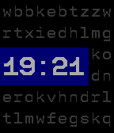</a>

<h2 class="app-name" id="app-67cc84c7b7a023024b2145d9"><a href="https://apps.rebble.io/en_US/application/67cc84c7b7a023024b2145d9">Bad Selection</a></h2>
<a class="app-source" href="https://github.com/articld/BadSelection" title="Source code" data-search-exclude>View source</a>

by <a href="https://apps.rebble.io/en_US/developer/59709aba0dfc32dd14000179/1" title="More from this developer">articld</a>

No licence v0.6 Updated 2025-04-20 Rebble App Store

Runs on: Time 2, Pebble 2 Duo, Pebble 2, Time, Classic

This watchface was created during Rebble&#x27;s Hackathon #002! I got largely inspired by old mechanical flipboards, but the design kinda shifted with time. This watchface is currently a WIP, more…

<a class="app-shot" href="https://apps.repebble.com/bb596e1c5474439b96017a1f" data-search-exclude>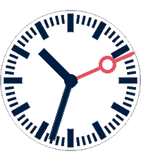</a>

<h2 class="app-name" id="app-bb596e1c5474439b96017a1f"><a href="https://apps.repebble.com/bb596e1c5474439b96017a1f">Bahnuhr</a></h2>
<a class="app-source" href="https://github.com/meyskens/Bahnuhr" title="Source code" data-search-exclude>View source</a>

by <a href="https://apps.repebble.com/apps/dev/maartje-eyskens_34c02825342440b7eebba982" title="More from this developer">Maartje Eyskens</a>

Not checked yet v1.0.1 Updated 2026-05-29

Runs on: Round 2, Time 2, Pebble 2 Duo, Pebble 2, Time Round, Time, Classic

placeholder

<h2 class="app-name" id="app-a757b4ff558e4308af4ea1b4"><a href="https://apps.repebble.com/a757b4ff558e4308af4ea1b4">Bakugo - My Hero Academia</a></h2>
<a class="app-source" href="https://github.com/vinay1017/Pebble-BakugoWatchface" title="Source code" data-search-exclude>View source</a>

by <a href="https://apps.repebble.com/apps/dev/vinayla_cf9b8101421543277d0bbc02" title="More from this developer">Vinayla</a>

Not checked yet v1.2 Updated 2026-09-15

Runs on: Round 2, Time 2

I saw an image of bakugo where the text in the background said BOOM! and it was wonderfully comicbook-y. Took the image, removed the BOOM! and swapped in the time! Written all in C. Just tells…

<a class="app-shot" href="https://apps.repebble.com/6a656dad55030a000901ea38" data-search-exclude>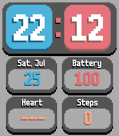</a>

<h2 class="app-name" id="app-6a656dad55030a000901ea38"><a href="https://apps.repebble.com/6a656dad55030a000901ea38">Balatro-style Watchface</a></h2>
<a class="app-source" href="https://gitlab.com/yannyfox/balatro-watchface" title="Source code" data-search-exclude>View source</a>

by <a href="https://apps.repebble.com/apps/dev/yannyfox_6a656a4dd7f034000804f0f1" title="More from this developer">yannyfox</a>

Not checked yet v0.1 Updated 2026-07-26

Runs on: Time 2

Balatro UI inspired watchface featuring the original font from the game, as well as health tracking. Currently only for the Pebble Time 2. This watchface is still in development, to make it more…

<a class="app-shot" href="https://apps.repebble.com/573674d776951a3d05000005" data-search-exclude>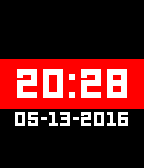</a>

<h2 class="app-name" id="app-573674d776951a3d05000005"><a href="https://apps.repebble.com/573674d776951a3d05000005">Band</a></h2>
<a class="app-source" href="https://github.com/andreiciubotariu/band-watchface" title="Source code" data-search-exclude>View source</a>

by <a href="https://apps.repebble.com/apps/dev/andrei-ciubotariu_55e1175d6cdee4329e0000af" title="More from this developer">Andrei Ciubotariu</a>

MIT v1.2 Updated 2016-09-01

Runs on: Round 2, Time 2, Pebble 2 Duo, Pebble 2, Time Round, Time, Classic

A (really) simple watchface. Time, date, disconnect indicator, and colour options.

<h2 class="app-name" id="app-5305a587b704cb4e7d0000e5"><a href="https://apps.repebble.com/5305a587b704cb4e7d0000e5">Bar Graph</a></h2>
<a class="app-source" href="https://github.com/distantcam/Watchface-BarGraph" title="Source code" data-search-exclude>View source</a>

by <a href="https://apps.repebble.com/apps/dev/cameron-macfarland_5305728d7c1a9d6ce000011c" title="More from this developer">Cameron MacFarland</a>

Not checked yet v2.1.1 Updated 2014-03-05

Runs on: Time 2, Pebble 2 Duo, Pebble 2, Time, Classic

Designed by Sterling B Ely on the Pebble forums.

<h2 class="app-name" id="app-56fea0cf0f5be2595800002e"><a href="https://apps.repebble.com/56fea0cf0f5be2595800002e">Barcelona</a></h2>
<a class="app-source" href="https://github.com/sdneon/Barcelona/" title="Source code" data-search-exclude>View source</a>

by <a href="https://apps.repebble.com/apps/dev/neon_5568037a1034b0abf70000a1" title="More from this developer">Neon</a>

Not checked yet v1.0 Updated 2016-04-05

Runs on: Time 2, Time

Barcelona football club inspired watch face for Pebble Time. (Colour, Digital). Watch face looks similar to Barcelona&#x27;s crest, with a little fun. The examples show (1) 8:25am, Bluetooth connected…

<a class="app-shot" href="https://apps.repebble.com/530a2f2b24c458d540000476" data-search-exclude>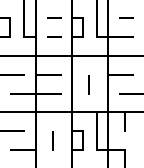</a>

<h2 class="app-name" id="app-530a2f2b24c458d540000476"><a href="https://apps.repebble.com/530a2f2b24c458d540000476">Barely V2</a></h2>
<a class="app-source" href="https://github.com/philplckthun/pebble-barely-v2" title="Source code" data-search-exclude>View source</a>

by <a href="https://apps.repebble.com/apps/dev/phil-pl-ckthun_5301c6682b218d48670003a5" title="More from this developer">Phil Plückthun</a>

Not checked yet v1.1.1 Updated 2014-02-24

Runs on: Time 2, Pebble 2 Duo, Pebble 2, Time, Classic

Simplified digits displayed only using horizontal and vertical lines. Four squares for the time, four for the date, and four for the year, filling the whole screen. Also invertable! It doesn&#x27;t use…

<a class="app-shot" href="https://apps.rebble.io/en_US/application/583b182600355aeba4000137" data-search-exclude>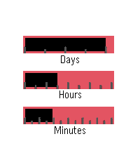</a>

<h2 class="app-name" id="app-583b182600355aeba4000137"><a href="https://apps.rebble.io/en_US/application/583b182600355aeba4000137">Bars</a></h2>
<a class="app-source" href="https://github.com/alekoz47/bars" title="Source code" data-search-exclude>View source</a>

by <a href="https://apps.rebble.io/en_US/developer/567b3f6337e090549c000075/1" title="More from this developer">alekoz47</a>

GPL-3.0 v1.1 Updated 2016-11-28 Rebble App Store

Runs on: Round 2, Time 2, Time Round, Time

A simple watchface using loading bars to represent the time and date. The date is ticked by marks every 7 days, hours every 3, and minutes every 5.

<a class="app-shot" href="https://apps.repebble.com/629300609a284e1fab80a763" data-search-exclude>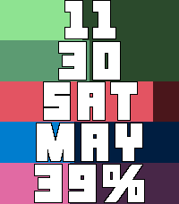</a>

<h2 class="app-name" id="app-629300609a284e1fab80a763"><a href="https://apps.repebble.com/629300609a284e1fab80a763">Bars 2</a></h2>
<a class="app-source" href="https://github.com/julpel8/pebble-bars-2" title="Source code" data-search-exclude>View source</a>

by <a href="https://apps.repebble.com/apps/dev/julpel8_4832e5dc5bcac873d9cd9ff7" title="More from this developer">julpel8</a>

Not checked yet v0.6.0 Updated 2026-07-26

Runs on: Round 2, Time 2

Because ELEQUENT’s Bars doesn’t work on the Pebble Time 2 and because it’s such a lovely watchface, I decided to recreate it for the new generation of Pebble watches

<a class="app-shot" href="https://apps.repebble.com/8a6bdc2d8d254225b3f437dc" data-search-exclude>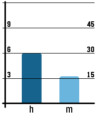</a>

<h2 class="app-name" id="app-8a6bdc2d8d254225b3f437dc"><a href="https://apps.repebble.com/8a6bdc2d8d254225b3f437dc">BarsOne</a></h2>
<a class="app-source" href="https://github.com/dasdom/pebble_watch_face_bars_one" title="Source code" data-search-exclude>View source</a>

by <a href="https://apps.repebble.com/apps/dev/dominik-hauser_ab6e7e563a14ef03bb88d9a6" title="More from this developer">Dominik Hauser</a>

Not checked yet v1.0 Updated 2026-02-20

Runs on: Time 2, Pebble 2 Duo, Pebble 2, Time, Classic

Watch face for all the bar chart lovers out there.

<a class="app-shot" href="https://apps.repebble.com/6cce984be2de40baa07d4785" data-search-exclude>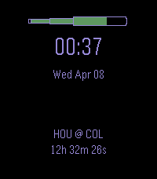</a>

<h2 class="app-name" id="app-6cce984be2de40baa07d4785"><a href="https://apps.repebble.com/6cce984be2de40baa07d4785">Baseball Countdown</a></h2>
<a class="app-source" href="https://github.com/treverjohnston/pebbleMLB" title="Source code" data-search-exclude>View source</a>

by <a href="https://apps.repebble.com/apps/dev/ebenezer-development_9773f1c076f0525e423e32fe" title="More from this developer">Ebenezer Development</a>

Not checked yet v1.0 Updated 2026-04-08

Runs on: Round 2, Time 2

A basic watchface that counts down to the game time of your favorite MLB team. Complete with baseball &#x27;bat&#x27;-tery bar. Once a game starts, countdown converts to updating score.

<a class="app-shot" href="https://apps.repebble.com/17d9e63004874c0b9755c1bc" data-search-exclude>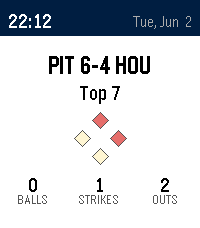</a>

<h2 class="app-name" id="app-17d9e63004874c0b9755c1bc"><a href="https://apps.repebble.com/17d9e63004874c0b9755c1bc">Baseball Scores</a></h2>
<a class="app-source" href="https://github.com/jimmytimmons/pebble-baseball" title="Source code" data-search-exclude>View source</a>

by <a href="https://apps.repebble.com/apps/dev/jimmy-timmons_f97aa2549a33d05d7825987f" title="More from this developer">Jimmy Timmons</a>

Not checked yet v1.0.0 Updated 2026-06-03

Runs on: Time 2

Live MLB scores on your wrist. Baseball Scores auto-cycles through up to three of your favorite teams, showing the live score, base runners, the ball-strike-out count, and the inning. On off-days…

<h2 class="app-name" id="app-581cd8db9cbbafc558000127"><a href="https://apps.repebble.com/581cd8db9cbbafc558000127">Basic 1</a></h2>
<a class="app-source" href="https://github.com/maxmoseley23/Basic-1" title="Source code" data-search-exclude>View source</a>

by <a href="https://apps.repebble.com/apps/dev/maxwell-moseley_57afcb76bb85ed5f9b0003fc" title="More from this developer">Maxwell Moseley</a>

Not checked yet v1.3 Updated 2016-11-06

Runs on: Round 2, Time 2, Pebble 2 Duo, Pebble 2, Time Round, Time, Classic

Back to basics. Battery friendly and lightweight. Just the time and date. Configure every colour. Set it to vibrate on top of the hour. Use military time instead of 12 hr. The choice is yours.

<a class="app-shot" href="https://apps.repebble.com/b063aceac2394267982a890d" data-search-exclude>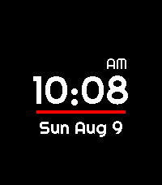</a>

<h2 class="app-name" id="app-b063aceac2394267982a890d"><a href="https://apps.repebble.com/b063aceac2394267982a890d">Basic big digital</a></h2>
<a class="app-source" href="https://github.com/awwaiid/pebble-watchface-basic-big-digital" title="Source code" data-search-exclude>View source</a>

by <a href="https://apps.repebble.com/apps/dev/awwaiid_a6122c9c814c119e3a27343e" title="More from this developer">awwaiid</a>

MIT v1.1.1 Updated 2026-08-09

Runs on: Time 2

Big, clean digital watchface for Pebble Time 2 (emery). Huge centered LECO digits, AM/PM tucked above the last digit in 12-hour mode, a red accent line, and a date line you can configure from the…

<a class="app-shot" href="https://apps.repebble.com/557b4e42bae817ca0b000080" data-search-exclude>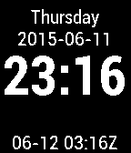</a>

<h2 class="app-name" id="app-557b4e42bae817ca0b000080"><a href="https://apps.repebble.com/557b4e42bae817ca0b000080">basic plus utc</a></h2>
<a class="app-source" href="https://github.com/chrisperelstein/basic_plus_utc" title="Source code" data-search-exclude>View source</a>

by <a href="https://apps.repebble.com/apps/dev/chris-perelstein_5575a255b600bdb9bf00002b" title="More from this developer">Chris Perelstein</a>

Not checked yet v1.1 Updated 2015-08-24

Runs on: Time 2, Pebble 2 Duo, Pebble 2, Time, Classic

Basic watchface with UTC date and time at the bottom.

<a class="app-shot" href="https://apps.repebble.com/54c94eb3bcb000619a000062" data-search-exclude>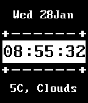</a>

<h2 class="app-name" id="app-54c94eb3bcb000619a000062"><a href="https://apps.repebble.com/54c94eb3bcb000619a000062">Basic watchface</a></h2>
<a class="app-source" href="https://cloudpebble.net/ide/project/123497#" title="Source code" data-search-exclude>View source</a>

by <a href="https://apps.repebble.com/apps/dev/petermcconn_5484be80a063216abf000088" title="More from this developer">petermcconn</a>

See source v1.0 Updated 2015-01-28

Runs on: Time 2, Pebble 2 Duo, Pebble 2, Time, Classic

just your average watchface with the weather on it

<a class="app-shot" href="https://apps.repebble.com/548e2839f1f4ab6c44000029" data-search-exclude>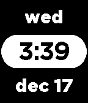</a>

<h2 class="app-name" id="app-548e2839f1f4ab6c44000029"><a href="https://apps.repebble.com/548e2839f1f4ab6c44000029">BasicTime</a></h2>
<a class="app-source" href="https://github.com/charles-meyer/basic-watchface" title="Source code" data-search-exclude>View source</a>

by <a href="https://apps.repebble.com/apps/dev/charles-meyer_542b8b797a43169188000184" title="More from this developer">Charles Meyer</a>

Not checked yet v1.1 Updated 2014-12-17

Runs on: Time 2, Pebble 2 Duo, Pebble 2, Time, Classic

Minimalist, no nonsense, time, date, and day of the week.

<a class="app-shot" href="https://apps.repebble.com/549afa9da003de7939000122" data-search-exclude>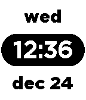</a>

<h2 class="app-name" id="app-549afa9da003de7939000122"><a href="https://apps.repebble.com/549afa9da003de7939000122">BasicTime II</a></h2>
<a class="app-source" href="https://github.com/charles-meyer/basic-watchface" title="Source code" data-search-exclude>View source</a>

by <a href="https://apps.repebble.com/apps/dev/charles-meyer_542b8b797a43169188000184" title="More from this developer">Charles Meyer</a>

Not checked yet v1.0 Updated 2014-12-25

Runs on: Time 2, Pebble 2 Duo, Pebble 2, Time, Classic

A minimalist time, date, and day of the week. Inverted colors of original BasicTime watchface.

<a class="app-shot" href="https://apps.repebble.com/558b450bfd0cf8c7c6000027" data-search-exclude>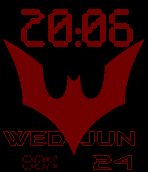</a>

<h2 class="app-name" id="app-558b450bfd0cf8c7c6000027"><a href="https://apps.repebble.com/558b450bfd0cf8c7c6000027">Batman beyond (Batman of the Future)</a></h2>
<a class="app-source" href="https://github.com/BOBdotEXE/pebblebeyond/tree/release" title="Source code" data-search-exclude>View source</a>

by <a href="https://apps.repebble.com/apps/dev/bobdotexe_54f5238c89900e4bb10000cf" title="More from this developer">BOBdotEXE</a>

No licence v1.01 Updated 2017-08-08

Runs on: Time 2, Pebble 2 Duo, Pebble 2, Time, Classic

The future is under your protection with this new BATMAN BEYOND pebble watchface! every 18 seconds it animates, and has a special surprise at the change of the hour! and in the future (heheh, get…

<a class="app-shot" href="https://apps.repebble.com/5785910869ee718ea2000011" data-search-exclude>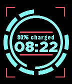</a>

<h2 class="app-name" id="app-5785910869ee718ea2000011"><a href="https://apps.repebble.com/5785910869ee718ea2000011">Battery Info</a></h2>
<a class="app-source" href="http://fieldwalking.jp/blog/watch-face_battery-info/" title="Source code" data-search-exclude>View source</a>

by <a href="https://apps.repebble.com/apps/dev/fieldwalking_52f88d452a8acf5cab00018f" title="More from this developer">fieldWalking</a>

See source v1.3 Updated 2016-11-23

Runs on: Round 2, Time 2, Time Round, Time

display clock and battery. inner circle means second. outer circle means remaining battery. If it&#x27;s ok with you,please try my app. Don&#x27;t step the White Tile. http://goo.gl/DFYcFh

<a class="app-shot" href="https://apps.repebble.com/52b214b18c0815094d000064" data-search-exclude>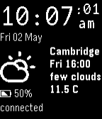</a>

<h2 class="app-name" id="app-52b214b18c0815094d000064"><a href="https://apps.repebble.com/52b214b18c0815094d000064">Battery Monitor Watchface</a></h2>
<a class="app-source" href="https://github.com/avewrigley/pebble-batttery-monitor" title="Source code" data-search-exclude>View source</a>

by <a href="https://apps.repebble.com/apps/dev/ave-wrigley_52b201ddb70e1c66a300002e" title="More from this developer">Ave Wrigley</a>

No licence v1.0.31 Updated 2014-06-23

Runs on: Time 2, Pebble 2 Duo, Pebble 2, Time, Classic

Simple watch face, displaying time / date, location, local weather, and bluetooth connection / battery status. Vibrates when battery low / bluetooth disconnected. Cycles 3 hour forecasts. Tap to…

<a class="app-shot" href="https://apps.repebble.com/56a88003124705dd7800001f" data-search-exclude>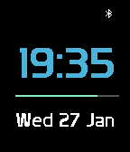</a>

<h2 class="app-name" id="app-56a88003124705dd7800001f"><a href="https://apps.repebble.com/56a88003124705dd7800001f">Batteryface</a></h2>
<a class="app-source" href="https://github.com/NovaGL/Batteryface" title="Source code" data-search-exclude>View source</a>

by <a href="https://apps.repebble.com/apps/dev/novag_56a554a6fce0901b0600005d" title="More from this developer">NovaG</a>

No licence v2.20 Updated 2016-02-14

Runs on: Round 2, Time 2, Pebble 2 Duo, Pebble 2, Time Round, Time, Classic

Simple Pebble watch face with time and date. Features battery bar below time to show current battery level, also contains BT level. Supports multiple languages: English, French, German, Spanish &amp;…

<a class="app-shot" href="https://apps.repebble.com/577dd52c66202a598b00029b" data-search-exclude>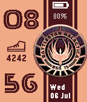</a>

<h2 class="app-name" id="app-577dd52c66202a598b00029b"><a href="https://apps.repebble.com/577dd52c66202a598b00029b">Battlestar Galactica BSG75</a></h2>
<a class="app-source" href="https://github.com/DanielLimaDF/BATTLESTAR_GALACTICA_BSG75_PEBBLE_FACE" title="Source code" data-search-exclude>View source</a>

by <a href="https://apps.repebble.com/apps/dev/daniel-lima_56d65637d11364847500004f" title="More from this developer">Daniel Lima</a>

No licence v1.0 Updated 2016-07-07

Runs on: Round 2, Time 2, Pebble 2 Duo, Pebble 2, Time Round, Time, Classic

Battlestar Galactica watchface showing current date, day of week, time, steps and battery status. So say we all!

<h2 class="app-name" id="app-577de5476c21044cf50002a9"><a href="https://apps.repebble.com/577de5476c21044cf50002a9">Battlestar Galactica Photos</a></h2>
<a class="app-source" href="https://github.com/DanielLimaDF/BATTLESTAR_GALACTICA_PEBBLE_WATCHFACE" title="Source code" data-search-exclude>View source</a>

by <a href="https://apps.repebble.com/apps/dev/daniel-lima_56d65637d11364847500004f" title="More from this developer">Daniel Lima</a>

No licence v1.0 Updated 2016-07-07

Runs on: Round 2, Time 2, Pebble 2 Duo, Pebble 2, Time Round, Time, Classic

Battlestar Galactica watchface with three different backgrounds that change every 5 minutes. Showing current date, day of week, time, steps and battery status. So say we all!

<a class="app-shot" href="https://apps.repebble.com/577ddfc566202a598b0002a4" data-search-exclude>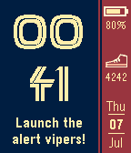</a>

<h2 class="app-name" id="app-577ddfc566202a598b0002a4"><a href="https://apps.repebble.com/577ddfc566202a598b0002a4">Battlestar Galactica Quotes</a></h2>
<a class="app-source" href="https://github.com/DanielLimaDF/BATTLESTAR_GALACTICA_QUOTES_PEBBLE_FACE" title="Source code" data-search-exclude>View source</a>

by <a href="https://apps.repebble.com/apps/dev/daniel-lima_56d65637d11364847500004f" title="More from this developer">Daniel Lima</a>

No licence v1.0 Updated 2016-07-07

Runs on: Round 2, Time 2, Pebble 2 Duo, Pebble 2, Time Round, Time, Classic

Battlestar Galactica watchface with quotes that change every minute. Showing current date, day of week, time, steps and battery status. So say we all!

<a class="app-shot" href="https://apps.repebble.com/1565d65a737b4d3591cff3b4" data-search-exclude>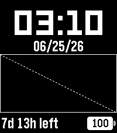</a>

<h2 class="app-name" id="app-1565d65a737b4d3591cff3b4"><a href="https://apps.repebble.com/1565d65a737b4d3591cff3b4">BattMan</a></h2>
<a class="app-source" href="https://github.com/KiserDesigns/Pebble_BattMan" title="Source code" data-search-exclude>View source</a>

by <a href="https://apps.repebble.com/apps/dev/noah-kiser_309e95d94e23b9be8fa889d9" title="More from this developer">Noah Kiser</a>

No licence v1.4.4 Updated 2026-07-07

Runs on: Round 2, Time 2, Pebble 2 Duo, Pebble 2, Time Round, Time, Classic

Simple Watchface that predicts battery life and charge time. Weather from Open-Meteo. Charge and Discharge rate estimates are saved to persistent storage, and are re-calculated based on actual…

<a class="app-shot" href="https://apps.repebble.com/55a2cb2c2965f266c4000062" data-search-exclude>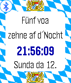</a>

<h2 class="app-name" id="app-55a2cb2c2965f266c4000062"><a href="https://apps.repebble.com/55a2cb2c2965f266c4000062">Bavarian Clock</a></h2>
<a class="app-source" href="https://github.com/oth-aw/BavarianClock.git" title="Source code" data-search-exclude>View source</a>

by <a href="https://apps.repebble.com/apps/dev/dieter-meiller_5596834a84bff5a34a000040" title="More from this developer">Dieter Meiller</a>

Not checked yet v1.1 Updated 2015-07-13

Runs on: Time 2, Pebble 2 Duo, Pebble 2, Time, Classic

This watchface tells the time in the bavarian language (Bairisch).

<a class="app-shot" href="https://apps.repebble.com/54bb25f95efa476fee0000f4" data-search-exclude>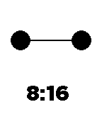</a>

<h2 class="app-name" id="app-54bb25f95efa476fee0000f4"><a href="https://apps.repebble.com/54bb25f95efa476fee0000f4">Baymax</a></h2>
<a class="app-source" href="https://github.com/jessemillar/Pebbling/tree/master/Baymax" title="Source code" data-search-exclude>View source</a>

by <a href="https://apps.repebble.com/apps/dev/jesse-millar_54305df1a2f622febf0001cc" title="More from this developer">Jesse Millar</a>

Not checked yet v1.0 Updated 2015-01-18

Runs on: Time 2, Pebble 2 Duo, Pebble 2, Time, Classic

A cute, Big Hero 6 companion for your watch. He blinks on occasion and even gets drunk when your Pebble is low on power.

<h2 class="app-name" id="app-55447aad3bbdc6296e00001e"><a href="https://apps.repebble.com/55447aad3bbdc6296e00001e">Baymax - Big Hero 6</a></h2>
<a class="app-source" href="https://github.com/sloan-848/BigHero-Watchface" title="Source code" data-search-exclude>View source</a>

by <a href="https://apps.repebble.com/apps/dev/will-sloan_5302a3109847d1c53c000037" title="More from this developer">Will Sloan</a>

Not checked yet v1.1 Updated 2015-05-06

Runs on: Time 2, Time

A Big Hero 6 watchface featuring everyone&#x27;s favorite healthcare companion: Baymax!

<a class="app-shot" href="https://apps.repebble.com/55994a75a3e6689532000038" data-search-exclude>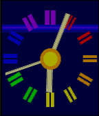</a>

<h2 class="app-name" id="app-55994a75a3e6689532000038"><a href="https://apps.repebble.com/55994a75a3e6689532000038">BBC</a></h2>
<a class="app-source" href="https://github.com/an-ox/bbc" title="Source code" data-search-exclude>View source</a>

by <a href="https://apps.repebble.com/apps/dev/llamasoft_5587e2694fa1ea20620000ba" title="More from this developer">Llamasoft</a>

No licence v1.04 Updated 2015-08-09

Runs on: Time 2, Pebble 2 Duo, Pebble 2, Time, Classic

Watchfaces based on BBC continuity clocks from various eras 1953-1991. Extended colour mode available that incorporates battery level information into the visual design of each face.

<a class="app-shot" href="https://apps.repebble.com/561181e5ce7b4c4a4400001b" data-search-exclude>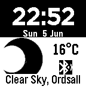</a>

<h2 class="app-name" id="app-561181e5ce7b4c4a4400001b"><a href="https://apps.repebble.com/561181e5ce7b4c4a4400001b">BBC Weather</a></h2>
<a class="app-source" href="https://github.com/elenimikro/bbc-weather-pebbleface" title="Source code" data-search-exclude>View source</a>

by <a href="https://apps.repebble.com/apps/dev/eleni-mikroyannidi_5509d86484ad02f9f0000054" title="More from this developer">Eleni Mikroyannidi</a>

Not checked yet v1.5 Updated 2016-06-05

Runs on: Time 2, Pebble 2 Duo, Pebble 2, Time, Classic

A simple pebble watchface that gets BBC weather data of your location. This is not an official BBC weather app.

<a class="app-shot" href="https://apps.rebble.io/en_US/application/690a0923ce68bc0009859f56" data-search-exclude>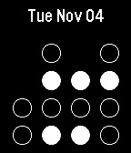</a>

<h2 class="app-name" id="app-690a0923ce68bc0009859f56"><a href="https://apps.rebble.io/en_US/application/690a0923ce68bc0009859f56">BCD</a></h2>
<a class="app-source" href="https://github.com/mshroyer/pebble-bcdface/" title="Source code" data-search-exclude>View source</a>

by <a href="https://apps.rebble.io/en_US/developer/69030941b2e4450008211464/1" title="More from this developer">Mark Shroyer</a>

Not checked yet v2.0 Updated 2025-11-04 Rebble App Store

Runs on: Time 2, Pebble 2 Duo, Pebble 2, Time, Classic

Displays local time in binary coded decimal (BCD) format

<h2 class="app-name" id="app-5456af5633c864aa220000cb"><a href="https://apps.repebble.com/5456af5633c864aa220000cb">BCD Clock</a></h2>
<a class="app-source" href="https://github.com/stilvoid/binary-face" title="Source code" data-search-exclude>View source</a>

by <a href="https://apps.repebble.com/apps/dev/stilvoid_543bccf0495b34c5a8000192" title="More from this developer">stilvoid</a>

Not checked yet v0.1 Updated 2014-11-02

Runs on: Time 2, Pebble 2 Duo, Pebble 2, Time, Classic

A left-to-right Binary Coded Decimal watchface. Each column represents a single digit of the current time.

<a class="app-shot" href="https://apps.repebble.com/52c519e61e1161eea4000012" data-search-exclude>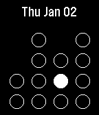</a>

<h2 class="app-name" id="app-52c519e61e1161eea4000012"><a href="https://apps.repebble.com/52c519e61e1161eea4000012">BCD Face</a></h2>
<a class="app-source" href="https://github.com/markshroyer/pebble-bcdface" title="Source code" data-search-exclude>View source</a>

by <a href="https://apps.repebble.com/apps/dev/paleogene_52c515ff1e116178da000010" title="More from this developer">Paleogene</a>

Not checked yet v1.0.1 Updated 2014-01-02

Runs on: Time 2, Pebble 2 Duo, Pebble 2, Time, Classic

A binary (actually, BCD) watch face for the Pebble. This face will additionally vibrate and display a &quot;no phone&quot; icon if you lose connection with your phone.

<a class="app-shot" href="https://apps.repebble.com/5299d4da129af7d723000079" data-search-exclude>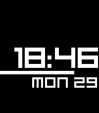</a>

<h2 class="app-name" id="app-5299d4da129af7d723000079"><a href="https://apps.repebble.com/5299d4da129af7d723000079">Beam Up</a></h2>
<a class="app-source" href="https://github.com/C-D-Lewis/pebble-dev" title="Source code" data-search-exclude>View source</a>

by <a href="https://apps.repebble.com/apps/dev/chris-lewis_5299cd30e627ce1147000099" title="More from this developer">Chris Lewis</a>

No licence v3.9 Updated 2026-01-14

Runs on: Round 2, Time 2, Pebble 2 Duo, Pebble 2, Time Round, Time, Classic

Note: All variant features are now rolled into this version! Choose from &#x27;Settings&#x27;. A minimal watch face with small, compact animations that show 15, 30 and 45 seconds past the minute. On the…

<a class="app-shot" href="https://apps.repebble.com/52e9cee25c062b090700003d" data-search-exclude>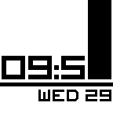</a>

<h2 class="app-name" id="app-52e9cee25c062b090700003d"><a href="https://apps.repebble.com/52e9cee25c062b090700003d">Beam Up: Date, Inverted, 5 Second</a></h2>
<a class="app-source" href="https://github.com/JoshuaJ0/Beam-Up-Date-Inverted-5-Seconds" title="Source code" data-search-exclude>View source</a>

by <a href="https://apps.repebble.com/apps/dev/joshuaj0_52e91e56a85c63f6b1000034" title="More from this developer">JoshuaJ0</a>

No licence v2.1.0 Updated 2014-02-08

Runs on: Time 2, Pebble 2 Duo, Pebble 2, Time, Classic

The Beam Up watch face for the Pebble Smart Watch on SDK 2.0...with a twist! Has the date on the face, and it&#x27;s inverted (black numbers, white background). The progress bar also moves on 5 second…

<a class="app-shot" href="https://apps.repebble.com/52bae728aac062f2210000a1" data-search-exclude>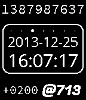</a>

<h2 class="app-name" id="app-52bae728aac062f2210000a1"><a href="https://apps.repebble.com/52bae728aac062f2210000a1">Beapoch</a></h2>
<a class="app-source" href="https://github.com/jerith/pebble-beapoch" title="Source code" data-search-exclude>View source</a>

by <a href="https://apps.repebble.com/apps/dev/jerith_52ba9deb6437d1df62000055" title="More from this developer">jerith</a>

Not checked yet v2.0.1 Updated 2014-03-08

Runs on: Time 2, Pebble 2 Duo, Pebble 2, Time, Classic

Pebble watch face that displays Unix time and Swatch .beats.

<a class="app-shot" href="https://apps.repebble.com/6b5e3c1ac0a849e09de40b22" data-search-exclude>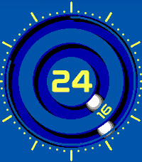</a>

<h2 class="app-name" id="app-6b5e3c1ac0a849e09de40b22"><a href="https://apps.repebble.com/6b5e3c1ac0a849e09de40b22">Bearing</a></h2>
<a class="app-source" href="https://github.com/astosia/Bearing" title="Source code" data-search-exclude>View source</a>

by <a href="https://apps.repebble.com/apps/dev/astosia_58a635d30dfc320dc60003b4" title="More from this developer">astosia</a>

GPL-3.0 v4.0 Updated 2026-06-20

Runs on: Round 2, Time 2, Pebble 2 Duo, Pebble 2, Time Round, Time, Classic

Analogue &amp; Digital watchface styled after magnetic ball watches. The hands rolls around the ball race of the bearing. Works on all pebbles. Features &amp; Options: - NEW in V2: Gravity Mode (all…

<a class="app-shot" href="https://apps.rebble.io/en_US/application/55c8cf1c7fde01b16d000003" data-search-exclude>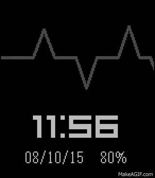</a>

<h2 class="app-name" id="app-55c8cf1c7fde01b16d000003"><a href="https://apps.rebble.io/en_US/application/55c8cf1c7fde01b16d000003">Beat</a></h2>
<a class="app-source" href="https://edwinfinch.com/redirect/pebble-legacy-source" title="Source code" data-search-exclude>View source</a>

by <a href="https://apps.rebble.io/en_US/developer/5db6f59e385af50001ba25f9/1" title="More from this developer">Edwin Finch</a>

See source v2.6 Updated 2021-06-17 Rebble App Store

Runs on: Time 2, Pebble 2 Duo, Pebble 2, Time, Classic

An old classic from our original collection from 2014-2016, now free &amp; open source!

<a class="app-shot" href="https://apps.repebble.com/57e1019916a229b23e000083" data-search-exclude>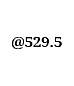</a>

<h2 class="app-name" id="app-57e1019916a229b23e000083"><a href="https://apps.repebble.com/57e1019916a229b23e000083">Beat It</a></h2>
<a class="app-source" href="https://github.com/Xowap/BeatIt" title="Source code" data-search-exclude>View source</a>

by <a href="https://apps.repebble.com/apps/dev/xowap_57dfa565a4c66d12b3000069" title="More from this developer">Xowap</a>

WTFPL v1.0 Updated 2016-09-20

Runs on: Time 2, Pebble 2 Duo, Pebble 2, Time, Classic

Displays the Internet Time! Internet Time is a time standard invented by Swatch. The idea is to split days in 1000 slices that are &quot;.beats&quot;. Those are time-zone independant, 0 happens at midnight…

<h2 class="app-name" id="app-557d3c400abe26cc990000f8"><a href="https://apps.repebble.com/557d3c400abe26cc990000f8">BEAVER Typeface</a></h2>
<a class="app-source" href="https://github.com/suzuki/beaver-typeface-watchface" title="Source code" data-search-exclude>View source</a>

by <a href="https://apps.repebble.com/apps/dev/0610-org_52f415cfa991ccfd490001d5" title="More from this developer">0610.org</a>

Not checked yet v2.0 Updated 2015-10-21

Runs on: Round 2, Time 2, Pebble 2 Duo, Pebble 2, Time Round, Time, Classic

The &quot;BEAVER Typeface&quot; watchface. I like this typeface/font. So, create watchface this.

<h2 class="app-name" id="app-5a77514d0dfc321c120024d7"><a href="https://apps.rebble.io/en_US/application/5a77514d0dfc321c120024d7">BebasNeue Forque - Silent Assassin Edition</a></h2>
<a class="app-source" href="https://github.com/itmitica/Pebble-BebasNeue.git" title="Source code" data-search-exclude>View source</a>

by <a href="https://apps.rebble.io/en_US/developer/5721f6ed0676425a62000009/1" title="More from this developer">itmitica</a>

Not checked yet v1.8 Updated 2018-02-08 Rebble App Store

Runs on: Time 2, Pebble 2 Duo, Pebble 2, Time, Classic

Time - The Silent Assassin Shake your wrist to shake off the silent assassin ! Displays date, marked weekday, time BebasNeue and Forque fonts

<a class="app-shot" href="https://apps.repebble.com/53cab0926c9b69335b00014f" data-search-exclude>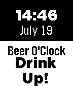</a>

<h2 class="app-name" id="app-53cab0926c9b69335b00014f"><a href="https://apps.repebble.com/53cab0926c9b69335b00014f">Beer O&#x27;Clock</a></h2>
<a class="app-source" href="https://github.com/obihann/Beer-O-Clock" title="Source code" data-search-exclude>View source</a>

by <a href="https://apps.repebble.com/apps/dev/jeff_52e6726f14a5c963d8000025" title="More from this developer">Jeff</a>

Not checked yet v1.2 Updated 2014-07-21

Runs on: Time 2, Pebble 2 Duo, Pebble 2, Time, Classic

5PM... What is their to say? The time that we all count down until, the time we dream of, the time we ditch our suits and ties and partake in the drink of the gods, BEER! Yes, if you are a simple…

<h2 class="app-name" id="app-548be6a73987d6a62100007c"><a href="https://apps.repebble.com/548be6a73987d6a62100007c">Beer O&#x27;Clock</a></h2>
<a class="app-source" href="https://github.com/patch-e/pebble-beer-o-clock-dx" title="Source code" data-search-exclude>View source</a>

by <a href="https://apps.repebble.com/apps/dev/patrick-crager_52bc40547e4312200c000142" title="More from this developer">Patrick Crager</a>

Not checked yet v1.1 Updated 2014-12-14

Runs on: Time 2, Pebble 2 Duo, Pebble 2, Time, Classic

A silly watchface featuring a beer mug that fills from 9am until Beer O&#x27;Clock (aka 5pm). This is a port of a Pebble 1.0 firmware watchface written by ThomW (http://www.lmnopc.com/) to be…

<h2 class="app-name" id="app-531a8ed72559af6f680007ff"><a href="https://apps.repebble.com/531a8ed72559af6f680007ff">Beer O&#x27;Clock</a></h2>
<a class="app-source" href="https://github.com/Hypnopompia/pebble-beerOClock" title="Source code" data-search-exclude>View source</a>

by <a href="https://apps.repebble.com/apps/dev/tj-hunter_531a19549091c45874000005" title="More from this developer">TJ Hunter</a>

MIT v2.0.0 Updated 2014-03-08

Runs on: Time 2, Pebble 2 Duo, Pebble 2, Time, Classic

A simple watch face that only shows the text &quot;Beer O&#x27;Clock&quot; and never changes.

<h2 class="app-name" id="app-565f477e716fd9d5f6000097"><a href="https://apps.repebble.com/565f477e716fd9d5f6000097">Beer O&#x27;Clock</a></h2>
<a class="app-source" href="https://github.com/torb/fluffy-kidney" title="Source code" data-search-exclude>View source</a>

by <a href="https://apps.repebble.com/apps/dev/torbj-rn-morland_55e9a7d527839ecf17000022" title="More from this developer">Torbjørn Morland</a>

Not checked yet v1.2 Updated 2025-11-25

Runs on: Time 2, Pebble 2 Duo, Pebble 2, Time, Classic

Tired of your watch telling you what time it is? You now have the power to tell it instead. Beer O&#x27;Clock? Five O&#x27;Clock? Anything is possible. There are also some easter eggs. Try setting it to…

<a class="app-shot" href="https://apps.repebble.com/55aaa4c6609cd536c10000b5" data-search-exclude>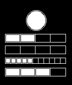</a>

<h2 class="app-name" id="app-55aaa4c6609cd536c10000b5"><a href="https://apps.repebble.com/55aaa4c6609cd536c10000b5">Berlin Clock</a></h2>
<a class="app-source" href="http://pastebin.com/GCvt4MJt" title="Source code" data-search-exclude>View source</a>

by <a href="https://apps.repebble.com/apps/dev/john-hammond_557457774604f6bd68000037" title="More from this developer">John Hammond</a>

See source v1.0 Updated 2015-07-18

Runs on: Time 2, Pebble 2 Duo, Pebble 2, Time, Classic

The Berlin Clock, on your wrist! From Wikipedia... Telling the time based on the &quot;set theory principle&quot;, the Mengenlehreuhr (Berlin Clock) consists of 24 lights which are divided into one circular…

<a class="app-shot" href="https://apps.repebble.com/52e4522b34ba6657d7000cd7" data-search-exclude>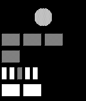</a>

<h2 class="app-name" id="app-52e4522b34ba6657d7000cd7"><a href="https://apps.repebble.com/52e4522b34ba6657d7000cd7">Berlin Clock</a></h2>
<a class="app-source" href="https://github.com/pneumaticdeath/berlin_clock" title="Source code" data-search-exclude>View source</a>

by <a href="https://apps.repebble.com/apps/dev/mitch-patenaude_52e4516e34ba664fc8000c3f" title="More from this developer">Mitch Patenaude</a>

Not checked yet v1.0.1 Updated 2014-02-22

Runs on: Time 2, Pebble 2 Duo, Pebble 2, Time, Classic

An implementation of the famous Berlin clock. Misnamed the Mengenlehreuhr, or &quot;set theory clock&quot;, it uses a series of blocks to represent the time in 24h format. The circle at the top blinks with…

<a class="app-shot" href="https://apps.repebble.com/52cb11e6b13828dedf00002b" data-search-exclude>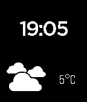</a>

<h2 class="app-name" id="app-52cb11e6b13828dedf00002b"><a href="https://apps.repebble.com/52cb11e6b13828dedf00002b">BetterWeather</a></h2>
<a class="app-source" href="https://github.com/MarcDufresne/betterweather-watchface" title="Source code" data-search-exclude>View source</a>

by <a href="https://apps.repebble.com/apps/dev/marc-andr-dufresne_52cb0dc545ffdd6893000022" title="More from this developer">Marc-André Dufresne</a>

No licence v1.0 Updated 2014-01-11

Runs on: Time 2, Pebble 2 Duo, Pebble 2, Time, Classic

This watchface displays weather by connecting to the BetterWeather DashClock extension on Android. It will display one of the more than 10 icons available to reflect the current condition and the…

<a class="app-shot" href="https://apps.repebble.com/5554f3a8f5c8abb110000016" data-search-exclude>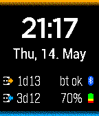</a>

<h2 class="app-name" id="app-5554f3a8f5c8abb110000016"><a href="https://apps.repebble.com/5554f3a8f5c8abb110000016">BetteryWatch</a></h2>
<a class="app-source" href="https://github.com/astifter/BetteryWatch" title="Source code" data-search-exclude>View source</a>

by <a href="https://apps.repebble.com/apps/dev/andreas-neustifter_5304d9e3fe93ed25bf000249" title="More from this developer">Andreas Neustifter</a>

No licence v1.1 Updated 2015-06-09

Runs on: Time 2, Pebble 2 Duo, Pebble 2, Time, Classic

A watchface with a better battery estimate. This watchface shows (beside the Bluetooth state and the battery percentage) the time since last fully charged and the estimated running time with the…

<a class="app-shot" href="https://apps.repebble.com/6834f92e6eeb590009984aa3" data-search-exclude>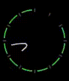</a>

<h2 class="app-name" id="app-6834f92e6eeb590009984aa3"><a href="https://apps.repebble.com/6834f92e6eeb590009984aa3">Bezier</a></h2>
<a class="app-source" href="https://github.com/sockeye-d/pebble-bezier" title="Source code" data-search-exclude>View source</a>

by <a href="https://apps.repebble.com/apps/dev/fish_682b987ec15d300009637d7d" title="More from this developer">fish</a>

Not checked yet v1.1 Updated 2025-05-26

Runs on: Round 2, Time 2, Pebble 2 Duo, Pebble 2, Time Round, Time, Classic

it draw the hand bezierly

<a class="app-shot" href="https://apps.repebble.com/5448714d00cbca32f1000046" data-search-exclude>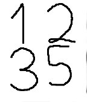</a>

<h2 class="app-name" id="app-5448714d00cbca32f1000046"><a href="https://apps.repebble.com/5448714d00cbca32f1000046">bezier</a></h2>
<a class="app-source" href="https://github.com/quartersdg/bezier" title="Source code" data-search-exclude>View source</a>

by <a href="https://apps.repebble.com/apps/dev/quarter_52f325bc1f27f5136200040b" title="More from this developer">quarter</a>

Not checked yet v1.1 Updated 2014-12-24

Runs on: Time 2, Pebble 2 Duo, Pebble 2, Time, Classic

Draws digits using bezier curves and morphs between digits as time passes.

<h2 class="app-name" id="app-55bf91e406d9564d9d00003d"><a href="https://apps.repebble.com/55bf91e406d9564d9d00003d">BibleSwitch</a></h2>
<a class="app-source" href="https://github.com/MackEdweise/BibleSwitch" title="Source code" data-search-exclude>View source</a>

by <a href="https://apps.repebble.com/apps/dev/marcus-edwards_5590749e66735d848b000097" title="More from this developer">Marcus Edwards</a>

No licence v1.0 Updated 2015-08-03

Runs on: Time 2, Pebble 2 Duo, Pebble 2, Time, Classic

This watchface displays a new inspirational Bible verse every five minutes.

<a class="app-shot" href="https://apps.repebble.com/69262dc863df8c000925858f" data-search-exclude>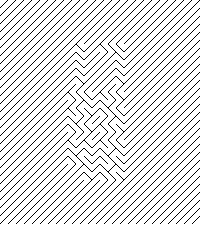</a>

<h2 class="app-name" id="app-69262dc863df8c000925858f"><a href="https://apps.repebble.com/69262dc863df8c000925858f">Bifurcan</a></h2>
<a class="app-source" href="https://git.sr.ht/~angelwood/uxn-pebble" title="Source code" data-search-exclude>View source</a>

by <a href="https://apps.repebble.com/apps/dev/chloe-greene_68a9aafeb2d66b00083939f8" title="More from this developer">Chloe Greene</a>

See source v1.3 Updated 2026-01-01

Runs on: Round 2, Time 2, Pebble 2 Duo, Pebble 2, Time Round, Time, Classic

Every second, the Labyrinth reorganize itself to display the time in twists and turns. It takes a little practice to be able to see the patterns in the lines…

<a class="app-shot" href="https://apps.repebble.com/58024684c988665c14000016" data-search-exclude>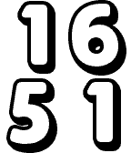</a>

<h2 class="app-name" id="app-58024684c988665c14000016"><a href="https://apps.repebble.com/58024684c988665c14000016">Big</a></h2>
<a class="app-source" href="https://github.com/bschau/Big" title="Source code" data-search-exclude>View source</a>

by <a href="https://apps.repebble.com/apps/dev/brian-schau_52bc98fc530bf4ed75000183" title="More from this developer">Brian Schau</a>

No licence v1.0 Updated 2016-10-15

Runs on: Time 2, Time

Big shows the current time in big numbers. Flick the watch to reveal the date and battery status.

<a class="app-shot" href="https://apps.repebble.com/8c24105f15544c5987dfa240" data-search-exclude>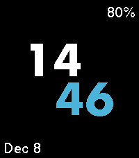</a>

<h2 class="app-name" id="app-8c24105f15544c5987dfa240"><a href="https://apps.repebble.com/8c24105f15544c5987dfa240">Big</a></h2>
<a class="app-source" href="https://github.com/sjmerel/big" title="Source code" data-search-exclude>View source</a>

by <a href="https://apps.repebble.com/apps/dev/sjmerel_c3cfdea00bafd8896a186e03" title="More from this developer">sjmerel</a>

Not checked yet v1.1 Updated 2025-12-08

Runs on: Round 2, Time 2, Pebble 2 Duo, Pebble 2, Time Round, Time, Classic

Simple watchface with big numbers for people with old eyes. Give your wrist a quick twist to show the date. The battery level will appear when charging, or when the level is 30% or less.

<a class="app-shot" href="https://apps.repebble.com/5685b3f4ecd409c59a000063" data-search-exclude>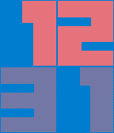</a>

<h2 class="app-name" id="app-5685b3f4ecd409c59a000063"><a href="https://apps.repebble.com/5685b3f4ecd409c59a000063">BIG again</a></h2>
<a class="app-source" href="http://github.com/wrbrooks/bigagain" title="Source code" data-search-exclude>View source</a>

by <a href="https://apps.repebble.com/apps/dev/wesley-brooks_556499dc5818e002ab00006b" title="More from this developer">Wesley Brooks</a>

MIT v2.0 Updated 2025-11-25

Runs on: Time 2, Pebble 2 Duo, Pebble 2, Time, Classic

A simple watchface featuring big, clear, handsome numerals. Use the configuration page to select colors.

<a class="app-shot" href="https://apps.repebble.com/ed7cd76621eb4acb91388a58" data-search-exclude>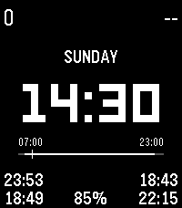</a>

<h2 class="app-name" id="app-ed7cd76621eb4acb91388a58"><a href="https://apps.repebble.com/ed7cd76621eb4acb91388a58">Big and clean and all</a></h2>
<a class="app-source" href="https://github.com/artyomxx/pwf-big-and-clean" title="Source code" data-search-exclude>View source</a>

by <a href="https://apps.repebble.com/apps/dev/artyom_a09cfa895c055337b6ad9385" title="More from this developer">artyom</a>

No licence v1.0.0 Updated 2026-06-28

Runs on: Time 2

It can be just big digits. It can be no digits at all. It also have a daily timeline based on your morning wake-up time and sleep duration so you can kinda visually estimate how much time you…

<a class="app-shot" href="https://apps.repebble.com/531b45c62a95cc72b0000523" data-search-exclude>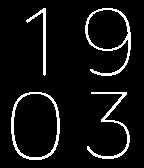</a>

<h2 class="app-name" id="app-531b45c62a95cc72b0000523"><a href="https://apps.repebble.com/531b45c62a95cc72b0000523">Big Bariol</a></h2>
<a class="app-source" href="https://github.com/thunderchild7/big_time_bariol" title="Source code" data-search-exclude>View source</a>

by <a href="https://apps.repebble.com/apps/dev/oliver-bowe_52cdaf6f0b54dbbe46000001" title="More from this developer">Oliver Bowe</a>

Not checked yet v6.1.5 Updated 2014-03-27

Runs on: Time 2, Pebble 2 Duo, Pebble 2, Time, Classic

Big Time but with the Bariol font and configurable. Can also vibrate at configurable intervals. kudos to Albert Rojo (@albertrojo) based on the Big Time watch by Pebble Technologies. Using the…

<a class="app-shot" href="https://apps.repebble.com/52f36a4dd690783a4400013c" data-search-exclude>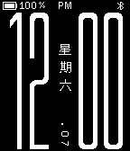</a>

<h2 class="app-name" id="app-52f36a4dd690783a4400013c"><a href="https://apps.repebble.com/52f36a4dd690783a4400013c">Big Black and Simple</a></h2>
<a class="app-source" href="https://github.com/mereed/pebbleface-bigblack" title="Source code" data-search-exclude>View source</a>

by <a href="https://apps.repebble.com/apps/dev/chops_52d76309bd61272345000001" title="More from this developer">chops</a>

Not checked yet v3.3 Updated 2016-10-05

Runs on: Time 2, Pebble 2 Duo, Pebble 2, Time, Classic

22 Sep: added new clay settings page This watchface is based on code for the original 91 dub but has been adapted a lot and was designed originally for a black pebble. All it does is display…

<h2 class="app-name" id="app-52cdd45efc5bf835cb00001e"><a href="https://apps.repebble.com/52cdd45efc5bf835cb00001e">Big Blocks</a></h2>
<a class="app-source" href="https://github.com/mcongrove/PebbleBigBlocks" title="Source code" data-search-exclude>View source</a>

by <a href="https://apps.repebble.com/apps/dev/mcongrove_52affc34e2187058f9000011" title="More from this developer">mcongrove</a>

Not checked yet v1.1 Updated 2014-01-19

Runs on: Time 2, Pebble 2 Duo, Pebble 2, Time, Classic

A Pebble face where large blocks build up around the edge of the watch as the hours tick along. Colors can be inverted, and display of the full time, hour, or minute can be set by accessing the…

<a class="app-shot" href="https://apps.repebble.com/54d7f4915e8d874386000025" data-search-exclude>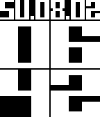</a>

<h2 class="app-name" id="app-54d7f4915e8d874386000025"><a href="https://apps.repebble.com/54d7f4915e8d874386000025">BIG Date</a></h2>
<a class="app-source" href="http://github.com/magmapus/bigdate" title="Source code" data-search-exclude>View source</a>

by <a href="https://apps.repebble.com/apps/dev/magmastone_52ee9e7ebf4b6279c500003f" title="More from this developer">MagmaStone</a>

Apache-2.0 v1.0 Updated 2015-02-08

Runs on: Time 2, Pebble 2 Duo, Pebble 2, Time, Classic

This is very similar to the BIG watchface, but with the addition of the date at the top! Many thanks to Simon Lee for the art assets and design!

<a class="app-shot" href="https://apps.repebble.com/53e8e537d20a0aacc700001e" data-search-exclude>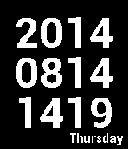</a>

<h2 class="app-name" id="app-53e8e537d20a0aacc700001e"><a href="https://apps.repebble.com/53e8e537d20a0aacc700001e">Big Datetime</a></h2>
<a class="app-source" href="https://github.com/kinscore/big_datetime" title="Source code" data-search-exclude>View source</a>

by <a href="https://apps.repebble.com/apps/dev/kipling-inscore_531a35dd4969a2a00e0005f3" title="More from this developer">Kipling Inscore</a>

Not checked yet v2.2 Updated 2014-08-14

Runs on: Time 2, Pebble 2 Duo, Pebble 2, Time, Classic

Shows date and time in a format similar to Big Time. Top line is year, middle line is month (left two digits) and day (right two digits). Bottom line is hour and minute. Day of week in…

<h2 class="app-name" id="app-53fb3336155524e5e2000103"><a href="https://apps.repebble.com/53fb3336155524e5e2000103">Big Digital 3</a></h2>
<a class="app-source" href="https://github.com/mereed/pebbleface-bigdig3" title="Source code" data-search-exclude>View source</a>

by <a href="https://apps.repebble.com/apps/dev/chops_52d76309bd61272345000001" title="More from this developer">chops</a>

Not checked yet v1.7 Updated 2025-12-01

Runs on: Time 2, Pebble 2 Duo, Pebble 2, Time, Classic

This is an enhanced version of a much earlier generated watchface. Have everything on, or have it all off (for a very minimal display) You can do the following via settings - turn on/off the…

<h2 class="app-name" id="app-5426db4cd7b4b066dc0000cd"><a href="https://apps.repebble.com/5426db4cd7b4b066dc0000cd">Big Face</a></h2>
<a class="app-source" href="https://sites.google.com/site/nabakiaw/pebbleapl/thebigface#source" title="Source code" data-search-exclude>View source</a>

by <a href="https://apps.repebble.com/apps/dev/nab-aki_53d4376df6e5bb57dd0000c1" title="More from this developer">nab.aki</a>

Not checked yet v2.1 Updated 2014-10-11

Runs on: Time 2, Pebble 2 Duo, Pebble 2, Time, Classic

I create a simple Watchface for my middle-aged eyes. 1st line: Time 2nd line: a day of week and day 3rd line: Month and year Bottom line: BlueTooth connection Battery Status If bluetooth…

<h2 class="app-name" id="app-53a9f0fa6b1a978507000083"><a href="https://apps.repebble.com/53a9f0fa6b1a978507000083">Big Flip Clock</a></h2>
<a class="app-source" href="https://github.com/ygalanter/BIG_FLIP_CLOCK" title="Source code" data-search-exclude>View source</a>

by <a href="https://apps.repebble.com/apps/dev/comfortably-numb_52f547605101128b2200005a" title="More from this developer">Comfortably Numb</a>

Not checked yet v3.0.0 Updated 2026-09-13

Runs on: Round 2, Time 2, Pebble 2 Duo, Pebble 2, Time Round, Time, Classic

Old-style flip clock watchface with smooth flip animation, digital date, and day of the week. Supports both 12-hour and 24-hour modes based on the watch setting, including an AM/PM indicator in…

<h2 class="app-name" id="app-52b9d3a65dfb6ed84c0000d5"><a href="https://apps.repebble.com/52b9d3a65dfb6ed84c0000d5">Big H</a></h2>
<a class="app-source" href="https://github.com/samalander/big-h" title="Source code" data-search-exclude>View source</a>

by <a href="https://apps.repebble.com/apps/dev/samalander_52b9bc085dfb6e6a1a0000b8" title="More from this developer">Samalander</a>

Not checked yet v2.1.0 Updated 2025-11-25

Runs on: Time 2, Pebble 2 Duo, Pebble 2, Time, Classic

Big H is a watchface that shows the hour (12/24) and minutes in big numbers, the weekday with the dates of 3 days before and after, the full date, a seconds indicator with minimal battery impact…

<h2 class="app-name" id="app-58699adde09e63748e00036d"><a href="https://apps.rebble.io/en_US/application/58699adde09e63748e00036d">Big Kick</a></h2>
<a class="app-source" href="https://github.com/wrbrooks/health-watchface" title="Source code" data-search-exclude>View source</a>

by <a href="https://apps.rebble.io/en_US/developer/556499dc5818e002ab00006b/1" title="More from this developer">Wesley Brooks</a>

Not checked yet v1.0 Updated 2017-01-02 Rebble App Store

Runs on: Time 2, Pebble 2 Duo, Pebble 2

The Kickstart watch face, but with a bigger front for the time. Average activity indicator is based on past 28 days.

<h2 class="app-name" id="app-581f51449cbbaf2ef20002bb"><a href="https://apps.rebble.io/en_US/application/581f51449cbbaf2ef20002bb">Big Simple</a></h2>
<a class="app-source" href="https://github.com/anubhavgupta/pebble-big-simple-watch-face" title="Source code" data-search-exclude>View source</a>

by <a href="https://apps.rebble.io/en_US/developer/579c99cf1482cd5d4b00033f/1" title="More from this developer">Anubhav Gupta</a>

No licence v1.2 Updated 2016-11-17 Rebble App Store

Runs on: Round 2, Time 2, Pebble 2 Duo, Pebble 2, Time Round, Time

Big and simple watch face, shows 12hr time, day, date and month. For 24 hr version, please search for &#x27;Big Simple 24&#x27;.

<h2 class="app-name" id="app-58215c5d34da213f22000029"><a href="https://apps.rebble.io/en_US/application/58215c5d34da213f22000029">Big Simple 24</a></h2>
<a class="app-source" href="https://github.com/anubhavgupta/pebble-big-simple-watch-face/tree/24-hrs" title="Source code" data-search-exclude>View source</a>

by <a href="https://apps.rebble.io/en_US/developer/579c99cf1482cd5d4b00033f/1" title="More from this developer">Anubhav Gupta</a>

No licence v1.1 Updated 2016-11-17 Rebble App Store

Runs on: Round 2, Time 2, Pebble 2 Duo, Pebble 2, Time Round, Time

24 Hr mode version of `Big Simple` watch face. Big and simple watch face, shows 24hr time, day, date and month. For 12 Hr version of the same watchface, search for `Big Simple` watchface.

<h2 class="app-name" id="app-52d8b3240bab47f4d5000021"><a href="https://apps.repebble.com/52d8b3240bab47f4d5000021">Big Time</a></h2>
<a class="app-source" href="https://github.com/pebble/pebble-sdk-examples/tree/master/watchfaces/big_time" title="Source code" data-search-exclude>View source</a>

by <a href="https://apps.repebble.com/apps/dev/pebble_52d8a44faef8d590d3000029" title="More from this developer">Pebble</a>

Not checked yet v6.0.0 Updated 2014-01-17

Runs on: Time 2, Pebble 2 Duo, Pebble 2, Time, Classic

Big Time Watchface

<h2 class="app-name" id="app-56440d92b2bae2732e00001a"><a href="https://apps.repebble.com/56440d92b2bae2732e00001a">Big Time+Date</a></h2>
<a class="app-source" href="https://github.com/wedwabbit/Big-Time-Date" title="Source code" data-search-exclude>View source</a>

by <a href="https://apps.repebble.com/apps/dev/wedwabbit_52f01d5093a087ad2500041d" title="More from this developer">wedwabbit</a>

Not checked yet v6.2 Updated 2015-11-30

Runs on: Round 2, Time 2, Pebble 2 Duo, Pebble 2, Time Round, Time, Classic

A version of Big Time that displays both the date and time. Shake or tap to display the date for 1 second. Date on the top, month on the bottom. Search for Big Time+Date Reverse for a black on…

<h2 class="app-name" id="app-5660e85b15c22b9d6300008c"><a href="https://apps.repebble.com/5660e85b15c22b9d6300008c">Big Time+Date Colour</a></h2>
<a class="app-source" href="https://github.com/wedwabbit/Big-Time-DateColour" title="Source code" data-search-exclude>View source</a>

by <a href="https://apps.repebble.com/apps/dev/wedwabbit_52f01d5093a087ad2500041d" title="More from this developer">wedwabbit</a>

Not checked yet v1.7 Updated 2016-01-06

Runs on: Time 2, Time

A colour version of Big Date+Time. Configuration page allows you to choose font (Original Big Time, Big Again, SquareFace, CST, Alpha Slab, Digital Thin, Digital Thick), separate foreground and…

<h2 class="app-name" id="app-565697117ffb06b5d900004c"><a href="https://apps.repebble.com/565697117ffb06b5d900004c">Big Time+Date Reverse</a></h2>
<a class="app-source" href="https://github.com/wedwabbit/Big-Time-DateReverse" title="Source code" data-search-exclude>View source</a>

by <a href="https://apps.repebble.com/apps/dev/wedwabbit_52f01d5093a087ad2500041d" title="More from this developer">wedwabbit</a>

Not checked yet v1.1 Updated 2015-11-30

Runs on: Round 2, Time 2, Pebble 2 Duo, Pebble 2, Time Round, Time, Classic

A reversed (black on white) version of Big Time that displays both the date and time. Shake or tap to display the date for 1 second. Date on the top, month on the bottom. Search for Big Date+Time…

<h2 class="app-name" id="app-67c39775d2acb30009a3c7ac"><a href="https://apps.rebble.io/en_US/application/67c39775d2acb30009a3c7ac">Big Venn</a></h2>
<a class="app-source" href="https://github.com/JavierRizzoA/Pebble-BigVenn/" title="Source code" data-search-exclude>View source</a>

by <a href="https://apps.rebble.io/en_US/developer/55f51b85eb030e3836000054/1" title="More from this developer">Javier Rizzo</a>

GPL-3.0 v1.1 Updated 2025-03-02 Rebble App Store

Runs on: Round 2, Time 2, Pebble 2 Duo, Pebble 2, Time Round, Time, Classic

Who needs numbers when you can use color and circles? This colorful (in certain platforms :-)) watchface uses three rotating circles to show you the hour, minute and (optionally) seconds. And of…

<h2 class="app-name" id="app-648e2420741dd4022e8ed352"><a href="https://apps.rebble.io/en_US/application/648e2420741dd4022e8ed352">Big Weather</a></h2>
<a class="app-source" href="https://github.com/astosia/WeatherOWM3" title="Source code" data-search-exclude>View source</a>

by <a href="https://apps.rebble.io/en_US/developer/58a635d30dfc320dc60003b4/1" title="More from this developer">astosia</a>

No licence v4.0 Updated 2026-02-15 Rebble App Store

Runs on: Round 2, Time 2, Pebble 2 Duo, Pebble 2, Time Round, Time

Massive weather icon watchface Features: - Configurable colours - Weather based on phone GPS or a manually entered latitude &amp; longitude - Choice of two weather apis: Open-Meteo (no api key needed)…

<h2 class="app-name" id="app-57efe9f105e4b17e1c0001c8"><a href="https://apps.repebble.com/57efe9f105e4b17e1c0001c8">BigAnalog3</a></h2>
<a class="app-source" href="https://github.com/PierreCrette/BigAnalog3" title="Source code" data-search-exclude>View source</a>

by <a href="https://apps.repebble.com/apps/dev/pierre-crette_55e08e9d90d2265e41000039" title="More from this developer">Pierre Crette</a>

GPL-3.0 v3.1 Updated 2016-10-08

Runs on: Round 2, Time 2, Pebble 2 Duo, Pebble 2, Time Round, Time, Classic

BigAnalog v3 is still easier to read without glasses, and is still battery efficient to last 5 days long (Time). BigAnalog v3 now adds second hand for a few seconds if you shake the pebble, and…

<h2 class="app-name" id="app-5511c304c496d8aa9f00002c"><a href="https://apps.repebble.com/5511c304c496d8aa9f00002c">BigDotz</a></h2>
<a class="app-source" href="https://github.com/marasm/GeekyTime" title="Source code" data-search-exclude>View source</a>

by <a href="https://apps.repebble.com/apps/dev/markas-k_53920770b2e95859f8000032" title="More from this developer">Markas_K</a>

Not checked yet v1.4 Updated 2016-06-09

Runs on: Time 2, Pebble 2 Duo, Pebble 2, Time, Classic

A simple watchface using square dots to form the digits. Features: - Animated - 12/24 Hr Support (Set in pebble settings) - Date with Day of the Week - Battery Indicator - Vibrate on phone…

<h2 class="app-name" id="app-f248e316f6ff404da0731fce"><a href="https://apps.repebble.com/f248e316f6ff404da0731fce">BigFace</a></h2>
<a class="app-source" href="https://github.com/benjaminjgill/BigFace" title="Source code" data-search-exclude>View source</a>

by <a href="https://apps.repebble.com/apps/dev/zeroesandones_2e6cca3d47b90f5b14f075bb" title="More from this developer">zeroesandones</a>

No licence v2.3.4 Updated 2026-10-04

Runs on: Time 2

Big Face is a simple clean big bold watch face that&#x27;s readable at a glance for those who don&#x27;t want to squint at their watch to know what time it is oh....its free with no paywall! Version 2 added…

<h2 class="app-name" id="app-5eda31d774a34edeb1c87a39"><a href="https://apps.repebble.com/5eda31d774a34edeb1c87a39">BigInfo</a></h2>
<a class="app-source" href="https://github.com/drod0258/BigInfoPebble" title="Source code" data-search-exclude>View source</a>

by <a href="https://apps.repebble.com/apps/dev/drod_ddb35e676d571d48c7a45045" title="More from this developer">drod</a>

Not checked yet v2.3.1 Updated 2026-06-26

Runs on: Round 2, Time 2, Pebble 2 Duo, Pebble 2, Time, Classic

A simple, clean Pebble watchface with a large, easy-to-read font. Displays the essentials at a glance, all configurable so you can hide what you don&#x27;t need. Features: - Large time displayed in a…

<h2 class="app-name" id="app-0f697e705a024ff4af5c91e2"><a href="https://apps.repebble.com/0f697e705a024ff4af5c91e2">BigInfo Remix</a></h2>
<a class="app-source" href="https://github.com/myNameArnav/BigInfoPebble" title="Source code" data-search-exclude>View source</a>

by <a href="https://apps.repebble.com/apps/dev/arnav-jain_44e6162034646a1055b6b6fd" title="More from this developer">Arnav Jain</a>

Not checked yet v2.2.0 Updated 2026-06-06

Runs on: Round 2, Time 2, Pebble 2 Duo, Pebble 2, Time, Classic

A simple, clean Pebble watchface with a large, easy-to-read font. Displays the essentials at a glance, all configurable so you can hide what you don&#x27;t need but remixed

<h2 class="app-name" id="app-684d64c733c87e00090b43a6"><a href="https://apps.rebble.io/en_US/application/684d64c733c87e00090b43a6">bigTime</a></h2>
<a class="app-source" href="https://github.com/rcrimp/bigTime-Pebble-watchface" title="Source code" data-search-exclude>View source</a>

by <a href="https://apps.rebble.io/en_US/developer/684ab4c03c425500087af075/1" title="More from this developer">PhyterJet</a>

Not checked yet v1.2 Updated 2025-06-15 Rebble App Store

Runs on: Round 2, Time 2, Pebble 2 Duo, Pebble 2, Time Round, Time, Classic

Time in LARGE digits. Date shown Top line is battery bar

<h2 class="app-name" id="app-cb565b88dbf04db5a5e693c8"><a href="https://apps.repebble.com/cb565b88dbf04db5a5e693c8">BigTime CS</a></h2>
<a class="app-source" href="https://github.com/CaptSolo/BigTime-CS" title="Source code" data-search-exclude>View source</a>

by <a href="https://apps.repebble.com/apps/dev/uldis-bojars_c6f5fff2fdd5283c36d0acf1" title="More from this developer">Uldis Bojars</a>

MIT v1.0.0 Updated 2026-09-27

Runs on: Time 2

Bold, colorful watchface for Pebble Time 2 with steps and weather

<h2 class="app-name" id="app-3df9451de73c47a7a8e3279d"><a href="https://apps.repebble.com/3df9451de73c47a7a8e3279d">bigTime with Date</a></h2>
<a class="app-source" href="https://github.com/rcrimp/bigTime-Pebble-watchface" title="Source code" data-search-exclude>View source</a>

by <a href="https://apps.repebble.com/apps/dev/phyterjet_473c0d58fc686ee11f114ecd" title="More from this developer">PhyterJet</a>

Not checked yet v1.2 Updated 2026-08-03

Runs on: Round 2, Time 2, Pebble 2 Duo, Pebble 2, Time Round, Time, Classic

Displays the time in a large format. Easy readability. Date is shown too, with a clear battery bar.

<h2 class="app-name" id="app-52f678b836e216f0700004d3"><a href="https://apps.repebble.com/52f678b836e216f0700004d3">Bikron BCD Watchface</a></h2>
<a class="app-source" href="http://pebble.rehobothweather.com" title="Source code" data-search-exclude>View source</a>

by <a href="https://apps.repebble.com/apps/dev/joe-gottschall_52f10da9bb3423c584002d32" title="More from this developer">Joe Gottschall</a>

See source v2.4.2 Updated 2014-02-08

Runs on: Time 2, Pebble 2 Duo, Pebble 2, Time, Classic

The Bikron watchface is modeled after a clock made in the late 1970&#x27;s by John Wells of Media House Corporation, Columbus, Ohio.The clock is a Binary Coded Decimal (BCD) display which is read…

<h2 class="app-name" id="app-6a5609cec5fa78000971594e"><a href="https://apps.repebble.com/6a5609cec5fa78000971594e">Bill Cipher is Watching You</a></h2>
<a class="app-source" href="https://github.com/eduardochiaro/cipher-watchface" title="Source code" data-search-exclude>View source</a>

by <a href="https://apps.repebble.com/apps/dev/ec-apps_6818b3bd53899000082d25a4" title="More from this developer">EC Apps</a>

Not checked yet v1.2.0 Updated 2026-07-16

Runs on: Round 2, Time 2, Pebble 2 Duo, Pebble 2, Time Round, Time, Classic

A-X-O-L-O-T-L! My time has come to burn! I invoke the ancient power that I may return! Nice watchface designed to bring Bill Cipher with you everyday. Configurations: - Time Color: pick color or…

<h2 class="app-name" id="app-54ff1205ae7d9e781d00001b"><a href="https://apps.repebble.com/54ff1205ae7d9e781d00001b">Binarian</a></h2>
<a class="app-source" href="https://github.com/sjsantoro/binarian" title="Source code" data-search-exclude>View source</a>

by <a href="https://apps.repebble.com/apps/dev/santiago-santoro_54a700922daaa49ebd0000b1" title="More from this developer">Santiago Santoro</a>

Not checked yet v1.0 Updated 2015-03-10

Runs on: Time 2, Pebble 2 Duo, Pebble 2, Time, Classic

Binarian is an open-source binary watchface for Pebble that displays the time in binary-coded decimal format. The source code can be found at: https://github.com/sjsantoro/binarian

<h2 class="app-name" id="app-542f9a6ae47c0521a2000019"><a href="https://apps.repebble.com/542f9a6ae47c0521a2000019">Binary</a></h2>
<a class="app-source" href="https://github.com/DanFritz/BinaryPebbleWatchFace" title="Source code" data-search-exclude>View source</a>

by <a href="https://apps.repebble.com/apps/dev/dan-fritz_5326a4c64735a98e73000215" title="More from this developer">Dan Fritz</a>

MIT v1.0 Updated 2014-10-04

Runs on: Time 2, Pebble 2 Duo, Pebble 2, Time, Classic

Nice watchface for practicing reading binary numbers. From top to bottom: 1 row binary month, 2 rows BCD day, 2 rows BCD hour, 2 rows BCD minute.

<h2 class="app-name" id="app-67c1f6e2d2acb30009a3c793"><a href="https://apps.rebble.io/en_US/application/67c1f6e2d2acb30009a3c793">Binary</a></h2>
<a class="app-source" href="https://github.com/flynnD273/binary-watchface" title="Source code" data-search-exclude>View source</a>

by <a href="https://apps.rebble.io/en_US/developer/67bd48a737d408000a74f7d7/1" title="More from this developer">Flynn Duniho</a>

Not checked yet v1.2 Updated 2025-03-02 Rebble App Store

Runs on: Round 2, Time 2, Pebble 2 Duo, Pebble 2, Time Round, Time, Classic

Displays the time in binary

<h2 class="app-name" id="app-5504ae58c90b10a991000017"><a href="https://apps.repebble.com/5504ae58c90b10a991000017">Binary</a></h2>
<a class="app-source" href="https://github.com/giodamelio/pebble-binary" title="Source code" data-search-exclude>View source</a>

by <a href="https://apps.repebble.com/apps/dev/gio-d-amelio_54ade3edbd2d5cddba000010" title="More from this developer">Gio d&#x27;Amelio</a>

Not checked yet v1.0 Updated 2015-03-14

Runs on: Time 2, Pebble 2 Duo, Pebble 2, Time, Classic

A simple binary watchface. https://en.wikipedia.org/wiki/Binary_clock

<h2 class="app-name" id="app-52cb738845ffdd8ad50000cd"><a href="https://apps.repebble.com/52cb738845ffdd8ad50000cd">Binary</a></h2>
<a class="app-source" href="https://github.com/noahsmartin/BinaryPebble" title="Source code" data-search-exclude>View source</a>

by <a href="https://apps.repebble.com/apps/dev/noah-martin_52b20d26b70e1ca84c000057" title="More from this developer">Noah Martin</a>

Not checked yet v1.0.0 Updated 2014-01-07

Runs on: Time 2, Pebble 2 Duo, Pebble 2, Time, Classic

A simple binary watchface for pebble. The first row is hours, middle is minutes, and bottom is seconds. The status bar shows battery status and the watch will vibrate if you leave your phone behind.

<h2 class="app-name" id="app-560aaccd48553edf79000054"><a href="https://apps.repebble.com/560aaccd48553edf79000054">Binary and Digital Basic Watchface</a></h2>
<a class="app-source" href="https://github.com/jasonfye2015/BinaryWatchFace" title="Source code" data-search-exclude>View source</a>

by <a href="https://apps.repebble.com/apps/dev/jason_55fcb15e0a5482076f000020" title="More from this developer">Jason</a>

Not checked yet v1.0 Updated 2015-09-29

Runs on: Time 2, Pebble 2 Duo, Pebble 2, Time, Classic

This basic watch face displays the time both in digital and binary, as well as a battery level indicator and current date. The binary group is read top down.

<h2 class="app-name" id="app-555c08e8ac15b615d100007a"><a href="https://apps.repebble.com/555c08e8ac15b615d100007a">Binary Basic</a></h2>
<a class="app-source" href="https://github.com/astalec/pebble-binary-basic" title="Source code" data-search-exclude>View source</a>

by <a href="https://apps.repebble.com/apps/dev/alexandru-ast_5548aefb2cfbfcf57f000030" title="More from this developer">Alexandru Ast</a>

No licence v0.1 Updated 2015-05-20

Runs on: Time 2, Pebble 2 Duo, Pebble 2, Time, Classic

There is no settings page, for the moment the settings are hard coded If you want to customize / change settings, use the source code from github The following information is displayed on screen…

<h2 class="app-name" id="app-52d2fff959f8525d3a000009"><a href="https://apps.repebble.com/52d2fff959f8525d3a000009">Binary BCD watchface</a></h2>
<a class="app-source" href="http://git.the-compiler.org/BinaryBCDPebble/tree/" title="Source code" data-search-exclude>View source</a>

by <a href="https://apps.repebble.com/apps/dev/the-compiler_52d2fb5659f85200e1000004" title="More from this developer">The Compiler</a>

See source v1.0.0 Updated 2014-01-12

Runs on: Time 2, Pebble 2 Duo, Pebble 2, Time, Classic

This is a binary BCD watchface for Pebble. BCD means binary coded decimals, so for minute/second, each decimal digit is encoded in binary individually, so it&#x27;s easier to read. The hour is binary…

<h2 class="app-name" id="app-52be4a7ef31c32538e000028"><a href="https://apps.repebble.com/52be4a7ef31c32538e000028">Binary Blob</a></h2>
<a class="app-source" href="https://github.com/jmlaitpebble/binaryblob" title="Source code" data-search-exclude>View source</a>

by <a href="https://apps.repebble.com/apps/dev/jeff-lait_52bdec2db1ce8e14c10000e7" title="More from this developer">Jeff Lait</a>

Not checked yet v1.0 Updated 2013-12-28

Runs on: Time 2, Pebble 2 Duo, Pebble 2, Time, Classic

A binary watch display with the bits drawn as metaballs. On each minute they move into a new configuration.

<h2 class="app-name" id="app-53b6e9bcfaf88bed2700002a"><a href="https://apps.repebble.com/53b6e9bcfaf88bed2700002a">Binary Blocks</a></h2>
<a class="app-source" href="https://github.com/MadAnthonyWayne/BinaryBlocks2" title="Source code" data-search-exclude>View source</a>

by <a href="https://apps.repebble.com/apps/dev/andyco_53b4453a03e5c08be5000031" title="More from this developer">Andyco</a>

No licence v2.0.0 Updated 2014-07-04

Runs on: Time 2, Pebble 2 Duo, Pebble 2, Time, Classic

It displays the time in binary, using squares to represent the hour/minutes. The left most column is the hour, the next column is the tens digit of minutes, and the rightmost column is the ones…

<h2 class="app-name" id="app-55922b531c5664020300000c"><a href="https://apps.repebble.com/55922b531c5664020300000c">Binary Blocks</a></h2>
<a class="app-source" href="https://github.com/binaerraum/Binary-Blocks" title="Source code" data-search-exclude>View source</a>

by <a href="https://apps.repebble.com/apps/dev/bin-rraum_558434f50247ad56ad000040" title="More from this developer">binärraum</a>

No licence v1.4 Updated 2015-07-08

Runs on: Time 2, Pebble 2 Duo, Pebble 2, Time, Classic

Binary Blocks shows the time using 12 blocks for hours and 12 for every 5 minutes. AM time is white on black, PM time is black on white.

<h2 class="app-name" id="app-6a855a3b2e9a5c0009ed2eb7"><a href="https://apps.repebble.com/6a855a3b2e9a5c0009ed2eb7">Binary Bold</a></h2>
<a class="app-source" href="https://codeberg.org/Krang/Binary_Bold_for_Pebble" title="Source code" data-search-exclude>View source</a>

by <a href="https://apps.repebble.com/apps/dev/krang_6a50573dc423ad0008ec935c" title="More from this developer">Krang</a>

See source v0.0.5 Updated 2026-10-02

Runs on: Round 2, Time 2, Pebble 2 Duo, Pebble 2, Time, Classic

A binary watch face with a focus on readability. Hours are displayed using four large bits. The most significant bit (32) is wider so you can tell which direction to read in. Minutes are displayed…

<h2 class="app-name" id="app-551416cd863098b4430000a3"><a href="https://apps.repebble.com/551416cd863098b4430000a3">binary circuit</a></h2>
<a class="app-source" href="https://github.com/littleprojects/Pebble_Circuit_Binary" title="Source code" data-search-exclude>View source</a>

by <a href="https://apps.repebble.com/apps/dev/david-lenk_550c6a346caaed82dd000013" title="More from this developer">David Lenk</a>

Not checked yet v2.22 Updated 2025-11-25

Runs on: Time 2, Pebble 2 Duo, Pebble 2, Time, Classic

A simple, easy binary watchface in a circuit design. - binary time - 12 or 24 hour timeformat - show/hide the numbers - day/night (black/white, invert) - auto day/night switching - show BT…

<h2 class="app-name" id="app-5684d175b35693b46700009c"><a href="https://apps.repebble.com/5684d175b35693b46700009c">Binary Circuit</a></h2>
<a class="app-source" href="https://github.com/MidnightLightning/BinaryWatchface" title="Source code" data-search-exclude>View source</a>

by <a href="https://apps.repebble.com/apps/dev/midnightlightning_565cb0ca96fbfc891a00006e" title="More from this developer">MidnightLightning</a>

No licence v1.0 Updated 2015-12-31

Runs on: Round 2, Time 2, Pebble 2 Duo, Pebble 2, Time Round, Time, Classic

Inspired by a binary watch I owned that used real LEDs to show the hours and minutes, this watchface gives the illusion of a bare circuit board and LEDs to show the time. Additional indicators for…

<h2 class="app-name" id="app-54f51f3b3c4f7ebb4f0000c6"><a href="https://apps.repebble.com/54f51f3b3c4f7ebb4f0000c6">Binary Clock</a></h2>
<a class="app-source" href="http://github.com/edthedev/BinaryClock" title="Source code" data-search-exclude>View source</a>

by <a href="https://apps.repebble.com/apps/dev/edward-delaporte_54f3a0af2eee750ed80000d0" title="More from this developer">Edward Delaporte</a>

No licence v1.0 Updated 2015-03-03

Runs on: Time 2, Pebble 2 Duo, Pebble 2, Time, Classic

Displays three lines of binary for hour, minute and seconds of the current time.

<h2 class="app-name" id="app-5450f16f969abbb99600004b"><a href="https://apps.repebble.com/5450f16f969abbb99600004b">Binary Clock</a></h2>
<a class="app-source" href="https://github.com/Gehenna/Binary_Clock" title="Source code" data-search-exclude>View source</a>

by <a href="https://apps.repebble.com/apps/dev/gehenna_5416d0b5bf75e36476000125" title="More from this developer">Gehenna</a>

Unlicense v1.0 Updated 2014-10-29

Runs on: Time 2, Pebble 2 Duo, Pebble 2, Time, Classic

Mirrored version of the Just_a_Bit example, because I read my binary from right to left. I also deleted the seconds indicator, since I didn&#x27;t need nor want them

<h2 class="app-name" id="app-52ce39fe5013b0bffa000037"><a href="https://apps.repebble.com/52ce39fe5013b0bffa000037">Binary Clock</a></h2>
<a class="app-source" href="https://github.com/Maigard/Binary-Clock" title="Source code" data-search-exclude>View source</a>

by <a href="https://apps.repebble.com/apps/dev/maigard_52ce336fcc12acd6bc000028" title="More from this developer">Maigard</a>

No licence v1.1.0 Updated 2014-01-20

Runs on: Time 2, Pebble 2 Duo, Pebble 2, Time, Classic

A watchface that displays the time in binary dots. It includes configuration options to display a status bar including date and a decimal digit display to help learn how to read binary

<h2 class="app-name" id="app-567050f1e09129f724000041"><a href="https://apps.repebble.com/567050f1e09129f724000041">Binary Dial</a></h2>
<a class="app-source" href="https://github.com/madnecat/binary-watchface" title="Source code" data-search-exclude>View source</a>

by <a href="https://apps.repebble.com/apps/dev/necatdev_560c2c9ebc20af3a0d0000af" title="More from this developer">NecatDev</a>

Not checked yet v1.2 Updated 2025-11-25

Runs on: Round 2, Time 2, Time Round, Time

Update : New animations, optimisation, new default design. Beautiful, original and fully customisable watch face. How to read time ? Juste start counting binarily from the top and turn clockwise…

<h2 class="app-name" id="app-5474fd8914b37fd5a50000d2"><a href="https://apps.repebble.com/5474fd8914b37fd5a50000d2">Binary Dots</a></h2>
<a class="app-source" href="http://corero.byethost7.com/sources/binarydots_4.zip" title="Source code" data-search-exclude>View source</a>

by <a href="https://apps.repebble.com/apps/dev/ovidiu-a_545df03eb8caab2ea700003b" title="More from this developer">Ovidiu A.</a>

See source v1.2 Updated 2015-04-26

Runs on: Time 2, Pebble 2 Duo, Pebble 2, Time, Classic

Simple binary watch... animated!

<h2 class="app-name" id="app-32da653d63d14abb8a160c0e"><a href="https://apps.repebble.com/32da653d63d14abb8a160c0e">Binary Glow</a></h2>
<a class="app-source" href="https://github.com/atomlabor/binary-glow" title="Source code" data-search-exclude>View source</a>

by <a href="https://apps.repebble.com/apps/dev/atomlabor_5c1e0bc226259d0001915df5" title="More from this developer">atomlabor</a>

No licence v1.0 Updated 2026-04-10

Runs on: Round 2, Time 2, Pebble 2 Duo, Pebble 2, Time Round, Time, Classic

A futuristic, high-tech watchface for the Pebble ecosystem. Binary Glow Ultra combines a classic &quot;Matrix&quot; aesthetic with a modern HUD (Heads-Up Display) feel, featuring dynamic animations and…

<h2 class="app-name" id="app-5763a6bc2946d784df00003a"><a href="https://apps.repebble.com/5763a6bc2946d784df00003a">Binary Time</a></h2>
<a class="app-source" href="https://github.com/alexanderyshi/Binary_time" title="Source code" data-search-exclude>View source</a>

by <a href="https://apps.repebble.com/apps/dev/alexander-shi_5556a18ad237d6ba2f000066" title="More from this developer">Alexander Shi</a>

No licence v1.0 Updated 2016-06-17

Runs on: Time 2, Time

Why read time like a sensible person when you can be encumbered by binary representations on crude &quot;IC&quot;s? Wow. Aren&#x27;t you convinced.

<h2 class="app-name" id="app-550c4830d4c6b4b94e000007"><a href="https://apps.repebble.com/550c4830d4c6b4b94e000007">Binary Time</a></h2>
<a class="app-source" href="https://github.com/pgbunce/wf-binary-time" title="Source code" data-search-exclude>View source</a>

by <a href="https://apps.repebble.com/apps/dev/merddyn_53fb5515994475d7f3000054" title="More from this developer">Merddyn</a>

Not checked yet v1.3 Updated 2015-10-31

Runs on: Time 2, Pebble 2 Duo, Pebble 2, Time, Classic

Shows the time in binary, four bits per time digit. Time is shown in either 12- or 24-hour mode, as set in the watch settings.

<h2 class="app-name" id="app-5519a59c0f4ab7222e000003"><a href="https://apps.repebble.com/5519a59c0f4ab7222e000003">Binary Time - Grid</a></h2>
<a class="app-source" href="https://github.com/pgbunce/binaryTimeGrid" title="Source code" data-search-exclude>View source</a>

by <a href="https://apps.repebble.com/apps/dev/merddyn_53fb5515994475d7f3000054" title="More from this developer">Merddyn</a>

Not checked yet v1.2 Updated 2015-10-31

Runs on: Time 2, Pebble 2 Duo, Pebble 2, Time, Classic

Shows the time in binary, four bits per time digit, in a grid layout. Time is shown in either 12- or 24-hour mode, as set in the watch settings. There is an &quot;on-shake&quot; animation to show the time…

<h2 class="app-name" id="app-550cad5a2fbbaacde3000060"><a href="https://apps.repebble.com/550cad5a2fbbaacde3000060">Binary Time - Waveform</a></h2>
<a class="app-source" href="https://github.com/pgbunce/wf-binary-time-waveform" title="Source code" data-search-exclude>View source</a>

by <a href="https://apps.repebble.com/apps/dev/merddyn_53fb5515994475d7f3000054" title="More from this developer">Merddyn</a>

Not checked yet v1.4 Updated 2015-10-31

Runs on: Time 2, Pebble 2 Duo, Pebble 2, Time, Classic

Shows the time (12 or 24 hour) in binary format, 4 bits per time digit, as a waveform :)

<h2 class="app-name" id="app-5502d67eaab67c67a50000c6"><a href="https://apps.repebble.com/5502d67eaab67c67a50000c6">Binary Watch</a></h2>
<a class="app-source" href="https://github.com/delda/pebble-BinaryWatchFace" title="Source code" data-search-exclude>View source</a>

by <a href="https://apps.repebble.com/apps/dev/davide-dell-erba_54c90ccd8359ae297b000054" title="More from this developer">Davide Dell&#x27;Erba</a>

Not checked yet v4.5.0 Updated 2026-10-05

Runs on: Round 2, Time 2, Pebble 2 Duo, Pebble 2, Time Round, Time, Classic

A binary clock is a clock that displays the time in a binary format. The first row is for hours, the second for minutes. Configurable options: - Colors palette - Different shapes for dots …

<h2 class="app-name" id="app-557dc881a404af9b65000051"><a href="https://apps.repebble.com/557dc881a404af9b65000051">Binary Watch</a></h2>
<a class="app-source" href="https://github.com/grit96/pebble-binary" title="Source code" data-search-exclude>View source</a>

by <a href="https://apps.repebble.com/apps/dev/geraint-white_549bf174054472596700023a" title="More from this developer">Geraint White</a>

Not checked yet v1.4 Updated 2016-07-30

Runs on: Time 2, Pebble 2 Duo, Pebble 2, Time, Classic

Binary watchface. Top line of bits for the hour (4 bits for 12 hour or 5 bits for 24 hour). Bottom line of bits for the minutes. LSB is the rightmost bit. Additional date and weather information…

<h2 class="app-name" id="app-585cfc3e06e77618f7000239"><a href="https://apps.rebble.io/en_US/application/585cfc3e06e77618f7000239">Binary Watch</a></h2>
<a class="app-source" href="https://github.com/MartialElch/PebbleBinaryWatch" title="Source code" data-search-exclude>View source</a>

by <a href="https://apps.rebble.io/en_US/developer/552d74770835230eb000005d/1" title="More from this developer">MartialElch</a>

GPL-2.0 v1.1 Updated 2016-12-23 Rebble App Store

Runs on: Time 2, Pebble 2 Duo, Pebble 2, Time, Classic

Binary watch with battery status

<h2 class="app-name" id="app-551acc563488fa184a000092"><a href="https://apps.repebble.com/551acc563488fa184a000092">Binary Watch</a></h2>
<a class="app-source" href="https://github.com/MyNameIsKir/Pebble-Binary-Watch-C" title="Source code" data-search-exclude>View source</a>

by <a href="https://apps.repebble.com/apps/dev/mynameiskir_53aa268766d85a7d240000f2" title="More from this developer">MyNameIsKir</a>

No licence v1.3 Updated 2015-06-09

Runs on: Time 2, Pebble 2 Duo, Pebble 2, Time, Classic

A binary watch face for those not interested in binary coded decimal. Features 12 and 24 hour modes. Perfect for those trying to memorize binary.

<h2 class="app-name" id="app-57c234f75e3c3d0bfc000266"><a href="https://apps.repebble.com/57c234f75e3c3d0bfc000266">Binary Watch</a></h2>
<a class="app-source" href="https://github.com/awesommee333/BinaryWatch" title="Source code" data-search-exclude>View source</a>

by <a href="https://apps.repebble.com/apps/dev/semiprocoder_57a39f911482cd2d6e000247" title="More from this developer">semiprocoder</a>

GPL-3.0 v1.0 Updated 2016-08-28

Runs on: Round 2, Time 2, Pebble 2 Duo, Pebble 2, Time Round, Time, Classic

This watchface is a fully functional binary clock. Each row of blocks represent a binary number, with (currently)blue signifying a zero and yellow signifying a one. The center shows the…

<h2 class="app-name" id="app-5485605c075d4cc545000051"><a href="https://apps.repebble.com/5485605c075d4cc545000051">BinFace</a></h2>
<a class="app-source" href="https://github.com/aavina/binface" title="Source code" data-search-exclude>View source</a>

by <a href="https://apps.repebble.com/apps/dev/anthony-avina_542b9ae11ee2a0aa6500010b" title="More from this developer">Anthony Avina</a>

No licence v1.1 Updated 2015-01-03

Runs on: Time 2, Pebble 2 Duo, Pebble 2, Time, Classic

A simple, binary watchface for Pebble. Displays hours and minutes in columns of bits in the format: &quot;HH:MM&quot; Supports both 24-hour and 12-hour format based on user&#x27;s Time Display configuration…

<h2 class="app-name" id="app-d99899f2c0ce41cc971e98fb"><a href="https://apps.repebble.com/d99899f2c0ce41cc971e98fb">Bing Daily</a></h2>
<a class="app-source" href="https://github.com/Tombarr/bing-watch-face" title="Source code" data-search-exclude>View source</a>

by <a href="https://apps.repebble.com/apps/dev/tom-barrasso_fbc733e607111c40a710b20a" title="More from this developer">Tom Barrasso</a>

Apache-2.0 v1.0 Updated 2026-04-13

Runs on: Round 2, Time 2, Pebble 2 Duo, Pebble 2, Time Round, Time, Classic

Bing daily wallpaper watch face

<h2 class="app-name" id="app-52ee3bae94cc963caf00000e"><a href="https://apps.repebble.com/52ee3bae94cc963caf00000e">Bingo</a></h2>
<a class="app-source" href="https://github.com/CharlieHawker/pebble-bingo-watchface/" title="Source code" data-search-exclude>View source</a>

by <a href="https://apps.repebble.com/apps/dev/charlie-hawker_52ea7b820cc62470cf00004e" title="More from this developer">Charlie Hawker</a>

No licence v2.1.2 Updated 2014-05-16

Runs on: Time 2, Pebble 2 Duo, Pebble 2, Time, Classic

Bingo-scorecard inspired watchface. Numbers not in use randomise each minute, highlighted cells change on the minute and hour as needed. If you like it, love it (♥) above! Feel free to get in…

<h2 class="app-name" id="app-6014831f1342ae03f3d5ba28"><a href="https://apps.rebble.io/en_US/application/6014831f1342ae03f3d5ba28">Bioshock Plasmids</a></h2>
<a class="app-source" href="https://gitlab.com/Teiglion/bioshock-plasmids-watchface" title="Source code" data-search-exclude>View source</a>

by <a href="https://apps.rebble.io/en_US/developer/6014831d1342ae03f3d5ba26/1" title="More from this developer">Teiglion</a>

Not checked yet v1.0 Updated 2021-01-29 Rebble App Store

Runs on: Round 2, Time 2, Pebble 2 Duo, Pebble 2, Time Round, Time, Classic

Shake and get a new plasmid!

<h2 class="app-name" id="app-52b9f8dcb570e5507e000002"><a href="https://apps.repebble.com/52b9f8dcb570e5507e000002">Bit Face</a></h2>
<a class="app-source" href="https://github.com/tgaurnier/BitFace" title="Source code" data-search-exclude>View source</a>

by <a href="https://apps.repebble.com/apps/dev/tory-gaurnier_52b8d10bfd4763023e000018" title="More from this developer">Tory Gaurnier</a>

Not checked yet v1.0.1 Updated 2013-12-29

Runs on: Time 2, Pebble 2 Duo, Pebble 2, Time, Classic

A binary watch face with date, inspired by Bikron, and modeled on Just A Bit, made with SDK 2.0. Uses Ubuntu bold font for date. When in 24 Hour mode there will be 2 bits in the first hour…

<h2 class="app-name" id="app-38d93227474b40f3aa2efa4f"><a href="https://apps.repebble.com/38d93227474b40f3aa2efa4f">Bitcoin and Weather</a></h2>
<a class="app-source" href="https://github.com/yodalf/coincan" title="Source code" data-search-exclude>View source</a>

by <a href="https://apps.repebble.com/apps/dev/solar-timekeeper_b2429c905b062035b8272e7e" title="More from this developer">Solar Timekeeper</a>

Not checked yet v5.2.3 Updated 2026-05-16

Runs on: Time 2, Pebble 2 Duo, Pebble 2, Time, Classic

Modern implementation of the original 10+ year old Coincan

<h2 class="app-name" id="app-57cfce044a6ad93ed700013b"><a href="https://apps.repebble.com/57cfce044a6ad93ed700013b">Bitcoin Price &amp; BlockTime</a></h2>
<a class="app-source" href="https://github.com/juscamarena/Pebble-Blocktime" title="Source code" data-search-exclude>View source</a>

by <a href="https://apps.repebble.com/apps/dev/justin-camarena_561c3ce874eabc924600001a" title="More from this developer">Justin Camarena</a>

Not checked yet v1.0 Updated 2016-09-07

Runs on: Time 2, Pebble 2 Duo, Pebble 2, Time, Classic

Bitcoin USD Price + Block Height

<h2 class="app-name" id="app-1e6d477d5ce4430099b24089"><a href="https://apps.repebble.com/1e6d477d5ce4430099b24089">BitcoinWatch2</a></h2>
<a class="app-source" href="https://github.com/zoonooz/BitcoinWatch" title="Source code" data-search-exclude>View source</a>

by <a href="https://apps.repebble.com/apps/dev/zoonooz_969f88a79fa2a315c051f402" title="More from this developer">zoonooz</a>

Not checked yet v2.0.1 Updated 2026-08-31

Runs on: Round 2, Time 2, Pebble 2 Duo, Pebble 2, Time Round, Time, Classic

If you think Bitcoin or crypto price matters more than the time, this watch face is built for you. Features: - 📈 Live price, refreshed every minute from the exchange - 🔄 Choose Binance or Coinbase…

<h2 class="app-name" id="app-533b222eee460a4a16000064"><a href="https://apps.repebble.com/533b222eee460a4a16000064">BitStack</a></h2>
<a class="app-source" href="https://github.com/mnemex/bitstack" title="Source code" data-search-exclude>View source</a>

by <a href="https://apps.repebble.com/apps/dev/labcats_533b1f5e74415b8fca00004c" title="More from this developer">Labcats</a>

Not checked yet v4.0.0 Updated 2014-04-01

Runs on: Time 2, Pebble 2 Duo, Pebble 2, Time, Classic

A vertical, -fully- binary watch (also based on &quot;Just a Bit&quot;). Because it&#x27;s vertical, there&#x27;s no wasted space and the circles are nice and bright. Also, in 12 hour time, the hour shrinks down to…

<h2 class="app-name" id="app-033a559f19fe4e9eaea7de9f"><a href="https://apps.repebble.com/033a559f19fe4e9eaea7de9f">Bitter Smart Watch</a></h2>
<a class="app-source" href="https://github.com/gravity-rose/SmartWatch_Replica" title="Source code" data-search-exclude>View source</a>

by <a href="https://apps.repebble.com/apps/dev/gravity-rose_a89ac83e4a28a87236ff87f8" title="More from this developer">gravity_rose</a>

Not checked yet v1.0.1 Updated 2026-05-04

Runs on: Time 2

Took a challenge from r/pebble, from BitterCherry6, to replicate a watchface from a photo (to improve my vibecoding skills). This is the result. What you see is what you get, no config, but the…

<h2 class="app-name" id="app-52b2344405c046123000009a"><a href="https://apps.repebble.com/52b2344405c046123000009a">BitWatcher</a></h2>
<a class="app-source" href="https://github.com/kabili207/BitWatcher" title="Source code" data-search-exclude>View source</a>

by <a href="https://apps.repebble.com/apps/dev/andrew-nagle_52b1f7fc05c046fdd100001e" title="More from this developer">Andrew Nagle</a>

Not checked yet v1.6 Updated 2016-09-28

Runs on: Round 2, Time 2, Pebble 2 Duo, Pebble 2, Time Round, Time, Classic

Displays the current price of bitcoin using BitcoinAverage price index. * Support for numerous currencies and exchanges * Currency average Donations: 14VNMYGQbaNZ4og3YmTMTpHs8zVsakrENB

<h2 class="app-name" id="app-558929a2edfc5a22db00008e"><a href="https://apps.repebble.com/558929a2edfc5a22db00008e">BKK-logo</a></h2>
<a class="app-source" href="https://github.com/gyongyosimate1/BKK-logo-WF" title="Source code" data-search-exclude>View source</a>

by <a href="https://apps.repebble.com/apps/dev/m-t-gy-ngy-si_54eee7602365a4565800004e" title="More from this developer">Máté Gyöngyösi</a>

Not checked yet v1.0 Updated 2015-06-23

Runs on: Time 2, Time

A minimalist watchface made for Centre for Budapest Transport (Budapesti Közlekedési Központ) enthusiasts.

<h2 class="app-name" id="app-52b5a51020fef4a5c9000019"><a href="https://apps.repebble.com/52b5a51020fef4a5c9000019">Blackboard</a></h2>
<a class="app-source" href="https://github.com/RodgerLeblanc/Blackboard" title="Source code" data-search-exclude>View source</a>

by <a href="https://apps.repebble.com/apps/dev/roger-leblanc_52b59af6d2b97a3c0a000016" title="More from this developer">Roger Leblanc</a>

No licence v2.7 Updated 2014-02-02

Runs on: Time 2, Pebble 2 Duo, Pebble 2, Time, Classic

Simple blackboard watchface that changes to a whiteboard if bluetooth connection is lost. Comes with Quick Tap Plus installed : shake your wrist to see your Pebble&#x27;s battery life!

<h2 class="app-name" id="app-43964489caa843b1b486f9bc"><a href="https://apps.repebble.com/43964489caa843b1b486f9bc">Blade Split</a></h2>
<a class="app-source" href="https://github.com/Octagoncow/BLSplit" title="Source code" data-search-exclude>View source</a>

by <a href="https://apps.repebble.com/apps/dev/octagoncow_a06228c14e0e67e7b2b868bb" title="More from this developer">Octagoncow</a>

No licence v1.0 Updated 2026-04-29

Runs on: Time 2, Time

A Zoids-inspired watch face. Heavily influenced by Clean Cut and uses the Saira Stencil font. Features: Configurable Display: Toggle the date, battery percentage, and step progress on or off. Step…

<h2 class="app-name" id="app-cc0764e6c456436887a073eb"><a href="https://apps.repebble.com/cc0764e6c456436887a073eb">Blendo</a></h2>
<a class="app-source" href="https://github.com/algebraicAdventures/blender-pebble" title="Source code" data-search-exclude>View source</a>

by <a href="https://apps.repebble.com/apps/dev/algebraicart_086cb2bed99747ad3255a8ae" title="More from this developer">algebraicArt</a>

No licence v1.2.1 Updated 2026-07-11

Runs on: Round 2, Time 2

Wear the default cube on your wrist! The cube rotates to point the selected vector towards the hour, and the blue gizmo arm points toward the minute.

<h2 class="app-name" id="app-57e354773095e3ed49000004"><a href="https://apps.repebble.com/57e354773095e3ed49000004">Bliss Time 2</a></h2>
<a class="app-source" href="https://github.com/GreenHex/Pebble.BlissTime2" title="Source code" data-search-exclude>View source</a>

by <a href="https://apps.repebble.com/apps/dev/the-resetter_5415133bbcd1cf9264000081" title="More from this developer">The Resetter</a>

MIT v3.63 Updated 2017-01-29

Runs on: Time 2, Pebble 2 Duo, Pebble 2, Time, Classic

BLISS TIME 2 for Pebble Time. Updated version of BLISS TIME by Michael Reyes to work with SDK 4. Now includes a super precise, easy-to-read analog clock face. - Digital and analog watch faces. …

<h2 class="app-name" id="app-55919b9f981ce4e6ea000090"><a href="https://apps.repebble.com/55919b9f981ce4e6ea000090">Bloc Man</a></h2>
<a class="app-source" href="https://github.com/wnj85/BLOC_MAN" title="Source code" data-search-exclude>View source</a>

by <a href="https://apps.repebble.com/apps/dev/wnj85_52f00907806cb3833300003f" title="More from this developer">WNJ85</a>

Not checked yet v1.2 Updated 2015-07-01

Runs on: Time 2, Time

Bloc Man wants you to know the time! A simple watchface from a C coding novice. Plans to expand functionality as the code learning continues!

<h2 class="app-name" id="app-6379e44cc6c24a000a815e83"><a href="https://apps.repebble.com/6379e44cc6c24a000a815e83">Bloch Sphere</a></h2>
<a class="app-source" href="https://github.com/thyung/bloch-sphere" title="Source code" data-search-exclude>View source</a>

by <a href="https://apps.repebble.com/apps/dev/thyung_531bed0cc5f2c58d3f000a52" title="More from this developer">thyung</a>

Not checked yet v1.0 Updated 2022-11-20

Runs on: Round 2, Time 2, Pebble 2 Duo, Pebble 2, Time Round, Time, Classic

Present time in Bloch Sphere. Hour and minute are mapped to theta and phi. Second is mapped to the view angle. Actual time is showed for reference.

<h2 class="app-name" id="app-52999773129af794a2000052"><a href="https://apps.repebble.com/52999773129af794a2000052">BlockSlide</a></h2>
<a class="app-source" href="https://github.com/Jnmattern/Blockslide" title="Source code" data-search-exclude>View source</a>

by <a href="https://apps.repebble.com/apps/dev/jnm_529994c0e627ce7ba1000050" title="More from this developer">Jnm</a>

No licence v3.20 Updated 2026-03-01

Runs on: Round 2, Time 2, Pebble 2 Duo, Pebble 2, Time Round, Time, Classic

Now also available in color for Pebble Time! Simple and eye catching display with some kind of twist when digits change! Display is configurable from the Pebble Phone App, where you can choose the…

<h2 class="app-name" id="app-62d6d52b851e80000b4af1aa"><a href="https://apps.rebble.io/en_US/application/62d6d52b851e80000b4af1aa">Blockslide 3</a></h2>
<a class="app-source" href="https://github.com/zamuz/Blockslide-3" title="Source code" data-search-exclude>View source</a>

by <a href="https://apps.rebble.io/en_US/developer/609457438a44a400535e6933/1" title="More from this developer">Gonzalo Muñoz</a>

Not checked yet v3.1 Updated 2024-08-26 Rebble App Store

Runs on: Round 2, Time 2, Pebble 2 Duo, Pebble 2, Time Round, Time, Classic

A new version of the Blockslide Seconds watchface by Jnm, with a new look and customizable colors.

<h2 class="app-name" id="app-53fb8d2f858af2f826000040"><a href="https://apps.repebble.com/53fb8d2f858af2f826000040">BlockSlide-Seconds 2.0</a></h2>
<a class="app-source" href="https://github.com/Jnmattern/Blockslide-Seconds_2.0" title="Source code" data-search-exclude>View source</a>

by <a href="https://apps.repebble.com/apps/dev/jnm_529994c0e627ce7ba1000050" title="More from this developer">Jnm</a>

No licence v2.0 Updated 2014-08-25

Runs on: Time 2, Pebble 2 Duo, Pebble 2, Time, Classic

An animation is worth a thousand words. No settings, raw flavor! Oh: animation is accelerated ;oP

<h2 class="app-name" id="app-54f6b25a93d5fbda5b000023"><a href="https://apps.repebble.com/54f6b25a93d5fbda5b000023">Blocktime</a></h2>
<a class="app-source" href="https://github.com/jflowers1974/Blocktime" title="Source code" data-search-exclude>View source</a>

by <a href="https://apps.repebble.com/apps/dev/siliconian_52f150bd8d40be9ccb0001ef" title="More from this developer">Siliconian</a>

Not checked yet v1.0 Updated 2015-03-04

Runs on: Time 2, Pebble 2 Duo, Pebble 2, Time, Classic

Gives the time as well as the current height of the Bitcoin Block Chain. Useful if you are using nLockTime in your Bitcoin transaction builds and need to know the current height (&quot;time&quot;) of the…

<h2 class="app-name" id="app-0b25bf6379bd4e7195381b4a"><a href="https://apps.repebble.com/0b25bf6379bd4e7195381b4a">Bloom</a></h2>
<a class="app-source" href="https://github.com/lukeslp/pebble-bloom-digits" title="Source code" data-search-exclude>View source</a>

by <a href="https://apps.repebble.com/apps/dev/ambient-time_3a9986a63073f9f293be7e14" title="More from this developer">Ambient Time</a>

Not checked yet v1.0.2 Updated 2026-09-03

Runs on: Time 2, Pebble 2 Duo, Pebble 2, Time

A new garden every minute. Varied flowers emerge from the center, grow outward every second, and reach the corners as the minute ends. Petal shapes, counts, scales, stems, arrangements, and color…

<h2 class="app-name" id="app-67ae29f70554c60009de76df"><a href="https://apps.repebble.com/67ae29f70554c60009de76df">Blotch</a></h2>
<a class="app-source" href="https://github.com/CobreDev/pebble-blotch" title="Source code" data-search-exclude>View source</a>

by <a href="https://apps.repebble.com/apps/dev/cobre_60c3e2b38c5c1d00089f9d1f" title="More from this developer">cobre</a>

MIT v2.0 Updated 2026-04-01

Runs on: Round 2, Time 2, Pebble 2 Duo, Pebble 2, Time Round, Time, Classic

This is a watchface heavily inspired by Marked 2. A user on the Rebble discord posted recently that they loved that watchface, but since the original developer&#x27;s website was down they were unable…

<h2 class="app-name" id="app-62e976e4e595b3000a939a31"><a href="https://apps.rebble.io/en_US/application/62e976e4e595b3000a939a31">Blue Monday &#x27;88</a></h2>
<a class="app-source" href="https://github.com/JohnSpahr/BlueMondayFace" title="Source code" data-search-exclude>View source</a>

by <a href="https://apps.rebble.io/en_US/developer/609801a58324660009e8a4db/1" title="More from this developer">John Spahr</a>

CC0-1.0 v1.1 Updated 2022-08-02 Rebble App Store

Runs on: Round 2, Time 2, Time Round, Time

Simple face based on New Order&#x27;s classic Blue Monday &#x27;88 cover.

<h2 class="app-name" id="app-1e1cb157665e42a99335713c"><a href="https://apps.repebble.com/1e1cb157665e42a99335713c">Blue Planet</a></h2>
<a class="app-source" href="https://github.com/justinjhendrick/blue-planet-pebble-watchface" title="Source code" data-search-exclude>View source</a>

by <a href="https://apps.repebble.com/apps/dev/justinjhendrick_67f68b8a23b7a90009c87db5" title="More from this developer">justinjhendrick</a>

Not checked yet v1.1.0 Updated 2026-09-26

Runs on: Round 2, Time 2

Inspired by Bernhard Lederer Universe (BLU) Planet Aventurine Dial

<h2 class="app-name" id="app-559dcbd1541f0cfd67000088"><a href="https://apps.repebble.com/559dcbd1541f0cfd67000088">Blue Sliding</a></h2>
<a class="app-source" href="https://github.com/dsryang/blue-sliding" title="Source code" data-search-exclude>View source</a>

by <a href="https://apps.repebble.com/apps/dev/david-yang_55481901aacd9fa0680000d0" title="More from this developer">David Yang</a>

Not checked yet v1.1 Updated 2015-07-13

Runs on: Time 2, Time

A simple blue watchface that shows the date and time.

<h2 class="app-name" id="app-54dd1bedadaf1dffbb000015"><a href="https://apps.repebble.com/54dd1bedadaf1dffbb000015">Blue Sun Quotes</a></h2>
<a class="app-source" href="https://github.com/ygalanter/BLUE_SUN_QUOTES" title="Source code" data-search-exclude>View source</a>

by <a href="https://apps.repebble.com/apps/dev/comfortably-numb_52f547605101128b2200005a" title="More from this developer">Comfortably Numb</a>

Not checked yet v2.0.0 Updated 2026-07-19

Runs on: Round 2, Time 2, Pebble 2 Duo, Pebble 2, Time Round, Time, Classic

BLUE SUN CORTEX TERMINAL A Firefly-inspired Cortex watchface with 471 quotes, battery status, and native layouts. Bring a little piece of the &#x27;Verse to your wrist with Blue Sun Cortex Terminal, a…

<h2 class="app-name" id="app-598c9662461a8d9e49000c1c"><a href="https://apps.rebble.io/en_US/application/598c9662461a8d9e49000c1c">BMO Adventure Time Watchface</a></h2>
<a class="app-source" href="https://github.com/joeyreu/PebbleWatchFace" title="Source code" data-search-exclude>View source</a>

by <a href="https://apps.rebble.io/en_US/developer/576ee7526c2104ce5500002f/1" title="More from this developer">Joseph Reusing</a>

Not checked yet v1.0 Updated 2017-08-10 Rebble App Store

Runs on: Round 2, Time 2, Pebble 2 Duo, Pebble 2, Time Round, Time, Classic

BMO Adventure Time Watch Face

<h2 class="app-name" id="app-52f8d85135591d62950001db"><a href="https://apps.repebble.com/52f8d85135591d62950001db">BN0046</a></h2>
<a class="app-source" href="https://github.com/ryck/BN0046" title="Source code" data-search-exclude>View source</a>

by <a href="https://apps.repebble.com/apps/dev/ricardo-gonz-lez_52cbd3a96e5f7017d000011e" title="More from this developer">Ricardo González</a>

Not checked yet v2.1.1 Updated 2014-02-17

Runs on: Time 2, Pebble 2 Duo, Pebble 2, Time, Classic

The classy and elegant Braun BN0046 watch converted to a Pebble watchface.

<h2 class="app-name" id="app-552814ace0d843430d000063"><a href="https://apps.repebble.com/552814ace0d843430d000063">Bold 24 Hour</a></h2>
<a class="app-source" href="https://github.com/kverpoorten/PebbleBold24Hours" title="Source code" data-search-exclude>View source</a>

by <a href="https://apps.repebble.com/apps/dev/kristof-verpoorten_533698eea1d9d0e548000030" title="More from this developer">Kristof Verpoorten</a>

Not checked yet v1.4 Updated 2015-04-10

Runs on: Time 2, Pebble 2 Duo, Pebble 2, Time, Classic

A bold hour (24) with small minutes. Always know what hour it is at a glance. Based on original Bold Hour (white) watchface by Jon Eisen and extended with 24 hour support and Bluetooth connection…

<h2 class="app-name" id="app-6da6ca00839f4cd7b982dd63"><a href="https://apps.repebble.com/6da6ca00839f4cd7b982dd63">Bold Bauhaus Blocks</a></h2>
<a class="app-source" href="https://github.com/dhrme/pebble-apps/tree/main/blocks" title="Source code" data-search-exclude>View source</a>

by <a href="https://apps.repebble.com/apps/dev/dhrme_069a96fda19388b2bd028bfa" title="More from this developer">dhrme</a>

Not checked yet v1.1.0 Updated 2026-06-25

Runs on: Time 2

A bold, Bauhaus-inspired watchface for Pebble Time 2. Five flat colour bands stack the essentials: weekday, date, a big easy-read time, battery, and weather. Built for the watch&#x27;s crisp 64-colour…

<h2 class="app-name" id="app-52a20d4ea38509044c000049"><a href="https://apps.repebble.com/52a20d4ea38509044c000049">Bold Hour (Black)</a></h2>
<a class="app-source" href="https://github.com/yanatan16/pebble-bold-hour" title="Source code" data-search-exclude>View source</a>

by <a href="https://apps.repebble.com/apps/dev/jon-eisen_52a20923a38509c49e000044" title="More from this developer">Jon Eisen</a>

Not checked yet v1.3.1 Updated 2014-05-12

Runs on: Time 2, Pebble 2 Duo, Pebble 2, Time, Classic

A bold hour with small minutes. Always know what hour it is at a glance. Black numbers look best on light watches.

<h2 class="app-name" id="app-52a20a607db3adf3ba00001a"><a href="https://apps.repebble.com/52a20a607db3adf3ba00001a">Bold Hour (White)</a></h2>
<a class="app-source" href="https://github.com/yanatan16/pebble-bold-hour" title="Source code" data-search-exclude>View source</a>

by <a href="https://apps.repebble.com/apps/dev/jon-eisen_52a20923a38509c49e000044" title="More from this developer">Jon Eisen</a>

Not checked yet v1.3.1 Updated 2014-05-12

Runs on: Time 2, Pebble 2 Duo, Pebble 2, Time, Classic

A bold hour with small minutes. Always know what hour it is at a glance. White numbers look best on dark watches.

<h2 class="app-name" id="app-52f3916722d1e070e20000d7"><a href="https://apps.repebble.com/52f3916722d1e070e20000d7">Bold Hour Enhanced</a></h2>
<a class="app-source" href="https://github.com/bosphere/pebble-bold-hour-w-dates" title="Source code" data-search-exclude>View source</a>

by <a href="https://apps.repebble.com/apps/dev/yang-bo_52f1a399537d30d252000b43" title="More from this developer">Yang Bo</a>

No licence v1.0.5 Updated 2014-05-15

Runs on: Time 2, Pebble 2 Duo, Pebble 2, Time, Classic

For inverse version search: &quot;Bold Hour Enhanced (Dark)&quot; Enhanced version of the original version of Bold Hour (credits to Jon Eisen) with these features: - slightly modified digit images i.e. 2…

<h2 class="app-name" id="app-531688499497a6a4a70002a5"><a href="https://apps.repebble.com/531688499497a6a4a70002a5">Bold Hour Enhanced (Dark)</a></h2>
<a class="app-source" href="https://github.com/bosphere/pebble-bold-hour-w-dates" title="Source code" data-search-exclude>View source</a>

by <a href="https://apps.repebble.com/apps/dev/yang-bo_52f1a399537d30d252000b43" title="More from this developer">Yang Bo</a>

No licence v1.0.5 Updated 2014-05-15

Runs on: Time 2, Pebble 2 Duo, Pebble 2, Time, Classic

For inverse version search: &quot;Bold Hour Enhanced&quot; Enhanced version of the original version of Bold Hour (credits to Jon Eisen) with these features: - slightly modified digit images i.e. 2, 5, 12 …

<h2 class="app-name" id="app-58bf338c6ca387216b0005f5"><a href="https://apps.repebble.com/58bf338c6ca387216b0005f5">Bold Time</a></h2>
<a class="app-source" href="https://github.com/steel-wing/bold-time" title="Source code" data-search-exclude>View source</a>

by <a href="https://apps.repebble.com/apps/dev/mainframe_586009500e3a492e70000082" title="More from this developer">MainFrame</a>

Not checked yet v2.0 Updated 2025-07-29

Runs on: Round 2, Time 2, Pebble 2 Duo, Pebble 2, Time Round, Time, Classic

This is a geometric, digital, 3x5 font watchface that is as legible as possible. Colors and spacing can be changed with settings.

<h2 class="app-name" id="app-53b34536977c65eb0d000092"><a href="https://apps.repebble.com/53b34536977c65eb0d000092">Bounce</a></h2>
<a class="app-source" href="https://github.com/tapresle/Bounce" title="Source code" data-search-exclude>View source</a>

by <a href="https://apps.repebble.com/apps/dev/ted-presley_53508e68dfb1642804000077" title="More from this developer">Ted Presley</a>

Not checked yet v1.0.1 Updated 2014-07-02

Runs on: Time 2, Pebble 2 Duo, Pebble 2, Time, Classic

A simple watchface built using the accelerometer demo that was posted to github a while back. Also features the helvetica neue font.

<h2 class="app-name" id="app-55e33858e1fe97d3ca000063"><a href="https://apps.repebble.com/55e33858e1fe97d3ca000063">Box Office</a></h2>
<a class="app-source" href="https://github.com/tanilolli/Box-Office" title="Source code" data-search-exclude>View source</a>

by <a href="https://apps.repebble.com/apps/dev/anthony-di-iorio_52f0522e3fbdba0ccb001454" title="More from this developer">Anthony Di Iorio</a>

Not checked yet v1.1 Updated 2015-09-08

Runs on: Time 2, Pebble 2 Duo, Pebble 2, Time, Classic

Made for all the film lovers out there!

<h2 class="app-name" id="app-568449a2b35693008a000046"><a href="https://apps.repebble.com/568449a2b35693008a000046">Boxyface</a></h2>
<a class="app-source" href="https://github.com/andree182/pebble-boxyface" title="Source code" data-search-exclude>View source</a>

by <a href="https://apps.repebble.com/apps/dev/andrej-krutak_5684488b55484b8a3a00003e" title="More from this developer">Andrej Krutak</a>

GPL-3.0 v0.6 Updated 2016-03-12

Runs on: Round 2, Time 2, Pebble 2 Duo, Pebble 2, Time Round, Time, Classic

A watchface mainly purposed to be clean and readable. Features: * battery bar on top * darker shade of gray indicates lost bluetooth connection * slightly animated * configurable * open-source Yet…

<h2 class="app-name" id="app-5626c4dbc7810a1507000093"><a href="https://apps.rebble.io/en_US/application/5626c4dbc7810a1507000093">Boy Scout Logo</a></h2>
<a class="app-source" href="https://github.com/DHKaplan/Boy-Scouts/blob/master/Boy-Scouts-V4.2.zip" title="Source code" data-search-exclude>View source</a>

by <a href="https://apps.rebble.io/en_US/developer/52acd9c431a5fa984900002e/1" title="More from this developer">WA1OUI</a>

No licence v4.2 Updated 2016-10-18 Rebble App Store

Runs on: Round 2, Time 2, Pebble 2 Duo, Pebble 2, Time Round, Time, Classic

Here&#x27;s the Boy Scout Logo. A Bluetooth indicator (and vibration when connectivity is lost) as well as battery percentage and a battery percentage bar (showing green for OK, Red for 20% or less…

<h2 class="app-name" id="app-569c52fcee59668e2f00001d"><a href="https://apps.repebble.com/569c52fcee59668e2f00001d">Brackets</a></h2>
<a class="app-source" href="https://github.com/C-D-Lewis/pebble-dev" title="Source code" data-search-exclude>View source</a>

by <a href="https://apps.repebble.com/apps/dev/chris-lewis_5299cd30e627ce1147000099" title="More from this developer">Chris Lewis</a>

No licence v2.9.0 Updated 2026-08-05

Runs on: Round 2, Time 2, Pebble 2 Duo, Pebble 2, Time Round, Time, Classic

High contrast watchface between brackets. Shows battery, Bluetooth, and weather if enabled.

<h2 class="app-name" id="app-52e2de2afaa843cafe000d70"><a href="https://apps.repebble.com/52e2de2afaa843cafe000d70">Brains</a></h2>
<a class="app-source" href="https://github.com/pebble/pebble-sdk-examples/tree/master/watchfaces/brains" title="Source code" data-search-exclude>View source</a>

by <a href="https://apps.repebble.com/apps/dev/pebble_52d8a44faef8d590d3000029" title="More from this developer">Pebble</a>

Not checked yet v1.0.0 Updated 2014-01-24

Runs on: Time 2, Pebble 2 Duo, Pebble 2, Time, Classic

Brains watchface example SDK 2.0 migration by Max Baumle

<h2 class="app-name" id="app-5828c7b08c7fff999a00014d"><a href="https://apps.repebble.com/5828c7b08c7fff999a00014d">Brand of Sacrifice</a></h2>
<a class="app-source" href="https://github.com/jyntran/pebble-brand-of-sacrifice" title="Source code" data-search-exclude>View source</a>

by <a href="https://apps.repebble.com/apps/dev/jyntran_57d0604f4a6ad94b2b0001bd" title="More from this developer">jyntran</a>

Not checked yet v1.1 Updated 2016-11-15

Runs on: Time 2, Pebble 2 Duo, Pebble 2, Time, Classic

Simple digital watchface inspired by Berserk (ベルセルク). Features: - 12/24 hour support - Battery level drawn in the centre of the brand - Brand changes to Bluetooth symbol on disconnect - Timeline…

<h2 class="app-name" id="app-55e9cf5892115a698c00002e"><a href="https://apps.repebble.com/55e9cf5892115a698c00002e">Braun</a></h2>
<a class="app-source" href="https://github.com/j0hax/Braun" title="Source code" data-search-exclude>View source</a>

by <a href="https://apps.repebble.com/apps/dev/johannes-arnold_55cba60d184220976c00009e" title="More from this developer">Johannes Arnold</a>

Not checked yet v3.30 Updated 2016-11-15

Runs on: Round 2, Time 2, Time Round, Time

Less is More: A readable, yet stylish Watchface paying tribute to the legendary design of Dieter Rams and Dietrich Lubs. Now with improved look and support for Pebble Round and Time 2!

<h2 class="app-name" id="app-693d5087c098f80009210c96"><a href="https://apps.repebble.com/693d5087c098f80009210c96">Breuer</a></h2>
<a class="app-source" href="https://github.com/sockeye-d/pebble-breuer" title="Source code" data-search-exclude>View source</a>

by <a href="https://apps.repebble.com/apps/dev/fish_682b987ec15d300009637d7d" title="More from this developer">fish</a>

Not checked yet v1.1 Updated 2025-12-13

Runs on: Round 2, Time 2, Pebble 2 Duo, Pebble 2, Time Round, Time, Classic

Inspired by Nothing OS 4.0&#x27;s new lock screen clock face, named because it looks like Marcel Breuer&#x27;s chairs (from MotherWit on the Rebble Discord)

<h2 class="app-name" id="app-562a4e4dfd5d7220db00006c"><a href="https://apps.repebble.com/562a4e4dfd5d7220db00006c">Brick Neon</a></h2>
<a class="app-source" href="https://github.com/ygalanter/Brick-Neon" title="Source code" data-search-exclude>View source</a>

by <a href="https://apps.repebble.com/apps/dev/comfortably-numb_52f547605101128b2200005a" title="More from this developer">Comfortably Numb</a>

Not checked yet v1.30 Updated 2026-04-18

Runs on: Round 2, Time 2, Pebble 2 Duo, Pebble 2, Time Round, Time, Classic

Design and Art Direction by Paul Joel - www.pauljoel.com Simple and straightforward watchface with multi-language support. Featuring time, date, day of the week and battery percentage (on Pebble…

<h2 class="app-name" id="app-568402d455484b4f9e00001d"><a href="https://apps.repebble.com/568402d455484b4f9e00001d">Brighten</a></h2>
<a class="app-source" href="https://github.com/DioneJM/brighten-watchface" title="Source code" data-search-exclude>View source</a>

by <a href="https://apps.repebble.com/apps/dev/dione_566e8a7aee67e2a813000008" title="More from this developer">Dione</a>

No licence v1.4 Updated 2015-12-30

Runs on: Time 2, Pebble 2 Duo, Pebble 2, Time, Classic

Brighten up your Pebble Time/Time Steel with this watchface! This is a colour changing watchface that cycles through red -&gt; green -&gt; blue -&gt; indigo themes every 15 minutes. Supports both 24 and 12…

<h2 class="app-name" id="app-53b57f20ee5a6051a200023b"><a href="https://apps.repebble.com/53b57f20ee5a6051a200023b">British English Fuzzy Time</a></h2>
<a class="app-source" href="https://github.com/nedrichards/fuzzy-time-gb" title="Source code" data-search-exclude>View source</a>

by <a href="https://apps.repebble.com/apps/dev/nick-richards_52fe88d575c9b5316e0003e0" title="More from this developer">Nick Richards</a>

Not checked yet v1.3 Updated 2015-11-15

Runs on: Round 2, Time 2, Pebble 2 Duo, Pebble 2, Time Round, Time, Classic

Fuzzy time for British English. Reduces stress by showing approximate, textual time with a non-offensive typeface.

<h2 class="app-name" id="app-4c12b3ada0b540e493ef9d61"><a href="https://apps.repebble.com/4c12b3ada0b540e493ef9d61">Brolly - AWW2 Analogue Weather</a></h2>
<a class="app-source" href="https://github.com/TheMott27/Brolly-v3" title="Source code" data-search-exclude>View source</a>

by <a href="https://apps.repebble.com/apps/dev/jray_e8bb00a8353c62f3432d4167" title="More from this developer">jRay</a>

No licence v3.5.0 Updated 2026-10-06

Runs on: Round 2, Time 2, Pebble 2 Duo, Pebble 2, Time Round, Time, Classic

It&#x27;s a standard classy watchface on first glance with optional date and temperature and minute markers to suit your taste. A smart daily driver that&#x27;s good for the office or on a date. Give your…

<h2 class="app-name" id="app-67c751c6d2acb30009a3c812"><a href="https://apps.rebble.io/en_US/application/67c751c6d2acb30009a3c812">BRUTAL</a></h2>
<a class="app-source" href="https://github.com/ir33k/brutal" title="Source code" data-search-exclude>View source</a>

by <a href="https://apps.rebble.io/en_US/developer/636763090587050008d091aa/1" title="More from this developer">irek</a>

Not checked yet v5.4 Updated 2026-08-27 Rebble App Store

Runs on: Round 2, Time 2, Pebble 2 Duo, Pebble 2, Time Round, Time, Classic

Basic watchface with big time made with custom fonts resembling huge buildings of brutalist architecture. Created during Rebble Hackathon #002. - Big digital time 12h/24h - Customizable text lines…

<h2 class="app-name" id="app-72ce0dc7c99a43aab1250c9c"><a href="https://apps.repebble.com/72ce0dc7c99a43aab1250c9c">BRUTAL</a></h2>
<a class="app-source" href="https://git.benstokman.me/benjistokman/brutal" title="Source code" data-search-exclude>View source</a>

by <a href="https://apps.repebble.com/apps/dev/unknown_9cdca501785fec7b09e4860f" title="More from this developer">Unknown</a>

See source v5.3.0 Updated 2026-09-09

Runs on: Round 2, Time 2, Pebble 2 Duo, Pebble 2, Time Round, Time, Classic

Fork of BRUTAL watch face to support Flint and Emery platforms

<h2 class="app-name" id="app-8cd850ae97844eaa98e94e2e"><a href="https://apps.repebble.com/8cd850ae97844eaa98e94e2e">BrutalTimeStyle</a></h2>
<a class="app-source" href="https://www.github.com/PebbleYYC/BrutalTimeStyle" title="Source code" data-search-exclude>View source</a>

by <a href="https://apps.repebble.com/apps/dev/pebbleyyc_6bb571fd353314a1f27645ea" title="More from this developer">PebbleYYC</a>

Not checked yet v1.3 Updated 2026-05-04

Runs on: Time 2, Time

This is just a combination of two of my favourite watchfaces: Timestyle (by Freakified) and Brutal (by Irek). ALL credit actually goes to them. I&#x27;ve loved using this, and thought I&#x27;d share. If I&#x27;m…

<h2 class="app-name" id="app-529c6e34f33e76bad4000026"><a href="https://apps.repebble.com/529c6e34f33e76bad4000026">BSL Time</a></h2>
<a class="app-source" href="https://github.com/8a22a/BSLtime" title="Source code" data-search-exclude>View source</a>

by <a href="https://apps.repebble.com/apps/dev/8a22a_529c6b5bf7997434c1000021" title="More from this developer">8a22a</a>

No licence v2.0 Updated 2013-12-02

Runs on: Time 2, Pebble 2 Duo, Pebble 2, Time, Classic

The time represented using British Sign Language numbers.

<h2 class="app-name" id="app-074796d79e564f039abb1f88"><a href="https://apps.repebble.com/074796d79e564f039abb1f88">Bubble Gum Boy</a></h2>
<a class="app-source" href="https://github.com/KatounoKeita/bubblegum-pebble-watchface/tree/main" title="Source code" data-search-exclude>View source</a>

by <a href="https://apps.repebble.com/apps/dev/keita-katono_0add960ad0f154e2f8e7ed36" title="More from this developer">Keita Katono</a>

No licence v1.0 Updated 2026-04-12

Runs on: Time 2

This watch face was inspired by the moment a bubble gum bubble pops The animation was created using my own pixel art. I hope you have a wonderful time with Bubble Gum Boy!…

<h2 class="app-name" id="app-5957ec9b0dfc32b63e001892"><a href="https://apps.rebble.io/en_US/application/5957ec9b0dfc32b63e001892">Bubble Watch</a></h2>
<a class="app-source" href="https://github.com/stepardo/bubblewatch" title="Source code" data-search-exclude>View source</a>

by <a href="https://apps.rebble.io/en_US/developer/58b742146ca387216b000254/1" title="More from this developer">stepardo</a>

Not checked yet v1.7 Updated 2017-07-04 Rebble App Store

Runs on: Time 2, Pebble 2 Duo, Pebble 2, Time, Classic

This is a watchface that I created for my own enjoyment. I publish it here so that others can enjoy it as well. The point of this watchface is that it is a funny mixture of digital and analog…

<h2 class="app-name" id="app-5419f6dc0193218b2f00021b"><a href="https://apps.rebble.io/en_US/application/5419f6dc0193218b2f00021b">Bulgarian clock / Часовник на български</a></h2>
<a class="app-source" href="https://github.com/mapbuh/pebble-bg-clock" title="Source code" data-search-exclude>View source</a>

by <a href="https://apps.rebble.io/en_US/developer/54156ec1bcd1cf9264000131/1" title="More from this developer">Nickola Trupcheff</a>

Not checked yet v1.17 Updated 2016-05-16 Rebble App Store

Runs on: Round 2, Time 2, Pebble 2 Duo, Pebble 2, Time Round, Time, Classic

The time and date in Bulgarian. Часът и датата с думи, и на български.

<h2 class="app-name" id="app-55b6f9731802644be9000023"><a href="https://apps.repebble.com/55b6f9731802644be9000023">Bullets</a></h2>
<a class="app-source" href="https://github.com/jon-lundy/pebble-bullets" title="Source code" data-search-exclude>View source</a>

by <a href="https://apps.repebble.com/apps/dev/jonathon-lundy_557f322d71b570794600005b" title="More from this developer">Jonathon Lundy</a>

Not checked yet v1.1 Updated 2015-08-04

Runs on: Time 2, Time

In printed text, a bullet refers to a heavy dot. In this watchface, bullets will show you the time and your battery level. - A different colored bullet for every digit. - Toggle between 12 and 24…

<h2 class="app-name" id="app-61bba13ea8434c08a93ac0fc"><a href="https://apps.repebble.com/61bba13ea8434c08a93ac0fc">BURR</a></h2>
<a class="app-source" href="https://github.com/pmkay/BURR" title="Source code" data-search-exclude>View source</a>

by <a href="https://apps.repebble.com/apps/dev/pmkay_0e92d4cca1116db8552c35c6" title="More from this developer">pmkay</a>

Not checked yet v2.0.2 Updated 2026-06-02

Runs on: Round 2, Time 2, Pebble 2 Duo, Pebble 2, Time Round, Time, Classic

A minimalist Pebble watch face that tells you the time by vibration instead of by sight. The screen stays blank. flick your wrist to briefly reveal the time. Inspired by the DURR watch.

<h2 class="app-name" id="app-52e3909034ba664fc80003cf"><a href="https://apps.repebble.com/52e3909034ba664fc80003cf">Burton</a></h2>
<a class="app-source" href="http://github.com/BobTheMadCow/Burton" title="Source code" data-search-exclude>View source</a>

by <a href="https://apps.repebble.com/apps/dev/bobthemadcow_52ce95e067e4945a42000033" title="More from this developer">BobTheMadCow</a>

No licence v2.0 Updated 2015-02-03

Runs on: Time 2, Pebble 2 Duo, Pebble 2, Time, Classic

Big clear time display in text (for the hours) and numbers (for the minutes) in a nice Tim Burton-esque font

<h2 class="app-name" id="app-55abe31a08692b3a94000082"><a href="https://apps.repebble.com/55abe31a08692b3a94000082">Byte Watch Black</a></h2>
<a class="app-source" href="https://github.com/switha/ByteWatch/" title="Source code" data-search-exclude>View source</a>

by <a href="https://apps.repebble.com/apps/dev/switha_55abc3dd08692ba1b500007c" title="More from this developer">Switha</a>

Not checked yet v1.0 Updated 2015-07-19

Runs on: Time 2, Pebble 2 Duo, Pebble 2, Time, Classic

A simple 24hour binary clock. Hours in the top row, minutes in the middle. The MSB is on the left, for hours 16 and minutes 32. Also shows the day and date.

<h2 class="app-name" id="app-55abea254f0cf8b703000083"><a href="https://apps.repebble.com/55abea254f0cf8b703000083">Byte Watch White</a></h2>
<a class="app-source" href="https://github.com/switha/ByteWatch/" title="Source code" data-search-exclude>View source</a>

by <a href="https://apps.repebble.com/apps/dev/switha_55abc3dd08692ba1b500007c" title="More from this developer">Switha</a>

Not checked yet v1.0 Updated 2015-07-19

Runs on: Time 2, Pebble 2 Duo, Pebble 2, Time, Classic

A simple 24hour binary clock. Hours in the top row, minutes in the middle. The MSB is on the left, for hours 16 and minutes 32. Also shows the day and date. White version

<h2 class="app-name" id="app-59280895b67f9f43f80004c9"><a href="https://apps.rebble.io/en_US/application/59280895b67f9f43f80004c9">Bzel</a></h2>
<a class="app-source" href="https://github.com/dieghernan/Bzel" title="Source code" data-search-exclude>View source</a>

by <a href="https://apps.rebble.io/en_US/developer/52f15b6dc41172eebc0004dc/1" title="More from this developer">dieghernan</a>

Not checked yet v3.1 Updated 2017-06-12 Rebble App Store

Runs on: Round 2, Time 2, Pebble 2 Duo, Pebble 2, Time Round, Time, Classic

* Consider ♥ if you enjoy this watchface * Bzel integrates the watchface with your Bezel Settings - Clock Mode: Digital /Dot/ Bezel/ Arc / Line / Digidot /Blocks - Minute marks - Date …

