<!-- Generated by scripts/update_app_directory.py: do not edit by hand -->
# Watchfaces: C

[← About this list](../watchfaces.md) · [A](a.md) · [B](b.md) · **C** · [D](d.md) · [E](e.md) · [F](f.md) · [G](g.md) · [H](h.md) · [I](i.md) · [J](j.md) · [K](k.md) · [L](l.md) · [M](m.md) · [N](n.md) · [O](o.md) · [P](p.md) · [Q](q.md) · [R](r.md) · [S](s.md) · [T](t.md) · [U](u.md) · [V](v.md) · [W](w.md) · [X](x.md) · [Y](y.md) · [Z](z.md) · [0–9 & other](other.md)

*215 watchfaces · Last updated 2026-10-06*

| Screenshot | Name | Developer | Licence | Updated | Description |
|------------|------|-----------|---------|---------|-------------|
| 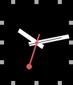{ loading=lazy width="72" } | [c11s-a](https://apps.rebble.io/en_US/application/55d91423391704d7e600004a) <small>Rebble App Store</small> | [sfcgeorge](https://github.com/sfcgeorge/c11s-a) | <small>Not checked yet</small> | 2015-09-21 | Complications-Analogue. A highly customizable watchface yet with minimal design and fast code. Each corner has a "complication" with 2 customizable… |
| 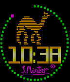{ loading=lazy width="72" } | [C64 sprites](https://apps.rebble.io/en_US/application/558857a641241a58540000ff) <small>Rebble App Store</small> | [Llamasoft](https://github.com/an-ox/C64-sprites-watchface) | <small>Not checked yet</small> | 2015-06-22 | Watchface displaying animations from Llamasoft C64 games. |
| 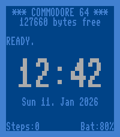{ loading=lazy width="72" } | [C=64](https://apps.repebble.com/696416659fee1e0009d5bc94) | [Reiner Herrmann](https://codeberg.org/reinerh/pebble-c64) | <small>See source</small> | 2026-01-11 | Watchface inspired by the start screen of a Commodore 64. |
| 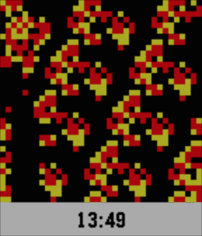{ loading=lazy width="72" } | [CA2D](https://apps.rebble.io/en_US/application/54703ce10ad7b44334000049) <small>Rebble App Store</small> | [slightair](https://github.com/slightair/Pebble-CA2D) | <small>Not checked yet</small> | 2015-06-28 | Display multi state 2D Cellular Automata animation(345/2/4, star wars rule). |
| 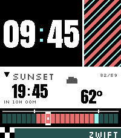{ loading=lazy width="72" } | [Cadence Pavé](https://apps.repebble.com/7e4d835448be4ebdb749565a) | [Precision Complication](https://github.com/tylerjw/cadence-pave) | <small>Not checked yet</small> | 2026-08-26 | The day as 24 blocks, and the last hour of light in red. Most watchfaces tell you the time. This one also tells you how much daylight is left, at a glance… |
| 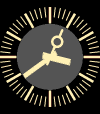{ loading=lazy width="72" } | [CadranGrandeVitesse](https://apps.repebble.com/13844dc2e66043b6b56e7f15) | [Maartje Eyskens](https://github.com/meyskens/CadranGrandVitesse) | <small>Not checked yet</small> | 2026-05-30 | placeholder |
| 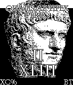{ loading=lazy width="72" } | [Caesar Nero](https://apps.rebble.io/en_US/application/5544b65f946ce2c0c500004d) <small>Rebble App Store</small> | [Spitzkopf](https://github.com/Spitzkopf/Pebble-TrueToCaesar) | <small>Not checked yet</small> | 2015-05-02 | *A simple roman numerals watchface *Features the hour and minutes, battery status and bluetooth status *A small banner with Nero's last words *The… |
| 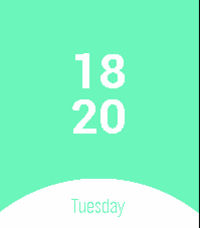{ loading=lazy width="72" } | [Cake](https://apps.rebble.io/en_US/application/5948f3320dfc32acc700004a) <small>Rebble App Store</small> | [佐伯楽](https://github.com/SaekiRaku/pebble-cake) | <small>Not checked yet</small> | 2017-06-21 | A cute watchface that supports multiple language. And opensource. |
| 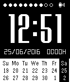{ loading=lazy width="72" } | [Calendar Face](https://apps.repebble.com/56e4ccd2b7a6010bb800002c) | [qwqert](https://github.com/qwqert/Pebble_watchfaces.git) | <small>Not checked yet</small> | 2016-06-25 | - Show simple calendar - Show battery level (dots) - Show bluetooth connection status - Show how many days and hours since last charge |
| { loading=lazy width="72" } | [Calligraphy (Minimal v2)](https://apps.repebble.com/f810a004e5b14c04a0cfa07c) | [Cosmic Oscillator](https://github.com/tew42/pebble-calligraphy) | <small>Not checked yet</small> | 2026-08-13 | This watchface represents the hour and minute hands as a single continuous calligraphic stroke. Radial sections at both ends are joined by a dynamically… |
| { loading=lazy width="72" } | [CALM](https://apps.rebble.io/en_US/application/534e4b424bd779c637000187) <small>Rebble App Store</small> | [itosue](https://github.com/itosue/CALM) | <small>Not checked yet</small> | 2014-04-16 | Hi, this is my first watchface. The simple watchface design make it easy to find out current time even at a glance. Date are hidden bottom of the watch… |
| 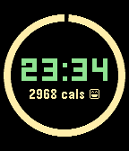{ loading=lazy width="72" } | [Calorie Counter Beta](https://apps.repebble.com/56ef7a44b07e3534cb000043) | [Josh](https://github.com/nonproftechie/calorie-counter) | <small>Not checked yet</small> | 2016-03-21 | Digital face with your current progress towards today's 3000-calorie goal. |
| 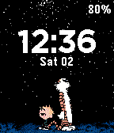{ loading=lazy width="72" } | [Calvin and Hobbes](https://apps.rebble.io/en_US/application/5687ab3322c220343900008e) <small>Rebble App Store</small> | [Florencia Tarditti](https://github.com/formap/pebble-calvin-hobbes-starry-night) | <small>Not checked yet</small> | 2016-01-02 | A Calvin and Hobbes inspired pebble watchface. For issues or requests, you can contact me with the links below or send me a tweet @_formap. |
| 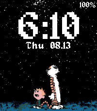{ loading=lazy width="72" } | [Calvin and Hobbes](https://apps.repebble.com/48e718f4728945d4bec4d062) | [S1lentWanderer](https://github.com/S1lentwanderer/calvin-hobbes-watchface) | <small>Not checked yet</small> | 2026-08-23 | A fork of a different face, (https://apps.repebble.com/calvin-and-hobbes_5687ab3322c220343900008e) upscaled to the Pebble Time 2 size. I like it, so I'll… |
| { loading=lazy width="72" } | [Canada Time](https://apps.rebble.io/en_US/application/5532e820267a90ab65000090) <small>Rebble App Store</small> | [Ben Chapman-Kish](https://github.com/AwesomeBen1/CanadaTime) | <small>No licence</small> | 2015-04-18 | A clean and simple watchface featuring the Canadian maple leaf. Compatible with both the original Pebble and Pebble Time. |
| 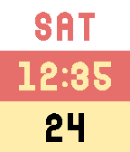{ loading=lazy width="72" } | [Candy Corn](https://apps.rebble.io/en_US/application/562c54436edde4d185000031) <small>Rebble App Store</small> | [Turner Vink](https://github.com/turnervink/candycorn) | <small>Not checked yet</small> | 2015-10-25 | Some people say candy corn is the worst Halloween candy. Show that you don't care what they say with this delicious watchface! Layout is weekday, time, and… |
| 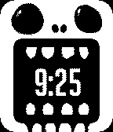{ loading=lazy width="72" } | [CannibalNomNom](https://apps.rebble.io/en_US/application/53b4d28f68ad0b389000016d) <small>Rebble App Store</small> | [Faces Of Doom](https://github.com/fuzzie360/pebble-noms) | <small>Not checked yet</small> | 2014-10-24 | Cannibal style "Noms" Nothing but Evil can come from here... Watch as the Cannibal chomps through every minute of his existence. Shout out to Fazli Sapuan… |
| 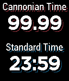{ loading=lazy width="72" } | [Cannonian Time](https://apps.rebble.io/en_US/application/53fb32c9dcc3e56ad900011c) <small>Rebble App Store</small> | [Jack Cannon](https://github.com/jackcannon/pebble-cannonian) | <small>Not checked yet</small> | 2015-08-25 | Digital watchface that displays both Cannonian Time and standard time. Cannonian Time is a metric time system, based on the premise of 100 hours in a day… |
| 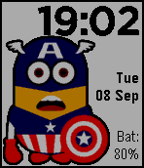{ loading=lazy width="72" } | [CapNion](https://apps.rebble.io/en_US/application/55ef9806dd0987a7c7000079) <small>Rebble App Store</small> | [clach04](https://github.com/clach04/watchface_CapNion/) | <small>Not checked yet</small> | 2015-09-09 | Basic digital watch face for the Pebble Time (Basalt only) smartwatch. Features: * Updates once per minute * Includes battery status * Displays when… |
| 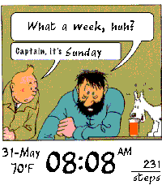{ loading=lazy width="72" } | [Captain Wednesday](https://apps.repebble.com/9be723f675544505b46e5692) | [Bayport](https://github.com/b-bayport/pebble_captnwednesday) | <small>Not checked yet</small> | 2026-06-01 | Tintin's word bubble updates with the day of the week. Battery indicator is the beer glass level in front of Snowy, increments at 90, 60, 40%. |
| 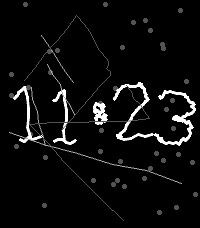{ loading=lazy width="72" } | [CAPTCHA](https://apps.repebble.com/6afcc59fbee742cebca541b5) | [Tom Barrasso](https://github.com/Tombarr/pebble-captcha) | <small>Not checked yet</small> | 2026-04-16 | Old-school CAPTCHA inspired watch face |
| 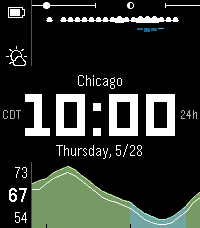{ loading=lazy width="72" } | [Carbon](https://apps.repebble.com/48b38a54db6d45cb85be6521) | [Cory Hughart](https://github.com/cr0ybot/carbon) | <small>Not checked yet</small> | 2026-08-03 | A weather-focused, highly readable-at-a-glance Pebble watchface for the day ahead, with live weather via the free Open-Meteo API. Features: - The current… |
| 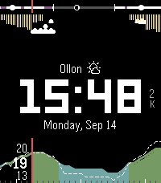{ loading=lazy width="72" } | [Carbon Ion](https://apps.repebble.com/a93e14bc57624e368e156ab6) | [Nils Reichhard](https://github.com/nilsreichhard/carbon-ion) | <small>Not checked yet</small> | 2026-09-28 | Carbon Ion is a high-precision, weather-focused watchface engineered exclusively for Pebble Time 2 / Emery (emery, 200×228 color display). Other platforms… |
| 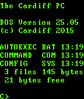{ loading=lazy width="72" } | [Cardiff Giant Simulator (inspired by AMC's Halt and Catch Fire AKA HCF)](https://apps.rebble.io/en_US/application/5563583a32fe79e321000090) <small>Rebble App Store</small> | [Ish Ot Jr.](https://github.com/ishotjr/pw-dos) | <small>Not checked yet</small> | 2015-05-29 | The Cardiff Giant Simulator is a remix of the PW-DOS Command Line Watchface, in celebration of Halt and Catch Fire Season 2, premiering on May 31st… |
| 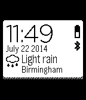{ loading=lazy width="72" } | [Cards](https://apps.repebble.com/53ce41e5db5684c5fd000179) | [Chris Lewis](https://github.com/C-D-Lewis/cards) | <small>No licence</small> | 2025-08-07 | Animated cards containing time, full date, battery, Bluetooth and local weather from weatherapi.com |
| 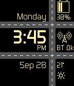{ loading=lazy width="72" } | [Cars](https://apps.rebble.io/en_US/application/5608e554364a06ac41000024) <small>Rebble App Store</small> | [chops](https://github.com/mereed/pebbleface-cars) | <small>Not checked yet</small> | 2016-02-17 | Cars animate (travel across each road) every minute, and at start-up. |
| 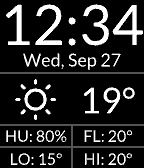{ loading=lazy width="72" } | [CaseFace](https://apps.rebble.io/en_US/application/59cba0830dfc32af6100388b) <small>Rebble App Store</small> | [David Morgan](https://github.com/Spitemare/case-face) | <small>Not checked yet</small> | 2017-12-14 | Inspired by a design from /u/offu in the Pebble subreddit. A clean design putting time and weather upfront. Four bottom quadrants can be configured to show… |
| 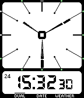{ loading=lazy width="72" } | [CASIO AE-11W](https://apps.rebble.io/en_US/application/56a242b1956f0bdbf900003e) <small>Rebble App Store</small> | [Jack T.](https://github.com/PanicMan/Pebble-Casio-AE-11W) | <small>Not checked yet</small> | 2016-01-26 | Pebble Clone of my old CASIO AE-11W watch. Shows Time in analog and digital, date and weather. Automatic switching or through shaking. Shows Battery level… |
| 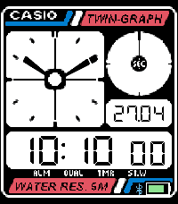{ loading=lazy width="72" } | [Casio AE-20W](https://apps.repebble.com/4e33ec49ff854bb7b9093444) | [Bennett H](https://github.com/bennetthermanoff/Pebble-Casio-AE-20W) | <small>Not checked yet</small> | 2026-08-06 | This is a fork of the original by PanicMan (https://github.com/PanicMan/Pebble-Casio-AE-20W) for PT2. Fonts/Dials are new, but the background is just… |
| 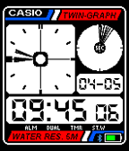{ loading=lazy width="72" } | [Casio AE-20W](https://apps.rebble.io/en_US/application/52f0d6cf1ac79487080027b7) <small>Rebble App Store</small> | [Jack T.](https://github.com/PanicMan/Pebble-Casio-AE-20W) | <small>Not checked yet</small> | 2016-01-20 | Watchface Clone of an Casio AE-20W, with fully worked Animations, like the original! This is the Original: http://www.vintagelcd.com/vul/item/642/ |
| 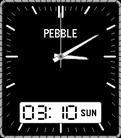{ loading=lazy width="72" } | [Casio AnaDigi](https://apps.repebble.com/2d6f5087c71341d9902ed6cc) | [yaymanloopey](https://github.com/Yaymanloopey/pebble-ana-digi-face) | <small>Not checked yet</small> | 2026-08-02 | Fork of Ana-digi Vibez Eric Migicovsky |
| 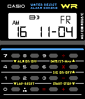{ loading=lazy width="72" } | [Casio CA-53W](https://apps.repebble.com/581d407a9cbbafcd64000160) | [James Smith (@poeia)](https://github.com/poeia/casio-ca-53w) | <small>Not checked yet</small> | 2016-11-09 | Casio CA-53W - The Retro Calculator Watch for the Pebble Step back into 80's and 90's pop culture with the Casio CA-53W, the retro calculator watch worn by… |
| 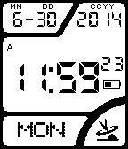{ loading=lazy width="72" } | [Casio WV-58A with AM/PM](https://apps.rebble.io/en_US/application/53b1c7d2e22ed5c40d00008a) <small>Rebble App Store</small> | [Aardvark](https://github.com/Whobeu/WV-58A/archive/master.zip) | <small>Not checked yet</small> | 2014-07-09 | This is my first attempt at a watch face. It is based upon the source code of Jack T.'s Casio-WV58DE project. I myself have the Casio WV58A United States… |
| 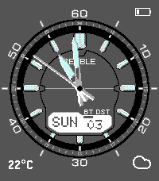{ loading=lazy width="72" } | [Casio WVA-M640D](https://apps.repebble.com/69f79e8c6d87af0009514695) | [Carlos Roque](https://github.com/CarlosRoque/Pebble-Casio-WVA-M640D) | <small>No licence</small> | 2026-05-29 | Inspired by the iconic Casio WVA-M640D. Includes the following functionality: Analog hands — Hour, minute, and seconds hand. Flick to show seconds — Flick… |
| 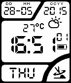{ loading=lazy width="72" } | [Casio-WV-58DE](https://apps.repebble.com/52f0ad814ae3634df7000259) | [Jack T.](https://github.com/PanicMan/Pebble-Casio-WV58DE) | <small>Not checked yet</small> | 2016-10-17 | A Watchface of my previous Watch, an Casio-WV-58DE. With Weather, Bluetooth, Battery and DST Status. Weather update every hour. This is the original Watch… |
| 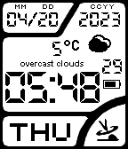{ loading=lazy width="72" } | [Casio-WV-58DE (Gigahawk's fork)](https://apps.rebble.io/en_US/application/6440d3229c7c9300b166555f) <small>Rebble App Store</small> | [Gigahawk](https://github.com/Gigahawk/Pebble-Casio-WV58DE) | <small>No licence</small> | 2023-04-20 | Fork of Jack T's watchface. Settings page has been updated to use Clay, and a field for a personal OpenWeatherMap API key |
| 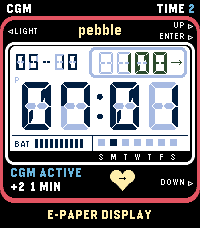{ loading=lazy width="72" } | [CasioCGM](https://apps.repebble.com/58fcfcc22c37487f815520db) | [sgitaize](https://github.com/sgitaize/casiocgm) | <small>Not checked yet</small> | 2026-10-05 | Casio-style LCD watchface for Pebble Time 2 with live Nightscout CGM (blood glucose). As a diabetic you want a cool watchface too – that's why CasioCGM… |
| 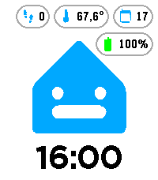{ loading=lazy width="72" } | [Casita](https://apps.repebble.com/7ed76c8a20324151a9137ac5) | [wendevlin](https://github.com/wendevlin/pebble-casita-watchface) | <small>Not checked yet</small> | 2026-09-17 | A cheerful Casita watchface with live badges for weather, steps, date, battery, and Home Assistant temperature — expressions change throughout the day. |
| 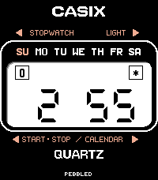{ loading=lazy width="72" } | [Casix](https://apps.repebble.com/71497f50c97544eb908f46ad) | [Kieselleger](https://www.github.com/ProggroP/casix) | <small>Not checked yet</small> | 2026-06-30 | Casix Some watches are just tools. Others become part of who you are. This watchface is a tribute to my very first quartz watch — a Casio from the late… |
| 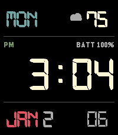{ loading=lazy width="72" } | [Cassiopeia](https://apps.rebble.io/en_US/application/6aa4bd364185ac000967dd9e) <small>Rebble App Store</small> | [mstewart](https://github.com/mpstewart/cassiopeia) | <small>Not checked yet</small> | 2026-09-12 | Digital watchface for the Pebble Time 2 Emery, inspired by the Casio W221H. Gruvbox colorscheme. Always-on backlight toggle with custom color. |
| { loading=lazy width="72" } | [Catclock](https://apps.repebble.com/6929a7ebef41e0000886ac26) | [Chloe Greene](https://git.sr.ht/~angelwood/uxn-pebble) | <small>See source</small> | 2026-01-03 | A catclock, uh. https://wiki.xxiivv.com/site/catclock.html |
| 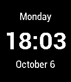{ loading=lazy width="72" } | [CB Simple](https://apps.repebble.com/57217e99fc18dd9fbc000020) | [carthobock](http://www.careybockting.com/pebble/) | <small>See source</small> | 2016-05-27 | A minimalistic watchface optimized for battery life featuring date and time. - Uses Pebble stock fonts. - Displays both 12h and 24h time. Adapts to native… |
| 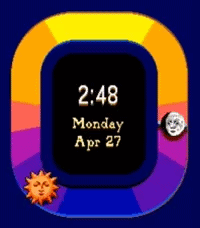{ loading=lazy width="72" } | [Celestial Noon](https://apps.repebble.com/27ea2cc229cd49b0bfc573be) | [EchoLalia](https://github.com/echo-lalia/celestialnoon) | <small>Not checked yet</small> | 2026-06-08 | A watch face inspired by the "Celestial Whimsy" aesthetic, where the clock hands have been replaced with a live visualization of the sun and moon rising and… |
| { loading=lazy width="72" } | [Centrick](https://apps.repebble.com/545a620671c5636388000064) | [stilvoid](https://github.com/stilvoid/centrick) | <small>Not checked yet</small> | 2025-11-25 | A watchface that shows the time using concentric arcs. Configurable colour scheme. You can also choose whether the seconds go on the inside or the outside… |
| 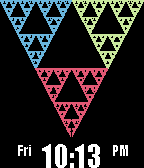{ loading=lazy width="72" } | [Chaos](https://apps.repebble.com/55219f0dd7356c3e2e00006b) | [lesliesbird](https://github.com/lesliesbird/Chaos) | <small>Not checked yet</small> | 2017-01-27 | An exercise in plotting fractal equations. Displays either Sierpinski Triangle, Sierpinski Carpet, Henon Attractor, Julia Set or Mandlebrot Set plotted by a… |
| 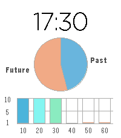{ loading=lazy width="72" } | [Chart Clock](https://apps.repebble.com/97eff38ceaf24f2b87d69719) | [Mark Brackenborough](https://github.com/MarkBrack/pebble-chart-watchface) | <small>Not checked yet</small> | 2026-04-03 | A pastel pebble time 2 watch face with pie and bar chart time visualisations, designed for data viz geeks. |
| 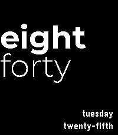{ loading=lazy width="72" } | [Chazybazy's Sliding Text](https://apps.repebble.com/588884d6dbf04fac8d803dc9) | [Chazybazy](https://github.com/chaz-n/chazybazy-sliding-watchface) | <small>Not checked yet</small> | 2026-08-27 | Similar to the offical Pebble sliding text face, but with a date! |
| { loading=lazy width="72" } | [Chemistry Face](https://apps.rebble.io/en_US/application/55e14bb75895cb0baf0000fc) <small>Rebble App Store</small> | [Kurt Lawrence](https://github.com/kurtlawrence/PebbleWatch_Chemistry_Face) | <small>Not checked yet</small> | 2015-10-17 | Displays the current time and date (in DD-MM-YY) as atomic elements in a clean watch face. Shake to peek at the integer values which can help you memorise… |
| 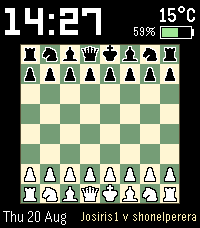{ loading=lazy width="72" } | [Chessface](https://apps.repebble.com/ad9758b0574c4d7cbecfc973) | [joerdav](https://github.com/joerdav/timemate) | <small>Not checked yet</small> | 2026-08-27 | Chessface puts a live chess board on your Pebble Time 2. The time, date, battery and temperature sit around a real game that advances one move per minute… |
| 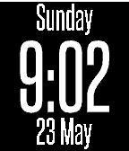{ loading=lazy width="72" } | [Chimaera](https://apps.rebble.io/en_US/application/60ac17751342ae016acb0900) <small>Rebble App Store</small> | [astosia](https://github.com/astosia/Chimaera) | <small>Not checked yet</small> | 2021-05-24 | Chimaera is a simple configurable watchface Options include: - Local language for day of the week and month (based on watch language selected in the phone… |
| 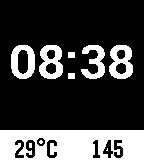{ loading=lazy width="72" } | [China AQI Watchface](https://apps.rebble.io/en_US/application/53e618b7a9f4de431500008b) <small>Rebble App Store</small> | [Lee Turner](https://github.com/lvx3/china_aqi_watchface) | <small>Not checked yet</small> | 2014-08-09 | Gives the Displays the Air Quality Index (AQI) of the current Chinese city you are in on the bottom right of the screen and the current temperature in the… |
| { loading=lazy width="72" } | [Chinese New Year of the Monkey](https://apps.rebble.io/en_US/application/569e7467eeede1ab4400002a) <small>Rebble App Store</small> | [Caller](https://www.github.com/bcaller/pebble-cny-chinese) | <small>Not checked yet</small> | 2016-01-28 | Happy Chinese New Year! 新年快乐! (Xin Nian Kuai Le) Chinese characters for month and date: month + 月(yue) + day + 日(ri). The month and date are numbers written… |
| 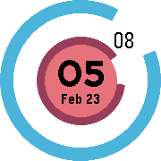{ loading=lazy width="72" } | [Chrono Ring](https://apps.repebble.com/56cbab646e84e5d684000054) | [Ryan Perry-Nguyen](https://github.com/rperryng/pebble-chrono-ring) | <small>Not checked yet</small> | 2016-03-31 | 🌺 Minimalist and practical round design. Made with love. Something missing? Reach out and let me know. |
| 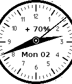{ loading=lazy width="72" } | [Chrono2](https://apps.rebble.io/en_US/application/52ef2bb82823067eb600000b) <small>Rebble App Store</small> | [mjculross](https://www.github.com/mjculross/Chrono2) | <small>Not checked yet</small> | 2014-02-03 | Chrono2: A "sweep analog" watchface with a smooth second hand NOTE: due to the high update rate of the display, Chrono2 is likely to deplete your Pebble… |
| 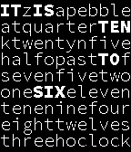{ loading=lazy width="72" } | [ChronoCode](https://apps.rebble.io/en_US/application/52ce238883a66692c700001e) <small>Rebble App Store</small> | [rexmac](https://github.com/rexmac/pebble-chronocode) | <small>Not checked yet</small> | 2014-04-24 | ChronoCode (f.k.a. WordSquare) displays the current time by emphasizing words "hidden" among a jumble of seemingly random letters. The time is displayed in… |
| 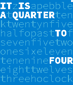{ loading=lazy width="72" } | [ChronoCode Color](https://apps.rebble.io/en_US/application/5580297bda86937b5c00001c) <small>Rebble App Store</small> | [mephissto](https://github.com/mephissto/pebble-chronocode) | <small>Not checked yet</small> | 2015-06-16 | Based on ChronoCode by rexmac. 3 themes : blue, green & red. And their inverted color. |
| 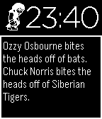{ loading=lazy width="72" } | [Chuck Norris](https://apps.rebble.io/en_US/application/537924dedf9772aa95000019) <small>Rebble App Store</small> | [Grégoire Sage](https://github.com/gregoiresage/pebble-chucknorris) | <small>Not checked yet</small> | 2014-05-22 | If Chuck Norris wore a watch, it would be a Pebble because it kicks ass! Shake your watch to get a new Chuck Norris joke. Have fun :-p Sprites credits… |
| { loading=lazy width="72" } | [Chunk Weather](https://apps.repebble.com/52d7e8d71acbf3ff09000008) | [orviwan](https://github.com/orviwan/Chunk-Weather-v2.0) | <small>Not checked yet</small> | 2025-07-26 | YAWWF (Yet Another Weather Watch Face) It uses Yahoo! Weather, has 48 weather conditions and updates every 30 minutes. Configuration options: - Choose a… |
| { loading=lazy width="72" } | [CIMUN](https://apps.rebble.io/en_US/application/5684e9f48d316fd347000076) <small>Rebble App Store</small> | [ElliottAYoung](https://github.com/ElliottAYoung/CIMUN-pebble-time-watchface) | <small>No licence</small> | 2015-12-31 | A watch face using the logo of the Chicago International Model United Nations conference. |
| { loading=lazy width="72" } | [Cinnamoroll](https://apps.rebble.io/en_US/application/69406a0491ea9d0009b985f9) <small>Rebble App Store</small> | [ericlovesmath](https://github.com/ericlovesmath/pebble-cinnamoroll-watchface) | <small>Not checked yet</small> | 2025-12-15 | Static cute image of Cinnamoroll, from the Sanrio / Hello Kitty universe |
| { loading=lazy width="72" } | [CircaText](https://apps.rebble.io/en_US/application/543eb5b1ffbc4e01d400001d) <small>Rebble App Store</small> | [Andreas Neustifter](https://github.com/astifter/CircaText) | <small>Not checked yet</small> | 2015-01-22 | Ein österreichisches Pebble-Watchface das die ungefähre Zeit in natürlicher Sprache anzeigt. Derzeit sind 2 Varianten des Texts verfügbar. (Und zusätzlich… |
| { loading=lazy width="72" } | [Circle](https://apps.rebble.io/en_US/application/58e2bf586ca3871e000004b6) <small>Rebble App Store</small> | [b123400](https://github.com/b123400/circle-watchface) | <small>Not checked yet</small> | 2026-06-28 | Hour and minute are indicated by colour of the nearest block, you can customise the accuracy by the number of vertices, all colours are customisable as well. |
| { loading=lazy width="72" } | [Circle Inception](https://apps.rebble.io/en_US/application/565b4263a5c4c97eba000057) <small>Rebble App Store</small> | [Edwin Finch](https://edwinfinch.com/redirect/pebble-legacy-source) | <small>See source</small> | 2021-06-17 | An old classic from our original collection from 2014-2016, now free & open source! |
| { loading=lazy width="72" } | [Circle Mix](https://apps.rebble.io/en_US/application/67cb5b32d2acb301fae26e22) <small>Rebble App Store</small> | [darnel](https://github.com/darnel/pebble-watchface-circle-mix) | <small>Not checked yet</small> | 2025-03-07 | Simple watchface. Variant of "Two arcs". Hours and minutes are represented by additive arcs around numbers. |
| { loading=lazy width="72" } | [circLED](https://apps.rebble.io/en_US/application/55f8fa9dacde1781df000041) <small>Rebble App Store</small> | [chops](https://github.com/mereed/pebbleface-circled) | <small>Not checked yet</small> | 2015-09-16 | A simple, but familiar design. Around the circle edge the minutes are indicated by a gap in the circle, while seconds can be displayed (for 30sec) via a… |
| { loading=lazy width="72" } | [Circles](https://apps.rebble.io/en_US/application/54f4a44b84bffcb1b100005f) <small>Rebble App Store</small> | [ClementG](https://github.com/clementGdev/circles_pebble_watchface) | <small>Not checked yet</small> | 2015-05-12 | Very minimalist watchface. Inner circle is hours, outter circle is minutes, with animations ! On the example, it's 10:47 and 10:48 Dev is at its earliest… |
| { loading=lazy width="72" } | [Circles](https://apps.rebble.io/en_US/application/54f672ad414e76a3320000a4) <small>Rebble App Store</small> | [Kleverson Royther](http://github.com/KRoyther/Circle) | <small>No licence</small> | 2015-03-05 | Circles is a watchface inspired by elements of Material Design. In this first version, it currently shows: 1: The time; 2: Short day of the week and day of… |
| { loading=lazy width="72" } | [Circles of Life](https://apps.rebble.io/en_US/application/547bfdfcfb0797bddb0000d3) <small>Rebble App Store</small> | [Gabe Ochoa](http://www.github.com/gabeochoa/CirclesOfLife) | <small>No licence</small> | 2014-12-01 | Very simple minimalist watchface. Each circle represents a time denomination with the largest circle as the hour hand. |
| { loading=lazy width="72" } | [Circlock](https://apps.rebble.io/en_US/application/543ba23ed74e85159d000131) <small>Rebble App Store</small> | [kaneshin](https://github.com/kaneshin/circlock-pebble) | <small>Not checked yet</small> | 2014-10-13 | Circlock is a simple clock and showing battery level. |
| { loading=lazy width="72" } | [Circuit Clock](https://apps.repebble.com/d81c8072e4ff47b9bdfca3f8) | [Comfortably Numb](https://github.com/ygalanter/arduino-watch-pebble) | <small>Not checked yet</small> | 2026-04-26 | Circuit Clock is a digital clock in form of 7-segment open circuit display. - Customizable color of digits 🎨 Shake the watch to cycle thru: Date 📅 Day of… |
| { loading=lazy width="72" } | [Circuit Clock](https://apps.rebble.io/en_US/application/69ee3eb965bd7b00091cfc78) <small>Rebble App Store</small> | [Comfortably Numb](https://github.com/ygalanter/arduino-watch-pebble) | <small>Not checked yet</small> | 2026-04-26 | Circuit Clock is a digital clock in form of 7-segment open circuit display. - Customizable color of digits 🎨 Shake the watch to cycle thru: Date 📅 Day of… |
| { loading=lazy width="72" } | [Circular Analog Clock](https://apps.repebble.com/2dbaa9b069e84efeb1bb9cac) | [kleines Filmröllchen](https://codeberg.org/filmroellchen/pebble-circular-analog-clock) | <small>See source</small> | 2026-09-14 | Pebble port of the minimalistic colorful analog clock with decorative and functional arcs: https://filmroellchen.eu/projects/webapps/p5jsclock/ Main… |
| { loading=lazy width="72" } | [Circular Plus v2](https://apps.repebble.com/56d222421f7ad629b6000041) | [Max Beckett](https://github.com/mlb406/circular-v2) | <small>Not checked yet</small> | 2016-03-09 | Circular Plus v2 is a follow up of my watchface Circular+. It has been completely rewritten with SDK 3.x and has been optimised for the latest firmware… |
| { loading=lazy width="72" } | [CircularPlus](https://apps.rebble.io/en_US/application/55b393357d33ce09d8000059) <small>Rebble App Store</small> | [Max Beckett](https://github.com/mlb406/CircularFace) | <small>Not checked yet</small> | 2015-07-25 | Meet CircularPlus. CircularPlus is a watchface for Pebble, that has several configurable options. Although tested predominantly on Pebble Original, the face… |
| { loading=lazy width="72" } | [Circumflexus](https://apps.rebble.io/en_US/application/55cc84672033826bd2000004) <small>Rebble App Store</small> | [Robinhuett](https://github.com/Robinhuett/Circumflexus) | <small>Not checked yet</small> | 2025-12-01 | Watchface for Pebble Time. This is based on the design of TimeDrol from X.adA but with a varity of options like fully customizable colors and an dinamcly… |
| { loading=lazy width="72" } | [Circus Clown](https://apps.repebble.com/b408391bb1c44f589b5297ec) | [AirCodum](https://github.com/coredevices/pebble-watchface-agent-skill) | <small>Not checked yet</small> | 2026-06-13 | Shake your wrist and a cheerful circus clown springs to life - juggling, balancing a spinning plate, and back-flipping under the big-top spotlight. When… |
| { loading=lazy width="72" } | [Cirkular](https://apps.repebble.com/577f0ff166202ae1d300035c) | [Zealotree](https://github.com/zealotree/Cirkular) | <small>Not checked yet</small> | 2016-07-09 | -- TIME ROUND EXCLUSIVE -- An analogue clock that displays the time and date based on the positions of the clock. Telling the time is as simple as looking… |
| { loading=lazy width="72" } | [Cirkular Helios](https://apps.repebble.com/5781649266202ad3f7000531) | [Zealotree](https://github.com/zealotree/Cirkular/tree/helios) | <small>Not checked yet</small> | 2016-07-11 | -- TIME ROUND EXCLUSIVE -- It's Cirkular with Sunrise/Sunset indicators and in dark mode. An analogue clock that displays the time and date based on the… |
| { loading=lazy width="72" } | [Cistercian Numerals](https://apps.repebble.com/fae262ccdb5a428fb9cec3d2) | [ριтєя мαяχ](https://github.com/pitermarx/cistercian-pebble) | <small>Not checked yet</small> | 2026-04-05 | 24h in cistercian numerals |
| { loading=lazy width="72" } | [Citizen Star Wars](https://apps.repebble.com/2985c1ae5ff44cb9b4b89251) | [Shapeepo](https://github.com/shapeepo/citizen-star-wars) | <small>Not checked yet</small> | 2026-05-08 | Based on Citizen Star Wars face |
| { loading=lazy width="72" } | [City Temp](https://apps.repebble.com/533e13ed122201b48200016c) | [chops](https://github.com/mereed/pebbleface-citytemp) | <small>Not checked yet</small> | 2017-06-12 | 13 aug. added bogota, calgary, seattle Battery level is shown across the top in 10% increments, and when BT is lost the building windows and sky disappear… |
| { loading=lazy width="72" } | [Civic Segments](https://apps.repebble.com/cd4b68957ad44e5ea3c3c6cd) | [RandyTheSilly](https://git.wetfence.xyz/RandyTheSilly/Civic-Segments) | <small>See source</small> | 2026-07-05 | A highly configurable clone of the beautiful 8th gen Honda Civic driver display assembly. The time font was carefully crafted to resemble the segmented… |
| { loading=lazy width="72" } | [Civic Segments](https://apps.rebble.io/en_US/application/6a41abe1337085000985b6a3) <small>Rebble App Store</small> | [RandyTheSilly](https://git.wetfence.xyz/RandyTheSilly/Civic-Segments) | <small>See source</small> | 2026-07-05 | A highly configurable clone of the beautiful 8th gen Honda Civic driver display assembly. The time font was carefully crafted to resemble the segmented… |
| { loading=lazy width="72" } | [CkPoolWatcher](https://apps.rebble.io/en_US/application/55ecd9c28c537c1a5b00006f) <small>Rebble App Store</small> | [Alice Grey](https://github.com/AliceGrey/CKPoolWatcherPebble) | <small>No licence</small> | 2015-09-07 | A watchface to monitor your miners on CKPool Kano.is. |
| { loading=lazy width="72" } | [Clash of Clans](https://apps.rebble.io/en_US/application/554c0a8c92dfd320010000cc) <small>Rebble App Store</small> | [David](https://github.com/dmattia/ClashOfClansWatchFace) | <small>Not checked yet</small> | 2015-05-08 | A clash of clans color watchface with timeline support |
| { loading=lazy width="72" } | [Clash of Clans](https://apps.rebble.io/en_US/application/54f9f1045306074dee000013) <small>Rebble App Store</small> | [David](https://github.com/dmattia/ClashOfClansWatchFace) | <small>Not checked yet</small> | 2015-03-06 | Unofficial watchface for the popular app Clash of Clans. Features the current battery level, charge status, time, day of the week, and date alongside a… |
| { loading=lazy width="72" } | [Classic Lite](https://apps.rebble.io/en_US/application/566871e573728bc4c7000057) <small>Rebble App Store</small> | [Natasha Kerensikova](https://github.com/faelys/classic-lite) | <small>Not checked yet</small> | 2016-01-26 | This is a minimalist rewrite of the "Classic" watchface by Łukasz Zalewski, aiming at maximizing battery life. While battery effect is long to measure, and… |
| { loading=lazy width="72" } | [Classic Motivate](https://apps.repebble.com/affc96ec1b9a4016a9ec54f6) | [Synalysis](https://github.com/synalysis/classic-motivate) | <small>Not checked yet</small> | 2026-08-20 | Analog watchface with a companion-configurable motivational quote that alternates with the clock. |
| { loading=lazy width="72" } | [Classio](https://apps.rebble.io/en_US/application/52d8ba68aef8d50e88000027) <small>Rebble App Store</small> | [Pebble](https://github.com/pebble/pebble-sdk-examples/tree/master/watchfaces/classio) | <small>Not checked yet</small> | 2014-01-17 | Classio Example Watchface |
| { loading=lazy width="72" } | [ClassIO Battery Connection](https://apps.rebble.io/en_US/application/52d8ba2baef8d590d300002c) <small>Rebble App Store</small> | [Pebble](https://github.com/pebble/pebble-sdk-examples/tree/master/watchfaces/classio-battery-connection) | <small>Not checked yet</small> | 2014-01-17 | ClassIO Battery Connection |
| { loading=lazy width="72" } | [Classy Clock](https://apps.rebble.io/en_US/application/52fd08542ace7afe350001de) <small>Rebble App Store</small> | [Val Packett](https://github.com/valpackett/classyclock) | <small>Not checked yet</small> | 2016-01-17 | A watchface that shows time to your next class (or time to the end of your current class). Must have for students. + Customizable colors + Backup and… |
| { loading=lazy width="72" } | [Classy Colors](https://apps.rebble.io/en_US/application/55d648c40d8e1dee2800003b) <small>Rebble App Store</small> | [Albert Yau](https://github.com/AlbertYau/pebble-classy-colors) | MIT | 2015-09-02 | Classy Colors is a simple, elegant watchface. Easily customize the colors of the clock, background, and a secondary color. Choose the perfect combination to… |
| { loading=lazy width="72" } | [Classy Sweep](https://apps.rebble.io/en_US/application/556905267802ba7fb700006f) <small>Rebble App Store</small> | [Nicholas Currault](http://github.com/nicktendo64/classy-sweep) | MIT | 2015-05-30 | For a classy touch to your watch, this face uses a "sweeping" second hand (one that moves continuously, rather than once per second). It also features a… |
| { loading=lazy width="72" } | [Claude Code Mascot](https://apps.repebble.com/ed402248906d4478982b0c4d) | [Drew Hutton (Yoroshi)](https://github.com/coredevices/pebble-watchface-agent-skill) | <small>Not checked yet</small> | 2026-04-13 | An animated watchface featuring the Claude Code mascot — a tiny AI character that walks, runs, thinks, and sleeps across a pixel-art terminal display. Shows… |
| { loading=lazy width="72" } | [Claude Fails](https://apps.repebble.com/6a2a58c32a809d000935dd97) | [DuMe](https://github.com/smndhm/pebble) | <small>Not checked yet</small> | 2026-06-11 | A Pebble watchface born as a failed iteration on the road to "World Cup 2026". While building "World Cup 2026" — a watchface using a custom typeface… |
| { loading=lazy width="72" } | [Clean](https://apps.repebble.com/30059ade40e44f408302f543) | [EdBo](https://github.com/beatles1/PebbleClean/) | <small>Not checked yet</small> | 2026-05-02 | Simple digital watchface with: - Temperature from Open Weather Map - Bar showing percentage of health target achieved - Bar showing battery level Colours of… |
| { loading=lazy width="72" } | [Clean](https://apps.rebble.io/en_US/application/69933528ab36c30009ff01e6) <small>Rebble App Store</small> | [EdBo](https://github.com/beatles1/PebbleClean/) | <small>Not checked yet</small> | 2026-05-02 | Simple digital watchface with: - Temperature from Open Meteo - Bar showing percentage of health target achieved - Bar showing battery level Colours of bars… |
| { loading=lazy width="72" } | [Clean](https://apps.rebble.io/en_US/application/55695e82e561921b230000ac) <small>Rebble App Store</small> | [Shawn Lutch](https://github.com/ChaoticWeg/PebbleCleanFace) | <small>No licence</small> | 2015-06-03 | A minimal and efficient watchface for Pebble and Pebble Steel. "Clean" consists of a digital LCD clock and date, and a battery meter. It is designed to have… |
| { loading=lazy width="72" } | [Clean & Smart](https://apps.repebble.com/5616de1d7bc7a6ef0a000026) | [Comfortably Numb](https://github.com/ygalanter/Clean_and_Smart) | <small>Not checked yet</small> | 2026-07-19 | Design and Art Direction by Paul Joel - www.pauljoel.com Contributions by Yaron Sheffer. Simple and clean watchface featuring large date and time as well as… |
| { loading=lazy width="72" } | [Clean and Simple](https://apps.rebble.io/en_US/application/5320f82eb817c88ad700015b) <small>Rebble App Store</small> | [Ryan Case](https://github.com/rgcase/CleanAndSimple) | <small>Not checked yet</small> | 2014-03-13 | A simple, sharp, easy to read watchface for everyday use. |
| { loading=lazy width="72" } | [Clean and Smart with seconds](https://apps.repebble.com/32d78a4ded604ff6a4222f0b) | [shadedurza](https://github.com/shadedurza/Clean_and_Smart_seconds) | <small>Not checked yet</small> | 2026-09-24 | Orignal watchface designed by Paul Joel and coded by Comfortably Numb. This version simply adds seconds. |
| { loading=lazy width="72" } | [Clean Atelier Watchface](https://apps.repebble.com/4ef760ca61cf4e2080edbd97) | [dhrme](https://github.com/dhrme/pebble-apps/tree/main/atelier) | <small>Not checked yet</small> | 2026-06-25 | A clean analogue watchface by Rohan from DHRME |
| { loading=lazy width="72" } | [Clean Cut](https://apps.repebble.com/5803cc5cc98866548c000141) | [Christian Reinbacher](https://github.com/reini1305/cutting_edge) | <small>Not checked yet</small> | 2016-11-26 | Made due to a reddit request from /u/stegosaurusflex1 (who also gets the design credits). You can freely select the colors of hour, minute, background and… |
| { loading=lazy width="72" } | [Clean Overview](https://apps.repebble.com/1c84d2017ade47e594a76f20) | [Max Mehl](https://github.com/mxmehl/pebble-clean-overview) | <small>Not checked yet</small> | 2026-06-07 | A clean, minimal digital watchface with health stats at a glance. Large time display, configurable seconds (always/on shake), Bluetooth and quiet time… |
| { loading=lazy width="72" } | [Clean Stripes](https://apps.repebble.com/57704f8d6c2104d9b1000171) | [drewatk](https://github.com/drewatk/cleanStripes) | <small>Not checked yet</small> | 2016-06-27 | Simple watchface showing the date and time. Email me if you have a suggestion! |
| { loading=lazy width="72" } | [Clean Watch](https://apps.rebble.io/en_US/application/52e17e505b1d9ec9e60000aa) <small>Rebble App Store</small> | [Pranav Vishnu](https://github.com/pranavvishnu/clean-watch) | <small>Not checked yet</small> | 2014-02-08 | A simple, clean watch face using Helvetica Neue. Displays Time, Date and Day. Supports both 24 and 12-hour Modes. Made to go easy on your battery, as time… |
| { loading=lazy width="72" } | [Clear Watch](https://apps.rebble.io/en_US/application/52f15c408d40be941000034b) <small>Rebble App Store</small> | [Pranav Vishnu](https://github.com/pvrnav/clear-watch) | <small>Not checked yet</small> | 2014-02-08 | A simple watch face using Helvetica Neue that shows the time, day and date. Supports both 12 & 24 hour modes. Made to go easy on your battery. |
| { loading=lazy width="72" } | [Clipped](https://apps.repebble.com/52a207a0a38509f36600003c) | [Jnm](https://github.com/Jnmattern/Clipped_2.0) | <small>No licence</small> | 2026-03-02 | Huge digits that do not fit in the screen! Versions Available : date/nodate, day/month, month/day, and week day in Danish, Dutch, English, French, German… |
| { loading=lazy width="72" } | [Clock simple](https://apps.rebble.io/en_US/application/549c77d245afee949800076f) <small>Rebble App Store</small> | [AzagraMac](https://github.com/AzagraMac/Pebble_ClockSDK) | <small>No licence</small> | 2014-12-25 | A simple clock that uses the GPS to find out about the temperature where you are. |
| { loading=lazy width="72" } | [ClockDOt](https://apps.repebble.com/574fdf86ab673d256d00001f) | [botulf2000](https://github.com/botulf2000/clockdot) | <small>Not checked yet</small> | 2016-06-02 | Simple clock, using a dot for the minute hand. |
| { loading=lazy width="72" } | [ClockLight](https://apps.rebble.io/en_US/application/56f6b6f614325b254b000053) <small>Rebble App Store</small> | [Benjamin Burgy](https://github.com/minidfx/ClockLight) | <small>Not checked yet</small> | 2016-10-11 | A simple watchface displaying date, time, the day of week, the battery level and the bluetooth status with your phone when your are disconnected. |
| { loading=lazy width="72" } | [Clockwork](https://apps.repebble.com/ac29b3f66536476d81206e2a) | [Comfortably Numb](https://github.com/ygalanter/clockfork-pebble) | <small>Not checked yet</small> | 2026-05-10 | A clockpunk-style analog watchface with moving gears, and ticking sound. Original design: https://discourse.fullandroidwatch.org/t/s9wf04-watchface/72874 |
| { loading=lazy width="72" } | [Clockwork](https://apps.rebble.io/en_US/application/6a008c307d641e00091324a8) <small>Rebble App Store</small> | [Comfortably Numb](https://github.com/ygalanter/clockfork-pebble) | <small>Not checked yet</small> | 2026-05-10 | A clockpunk-style analog watchface with moving gears, and ticking sound. Original design: https://discourse.fullandroidwatch.org/t/s9wf04-watchface/72874 |
| { loading=lazy width="72" } | [Close enough](https://apps.repebble.com/54ed0fceb5dab64c3f000106) | [Rob Garth](https://github.com/rgarth/PebbleCloseEnough) | <small>Not checked yet</small> | 2016-08-25 | Human readable watch-face which gives the time in increments of five minutes. Tells the time the same way that you do. Shake/Tap to wake-up. Accurate… |
| { loading=lazy width="72" } | [Clunky Old Watch](https://apps.rebble.io/en_US/application/54a708610cd93626c90000da) <small>Rebble App Store</small> | [Boffo Conglomerated](https://github.com/pnf/pebble-sdk-examples/tree/master/watchfaces/crappy_analog) | <small>Not checked yet</small> | 2015-01-02 | Be transported to magical olden times when you strap on this beauty. This watch loses or gains several minutes a day, depending on how much it's been wound… |
| { loading=lazy width="72" } | [CMD Time](https://apps.repebble.com/52e64c3692c5272078000011) | [Chris Lewis](https://github.com/C-D-Lewis/cmd-time) | <small>No licence</small> | 2025-08-12 | This watchface imitates the "time /t" and "date /t" commands in the Windows Command Prompt. Also includes a subtle animation on the prompt itself. |
| { loading=lazy width="72" } | [CMD Time Typed](https://apps.repebble.com/52e919c2ad615bf1a5000024) | [Chris Lewis](https://github.com/C-D-Lewis/cmd-time-typed) | <small>No licence</small> | 2025-08-12 | Same as the CMD Time watchface, but each minute the commands are 'entered' by an imaginary user by animations. +Realism |
| { loading=lazy width="72" } | [CMF Analog - PT2](https://apps.repebble.com/4fcddcfe77784c2f87302d40) | [beefeeny](https://github.com/Jeevus3D/CMF-Analog-Pebble-Watch-Face) | <small>No licence</small> | 2026-04-13 | My personal favorite daily driver watch face. Styled after the Nothing CMF Analog face. Complications for date, steps, and local weather. Designed for the… |
| { loading=lazy width="72" } | [Coastal Watchface T2](https://apps.repebble.com/d44cfdd7bcb54f36aa8031a9) | [Persistent Productions](https://github.com/Joel256/Coastal-T2) | MIT | 2026-06-13 | A scenic pixel-art watchface inspired by the rugged coastline of Topsail Beach, Newfoundland. Built specifically for the Pebble Time 2. The background… |
| { loading=lazy width="72" } | [Cobblestyle](https://apps.repebble.com/566642d77da16a2459000087) | [Comfortably Numb](https://github.com/ygalanter/PebStyle) | <small>Not checked yet</small> | 2025-03-16 | Design and Art Direction by Paul Joel - www.pauljoel.com Flexible stylish watchface featuring date, battery info and weather. You can select between analog… |
| { loading=lazy width="72" } | [CobbleStyle 2](https://apps.repebble.com/57719ccc6c2104ad170001c8) | [Comfortably Numb](https://github.com/ygalanter/priv-cobblestyle-2) | <small>Not checked yet</small> | 2026-08-30 | Design and Art Direction by Paul Joel - www.pauljoel.com CobbleStyle is back! This time with THREE modes to display the time: analog, digital or BIG TIME!… |
| { loading=lazy width="72" } | [Code Watch](https://apps.repebble.com/888dd564643647808da7d859) | [Creative Manaks](https://github.com/manaksu/CodeWatch) | <small>Not checked yet</small> | 2026-05-30 | Time as code. The watch displays the current time as a Python function — syntax-highlighted in VS Code colours, with JetBrains Mono font. Every minute, the… |
| { loading=lazy width="72" } | [Code XANA](https://apps.repebble.com/691ccd3ff5dd2700091a4ff2) | [MrXANA91](https://github.com/MrXANA91/pebble-codexana-wf) | <small>Not checked yet</small> | 2026-08-14 | Code Lyoko themed watchface with the eye of XANA in the center. Code XANA will display the time (24h or 12h format automatically detected), the date, the… |
| { loading=lazy width="72" } | [Codec](https://apps.rebble.io/en_US/application/553aeb897fcaa61d4f00006f) <small>Rebble App Store</small> | [Justin Hamilton](https://github.com/justinhamilton/codec) | <small>Not checked yet</small> | 2015-04-25 | A watchface based off the Codec from Metal Gear Solid. Instead of the frequency, the time is displayed. The bars on the left represent seconds (in… |
| { loading=lazy width="72" } | [CodeTime](https://apps.repebble.com/43e75103ac5041c09beb33e6) | [RockenSocken](https://github.com/RockenSocken/CodeTime) | <small>Not checked yet</small> | 2026-05-04 | A code-inspired Pebble watchface displaying time, date, weather, battery, and step count. Designed for high-contrast readability with configurable… |
| { loading=lazy width="72" } | [Codex Weekly](https://apps.repebble.com/27f48d86803e471a83b93dfe) | [Analog Tick-Tocker](https://github.com/meded90/pebble-time-2-pixel-faces) | <small>Not checked yet</small> | 2026-09-01 | Codex Weekly places an oversized pixel clock above your remaining weekly Codex quota, reset countdown, and a GitHub-style 12-week personal usage heatmap… |
| { loading=lazy width="72" } | [CoinCan 2](https://apps.rebble.io/en_US/application/6934be788f67b20009024523) <small>Rebble App Store</small> | [Réal Ouellet](https://github.com/yodalf/coincan.git) | <small>Not checked yet</small> | 2025-12-07 | 10 years later... a new and improved CoinCan! |
| { loading=lazy width="72" } | [Coke](https://apps.rebble.io/en_US/application/68a7aa36a70ac100089822c5) <small>Rebble App Store</small> | [random360-pebble](https://github.com/random360-pebble/Coca-Cola) | <small>Not checked yet</small> | 2025-08-21 | A simple Coca-Cola watch face |
| { loading=lazy width="72" } | [Collision Clock](https://apps.rebble.io/en_US/application/54d9c75763eb41ed77000067) <small>Rebble App Store</small> | [Chen =L](https://github.com/chenlianMT/Pebble_WatchFace) | <small>Not checked yet</small> | 2015-02-10 | Guess what corresponds to hour, minute, and second? |
| { loading=lazy width="72" } | [Cologne](https://apps.rebble.io/en_US/application/55b0d84bd53410677c000039) <small>Rebble App Store</small> | [Steffen Tröster](https://github.com/stetro/cologne-pebble-watchface) | <small>Not checked yet</small> | 2015-07-23 | Cologne skyline watchface |
| { loading=lazy width="72" } | [Colon-P](https://apps.rebble.io/en_US/application/55077760359e143bf90000b0) <small>Rebble App Store</small> | [Justin Loew](https://github.com/jloloew/Colon-P) | <small>Not checked yet</small> | 2015-03-17 | This watch face goes great with a pair of googly eyes on your Pebble. Stick one in each of the top two corners of the screen and you're good to go! Colon-P… |
| { loading=lazy width="72" } | [Colony](https://apps.repebble.com/56e3a6325d0b2e83b000003f) | [clach04](https://github.com/clach04/watchface_colony) | <small>Not checked yet</small> | 2017-01-08 | * Display time, updating once per minute- using system font * Display Battery power * Display notice when Bluetooth is disconnected * Have a config/settings… |
| { loading=lazy width="72" } | [Color Circle](https://apps.repebble.com/56da59a9b8a67d825e00004f) | [zman441](https://github.com/zackdolsen/ColorCircle) | <small>Not checked yet</small> | 2026-07-02 | Color Circle is a clean, expressive analog watch face with smooth animations and plenty of customization to make it your own. Features: - Animated startup… |
| { loading=lazy width="72" } | [Color Fuzzy Time](https://apps.rebble.io/en_US/application/5548f8342cfbfc5df400007b) <small>Rebble App Store</small> | [Tom Medley](https://github.com/fredley/Fuzzy-Colour) | <small>Not checked yet</small> | 2015-05-07 | Color Fuzzy Time displays the time imprecisely using words, in glorious color. A minimalist clockface with only an hour hand is also shown, and the color is… |
| { loading=lazy width="72" } | [Color Ticker](https://apps.repebble.com/57daef49ac56ea936d0000d6) | [Tim the Guy](https://github.com/timtheguy/color-picker) | <small>Not checked yet</small> | 2016-10-26 | Color Ticker (a play on 'color picker') is the most straight-forward hex-color watchface designed by a web developer, for web developers. Every minute, a… |
| { loading=lazy width="72" } | [Color Weather](https://apps.rebble.io/en_US/application/6aa2c3a676c8d6000a6e5057) <small>Rebble App Store</small> | [digitalurban](https://github.com/digitalurban/color-weather-pebble) | <small>Not checked yet</small> | 2026-09-10 | Color Weather delivers real-time weather, step tracking, and smart storm alerts to your wrist. Features background colors based on temperature, weather… |
| { loading=lazy width="72" } | [Colorcycle](https://apps.rebble.io/en_US/application/55bf8c7506d956b72300004a) <small>Rebble App Store</small> | [simpoir](https://github.com/simpoir/pebble-chromacyle) | <small>Not checked yet</small> | 2015-08-14 | Will cycle the hue of the background during the hour, slowly as to not distract but enough so that you can notice the change once in a while. |
| { loading=lazy width="72" } | [Colored Bricks](https://apps.rebble.io/en_US/application/6a36ba8b884566000985aaf1) <small>Rebble App Store</small> | [socrates.codes](https://github.com/sandylewat/colored-bricks) | <small>Not checked yet</small> | 2026-06-27 | A LEGO brick-inspired Pebble watchface for the Pebble Time 2 (emery). The time is displayed in a brick font, every digit is built from individual… |
| { loading=lazy width="72" } | [ColorHex](https://apps.rebble.io/en_US/application/5568d33d073e041f5e000046) <small>Rebble App Store</small> | [Matthew Hungerford](http://github.com/mhungerford) | <small>See source</small> | 2015-05-29 | Analog watchface featuring the Pebble 64-color palette as a background. Anti-aliased watchhands Bordered hour markers Digital LCD readout of date and time… |
| { loading=lazy width="72" } | [Colors - Watch Face](https://apps.repebble.com/c2d3442de12841b09f2cc72b) | [Brooman Inks](https://github.com/brooks2564/Pebble-Colors) | <small>Not checked yet</small> | 2026-05-04 | Select your favorite color to be on your watch face! |
| { loading=lazy width="72" } | [Colour Analog](https://apps.rebble.io/en_US/application/5b2dc5defbaf9aba1f0004bb) <small>Rebble App Store</small> | [Daktak](https://gitlab.com/daktak/ColourAnalog) | <small>Not checked yet</small> | 2026-08-18 | Simple Pebble Watchface Complications: * Battery * Bluetooth * Phone battery * Time * Date * Weather temperature * Health stats * CoinMarketCap crypto price… |
| { loading=lazy width="72" } | [Colour Calendar](https://apps.rebble.io/en_US/application/55f1ab113b8c851f4100009b) <small>Rebble App Store</small> | [David Corne](https://github.com/davidcorne/PebbleColourCalendar) | <small>Not checked yet</small> | 2015-09-16 | A fully featured but simple watchface. This features: - Easy to see time and date. - A battery indicator with a colour meter, percentage display and a… |
| { loading=lazy width="72" } | [Colour Fuzzy Time](https://apps.rebble.io/en_US/application/55fae05118a3ff29b500008e) <small>Rebble App Store</small> | [Stew Wilson](http://github.com/digitalraven/fuzzy-uk-time) | GPL-2.0 | 2015-10-03 | A fuzzy-time watch face that changes colour to reflect changes in temperature. |
| { loading=lazy width="72" } | [Colour_Time](https://apps.rebble.io/en_US/application/5557b9c76c5443b286000025) <small>Rebble App Store</small> | [Stevegroves123](https://github.com/stevegroves123/Pebble_time_watchface.git) | <small>Not checked yet</small> | 2015-06-13 | This is a basic watch face, the user is able to change the top/bottom colour from a short list. Feel free to use / improve on the code. |
| { loading=lazy width="72" } | [Colours](https://apps.rebble.io/en_US/application/55882b0c0021370a4b0000dc) <small>Rebble App Store</small> | [Edwin Finch](https://edwinfinch.com/redirect/pebble-legacy-source) | <small>See source</small> | 2021-06-17 | An old classic from our original collection from 2014-2016, now free & open source! |
| { loading=lazy width="72" } | [Colr](https://apps.rebble.io/en_US/application/5685d0f3ecd409918e000068) <small>Rebble App Store</small> | [Plays2](https://github.com/plays2/colr) | <small>Not checked yet</small> | 2016-01-25 | A simple watch face that converts the current time into a hex color code and sets the background to that color. The black bar behind the time is re-sized… |
| { loading=lazy width="72" } | [colr](https://apps.repebble.com/5746c7881d6a8859bc000007) | [TheBlackParrot](https://github.com/TheBlackParrot/pebble-time-watchface-colr) | <small>Not checked yet</small> | 2016-05-26 | Watchface with a pixel aesthetic, comes with 40 gradients pre-defined and randomly switches between them each minute. |
| { loading=lazy width="72" } | [Combat Infantryman Badge](https://apps.repebble.com/57221ff4a7c9ccf10c000007) | [Bryan Haines](https://github.com/bryanhaines/Pebble) | <small>Not checked yet</small> | 2016-04-28 | This military-themed watchface displays the Combat Infantry Badge (CIB), awarded to U.S. Army infantry or special forces personnel for performance of duty… |
| { loading=lazy width="72" } | [Combination](https://apps.repebble.com/56a557d9f55165fd79000075) | [Tim Erwich](https://github.com/ThinTim/combination-watchface) | <small>Not checked yet</small> | 2016-02-19 | A watchface designed to look like the cylinders on a combination lock |
| { loading=lazy width="72" } | [Combination Lock](https://apps.repebble.com/16d0d2c3f4c941498c5d6a88) | [Comfortably Numb](https://github.com/ygalanter/Pebble-Combination-Lock) | <small>Not checked yet</small> | 2026-04-25 | Combination Lock is a digital watchface that displays time in form of mechanical numerical lock Also shown: Date 📅 Battery charge 🔋 Steps taken 👟 Calories… |
| { loading=lazy width="72" } | [Combination Lock](https://apps.rebble.io/en_US/application/69ed008365bd7b0009d53776) <small>Rebble App Store</small> | [Comfortably Numb](https://github.com/ygalanter/Pebble-Combination-Lock) | <small>Not checked yet</small> | 2026-04-25 | Combination Lock is a digital watchface that displays time in form of mechanical numerical lock Also shown: Date 📅 Battery charge 🔋 Steps taken 👟 Calories… |
| { loading=lazy width="72" } | [Comic weather](https://apps.repebble.com/6a4a56c555030a000985bef5) | [chocholom](https://github.com/chocholom/pebble_commics_weather_watchface) | <small>Not checked yet</small> | 2026-07-11 | A comic-book watchface inspired by the awesome Comic Drop but with the weather forecast I was missing there. - current temperature + condition with a… |
| { loading=lazy width="72" } | [Commuter Bliss UK](https://apps.repebble.com/55de44a8c46b80387c000070) | [Steven Blair](https://github.com/stevenblair/commuter-bliss-uk) | <small>Not checked yet</small> | 2017-12-29 | A Pebble watchface for UK rail commuters. Displays the next three trains for your daily commute to and from work. The immediate next train is shown in… |
| { loading=lazy width="72" } | [Compass Time](https://apps.repebble.com/5f69c7104d554a09ac059281) | [Midnight Oscillator](https://github.com/coredevices/pebble-watchface-agent-skill) | <small>Not checked yet</small> | 2026-04-14 | A compass-themed watchface where the red hour needle points north and the white minute needle points south. Features N/S/E/W cardinal labels, classic… |
| { loading=lazy width="72" } | [Complicated Analogue](https://apps.repebble.com/26adea5fc6ff4dfea8b7c293) | [TheJebForge](https://codeberg.org/TheJebForge/complicated-analogue) | <small>See source</small> | 2026-06-04 | Simple analogue + digital watchface with some complications |
| { loading=lazy width="72" } | [Complications](https://apps.rebble.io/en_US/application/55613ebafd8f4b535b00001d) <small>Rebble App Store</small> | [Justin Hamilton](https://github.com/justinhamilton/complications) | <small>Not checked yet</small> | 2015-08-10 | An analog watchface with 4 slots for customizable complications, so it can be as basic or as complicated as you want. Now includes color customization!… |
| { loading=lazy width="72" } | [Conan](https://apps.repebble.com/64c1c12d7fe74e6bba6f7f94) | [AirCodum](https://github.com/coredevices/pebble-watchface-agent-skill) | <small>Not checked yet</small> | 2026-05-17 | Detective Conan watchface. Cycles 12 detective scenes — one every minute, tap for random. Battery indicator included. |
| { loading=lazy width="72" } | [Concentricity](https://apps.repebble.com/56bbfa7e07cd989a8c00003a) | [girlgrammer](https://github.com/pebble-examples/concentricity) | <small>Not checked yet</small> | 2016-10-25 | This simple watchface denotes the time by drawing concentric rings. The inner ring displays the time in hours, the middle ring displays the time in minutes… |
| { loading=lazy width="72" } | [Concentricity-24hr](https://apps.rebble.io/en_US/application/56c26237b710f6e1da000013) <small>Rebble App Store</small> | [keithzg](https://github.com/keithzg/concentricity) | <small>Not checked yet</small> | 2016-02-15 | Concentricity watchface from https://github.com/pebble-examples/concentricity, modified to use a 24-hour cycle rather than a 12-hour cycle. |
| { loading=lazy width="72" } | [Condensed](https://apps.repebble.com/574b827db40f05c73e000010) | [Trevor Behlman](https://github.com/tsbehlman/Condensed) | <small>Not checked yet</small> | 2016-05-30 | Condensed is a minimalistic, lightweight, and configurable watch face for the Pebble Time Round which displays battery level and time (12 or 24 hour… |
| { loading=lazy width="72" } | [Consensus](https://apps.repebble.com/567312691a9a82d62800003d) | [George Hilliard](https://github.com/thirtythreeforty/consensus) | <small>Not checked yet</small> | 2026-05-31 | Consensus is an elegant, informative watchface that displays information from a variety of sources. You can aggregate information into your choice of… |
| { loading=lazy width="72" } | [Console Time & Weather](https://apps.rebble.io/en_US/application/561a5d5f1a1d89bb9a00007e) <small>Rebble App Store</small> | [3x14159265](https://github.com/3x14159265/cmd-time-typed) | <small>No licence</small> | 2015-10-11 | A Unix-style command line watchface, showing current time, date and weather for your current location |
| { loading=lazy width="72" } | [Constellation - Chronomark Edition](https://apps.repebble.com/69d01934afd8430009d9a1e8) | [EC Apps](https://github.com/eduardochiaro/constellation) | <small>Not checked yet</small> | 2026-04-11 | Take a trip to the stars with this Starfield-inspired watchface. Chronomark Edition, just for Pebble Time Round 2 Features - Time Display: Large… |
| { loading=lazy width="72" } | [Constellation - Standard Edition](https://apps.repebble.com/695299cfda150100090722b8) | [EC Apps](https://github.com/eduardochiaro/constellation) | <small>Not checked yet</small> | 2026-04-04 | Take a trip to the stars with this Starfield-inspired watchface. It works best for the Pebble Time Round. Features - Time Display: Large, easy-to-read time… |
| { loading=lazy width="72" } | [Constellation Poems (On Your Wrist is the Universe)](https://apps.rebble.io/en_US/application/59345bc3b67f9f9e810009cd) <small>Rebble App Store</small> | [Nicholas Knouf](https://github.com/zeitkunst/constellationpoems-watchface) | <small>Not checked yet</small> | 2017-06-04 | Imagine a universe with new constellations and develop new stories to describe them. On Your Wrist is the Universe: Constellation Poems is a watchface that… |
| { loading=lazy width="72" } | [Constructor](https://apps.rebble.io/en_US/application/5845d2e6ca30949f470007cd) <small>Rebble App Store</small> | [David Morgan](https://github.com/Spitemare/constructor) | <small>Not checked yet</small> | 2017-06-09 | Every wanted to customize a watchface in real time? Now you can! Every element can be stretched, rotated, moved, and recolored. Changes are sent to the… |
| { loading=lazy width="72" } | [Continuous Spiral Clock](https://apps.repebble.com/57ae8921bb85ed9aa5000310) | [hexahedria](https://github.com/hexahedria/spiral-watchface) | <small>Not checked yet</small> | 2016-08-13 | Watchface that shows the time with a continuous spiral. Outer spiral completes a revolution every hour, and inner spiral completes a revolution every 12… |
| { loading=lazy width="72" } | [Continuum](https://apps.repebble.com/64924ceaf0c34b4fbda7a8f9) | [Sloth8497](https://github.com/ping840907/Continuum) | <small>Not checked yet</small> | 2026-05-15 | A watch face with smooth time-rotation animation and rich customizable functions. |
| { loading=lazy width="72" } | [Continuum](https://apps.rebble.io/en_US/application/69f200d598067b00093d3f64) <small>Rebble App Store</small> | [Sloth8497](https://github.com/ping840907/Continuum) | <small>Not checked yet</small> | 2026-05-15 | ​"Time dissolves into single digits, each adrift on its own circling path. Only in this instant do they gather — and the present takes form." ​This… |
| { loading=lazy width="72" } | [Contour](https://apps.repebble.com/ca02496868df44928be0239a) | [_ArtCoded](https://github.com/art-coded/pebble-contour) | <small>Not checked yet</small> | 2026-04-12 | Contour is a Time 2 watchface. It permits you to set and follow your daily steps count and you heart rate with a gauge based on your maximum heart rate… |
| { loading=lazy width="72" } | [Contrast](https://apps.rebble.io/en_US/application/53ca28c080f132f5b1000142) <small>Rebble App Store</small> | [chops](https://github.com/mereed/pebbleface-contrast) | <small>Not checked yet</small> | 2015-02-13 | simple digital time. customise your style. select from: - all black (with white text) or white vertical stripe (and black text) behind mins - timeformat… |
| { loading=lazy width="72" } | [Coordinates](https://apps.repebble.com/218d8ca4983c4bf2a604589d) | [Dominik Hauser](https://github.com/dasdom/Pebble_Coordinates_Watchface) | <small>Not checked yet</small> | 2026-04-12 | Hours are shown on the y-axis and minutes are shown on the x-axis. The watch face gives you a sense of how many minutes have passed this hour and how many… |
| { loading=lazy width="72" } | [Copland](https://apps.repebble.com/637abd01fdf3e30009f6399c) | [Difegue](https://github.com/Difegue/Copland) | MIT | 2025-03-07 | A quirky watchface with mid-90s sensibilities. Mix and match colorways and options to your liking! Inspired by… |
| { loading=lazy width="72" } | [Coptic Time](https://apps.rebble.io/en_US/application/55dc03f469aa9519ea000070) <small>Rebble App Store</small> | [Abanoub G](https://github.com/edwinfinch/coptic-2) | <small>Not checked yet</small> | 2015-08-25 | Ever wish that you can look down at your watch and know what the Coptic Date is? Well now you can. Coptic Time displays the Coptic Date alongside the… |
| { loading=lazy width="72" } | [Core 2 Duo](https://apps.repebble.com/67dcc59b5f4a7200095a2ae1) | [nubbybubby](https://github.com/nubbybubby/core2duo-watchface/) | <small>Not checked yet</small> | 2025-03-21 | experience the core 2 duo watch before release with this very epic watchface |
| { loading=lazy width="72" } | [CoroWatch](https://apps.repebble.com/55d7df5929dfff75dd000077) | [Baguz Ach (eggoez)](https://github.com/eggoez/CoroWatch) | <small>Not checked yet</small> | 2017-09-18 | CoroWatch Inspired from foobacca's very fuzzy time, and mod to Java Translated, this text is under development stage. PBW Khusus wong jowo wae.. Jam iki ora… |
| { loading=lazy width="72" } | [Corridor Of Time](https://apps.repebble.com/b7c0981249174152bdebc4a4) | [changing-k-tanaka](https://github.com/changing-k-tanaka/pebble-watchface-corridor-of-time) | <small>Not checked yet</small> | 2026-08-12 | Watchface for Round type Pebble Watch. You can customize the information displayed, the font color, and the background color This watch face is free. There… |
| { loading=lazy width="72" } | [Count Days](https://apps.repebble.com/56dcd4aa5049a7d122000044) | [Heron](https://github.com/heronyang/countdays) | <small>Not checked yet</small> | 2016-03-07 | Shows the day count to/from your dream day. (with Solar Ring design like the Apple's) |
| { loading=lazy width="72" } | [COUNTDOWN](https://apps.repebble.com/5526ae9ba586f2c62d000043) | [David Lenk](https://github.com/littleprojects/Pebble_Countdown) | <small>Not checked yet</small> | 2025-11-25 | the COUNTDOWN watchface for you Pebble can count DOWN or count UP to a date you want. Setup the date, time and a text of your Event. Never miss a Event… |
| { loading=lazy width="72" } | [Countdown](https://apps.rebble.io/en_US/application/54f7c4a2feb37edcfb0000b5) <small>Rebble App Store</small> | [Tyler Riedal](https://github.com/triedal/countdown) | <small>Not checked yet</small> | 2015-04-03 | Countdown visually displays how much time is left in your day. It also gives the current temperature (currently only in Fahrenheit). |
| { loading=lazy width="72" } | [Countdown](https://apps.rebble.io/en_US/application/52fa1f10afe0553671000211) <small>Rebble App Store</small> | [Vidal Graupera](https://github.com/VGraupera/countdown-watchface) | <small>Not checked yet</small> | 2014-05-02 | Shows much time to go until a date in the future, or since a date in the past. Useful to mark important upcoming milestones i.e. days until the big day, an… |
| { loading=lazy width="72" } | [covetous](https://apps.rebble.io/en_US/application/69581fbe39d92d0009bb746e) <small>Rebble App Store</small> | [conor.code](https://github.com/chorankates/covetous) | <small>Not checked yet</small> | 2026-01-06 | NOT WHAT IT WAS, trademark claim caused pulling |
| { loading=lazy width="72" } | [Cozumel](https://apps.rebble.io/en_US/application/552711cca586f211da000083) <small>Rebble App Store</small> | [Gretchycat](https://github.com/gretchycat/DarkSide) | <small>Not checked yet</small> | 2015-10-19 | Cozumel beach scene Features a 2 week calendar, and when you shake or tap, see a 5 day weather forecast. Tap again for sunrise, sunset and moon phase. Tap a… |
| { loading=lazy width="72" } | [Cozy Seasons](https://apps.repebble.com/a4ccbbb5597a43fda1bf1209) | [BD Crowell](https://github.com/bcrowell770/Cozy-Seasons) | <small>Not checked yet</small> | 2026-09-19 | Enjoy a cozy view of the changing seasons right on your wrist. Cozy Seasons pairs clean, readable time with dynamic seasonal backgrounds that bring each… |
| { loading=lazy width="72" } | [Crash Simulator](https://apps.repebble.com/56f9b1a869581dad78000013) | [MPG13](https://github.com/mpg13/crashface) | <small>Not checked yet</small> | 2016-03-28 | Meant to simulate a crash, this pretends to not be able to load your watch face! No harm is done to your Pebble, 100% guarantee. Also, this doesn't tell the… |
| { loading=lazy width="72" } | [Crazy Eyes](https://apps.rebble.io/en_US/application/568c144a69e9444f9e000023) <small>Rebble App Store</small> | [Mobilpadde](https://github.com/Mobilpadde/Crazy-Eyes) | <small>Not checked yet</small> | 2016-01-05 | Oh noes, it 'em cray cray eyes again :c Left cornea is the hours and right is the minutes of your wonderful day, and/or night - if you're up late. |
| { loading=lazy width="72" } | [CrimsonBear Cgm](https://apps.repebble.com/ebc3f63147e6481599da4b8e) | [Unknown](https://github.com/dabear/CrimsonBearPebbleWatchFace) | <small>Not checked yet</small> | 2026-09-08 | A bear-themed Nightscout CGM watchface for Pebble Time 2 and Pebble Round 2, with mg/dL and mmol/L support, configurable thresholds, trend data, battery… |
| { loading=lazy width="72" } | [Crisp](https://apps.repebble.com/bc521e1f080841449463f74e) | [Michal Blaha](https://github.com/michalblaha/Crisp-watchface) | <small>Not checked yet</small> | 2026-06-09 | # Crisp — Pebble appstore listing copy ## Title Crisp ## Tagline (one line) Clean analog watchface with thin markers and live info in every corner. ## Short… |
| { loading=lazy width="72" } | [Crisp Weather](https://apps.repebble.com/ffdc822b40d24c16b4247eb4) | [nick1udwig](https://github.com/nick1udwig/crisp-weather) | <small>Not checked yet</small> | 2026-09-11 | Built starting from the excellent Crisp watchface - Hour ticks are temperature or weather type, if there's a change (e.g. sunny -&gt; cloudy displays a cloud)… |
| { loading=lazy width="72" } | [Cryptic Time](https://apps.rebble.io/en_US/application/6935a573d865900008d04827) <small>Rebble App Store</small> | [jennyaa](https://gitea.cloudyfy.fr/jenny/cryptic-clock) | <small>See source</small> | 2025-12-13 | A cryptic watchface inspired by this cool wall calendar: https://www.youtube.com/watch?v=Gu62Zy4iNHA Features: - Customizable colors. - Customizable time… |
| { loading=lazy width="72" } | [CryptoWatch](https://apps.rebble.io/en_US/application/597a7e9b461a8dd0c0000584) <small>Rebble App Store</small> | [bretth18](https://github.com/bretth18/pebble_cryptowatch) | <small>Not checked yet</small> | 2017-08-01 | A simple digital clock face with USD-&gt;COIN price data for 3 of the top market cap cryptocurrencies. Also includes localized weather data at the bottom! |
| { loading=lazy width="72" } | [CrystalTick](https://apps.repebble.com/f319e01edc884349b8da93a4) | [Ryan Howell](https://github.com/TheRyanHowell/crystaltick) | <small>Not checked yet</small> | 2026-09-27 | A retro Casio/LCD-style watchface for the Pebble Time 2, inspired by Quartz by Dalpek but built from scratch. Features: • Retro 7-segment LCD look with a… |
| { loading=lazy width="72" } | [CrystalTick](https://apps.rebble.io/en_US/application/6ab8c66d3a48fe000ac8af5b) <small>Rebble App Store</small> | [Ryan Howell](https://github.com/TheRyanHowell/crystaltick) | <small>Not checked yet</small> | 2026-09-27 | A retro Casio/LCD-style watchface for the Pebble Time 2, inspired by Quartz by Dalpek but built from scratch. Features: • Retro 7-segment LCD look with a… |
| { loading=lazy width="72" } | [CSS is Awesome](https://apps.repebble.com/69de70726bba720009a7c065) | [Kacper Nitkiewicz](https://github.com/gadzbi123/css-is-awesome-pebble-watchface) | <small>Not checked yet</small> | 2026-04-14 | Embrace a bold, architectural aesthetic with this minimalist watchface. Featuring high-contrast, light-grey sans-serif typography set against a deep, warm… |
| { loading=lazy width="72" } | [CST Big Time](https://apps.repebble.com/532d58fe817455538500017e) | [Anodyzed](https://github.com/TheChrisPratt/CSTPebble) | <small>Not checked yet</small> | 2016-07-01 | The Big Time watch face with a font similar to the beautiful CST KickStarter Watch (http://centralstandardtiming.com). * Shows the Day of the Week and… |
| { loading=lazy width="72" } | [Cupertino](https://apps.rebble.io/en_US/application/62964f20b4b75900091ae62a) <small>Rebble App Store</small> | [John Spahr](https://github.com/johnspahr/cupertinoface) | <small>Not checked yet</small> | 2022-06-12 | A simple and elegant analog watchface with optional date and plenty of other customization options. Built with RockyJS. |
| { loading=lazy width="72" } | [Cupertino (Updated)](https://apps.rebble.io/en_US/application/62b22a46b4b75900091ae637) <small>Rebble App Store</small> | [John Spahr](https://github.com/johnspahr/cupertinoface) | <small>Not checked yet</small> | 2022-06-21 | A simple and elegant analog watchface with optional date and plenty of other customization options. Built with RockyJS. Note: This is an updated version of… |
| { loading=lazy width="72" } | [Cupolan Watch](https://apps.repebble.com/5777aed766202a25f8000174) | [Fumikazu Fujiwara](https://github.com/freddiefujiwara/CupolanWatch) | <small>Not checked yet</small> | 2016-07-02 | Cupolcan Watch |
| { loading=lazy width="72" } | [Curiosity Climate](https://apps.rebble.io/en_US/application/67c34f7fd2acb30009a3c7a5) <small>Rebble App Store</small> | [lamasters](https://github.com/lamasters/curiosity-climate) | <small>Not checked yet</small> | 2025-09-07 | Ever wondered what those little robots are up to on Mars? Get the latest weather updates from the curiosity rover while you watch Mars orbit the sun every hour. |
| { loading=lazy width="72" } | [Curiosity Mars Time](https://apps.repebble.com/a3168ac04dbd4309a346c6ea) | [Ginko72](https://github.com/Ginko72/PebbleMSLMarsTime) | CC0-1.0 | 2026-05-04 | A Pebble watchface displaying Mars Local Mean Solar Time at the Curiosity rover's landing site in Gale Crater, along with the spacecraft clock (SCET), UTC… |
| { loading=lazy width="72" } | [Current City](https://apps.rebble.io/en_US/application/554f2b304ea974411f00000f) <small>Rebble App Store</small> | [GKSoftware](https://github.com/gklka/pebble-currentcity) | <small>Not checked yet</small> | 2015-05-11 | An easy Pebble smart watch app face, which displays the current city name along the time. Useful if you commute in the night. Features: - 24 hour clock … |
| { loading=lazy width="72" } | [Cursive](https://apps.repebble.com/4b4d89edc10e48048f0cdb0d) | [Comfortably Numb](https://github.com/ygalanter/cursive-pebble) | <small>Not checked yet</small> | 2026-04-26 | Digital clock as handwritten text ✍️ Customizable colors. 🎨 On shake show stats screen - you can enter up to 5 lines of your own text. Text can contain… |
| { loading=lazy width="72" } | [Cursive](https://apps.rebble.io/en_US/application/69ee93bf65bd7b00091cfca4) <small>Rebble App Store</small> | [Comfortably Numb](https://github.com/ygalanter/cursive-pebble) | <small>Not checked yet</small> | 2026-04-26 | Digital clock as handwritten text ✍️ Customizable colors. 🎨 On shake show stats screen - you can enter up to 5 lines of your own text. Text can contain… |
| { loading=lazy width="72" } | [Custom Sliding](https://apps.rebble.io/en_US/application/55d4e163561ca4835200002b) <small>Rebble App Store</small> | [David Yang](https://github.com/dsryang/custom-sliding) | <small>Not checked yet</small> | 2015-08-19 | A simple watchface that shows the date and time. The light background color, dark background color, time color and date color are all fully color customizable. |
| { loading=lazy width="72" } | [Cut/up](https://apps.repebble.com/58060628c988667eaa00009e) | [Morris](https://github.com/MorrisTimm/cut-up) | <small>Not checked yet</small> | 2016-11-25 | Cut/up has been created as response to a Reddit request made by /u/stegosaurusflex1 who conceived the "cutting edge" design. The font is called "Peace… |
| { loading=lazy width="72" } | [CutieFur](https://apps.rebble.io/en_US/application/67c83368d2acb30009a3c841) <small>Rebble App Store</small> | [LCP](https://github.com/hellcp/cutiefur) | <small>Not checked yet</small> | 2026-06-11 | A watchface inspired by waniwatch by Mari Okada, with new set of animals and plenty of customizability. |
| { loading=lazy width="72" } | [CutieGator](https://apps.rebble.io/en_US/application/596a38e2b67f9f43f8001e35) <small>Rebble App Store</small> | [Jessie H.](https://sourceforge.net/projects/cutiegator/) | <small>Not checked yet</small> | 2017-07-15 | Wani is your wrist's new best friend! CutieGator is a stylish watchface for the Pebble, Pebble Time, Pebble Time Round, and Pebble 2. Based off of Mari… |
| { loading=lazy width="72" } | [Cutoff](https://apps.rebble.io/en_US/application/5550a0b7b2255f3187000025) <small>Rebble App Store</small> | [Aborgh](https://github.com/Aborgh/RAM) | <small>No licence</small> | 2025-11-25 | A watchface that cuts off the lower part of hours and upper part of minutes to create a sleek cutoff effect. This is my first watchface so be nice :) It's… |
| { loading=lazy width="72" } | [CyanogenMod - CID animated watchface](https://apps.rebble.io/en_US/application/53f044967bb7290eb100003c) <small>Rebble App Store</small> | [Matthew Hungerford](http://github.com/mhungerford) | <small>See source</small> | 2014-08-17 | Flick your wrist to power up CID. Android boot animation featuring CID from Cyanogenmod, created by Xevin: https://www.youtube.com/watch?v=o05PQRO1UW4… |
| { loading=lazy width="72" } | [Cyberage](https://apps.rebble.io/en_US/application/55e7080e6461817c68000020) <small>Rebble App Store</small> | [Alex Emashev](https://github.com/AlexEmashev/Cyberage) | MIT | 2015-10-21 | It's a simple digital watch face with slight cyberpunk flavor. Available settings: °F or °C; 12h or 24h; mm/dd or dd/mm date format. |
| { loading=lazy width="72" } | [CyberPunk Neon dystopia](https://apps.rebble.io/en_US/application/5588887b050a7fd8cf000030) <small>Rebble App Store</small> | [BOBdotEXE](https://github.com/BOBdotEXE/PebblePunk) | GPL-2.0 | 2017-04-28 | The perfect watch for the dystopian future! Flickering neon, worn text, and visual glitches to change hour and minute! This supports 12 hour time (am/pm)… |
| { loading=lazy width="72" } | [cyborg](https://apps.rebble.io/en_US/application/529b89f7d17b50ed2b000047) <small>Rebble App Store</small> | [CYANware Software Solutions](https://bitbucket.org/cyanware/pebble-watch-faces) | <small>See source</small> | 2014-01-27 | Simple watchface, showing the weekday, month and date. Supports 12hr/24hr. Maximizes the Pebble's battery life by displaying a power-saving "Screen Saver"… |
| { loading=lazy width="72" } | [CycleHR](https://apps.repebble.com/1b14e369c9f440cfa6582789) | [pikaring](https://github.com/pikaring/ubiquitous-space-broccoli) | <small>Not checked yet</small> | 2026-06-24 | English CycleHR — Heart-Rate Cycling Watchface CycleHR is a watchface built for cyclists who want to keep an eye on their effort at a glance. Alongside a… |
| { loading=lazy width="72" } | [czDigiWatch](https://apps.rebble.io/en_US/application/555dc1f84c2222d9ec00009d) <small>Rebble App Store</small> | [kecinzer](https://github.com/kecinzer/czDigiWatch) | <small>Not checked yet</small> | 2015-05-28 | Now supports - Czech. This watchface provides time (including seconds), date and day of the week in digital form. And also namedays for current and next… |
| { loading=lazy width="72" } | [czTxtWatch](https://apps.rebble.io/en_US/application/555dbd964c22228b5e0000c5) <small>Rebble App Store</small> | [kecinzer](https://github.com/kecinzer/czTxtWatch) | <small>Not checked yet</small> | 2015-05-22 | Now supports - Czech. This watchface provides time, date and day of the week in textual form. And also current nameday. If nameday is public holiday, it's… |
