<!-- Generated by scripts/update_app_directory.py: do not edit by hand -->
# Watchfaces: D

[← About this list](../watchfaces.md) · [A](a.md) · [B](b.md) · [C](c.md) · **D** · [E](e.md) · [F](f.md) · [G](g.md) · [H](h.md) · [I](i.md) · [J](j.md) · [K](k.md) · [L](l.md) · [M](m.md) · [N](n.md) · [O](o.md) · [P](p.md) · [Q](q.md) · [R](r.md) · [S](s.md) · [T](t.md) · [U](u.md) · [V](v.md) · [W](w.md) · [X](x.md) · [Y](y.md) · [Z](z.md) · [0–9 & other](other.md)

*138 watchfaces · Last updated 2026-10-06*

| Screenshot | Name | Developer | Licence | Updated | Description |
|------------|------|-----------|---------|---------|-------------|
| { loading=lazy width="72" } | [Daily Routine](https://apps.rebble.io/en_US/application/554bbc995fa04f0497000068) <small>Rebble App Store</small> | [Szabo Bogdan](https://github.com/gedaiu/DailyRoutine) | <small>Not checked yet</small> | 2015-05-08 | A watch face that focuses on guiding you through your daily routine by suggesting activities instead of merely showing you the time |
| 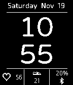{ loading=lazy width="72" } | [Daily Stats](https://apps.repebble.com/5833b4a000355a2f3a0001cf) | [tylerherzog](https://github.com/tylerherzog1/Pebble/blob) | <small>Not checked yet</small> | 2017-04-22 | Simple, efficient, and only the info you need. Designed as a project for my wife and her new Pebble2. Includes: Heart rate, step count, battery %, time… |
| 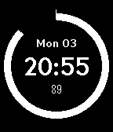{ loading=lazy width="72" } | [DailyRing](https://apps.repebble.com/57afcbd0f01b53329a00037f) | [Maxwell Moseley](https://github.com/maxmoseley23/DailyRing1) | <small>Not checked yet</small> | 2016-10-04 | See a full day pass with DailyRing! A full 24-hour day is expressed as a circle, while the hours, minutes, day of week, and date is expressed digitally… |
| 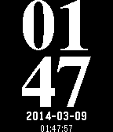{ loading=lazy width="72" } | [Dali Clock](https://apps.rebble.io/en_US/application/531c39d3edcc18d065000167) <small>Rebble App Store</small> | [Joshua Wise](https://github.com/jwise/dalipebble) | <small>Not checked yet</small> | 2014-03-12 | Dali Clock displays a digital clock; when a digit changes, it "melts" into its new shape. Bring a dose of surrealism to your wrist with this port of jwz's… |
| 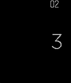{ loading=lazy width="72" } | [Dani](https://apps.rebble.io/en_US/application/55543f0864e9b738860000eb) <small>Rebble App Store</small> | [leovander](https://github.com/leovander/Dani/tree/master) | <small>Not checked yet</small> | 2015-06-05 | - Added Config screen - Option to invert background and text (Will be adding color options for Time) - Option for larger text Suggestions? @theleovander… |
| { loading=lazy width="72" } | [Dansk Tekst](https://apps.rebble.io/en_US/application/52d63495f19630cbfb000005) <small>Rebble App Store</small> | [Sune Trudslev](https://github.com/trudslev/DanskTekst) | <small>Not checked yet</small> | 2015-05-20 | This is a watchface that uses natural danish language to display the time, using animation to change every minute, highlighting the hour. |
| { loading=lazy width="72" } | [Dark Side](https://apps.repebble.com/9c5f123a606348c3aaa2932a) | [Comfortably Numb](https://github.com/ygalanter/dark-side-pebble) | <small>Not checked yet</small> | 2026-07-05 | Digital time in form of familiar prism spectrum. Configurable colors for time, date, day of the week, and activity icon (set to black to hide). Colorful… |
| 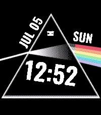{ loading=lazy width="72" } | [Dark Side](https://apps.rebble.io/en_US/application/6a4a959950bd2500099e2964) <small>Rebble App Store</small> | [Comfortably Numb](https://github.com/ygalanter/dark-side-pebble) | <small>Not checked yet</small> | 2026-07-05 | Digital time in form of familiar prism spectrum. Configurable colors for time, date, day of the week, and activity icon (set to black to hide). Colorful… |
| 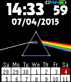{ loading=lazy width="72" } | [Dark Side of the Moon](https://apps.rebble.io/en_US/application/5313ed8043d960887200050c) <small>Rebble App Store</small> | [Gretchycat](https://github.com/gretchycat/DarkSide) | <small>Not checked yet</small> | 2015-10-19 | Features a 2 week calendar, and when you shake or tap, see a 5 day weather forecast. Tap again for sunrise, sunset and moon phase. Tap a third time for a… |
| 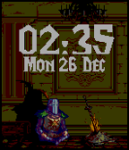{ loading=lazy width="72" } | [Dark Souls Animated](https://apps.rebble.io/en_US/application/586071965de8509ab5000011) <small>Rebble App Store</small> | [InQ](http://pastebin.com/29Ucwkav) | <small>See source</small> | 2016-12-26 | I love Dark Souls pixel art GIFs, so I found cool to create watchface from it. I´m not owner of the GIF and font. All credits to: Eliot Truelove - font… |
| 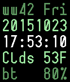{ loading=lazy width="72" } | [DataFace](https://apps.rebble.io/en_US/application/562bf028e1455333640000c4) <small>Rebble App Store</small> | [Mike Hix](http://github.com/musl/DataFace) | <small>No licence</small> | 2016-12-05 | A terse, no-foolin', nerdy watchface for utilitarian types. You'll need to plug in your OpenWeatherMap AppID after you install this. New in v0.8: Bug fixes… |
| 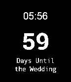{ loading=lazy width="72" } | [Date Countdown](https://apps.rebble.io/en_US/application/52b3ec30f60b55482b00000c) <small>Rebble App Store</small> | [mcongrove](https://github.com/mcongrove/PebbleDateCountdown) | <small>Not checked yet</small> | 2014-01-19 | A Pebble watch app for counting down the number of days until an event. Colors can be inverted and the event date, time, and label can be set by accessing… |
| 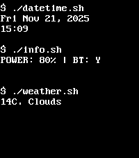{ loading=lazy width="72" } | [datetime.sh](https://apps.repebble.com/581dfbb39cbbaf50a50001c5) | [Tsuharesu](https://github.com/tsuharesu/codespaces-pebble/tree/main/datetime-sh) | <small>Not checked yet</small> | 2025-11-21 | datetime.sh is a sleek, terminal-inspired watchface that brings retro command-line aesthetics to your Pebble smartwatch. Display real-time date, time, and… |
| 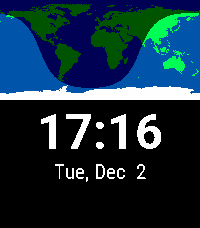{ loading=lazy width="72" } | [Day and Night Earth Watchface](https://apps.repebble.com/530bd23d3add7beccc0001e3) | [Ren Gianforte](https://github.com/rengianforte/pebble-day-night) | <small>Not checked yet</small> | 2026-06-10 | This watchface shows a world map with the current sunlight coverage, along with the time and date. Watch daylight pass across the earth as the day goes by… |
| { loading=lazy width="72" } | [Day&Night](https://apps.rebble.io/en_US/application/567df476c247f817dd0003b9) <small>Rebble App Store</small> | [Zeaga](https://github.com/zeaga/day-night) | <small>Not checked yet</small> | 2015-12-26 | A simple digital watchface made for practice. Changes color based on time or day! |
| 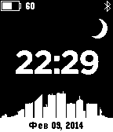{ loading=lazy width="72" } | [Day/Night City](https://apps.rebble.io/en_US/application/52f7e1067847556b4c0004dd) <small>Rebble App Store</small> | [Dexif](https://github.com/dexif/DayNightCity) | <small>Not checked yet</small> | 2014-02-10 | At 6 am/pm starts Day/Night mode. |
| 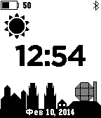{ loading=lazy width="72" } | [Day/Night Minsk](https://apps.rebble.io/en_US/application/52f7fd2a14e54a5df20005a6) <small>Rebble App Store</small> | [Dexif](https://github.com/dexif/DayNightCity) | <small>Not checked yet</small> | 2014-02-10 | At 6 am/pm starts Day/Night Minsk mode. |
| 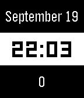{ loading=lazy width="72" } | [DayDateSteps](https://apps.rebble.io/en_US/application/59c177830dfc32dd14001de1) <small>Rebble App Store</small> | [Furfx](https://pastebin.com/k21wFaGp) | <small>Not checked yet</small> | 2017-09-19 | Simple watchface made as a programming test. Shows the current date and steps. |
| 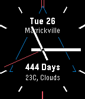{ loading=lazy width="72" } | [DayFace](https://apps.repebble.com/56a008b742c3a13be8000065) | [willwoz](https://github.com/willwoz/DayFace) | <small>Not checked yet</small> | 2016-10-09 | Simple, clean watch face that now has hands and digits, and counts days up or down, for anyone who needs to count days up or down. Configurable battery and… |
| { loading=lazy width="72" } | [Daylight](https://apps.rebble.io/en_US/application/52cdd4a72797163d1a000001) <small>Rebble App Store</small> | [mcongrove](https://github.com/mcongrove/PebbleDaylight) | <small>Not checked yet</small> | 2014-01-19 | A Pebble watch face that shows the daylight as it streaks across the globe. Land masses can be shown or hidden by accessing the settings in the Pebble… |
| 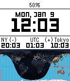{ loading=lazy width="72" } | [DayNight Timezones 2](https://apps.rebble.io/en_US/application/587352f85de8506635000363) <small>Rebble App Store</small> | [chops](https://github.com/mereed/pebbleface-dntz) | <small>Not checked yet</small> | 2017-01-09 | Here the code to calculate day/night on the map was written by David Gianforte, then modified and shared by 'Ben’, then by me. I've modified the design and… |
| 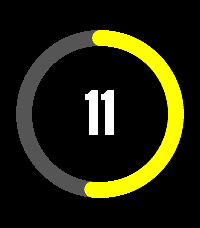{ loading=lazy width="72" } | [Dayring](https://apps.repebble.com/67c32b1fb7a02300092ba059) | [Chris Lewis](https://github.com/C-D-Lewis/pebble-dev) | <small>No licence</small> | 2025-12-28 | Port of the Fitbit watchface of the same name, showing a colorful ring of minutes through the hour in two colors, one for day and another for night. The… |
| 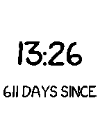{ loading=lazy width="72" } | [days since / til](https://apps.rebble.io/en_US/application/58c3fb980dfc32a52a000893) <small>Rebble App Store</small> | [ChristianD](https://github.com/laDanz/days-since-til) | <small>Not checked yet</small> | 2017-03-16 | Showing the time, and the days since your personal special date and the days til your next anniversary. If date provided in settings is not in the future… |
| { loading=lazy width="72" } | [DayWidget](https://apps.rebble.io/en_US/application/5459d6dbc3428c790100000f) <small>Rebble App Store</small> | [RichardGG](https://github.com/RichardGG/DayWidget2) | <small>Not checked yet</small> | 2014-11-05 | A simple widget displaying the day, date and month. Handy if you use watchfaces without the date. |
| 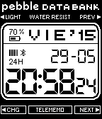{ loading=lazy width="72" } | [DB 31](https://apps.repebble.com/540888f892ecf49ebe000106) | [Pedro](http://www.github.com/pjexposito/DB31) | <small>No licence</small> | 2016-11-07 | Watchface based on Casio Data Bank 31. All the watchface code (almost everything) is taken from 91 Dub watchface (maybe the best watchface on Pebble Store)… |
| 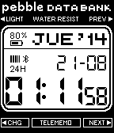{ loading=lazy width="72" } | [DB 31 (español)](https://apps.rebble.io/en_US/application/53f52c9e5586fb3a4d00002f) <small>Rebble App Store</small> | [Pedro](https://github.com/pjexposito/DB31-original) | <small>Not checked yet</small> | 2014-08-20 | Versión desactualizada. Se recomienda usar la versión DB 31 normal. Esta versión no tiene soporte y ha perdido funcionalidad. Esta nueva versión permite… |
| 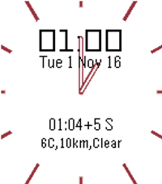{ loading=lazy width="72" } | [DB Pendel Bahn](https://apps.rebble.io/en_US/application/5817e11621032e184e000017) <small>Rebble App Store</small> | [Wiegand](https://github.com/moerunner/DBPendelBahn) | <small>Not checked yet</small> | 2017-12-15 | public transportation watchface for germany / europe. webscraper for deutsche bahn website. Das Watchface überwacht eine Bahnverbindung inklusive Verspätung… |
| { loading=lazy width="72" } | [DBZ Power Level Tracker](https://apps.repebble.com/d5e9e846043c48b7b4d14367) | [Julien1138](https://github.com/Julien1138/dbz-power-level-tracker) | <small>No licence</small> | 2026-05-08 | # DBZ Power Level Tracker A Dragon Ball Z-themed Pebble watchface that tracks your daily step count as a power level. Reach 7,000 steps and watch Goku… |
| 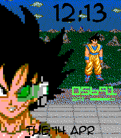{ loading=lazy width="72" } | [DBZ Power Level Tracker](https://apps.rebble.io/en_US/application/69e88f9a9121be000947c7c6) <small>Rebble App Store</small> | [Julien1138](https://github.com/Julien1138/dbz-power-level-tracker) | <small>No licence</small> | 2026-04-22 | A Dragon Ball Z-themed Pebble watchface that tracks your daily step count as a power level. Reach 7,000 steps and watch Goku transform into a Super Saiyan. |
| { loading=lazy width="72" } | [Deadpül](https://apps.repebble.com/5689593664bdb848c500000f) | [CMorooney](https://github.com/CMorooney/deadpool_pebble) | <small>No licence</small> | 2016-06-20 | watchface to celebrate your love for deadpool |
| 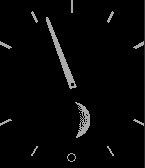{ loading=lazy width="72" } | [Decelerate - Northern Hemisphere](https://apps.repebble.com/555d8cbdc6ea7e6d780000a1) | [Oliver Merkel](https://github.com/OMerkel/pebble-samples) | <small>Not checked yet</small> | 2016-03-26 | Decelerate your day with a less stressful time display. Exact time is shown by analog hour hand only. Additional feature is the display of the current Moon… |
| 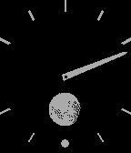{ loading=lazy width="72" } | [Decelerate - Southern Hemisphere](https://apps.repebble.com/5573b7db788211edc60000c2) | [Oliver Merkel](https://github.com/OMerkel/pebble-samples) | <small>Not checked yet</small> | 2016-03-26 | Decelerate your day with a less stressful time display. Exact time is shown by analog hour hand only. Additional feature is the display of the current Moon… |
| 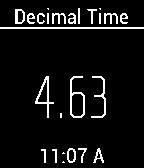{ loading=lazy width="72" } | [Decimal.Time](https://apps.rebble.io/en_US/application/54a2d4325c486f01df0000f0) <small>Rebble App Store</small> | [jpdesigns](https://github.com/dewguzzler/Decimal.time) | <small>Not checked yet</small> | 2014-12-30 | Used during the French Revolution, Decimal time has 10 hours in a day, 100 minutes in an hour, and 100 seconds per minute. Since decimal time has no… |
| 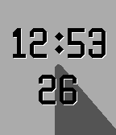{ loading=lazy width="72" } | [Decor](https://apps.repebble.com/559fa334f6ecd1b150000014) | [Roboticon](https://github.com/tujensen/roboticon-watchface) | <small>Not checked yet</small> | 2016-07-14 | Decor is simple. Shows what range the seconds are in with a different color, cycles between colors and has a custom font. |
| 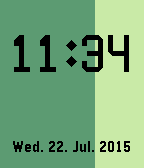{ loading=lazy width="72" } | [Decor Minutes](https://apps.rebble.io/en_US/application/55af6541f5227466c100004f) <small>Rebble App Store</small> | [Roboticon](https://github.com/tujensen/decor_minutes) | <small>Not checked yet</small> | 2015-07-22 | Simple watchface displaying time as minutes and hours and seconds as an expanding rectangle. |
| 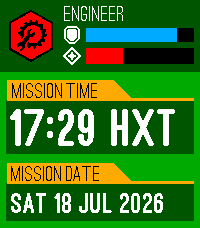{ loading=lazy width="72" } | [Deep Rock](https://apps.repebble.com/67def87c122b40000904b4f0) | [Chris Lewis](https://github.com/C-D-Lewis/pebble-dev) | <small>No licence</small> | 2026-07-18 | Listen up, miners! Management has seen fit to outfit you with the latest device from R&D - a wrist-mounted display. Apparently the standard mission timer… |
| 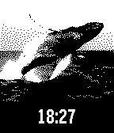{ loading=lazy width="72" } | [Defaced](https://apps.rebble.io/en_US/application/54558ae17871923078000014) <small>Rebble App Store</small> | [Ben Hudson](https://github.com/ben-hudson/defaced) | <small>Not checked yet</small> | 2014-11-22 | An infinitely customizable watchface. |
| { loading=lazy width="72" } | [Default Watchface RU](https://apps.rebble.io/en_US/application/531f27654d23447f150001ef) <small>Rebble App Store</small> | [bafoed](http://www.bafoed.net/post/36194/) | <small>See source</small> | 2014-03-11 | Default pebble watchface with russian language. |
| 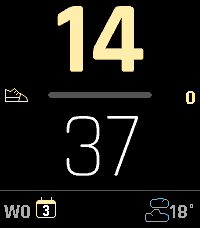{ loading=lazy width="72" } | [Demi](https://apps.repebble.com/6d8da4ce71164976855a854e) | [mrTrueBeliever](https://github.com/mrtruebeliever/pebble-demi) | <small>Not checked yet</small> | 2026-08-13 | A vector watchface that tracks whatever matters to you. Bold vector digits with progress bars for steps, daylight, battery or your own JSON stat - plus… |
| 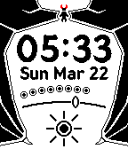{ loading=lazy width="72" } | [Demonic Descent](https://apps.repebble.com/6829ee069844c10008ad576c) | [Harrison Allen](https://github.com/HarrisonAllen/angels-and-demons) | <small>No licence</small> | 2025-05-18 | Become enveloped by your inner demon with Demonic Descent, with the following features: * Time * Date * Weather * Temperature * Shown as a range from very… |
| 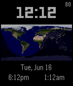{ loading=lazy width="72" } | [DEVELOPERS ONLY - Day Night Map Color](https://apps.rebble.io/en_US/application/55804cecda869326a200003b) <small>Rebble App Store</small> | [Ben](https://github.com/pebbleben/PebbleWorldClockv2) | <small>Not checked yet</small> | 2015-06-16 | Welcome, this watchface is ONLY for developers as anyone else will be frustrated that you cannot change the time zones. If you follow this link you can… |
| 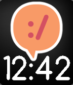{ loading=lazy width="72" } | [devRant unofficial](https://apps.repebble.com/5772d71fba2fe566a10003e2) | [Olpe](https://github.com/olpeh/pebble-devrant-watchface) | <small>Not checked yet</small> | 2016-06-28 | devRant unofficial watchface |
| 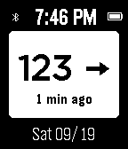{ loading=lazy width="72" } | [Dexcom Share CGM](https://apps.rebble.io/en_US/application/5f682eb451c0ff2d3f0f28d8) <small>Rebble App Store</small> | [swansswansswansswanssosoft](https://github.com/pauleeeeee/pebble-dexcom-share-cgm) | <small>Not checked yet</small> | 2021-12-10 | Updated Dexcom Share CGM watch face for the Pebble smart watch. Replaces Simple CGM which broke in September of 2020. This is a watch face that people with… |
| 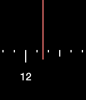{ loading=lazy width="72" } | [Dial](https://apps.rebble.io/en_US/application/56512a8ba69d971f08000038) <small>Rebble App Store</small> | [Priyesh Patel](https://github.com/ItsPriyesh/Dial) | <small>No licence</small> | 2015-12-05 | A watchface. Shake to show the date. |
| 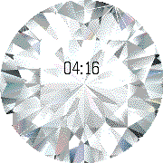{ loading=lazy width="72" } | [Diamond](https://apps.rebble.io/en_US/application/56931746a45b56940a000017) <small>Rebble App Store</small> | [Bani](https://github.com/bani/pebble-diamond) | <small>Not checked yet</small> | 2016-02-14 | It's time for smart jewellery. They say diamonds are a girl's best friend, so now you can carry around this huge virtual diamond. Your Pebble Time Round… |
| 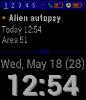{ loading=lazy width="72" } | [Diary Face 2.0](https://apps.rebble.io/en_US/application/52e79fe4f6e72005f7000016) <small>Rebble App Store</small> | [James Fowler](https://github.com/JamesFowler42/diaryface20) | <small>No licence</small> | 2015-06-20 | Smartwatch Pro animated calendar watchface. Relative dates on events. 12/24 hr. Speeds up when you are moving, slows down to save battery when you are not… |
| 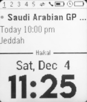{ loading=lazy width="72" } | [Diary Face 3.0](https://apps.rebble.io/en_US/application/61ab915a535326000935a5c3) <small>Rebble App Store</small> | [Haikal Fouzi](https://github.com/haikalfouzi/diaryface20) | <small>Not checked yet</small> | 2021-12-04 | Interactive watchface for busy people! - Animated calendar cycles up to 5 recent event. - Switch between 12 or 24 hour mode. - Battery saving feature: 5s… |
| 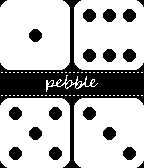{ loading=lazy width="72" } | [Dices](https://apps.rebble.io/en_US/application/5a12eafb0dfc321c12000c40) <small>Rebble App Store</small> | [Valts](https://github.com/ZarsBranchkin/pebble-dices) | <small>Not checked yet</small> | 2017-11-20 | Simple and clean dice watchface. Currently black and white. |
| { loading=lazy width="72" } | [Dickbutt](https://apps.rebble.io/en_US/application/54789b6d6e0cd3c92300007f) <small>Rebble App Store</small> | [snare](https://github.com/snare/dickbutt) | <small>Not checked yet</small> | 2014-11-28 | It's always dickbutt time |
| 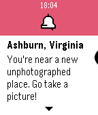{ loading=lazy width="72" } | [Diderot](https://apps.repebble.com/57dc94602a6ea665510000f0) | [Sage Ross](https://github.com/ragesoss/diderot) | <small>Not checked yet</small> | 2016-12-10 | Diderot shows you the nearest unphotographed Wikipedia article to you, along with the distance and direction. You'll also get a notification whenever you're… |
| 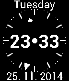{ loading=lazy width="72" } | [Digalog](https://apps.rebble.io/en_US/application/52e019c0dbbbf9fbf4000143) <small>Rebble App Store</small> | [Stopka](https://github.com/Stopka/Digalog) | <small>Not checked yet</small> | 2014-12-10 | Simple and practical watchface showing week day, date and both digital and analog clock. On lost bluetooth connection it shows notification icon and vibes… |
| 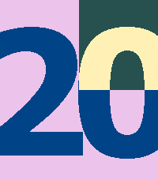{ loading=lazy width="72" } | [Digilog](https://apps.repebble.com/55997be0a3e668a6ea000063) | [Christian Reinbacher](https://github.com/reini1305/digilog) | <small>Not checked yet</small> | 2016-10-24 | Digilog is open source. If you like it, give it a heart and consider a donation (link is at the website linked down below). Simple combination of analog and… |
| 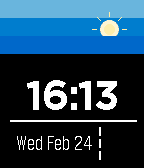{ loading=lazy width="72" } | [DigiMe](https://apps.repebble.com/56f9fa043c131b30f1000029) | [Nikolai Rinas](https://github.com/workinghard/DigiMe) | <small>Not checked yet</small> | 2025-11-25 | Just a simple and fast watch face. Sun and moon will follow you through the day. Temperature is based on current location and http://openweathermap.org… |
| 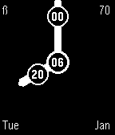{ loading=lazy width="72" } | [Diginalog](https://apps.rebble.io/en_US/application/54ac997c32203e8f5c000016) <small>Rebble App Store</small> | [Comfortably Numb](https://github.com/ygalanter/diginalog_watchface) | <small>Not checked yet</small> | 2015-10-16 | Combination digital and analog watchface. Minute and hour hands bear minute and hour digital values respectfully. Number in the middle is day of the month… |
| 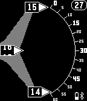{ loading=lazy width="72" } | [DigiRotate](https://apps.rebble.io/en_US/application/551413fd369eea6b910000c5) <small>Rebble App Store</small> | [TomHol](https://github.com/czmanix/DigiRotate) | <small>Not checked yet</small> | 2015-03-31 | Rotating digital watch based on a Reddit request. Original mechanical watch is this: http://imgur.com/gallery/XdjPP7R |
| 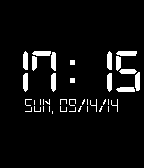{ loading=lazy width="72" } | [Digital Live](https://apps.rebble.io/en_US/application/5415b1c4df02a24e5f00015b) <small>Rebble App Store</small> | [Noah](https://github.com/noah95/DigitalLive) | <small>Not checked yet</small> | 2014-09-14 | A simple, digital, retro and energy saving watchface for your pebble. |
| 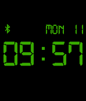{ loading=lazy width="72" } | [Digital Power](https://apps.rebble.io/en_US/application/5547cb2a85905014430000a5) <small>Rebble App Store</small> | [Rob Garth](https://github.com/rgarth/PebbleDigitalPower) | <small>Not checked yet</small> | 2017-11-14 | LCD/Alarm-Clock inspired watch-face. Color can either change depending on battery power (Green/Orange/Red), or it can be configured to any of the 64 colors… |
| 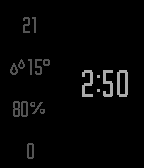{ loading=lazy width="72" } | [Digitalin](https://apps.repebble.com/574008692b7d649524000004) | [Remi Gelinas](https://github.com/remi-gelinas/digitalin) | <small>Not checked yet</small> | 2016-05-21 | Digitalin is a heavily modified custom version of the stunningly elegant watchface Minimalin. Please report any issues through the Github repository issue… |
| { loading=lazy width="72" } | [Digitaltekst](https://apps.rebble.io/en_US/application/52e12757fae0b7603000023c) <small>Rebble App Store</small> | [brujoand](http://github.com/brujoand/digitaltekst.git) | <small>No licence</small> | 2014-01-23 | A simple wathcface in norwegian that shows digital time in text. Go figure.. |
| 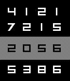{ loading=lazy width="72" } | [Digits](https://apps.rebble.io/en_US/application/54ece483b5dab688970000b8) <small>Rebble App Store</small> | [Ugo Raffaele Piemontese](https://github.com/UgoRaffaele/Digits-pebble) | <small>Not checked yet</small> | 2015-02-24 | Vaguely inspired by Pebble Time new watchfaces. The hour is highlighted by a simple, grey background, while white digits all around are randomly displayed… |
| 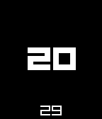{ loading=lazy width="72" } | [digitZ](https://apps.rebble.io/en_US/application/54a90952ae94cff8c600003f) <small>Rebble App Store</small> | [Ben Nguyen](https://github.com/zecoj/digitZ) | <small>Not checked yet</small> | 2015-01-06 | An improved clone of the famous DIGITTMM (by Albert Salamon) Improvements: - Much better memory usage (I have redrawn & created ttf from scratch) - Shake to… |
| { loading=lazy width="72" } | [Digivice Watchface](https://apps.rebble.io/en_US/application/6a9ac7065266090009437eac) <small>Rebble App Store</small> | [crims0n](https://github.com/crims0n/digivice-watchface) | <small>Not checked yet</small> | 2026-09-04 | A clean, retro watchface inspired by the classic Digimon Digivice virtual pet! Features: • Classic pixel-styled digital clock with persistent AM / PM… |
| { loading=lazy width="72" } | [Dimension](https://apps.repebble.com/5504e0338d3907b61e00004e) | [Rich Infante](https://github.com/richinfante/dimension-watchface) | <small>Not checked yet</small> | 2025-02-18 | A simple watchface that displays the current time, in block letters. It updates the screen once a minute to save battery. It includes a configuration screen… |
| { loading=lazy width="72" } | [Din clean](https://apps.repebble.com/63555cd1b9710000096ea5f8) | [Christophe Jeannette](https://github.com/Sichroteph/Din-Clean) | <small>Not checked yet</small> | 2026-03-05 | A clean and elegant watchface for Pebble watches, designed for instant access to essential information with focus on readability and simplicity. Key… |
| { loading=lazy width="72" } | [disclock - Discordian Clock](https://apps.rebble.io/en_US/application/5530e1e17add4311280000c3) <small>Rebble App Store</small> | [plan44.ch](https://github.com/plan44/disclock_pebble) | <small>Not checked yet</small> | 2015-10-24 | Pentagonal clock with discordian calendar display, including the 11 official holydays + Towel Day Each Weekday not only has its own flavour, but also its… |
| { loading=lazy width="72" } | [Disco](https://apps.rebble.io/en_US/application/56b175d810121e0f58000003) <small>Rebble App Store</small> | [Kelby](https://github.com/tripleplay369/pebble-disco) | <small>Not checked yet</small> | 2016-02-03 | Hybrid digital/analog watchface designed specifically for the Pebble Time Round. Let the beautiful patterns of rand() take you to another dimension. |
| { loading=lazy width="72" } | [Discs](https://apps.rebble.io/en_US/application/52ae012503ad7a131b000016) <small>Rebble App Store</small> | [Jon Eisen](https://github.com/yanatan16/pebble-discs) | <small>Not checked yet</small> | 2014-05-12 | Minimalist analog watchface using discs. |
| { loading=lazy width="72" } | [Disintegration](https://apps.rebble.io/en_US/application/636f0be6fdf3e30009f6394b) <small>Rebble App Store</small> | [John Spahr](https://github.com/johnspahr/pebbletemplate) | <small>Not checked yet</small> | 2022-11-12 | Simple face based on the classic Disintegration album cover by The Cure. |
| { loading=lazy width="72" } | [Divergence;Clock](https://apps.rebble.io/en_US/application/5570e025fbe056218a000060) <small>Rebble App Store</small> | [Spencer Johnson](https://Masamune_Shadow@bitbucket.org/Masamune_Shadow/steinsgatewatchface.git) | <small>See source</small> | 2015-06-09 | An evolution of my Sideways Watchface for 2.x, but this time Inspired by Steins;Gate & Nixie Clocks. |
| { loading=lazy width="72" } | [Dizzy](https://apps.rebble.io/en_US/application/54ba785a05d4eef95600003e) <small>Rebble App Store</small> | [Alex Hedley](https://github.com/AlexHedley/pebblewatchface_dizzy) | <small>No licence</small> | 2015-01-17 | Dizzy is a member of the Yolkfolk created by the Oliver Twins |
| { loading=lazy width="72" } | [DJ Khaled](https://apps.rebble.io/en_US/application/5674703f1caa146c2e000060) <small>Rebble App Store</small> | [VideahGams](https://github.com/VideahGams/khaled-watch) | <small>Not checked yet</small> | 2015-12-18 | You smart. You loyal. Make your pebble a real smartwatch, by having the living meme himself on your wrist. |
| { loading=lazy width="72" } | [DobbsHead](https://apps.repebble.com/52eea1c515f7074e50000002) | [lesliesbird](https://github.com/lesliesbird/DobbsHead) | <small>Not checked yet</small> | 2016-11-29 | Remind yourself that it's time for some Slack when you look down to see the smiling face of J.R. "Bob" Dobbs! As you watch, random images will flash on the… |
| { loading=lazy width="72" } | [Doge](https://apps.rebble.io/en_US/application/52e4302a34ba660014000b9b) <small>Rebble App Store</small> | [Dylan Bourgeois](https://github.com/dtsbourg/Doge/tree/master) | <small>Not checked yet</small> | 2014-01-26 | Wow. Such watch face. Many Pebble. To the moon ! |
| { loading=lazy width="72" } | [Dogecoin](https://apps.rebble.io/en_US/application/530ec5272cd693ed9900012c) <small>Rebble App Store</small> | [LegitimateSounding](https://github.com/JerrySievert/dogeface) | MIT | 2014-02-27 | A friendly view of Doge, including time and the current price in Satoshi's. Please note, this watchface relies on the cryptsy API, which is frequently… |
| { loading=lazy width="72" } | [DOGEFACE](https://apps.rebble.io/en_US/application/5585dd229210596ce1000037) <small>Rebble App Store</small> | [Tristan Brookes](https://github.com/tristyb/PebbleDoge) | <small>Not checked yet</small> | 2015-06-23 | A Doge watch face with a simple Doge vector and Comic Sans clock. Changes background colour every minute to a random selection from a choice of 3 colours. |
| { loading=lazy width="72" } | [DogeWatch](https://apps.rebble.io/en_US/application/5341ae4a57123caf29000411) <small>Rebble App Store</small> | [iHardtDev](https://github.com/tylerl0706/DogeWatch) | <small>Not checked yet</small> | 2014-04-12 | Wow. Such watch. Very time. Displays: Time, Day of the Week, Date, battery level and a whole lot of Doge! |
| { loading=lazy width="72" } | [Don't Panic](https://apps.rebble.io/en_US/application/69e53a0ea2a9200009a93c03) <small>Rebble App Store</small> | [Chris Lewis](https://github.com/C-D-Lewis/pebble-dev) | <small>No licence</small> | 2026-04-22 | If you don't always know were your towel is, at least you can have this gentle reminder that in hitchhiking, the number one rule is DON'T PANIC. And also… |
| { loading=lazy width="72" } | [dont-panic](https://apps.repebble.com/6814ecea39c746298a549282) | [Chris Lewis](https://github.com/C-D-Lewis/pebble-dev) | <small>No licence</small> | 2026-04-22 | If you don't always know were your towel is, at least you can have this gentle reminder that in hitchhiking, the number one rule is DON'T PANIC. And also… |
| { loading=lazy width="72" } | [DOOM 2](https://apps.rebble.io/en_US/application/5608a39ebcd03b90b2000018) <small>Rebble App Store</small> | [GeekyPanda](https://github.com/PJayB/PebbleDoom2/) | <small>Not checked yet</small> | 2015-10-26 | DOOM 2 watchface with battery indicator and bluetooth connection status light. Every minute, Doomguy will blow the zombie away. Tap your Pebble to fire… |
| { loading=lazy width="72" } | [Doom Guy](https://apps.repebble.com/573dbd6d0d6148012f00000b) | [Matteo Piccina](https://github.com/realguarroman/doomguy) | <small>Not checked yet</small> | 2016-11-09 | At last! Doomguy goes with you on your wrist! You can choose from two behaviors: - Doomguy health decreases as your Pebble's battery runs out - Doomguy… |
| { loading=lazy width="72" } | [Doom Iris](https://apps.repebble.com/ecd9036b7d7d465fb9c6c701) | [Ambient Time](https://github.com/lukeslp/pebble-doom-iris) | <small>Not checked yet</small> | 2026-10-05 | A DOOM IRIS that opens over 24 hours, with which to INTIMIDATE YOUR ENEMIES |
| { loading=lazy width="72" } | [DOS Terminal Watchface](https://apps.repebble.com/552b7f4978b9ce9bb40000db) | [Alexey Cluster](https://github.com/ClusterM/pebble-dos) | <small>No licence</small> | 2016-09-26 | Simple DOS command line style watchface. Just like "CMD TIME" by Chris Lewis but with "terminal" font. |
| { loading=lazy width="72" } | [DOS VGA](https://apps.repebble.com/c4baaf223a4542c5b985d048) | [Creative Manaks](https://github.com/manaksu/DOS-VGA) | <small>Not checked yet</small> | 2026-05-30 | DOS-RPG Your wrist just rolled a NAT 20 on style. Forget clean. Forget minimal. This is your health data rendered in the glow of a CRT monitor, parsed… |
| { loading=lazy width="72" } | [DOS Watchface](https://apps.rebble.io/en_US/application/554eb7485feb9d37f30000ab) <small>Rebble App Store</small> | [raindrop](http://github.com/dallinac/pebbletutorial) | <small>No licence</small> | 2015-05-10 | A simple DOS watchface (Made from the Pebble C SDK tutorial). More coming soon! |
| { loading=lazy width="72" } | [Dot](https://apps.repebble.com/09ceb96d8a6f4d13a84ce1e8) | [sjmerel](https://github.com/sjmerel/dot) | <small>Not checked yet</small> | 2025-12-08 | Analog watchface, with... dots. |
| { loading=lazy width="72" } | [Dot Face Weather](https://apps.repebble.com/b08b5aae67e44880a3685e3d) | [zefuru](https://github.com/fumi6625/dotface-Orange) | <small>Not checked yet</small> | 2026-08-02 | Dot Face Weather When you launch the app, dots flow in from the left. We’ve released a major update. Just give your wrist a light shake, and the layout will… |
| { loading=lazy width="72" } | [Dot Matrix Watchface #1](https://apps.rebble.io/en_US/application/53ffea0fc7bdc02853000057) <small>Rebble App Store</small> | [Darren Embry](https://github.com/dse/watchface-dot-matrix-1) | <small>Not checked yet</small> | 2014-09-14 | A nice, calm, serene dot matrix watchface that displays all the information you need (date and time) without all the fuss. This is one of the watchfaces… |
| { loading=lazy width="72" } | [Dot Matrix Watchface #2](https://apps.rebble.io/en_US/application/5415d01196fc8005b200018d) <small>Rebble App Store</small> | [Darren Embry](https://github.com/dse/watchface-dot-matrix-2) | <small>Not checked yet</small> | 2014-11-02 | A different take on my Dot Matrix Watchface concept. Date and battery level are always visible but tiny. You can switch to a larger clock font with a cool… |
| { loading=lazy width="72" } | [Dotface](https://apps.rebble.io/en_US/application/55578d41809acd6f1a000008) <small>Rebble App Store</small> | [MagmaStone](http://github.com/magmastonealex/dotface) | Apache-2.0 | 2015-05-16 | A minimalist face with just an hour dot and solid minute hand. Highly configurable, including hour markings, a face circle, and inversion. Designed by… |
| { loading=lazy width="72" } | [DotLine](https://apps.repebble.com/4f27b20d89244f2d8f0ca9d5) | [Davide Dell'Erba](https://github.com/delda/pebble-picto) | <small>Not checked yet</small> | 2026-10-02 | It is a watch with a dot and a line: the dot indicates the hours and the line the minutes. Nothing could be simpler, nothing could be more functional! |
| { loading=lazy width="72" } | [Dots](https://apps.repebble.com/f02345b95a5440cd9bc253df) | [Baldur Thor](https://github.com/BaldurThor/pebble-dots) | <small>No licence</small> | 2026-06-23 | A simple watchface based on dots. Shows time and date, with month and day name. Has a battery indicator, and a bt disconnect and quiet time indicator (the… |
| { loading=lazy width="72" } | [Dots](https://apps.rebble.io/en_US/application/62479f8931bc3600098fec28) <small>Rebble App Store</small> | [Nikki](https://github.com/not-phoeniix/dots) | <small>Not checked yet</small> | 2022-09-15 | A watchface with dots! Features: Customizable colors, variable number of dots, and an optional pride flag! |
| { loading=lazy width="72" } | [dots n squares](https://apps.rebble.io/en_US/application/54d802535e8d871a66000025) <small>Rebble App Store</small> | [Ben Nguyen](https://github.com/zecoj/dots-n-squares) | <small>Not checked yet</small> | 2015-04-19 | "Hand-dotted" with love. Features: - Simple and elegant digital display (invertable). - Battery bar! See remaining battery at a glance. - Day of week and… |
| { loading=lazy width="72" } | [dotted watchface](https://apps.repebble.com/5748286daf58e2b00f000003) | [ksbckr](https://github.com/ksbckr/dotted-watchface) | <small>Not checked yet</small> | 2025-11-25 | Just a simple watchface, displaying the current time including seconds. You can change the text and background color in settings. |
| { loading=lazy width="72" } | [Dotty](https://apps.rebble.io/en_US/application/6935e82b0a850b0009acd5c6) <small>Rebble App Store</small> | [V3L](https://github.com/skooda/pebble-dotty-face) | <small>Not checked yet</small> | 2025-12-07 | Minimalistic analog watch face celebrating dots. |
| { loading=lazy width="72" } | [Double Dial](https://apps.repebble.com/685a4c0465207500093d5a83) | [justinjhendrick](https://github.com/justinjhendrick/double_tap_pebble_watchface) | <small>Not checked yet</small> | 2025-06-28 | Cleverly using color to increase readability of the classic analog watch design. The inner (hour) dial has a consistent color which is distinct from the… |
| { loading=lazy width="72" } | [Double Lariat](https://apps.rebble.io/en_US/application/54db89bbc8d2e9448500008e) <small>Rebble App Store</small> | [Joseph Khawly](https://github.com/josephkhawly/DoubleLariatWatchface) | <small>Not checked yet</small> | 2015-05-02 | A watchface inspired by the music video for the song "Double Lariat" by Megurine Luka. |
| { loading=lazy width="72" } | [Doug Fir](https://apps.repebble.com/69a3e2aa7998990009c8fa2a) | [justinjhendrick](https://github.com/justinjhendrick/doug_fir_pebble_watchface) | <small>Not checked yet</small> | 2026-03-06 | Clearly show the time & date. Primarily analog, with digital hints. For color displays, use a different color for hours vs minutes. Avoid overlapping when… |
| { loading=lazy width="72" } | [Doughnut](https://apps.rebble.io/en_US/application/55b4b6b6138347ac64000049) <small>Rebble App Store</small> | [Swapnull](https://github.com/Swapnull/Doughnut) | <small>Not checked yet</small> | 2015-07-26 | A simple watchface with three rings. Seconds is the outer (orange) ring, minutes is the middle (blue) ring and hours is the center (black) ring. The weather… |
| { loading=lazy width="72" } | [Dozenal watch and calendar](https://apps.repebble.com/56bd41f1a4f253c7b600004c) | [Numerist](http://github.com/numerist/dozclockcal) | <small>No licence</small> | 2016-02-22 | This dozenal watch is set up as diurnal, giving the time in the dozenal number base ("base twelve"), dividing the day into successive powers of a dozen. The… |
| { loading=lazy width="72" } | [DQM Gamified Watchface](https://apps.repebble.com/6503faaa81ffd2007375874c) | [Dscheinah](https://github.com/dscheinah/dqm-watchface) | <small>Not checked yet</small> | 2023-12-30 | I recently replayed Dragon Quest Monsters (aka Dragon Warrior Monsters) and decided to need a watchface for this. So here it is. It shows various watch… |
| { loading=lazy width="72" } | [Dr.Pebble](https://apps.rebble.io/en_US/application/68a5c7745cc7670008314341) <small>Rebble App Store</small> | [random360-pebble](https://github.com/random360-pebble/Dr.Pebble) | <small>Not checked yet</small> | 2025-08-20 | A simple watchface with the Dr.pepper logo |
| { loading=lazy width="72" } | [dragon](https://apps.rebble.io/en_US/application/6aa86ba0e3f5410009b75ae7) <small>Rebble App Store</small> | [bart](https://github.com/bartp5/pebble-dragon) | <small>Not checked yet</small> | 2026-09-14 | A watchface for the Pebble Time 2 featuring dragon curves, intricate fractal shapes obtained by iteratively folding the curve. The watchface features: … |
| { loading=lazy width="72" } | [Dragon Attack](https://apps.rebble.io/en_US/application/5899600d6d34e335f300025d) <small>Rebble App Store</small> | [chops](https://github.com/mereed/pebbleface-dragonattack) | <small>Not checked yet</small> | 2017-02-07 | The dragon animates each minute - via settings select how many times it breathes fire - or disable the animation altogether. The small warrior, lower left… |
| { loading=lazy width="72" } | [Dragon Clock Reborn](https://apps.rebble.io/en_US/application/55de2dc8785abd1c3c000075) <small>Rebble App Store</small> | [Tristan Schorn](https://github.com/schornT/watch-dragon) | <small>Not checked yet</small> | 2015-09-08 | The mighty dragon guards its wealth. This is a remake of an old watchface by Bit Hangar. Original artwork and code by Bit Hangar, updated code and artwork… |
| { loading=lazy width="72" } | [Dragon Radar](https://apps.repebble.com/69f5bdbc8fdda50008c81da4) | [EC Apps](https://github.com/eduardochiaro/dragon-radar-watchface) | <small>Not checked yet</small> | 2026-05-02 | A Pebble watchface inspired by Dragon Radar in Dragon Ball. Every minute the radar update showing a random position of the Dragon Balls 2 radar styles… |
| { loading=lazy width="72" } | [Dress Watch](https://apps.rebble.io/en_US/application/55496dbfd6f29a29b2000104) <small>Rebble App Store</small> | [Darren Embry](https://github.com/dse/watchface-dress-watch) | <small>Not checked yet</small> | 2018-03-11 | A clean classic analog watchface. Based on my watchapp, Pilot Watch. |
| { loading=lazy width="72" } | [Drew NS](https://apps.rebble.io/en_US/application/55a702de1f6362b73400008f) <small>Rebble App Store</small> | [testyk8](http://github.com/kdisimone/cgm-pebble) | <small>No licence</small> | 2015-07-16 | drew's personalized NS watchface |
| { loading=lazy width="72" } | [Drift](https://apps.repebble.com/69e29adc4a2e3d0009e2f3e1) | [Algorythm](https://github.com/djeppers/drift_watchface) | <small>Not checked yet</small> | 2026-05-12 | Inspired by Japanese wall clocks where the hands seem to hover above the face, casting soft shadows as they move. No numbers, no markers, no center point … |
| { loading=lazy width="72" } | [Drifting Versatile Digits](https://apps.repebble.com/cec7e9de489b43c1a72e600e) | [Jceggbert5](https://github.com/Jceggbert5/pebble-drifting-versatile-digits) | MIT | 2026-05-12 | Relive that classic bouncing screensaver, now on your wrist! |
| { loading=lazy width="72" } | [Dromo GC](https://apps.repebble.com/695f44b7ca04f20009aed6c2) | [elucis](https://github.com/hnguyen094/pebble-dromo-gc) | <small>Not checked yet</small> | 2026-02-14 | My first watchface inspired by the Autodromo Group C watch. Not affiliated with Autodromo in any way. Big Features: - Current/Forecasted Weather… |
| { loading=lazy width="72" } | [Drop Zone](https://apps.rebble.io/en_US/application/52d8baa3aef8d5b107000026) <small>Rebble App Store</small> | [Pebble](https://github.com/pebble/pebble-sdk-examples/tree/master/watchfaces/drop_zone) | <small>Not checked yet</small> | 2014-01-17 | Drop Zone Example Watchface |
| { loading=lazy width="72" } | [Dual Arc](https://apps.repebble.com/6980f66ae145ac00097cbaa4) | [EC Apps](https://github.com/eduardochiaro/dual-arc) | <small>Not checked yet</small> | 2026-07-21 | A modern digital watchface combining style and functionality. Features include large split time display (hours/minutes), date with weekday, dual… |
| { loading=lazy width="72" } | [Dual Gauge](https://apps.repebble.com/578cb2e31e00a6c4b3000312) | [Chris Lewis](https://github.com/C-D-Lewis/dual-gauge) | <small>No licence</small> | 2016-10-15 | Demo watchface using the Dash API to show Android battery level without a bespoke Android companion app. https://github.com/C-D-Lewis/dash-api |
| { loading=lazy width="72" } | [Dual Time](https://apps.repebble.com/7bd28835304b4ef1b638f44f) | [nyinyiz](https://github.com/nyinyiz/Pebble-watchfaces) | <small>Not checked yet</small> | 2026-08-22 | See two time zones at once. Your local time up top, your chosen city below — separated by a clean glowing line. Hold SELECT to pick from 271 world cities, A… |
| { loading=lazy width="72" } | [Dual Time](https://apps.rebble.io/en_US/application/599935000dfc323e1100108c) <small>Rebble App Store</small> | [Po Cheng](https://github.com/chengpo/dual-time) | <small>Not checked yet</small> | 2017-09-05 | A simple watchface which shows both local time and Chinese time on screen. |
| { loading=lazy width="72" } | [Dual Time Zone](https://apps.rebble.io/en_US/application/5674f44fa817159fc8000094) <small>Rebble App Store</small> | [WA1OUI](https://github.com/DHKaplan/DualTZ/blob/master/DualTZ-V4.3.zip) | <small>No licence</small> | 2016-11-18 | Dual Time Zone shows your local time, temperature and location on top, and a custom time zone on the bottom. All colors are configurable as is a Celsius or… |
| { loading=lazy width="72" } | [DualTime](https://apps.repebble.com/54f70cf69776f4557c000038) | [utopianmonk](https://github.com/utopianmonk/DualTime) | <small>Not checked yet</small> | 2016-10-16 | Fully configurable watch face to show time in two different timezones. Select your secondary clock location from settings. Supports all cities/timezones on… |
| { loading=lazy width="72" } | [DualTZ](https://apps.rebble.io/en_US/application/52997ea6e627ce3e78000023) <small>Rebble App Store</small> | [stibbons](https://github.com/phardy/DualTZ) | <small>Not checked yet</small> | 2025-11-25 | A watchface that shows the local time on the analogue face, and the time in a configurable timezone below. |
| { loading=lazy width="72" } | [Duck Hunt GT](https://apps.repebble.com/55a8091fcf03f5d59e00004e) | [Game Time](https://github.com/WinterWinter/DuckHunt) | <small>Not checked yet</small> | 2016-06-10 | Introducing Duck Hunt GT! Features include -Temperature (requires free API Key from Openweathermap.org) -Weather condition icons -Bluetooth Disconnection… |
| { loading=lazy width="72" } | [Duel Of The Faces](https://apps.repebble.com/ed8f618edf134fa09f356a30) | [Eric Migicovsky](https://github.com/ericmigi/lightsaber-duel) | <small>Not checked yet</small> | 2026-05-08 | A Star Wars-inspired watch face. Luke and Darth Vader 'face' o quote face off every minute or hour, depending on the configured setting. Sound effects match… |
| { loading=lazy width="72" } | [Duke](https://apps.repebble.com/5521f7d1f99b2a0003000095) | [Comfortably Numb](https://github.com/ygalanter/duke) | <small>Not checked yet</small> | 2016-06-09 | A basic watchface demoing EffectLayer (https://github.com/ygalanter/EffectLayer) It doesn't use bitmaps, just a normal text rotated 90° |
| { loading=lazy width="72" } | [dune minimalist](https://apps.repebble.com/1c985b1cf2dc4b35bb153231) | [discountdeadcats](https://github.com/discountdeadcats/Dune-watchface-c) | <small>Not checked yet</small> | 2026-04-16 | DUNE style watch app that shows the time and date as well as battery Percent in the style of a sandworm |
| { loading=lazy width="72" } | [Dunescape](https://apps.repebble.com/e7fce00841fe4486b16e9168) | [wheelybird](https://github.com/wheelybird/dunescape) | <small>Not checked yet</small> | 2026-08-14 | Dunescape — a living desert that follows the real sun and moon. The dunes are lit by the actual sun for your location. One face catches the light and the… |
| { loading=lazy width="72" } | [DuoClock](https://apps.rebble.io/en_US/application/564b5c88933de713f7000076) <small>Rebble App Store</small> | [Stefan Parviainen](https://github.com/pafcu/duoclock) | <small>Not checked yet</small> | 2015-12-29 | Duoclock tells you the time using words, instead of numbers, to help you learn a new language. If you are using Duolingo to learn a new language, you can… |
| { loading=lazy width="72" } | [Dutch Crazy Time](https://apps.rebble.io/en_US/application/56884eb081dd625edf000046) <small>Rebble App Store</small> | [Christine Gerpheide](https://github.com/phoxicle/DutchCrazyTime) | <small>Not checked yet</small> | 2017-03-18 | A watchface displaying the time written out in the craziness that is the Dutch system of telling time. |
| { loading=lazy width="72" } | [Dutch Energy Watchface](https://apps.repebble.com/db9ec6dac81d483cab5d616d) | [dhrme](https://github.com/in-dhr/pebble-apps) | <small>Not checked yet</small> | 2026-06-26 | Updates to watchface |
| { loading=lazy width="72" } | [Dutch Fuzzy Time](https://apps.rebble.io/en_US/application/52b981cd5dfb6ee25200007d) <small>Rebble App Store</small> | [Maik Joosten](http://github.com/MaikJoosten/DutchFuzzyTimeSource) | <small>No licence</small> | 2014-01-18 | For Dutchies who'd like a fuzzy and clean version of the Hoe Laat Is Het? watchface. A 1 pixel line at the bottom of the screen shows the -2, -1, 0, +1 or… |
| { loading=lazy width="72" } | [Dutch time](https://apps.rebble.io/en_US/application/54d36afd3fe5e60e18000072) <small>Rebble App Store</small> | [Tjeerd Hans](https://github.com/tjeerdhans/PebbleDutchTime) | <small>Not checked yet</small> | 2015-03-16 | Shows the approximate time in Dutch. Forked from Dutch Fuzzy Time (https://github.com/MaikJoosten/DutchFuzzyTimeSource) This version uses setpebble.com to… |
| { loading=lazy width="72" } | [DutchWatch](https://apps.rebble.io/en_US/application/55852578e4660aba35000095) <small>Rebble App Store</small> | [Gerald](https://github.com/qanqan/DutchWatch) | <small>Not checked yet</small> | 2015-09-23 | Dit is een Nederlandse implementatie van de text watchface voor Pebble Time. Middels het configuratie scherm kunnen de kleuren van de tekst en achtergrond… |
| { loading=lazy width="72" } | [DuterteCayetano Watchface](https://apps.repebble.com/572cbdbd67e5f5a275000016) | [Roy Besiera](https://github.com/hyp3rs0nik/duterte_cayetano_peeble_watchface) | <small>Not checked yet</small> | 2016-05-06 | A simple watchface that shows the Duterte-Cayetano Logo |
| { loading=lazy width="72" } | [DVD](https://apps.rebble.io/en_US/application/68faada2504cc500097101cf) <small>Rebble App Store</small> | [Ilia Breitburg](https://github.com/breitburg/pebble-dvd) | <small>Not checked yet</small> | 2025-10-23 | A Pebble watchface featuring a bouncing DVD screensaver-style time display with smart power-saving animation. |
| { loading=lazy width="72" } | [DVD Time](https://apps.repebble.com/1a140e697b1741e6ab6dce5f) | [Michael Stewart](https://github.com/mcstew/dvd-time) | <small>Not checked yet</small> | 2026-04-11 | # DVD Time A non-commercial parody / nostalgia watchface. Not affiliated with DVD FLLC. --- The iconic bouncing DVD Video logo, now on your wrist. The time… |
| { loading=lazy width="72" } | [DWD Carbon](https://apps.repebble.com/d2a90024ac7e4010a1b5b949) | [Kai Timmer](https://github.com/kaitimmer/dwd-carbon) | <small>Not checked yet</small> | 2026-09-11 | A fork of Carbon, a weather-focused, highly readable-at-a-glance Pebble watchface for the day ahead. This fork defaults to the DWD (Deutscher Wetterdienst)… |
| { loading=lazy width="72" } | [Dygn](https://apps.repebble.com/3e0e8d5a0a3c4bcfaeeb7b22) | [Carl-Fredrik Arvidson](https://github.com/cfarvidson/pebble-dygn) | <small>Not checked yet</small> | 2026-09-24 | 24-hour watchface with a single hand for Pebble Time 2. One rotation per day: midnight (24) at the top, noon (12) at the bottom. Black dial, white numerals… |
| { loading=lazy width="72" } | [Dymaxion](https://apps.repebble.com/6d7f75de20c3406198a5abd6) | [Segfaultgolf](https://github.com/huntrontrakkr/dymaxion-watch-face) | <small>Not checked yet</small> | 2026-10-04 | A watch face built on Buckminster Fuller's Dymaxion map, which unfolds the globe onto the twenty faces of an icosahedron without splitting a continent… |
| { loading=lazy width="72" } | [dz7044](https://apps.repebble.com/38662d10954f4a4798ee5288) | [St_Vitalique](https://github.com/stepanovitaliy/MatrixDisplay) | <small>Not checked yet</small> | 2026-08-16 | Многоклеточный дисплей удобный и красивый, большие часы и дата, секунды, День недели. Похож на те самые дизели. Енджой Теперь если потрясти - лого сменится… |
| { loading=lazy width="72" } | [dzwatch](https://apps.repebble.com/57d5928effca4965f400027f) | [Safi](https://github.com/apotox/dzwatch) | <small>Not checked yet</small> | 2016-09-11 | Dzwatch a watchface with Algeria flag background |
